# 第三章. 使用 ImageJ 的高级图像处理

上一章向您展示了如何在 ImageJ 中加载和查看图像，以及如何对图像强度和像素值进行基本修改。本章将讨论预处理图像所使用的技巧。我们将为图像分析和测量做准备。本章将应用我们在前几章中探讨的一些技巧。我们将涵盖以下主题：

+   纠正图像

+   Z 栈处理

+   时间序列处理

+   图像和栈计算

# 纠正图像

为了分析图像，我们有时需要纠正采集过程中出现的问题。例如噪声、不均匀的照明和背景荧光等问题，在图像分析过程中可能会引起许多问题。我将简要介绍这些问题的来源，然后说明如何在 ImageJ 中纠正这些问题。

## 技术背景

在成像中存在的许多噪声来源中，一些可以通过正确的采集设置来纠正。其他噪声则存在于相机的电子和物理特性中，并且难以修复。我将首先处理可以通过优化采集来修复的噪声来源：**随机**或**泊松**噪声。接下来，我们将探讨**电子**或**暗**噪声。

## 纠正随机噪声

随机噪声是由光的物理特性引起的；光可以被看作是光束或光子。每个相机光电探测器的像素收集到的光子数量决定了最终的像素强度。如果在任何时刻只有少数光子击中探测器，光子数量的差异可能会很大。这被称为泊松过程，信噪比可以表示如下：

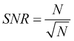

这意味着随着光子数量（N）的增加，**信噪比**（SNR）将增大。通过增加曝光时间或照明强度，每个像素的光子数量和 SNR 将增加。低信噪比不能通过软件处理技术来修复。

## 纠正暗噪声

另一种噪声来源被称为暗噪声或暗电流。这种噪声来源来自相机中的电子元件，可以通过在不照明的情况下拍摄图像来可视化。在数字消费相机中，当镜头完全覆盖时曝光图像可以轻松实现这一点。您甚至可以用手机的相机尝试。只需紧紧覆盖镜头并拍照（确保闪光灯已关闭！）！例如，以下图显示了由两个不同相机拍摄的一小部分图像，它们的设置相同。左侧图像是使用索尼α6000（2014）拍摄的小区域图像，而右侧图像来自佳能 EOS 550D（2010）。橙色条用来区分它们：

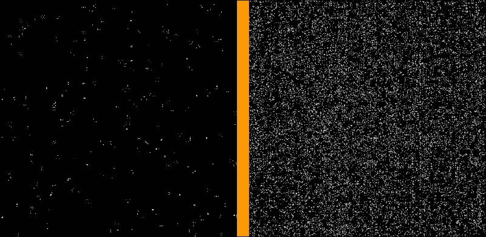

为了显示图案，每个图像的强度都被均衡了，在这个例子中只显示了绿色通道。两个相机的设置如下：1/10 秒曝光，ƒ5.6，ISO 200。从这些图像中可以看出，两个相机传感器之间的电子噪声水平相当不同。请注意，大多数科学相机，尤其是冷却的**EM-CCD**（**电子倍增电荷耦合器件**）相机，电子噪声水平要低得多。这使得一些 EM-CCD 相机能够检测单个光子，甚至计数它们。

为了使暗噪声信号的减法工作，曝光时间需要与获取时的曝光时间相同，以获得相同的暗噪声水平。曝光时间直接与噪声量相关。较长的曝光时间会导致更多的暗噪声。这种噪声可以通过稍后在本章中介绍的图像计算器在 ImageJ 中轻松修复。

为了确定你自己的相机的噪声水平，用镜头盖住相机拍照（确保它完全被所有光线遮挡）。理想情况下，你应该使用你的相机以 RAW 文件格式捕获图像。当相机以 JPEG 文件格式获取图像时，相机已经对图像进行了某些噪声降低处理。如果你只能以 JPEG 格式捕获图像，请检查是否有选项可以关闭噪声降低。现在，打开图像在 ImageJ 中，如前一章所述，并按照以下步骤操作：

1.  通过点击它来选择你的暗光图像窗口，使其处于活动状态。在 ImageJ 中，大多数命令将作用于活动图像或最后打开的图像。通过点击一个图像窗口，该图像就变成了活动图像。

1.  为了确定噪声水平，我们可以选择一个我们想要测量的区域。通过输入特定的值来指定它，我们将创建一个矩形。为此，转到**编辑** | **选择** | **指定…**，然后选中**居中**复选框，输入`512`作为宽度和高度。对于**X 坐标**和**Y 坐标**，输入图像宽度的一半和高度的一半（在图像副标题中指示）并点击**确定**。

1.  确保测量设置为标准差。这可以通过转到**分析** | **设置测量**并选中**标准差**复选框来完成。选择其他测量参数是可以的，在下面的输出中**面积**、**平均灰度值**和**最小和最大灰度值**也被选中。对于这个练习，**标准差**选项是唯一需要的相关参数。

1.  通过按*Ctrl* + *M*或转到**分析** | **测量**来执行测量。你可以在放置区域后立即测量它们，或者你可以在测量之前将它们添加到**ROI 管理器**（下一章将详细介绍）中。

现在的结果应该在新窗口**结果**中可见。根据你选择的参数，此窗口中的结果可能与这里显示的不同（我包括了区域和最小值和最大值）：

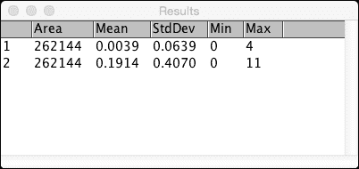

第一行包含α6000 相机的结果，第二行包含 EOS 550D 相机的结果。两个测量的区域相同（*512 x 512 = 262144 像素*），但第一台相机的标准偏差（噪声的度量）比第二台相机低 6.3 倍。此外，第一台相机的平均值更接近 0，正如你所预期的，当没有光线击中传感器时，值应该是这样的。

### 注意

相机可能会有不再工作的像素（**死像素**）。死像素在明亮区域会显示为黑色像素，并且总是出现在相同的位置。相反的情况也可能发生。在暗区域非常明亮的像素被称为**热像素**。热像素不必每次都出现在相同的位置，并且在使用非常长的曝光时间时更为常见。对于 EMCCD 相机，还有一个导致明亮像素的来源，这是由宇宙射线撞击图像传感器造成的。这些事件在长时间序列中相对常见，表现为仅在一帧中非常明亮的区域。去除死像素和热像素的方法与暗噪声去除相同。

对于大多数曝光类型，这些噪声级别非常小，不会导致你的照片质量下降。海滩上的照片，天空中有太阳，不需要校正。由于检测到的光量巨大，电子噪声被完全淹没。然而，在图像采集领域，暗噪声是一个重要因素的是天体摄影或夜间摄影。每当需要长时间曝光进行图像采集时，电子噪声就会成为一个重要因素，可能会降低你的图像质量。

为了减少低光条件下传感器噪声的影响，你需要稍微改变你获取图像的方式：不是单次曝光，而是需要连续多次曝光。一些相机支持这种自动模式，例如手持黄昏模式（索尼）或多帧降噪模式（宾得、奥林巴斯等）。在此模式下，你将快速连续拍摄 2 张或多张照片，最终图像是这些图像的平均值。你还可以在 ImageJ 中使用以下步骤进行类似操作：

1.  打开你连续获取的多张图像（确保没有其他图像打开！）

1.  从菜单中选择**图像** | **堆栈** | **图像堆栈**。现在你将有一个单独的窗口，其中每个切片代表你拍摄的一张图像。

1.  通过从菜单中选择**图像** | **堆栈** | **Z 投影…**来创建降噪图像，并使用平均强度作为投影类型。

需要记住的是：当任何东西在个别曝光之间移动时，这种方法将不会提供良好的结果。它可以纠正简单的位移，但这仅在最简单的情况下有效。

## 不均匀照明 – 背景减法

当在困难的光照条件下获取图像时，有时可能会出现图像传感器上的照明不均匀。这种不均匀照明的效果是可以在 ImageJ 中轻松纠正的。为了展示如何进行这一操作，我们将使用带有**微分干涉对比度**（**DIC**）光学系统的倒置显微镜获取的明场照明图像。

### 注意

DIC 图像通过观察样品厚度的差异来提供对比度。一束光波被分成两束稍微分离但平行且具有相同相位的单独光束。当一束光通过比平行光束密度更高的物体时，波将移出相位。当它们重新组合时，出相位的射线将部分相互抵消（干涉）。这导致相机像素上的光减少，使像素变暗。对于细胞，最强的干涉可以在细胞膜附近找到。一束光将穿过细胞，而平行光束将穿过细胞外的水。

该图像显示了不均匀照明的影响。画框的左侧比中间暗，梯度沿着画框以略微斜向的方向运行。很明显，场域不是向一个方向移动。中间是最亮的，而两个边缘，左侧和右侧，则较暗：

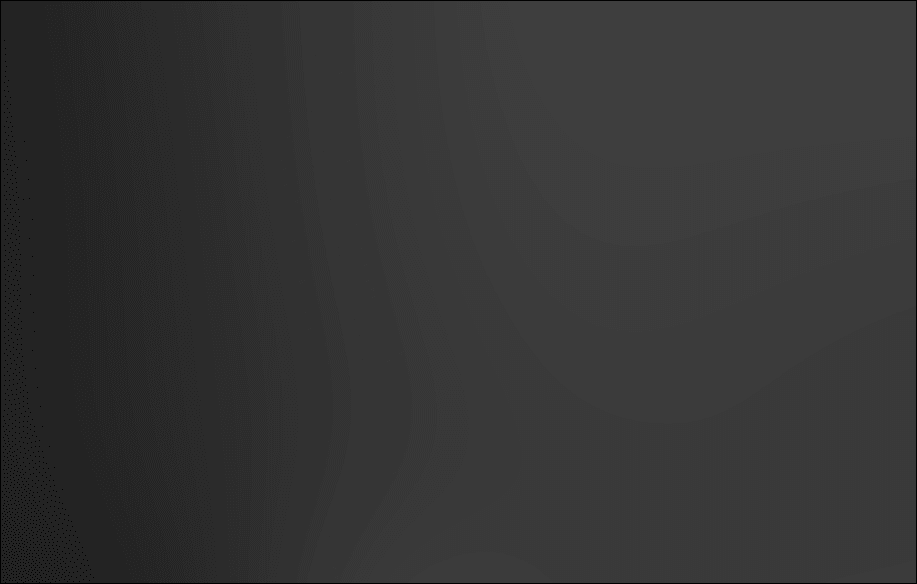

作为第一次尝试，我们将使用背景减法方法来查看这能否解决问题。为此，我们需要进入**处理** | **减去背景…**并使用以下设置：

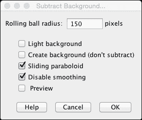

应用背景减法后，图像发生了变化，但背景不均匀的效果仍未得到纠正。实际上，图像的左下角稍微暗一些，而且中间的强度也没有减少很多（参见左侧图像）。请注意，当选择了**光背景**选项（参见右侧图像）时，左右两侧都有强烈的过度补偿。不仅这些侧面的对比度降低了，而且照明现在比校正前更加不均匀：

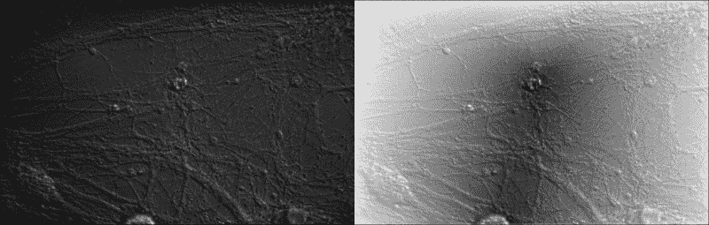

禁用**滑动抛物面**选项也导致了更加不自然和错误的伪影。这种类型背景减法的问题在于它假设背景有一个均匀递减的变化。这意味着背景的变化应该是平滑的，并且从高到低在一个方向上（例如从左到右、对角线等）进行。然而，像这样的 DIC 图像往往有一个更类似于 U 形的背景：边缘高而中间低，或者相反。因此，这种方法不适用于这种类型的图像，需要探索其他方法来解决这个问题。

接下来，我们将尝试使用伪平面场校正法来消除背景。这种方法基于使用高斯滤波器对图像进行过滤，该滤波器会模糊细节。这个过滤器将捕捉到不均匀的照明并将其从帧中的物体中分离出来。这些过滤器如何工作的基础将在下一章中更详细地讨论。让我们创建一个背景图像，我们将用它来校正不均匀的照明。你需要执行以下步骤：

1.  首先，我们想要复制图像，以便保留原始图像用于减法。为此，我们将转到**图像** | **复制…**或使用*Ctrl* + *Shift* + *D*，并将复制的图像命名为`background`。

1.  要创建高斯低通滤波器，我们将选择背景图像并转到**处理 | 滤镜 | 高斯模糊…**，为 sigma（半径）输入`150`的值。当你勾选预览复选框时，你会看到图像看起来像是失焦的。你可以看到物体已经无法区分，剩下的只是对角线背景照明。

1.  现在，我们可以从原始图像中减去这个背景来校正不均匀的照明。为此，我们将通过从菜单中选择**处理** | **图像计算器…**来启动图像计算器。然后，我们将原始图像选为**Image1**，背景图像选为**Image2**。将操作设置为**减去**，并勾选**创建新窗口**和**32 位（浮点）结果**复选框。以下图像显示了减法的效果以及它是如何校正不均匀照明的：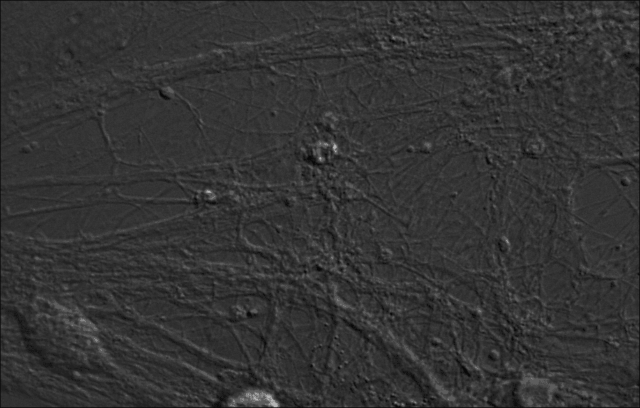

## 图像归一化

要增强曝光不足的图像的对比度，你可以转到**处理 | 增强对比度…**选项，并选择**归一化**复选框。这将在整个 8 位或 16 位图像的范围内拉伸灰度值。它不适用于 RGB 图像。以下图像显示了归一化的效果，原始图像在左侧，归一化图像在右侧：

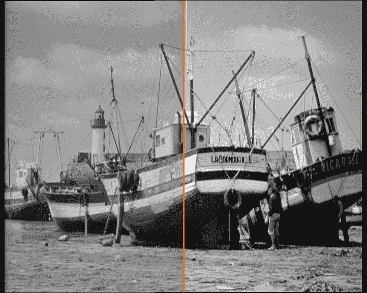

这也适用于堆叠或时间序列，其中可以对每个帧分别进行归一化。使用**亮度/对比度**窗口中的**自动**选项可以获得类似的效果，如前一章所述。请注意，归一化应用于图像并不可逆地修改像素值。如果信号不应随时间变化，这不会对测量造成大问题。然而，对于随时间变化的强度变化，这种方法将扭曲或去除这些变化。

## 漂白校正

在成像荧光时，照明可能会引起研究中的荧光素的漂白。这种效应已经得到很好的建立，并且与激发光的强度有关。为了避免这种效应，最好使用长时间曝光和低强度光。然而，这并不总是可能的。漂白的量与初始强度有关，并以指数方式减少。为了判断图像序列是否受到漂白的影响，我们可以对每个帧的整个图像进行快速测量，以查看平均强度。请注意，如果单个帧中存在照明或背景信号的变化，结果可能看起来不是一个平滑的曲线。为了快速测量，请按*Ctrl* + *A*选择整个帧，然后按*Ctrl* + *M*测量强度。对每个帧重复测量，并在您喜欢的图形程序中将平均强度值与帧号（或如果您知道间隔，则为时间）绘制成图。在这种情况下，我使用了**MATLAB**来创建图表，尽管您也可以通过从 ImageJ 的菜单中选择**图像** | **堆叠** | **绘制 Z 轴轮廓**来创建图表。以下是一个漂白曲线的示例：

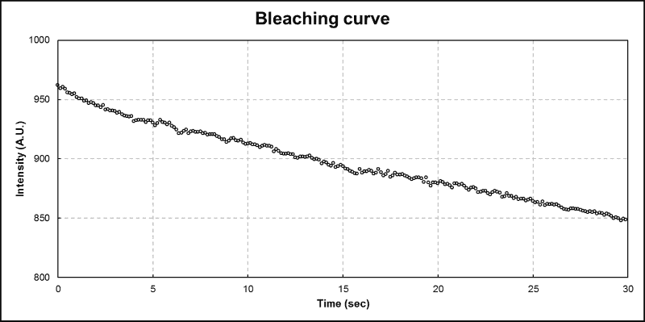

这组数据点似乎遵循一个接近直线或指数曲线的趋势，尽管前 2 秒的趋势似乎更接近指数而非线性。

为了执行漂白校正，您可以通过在 Fiji 中选择**图像** | **调整** | **漂白校正**来选择校正插件。漂白校正有三种方法：

+   简单比例

+   指数拟合

+   直方图匹配

如果强度的减少不遵循规则形状，例如指数衰减函数，那么简单比例是最好的方法。对于大多数荧光成像，这种方法可以得到良好的结果，并且可以与荧光测量相结合。直方图匹配方法在噪声图像上表现更好，但不太适合强度测量。

由于我们的趋势看起来更像是指数衰减模型，我们选择了第二种方法，即对数据进行单指数函数拟合：

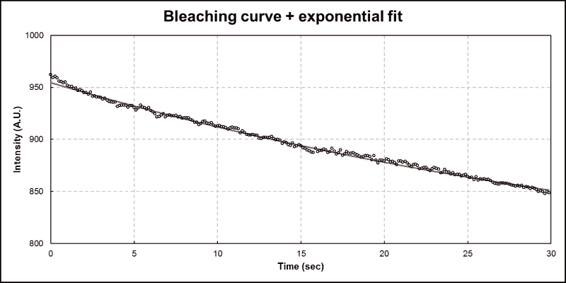

此图是使用**漂白校正**命令获得的参数生成的，并将它们输入 MATLAB 中。ImageJ 命令本身也会生成带有数据和拟合曲线的图表。然而，轴被标记为*X*和*Y*。因此，为了清晰起见，我已重新创建了带有正确标签的图表。红色线表示拟合函数，它与曲线匹配，R²值为.9954（一个非常好的拟合）。该模型由三个参数组成，标记为*a*、*b*和*c*。*a*的值表示第一个点位于由*c*值指示的渐近线之上的程度。渐近线是这个指数曲线在给定无限时间时将趋近的值。*b*的值表示曲线衰减的速度。如果您想知道失去初始荧光一半所需的时间，您可以使用以下公式，使用拟合中的*b*值：

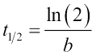

前面的公式给出了荧光衰减的半衰期。请注意，拟合的*b*参数是以帧为单位表示的，而不是时间。因此，在使用前面的公式时，您需要将结果乘以您的帧间隔以获得以秒（或分钟）为单位的价值。在前面显示的图表中，半衰期为 30.587 秒（使用*b*值为 0.0028327 和帧间隔为 0.125 秒的公式）。

# 堆栈处理

ImageJ 非常适合处理具有超过两个维度的信息：在不同 Z 层或不同时间点获取的数据。我们已经在噪声校正部分的示例中看到了堆栈处理的例子。下一节将处理由帧组成的时序。然而，首先，我们将探索处理包含切片（Z 堆栈）的图像堆栈时更多的选项。

## 处理 Z 堆栈

Z 堆栈是在不同高度或距离处获取的一系列二维图像。在显微镜中，这是通过上下移动物镜或载物台并在特定间隔获取图像来实现的。在**磁共振成像**（**MRI**）中，这是通过将患者通过扫描仪中心移动来实现的。扫描仪然后使用产生磁场波动的无线电脉冲为每个位置创建图像。这些波动可以通过 MRI 机器中的探测器来测量。这导致一个可以组合成单个文件的单一切片。您可能想要对这类图像执行的一些处理包括创建体积的投影或 3D 渲染。我们首先将检查您可以创建的投影。然后，您将理解为什么您会创建它们。

### 堆栈投影

我们已经在噪声消除部分的章节中看到了 Z 投影的一个例子。在前一节中，我们使用投影为每个像素的帧创建平均强度。对于包含切片（Z 信息）的图像，平均投影通常不是最有用的投影。然而，ImageJ 中还有其他适用于 Z 堆栈的 Z 投影。以下几节将处理这些投影的一些示例。

#### 最大投影

最大投影使用每个像素在切片中的最大强度。如果一个堆栈有 20 个切片，那么每个像素将包含这 20 个切片中的最大值。这种类型的投影有助于减少 Z 堆栈的第三维度，以便创建数据的二维表示。这种投影本质上会平坦化图像。当用于具有稀疏信号（在同一位置少量明亮像素）的荧光图像时，这种投影的效果是显示单个帧中的所有物体。它也适用于具有薄物体且在不同切片的不同位置聚焦的荧光图像。通过平坦化 Z 堆栈，所有聚焦的部分将在一个连续的形状中可见。你可以将此想象为一组楼梯。每个台阶有不同的 Z 位置，但如果你将台阶平坦化（假设台阶不重叠），你会得到一块矩形板。如果你有一个非稀疏的图像，那么这种投影就几乎没有用处。为了演示这种投影，请从样本图像中打开**共聚焦系列**图像。转到**图像** | **堆栈** | **Z 投影…**并选择**最大强度**作为投影类型。以下图像显示了这种投影的结果：

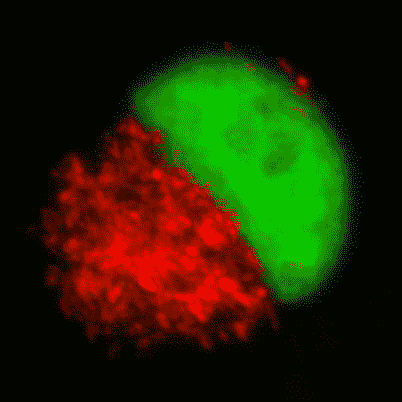

如前图所示，最大强度投影显示了整个细胞的形状，但一些信息丢失了。具体来说，第一帧中的小细节被体积中间的强烈像素淹没。对于某些表示，这是可以的。对于某些 Z 堆栈，单个切片中总体积的粗略形状不清楚，但最大投影显示了总体形状。

为了演示这种效果，我们将通过转到**文件** | **打开样本**打开**蝙蝠耳蜗体积**图像。查看这个体积的几个切片几乎无法提供有关这个感觉器官（数字表示切片编号）的形状信息：

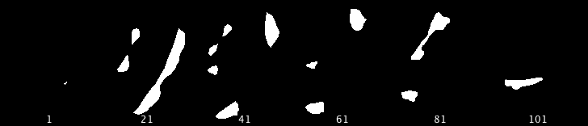

当我们创建最大强度投影时，这个器官的一般形状变得更加明显：它呈扭曲螺旋状（耳蜗是用于听力的壳形腔室）。当你通过转到**文件** | **打开样本**打开**蝙蝠耳蜗渲染**图像时，你会看到体积的 3D 渲染：

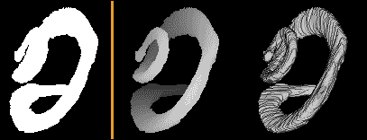

左侧的图像显示了 Z 堆栈的最大投影，而右侧的图像显示了渲染的体积。从这个图像中可以看出，最大投影比单个切片提供了更多信息。然而，在处理过程中，一些细节仍然丢失。特别是耳蜗的左上部分在最大投影中非常不清楚。螺旋的开始被它后面的环所遮挡。

Fiji 有一个选项允许你创建包含更多信息的最投影：深度编码。深度编码将颜色分配给像素的 Z 位置，导致不同切片有不同的颜色。要在 Fiji 中这样做，转到**图像** | **超堆栈** | **时间-颜色编码**，并选择**灰度**作为 LUT。这会导致前一张图像中的中间表示（不是完全一样，但非常相似）。请注意，你会收到一个消息，切片和帧已被交换。这是由于这个插件是为时间序列设计的，而不是 Z 堆栈。前一张图中的右图是体积的 3D 渲染，将在下一节中介绍。

### 体积查看和渲染

当在深度范围内获取图像时，通常的目标是将这些图像集合作为 3D 体积查看。另一个有用的查看方面是取一个三维体积，沿着 z 轴切割，并从侧面查看体积。这种后视图不能从二维图像中获得。对于这个例子，我们将使用样本图像的两个不同的堆栈。让我们从查看 MRI 堆栈的体积开始。要打开图像，转到**文件** | **打开样本**并选择**MRI 堆栈**。这是一个 MRI 堆栈，其中每个切片都位于头部不同水平（数字表示切片号）：

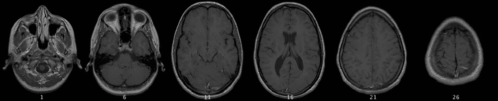

在切片 6 中，眼睛清晰可见，图像顶部有两个暗色的球体。切片 11 显示了头骨内的脑部，而帧 16 显示了头部中间的黑洞，即脑室。切片 26 显示了头顶。该区域较小，表明头部顶部正在接近。

切片中已经包含了很多信息。眼睛、鼻窦和鼻子（切片 1）都可以清晰地看到。然而，这些切片中的信息并不完整。我们在 z 轴方向上缺少形状。要查看这个体积的三维形状，我们可以使用 Fiji 附带的三维查看器。选择 MRI 堆栈后，转到**插件** | **体积查看器**。如果你有标准的 ImageJ，可以从插件页面下载并安装**体积查看器**插件。然后，将打开以下窗口：

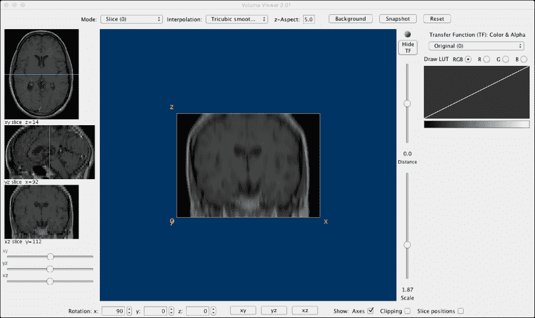

这是**体积查看器**，它是 Fiji 的一部分，并且作为 ImageJ 的插件可用。在左侧，有三个图像显示了体积的不同视图：一个**xy**切片（这是这个堆栈的顶部视图），一个**yz**切片（这是这个堆栈的侧面视图），最后是一个**xz**切片（这是这个堆栈的前视图）。查看器中间的大图像是当前选定的视图，在这种情况下，是*xz*切片视图。这个切片的位置在左侧的概述图像中由青色(*xy*)和绿色(**yz**)线条指示。请注意，我通过输入`5`并按*Enter*键而不是基于当前校准的值来调整**z-Aspect**。否则，体积看起来非常扁平。这种扁平的外观是由于这幅图像没有校准。每个体素（体积和像素的缩写）是 1 x 1 x 1，没有单位。MRI 图像中体素大小的典型值是 1.5 x 1.5 x 3.0 mm，这可以通过上一章中描述的图像属性来设置。现在我们可以通过选择查看器底部的视图按钮来更改视图。**yz**按钮将给我们这个体积的侧面视图。也可以通过点击并拖动鼠标来旋转体积。

### 注意

体积查看器窗口的大小至少为±1024 x 768 像素。这意味着根据您监视器的像素尺寸，一些控件可能超出屏幕。对于大多数现代显示器，这应该不会成为问题。然而，对于一些小屏幕或投影仪，这可能会成为一个问题。

接下来，我们将查看不同类型的图像：使用荧光成像的果蝇大脑的 Z 堆栈。要打开图像，转到**文件** | **打开样本**并选择**果蝇大脑**图像。Z 堆栈将打开，你可以浏览切片：

第一层切片中没有明亮的像素，但随着你在堆栈中移动，果蝇的大脑开始显示出定义明确的特点。这个堆栈显示了大脑的（旋转）前视图，与之前显示为顶视图的 MRI 堆栈形成对比。我们将使用体积查看器来检查整个体积，并用它来创建一个体积旋转的短片。首先，选择**果蝇大脑**堆栈，然后转到**插件** | **体积查看器**。初始图像将是一个切片视图，但在这个例子中，我们想要切换到不同的模式。使用查看器顶部的选择器选择**体积（4）**模式。我们将使用下拉选择器将插值设置为**三阶锐化（3）**。在查看器的右侧，我们将修改传输函数为**2D 渐变**以创建一个稍微更令人愉悦的视图。接下来，我们将体积查看器底部的旋转设置为*X*、*Y*和*Z*分别为-90、30 和 180。这将提供一个大脑的侧面视图。

通过在查看器中按下**快照**按钮（右上角），我们将获得当前视图的图片。接下来，我们将以 10 度的增量增加*Y*旋转的值，并在每次达到 210 度时拍摄快照。我们现在从大脑的一侧到另一侧（180 度）拍摄了大脑的快照。要将这些转换为动画，我们只需转到**图像** | **堆栈** | **图像到堆栈**。如果您关闭原始堆栈，您只需在对话框中按确定即可。否则，您必须在**标题包含**字段中输入`Volume_Viewer`。现在您将有一个可以播放并保存为电影以供演示目的的堆栈。在这个例子中，我们使用了 10 度的增量进行旋转，这给出了足够的结果。然而，如果您使用更小的增量，结果看起来会更平滑。您可以自由地修改观察体积的角度以获得不同的结果，也可以在体积查看器中实验其他设置。

体积查看器是 ImageJ 中的一个非常强大的功能，它允许调查和可视化 3D 对象。使用**切片（0）**模式来检查体积作为横截面，使用**体积（4）**模式来查看实体模型。

## 处理时间序列

时间序列由随时间获取的图像组成，通常具有固定的间隔。电影也可以被视为具有每秒 24 或 25 帧（**fps**）固定间隔的时间序列。时间序列的处理主要关注两个领域：随时间的强度波动和背景减少及标准化。强度波动已在之前的章节中介绍，其中我们讨论了漂白校正。在下一节中，我们将探讨标准化时间序列数据的方法。

## 标准化时间序列数据

标准化时间序列数据将有助于进一步分析，因为它提供了对基线强度的校正。很多时候，时间序列的目标是观察强度或随时间的变化。标准化将产生相对于静息或基线状态更干净的时间序列数据。一个非常简单的标准化方法是计算ΔF 相对于 F0（dFF0）。这个指标的基础是基线荧光在不同时间序列之间可能不同，但相对于基线的强度变化是相似的。它使用以下公式进行计算：

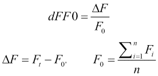

分子是当前帧（Ft）与基线（F0）之间的差值。基线是前*n*帧的平均值。*dFF0*的值大于 1 表示信号相对于基线增加，而小于 1 表示相对于基线减少。这种计算只能在时间序列的测量值上执行（在 Excel 或 MATLAB 中），但你也可以直接转换时间序列。我现在将向您展示如何在 ImageJ 中使用 Z 投影、图像复制和图像计算器来完成这项操作。

要开始，我们将打开`timeseries_events.tif`图像，该图像可在本书的在线资源中找到。这是一组细胞中囊泡的时间序列，当细胞用电极刺激时，囊泡会被运输并融合。它包含两个通道：一个带有红色荧光标记，另一个带有绿色荧光标记。红色标记在囊泡融合之前始终是荧光的，此时它会消失。绿色标记在货物位于囊泡内时不是荧光的，但一旦融合，它就会变亮。为了开始处理，我们首先想要将通道分成两个不同的时间序列。为此，选择时间序列，转到**Image** | **Color** | **Split Channels**以生成两个时间序列：每个通道一个。我们将使用**split channels**命令选择绿色通道，其标记为`C1_timeseries_events.tif`。

我们现在可以开始创建`dFF0`时间序列的第一步：创建基线帧。我们将转到**Image** | **Stacks** | **Z Project…**并设置方法为**Average Intensity**和**Stop slice:**为`5`。我们在这里所做的就是创建前五帧的平均值。这实际上通过平均减少了单个帧中的噪声，同时保留了第一帧中存在的明亮物体。让我们将生成的图像重命名，以便稍后更容易识别。右键单击平均图像，从上下文菜单中选择**Rename…**。将图像重命名为`F0`，以便稍后更容易选择。

对于下一步，我们将创建ΔF 图像。正如本节开头所解释的，这个图像是原始图像减去基线图像。为了得到这个图像，我们将通过**ImageJ**菜单中的**Process** | **Image Calculator**来使用图像计算器。选择原始时间序列为`Image1`和**F0**图像为`Image2`。然后，将方法设置为**Subtract**。确保已选中**Create new window**选项。

### 注意

当其中一个图像是堆栈或时间序列，而另一个是单个帧时，图像的顺序非常重要。如果你希望修改每个切片或帧，堆栈始终需要设置在`Image1`位置。对于减法，这通常是显而易见的，但对于乘法，从数学角度来看操作顺序并不重要（*A × B 等于 B × A*）。然而，如果你将时间序列或堆栈放在`Image2`上，而单个帧放在`Image1`上，则只有当前切片或帧用于计算！

我们现在有了ΔF 堆栈，所以让我们重命名它以使其更容易识别。右键单击新的时间序列，选择**重命名…**，并输入`deltaF`作为新名称。

现在，我们可以创建最终的时间序列，并将其归一化到基线。请注意，`deltaF`序列本身已经比原始时间序列有所改进，因为它已经校正了初始静态背景。要创建*dFF0*图像，我们将再次使用图像计算器。这次，我们将选择`deltaF`作为`Image1`，`F0`作为`Image2`，并选择**除法**操作。选择**创建新窗口**和**32 位（浮点）结果**选项。

### 注意

这次，32 位结果选项很有用。正如我们之前提到的，在计算定义中，我们期望结果在 0 到无穷大之间。这在数学符号中表示为*[0, ∞]*。这意味着任何值，包括 0 和无穷大，都在可能值的范围内。当在计算过程中未选择此选项时，所有低于 1 的值都将被舍入到 0，这些事件的信息将丢失。请注意，对于这里使用的示例，我们希望看到的事件值将大于 1。因此，在这种情况下，这并不重要。

新图像现在是 dFF0 图像，它已经校正了基线并归一化到初始基线强度。以下图像显示了这种归一化的效果（第二行），与原始图像（第一行）相比：

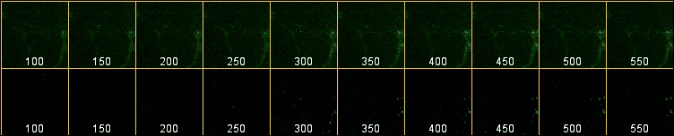

可以看到的最明显差异是，在帧**300**之前的图像几乎是黑色的，这表明相对于基线情况没有发生任何事情。在帧**300**及以后，不同位置的信号增加非常明显，这表明这些位置的信号已经增加。

# 摘要

在本章中，我们研究了不同类型图像的处理过程。我们探讨了可能导致图像损坏并降低其质量的噪声来源。你学习了如何应用不同的校正方法来修复这些问题。然后，我们查看针对 Z 堆栈和时间序列的特定处理步骤。

在下一章中，我们将看到如何将像素分成不同的组，以及如何清理和过滤结果以进行进一步处理。
