# 第七章. ImageJ 结构的解释

在前一章中，我们开发了宏以简化我们的处理和测量。我们使用了 ImageJ 宏语言特有的技术和结构。在本章中，我们将探讨以下主题，为开发我们自己的插件做准备：

+   宏和插件的框架

+   ImageJ 中的特殊类

+   宏的内建函数

+   API 函数

+   设置 NetBeans IDE 进行开发

+   使用 Maven 进行开发设置

# 宏和插件的框架

我们将查看 ImageJ 为开发者提供的处理图像及其处理的一些工具。在前一章中，我们查看宏以执行常见的图像处理步骤。这已经比逐帧处理时间序列有了改进，但 ImageJ 支持更多工具和结构，允许您进一步扩展这些基本工具。在本章中，我们将查看一些这些结构，为即将到来的章节做准备，在这些章节中，我们将查看插件及其实现。

ImageJ 有两种更自动化的处理方式：宏和插件。除了前一章中描述的宏之外，ImageJ 还支持其他基于 Java 的脚本语言，如 Beanshell 和 JavaScript，以及其他如 Python 和 Ruby 等脚本语言。插件也可以分为两组：基于原始 ImageJ 的插件（即 ImageJ1.x 插件）和基于 ImageJ 下一个发展阶段**ImageJ2**（ImageJ2 插件）的插件。ImageJ2 的开发旨在与 ImageJ1.x 向后兼容，尽管这可能在将来发生变化。在本章中，我们将探讨在创建脚本和插件时可用的一些结构。我们将首先查看 ImageJ 支持的脚本语言。

## 宏和脚本语言

正如我们在前一章中看到的，我们可以通过启动宏记录器并执行不同的图像处理和测量步骤来轻松创建一个 ImageJ 宏。我们在记录器中将类型设置为宏。我们还可以为 ImageJ 支持的另外两种脚本语言做同样的事情：**Beanshell**和**JavaScript**。Beanshell 脚本是一种宏类型，但可以访问完整的 ImageJ 和 Java API。这意味着，除了宏中可用的命令之外，您还可以使用 Java 中的类和接口，这为处理提供了更多的选项。Beanshell 脚本语言的优势在于它是一种解释型语言（在运行之前不需要编译）并且只需要一个占用空间小的解释器。这使得创建快速解决方案和插件原型变得容易。在接下来的章节中，我将检查 Beanshell 脚本语言中的一些概念。请注意，在 ImageJ 的 JavaScript 语言中也可以实现类似的结果，唯一的区别是语法上的微小变化。

### Beanshell 脚本

BeanShell 脚本允许你创建一个具有宏所有优点的脚本，同时还能访问 Java API。你可以几乎直接使用 Java 代码。然而，也有一些细微的差别。BeanShell 脚本具有弱类型。这意味着，你不需要声明变量类型，并且可以在运行时更改变量的类型。在其他所有方面，它与开发 Java 代码相当。如果你希望使用 Java API 中的类或接口，你需要首先使用以下代码行导入它：

```java
import java.awt.event.KeyListener;
```

这个导入语句告诉脚本解释器它需要从 `java.awt.event` 包中加载 `KeyListener` 类。这将允许你监控按键。`KeyListener` 类是一个接口，可以附加到脚本的一个实例上。当按键时，该类将生成一个事件，导致调用 `keyPressed()` 方法，该方法必须由脚本重写。使用 `keyPressed()` 方法，你可以在按下特定键时执行特定任务。

BeanShell 脚本语言还支持将现有脚本导入到新脚本中。这样，你可以将多个脚本串联起来。串联脚本意味着你使用一个脚本的输出作为下一个脚本的输入，依此类推。这种处理方式的优势在于，每个脚本都成为一个可以重用并以不同方式组合以实现不同结果的模块。要将现有脚本导入到你的脚本中，请使用以下语法：

```java
this.interpreter.source("some_script.bsh");
```

这将加载名为 `some_script.bsh` 的 BeanShell 脚本，并为你提供访问其方法的能力。一个简单的 BeanShell 脚本可能包含一系列基本的 ImageJ 命令，但也可以包含类、函数，甚至图形用户界面。现在，我们将探讨在 BeanShell 脚本语言中用于处理 ImageJ、图像和选择的几个结构。

#### ImageJ 主类

要访问主 ImageJ 窗口，我们可以使用 `IJ` 类来获取 ImageJ 的当前实例。我们可以使用这个实例来访问 ImageJ 类提供的一些参数：

```java
protected ImageJ ij;
ij = IJ.getInstance();
Label status = ij.statusLine;
status.setText("Now we modified the status line text!");
```

在这个简短的示例中，我们创建了一个 `ImageJ` 类型的变量，并将 `ImageJ` 窗口的当前实例的引用存储在这个变量中，称为 `ij`。接下来，我们提取了 ImageJ 状态行的内容，并将其存储在一个名为 `status` 的变量中。最后，我们将状态行的文本设置为 `Now we modified the status line text!`。当然，这个示例既不直接有用也不完整，但它展示了如何获取主 `ImageJ` 接口并修改接口的一个组件。

### 注意

我使用了两种不同的声明和实例化变量的方式：`ij` 变量首先声明然后实例化，而 `status` 变量则在同一行中声明和实例化。如果变量需要扩展的作用域（即，跨越一个循环或整个类），则前者是必需的。

您也可以使用`IJ`类通过`run()`方法或如`openImage()`等方法来执行 ImageJ 菜单结构中的命令：

```java
import ij.IJ;
IJ.run("In [+]", "");
imp = IJ.openImage("http://imagej.nih.gov/ij/images/blobs.gif");
```

第二行显示了如何使用`IJ`类的`run()`方法进行一次缩放。第三行显示了如何使用`openImage()`方法打开一个图像，在这个例子中，它将图像的引用存储在名为`imp`的变量中。要从 BeanShell 脚本内部访问图像，我们可以使用前面描述的`openImage()`来打开图像。或者，我们也可以使用当前的活动图像（如果已打开图像）：

```java
imp = IJ.getImage();
```

### 注意

注意，在 Fiji 中，它使用 ImageJ2 候选版本，在使用`IJ`类的方法之前，需要添加导入语句。在 ImageJ1.x 中，这些包是自动加载的，导入语句是可选的。为了确保您的脚本具有未来性，包含导入语句是最佳实践。

#### 图像处理函数

使用 ImageJ 类，您可以访问当前的活动图像以及打开图像的方法。还有允许您使用`ImageProcessor`类在像素级别处理图像的方法。此类提供了可以在像素级别修改图像的方法：单个像素或一组像素。以下代码片段显示了如何使用`ImageProcessor`类更改特定像素的值：

```java
import ij.IJ;
import ij.process.ImageProcessor;

imp = IJ.openImage("http://imagej.nih.gov/ij/images/blobs.gif");
ip = imp.getProcessor();
ip.invertLut();
imp.setProcessor(ip);
ip.putPixel(64,128, 255);
```

在这个例子中，我们打开了**Blobs**样本图像并获得了`ImageProcessor`。然后我们反转了 LUT（当打开时**Blobs**图像使用反转的 LUT）并将反转的图像放回`imp`对象中。最后，我们将坐标（x = `64`，y = `128`）处的像素值设置为`255`。在这个例子中，您将在一个位于（`64,128`）位置的 blob 中看到一个白色像素。

如果活动图像是 8 位图像（例如**Blobs**图像），这将导致一个白色像素。在 16 位图像中，此操作将导致一个深灰色像素。如果您想了解当前图像是否是灰度图像以及它有多少位每像素（8、16、24 或 32），您可以包含以下命令：

```java
bGray = ip.isGrayscale();
bitDepth = ip.getBitDepth();
```

这将允许您确切地确定您正在处理什么类型的图像。如果`bGray`为`true`，则图像是 8、16 或 32 位浮点灰度图像或具有红色、绿色和蓝色通道像素值相同的 24 位图像。`bitDepth`值将告诉您它是哪个级别。这种区别很小，但很重要。包含颜色信息的 24 位图像与灰度的 24 位图像不同。后者可以在不丢失信息的情况下转换为 8 位图像，而前者则不能在不丢失颜色信息的情况下转换为 8 位图像。

#### 选择函数

要访问 ROI 管理器中的选择，BeanShell 脚本允许您获取 ROI 管理器的实例，然后可以使用它提取 ROI 并用于处理。以下代码片段从 ROI 管理器中获取 ROI 并将它们放大`2`像素：

```java
import ij.IJ;
import ij.plugin.frame.RoiManager;

imp = IJ.getImage();
RoiManager rm = RoiManager.getInstance();
int numRois = rm.getCount();

for(i=0;i<numRois;i++) {
  rm.select(i);
  IJ.run(imp, "Enlarge...", "enlarge=2");
  rm.addRoi(imp.getRoi());
}
```

此代码片段展示了处理感兴趣区域（ROI）的一些基本脚本。我们首先检索 ROI 管理器的实例，这允许我们将 ROI 作为数组进行处理。在循环中，我们选择每个 ROI 并使用放大命令在*X*和*Y*方向上增加 ROI 的大小`2`像素。最后，我们将放大的 ROI 添加到 ROI 管理器中，以便我们稍后可以使用它们。此代码几乎可以原样用作 Java 代码。如果您尝试编译它，您会收到的第一个错误包含在以下行中：

```java
imp = IJ.getImage();
```

这在 BeanShell 脚本中运行得非常好，但在 ImageJ 插件中，它将生成一个错误，因为`imp`变量的类型未声明。此外，for 循环没有为索引`i`迭代器声明类型，这也会生成编译器错误。

### 保存和运行您的脚本

一旦我们创建了可测试的版本，我们就可以保存它并尝试运行。宏以`.ijm`或`.txt`扩展名存储。`.ijm`扩展名更可取，因为它允许区分常规（非脚本）文本文件和宏文件。脚本文件有自己的扩展名：BeanShell 的`.bsh`和 JavaScript 的`.js`。

保存脚本时，命名必须遵守文件系统的限制。否则，对名称没有具体限制。默认情况下，存储脚本的目录是 ImageJ 安装文件夹中的`scripts`或`macros`文件夹，我将称之为`$IJ_HOME`。如果您想从命令行运行脚本，最好避免在文件名中使用空格，以避免出现意外行为（即，如果您忘记转义空格字符）。

### 注意

对于 Fiji，`$IJ_HOME`文件夹被称为`Fiji.app`，可以放置在文件系统的任何位置。建议您将此文件夹存储在您的用户账户文件夹中，您有读写权限。在 OSX 系统上，使用包安装器时，Fiji 的默认位置是`/Applications/Fiji.app`。

如前一章所述，关于 ImageJ 宏的描述，BeanShell 和 JavaScript 脚本可以以类似的方式安装和执行。当使用 Fiji 时，您可以在代码编辑器中打开脚本以运行它们。

## ImageJ 插件

如我们在前几节关于 BeanShell 脚本语言的讨论中看到的，ImageJ 提供了一个易于访问的接口，可以访问完整的 Java API。这一点同样适用于插件。除了核心的 ImageJ API 之外，插件还可以通过在其源文件中导入类或接口来访问完整的 Java API。随着 ImageJ 社区的发展，正在开发一个新的 ImageJ 核心代码实现，称为 ImageJ2。在接下来的几节中，我将简要概述一些将影响插件开发的变更。这包括引入一些在大型项目中常用到的结构，特别是 Git 和 Maven。请注意，了解这些结构对于创建插件不是必需的，但它们将有助于创建更一致和可重复的代码。这些结构也不是 ImageJ2 特有的，但 ImageJ2 项目是基于这些概念构建的。然而，我将首先介绍一些特定于 ImageJ 的类，它们用于处理图像和选择。

### ImageJ 主类

主要的 ImageJ 类指的是提供访问 ImageJ 应用程序的类。我们之前在 BeanShell 部分已经看到了这个类。这个类被称为 IJ，它是一个静态实用类。如前所述，这个类允许访问当前图像以及其他功能。这个类的使用方法与之前相同，只是在编写插件时，需要显式声明变量类型。例如，当我们希望创建一个包含两个 16 位通道、10 帧和 512 X 512 像素大小的新的超堆栈时，我们可以使用以下代码片段：

```java
import ij.IJ;
import ij.ImagePlus;

ImagePlus imp = IJ.createHyperStack("New Stack",512,512,2,1,10,16);
```

注意，我们需要指定`imp`变量是`ImagePlus`类型，这与我们之前看到的脚本语言不同。`IJ`类另一个有用的方法是`log()`日志方法。此方法将字符串打印到日志窗口，并在尚未打开的情况下显示日志窗口。此功能在处理大型数据集时用于展示中间结果或状态更新很有用。要使用它，我们只需调用该方法并传入我们希望打印的字符串：

```java
IJ.log("We finished processing "+nFiles+" file(s)!");
```

这假设存在一个名为`nFiles`的变量，它存储需要处理的文件数量。日志消息将告诉我们处理了多少文件，这取决于在插件执行时选择的文件数量。还有打开图像或获取活动图像的方法，这些方法与脚本部分中使用的示例相同（唯一的区别是需要在插件中显式声明类型）。

### 窗口管理器

`WindowManager`类是 ImageJ 中的一个实用类，它跟踪所有窗口（包括图像、结果和日志窗口），并提供允许选择特定窗口的方法。其中一些最有用的方法是`getImageTitles()`、`getImage()`和`getCurrentImage()`。`getImageTitles`方法返回一个包含所有打开图像标题的`String`数组。此功能非常有用，可以填充文件列表，以便用户选择要处理的特定图像。以下示例代码将展示此功能以及如何在程序中使用它：

```java
String[] imageList = WindowManager.getImageTitles();

JComboBox jcbImages = new JComboBox(imageList);
```

这是一种非常用户友好的方式，允许用户选择要处理的图像。通常，ImageJ 默认使用最后打开的图像（活动图像）。当用户根据图像标题选择了一个图像时，我们可以使用`getImage`方法激活该图像以进行进一步处理：

```java
ImagePlus imp;
imp = WindowManager.getImage(imageList[idx]);
```

这允许程序的其他部分使用指定的图像进行处理。这段代码将在关于具有用户界面的插件的章节中再次讨论。

### ImagePlus

图像的主要类是`ImagePlus`类，它是 ImageJ 中处理图像的主要类。我们已经在之前的代码部分中简要地看到了它的调用。当调用`ImagePlus`类时，我们可以访问几个帮助从图像中提取信息的方法。我们还可以使用设置方法对图像进行更改：

```java
ImageProcessor ip = imp.getProcessor();
int[] pxVal = imp.getPixel(256,256);
imp.setRoi(256,256,32,32);
```

此代码片段展示了几个允许您检索图像的各个方面以及设置当前图像中的区域的方法。另一个可以通过`ImagePlus`类访问的重要方法是`ImageProcessor`类，如代码片段的第一行所示。下一节将讨论这个类。

### ImageProcessor

`ImageProcessor`类是一个允许您处理图像像素数组的类。`ImageProcessor`类有四个不同的子类，分别与不同的图像类型相关联：`ByteProcessor`用于 8 位和二进制图像，`ShortProcessor`用于 16 位图像，`FloatProcessor`用于 32 位浮点图像，以及`ColorProcessor`用于 RGBα图像。从`ImageProcessor`实例可访问的一些方法包括`autoThreshold()`、`crop()`、`getPixel()`和`getIntArray()`。这些函数允许您在图像上设置阈值，裁剪图像，在指定位置检索像素值或以数组形式获取所有像素值。

### RoiManager

`RoiManager`类使用户能够访问 ROI 管理器和所有其功能。这个类对于检索和操作手动或程序设置的区域是必不可少的。`getRoisAsArray()`方法允许用户以数组的形式检索 ROI 管理器中的所有区域，这使得用户能够遍历所有区域进行测量或修改区域。以下代码是一个示例：

```java
RoiManager rm = RoiManager.getInstance();
if (rm == null) {rm = new RoiManager();}

Roi[] regions;
regions = rm.getRoisAsArray();

for (int r=0; r<regions.length; r++) {
  Roi region;
  region = regions[r];
  //do something...
}
```

建议您使用 `getInstance()` 方法来获取 ROI 管理器的引用。如果它返回一个 null 值，您可以使用构造函数来创建一个新的实例。在使用 `getRoisAsArray()` 方法后，您将得到一个类型为 `Roi` 的数组，其中包含一系列区域。

### 注意

您还可以将 `regions` 变量的声明和实例化合并为一条单独的语句。我更喜欢在方法或类的开头声明变量，并在有数据可用时实例化它们。在实例化或分配之前声明变量对于需要变量作用域扩展到实例化或分配点的范围之外的情况是必要的。当一个变量在循环内外使用，但值仅在循环内分配时，声明需要放在循环之外，分配在循环内。

### Roi 类

`Roi` 类是一个泛型类，它包含 ImageJ 支持的所有区域类型。您可以使用此类检索区域的相关属性，例如使用 `getBounds()` 方法获取区域的边界框。您还可以使用 `grow()` 方法更改大小。`Roi` 类有几个子类，它们与 ImageJ 中可用的不同区域类型相关联。其中一些子类具有针对面积区域特定的额外方法。例如，`PolygonRoi` 子类有获取多边形坐标的方法，`getXCoordinates()` 和 `getYCoordinates()`，它们返回坐标的 `int` 数组。

# 应用程序编程接口

就像许多编程语言一样，ImageJ 有一个很好的**应用程序编程接口**（**API**）文档。它描述了所有可编程访问的类、方法和字段。API 参考可以在 ImageJ 网站上找到，网址为[`javadoc.imagej.net/ImageJ1`](http://javadoc.imagej.net/ImageJ1)（ImageJ1.x）、[`javadoc.imagej.net/ImageJ`](http://javadoc.imagej.net/ImageJ)（ImageJ2）和[`javadoc.imagej.net/Fiji`](http://javadoc.imagej.net/Fiji)（Fiji）。API 文档是查找可用于提取相关信息的类和方法的有效方式。前几节中提到的类可以通过 API 页面找到。您还可以找到方法字段的全列表，包括方法的返回类型。在设置用于开发插件的 IDE 的章节中，我还会简要解释如何设置 Javadoc 的生成。Javadoc 是一种解析您的源代码并提取特殊格式注释以构建文档手册的方法。这可以应用于 ImageJ 源代码，从而生成一个可以离线访问的 API。我还会向您展示如何编写自己的 Javadoc 文档，然后在插件开发章节中生成您自己的代码的 API。这对于小型项目不是必需的，但对于具有复杂代码的大型项目非常有帮助，这些代码使用了大量类和方法。

# 设置 NetBeans IDE

现在我们将探讨如何设置一个**集成开发环境**（**IDE**），它可以用来开发 ImageJ 以及 ImageJ 的插件。Java 有很多可用的 IDE。虽然本节将向您展示如何设置一个名为 NetBeans 的特定 IDE，但许多这些设置和配置可以在您首选的 IDE 中复制。

我将要描述的设置是针对 NetBeans IDE 的，它是由管理 Java 语言的公司开发的。它可以下载不同的版本，包括用于 Java 开发、网页开发和 C++开发的版本。如果你只想为 ImageJ 开发插件，Java SE（标准版）或 Java EE（企业版）的下载应该就足够了。企业版与标准版类似，但它提供了用于多级和可扩展应用程序以及安全网络应用程序的额外 API。可以使用**插件管理器**（**工具** | **插件**）在以后扩展基本 Java 版本并添加用于网页开发或 C++编码的模块。

对于即将到来的部分，我将假设 Java SE 已经安装。然而，为了设置环境，这并不会造成差异。它可以从[`netbeans.org/downloads/`](https://netbeans.org/downloads/)下载。下载后，可以使用您平台的标准方法进行安装。对于 Windows 系统，有一个可以通过双击运行的安装程序。对于 OS X，有一个包含包文件的 DMG 文件，可用于安装。对于 Linux 系统，有一个 shell 脚本安装程序，某些发行版可能从它们的仓库中提供。建议您使用 NetBeans 网站上的版本，因为它比许多仓库中的版本更新。

下面的章节将描述如何在不使用项目工具的情况下开发 ImageJ1.x 插件。这种方法只需要下载一次，并作为一个独立开发平台运行。如果您希望使用 Maven 平台为 ImageJ1.x 和 ImageJ2 开发插件，可以跳过以下章节，继续到**使用 Maven 开发插件**部分。

## 收集所有组件

安装完成后，您应该能够启动 NetBeans 应用程序。第一次启动时，将有一个起始页面，允许您浏览软件并观看快速教程项目。您可以检查设置并根据您的喜好进行调整。

接下来，我们需要下载 ImageJ 的源代码。源代码可以从 ImageJ 网站[`imagej.nih.gov/ij/download/src/`](http://imagej.nih.gov/ij/download/src/)下载，在那里您将找到从版本 1.20 到最新版本（1.50a）的不同版本列表。您下载哪个版本并不重要。然而，最好使用带有最新错误修复和新增功能的最新版本。下载完成后，可以将存档提取出来，生成一个名为`source`的文件夹。在接下来的章节中，我将假设`source`文件夹的内容已提取到用户配置文件中的 Documents 文件夹内的`ij/src`文件夹中。这个文件夹位置将在接下来的章节中被称为`source`文件夹。

## 设置项目

这里描述的项目设置遵循[`rsb.info.nih.gov/ij/developer/NBTutorial.html`](http://rsb.info.nih.gov/ij/developer/NBTutorial.html)中给出的描述，但做了一些调整。首先，当使用 NetBeans 8.0 版本时，创建项目的该方法不能正常工作。这里描述的步骤将实现相同的结果，但有一些关键更改。

第一步是在 NetBeans 中为 ImageJ 设置一个新的项目。

1.  要这样做，请转到**文件** | **新建项目…**，这将打开以下对话框：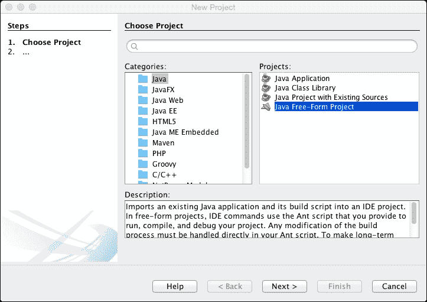

1.  在对话框中，选择**Java**类别，并选择**Java Free-Form Project**，如图所示。然后，点击**下一步 >**。

1.  在下一步中，我们必须选择包含源代码的文件夹。**点击浏览…**并选择包含提取源代码的`src`文件夹。如果复制操作正确完成，剩余字段将自动填写正确的信息：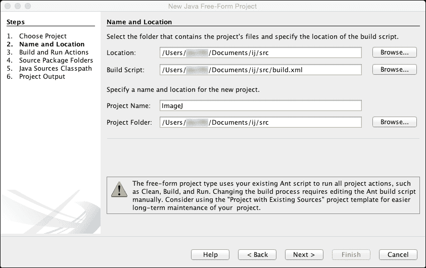

1.  我们现在可以点击**下一步 >**以继续到**构建和运行操作**，然后再次点击**下一步**而不修改字段。

1.  在下一步中，我们必须设置包含我们的 ImageJ 源代码和插件源代码的位置。

1.  要这样做，请在**源包文件夹**字段中添加`ij/src/ij`和`ij/src/plugins`文件夹。您可以从源包文件夹中删除带有点的第一个条目。我已经将源级别设置为 JDK 1.7，这将强制 NetBeans 使用比 ImageJ 源代码构建说明中定义的新版本 Java：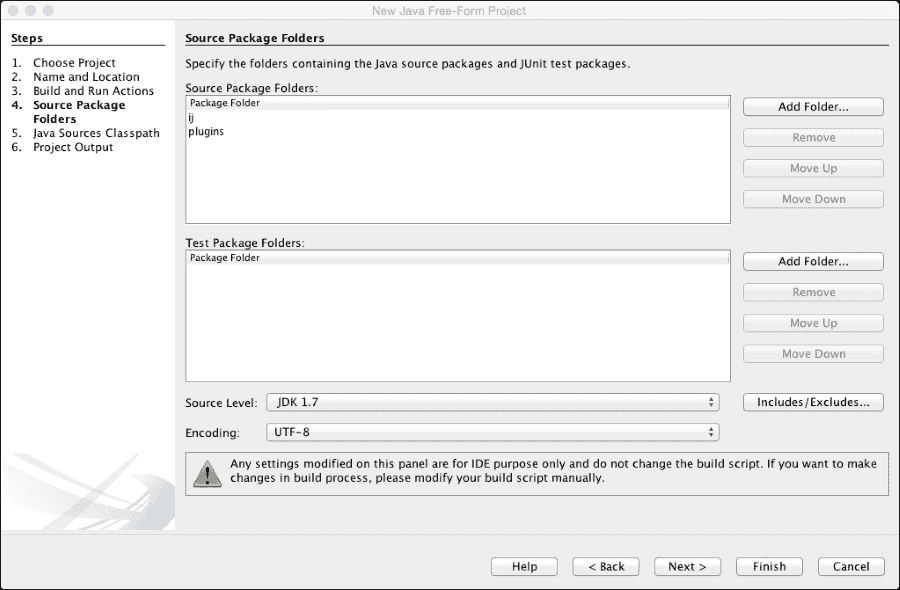

1.  点击**完成**以完成设置过程：

### 小贴士

最后两个步骤可以保持默认设置。

项目现在将被创建，NetBeans 的主窗口将在左侧的**项目**选项卡中显示新项目。项目名称（`ImageJ`）下面有两个包源：一个用于 ImageJ 源代码（`ij`）和一个用于插件源代码（`plugins`）。

**文件**选项卡将显示与项目相关的文件概览：

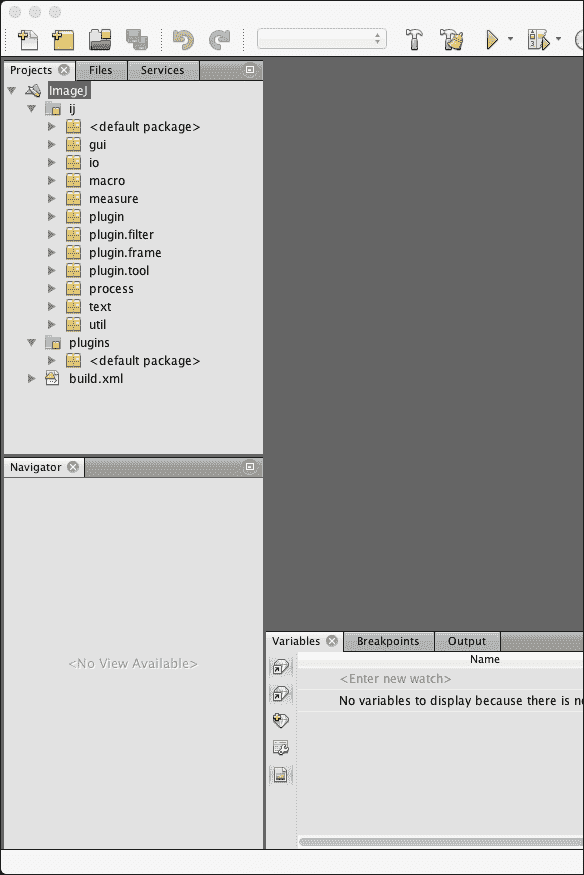

下一个部分将查看构建 ImageJ 所需的配置。

## 构建 ImageJ

我们现在将设置环境以构建 ImageJ。这将使我们能够创建一个功能性的 ImageJ 程序，通过该程序我们可以执行我们的插件和宏。第一步是修改构建 ImageJ 项目时将使用的构建说明。为此，选择**项目**选项卡，双击 ImageJ 项目底部的`build.xml`文件以打开构建文件。这是一个标准的 XML 文件，可以使用 XML 语法进行编辑。要禁用代码部分，您可以使用该部分的注释标签（`<!-- -->`）或完全删除它。如果您希望将文件恢复到原始状态，建议使用注释方法。需要禁用的第一行是第 12 行（我正在使用注释来禁用它）：

```java
<!-- <exclude name="plugins/**"/> -->
```

修改后保存文件。接下来，我们将从`plugins`文件夹中删除两个`.source`文件，但不要删除`.class`文件。现在我们可以通过点击**运行** | **构建项目（ImageJ）**或按*F11*来开始构建 ImageJ。在**构建输出**窗口中可能会有一些红色警告，但现在可以忽略它们。输出结束时，应该显示**构建成功**。现在我们将新创建的 ImageJ 构建添加到项目中。为此，请转到**文件** | **项目属性（ImageJ）**，然后转到**Java 源文件类路径**类别。首先，选择**ij[ij]**作为源包文件夹，然后点击**添加 JAR/文件夹**按钮。浏览到`src`文件夹，选择`ij.jar`文件，然后按**选择**按钮。对于`plugins [plugins]`源包文件夹重复此操作，然后按**确定**完成。我们现在已准备好设置开发插件的配置。

## 创建插件

现在我们将创建一个非常基础的插件，为使用 NetBeans 编译和调试插件做准备。首先，切换到**文件**选项卡，在插件文件夹上右键单击。然后，从上下文菜单中选择**新建** | **Java 类**。在打开的对话框中，将**类名**设置为`Plugin_Frame`（或其它名称，但名称中始终包含一个下划线！）。建议为新的类创建一个包而不是默认包（我使用**Template**作为示例）。点击**完成**以创建新的 Java 源文件：

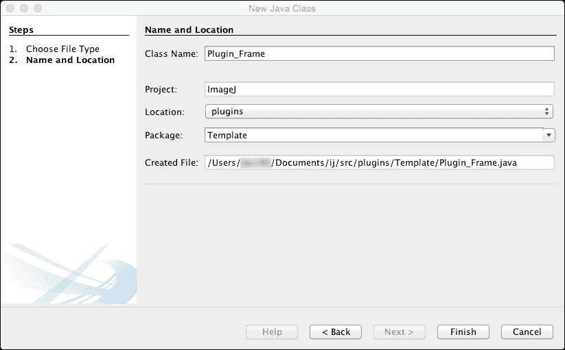

接下来，我们将以下代码放入新创建的源文件中：

```java
import ij.ImagePlus;
import ij.plugin.filter.PlugInFilter;
import ij.process.ImageProcessor;

public class Plugin_Frame implements PlugInFilter {
  protected ImagePlus imp;

  public int setup(String arg, ImagePlus imp) {
    this.imp = imp;
    return DOES_8G | DOES_16 | DOES_32;
  }

  public void run(ImageProcessor ip) {
    ip.invert();
  }
}
```

这将创建一个插件，该插件将当前活动图像的 LUT 反转。接下来，保存源文件，我们将编译我们刚刚添加到源文件中的代码。要编译源代码，请转到**运行** | **编译文件**或按*F9*。

将会弹出一个窗口询问是否希望生成一个 ide-file-targets.xml 文件，因此请点击**生成**。将打开一个新文件，其中包含您插件的构建说明：

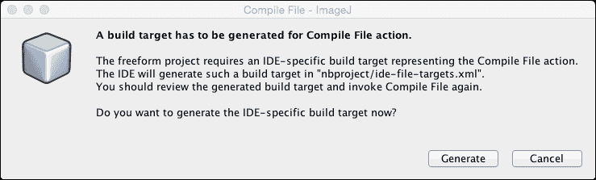

在`ide-file-targets.xml`文件中，我们将修改两行。首先，我们将第 9 行更改为以下内容：

```java
<javac destdir="plugins" includes="${files}" source="1.7" srcdir="plugins">
```

我们将用`plugins`替换`${build.classes.dir}`。接下来，我们将注释掉第 8 行（或删除它）：

```java
<!-- <mkdirdir="${build.classes.dir}"/> -->
```

现在，保存修改后的文件并再次选择你的插件文件。我们将通过转到**运行** | **编译文件**或按*F9*来再次编译文件。在输出视图中，应该显示构建成功。接下来，我们将设置插件的调试。选择**调试** | **调试项目（ImageJ）**，此时将弹出一个对话框，要求设置输出。点击**设置输出**然后点击**确定**以接受默认值。再次转到**调试** | **调试项目（ImageJ）**。这次，ImageJ 将启动，你的插件可以在**插件**菜单中找到。要启动你的插件，选择**插件** | **模板** | **插件框架插件**，你的插件应该会变得可见。

每次你想测试或更改你的代码时，记得关闭你在选择调试时创建的 ImageJ 实例。每次你选择**调试项目（ImageJ）**时，都会打开一个新的 ImageJ 窗口。这将使跟踪你实际调试的代码变得非常困难。

## 创建文档

Java 语言有一个很好的集成方式，通过在源文件中使用特殊格式的注释来创建文档。当在源文件中一致应用时，可以非常容易地创建 API 文档。在下一节中，我们将探讨如何设置文档的基础。

### ImageJ Javadoc

我们将首先为 ImageJ 项目生成 Javadoc。为此，我们将选择 ImageJ 项目并转到**运行** | **生成 Javadoc（ImageJ）**。Javadoc 将在名为 `api` 的文件夹中为 ImageJ 项目生成，该文件夹位于 `/ij` 文件夹中。它包含一个 HTML 文件和样式文件的列表。要查看文档，只需在网页浏览器中查看 `index.html` 文件，你将看到 ImageJ API 文档。这个视图与我们在 API 部分看到的在线 API 非常相似，信息是相同的。通常不需要多次为 ImageJ 项目生成 Javadoc，除非你修改了文档。在下一节中，我们将探讨为你的插件创建一些 Javadoc 注释。

### 插件 Javadoc

要为你的插件生成 Javadoc，你需要在代码中添加一些特殊格式的注释。网上有很多关于 Javadoc 的文档，所以这里提供的信息将非常基础，但应该是一个有用的起点。首先，你需要决定需要多少文档。你可以制作出很多细节的精心制作的文档，但如果你的代码非常简单，编写文档所需的时间将比开发代码所需的时间多得多。话虽如此，拥有一些文档将有助于在一段时间后识别方法所执行的功能。

让我们看看一个简单方法的文档示例，该方法具有输入参数和输出参数。

```java
private double[] measureParticles(Roi[] r, ImagePlus imp) {}
```

这是测量图像中区域集合的一些属性的基本函数定义，它返回一个测量值数组。为了包含文档，我们将在函数定义之前添加以下部分：

```java
/**
 * Take regions within an image and measure the fractal 
 * dimension of the provided regions.
 * 
 * @param r Roi array containing the particles
 * @param imp reference to image containing the particles
 * @return array with the same dimensions as r containing 
 * the values for the fractal dimension.
 */
```

Javadoc 部分需要以一个前缀和两个星号开始。在 Javadoc 开头标签后按回车键，NetBeans 将自动生成输入参数（`@param`）和返回值（`@return`）的代码。你唯一需要添加的是参数的实际含义。

一旦你的代码已经编写了文档，你必须指示 NetBeans 构建文档化的 Javadoc 代码。为此，通过替换文件末尾现有的 `javadoc` 部分（它应该在文件末尾）来调整 `build.xml` 文件，如下所示：

```java
<target name="javadocs" description="Build the JavaDocs.">
<delete dir="../plugins_api" />
<mkdir dir="../plugins_api" />
<javadoc
destdir="../plugins_api"
           author="true"
           version="true"
           use="true"
windowtitle="ImageJ plugins API">
<fileset dir="." includes="**/*.java" />
</javadoc>
</target>
```

这将在名为 `plugins_api` 的文件夹中构建 ImageJ 和你的插件文档，该文件夹位于你的源数据之上的一级目录。如果你为你的插件创建了一个包，你还需要创建一个包含包信息的 `package-info.java` 文件。要创建此信息文件，在 **项目** 视图中右键单击你的包，并从上下文菜单中选择 **新建** | **Java 包信息…**。或者，你还可以在菜单中选择 **新建** | **其他…**。在打开的对话框中，只需单击 **确定** 以接受默认值。文件将被生成，你可以在包行上方以通常的方式添加你的包文档。你需要为创建的每个包创建此信息文件。

文档编译完成后，你可以在浏览器中打开 `plugins_api/index.html` 文件来查看它。ImageJ 文档将首先在左上角的概览面板中显示。底部将显示你的包（s）。通过单击它们，你将看到包内定义的所有类。当你单击一个类时，你提供的文档将显示并可供浏览。

## 使用 Maven 开发插件

在前几节中，我讨论了如何为 ImageJ 和独立配置中的插件开发设置 NetBeans。然而，随着 ImageJ 设计的扩展，需要创建一个更模块化的方法。这种方法涉及将不同的模块构建成一个单一程序。这种模块化方法的优点是创建了一个非常灵活的应用程序，可以在未来进行扩展。缺点是它需要更多的开销来确保所有依赖项都满足以实现完全功能化的程序。这正是 Apache Maven 发挥作用的地方。Maven 是一套工具，用于描述如何将项目构建成最终程序以及所需的依赖项。

它使用一个名为 **项目对象模型** (**POM**) 的特殊文件来完成这项工作，这是一个 XML 文件。该文件存储在项目的根目录中，并命名为 `pom.xml`。文件内容描述了项目的一些方面，例如一组唯一的标识符，以及项目所需依赖项的列表。当你告诉 Maven 解析 POM 文件时，它将收集所有必需的资源并编译源代码，运行指定的测试，最后将程序打包成 JAR 文件。Maven 的目标是明确地描述项目，并自动执行创建最终包所需的所有必要任务，而无需开发者手动指定每一步。这正是前几节使用 Ant 机制构建代码所描述的内容。首先，让我们看看 Maven 中 POM 的构建方式以及它是如何用于构建项目的。

### POM 的构建

POM 文件描述了项目的结构。它描述了源代码的位置（默认情况下，这是 `/src/main/java`）和编译程序存储的构建目录（默认情况下，这是 `/target`）。最简 POM 文件包含以下结构：

```java
<project>
  <modelVersion>4.0.0</modelVersion>
  <groupId>some.packaged.app</groupId>
  <artifactId>my-app-name</artifactId>
  <version>1.0.0</version>
</project>
```

这个最简 POM 文件将继承来自 `Super POM` 文件的所有默认值。这意味着，在 POM 中未明确命名的所有内容；将使用默认值。这包括诸如源文件的位置、`build` 目录、构建文件类型（默认为 `.jar`）以及其他选项，例如用于下载源文件的仓库。对于 ImageJ1.x 插件，以下 POM 是最简描述：

```java
<project>
<modelVersion>4.0.0</modelVersion>
<parent>
  <groupId>net.imagej</groupId>
  <artifactId>pom-imagej</artifactId>
  <version>13.2.0</version>
  <relativePath />
</parent>

<groupId>sc.fiji</groupId>
<artifactId>Plugin_Name</artifactId>
<version>1.0.0</version>

<name>plugins/Plugin_Name.jar</name>
<description>A Maven project implementing an ImageJ1.x plugin</description>

<properties>
  <main-class>Plugin_Name</main-class>
</properties>

<dependencies>
  <dependency>
    <groupId>net.imagej</groupId>
    <artifactId>ij</artifactId>
  </dependency>
</dependencies>

<build>
  <plugins>
    <plugin>
      <artifactId>maven-jar-plugin</artifactId>
      <configuration>
        <archive>
          <manifest>
            <mainClass>${main-class}</mainClass>
          </manifest>
        </archive>
      </configuration>
    </plugin>
  </plugins>
</build>

</project>
```

这部分描述了使用 ImageJ 作为父项目来描述项目。这是必要的，因为我们要开发的插件需要构建 ImageJ。接下来，我们使用我们的插件名称指定了 `artifactId`；在这种情况下，我使用了通用的名称 `Plugin_Name`。在 `properties` 字段中，我们声明了项目的主类，即插件的名称。

### 注意

注意，`<parent>` 标签内的 `<version>` 标签将控制要检索哪个版本的 ImageJ1.x。使用版本 7.0.0 将检索 1.49q 版本，而 13.2.0 将检索 1.50a 版本。

接下来，我们描述了插件所需的依赖项，对于一个插件来说，是 ImageJ。最后，我们描述了构建过程，指出我们想要一个 JAR 文件。清单应该包括属性对象中 main-class 字段所描述的 `main` 类。此方法不需要下载任何源代码。下一节将解释如何使用 NetBeans 中的 POM 设置 ImageJ1.x 插件。

### 创建 Maven 插件项目

使用 Maven 项目开发插件非常简单，只需要几个基本步骤。在许多情况下，您可以使用 POM 模型的默认值，并且您只需要指定您插件（s）的名称、版本号和工件名称。我们将通过从菜单中选择 **文件** | **新建项目** 来使用 NetBeans 创建一个新的 Maven 项目。从类别列表中，我们将选择 **Maven**，然后从 **项目** 列表中，我们将选择 **POM 项目** 并点击 **下一步 >**：

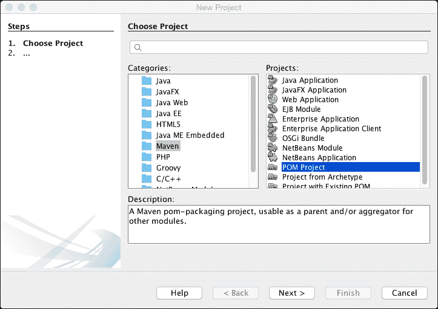

在下一个窗口中，我们可以设置插件的主要属性。对于这个例子，我将创建一个名为 `Awesome_Plugin` 的虚拟插件。我将将其放置在 NetBeans 工作空间文件夹中，这是在安装 NetBeans 时创建的默认文件夹：

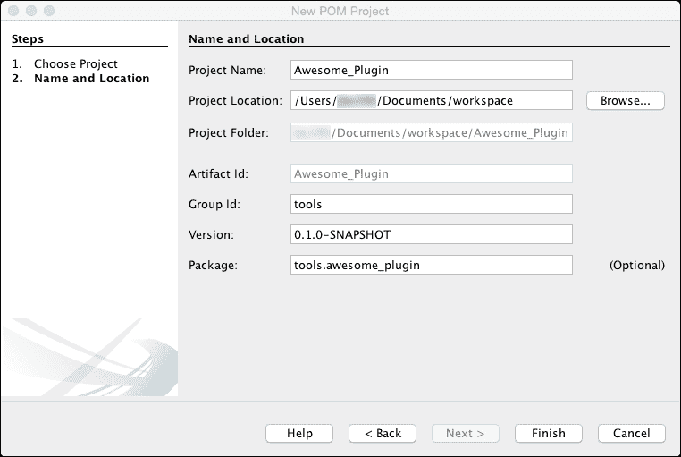

我添加了 **组 ID** 和一个版本号，但这些都很容易稍后更改。按下 **完成** 后，项目将被创建并添加到您的项目视图中（如果您看不到项目视图，请从菜单中选择 **窗口** | **项目**）。如果您展开项目，您会注意到有三个文件夹，其中目前最重要的文件夹是 **项目文件**。此文件夹包含我们将要编辑的 `pom.xml` 文件。您可以通过展开项目文件文件夹或在项目根目录上右键单击并从上下文菜单中选择 **打开 POM** 来打开 POM 文件进行编辑。POM 文件现在将如下所示：

```java
<?xml version="1.0" encoding="UTF-8"?>
<project   xsi:schemaLocation="http://maven.apache.org/POM/4.0.0 http://maven.apache.org/xsd/maven-4.0.0.xsd">
<modelVersion>4.0.0</modelVersion>

<groupId>tools</groupId>
<artifactId>Awesome_Plugin</artifactId>
<version>0.1.0-SNAPSHOT</version>

<packaging>pom</packaging>

<properties>
<project.build.sourceEncoding>UTF-8</project.build.sourceEncoding>
</properties>

<name>Awesome_Plugin</name>
</project>
```

如您所见，NetBeans 向 `<project>` 标签添加了一些额外的属性，以标识用于此 POM 文件的 XML 架构。它还设置了 `<properties>` 标签，其中包含将要使用的源文件编码（UTF-8）。它还说明了将要使用的打包方式。对于插件，我们需要将其更改为 JAR。在 POM 文件中更改参数有两种方式。第一种是通过直接修改 `pom.xml` 文件来添加或修改标签。另一种选项是通过右键单击项目并从上下文菜单中选择 **属性**。这将提供一个表单，其中包含放置在 `pom.xml` 文件中的许多字段。在本节的剩余部分，我将假设我们直接编辑 `pom.xml` 文件，因为这提供了更多的灵活性，并且可以访问比属性对话框提供的更多标签。

为了说明我们的插件需要 ImageJ 存在，我们将包括 `<parent>` 标签及其内容，如前所述。接下来，我们将 `<dependencies>` 标签及其内容添加到 `pom.xml` 文件中。当我们现在保存 `pom.xml` 文件时，你可能会注意到项目视图中的文件夹结构发生了变化。现在只有两个名为 `Dependencies` 和 `Project Files` 的文件夹。你也可能注意到，**Dependencies** 文件夹包含两个文件：`ij-1.50a.jar` 和 `tools.jar`。这些文件是启动 ImageJ 所必需的。前者是实际的 ImageJ 程序，而后者是 ImageJ 运行所需的 jar 文件。

如果我们在这个阶段尝试构建或运行我们的项目，NetBeans 将会报错。它抱怨项目缺少构建所需的文件。这并不奇怪，因为我们还没有说明我们想要构建哪个文件。此外，我们还没有定义一个主类来运行，所以我们需要首先解决这个问题。为了说明我们的主类所在的位置，我们将 `<main-class>` 标签添加到 `<properties>` 标签中：

```java
<main-class>Awesome_Plugin</main-class>
```

既然我们已经说明了主类所在的位置，我们需要指定如何构建项目。我们将使用 `<build>` 标签来完成，如前面所示的简化 `ImageJ POM` 所示。`<manifest>` 标签内的行描述了我们希望使用由 `<main-class>` 标签描述的属性中定义的主类：

```java
<mainClass>${main-class}</mainClass>
```

保存 POM 文件后，我们可以尝试再次构建插件，但仍然会出错。这是因为我们仍然缺少实际的源代码。我们已经创建了一个项目描述，但还没有创建源文件。现在我们将向我们的项目中添加一个源文件，该文件必须与 `<artifactId>` 标签的值同名。要添加源文件，在项目视图中右键单击项目，然后选择 **新建** | **Java 类**。这将打开 **新建 Java 类** 对话框：

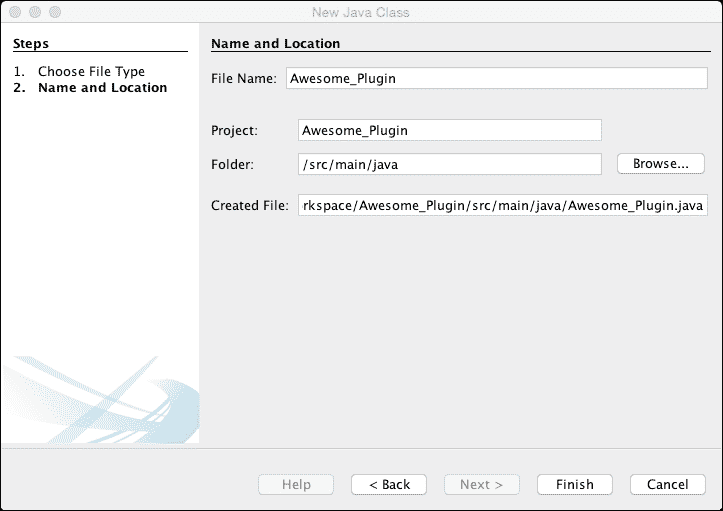

在这个例子中，文件名需要设置为 `Awesome_Plugin`，因为这是我们迄今为止使用的 `artifactId`。我们希望放置文件的文件夹需要指定为 `/src/main/java`，因为这是 POM 项目中使用的默认位置。由于我没有更改此值，因此我们还需要在这里指定它。如果你更改了源文件夹的位置，你需要在新的 Java 类和 POM 文件中指定它。点击 **完成** 后，文件将被创建并显示在你的项目中的一个新文件夹中。已添加 `Source Packages` 文件夹，其中包含一个名为 `<default package>` 的包，该包包含你的源文件 `Awesome_Plugin.java`。

### 注意

如果你希望将插件放置在指定的包中，你可以在源文件中添加一个包声明，并要求 NetBeans 将文件移动到正确的文件夹。这可以在我们添加包声明之后完成。然后，当光标位于包声明上时，我们可以按*Alt* + *Enter*，从上下文菜单中选择**将类移动到正确文件夹**。本例假设我们保留了默认包。

当我们现在构建项目时，我们将看到构建成功，这意味着构建的设置是正确的。然而，当我们尝试运行项目时，我们需要提供主类：

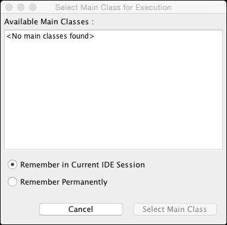

现在的问题是，我们在这个阶段还没有主类。源代码中只有类声明，但我们还没有添加任何代码或主方法。为了解决这个问题，我们需要在源文件中添加一个主方法：

```java
public static void main(String[] args) {
  //set the plugins.dir property to make the plugin appear in the Plugins menu
  Class<?>clazz = Awesome_Plugin.class;
  String url = clazz.getResource("/" + clazz.getName().replace('.', '/') + ".class").toString();
  int lastIdx = url.lastIndexOf('/');
  String pluginsDir = url.substring(5, lastIdx);
  System.setProperty("plugins.dir", pluginsDir);

  // start ImageJ
  new ImageJ();
}
```

这是一个在 Java 程序中常见的标准主方法。对于 ImageJ 插件来说，这个方法不是必需的。插件的标准入口通常是 run 方法（`Plugin`和`PlugInFilter`）或构造函数（`PlugInFrame`）。这个主方法仅用于 Maven 构建过程，并确保通过实例化一个新的 ImageJ 对象来启动 ImageJ。

第一行获取我们创建的插件类的引用。在下一行，我们提取了包括类文件在内的完整路径。这个 URL 将具有以下格式：`file:/path/to/Awesome_Plugin.class`。在下一行，我们使用`lastIndexOf()`方法从 URL 的开始和结束部分分别移除了`file:`和`Awesome_Plugin`部分。`clazz.getName()`调用将返回一个字符串，其格式如下：

+   `class Awesome_Plugin`

+   `class package.name.Awesome_Plugin`

如果你为你的插件使用了包，则将使用第二种格式，而当你从插件中省略包声明时，将使用第一种格式。使用`lastIndexOf()`方法，我们可以在路径中包含包文件夹，从而实现无错误的编译和插件在**插件**菜单中的正确放置。然后，我们将包含类的文件夹添加到`plugins.dir`属性中。最后，我们将通过使用`new`关键字调用新实例来启动 ImageJ。

在这个阶段，我们有足够的代码来运行和调试我们的插件。当我们现在运行项目时，ImageJ 应该打开，插件应该在**插件**菜单中可见。我们可以选择它，但当我们从菜单中选择插件时可能会生成错误：

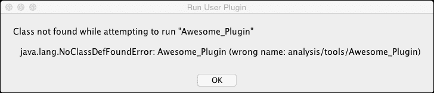

这将发生在你在类文件中使用了包定义的情况下（在我的例子中，我使用了`analysis.tools`包）。你可以通过在主方法的末尾添加以下行来解决此问题：

```java
// run the plugin
IJ.runPlugIn(clazz.getName(), "");
```

这将在 ImageJ 启动后立即运行插件。如果您没有在类中定义包声明，您就不会遇到这个问题。因此，从开发不带包声明的源文件插件开始更容易。在接下来的章节中，我们将探讨要使插件功能化需要做什么。

### 创建 ImageJ2 插件

创建 ImageJ2 插件的步骤与上一节中采取的步骤非常相似。只需在`<dependencies>`标签内的 POM 文件中进行微小更改：

```java
<dependencies>
  <dependency>
    <groupId>net.imagej</groupId>
    <artifactId>imagej</artifactId>
  </dependency>
</dependencies>
```

通过将`<artifactId>`标签的值从`ij`更改为`imagej`，我们指定我们希望实现一个 ImageJ2 实例。当我们**保存并构建**项目时，我们会看到`imagej-2.0.0-rc-41.jar`文件已替换了早期的`ij-1.50a.jar`文件。我们还需要 ImageJ2 项目的仓库：

```java
<repositories>
  <repository>
    <id>imagej.public</id>
    <url>http://maven.imagej.net/content/groups/public</url>
  </repository>
</repositories>
```

需要进行的最后一个更改是在插件源代码中。我们需要使用不同的导入语句并更改启动 ImageJ 的方式：

```java
import net.imagej.ImageJ;
[...]
public static void main(String[] args) {
  [...]
  // start ImageJ
  final ImageJ ij = net.imagej.Main.launch(args);
}
```

在插件中使用的 ImageJ2 语法与 ImageJ1.x 不同，这是我们将在下一章讨论的主题。

## 使用 IDE 的优缺点

使用 NetBeans 等 IDE 有一些好处，可以帮助您编写代码。有自动纠正编码错误和自动导入依赖项的选项。缺点不是很大，但使用 IDE 在准备和设置方面有很多开销。无论 IDE 多么完善，它仍然不能告诉您如何解决问题。此外，在某些情况下，直接使用 Fiji 提供的脚本编辑器输入代码可能更快。IDE 也不太适合开发 ImageJ 宏，因为 ImageJ 中的宏不编译，因此不易集成到 IDE 的工作流程中。

# 摘要

在本章中，我们探讨了 ImageJ 中可用的宏和插件框架。我们查看了一些 ImageJ API 公开的结构，用于脚本和插件。最后，我们描述了如何设置 IDE 以开发 ImageJ 和插件，无论是作为独立项目还是基于 Maven 的项目。您还看到了如何使用 Javadoc 工具生成文档。

在下一章中，我们将探讨一些可用的插件以及它们如何解决图像处理问题。
