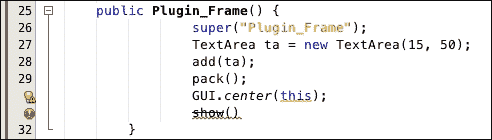
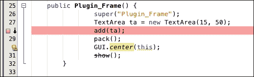
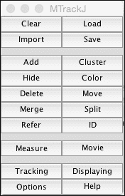
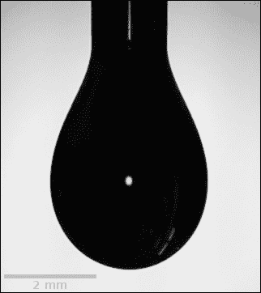

# 第八章：ImageJ 插件的解剖结构

在本章中，我们将探讨 ImageJ 中插件的组织方式和在主界面中的实现方式。我们将探讨传统的插件（ImageJ1.x）以及基于 SciJava 模型的新的格式（ImageJ2）。本章将讨论以下主题：

+   ImageJ1.x 和 ImageJ2 中插件的基本结构

+   插件类型

+   实现插件

+   宏和插件的组合

+   运行和调试插件

+   可用插件的示例

# 插件的基本结构

ImageJ 中的插件必须遵循特定的规则。语法遵循 Java 语言，但其中一些元素是 ImageJ 特有的。在接下来的几节中，我将讨论 ImageJ1.x 插件（以下简称**传统**）和基于 SciJav 的新约定和结构（以下简称**scijava**）。请注意，当使用 scijava 模型时，运行和编译插件时必须使用 Java 1.7.x 或更高版本。此外，scijava 模型是考虑到 Maven 和 Git 系统设计的。这意味着在为 ImageJ 的未来版本开发插件时，使用这些系统是有利的。接下来的几节将探讨两种格式中插件的基本结构。

## 传统的插件

ImageJ1.x 中的插件必须遵循特定的规则。语法遵循 Java 语言，但其中一些元素是 ImageJ 特有的。传统的插件包括三种主要类型的插件：基本的`PlugIn`、`PlugInFilter`和`PlugInFrame`。接下来几节将分别介绍这些类型及其用例。

### `PlugIn`类型

`PlugIn`类型用于基本插件，这些插件不需要设计上打开图像。`PlugIn`类型是一个 Java 接口，它只有一个需要重写的方法，即`run()`方法。`PlugIn`类型的`run()`方法是此类型的入口点，之后可以使用 Java 语法以任何形状或形式进行结构化。这个插件非常基础，但可以执行任何你可以设计的任务。它还可以处理图像。然而，选择图像或为处理打开图像需要程序员显式处理。此外，在处理之前检查图像类型也需要程序员显式验证。

### `PlugInFilter`类型

此类插件在执行时需要打开一个图像，并且图像也是插件的一个输入参数。它有两个方法需要程序员重写：`setup()` 方法和 `run()` 方法。`setup()` 方法对图像进行基本检查，并允许插件验证当前图像是否满足处理所需的条件。它返回一个整数值，表示插件可以处理哪些类型的图像。当你想指定图像类型时，可以使用为 `PlugInFilter` 接口定义的字段：

+   `DOES_ALL`: 这些是可以处理的任何类型的图像

+   `DOES_8G`: 这些是 8 位灰度图像

+   `DOES_16`: 这些是 16 位灰度图像

+   `DOES_32`: 这些是 32 位浮点图像

+   `DOES_RGB`: 这些是 RGB 图像

+   `DOES_STACKS`: 这些是所有类型的栈（通道、切片或帧）

当使用 `DOES_STACKS` 字段时，请注意，任何多维图像都将被视为栈，处理将在图像中存在的所有通道、切片和/或帧上运行。使用此字段时，你必须进行检查以确保你的插件将处理正确的维度。如果图像不符合字段指定的类型，插件将终止并给出警告，说明图像类型不受插件支持。如果你希望支持不同类型，可以返回支持类型的总和。`run()` 方法是此类的主要入口点，尽管你也可以在 `setup` 方法中执行一些预处理。

### `PlugInFrame` 类型

此类插件旨在为你的插件创建一个用户界面。没有需要重写的方法，唯一需要的是类的构造函数。构造函数是插件的入口点。`PlugInFrame` 类型扩展了 **抽象窗口工具包** (**AWT**) 模型用于用户界面，可以填充控件或选项卡面板，以提供清晰的用户体验。此类不假设任何图像已打开，开发者需要实现所有用户界面的逻辑。

### 实现遗留插件

一旦您决定了插件类型，您需要做的就是实现您的插件。这听起来很简单，确实也是如此。在开始之前，您需要考虑一些事情。ImageJ 要求插件名称中包含下划线，以便在您使用单个类文件时，它可以在 **插件** 菜单中显示。当您将插件作为 **Java 归档**（**JAR**）文件开发时，此要求被取消。在创建您的插件时，您需要遵守 Java 语法。这意味着您需要声明和初始化您的变量。在创建函数时，您需要指定（如果有）返回类型和访问类型（公共/私有/受保护）。常规编码建议也适用于 ImageJ 插件。添加注释可能会有所帮助。您还可以使用在 第七章 中设置的 Javadoc 系统为您的函数创建文档，*ImageJ 构造解释*。这允许对您的代码进行全面的文档记录，并在您稍后需要修改某些内容时作为扩展记忆很有用。

在选择插件类型时，您需要考虑某些要点。当使用 `PlugInFilter` 时，在调用插件时将使用活动图像，导致图像被 ImageJ 锁定。当从您的插件外部对图像发出命令时，由于插件锁定，图像不可访问。这会导致出现 `Image locked` 错误。如果您希望在插件内部使用宏来处理图像，最好使用基本的 `PlugIn`（或 `PlugInFrame`）类型而不是 `PlugInFilter` 类型。在下一节中，我们将探讨 scijava 插件的构造。

### 结合宏和旧版插件

您还可以将宏和插件结合起来。您可以从插件内部使用运行命令来执行特定的宏或 ImageJ 命令。唯一的区别是您需要在其前面加上根类 `IJ`：

```java
IJ.run("Green"); //ImageJ command
String status = IJ.runMacro("/PATH/TO/Macro"); //macro
```

第一行将当前活动图像和通道的查找表更改为绿色。第二行将运行由路径指定的宏。`runMacro` 方法返回一个包含宏的返回值的字符串，或者如果宏不返回值，则返回 `NULL`。如果宏被中止或遇到错误，它返回 `[Aborted]`。`IJ` 类包含一些有用的方法，允许我们运行宏和插件，以及使用打开对话框打开图像。另一个有用的方法是 `IJ.log()` 方法，它接受将在日志窗口中显示的字符串。这可以用于为用户提供反馈以及帮助调试插件，正如将在后面的章节中展示的那样。在 第九章，*创建用于分析的 ImageJ 插件* 中，我们将查看一个基本实现，其中我们在 `PlugInFilter` 内部结合 ImageJ 命令。

## SciJava 插件

自从 ImageJ 开发以来，许多插件都是使用前面描述的遗留系统构建的。然而，遗留格式设计中的某些不足迫使 ImageJ 核心进行了重新设计。这个新框架是 SciJava 框架，其核心是 scijava-common（以及其他组件）。以下章节将描述如何在新的框架中实现插件。需要注意的是，在 SciJava 框架中开发插件的方式并不将插件分割成与遗留系统相同类型。没有需要图像或创建用户界面的插件概念。在框架中，所有插件具有相同的结构，并且它们定义了所需的组件。

### @Plugin 注解

在 SciJava 框架中，插件是一个带有`@Plugin`注解的类。带有此注解的类会被 ImageJ 自动识别并索引，以便在用户启动插件时使用。在这个框架下，你通常会创建两种类型的插件之一：服务或命令。服务类型的插件将包含 ImageJ 内部使用的实用方法。服务提供可以在整个框架中使用的功能。另一方面，命令类型的插件旨在执行具有特定目标的特定功能。这些是用户在使用 ImageJ 界面时会遇到的插件类型：ImageJ 中的菜单项是一种命令类型插件。命令类型插件可以使用服务方法来执行常见任务，如打开图像。

无论你创建命令或服务风格的插件，它们都会在所谓的`Context`中运行。在 SciJava 框架中，`Context`描述了插件将使用的服务和命令。它充当一种沙盒。无法直接在另一个插件的上下文中使用服务和命令的方法。如果需要这样做，你必须将你的外部插件注入到你希望使用其方法的插件的上下文中。或者，你可以在上下文中使用特殊注解请求一个服务，使用`@Parameter`注解请求你的插件中类型的实例。例如，如果你想在插件中使用`logService`以允许记录事件，你可以使用以下注解：

```java
@Parameter
private logService logService;
```

当插件运行时，上下文将自动生成一个`logService`实例，并允许你访问其方法：

```java
public void log(String msg) {
  logService.info(msg);
}
```

在接下来的章节中，我们将更详细地探讨`@Plugin`注解的两种基本类型。

### 服务

SciJava 框架包含大量通用服务，可用于执行基本任务和处理数据集。其中一些更重要服务包括以下服务：

+   `AppService`：这处理应用程序（即 ImageJ）

+   `EventService`：这处理鼠标点击等事件

+   `PluginService`：这涉及可用的插件及其执行

+   `DatasetService`：这涉及处理图像数据的相关工具

+   `OverlayService`：这涉及处理叠加和 ROIs 的工具

要创建自己的服务，您需要为其创建一个上下文并定义其方法。如果您希望使用 SciJava 框架中可用的通用服务，您可以将它们作为参数添加到自己的服务中。这允许非常可扩展的代码，可以反复一致地重用。在大多数情况下，您将使用`@Parameter`注解在您的插件中获取这些服务的引用，从而获得其方法和功能。

### 命令

当您自己创建插件时，命令类型将是最常用的类型。命令描述了面向用户的插件，并描述了用户可以通过启动命令执行的操作。在创建插件时，您可以指定类型为`Command`类，并可以指定命令将在菜单结构中的位置：

```java
@Plugin(type=Command.class, menuPath="Plugins>My Menu>My Plugin")
public class My_Plugin implements Command {
  //code for the plugin

}
```

类型指定此插件关注命令接口，它按照类定义实现。`menuPath`参数允许您设置插件被发现时放置的菜单位置。这允许对您的插件进行精细控制和分组。在这种情况下，在 ImageJ 插件菜单中的预定义子菜单（**我的菜单**）内。

# 运行和调试插件

创建完您的代码后，您就可以编译它了。Java 不是一种解释型语言，需要将源代码编译成字节码，以便由**Java 虚拟机**（**JVM**）处理。根据您如何开发代码，有不同的方法可以采取。您可以直接使用 ImageJ，使用 Fiji 代码编辑器，或使用 NetBeans IDE。您采取的方法也取决于您是在开发遗留插件还是 scijava 插件。以下章节将首先查看遗留插件。

## 编译插件

由于 Fiji 基于 SciJava 框架，编译和运行插件在 vanilla ImageJ 和 Fiji 之间略有不同。此外，当使用 IDE 时，编译和运行您的插件将涉及不同的步骤。

当您使用 vanilla ImageJ 编写完插件的源代码后，您可以通过先编译它然后运行它来运行插件。要这样做，请转到**插件** | **编译和运行…**并选择您的插件。如果您的代码编写正确，它将编译并运行。如果在编译过程中出现任何错误，将弹出一个错误对话框，指示哪些行包含错误。大多数情况下，错误消息可能非常晦涩，并且不一定直接指向代码失败的地方。

如果您正在使用 Fiji，您可以使用脚本编辑器窗口底部的**运行**按钮编译和运行您的插件。**编译和运行…**方法在 Fiji 中不可用！任何错误消息都将显示在下面的字段中，以指示编译或运行失败的原因。

如果您正在使用 IDE 进行开发，您可以使用 IDE 的编译功能。在 NetBeans 中，您可以通过转到**运行** | **编译文件**或按*F9*来编译您的文件。如果在编译过程中没有错误，您可以通过菜单中的**运行** | **运行项目**或按*F6*来运行您的插件。如果没有发现错误，将启动 ImageJ 的新实例，在**插件**菜单下，您开发的插件应该会出现。语法错误将阻止编译，IDE 将使用带有白色感叹号的红色符号（以及红色波浪线）突出显示这些错误：



当指针悬停在页边距上的红色符号上方时，会给出有关错误的建议。在这种情况下，消息告诉我们期望在语句的末尾出现`;`。上面的符号不表示错误，而是一个警告。警告不会阻止编译或阻止插件的运行。然而，它们可能在运行时引起问题。在这个例子中，警告告诉我们使用构造函数中使用的`this`关键字是不建议的，可能会引起问题。对于基于 SciJava 框架的插件，程序和结果都是相同的。然而，有一些重要的事情需要考虑。下一节将简要解释一些主要点。

### 编译 SciJava 插件

要编译实现 SciJava 框架的插件，您需要确保您拥有所有依赖项，以及您将要运行插件的 ImageJ 框架支持该框架。对于 Fiji 来说，这不是问题。它默认已经运行在框架上。您也可以使用纯 ImageJ，但您必须确保它是 ImageJ2 版本，而不是**ImageJ1.x**版本。

### 注意

您可以通过单击主界面的状态栏来检查您正在使用哪个版本。如果它显示类似*ImageJ 2.0.0-[…]*的内容，则表示您正在使用 ImageJ2。如果它显示类似**ImageJ 1.50a**的内容，那么您正在运行**ImageJ1.x**版本。

由于框架的模块化特性，强烈建议您使用 Maven 工具创建和编译您的插件。这将处理构建插件所需的所有依赖项。为了使这个过程更加流畅和高效，使用支持 Maven 的 IDE 是一种最佳实践，尽管如果您愿意，也可以使用**命令行界面**（**CLI**）。为了刷新您的记忆，请参考上一章，其中解释了如何使用基于 Maven 的插件设置您的 IDE。

要使用基于 Maven 的项目使用 NetBeans 编译你的插件，你只需选择你的项目，然后转到 **运行** | **构建项目** 或按 *F11*。要启动你的插件，从菜单转到 **运行** | **运行项目** 或按 *F6*。在编译过程中遇到的问题将以与旧插件描述的类似方式显示。

## 调试插件

由于 ImageJ 是一个运行代码的工具，它没有很多调试代码的实用工具。但这并不意味着不可能进行一些调试。对于旧插件，你可以使用 `IJ.log` 方法。对于基于 SciJava 框架的插件，你可以在声明 `@Parameter` 之后使用 `logService` 并使用 `info()` 和 `warn()` 方法来创建所需服务的实例。这种调试插件方法的示例用法如下：

```java
int someVar = 1;
int newVar = doSomething(someVar);

//legacy method
IJ.log("Old value: "+someVar+"; New value: "+newVar);

//SciJava method
logService.info("Old value: "+someVar+"; New value: "+newVar);
```

当使用此类方法时，包含一个简单的控制语句，如 `if` 语句，可能很有用。这允许你轻松地禁用或控制插件最终版本中进行的日志记录量。使用设置调试级别的全局变量，你可以控制是否显示特定的日志消息：

```java
private static int dbglvl = 3;
...

//implement the logging based on the dbglvl value
if (dbglvl> 2) {
  IJ.log("The current value is "+currValue);
}
...
//implement the logging based on the dbglvl value
if (dbglvl> 4) {
  IJ.log("This statement was evaluated...");
}
```

在这种情况下，全局变量 `dbglvl` 将决定哪些消息将被显示。第一个 `if` 语句将以当前的调试级别（设置为 `3`）执行，而第二个语句在当前级别下将不会显示。在你的插件最终版本中，你可以将 `dbglvl` 的值更改为 `1` 或 `0` 来禁用所有低级别的调试语句。请注意，这假设 `dbglvl` 的较高值与较小的日志语句相关联，而较低值只会显示最基本的消息。最后，当代码运行正确时，你可能想要移除所有的 `if` 语句。每个语句的评估确实需要一定的时间，所以最终会减慢你的代码执行速度。

当使用 NetBeans IDE 开发插件时，有更多选项可以调试和性能分析你的代码。使用像 NetBeans 这样的 IDE 的优点是，你可以在希望停止插件执行并查看变量内容的地方设置断点。要做到这一点，请点击你希望停止的行之前的边缘。将显示一个红色方块，表示断点：



整行也会被涂成红色，以指示在运行时调试器将等待的行。记住，如果你在一个永远不会执行的语句中设置断点，调试器将永远不会停止，你的代码将无间断地运行。

要使用调试器运行代码，您可以转到**调试** | **调试项目（…**）或按键盘上的*Ctrl* + *F5*。当调试器遇到断点时，该行将变为绿色，您可以使用不同的单步执行功能继续操作。在 IDE 底部的变量标签页中，您将看到当前断点处可用的所有变量。请注意，您还可以评估表达式并更改当前分配给变量的值。这样做可能会导致问题或可能导致无限循环或崩溃，因此在更改值时要小心！

此外，还有一个分析器可以帮助识别在处理速度或内存使用方面效率不高的代码部分。然而，当开发简单的插件时，许多这些高级功能并非总是必要的。一旦您通过选择**分析** | **分析项目（…**）来启动分析器，您可以选择是否要监控 CPU 处理、**垃圾回收（GC**）和/或内存使用。您可以使用遥测来查看是否存在 CPU 周期过多以及垃圾回收和内存管理方面的问题。分析器的使用超出了本书的范围。然而，网上有关于如何使用和解释分析结果的一些优秀资源。

由于分析应用程序非常接近一种艺术形式，因此请谨慎使用，并且仅在您真正注意到应用程序中非常缓慢的性能或内存问题时才使用。您希望为您的插件投入多少开发开销，应始终与您获得的时间量权衡。花费数小时优化代码或算法，以便它执行快 1 秒可能并不值得，如果它只被调用一次，并且是更大命令链的一部分。然而，如果您优化在循环中调用数百次的代码，优化可能值得额外的开发时间数倍。

在下一节中，我们将探讨一些可用于科学研究的插件。

# 可用插件的示例

在本节中，我将讨论一些 ImageJ 可用的插件，其中大部分也已在科学期刊上发表。它们将向您展示如何使用 ImageJ 进行高级图像处理，具有不同程度的自动化和用户交互。它们还提供了一些插件设计的示例，无论是拥有自己的界面还是仅作为一个执行的单个命令。其中一些示例还提供了源代码，以便您可以了解开发者如何实现他们的算法。请注意，拥有源代码并完全理解它可能很困难：这取决于代码中的文档或注释水平。完全追踪代码的功能可能非常困难。随着程序的增长和新功能、算法的添加，它从单一核心算法偏离到更复杂的文件组。使用 IDE 中可用的 Javadoc 功能，开发者可以相对容易地创建详细的文档，使代码理解稍微容易一些。

在尝试分析源代码时，一个非常重要的点是意识到哪个文件或函数是程序的入口点。你可以确信，当代码执行时，它总是会进入这个主入口点，并且每个用户交互或函数都会在主入口点设置。不同类型插件的入口点已在前面章节中指示。此外，使用 SciJava 框架开发的插件通常有一个`main()`方法，但这不一定是插件的入口点。这取决于插件启动的方式。当通过 Maven 使用 IDE 启动时，`main()`方法用于实例化 ImageJ 并启动插件。然而，当使用例如菜单从 ImageJ 实例启动插件时，`main()`方法将不会被调用。

当为你的插件使用界面时，大部分动作都来自于用户按下按钮、向字段添加数字或选择一个选项。`main`界面只是等待用户进行操作。在 Java 中，这意味着`ActionPerformed()`方法成为许多算法或处理的入口点。当用户点击按钮时，这将触发一个动作事件，程序员可以使用它来捕获并连接到后续语句。首先，我们将查看一些在 ImageJ 网站上可用的插件示例（[`imagej.nih.gov/ij/plugins/index.html`](http://imagej.nih.gov/ij/plugins/index.html)），以展示如何开发 ImageJ 解决方案来解决图像处理问题。

## ImageJ 和 Fiji 中可用的示例插件

ImageJ 提供了一大批插件，这些插件扩展了核心功能。随着 ImageJ2 的到来，插件分发模型也在发生变化。在较旧的 ImageJ1.x 框架中，您需要下载一个插件的源文件或编译的.class 文件，并将其放置在插件文件夹中。当插件更新时，您需要重复整个过程。在 ImageJ2 中，提供了一个更新机制，它使用一个存储库系统。在这个系统中，ImageJ 与存储库之间的通信将确定是否有可用的更新。当有更新时，用户可以自动安装更新，而无需搜索插件。

对于大多数可用的插件，可以查看或研究源代码，以了解其他人如何解决特定的图像处理问题。以下是一些示例插件，我将描述它们旨在解决的问题或挑战。然后，我会展示一些代码来解释插件是如何尝试解决问题的。如果可以的话，请随意查看或下载源代码，以查看完整的实现。

### MultipleKymograph

这样的插件示例是**MultipleKymograph**插件（`MultipleKymograph_.java`），它沿着（分割的）线选择创建一个 kymograph。它由德国海德堡的**欧洲分子生物学实验室**（**EMBL**）的 Jens Rietdorf 和 Arne Seitz 设计。它包含一组小工具和宏，可用于创建和测量 kymographs。我们已经在第五章中看到了 kymographs，*使用 ImageJ 的基本测量*，我们看到了它们如何可视化时间序列中的动态。在那里，我们使用**Reslice**命令生成 kymograph，这效果不错，但这种方法有几个小缺点。

第一个问题在于**Reslice**只考虑所选线上的像素。这使得它对线的放置不准确和像素噪声更加敏感。**MultipleKymograph**插件是一个遗留插件，它通过为用户提供一个输入字段来请求用于创建平均输出像素的线宽，试图解决这个问题。当用户在没有线选择或打开图像的情况下调用插件时，它会生成一个错误消息，指示用户在调用插件之前需要采取行动。由于 kymograph 图像的创建本身取决于像素的正确值，我将重点介绍插件是如何计算用户放置的线的平均像素强度的。

像素值的主要生成发生在`sKymo(…)`方法中，其定义如下：

```java
public double[] sKymo(ImagePlus imp, ImageProcesso rip, Roi roi, int linewidth, int proflength){

  int numStacks=imp.getStackSize();
  int dimension = proflength*numStacks;
  double[] sum = new double [dimension];

  int roiType = roi.getType();
  int shift=0;
  int count=0;

  for (int i=1; i<=numStacks; i++) {
    imp.setSlice(i);

    for (int ii=0;ii<linewidth;ii++){
      shift=(-1*(linewidth-1)/2)+ii;

      if (roiType==Roi.LINE) {
        profile = getProfile(roi,ip,shift);
      }
      else {
        profile = getIrregularProfile(roi, ip,shift);
      }
      for (int j=0;j<proflength;j++){
        count = (i-1)*proflength+j;
        sum[count]+=(profile[j]/linewidth);
      }
    }
  }
  return sum;
}
```

返回的`sum`变量包含沿堆栈的平均轮廓的结果。该方法需要五个输入参数，如下所述：

+   `ImagePlus imp`: 这是我们想要用于计算的源堆栈

+   `ImageProcessor ip`: 这是用于访问堆栈像素的图像处理器

+   `Roi roi`: 这是要制作成轨迹图的线的标记区域（ROI）

+   `int linewidth`: 这是由用户输入指定的线宽

+   `int proflength`: 这是由用户指定的线长

方法首先声明处理所需的参数。具体来说，输出变量`sum`被定义为长度等于线长度乘以切片数（或帧数）的`double[]`向量。然后方法遍历堆栈中的切片（外层 for 循环）并使用名为`getProfile()`或`getIrregularProfile()`的方法检索轮廓。这些方法从选择中提取像素值，其中位移参数确定线相对于选择的移动距离。两者之间的唯一区别是，一个用于直线（`getProfile`），而另一个用于分割线（`getIrregularProfile`）。为了简洁起见，我将只展示前者的代码：

```java
double[] getProfile(Roi roi,ImageProcessor ip, int shift){
  double[] values;

  int x1=((Line)roi).x1;
  int x2=((Line)roi).x2;
  int y1=((Line)roi).y1;
  int y2=((Line)roi).y2;

  ((Line)roi).x1=x1+shift;
  ((Line)roi).x2=x2+shift;
  ((Line)roi).y1=y1+shift;
  ((Line)roi).y2=y2+shift;

  values=((Line)roi).getPixels();
  ((Line)roi).x1=x1;
  ((Line)roi).x2=x2;
  ((Line)roi).y1=y1;
  ((Line)roi).y2=y2;

  return values;
}
```

此方法接受用户指定的 ROI，并将其在`shift`参数指定的量上移动。然后它使用`Roi`类的`getPixels()`方法提取灰度值并返回它们。由于线仅由两个点定义，每个点都有一个*x*和*y*坐标，因此此方法相当简短。不规则情况要求将线沿所有定义分割线的*N*个坐标移动。否则，它以相同的方式工作。

### ColorTransformer2

这个遗留插件在处理彩色图像时很有用，例如由数码彩色相机或网络摄像头等设备获取的图像。它最初由 Maria E. Barilla 开发为**ColorTransformer**，并由 Russel Cottrell 修改，形成了**ColorTransformer2**插件。源代码可以在[`www.russellcottrell.com/photo/downloads/Color_Transformer_2.java`](http://www.russellcottrell.com/photo/downloads/Color_Transformer_2.java)找到。

对于彩色图像，如 RGB 图像，一个问题是在 RGB 颜色空间中强度定义得不是很好。浅蓝色可能看起来比深蓝色更亮，但蓝色通道的强度值对于深蓝色可能比浅蓝色更高。为了有效地根据特定颜色对 RGB 图像进行分割，最好将其转换为一个更适合此目的的颜色空间。HSB 颜色空间将图像分为三个组成部分：**色调**、**饱和度**和**亮度**（有时也称为**值**或**强度**）。色调表示从红色到橙色、黄色、绿色、青色、蓝色和洋红的颜色范围。有关 HSB 颜色空间使用的详细信息，请参阅 *Basic Image Processing with ImageJ* 的 第二章。

此插件实现了一个 `PlugInFilter`，这意味着它覆盖了 `setup()` 和 `run()` 方法，这些方法构成了插件的入口点。设置方法检查是否有图像打开，并筛选出此插件可以处理的图像类型。运行方法显示一个对话框，允许用户选择要转换的颜色空间。我想在这里描述的方法是从 RGB 到 HSI 的转换，这是在基于颜色进行分割时常用的格式。

执行实际 RGB 到 HSI 转换的主要方法是 `getHSI()` 方法。此方法如下所示：

```java
public void getHSI(){
  for(int q=0; q<size; q++){
    float var_Min = Math.min(rf[q], gf[q]); //Min. value of RGB
    var_Min = Math.min(var_Min, bf[q]);
    float var_Max = Math.max(rf[q], gf[q]); //Max. value of RGB
    var_Max = Math.max(var_Max, bf[q]);
    float del_Max = var_Max - var_Min;      //Delta RGB value

    c3[q] =  (rf[q] + gf[q] + bf[q])/3f;

    if ( del_Max == 0f ){ //This is a gray, no chroma...
      c1[q] =  0f; //HSL results = 0 ? 1
      c2[q] =  0f;
    }
    else{//Chromatic data...
      c2[q] = 1 - (var_Min / c3[q]);

      float del_R = (((var_Max-rf[q])/6f)+(del_Max/2f))/del_Max;
      float del_G = (((var_Max-gf[q])/6f)+(del_Max/2f))/del_Max;
      float del_B = (((var_Max-bf[q])/6f)+(del_Max/2f))/del_Max;

      if(rf[q] == var_Max) c1[q] = del_B - del_G;
      else if(gf[q] == var_Max) c1[q] = (1f/3f)+del_R-del_B;
      else if(bf[q] == var_Max) c1[q] = (2f/3f)+del_G-del_R;

      if (c1[q] < 0)  c1[q] += 1;
      if (c1[q] > 1)  c1[q] -= 1;
    }
  }
}
```

这些转换基于 *Color Vision and Colorimetry, Theory and Applications*，*D Malacara* 中描述的方法。转换基于将存储在 `rf`、`gf` 和 `bf` 数组中的原始 RGB 值进行转换。转换后的值存储在 `c1`、`c2`、`c3` 和可选的 `c4` 数组中。对于转换到 HSI，不使用 `c4` 数组，因为 HSI 图像只有三个通道。例如，CMYK 颜色空间需要所有四个通道。在运行方法结束时，通道的值放置在一个新的图像中，这将变成转换后的图像。

### MtrackJ

当您希望随时间跟踪对象，并且可选地在三维空间中跟踪时，此插件非常有用。它是由瑞士洛桑大学的埃里克·梅耶林格（Eric Meijering）开发的。源代码可以在 GitHub 上找到：[`github.com/fiji/MTrackJ/`](https://github.com/fiji/MTrackJ/)。它发表在 2012 年 2 月的 *Methods in Enzymology*，*vol 504* 上。该插件的主要界面由一组按钮组成，允许您添加、删除或移动轨迹或点，并执行测量或更改设置：



此插件的功能是在时间上跟踪物体或粒子，以确定它们的速度和方向。尽管存在自动跟踪算法，但某些数据对于自动跟踪算法来说太难或太密集，无法处理。对于这些类型的挑战，此插件将提供一个工具，可以帮助确定物体的有用参数。此插件的目标与之前描述的**MultipleKymograph**插件类似：测量多个物体的速度。当创建并测量轨迹时，结果将在结果窗口中显示。然后，这些结果可以用于在 ImageJ 之外直接绘图和分析，或者作为更高级分析输入。

由于这个插件功能相当全面，具有许多特性，我将重点关注一个非常微小的细节，这个细节使得该界面在跟踪物体时具有惊人的准确性。在通过**跟踪**按钮访问的跟踪选项中，您可以设置鼠标光标的吸附功能。这种功能可能对许多人来说都很熟悉。许多不同的应用程序都使用它来使对齐物体更加均匀和简单。当您勾选**在跟踪期间应用局部光标吸附**复选框时，您可以选择一个吸附功能。这个吸附功能将决定您将鼠标光标定位在要添加跟踪点的物体上时的情况。如果没有吸附，它将被放置在您点击的像素上。然而，当使用**明亮质心**作为吸附功能时，会发生一些有趣的事情（当使用荧光图像时）。当您通过点击添加跟踪点时，**MtrackJ**会确定您定义的吸附范围的质心。质心是加权强度点，不一定是单个像素，但它可以是像(*x = 12.4, y = 13.45*)这样的位置。对于信噪比良好的图像数据，您可以实现比光学系统提供的更好的跟踪分辨率（所谓的亚像素分辨率）。吸附坐标的位置是通过名为`snapcoords()`的方法计算的。我不会复制整个方法，因为它相当复杂，但我将向您展示它是如何实现明亮质心计算的：

```java
double ox=0, oy=0;
switch (settings.snapfeature) {

 //other cases skipped

  case MTJSettings.BRIGHT_CENTROID: {
    // Make all weights > 0:
    if (minval<= 0) {
      final double offset = -minval + 1;
      for (int y=0; y<snaprect.height; ++y)
        for (int x=0; x<snaprect.width; ++x)
          snaproi[y][x] += offset;
        minval += offset;
        maxval += offset;
      }
      // Calculate Otsu threshold:
      double otsu = minval;
      final double maxi = OTSU_BINS;
      final double range = maxval - minval;
      double maxvari = -Double.MAX_VALUE;
      for (int i=1; i<OTSU_BINS; ++i) {
        double sum1=0, sum2=0, n1=0, n2=0;
        final double thres = minval + (i/maxi)*range;
        // Notice that we always have minval<thres<maxval,
        // so sum1, sum2, n1, n2 are > 0 after the loop:
        for (int y=0; y<snaprect.height; ++y)
        for (int x=0; x<snaprect.width; ++x) {
          final double val = snaproi[y][x];
          if (val<thres) { ++n1; sum1 += val; }
          else { ++n2; sum2 += val; }
        }
        final double mean1 = sum1/n1;
        final double mean2 = sum2/n2;
        final double vari = n1*n2*(mean1-mean2)*(mean1-mean2);
        if (vari > maxvari) {
          maxvari = vari;
          otsu = thres;
        }
      }
      // Calculate centroid >= threshold:
      double val=0, sum=0;
      for (int y=0; y<snaprect.height; ++y)
      for (int x=0; x<snaprect.width; ++x) {
        val = snaproi[y][x];
        if (val>= otsu) {
          val -= otsu;
          ox += x*val;
          oy += y*val;
          sum += val;
        }
      }
      ox /= sum; // sum can never be 0
      oy /= sum;
      break;
    }
  }
  snapos.x = snaprect.x + ox;
  snapos.y = snaprect.y + oy;
```

由于此插件支持多种吸附方法，因此在这个`switch`语句中有多个情况，为了简洁起见，我省略了它们。该方法的目标是为`snapos.x`和`snapos.y`变量分配值。对于明亮质心方法，使用基于**Otsu**方法的阈值。在第一个使用*x*和*y*索引的循环中，我们遍历了吸附矩形的像素，并将所有高于阈值值(`thres`)的像素强度(`val`)求和到`sum2`中，并将低于阈值的强度求和到`sum1`中。我们使用这些值来计算变化，如果它超过了矩形中的最大值，我们就调整值和 Otsu 阈值值。

在对捕捉矩形中的像素进行第二次循环时，通过将每个像素的*x*和*y*坐标乘以 Otsu 阈值以上的强度并求和来确定质心。还保持一个高于阈值的强度的累积和，并用于除以最终坐标。这些最终值用于`draw()`方法函数中，该函数在图像中显示明亮的质心：

```java
public void draw(final Graphics g) { try {

  if (!(g instanceofGraphics2D)) return;
  final Graphics2D g2d = (Graphics2D)g;

 //some code skipped for brevity...

  // Draw snapping objects:
  if (snapping()) {
    g2d.setColor(settings.hilicolor);
    try { g2d.setComposite(settings.snapopacity); } catch
    (Throwable e) { }
    // Snap ROI:
    g2d.setStroke(settings.snapstroke);
    final int slx = (int)((snaprect.x-vof.x + 0.5)*mag);
    final int sly = (int)((snaprect.y-vof.y + 0.5)*mag);
    final int sux = (int)((snaprect.x+snaprect.width-vof.x-0.5)*mag);
    final int suy = (int)((snaprect.y+snaprect.height-vof.y-0.5)*mag);
    g2d.drawLine(slx,sly,sux,sly);
    g2d.drawLine(sux,sly,sux,suy);
    g2d.drawLine(sux,suy,slx,suy);
    g2d.drawLine(slx,suy,slx,sly);
    // Snap cursor:
    g2d.setStroke(settings.pointstroke);
    final int xi = (int)((snapos.x - vof.x + 0.5)*mag);
    final int suy = (int)((snapos.y - vof.y + 0.5)*mag);
    final int hps = 6;
    g2d.drawLine(xi,yi-hps,xi,yi+hps);
    g2d.drawLine(xi-hps,yi,xi+hps,yi);
  }
}
```

此方法使用由`g2d`引用的`Graphics2D`对象创建一个表示捕捉区域的正方形框（`// Snap ROI`部分），其大小由`snaprect`对象的值确定。最后，它绘制一个小`+`来指示由`snapos.x`和`snapos.y`变量定义的捕捉坐标（`// Snap cursor`部分）。

### Coloc2

对于某些类型的研究问题，了解两个对象是否重叠或共定位是很重要的。**Coloc2**是一个由 Daniel J. White、Tom Kazimiers 和 Johannes Schindelin 开发的插件，包含在`Colocalisation_Analysis.jar`文件中。源代码可在 GitHub 上找到：[`github.com/fiji/Colocalisation_Analysis/`](https://github.com/fiji/Colocalisation_Analysis/)。Coloc2 命令用于测量两个图像之间的共定位，通常表示荧光图像中的不同通道。

主要功能放在`colocalise`方法中，该方法使用不同的方法比较两个图像之间的像素强度。作为此插件功能的一个示例，我将查看一个更基本的函数，该函数在 ROI 管理器中存在选择并需要用于共定位分析时使用。该方法称为`createMasksFromRoiManager`，并调用另一个称为`createMasksAndRois`的第二个方法：

```java
protected boolean createMasksFromRoiManager(int width, int height) {
  RoiManager roiManager = RoiManager.getInstance();
  if (roiManager == null) {
    IJ.error("Could not get ROI Manager instance.");
    return false;
  }
  Roi[] selectedRois = roiManager.getSelectedRoisAsArray();
  // create the ROIs
  createMasksAndRois(selectedRois, width, height);
  return true;
}

protected void createMasksAndRois(Roi[] rois, int width, int height) {
  // create empty list
  masks.clear();

  for (Roi r : rois ){
    MaskInfo mi = new MaskInfo();
    // add it to the list of masks/ROIs
    masks.add(mi);
    // get the ROIs/masks bounding box
    Rectangle rect = r.getBounds();
    mi.roi = new BoundingBox(
    new long[] {rect.x, rect.y} ,
    new long[] {rect.width, rect.height});
    ImageProcessor ipMask = r.getMask();
    // check if we got a regular ROI and return if so
    if (ipMask == null) {
      continue;
    }

    // create a mask processor of the same size as a slice
    ImageProcessor ipSlice = ipMask.createProcessor(width, height);
    // fill the new slice with black
    ipSlice.setValue(0.0);
    ipSlice.fill();
    // position the mask on the new  mask processor
    ipSlice.copyBits(ipMask, (int)mi.roi.offset[0],
    (int)mi.roi.offset[1], Blitter.COPY);
    // create an Image<T> out of it
    ImagePlus maskImp = new ImagePlus("Mask", ipSlice);
    // and remember it and the masks bounding box
    mi.mask = ImagePlusAdapter.<T>wrap( maskImp );
  }
}
```

第一步是从管理器中检索 ROI，使用`getSelectedRoisAsArray()`方法，然后将 ROI 传递给`createMasksAndRois`方法。该方法将区域存储在`mi.mask`变量中，以便`colocalise`方法可以使用。此插件使用从 ImageJ2 派生的一些结构。`ImagePlusAdapter`是`ImgLib2`库中的一个包装函数。这个便利方法允许 ImageJ1.x 图像被放置在 ImageJ2 使用的`ImgLib2`容器中。这些函数在 ImageJ1.x 和 ImageJ2 之间的转换期间是必不可少的，并允许互操作性。接下来，我将查看一个在 SciJava 框架内开发的插件，该插件使用注解和**命令和服务框架**专门为 ImageJ2 设计。

### Goutte_pendante

**Goutte_pendante**插件（悬滴）是由巴黎迪德罗大学的 Adrian Daerr 在 SciJava 框架下构建的插件。源代码可以在 GitHub 上找到：[`github.com/adaerr/pendent-drop`](https://github.com/adaerr/pendent-drop)。该项目使用 Maven 系统编写，因此我将简要展示`pom.xml`文件，作为在框架内定义插件的一个示例：

```java
<?xml version="1.0" encoding="UTF-8"?>
<project   xsi:schemaLocation="http://maven.apache.org/POM/4.0.0   http://maven.apache.org/xsd/maven-4.0.0.xsd">
  <modelVersion>4.0.0</modelVersion>
  <parent>
    <groupId>net.imagej</groupId>
    <artifactId>pom-imagej</artifactId>
    <version>7.1.0</version>
    <relativePath />
  </parent>
  <groupId>name.adriandaerr.imagejplugins.pendentdrop</groupId>
  <artifactId>pendent_drop</artifactId>
  <version>2.0.1</version>
  <name>Pendent Drop ImageJ Plugin</name>
  <description>Surface tension measurement through the pendent drop method.</description>
  <properties>
    <main-class>Goutte_Pendante</main-class>
  </properties>
  <repositories>
    <repository>
      <id>imagej.public</id>
      <url>http://maven.imagej.net/content/groups/public</url>
    </repository>
  </repositories>
  <dependencies>
    <dependency>
      <groupId>net.imagej</groupId>
      <artifactId>imagej</artifactId>
    </dependency>
  </dependencies>
</project>
```

你可以看到，使用 POM 模型的项目描述非常简单。《<parent>`标签描述了它使用了 ImageJ。依赖关系表明应使用 ImageJ2 代码库，如通过`<artifactId>`标签使用`imagej`而不是`ij`来标识 ImageJ1.x 插件。为 ImageJ2 构建的插件也倾向于有一个`main`方法。为了说明其功能，我将突出显示此插件`main`方法中的一些代码：

```java
public static void main(final String... args) throws Exception {
  final String testImagePath =
  "/home/adrian/Programmes/plugins_ImageJ_src/Traitement_Gouttes/src
  /test/resources/eauContrasteMaxStack.tif";

  // Launch ImageJ as usual.
  //final ImageJ ij = net.imagej.Main.launch(args);
  final ImageJ ij = new ImageJ();
  ij.ui().showUI();

  // Open test image.
  final ServiceHelper sh = new ServiceHelper(ij.getContext());
  final IOService io = sh.loadService(DefaultIOService.class);
  final Dataset dataset = (Dataset) io.open(testImagePath);

  // create a display for the dataset
  final ImageDisplay imageDisplay =
  (ImageDisplay) ij.display().createDisplay(dataset);

  // create a rectangle
  final RectangleOverlay rectangle = new
  RectangleOverlay(ij.getContext());
  rectangle.setOrigin(110, 0);
  rectangle.setOrigin(60, 1);
  rectangle.setExtent(340, 0);
  rectangle.setExtent(420, 1);
  rectangle.setLineColor(Colors.HONEYDEW);
  rectangle.setLineWidth(1);

  // add the overlays to the display
  final List<Overlay> overlays = new ArrayList<Overlay>();
  overlays.add(rectangle);
  ij.overlay().addOverlays(imageDisplay, overlays);
  for (final net.imagej.display.DataView view : imageDisplay) {
    if (view instanceofnet.imagej.display.OverlayView) {
      view.setSelected(true);
    }
  }

  // display the dataset
  ij.ui().show(imageDisplay);

  // Launch the "CommandWithPreview" command.
  ij.command().run(Goutte_pendante.class, true);
}
```

此代码仅在测试插件时使用，执行一些在测试代码时有用但在测试阶段之外使用插件时无用的步骤。它首先定义一个具有硬编码路径字符串的测试图像。然后执行所有 ImageJ 插件在其`main`方法中都会执行的步骤：启动 ImageJ 的一个实例。然后继续使用`IOService`打开指定的字符串指定的图像，并最终使用`ImageDisplay`服务显示它。此过程的结果是悬挂在孔上的液滴图像：



接下来，在打开的液滴图像上生成一个`rectangle`对象。此图像将被用作插件检测液滴的初始搜索空间。这是通过`net.imagej.overlay`包中的`RectangleOverlay`类完成的。最后，它将叠加层添加到显示中，并在方法的最后一句调用插件之前显示图像：

```java
ij.command().run(Goutte_pendante.class, true);
```

此插件中使用的模式与上一章中描述的模式类似。然而，这里增加了额外的步骤以确保插件快速且正确地工作。如果你通过 Fiji 的**更新站点**安装此插件，并尝试通过从菜单中选择**插件** | **液滴分析** | **悬滴**立即运行它，你会得到一个错误消息。此错误消息表明在执行`Goutte_pendante#paramInitializer`方法时出现错误。如果你运行**插件** | **液滴分析** | **关于悬滴**，你将看到一个简短的说明和使用部分。在用法部分，将解释为什么它失败了。当你启动它时，没有矩形 ROI 或图像。在关于对话框的底部，有信息、文档按钮，以及检索液滴图像的方法（底部按钮）。

此插件的目标是适应液滴的形状，并且该适配形状的参数可以用来描述液体的表面张力。为了做到这一点，它需要一个描述液滴形状的类，该类在插件中定义为名为`Contour`的对象。它需要将多项式拟合到液滴形状上，以确定`Contour`参数。要做到这一点，必须确定液滴的边界。这是通过名为`findDropBorders()`的方法实现的。此函数将找到液滴的肩部并将位置存储在表示左右边界的数组中：

```java
private boolean findDropBorders(ImageProcessor ip) {
  leftBorder = null;
  rightBorder = null;

  for (int y = bounds.height - 1; y >= 0; y--) {

    // find border positions with integer precision
    // left border first
    int xl = 0;
    while (xl <bounds.width &&
      ip.getPixelValue(bounds.x + xl, bounds.y + y) > threshold)
    xl ++;

    if (xl >= bounds.width) {// drop not detected in this scanline
      if (leftBorder != null) {
        leftBorder[y]  = Double.NaN;
        rightBorder[y] = Double.NaN;
      }
      continue;
    } else if (leftBorder == null) {
      // allocate array on drop tip detection
      leftBorder = new double[y+1];
      rightBorder = new double[y+1];
    }

    // right border next
    int xr = bounds.width - 1;
    while (xr> xl &&
      ip.getPixelValue(bounds.x + xr, bounds.y + y) > threshold)
    xr --;
    xr ++; // so xl and xr point just to the right of the interface

    // don't go further if not enough pixels for subpixel-fitting
    if (xr - xl <= voisinage ||
    xl - voisinage< 0 || xr + voisinage>bounds.width) {
      leftBorder[y]  = xl - 0.5;
      rightBorder[y] = xr - 0.5;
      continue;
    }

    // now determine drop borders with sub-pixel precision
    leftBorder[y]  = fitStep(ip, xl, y, voisinage, false);
    rightBorder[y] = fitStep(ip, xr, y, voisinage, true);
  } // end for y

  if (leftBorder == null)
    return false;
  else
    return true;
}
```

此方法执行行扫描方法以找到液滴下降低于阈值的索引。在这种情况下，液滴与背景相比具有较低的值。它从左到右的方向开始。一旦找到该像素，变量`xl`将不再增加，并且将小于边界宽度。这将激活`else if`子句，并为边界分配数组。下一步是使用相同的方法确定右侧的索引。然而，现在搜索是从右到左的方向进行的，从边界框开始，并将确定`xr`。

本方法中提到的代码是通用的 Java 代码，并非针对 ImageJ2 特定，但它以类似的方式完成任务。它说明了 ImageJ2 插件在开发方面不一定比其遗留版本更复杂或不同。此插件与遗留插件之间的一个区别是使用了诸如`LogService`接口之类的服务。当插件启动时，它使用`@Parameter`注解请求`LogService`的一个实例：

```java
@Parameter
private LogService log;
```

在插件的功能部分，此服务被调用以执行错误和其他消息的记录。一个例子可以在插件的`run()`方法中找到：

```java
public void run() {
  HashMap<SHAPE_PARAM,Boolean> fitMe = tagParamsToFit();
  if ( ! fitMe.containsValue(Boolean.TRUE) ) {
    log.error("At least one parameter must be selected !");
    return;
  }
  //code skipped for brevity...
}
```

日志变量可用于将消息写入日志窗口。根据使用的函数，它们将带有表示消息类型的标签。`error`、`warn`和`info`等方法允许报告不同类别的消息。

# 摘要

在本章中，我们探讨了 ImageJ1.x 和 ImageJ2 插件的解剖结构。我们还探讨了在两个框架中使用的某些特定构造。我们检查了如何使用 ImageJ 提供的工具或使用 IDE 来编译、运行和调试我们的插件。我们查看了一些已建立的插件以及它们如何实现插件以在图像处理中执行任务。

此知识将在下一章中应用，我们将从头开始创建一个插件以执行图像处理。
