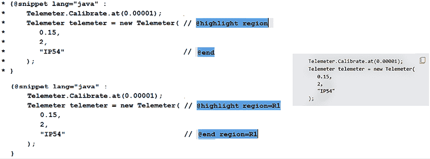

# 第二章：对象、不可变性、Switch 表达式和模式匹配

本章包括 30 个问题，涉及其他一些 `java.util.Objects` 的不太为人所知的功能，不可变性的有趣方面，`switch` 表达式的最新功能，以及 `instanceof` 和 `switch` 表达式的酷模式匹配能力的深入探讨。

在本章结束时，你将了解所有这些主题，这些主题是任何 Java 开发者工具箱中的非可选内容。

# 问题

使用以下问题来测试你在 `Objects`、不可变性、`switch` 表达式和模式匹配方面的编程能力。我强烈建议你在查看解决方案和下载示例程序之前尝试解决每个问题：

1.  **解释和示例 UTF-8、UTF-16 和 UTF-32**：提供关于 UTF-8、UTF-16 和 UTF-32 的详细解释。包括几个代码片段，以展示这些在 Java 中的工作方式。

1.  **检查从 0 到长度的范围内的子范围**：编写一个程序，检查给定的子范围 [*给定开始*, *给定开始* + *给定结束*) 是否在从 [*0*, *给定长度*) 范围内。如果给定的子范围不在 [*0*, *给定长度*) 范围内，则抛出 `IndexOutOfBoundsException`。

1.  **返回一个身份字符串**：编写一个程序，返回对象的无重叠字符串表示，而不调用重写的 `toString()` 或 `hashCode()`。

1.  **挂钩未命名的类和实例主方法**：简要介绍 JDK 21 的未命名字类和实例主方法。

1.  **在 Java API 文档中添加代码片段**：通过新的 `@snippet` 标签提供在 Java API 文档中添加代码片段的示例。

1.  **从 `Proxy` 实例调用默认方法**：编写几个程序，在 JDK 8、JDK 9 和 JDK 16 中从 `Proxy` 实例调用接口 `default` 方法。

1.  **在字节和十六进制编码字符串之间转换**：提供几个代码片段，用于在字节和十六进制编码字符串（包括字节数组）之间进行转换。

1.  **示例初始化按需持有者设计模式**：编写一个程序，以经典方式（在 JDK 16 之前）实现初始化按需持有者设计模式，并编写另一个程序，基于从 JDK 16+ 开始，Java 内部类可以拥有静态成员和静态初始化器的这一事实来实现此设计模式。

1.  **在匿名类中添加嵌套类**：编写一个使用嵌套类在匿名类中的有意义的示例（JDK 16 之前，以及 JDK 16+）。

1.  **示例擦除与重载**：简要解释 Java 中的类型擦除和多态重载是什么，并示例它们是如何一起工作的。

1.  **Xlinting 默认构造函数**：解释并示例 JDK 16+ 为具有默认构造函数的类提供的提示 `-Xlint:missing-explicit-ctor`。

1.  **使用接收器参数**：解释 Java 接收器参数的作用，并通过代码示例展示其用法。

1.  **实现不可变栈**: 提供一个程序，从零开始创建不可变栈实现（实现 `isEmpty()`、`push()`、`pop()` 和 `peek()` 操作）。

1.  **揭示与 Strings 相关的常见错误**: 编写一个简单的字符串使用案例，其中包含一个常见错误（例如，与 `String` 的不可变特性相关）。

1.  **使用增强的 NullPointerException**: 根据你的经验，举例说明 `NullPointerException` 的前 5 个常见原因，并解释 JDK 14 如何改进 NPE 消息。

1.  **在 switch 表达式中使用 yield**: 解释并举例说明在 JDK 13+ 中使用 `yield` 关键字与 `switch` 表达式的用法。

1.  **处理 switch 中的 null 情况子句**: 编写一些示例，展示在 `switch` 表达式中处理 `null` 值的不同方法（包括 JDK 17+ 的方法）。

1.  **以困难的方式发现 equals() 的不同**: 解释并举例说明 `equals()` 与 `==` 操作符的不同。

1.  **简要介绍 instanceof 的用法**: 提供一个简短的概述和代码片段，以突出 `instanceof` 操作符的主要方面。

1.  **介绍模式匹配**: 提供一个关于 Java 中模式匹配的理论论文，包括主要方面和术语。

1.  **介绍 instanceof 的类型模式匹配**: 提供使用类型模式匹配的理论和实践支持。

1.  **处理类型模式中绑定变量的作用域**: 详细解释，包括代码片段，类型模式中绑定变量的作用域。

1.  **通过类型模式重写 instanceof 的 equals()**: 在引入 `instanceof` 的类型模式之前和之后，以代码示例展示 `equals()` 的实现（包括泛型类）。

1.  **处理 instanceof 和泛型中的类型模式**: 提供几个使用 `instanceof` 的类型模式和泛型的组合示例。

1.  **处理 instanceof 和流中的类型模式**: 我们能否同时使用 `instanceof` 和 Stream API 的类型模式？如果是，请至少提供一个示例。

1.  **介绍 switch 中的类型模式匹配**: 对于 `instanceof`，有类型模式可用，但对于 `switch` 也有。在此提供该主题的理论标题和示例。

1.  **在 switch 中添加受保护的模式标签**: 简要介绍 JDK 17 和 21 中 `switch` 的受保护模式标签。

1.  **处理 switch 中的模式标签优先级**: `switch` 中的模式标签优先级是一个酷特性，因此在此以综合方法举例说明，并提供大量示例。

1.  **处理 switch 中模式标签的完整性（类型覆盖）**: 这是 `switch` 表达式的另一个酷话题。详细解释并举例说明（理论和示例）。

1.  **理解 switch 表达式中的无条件模式和 nulls**：解释在 JDK 19 之前和之后，`null`值是如何被`switch`表达式的无条件模式处理的。

以下几节描述了解决前面问题的方案。请记住，通常没有解决特定问题的唯一正确方法。还请注意，这里所示的解释仅包括解决这些问题所需的最有趣和最重要的细节。下载示例解决方案以查看更多细节并实验程序，请访问[`github.com/PacktPublishing/Java-Coding-Problems-Second-Edition/tree/main/Chapter02`](https://github.com/PacktPublishing/Java-Coding-Problems-Second-Edition/tree/main/Chapter02)。

# 38. 解释并举例说明 UTF-8、UTF-16 和 UTF-32

字符编码/解码对于浏览器、数据库、文本编辑器、文件系统、网络等都非常重要，因此它是任何程序员的主要话题。查看以下图示：


图 2.1：使用不同的字符集表示文本

在*图 2.1*中，我们看到几个中文字符在计算机屏幕上以 UTF-8、UTF-16 和 ANSI 的形式表示。但是，这些是什么？ANSI 是什么？UTF-8 是什么，我们是如何得到它的？为什么这些字符在 ANSI 中看起来不正常？

好吧，这个故事可能始于计算机试图表示字符（例如字母表中的字母、数字或标点符号）。计算机将现实世界中的所有东西都理解为二进制表示，因此是一个 0 和 1 的序列。这意味着每个字符（例如，A、5、+等）都必须映射到一个 0 和 1 的序列。

将字符映射到一系列 0 和 1 的过程被称为*字符编码*，或简单地称为*编码*。将一系列 0 和 1 反映射回字符的过程被称为*字符解码*，或简单地称为*解码*。理想情况下，编码-解码周期应该返回相同的字符；否则，我们得到的是我们不理解或无法使用的东西。

例如，中文字符，，应该在计算机的内存中编码为一个 0 和 1 的序列。接下来，当这个序列被解码时，我们期望返回相同的中文字母，。在*图 2.1*的左中和右图中，这种情况发生了，而在右图中，返回的字符是……一个中文使用者将不会理解这一点（实际上，没有人会），所以出了点问题！

当然，我们不仅仅有中文字符需要表示。我们还有许多其他字符集，这些字符集被分组在字母、表情符号等中。一组字符具有定义良好的内容（例如，字母表有定义良好的字符数量）并且被称为*字符集*，简称*charset*。

拥有一个字符集后，问题是要定义一组规则（一个标准），清楚地说明这个字符集的字符应该如何在计算机内存中编码/解码。如果没有明确的规则集，编码和解码可能会导致错误或无法识别的字符。这样的标准被称为*编码方案*。

最早的编码方案之一是 ASCII。

## 介绍 ASCII 编码方案（或单字节编码）

ASCII 代表美国信息交换标准代码。这个编码方案依赖于 7 位二进制系统。换句话说，ASCII 字符集中的每个字符都应该能在 7 位上表示（编码）。一个 7 位数可以是 0 到 127 之间的十进制数，如下面的图示所示：


图 2.2：ASCII 字符集编码

因此，ASCII 是一种基于 7 位系统的编码方案，支持 128 个不同的字符。但我们知道计算机在字节（八位组）上操作，一个字节有 8 位。这意味着 ASCII 是一种单字节编码方案，每个字节都留有一位空闲。请看以下图示：


图 2.3：在 ASCII 编码中，高亮的部分是留空的

在 ASCII 编码中，字母 A 是 65，字母 B 是 66，以此类推。在 Java 中，我们可以通过现有的 API 轻松检查这一点，如下面的简单代码所示：

```java
int decimalA = "A".charAt(0); // 65
String binaryA = Integer.toBinaryString(decimalA); // 1000001 
```

或者，让我们看看文本“Hello World”的编码。这次，我们也加入了留空的位，所以结果将是 01001000 01100101 01101100 01101100 01101111 0100000 01010111 01101111 01110010 01101100 01100100：

```java
char[] chars = "Hello World".toCharArray();
for(char ch : chars) {
  System.out.print("0" + Integer.toBinaryString(ch) + " ");
} 
```

如果我们进行匹配，那么我们会看到 01001000 是*H*，01100101 是*e*，01101100 是*l*，01101111 是*o*，0100000 是空格，01010111 是*W*，01110010 是*r*，01100100 是*d*。所以，除了字母之外，ASCII 编码还可以表示英语字母（大写和小写）、数字、空格、标点符号和一些特殊字符。

除了核心的 ASCII 编码用于英语之外，我们还有 ASCII 扩展，这些扩展基本上是原始 ASCII 的变体，以支持其他字母表。很可能你已经听说过 ISO-8859-1（也称为 ISO 拉丁 1），这是一个著名的 ASCII 扩展。但是，即使有 ASCII 扩展，世界上仍然有很多字符尚未编码。有些国家的字符数量比 ASCII 能编码的要多，甚至有些国家不使用字母表。因此，ASCII 有其局限性。

我知道你在想什么……让我们使用那个留空的位（2⁷+127）。是的，但即便如此，我们也只能达到 256 个字符。还不够！是时候使用超过 1 个字节的编码来表示字符了。

## 介绍多字节编码

在世界各地的不同地区，人们开始创建多字节编码方案（通常是 2 字节）。例如，中文语言的说话者，由于有很多字符，创建了 Shift-JIS 和 Big5，它们使用 1 或 2 个字节来表示字符。

但是，当大多数国家试图通过自己的多字节编码方案来覆盖其特殊字符、符号等时，会发生什么情况呢？显然，这导致了不同国家使用的编码方案之间存在着巨大的不兼容性。更糟糕的是，一些国家拥有多个彼此完全不兼容的编码方案。例如，日本有三种不同的不兼容编码方案，这意味着使用其中一种编码方案编码文档，然后用另一种解码，会导致文档混乱。

然而，在互联网出现之前，这种不兼容性并不是一个大问题，因为那时文档是通过计算机在全球范围内大量共享的。在那个时刻，独立构思的编码方案之间的不兼容性（例如，国家和地理区域）开始变得痛苦。

这正是 Unicode 联盟成立的完美时机。

### Unicode

简而言之，Unicode ([`unicode-table.com/en/`](https://unicode-table.com/en/)) 是一种通用的编码标准，能够编码/解码世界上所有可能的字符（我们说的是数十万个字符）。

Unicode 需要更多的字节来表示所有这些字符。但是，Unicode 并没有涉及这种表示。它只是为每个字符分配了一个数字。这个数字被称为*代码点*。例如，Unicode 中的字母*A*与十进制的 65 相关联，我们称之为 U+0041。这是以 U+开头，后面跟着 65 的十六进制数。正如你所看到的，在 Unicode 中，*A*是 65，这与 ASCII 编码中的相同。换句话说，Unicode 与 ASCII 向后兼容。正如你很快就会看到的，这是一个很大的问题，所以请记住这一点！

Unicode 的早期版本包含小于 65,535（0xFFFF）的代码点。Java 通过 16 位的`char`数据类型来表示这些字符。例如，法语中的  (*e* with circumflex) 与 Unicode 234 十进制或 U+00EA 十六进制相关联。在 Java 中，我们可以使用`charAt()`来揭示任何小于 65,535 的 Unicode 字符：

```java
int e = "ê".charAt(0);                // 234
String hexe = Integer.toHexString(e); // ea 
```

我们也可能看到这个字符的二进制表示：

```java
String binarye = Integer.toBinaryString(e); // 11101010 = 234 
```

后来，Unicode 添加了越来越多的字符，直到 1,114,112（0x10FFFF）。显然，16 位的 Java `char`不足以表示这些字符，调用`charAt()`也不再有用。

**重要提示**

Java 19+ 支持 Unicode 14.0。`java.lang.Character` API 支持 **Unicode 字符数据库**（**UCD**）的第 14 级。具体来说，我们有 47 个新的表情符号，838 个新的字符和 5 个新的脚本。Java 20+ 支持 Unicode 15.0，这意味着 `java.lang.Character` 将有 4,489 个新的字符。

此外，JDK 21 增加了一组专门用于基于其代码点处理表情符号的方法。在这些方法中，我们有 `boolean isEmoji(int codePoint)`、`boolean isEmojiPresentation(int codePoint)`、`boolean isEmojiModifier(int codePoint)`、`boolean isEmojiModifierBase(int codePoint)`、`boolean isEmojiComponent(int codePoint)` 和 `boolean isExtendedPictographic(int codePoint)`。在捆绑的代码中，你可以找到一个小的应用程序，展示如何获取所有可用的表情符号并检查给定的字符串是否包含表情符号。因此，我们可以通过 `Character.codePointAt()` 获取字符的代码点，并将其作为参数传递给这些方法，以确定字符是否为表情符号。

然而，Unicode 并不涉及这些代码点如何编码成比特。这是 Unicode 内部特殊编码方案的工作，例如 **Unicode 转换格式**（**UTF**）方案。最常见的是使用 UTF-32、UTF-16 和 UTF-8。

#### UTF-32

UTF-32 是一种用于 Unicode 的编码方案，它使用 4 个字节（32 位）来表示每个代码点。例如，字母 *A*（代码点为 65），在 7 位系统中可以编码，在 UTF-32 中的编码方式如下所示，位于其他两个字符旁边：


Figure 2.4: UTF-32 中编码的三个字符示例

如你在 *Figure 2.4* 中所见，UTF-32 使用 4 个字节（固定长度）来表示每个字符。在字母 *A* 的例子中，我们看到 UTF-32 浪费了 3 个字节的内存。这意味着将 ASCII 文件转换为 UTF-32 将使其大小增加 4 倍（例如，1KB 的 ASCII 文件将变成 4KB 的 UTF-32 文件）。正因为这个缺点，UTF-32 并不太受欢迎。

Java 不支持 UTF-32 作为标准字符集，但它依赖于 *代理对*（将在下一节中介绍）。

#### UTF-16

UTF-16 是一种用于 Unicode 的编码方案，它使用 2 或 4 个字节（而不是 3 个字节）来表示每个代码点。UTF-16 具有可变长度，并使用可选的 **字节顺序标记**（**BOM**），但建议使用 UTF-16BE（BE 代表大端字节顺序），或 UTF-16LE（LE 代表小端字节顺序）。虽然有关大端与小端更详细的信息可在 [`en.wikipedia.org/wiki/Endianness`](https://en.wikipedia.org/wiki/Endianness) 找到，但以下图示揭示了 UTF-16BE（左侧）与 UTF-16LE（右侧）在三个字符中的字节顺序差异：


Figure 2.5: UTF-16BE（左侧）与 UTF-16LE（右侧）

由于图示已经足够说明，让我们继续前进。现在，我们必须处理 UTF-16 的一个更复杂的问题。我们知道在 UTF-32 中，我们将 *码点* 转换为一个 32 位的数字，然后就这样了。但在 UTF-16 中，我们并不能每次都这样做，因为有些码点无法适应 16 位。话虽如此，UTF-16 使用所谓的 16 位 *码单元*。它可以使用 1 或 2 个 *码单元* 来表示一个 *码点*。有三种类型的码单元，如下所示：

+   一个码点需要一个单个码单元：这些是 16 位码单元（覆盖 U+0000 到 U+D7FF，和 U+E000 到 U+FFFF）

+   一个码点需要 2 个码单元：

    +   第一个码单元被称为 *高代理*，它覆盖了 1,024 个值（U+D800 到 U+DBFF）

    +   第二个码单元被称为 *低代理*，它覆盖了 1,024 个值（U+DC00 到 U+DFFF）

一个 *高代理* 后跟一个 *低代理* 被称为 *代理对*。代理对用于表示所谓的 *补充* Unicode 字符或码点大于 65,535（0xFFFF）的字符。

像字母 A (65) 或中文  (26263) 这样的字符，它们的码点可以通过单个码单元来表示。以下图示展示了这些字符在 UTF-16BE 中的表示：


图 2.6：A 和  的 UTF-16 编码

这很简单！现在，让我们考虑以下图示（Unicode 的编码，*带心形眼的笑脸*）：


图 2.7：使用代理对的 UTF-16 编码

图中这个字符的码点是 128525（或，1 F60D），并且用 4 个字节来表示。

检查第一个字节：6 位序列 110110 识别了一个高代理。

检查第三个字节：6 位序列 110111 识别了一个低代理。

这 12 位（标识高代理和低代理）可以被丢弃，我们保留剩下的 20 位：00001111011000001101。我们可以将这个数字计算为 2⁰ + 2² + 2³ + 2⁹ + 2¹⁰ + 2¹² + 2¹³ + 2¹⁴ + 2¹⁵ = 1 + 4 + 8 + 512 + 1024 + 4096 + 8192 + 16384 + 32768 = 62989（或，十六进制，F60D）。

最后，我们必须计算 F60D + 0x10000 = 1 F60D，或者用十进制表示为 62989 + 65536 = 128525（这个 Unicode 字符的码点）。我们必须加上 0x10000，因为使用 2 个码单元（代理对）的字符总是形式为 1 F…

Java 支持 UTF-16、UTF-16BE 和 UTF-16LE。实际上，UTF-16 是 Java 的原生字符编码。

#### UTF-8

UTF-8 是一种 Unicode 编码方案，它使用 1、2、3 或 4 个字节来表示每个码点。有了这种 1 到 4 字节的灵活性，UTF-8 以非常高效的方式使用空间。

**重要提示**

UTF-8 是最流行的编码方案，它主导着互联网和应用程序。

例如，我们知道字母 A 的码点是 65，它可以使用 7 位二进制表示来编码。以下图示展示了这个字母在 UTF-8 中的编码：


图 2.8：字母 A 以 UTF-8 编码

这非常酷！UTF-8 使用单个字节来编码 A。第一个（最左边的）0 表示这是一个单字节编码。接下来，让我们看看中文字符，：


图 2.9：中文字符，，以 UTF-8 编码

 的代码点是 26263，所以 UTF-8 使用 3 个字节来表示它。第一个字节包含 4 位（1110），表示这是一个 3 字节编码。接下来的两个字节以 2 位 10 开头。所有这些 8 位都可以丢弃，我们只保留剩下的 16 位，这给我们期望的代码点。

最后，让我们处理以下图：


图 2.10：使用 4 个字节的 UTF-8 编码

这次，第一个字节通过 11110 表示这是一个 4 字节编码。接下来的 3 个字节以 10 开头。所有这些 11 位都可以丢弃，我们只保留剩下的 21 位，000011111011000001101，这给我们期望的代码点，128525。

在下面的图中，你可以看到用于编码 Unicode 字符的 UTF-8 模板：


图 2.11：用于编码 Unicode 字符的 UTF-8 模板

你知道吗？一串连续的 8 个零（00000000 – U+0000）被解释为 NULL？NULL 表示字符串的结尾，所以“意外”发送它将是一个问题，因为剩余的字符串将不会被处理。幸运的是，UTF-8 防止了这个问题，并且只有当我们有效地发送 U+0000 代码点时，才能发送 NULL。

## Java 和 Unicode

只要我们使用代码点小于 65,535（0xFFFF）的字符，我们就可以依赖 `charAt()` 方法来获取代码点。以下是一些示例：

```java
int cp1 = "A".charAt(0);                   // 65
String hcp1 = Integer.toHexString(cp1);    // 41
String bcp1 = Integer.toBinaryString(cp1); // 1000001
int cp2 = "".charAt(0);                  // 26263
String hcp2 = Integer.toHexString(cp2);    // 6697
String bcp2 = Integer.toBinaryString(cp2); // 1101100000111101 
```

基于这些示例，我们可能可以编写一个辅助方法，返回代码点小于 65,535（0xFFFF）的字符串的二进制表示，如下所示（你之前已经看到了以下功能代码的命令式版本）：

```java
public static String strToBinary(String str) {
   String binary = str.chars()
     .mapToObj(Integer::toBinaryString)
     .map(t -> "0" +  t)
     .collect(Collectors.joining(" "));
   return binary;
} 
```

如果你用这个代码对代码点大于 65,535（0xFFFF）的 Unicode 字符进行操作，那么你会得到错误的结果。你不会得到异常或任何警告。

因此，`charAt()` 只覆盖了 Unicode 字符的一个子集。为了覆盖所有 Unicode 字符，Java 提供了一个由几个方法组成的 API。例如，如果我们用 `codePointAt()` 替换 `charAt()`，那么在所有情况下我们都会得到正确的代码点，如下图所示：


图 2.12：charAt() 与 codePointAt()

查看最后一个例子，`c2`。由于 `codePointAt()` 返回正确的代码点（128525），我们可以得到以下二进制表示：

```java
String uc = Integer.toBinaryString(c2); // 11111011000001101 
```

因此，如果我们需要一个返回任何 Unicode 字符的二进制编码的方法，那么我们可以将 `chars()` 调用替换为 `codePoints()` 调用。`codePoints()` 方法返回给定序列的代码点：

```java
public static String codePointToBinary(String str) {
   String binary = str.codePoints()
      .mapToObj(Integer::toBinaryString)
      .collect(Collectors.joining(" "));
   return binary;
} 
```

`codePoints()` 方法只是 Java 提供的用于处理代码点的方法之一。Java API 还包括 `codePointAt()`、`offsetByCodePoints()`、`codePointCount()`、`codePointBefore()`、`codePointOf()` 等等。您可以在与这个示例相邻的捆绑代码中找到它们的几个示例，用于从给定的代码点获取 `String`：

```java
String str1 = String.valueOf(Character.toChars(65)); // A
String str2 = String.valueOf(Character.toChars(128525)); 
```

`toChars()` 方法获取一个代码点并通过 `char[]` 返回 UTF-16 表示。第一个示例（`str1`）返回的字符串长度为 1，是字母 A。第二个示例返回长度为 2 的字符串，因为具有代码点 128525 的字符需要一个代理对。返回的 `char[]` 包含高代理和低代理。

最后，让我们有一个辅助方法，它允许我们获取给定编码方案的字符串的二进制表示：

```java
public static String stringToBinaryEncoding(
      String str, String encoding) {
   final Charset charset = Charset.forName(encoding);
   final byte[] strBytes = str.getBytes(charset);
   final StringBuilder strBinary = new StringBuilder();
   for (byte strByte : strBytes) {
      for (int i = 0; i < 8; i++) {
        strBinary.append((strByte & 128) == 0 ? 0 : 1);
        strByte <<= 1;
      }
      strBinary.append(" ");
   }
   return strBinary.toString().trim();
} 
```

使用此方法非常简单，如下面的示例所示：

```java
// 00000000 00000000 00000000 01000001
String r = Charsets.stringToBinaryEncoding("A", "UTF-32");
// 10010111 01100110
String r = Charsets.stringToBinaryEncoding("", 
              StandardCharsets.UTF_16LE.name()); 
```

您可以在捆绑代码中练习更多示例。

### JDK 18 默认字符集为 UTF-8

在 JDK 18 之前，默认字符集是根据操作系统字符集和区域设置确定的（例如，在 Windows 机器上，它可能是 windows-1252）。从 JDK 18 开始，默认字符集是 UTF-8（`Charset.defaultCharset()` 返回字符串，UTF-8）。或者，如果我们有一个 `PrintStream` 实例，我们可以通过 `charset()` 方法（从 JDK 18 开始）找出使用的字符集。

但是，可以通过命令行中的 `file.encoding` 和 `native.encoding` 系统属性显式设置默认字符集。例如，您可能需要执行以下修改来编译在 JDK 18 之前开发的旧代码：

```java
// the default charset is computed from native.encoding
java -Dfile-encoding = COMPAT 
// the default charset is windows-1252
java -Dfile-encoding = windows-1252 
```

因此，从 JDK 18 开始，使用编码的类（例如，`FileReader`/`FileWriter`、`InputStreamReader`/`OutputStreamWriter`、`PrintStream`、`Formatter`、`Scanner` 和 `URLEncoder`/`URLDecoder`）可以默认使用 UTF-8。例如，在 JDK 18 之前使用 UTF-8 读取文件可以通过显式指定以下字符集编码方案来完成：

```java
try ( BufferedReader br = new BufferedReader(new FileReader(
   chineseUtf8File.toFile(), StandardCharsets.UTF_8))) {
   ...
} 
```

在 JDK 18+ 中完成相同的事情不需要显式指定字符集编码方案：

```java
try ( BufferedReader br = new BufferedReader(
   new FileReader(chineseUtf8File.toFile()))) {
   ...
} 
```

然而，对于 `System.out` 和 `System.err`，JDK 18+ 仍然使用默认的系统字符集。所以，如果您正在使用 `System.out`/`err` 并且看到问号 (?) 而不是预期的字符，那么您很可能会通过新的属性 `-Dstdout.encoding` 和 `-Dstderr.encoding` 将 UTF-8 设置为：

```java
-Dstderr.encoding=utf8 -Dstdout.encoding=utf8 
```

或者，您可以将它们设置为环境变量以全局设置：

```java
_JAVA_OPTIONS="-Dstdout.encoding=utf8 -Dstderr.encoding=utf8" 
```

在捆绑代码中您可以看到更多示例。

# 39. 检查从 0 到长度的范围内的子范围

检查给定的子范围是否在从 0 到给定长度的范围内是许多问题中的常见检查。例如，让我们考虑我们必须编写一个函数来检查客户是否可以增加水管中的压力。客户给我们当前的平均压力（`avgPressure`）、最大压力（`maxPressure`）和应该施加的额外压力量（`unitsOfPressure`）。

但是，在我们应用我们的秘密算法之前，我们必须检查输入是否正确。因此，我们必须确保以下情况都不会发生：

+   `avgPressure` 小于 0

+   `unitsOfPressure` 小于 0

+   `maxPressure` 小于 0

+   范围 `[avgPressure, avgPressure + unitsOfPressure)` 超出了由 `maxPressure` 表示的界限

因此，在代码行中，我们的函数可能看起来如下：

```java
public static boolean isPressureSupported(
      int avgPressure, int unitsOfPressure, int maxPressure) {
  if(avgPresure < 0 || unitsOfPressure < 0 || maxPressure < 0
    || (avgPresure + unitsOfPressure) > maxPressure) {
    throw new IndexOutOfBoundsException(
           "One or more parameters are out of bounds");
  }
  // the secret algorithm
  return (avgPressure + unitsOfPressure) <
    (maxPressure - maxPressure/4);
} 
```

编写类似于我们这样的复合条件容易出错。尽可能依靠 Java API 会更好。而且，对于这个用例，这是可能的！从 JDK 9 开始，在 `java.util.Objects` 中，我们有了 `checkFromIndexSize(int fromIndex, int size, int length)` 方法，从 JDK 16 开始，我们也为 `long` 参数提供了类似的方法，`checkFromIndexSize(int fromIndex, int size, int length)`。如果我们考虑 `avgPressure` 是 `fromIndex`，`unitsOfPressure` 是 `size`，而 `maxPressure` 是 `length`，那么 `checkFromIndexSize()` 执行参数验证，如果出现问题则抛出 `IndexOutOfBoundsException`。因此，我们编写代码如下：

```java
public static boolean isPressureSupported(
      int avgPressure, int unitsOfPressure, int maxPressure) {
  Objects.checkFromIndexSize(
    avgPressure, unitsOfPressure, maxPressure);
  // the secret algorithm
  return (avgPressure + unitsOfPressure) <
   (maxPressure - maxPressure/4);
} 
```

在代码包中，你可以看到使用 `checkFromIndexSize()` 的另一个示例。

除了 `checkFromIndexSize()`，在 `java.util.Objects` 中，我们还可以找到其他几个伴侣，它们涵盖了常见的复合条件，如 `checkIndex(int index, int length)` – JDK 9，`checkIndex(long index, long length)` – JDK 16，`checkFromToIndex(int fromIndex, int toIndex, int length)` – JDK 9，以及 `checkFromToIndex(long fromIndex, long toIndex, long length)` – JDK 16。

顺便说一下，如果我们切换到字符串上下文，那么 JDK 21 提供了知名 `String.indexOf()` 方法的重载，能够在给定的字符串中搜索一个字符/子字符串，在给定的开始索引和结束索引之间。其签名是 `indexOf(String str, int beginIndex, int endIndex)`，它返回 `str` 的首次出现索引，如果 `str` 未找到则返回 -1。基本上，这是一个 `s.substring(beginIndex, endIndex).indexOf(str) + beginIndex` 的整洁版本。

# 40. 返回一个身份字符串

那么，什么是 *身份字符串*？身份字符串是从对象构建的字符串，而不调用重写的 `toString()` 或 `hashCode()`。它等同于以下连接：

```java
object.getClass().getName() + "@" 
  + Integer.toHexString(System.identityHashCode(object)) 
```

从 JDK 19 开始，这个字符串被包装在 `Objects.toIdentityString(Object object)` 中。考虑以下类（`object`）：

```java
public class MyPoint {
  private final int x;
  private final int y;
  private final int z;
  ...
  @Override
  public String toString() {
    return "MyPoint{" + "x=" + x + ", y=" + y 
                      + ", z=" + z + '}';
  }  
} 
```

通过调用 `toIdentityString()`，我们得到如下内容：

```java
MyPoint p = new MyPoint(1, 2, 3);
// modern.challenge.MyPoint@76ed5528
Objects.toIdentityString(p); 
```

显然，重写的`MyPoint.toString()`方法没有被调用。如果我们打印出`p`的哈希码，我们得到`76ed5528`，这正是`toIdentityString()`返回的。现在，让我们也重写`hashCode()`：

```java
@Override
public int hashCode() {
  int hash = 7;
  hash = 23 * hash + this.x;
  hash = 23 * hash + this.y;
  hash = 23 * hash + this.z;
  return hash;
} 
```

这次，`toIdentityString()`返回相同的内容，而我们的`hashCode()`返回`14ef3`。

# 41. 钩子匿名类和实例主方法

想象一下，你必须向学生介绍 Java。介绍 Java 的经典方法是通过展示一个*Hello World!*示例，如下所示：

```java
public class HelloWorld { 
  public static void main(String[] args) { 
    System.out.println("Hello World!");
  }
} 
```

这是最简单的 Java 示例，但向学生解释`public`、`static`或`String[]`等概念并不简单。这个简单示例中涉及的仪式可能会让学生感到害怕——*如果这是一个简单示例，那么更复杂的示例又是怎样的呢*？

幸运的是，从 JDK 21（JEP 445）开始，我们有了*实例主方法*，这是一个预览功能，允许我们将之前的示例缩短如下：

```java
public class HelloWorld { 
  void main() { 
    System.out.println("Hello World!");
  }
} 
```

我们甚至可以更进一步，移除显式的类声明。这个特性被称为*匿名类*。匿名类位于匿名包中，而匿名包位于匿名模块中：

```java
void main() { 
  System.out.println("Hello World!");
} 
```

Java 会代表我们生成类。类的名称将与源文件名称相同。

这就是我们向学生介绍 Java 所需的所有内容。我强烈建议你阅读 JEP 445（以及将继续进行 JDK 21 预览功能工作的新 JEPs），以了解这些功能的所有方面。

# 42. 在 Java API 文档中添加代码片段

我相信你熟悉为你的项目生成**Java API 文档**（**Javadoc**）。我们可以通过命令行的`javadoc`工具、IDE 支持、Maven 插件（`maven-javadoc-plugin`）等方式来完成。

在编写 Javadoc 时，一个常见的做法是添加代码片段来举例说明非平凡类或方法的使用。在 JDK 18 之前，可以在文档中通过`{@code...}`或`<pre>`标签添加代码片段。添加的代码被视为纯文本，不会进行正确性验证，并且不会被其他工具发现。让我们快速看一个例子：

```java
/**
 * A telemeter with laser ranging from 0 to 60 ft including   
 * calculation of surfaces and volumes with high-precision
 *
 * <pre>{@code
 *     Telemeter.Calibrate.at(0.00001);
 *     Telemeter telemeter = new Telemeter(0.15, 2, "IP54");
 * }</pre>
 */
public class Telemeter {
   ... 
```

在捆绑的代码中，你可以看到完整的示例。Javadoc 是在构建时通过 Maven 插件（`maven-javadoc-plugin`）生成的，因此只需简单地触发构建。

```java
@snippet can be discovered and validated by third-party tools (not by the javadoc tool itself). 
@snippet as follows:
```

```java
/**
 * A telemeter with laser ranging from 0 to 60 ft including   
 * calculation of surfaces and volumes with high-precision
 *
 * {@snippet :
 *     Telemeter.Calibrate.at(0.00001);
 *     Telemeter telemeter = new Telemeter(0.15, 2, "IP54");
 * }
 */
public class Telemeter {
   ... 
```

下图展示了输出截图：


图 2.13：@snippet 的简单输出

有效代码从冒号后面的换行符开始，到关闭的右大括号`}`之前结束。代码缩进被处理为代码块中的缩进，因此编译器会移除意外的空白，我们可以根据关闭的右大括号`}`缩进代码。查看以下图示：


图 2.14：代码片段的缩进

在上面的例子中，关闭的右花括号与打开的左花括号对齐，而在下面的例子中，我们将关闭的右花括号移到了右边。

## 添加属性

```java
name=value pairs. For instance, we can provide a tip about the programming language of our snippet via the lang attribute. The value of the attribute is available to external tools and is present in the generated HTML. Here are two examples:
```

```java
 * {@snippet lang="java" :
 *     Telemeter.Calibrate.at(0.00001);
 *     Telemeter telemeter = new Telemeter(0.15, 2, "IP54");
 * } 
```

在生成的 HTML 中，你可以轻松地识别这个属性为：

```java
<code class="language-java"> … </code> 
```

如果代码是一个结构化文本，例如*属性*文件，那么你可以参考以下示例：

```java
 * {@snippet lang="properties" :
 *   telemeter.precision.default=42
 *   telemeter.clazz.default=2
 * } 
```

在生成的 HTML 中，你将会有：

```java
<code class="language-properties"></code> 
```

接下来，让我们看看我们如何改变片段中显示的内容。

## 使用标记注释和区域

```java
markup comments. A markup comment occurs at the end of the line and it contains one or more *markup tags* of the form @name args, where args are commonly *name=value* pairs. Common markup comments include highlighting, linking, and content (text) modifications.
```

### 突出显示

通过`@highlight`不带参数可以突出显示整行，如下面的图所示：


图 2.15：突出显示整行代码

如图中所示，代码的第一行被加粗了。

如果我们想突出显示多行，则可以定义*区域*。区域可以被视为匿名或具有显式名称。匿名区域由作为标记标签参数放置的单词`region`和位于区域末尾的`@end`标签界定。以下是一个突出显示两个区域（一个匿名和一个名为`R1`的区域）的示例：



图 2.16：使用区域突出显示代码块

正则表达式允许我们突出显示代码的某个部分。例如，通过`@highlight regex='".*"'`可以突出显示所有在引号之间发生的内容。或者，通过`substring="Calibrate"`参数，可以仅突出显示单词*Calibrate*，如下面的图所示：


图 2.17：仅突出显示单词“Calibrate”

接下来，让我们谈谈如何在代码中添加链接。

### 链接

```java
Calibrate that navigates in documentation to the description of the Calibrate.at() method:
```


图 2.18：在代码中添加链接

接下来，让我们看看我们如何修改代码的文本。

### 修改代码的文本

有时我们可能需要更改代码的文本。例如，我们不想用`Telemeter.Calibrate.at(0.00001, "HIGH");`，而想在文档中渲染`Telemeter.Calibrate.at(eps, "HIGH");`。因此，我们需要将`0.00001`替换为`eps`。这正是`@replace`标签的完美工作。常见的参数包括`substring="…"`（或，`regex="…"`）和`replacement="..."`。以下是一个片段：


图 2.19：替换代码的文本

如果你需要在代码块中执行多个替换，则依赖于区域。在以下示例中，我们对代码块应用正则表达式：


图 2.20：通过简单的正则表达式和匿名区域应用多个替换

如果你需要在同一行上执行更多替换，则只需链式多个`@replace`标签（此声明适用于所有标签，如`@highlight`、`@link`等）。

## 使用外部片段

到目前为止，我们只使用了内联片段。但是，在某些情况下，使用内联片段并不是一个方便的方法（例如，如果我们需要重复文档中的某些部分）或者它们无法使用（例如，如果我们想嵌入`/*…*/`注释，这些注释不能添加在内联片段中）。

```java
snippet-files and it can contain external snippets as Java sources, plain text files, or properties files. In the following figure, we have a single external file named MainSnippet.txt:
```


图 2.21：片段文件中的外部片段

```java
 not a Java file, then it can be loaded via {@snippet file …} as follows:
```

```java
{@snippet file = MainSnippet.txt}
{@snippet file = "MainSnippet.txt"}
{@snippet file = 'MainSnippet.txt'} 
```

但，我们也可以自定义外部片段的位置和文件夹名称。例如，让我们将外部片段放在名为`snippet-src`的文件夹中，如下所示：


图 2.22：自定义文件夹中的外部片段和位置

```java
javadoc. Of course, you can pass it via the command line, via your IDE, or via maven-javadoc-plugin, as follows:
```

```java
<additionalJOption>
  --snippet-path C:\...\src\snippet-src
</additionalJOption> 
```

此路径相对于您的机器，因此您可以在`pom.xml`中相应地调整它。

接下来，`AtSnippet.txt`和`ParamDefaultSnippet.properties`可以像之前加载`MainSnippet.txt`时那样加载。然而，加载 Java 源代码，如`DistanceSnippet.java`，可以通过`{@snippet class…}`来完成，如下所示：

```java
{@snippet class = DistanceSnippet}
{@snippet class = "DistanceSnippet"}
{@snippet class = 'DistanceSnippet'} 
```

但，不要显式添加`.java`扩展名，因为你会得到一个错误，例如*在源路径或片段路径上找不到文件：DistanceSnippet/java.java*：

```java
{@snippet class = DistanceSnippet.java} 
```

当使用 Java 源代码作为外部片段时，请注意以下注意事项。

**重要提示**

```java
Illegal package name: “foo.buzz.snippet-files”. If you find yourself in this scenario, then simply use another folder name and location for the documentation external snippets written in Java sources.
```

### 外部片段中的区域

外部片段支持通过`@start region=…`和`@end region=…`来指定区域。例如，在`AtSnippet.txt`中，我们有以下区域：

```java
// This is an example used in the documentation
// @start region=only-code 
   Telemeter.Calibrate.at(0.00001, "HIGH");  
// @end region=only-code 
```

现在，如果我们按如下方式加载区域：

```java
{@snippet file = AtSnippet.txt region=only-code} 
```

我们只获取区域中的代码，而不包括文本，*// 这是在文档中使用的示例*。

这里是另一个具有两个区域的属性文件示例：

```java
# @start region=dist
sc=[0,0]
ec=[0,0]
interpolation=false
# @end region=dist
# @start region=at
eps=0.1
type=null
# @end region=at 
```

区域`dist`用于在文档中显示`distance()`方法参数的默认值：


图 2.23：使用 dist 区域

此外，`at`区域用于在文档中显示`at()`方法参数的默认值：


图 2.24：使用“at”区域

在外部片段中，我们可以使用与内联片段相同的标签。例如，在下面的图中，你可以看到`AtSnippet.txt`的完整源代码：


图 2.25：AtSnippet.txt 的源代码

注意`@highlight`和`@replace`的存在。

**重要提示**

从 JDK 19 开始，Javadoc 搜索功能也得到了改进。换句话说，JDK 19+可以为 Javadoc API 文档生成一个独立的搜索页面。此外，搜索语法也得到了增强，以支持多个搜索词。

你可以在捆绑的代码中练习这些示例。

# 43. 从代理实例调用默认方法

从 JDK 8 开始，我们可以在接口中定义`default`方法。例如，让我们考虑以下接口（为了简洁，这些接口中的所有方法都被声明为`default`）：


图 2.26：接口：Printable、Writable、Draft 和 Book

接下来，假设我们想使用 Java 反射 API 来调用这些默认方法。作为一个快速提醒，`Proxy` 类的目的是在运行时提供创建接口动态实现的支撑。

话虽如此，让我们看看我们如何使用 Proxy API 来调用我们的 `default` 方法。

## JDK 8

在 JDK 8 中调用接口的 `default` 方法依赖于一个小技巧。基本上，我们使用 Lookup API 从头创建一个 *包私有* 构造函数。接下来，我们使这个构造函数可访问——这意味着 Java 不会检查此构造函数的访问修饰符，因此当我们尝试使用它时，不会抛出 `IllegalAccessException`。最后，我们使用这个构造函数来包装接口的一个实例（例如，`Printable`），并使用反射访问在此接口中声明的 `default` 方法。

因此，在代码行中，我们可以如下调用默认方法 `Printable.print()`：

```java
// invoke Printable.print(String)
Printable pproxy = (Printable) Proxy.newProxyInstance(
  Printable.class.getClassLoader(),
  new Class<?>[]{Printable.class}, (o, m, p) -> {
    if (m.isDefault()) {
      Constructor<Lookup> cntr = Lookup.class
        .getDeclaredConstructor(Class.class);
      cntr.setAccessible(true);
      return cntr.newInstance(Printable.class)
                 .in(Printable.class)
                 .unreflectSpecial(m, Printable.class)
                 .bindTo(o)
                 .invokeWithArguments(p);
      }
      return null;
  });
// invoke Printable.print()
pproxy.print("Chapter 2"); 
```

接下来，让我们专注于 `Writable` 和 `Draft` 接口。`Draft` 扩展了 `Writable` 并覆盖了 `default write()` 方法。现在，每次我们显式调用 `Writable.write()` 方法时，我们期望在幕后自动调用 `Draft.write()` 方法。一个可能的实现如下：

```java
// invoke Draft.write(String) and Writable.write(String)
Writable dpproxy = (Writable) Proxy.newProxyInstance(
 Writable.class.getClassLoader(),
  new Class<?>[]{Writable.class, Draft.class}, (o, m, p) -> {
   if (m.isDefault() && m.getName().equals("write")) {
    Constructor<Lookup> cntr = Lookup.class
     .getDeclaredConstructor(Class.class);
    cntr.setAccessible(true); 
    cntr.newInstance(Draft.class)
        .in(Draft.class)
        .findSpecial(Draft.class, "write",
           MethodType.methodType(void.class, String.class), 
           Draft.class)
        .bindTo(o)
        .invokeWithArguments(p);
    return cntr.newInstance(Writable.class)
        .in(Writable.class)
        .findSpecial(Writable.class, "write",
           MethodType.methodType(void.class, String.class), 
           Writable.class)
        .bindTo(o)
        .invokeWithArguments(p);
    }
    return null;
  });
// invoke Writable.write(String)
dpproxy.write("Chapter 1"); 
```

最后，让我们专注于 `Printable` 和 `Book` 接口。`Book` 扩展了 `Printable` 并没有定义任何方法。因此，当我们调用继承的 `print()` 方法时，我们期望调用 `Printable.print()` 方法。虽然你可以在捆绑的代码中检查此解决方案，但让我们专注于使用 JDK 9+ 完成相同的任务。

## JDK 9+，JDK 16 之前

正如你所看到的，在 JDK 9 之前，Java 反射 API 提供了对非公共类成员的访问。这意味着外部反射代码（例如，第三方库）可以深入访问 JDK 内部。但是，从 JDK 9 开始，这是不可能的，因为新的模块系统依赖于强封装。

为了从 JDK 8 到 JDK 9 的平滑过渡，我们可以使用 `--illegal-access` 选项。此选项的值范围从 `deny`（保持强封装，因此不允许任何非法反射代码）到 `permit`（最宽松的强封装级别，仅允许从未命名的模块访问平台模块）。在 `permit`（JDK 9 中的默认值）和 `deny` 之间，我们还有两个额外的值：`warn` 和 `debug`。然而，`--illegal-access=permit;` 的支持已在 JDK 17 中移除。

在此上下文中，之前的代码可能在 JDK 9+ 中不起作用，或者可能仍然起作用，但你可能会看到如下警告：*WARNING: An illegal reflective access operation has occurred*。

但是，我们可以通过`MethodHandles`“修复”我们的代码以避免非法反射访问。在其优点中，这个类公开了用于创建字段和方法方法句柄的查找方法。一旦我们有了`Lookup`，我们就可以依赖其`findSpecial()`方法来访问接口的`default`方法。

基于`MethodHandles`，我们可以如下调用默认方法`Printable.print()`：

```java
// invoke Printable.print(String doc)
Printable pproxy = (Printable) Proxy.newProxyInstance(
    Printable.class.getClassLoader(),
    new Class<?>[]{Printable.class}, (o, m, p) -> {
      if (m.isDefault()) {
       return MethodHandles.lookup()
         .findSpecial(Printable.class, "print",  
           MethodType.methodType(void.class, String.class), 
           Printable.class)
         .bindTo(o)
         .invokeWithArguments(p);
      }
      return null;
  });
// invoke Printable.print()
pproxy.print("Chapter 2"); 
```

虽然在捆绑的代码中你可以看到更多示例；但让我们从 JDK 16 开始探讨相同的话题。

## JDK 16+

从 JDK 16 开始，我们可以通过新的静态方法`InvocationHandler.invokeDefault()`简化之前的代码。正如其名称所暗示的，这个方法对于调用`default`方法很有用。在代码行中，我们可以通过`invokeDefault()`简化之前调用`Printable.print()`的示例，如下所示：

```java
// invoke Printable.print(String doc)
Printable pproxy = (Printable) Proxy.newProxyInstance(
  Printable.class.getClassLoader(),
    new Class<?>[]{Printable.class}, (o, m, p) -> {
      if (m.isDefault()) {
        return InvocationHandler.invokeDefault(o, m, p);
      }
      return null;
  });
// invoke Printable.print()
pproxy.print("Chapter 2"); 
```

在下一个示例中，每次我们显式调用`Writable.write()`方法时，我们期望在幕后自动调用`Draft.write()`方法：

```java
// invoke Draft.write(String) and Writable.write(String)
Writable dpproxy = (Writable) Proxy.newProxyInstance(
 Writable.class.getClassLoader(),
  new Class<?>[]{Writable.class, Draft.class}, (o, m, p) -> {
   if (m.isDefault() && m.getName().equals("write")) {
    Method writeInDraft = Draft.class.getMethod(
     m.getName(), m.getParameterTypes());
    InvocationHandler.invokeDefault(o, writeInDraft, p);
    return InvocationHandler.invokeDefault(o, m, p);
   }
   return null;
 });
// invoke Writable.write(String)
dpproxy.write("Chapter 1"); 
```

在捆绑的代码中，你可以练习更多示例。

# 44. 在字节和十六进制编码字符串之间转换

将字节转换为十六进制（反之亦然）是处理文件/消息流、执行编码/解码任务、处理图像等应用中的常见操作。

Java 的字节是一个范围在[-128, +127]的数字，使用 1 个有符号字节（8 位）表示。十六进制（基数为 16）是一个基于 16 个数字（0, 1, 2, 3, 4, 5, 6, 7, 8, 9, A, B, C, D, E, 和 F）的系统。换句话说，一个字节的 8 位正好可以容纳 2 个十六进制字符，范围在 00 到 FF 之间。十进制 <-> 二进制 <-> 十六进制的映射总结在下图中：


图 2.27：十进制到二进制到十六进制转换

例如，二进制的 122 是 01111010。由于 0111 在十六进制中是 7，1010 是 A，因此 122 在十六进制中是 7A（也可以写作 0x7A）。

那么，一个负字节呢？我们从上一章知道，Java 将负数表示为正数的*二进制补码*。这意味着-122 的二进制是 10000110（保留正数 122 的前 7 位= 1111010，取反(1111010) = 0000101，加 1(0000001) = 00000110，并添加符号位 1，10000110)，在十六进制中是 0x86。

将负数转换为十六进制可以有多种方式，但我们可以轻松地获得低 4 位为 10000110 & 0xF = 0110，高 4 位为(10000110>> 4) & 0xF = 1000 & 0xF = 1000（在这里，0xF（二进制，1111）掩码对于负数是很有用的）。由于 0110 = 6 和 1000 = 8，我们看到 10000110 在十六进制中是 0x86。

如果你需要深入了解 Java 中的位操作，或者你只是面对理解当前主题的问题，那么请考虑阅读《Java 完全编码面试指南》这本书，特别是*第九章*。

因此，在代码行中，我们可以依赖这个简单的算法和`Character.forDigit(int d, int r)`，它返回给定基数（`r`）中给定数字（`d`）的字符表示：

```java
public static String byteToHexString(byte v) {
  int higher = (v >> 4) & 0xF;
  int lower = v & 0xF;
  String result = String.valueOf(
    new char[]{
      Character.forDigit(higher, 16),
      Character.forDigit(lower, 16)}
    );
  return result;
} 
```

解决这个问题的方法有很多（在捆绑的代码中，您可以查看这种解决方案的另一种形式）。例如，如果我们知道`Integer.toHexString(int n)`方法返回一个表示给定参数无符号整数 16 进制字符串，那么我们只需要对负数应用 0xFF（二进制，11111111）掩码即可：

```java
public static String byteToHexString(byte v) {
  return Integer.toHexString(v & 0xFF);
} 
```

如果有一种我们应该避免的方法，那么就是基于`String.format()`的方法。`String.format("%02x ", byte_nr)`方法简洁但非常慢！

反过来呢？将给定的十六进制字符串（例如，7d，09 等）转换为字节相当简单。只需取给定字符串的第一个（`d1`）和第二个（`d2`）字符，并应用关系，`(byte) ((d1 << 4) + d2)`：

```java
public static byte hexToByte(String s) {
  int d1 = Character.digit(s.charAt(0), 16);
  int d2 = Character.digit(s.charAt(1), 16);
  return (byte) ((d1 << 4) + d2);
} 
```

在捆绑的代码中还有更多示例。如果您依赖第三方库，那么请检查 Apache Commons Codec（`Hex.encodeHexString()`）、Guava（`BaseEncoding`）、Spring Security（`Hex.encode()`）、Bouncy Castle（`Hex.toHexString()`）等。

## JDK 17+

从 JDK 17 开始，我们可以使用`java.util.HexFormat`类。这个类有很多静态方法用于处理十六进制数，包括`String toHexDigits(byte value)`和`byte[] parseHex(CharSequence string)`。因此，我们可以将字节转换为十六进制字符串如下：

```java
public static String byteToHexString(byte v) {
  HexFormat hex = HexFormat.of();
  return hex.toHexDigits(v);
} 
```

反之亦然，如下所示：

```java
public static byte hexToByte(String s) {
  HexFormat hex = HexFormat.of();
  return hex.parseHex(s)[0];
} 
```

在捆绑的代码中，您还可以看到这些解决方案的扩展，用于将字节数组（`byte[]`）转换为`String`，反之亦然。

# 45. 举例说明按需初始化持有者设计模式

在我们着手解决实现按需初始化持有者设计模式之前，让我们快速回顾一下这个解决方案的一些关键要素。

## 静态与非静态块

在 Java 中，我们可以有*非静态初始化块*和*静态块*。一个非静态初始化块（或简单地，非静态块）在每次实例化类时都会自动调用。另一方面，一个静态初始化块（或简单地，静态块）在类本身初始化时只调用一次。无论我们创建多少个该类的后续实例，静态块都不会再次执行。在代码行中：

```java
public class A {
  {
    System.out.println("Non-static initializer ...");
  }
  static {
    System.out.println("Static initializer ...");
  }
} 
```

接下来，让我们运行以下测试代码来创建三个`A`的实例：

```java
A a1 = new A();
A a2 = new A();
A a3 = new A(); 
```

输出显示静态初始化器只调用一次，而非静态初始化器调用三次：

```java
Static initializer ...
Non-static initializer ...
Non-static initializer ...
Non-static initializer ... 
```

此外，静态初始化器在非静态初始化器之前被调用。接下来，让我们谈谈嵌套类。

## 嵌套类

让我们来看一个快速示例：

```java
public class A {
    private static class B { ... }
} 
```

嵌套类可以是静态的或非静态的。一个非静态的嵌套类被称为*内部类*；进一步地，它可以是*局部内部类*（在方法中声明）或*匿名内部类*（没有名称的类）。另一方面，声明为静态的嵌套类被称为*静态嵌套类*。以下图解说明了这些概念：


图 2.28：Java 嵌套类

由于 `B` 是在 `A` 中声明的静态类，我们说 `B` 是一个静态嵌套类。

## 解决初始化按需持有设计模式

初始化按需持有设计模式指的是线程安全的延迟加载单例（单个实例）实现。在 JDK 16 之前，我们可以在代码中举例说明这种设计模式如下（我们希望有一个线程安全的 `Connection` 单例）：

```java
public class Connection { // singleton
  private Connection() {
  }
  private static class LazyConnection { // holder
    static final Connection INSTANCE = new Connection();
    static {
      System.out.println("Initializing connection ..." 
        + INSTANCE);
    }
  }
  public static Connection get() {
    return LazyConnection.INSTANCE;
  }
} 
```

无论线程（多个线程）调用 `Connection.get()` 多少次，我们总是得到相同的 `Connection` 实例。这是我们在第一次调用 `get()` 时创建的实例（第一个线程），Java 已经初始化了 `LazyConnection` 类及其静态成员。换句话说，如果我们从未调用 `get()`，那么 `LazyConnection` 类及其静态成员永远不会被初始化（这就是为什么我们称之为延迟初始化）。而且，这是线程安全的，因为静态初始化器可以在没有显式同步的情况下构造（这里，`INSTANCE`）和引用，因为它们在任何线程可以使用该类之前运行（这里，`LazyConnection`）。

## JDK 16+

直到 JDK 16，内部类可以包含静态成员作为常量变量，但不能包含静态初始化器。换句话说，以下代码由于静态初始化器而无法编译：

```java
public class A {
  public class B {
    {
      System.out.println("Non-static initializer ...");
    }
    static {
      System.out.println("Static initializer ...");
    }
  }
} 
```

但是，从 JDK 16 开始，之前的代码可以无问题编译。换句话说，从 JDK 16 开始，Java 内部类可以有静态成员和静态初始化器。

这允许我们从另一个角度解决初始化按需持有设计模式。我们可以将静态嵌套类 `LazyConnection` 替换为局部内部类，如下所示：

```java
public class Connection { // singleton
  private Connection() {
  }
  public static Connection get() {
    class LazyConnection { // holder
      static final Connection INSTANCE = new Connection();
      static {
        System.out.println("Initializing connection ..." 
          + INSTANCE);
      }
    }
    return LazyConnection.INSTANCE;
  }
} 
```

现在，`LazyConnection` 只在其包含的方法 `get()` 中可见。只要我们不调用 `get()` 方法，连接就不会被初始化。

# 46. 在匿名类中添加嵌套类

在上一个问题中，我们简要概述了嵌套类。作为一个快速提醒，匿名类（或匿名内部类）就像一个没有名字的局部内部类。它们的目的在于提供更简洁和表达性更强的代码。然而，代码的可读性可能会受到影响（看起来很丑），但如果可以执行一些特定任务而不必创建一个完整的类，那么这可能是有价值的。例如，匿名类在不需要创建新类的情况下改变现有方法的行为时很有用。Java 通常用于事件处理和监听器（在 GUI 应用程序中）。Java 代码中最著名的匿名类例子如下：

```java
button.addActionListener(new ActionListener() {
  public void actionPerformed(ActionEvent e) {
    ...
  }
} 
```

然而，尽管局部内部类实际上是类声明，匿名类是表达式。要创建一个匿名类，我们必须扩展一个现有的类或实现一个接口，如下面的图所示：


图 2.29：通过类扩展和接口实现匿名类

由于它们没有名字，匿名类必须在单个表达式中声明和实例化。结果实例可以被分配给一个变量，稍后可以引用。表达式的标准语法看起来像调用一个常规 Java 构造函数，该构造函数在代码块中以分号（`;`）结束。分号的存在是一个提示，表明匿名类是一个表达式，必须作为语句的一部分。

最后，匿名类不能有显式的构造函数，不能是抽象的，不能是单例的，不能实现多个接口，也不能被扩展。

接下来，让我们解决一些匿名类中嵌套类的例子。例如，让我们考虑以下打印服务的接口：

```java
public interface Printer {
    public void print(String quality);
} 
```

我们在我们的打印服务中到处使用 `Printer` 接口，但我们还想要一个紧凑的辅助方法，简单地测试我们的打印机功能，而不需要进一步的操作或额外的类。我们决定将此代码隐藏在名为 `printerTest()` 的静态方法中，如下所示：

```java
public static void printerTest() {
  Printer printer = new Printer() {
  @Override
  public void print(String quality) {
    if ("best".equals(quality)) {
      Tools tools = new Tools();
      tools.enableLaserGuidance();
      tools.setHighResolution();
    }
    System.out.println("Printing photo-test ...");
  }
class Tools {
    private void enableLaserGuidance() {
      System.out.println("Adding laser guidance ...");
    }
    private void setHighResolution() {
      System.out.println("Set high resolution ...");
    }
  }
}; 
```

测试 `best` 质量打印需要一些额外的设置，这些设置被封装在内部 `Tools` 类中。正如你所见，内部 `Tools` 类嵌套在匿名类中。另一种方法是将 `Tools` 类移动到 `print()` 方法内部。因此，`Tools` 成为一个局部内部类，如下所示：

```java
Printer printer = new Printer() {
  @Override
  public void print(String quality) {
    class Tools {
      private void enableLaserGuidance() {
        System.out.println("Adding laser guidance ...");
      }
      private void setHighResolution() {
        System.out.println("Set high resolution ...");
      }
    }
    if ("best".equals(quality)) {
      Tools tools = new Tools();
      tools.enableLaserGuidance();
      tools.setHighResolution();
    }
    System.out.println("Printing photo-test ...");
  }
}; 
```

这种方法的缺点是 `Tools` 类不能在 `print()` 之外使用。因此，这种严格的封装将限制我们添加一个也需要 `Tools` 类的新方法（在 `print()` 旁边）。

## JDK 16+

但是，记住从上一个问题开始，从 JDK 16 开始，Java 内部类可以有静态成员和静态初始化器。这意味着我们可以删除 `Tools` 类，并依赖于以下两个静态方法：

```java
Printer printer = new Printer() {
  @Override
  public void print(String quality) {
    if ("best".equals(quality)) {
      enableLaserGuidance();
      setHighResolution();
    }
    System.out.println("Printing your photos ...");
  }
  private static void enableLaserGuidance() {
    System.out.println("Adding laser guidance ...");
  }
  private static void setHighResolution() {
    System.out.println("Set high resolution ...");
  }
}; 
```

如果你觉得在静态类中获取这些辅助工具更方便，那么就去做吧：

```java
Printer printer = new Printer() {
  @Override
  public void print(String quality) {
    if ("best".equals(quality)) {
      Tools.enableLaserGuidance();
      Tools.setHighResolution();
    }
    System.out.println("Printing photo-test ...");
  }
  private final static class Tools {
    private static void enableLaserGuidance() {
      System.out.println("Adding laser guidance ...");
    }
    private static void setHighResolution() {
      System.out.println("Set high resolution ...");
    }
  }
}; 
```

你可以在捆绑的代码中练习这些例子。

# 47. 举例说明擦除与重载的区别

在我们用一个例子将它们结合起来之前，让我们快速处理擦除和重载。

## 擦除概述

Java 在编译时使用 *类型擦除* 来强制执行类型约束和与旧字节码的向后兼容性。基本上，在编译时，所有类型参数都被替换为 `Object`（任何泛型都必须可转换为 `Object`）或类型界限（`extends` 或 `super`）。接下来，在运行时，编译器擦除的类型将被我们的类型替换。类型擦除的一个常见情况是泛型。

### 泛型类型的擦除

实际上，编译器使用有界类型（如 `E`、`T`、`U` 等）擦除未绑定类型。这强制执行类型安全，如下面的 *类类型擦除* 示例所示：

```java
public class ImmutableStack<E> implements Stack<E> {
  private final E head;
  private final Stack<E> tail;
  ... 
```

编译器应用类型擦除将 `E` 替换为 `Object`：

```java
public class ImmutableStack<Object> implements Stack<Object> {
  private final Object head;
  private final Stack<Object> tail;
  ... 
```

如果 `E` 参数是有界的，那么编译器将使用第一个界限类。例如，在一个类如 `class Node<T extends Comparable<T>> {...}` 中，编译器将用 `Comparable` 替换 `T`。同样，在一个类如 `class Computation<T extends Number> {...}` 中，所有 `T` 的出现都将被编译器替换为上限 `Number`。

查看以下情况，这是一个 *方法类型擦除* 的经典案例：

```java
public static <T, R extends T> List<T> listOf(T t, R r) {
  List<T> list = new ArrayList<>();
  list.add(t);
  list.add(r);
  return list;
}
// use this method
List<Object> list = listOf(1, "one"); 
```

这是如何工作的？当我们调用 `listOf(1, "one")` 时，我们实际上向泛型参数 `T` 和 `R` 传递了两种不同的类型。编译器的类型擦除将 `T` 替换为 `Object`。这样，我们可以在 `ArrayList` 中插入不同的类型，代码运行良好。

### 擦除和桥接方法

*桥接方法* 是由编译器创建的，以覆盖边缘情况。具体来说，当编译器遇到参数化接口的实现或参数化类的扩展时，它可能需要生成一个桥接方法（也称为合成方法），作为类型擦除阶段的一部分。例如，让我们考虑以下参数化类：

```java
public class Puzzle<E> {
  public E piece;
  public Puzzle(E piece) {
    this.piece = piece;
  }
  public void setPiece(E piece) { 
    this.piece = piece;
  }
} 
```

此外，这个类的一个扩展：

```java
public class FunPuzzle extends Puzzle<String> {
  public FunPuzzle(String piece) {
    super(piece);
  }
  @Override
  public void setPiece(String piece) { 
    super.setPiece(piece);
  }
} 
```

类型擦除修改了 `Puzzle.setPiece(E)` 为 `Puzzle.setPiece(Object)`。这意味着 `FunPuzzle.setPiece(String)` 方法并没有覆盖 `Puzzle.setPiece(Object)` 方法。由于方法的签名不兼容，编译器必须通过一个桥接（合成）方法来适应泛型类型的多态性，以确保子类型按预期工作。让我们在代码中突出显示这个方法：

```java
/* Decompiler 8ms, total 3470ms, lines 18 */
package modern.challenge;
public class FunPuzzle extends Puzzle<String> {
   public FunPuzzle(String piece) {
      super(piece);
   }
   public void setPiece(String piece) {
      super.setPiece(piece);
   }
**// $FF: synthetic method**
**// $FF: bridge method**
**public****void****setPiece****(Object var1)** **{**
**this****.setPiece((String)var1);**
 **}**
} 
```

现在，每当你看到堆栈跟踪中的桥接方法时，你将知道它是什么以及为什么存在。

### 类型擦除和堆污染

你是否见过未检查的警告？我相信你一定见过！这是所有 Java 开发者都常见的事情。它们可能作为类型检查的结果在编译时发生，或者作为类型转换或方法调用的结果在运行时发生。在两种情况下，我们都在谈论编译器无法验证操作正确性的事实，这暗示了一些参数化类型。并非每个未检查的警告都是危险的，但有些情况下我们必须考虑和处理它们。

一种特殊情况是*堆污染*。如果一个特定类型的参数化变量指向的不是该类型的对象，那么我们很容易处理导致堆污染的代码。在这种情况下，一个合适的例子是带有`varargs`参数的方法。

查看以下代码：

```java
public static <T> void listOf(List<T> list, T... ts) {
  list.addAll(Arrays.asList(ts));    
} 
```

`listOf()`声明将导致以下警告：*从参数化 vararg 类型 T 可能导致可能的堆污染*。那么这里发生了什么？

故事从编译器将形式参数`T...`替换为数组开始。在应用类型擦除后，`T...`参数变为`T[]`，最终变为`Object[]`。因此，我们打开了一扇可能导致堆污染的大门。但是，我们的代码只是将`Object[]`的元素添加到了`List<Object>`中，所以我们处于安全区域。

换句话说，如果你知道`varargs`方法的主体不太可能生成特定的异常（例如，`ClassCastException`）或者在不恰当的操作中使用`varargs`参数，那么我们可以指示编译器抑制这些警告。我们可以通过以下方式使用`@SafeVarargs`注解来实现：

```java
@SafeVarargs
public static <T> void listOf(List<T> list, T... ts) {...} 
```

`@SafeVarargs`是一个提示，表明被注解的方法将只在不恰当的操作中使用`varargs`形式参数。更常见但不太推荐的做法是使用`@SuppressWarnings({"unchecked", "varargs"})`，这简单地抑制了这些警告，而不声称`varargs`形式参数没有被用于不恰当的操作。

现在，让我们来处理这段代码：

```java
public static void main(String[] args) {
  List<Integer> ints = new ArrayList<>();
  Main.listOf(ints, 1, 2, 3);
  Main.listsOfYeak(ints);
}
public static void listsOfYeak(List<Integer>... lists) {
  Object[] listsAsArray = lists;     
  listsAsArray[0] = Arrays.asList(4, 5, 6); 
  Integer someInt = lists[0].get(0);   
  listsAsArray[0] = Arrays.asList("a", "b", "c"); 
  Integer someIntYeak = lists[0].get(0); // ClassCastException
} 
```

这次，类型擦除将`List<Integer>...`转换为`List[]`，它是`Object[]`的子类型。这允许我们执行以下赋值操作：`Object[] listsAsArray = lists;`。但是，检查一下代码的最后两行，我们在其中创建了一个`List<String>`并将其存储在`listsAsArray[0]`中。在最后一行，我们试图从`lists[0]`中访问第一个`Integer`，这显然会导致`ClassCastException`。这是使用`varargs`的不恰当操作，因此在这种情况下不建议使用`@SafeVarargs`。我们应该认真对待以下警告：

```java
// unchecked generic array creation for varargs parameter 
// of type java.util.List<java.lang.Integer>[]
Main.listsOfYeak(ints);
// Possible heap pollution from parameterized vararg
// type java.util.List<java.lang.Integer>
public static void listsOfYeak(List<Integer>... lists) { ... } 
```

现在，既然你已经熟悉了类型擦除，让我们简要地介绍一下多态重载。

## 简而言之，多态重载

由于*重载*（也称为“临时多态”）是**面向对象编程**（**OOP**）的核心概念，我相信你对 Java 方法重载已经很熟悉了，所以我就不再坚持这个概念的基本理论了。

此外，我也知道有些人不同意重载可以是多态的一种形式，但这将是另一个我们不在这里解决的问题。

我们将更加实际，跳入一系列旨在突出重载有趣方面的测验。更确切地说，我们将讨论*类型优先级*。所以，让我们解决第一个测验（`wordie`最初是一个空字符串）：

```java
static void kaboom(byte b) { wordie += "a";}   
static void kaboom(short s) { wordie += "b";}   
kaboom(1); 
```

会发生什么？如果你回答编译器会指出没有找到适合`kaboom(1)`的方法，那么你是对的。编译器寻找一个接受整数参数的方法，`kaboom(int)`。好吧，那很简单！接下来是下一个：

```java
static void kaboom(byte b) { wordie += "a";}   
static void kaboom(short s) { wordie += "b";}  
static void kaboom(long l) { wordie += "d";}   
static void kaboom(Integer i) { wordie += "i";}   
kaboom(1); 
```

我们知道前两个`kaboom()`实例是无用的。那么`kaboom(long)`和`kaboom(Integer)`呢？你说得对，`kaboom(long)`会被调用。如果我们移除`kaboom(long)`，那么`kaboom(Integer)`会被调用。

**重要提示**

在原始类型重载中，编译器首先尝试寻找一对一匹配。如果这个尝试失败，那么编译器将寻找比原始当前域更广的原始类型重载（例如，对于`int`，它会寻找`int`、`long`、`float`或`double`）。如果这也失败了，那么编译器将检查接受装箱类型（`Integer`、`Float`等）的重载。

根据前面的说明，让我们来看这个例子：

```java
static void kaboom(Integer i) { wordie += "i";} 
static void kaboom(Long l) { wordie += "j";} 
kaboom(1); 
```

这次，`wordie`将是`i`。由于没有`kaboom(int)`/`long`/`float`/`double)`，将调用`kaboom(Integer)`。如果我们有一个`kaboom(double)`，那么这个方法比`kaboom(Integer)`有更高的优先级。有趣，对吧？！另一方面，如果我们移除`kaboom(Integer)`，那么不要期望会调用`kaboom(Long)`。任何比`Integer`更广/窄域的`kaboom(boxed type)`都不会被调用。这是因为在编译器遵循基于 IS-A 关系的继承路径时发生的，所以`kaboom(Integer)`之后，它会寻找`kaboom(Number)`，因为`Integer`是`Number`。

**重要提示**

在装箱类型重载中，编译器首先尝试寻找一对一匹配。如果这个尝试失败，那么编译器将不会考虑任何比当前域更广的装箱类型重载（当然，窄域也会被忽略）。它寻找`Number`作为所有装箱类型的超类。如果找不到`Number`，编译器将沿着继承层次向上查找，直到达到`java.lang.Object`，这是路的尽头。

好吧，让我们稍微复杂一点：

```java
static void kaboom(Object... ov) { wordie += "o";}   
static void kaboom(Number n) { wordie += "p";}   
static void kaboom(Number... nv) { wordie += "q";}  
kaboom(1); 
```

那么，这次会调用哪个方法？我知道，你认为`kaboom(Number)`，对吧？至少，我的简单逻辑推动我这么想，这是一个常识性的选择。而且，这是正确的！

如果我们移除`kaboom(Number)`，编译器将调用`varargs`方法，`kaboom(Number...)`。这很有道理，因为`kaboom(1)`使用单个参数，所以`kaboom(Number)`应该比`kaboom(Number...)`有更高的优先级。如果我们调用`kaboom(1,2,3)`，这种逻辑就会反转，因为`kaboom(Number)`不再代表对这个调用有效的重载，而`kaboom(Number...)`是正确的选择。

但是，这个逻辑成立是因为`Number`是所有装箱类（`Integer`、`Double`、`Float`等）的超类。

现在怎么样？

```java
static void kaboom(Object... ov) { wordie += "o";}   
static void kaboom(File... fv) { wordie += "s";}   
kaboom(1); 
```

这次，编译器将“绕过”`kaboom(File...)`并调用`kaboom(Object...)`。根据同样的逻辑，调用`kaboom(1, 2, 3)`将调用`kaboom(Object...)`，因为没有`kaboom(Number...)`。

**重要提示**

在重载中，如果调用有一个单个参数，那么具有单个参数的方法比其`varargs`对应方法有更高的优先级。另一方面，如果调用有相同类型的更多参数，那么将调用`varargs`方法，因为单参数方法不再适用。当调用有一个单个参数但只有`varargs`重载可用时，则调用此方法。

这引出了以下示例：

```java
static void kaboom(Number... nv) { wordie += "q";}   
static void kaboom(File... fv) { wordie += "s";}   
kaboom(); 
```

这次，`kaboom()`没有参数，编译器找不到唯一的匹配项。这意味着对`kaboom()`的引用是模糊的，因为两种方法都匹配（`modern.challenge.Main`中的`kaboom(java.lang.Number...)`和`modern.challenge.Main`中的方法`kaboom(java.io.File...)`）。

在捆绑的代码中，你可以玩更多关于多态重载的游戏，并测试你的知识。此外，尝试挑战自己，并在等式中引入泛型。

## 消除与重载

好的，基于之前的经验，来看看这段代码：

```java
void print(List<A> listOfA) {
  System.out.println("Printing A: " + listOfA);
}
void print(List<B> listofB) {
  System.out.println("Printing B: " + listofB);
} 
```

会发生什么？嗯，这是一个重载和类型擦除冲突的例子。类型擦除会将`List<A>`替换为`List<Object>`，也将`List<B>`替换为`List<Object>`。因此，无法进行重载，我们得到一个错误，例如*名称冲突：print(java.util.List<modern.challenge.B>)和 print(java.util.List<modern.challenge.A>)有相同的擦除*。

为了解决这个问题，我们可以在这两个方法之一中添加一个虚拟参数：

```java
void print(List<A> listOfA, Void... v) {
  System.out.println("Printing A: " + listOfA);
} 
```

现在，我们可以对两个方法进行相同的调用：

```java
new Main().print(List.of(new A(), new A()));
new Main().print(List.of(new B(), new B())); 
```

完成了！你可以在捆绑的代码中练习这些示例。

# 48. 检查默认构造函数

我们知道，没有显式构造函数的 Java 类会自动获得一个“不可见”的默认构造函数，用于设置实例变量的默认值。以下`House`类就属于这种情况：

```java
public class House {
  private String location;
  private float price;
  ...
} 
```

如果这正是我们想要的，那就没问题。但是，如果我们担心默认构造函数被类公开导出到公共导出包的事实，那么我们必须考虑使用 JDK 16+。

JDK 16+添加了一个专门的*lint*，用于警告我们具有默认构造函数的类。为了利用这个*lint*，我们必须遵循两个步骤：

+   导出包含该类的包

+   使用`-Xlint:missing-explicit-ctor`（或`-Xlint`，`-Xlint:all`）编译

在我们的案例中，我们在`module-info`中如下导出`modern.challenge`包：

```java
module P48_XlintDefaultConstructor {
  exports modern.challenge;
} 
```

一旦你用`-Xlint:missing-explicit-ctor`编译代码，你将看到如图所示的警告：


图 2.30：由`-Xlint:missing-explicit-ctor`产生的警告

现在，你可以轻松地找出哪些类有默认构造函数。

# 49. 使用接收者参数

从 JDK 8 开始，我们可以用可选的*接收者参数*丰富我们的任何实例方法。这是一个通过`this`关键字暴露的封装类型的纯语法参数。以下两个代码片段是相同的：

```java
public class Truck {
  public void revision1(Truck this) {
    Truck thisTruck = this;
    System.out.println("Truck: " + thisTruck);
  }
  public void revision2() {
    Truck thisTruck = this;
    System.out.println("Truck: " + thisTruck);
  }
} 
```

不要得出结论说`revision2()`是`revision1()`的覆盖，或者反之亦然。两种方法都有相同的输出、相同的签名和产生相同的字节码。

接收者参数也可以在内部类中使用。以下是一个示例：

```java
public class PaymentService {
  class InvoiceCalculation {
    final PaymentService paymentService;
    InvoiceCalculation(PaymentService PaymentService.this) {
      paymentService = PaymentService.this;
    }
  }
} 
```

好的，但为什么使用接收者参数呢？嗯，JDK 8 引入了所谓的*类型注解*，正如其名所示：可以应用于类型的注解。在这种情况下，接收者参数被添加用于注解被调用方法的对象类型。查看以下代码：

```java
@Target(ElementType.TYPE_USE)
public @interface ValidAddress {}
public String getAddress(@ValidAddress Person this) { ... } 
```

或者，查看这个更详细的示例：

```java
public class Parcel {
  public void order(@New Parcel this) {...}
  public void shipping(@Ordered Parcel this) {...}
  public void deliver(@Shipped Parcel this) {...}
  public void cashit(@Delivered Parcel this) {...}
  public void done(@Cashed Parcel this) {...}
} 
```

每个`Parcel`客户端都必须按照通过类型注解和接收者参数绘制的精确顺序调用这些方法。换句话说，只有当它是一个新订单时，才能下单；只有当订单已下单时，才能发货；只有当已发货时，才能交付；只有当已交付时，才能付款；只有当已付款时，才能关闭。

目前，这个严格的顺序仅由这些假设的注解指出来。但，这是实现进一步静态分析工具的正确道路，该工具将理解这些注解的含义，并在`Parcel`的客户端每次不遵循这个精确顺序时触发警告。

# 50. 实现一个不可变栈

面试中常见的编码挑战是这样的：在 Java 中实现一个不可变栈。

作为一种抽象数据类型，栈至少需要这个契约：

```java
public interface Stack<T> extends Iterable<T> {
  boolean isEmpty();
  Stack<T> push(T value);
  Stack<T> pop();
  T peek();    
} 
```

有了这个契约，我们可以专注于不可变实现。一般来说，不可变数据结构在尝试更改其内容（例如，添加、put、删除、push 等）之前保持不变。如果操作尝试更改不可变数据结构的内容，必须创建该数据结构的新实例，并由该操作使用，而之前的实例保持不变。

现在，在我们的上下文中，我们有两个可以改变栈内容的操作：push 和 pop。push 操作应该返回包含已推入元素的新栈，而 pop 操作应该返回之前的栈。但是，为了完成这个任务，我们需要从一个地方开始，因此我们需要一个空的初始栈。这是一个单例栈，可以如下实现：

```java
private static class EmptyStack<U> implements Stack<U> {
  @Override
    public Stack<U> push(U u) {
      return new ImmutableStack<>(u, this);
    }
    @Override
    public Stack<U> pop() {
      throw new UnsupportedOperationException(
        "Unsupported operation on an empty stack");
    } 
    @Override
    public U peek() {
      throw new UnsupportedOperationException (
        "Unsupported operation on an empty stack");
    }
    @Override
    public boolean isEmpty() {
      return true;
    }
    @Override
    public Iterator<U> iterator() {
      return new StackIterator<>(this);
  }
} 
```

`StackIterator`是 Java `Iterator`的一个简单实现。这里没有太多花哨的东西：

```java
private static class StackIterator<U> implements Iterator<U> {
  private Stack<U> stack;
  public StackIterator(final Stack<U> stack) {
    this.stack = stack;
  }
  @Override
  public boolean hasNext() {
    return !this.stack.isEmpty();
  }
  @Override
  public U next() {
    U e = this.stack.peek();
    this.stack = this.stack.pop();
    return e;
  }
  @Override
  public void remove() {
  }
} 
```

到目前为止，我们有了`Iterator`和一个空的栈单例。最后，我们可以如下实现不可变栈的逻辑：

```java
public class ImmutableStack<E> implements Stack<E> {
  private final E head;
  private final Stack<E> tail;
  private ImmutableStack(final E head, final Stack<E> tail) {
    this.head = head;
    this.tail = tail;
  }
  public static <U> Stack<U> empty(final Class<U> type) {
    return new EmptyStack<>();
  }
  @Override
  public Stack<E> push(E e) {
    return new ImmutableStack<>(e, this);
  }
  @Override
  public Stack<E> pop() {
    return this.tail;
  }    
  @Override
  public E peek() {
    return this.head;
  }
  @Override
  public boolean isEmpty() {
    return false;
  }
  @Override
  public Iterator<E> iterator() {
    return new StackIterator<>(this);
  }
  // iterator code
  // empty stack singleton code
} 
```

创建栈首先调用`ImmutableStack.empty()`方法，如下所示：

```java
Stack<String> s = ImmutableStack.empty(String.class); 
```

在捆绑的代码中，你可以看到这个栈如何被进一步使用。

# 51. 揭示与字符串相关的常见错误

每个人都知道`String`是一个不可变类。

即使如此，我们仍然容易不小心编写忽略`String`不可变性的代码。看看这段代码：

```java
String str = "start";
str = stopIt(str);
public static String stopIt(String str) {
  str.replace(str, "stop");
  return str;
} 
```

某种程度上，认为`replace()`调用已经用`stop`替换了文本`start`，现在`str`是`stop`，这是合乎逻辑的。这是文字的力量（`replace`是一个动词，清楚地诱导出文本被替换的想法）。但是，`String`是不可变的！哦……我们已经知道了！这意味着`replace()`不能改变原始的`str`。我们容易犯很多这样的愚蠢错误，所以请特别注意这些简单的事情，因为它们可能会在调试阶段浪费你的时间。

解决方案很明显，一目了然：

```java
public static String stopIt(String str) {
  str =  str.replace(str, "stop");
  return str;
} 
```

或者，简单地说：

```java
public static String stopIt(String str) {
  return str.replace(str, "stop");
} 
```

不要忘记`String`是不可变的！

# 52. 使用增强的 NullPointerException

仔细分析以下简单代码，并尝试识别可能导致`NullPointerException`的部分（这些部分被标记为编号警告，将在代码片段之后解释）：

```java
public final class ChainSaw {
  private static final List<String> MODELS
    = List.of("T300", "T450", "T700", "T800", "T900");
  private final String model;
  private final String power;
  private final int speed;
  public boolean started;
  private ChainSaw(String model, String power, int speed) {
    this.model = model;
    this.power = power;
    this.speed = speed;
  }
  public static ChainSaw initChainSaw(String model) {
    for (String m : MODELS) {
      if (model.endsWith(m)) {**WARNING** **3****!** 
        return new ChainSaw(model, null, **WARNING** **5****!**
          (int) (Math.random() * 100));
      }
    }
    return null; **WARNING** **1****,****2****!**
  }
  public int performance(ChainSaw[] css) {
    int score = 0;
    for (ChainSaw cs : css) { **WARNING** **3****!**
      score += Integer.compare(
        this.speed,cs.speed); **WARNING** **4****!**
    }
    return score;
  }
  public void start() {
    if (!started) {
      System.out.println("Started ...");
      started = true;
    }
  }
  public void stop() {
    if (started) {
      System.out.println("Stopped ...");
      started = false;
    }
  } 
  public String getPower() {
    return power; **WARNING** **5****!**
  }
  @Override
  public String toString() {
    return "ChainSaw{" + "model=" + model 
      + ", speed=" + speed + ", started=" + started + '}';
  } 
} 
```

你注意到了警告吗？当然，你注意到了！大多数**NullPointerException**（**NPE**）背后有五个主要场景，而且每个场景在前一个类中都有体现。在 JDK 14 之前，NPE 不包含有关原因的详细信息。看看这个异常：

```java
Exception in thread "main" java.lang.NullPointerException
    at modern.challenge.Main.main(Main.java:21) 
```

这条消息只是调试过程的起点。我们不知道这个 NPE 的根本原因或哪个变量是`null`。但是，从 JDK 14（JEP 358）开始，我们有了非常有帮助的 NPE 消息。例如，在 JDK 14+中，之前的消息如下所示：

```java
Exception in thread "main" java.lang.NullPointerException: Cannot invoke "modern.challenge.Strings.reverse()" because "str" is null
    at modern.challenge.Main.main(Main.java:21) 
```

消息中突出显示的部分提供了关于这个 NPE 根本原因的重要信息。现在，我们知道`str`变量是`null`，因此无需进一步调试。我们只需关注如何解决这个问题。

接下来，让我们逐一解决 NPE 的五个主要根本原因。

## 警告 1！通过空对象调用实例方法时发生 NPE

考虑以下由`ChainSaw`的客户编写的代码：

```java
ChainSaw cs = ChainSaw.initChainSaw("QW-T650");
cs.start(); // 'cs' is null 
```

客户传递了一个这个类不支持的手锯模型，因此 `initChainSaw()` 方法返回 `null`。这真的很糟糕，因为每次客户端使用 `cs` 变量时，他们都会得到一个如下的 NPE：

```java
Exception in thread "main" java.lang.NullPointerException: Cannot invoke "modern.challenge.ChainSaw.start()" because "cs" is null
    at modern.challenge.Main.main(Main.java:9) 
```

与返回 `null` 相比，抛出一个明确的异常来通知客户端他们不能继续，因为我们没有这个手锯模型（我们可以选择经典的 `IllegalArgumentException` 或者，在这种情况下更有说服力的（但处理 `null` 值时相当不常见）`UnsupportedOperationException`）。在这种情况下，这可能是一个合适的修复，但并不总是如此。有些情况下，返回一个空对象（例如，一个空字符串、集合或数组）或默认对象（例如，具有最小化设置的对象）可能更好，这样就不会破坏客户端代码。自从 JDK 8 以来，我们还可以使用 `Optional`。当然，有些情况下返回 `null` 是有意义的，但这更常见于 API 和特殊情况下。

## 警告 2！访问（或修改）空对象的字段时出现 NPE

考虑以下由 `ChainSaw` 客户编写的代码：

```java
ChainSaw cs = ChainSaw.initChainSaw("QW-T650");
boolean isStarted = cs.started; // 'cs' is null 
```

实际上，在这个情况下，NPE 的根本原因与上一个案例相同。我们试图访问 `ChainSaw` 的 `started` 字段。由于这是一个原始的 `boolean` 类型，它被 JVM 初始化为 `false`，但我们无法“看到”这一点，因为我们试图通过一个由 `cs` 表示的 `null` 变量来访问这个字段。

## 警告 3！当方法参数为 `null` 时出现 NPE

考虑以下由 `ChainSaw` 客户编写的代码：

```java
ChainSaw cs = ChainSaw.initChainSaw(null); 
```

如果你想要一个 `null ChainSaw`，那么你不是一个好公民，但我是谁来判断呢？这种情况可能发生，并且会导致以下 NPE：

```java
Exception in thread "main" java.lang.NullPointerException: Cannot invoke "String.endsWith(String)" because "model" is null
   at modern.challenge.ChainSaw.initChainSaw(ChainSaw.java:25)
   at modern.challenge.Main.main(Main.java:16) 
```

消息非常明确。我们尝试使用 `model` 变量作为 `null` 参数调用 `String.endWith()` 方法。为了解决这个问题，我们必须添加一个保护条件来确保传递的 `model` 参数不是 `null`（并且最终不是空的）。在这种情况下，我们可以抛出一个 `IllegalArgumentException` 来通知客户端我们在这里，并且我们在进行保护。另一种方法可能包括用一个不会引起问题的虚拟模型替换给定的 `null`（例如，由于模型是一个 `String`，我们可以重新分配一个空字符串，**““**）。然而，我个人不推荐这种方法，即使是对于小方法也不推荐。你永远不知道代码会如何演变，这样的虚拟重新赋值可能会导致脆弱的代码。

## 警告 4！访问空数组/集合的索引值时出现 NPE

考虑以下由 `ChainSaw` 客户编写的代码：

```java
ChainSaw myChainSaw = ChainSaw.initChainSaw("QWE-T800");
ChainSaw[] friendsChainSaw = new ChainSaw[]{
  ChainSaw.initChainSaw("Q22-T450"),
  ChainSaw.initChainSaw("QRT-T300"),
  ChainSaw.initChainSaw("Q-T900"),
  null, // ops!
  ChainSaw.initChainSaw("QMM-T850"), // model is not supported
  ChainSaw.initChainSaw("ASR-T900")
};
int score = myChainSaw.performance(friendsChainSaw); 
```

在这个例子中创建一个 `ChainSaw` 数组相当具有挑战性。我们意外地（实际上是有意为之）插入了一个 `null` 值和一个不受支持的模型。作为回报，我们得到了以下 NPE：

```java
Exception in thread "main" java.lang.NullPointerException: Cannot read field "speed" because "cs" is null
    at modern.challenge.ChainSaw.performance(ChainSaw.java:37)
    at modern.challenge.Main.main(Main.java:31) 
```

消息通知我们 `cs` 变量是 `null`。这发生在 `ChainSaw` 的第 37 行，因此是在 `performance()` 方法的 for 循环中。当遍历给定的数组时，我们的代码遍历了 `null` 值，该值没有 `speed` 字段。请注意这种情况：即使给定的数组/集合本身不是 `null`，并不意味着它不能包含 `null` 项。因此，在处理每个项之前添加保护检查可以让我们避免这种情况下的 NPE。根据上下文，当循环通过第一个 `null` 时，我们可以抛出 `IllegalArgumentException`，或者简单地忽略 `null` 值，不中断流程（通常这更合适）。当然，使用不接受 `null` 值的集合也是一个好方法（Apache Commons Collection 和 Guava 有这样的集合）。

## 警告 5！通过 getter 访问字段时发生 NPE

考虑以下由 `ChainSaw` 的客户端编写的代码：

```java
ChainSaw cs = ChainSaw.initChainSaw("T5A-T800");
String power = cs.getPower();
System.out.println(power.concat(" Watts")); 
```

此外，相关的 NPE：

```java
Exception in thread "main" java.lang.NullPointerException: Cannot invoke "String.concat(String)" because "power" is null
    at modern.challenge.Main.main(Main.java:37) 
```

实际上，getter `getPower()` 返回 `null`，因为 `power` 字段是 `null`。为什么？答案是 `initChainSaw()` 方法中的这一行 `return new ChainSaw(model, null, (int) (Math.random() * 100));`。因为我们还没有决定计算链锯功率的算法，所以我们向 `ChainSaw` 构造函数传递了 `null`。此外，构造函数简单地设置了 `power` 字段为 `this.power = power`。如果它是一个公共构造函数，那么我们很可能会添加一些保护条件，但作为一个私有构造函数，最好从根源上修复这个问题，而不是传递那个 `null`。由于 `power` 是一个 `String`，我们可以简单地传递一个空字符串或一个提示字符串，例如 `UNKNOWN_POWER`。我们还可以在代码中留下 TODO 注释，例如 `// TODO (JIRA ####): replace UNKNOWN_POWER with code`。这将提醒我们在下一个版本中修复这个问题。同时，代码已经消除了 NPE 风险。

好的，在我们修复了这五个 NPE 风险之后，代码变成了以下这样（新增的代码已高亮显示）：

```java
public final class ChainSaw {
  private static final String UNKNOWN_POWER = "UNKNOWN";
  private static final List<String> MODELS
    = List.of("T300", "T450", "T700", "T800", "T900");
  private final String model;
  private final String power;
  private final int speed;
  public boolean started;
  private ChainSaw(String model, String power, int speed) {
    this.model = model;
    this.power = power;
    this.speed = speed;
  }
  public static ChainSaw initChainSaw(String model) {
    if (model == null || model.isBlank()) {
     throw new IllegalArgumentException("The given model 
               cannot be null/empty");
    }
    for (String m : MODELS) {
      if (model.endsWith(m)) { 
        // TO DO (JIRA ####): replace UNKNOWN_POWER with code
        return new ChainSaw(model, **UNKNOWN_POWER**, 
         (int) (Math.random() * 100));
        }
    }
    throw new UnsupportedOperationException(
      "Model " + model + " is not supported");
  }
  public int performance(ChainSaw[] css) {
    if (css == null) {
      throw new IllegalArgumentException(
        "The given models cannot be null");
    }
    int score = 0;
    for (ChainSaw cs : css) {
      if (cs != null) {
        score += Integer.compare(this.speed, cs.speed);
      }
    }
    return score;
  }
  public void start() {
    if (!started) {
      System.out.println("Started ...");
      started = true;
    }
  }
  public void stop() {
    if (started) {
      System.out.println("Stopped ...");
      started = false;
    }
  }
  public String getPower() {
    return power;
  }
  @Override
  public String toString() {
    return "ChainSaw{" + "model=" + model
      + ", speed=" + speed + ", started=" + started + '}';
  }
} 
```

完成！现在，我们的代码没有 NPE。至少直到现实与我们对立，新的 NPE 发生。

# 53. 在 switch 表达式中使用 yield

这里，我们将探讨 `switch` 表达式在 JDK 13+ 中的演变。

Java SE 13 添加了新的 `yield` 语句，该语句可以用作 switch 表达式中的 `break` 语句的替代。

我们知道 JDK 12+ 的 `switch` 表达式可以写成以下形式（`playerType` 是一个 Java 枚举）：

```java
return switch (playerType) {
  case TENNIS ->
    new TennisPlayer();
  case FOOTBALL ->
    new FootballPlayer();
  ...
}; 
```

此外，我们知道标签的箭头可以指向花括号块（这仅在 JDK 12 中有效，**在 JDK 13+ 中无效**）：

```java
return switch (playerType) {
  case TENNIS -> {
    System.out.println("Creating a TennisPlayer ...");
    break new TennisPlayer();
  }
  case FOOTBALL -> {
    System.out.println("Creating a FootballPlayer ...");
    break new FootballPlayer();
  }
  ...
}; 
```

由于 `break` 可能会令人困惑，因为它可以用于老式的 `switch` 语句和新的 `switch` 表达式，JDK 13 添加了 `yield` 语句来代替 `break`。`yield` 语句接受一个参数，表示当前 case 生成的值。以下示例可以从 JDK 13+ 开始编写：

```java
return switch (playerType) {
  case TENNIS:
    yield new TennisPlayer();
  case FOOTBALL:
    yield new FootballPlayer();
  ...
};
return switch (playerType) {
  case TENNIS -> {
    System.out.println("Creating a TennisPlayer ...");
    yield new TennisPlayer();
  }
  case FOOTBALL -> {
    System.out.println("Creating a FootballPlayer ...");
    yield new FootballPlayer();
  }
  ...
}; 
```

换句话说，从 JDK 13+ 开始，`switch` 表达式可以依赖于 `yield` 但不依赖于 `break`，而 `switch` 语句可以依赖于 `break` 但不依赖于 `yield`。

# 54. 解决 switch 语句中的 null 子句

在 JDK 17 之前，`switch` 语句中的 `null` 情况通常会被编码为在 `switch` 语句外部的保护条件，如下面的示例所示：

```java
private static Player createPlayer(PlayerTypes playerType) {
  // handling null values in a condition outside switch
  if (playerType == null) {
    throw new IllegalArgumentException(
     "Player type cannot be null");
  }
  return switch (playerType) {
    case TENNIS -> new TennisPlayer();
    case FOOTBALL -> new FootballPlayer();
    ...
  };
} 
```

从 JDK 17+（JEP 427）开始，我们可以将 `null` 情况视为任何其他常见情况。例如，这里有一个负责处理传入参数为 `null` 的场景的 `null` 情况：

```java
private static Player createPlayer(PlayerTypes playerType) {
  return switch (playerType) {
    case TENNIS -> new TennisPlayer();
    case FOOTBALL -> new FootballPlayer();
    case SNOOKER -> new SnookerPlayer();
    case null -> throw new NullPointerException(
                   "Player type cannot be null");
    case UNKNOWN -> throw new UnknownPlayerException(
                      "Player type is unknown");
    // default is not mandatory
    default -> throw new IllegalArgumentException(
                 "Invalid player type: " + playerType);
  };
} 
```

在某些上下文中，`null` 和 `default` 有相同的意义，因此我们可以在同一个 `case` 语句中将它们链接起来：

```java
private static Player createPlayer(PlayerTypes playerType) {
  return switch (playerType) {
    case TENNIS -> new TennisPlayer();
    case FOOTBALL -> new FootballPlayer();
    ...
    case null, default ->
      throw new IllegalArgumentException(
       "Invalid player type: " + playerType);
  };
} 
```

或者您可能更喜欢以下这种更易读的格式：

```java
...    
case TENNIS: yield new TennisPlayer();
case FOOTBALL: yield new FootballPlayer();
...
case null, default:
  throw new IllegalArgumentException(
    "Invalid player type: " + playerType);
... 
```

个人建议，在用 `case null` 修补 `switch` 表达式之前，请三思，尤其是如果您计划仅为了静默清除这些值。总体而言，您的代码可能会变得脆弱，并容易受到忽略 `null` 值存在的不预期的行为/结果的影响。在捆绑的代码中，您可以测试完整的示例。

# 55. 以艰难的方式发现 equals()

查看以下代码：

```java
Integer x1 = 14; Integer y1 = 14;
Integer x2 = 129; Integer y2 = 129;
List<Integer> listOfInt1 = new ArrayList<>(
 Arrays.asList(x1, y1, x2, y2));
listOfInt1.removeIf(t -> t == x1 || t == x2);
List<Integer> listOfInt2 = new ArrayList<>(
 Arrays.asList(x1, y1, x2, y2));
listOfInt2.removeIf(t -> t.equals(x1) || t.equals(x2)); 
```

因此，最初，`listOfInt1` 和 `listOfInt2` 有相同的项，[`x1`=14, `y1`=14, `x2`=129, `y2`=129]。但是，根据 `removeIf()` 和 `==` 或 `equals()` 执行代码后，`listOfInt1`/`listOfInt2` 将包含什么？

第一个列表将保留一个单独的项目，[129]。当 `t` 是 `x1` 时，我们知道 `x1 == x1`，所以 14 被移除。但是，为什么 `x2` 会被移除？当 `t` 是 `y1` 时，我们知道 `y1 == x1` 应该是 `false`，因为通过 `==`，我们比较的是对象在内存中的引用，而不是它们的值。显然，`y1` 和 `x1` 应该在内存中有不同的引用……或者不是吗？实际上，Java 有一个内部规则，将整数缓存于 -127 … 128 之间。由于 `x1`=14 被缓存，`y1`=14 使用了缓存，因此没有创建新的 `Integer`。这就是为什么 `y1 == x1` 和 `y1` 也会被移除。接下来，`t` 是 `x2`，且 `x2 == x2`，所以 `x2` 也会被移除。最后，`t` 是 `y2`，但 `y2 == x2` 返回 `false`，因为 129 > 128 没有被缓存，所以 `x2` 和 `y2` 在内存中有不同的引用。

另一方面，当我们使用 `equals()` 方法，这是比较对象值推荐的方法，结果列表将是空的。当 `t` 是 `x1` 时，`x1` =`x1`，因此 14 被移除。当 `t` 是 `y1` 时，`y1` =`x1`，因此 `y1` 也会被移除。接下来，`t` 是 `x2`，且 `x2`= `x2`，所以 `x2` 也会被移除。最后，`t` 是 `y2`，且 `y2` =`x2`，所以 `y2` 也会被移除。

# 56. 简而言之，挂钩 instanceof

有一个对象（`o`）和一个类型（`t`），我们可以使用 `instanceof` 操作符通过编写 `o instanceof t` 来测试 `o` 是否为类型 `t`。这是一个非常有用的 `boolean` 操作符，可以确保后续类型转换操作的成功。例如，检查以下内容：

```java
interface Furniture {};
class Plywood {};
class Wardrobe extends Plywood implements Furniture {}; 
```

`instanceof` 如果我们测试对象（例如，`Wardrobe`）与类型本身，则返回 `true`：

```java
Wardrobe wardrobe = new Wardrobe();
if(wardrobe instanceof Wardrobe) { } // true
Plywood plywood = new Plywood();
if(plywood instanceof Plywood) { } // true 
```

如果测试对象（例如，`Wardrobe`）是类型的子类的实例（例如 `Plywood`），则 `instanceof` 返回 `true`：

```java
Wardrobe wardrobe = new Wardrobe();
if(wardrobe instanceof Plywood) {} // true 
```

如果测试对象（例如，`Wardrobe`）实现了由类型表示的接口（例如，`Furniture`），则 `instanceof` 返回 `true`：

```java
Wardrobe wardrobe = new Wardrobe();
if(wardrobe instanceof Furniture) {} // true 
```

基于此，请注意以下内容：

**重要提示**

`instanceof` 的逻辑依赖于 IS-A 关系（这在 *Java 完整编码面试指南*，第六章，*什么是继承？* 中有详细说明）。简而言之，这种关系基于接口实现或类继承。例如，`wardrobe instanceof Plywood` 返回 `true`，因为 `Wardrobe` 扩展了 `Plywood`，所以 `Wardrobe` 是 `Plywood` 的一个实例。同样，`Wardrobe` 是 `Furniture` 的一个实例。另一方面，`Plywood` 不是 `Furniture` 的一个实例，所以 `plywood instanceof Furniture` 返回 `false`。在此上下文中，由于每个 Java 类都扩展了 `Object`，我们知道只要 `foo` 是一个 Java 类的实例，`foo instanceof Object` 就会返回 `true`。此外，`null instanceof Object`（或任何其他对象）返回 `false`，因此这个操作符不需要显式的 `null` 检查。

最后，请记住，`instanceof` 只与可重载类型一起使用（可重载类型信息在运行时可用），包括：

+   基本类型（`int`, `float`）

+   原始类型（`List`, `Set`）

+   非泛型类/接口（`String`）

+   带有未绑定通配符的泛型类型（`List<?>`, `Map<?, ?>`）

+   可重载类型的数组（`String[]`, `Map<?, ?>[]`, `Set<?>[]`）

这意味着我们无法在参数化类型中使用 `instanceof` 操作符（或类型转换），因为类型擦除会改变泛型代码中的所有类型参数，所以我们无法在运行时确定泛型类型所使用的参数化类型。

# 57. 介绍模式匹配

JDK 16 引入了 Java 的一些主要且复杂的特性之一，称为 *模式匹配*。这个主题的未来前景广阔。

简而言之，*模式匹配*定义了一个用于检查/测试给定变量是否具有某些属性的合成表达式。如果这些属性满足条件，则自动将变量的一个或多个部分提取到其他变量中。从这一点开始，我们可以使用这些提取的变量。

模式匹配实例（请注意，这与设计模式无关）是由以下几个组件组成的结构（这基本上是模式匹配的术语）：

+   *目标操作数*或谓词的参数：这是我们旨在匹配的变量（或表达式）。

+   *谓词*（或*测试*）：这是一个在运行时进行的检查，旨在确定给定的 *目标操作数* 是否具有一个或多个属性（我们将 *目标操作数* 与属性进行匹配）。

+   一个或多个变量被称为*模式变量*或*绑定变量*：这些变量仅在谓词/测试成功时自动从*目标操作数*中提取。

+   最后，我们有*模式*本身，它由*谓词* + *绑定变量*表示。


图 2.31：模式匹配组件

因此，我们可以这样说，Java 的模式匹配是一个由四个组件组成的复杂解决方案的合成表达式：目标操作数、谓词/测试、绑定变量（s）和模式 = 谓词 + 绑定变量（s）。

## 模式匹配中绑定变量的作用域

编译器决定绑定变量的作用域（可见性），所以我们不需要通过特殊修饰符或其他技巧来处理这些方面。在谓词始终通过的情况下（如`if(true) {}`），编译器将绑定变量的作用域精确地设置为 Java 的*局部变量*。

但是，大多数模式之所以有意义，正是因为谓词可能会失败。在这种情况下，编译器应用一种称为*流作用域*的技术。这实际上是*常规作用域*和*确定赋值*的组合。

**确定赋值**是编译器根据语句和表达式的结构使用的一种技术，以确保在代码访问之前，局部变量（或空白`final`字段）确实被赋值。在模式匹配的上下文中，只有当谓词通过时，绑定变量才会被赋值，因此**确定赋值**的目标是找出这种赋值发生的精确位置。接下来，常规代码块作用域表示绑定变量在作用域内的代码。

你想要这个简单的重要提示吗？这里就是。

**重要提示**

在模式匹配中，绑定变量是流作用域的。换句话说，绑定变量的作用域仅覆盖传递谓词的代码块。

我们将在*问题 59*中介绍这个主题。

## 守卫模式

到目前为止，我们知道模式依赖于谓词/测试来决定是否应从目标操作数中提取绑定变量。此外，有时我们需要通过附加基于提取的绑定变量的额外`boolean`检查来细化这个谓词。我们称这为*守卫模式*。换句话说，如果谓词评估为`true`，则提取绑定变量，并且它们进入进一步的`boolean`检查。如果这些检查评估为`true`，我们可以说目标操作数与这个守卫模式匹配。

我们将在*问题 64*中介绍这一点。

## 类型覆盖率

简而言之，使用`null`和/或模式标签的`switch`表达式和`switch`语句应该是详尽的。换句话说，我们必须使用`switch case`标签涵盖所有可能的值。

我们将在*问题 66*中介绍这一点。

## 模式匹配的当前状态

目前，Java 支持`instanceof`和`switch`的类型模式匹配，以及记录的记录模式解构（在第四章中介绍）。这些是 JDK 21 的最终发布版本。

# 58. 介绍`instanceof`的类型模式匹配

```java
code (this is a simple code used to save different kinds of artifacts on a USB device)?
```

```java
public static String save(Object o) throws IOException {
  if (o instanceof File) {
    File file = (File) o;
    return "Saving a file of size: " 
      + String.format("%,d bytes", file.length());
  } 
  if (o instanceof Path) {
    Path path = (Path) o;
    return "Saving a file of size: " 
      + String.format("%,d bytes", Files.size(path));
  }
  if (o instanceof String) {
    String str = (String) o;
    return "Saving a string of size: " 
      + String.format("%,d bytes", str.length());
  }
  return "I cannot save the given object";
} 
```

你说得对……类型检查和转型既难以编写也难以阅读。此外，那些检查转型序列容易出错（很容易更改检查的类型或转型的类型，而忘记更改另一个对象类型）。基本上，在每一个条件语句中，我们执行三个步骤，如下所示：

1.  首先，我们进行类型检查（例如，`o instanceof File`）。

1.  第二，我们通过转型进行类型转换（例如，`(File) o`）。

1.  第三，我们进行变量赋值（例如，`File file =`）。

但是，从 JDK 16（JEP 394）开始，我们可以使用`instanceof`的*类型模式匹配*来在一个表达式中执行前面的三个步骤。类型模式是 Java 支持的第一个模式类别。让我们看看通过*类型模式*重写的之前的代码：

```java
public static String save(Object o) throws IOException {
  if (o instanceof File file) {
    return "Saving a file of size: " 
      + String.format("%,d bytes", file.length());
  }
  if (o instanceof String str) {
    return "Saving a string of size: " 
      + String.format("%,d bytes", str.length());
  }
  if (o instanceof Path path) {
    return "Saving a file of size: " 
      + String.format("%,d bytes", Files.size(path));
  }
  return "I cannot save the given object";
} 
```

在每个`if-then`语句中，我们有一个测试/谓词来确定`Object o`的类型，将`Object o`转换为`File`、`Path`或`String`，以及从`Object o`中提取长度或大小的解构阶段。

这段代码（`o instanceof File file`）不仅仅是某种语法糖。它不仅仅是旧式代码的便捷快捷方式，以减少条件状态提取的仪式。这是一个正在运行的*类型模式*！

实际上，我们将变量`o`与`File file`进行匹配。更准确地说，我们将`o`的类型与`File`类型进行匹配。我们有`o`是*目标操作数*（谓词的参数），`instanceof File`是谓词，而变量`file`是*模式*或*绑定变量*，只有当`instanceof File`返回`true`时才会自动创建。此外，`instanceof File file`是*类型模式*，简而言之，`File file`就是模式本身。以下图示说明了这个语句：


图 2.32：`instanceof`的类型模式匹配

在`instanceof`的类型模式中，不需要执行显式的`null`检查（正如在普通`instanceof`的情况下），也不允许向上转型。以下两个示例在 JDK 16-20 中会生成编译错误，但在 JDK 14/15/21 中不会（这确实很奇怪）：

```java
if ("foo" instanceof String str) {}
if ("foo" instanceof CharSequence sequence) {} 
```

编译错误指出，表达式类型不能是模式类型的子类型（不允许向上转型）。然而，使用普通的`instanceof`，这在所有 JDK 中都是可行的：

```java
if ("foo" instanceof String) {}
if ("foo" instanceof CharSequence) {} 
```

接下来，让我们谈谈绑定变量的作用域。

# 59. 处理`instanceof`类型模式中的绑定变量作用域

从 *问题 57* 中，我们知道在模式匹配中绑定变量的作用域。此外，从上一个问题中我们知道，在 `instanceof` 的类型模式中，我们有一个单一的绑定变量。是时候看看一些实际例子了，所以让我们快速从上一个问题中提取这个代码片段：

```java
if (o instanceof File **file**) {
  return "Saving a file of size: " 
    + String.format("%,d bytes", **file.length()**);
}
// 'file' is out of scope here 
file binding variable is visible in the if-then block. Once the block is closed, the file binding variable is out of scope. But, thanks to flow scoping, a binding variable can be used in the if statement that has introduced it to define a so-called *guarded pattern*. Here it is:
```

```java
// 'file' is created ONLY if 'instanceof' returns true
if (o instanceof File file
    // this is evaluated ONLY if 'file' was created
    && file.length() > 0 && file.length() < 1000) {
  return "Saving a file of size: " 
    + String.format("%,d bytes", file.length());
}
// another example
if (o instanceof Path path
     && Files.size(path) > 0 && Files.size(path) < 1000) {
  return "Saving a file of size: " 
    + String.format("%,d bytes", Files.size(path));
} 
```

以 `&&` 短路运算符开始的条件部分只有在 `instanceof` 运算符评估为 `true` 时才会由编译器评估。这意味着你不能用 `||` 运算符代替 `&&`。例如，以下写法是不合逻辑的：

```java
// this will not compile
if (o instanceof Path path
  || Files.size(path) > 0 && Files.size(path) < 1000) {...} 
```

另一方面，这是完全可以接受的：

```java
if (o instanceof Path path
  && (Files.size(path) > 0 || Files.size(path) < 1000)) {...} 
```

我们还可以扩展绑定变量的作用域如下：

```java
if (!(o instanceof String str)) {
  // str is not available here
  return "I cannot save the given object";
} else {
  return "Saving a string of size: " 
    + String.format("%,d bytes", str.length());
} 
```

由于我们否定了 `if-then` 语句，`str` 绑定变量在 `else` 分支中可用。按照这个逻辑，我们还可以使用 *早期返回*：

```java
public int getStringLength(Object o) { 
  if (!(o instanceof String str)) {
    return 0;
  }
  return str.length();
} 
```

多亏了流作用域，编译器可以为绑定变量的作用域设置严格的边界。例如，在以下代码中，即使我们继续使用相同的绑定变量名称，也不会有重叠的风险：

```java
private String strNumber(Object o) {
 if (o instanceof Integer **nr**) {
   return String.valueOf(nr.intValue());
 } else if (o instanceof Long **nr**) {
   return String.valueOf(nr.longValue());
 } else {
   // nr is out of scope here
   return "Probably a float number";
 }
} 
```

在这里，每个 `nr` 绑定变量的作用域仅覆盖其自身的分支。没有重叠，没有冲突！然而，使用相同的名称为多个绑定变量可能会有些混乱，因此最好避免这样做。例如，我们可以使用 `intNr` 和 `longNr` 而不是简单的 `nr`。

另一个应该避免的令人困惑的场景是隐藏字段的绑定变量。查看以下代码：

```java
private final String **str**
  = "   I am a string with leading and trailing spaces     ";
public String convert(Object o) {
  // local variable (binding variable) hides a field
  if (o instanceof String **str**) { 
    return str.strip(); // refers to binding variable, str
  } else {
    return str.strip(); // refers to field, str
  } 
} 
```

因此，为绑定变量（这同样适用于任何局部变量以及字段）使用相同的名称是一种不良实践，应该避免。

在 JDK 14/15 中，我们不能重新赋值绑定变量，因为它们默认被声明为 `final`。然而，JDK 16+ 通过移除 `final` 修饰符解决了本地变量和绑定变量之间可能出现的非对称性。因此，从 JDK 16+ 开始，我们可以像以下代码片段那样重新赋值绑定变量：

```java
String dummy = "";
private int getLength(Object o) { 
  if(o instanceof String str) {
      str = dummy; // reassigning binding variable
      // returns the length of 'dummy' not the passed 'str'
      return str.length(); 
  }
  return 0;
} 
```

即使这是可能的，也强烈建议避免这种 *代码异味*，通过不重新赋值你的绑定变量来保持世界清洁和愉快。

# 60. 通过类型模式重写 `instanceof` 的 `equals()`

实现方法 `equals()` 不必依赖于 `instanceof`，但将其编写如下是一种方便的方法：

```java
public class MyPoint {
  private final int x;
  private final int y;
  private final int z;
  public MyPoint(int x, int y, int z) {
    this.x = x;
    this.y = y;
    this.z = z;
  }
  @Override
  public boolean equals(Object obj) {
    if (this == obj) {
      return true;
    }
    if (!(obj instanceof MyPoint)) {
      return false;
    }
    final MyPoint other = (MyPoint) obj;
    return (this.x == other.x && this.y == other.y
      && this.z == other.z); 
  }       
} 
```

如果你喜欢之前实现 `equals()` 的方法，那么你将喜欢通过类型模式重写 `instanceof`。查看以下代码片段：

```java
@Override
public boolean equals(Object obj) {
  if (this == obj) {
    return true;
  }
  return obj instanceof MyPoint other
    && this.x == other.x && this.y == other.y
    && this.z == other.z; 
} 
```

如果 `MyPoint` 是泛型 (`MyPoint<E>`)，则可以简单地使用通配符如下（更多细节将在下一个问题中提供）：

```java
return obj instanceof MyPoint<?> other
  && this.x == other.x && this.y == other.y
  && this.z == other.z; 
```

很酷，对吧？！然而，请注意，使用`instanceof`来表示`equals()`契约强制使用`final`类和`final equals()`。否则，如果子类允许覆盖`equals()`，那么`instanceof`可能会导致传递性/对称性错误。一种好的方法是使用专门的验证器（如 equals 验证器[`github.com/jqno/equalsverifier`](https://github.com/jqno/equalsverifier)）传递`equals()`，该验证器能够检查`equals()`和`hashCode()`契约的有效性。

# 61. 解决 instanceof 和泛型的类型模式问题

```java
instanceof in the old-school fashion:
```

```java
public static <K, V> void process(Map<K, ? extends V> map) {
  if (map instanceof EnumMap<?, ? extends V>) {
    EnumMap<?, ? extends V> books 
     = (EnumMap<?, ? extends V>) map;
    if (books.get(Status.DRAFT) instanceof Book) {
      Book book = (Book) books.get(Status.DRAFT);
      book.review();
    }
  }
}
// use case
EnumMap<Status, Book> books = new EnumMap<>(Status.class);
books.put(Status.DRAFT, new Book());
books.put(Status.READY, new Book());
process(books); 
```

如我们从*问题 56*中得知，我们可以通过无界通配符将`instanceof`与泛型类型结合使用，例如我们的`EnumMap<?, ? extends V>`（或`EnumMap<?, ?>`，但不能是`EnumMap<K, ? extends V>`、`EnumMap<K, ?>`或`EnumMap<K, V>`）。

这段代码可以通过`instanceof`的类型模式更简洁地编写如下：

```java
public static <K, V> void process(Map<K, ? extends V> map) {
  if (map instanceof EnumMap<?, ? extends V> books
    && books.get(Status.DRAFT) instanceof Book book) {
      book.review();
  }
} 
```

在基于普通`instanceof`的示例中，我们还可以将`EnumMap<?, ? extends V>`替换为`Map<?, ? extends V>`。但是，如我们从*问题 53*中得知，由于表达式类型不能是模式类型的子类型（允许向上转型），因此这不可能通过类型模式实现。然而，从 JDK 21 开始，这不再是问题。

# 62. 解决 instanceof 和流的类型模式问题

让我们考虑一个`List<Engine>`，其中`Engine`是一个由几个类（如`HypersonicEngine`、`HighSpeedEngine`和`RegularEngine`）实现的接口。我们的目标是过滤这个`List`并消除所有电动且无法通过我们的自主性测试的`RegularEngine`类。因此，我们可以编写如下代码：

```java
public static List<Engine> filterRegularEngines(
              List<Engine> engines, int testSpeed) {
  for (Iterator<Engine> i = engines.iterator(); i.hasNext();){
    final Engine e = i.next();
    if (e instanceof RegularEngine) {
      final RegularEngine popularEngine = (RegularEngine) e;
      if (popularEngine.isElectric()) {
        if (!hasEnoughAutonomy(popularEngine, testSpeed)) {
          i.remove();
        }
      }
    }
  }
  return engines;
} 
```

但是，从 JDK 8 开始，我们可以通过`java.util.Collection`的`default`方法`public default boolean removeIf(Predicate<? super E> filter)`安全地从`List`中移除元素，而无需使用`Iterator`。如果我们结合这个方法（以及因此，Stream API）与`instanceof`的类型模式，那么我们可以将之前的代码简化如下：

```java
public static List<Engine> filterRegularEngines(
              List<Engine> engines, int testSpeed) {
  engines.removeIf(e -> e instanceof RegularEngine engine 
    && engine.isElectric()
    && !hasEnoughAutonomy(engine, testSpeed));
  return engines;
} 
```

所以，每当有机会使用 Stream API 与类型模式结合时，不要犹豫。

# 63. 引入 switch 的类型模式匹配

JDK 17（JEP 406）作为预览功能添加了`switch`的类型模式匹配。第二个预览版本在 JDK 18（JEP 420）中可用。最终版本在 JDK 21 作为 JEP 441 发布。

`switch`的类型模式匹配允许*选择表达式*（即`switch(o)`中的`o`）为任何类型，而不仅仅是枚举常量、数字或字符串。这里的“任何类型”指的是任何类型（任何对象类型、枚举类型、数组类型、记录类型或密封类型）！类型模式匹配不仅限于单个继承层次，这在继承多态的情况下是常见的。`case`标签可以有类型模式（称为 case 模式标签或简单地称为模式标签），因此选择表达式（`o`）可以与类型模式匹配，而不仅仅是与常量匹配。

```java
Problem 58 via a type pattern for switch:
```

```java
public static String save(Object o) throws IOException {
  return switch(o) {
    case File file -> "Saving a file of size: " 
              + String.format("%,d bytes", file.length());
    case Path path -> "Saving a file of size: " 
              + String.format("%,d bytes", Files.size(path));
    case String str -> "Saving a string of size: " 
              + String.format("%,d bytes", str.length());
    case null -> "Why are you doing this?";
    default -> "I cannot save the given object";
  }; 
} 
```

下图标识了`switch`分支的主要参与者：


图 2.33：开关的类型模式匹配

对于 `null` 的 `case` 不是强制的。我们只是为了完整性而添加它。另一方面，`default` 分支是必须的，但这个主题将在本章后面讨论。

# 64. 在开关中添加守卫模式标签

你还记得 `instanceof` 的类型模式可以通过对绑定变量应用额外的 `boolean` 检查来细化，以获得更精细的使用案例吗？嗯，我们也可以对使用模式标签的 `switch` 表达式做同样的事情。结果是称为 *守卫模式标签*。让我们考虑以下代码：

```java
private static String turnOnTheHeat(Heater heater) {
  return switch (heater) {
    case Stove stove -> "Make a fire in the stove";
    case Chimney chimney -> "Make a fire in the chimney";
    default -> "No heater available!";
  };
} 
```

有一个 `Stove` 和一个 `Chimney`，这个 `switch` 根据模式标签决定在哪里生火。但是，如果 `Chimney` 是电的会怎样？显然，我们必须插上 `Chimney` 而不是点燃它。这意味着我们应该添加一个守卫模式标签，帮助我们区分电 `Chimney` 和非电 `Chimney`：

```java
return switch (heater) {
  case Stove stove -> "Make a fire in the stove";
**case** **Chimney chimney**
 **&& chimney.isElectric() ->** **"Plug in the chimney"****;**
  case Chimney chimney -> "Make a fire in the chimney";
  default -> "No heater available!";
}; 
```

嗯，这很简单，对吧？让我们再看一个从以下代码开始的例子：

```java
enum FuelType { GASOLINE, HYDROGEN, KEROSENE }
class Vehicle {
  private final int gallon;
  private final FuelType fuel;
  ...
} 
```

对于每个 `Vehicle`，我们知道燃料类型和油箱中可以容纳多少加仑的燃料。现在，我们可以编写一个 `switch`，它可以通过守卫模式标签来尝试根据这些信息猜测车辆的类型：

```java
private static String theVehicle(Vehicle vehicle) {
  return switch (vehicle) {
    case Vehicle v && v.getFuel().equals(GASOLINE)
      && v.getGallon() < 120 -> "probably a car/van"; 
    case Vehicle v && v.getFuel().equals(GASOLINE)
      && v.getGallon() > 120 -> "probably a big rig"; 
    case Vehicle v && v.getFuel().equals(HYDROGEN) 
      && v.getGallon() < 300_000 -> "probably an aircraft";
    case Vehicle v && v.getFuel().equals(HYDROGEN) 
      && v.getGallon() > 300_000 -> "probably a rocket";
    case Vehicle v && v.getFuel().equals(KEROSENE) 
      && v.getGallon() > 2_000 && v.getGallon() < 6_000 
         -> "probably a narrow-body aircraft";
    case Vehicle v && v.getFuel().equals(KEROSENE) 
      && v.getGallon() > 6_000 && v.getGallon() < 55_000
         -> "probably a large (B747-400) aircraft";
    default -> "no clue";
  };
} 
```

注意，在所有情况下模式标签都是相同的（`Vehicle v`），决策是通过守卫条件来细化的。之前的例子在 JDK 17 和 18 中运行良好，但从 JDK 19+ 开始就不适用了。因为 `&&` 运算符被认为容易混淆，从 JDK 19+ 开始，我们必须处理一种细化语法。实际上，我们不再使用 `&&` 运算符，而是在模式标签和细化 `boolean` 检查之间使用新的上下文特定关键字 `when`。因此，在 JDK 19+ 中，之前的代码变为：

```java
return switch (vehicle) {
  case Vehicle v when (v.getFuel().equals(GASOLINE)
    && v.getGallon() < 120) -> "probably a car/van"; 
  case Vehicle v when (v.getFuel().equals(GASOLINE)
    && v.getGallon() > 120) -> "probably a big rig"; 
  ...
  case Vehicle v when (v.getFuel().equals(KEROSENE) 
    && v.getGallon() > 6_000 && v.getGallon() < 55_000)
      -> "probably a large (B747-400) aircraft";
  default -> "no clue";
}; 
```

在捆绑的代码中，你可以找到 JDK 17/18 和 JDK 19+ 的两个版本。

# 65. 在开关中处理模式标签的优先级

编译器通过从上到下（或，从第一个到最后一个）按我们在 `switch` 块中编写的确切顺序测试选择表达式与每个标签的匹配来匹配选择表达式与可用的模式标签。这意味着第一个匹配获胜。假设我们有以下基类（`Pill`）和一些药片（`Nurofen`、`Ibuprofen` 和 `Piafen`）：

```java
abstract class Pill {}
class Nurofen extends Pill {}
class Ibuprofen extends Pill {}
class Piafen extends Pill {} 
```

从层次结构上来说，`Nurofen`、`Ibuprofen` 和 `Piafen` 是三个处于相同层次级别的类，因为它们都以 `Pill` 类为基础类。在 IS-A 继承关系中，我们说 `Nurofen` 是 `Pill`，`Ibuprofen` 是 `Pill`，`Piafen` 也是 `Pill`。接下来，让我们使用 `switch` 为我们的客户提供适当的头痛药片：

```java
private static String headache(Pill o) {
  return switch(o) {
    case Nurofen nurofen -> "Get Nurofen ...";
    case Ibuprofen ibuprofen -> "Get Ibuprofen ...";
    case Piafen piafen -> "Get Piafen ...";
    default -> "Sorry, we cannot solve your headache!";
  };
} 
```

调用 `headache(new Nurofen())` 将匹配第一个模式标签 `Nurofen nurofen`。以同样的方式，`headache(new Ibuprofen())` 匹配第二个模式标签，而 `headache(new Piafen())` 匹配第三个。无论我们如何混合这些标签情况的顺序，它们都将按预期工作，因为它们处于同一级别，并且没有哪一个支配其他标签。

例如，由于人们不想头疼，他们订购了很多 Nurofen，所以我们已经没有更多的了。我们通过删除/注释相应的案例来表示这一点：

```java
return switch(o) { 
  // case Nurofen nurofen -> "Get Nurofen ...";
  case Ibuprofen ibuprofen -> "Get Ibuprofen ...";
  case Piafen piafen -> "Get Piafen ...";
  default -> "Sorry, we cannot solve your headache!";
}; 
```

那么，当客户想要 Nurofen 时会发生什么？你说得对……由于 `Ibuprofen` 和 `Piafen` 不匹配选择表达式，`default` 分支将采取行动。

但是，如果我们按如下方式修改 `switch`，会发生什么？

```java
return switch(o) { 
  case Pill pill -> "Get a headache pill ...";
  case Nurofen nurofen -> "Get Nurofen ...";
  case Ibuprofen ibuprofen -> "Get Ibuprofen ...";
  case Piafen piafen -> "Get Piafen ...";
}; 
```

将 `Pill` 基类作为模式标签情况添加，使我们能够移除 `default` 分支，因为我们涵盖了所有可能值（这将在 *问题 66* 中详细说明）。这次，编译器将引发一个错误来通知我们 `Pill` 标签情况支配了其他标签情况。实际上，第一个标签情况 `Pill pill` 支配了所有其他标签情况，因为任何与 `Nurofen nurofen`、`Ibuprofen ibuprofen`、`Piafen piafen` 模式匹配的值也匹配 `Pill pill` 模式。所以，`Pill pill` 总是获胜，而其他标签情况都是无用的。将 `Pill pill` 与 `Nurofen nurofen` 交换将给 `Nurofen nurofen` 一个机会，但 `Pill pill` 仍然支配剩下的两个。因此，我们可以通过将它的标签情况移到最后位置来消除基类 `Pill` 的支配性：

```java
return switch(o) { 
  case Nurofen nurofen -> "Get Nurofen ...";
  case Ibuprofen ibuprofen -> "Get Ibuprofen ...";
  case Piafenpiafen -> "Get Piafen ...";
  case Pill pill -> "Get a headache pill ...";
}; 
```

现在，每个模式标签都有机会获胜。

让我们再举一个从这个层次结构开始的例子：

```java
abstract class Drink {}
class Small extends Drink {}
class Medium extends Small {}
class Large extends Medium {}
class Extra extends Medium {}
class Huge extends Large {}
class Jumbo extends Extra {} 
```

这次，我们有七个类在一个多层次层次结构中排列。如果我们排除基类 `Drink`，我们可以如下表示其余的类：

```java
private static String buyDrink(Drink o) {
  return switch(o) { 
    case Jumbo j: yield "We can give a Jumbo ...";
    case Huge h: yield "We can give a Huge ..."; 
    case Extra e: yield "We can give a Extra ...";
    case Large l: yield "We can give a Large ...";
    case Medium m: yield "We can give a Medium ...";
    case Small s: yield "We can give a Small ...";
    default: yield "Sorry, we don't have this drink!";
  };
} 
```

模式标签的顺序由类层次结构决定，相当严格，但我们可以在不创建任何支配问题时进行一些更改。例如，由于 `Extra` 和 `Large` 都是 `Medium` 的子类，我们可以交换它们的位置。由于 `Jumbo` 和 `Huge` 都是通过 `Extra` 分别 `Large` 成为 `Medium` 的子类，所以一些规则也适用于它们。

在这个上下文中，编译器通过尝试通过 IS-A 继承关系将选择表达式与这个层次结构匹配来评估选择表达式。例如，当没有更多的 `Jumbo` 和 `Extra` 饮料时，让我们点一杯 `Jumbo` 饮料：

```java
return switch(o) { 
  case Huge h: yield "We can give a Huge ...";
  case Large l: yield "We can give a Large ...";
  case Medium m: yield "We can give a Medium ...";
  case Small s: yield "We can give a Small ...";
  default: yield "Sorry, we don't have this drink!";
}; 
```

如果我们按 `Jumbo` 排序（`o` 是 `Jumbo`），那么我们将得到 `Medium`。为什么？编译器在匹配 `Jumbo` 与 `Huge` 时没有成功。匹配 `Jumbo` 与 `Large` 时也会得到相同的结果。然而，当它匹配 `Jumbo` 与 `Medium` 时，它看到 `Jumbo` 通过 `Extra` 类是 `Medium` 的子类。因此，由于 `Jumbo` 是 `Medium`，编译器选择了 `Medium m` 模式标签。在这个时候，`Medium` 匹配 `Jumbo`、`Extra` 和 `Medium`。所以，很快我们也会用完 `Medium`：

```java
return switch(o) {
  case Huge h: yield "We can give a Huge ...";
  case Large l: yield "We can give a Large ...";
  case Small s: yield "We can give a Small ...";
  default: yield "Sorry, we don't have this drink!";
}; 
```

这次，任何对 `Jumbo`、`Extra`、`Medium` 或 `Small` 的请求都会给我们一个 `Small`。我想你已经明白了这个想法。

让我们更进一步，分析以下代码：

```java
private static int oneHundredDividedBy(Integer value) {
  return switch(value) { 
    case Integer i -> 100/i;
    case 0 -> 0;
  };
} 
```

你发现了问题吗？一个模式标签案例支配了一个常量标签案例，所以编译器会抱怨第二个案例（`case 0`）被第一个案例支配。这是正常的，因为 0 也是一个 `Integer`，所以它将匹配模式标签。解决方案需要交换案例：

```java
 return switch(value) { 
    case 0 -> 0;
    case Integer i -> 100/i;
  }; 
```

这里是另一个强制执行此类优势的案例：

```java
enum Hero { CAPTAIN_AMERICA, IRON_MAN, HULK }
private static String callMyMarvelHero(Hero hero) {
  return switch(hero) {
    case Hero h -> "Calling " + h;
    case HULK -> "Sorry, we cannot call this guy!";
  };
} 
```

在这种情况下，常量是 `HULK`，它被 `Hero h` 模式标签案例支配。这是正常的，因为 `HULK` 也是一个漫威英雄，所以 `Hero h` 将匹配所有漫威英雄，包括 `HULK`。同样，修复依赖于交换案例：

```java
return switch(hero) { 
    case HULK -> "Sorry, we cannot call this guy!";
    case Hero h -> "Calling " + h;
  }; 
```

好的，最后，让我们来处理这段代码：

```java
private static int oneHundredDividedByPositive(Integer value){
  return switch(value) { 
    case Integer i when i > 0 -> 100/i;
    case 0 -> 0;
    case Integer i -> (-1) * 100/i;
  };
} 
```

你可能会认为，如果我们通过一个强制 `i` 严格为正的条件来强制 `Integer i` 模式标签，那么常量标签就不会被支配。但这不是真的；受保护的模式标签仍然支配常量标签。正确的顺序是将常量标签放在前面，然后是受保护的模式标签，最后是非受保护的模式标签。下一个代码修复了上一个代码：

```java
return switch(value) { 
  case 0 -> 0;
  case Integer i when i > 0 -> 100/i;
  case Integer i -> (-1) * 100/i;
}; 
```

好的，我想你已经明白了这个想法。请随意在捆绑的代码中练习所有这些示例。

# 66. 在模式标签中处理完整性（类型覆盖）的 `switch`

简而言之，使用 null 和/或模式标签的 `switch` 表达式和 `switch` 语句应该是详尽的。换句话说，我们必须使用显式的 `switch` 案例标签来覆盖所有可能的值。让我们考虑以下示例：

```java
class Vehicle {}
class Car extends Vehicle {}
class Van extends Vehicle {}
private static String whatAmI(Vehicle vehicle) {
  return switch(vehicle) {
    case Car car -> "You're a car";
    case Van van -> "You're a van";
  };
} 
The switch expression does not cover all possible input values. The compiler complains because we don’t have a case pattern label for Vehicle. This base class can be legitimately used without being a Car or a Van, so it is a valid candidate for our switch. We can add a case Vehicle or a default label. If you know that Vehicle will remain an empty base class, then you’ll probably go for a default label:
```

```java
return switch(vehicle) {
    case Car car -> "You're a car";
    case Van van -> "You're a van";
    **default** **->** **"I have no idea ... what are you?"****;**
  }; 
```

如果我们继续添加另一个车辆，例如 `class Truck extends Vehicle {}`，那么这将由 `default` 分支处理。如果我们计划将 `Vehicle` 作为独立的类（例如，通过添加方法和功能来丰富它），那么我们更愿意添加一个 `case Vehicle`，如下所示：

```java
return switch(vehicle) {
    case Car car -> "You're a car";
    case Van van -> "You're a van";
    **case** **Vehicle v ->** **"You're a vehicle"****;** **// total pattern**
}; 
```

这次，`Truck` 类将匹配 `case Vehicle` 分支。当然，我们也可以添加一个 `case Truck`。

**重要提示**

`Vehicle v` 模式被命名为一个 *完全类型模式*。我们可以使用两个标签来匹配所有可能的值：完全类型模式（例如，一个基类或接口）和 `default` 标签。一般来说，一个完全模式是可以用来代替 `default` 标签的模式。

在上一个例子中，我们可以通过总模式或`default`标签来容纳所有可能的值，但不能同时使用两者。这很有道理，因为`whatAmI(Vehicle vehicle)`方法接收`Vehicle`作为参数。所以，在这个例子中，选择表达式只能是`Vehicle`或`Vehicle`的子类。那么，将这个方法修改为`whatAmI(Object o)`怎么样？

```java
private static String whatAmI(Object o) {
  return switch(o) {
    case Car car -> "You're a car";
    case Van van -> "You're a van";
**case** **Vehicle v ->** **"You're a vehicle"****;** **// optional**
**default** **->** **"I have no idea ... what are you?"****;**
  };
} 
```

现在，选择表达式可以是任何类型，这意味着总模式`Vehicle v`不再是总模式了。当`Vehicle v`变成一个可选的普通模式时，新的总模式是`case Object obj`。这意味着我们可以通过添加`default`标签或`case Object obj`总模式来覆盖所有可能的值：

```java
return switch(o) {
  case Car car -> "You're a car";
  case Van van -> "You're a van";
**case** **Vehicle v ->** **"You're a vehicle"****;** **// optional**
**case** **Object obj ->** **"You're an object"****;** **// total pattern**
}; 
```

我想你已经明白了这个想法！那么，使用接口作为基类怎么样？例如，这里有一个基于 Java 内置`CharSequence`接口的例子：

```java
public static String whatAmI(CharSequence cs) {
  return switch(cs) { 
    case String str -> "You're a string";
    case Segment segment -> "You're a Segment";
    case CharBuffer charbuffer -> "You're a CharBuffer";
    case StringBuffer strbuffer -> "You're a StringBuffer";
    case StringBuilder strbuilder -> "You're a StringBuilder";
  };
} 
The switch expression does not cover all possible input values. But, if we check the documentation of CharSequence, we see that it is implemented by five classes: CharBuffer, Segment, String, StringBuffer, and StringBuilder. In our code, each of these classes is covered by a pattern label, so we have covered all possible values, right? Well, yes and no… “Yes” because we cover all possible values for the moment, and “no” because anyone can implement the CharSequence interface, which will break the exhaustive coverage of our switch. We can do this:
```

```java
public class CoolChar implements CharSequence { ... } 
```

在这个时候，`switch`表达式没有覆盖`CoolChar`类型。所以，我们仍然需要一个`default`标签或总模式`case CharSequence charseq`，如下所示：

```java
return switch(cs) { 
  case String str -> "You're a string";
  ...
  case StringBuilder strbuilder -> "You're a StringBuilder";
 **// we have created this**
**case** **CoolChar cool ->** **"Welcome ... you're a CoolChar"****;**
**// this is a total pattern**
**case** **CharSequence charseq ->** **"You're a CharSequence"****;**
  // can be used instead of the total pattern
  // default -> "I have no idea ... what are you?";
}; 
```

好的，让我们来处理这个场景，它涉及到`java.lang.constant.ClassDesc`内置接口：

```java
private static String whatAmI(ConstantDesc constantDesc) {
  return switch(constantDesc) { 
    case Integer i -> "You're an Integer";
    case Long l -> "You're a Long";
    case Float f -> " You're a Float";
    case Double d -> "You're a Double";
    case String s -> "You're a String";
    case ClassDesc cd -> "You're a ClassDesc";
    case DynamicConstantDesc dcd -> "You're a DCD";
    case MethodHandleDesc mhd -> "You're a MethodHandleDesc";
    case MethodTypeDesc mtd -> "You're a MethodTypeDesc";
  };
} 
```

这段代码可以编译！没有`default`标签和总模式，但`switch`表达式覆盖了所有可能的值。怎么会这样？！这个接口是通过`sealed`修饰符声明的密封接口：

```java
public **sealed** interface ClassDesc
  extends ConstantDesc, TypeDescriptor.OfField<ClassDesc> 
```

密封接口/类是在 JDK 17（JEP 409）中引入的，我们将在*第八章*中介绍这个主题。然而，现在，只需要知道密封允许我们精细控制继承，因此类和接口定义了它们的允许子类型。这意味着编译器可以确定`switch`表达式中所有可能的值。让我们考虑一个更简单的例子，它开始如下：

```java
sealed interface Player {}
final class Tennis implements Player {}
final class Football implements Player {}
final class Snooker implements Player {} 
```

然后，让我们有一个覆盖`Player`所有可能值的`switch`表达式：

```java
private static String trainPlayer(Player p) { 
  return switch (p) {
    case Tennis t -> "Training the tennis player ..." + t;
    case Football f -> "Training the football player ..." + f;
    case Snooker s -> "Training the snooker player ..." + s;
  };
} 
```

编译器知道`Player`接口只有三个实现，并且它们都通过模式标签被覆盖。我们可以添加一个`default`标签或总模式`case Player player`，但你很可能不想这么做。想象一下，我们添加了一个名为`Golf`的新实现，它是密封的`Player`接口：

```java
final class Golf implements Player {} 
```

如果`switch`表达式有一个`default`标签，那么`Golf`值将由这个`default`分支处理。如果我们有总模式`Player player`，那么这个模式将处理`Golf`值。另一方面，如果没有`default`标签或总模式，编译器会立即抱怨`switch`表达式没有覆盖所有可能的值。所以，我们会立即得到通知，一旦我们添加`case Golf g`，错误就会消失。这样，我们可以轻松地维护我们的代码，并保证我们的`switch`表达式始终是最新的，并覆盖所有可能的值。编译器永远不会错过通知我们`Player`的新实现的机会。

类似的逻辑也适用于 Java 枚举。考虑以下`enum`：

```java
private enum PlayerTypes { TENNIS, FOOTBALL, SNOOKER } 
```

编译器知道`PlayerTypes`的所有可能值，所以下面的`switch`表达式编译成功：

```java
private static String createPlayer(PlayerTypes p) { 
  return switch (p) {
    case TENNIS -> "Creating a tennis player ...";
    case FOOTBALL -> "Creating a football player ...";
    case SNOOKER -> "Creating a snooker player ...";
  };
} 
```

再次，我们可以添加一个`default`标签或总模式`case PlayerTypes pt`。但是，如果我们向`enum`中添加一个新值（例如，`GOLF`），编译器将委托`default`标签或总模式来处理它。另一方面，如果没有这些可用，编译器将立即抱怨`GOLF`值没有被覆盖，因此我们可以添加它（`case GOLF g`）并在需要时创建高尔夫球手。

到目前为止，一切顺利！现在，让我们考虑以下上下文：

```java
final static class PlayerClub implements Sport {};
private enum PlayerTypes implements Sport
  { TENNIS, FOOTBALL, SNOOKER }
sealed interface Sport permits PlayerTypes, PlayerClub {}; 
```

密封接口`Sport`只允许两种子类型：`PlayerClub`（一个类）和`PlayerTypes`（一个枚举）。如果我们编写一个涵盖`Sport`所有可能值的`switch`，那么它将如下所示：

```java
private static String createPlayerOrClub(Sport s) { 
  return switch (s) {
    case PlayerTypes p when p == PlayerTypes.TENNIS
      -> "Creating a tennis player ...";
    case PlayerTypes p when p == PlayerTypes.FOOTBALL
      -> "Creating a football player ...";
    case PlayerTypes p -> "Creating a snooker player ...";
    case PlayerClub p -> "Creating a sport club ...";
  };
} 
```

我们立即观察到编写`case PlayerTypes p when p == PlayerTypes.TENNIS`并不十分整洁。我们实际上想要的是`case PlayerTypes.TENNIS`，但是，直到 JDK 21，这是不可能的，因为合格的枚举常量不能用于`case`标签。然而，从 JDK 21 开始，我们可以使用枚举常量的合格名称作为标签，因此我们可以写出这个：

```java
private static String createPlayerOrClub(Sport s) {
  return switch (s) {
    case PlayerTypes.TENNIS
      -> "Creating a tennis player ...";
    case PlayerTypes.FOOTBALL
      -> "Creating a football player ...";
    case PlayerTypes.SNOOKER
      -> "Creating a snooker player ...";
    case PlayerClub p 
      -> "Creating a sport club ...";
  };
} 
```

完成！现在你知道如何处理`switch`表达式的类型覆盖了。

# 67. 理解`switch`表达式中无条件模式和`null`值

让我们假设我们使用 JDK 17，并且我们有以下代码：

```java
private static String drive(Vehicle v) {
  return switch (v) {
    case Truck truck -> "truck: " + truck;
    case Van van -> "van: " + van;
    case Vehicle vehicle -> "vehicle: " + vehicle.start();
  };
}
drive(null); 
```

注意到调用，`drive(null)`。这个调用将匹配`Vehicle vehicle`总模式，所以即使是`null`值也会匹配总模式。但是，这意味着绑定变量`vehicle`也将是`null`，这意味着这个分支容易抛出`NullPointerException`（例如，如果我们调用一个假设的方法，`vehicle.start()`）：

```java
Exception in thread "main" java.lang.NullPointerException: Cannot invoke "modern.challenge.Vehicle.start()" because "vehicle" is null 
```

因为`Vehicle vehicle`匹配所有可能的值，所以它被称为总模式，但也称为*无条件模式*，因为它无条件地匹配一切。

但是，正如我们从*问题 54*中知道的，从 JDK 17+（JEP 427）开始，我们可以为`null`本身有一个模式标签，因此我们可以如下处理之前的不足：

```java
return switch (v) {
    case Truck truck -> "truck: " + truck;
    case Van van -> "van: " + van;
    **case****null** **->** **"so, you don't have a vehicle?"****;**
    case Vehicle vehicle -> "vehicle: " + vehicle.start();
  }; 
```

是的，每个人都同意在车辆之间添加`case null`看起来很尴尬。将其添加到末尾不是选项，因为它将引发优先级问题。所以，从 JDK 19+开始，在这种情况下不再需要添加这个`case null`。基本上，这个想法保持不变，意味着无条件模式仍然只匹配`null`值，因此它不会允许执行该分支。实际上，当出现`null`值时，`switch`表达式会立即抛出`NullPointerException`，甚至不会查看模式。所以，在 JDK 19+中，这段代码会立即抛出 NPE：

```java
return switch (v) {
  case Truck truck -> "truck: " + truck;
  case Van van -> "van: " + van;
  // we can still use a null check
  // case null -> "so, you don't have a vehicle?";
  // total/unconditional pattern throw NPE immediately
  case Vehicle vehicle -> "vehicle: " + vehicle.start();
}; 
```

NPE 消息表明`vehicle.start()`从未被调用。NPE 发生得早得多：

```java
Exception in thread "main" java.lang.NullPointerExceptionatjava.base/java.util.Objects.requireNonNull(Objects.java:233) 
```

我们将在讨论 Java 记录时进一步探讨这个话题。

# 摘要

就这些了！这是一个全面章节，涵盖了四个主要主题，包括：`java.util.Objects`、不可变性、`switch` 表达式以及 `instanceof` 和 `switch` 表达式的模式匹配。

# 加入我们的 Discord 社区

加入我们的 Discord 空间，与作者和其他读者进行讨论：

[`discord.gg/8mgytp5DGQ`](https://discord.gg/8mgytp5DGQ)


