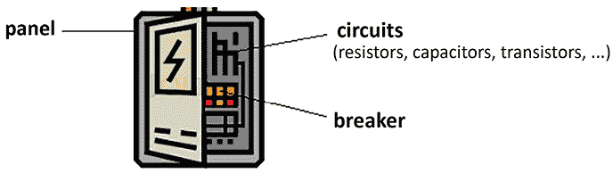
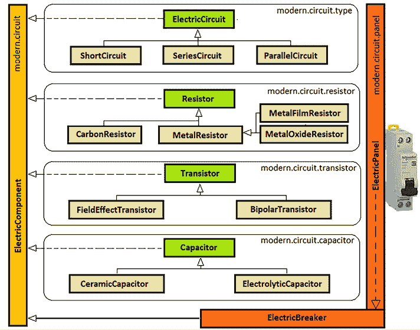
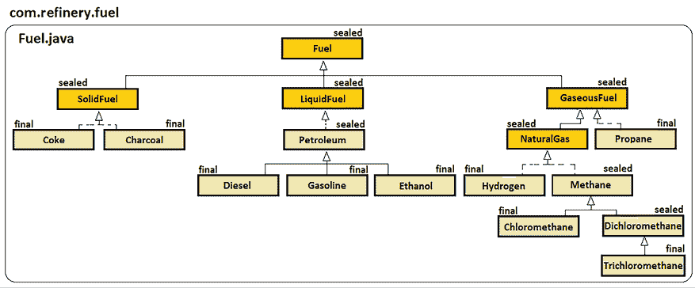
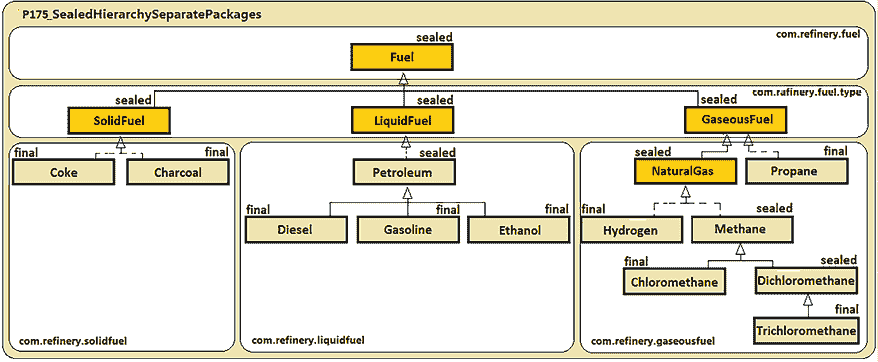
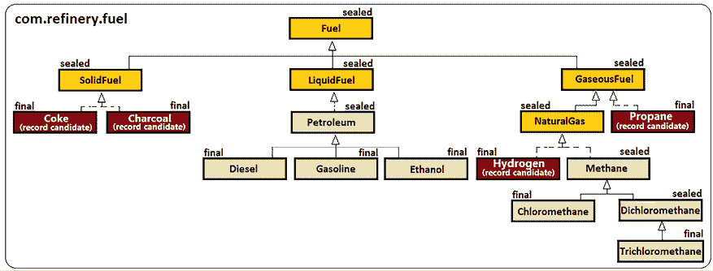
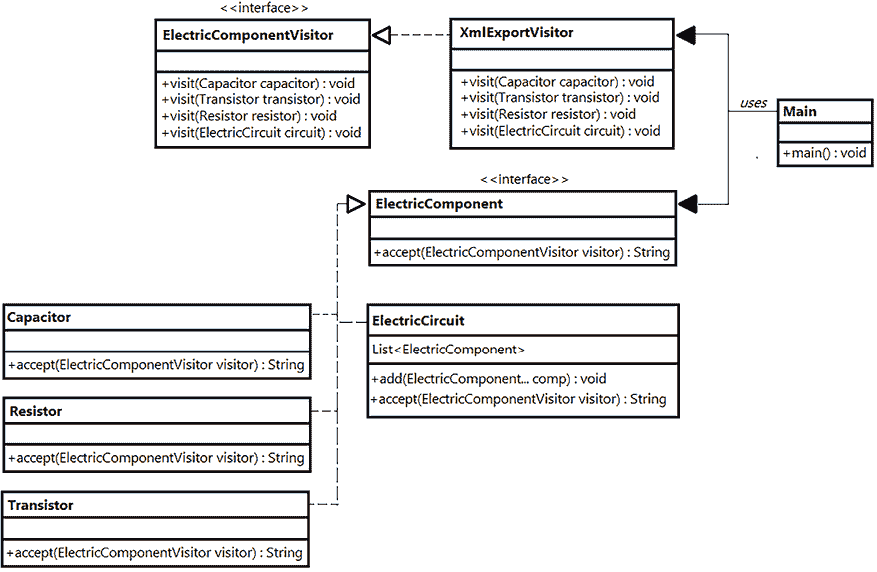
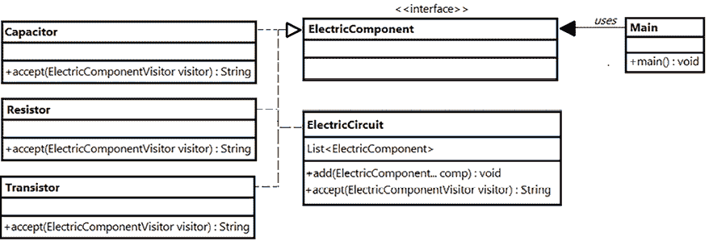

# 第八章：密封和隐藏类

本章包括 13 个问题，涵盖了密封和隐藏类。前 11 个食谱将涵盖密封类，这是 JDK 17（JEP 409）引入的一个非常酷的特性，用于维持*封闭层次结构*。最后两个问题涵盖了隐藏类，这是 JDK 15（JEP 371）的一个特性，允许框架在 JVM 的字节码内部链接中创建和使用运行时（动态）类，以及显式使用类加载器。

你将在本章结束时掌握这两个主题。

# 问题

使用以下问题来测试你在 Java 中操作密封类和隐藏类的编程能力。我强烈建议你在查看解决方案并下载示例程序之前尝试每个问题：

1.  **创建一个电气面板（类层次结构）**：编写一个 Java 应用程序的存根，用于构建电气面板。你可以假设电气面板由多种类型的电气元件（例如，电阻器、晶体管等）和电路（例如，并联电路、串联电路等）组成。

1.  **在 JDK 17 之前关闭电气面板**：使用 Java 特性（例如，`final`关键字和*包私有*技巧）来关闭这个层次结构（接近扩展）。

1.  **介绍 JDK 17 密封类**：简要介绍 JDK 17 密封类。举例说明如何通过密封类在单个源文件中编写封闭层次结构。

1.  **介绍许可条款**：解释并举例说明`permits`子句在密封类中的作用。举例说明在不同源文件（同一包）和不同包中密封类的使用。

1.  **在 JDK 17 之后关闭电气面板**：使用密封类完全关闭在问题 172 和 173 中开发的电气面板层次结构。

1.  **结合密封类和记录**：展示如何将 Java 记录与密封类结合使用。

1.  **在 switch 中使用密封类和 instanceof**：编写一个应用程序，突出密封类如何帮助编译器更好地处理`instanceof`运算符。

1.  **在 switch 中使用密封类**：编写一个应用程序，展示密封类如何帮助编译器维持详尽的 switch 表达式/语句。

1.  **通过密封类和类型模式匹配重解访客模式**：提供一个传统访客模式实现的快速示例，并通过密封类将其转换为更简单、更易访问的代码。

1.  **获取密封类信息（使用反射）**：解释并举例说明我们如何通过 Java 反射访问密封类。

1.  **列出密封类的三大好处**：提供你认为密封类的三大好处，并附上一些解释和论据。

1.  **简要介绍隐藏类**：提供一个简明、清晰且富有意义的隐藏类解释。列出它们的主要特征。

1.  **创建隐藏类**：提供一个创建和使用隐藏类的常规示例。

以下章节描述了前面问题的解决方案。请记住，通常没有解决特定问题的唯一正确方法。此外，请记住，这里所示的解释仅包括解决这些问题所需的最有趣和最重要的细节。下载示例解决方案以查看更多细节，并实验[`github.com/PacktPublishing/Java-Coding-Problems-Second-Edition/tree/main/Chapter08`](https://github.com/PacktPublishing/Java-Coding-Problems-Second-Edition/tree/main/Chapter08)中的程序。

# 172. 创建电气面板（类层次结构）

假设我们想要用代码行来模拟一个电气面板。当然，我们不是电工，所以对我们来说，电气面板意味着一个带有一些内部电路的盒子，这些电路由电气元件组成，并有一个断路器来打开/关闭电气面板。



图 8.1：电气面板组件

电气面板中的所有东西都可以被认为是电气元件，因此我们可以从定义一个接口开始，这个接口必须由面板中的所有东西实现：

```java
public interface ElectricComponent {} 
```

在继续之前，让我们看看电气面板接口和类的图，这将帮助你更容易地理解接下来的内容：



图 8.2：电气面板模型

电气面板由更多相互交互（或不交互）的电气电路组成。我们可以通过以下`abstract`类来表示这样的电路（这充当其子类的基础类）：

```java
public abstract class ElectricCircuit 
    implements ElectricComponent {
  public abstract void on();
  public abstract void off();
} 
```

假设我们的电气面板由三种类型的电路组成。我们有短路、串联电路和并联电路。因此，我们可以通过扩展`abstract ElectricCircuit`（我们在这里只展示`ShortCircuit`，而`ParallelCircuit`和`SeriesCircuit`在捆绑的代码中可用）为每种类型的电路定义适当的类：

```java
public class ShortCircuit extends ElectricCircuit {
  public ShortCircuit(ElectricComponent... comp) {}
  @Override
  public void on() {}
  @Override
  public void off() {}
} 
```

查看一下`ShortCircuit`类的构造函数。它接收一个类型为`ElectricComponent`的`varargs`参数。这意味着我们可以从较小的电路和其他组件（如电容器、晶体管、电阻等）构建更大的电路。每个这样的电气元件都可以通过一个`abstract`类来表示。例如，电容器是一个基类，可以表示如下：

```java
public abstract class Capacitor 
  implements ElectricComponent {} 
```

我们需要两种类型的电容器（陶瓷电容器和电解电容器）。一个陶瓷电容器的形状可以是以下这样：

```java
public class CeramicCapacitor extends Capacitor {} 
```

按照相同的逻辑，我们可以表达其他电气元件，如晶体管（`Transistor`（`abstract`），`BipolarTransistor`和`FieldEffectTransistor`）和电阻（`Resistor`（`abstract`），`CarbonResistor`和`MetalResistor`，以及其两个子类型`MetalFilmResistor`和`MetalOxideResistor`）。

我们几乎拥有了构建面板所需的所有电气组件。我们只需要断路器，它只是另一个具有特定性的电气组件，它公开了两个用于开启/关闭电气面板的方法：

```java
public interface ElectricBreaker extends ElectricComponent {
  void switchOn();
  void switchOff();
} 
```

最后，我们可以将电气面板具体化为以下形式（我们假设有三个电路，一个中心电路，一个外围电路和一个辅助电路）：

```java
public class ElectricPanel implements ElectricBreaker {
  private final ElectricCircuit centralCircuit;
  private final ElectricCircuit peripheralCircuit;
  private final ElectricCircuit auxiliaryCircuit;
  public ElectricPanel() {
    peripheralCircuit = new SeriesCircuit(
      new ElectrolyticCapacitor(),new ElectrolyticCapacitor(), 
      new MetalFilmResistor(), new CarbonResistor());
    auxiliaryCircuit = new ShortCircuit(
      new CeramicCapacitor(), new ElectrolyticCapacitor(), 
      new MetalResistor(), new FieldEffectTransistor(), 
      new FieldEffectTransistor());
    centralCircuit = new ParallelCircuit(
      peripheralCircuit, auxiliaryCircuit,
      new CeramicCapacitor(), new BipolarTransistor(), 
      new MetalOxideResistor()); 
  }
  @Override
  public void switchOn() {
    auxiliaryCircuit.off();
    peripheralCircuit.on();
    centralCircuit.on();
  }
  @Override
   public void switchOff() {
    auxiliaryCircuit.on();
    peripheralCircuit.off();
    centralCircuit.off(); 
  }
} 
```

完成！现在，我们的面板客户端可以通过`switchOn()`/`switchOff()`方法来操作它：

```java
ElectricPanel panel = new ElectricPanel();
panel.switchOn(); 
```

在下一个问题中，我们将看到如何关闭这个类的层次结构，以增加封装并避免意外的/非意外的扩展。

# 173. 在 JDK 17 之前关闭电气面板

从本质上讲，电气面板是一个封闭的工作单元。但我们的前一个问题中的代码远远不是一个封闭的层次结构。我们可以在层次结构的内部或外部扩展和实现几乎任何类/接口。

在 JDK 17 之前使用任何东西，关闭类和接口的层次结构可以使用几种工具。

## 应用`final`修饰符

例如，我们有强大的`final`修饰符。一旦我们将一个类声明为`final`，它就不能被扩展，因此它完全封闭了对扩展。显然，我们不能在层次模型中一致地应用这种技术，因为这会导致非层次模型。

如果我们扫描我们的电气面板模型，那么我们可以在几个地方使用`final`修饰符。首先，我们消除了接口（`ElectricComponent`和`ElectricBreaker`），因为接口不能声明为`final`。接下来，我们可以查看`ElectricCircuit`类及其子类（`ParallelCircuit`、`SeriesCircuit`和`ShortCircuit`）。显然，由于`ElectricCircuit`有子类，它不能是`final`。然而，它的子类正在建模不应该扩展的概念，因此它们可以是`final`。这是我们获得封闭层次模型的第一步：

```java
public **final** class ParallelCircuit extends ElectricCircuit {}
public **final** class SeriesCircuit extends ElectricCircuit {}
public **final** class ShortCircuit extends ElectricCircuit {} 
```

其他建模了明确概念且不应该扩展的类是建模电容器、晶体管和电阻的类。因此，以下类也可以是`final`：

```java
public **final** class CeramicCapacitor extends Capacitor {}
public **final** class ElectrolyticCapacitor extends Capacitor {}
public **final** class FieldEffectTransistor extends Transistor {}
public **final** class BipolarTransistor extends Transistor {}
public **final** class CarbonResistor extends Resistor {}
public **final** class MetalFilmResistor extends MetalResistor {}
public **final** class MetalOxideResistor extends MetalResistor {} 
```

最后，我们有`ElectricPanel`类。从电气面板派生东西是没有意义的，所以这个类也可以是`final`：

```java
public **final** class ElectricPanel implements ElectricBreaker {} 
```

到目前为止，我们已经成功关闭了层次结构的一些部分。没有其他地方可以使用`final`修饰符帮助我们，因此我们可以更进一步，尝试另一种技术。

## 定义包私有构造函数

接下来，我们可以使用定义`包私有`构造函数的技巧（一个没有可见修饰符的构造函数）。具有`包私有`构造函数的类只能在包内部实例化和扩展——从可读性的角度来看，这种技术远远没有表达其意图。然而，在复杂的设计中，我们可以偶尔应用这种技术，因为我们不能简单地将所有内容放入一个单独的包中。尽管如此，它可以被认为是一种提高层次模型封闭级别的解决方案。

例如，我们可以关注我们的`抽象`类。它们不能被实例化（因为它们是`抽象`的），但可以从任何地方扩展。然而，其中一些类只应该在它们定义的包中扩展。`ElectricCircuit`类是`抽象`的，它只能由`ParallelCircuit`、`SeriesCircuit`和`ShortCircuit`扩展。这些子类与`ElectricCircuit`类位于同一个包中，因此使用这种声明为`包私有`的构造函数的做法是有意义的：

```java
public abstract class ElectricCircuit 
    implements ElectricComponent {
  **ElectricCircuit() {}**
  ...
} 
```

现在，`ElectricCircuit`类对外部包的任何扩展尝试都是封闭的。当然，它仍然对其包内部的扩展尝试是开放的。

## 将类/接口声明为非公开

进一步来说，我们可以将接口/类声明为非公开（通过从类/接口定义中省略`public`关键字，它变为非公开，并默认设置为所谓的`包私有`访问模式）。这样，这些类和接口只能在它们的包内部可见（可以使用/扩展）。我们不能将这种技术应用于`ElectricComponent`接口。这个接口必须被声明为`public`，因为它被我们的大多数类实现。然而，我们可以将这种技术应用于`ElectricBreaker`接口，因为这个接口应该只由位于同一包中的`ElectricPanel`类实现：

```java
interface ElectricBreaker extends ElectricComponent {} 
```

现在，`ElectricBreaker`不能在其包外部被扩展/实现。此外，我们可以将这种技术应用于`抽象`类`Transistor`、`Resistor`和`Capacitor`：

```java
abstract class Capacitor implements ElectricComponent {}
abstract class Resistor implements ElectricComponent {}
abstract class Transistor implements ElectricComponent {} 
```

注意，我们不能将这种技术应用于`ElectricCircuit`类。这个类是`抽象`的，但它被`ElectricPanel`类使用，因此它不能是非公开的。然而，由于之前添加了`包私有`的构造函数，它不能被扩展。

## 将所有内容放入模块中

此外，我们可以将整个层次结构放置在一个 Java 模块中，并将其中的一小部分导出/暴露给我们的客户端。然而，这种做法不会影响模块内部的封闭级别，所以我们将其跳过（也就是说，我们不会举例说明它）。

在这个时刻，几乎整个层次结构都对扩展/实现关闭。例外的是`MetalResistor`类和`ElectricComponent`接口，它们可以从模型内部/外部任何地方进行扩展/实现，以及`ElectricCircuit`、`Capacitor`、`Transistor`和`Resistor`类，它们可以从它们的包内部进行扩展。通过将模型放置在 Java 模块中，我们可以阻止模块外部的这些操作，但它们仍然可以从模块内部进行。

## 结论

从这个点开始（在 JDK 17 之前），我们不能再应用任何技术、技巧或黑客手段。我们可以重新考虑模型设计，但这将过于昂贵，基本上意味着完全重新设计模型，这可能会影响模型结构和逻辑。

为了讨论和重新设计的上下文，我们可能会考虑 Java 枚举。Java 枚举为我们提供了一个很好的封闭层次结构，并且在内部被转换为常规 Java 类。尽管如此，使用枚举来设计封闭模型和塑造任意类可能会非常奇怪、难以驾驭且不方便。

总之，在 JDK 17 之前，我们有激进的全局`final`修饰符和一些通过*包私有*访问在包级别上的控制。

显然，这里缺失的是介于两者之间的一些东西，一些可以给我们更多粒度和控制的东西。幸运的是，JDK 17 可以通过密封类帮助我们实现 100% 封闭的层次结构。这是一些后续问题的主题。

# 174. 引入 JDK 17 密封类

在 JDK 17 的酷炫特性中，我们有 JEP 409（密封类）。这个 JEP 提供了一个明确、直观、清晰易懂的解决方案，用于指定谁将扩展一个类/接口或实现一个接口。换句话说，密封类可以在更细的级别上控制继承。密封类可以影响类、`abstract`类和接口，并保持代码的可读性——你有一个简单且易于表达的方法来告诉你的同事谁可以扩展/实现你的代码。


图 8.3：JDK 17，JEP 409

通过密封类，我们对类层次结构有了更精细的控制。如图 8.3 所示，密封类是介于`final`和*包私有*之间的缺失拼图。换句话说，密封类提供了我们通过`final`修饰符和*包私有*访问无法获得的粒度。

**重要提示**

密封类不会影响`final`和`abstract`关键字的语义。它们仍然像过去几年一样精确地起作用。一个密封类不能是`final`，反之亦然。

让我们考虑以下类（`Truck.java`）：

```java
public class Truck {} 
```

我们知道，原则上，这个类可以被任何其他类扩展。但我们只有三种类型的卡车：半挂车、厢式货车和冷藏车。因此，只有三个类应该扩展`Truck`类。任何其他扩展都不应该被允许。为了实现这个目标，我们在`Truck`类的声明中添加了`sealed`关键字，如下所示：

```java
public **sealed** class Truck {} 
```

通过添加`sealed`关键字，编译器将自动扫描在`Truck.java`中预定义的所有`Truck`的扩展。

接下来，我们必须指定`Truck`的子类（`SemiTrailer`、`Tautliner`和`Refrigerated`）。

**重要提示**

一个`sealed`类（无论是`abstract`还是不是）必须至少有一个子类（否则声明它为`sealed`就没有意义）。一个`sealed`接口必须至少有一个子接口或实现（同样，否则声明它为`sealed`就没有意义）。如果我们不遵循这些规则，那么代码将无法编译。

如果我们在同一个源文件（`Truck.java`）中声明`Truck`的子类，可以这样做：

```java
final class SemiTrailer extends Truck {}
final class Tautliner extends Truck {}
final class Refrigerated extends Truck {} 
```

检查完这段代码后，我们必须再提出另一个重要提示。

**重要提示**

一个`sealed`类的子类必须声明为`final`、`sealed`或`non-sealed`。一个`sealed`接口的子接口必须声明为`sealed`或`non-sealed`。如果一个`sealed`类（接口）的子类（子接口）被声明为`sealed`，那么它必须有自己的子类（子接口）。`non-sealed`关键字表示子类（子接口）可以无限制地进一步扩展（包含`non-sealed`类/接口的层次结构不是封闭的）。此外，`final`子类不能被扩展。

由于我们的子类（`SemiTrailer`、`Tautliner`和`Refrigerated`）被声明为`final`，它们不能进一步扩展。因此，`Truck`类只能被`SemiTrailer`、`Tautliner`和`Refrigerated`扩展，而这些类是不可扩展的。

在接口的情况下，我们做同样的事情。例如，一个`sealed`接口看起来像这样：

```java
public sealed interface Melon {} 
```

通过添加`sealed`关键字，编译器将自动扫描在`Melon.java`中预定义的所有`Melon`的实现/扩展。因此，在同一个源文件（`Melon.java`）中，我们声明这个接口的扩展和实现：

```java
non-sealed interface Pumpkin extends Melon {}
final class Gac implements Melon {}
final class Cantaloupe implements Melon {}
final class Hami implements Melon {} 
```

`Pumpkin`接口可以进一步自由实现/扩展，因为它被声明为`non-sealed`。`Pumpkin`的实现/扩展不需要声明为`sealed`、`non-sealed`或`final`（但我们仍然可以做出这样的声明）。

接下来，让我们看看一个更复杂的例子。让我们把这个模型命名为*Fuel*模型。在这里，所有类和接口都放在同一个源文件中，`Fuel.java`（`com.refinery.fuel`包）。花点时间分析每个类/接口，了解`sealed`、`non-sealed`和`final`在这个层次模型中是如何一起工作的：



图 8.4：使用`sealed`、`non-sealed`和`final`的层次模型

在代码行中，这个模型可以表示如下：

```java
public sealed interface Fuel {}
sealed interface SolidFuel extends Fuel {}
sealed interface LiquidFuel extends Fuel {}
sealed interface GaseousFuel extends Fuel {}
final class Coke implements SolidFuel {}
final class Charcoal implements SolidFuel {}
sealed class Petroleum implements LiquidFuel {}
final class Diesel extends Petroleum {}
final class Gasoline extends Petroleum {}
final class Ethanol extends Petroleum {}
final class Propane implements GaseousFuel {}
sealed interface NaturalGas extends GaseousFuel {}
final class Hydrogen implements NaturalGas {}
sealed class Methane implements NaturalGas {}
final class Chloromethane extends Methane {}
sealed class Dichloromethane extends Methane {}
final class Trichloromethane extends Dichloromethane {} 
```

将所有类/接口放在同一个源文件中允许我们表达像之前那样的封闭层次模型。然而，将所有类和接口放在同一个文件中通常不是一个有用的方法——也许当模型包含几个小的类/接口时。

在现实中，我们喜欢将类和接口分开到它们自己的源文件中。每个类/接口在自己的源文件中更自然、更直观。这样，我们避免了大型源文件，并且更容易遵循面向对象编程的最佳实践。因此，我们下一个问题的目标是使用每个类/接口一个源文件的方式重写`Fuel`层次模型。

# 175. 引入`permits`子句

在上一个问题中，你看到了如何在单个源文件中编写一个封闭的层次模型。接下来，让我们使用`Fuel.java`源文件，通过使用单独的源文件和单独的包来重写这个模型。

## 在单独的源文件中（同一包）使用密封类

让我们考虑`Fuel.java`包中的`sealed Fuel`接口：

```java
public sealed interface Fuel {}   // Fuel.java 
```

我们知道这个接口被三个其他接口扩展：`SolidFuel`、`LiquidFuel`和`SolidFuel`。让我们在`SolidFuel.java`源文件（同一包）中定义`SolidFuel`，如下所示：

```java
public sealed interface SolidFuel {} // SolidFuel.java 
```

如你将看到的，这段代码将无法编译（这就像编译器在问：嘿，没有实现/扩展的密封接口有什么意义呢？）。这次，我们必须明确指定可以扩展/实现`Fuel`接口的接口。为此，我们使用`permits`关键字。由于`Fuel`由三个接口实现，我们只需通过`permits`列出它们的名称，如下所示：

```java
public sealed interface Fuel 
  permits SolidFuel, LiquidFuel, GaseousFuel {} 
```

通过`permits`提供的列表是详尽的。`SolidFuel`也是一个`sealed`接口，因此它必须定义自己的`permits`：

```java
public sealed interface SolidFuel extends Fuel
  permits Coke, Charcoal {} 
```

`LiquidFuel`和`GaseousFuel`与`SolidFuel`的工作方式相同：

```java
// LiquidFuel.java
public sealed interface LiquidFuel extends Fuel
  permits Petroleum {}
// GaseousFuel.java
public sealed interface GaseousFuel extends Fuel
  permits NaturalGas, Propane {} 
```

`Coke`（`Coke.java`）和`Charcoal`（`Charcoal.java`）是`final`的`SolidFuel`实现，因此它们不使用`permits`关键字：

```java
public final class Coke implements SolidFuel {}
public final class Charcoal implements SolidFuel {} 
```

`Petroleum` 类（`Petroleum.java`）是`密封`的，并允许三种扩展：

```java
public sealed class Petroleum implements LiquidFuel
  permits Diesel, Gasoline, Ethanol {} 
```

`Diesel`（`Diesel.java`）、`Gasoline`（`Gasoline.java`）和`Ethanol`（`Ethanol.java`）类是`final`的：

```java
public final class Diesel extends Petroleum {}
public final class Gasoline extends Petroleum {}
public final class Ethanol extends Petroleum {} 
```

`NaturalGas`接口（`NaturalGas.java`）是`GaseousFuel`的`sealed`扩展，而`Propane`（`Propane.java`）是`GaseousFuel`的`final`实现：

```java
public sealed interface NaturalGas extends GaseousFuel
  permits Hydrogen, Methane {}
public final class Propane implements GaseousFuel {} 
```

如你所见，这个接口允许两个扩展。`Hydrogen`类是一个`final`扩展，而`Methane`是一个`sealed`类：

```java
public final class Hydrogen implements NaturalGas {}
public sealed class Methane implements NaturalGas
  permits Chloromethane, Dichloromethane {} 
```

`Chloromethane`类是`final`的，而`Dichloromethane`是`sealed`的：

```java
public final class Chloromethane extends Methane {}
public sealed class Dichloromethane extends Methane
  permits Trichloromethane {} 
```

最后，我们有`Trichloromethane`类。这是一个`final`类：

```java
public final class Trichloromethane extends Dichloromethane {} 
```

完成！层次模型已关闭并完整。尝试扩展/实现这个层次结构中的任何成员都将导致异常。如果我们想向`密封`类/接口添加新的扩展/实现，那么我们还需要将其添加到`permits`列表中。

## 在不同的包中处理密封类

在前面的例子中，我们在同一个包`com.refinery.fuel`中分别表达了类/接口，但它们位于同一个包中。接下来，让我们考虑将这些类和接口分散到不同的包中，如下面的图所示：



图 8.5：不同包中的密封层次结构

只要相关的`密封`类/接口位于同一个包中，我们就可以使用 JDK 9 的 *unnamed* 特殊模块（没有显式模块）。否则，我们必须使用 *named* 模块。例如，如果我们像 *图 8.5* 中那样表达我们的模型，那么我们必须通过`module-info.java`将模块中的所有内容添加到模块中：

```java
module P175_SealedHierarchySeparatePackages {} 
```

没有命名模块，代码将无法编译。在捆绑的代码中，你可以找到这个问题的两个示例。

# 176. 在 JDK 17 之后关闭电气面板

你还记得我们在 *问题 172* 和 *173* 中早期引入的电气面板模型吗？在 *问题 173* 中，我们尽可能使用 JDK 17 之前可用的 Java 功能关闭了这个模型。现在，我们可以重新审视这个模型（*问题 173*），并通过 JDK 17 密封类完全关闭它。

我们从`ElectricComponent`接口开始，该接口声明如下：

```java
public interface ElectricComponent {} 
```

在这个时候，这个接口还没有关闭。它可以从应用的任何其他点扩展/实现。但我们可以通过将其转换为带有适当`permits`子句的`密封`接口来关闭它，如下所示：

```java
public sealed interface ElectricComponent
  permits ElectricCircuit, ElectricBreaker, 
          Capacitor, Resistor, Transistor {} 
```

接下来，让我们专注于半封闭的`ElectricCircuit`类。这是一个`抽象`类，它使用`包私有`构造函数来阻止其包外部的任何扩展。然而，它仍然可以从包内部扩展。我们可以通过将其转换为带有适当`permits`子句的`密封`类来完全关闭它（`包私有`构造函数可以安全地移除）：

```java
public sealed abstract class ElectricCircuit 
  implements ElectricComponent
  permits ParallelCircuit, SeriesCircuit, ShortCircuit {} 
```

`ParallelCircuit`、`SeriesCircuit`和`ShortCircuit`被声明为`final`，所以它们保持不变。我们不希望允许这些类的任何扩展。

接下来，让我们专注于`电容器`、`晶体管`和`电阻器`类。这些类也是`抽象`的，并使用`包私有`构造函数来避免任何来自它们包外部的扩展尝试。因此，我们可以移除这些构造函数，并将它们转换为`密封`类，就像我们对`ElectricCircuit`所做的那样：

```java
public sealed abstract class Capacitor 
  implements ElectricComponent
  permits CeramicCapacitor, ElectrolyticCapacitor {}
public sealed abstract class Transistor 
  implements ElectricComponent
  permits FieldEffectTransistor, BipolarTransistor {}
public sealed abstract class Resistor 
  implements ElectricComponent
  permits MetalResistor, CarbonResistor {} 
```

查看一下`电阻器`类。它只允许`MetalResistor`和`CarbonResistor`类。接下来，`MetalResistor`类需要特别注意。到目前为止，这个类是`public`的，可以从应用的任何其他点扩展：

```java
public class MetalResistor extends Resistor {} 
```

通过以下方式密封这个类可以关闭它：

```java
public sealed class MetalResistor extends Resistor
  permits MetalFilmResistor, MetalOxideResistor {} 
```

`MetalFilmResistor`和`MetalOxideResistor`类是`final`的，保持不变：

```java
public final class MetalFilmResistor extends MetalResistor {}
public final class MetalOxideResistor extends MetalResistor {} 
```

同样的声明也适用于`CeramicCapacitor`、`ElectrolyticCapacitor`、`BipolarTransistor`和`FieldEffectTransistor`类。

接下来，让我们关注`ElectricBreaker`接口。这个接口位于`modern.circuit.panel`包中，并且只由`ElectricPanel`实现，因此它被声明为*包私有*（它不能从包外部扩展/实现）：

```java
interface ElectricBreaker extends ElectricComponent {} 
```

为了完全封闭这个接口，我们将其转换为`sealed`接口，如下所示：

```java
public sealed interface ElectricBreaker
  extends ElectricComponent permits ElectricPanel {} 
```

注意，我们还添加了`public`修饰符。这是必要的，因为`ElectricBreaker`必须出现在`ElectricComponent`接口的`permits`列表中，因此它必须在其包外部可用。

最后，`ElectricPanel`保持不变（一个实现`ElectricBreaker`的`final`类）：

```java
public final class ElectricPanel implements ElectricBreaker {} 
```

任务完成！电面板分层模型完全封闭，无法扩展。我们将所有内容放入一个*命名*模块中（因为我们有在不同包之间交互的`sealed`组件），任务完成。

# 177. 结合密封类和记录

如你在*第四章*中所知，Java 记录是`final`类，不能被扩展，也不能扩展其他类。这意味着记录和`sealed`类/接口可以组合起来获得一个封闭的层次结构。

例如，在以下图中，我们可以识别出在*Fuel*模型中可以成为 Java 记录的良好候选类的类：



图 8.6：识别可以成为 Java 记录的类

如你所见，我们有四个可以成为 Java 记录的类：`Coke`、`Charcoal`、`Hydrogen`和`Propane`。从技术上讲，这些类可以成为 Java 记录，因为它们是`final`类，并且没有扩展其他类：

```java
public record Coke() implements SolidFuel {}
public record Charcoal() implements SolidFuel {}
public record Hydrogen() implements NaturalGas {}
public record Propane() implements GaseousFuel {} 
```

当然，技术方面很重要，但不足以满足要求。换句话说，你不必将所有类都转换为 Java 记录，仅仅因为它们可以工作并且代码可以编译。你还必须考虑应用程序的逻辑和上下文。有时，一个`final`类就足够了；否则，你可能需要一个由`sealed`接口和一些同一源文件（`A.java`）中的记录和类组成的神秘模型：

```java
public sealed interface A {
  record A1() implements A {}
  record A2() implements A {}
  final class B1 implements A {}
  non-sealed class B2 implements A {}
}
record A3() implements A {}
record A4() implements A {} 
```

如果你想要将`permits`子句添加到`A`中，你可以这样做：

```java
public sealed interface A 
  permits A.A1, A.A2, A.B1, A.B2, A3, A4 {…} 
```

完成！接下来，让我们看看密封类如何帮助编译器更好地处理`instanceof`检查。

# 178. 将密封类与 instanceof 挂钩

密封类影响编译器对`instanceof`操作符的理解，以及隐式地影响其内部类型转换和转换操作。

让我们考虑以下代码片段：

```java
public interface Quadrilateral {}
public class Triangle {} 
```

因此，我们这里有一个接口（`Quadrilateral`）和一个没有实现这个接口的类。在这个上下文中，以下代码是否可以编译？

```java
public static void drawTriangle(Triangle t) {
  if (**t** **instanceof** **Quadrilateral**) {
    System.out.println("This is not a triangle");
  } else {
    System.out.println("Drawing a triangle");
  }
} 
```

我们编写了`if (t instanceof Quadrilateral) {…}`，但我们知道`Triangle`没有实现`Quadrilateral`，所以乍一看，我们可能会认为编译器会对此提出抱怨。但实际上，代码可以编译，因为在运行时，我们可能有一个扩展`Triangle`并实现`Quadrilateral`的`Rectangle`类：

```java
public class Rectangle extends Triangle
  implements Quadrilateral {} 
```

因此，我们的`instanceof`是有意义的，并且完全合法。接下来，让我们通过`final`关键字关闭`Triangle`类：

```java
public final class Triangle {} 
```

由于`Triangle`是`final`的，`Rectangle`不能扩展它，但它仍然可以实现`Quadrilateral`：

```java
public class Rectangle implements Quadrilateral {} 
```

这次，`if (t instanceof Quadrilateral) {…}`代码将无法编译。编译器知道`final`类不能被扩展，所以`Triangle`永远不会是`Quadrilateral`。

到目前为止，一切顺利！现在，让我们将`Triangle`类恢复为非`final`类：

```java
public class Triangle {} 
```

让我们密封`Quadrilateral`接口，只允许`Rectangle`：

```java
public sealed interface Quadrilateral permits Rectangle {} 
```

此外，`Rectangle`类是`final`的，如下所示（这次，它没有扩展`Triangle`）：

```java
public final class Rectangle implements Quadrilateral {} 
```

再次，编译器将对此检查提出抱怨，`if (t instanceof Quadrilateral) {…}`。很明显，`Triangle`不能是`Quadrilateral`的实例，因为`Quadrilateral`是密封的，并且只允许`Rectangle`，不允许`Triangle`。然而，如果我们修改`Rectangle`以扩展`Triangle`，则代码可以编译：

```java
public final class Rectangle extends Triangle
  implements Quadrilateral {} 
```

因此，总的来说，密封类可以帮助编译器更好地理解`instanceof`检查，并在它没有意义时向我们发出信号。

# 179. 在`switch`中挂钩密封类

这本书中不是第一次介绍密封类和`switch`表达式的示例。在*第二章*，*问题 66*中，我们通过`sealed Player`接口简要介绍了这样一个示例，目的是为了覆盖`switch`模式标签中的完整性（类型覆盖率）。

如果当时你发现这个例子令人困惑，我非常确信现在它已经清晰了。然而，让我们保持新鲜感，并从这个`abstract`基类开始看另一个示例：

```java
public abstract class TextConverter {} 
```

此外，我们有三个转换器可用，如下所示：

```java
final public class Utf8 extends TextConverter {}
final public class Utf16 extends TextConverter {}
final public class Utf32 extends TextConverter {} 
```

现在，我们可以编写一个`switch`表达式来匹配这些`TextConverter`实例，如下所示：

```java
public static String convert(
  TextConverter converter, String text) { 
  return switch (converter) {
    case Utf8 c8 -> "Converting text to UTF-8: " + c8;
    case Utf16 c16 -> "Converting text to UTF-16: " + c16;
    case Utf32 c32 -> "Converting text to UTF-32: " + c32;
**case** **TextConverter tc ->** **"Converting text: "** **+ tc;**
**default** **->** **"Unrecognized converter type"****;**
  };
} 
```

查看高亮显示的代码行。在三个案例（`case Utf8`、`case Utf16`和`case Utf32`）之后，我们必须有一个`case TextConverter`或`default`案例。换句话说，在匹配`Utf8`、`Utf16`和`Utf32`之后，我们必须有一个总类型模式（无条件模式）来匹配任何其他`TextConverter`或`default`案例，这通常意味着我们面临的是一个未知的转换器。

如果总类型模式和`default`标签都缺失，则代码无法编译。`switch`表达式没有涵盖所有可能的案例（输入值），因此它不是详尽的。这是不允许的，因为使用`null`和/或模式标签的`switch`表达式和`switch`语句应该是详尽的。

编译器会将我们的 `switch` 视为非穷尽性，因为我们可以自由地扩展基类（`TextConverter`）而不覆盖所有情况。一个优雅的解决方案是将基类（`TextConverter`）密封如下：

```java
public sealed abstract class TextConverter
  permits Utf8, Utf16, Utf32 {} 
```

现在，`switch` 可以表达如下：

```java
return switch (converter) {
  case Utf8 c8 -> "Converting text to UTF-8: " + c8;
  case Utf16 c16 -> "Converting text to UTF-16: " + c16;
  case Utf32 c32 -> "Converting text to UTF-32: " + c32;
}; 
```

这次，编译器知道所有可能的 `TextConverter` 类型，并看到它们都在 `switch` 中被覆盖。由于 `TextConverter` 是密封的，所以没有惊喜；不会出现未覆盖的情况。尽管如此，如果我们后来决定添加一个新的 `TextConverter`（例如，通过扩展 `TextConverter` 并在 `permits` 子句中添加此扩展来添加 `Utf7`），那么编译器将立即抱怨 `switch` 是非穷尽性的，因此我们必须采取行动并为其添加适当的 `case`。

在这个时候，`Utf8`、`Utf16` 和 `Utf32` 被声明为 `final`，因此不能被扩展。假设我们将 `Utf16` 修改为 `non-sealed`：

```java
non-sealed public class Utf16 extends TextConverter {} 
```

现在，我们可以扩展 `Utf16` 如下：

```java
public final class Utf16be extends Utf16 {}
public final class Utf16le extends Utf16 {} 
```

即使我们在 `Utf16` 类中添加了两个子类，我们的 `switch` 仍然是穷尽性的，因为 `Utf16` 的情况将同时覆盖 `Utf16be` 和 `Utf16le`。尽管如此，我们仍然可以明确地添加它们的情况，只要我们在 `case Utf16` 之前添加这些情况，如下所示：

```java
return switch (converter) {
  case Utf8 c8 -> "Converting text to UTF-8: " + c8;
  case Utf16be c16 -> "Converting text to UTF-16BE: " + c16;
  case Utf16le c16 -> "Converting text to UTF-16LE: " + c16;
  case Utf16 c16 -> "Converting text to UTF-16: " + c16;
  case Utf32 c32 -> "Converting text to UTF-32: " + c32;
}; 
```

我们必须在 `case Utf16` 之前添加 `case Utf16be` 和 `case Utf16le` 以避免优先级错误（参见 *第二章*，*问题 65*）。

这里是结合密封类、模式匹配的 `switch` 和 Java 记录来计算整数二叉树节点总和的另一个示例：

```java
sealed interface BinaryTree {
  record Leaf() implements BinaryTree {}
  record Node(int value, BinaryTree left, BinaryTree right) 
    implements BinaryTree {} 
}
static int sumNode(BinaryTree t) {
  return switch (t) {
    case Leaf nl -> 0;
    case Node nv -> nv.value() + sumNode(nv.left()) 
                                + sumNode(nv.right());
  };
} 
```

下面是调用 `sumNode()` 的一个示例：

```java
BinaryTree leaf = new Leaf();
BinaryTree s1 = new Node(5, leaf, leaf);
BinaryTree s2 = new Node(10, leaf, leaf);
BinaryTree s = new Node(4, s1, s2);
int sum = sumNode(s); 
```

在这个例子中，结果是 `19`。

# 180. 通过密封类和类型模式匹配的 `switch` 重新解释访问者模式

访问者模式是 **Gang of Four**（**GoF**）设计模式的一部分，其目标是定义对某些类的新操作，而无需修改这些类。您可以在互联网上找到许多关于这个主题的优秀资源，因此对于经典实现，我们在这里只提供我们示例的类图，而代码可在 GitHub 上找到：



图 8.7：访问者模式类图（用例）

简而言之，我们有一系列类（`Capacitor`、`Transistor`、`Resistor` 和 `ElectricCircuit`），它们用于创建电路。我们的操作在 `XmlExportVisitor`（`ElectricComponentVisitor` 的实现）中形成，包括打印包含电路规格和参数的 XML 文档。

在继续之前，请考虑熟悉捆绑代码中可用的传统实现和输出。

接下来，假设我们想要通过密封类和类型模式匹配的 `switch` 转换这个传统实现。预期的类图更简单（类更少），如下所示：



图 8.8：通过密封类和 switch 模式重新解释的访问者模式

让我们从`ElectricComponent`接口开始转换。我们知道这个接口只由`Capacitor`、`Resistor`、`Transistor`和`ElectricCircuit`实现。因此，这个接口是一个很好的候选者，可以成为`sealed`，如下所示：

```java
public sealed interface ElectricComponent
  permits Capacitor, Transistor, Resistor, ElectricCircuit {} 
```

注意，我们已经从这个接口中删除了`accept()`方法。我们不再需要这个方法。接下来，`Capacitor`、`Resistor`、`Transistor`和`ElectricCircuit`变成了`final`类，并且`accept()`实现也被删除了。

由于我们不依赖于传统的访问者模式，我们可以安全地移除其特定的组件，例如`ElectricComponentVisitor`和`XmlComponentVisitor`。

看起来很干净，对吧？我们保留了一个`sealed`接口和四个`final`类。接下来，我们可以编写一个`switch`语句来遍历电路的每个组件，如下所示：

```java
private static void export(ElectricComponent circuit) {
  StringBuilder sb = new StringBuilder();
  sb.append("<?xml version=\"1.0\" encoding=\"utf-8\"?>\n");
  export(sb, circuit);
  System.out.println(sb);
} 
```

`export(StringBuilder sb, ElectricComponent... comps)`是有效的访问者：

```java
private static String export(StringBuilder sb, 
    ElectricComponent... comps) {
 for (ElectricComponent comp : comps) {
  switch (comp) {
   case Capacitor c ->
    sb.append("""
        <capacitor>
          <maxImpedance>%s</maxImpedance>
          <dielectricResistance>%s</dielectricResistance>
          <coreTemperature>%s</coreTemperature>
        </capacitor>
     """.formatted(c.getMaxImpedance(), 
                   c.getDielectricResistance(), 
                   c.getCoreTemperature())).toString();
   case Transistor t ->
    sb.append("""
        <transistor>
          <length>%s</length>
          <width>%s</width>
          <threshholdVoltage>%s</threshholdVoltage>
        </transistor>
     """.formatted(t.getLength(), t.getWidth(), 
                   t.getThreshholdVoltage())).toString();
   case Resistor r ->
    sb.append("""
        <resistor>
          <resistance>%s</resistance>
          <clazz>%s</clazz>
          <voltage>%s</voltage>
          <current>%s</current>
          <power>%s</power>
        </resistor>
     """.formatted(r.getResistance(), r.getClazz(),
                   r.getVoltage(), r.getCurrent(), 
                   r.getPower())).toString();
   case ElectricCircuit ec ->
    sb.append("""
        <electric_circuit_%s>
        %s\
        </electric_circuit_%s>
     """.formatted(ec.getId(),
          export(new StringBuilder(), 
            ec.getComps().toArray(ElectricComponent[]::new)),
            ec.getId()).indent(3)).toString();
  }
 }
 return sb.toString();
} 
```

任务完成！你可以在捆绑的代码中找到完整的示例。

# 181. 使用反射获取密封类信息

我们可以通过 Java 反射 API 中添加的两个方法来检查`sealed`类。首先，我们有`isSealed()`，这是一个标志方法，用于检查一个类是否是`sealed`。其次，我们有`getPermittedSubclasses()`，它返回一个包含允许的类的数组。基于这两个方法，我们可以编写以下辅助工具来返回`sealed`类的允许类：

```java
public static List<Class> permittedClasses(Class clazz) {
  if (clazz != null && clazz.isSealed()) {
    return Arrays.asList(clazz.getPermittedSubclasses());
  }
  return Collections.emptyList();
} 
```

我们可以通过`Fuel`模型轻松测试我们的辅助工具，如下所示：

```java
Coke coke = new Coke();
Methane methane = new Methane();
// [interface com.refinery.fuel.SolidFuel, 
//  interface com.refinery.fuel.LiquidFuel, 
//  interface com.refinery.fuel.GaseousFuel]           
System.out.println("Fuel subclasses: " 
  + Inspector.permittedClasses(Fuel.class));
// [class com.refinery.fuel.Coke, 
//  class com.refinery.fuel.Charcoal]
System.out.println("SolidFuel subclasses: " 
  + Inspector.permittedClasses(SolidFuel.class));
// []
System.out.println("Coke subclasses: " 
  + Inspector.permittedClasses(coke.getClass()));
// [class com.refinery.fuel.Chloromethane, 
//  class com.refinery.fuel.Dichloromethane]
System.out.println("Methane subclasses: " 
  + Inspector.permittedClasses(methane.getClass())); 
```

我认为你已经明白了这个想法！

# 182. 列出密封类的三大好处

也许你有自己的三大密封类好处，这与以下列表不匹配。没关系，它们仍然是好处！

+   **密封类支持更好的设计和清楚地暴露其意图**：在使用密封类之前，我们只能依赖于`final`关键字（它已经足够表达），以及*包私有*类/构造函数。显然，*包私有*代码需要一些推理来理解其意图，因为通过这种技巧建立封闭层次结构并不容易识别。另一方面，密封类非常清楚地表达了它们的意图。

+   **编译器可以依赖密封类为我们执行更细粒度的检查**：没有人可以悄悄地将一个类放入通过密封类关闭的层次结构中。任何此类尝试都会通过一个清晰且有意义的信息被拒绝。编译器在保护我们，并作为防止任何意外/非意外尝试以不适当的方式使用我们的封闭层次结构的第一道防线。

+   **密封类有助于编译器提供更好的模式匹配**：您在*问题 179*中实验了这一好处。编译器可以依赖密封类来确定`switch`是否覆盖了所有可能的输入值，因此是穷尽的。而这只是密封类在模式匹配中能做的事情的开始。

# 183. 简要介绍隐藏类

隐藏类是在 JDK 15 中通过 JEP 371 引入的。它们的主要目标是作为框架动态生成的类使用。它们是生命周期短的运行时生成的类，通过反射由框架使用。

**重要提示**

隐藏类不能直接通过字节码或其他类使用。它们不是通过类加载器创建的。基本上，隐藏类具有查找类的类加载器。

在隐藏类的其他特性中，我们应该考虑以下几点：

+   它们不能通过 JVM 的字节码内部链接或通过显式使用类加载器（它们对`Class.forName()`、`Lookup.findClass()`或`ClassLoader.findLoadedClass()`等方法不可见）被发现。它们不会出现在堆栈跟踪中。

+   它们通过无法发现的类扩展**访问控制巢**（**ACN**）。

+   框架可以定义所需的隐藏类，因为它们可以从积极的卸载中受益。这样，大量隐藏类不应该对性能产生负面影响。它们保持了效率和灵活性。

+   它们不能用作字段/返回/参数类型。它们不能作为超类。

+   它们可以直接访问其代码，而无需存在类对象。

+   它们可以有`final`字段，并且无论其可访问标志如何，这些字段都不能被修改。

+   它们弃用了`misc.Unsafe::defineAnonymousClass`，这是一个非标准 API。从 JDK 15 开始，lambda 表达式使用隐藏类而不是匿名类。

接下来，让我们看看我们如何创建和使用隐藏类。

# 184. 创建隐藏类

假设我们的隐藏类名为`InternalMath`，如下所示非常简单：

```java
public class InternalMath {
  public long sum(int[] nr) {
    return IntStream.of(nr).sum();
  }
} 
```

正如我们在前一个问题中提到的，隐藏类与查找类具有相同的类加载器，可以通过`MethodHandles.lookup()`获得，如下所示：

```java
MethodHandles.Lookup lookup = MethodHandles.lookup(); 
```

接下来，我们必须知道`Lookup`包含一个名为`defineHiddenClass(byte[] bytes, boolean initialize, ClassOption... options)`的方法。其中最重要的参数是由包含类数据的字节数组表示。`initialize`参数是一个标志，用于指定是否应该初始化隐藏类，而`options`参数可以是`NESTMATE`（创建的隐藏类成为查找类的巢穴伙伴，并可以访问同一巢穴中的所有私有成员）或`STRONG`（只有当其定义加载器不可达时，创建的隐藏类才能被卸载）。

因此，我们的目标是获取包含类数据的字节数组。为此，我们依赖于 `getResourceAsStream()` 和 JDK 9 的 `readAllBytes()`，如下所示：

```java
Class<?> clazz = InternalMath.class;
String clazzPath = clazz.getName()
    .replace('.', '/') + ".class";
InputStream stream = clazz.getClassLoader()
    .getResourceAsStream(clazzPath);        
byte[] clazzBytes = stream.readAllBytes(); 
```

拥有 `clazzBytes` 后，我们可以按照以下方式创建隐藏类：

```java
Class<?> hiddenClass = lookup.defineHiddenClass(clazzBytes,
  true, ClassOption.NESTMATE).lookupClass(); 
```

完成！接下来，我们可以在我们的框架内部使用隐藏类，如下所示：

```java
Object obj = hiddenClass.getConstructor().newInstance();
Method method = obj.getClass()
    .getDeclaredMethod("sum", int[].class);
System.out.println(method.invoke(
    obj, new int[] {4, 1, 6, 7})); // 18 
```

如你所见，我们通过反射使用隐藏类。这里有趣的部分在于我们无法将隐藏类转换为 `InternalMath`，所以我们使用 `Object obj = …`。所以，这不会起作用：

```java
InternalMath obj = (InternalMath) hiddenClass
    .getConstructor().newInstance(); 
```

然而，我们可以定义一个由隐藏类实现的接口：

```java
public interface Math {}
public class InternalMath implements Math {…} 
```

现在，我们可以将它们转换为 `Math`：

```java
Math obj = (Math) hiddenClass.getConstructor().newInstance(); 
```

从 JDK 16 开始，`Lookup` 类增加了一个名为 `defineHiddenClassWithClassData(byte[] bytes, Object classData, boolean initialize, ClassOption... options)` 的隐藏类定义方法。此方法需要通过 `MethodHandles.classData(Lookup caller, String name, Class<T> type)` 或 `MethodHandles.classDataAt(Lookup caller, String name, Class<T> type, int index)` 获取到的类数据。请花时间进一步探索。

# 摘要

本章涵盖了 13 个问题。其中大部分都集中在密封类功能上。最后两个问题简要介绍了隐藏类。

# 留下评价！

喜欢这本书吗？通过留下亚马逊评价来帮助像你这样的读者。扫描下面的二维码获取 20% 的折扣码。


**限时优惠*
