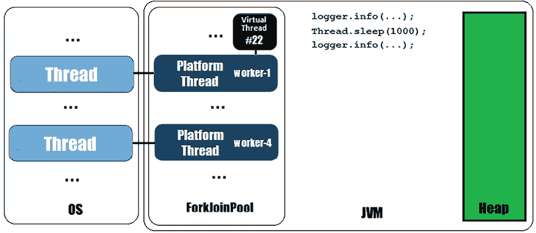
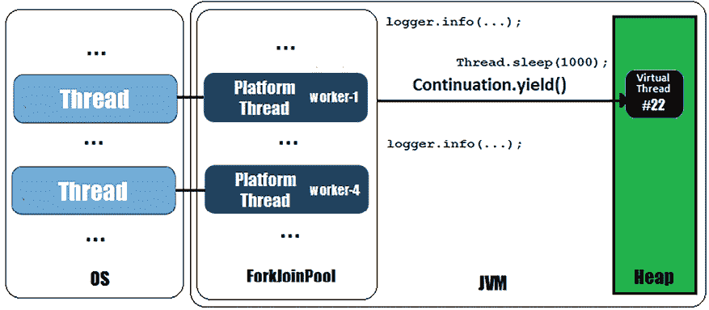
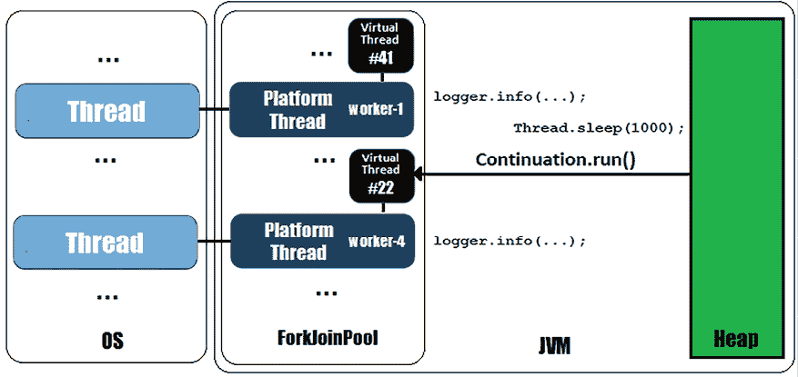
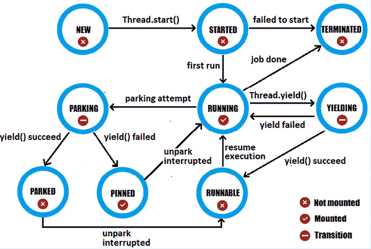
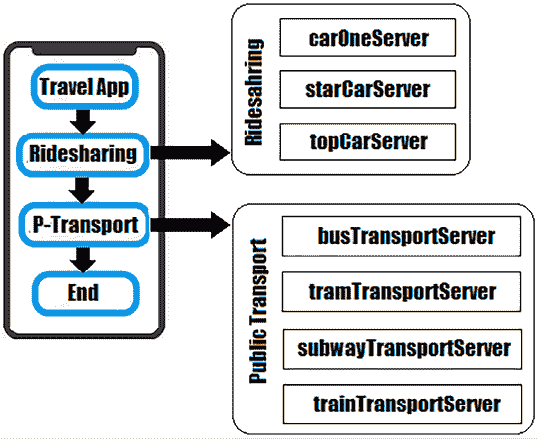
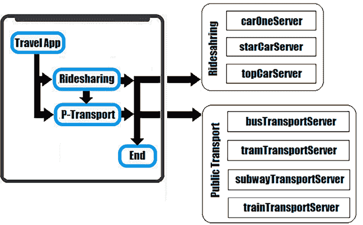
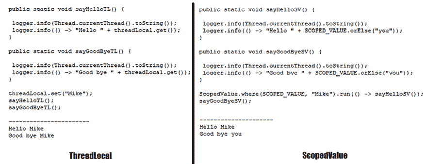
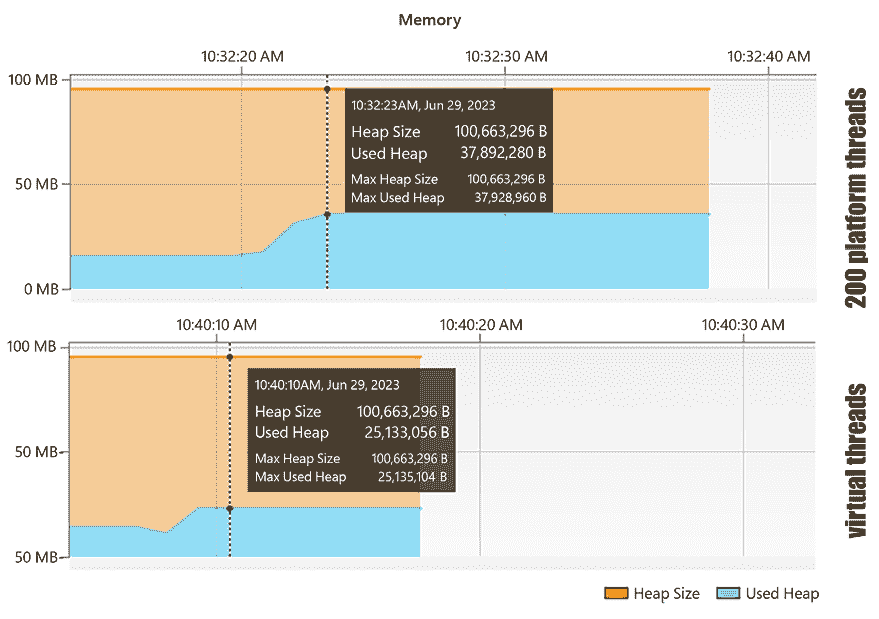
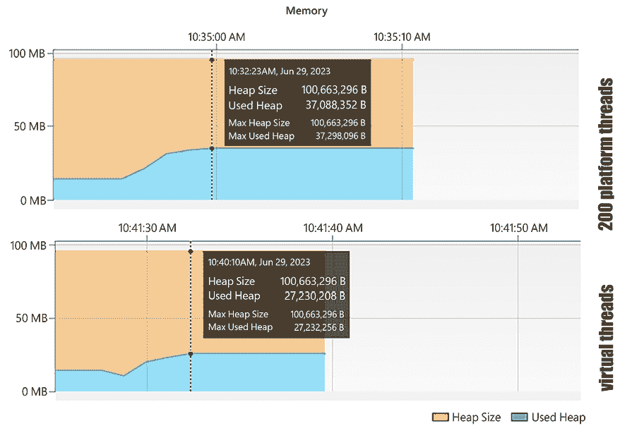

# 第十一章：并发 - 虚拟线程和结构化并发：深入探讨

本章包括 18 个问题，旨在深入探讨*虚拟线程*和*结构化并发*的工作方式以及它们应该如何在你的应用程序中使用。

如果你没有 Java 并发方面的背景，我强烈建议你推迟阅读本章，直到你阅读了一些关于这个主题的良好入门内容。例如，你可以尝试《Java 编码问题》第一版的第十章和第十一章。

我们从解释虚拟线程的内部工作方式开始本章。这将有助于你更好地理解后续关于扩展和组装`StructuredTaskScope`、挂钩`ThreadLocal`和虚拟线程、避免*固定*、解决*生产者-消费者*问题、实现 HTTP 网络服务器等问题。

到本章结束时，你将全面且清晰地了解如何使用*虚拟线程*和*结构化并发*。

# 问题

使用以下问题来测试你在 Java 虚拟线程和结构化并发方面的高级编程能力。我强烈鼓励你在查看解决方案和下载示例程序之前尝试每个问题：

1.  **处理延续（Tackling continuations）**：详细解释什么是*延续*以及它们在虚拟线程上下文中的工作方式。

1.  **追踪虚拟线程的状态和转换（Tracing virtual thread states and transitions）**：构建一个有意义的虚拟线程状态和转换图，并对其进行解释。

1.  **扩展 StructuredTaskScope**：解释并演示扩展`StructuredTaskScope`的步骤。解释为什么我们不能扩展`ShutdownOnSuccess`和`ShutdownOnFailure`。

1.  **组装 StructuredTaskScope**：编写一个 Java 应用程序，组装（嵌套）多个`StructuredTaskScope`实例。

1.  **使用超时修改 StructuredTaskScope**：修改在*问题 228*中开发的应用程序，为分叉的任务添加超时/截止日期。

1.  **挂钩 ThreadLocal 和虚拟线程**：演示`ThreadLocal`和虚拟线程的使用。

1.  **挂钩 ScopedValue 和虚拟线程**：提供一个全面的介绍，并带有`ScopedValue` API 的示例。

1.  **使用 ScopedValue 和执行器服务**：编写一段代码，强调在执行器服务上下文中使用`ScopedValue` API。

1.  **链式和重新绑定作用域值**：提供一些代码片段，展示作用域值如何进行链式和重新绑定。

1.  **使用 ScopedValue 和 StructuredTaskScope**：编写一个 Java 应用程序，突出`ScopedValue`和`StructuredTaskScope`的使用。在代码中解释每个`ScopedValue`是如何绑定和未绑定的。

1.  **使用 Semaphore 代替 Executor**：在虚拟线程的上下文中，解释使用`Semaphore`而不是执行器（例如，而不是`newFixedThreadPool()`）的好处，并举例说明。

1.  **通过锁定避免固定**：解释并举例说明我们如何通过重构`synchronized`代码通过`ReentrantLock`来避免固定的虚拟线程。

1.  **通过虚拟线程解决生产者-消费者问题**：编写一个程序，通过生产者-消费者模式模拟一个由多个工人（虚拟线程）组成的检查和包装灯泡的装配线。

1.  **通过虚拟线程解决生产者-消费者问题（通过信号量解决）**：将*问题 237*中开发的应用程序修改为使用`Semaphore`而不是执行器服务。

1.  **通过虚拟线程解决生产者-消费者问题（增加/减少消费者）**：编写一个程序，模拟一个检查和包装灯泡的装配线，根据需要使用工人（例如，调整包装工的数量（增加或减少）以适应检查器产生的输入流）。使用虚拟线程和`Semaphore`。

1.  **在虚拟线程之上实现 HTTP 网络服务器**：依靠 Java `HttpServer`编写一个简单的 HTTP 网络服务器实现，能够支持平台线程、虚拟线程和锁定（用于模拟数据库连接池）。

1.  **挂钩 CompletableFuture 和虚拟线程**：演示如何使用`CompletableFuture`和虚拟线程来解决异步任务。

1.  **通过 wait()和 notify()信号虚拟线程**：编写几个示例，使用`wait()`和`notify()`通过虚拟线程协调对资源（对象）的访问。演示良好的信号和错过信号的情景。

以下章节描述了前面问题的解决方案。请记住，通常没有解决特定问题的唯一正确方法。此外，请记住，这里所示的解释仅包括解决这些问题所需的最有趣和最重要的细节。下载示例解决方案以查看更多细节并实验程序，请访问[`github.com/PacktPublishing/Java-Coding-Problems-Second-Edition/tree/main/Chapter11`](https://github.com/PacktPublishing/Java-Coding-Problems-Second-Edition/tree/main/Chapter11)。

# 225. 处理连续

虚拟线程背后的概念被称为*分界连续**或简单地称为*连续**。这个概念在以下代码片段中被 JVM 内部使用：

```java
List<Thread> vtThreads = IntStream.range(0, 5)
  .mapToObj(i -> Thread.ofVirtual().unstarted(() -> {
    if (i == 0) { 
      logger.info(Thread.currentThread().toString()); 
    }
    try { Thread.sleep(1000); } 
      catch (InterruptedException ex) {}
   if (i == 0) { 
      logger.info(Thread.currentThread().toString()); 
   }
 })).toList();
 vtThreads.forEach(Thread::start);
 vtThreads.forEach(thread -> {
   try { thread.join(); } catch (InterruptedException ex) {}
 }); 
```

在此代码中，我们创建了五个虚拟线程并启动了它们，但我们只记录了一个线程的信息（线程#22 – 当然，ID 值可能在不同的执行中有所不同）。因此，输出将如下所示：

```java
VirtualThread[#22]/runnable@ForkJoinPool-1-worker-1 
VirtualThread[#22]/runnable@ForkJoinPool-1-worker-4 
```

线程#22 已经开始在*worker-1*上运行，但在阻塞操作（`sleep(1000)`）之后，它继续在*worker-4*上运行。在这所谓的*线程上下文切换*背后，我们有所谓的*连续**。

基本上，*延续*的行为可以通过一个流行的调试器用例轻松解释。当我们调试代码时，我们会设置一个断点并运行代码。当执行流程遇到这个断点时，执行会冻结，我们可以检查应用程序的当前状态。稍后，当我们完成检查后，我们可以从这个断点继续运行代码。调试器知道如何从暂停的地方（冻结状态）恢复执行。因此，执行会继续，直到遇到应用程序的末尾或遇到另一个断点。

简而言之，虚拟线程遵循相同的行为。虚拟线程被挂载在平台线程（*worker-x*）上并开始运行。当执行遇到一个阻塞操作（例如，一个`sleep()`调用）时，虚拟线程就会从其工作线程上卸载。稍后，在阻塞操作结束后，通过调度和将其挂载在平台线程（相同的 worker，*worker-x*，或另一个*worker-y*）上，线程执行得以恢复。

## 介绍延续

深入探讨，我们必须介绍*子程序*和*协程*。子程序是可以被调用并返回响应的函数，而协程是*协作子程序*，它们同时运行并像人类对话一样相互交谈。就像两个人交谈一样，协程通过两个相互交谈的子程序设置对话状态。通过这种范式，应用程序可以执行一些任务，然后一段时间什么也不做，稍后再执行更多任务。

但是，协程如何记住对话中涉及的数据呢？简短的答案是*延续*。延续是能够携带数据（对话状态）在协程之间传递的数据结构。它们可以从离开的地方恢复处理。

虚拟线程通过能够做一些工作，然后卸载，稍后再从离开的地方恢复，利用了延续。

Project Loom 提供了一个 API 来作为内部 API 处理延续，因此它不打算直接在应用程序中使用（除非我们的目标是编写一些更高层次的 API（库）），我们不应该尝试使用这个低级 API，除非我们的目标是编写一些更高层次的 API（库）。然而，这个 API 依赖于两个主要类和三个方法。作为类，我们有`ContinuationScope`，它是处理嵌套`Continuation`实例的作用域。作为方法，我们有：

+   `run()` – 从离开的地方运行延续

+   `yield()` – 在此点冻结（挂起）延续并交出控制权给延续的调用者（`run()`将能够从这里恢复执行）

+   `isDone()` – 测试当前延续是否完成

因此，在`ContinuationScope`的伞下，我们可以有多个嵌套的延续，通过`run()`、`yield()`和`isDone()`设置对话状态。对于虚拟线程，有一个名为`VTHREAD_SCOPE`的单个`ContinuationScope`。

```java
explains this statement:
```

```java
ContinuationScope cscope = new ContinuationScope("cscope");
Continuation continuation = new Continuation(cscope, () ->
    logger.info("Continuation is running ...");
});
continuation.run(); 
```

由于我们调用了`continuation.run()`，这段代码将输出：

```java
Continuation is running ... 
```

这非常直接。接下来，让我们通过 `yield()` 暂停延续：

```java
Continuation continuation = new Continuation(cscope, () ->
   logger.info("Continuation is running ...");
   **Continuation.yield(cscope);**
   logger.info("Continuation keeps running ...");
});
continuation.run(); 
```

目前，输出结果相同：

```java
Continuation is running ... 
```

实际上，当我们调用 `yield()` 方法时，延续被挂起，并将控制权交给调用者。我们可以通过在调用 `run()` 方法后添加一些日志来轻松地看到这一点，如下所示：

```java
continuation.run();
logger.info("The continuation was suspended ..."); 
```

现在，输出将变为：

```java
Continuation is running ...
The continuation was suspended ... 
```

如您所见，`logger.info("Continuation keeps running ...");` 这行代码没有执行。`yield()` 方法在这一点上冻结了执行并将控制权返回给调用者。为了从上次停止的地方恢复延续，我们必须再次调用 `run()`：

```java
continuation.run();
logger.info("The continuation was suspended ...");
continuation.run();
logger.info("The continuation is done ..."); 
```

这次，输出将如下（您可以通过 `isDone()` 检查延续是否完成）：

```java
Continuation is running ...
The continuation was suspended ...
Continuation keeps running ...
The continuation is done ... 
```

如您所见，当我们再次调用 `run()` 时，执行从上次停止的地方恢复，而不是从头开始。这就是延续的工作方式。

## 延续和虚拟线程

现在，让我们通过示例中的延续来了解虚拟线程和 `sleep()` 的工作方式。我们的虚拟线程 (#22) 通过记录一条简单消息开始其旅程。之后，它触发了 `Thread.sleep(1000);` 代码行，如下面的图所示：



图 11.1：虚拟线程 #22 在 *worker-1* 上运行

```java
sleep() method in the Thread class:
```

```java
// this is the JDK 21 code
public static void sleep(long millis) 
    throws InterruptedException {
  ...
  long nanos = MILLISECONDS.toNanos(millis);
  ...
  if (currentThread() instanceofVirtualThread vthread) {
    **vthread.sleepNanos(nanos);**
  }
...
} 
```

因此，如果调用 `sleep()` 的线程是虚拟线程，那么代码将简单地从 `VirtualThread` 类调用内部的 `sleepNanos()` 方法。我们感兴趣的代码如下：

```java
// this is the JDK 21 code
void sleepNanos(long nanos) throws InterruptedException {  
  ...
  if (nanos == 0) {
    **tryYield();**
  } else {
    // park for the sleep time
    try {
      ...
      **parkNanos(remainingNanos);**
      ...
    } finally {
      // may have been unparked while sleeping
      setParkPermit(true);
    }
  }
} 
```

因此，在这里，代码可以调用 `tryYield()` 方法（如果 `nanos` 为 0）或 `parkNanos()` 方法。如果调用 `tryYield()`，则线程状态设置为 `YIELDING`。另一方面，如果调用 `parkNanos()`，则线程状态设置为 `PARKING`。在这两种情况下（通过 `tryYield()` 或 `parkNanos()`），执行将遇到 `yieldContinuation()`，这是我们旅程的顶点：

```java
// this is the JDK 21 code 
private boolean yieldContinuation() {
  // unmount
  notifyJvmtiUnmount(/*hide*/true);
  unmount();
  try {
    **return** **Continuation.yield(VTHREAD_SCOPE);**
  } finally {
    // re-mount
    mount();
    notifyJvmtiMount(/*hide*/false);
  }
} 
```

如您所见，这里虚拟线程被卸载，并调用了 `yield()`。因此，虚拟线程栈被复制到堆中，线程从承载线程（变为 `PARKED`）卸载。我们可以通过以下图来查看这一点：



图 11.2：虚拟线程 #22 被卸载并移动到堆中

这种场景适用于任何阻塞操作，而不仅仅是`sleep()`。一旦虚拟线程 #22 被释放，*worker-1* 就可以准备为另一个虚拟线程提供服务或执行其他处理。

在阻塞操作完成（这里，`sleep(1000)`）后，`VirtualThread` 类的 `private` 方法 `runContinuation()` 被调用，并且 #22 的执行被恢复。如您在以下图中所见，#22 现在在 *worker-4* 上运行，因为 *worker-1* 不可用（它必须执行一些假设的虚拟线程，#41）。



图 11.3：虚拟线程 #22 在 *worker-4* 上恢复执行

执行继续到第二个日志指令并终止。这就是连续性和虚拟线程如何在内部维持大量吞吐量的工作方式。

# 226. 追踪虚拟线程的状态和转换

正如你所知，一个线程可以处于以下状态之一：`NEW`、`RUNNABLE`、`BLOCKED`、`WAITING`、`TIMED_WAITING`或`TERMINATED`。这些状态是`State`枚举的元素，并且可以通过`Thread.currentThread().getState()`调用公开。这些状态对平台线程和虚拟线程都有效，我们可以在我们的应用程序中使用它们。（如果你不熟悉这一点，你可以在*Java 编码问题*，第一版，第十章，问题 199 中找到更多详细信息。）

然而，从内部来说，虚拟线程是在状态转换模型上工作的，如下面的图所示：



图 11.4：虚拟线程状态转换

这些状态在`VirtualThread`类中以`private static final int`的形式声明。因此，它们不是公开的。然而，它们对于理解虚拟线程的生命周期至关重要，所以让我们简要地尝试追踪虚拟线程在其生命周期中的状态。

## NEW

当虚拟线程被创建（例如，通过`unstarted()`方法）时，它处于`NEW`状态。在这个状态下，线程尚未挂载，甚至尚未启动。然而，在那个时刻，JVM 调用这里列出的`VirtualThread`的构造函数：

```java
// this is the JDK 21 code
VirtualThread(Executor scheduler, String name, 
    int characteristics, Runnable task) {
  super(name, characteristics, /*bound*/ false);
  Objects.requireNonNull(task);
  // choose scheduler if not specified
  if (scheduler == null) {
    Thread parent = Thread.currentThread();
    if (parent instanceofVirtualThread vparent) {
      scheduler = vparent.scheduler;
    } else {
      scheduler = DEFAULT_SCHEDULER;
    }
  }
  **this****.scheduler = scheduler;**
  **this****.cont =** **new****VThreadContinuation****(****this****, task);**
  **this****.runContinuation =** **this****::runContinuation;**
} 
```

因此，这个构造函数负责选择调度器来创建一个`Continuation`（这是一个存储要作为`task`运行的`VThreadContinuation`对象）并准备`runContinuation private`字段，这是一个`Runnable`，用于在虚拟线程启动时运行`Continuation`。

## STARTED

当我们调用`start()`方法时，虚拟线程从`NEW`状态转换为`STARTED`：

```java
// this is the JDK 21 code 
@Override
void start(ThreadContainer container) {
**if** **(!compareAndSetState(NEW, STARTED)) {**
**throw****new****IllegalThreadStateException****(****"Already started"****);**
 **}**
  ...
  // start thread
  boolean started = false;
  ...
  try {
    ...
    // submit task to run thread
 **submitRunContinuation();**
    started = true;
  } finally {
    if (!started) {
      setState(TERMINATED);
      ...
    }
  }
} 
```

此外，在那个时刻，`runContinuation`可运行对象通过`submitRunContinuation()`在虚拟线程调度器上安排。

## 运行中

`runContinuation`可运行对象将虚拟线程的状态从`STARTED`移动到`RUNNING`并调用`cont.run()`。虚拟线程被挂载（可能是第一次挂载，或者只是后续挂载以从上次停止的地方恢复执行）在一个平台线程上并开始运行：

```java
// this is the JDK 21 code
private void runContinuation() {
  ...
  // set state to RUNNING
  int initialState = state();
**if** **(initialState == STARTED** 
 **&& compareAndSetState(STARTED, RUNNING)) {**
**// first run**
  } else if (initialState == RUNNABLE 
        && compareAndSetState(RUNNABLE, RUNNING)) {
    // consume parking permit
    setParkPermit(false);
  } else {
    // not runnable
    return;
  }
  // notify JVMTI before mount
  notifyJvmtiMount(/*hide*/true);
  try {
    **cont.run();**
  } finally {
    if (cont.isDone()) {
      afterTerminate();
    } else {
      afterYield();
    }
  }
} 
```

从这一点开始，虚拟线程的状态可以被移动到`TERMINATED`（执行完成）、`PARKING`（遇到阻塞操作）或`YIELDING`（调用`Thread.yield()`的效果）。

## PARKING

虚拟线程会一直运行，直到其任务完成或遇到阻塞操作。在这个时候，虚拟线程应该从平台线程（应该是挂起状态）卸载。为了完成这个任务，JVM 通过`park()`方法将虚拟线程的状态从`RUNNING`转换为`PARKING`。这是一个过渡状态，可以转换为`PARKED`（在堆上挂起）或`PINNED`（在其承载线程上挂起）。

## PARKED/PINNED

此外，`yieldContinuation()` 从 `park()` 被调用，虚拟线程卸载的结果通过 `Continuation.yield(VTHREAD_SCOPE)` 返回的标志来表示。换句话说，如果卸载操作成功，则虚拟线程的状态从 `PARKING` 移动到 `PARKED`（虚拟线程已成功停放在堆上）。否则，如果卸载操作失败，则调用 `parkOnCarrierThread()` 方法，并将虚拟线程的状态移动到 `PINNED`（虚拟线程已停放在承载线程上）。当一个 `PINNED` 虚拟线程可以恢复执行时，它会被移动到 `RUNNING` 状态（因为它已停放在其承载线程上）。另一方面，当一个 `PARKED` 虚拟线程被停泊（或中断）时，它会被移动到 `RUNNABLE` 状态。在这种情况下，虚拟线程（未挂载）被挂载，并从上次停止的地方继续执行，通过将状态从 `RUNNABLE` 移动到 `RUNNING`。

## YIELDING

当遇到 `Thread.yield()` 调用时，虚拟线程的状态从 `RUNNING` 移动到 `YIELDING`（例如，当我们调用 `Thread.yield()` 或 `Thread.sleep(0)` 时）。如果让步失败，则虚拟线程的状态会回到 `RUNNING`。否则，它会被移动到 `RUNNABLE`。

## RUNNABLE

当一个虚拟线程未挂载但想要恢复其执行时，它处于 `RUNNABLE` 状态。它从 `PARKED` 或 `YIELDING` 状态进入此状态。此时，虚拟线程的状态从 `RUNNABLE` 移动到 `RUNNING`，并从上次停止的地方继续执行（这发生在 `runContinuation()` 中）。

## TERMINATED

现在，闭环完成。虚拟线程完成其执行并进入 `TERMINATED` 状态。此外，无法启动的虚拟线程也会被移动到这个状态。

# 227. 扩展 StructuredTaskScope

我们不能扩展 `StructuredTaskScope.ShutdownOnSuccess`（*第十章，问题 221*）或 `ShutdownOnFailure`（*第十章，问题 222*），因为这些是 `final` 类。但是，我们可以扩展 `StructuredTaskScope` 并通过其 `handleComplete()` 方法提供自定义行为。

假设我们想要从我们当前的位置到我们镇上的一个特定目的地旅行：

```java
String loc = "124 NW Bobcat L, St. Robert"; // from user
String dest = "129 West 81st Street";       // from user 
```

在我们的手机上，我们有一个可以查询拼车服务和公共交通服务应用程序。拼车服务可以同时查询多个拼车服务器以找到最便宜的报价。另一方面，公共交通服务可以同时查询公共交通服务器以找到最早出发的报价，无论它是通过公共汽车、火车、电车还是地铁。在图中，我们可以将这些陈述表示如下：



图 11.5：查询拼车和公共交通服务

两个服务都是通过`StructuredTaskScope`实现的，但查询公共交通服务器的那个使用自定义的`StructuredTaskScope`，而查询拼车服务器的那个使用经典的`StructuredTaskScope`。

由于我们已经熟悉经典的`StructuredTaskScope`，让我们快速了解一下拼车服务。从这个服务收到的报价形状如下：

```java
public record RidesharingOffer(String company, Duration 
  minutesToYou, Duration minutesToDest, double price) {} 
```

我们代码的核心是开始为三个拼车服务器中的每一个分叉一个任务：

```java
public static RidesharingOffer
    fetchRidesharingOffers(String loc, String dest) 
        throws InterruptedException {
  try (StructuredTaskScope scope 
    = new StructuredTaskScope<RidesharingOffer>()) {
    Subtask<RidesharingOffer> carOneOffer
     = scope.fork(() -> Ridesharing.carOneServer(loc, dest));
    Subtask<RidesharingOffer> starCarOffer
     = scope.fork(() -> Ridesharing.starCarServer(loc, dest));
    Subtask<RidesharingOffer> topCarOffer
     = scope.fork(() -> Ridesharing.topCarServer(loc, dest));
    scope.join();
    ... 
```

在`scope.join()`完成后，我们知道所有子任务都已成功完成或异常完成。我们过滤结果以提取最便宜的报价。如果没有报价可用，那么我们将收集所有异常并将它们封装在一个自定义的`RidesharingException`中。将此作为代码片段的函数式编程可以这样做：

```java
 RidesharingOffer offer
     = Stream.of(carOneOffer, starCarOffer, topCarOffer)
     .filter(s -> s.state() == Subtask.State.SUCCESS)
     .<RidesharingOffer>mapMulti((s, c) -> {
        c.accept((RidesharingOffer) s.get());
     })
     .min(Comparator.comparingDouble(RidesharingOffer::price))
     .orElseThrow(() -> {
       RidesharingException exceptionWrapper
        = new RidesharingException("Ridesharing exception");
       Stream.of(carOneOffer, starCarOffer, topCarOffer)
             .filter(s -> s.state() == Subtask.State.FAILED)
             .<Throwable>mapMulti((s, c) -> {
                c.accept(s.exception());
             }).forEach(exceptionWrapper::addSuppressed);
      throw exceptionWrapper;
      });  
     ... 
```

最后，我们返回报价：

```java
 return offer;
} 
```

可能的输出如下：

```java
RidesharingOffer[company=TopCar, minutesToYou=PT9M, minutesToDest=PT16M, price=7.62] 
```

接下来，让我们专注于公共交通服务。该服务通过自定义的`StructuredTaskScope`查询公共交通服务器。一个公共交通报价被封装在以下记录中：

```java
public record PublicTransportOffer(String transport, 
  String station, LocalTime goTime) {} 
```

自定义的`StructuredTaskScope`命名为`PublicTransportScope`，其目标是分析每个子任务（`Subtask`）并获取最佳报价。扩展`StructuredTaskScope`很简单：

```java
public class PublicTransportScope
    extends StructuredTaskScope<List<PublicTransportOffer>> {
  ... 
```

公共交通服务器返回一个`List<PublicTransportOffer>`。例如，一天中可能有三趟火车或五辆公交车覆盖我们的路线。我们将它们全部放在一个单独的列表中。

当我们扩展`StructuredTaskScope`时，我们必须重写一个名为`handleComplete()`的方法。这个方法会自动为每个成功完成或异常完成的`Subtask`调用。我们的任务是收集和存储结果以供后续分析。为了收集结果，我们需要一个用于有效结果的集合和一个用于异常结果的集合。这些应该是线程安全的集合，因为多个`Subtask`实例可能几乎同时完成，这会导致竞争条件。例如，我们可以使用`CopyOnWriteArrayList`：

```java
 private final List<List<PublicTransportOffer>> results 
    = new CopyOnWriteArrayList<>();
  private final List<Throwable> exceptions 
    = new CopyOnWriteArrayList<>();
  ... 
```

接下来，我们重写`handleComplete()`，并根据`Subtask`的状态相应地收集结果：

```java
@Override
protected void handleComplete(
    Subtask<? extends List<PublicTransportOffer>> subtask) {
    switch (subtask.state()) {
      case SUCCESS ->
        results.add(subtask.get());
      case FAILED ->
        exceptions.add(subtask.exception());
      case UNAVAILABLE ->
        throw new IllegalStateException(
          "Subtask may still running ...");
    }
  }
  ... 
```

当我们到达这个点时，我们已经收集了所有成功和异常的结果。现在是时候分析这些数据并推荐最佳报价了。我们认为最佳报价是不论是通过公交车、火车、电车还是地铁，都能最早出发的报价。所以，我们只需要找到最佳的`goTime`：

```java
 public PublicTransportOffer recommendedPublicTransport() {
    super.ensureOwnerAndJoined();
    return results.stream()
      .flatMap(t -> t.stream())
      .min(Comparator.comparing(PublicTransportOffer::goTime))
      .orElseThrow(this::wrappingExceptions);
  }
  ... 
```

如果我们找不到任何有效的报价，那么我们将收集异常并将它们封装在一个自定义的`PublicTransportException`中，如下面的辅助函数所示：

```java
 private PublicTransportException wrappingExceptions() {
    super.ensureOwnerAndJoined();
    PublicTransportException exceptionWrapper = new 
      PublicTransportException("Public transport exception");
    exceptions.forEach(exceptionWrapper::addSuppressed);
    return exceptionWrapper;
  }
} 
```

注意，这两个方法都在调用`ensureOwnerAndJoined()`方法。这个内置方法保证当前线程是该任务范围的拥有者（否则，它抛出`WrongThreadException`），并且在通过`join()`/`joinUntil()`分叉子任务后已经加入（否则，它抛出`IllegalStateException`）。

**重要提示**

按照惯例，对于需要由主任务调用的每个`StructuredTaskScope`，依赖`ensureOwnerAndJoined()`检查是一个好的实践。

完成！我们的自定义`StructuredTaskScope`已经准备好了。接下来，我们可以通过分叉任务并调用`recommendedPublicTransport()`方法来使用它：

```java
public static PublicTransportOffer
    fetchPublicTransportOffers(String loc, String dest) 
        throws InterruptedException {
  try (PublicTransportScope scope 
                = new PublicTransportScope()) {
    scope.fork(() -> PublicTransport
      .busTransportServer(loc, dest));
    scope.fork(() -> PublicTransport
      .subwayTransportServer(loc, dest));
    scope.fork(() -> PublicTransport
      .trainTransportServer(loc, dest));
    scope.fork(() -> PublicTransport
      .tramTransportServer(loc, dest));
    scope.join();
    PublicTransportOffer offer
      = scope.recommendedPublicTransport();
    logger.info(offer.toString());
    return offer;
  }
} 
```

可能的输出如下所示：

```java
PublicTransportOffer[transport=Tram, station=Tram_station_0, goTime=10:26:39] 
```

最后，我们可以如下调用这两个服务（共享出行和公共交通）：

```java
RidesharingOffer roffer
  = fetchRidesharingOffers(loc, dest);
PublicTransportOffer ptoffer
  = fetchPublicTransportOffers(loc, dest); 
```

到目前为止，这两个服务是顺序运行的。在下一个问题中，我们将通过引入另一个自定义的`StructuredTaskScope`来同时运行这两个服务。在此之前，你可以挑战自己为共享出行服务也编写一个自定义的`StructuredTaskScope`。

# 228. 组装 StructuredTaskScope

在上一个问题（*问题 227*）中，我们开发了一个包含共享出行服务和公共交通服务的应用程序。在这两个服务中，我们使用了`StructuredTaskScope`来并发查询适当的服务器。然而，尽管这两个服务是顺序执行的，但服务器是并发调用的——首先运行共享出行服务（通过并发查询三个服务器），然后从这个服务得到结果后，再运行公共交通服务（通过并发查询四个服务器）。

进一步，我们希望将这些两个服务组装成一个第三服务，使其能够同时运行，如下面的图所示：



图 11.6：同时运行共享出行和公共交通服务

我们首先将`RidesharingOffer`和`PublicTransportOffer`组装成一个名为`TravelOffer`的记录：

```java
public record TravelOffer(RidesharingOffer ridesharingOffer, 
  PublicTransportOffer publicTransportOffer) {} 
```

接下来，我们编写一个自定义的`StructuredTaskScope`，它分叉了在*问题 227*中创建的两个`Callable`对象。一个`Callable`代表共享出行服务（已在*问题 227*中通过经典的`StructuredTaskScope`实现），第二个`Callable`代表公共交通服务（已在*问题 227*中通过自定义的`PublicTransportScope`实现）。我们可以将这个`StructuredTaskScope`命名为`TravelScope`：

```java
public class TravelScope extends StructuredTaskScope<Travel> {
  ... 
```

`StructuredTaskScope`是参数化的——注意`StructuredTaskScope<Travel>`。由于我们必须分叉不同类型的`Callable`实例，依赖`Object`并编写`StructuredTaskScope<Object>`会很有用。但这样不会非常清晰和整洁。我们最好定义一个接口来缩小`Object`域，并由我们的`Callable`实例的结果实现，如下所示（*密封接口*在*第八章*中详细讨论过）：

```java
public sealed interface Travel 
  permits RidesharingOffer, PublicTransportOffer {}
public record RidesharingOffer(String company, 
  Duration minutesToYou, Duration minutesToDest, double price) 
    implements Travel {}
public record PublicTransportOffer(String transport, 
  String station, LocalTime goTime) implements Travel {} 
```

回到`TravelScope`，我们必须重写`handleComplete()`方法来处理每个完成的`Subtask`。我们知道共享出行服务可以返回一个有效的结果作为`RidesharingOffer`，或者一个异常的结果作为`RidesharingException`。此外，公共交通服务可以返回一个有效的结果作为`PublicTransportOffer`，或者一个异常的结果作为`PublicTransportException`。我们必须存储这些结果，以便在创建`TravelOffer`答案时稍后分析它们。因此，我们定义以下变量来覆盖所有可能的案例：

```java
 private volatile RidesharingOffer ridesharingOffer;
  private volatile PublicTransportOffer publicTransportOffer;
  private volatile RidesharingException ridesharingException;
  private volatile PublicTransportException
    publicTransportException;
  ... 
```

接下来，我们重写`handleComplete()`方法，正如在`PublicTransportScope`的情况中，我们依赖于一个简单的`switch`来收集结果（对于`SUCCESS`和`FAILED`状态，我们需要一个嵌套的`switch`来区分从共享出行服务收到的报价/异常和从公共交通服务收到的报价/异常）：

```java
 @Override
  protected void handleComplete(
      Subtask<? extends Travel> subtask) {
    switch (subtask.state()) {
      case SUCCESS -> {
        switch (subtask.get()) {
          case RidesharingOffer ro ->
            this.ridesharingOffer = ro;
            case PublicTransportOffer pto ->
            this.publicTransportOffer = pto;
        }
      }
      case FAILED -> {
        switch (subtask.exception()) {
          case RidesharingException re ->
            this.ridesharingException = re;
          case PublicTransportException pte ->
            this.publicTransportException = pte;
          case Throwable t ->
            throw new RuntimeException(t);
        }
      }
      case UNAVAILABLE ->
        throw new IllegalStateException(
          "Subtask may still running ...");
    }
  }
  ... 
```

最后，我们分析这些结果并创建适当的`TravelOffer`。实现这一目标的一种方法如下（请随意思考更酷/更聪明的实现方式）：

```java
 public TravelOffer recommendedTravelOffer() {
    super.ensureOwnerAndJoined();
    return new TravelOffer(
      ridesharingOffer, publicTransportOffer);
  }
} 
```

我们的`TravelScope`已经准备好使用。我们所需做的只是将我们的两个服务并行执行，并调用`recommendedTravelOffer()`方法以获取最佳报价：

```java
public static TravelOffer fetchTravelOffers(
    String loc, String dest)
        throws InterruptedException {
  try (TravelScope scope = new TravelScope()) {
    scope.fork(() -> fetchRidesharingOffers(loc, dest));
    scope.fork(() -> fetchPublicTransportOffers(loc, dest));
    scope.join();
    return scope.recommendedTravelOffer();
  }
} 
```

现在，我们不再依次调用`fetchRidesharingOffers()`和`fetchPublicTransportOffers()`，而是简单地调用`fetchTravelOffers()`：

```java
TravelOffer toffer = fetchTravelOffers(loc, dest); 
```

可能的输出如下：

```java
TravelOffer[
  ridesharingOffer=RidesharingOffer[company=CarOne, 
  minutesToYou=PT5M, minutesToDest=PT5M, price=3.0], 
  publicTransportOffer=PublicTransportOffer[transport=Train, 
  station=Train_station_0, goTime=11:59:10]
] 
```

任务完成！现在你了解了如何编写自定义的`StructuredTaskScope`实例，以及如何组装/嵌套它们来构建复杂的并发模型。

# 229. 组装带超时的 StructuredTaskScope 实例

让我们继续从*问题 228*开始，假设共享出行服务应该实现超时/截止日期。换句话说，如果任何一个共享出行服务器在 10 毫秒内没有回答，那么我们终止请求并通过一个有意义的消息向用户报告抛出的`TimeoutException`。

这意味着我们应该使用`joinUntil(Instant deadline)`而不是`scope.join()`，后者会无限期等待，它只等待给定的`deadline`，在抛出`TimeoutException`之前。因此，`fetchRidesharingOffers()`方法应该修改如下：

```java
public static RidesharingOffer fetchRidesharingOffers(
    String loc, String dest) 
      throws InterruptedException, TimeoutException {
  try (StructuredTaskScope scope 
    = new StructuredTaskScope<RidesharingOffer>()) {
    ...
    scope.joinUntil(Instant.now().plusMillis(10));
    ...
  }
} 
```

通过在任何一个共享出行服务器中简单地模拟大于 10 毫秒的延迟，我们帮助`joinUntil()`失败并抛出`TimeoutException`：

```java
public final class Ridesharing { 
  public static RidesharingOffer carOneServer(
    String loc, String dest) throws InterruptedException {
    ...
    Thread.sleep(100); // simulating a delay
    ...
  }
  ...
} 
```

为了捕获这个`TimeoutException`并将其替换为对最终用户友好的消息，我们必须调整`TravelScope`类。首先，我们定义一个变量来存储潜在的`TimeoutException`。其次，我们调整`case FAILED`来相应地填充这个变量：

```java
public class TravelScope extends StructuredTaskScope<Travel> {
  ...
  private volatile TimeoutException timeoutException;
  @Override
  protected void handleComplete(Subtask<? extends Travel> subtask) {
    switch (subtask.state()) {
      ...
      case FAILED -> {
        switch (subtask.exception()) {
          ...
          case TimeoutException te ->
               this.timeoutException = te;
          ...
        }
      }
      ...
    }
  }
  ... // the recommendedTravelOffer() method from below
} 
```

第三，我们修改`recommendedTravelOffer()`方法，如果`timeoutException`不为`null`，则返回一个友好的消息：

```java
public TravelOffer recommendedTravelOffer() {
  super.ensureOwnerAndJoined();
  if (timeoutException != null) {
    logger.warning("Some of the called services 
                    did not respond in time");
  }
  return new TravelOffer(
    ridesharingOffer, publicTransportOffer);
} 
```

如果共享出行服务超时，而公共交通服务提供了一个报价，那么输出应该是这样的：

```java
[14:53:34] [WARNING] Some of the called services
                     did not respond in time
[14:53:35] [INFO] TravelOffer[ridesharingOffer=null, publicTransportOffer=PublicTransportOffer[transport=Bus, station=Bus_station_2, goTime=15:02:34]] 
```

完成！查看捆绑的代码以练习此示例。挑战自己为公共交通服务添加超时/截止日期。

# 230. 钩子 ThreadLocal 和虚拟线程

简而言之，`ThreadLocal`是在 JDK 1.2（1998 年）中引入的，作为一种为每个线程提供专用内存的解决方案，以便与不受信任的代码（可能是一些外部编写的第三方组件）或应用程序的不同组件（可能在多个线程中运行）之间共享信息。基本上，如果你处于这种场景，那么你不想（或不能）通过方法参数来共享信息。如果你需要更深入地了解`ThreadLocal` API，请考虑《Java 编码问题》*第一版*，第十一章，问题 220。

线程局部变量是`ThreadLocal`类型，依赖于`set()`来设置值和`get()`来获取值。在《Java 编码问题》*第一版*中提到：“*如果线程* `A` *存储了* `x` *值，而线程* `B` *在同一个* `ThreadLocal` *实例中存储了* `y` *值，那么稍后，线程* `A` *检索到* `x` *值，线程* `B` *检索到* `y` *值。因此，我们可以这样说，*x* *值是线程* `A` *的局部值，而*y* *值是线程* `B` *的局部值。”* 调用`get()`或`set()`的每个线程都有自己的`ThreadLocal`变量副本。

**重要提示**

内部，`ThreadLocal`管理一个映射（`ThreadLocalMap`）。映射的键是线程，值是通过`set()`方法给出的值。`ThreadLocal`变量非常适合实现*每个请求一个线程*模型（例如，每个 HTTP 请求一个线程），因为它们允许我们轻松管理请求的生命周期。

通常，线程局部变量是全局和静态的，它可以如下声明和初始化：

```java
private static final ThreadLocal<StringBuilder> threadLocal
  = ThreadLocal.<StringBuilder>withInitial(() -> {
     return new StringBuilder("Nothing here ...");
}); 
```

线程局部变量应该可以从需要它的代码中访问到（有时是从代码的任何地方）。基本上，当前线程以及由该线程派生的所有线程都应该能够访问线程局部变量。在我们的情况下，它可以从当前类的任何地方访问。接下来，让我们考虑以下`Runnable`：

```java
Runnable task = () -> { 
  threadLocal.set(
    new StringBuilder(Thread.currentThread().toString()));
  logger.info(() -> " before sleep -> " 
    + Thread.currentThread().toString()
       + " [" + threadLocal.get() + "]");
  try {
    Thread.sleep(Duration.ofSeconds(new Random().nextInt(5)));
  } catch (InterruptedException ex) {} 
  logger.info(() -> " after sleep -> " 
    + Thread.currentThread().toString()
        + " [" + threadLocal.get() + "]");
  threadLocal.remove();
}; 
```

在这里，我们设置了一个表示当前线程信息的线程局部值，我们获取并记录该值，然后随机睡眠几秒钟（0 到 5 秒之间），然后再次记录该值。

接下来，让我们通过经典固定线程池（平台线程）执行 10 个任务：

```java
try (ExecutorService executor 
      = Executors.newFixedThreadPool(10)) {
  for (int i = 0; i < 10; i++) {
    executor.submit(task);
  }
} 
 look as follows:
```

```java
[16:14:05] before sleep -> Thread[#24,pool-1-thread-3,5,main] [Thread[#24,pool-1-thread-3,5,main]] 
[16:14:05] before sleep -> Thread[#31,pool-1-thread-10,5,main] [Thread[#31,pool-1-thread-10,5,main]] 
[16:14:05] before sleep -> Thread[#22,pool-1-thread-1,5,main] [Thread[#22,pool-1-thread-1,5,main]]
...
[16:14:06] after sleep -> Thread[#24,pool-1-thread-3,5,main] [Thread[#24,pool-1-thread-3,5,main]] 
[16:14:07] after sleep -> Thread[#31,pool-1-thread-10,5,main] [Thread[#31,pool-1-thread-10,5,main]] 
[16:14:09] after sleep -> Thread[#22,pool-1-thread-1,5,main] [Thread[#22,pool-1-thread-1,5,main]]
... 
```

我们可以很容易地看到线程#24、#31 和#22 各自设置了关于它们自己的信息，并且这些信息在睡眠后可用。例如，线程#22 设置了值`[Thread[#22,pool-1-thread-1,5,main]]`，而这个值正是它在睡眠 4 秒后得到的结果。

现在，让我们切换到虚拟线程：

```java
try (ExecutorService executor 
    = Executors.newVirtualThreadPerTaskExecutor()) {
  for (int i = 0; i < 10; i++) {
    executor.submit(task);
  }
} 
```

输出将如下：

```java
[16:24:24] before sleep ->VirtualThread[#25]/runnable@ForkJoinPool-1-worker-3 [VirtualThread[#25]/runnable@ForkJoinPool-1-worker-3] 
[16:24:24] before sleep ->VirtualThread[#27]/runnable@ForkJoinPool-1-worker-5 [VirtualThread[#27]/runnable@ForkJoinPool-1-worker-5] 
[16:24:24] before sleep ->VirtualThread[#28]/runnable@ForkJoinPool-1-worker-6 [VirtualThread[#28]/runnable@ForkJoinPool-1-worker-6]
...
[16:24:24] after sleep ->VirtualThread[#28]/runnable@ForkJoinPool-1-worker-3 [VirtualThread[#28]/runnable@ForkJoinPool-1-worker-6]
[16:24:27] after sleep ->VirtualThread[#25]/runnable@ForkJoinPool-1-worker-4 [VirtualThread[#25]/runnable@ForkJoinPool-1-worker-3] 
[16:24:27] after sleep ->VirtualThread[#27]/runnable@ForkJoinPool-1-worker-8 [VirtualThread[#27]/runnable@ForkJoinPool-1-worker-5]
... 
```

我们可以很容易地看到，线程 #25、#27 和 #28 每个都设置了关于它们自己的信息，并且这个信息在睡眠期之后是可用的。例如，线程 #25 设置了值 `[VirtualThread[#25]/runnable@ForkJoinPool-1-worker-3]`，这正是它在睡眠 3 秒后获取的值。

然而，当我们获取这个信息时，线程 #25 在 *worker-4* 上执行，而不是在 *worker-3* 上，正如信息所揭示的那样。实际上，当信息被设置时，线程 #25 在 *worker-3* 上执行，而当信息（保持不变）被获取时，它在 *worker-4* 上执行。

这是完全正常的，因为当执行遇到 `Thread.sleep()` 阻塞操作时，线程从 *worker-3* 上卸载。睡眠后，它被安装到 *worker-4* 上。然而，信息没有被更改，所以虚拟线程和 `ThreadLocal` 正如预期的那样一起工作。换句话说，虚拟线程的安装-卸载周期不会影响 `ThreadLocal` 的工作方式。虚拟线程完全支持 `ThreadLocal` 变量。

# 231. 将 ScopedValue 和虚拟线程挂钩

`ScopedValue` API 被添加来处理 `ThreadLocal` 的不足之处。但 `ThreadLocal` 的不足之处是什么？

## 线程局部变量的不足之处

首先，很难说和追踪谁在修改线程局部变量。这是 API 设计的不足之处。基本上，`ThreadLocal` 变量在全局范围内可用（在应用级别或更低级别），因此很难说它从哪里被修改。想象一下，你有责任阅读、理解和调试一个使用多个线程局部变量的应用程序。你将如何管理代码逻辑，你将如何知道在任何给定时间，这些线程局部变量存储了什么值？从类到类跟踪这些变量并将它们修改的信号将会是一场噩梦。

其次，线程局部变量可能永远存在，或者比它们应该存在的时间更长。这是如何可能的？线程局部变量将一直存在，直到使用它们的平台线程存在，甚至更长。确实，我们可以通过显式调用 `remove()` 来从内部映射中删除线程局部变量。但是，如果我们忘记调用 `remove()`，那么我们就打开了内存泄漏的大门（我们只是希望垃圾收集器在某个时候收集这些数据）。永远不要忘记在完成使用平台线程的线程局部变量后调用 `remove()`！另一方面，如果你在使用虚拟线程的线程局部变量，那么就没有必要调用 `remove()`，因为一旦虚拟线程死亡，线程局部变量就会被删除。

第三，线程局部变量容易重复。当我们从当前线程（父线程）创建一个新的线程（子线程）时，子线程会复制父线程的所有线程局部变量。因此，如果我们从具有大量线程局部变量的当前线程中产生多个线程，那么我们将复制大量这些变量。这对于平台线程和虚拟线程都是如此。由于线程局部变量不是不可变的，我们无法简单地在线程之间共享引用。我们必须复制它们。当然，这对应用程序来说可能不是好事，因为它将负面地影响这些变量的内存占用（想象一下有百万个虚拟线程都有线程局部变量的副本）。

## 介绍范围值

从 JDK 20（JEP 429）开始，我们有一个名为“范围值”的线程局部变量的替代方案。这是为了与虚拟线程一起工作，并克服线程局部变量的不足。在 JDK 20 中，这个特性处于孵化阶段，在 JDK 21（JEP 446）中处于预览阶段，所以不要忘记使用`–code-preview` VM 选项运行代码。

范围值允许我们在应用程序的组件之间共享不可变信息（无需复制），并且具有有限的生存期（没有内存泄漏的风险）。

正如您将看到的，`ScopedValue` API 非常整洁且易于使用。要创建一个`ScopedValue`，我们只需调用一个名为`newInstance()`的工厂方法，如下所示：

```java
ScopedValue<String> SCOPED_VALUE = ScopedValue.newInstance(); 
```

在这里，我们创建了一个`ScopedValue`（未绑定），它能够携带类型为`String`的值（当然，它可以是任何其他类型）。您可以根据它应该从哪些位置访问来本地声明、全局声明或按需声明。然而，映射到`ScopedValue`的值仅对当前线程及其由当前线程产生的所有线程（到目前为止，这类似于`ThreadLocal`）可用，但它仅限于方法调用。我们将在稍后澄清这一点。

**重要提示**

如果一个值映射到`ScopedValue`，则认为`ScopedValue`已绑定。否则，认为`ScopedValue`未绑定。我们可以通过`isBound()`标志方法检查`ScopedValue`是否已绑定。这是一个重要的检查，因为如果我们尝试获取未绑定的`ScopedValue`的值，那么我们将得到`NoSuchElementException`。除了`isBound()`之外，我们还有`orElse()`和`orElseThrow()`。使用`orElse()`，我们可以为未绑定的`ScopedValue`设置一个默认值，而通过`orElseThrow()`，我们可以抛出一个默认异常。

一个值可以通过`where()`方法映射到一个`ScopedValue`（因此，`ScopedValue`与一个值绑定）。这个方法的语法如下：

```java
public static <T> Carrier where(ScopedValue<T> key, T value) 
```

或者，通过`runWhere()`和`callWhere()`方法：

```java
public static <T> void runWhere(
  ScopedValue<T> key, T value, Runnable op)
public static <T,R> R callWhere(
  ScopedValue<T> key, T value, Callable<? extends R> op) 
    throws Exception 
```

这三个方法有共同点，即`key`和`value`参数。`key`代表`ScopedValue`的键（例如，`SCOPED_VALUE`），而`value`是映射到这个键的值。而`where()`方法只是创建一个绑定到值的`ScopedValue`，而`runWhere()`方法可以创建一个绑定到值的`ScopedValue`并在当前线程中调用`Runnable`操作（`op`），而`callWhere()`在当前线程中调用`Callable`操作（`op`）。如果您只想依赖`where()`方法，那么只需依赖以下语法：

```java
ScopedValue.where(key, value).run(op);  // like runWhere()
ScopedValue.where(key, value).call(op); // like callWhere() 
```

因此，链式调用`where().run()`相当于`runWhere()`，而`where().call()`相当于`callWhere()`。使用带有`run()`/`call()`后缀的`where()`的优点在于我们可以编写`ScopedValue.where(key1, value1).where(key2, value2),` …`.run()/call()`来获取多个绑定到其值的`ScopedValue`实例。

**重要提示**

`ScopedValue`没有`set()`方法。一旦我们将值映射到`ScopedValue`，我们就不能更改它（它是不可变的）。这意味着 JVM 不需要在值之间复制（记住，这是一个特定于`ThreadLocal`的缺点）。

值仅在该方法（`Runnable`或`Callable`）调用期间映射到该键。例如，让我们假设以下`Runnable`：

```java
Runnable taskr = () -> {
  logger.info(Thread.currentThread().toString());
  logger.info(() -> SCOPED_VALUE.isBound() ? 
    SCOPED_VALUE.get() : "Not bound");
}; 
```

通过`isBound()`方法，我们可以检查一个`ScopedValue`是否已绑定（如果它有一个值）。如果存在值，那么我们可以通过`get()`方法成功访问它。对一个未绑定的`ScopedValue`调用`get()`将导致`NoSuchElementException`异常。例如，如果我们现在运行这个任务：

```java
taskr.run(); 
```

然后，输出将是：

```java
Thread[#1,main,5,main] 
Not bound 
```

这是正常的，因为我们没有将任何值映射到`SCOPED_VALUE`。

接下来，我们可以使用`where()`方法将一个值映射到`SCOPED_VALUE`并与之前的`Runnable`共享这个值：

```java
Carrier cr = ScopedValue.where(SCOPED_VALUE, "Kaboooom!");
cr.run(taskr); 
```

`Carrier`对象是一个不可变且线程安全的键值映射累加器，可以与`Runnable`/`Callable`共享。通过调用`cr.run(taskr)`，我们将值`Kaboooom!`与`Runnable`共享，因此输出将是：

```java
Thread[#1,main,5,main] 
Kaboooom! 
```

但我们可以将这个例子写得更紧凑一些，如下所示：

```java
ScopedValue.where(SCOPED_VALUE, "Kaboooom!").run(taskr); 
```

或者，使用`runWhere()`：

```java
ScopedValue.runWhere(SCOPED_VALUE, "Kaboooom!", taskr); 
```

调用`taskr.run()`将再次输出`Not bound`。这是因为在方法调用期间`ScopedValue`才被绑定。*图 11.7*通过一个更具有表达性的例子突出了这一点。



图 11.7：ThreadLocal 与 ScopedValue

如此图（左侧所示）所示，一旦线程局部变量设置了值`Mike`，这个值在`sayHelloTL()`和`sayGoodByeTL()`中都是可用的。这个值绑定到这个线程上。另一方面（右侧），值`Mike`被映射到一个`ScopedValue`，但这个值只在`sayHelloSV()`中可用。这是因为我们只将`SCOPED_VALUE`绑定到`sayHelloSV()`方法调用。当执行离开`sayHelloSV()`时，`SCOPED_VALUE`未绑定，值`Mike`不再可用。如果从`sayHelloSV()`调用`sayGoodByeSV()`，那么值`Mike`将是可用的。或者，如果我们如下调用`sayGoodByeSV()`，那么值`Mike`也是可用的：

```java
ScopedValue.where(SCOPED_VALUE, "Mike").run(
  () -> sayGoodByeSV()); 
```

`ScopedValue`也与`Callable`一起工作，但我们必须将`run()`替换为`call()`。例如，让我们假设以下相当简单的`Callable`：

```java
Callable<Boolean> taskc = () -> {
  logger.info(Thread.currentThread().toString());
  logger.info(() -> SCOPED_VALUE.isBound() ? 
    SCOPED_VALUE.get() : "Not bound");
  return true;
}; 
```

以及以下调用序列：

```java
taskc.call();
ScopedValue.where(SCOPED_VALUE, "Kaboooom-1!").call(taskc);
ScopedValue.callWhere(SCOPED_VALUE, "Kaboooom-2!", taskc);
Carrier cc = ScopedValue.where(SCOPED_VALUE, "Kaboooom-3!");
cc.call(taskc);
taskc.call(); 
```

你能直观地推断出输出结果吗？应该是`未绑定`，`Kaboooom-1!`，`Kaboooom-2!`，`Kaboooom-3!`，然后再一次`未绑定`：

```java
Thread[#1,main,5,main] 
Not bound 
Thread[#1,main,5,main] 
Kaboooom-1! 
Thread[#1,main,5,main] 
Kaboooom-2! 
Thread[#1,main,5,main] 
Kaboooom-3! 
Thread[#1,main,5,main] 
Not bound 
```

因此，让我再次强调这一点。`ScopedValue`在方法调用生命周期内绑定（它有一个值）。`isBound()`将在该方法外部返回`false`。

**重要提示**

如此例所示，一个`ScopedValue`在同一个线程中可以有不同的值。在这里，同一个`Callable`在同一线程中执行了五次。

从某个线程（除了主线程）设置`ScopedValue`可以非常容易地完成。例如，我们可以如下从平台线程设置`ScopedValue`：

```java
Thread tpr = new Thread(() ->
  ScopedValue.where(SCOPED_VALUE, "Kaboooom-r!").run(taskr));
Thread tpc = new Thread(() -> {
 try {
  ScopedValue.where(SCOPED_VALUE, "Kaboooom-c!").call(taskc);
 } catch (Exception ex) { /* handle exception */ }
}); 
```

或者，通过`ofPlatform()`方法如下：

```java
Thread tpr = Thread.ofPlatform().unstarted(
 () -> ScopedValue.where(SCOPED_VALUE, "Kaboooom-r!")
  .run(taskr));
Thread tpc = Thread.ofPlatform().unstarted(()-> {
 try {
  ScopedValue.where(SCOPED_VALUE, "Kaboooom-c!").call(taskc);
 } catch (Exception ex) { /* handle exception */ }
}); 
```

从某个虚拟线程映射一个`ScopedValue`可以按照以下方式完成：

```java
Thread tvr = Thread.ofVirtual().unstarted(
 () -> ScopedValue.where(SCOPED_VALUE, "Kaboooom-r!")
  .run(taskr));
Thread tvc = Thread.ofVirtual().unstarted(() -> {
 try {
  ScopedValue.where(SCOPED_VALUE, "Kaboooom-c!").call(taskc);
 } catch (Exception ex) { /* handle exception */ }
}); 
```

这里，我们有两个线程，每个线程都将不同的值映射到`SCOPED_VALUE`：

```java
Thread tpcx = new Thread(() ->
  ScopedValue.where(SCOPED_VALUE, "Kaboooom-tpcx!")
    .run(taskr)); 
Thread tpcy = new Thread(() ->
  ScopedValue.where(SCOPED_VALUE, "Kaboooom-tpcy!")
    .run(taskr)); 
```

因此，第一个线程（`tpcx`）映射的值是`Kaboooom-tpcx!`，而第二个线程（`tpcy`）映射的值是`Kaboooom-tpcy!`。当`taskr`由`tpcx`执行时，映射的值将是`Kaboooom-tpcx!`，而当`taskr`由`tpcy`执行时，映射的值将是`Kaboooom-tpcy!`。

这里是一个例子，`tpca`映射的值是`Kaboooom-tpca!`，而`tpcb`没有映射任何值：

```java
Thread tpca = new Thread(() ->
  ScopedValue.where(SCOPED_VALUE, "Kaboooom-tpca!")
    .run(taskr)); 
Thread tpcb = new Thread(taskr); 
```

请确保不要从这个结论中得出`ScopedValue`绑定到特定线程的结论。以下说明应该可以澄清这一点。

**重要提示**

`ScopedValue`绑定到特定的方法调用，而不是特定的线程（如`ThreadLocal`的情况）。换句话说，如果一个方法调用的代码将其映射，那么该方法可以获取`ScopedValue`的值。数据/值只能以这种方式传递：从*调用者*到*被调用者*。否则，`ScopedValue`未绑定，不能在当前方法上下文中绑定和使用。与`ThreadLocal`的情况类似，`ScopedValue`会被传递（并且可用）给在当前`ScopedValue`上下文中执行的任务所创建的所有线程。

除了`isBound()`方法外，`ScopedValue`还有一个`orElse()`和`orElseThrow()`。通过`orElse()`，当`ScopedValue`未绑定时，我们可以指定一个替代/默认值，而通过`orElseThrow()`，我们可以抛出一个默认异常。以下是一个使用这些方法的两个`Runnable`对象的示例：

```java
Runnable taskr1 = () -> {
  logger.info(Thread.currentThread().toString());
  logger.info(() -> SCOPED_VALUE.orElse("Not bound"));
};
Runnable taskr2 = () -> {
  logger.info(Thread.currentThread().toString());
  logger.info(() -> SCOPED_VALUE.orElseThrow(() ->
    new RuntimeException("Not bound")));
}; 
```

当然，我们也可以在`Runnable`/`Callable`之外使用这些方法。以下是一个示例：

```java
Runnable taskr = () -> {
  logger.info(Thread.currentThread().toString());
  logger.info(() -> SCOPED_VALUE.get());
};
Thread.ofVirtual().start(() -> ScopedValue.runWhere(
  SCOPED_VALUE, SCOPED_VALUE.orElse("Kaboooom"), taskr))
    .join();
Thread.ofVirtual().start(() -> ScopedValue.runWhere(
  SCOPED_VALUE, SCOPED_VALUE.orElseThrow(() ->
    new RuntimeException("Not bound")), taskr)).join(); 
```

在第一个虚拟线程中，我们依赖`orElse()`来映射`SCOPED_VALUE`的值，因此`taskr`中的`SCOPED_VALUE.get()`将返回`Kaboooom`值。在第二个虚拟线程中，我们依赖`orElseThrow()`，因此由于会抛出`RuntimeException`，`taskr`将不会执行。

在接下来的问题中，我们将解决作用域值的更多方面。

# 232. 使用 ScopedValue 和执行器服务

在*问题 230*中，我们编写了一个结合`ThreadLocal`和执行器服务（我们使用了`newVirtualThreadPerTaskExecutor()`和`newFixedThreadPool()`）的应用程序。

在这个问题中，我们重新编写了*问题 230*中的代码，以便使用`ScopedValue`。首先，我们有以下`Runnable`：

```java
Runnable task = () -> { 
  logger.info(() -> Thread.currentThread().toString() 
    + " | before sleep | " + (SCOPED_VALUE.isBound() 
    ? SCOPED_VALUE.get() : "Not bound"));
  try {
    Thread.sleep(Duration.ofSeconds(new Random().nextInt(5)));
  } catch (InterruptedException ex) {} 
  logger.info(() -> Thread.currentThread().toString() 
    + " | after sleep | " + (SCOPED_VALUE.isBound() 
    ? SCOPED_VALUE.get() : "Not bound"));
}; 
```

这段代码很简单。我们检索映射到`SCOPED_VALUE`的值，然后从 0 到 5 秒的随机时间数内休眠，再次检索映射到`SCOPED_VALUE`的值。接下来，让我们通过`newFixedThreadPool()`运行这段代码：

```java
try (ExecutorService executor 
    = Executors.newFixedThreadPool(10)) {
  for (int i = 0; i < 10; i++) {
    int copy_i = i;
    executor.submit(() -> ScopedValue.where(
      SCOPED_VALUE, "Kaboooom-" + copy_i).run(task));
  }
} 
```

因此，我们有 10 个平台线程和 10 个任务。每个线程将值`Kaboooom-I`映射到`SCOPED_VALUE`并调用`Runnable`。可能的输出如下：

```java
Thread[#30,pool-1-thread-9,5,main] | before sleep | Kaboooom-8 
Thread[#24,pool-1-thread-3,5,main] | before sleep | Kaboooom-2 
Thread[#27,pool-1-thread-6,5,main] | before sleep | Kaboooom-5
...
Thread[#30,pool-1-thread-9,5,main] | after sleep | Kaboooom-8
Thread[#27,pool-1-thread-6,5,main] | after sleep | Kaboooom-5
Thread[#24,pool-1-thread-3,5,main] | after sleep | Kaboooom-2
... 
```

让我们随意检查线程#27。在休眠之前，这个线程看到的作用域值是`Kabooom-2`。休眠后，线程#27 看到的仍然是相同的值，`Kabooom-2`。每个平台线程都会看到在创建线程和提交任务时映射的作用域值。因此，我们具有与使用`ThreadLocal`相同的行为。

接下来，让我们切换到`newVirtualThreadPerTaskExecutor()`：

```java
try (ExecutorService executor 
    = Executors.newVirtualThreadPerTaskExecutor()) {
  ...
} 
```

现在，可能的输出如下：

```java
VirtualThread[#22]/runnable@ForkJoinPool-1-worker-1 
 | before sleep | Kaboooom-0 
VirtualThread[#25]/runnable@ForkJoinPool-1-worker-3 
 | before sleep | Kaboooom-2 
VirtualThread[#27]/runnable@ForkJoinPool-1-worker-5 
 | before sleep | Kaboooom-4
...
VirtualThread[#22]/runnable@ForkJoinPool-1-worker-1 
| after sleep | Kaboooom-0
VirtualThread[#25]/runnable@ForkJoinPool-1-worker-1 
 | after sleep | Kaboooom-2 
VirtualThread[#27]/runnable@ForkJoinPool-1-worker-7 
 | after sleep | Kaboooom-4
... 
```

再次强调，每个虚拟线程都会看到在创建线程和提交任务时映射的作用域值。唯一的区别是虚拟线程在休眠前后运行在不同的工作者上。

因此，我们可以依赖`ScopedValue`而不是`ThreadLocal`，并利用这个 API 带来的所有好处（参见*问题 231*），与`ThreadLocal`相比。

# 233. 链式和重新绑定作用域值

在这个问题中，您将看到如何*链式*和*重新绑定*作用域内的值。这些操作非常实用，您会喜欢使用。

## 更改作用域值

假设我们有三个`ScopedValue`实例，如下所示：

```java
private static final ScopedValue<String> SCOPED_VALUE_1 
 = ScopedValue.newInstance();
private static final ScopedValue<String> SCOPED_VALUE_2 
 = ScopedValue.newInstance();
private static final ScopedValue<String> SCOPED_VALUE_3 
 = ScopedValue.newInstance(); 
```

我们还有一个使用所有三个`ScopedValue`实例的`Runnable`：

```java
Runnable task = () -> {
  logger.info(Thread.currentThread().toString());
  logger.info(() -> SCOPED_VALUE_1.isBound() 
    ? SCOPED_VALUE_1.get() : "Not bound");
  logger.info(() -> SCOPED_VALUE_2.isBound() 
    ? SCOPED_VALUE_2.get() : "Not bound");
  logger.info(() -> SCOPED_VALUE_3.isBound() 
    ? SCOPED_VALUE_3.get() : "Not bound");
}; 
```

我们可以通过简单地链式调用`where()`来将这些值映射到这三个`ScopedValue`实例。这是一种非常方便的设置多个作用域值的方法：

```java
ScopedValue.where(SCOPED_VALUE_1, "Kaboooom - 1")
           .where(SCOPED_VALUE_2, "Kaboooom - 2")
           .where(SCOPED_VALUE_3, "Kaboooom - 3")
           .run(task); 
```

就这些！非常简单！

## 重新绑定作用域内的值

让我们设想我们有两个`Runnable`对象，`taskA`和`taskB`。我们从`taskB`开始，它很简单：

```java
Runnable taskB = () -> {
  logger.info(() -> "taskB:" 
    + Thread.currentThread().toString());
  logger.info(() -> SCOPED_VALUE_1.isBound() 
    ? SCOPED_VALUE_1.get() : "Not bound");
  logger.info(() -> SCOPED_VALUE_2.isBound() 
    ? SCOPED_VALUE_2.get() : "Not bound");
  logger.info(() -> SCOPED_VALUE_3.isBound() 
    ? SCOPED_VALUE_3.get() : "Not bound");
}; 
```

因此，`taskB`简单地记录了三个`ScopedValue`实例。接下来，`taskA`只需要`SCOPED_VALUE_1`，但它还必须调用`taskB`。所以，`taskA`应该为`SCOPED_VALUE_2`和`SCOPED_VALUE_3`映射适当的值。那么`SCOPED_VALUE_1`怎么办呢？嗯，`taskA`不想将`SCOPED_VALUE_1`的当前值传递给`taskB`，所以它必须按照以下方式重新绑定这个作用域内的值：

```java
Runnable taskA = () -> {
  logger.info(() -> "taskA: " 
    + Thread.currentThread().toString());
  logger.info(() -> SCOPED_VALUE_1.isBound() 
    ? SCOPED_VALUE_1.get() : "Not bound");
  ScopedValue.where(SCOPED_VALUE_1, "No kaboooom") // rebind
             .where(SCOPED_VALUE_2, "Kaboooom - 2")
             .where(SCOPED_VALUE_3, "Kaboooom - 3")
             .run(taskB);
  logger.info(() -> SCOPED_VALUE_1.isBound() 
    ? SCOPED_VALUE_1.get() : "Not bound");
  logger.info(() -> SCOPED_VALUE_2.isBound() 
    ? SCOPED_VALUE_2.get() : "Not bound");
  logger.info(() -> SCOPED_VALUE_3.isBound() 
    ? SCOPED_VALUE_3.get() : "Not bound");
}; 
```

调用`taskA`只为`SCOPED_VALUE_1`映射一个值：

```java
ScopedValue.where(SCOPED_VALUE_1, "Kaboooom - 1").run(taskA); 
```

输出将如下所示（注释是手动添加的；它们不是输出的一部分）：

```java
taskA: Thread[#1,main,5,main] 
Kaboooom - 1 
taskB: Thread[#1,main,5,main] 
No kaboooom                   // this is the rebinded value
Kaboooom - 2 
Kaboooom - 3 
Kaboooom– 1                   // back in taskA
Not bound
Not bound 
```

因此，`taskA`看到`SCOPED_VALUE_1`的值为`Kabooom-1`，但它没有将这个值传递给`taskB`。它将这个作用域内的值重新绑定到`No kaboooom`。这就是在`taskB`旁边与`Kaboooom -2`和`Kaboooom -3`一起出现的值，这些值已经映射到`SCOPED_VALUE_2`和`SCOPED_VALUE_3`。如果你不想让某个作用域内的值超出你的目标，或者你只需要另一个值，这个技术是有用的。一旦执行回到`taskA`，`SCOPED_VALUE_1`就恢复到`Kaboooom - 1`，所以初始值不会丢失，并且在`taskA`中可用。另一方面，`SCOPED_VALUE_2`和`SCOPED_VALUE_3`没有被绑定。它们只为`taskB`的执行而绑定。这有多酷？！

# 234. 使用 ScopedValue 和 StructuredTaskScope

在这个问题中，我们将重复使用在*问题 227*和*228*中开发的程序，并为其添加一些`ScopedValue`变量以实现新功能。我将假设你已经熟悉这个应用程序。

我们计划添加的`ScopedValue`列表如下（这些是在主类中添加的，因为我们希望它们在应用级别可访问）：

```java
public static final ScopedValue<String> USER 
  = ScopedValue.newInstance();
public static final ScopedValue<String> LOC 
  = ScopedValue.newInstance();
public static final ScopedValue<String> DEST 
  = ScopedValue.newInstance();
public static final ScopedValue<Double> CAR_ONE_DISCOUNT 
  = ScopedValue.newInstance();
public static final ScopedValue<Boolean>
  PUBLIC_TRANSPORT_TICKET = ScopedValue.newInstance(); 
```

首先，让我们关注`fetchTravelOffers()`方法，这是我们分叉两个任务`fetchRidesharingOffers()`和`fetchPublicTransportOffers()`的点。调用`fetchTravelOffers()`的代码被修改如下：

```java
TravelOffer offer;
if (user != null && !user.isBlank()) { // is user logged in ?
  offer = ScopedValue.where(USER, user)
    .call(() -> fetchTravelOffers(loc, dest));
} else {
  offer = fetchTravelOffers(loc, dest);
} 
```

因此，我们的旅行页面需要用户凭据（为了简单起见，只有用户名）。如果用户已登录，那么我们应该有一个有效的用户名，并且我们可以通过`USER`作用域值与`fetchTravelOffers()`共享它。如果用户未登录，则`USER`保持未绑定状态。`fetchTravelOffers()`被修改如下：

```java
public static TravelOffer fetchTravelOffers(
    String loc, String dest) throws Exception {
  return ScopedValue
    .where(LOC, loc)
    .where(DEST, dest)
    .call(() -> {
      try (TravelScope scope = new TravelScope()) {
        if (USER.isBound()) {
          scope.fork(() -> fetchRidesharingOffers());
        } else {
          logger.warning("Ridesharing services can be 
                          accessed only by login users");
        }
        scope.fork(() ->
          ScopedValue.where(PUBLIC_TRANSPORT_TICKET, true)
            .call(Main::fetchPublicTransportOffers));
        scope.join();
        return scope.recommendedTravelOffer();
      }
    });
} 
```

这段代码中发生了很多事情，所以让我们逐个来看。

共享乘车服务仅对已登录用户可用，所以我们只有在`USER`被绑定时才调用它。否则，我们为用户记录一条消息：

```java
if (USER.isBound()) {
  scope.fork(() -> fetchRidesharingOffers());
} else {
  logger.warning("Ridesharing services can be 
                  accessed only by login users"); 
```

另一方面，公共交通服务不需要用户登录。然而，为了使用公共交通，我们需要一张特殊的票。我们有一张这样的票，并通过`PUBLIC_TRANSPORT_TICKET`作用域值与公共交通服务共享：

```java
scope.fork(() ->
  ScopedValue.where(PUBLIC_TRANSPORT_TICKET, true)
    .call(Main::fetchPublicTransportOffers)); 
```

`PUBLIC_TRANSPORT_TICKET`作用域值仅可以从公共交通服务（仅从`fetchPublicTransportOffers()`和其他从该函数调用的方法）访问。

接下来，拼车和公共交通服务需要我们的位置和目的地信息。这些信息从用户/客户端收集，并通过`fetchTravelOffers()`作为参数传递。然后，我们将这些信息映射到`LOC`和`DEST`作用域值：

```java
 return ScopedValue
    .where(LOC, loc)
    .where(DEST, dest)
    .call(() -> {
       ...
    }); 
```

现在，`LOC`和`DEST`已经绑定，并且只能从拼车和公共交通服务中访问。它们将与从这些服务分叉的所有线程共享。

接下来，让我们检查拼车服务，`fetchRidesharingOffers()`。这项服务检查用户是否已登录，并记录一条有意义的消息：

```java
public static RidesharingOffer fetchRidesharingOffers() 
    throws InterruptedException, Exception {
  logger.info(() -> "Ridesharing: Processing request for "
   + USER.orElseThrow(() -> new RuntimeException(
     "Ridesharing: User not login")));
  ...
} 
```

拼车公司之一（`CarOne`）向其客户提供随机折扣。我们有一个 0.5 的折扣可以映射到`CAR_ONE_DISCOUNT`作用域值：

```java
Subtask<RidesharingOffer> carOneOffer
  = scope.fork(() -> ScopedValue.where(CAR_ONE_DISCOUNT, 0.5)
    .call(Ridesharing::carOneServer)); 
```

如果我们在`fetchRidesharingOffers()`的上下文中查看作用域值状态，那么我们可以这样说，`USER`作用域值是在应用级别绑定的，因此它应该在应用中的任何地方都是可用的。`LOC`和`DEST`作用域值已经在`fetchTravelOffers()`中绑定，所以它们在`fetchRidesharingOffers()`中也是可用的。另一方面，`PUBLIC_TRANSPORT_TICKET`在`fetchRidesharingOffers()`中不可用（未绑定）。

接下来，让我们专注于公共交通服务，`fetchPublicTransportOffers()`。这项服务不需要用户登录，但它可以使用这些信息记录一条友好的消息，如下所示：

```java
public static PublicTransportOffer
    fetchPublicTransportOffers() throws InterruptedException {
  logger.info(() -> "Public Transport: Processing 
    request for " + USER.orElse("anonymous"));
  ...
} 
```

如果我们简要回顾一下在`fetchPublicTransportOffers()`上下文中作用域值的当前状态，那么我们可以这样说，`USER`作用域值是在应用级别绑定的，因此它应该在应用中的任何地方都是可用的。`LOC`和`DEST`作用域值已经在`fetchTravelOffers()`中绑定，所以它们在`fetchPublicTransportOffers()`中也是可用的。另一方面，`PUBLIC_TRANSPORT_TICKET`和`CAR_ONE_DISCOUNT`在`fetchPublicTransportOffers()`中不可用（未绑定）。

到目前为止，我们已经使用了所有五个作用域值。我们继续在模拟拼车服务器的`Ridesharing`类中跟踪它们。在这个类中，我们可以访问`USER`、`DEST`和`LOC`作用域值。此外，只有在`carOneServer()`中我们才能访问`CAR_ONE_DISCOUNT`：

```java
public static RidesharingOffer carOneServer() {
  ...
  if (CAR_ONE_DISCOUNT.isBound()) {
    logger.info(() -> "Congrats " + USER.get()
      + "! You have a discount of "
      + CAR_ONE_DISCOUNT.orElse(0.0));
    price = price - CAR_ONE_DISCOUNT.orElse(0.0);
  }
  ...
  throw new RidesharingException(
    "No drivers are available at CarOne for route: "
      + LOC.get() + " -> " + DEST.get());
} 
```

因此，如果我们有折扣（我们确实有一个），`CarOne`的服务器将应用它。如果没有司机可用，那么服务器将抛出一个有意义的异常。这个异常也是从`topCarServer()`和`starCarServer()`抛出的。这些分别是`TopCar`公司和`StarCar`公司的服务器。

好的，到目前为止一切顺利！接下来，让我们检查 `PublicTransport` 类，该类模拟公共交通服务器。在这个类中，我们可以访问 `USER`、`DEST`、`LOC` 和 `PUBLIC_TRANSPORT_TICKET` 范围值。我们随意选择一个服务器（它们都使用相同的核心代码）并在这里列出我们感兴趣的代码：

```java
public static List<PublicTransportOffer>
      tramTransportServer() {
  List<PublicTransportOffer> listOfOffers = new ArrayList<>();
  Random rnd = new Random();
  boolean makeAnOffer = rnd.nextBoolean();
  if (makeAnOffer && PUBLIC_TRANSPORT_TICKET.isBound() 
    && PUBLIC_TRANSPORT_TICKET.get()) {
    ...
  }
  if (listOfOffers.isEmpty()) {
    throw new RidesharingException(
      "No public tram-transport is available for route: "
        + LOC.get() + " -> " + DEST.get());
  }
  return listOfOffers;
} 
```

如您所见，公共交通服务只能在我们有通过 `PUBLIC_TRANSPORT_TICKET` 范围值验证的特殊票时才能提供报价。如果我们路线没有可用的公共电车交通，则服务器会抛出一个异常，该异常使用 `LOC` 和 `DEST` 范围值构建一个有意义的消息。

完成！使用 `ScopedValue` 和 `StructuredTaskScope` 允许我们设计复杂的并发模型。

# 235. 使用信号量代替执行器

假设我们有一个以下任务（`Runnable`）：

```java
Runnable task = () -> {
  try {
    Thread.sleep(5000);
  } catch (InterruptedException ex) { /* handle exception */ }
  logger.info(Thread.currentThread().toString());
}; 
```

我们计划通过 3 个线程执行这个任务 15 次：

```java
private static final int NUMBER_OF_TASKS = 15;
private static final int NUMBER_OF_THREADS = 3; 
```

我们可以通过 `Executors.newFixedThreadPool()` 和平台线程轻松解决这个问题：

```java
// using cached platform threads
try (ExecutorService executor = 
  Executors.newFixedThreadPool(NUMBER_OF_THREADS)) {
  for (int i = 0; i < NUMBER_OF_TASKS; i++) {
    executor.submit(task);
  }
} 
```

可能的输出片段：

```java
Thread[#24,pool-1-thread-3,5,main] 
Thread[#22,pool-1-thread-1,5,main] 
Thread[#23,pool-1-thread-2,5,main] 
Thread[#22,pool-1-thread-1,5,main] 
Thread[#24,pool-1-thread-3,5,main] 
Thread[#23,pool-1-thread-2,5,main]
... 
```

如您所见，应用程序只有三个平台线程（#22、#23 和 #24）。

但是，我们已经知道平台线程很昂贵，因此最好依赖于虚拟线程。问题是，我们不能简单地用 `newVirtualThreadPerTaskExecutor()` 替换这个固定线程池，因为我们无法控制线程的数量。虽然我们只想使用 3 个线程，但虚拟线程执行器将为每个任务分配一个虚拟线程，所以我们最终会有 15 个线程。

为了控制虚拟线程的数量，我们可以依赖 `Semaphore`（如果您想了解更多关于这个主题的细节，您可以查看 *Java 编程问题*，*第一版*，*第十章*，*问题 211*）。首先，我们声明一个具有 `NUMBER_OF_THREADS` 许可证的 `Semaphore`：

```java
Semaphore semaphore = new Semaphore(NUMBER_OF_THREADS); 
```

接下来，我们依靠 `semaphore.acquire()` 和 `semaphore.release()` 来控制对这些许可的访问，并按照以下方式执行 `NUMBER_OF_TASKS` 个任务：

```java
Thread vt = Thread.currentThread();
for (int i = 0; i < NUMBER_OF_TASKS; i++) {
  vt = Thread.ofVirtual().start(() -> {
    try {
      semaphore.acquire();
    } catch (InterruptedException ex) { /* handle it */ }
      try {
        task.run();
      } finally {
        semaphore.release();
      }
  });
}
vt.join(); 
output:
```

```java
VirtualThread[#27]/runnable@ForkJoinPool-1-worker-2 
VirtualThread[#33]/runnable@ForkJoinPool-1-worker-8 
VirtualThread[#28]/runnable@ForkJoinPool-1-worker-3 
VirtualThread[#30]/runnable@ForkJoinPool-1-worker-3 
VirtualThread[#25]/runnable@ForkJoinPool-1-worker-8 
VirtualThread[#31]/runnable@ForkJoinPool-1-worker-4
... 
```

在这里，我们有六个虚拟线程（#27、#33、#28、#30、#25 和 #31），而不是三个。想法是，`Semaphore` 只允许同时创建和运行三个虚拟线程。你可以通过亲自运行代码来验证这个说法。在前三个虚拟线程创建后，它们将睡眠 5 秒。但是，因为虚拟线程便宜，它们不会回到线程池中，所以不会被重用。创建另外三个来使用和丢弃更便宜。想法是，一次不会超过三个。

# 236. 通过锁定避免固定

从 *第十章*，*问题 213* 中记住，当一个虚拟线程在执行过程中通过一个 `synchronized` 代码块时，它会被固定（不会从其承载线程卸载）。例如，以下 `Runnable` 将导致虚拟线程被固定：

```java
Runnable task1 = () -> {
  synchronized (Main.class) {
    try {
      Thread.sleep(1000);
    } catch (InterruptedException ex) { /* handle it */ }
    logger.info(() -> "Task-1 | " 
      + Thread.currentThread().toString());
  }
}; 
```

`synchronized` 块包含一个阻塞操作（`sleep()`），但触达此执行点的虚拟线程并未卸载。它被固定在其承载线程上。让我们通过以下执行器尝试捕捉这种行为：

```java
private static final int NUMBER_OF_TASKS = 25;
try (ExecutorService executor 
     = Executors.newVirtualThreadPerTaskExecutor()) {
  for (int i = 0; i < NUMBER_OF_TASKS; i++) {
    executor.submit(task1);
  }
} 
```

可能的输出如下所示：

```java
Task-1 | VirtualThread[#22]/runnable@ForkJoinPool-1-worker-1 
Task-1 | VirtualThread[#30]/runnable@ForkJoinPool-1-worker-8 
Task-1 | VirtualThread[#29]/runnable@ForkJoinPool-1-worker-7 
Task-1 | VirtualThread[#28]/runnable@ForkJoinPool-1-worker-6 
Task-1 | VirtualThread[#27]/runnable@ForkJoinPool-1-worker-5 
Task-1 | VirtualThread[#26]/runnable@ForkJoinPool-1-worker-4 
Task-1 | VirtualThread[#25]/runnable@ForkJoinPool-1-worker-3 
Task-1 | VirtualThread[#24]/runnable@ForkJoinPool-1-worker-2 
Task-1 | VirtualThread[#37]/runnable@ForkJoinPool-1-worker-3 
Task-1 | VirtualThread[#36]/runnable@ForkJoinPool-1-worker-4 
Task-1 | VirtualThread[#35]/runnable@ForkJoinPool-1-worker-5 
Task-1 | VirtualThread[#34]/runnable@ForkJoinPool-1-worker-6
... 
```

检查一下工作者！因为虚拟线程被固定在其承载线程上，应用程序使用了所有可用的工作者（在我的机器上有八个）。在那段 `sleep(1000)` 期间，工作者不可用，因此它们无法执行其他任务。换句话说，承载线程只有在虚拟线程完成执行后才能可用。

但是，我们可以通过用 `ReentrantLock` 重新编写应用程序来避免这种情况，而不是使用 `synchronized`。如果您想了解更多关于 `ReentrantLock` 的信息，可以查看 *Java 编程问题*，*第一版*，*第十一章*，*问题 222 和 223*。因此，考虑到您熟悉 `ReentrantLock`，我们可以提出以下非固定解决方案：

```java
Lock lock = new ReentrantLock();
Runnable task2 = () -> {
  lock.lock();
  try {
    Thread.sleep(1000);
    logger.info(() -> "Task-2 | " 
      + Thread.currentThread().toString());
  } catch (InterruptedException ex) { /* handle it */
  } finally {
    lock.unlock();
  }
}; 
```

我们通过相同的 `newVirtualThreadPerTaskExecutor()` 执行此代码：

```java
executor.submit(task2); 
```

让我们分析一段可能的输出片段：

```java
Task-2 | VirtualThread[#22]/runnable@ForkJoinPool-1-worker-1 
Task-2 | VirtualThread[#24]/runnable@ForkJoinPool-1-worker-1 
Task-2 | VirtualThread[#25]/runnable@ForkJoinPool-1-worker-5 
Task-2 | VirtualThread[#26]/runnable@ForkJoinPool-1-worker-1 
Task-2 | VirtualThread[#27]/runnable@ForkJoinPool-1-worker-3 
Task-2 | VirtualThread[#28]/runnable@ForkJoinPool-1-worker-1 
Task-2 | VirtualThread[#29]/runnable@ForkJoinPool-1-worker-3 
Task-2 | VirtualThread[#30]/runnable@ForkJoinPool-1-worker-1 
Task-2 | VirtualThread[#31]/runnable@ForkJoinPool-1-worker-3 
Task-2 | VirtualThread[#33]/runnable@ForkJoinPool-1-worker-1 
Task-2 | VirtualThread[#32]/runnable@ForkJoinPool-1-worker-5 
Task-2 | VirtualThread[#34]/runnable@ForkJoinPool-1-worker-1
... 
```

这次，我们可以看到只使用了三个工作者，*worker-1*，*3* 和 *5*。因为虚拟线程没有被固定，它们可以释放它们的承载线程。这样，平台线程就可以被重用，我们可以为其他任务节省剩余的资源。如果固定操作过于频繁，那么它将影响应用程序的可伸缩性，因此建议重新审视您的 `synchronized` 代码，并在可能的情况下将其替换为 `ReentrantLock`。

# 237. 通过虚拟线程解决生产者-消费者问题

假设我们想要编写一个模拟装配线（或传送带）的程序，用于检查和包装灯泡，使用两个工作者。检查意味着工作者测试灯泡是否发光。包装意味着工作者将经过验证的灯泡放入盒中。

接下来，假设有固定数量的生产者（3 个）和固定数量的消费者（2 个）；让我们通过以下图表来表示它：


图 11.8：具有固定工作者数量的生产者-消费者问题

我们可以通过众所周知的 `Executors.newFixedThreadPool(PRODUCERS)`，`Executors.newFixedThreadPool(CONSUMERS)`，以及 `ConcurrentLinkedQueue` 作为检查灯泡的临时存储来实现这一场景，正如您在 [`github.com/PacktPublishing/Java-Coding-Problems/tree/master/Chapter10/P203_ThreadPoolFixed_ConcurrentLinkedQueue`](https://github.com/PacktPublishing/Java-Coding-Problems/tree/master/Chapter10/P203_ThreadPoolFixed_ConcurrentLinkedQueue) 所见。

让我们将此代码视为遗留代码，并通过虚拟线程进行重构。我们只需将 `Executors.newFixedThreadPool()`（用于生产者和消费者的执行器）替换为 `newVirtualThreadPerTaskExecutor()`，如下所示：

```java
private static ExecutorService producerService;
private static ExecutorService consumerService;
...
producerService = Executors.newVirtualThreadPerTaskExecutor();
for (int i = 0; i < PRODUCERS; i++) {
  producerService.execute(producer);
}
consumerService = Executors.newVirtualThreadPerTaskExecutor();
for (int i = 0; i < CONSUMERS; i++) {
  consumerService.execute(consumer);
} 
```

那就结束了！难道你不觉得我们很容易将代码重构以从平台线程迁移到虚拟线程吗？可能的输出如下所示：

```java
Checked: bulb-106 by producer: VirtualThread[#24]/runnable@ForkJoinPool-1-worker-2 
Checked: bulb-58 by producer: VirtualThread[#25]/runnable@ForkJoinPool-1-worker-2 
Packed: bulb-106 by consumer: VirtualThread[#26]/runnable@ForkJoinPool-1-worker-2 
Packed: bulb-58 by consumer: VirtualThread[#27]/runnable@ForkJoinPool-1-worker-5
... 
```

当然，你可以在 GitHub 上找到完整的代码。花些时间熟悉它，尤其是如果你没有阅读这本书的第一版。在接下来的两个问题中，我们也将依赖这段代码。

# 238. 通过虚拟线程解决生产者-消费者问题（通过 Semaphore 固定）

在上一个问题中，我们通过固定数量的生产者（三个虚拟线程）和消费者（两个虚拟线程）实现了生产者-消费者问题。此外，由于我们的应用程序作为一个装配线工作，我们可以说任务的数量是无限的。实际上，生产者和消费者在没有休息的情况下工作，直到装配线停止。这意味着分配给生产者和消费者的虚拟线程在装配线的启动-停止生命周期中保持完全相同。

接下来，让我们假设我们想使用`Semaphore`对象而不是`newVirtualThreadPerTaskExecutor()`来获得完全相同的行为。

根据*问题 235*，我们可以如下实现固定数量的生产者：

```java
private final static Semaphore producerService
    = new Semaphore(PRODUCERS);
...
for (int i = 0; i < PRODUCERS; i++) {
  Thread.ofVirtual().start(() -> {
    try {
      producerService.acquire();
    } catch (InterruptedException ex) {  /* handle it */ }
    try {
      producer.run();
    } finally {
      producerService.release();
    }
  });
} 
```

固定数量的消费者如下安排：

```java
private final static Semaphore consumerService
    = new Semaphore(CONSUMERS);
...
for (int i = 0; i < CONSUMERS; i++) {
  Thread.ofVirtual().start(() -> {
    try {
      consumerService.acquire();
    } catch (InterruptedException ex) { /* handle it */ }
    try {
      consumer.run();
    } finally {
      consumerService.release();
    }
  });
} 
```

在下一个问题中，我们将稍微复杂化一下。

# 239. 通过虚拟线程解决生产者-消费者问题（增加/减少消费者）

让我们继续我们的生产者-消费者问题，通过另一个场景开始，该场景有三个生产者和两个消费者：

```java
private static final int PRODUCERS = 3;
private static final int CONSUMERS = 2; 
```

假设每个生产者最多在一秒内检查一个灯泡。然而，一个消费者（包装工）需要最多 10 秒来包装一个灯泡。生产者和消费者的时间可以如下安排：

```java
private static final int MAX_PROD_TIME_MS = 1 * 1000;
private static final int MAX_CONS_TIME_MS = 10 * 1000; 
```

显然，在这些条件下，消费者无法面对不断涌入的流量。用于存储灯泡直到它们被包装的队列（这里，`LinkedBlockingQueue`）将不断增长。生产者将比消费者能够检索的速度更快地将灯泡推入这个队列。

由于我们只有两个消费者，我们必须增加它们的数量，以便能够处理和稳定队列的负载。但是，过了一会儿，生产者会感到疲倦，需要更多的时间来检查每个灯泡。如果生产者放慢生产速度，消费者的数量也应该相应减少，因为其中许多消费者将只是坐着。后来，生产者可能会加快速度，如此类推。

这种问题可以通过`newCachedThreadPool()`和平台线程来解决。如果你对这个主题不熟悉，你可以在*Java 编码问题*，*第一版*，*第十章*，*问题 204*中找到更多细节。

我们如何通过虚拟线程来解决它？我们可以通过两个`Semaphore`对象启动生产者和消费者，就像我们在*问题 238*中所做的那样。接下来，我们需要监控队列大小并相应地采取行动。让我们假设只有当队列大小大于五个灯泡时，我们才采取行动：

```java
private static final int MAX_QUEUE_SIZE_ALLOWED = 5; 
```

此外，假设我们可以将消费者数量增加到 50：

```java
private static final int MAX_NUMBER_OF_CONSUMERS = 50; 
```

我们希望每 3 秒监控一次队列，初始延迟为 5 秒，因此我们可以依赖`ScheduledExecutorService`：

```java
private static ScheduledExecutorService monitorService; 
```

`monitorQueueSize()`方法负责初始化`monitorService`，调用`addNewConsumer()`、`removeConsumer()`并记录状态如下：

```java
private static final int 
  MONITOR_QUEUE_INITIAL_DELAY_MS = 5000;
private static final int MONITOR_QUEUE_RATE_MS = 3000;
private static final AtomicInteger nrOfConsumers
  = new AtomicInteger(CONSUMERS);
...
private static void monitorQueueSize() {
  monitorService = Executors
    .newSingleThreadScheduledExecutor();
  monitorService.scheduleAtFixedRate(() -> {
    if (queue.size() > MAX_QUEUE_SIZE_ALLOWED
      && nrOfConsumers.get() < MAX_NUMBER_OF_CONSUMERS) {
      addNewConsumer();
    } else {
      if (nrOfConsumers.get() > CONSUMERS) {
      removeConsumer();
    }
  }
  logger.warning(() -> "### Bulbs in queue: " + queue.size()
    + " | Consumers waiting: " 
      + consumerService.getQueueLength()
    + " | Consumer available permits: " 
      + consumerService.availablePermits()
    + " | Running consumers: " + nrOfConsumers.get());
  }, MONITOR_QUEUE_INITIAL_DELAY_MS, 
     MONITOR_QUEUE_RATE_MS, TimeUnit.MILLISECONDS);
} 
```

因此，如果队列大小超过`MAX_QUEUE_SIZE_ALLOWED`且消费者数量低于`MAX_NUMBER_OF_CONSUMERS`，那么我们应该添加一个新的消费者。这可以通过释放处理消费者的`Semaphore`的新许可证来完成。当当前许可证数量为零时释放许可证，将简单地添加一个新的许可证，因此一个新的虚拟线程可以获取这个许可证并成为新的消费者：

```java
private static void addNewConsumer() {
  logger.warning("### Adding a new consumer ...");
  if (consumerService.availablePermits() == 0) {
    consumerService.release();
  }
  Thread.ofVirtual().start(() -> {
    try {
      consumerService.acquire();
    } catch (InterruptedException ex) { /* handle it */ }
    try {
      consumer.run();
    } finally {
      consumerService.release();
    }
  });
  nrOfConsumers.incrementAndGet();
} 
```

很可能，当生产者减慢生产速度时，会有太多的消费者只是传递。在这种情况下，我们必须中断虚拟线程，直到我们成功平衡生产者和消费者之间的工作。`removeConsumer()`方法负责发出中断消费者的信号，为此，它将`AtomicBoolean`设置为`true`：

```java
private static final AtomicBoolean
    removeConsumer = new AtomicBoolean();
...
private static void removeConsumer() {
  logger.warning("### Removing a consumer ...");
  removeConsumer.set(true);
} 
```

`Consumer`在每次运行时都会检查这个标志，当它是`true`时，它将简单地中断当前正在运行的虚拟线程：

```java
private static class Consumer implements Runnable {
  @Override
  public void run() {
    while (runningConsumer) {
      ...
      if (removeConsumer.get()) {
        nrOfConsumers.decrementAndGet();
        removeConsumer.set(false);
        Thread.currentThread().interrupt();
      }
    }
  }
} 
```

为了模拟生产者生产速率的降低，我们可以依赖`ScheduledExecutorService`如下：

```java
private static int extraProdTime;
private static final int EXTRA_TIME_MS = 4 * 1000;
private static final int SLOW_DOWN_PRODUCER_MS = 150 * 1000;
private static ScheduledExecutorService slowdownerService;
...
private static void slowdownProducer() {
  slowdownerService = Executors
    .newSingleThreadScheduledExecutor();
  slowdownerService.schedule(() -> {
    logger.warning("### Slow down the producers ...");
    extraProdTime = EXTRA_TIME_MS;
  }, SLOW_DOWN_PRODUCER_MS, TimeUnit.MILLISECONDS);
} 
```

因此，我们启动了生产线，生产者将以非常高的速率检查灯泡。2.5 分钟后，我们通过`extraProdTime`变量为每个生产者添加额外的 4 秒时间来降低这个速率。最初，这是 0，但在 2.5 分钟后变为 4000。由于它是生产时间的一部分，它将使生产者慢 4 秒：

```java
Thread.sleep(rnd.nextInt(MAX_PROD_TIME_MS) + extraProdTime); 
```

让我们尝试追踪我们的生产线以了解其工作原理。因此，我们启动了生产线，不久后，我们注意到队列中灯泡的数量（27）大于 5，应用程序开始添加消费者：

```java
...
[14:20:41] [INFO] Checked: bulb-304 by producer: VirtualThread[#22]/runnable@ForkJoinPool-1-worker-1 
[14:20:42] [INFO] Checked: bulb-814 by producer: VirtualThread[#24]/runnable@ForkJoinPool-1-worker-1 
[14:20:42] [INFO] Checked: bulb-155 by producer: VirtualThread[#22]/runnable@ForkJoinPool-1-worker-1 
**[14:20:42] [WARNING] ### Adding a new consumer ...** 
[14:20:42] [INFO] Checked: bulb-893 by producer: **VirtualThread[#25]/runnable@ForkJoinPool-1-worker-1** 
**[14:20:42] [WARNING] ### Bulbs in queue: 27 | Consumers waiting: 0 | Consumer available permits: 0 | Running consumers: 3**
... 
```

当未处理的灯泡数量持续增长时，应用程序继续添加消费者（这里队列中有 237 个灯泡和 32 个消费者）：

```java
...
[14:22:09] [INFO] Checked: bulb-388 by producer: VirtualThread[#25]/runnable@ForkJoinPool-1-worker-1 
[14:22:09] [INFO] Packed: bulb-501 by consumer: VirtualThread[#43]/runnable@ForkJoinPool-1-worker-1 
[14:22:09] [INFO] Packed: bulb-768 by consumer: VirtualThread[#27]/runnable@ForkJoinPool-1-worker-3 
**[14:22:09] [WARNING] ### Adding a new consumer ...** 
**[14:22:09] [WARNING] ### Bulbs in queue: 237 | Consumers waiting: 0 | Consumer available permits: 1 | Running consumers: 32**
... 
```

当应用程序达到大约 37 个消费者时，队列大小开始下降趋势。在这里，你可以看到两个连续的队列状态日志（同时，应用程序仍在添加更多消费者——它这样做，直到`queue.size()`小于 5）：

```java
...
[14:22:24] [WARNING] ### Adding a new consumer ... 
[14:22:24] [WARNING] ### Bulbs in queue: **214** | Consumers waiting: 0 | Consumer available permits: 1 | Running consumers: **37**
...
[14:22:27] [WARNING] ### Adding a new consumer ... 
[14:22:27] [WARNING] ### Bulbs in queue: **203** | Consumers waiting: 0 | Consumer available permits: 1 | Running consumers: **38**
... 
```

队列大小继续下降，消费者数量达到最大值 50。在某个时刻，队列被耗尽。客户数量远远高于所需数量，因此它们一个接一个地被移除。以下是最后一个消费者（消费者#50 被移除）的时刻：

```java
...
[14:23:15] [INFO] Packed: bulb-180 by consumer: VirtualThread[#46]/runnable@ForkJoinPool-1-worker-3 
[14:23:15] [INFO] Packed: bulb-261 by consumer: VirtualThread[#67]/runnable@ForkJoinPool-1-worker-3 
**[14:23:15] [WARNING] ### Removing a consumer ...** 
**[14:23:15] [WARNING] ### Bulbs in queue: 0 | Consumers waiting: 0 | Consumer available permits: 1 | Running consumers: 49**
... 
```

当应用程序通过移除消费者来继续自我校准时，生产者减慢了速度：

```java
...
[14:23:07] [WARNING] ### Slow down the producers ...
... 
```

由于生产者减慢了速度，消费者数量继续减少，队列负载可以由两个消费者处理：

```java
...
**[14:28:24] [WARNING] ### Bulbs in queue: 3 | Consumers waiting: 0 | Consumer available permits: 48 | Running consumers: 2**
[14:28:26] [INFO] Checked: bulb-812 by producer: VirtualThread[#25]/runnable@ForkJoinPool-1-worker-3 
[14:28:26] [INFO] Packed: bulb-207 by consumer: VirtualThread[#102]/runnable@ForkJoinPool-1-worker-3 
...
**[14:28:27] [WARNING] ### Bulbs in queue: 4 | Consumers waiting: 0 | Consumer available permits: 48 | Running consumers: 2**
[14:28:28] [INFO] Checked: bulb-259 by producer: VirtualThread[#24]/runnable@ForkJoinPool-1-worker-3 
...
**[14:28:30] [WARNING] ### Bulbs in queue: 3 | Consumers waiting: 0 | Consumer available permits: 48 | Running consumers: 2**
... 
```

在这一点上，装配线已经校准。如果生产者再次提高生产率，则应用程序准备响应。如您所见，消费者的`Semaphore`有 48 个许可可用，因此我们不应再次创建它们。如果您想删除与中断的消费者对应的许可，则必须扩展`Semaphore`类并重写受保护的`reducePermits()`方法。许可的数量只是一个计数器；因此，在这种情况下，删除许可实际上并不必要。

# 240. 在虚拟线程之上实现 HTTP Web 服务器

在 Java 中实现简单的 HTTP Web 服务器相当容易，因为我们已经有了现成的 API 来引导和实现我们的目标。我们从`HttpServer`类（该类位于`com.sun.net.httpserver`包中）开始，这个类允许我们通过几个步骤直接实现我们的目标。

在深入代码之前，让我们简要地提到，我们的 Web 服务器将允许我们在平台线程和虚拟线程之间以及在不锁定或锁定（例如，模拟对数据库的访问）之间进行选择。我们将通过`startWebServer(boolean virtual, boolean withLock)`方法的两个布尔参数`virtual`和`withLock`来做出这些选择。因此，我们将有四种可能的配置。

首先，我们通过`create()`方法创建一个`HttpServer`。在这个时候，我们还设置了 Web 服务器的端口：

```java
private static final int MAX_NR_OF_THREADS = 200;
private static final int WEBSERVER_PORT = 8001;
private static void startWebServer(
    boolean virtual, boolean withLock) throws IOException {
  HttpServer httpServer = HttpServer
    .create(new InetSocketAddress(WEBSERVER_PORT), 0);
  ... 
```

接下来，我们通过指定访问页面和处理 HTTP 请求的处理程序（`WebServerHandler`将在稍后实现）来创建 Web 服务器上下文：

```java
 httpServer.createContext("/webserver", 
    new WebServerHandler(withLock));
  ... 
```

接下来，我们可以选择执行器服务（覆盖默认的执行器服务）来编排我们 Web 服务器的线程。这可以通过`setExecutor()`方法完成。由于我们可以在平台线程（我们任意选择了 200 个这样的线程）和虚拟线程之间进行选择，我们必须如下覆盖两种情况：

```java
 if (virtual) {
    httpServer.setExecutor(
      Executors.newVirtualThreadPerTaskExecutor());
  } else {
    httpServer.setExecutor(
      Executors.newFixedThreadPool(MAX_NR_OF_THREADS));
  }
  ... 
```

最后，我们调用`start()`方法来启动 Web 服务器，并相应地记录：

```java
 httpServer.start();
  logger.info(() -> " Server started on port " 
    + WEBSERVER_PORT);
} 
```

接下来，我们关注`WebServerHandler`类，该类实现了`com.sun.net.httpserver.HttpHandler`接口，并负责处理传入的 HTTP 请求。我们通过暂停 200 毫秒来模拟 HTTP 请求处理，并通过名为`task`的`Callable`创建一个简单的`String`响应：

```java
public class WebServerHandler implements HttpHandler {
  private final static Logger logger
    = Logger.getLogger(WebServerHandler.class.getName());
  private final static int PERMITS = 20;
  private final static Semaphore semaphore
    = new Semaphore(PERMITS);
  private final static AtomicLong
    requestId = new AtomicLong();
  private static final Callable<String> task = () -> {
    String response = null;
    try {
      Thread.sleep(200);
      response = "Request id_" + requestId.incrementAndGet();
    } catch (InterruptedException e) {
      throw new RuntimeException(e);
    }
    return response;
  };
  private final boolean withLock;
  public WebServerHandler(boolean withLock) {
    this.withLock = withLock;
  }
  ... 
```

当`WebServerHandler`启动时，我们还设置了`withLock`值。如果此值为`true`，则我们的实现将依赖于一个有 20 个许可的`Semaphore`来限制平台线程（200 个）或无界数量的虚拟线程的访问。这个`Semaphore`模拟了一个外部资源，例如依赖于 20 个连接的连接池的数据库。

HTTP 请求（我们只关注`GET`请求）在重写的`handle(HttpExchange exchange)`方法中如下处理：

```java
 @Override
  public void handle(HttpExchange exchange) 
    throws IOException {
    String response = null;
    if (withLock) {
      try {
        semaphore.acquire();
      } catch (InterruptedException e) { 
        throw new RuntimeException(e); }
      try {
        response = task.call();
      } catch (Exception e) {
        throw new RuntimeException(e);
      } finally {
        semaphore.release();
      }
    } else {
       try {
         response = task.call();
       } catch (Exception e) { 
         throw new RuntimeException(e); }
        }
        logger.log(Level.INFO, "{0} | {1}", 
          new Object[]{response, Thread.currentThread()
    });
    ... 
```

一旦处理完 HTTP `GET`请求，我们必须为客户准备响应并发送它。这项工作是通过`HttpExchange`对象完成的，如下所示：

```java
 exchange.sendResponseHeaders(
      200, response == null ? 0 : response.length());
    try (OutputStream os = exchange.getResponseBody()) {
      os.write(response == null ? new byte[0] 
        : response.getBytes());
    }
  }
} 
```

完成！我们的 HTTP Web 服务器已经准备好大显身手。

如果我们通过`startWebServer(false, false)`启动 Web 服务器，那么我们将得到一个在非锁定上下文中准备就绪的具有 200 个平台线程的 Web 服务器。如果我们将第一个参数设置为`true`，那么我们将切换到无限制数量的虚拟线程。在下面的图中，您可以看到这两个场景在 2 秒内通过 JMeter 测试增加 400 个请求时的堆内存使用情况：



图 11.9：内存使用（无锁）

如您所见，虚拟线程使用的堆内存比平台线程少，效率更高。

如果我们将锁定机制加入等式中（我们将`startWebServer()`函数的第二个参数设置为`true`），那么堆内存的可能配置如图所示：



图 11.10：内存使用（使用锁定）

如您所见，即使使用锁定，虚拟线程仍然比平台线程使用更少的内存。在*第十三章*中，我们将更深入地探讨通过 JDK API 创建 Web 服务器，包括 JDK 18 带来的新特性。

# 241. 将 CompletableFuture 和虚拟线程挂钩

`CompletableFuture`是 Java 中主要的异步编程 API 之一（如果您需要对此主题进行深入探讨，那么可以考虑查看*Java 编码问题*，第一版，第十一章）。

为了使用虚拟线程与`CompletableFuture`一起，我们只需使用适合虚拟线程的正确执行器：

```java
private static final ExecutorService executor 
  = Executors.newVirtualThreadPerTaskExecutor(); 
```

接下来，我们使用这个执行器通过`CompletableFuture`以异步模式获取三个应用程序测试员：

```java
public static CompletableFuture<String> fetchTester1() {
  return CompletableFuture.supplyAsync(() -> {
  String tester1 = null;
  try {
    logger.info(Thread.currentThread().toString());
    tester1 = fetchTester(1);
  } catch (IOException | InterruptedException ex) 
    { /* handle exceptions */ }
  return tester1;
  }**, executor);**
}
public static CompletableFuture<String> fetchTester2() { … }
public static CompletableFuture<String> fetchTester3() { … } 
```

接下来，我们感兴趣的是在所有这三个`CompletableFuture`实例完成之后才返回`TestingTeam`。为此，我们依赖于`allOf()`如下：

```java
public static TestingTeam buildTestingTeam() 
       throws InterruptedException, ExecutionException {
  CompletableFuture<String> cfTester1 = fetchTester1();
  CompletableFuture<String> cfTester2 = fetchTester2();
  CompletableFuture<String> cfTester3 = fetchTester3();
  CompletableFuture<Void> fetchTesters
    = CompletableFuture.allOf(
      cfTester1, cfTester2, cfTester3);
  fetchTesters.get();
  TestingTeam team = new TestingTeam(cfTester1.resultNow(), 
    cfTester2.resultNow(), cfTester3.resultNow());
  return team;
} 
```

如果我们运行此代码，那么输出将揭示在异步模式下使用了三个虚拟线程：

```java
[12:04:32] VirtualThread[#22]/runnable@ForkJoinPool-1-worker-1 
[12:04:32] VirtualThread[#24]/runnable@ForkJoinPool-1-worker-2 
[12:04:32] VirtualThread[#26]/runnable@ForkJoinPool-1-worker-3 
```

完成！在`CompletableFuture`中使用虚拟线程非常简单。

# 242. 通过 wait()和 notify()信号虚拟线程

`wait()`、`notify()`和`notifyAll()`是`Object`类中定义的三个方法，允许多个线程相互通信并协调对资源的访问，而不会出现任何问题。

`wait()`方法必须由拥有该对象*监视器*的线程调用，以强制该线程无限期等待，直到另一个线程在同一个对象上调用`notify()`或`notifyAll()`。换句话说，`wait()`方法必须在`synchronized`上下文中调用（实例、块或静态方法）。

这里是一个调用`wait()`方法的虚拟线程：

```java
Object object = new Object();
Thread wThread = Thread.ofVirtual().unstarted(() -> {
  synchronized (object) {
    try {
      logger.info("Before calling wait()");
      logger.info(() -> Thread.currentThread() + " | " 
        + Thread.currentThread().getState());
      object.wait();
      logger.info("After calling notify()");
      logger.info(() -> Thread.currentThread() + " | " 
        + Thread.currentThread().getState());
    } catch (InterruptedException e) {}
  }
}); 
```

这里还有一个虚拟线程通过`notify()`调用唤醒前面的线程：

```java
Thread nThread = Thread.ofVirtual().unstarted(() -> {
  synchronized (object) {
    logger.info(() -> Thread.currentThread() 
      + " calls notify()");
    object.notify();
  }
}); 
```

到目前为止，还没有发生任何事情，因为`wThread`和`nThread`尚未启动。我们启动`wThread`，并给它 1 秒钟来完成：

```java
wThread.start();
Thread.sleep(1000); // give time to 'wThread' to start
logger.info("'wThread' current status");
logger.info(() -> wThread + " | " + wThread.getState()); 
```

接下来，我们启动`nThread`，给它 1 秒钟来完成：

```java
nThread.start();
Thread.sleep(1000); // give time to 'nThread' to start 
```

最后，我们记录`wThread`的状态：

```java
logger.info("After executing 'wThread'");
logger.info(() -> wThread + " | " + wThread.getState()); 
```

运行此代码将显示以下输出：

```java
[14:25:06] Before calling wait() 
[14:25:06] VirtualThread[#22]
           /runnable@ForkJoinPool-1-worker-1 | RUNNABLE 
[14:25:07] 'wThread' current status
[14:25:07] VirtualThread[#22]
           /waiting@ForkJoinPool-1-worker-1 | WAITING 
[14:25:07] VirtualThread[#23]
           /runnable@ForkJoinPool-1-worker-3 calls notify() 
[14:25:07] After calling notify() 
[14:25:07] VirtualThread[#22]
           /runnable@ForkJoinPool-1-worker-1 | RUNNABLE 
[14:25:08] After executing 'wThread'
[14:25:08] VirtualThread[#22]/terminated | TERMINATED 
```

虚拟线程#22 是我们的`wThread`。最初（在调用`wait()`之前），它处于`RUNNABLE`状态，因此线程在 JVM 上执行。调用`wait()`后，此线程的状态被设置为`WAITING`，因此线程#22 无限期地等待另一个线程唤醒它。这就是虚拟线程#23（`nThread`）在相同对象上调用`notify()`方法的时候。在调用`notify()`方法后，线程#22 被唤醒，其状态再次变为`RUNNABLE`。在完成其执行后，`wThread`状态变为`TERMINATED`。

好吧，这个场景是快乐的路径或一个*好的信号*。让我们检查基于相同`wThread`和`nThread`的以下场景：

```java
nThread.start();
Thread.sleep(1000); // give time to 'nThread' to start
wThread.start();
Thread.sleep(1000); // give time to 'wThread' to start
logger.info("'wThread' current status");
logger.info(() -> wThread + " | " + wThread.getState()); 
wThread.join(); // waits indefinitely - notify() was missed 
```

输出结果将是（#22 是`wThread`，#23 是`nThread`）：

```java
[14:38:25] VirtualThread[#23]
           /runnable@ForkJoinPool-1-worker-1 calls notify() 
[14:38:26] Before calling wait() 
[14:38:26] VirtualThread[#22]
           /runnable@ForkJoinPool-1-worker-1 | RUNNABLE 
[14:38:27] 'wThread' current status
[14:38:27] VirtualThread[#22]
           /waiting@ForkJoinPool-1-worker-1 | WAITING 
```

这次，`nThread`首先启动并调用`notify()`。这只是一个盲目的尝试，因为`wThread`不在`WAITING`状态。稍后，`wThread`调用`wait()`并无限期地等待由`nThread`唤醒。但这永远不会发生，因为`notify()`已经被触发，所以`wThread`将永远阻塞。简而言之，这被称为*未检测到的信号*。

当我们开发涉及`wait()`、`notify()`和`notifyAll()`的并发应用程序时，我们必须确保应用程序的复杂性不会隐藏这样的*未检测到的信号*。我们可以通过简单地计数`wait()`和`notify()`调用的次数并相应地采取行动来避免*未检测到的信号*。例如，让我们将此逻辑移动到应该发出信号的物体中，并将其称为`SignaledObject`。首先，我们有`callWait()`方法，它如下使用`counter`：

```java
public class SignaledObject {
  private static final Logger logger
    = Logger.getLogger(SignaledObject.class.getName());
  private int counter;
  public void callWait() throws InterruptedException {
    synchronized (this) {
      counter = counter - 1;
      if (counter >= 0) {
        logger.info(() -> Thread.currentThread() 
          + " | Missed signals: " + counter
          + " | 'wait() will not be called'");
        return;
      }
      logger.info("Before calling wait()");
      logger.info(() -> Thread.currentThread() + " | " 
        + Thread.currentThread().getState());
      wait();
      logger.info("After calling notify()");
      logger.info(() -> Thread.currentThread() + " | " 
        + Thread.currentThread().getState());
    }
  }
  ... 
```

如果没有错过任何信号，那么`counter`变量应该是 0。否则，我们至少有一个*未检测到的信号*（`notify()`调用），因此没有必要等待。我们立即返回，不调用`wait()`，因为这可能导致致命陷阱。

另一方面，`callNotify()`在每次调用时增加`counter`，如下所示：

```java
 public void callNotify() {
    synchronized (this) {
      counter = counter + 1;
      logger.info(() -> "Signal counter: " + counter);
      notify();
    }
  }
} 
```

如果我们运行快乐的路径（*好的信号*）场景，那么输出结果如下：

```java
[14:50:32] Before calling wait() 
[14:50:32] VirtualThread[#22]
           /runnable@ForkJoinPool-1-worker-1 | RUNNABLE 
[14:50:33] 'wThread' current status
[14:50:33] VirtualThread[#22]
           /waiting@ForkJoinPool-1-worker-1 | WAITING 
**[14:50:33] Signal counter: 0** 
[14:50:33] After calling notify() 
[14:50:33] VirtualThread[#22]
           /runnable@ForkJoinPool-1-worker-1 | RUNNABLE 
[14:50:34] After executing 'wThread'
[14:50:34] VirtualThread[#22]/terminated | TERMINATED 
```

由于`counter`为 0，一切按预期工作。如果我们尝试未检测到信号的场景，那么输出结果如下：

```java
[14:52:24] Signal counter: 1 
[14:52:25] VirtualThread[#22]/runnable@ForkJoinPool-1-worker-1 
           | Missed signals: 0 | 'wait() will not be called' 
[14:52:26] 'wThread' current status
[14:52:26] VirtualThread[#22]/terminated | TERMINATED 
```

如您所见，我们没有调用`wait()`，从而避免了不确定的阻塞。我们巧妙地处理了*未检测到的信号*。酷，不是吗！？

# 摘要

本章涵盖了关于虚拟线程和结构化并发的 18 个高级问题。您可以将本章视为一个大师班，旨在帮助您加快学习速度，并带着对知识的强烈信心准备投入生产。覆盖了这些内容后，您现在已经完成了本章和整本书。

# 加入我们的 Discord 社区

加入我们的社区 Discord 空间，与作者和其他读者进行讨论：

[`discord.gg/8mgytp5DGQ`](https://discord.gg/8mgytp5DGQ)


