# 第十二章：垃圾收集器和动态 CDS 归档

本章包括 15 个关于垃圾收集器和**应用程序类数据共享（AppCDS**）的问题。

到本章结束时，你将深刻理解垃圾收集器是如何工作的，以及如何对其进行调整以实现最佳性能。此外，你将很好地理解 AppCDS 如何提高你的应用程序启动速度。

# 问题

使用以下问题来测试你在 Java 中垃圾收集器和应用程序类数据共享方面的高级编程能力。我强烈建议你在查看解决方案并下载示例程序之前，尝试解决每个问题：

1.  **挂钩垃圾收集器目标**：快速介绍 Java 垃圾收集器。强调垃圾收集器的主要目标（优点）和缺点。

1.  **处理垃圾收集器阶段**：列出并简要描述垃圾收集器最常见的阶段。

1.  **涵盖一些垃圾收集器术语**：垃圾收集器有特定的术语。在此提供与垃圾收集器一起使用的主要术语。

1.  **追踪代垃圾收集过程**：举例说明并解释一个包含多个连续运行代垃圾收集器的假设场景。

1.  **选择正确的垃圾收集器**：列出并解释在选择正确的垃圾收集器时应考虑的三个主要因素。

1.  **分类垃圾收集器**：强调 JDK 发展历程中垃圾收集器的主要类别。

1.  **介绍 G1**：简要介绍 G1 GC，包括其设计原则。

1.  **解决 G1 吞吐量改进**：列出 G1 GC 在 JDK 各个版本中的主要改进。

1.  **解决 G1 延迟改进**：列出 G1 GC 在 JDK 各个版本中的主要改进。

1.  **解决 G1 脚本改进**：列出 G1 GC 在 JDK 各个版本中的主要改进。

1.  **介绍 ZGC**：简要介绍 Z 垃圾收集器。

1.  **监控垃圾收集器**：解释并举例说明至少一个用于监控垃圾收集器的工具。

1.  **记录垃圾收集器**：提供记录垃圾收集器活动的步骤。此外，强调一些能够分析和绘制记录数据的工具。

1.  **调整垃圾收集器**：解释如何调整垃圾收集器，包括 G1 和 ZGC。

1.  **介绍应用程序类数据共享（AppCDS，或 Java 的启动加速器）**：提供使用 JDK 10/11、13 和 19 中的 CDS 和 AppCDS 的快速实用指南。

以下部分描述了前面问题的解决方案。请记住，通常没有解决特定问题的唯一正确方法。此外，请记住，这里所示的解释仅包括解决这些问题所需的最有趣和最重要的细节。下载示例解决方案以查看更多细节，并在[`github.com/PacktPublishing/Java-Coding-Problems-Second-Edition/tree/main/Chapter12`](https://github.com/PacktPublishing/Java-Coding-Problems-Second-Edition/tree/main/Chapter12)上实验程序。

# 243. 钩子垃圾回收器目标

每种编程语言都必须管理内存使用。一些编程语言将这项任务委托给程序员，而其他编程语言则利用不同的机制来部分控制内存的使用方式。Java 程序员可以 100%专注于应用程序的功能，让*垃圾回收器*管理内存的使用。

*垃圾回收器*这个名字暗示了一个能够从内存中找到并收集垃圾的实体。实际上，垃圾回收器是一个非常复杂的过程，代表了 Java 内存管理的巅峰，能够跟踪堆中的每个对象，并识别和删除那些未被应用程序使用/引用的对象。垃圾回收器的主要优势包括：

+   Java 程序员不需要手动处理内存的分配/释放。

+   Java 程序员不需要处理*悬挂指针*和*野指针*([`en.wikipedia.org/wiki/Dangling_pointer`](https://en.wikipedia.org/wiki/Dangling_pointer))。

+   在各种场景中，垃圾回收器可以防止*内存泄漏*([`en.wikipedia.org/wiki/Memory_leak`](https://en.wikipedia.org/wiki/Memory_leak))。然而，这个问题并没有得到 100%的解决。

虽然这些优势是主要的，但也有一些缺点：

+   垃圾回收器本身是一个需要 CPU 功率来工作的资源。我们说的是除了应用程序需要的 CPU 功率之外的 CPU 功率。更多的垃圾回收器活动需要更多的 CPU 功率。

+   程序员无法控制垃圾回收器的调度器。这可能在高峰时段或当应用程序处理密集型计算时导致性能问题。

+   一些垃圾回收器会导致应用程序出现长时间且不可预测的暂停。

+   学习和调整正确的垃圾回收器可能真的非常繁琐。

在接下来的问题中，我们将更深入地探讨这个主题。

# 244. 处理垃圾回收器阶段

在其工作过程中，GC 会经过不同的阶段或步骤。它可以经过以下一个或多个阶段：

+   *Mark* – 在这个阶段，垃圾回收器识别并标记（或涂鸦）所有被使用（有引用）和未被使用（没有引用）的内存（块）。被标记（涂鸦）的块被称为 *活动对象*，而其余的则被称为 *非活动对象*。*想象一下，你走进储藏室，识别所有新鲜的水果和蔬菜，并将它们与变质的水果和蔬菜分开*。

+   *Sweep* – 在这个阶段，垃圾回收器（GC）从内存中移除所有 *非活动对象*。*接下来，你将所有变质的水果和蔬菜从储藏室中取出并扔掉*。

+   *Compact* – 在这个阶段，垃圾回收器试图将 *活动对象* 组得更近一些——换句话说，它将活动对象在堆的起始处排列成一系列连续的内存块。因此，压缩涉及 *碎片整理* 和 *重定位* 活动对象。压缩的目的是获得大块空闲内存，以便为其他对象提供服务。*接下来，我们进入储藏室，将所有水果和蔬菜堆叠在箱子里，以便尽可能多地获得空闲空间。我们将使用这个空间来存放我们打算购买的其他水果和蔬菜*。

+   *Copy* – 这是另一个专门用于组织内存的阶段。它是 *标记* 阶段的替代方案。在这个阶段，垃圾回收器将 *活动对象* 移动到所谓的 *ToSpace*。其余的对象被认为是 *非活动对象*，并保留在所谓的 *FromSpace* 中。

通常，垃圾回收器遵循以下三种场景之一：

+   Mark -> Sweep -> Compact

+   Copy

+   Mark -> Compact

接下来，让我们来了解一下垃圾回收器的一些术语。

# 245. 涵盖一些垃圾回收器术语

垃圾回收有其自己的术语，了解这些术语对于更好地理解其工作方式至关重要。这里介绍了一些这些术语；我们首先从 *epoch*、*单次遍历* 和 *多次遍历* 开始。

## Epoch

垃圾回收器在周期中工作。垃圾回收器的一个完整周期被称为 *epoch*。

## 单次遍历和多次遍历

垃圾回收器可以在单次遍历（*单次遍历*）或多次遍历（*多次遍历*）中处理其内部步骤。在 *单次遍历* 的情况下，垃圾回收器将多个步骤组合在一起，并在单次运行中处理它们。另一方面，在 *多次遍历* 的情况下，垃圾回收器在多个遍历的序列中处理多个步骤。

## 串行和并行

如果垃圾回收器使用单个线程，则被认为是 *串行* 的。另一方面，如果垃圾回收器使用多个线程，则被认为是 *并行* 的。

## Stop-the-World（STW）和并发

如果垃圾回收器（GC）必须停止（暂时挂起）应用程序执行以执行其周期，则它属于 *Stop-the-World*（STW）类型。另一方面，如果垃圾回收器（GC）能够在不影响其执行的情况下与应用程序同时运行，则它被认为是 *并发* 的。

## 活动集合

GC 的活跃集代表当前应用程序中所有的活跃对象。如果没有内存泄漏（或其他问题），那么活跃集应该具有恒定的负载因子和相对恒定的大小。在应用程序执行期间，对象分别从堆和活跃集中添加/移除。

## 分配率

Java 允许我们通过`–Xmx`选项设置堆内存的大小。这个大小不应超过您的机器（服务器）上的内存，并且应该足够大，以服务于*活跃集*。这可以通过考虑*分配率*来实现，它表示单位时间内分配的内存量（例如，MB）。

**重要提示**

作为一条经验法则，尽量将堆大小设置为平均活跃集大小的 2.5 到 5 倍。

换句话说，当创建许多对象时，也会有大量的清理工作。这意味着 GC 将以高频率运行，并且需要更高的*分配率*。

## NUMA

NUMA 是“非一致性内存访问”的缩写。处理器有自己的内存（称为本地内存），但它也可以访问其他处理器的内存。访问其本地内存的速度比访问非本地内存快。基本上，NUMA 是一种尝试优化本地内存访问的内存架构。

## 基于区域

*基于区域*的 GC 将堆划分为更小的（最终相等）的区域/内存块（例如，G1 和 ZGC 是*基于区域*的 GC）。每个这样的区域可以用于不同的目的。

## 代际垃圾回收

*代际垃圾回收*是一种在处理短生命周期对象方面表现优异的算法。实现此算法的 GC 称为*代际 GC*。

此算法区分*年轻*和*老*对象，并将它们分开。*年轻*对象被保存在一个称为*年轻代*或*保育区*的空间中，而*老*对象被保存在一个称为*老年代*或*持久代*的空间中。以下图显示了对象通过*年轻代*和*老年代*的转换：

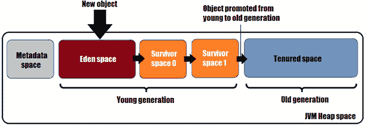

图 12.1：对象通过年轻代和老年代的转换

如您所见，*年轻代*被分为两个区域/空间，分别命名为*Eden*区域或*Eden*空间和*幸存者*区域或*幸存者*空间。最初，*年轻代*是空的。

默认情况下，新创建的对象会被放置在*Eden*空间中。然而，对于超过区域大小 50%的极大对象，称为*巨无霸对象*，它们会被直接放入*老年代*区域，这可能会因为*主要*/*完全*GC 事件的增加而导致性能问题。重要的是要注意，GC 可以触发不同类型的事件：

+   *MinorGC* – 当 *Eden* 空间满时，这个事件发生在 *Young* 代。其目的是收集 *非活动* 对象并将剩余的促进到 *Survivor* 空间。这个事件是最常由 GC 触发的。 

+   *MajorGC* – 这个事件发生在 *Old* 代，负责从这个区域收集垃圾。

+   *MixedGC* – 这是一个紧随其后的 *MinorGC* 事件，随后回收 *Old* 代。

+   *FullGC* – 清理 *Young* 和 *Old* 代，并对 *Old* 代进行压缩（我们可以通过 `System.gc()` 或 `Runtime.getRunTime().gc()` 程序化地强制执行 *FullGC*）。

接下来，让我们回到 *Young* 代的主题。在 *epoch*（一个 GC 完成周期）期间，存活的（未被垃圾回收）对象会被提升到 *Survivor* 空间（GC 算法在 *Survivor space 0*（称为 *S0* 或 *FromSpace*）和 *1*（称为 *S1* 或 *ToSpace*）之间进行选择）。那些不适合 *Survivor* 空间的对象（如果有）将被移动到 *Tenured* 空间——这被称为 *premature promotion*。通常，GC 通过 *MinorGC* 事件快速处理 *Eden* 空间。使用具有短生命周期方法的局部变量鼓励使用 *Eden* 空间并维持 GC 的性能。

被认为是足够老的（它们在多个时代中存活下来）对象最终会被提升到 *Old* 代。这个区域通常（但不一定是）比 *Young* 代大。一些 GC 使用这些区域之间的固定界限（例如，**Concurrent Mark Sweep** （**CMS**）GC），而其他 GC 使用这些区域之间的弹性界限（例如，G1 GC）。*Old* 代区域回收垃圾所需的时间相对较长，频率低于 *Young* 代。

正如你在 *Figure 12.1* 中可以看到的，堆中还包含一个名为 *Metadata* 的区域。在 JDK 8 之前，这个区域被称为 *PermGenSpace* 或 *Permanent* 代。这个区域用于存储类和方法。这个区域是专门设计用来在堆大小之外增长到本地内存（如果这个区域的大小超过了物理内存，操作系统将使用虚拟内存——但请注意，在物理内存和虚拟内存之间移动数据是一个昂贵的操作，这将影响应用程序的性能）。通过 *Metadata* 空间，JVM 避免了内存不足的错误。然而，这个区域可以被垃圾回收以删除未使用的类/方法。在这种情况下，有几个标志可以帮助我们调整它，但我们将这些标志放在 *Problem 256* 中讨论。

# 246. 跟踪代 GC 过程

在这个问题中，让我们从一个任意初始状态的代 GC 开始，并跟随几个假设的时代（通常，所有代 GC 的工作方式与你在这个问题中看到的方式大致相同）。我们从一个以下图表开始：

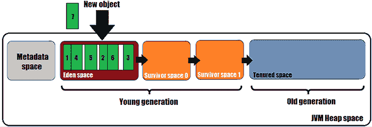

图 12.2：GC 初始状态

在其初始状态，GC 有一个几乎满载的 *Eden* 空间（它存储了对象 1、4、5、2、6 和 3，以及一些空闲空间——由对象之间的白色间隙表示），*Survivor* 和 *Tenured* 空间为空。此外，对象 7 应该被添加到 *Eden* 空间中，但内存不足以容纳它。当 *Eden* 空间无法容纳更多对象时，GC 触发一个 *MinorGC* 事件。首先，识别 *non-live objects*。这里（如图所示），我们有三个对象（5、2 和 3）应该被收集为垃圾：

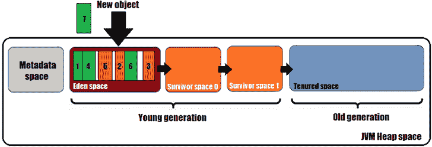

图 12.3：识别 *Eden* 空间中的非活动对象

这三个对象被收集为垃圾，因此它们被从堆中移除。接下来，*live objects*（1、4 和 6）被移动到 *Survivor space 0*。最后，新的对象（7）被添加到 *Eden* 空间中，如图所示：

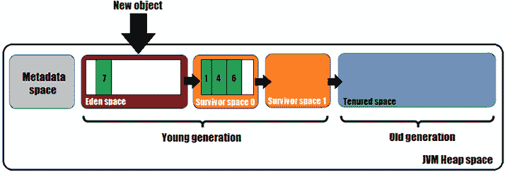

图 12.4：从内存中移除对象（5、2 和 3），将对象移动到 *Survivor space 0*（1、4 和 6），并将对象 7 添加到 *Eden* 空间

这里，一个 *epoch*（完整的 GC 循环）已经结束。

之后，更多的对象被添加到 *Eden* 空间中，直到它再次几乎满载：

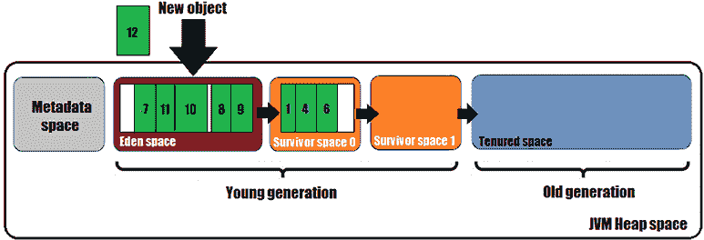

图 12.5：*Eden* 空间再次几乎满载

添加新的对象（12）需要触发一个 *Minor GC* 事件。再次，*non-living objects* 被识别如下：

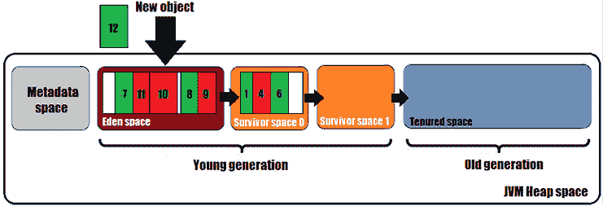

图 12.6：在 *Eden* 和 *Survivor 0* 空间中存在非活动对象

有四个对象应该被收集为垃圾。在 *Eden* 空间中，有三个对象（11、10 和 9），在 *Survivor space 0* 中有一个对象（4）。这四个对象都被从堆中移除。*Survivor space 0* 中的 *live objects*（1 和 6）被移动到 *Survivor space 1*。*Eden* 空间中的 *live objects*（7 和 8）也被移动到 *Survivor space 1*。在任何时刻，一个 *Survivor* 空间都是空的。最后，新的对象（12）被添加到 *Eden* 空间中，如图所示：

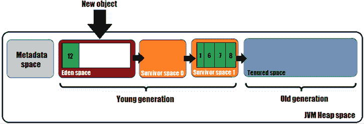

图 12.7：另一个时代的结束

这里，另一个时代已经结束。

接下来，对象 13、14、15 和 16 被添加到 *Eden* 空间中，它再次几乎满载：

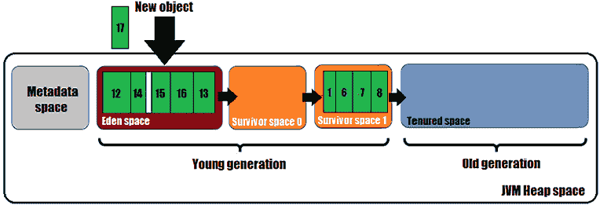

图 12.8：没有可用内存为对象 17 分配

随着 *Eden* 空间几乎满载，它无法容纳新的对象 17。一个新的 *Minor GC* 事件被触发，对象 12、15、16、13、6 和 8 被识别为 *non-live objects*：

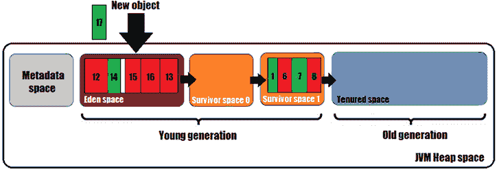

图 12.9：在不同空间中有几个非活动对象

这些对象（12、15、16、13、6 和 8）从堆中移除。接下来，对象 14 从**伊甸空间**移动到**幸存者空间 0**。之后，对象 1 和 7（来自**幸存者空间 1**）被移动到**幸存者空间 0**。最后，新对象 17 被移动到**伊甸空间**，如图所示：

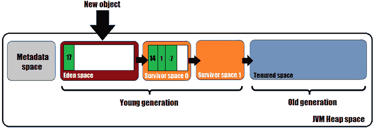

图 12.10：新对象（17）被添加到伊甸空间

这里，另一个**时代**已经结束。

我们重复这个场景，再次填满**伊甸空间**。当我们应该将对象 22 添加到**伊甸空间**时停止：

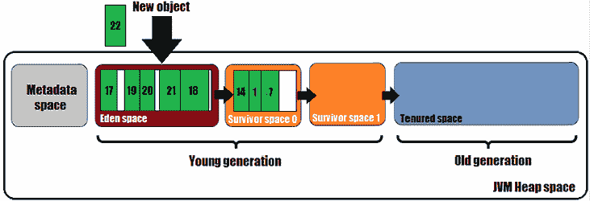

图 12.11：尝试在伊甸空间添加对象 22

如我们所知，GC 标记了所有**非活动对象**（在这里，17、21、18 和 7）：

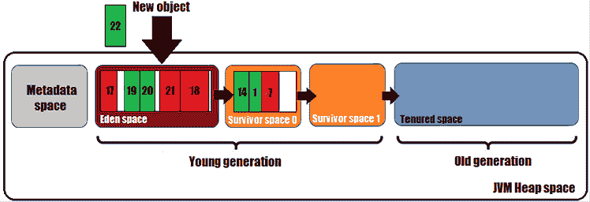

图 12.12：标记非活动对象

这次，垃圾收集器（GC）将对象 1（当它被认为足够老时）从**年轻**代提升到**老**代。接下来，来自**伊甸空间**（19 和 20）的对象和来自**幸存者空间 0**（14）的对象被移动到**幸存者空间 1**。结果如图所示：

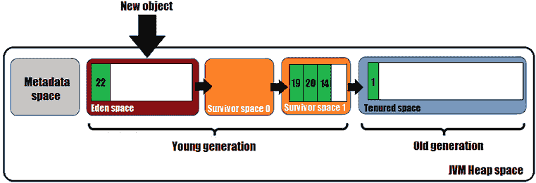

图 12.13：我们第一个提升到老代的对象

在这个**时代**结束时，我们最终在**持久代**中有一个对象（1）。继续运行**时代**最终会填满**持久代**，这将无法容纳更多对象。换句话说，**小 GC**事件（这些是**停止世界**事件）将回收**年轻代**的内存，直到**老代**填满。当这种情况发生时，将触发**混合 GC**甚至**全 GC**事件（**全 GC**也是一个 STW 事件，并将处理**元数据**空间）。

简而言之，这就是 GC 的工作方式。当然，还有许多其他内部/外部因素可能会影响 GC 的决策。

# 247. 选择正确的垃圾收集器

正如你将在下一个问题中看到的，Java 允许我们在几个垃圾收集器之间进行选择。没有银弹，因此为你的特定应用程序选择正确的垃圾收集器是一个重要的决定，应该基于三个因素：**吞吐量**、**延迟**和**占用空间**。

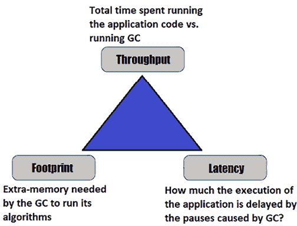

图 12.14：影响 GC 选择的因素

**吞吐量**表示运行应用程序代码所花费的总时间与运行 GC 所花费的时间之比。例如，你的应用程序可能运行了总时间的 97%，因此你有 97%的吞吐量。剩余的 3%是运行 GC 所花费的时间。

**延迟**衡量了应用程序执行因 GC 导致的暂停而延迟的程度。这很重要，因为延迟会影响应用程序的响应性。这些暂停可能导致在交互层面给最终用户带来不愉快的体验。

*内存占用*表示 GC 运行其算法所需的额外内存。这是除了应用程序本身使用的内存之外的内存需求。

根据这三个因素选择合适的 GC 是一个非常主观的决定。你可能需要巨大的吞吐量同时可以忍受延迟，或者你可能无法承受延迟，因为你与最终用户有高度交互，或者你的可伸缩性与有限的物理内存直接相关，因此你非常关注内存占用因素。正如你将在下一个问题中看到的那样，每种 GC 类型在这三个因素的情况下都有其自身的优缺点。

# 248. 垃圾收集器的分类

垃圾收集器的演变与 Java 本身的演变完全一致。今天（JDK 21），我们区分了几种 GC 类型，如下所示：

+   串行垃圾收集器

+   并行垃圾收集器

+   垃圾-第一（G1）收集器

+   Z 垃圾收集器（ZGC）

+   沙南多垃圾收集器（非代收集器）

+   并发标记清除（CMS）收集器（已弃用）

让我们解决每种 GC 类型的主要方面。

## 串行垃圾收集器

串行垃圾收集器是一个 STW 单线程代收集器。在运行自己的算法之前，这个 GC 会冻结/暂停所有应用程序线程。这意味着这个 GC 不适合多线程应用程序，如服务器端组件。然而，由于它专注于非常小的内存占用（对小型堆很有用），这个收集器非常适合单线程应用程序（以及单处理器机器），它们可以轻松地容纳和容忍显著的延迟（例如，批处理作业或批量处理）。

## 并行垃圾收集器

并行垃圾收集器是一个 STW 多线程代收集器。在运行自己的算法之前，这个 GC 会冻结/暂停所有应用程序线程，但它通过使用多个线程来加速垃圾收集。换句话说，这个 GC 可以利用多处理器机器，并且对于使用中等/大型数据集的多线程应用程序来说是一个很好的选择。这个 GC 关注吞吐量而不是延迟，并且伴随着 1 秒或更长的暂停。因此，如果你处于可以承受 1 秒或更长时间暂停的多线程环境中，那么这个 GC 是正确的选择。

## 垃圾-第一（G1）收集器

垃圾优先（G1）收集器是一个 STW 多线程、基于区域、分代收集器，专注于平衡性能。这个 GC 在 JDK 7 更新 4 中引入，作为默认（自 JDK 9 起）解决方案，以维持高吞吐量和低延迟（几秒）。为此性能付出的代价是更频繁的 epochs。GC 将更频繁地运行，因此请准备提供一台 CPU，以便能够容纳比其他 GC 更多的周期。这个 GC 是为在多处理器机器上执行的服务器式应用程序设计的，这些机器具有大量内存（大堆大小）。也称为*主要并发*收集器，G1 使用等大小的空间/区域（从 1 到 32MB）在应用程序旁边进行大量操作。因此，如果您可以承受大堆大小并且需要低延迟，那么 G1 是正确的选择。我们将在后续问题中详细讨论 G1。

## Z 垃圾回收器（ZGC）

Z 垃圾回收器（ZGC）从 JDK 15 开始用于生产，它是一种低延迟的 GC，可以处理大堆大小（数 TB）。像 G1 一样，ZGC 是并发工作的，但它保证不会使应用程序线程停止超过几毫秒（文档甚至指出 ZGC 可以以亚毫秒的最大暂停时间运行）。我们将在后续问题中详细讨论它。

## Shenandoah 垃圾回收器

Shenandoah 垃圾回收器在 JDK 12 中引入（并在 JDK 17 中变得更加可靠）作为一个非常低延迟、高度响应的 GC（亚毫秒暂停）。它与应用程序并发执行其工作（包括压缩）。Shenandoah 暂停非常短，与堆大小无关。垃圾回收 1GB 的堆或 300GB 的堆应该产生类似的暂停。

## 并发标记清除（CMS）收集器（已废弃）

CMS 是一个被 G1 废弃的*主要并发*收集器。由于它已被废弃，我将不再进一步讨论它。

# 249. 引入 G1

G1 垃圾回收器可能是 Java 中最成熟、维护和改进的 GC。它在 JDK 7 更新 4 中引入，从 JDK 9 开始成为默认 GC。这个 GC 维持高吞吐量和低延迟（几秒），以其平衡的性能而闻名。

在内部，G1 将堆分割成大小相等的块（最大 32MB），这些块相互独立，可以动态地分配给*Eden*、*Survivor*或*Tenured*空间。每个这样的块被称为 G1 的*堆区域*。因此，G1 是一种基于区域的 GC。

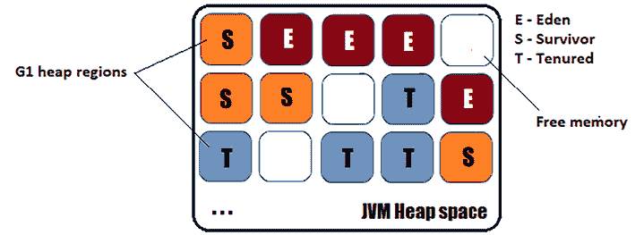

图 12.15：G1 将内存堆分割成相等的小块

这种架构具有许多显著的优势。可能最重要的是，*Old*代可以通过清理低延迟的部分来有效地清理。

对于小于 4 GB 的堆大小，G1 将创建 1 MB 的区域。对于 4 到 8 GB 的堆，G1 将创建 2 MB 的区域，以此类推，直到 64 GB 或更大的堆为 32 MB。基本上，JVM 设置了一定数量的区域，这些区域的数量是 2 的幂，且在 1 到 32 MB 之间（通常，在应用启动期间，JVM 设置大约 2,000+个区域）。

## 设计原则

G1 的设计基于以下原则：

+   平衡性能 - 设计用于平衡吞吐量和低延迟，以维持性能。

+   代际 - 动态地将堆分为*Young*和*Old*代，并专注于*Young*代，因为在这个区域中垃圾更多（大多数对象在*Young*代区域死亡）。大多数对象生命周期短的观点也被称为*代际假设*。

+   *Old*代的增量收集 - G1 最终将对象从*Young*代移动到*Old*代，并让它们在那里慢慢死亡，并逐步收集它们。

+   主要并发 - G1 努力在应用（并发）附近执行重任务，同时保持低且可预测的暂停。

多亏了这些设计原则，G1 已经弃用了 CMS 收集器。

# 250. 解决 G1 吞吐量提升问题

从 JDK 8 到 JDK 20，G1 取得了重大进展。其中一些改进已经体现在吞吐量上。当然，这种吞吐量提升取决于许多因素（应用、机器、调整等），但你可以预期在 JDK 18/20 中至少比 JDK 8 有 10%以上的吞吐量提升。

为了提高吞吐量，G1 已经经历了几次变化，如下所述。

## 延迟 Old 代的启动

从 JDK 9 开始，G1 主要专注于从*Young*代收集垃圾，同时将*Old*代的启动（初始化、资源分配等）推迟到最后时刻（它预计何时应该启动*Old*代）。

## 专注于易收集

我们所说的“易收集”是指那些生命周期短（例如，临时缓冲区）、占用大量堆内存且可以以低成本轻松收集的对象，从而带来重要益处。从 JDK 9 开始，G1 高度关注易收集的对象。

## 提高 NUMA 感知内存分配

NUMA 代表非均匀内存访问，这在*问题 245*中有所描述。G1 从 JDK 14 开始利用 NUMA，并且持续改进。如果启用 NUMA，那么 JVM 要求操作系统将 G1 堆区域放置在 NUMA 节点上。在此过程结束时，整个堆应均匀分布在所有活跃的 NUMA 节点上。

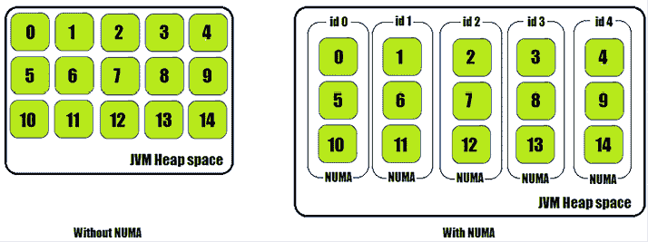

图 12.16：带有和没有 NUMA 的堆内存

G1 堆区域与内存页面（操作系统页面 - [`en.wikipedia.org/wiki/Page_(computer_memory)`](https://en.wikipedia.org/wiki/Page_(computer_memory)))之间的关系属于以下两种情况之一：

+   如果一个 G1 堆区域的尺寸大于或等于一个内存页的尺寸，那么一个 G1 堆区域将包含多个内存页（*图 12.17*，左侧）。

+   如果一个 G1 堆区域的尺寸小于或等于一个内存页的尺寸，那么一个内存页将包含多个 G1 堆区域（*图 12.17*，右侧）。

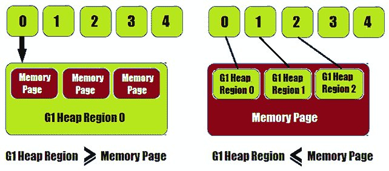

图 12.17：G1 堆区域与内存页的关系

没有 NUMA 时，G1 GC 从单个公共内存分配器为线程分配内存。有 NUMA 时，每个 NUMA 节点都有一个内存分配器，内存分配是基于这些 NUMA 节点的。

提高 NUMA 分配意识是 G1 的持续目标。

## 并行化全堆收集

在其他不太常见的优化中，我们有全堆收集的并行化。这一改进是在 JDK 10 中添加的，作为使全堆收集尽可能快的一种解决方案。

## 其他改进

JVM 本身已经添加了大量的微小改进，这些改进在 GC 性能上也有所体现。这意味着通过简单地更新到最新的 JDK，我们的 GC 将会表现得更好。您会发现 JDK 8 和 JDK 20 之间至少有 10% 的性能提升。

# 251. 解决 G1 延迟改进

从 JDK 8 到 JDK 20，G1 GC 延迟也记录了一些改进（这显然也反映在 G1 GC 吞吐量上）。

为了减少延迟，G1 已经经历了几次变化，如下所述。

## 合并并行阶段为一个更大的阶段

从 JDK 8 开始，G1 的许多方面都进行了并行化。换句话说，在任何时刻，我们可能都在执行多个并行阶段。从 JDK 9 开始，这些并行阶段可以被合并成一个更大的阶段。实际上，这意味着减少了同步，减少了创建/销毁线程的时间。因此，这一改进加快了并行化处理，减少了延迟。

## 减少元数据

减少元数据是在 JDK 11 中添加的。实际上，G1 尽可能地减少元数据量，以管理更少的元数据。管理的数据越少，延迟就越好。当然，这也意味着更小的内存占用。

## 更好的工作平衡

从 JDK 11 开始，工作平衡得到了改进。简而言之，这意味着完成当前工作的线程可以从其他线程那里窃取工作。实际上，这意味着任务完成得更快，因为所有线程都在工作（在自己的工作或窃取的工作上），没有线程只是挂起。因此，开发了更智能的算法来协调和保持线程忙碌，以更快地完成任务并减少延迟。然而，减少窃取工作的开销仍然是改进的主题。

## 更好的并行化

从 JDK 14 开始，提供了更好的并行化。实际上，G1 从潜在的引用区域中移除了所有重复项。之后，它应用并行化而不是蛮力。

## 更好的引用扫描

为了更好地实现并行化，JDK 15 也改进了收集区域中的引用扫描。JDK 14 知道如何去除重复项并并行化数据处理，而 JDK 15 知道如何更优化地扫描引用。它们的效果结合在一起，降低了延迟。

## 其他改进

在改进所谓的非常见情况上花费了很多时间。例如，特别关注了*迁移失败*（在两个内存区域之间移动*活动对象*并压缩它们的尝试被称为*迁移方式*，当移动对象导致内存不足问题时，我们就有了一个*迁移失败*）。为了比以前更快地处理此类场景，这个边缘情况得到了严重改进（在 JDK 17 之前）。

# 252. 解决 G1 占用空间改进

在 JDK 8 和 JDK 20 之间，G1 的占用空间通过关注高效的元数据和尽可能快地释放内存得到了改进。

为了优化其占用空间，G1 已经经历了多次变化，如下所述。

## 仅保留所需的元数据

为了仅保留所需的元数据，JDK 11 能够并发（重新）创建所需的数据，并尽可能快地释放它。在 JDK 17 中，对所需元数据的关注得到了重申，并且只保留绝对需要的数据。此外，JDK 18 提出了数据更密集的表示形式。所有这些改进都反映在更小的占用空间中。

## 释放内存

从 JDK 17 开始，G1 垃圾收集器能够并发释放内存（将其归还给操作系统）。这意味着内存可以被最优地重用，并可用于服务其他任务。

# 253. 引入 ZGC

Z 垃圾收集器（ZGC）首次（作为一个实验性功能）在 JDK 11 中引入。它在 JDK 15 中被提升到生产阶段（生产就绪），根据 JEP 377。它仍在不断改进——在 JDK 21 中，ZGC 通过维护年轻和旧对象的不同代来维持应用程序性能。基本上，这最小化了分配停滞和堆内存开销。此外，JDK 21（JEP 439）将 ZGC 的状态从目标提升到完成。

ZGC 是并发的（基于低级并发原语，如*加载屏障*和*彩色指针*），跟踪（遍历对象图以识别*活动*和*非活动*对象），以及压缩（对抗碎片）。它也是 NUMA 意识的，基于区域的。

ZGC 是专门设计为低延迟、高度可扩展的垃圾收集器，能够处理从小型（几兆字节；文档中提到 8 MB）到大型（兆字节；文档中提到 16 TB）的堆，最大暂停时间（脉冲时间）仅为几毫秒（文档中提到亚毫秒最大暂停时间）。

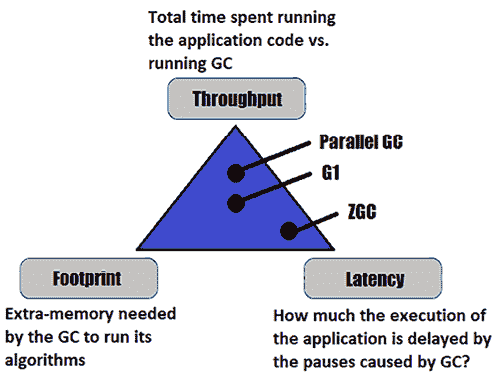

图 12.18：ZGC 专注于低延迟

非常重要的是要说明，暂停时间不会随着堆大小的增加而增加（脉冲时间复杂度为 O(1)，因此它们在恒定时间内执行）。

ZGC 的缺点（权衡）在于吞吐量。换句话说，与 G1 吞吐量相比，ZGC 的吞吐量略有降低（例如，在某些情况下从 0%降低到 10%）。

从 JDK 16 开始，ZGC 利用了并发线程堆栈，从 JDK 18 开始，它支持字符串去重。这些只是众多改进中的两个主要改进。

ZGC 是自动调优的。换句话说，正如你将在*问题 256*中看到的那样，ZGC 只有少数几个我们可以调整的选项，而大部分调整是自动的。

## ZGC 是并发的

G1 和 ZGC 都是并发的，但它们并不遵循相同的路径。ZGC 力求以并发的方式收集尽可能多的垃圾。为此，ZGC 依赖于三个主要轻量级（非常短，亚毫秒级）暂停和三个并发阶段，如下面的图所示：

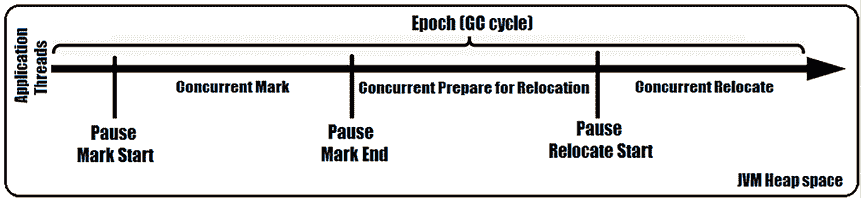

图 12.19：ZGC 并发

每个阶段都由一个同步点（暂停）来表示：

+   *暂停标记开始 –* 这个暂停信号表示将跟随*并发标记*阶段。在这个同步点，ZGC 为执行*并发标记*阶段准备当前状态。这是一个轻量级暂停，对*彩色指针*进行一些设置，并重置一些标志和计数器。接下来，*并发标记*阶段并发运行并标记堆中的对象。

+   *暂停标记结束 –* 这个暂停信号表示*并发标记*阶段的结束。它也在执行*并发准备重定位*阶段之前暂停。这个阶段负责定位所有来自稀疏填充区域的*活动*对象，并将它们标记为可以移动/迁移到其他区域的候选者。此外，在这个阶段，ZGC 解除分配不包含*活动*对象的区域。

+   *暂停重定位开始* – 这个暂停信号表示将跟随*并发重定位*阶段。在这个阶段，前一个阶段标记为迁移候选者的对象实际上被（复制）从当前区域移动到新区域。它们的引用也被恢复，从当前区域解除分配并重新分配到新区域。

## ZGC 和彩色指针

ZGC 在应用程序旁边运行并操作（移动）该应用程序使用的对象。这可能导致意外的错误（例如，应用程序可能尝试使用过时的引用），从而导致应用程序行为异常甚至崩溃。为了防止这种情况，ZGC 依赖于两种称为*彩色指针*和*加载屏障*的低级并发原语。

*彩色指针*是一个 64 位指针。这个指针由 ZGC 使用一个 44 位对象地址，能够处理高达 16 terabytes。

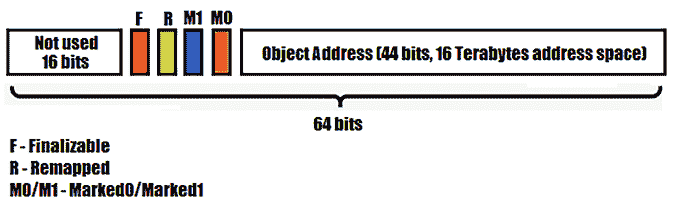

图 12.20：彩色指针

*彩色指针*为存储此指针的元数据保留了 20 位。最重要的元数据是：

+   *Finalizable* – 1 位表示对象是否可达（*活动*对象）

+   *重映射* – 1 位表示对象是否不指向重定位集

+   *Marked0*/*Marked1* – 2 位表示对象是否被标记

除了彩色指针外，ZGC 还需要负载屏障。

## ZGC 和负载屏障

*负载屏障*是编译器注入的代码片段，用于处理*彩色指针*。虽然应用程序不知道*彩色指针*，但 ZGC 需要解释和与它们一起工作，这正是*负载屏障*的工作。例如，假设我们在应用程序中有以下代码片段（我故意手动添加了行号）：

```java
1: Manager manager = company.manager;
2: Manager cManager = manager;
3: manager.attendMeeting();
4: int employeeNr = company.size; 
```

编译器分析代码以决定在哪里注入一个*负载屏障*。结论是，唯一应该在行 1 和行 2 之间注入*负载屏障*的地方，因为那里是唯一从堆中加载对象的地方。在行 2 中，不需要*负载屏障*，因为有一个内存引用的副本。在行 3 中，也不需要*负载屏障*，因为有一个方法引用。最后，在行 4 中，也不需要*负载屏障*，因为没有对象引用。所以，ZGC 看到这段代码如下：

```java
1: Manager manager = company.manager;
**<load barrier injected at this point>**
2: Manager cManager = manager;    // copying reference
3: manager.attendMeeting();       // method reference
4: int employeeNr = company.size; // no object reference 
```

*负载屏障*的目的是确保指针是有效的（通过良好的颜色显示）。如果遇到坏颜色，则*负载屏障*会尝试修复它（更新指针，重新定位对象引用等）。

## ZGC 是区域基于的

ZGC 是一种基于区域的垃圾回收器，因此它将堆划分为更小的区域/块，这些区域/块分配给*年轻*或*老*代，如下面的图所示：

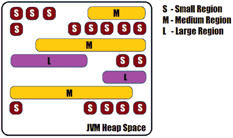

图 12.21：ZGC 堆区域

与 G1 完全一样，ZGC 是一种基于区域的垃圾回收器。然而，ZGC 比 G1 更强大，并且能够在运行时动态地增加/减少活动区域的数量。此外，ZGC 可以依赖于三种大小的区域，如下所示：

+   小区域 – 这些区域大小为 2 MB。

+   中等区域 – 这些区域可以从 4 MB 到 32 MB 不等。它们是动态大小的。

+   大区域 – 这些区域是为*巨大*对象预留的。这些区域是紧密匹配的，可能比中等区域小或大。

因此，乍一看，ZGC 是一种具有恒定暂停时间（亚毫秒级）的并发垃圾回收器，以并行模式工作，并且能够通过压缩来对抗碎片化。此外，它是基于区域的，NUMA 感知的，能够自动调整，并依赖于*彩色指针*和*负载屏障*。

# 254. 监控垃圾回收器

监控 GC 在时间线中的活动和演变是识别潜在性能问题的关键。例如，您可能对监控暂停时间、识别 GC 事件的频率和类型、被触发的 GC 事件填充的空间等感兴趣。主要目标是收集尽可能多的信息，这些信息有助于解决与堆内存和 GC 进化相关的性能问题。

任何现代 IDE 都提供包含（包括其他相关事物）GC *epochs*/cycles 的信息和实时图表的剖析器。例如，以下图来自 NetBeans IDE，它将 GC 进化（堆状态）显示为工具栏的一项（只需单击该区域，就可以强制 GC 执行垃圾回收）：


图 12.22：NetBeans 在工具栏上显示 GC 进化

当然，通过 NetBeans 剖析器可以获得更详细的信息：

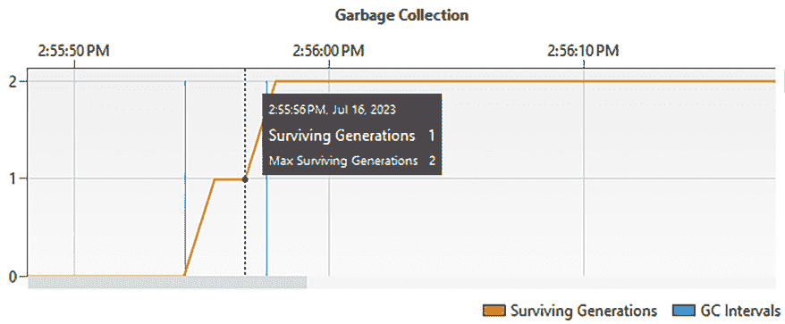

图 12.23：NetBeans 的 GC 分析器

在可用于监控您的 GC 的其他工具中，还有 *jstat* 命令行实用程序（`jstat -gc $JAVA_PID`）和 *JConsole*（Java 监控和管理控制台）。

以下图是来自 *JConsole* 的截图：

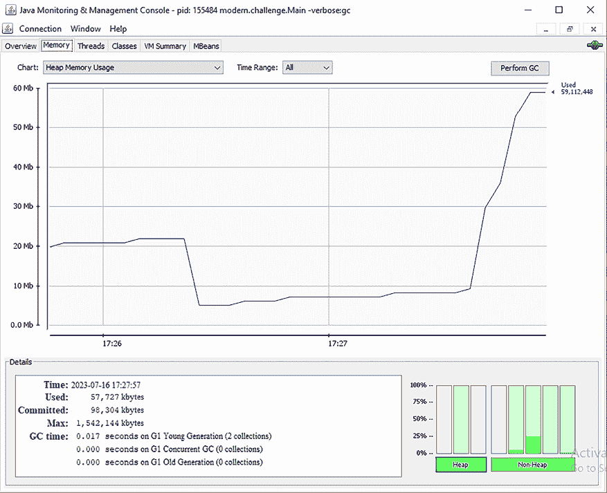

图 12.24：通过 JConsole 监控 GC

您可能还对 Oracle 的 **visualgc**（**可视化垃圾回收监控工具**）、**JDK VisualGC**（IntelliJ IDE 插件）和 Eclipse 的 **Memory Analyzer**（**MAT**）感兴趣。

# 255. 记录垃圾收集器

分析 GC 日志是另一种有用的方法，可以帮助找到内存问题。由于 GC 日志不会增加显著的开销，因此可以在生产环境中启用它们进行调试。实际上，GC 日志的开销微乎其微，因此您绝对应该使用它们！

让我们考虑一些简单的 Java 代码，该代码向 `List<String>` 添加和删除元素。添加和删除代码需要通过 `System.gc()` 执行完整 GC：

```java
private static final List<String> strings = new ArrayList<>();
...
logger.info("Application started ...");
String string = "prefixedString_";
// Add in heap 5 millions String instances
for (int i = 0; i < 5_000_000; i++) {
  String newString = string + i;
  strings.add(newString);
}
logger.info(() -> "List size: " + strings.size());
// Force GC execution
System.gc();
// Remove 10_000 out of 5 millions
for (int i = 0; i < 10_000; i++) {
  String newString = string + i;
  strings.remove(newString); 
}
logger.info(() -> "List size: " + strings.size());
logger.info("Application done ..."); 
```

接下来，我们想要运行这个简单的应用程序并记录 GC 活动。

在 JDK 9 之前，我们可以通过 `-verbose:gc` 选项获取 GC 的快速和详细日志：

```java
java … -verbose:gc 
```

可能的输出如下所示：

```java
[0.319s][info][gc] Using G1
**[17:03:47] [INFO] Application started ...** 
[0.917s][info][gc] GC(0) Pause Young (Normal) 
        (G1 Evacuation Pause) 27M->24M(96M) 34.391ms
[0.948s][info][gc] GC(1) Pause Young (Normal) 
        (G1 Evacuation Pause) 40M->40M(96M) 21.300ms
[0.986s][info][gc] GC(2) Pause Young (Normal) 
        (G1 Evacuation Pause) 60M->60M(96M) 24.085ms
[0.997s][info][gc] GC(3) Pause Young (Concurrent Start) 
        (G1 Humongous Allocation) 63M->64M(96M) 8.072ms
[0.997s][info][gc] GC(4) Concurrent Mark Cycle
[1.030s][info][gc] GC(5) Pause Young (Normal) 
        (G1 Evacuation Pause) 78M->78M(288M) 17.036ms
[1.059s][info][gc] GC(4) Pause Remark 101M->94M(288M) 0.867ms
[1.083s][info][gc] GC(4) Pause Cleanup 109M->109M(288M) 0.14ms
[1.085s][info][gc] GC(4) Concurrent Mark Cycle 87.261ms
[1.125s][info][gc] GC(6) Pause Young (Prepare Mixed) 
        (G1 Evacuation Pause) 116M->118M(288M) 32.640ms
[1.220s][info][gc] GC(7) Pause Young (Mixed) 
        (G1 Evacuation Pause) 181M->181M(288M) 42.497ms
[1.257s][info][gc] GC(8) Pause Young (Concurrent Start) 
        (G1 Humongous Allocation) 200M->201M(288M) 23.297ms
[1.257s][info][gc] GC(9) Concurrent Mark Cycle
[1.316s][info][gc] GC(10) Pause Young (Normal) 
        (G1 Evacuation Pause) 243M->244M(288M) 24.492ms
[1.345s][info][gc] GC(11) Pause Young (Normal) 
        (G1 Evacuation Pause) 256M->258M(776M) 12.445ms
[1.400s][info][gc] GC(9) Pause Remark 290M->274M(776M) 0.732ms
[1.461s][info][gc] GC(9) Pause Cleanup 335M->335M(776M) 0.25ms
[1.466s][info][gc] GC(9) Concurrent Mark Cycle 209.289ms
[1.531s][info][gc] GC(12) Pause Young (Prepare Mixed) 
        (G1 Evacuation Pause) 344M->345M(776M) 54.939ms
**[17:03:48] [INFO] List size: 5000000** 
[1.830s][info][gc] GC(13) Pause Full (System.gc()) 
        368M->330M(776M) 277.793ms
**[17:04:15] [INFO] List size: 4990000** 
**[17:04:15] [INFO] Application done ...** 
```

这是最简单的 GC 日志。要获取更多详细信息，我们可以添加 `-XX:+PrintGCDetails` 选项：

```java
java … -XX:+PrintGCDetails -verbose:gc 
```

此外，我们可以附加一些选项来获取关于十岁分布（`-XX:+PrintTenuringDistribution`）、垃圾收集器时间戳（`-XX:+PrintGCTimeStamps`）、类直方图（`-XX:+PrintClassHistogram`）和应用停止时间（`-XX:+PrintGCApplicationStoppedTime`）的信息。

在这种情况下，GC 日志在控制台（stdout）上可用，使用 info 级别。您可以通过 `-Xloggc` 选项轻松地将 GC 日志重定向到文件：

```java
java … -verbose:gc -Xloggc:gclog.txt 
```

实际上，`-Xloggc` 已被弃用，并且您只有在使用版本低于 9 的 JDK 时才应使用它。从 JDK 9（JEP 158 – [`openjdk.org/jeps/158`](https://openjdk.org/jeps/158)）开始，我们有一个针对所有 JVM 组件的 *统一日志系统*。

因此，从 JDK 9 开始，我们通过 `–Xlog` 选项拥有一个统一的日志系统。`-XX:+PrintGCDetails -verbose:gc` 的等效选项是 `-Xlog:gc*`。如果我们想以调试级别将 GC 日志重定向到文件，则可以这样做：

```java
java … -Xlog:gc*=debug:file=gclog.txt 
```

`gclog.txt` 将保存在应用程序根目录中。如果您删除了 `*` 字符，那么您将得到一个不那么冗长的垃圾收集器日志。

通过 `-Xlog:numa*={log level}` 可用仅记录 NUMA 日志。

拥有垃圾收集器日志只是问题的一半。另一半包括解释这个日志。如您所见，这并不容易。幸运的是，您不必费心阅读日志文件，因为我们有能够解析、分析和从垃圾收集器日志中提供详细报告的工具。

这些工具之一是通用垃圾收集器日志分析器（[`gceasy.io/`](https://gceasy.io/)）。使用免费版本，我们可以上传我们的 `gclog.txt` 文件并获得详细报告。例如，在下面的图中，我们可以看到为我们的应用程序分配了多少内存。

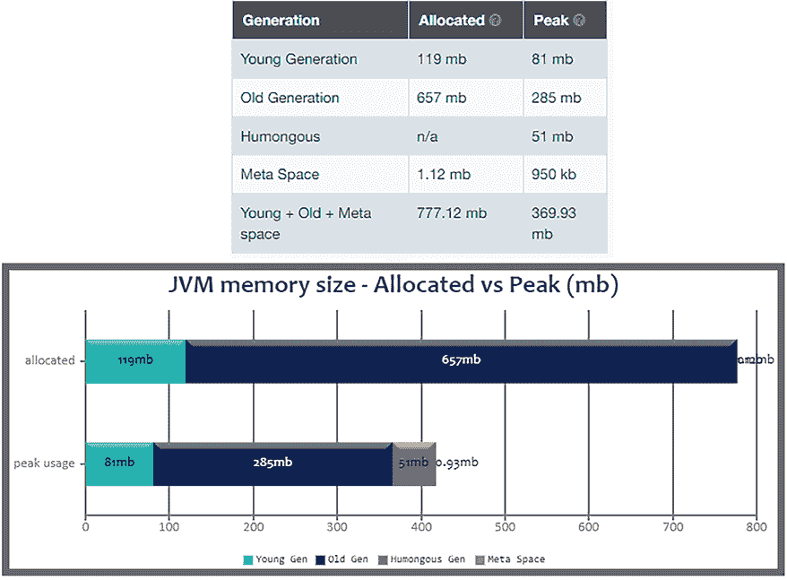

图 12.25：来自通用垃圾收集器日志分析器（GCEasy）报告的截图

此图只是报告的一小部分。自己尝试一下，看看完整的报告。您可能还想尝试的其他类似工具包括 GCViewer、GCPlot、IBM 垃圾收集器和内存可视化器、garbagecat、SolarWinds Loggly、Sematext Logs、**Java 飞行记录器**（**JFR**）、jvm-gc-logs-analyzer 等。

# 256. 调整垃圾收集器

垃圾收集器是一种复杂的机械，其性能与当前 JVM、当前应用程序和硬件环境中的设置（启动参数）高度相关。由于垃圾收集器会消耗和共享资源（内存、CPU 时间等）与我们的应用程序，因此将其调整到尽可能高效地工作至关重要。如果垃圾收集器效率不高，那么我们可能会面临显著的暂停时间，这将负面地影响应用程序的运行。

在这个问题中，我们将介绍串行 GC、并行 GC、G1 GC 和 ZGC 可用的主要调整选项。

## 如何调整

在尝试调整垃圾收集器之前，请确保它确实引起了问题。通过检查和关联图表和日志，您可以识别这些问题并决定您应该采取行动的地方（应该调整哪些参数）。检查堆内存的使用情况以及对象如何填充 *Eden*、*Survivor* 和 *Tenured* 空间。

通常，一个健康的垃圾收集器会产生一个称为 *shark teeth* 的堆使用图，如下面的图所示：

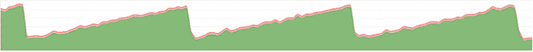

图 12.26：健康的堆使用

此外，检查 90^(th)和 99^(th)百分位数以及平均 GC 时间。这些信息可以给你一个提示，了解是否需要更多的内存或者是否已经正确清理。

一旦你确定了 GC 问题，尝试逐一解决它们。不要急于同时更改多个参数，因为这很难管理和分析它们的综合效果。尝试修改其中一个，并实验看看发生了什么以及结果如何。如果你看到一些好处，那么就进行下一个实验，并再次实验。观察综合效果是否有所改善。否则，也许在尝试下一个之前，最好将这个参数恢复到其默认值。

## 调整串行垃圾回收器

可以通过`-XX:+UseSerialGC`启用串行垃圾回收器。

由于这是一个单线程 GC，没有太多可以调整的。然而，你可以通过`-Xmx`和`-Xms`调整堆大小（例如，可以通过`-Xmx3g`和`-Xms3g`设置 3GB 的堆大小）以及通过`-Xmn`选项调整*Young*代的大小。不过，这些选项与所有类型的 GC 一起工作，用于设置堆大小。

## 调整并行垃圾回收器

可以通过`-XX:+UseParallelGC`启用并行垃圾回收器。

这个垃圾回收器是多线程的，我们可以通过`-XX:ParallelGCThreads`选项来控制用于清理任务的线程数量（例如，设置六个线程可以通过`-XX:ParallelGCThreads=6`来完成）。

请记住，线程数量越多，为*Tenured*空间保留的堆的碎片化程度就越高。每个参与*Minor* GC 事件的线程都会在*Tenured*空间中为其晋升目标保留一些空间。这将导致*Tenured*空间的严重碎片化。解决这个问题需要减少线程数量并增加*Old*代的大小。

最大暂停时间可以通过`-XX:MaxGCPauseMillis`选项来控制（例如，`-XX:MaxGCPauseMillis=150`，这将确保在两次连续的 GC 运行/事件之间最大暂停时间为 150 毫秒）。然而，请注意，更大的暂停时间将允许更多的垃圾进入堆。这意味着 GC 的下一次运行将更加昂贵。另一方面，较小的暂停时间将指示 GC 更频繁地运行，这可能会导致应用程序在垃圾回收上花费太多时间。

接下来，我们想要达到的最大吞吐量可以通过`-XX:GCTimeRatio`选项来设置。此选项是 GC 内部与外部花费时间的比率。这是一个计算为 1/(1+n)的百分比。换句话说，`-XX:GCTimeRatio`指定了在 1/(1+n)比率中分配给垃圾回收的时间量。

例如，如果我们设置此选项为 `-XX:GCTimeRatio=14`，那么我们的目标是 1/15。这意味着总时间的 6% 应该用于垃圾收集（默认情况下，此选项设置为 99，即 1% 的时间用于垃圾收集）。

如果您遇到 `OutOfMemoryError`，那么这很可能是由于垃圾收集花费了太多时间造成的。例如，如果超过 98% 的时间用于恢复不到 2% 的堆，那么您将看到这样的错误。换句话说，GC 花了很长时间清理堆的小部分。这可能表明存在内存泄漏或堆太小。尽管如此，如果您可以容忍这个错误，那么您可以通过 `-XX:-UseGCOverheadLimit` 选项来抑制它。

我们还可以控制 *Young*/*Old* 代的大小。您可以通过 `-XX:YoungGenerationSizeIncrement` 控制年轻代的增长，通过 `-XX:TenuredGenerationSizeIncrement` 控制老年代的成长。这些选项的值是百分比（默认情况下，增长百分比为 20%，缩减百分比为 5%）。此外，您可以通过简单地设置 `-XX:AdaptiveSizeDecrementScaleFactor` 选项来控制缩减百分比。*Young* 代的缩减会自动通过 `-XX:YoungGenerationSizeIncrement`/`-XX:AdaptiveSizeDecrementScaleFactor` 计算。

## 调整 G1 垃圾收集器

可以通过 `-XX:+UseG1GC` 启用 G1 垃圾收集器。

默认情况下，G1 负责管理 *Young* 代。基本上，它会清理 *Young* 代并将可达对象提升到 *Old* 代，直到达到 45% 的阈值。此默认值可以通过 `-XX:InitiatingHeapOccupancyPercent` 进行更改。

当调整 G1 收集器时，我们可以针对吞吐量、延迟或占用空间进行优化。当针对延迟进行优化时，我们必须关注低暂停时间。这可以通过将 `–Xmx` 和 `–Xms` 选项设置为相同的值（以避免堆大小调整）来实现。此外，我们可以依靠 `-XX:+AlwaysPreTouch` 和 `-XX:+UseLargePages` 标志选项在应用程序启动时加载（大）内存页面。

如果延迟受到 *Young* 代大小的影响，那么通过 `-XX:G1NewSizePercent` 和 `-XX:G1MaxNewSizePercent` 减小其大小是一个好主意。另一方面，如果 *Mixed* GC 事件影响延迟，那么我们应该通过 `-XX:G1MixedGCCountTarget` 标志选项在更多收集中分配 *Tenured* 空间。此外，我们可能还想关注 `-XX:G1HeapWastePercent`（提前停止 *Tenured* 空间清理）和 `-XX:G1MixedGCLiveThresholdPercent`（只有当此阈值超过时，*Tenured* 空间才成为混合收集的一部分，默认为 65）。您可能还对 `-XX:G1RSetUpdatingPauseTimePercent`、`-XX:-ReduceInitialCardMarks` 和 `-XX:G1RSetRegionEntries`（有关详细信息，请参阅 G1 文档）感兴趣。

当调整吞吐量（处理大量数据的应用程序需要能够清理尽可能多的垃圾的 GC）时，我们必须关注 `-XX:MaxGCPauseMillis` 选项。当此选项效果较低时，我们应该关注 `-XX:G1NewSizePercent` 和 `-XX:G1MaxNewSizePercent`。基本上，G1 力求将 *Young* 代的大小限制在 `-XX:G1NewSizePercent`（默认为 5）和 `-XX:G1MaxNewSizePercent`（默认为 60）的值之间。通过调整这三个选项，我们可以放宽 GC，给它更多的时间和空间来处理大量垃圾。此外，吞吐量可以通过 `-XX:G1RSetUpdatingPauseTimePercent` 选项来维持。

通过增加此选项的值，我们可以在暂停应用程序线程时进行更多工作，同时减少在并发部分花费的时间。此外，与调整延迟的情况一样，我们可能想要避免堆大小调整（将 `–Xmx` 和 `–Xms` 设置为相同的值）并开启 `-XX:+AlwaysPreTouch` 和 `-XX:+UseLargePages` 标志选项。

调整内存占用大小可能会受到设置 `-XX:GCTimeRatio` 的影响。默认值为 12（8%），但我们可以将其增加以迫使垃圾回收（GC）花费更多时间在垃圾回收上。结果，将有更多的堆内存被释放，但这并不是一个普遍的规则。建议进行实验以了解其真实效果。此外，自 JDK 8（更新 20）以来，我们可以设置 `-XX:+UseStringDeduplication` 标志选项。实际上，如果启用此选项，那么 G1 在清理重复字符串时会定位重复的字符串，并保留对其中一个字符串的单个引用。这应该会导致堆内存的更高效和优化使用。您还可能希望查阅 `-XX:+PrintStringDeduplicationStatistics` 和 `-XX:StringDeduplicationAgeThreshold=n` 的文档。

如您所知，G1 将堆分成最多 32 MB 的小区域。在实践中，这可能会导致性能下降，尤其是在非常大的堆上处理大对象时。但是，从 JDK 18 开始，最大区域大小被设置为 512 MB。您需要时，可以通过 `-XX:G1HeapRegionSize` 控制最大区域大小。

## 调整 Z 垃圾回收器

Z 垃圾回收器可以通过 `-XX:+UseZGC` 启用（在 JDK 15 之前，您可能还需要 `-XX:+UnlockExperimentalVMOptions`）。

这个 GC 最重要的设置之一是 `–Xmx`，用于设置最大堆大小。接下来是 `-XX:ConcGCThreads=n`，其中 `n` 是 ZGC 使用的线程数。然而，ZGC 完全能够动态确定此选项的最佳值，因此在修改之前请三思。

## 调整元空间（元数据空间）

如果您的重点是调整元空间，那么您会对以下选项感兴趣：

+   `-XX:MetaspaceSize` – 设置元空间的初始大小

+   `-XX:MaxMetaspaceSize` – 设置元空间的最大大小

+   `-XX:MinMetaspaceFreeRatio` – 设置 GC 运行后应空闲的类元数据容量（这是作为百分比的最低值）

+   `-XX:MaxMetaspaceFreeRatio` – 设置 GC 运行后应空闲的类元数据容量（这是作为百分比的最高值）

控制元空间的大小和行为也可以是调整 GC 的一部分。再次强调，实验和比较结果是你通往成功和最佳 GC 的主要规则。

# 257. 介绍应用程序类数据共享（AppCDS，或 Java 的启动加速器）

启动 Java 应用程序是一个多步骤的过程。在执行类的字节码之前，JVM 必须为给定的类名执行至少以下步骤：

1.  在磁盘上查找类（JVM 必须扫描磁盘并找到给定的类名）。

1.  加载类（JVM 打开文件并加载其内容）。

1.  检查字节码（JVM 验证内容的一致性）。

1.  在内部拉取字节码（JVM 将代码传输到内部数据结构）。

显然，这些步骤并非没有成本。加载数百/数千个类将在启动时间和内存占用上产生显著开销。通常，应用程序的 JAR 文件在很长时间内保持不变，但 JVM 执行前面的步骤，并在每次启动应用程序时获得相同的结果。

提高或加速启动性能，甚至减少内存占用，是应用程序类数据共享（AppCDS）的主要目标。简而言之，AppCDS 最初在 JDK 10（2018）中流行起来，并在 JDK 13 和 JDK 19 中简化。AppCDS 的想法是只执行前面的步骤一次，并将结果存入存档。这个存档可以用于后续的启动，甚至可以在同一主机上运行的多个 JVM 实例之间共享。应用程序越大，启动时的好处就越大。

将这些想法付诸实践需要以下三个步骤：

1.  创建应在应用程序实例之间共享的类列表。

1.  将这个类列表存档到适合内存映射的存档中。

1.  将生成的存档提供给每个应用程序启动（每个应用程序实例）。

根据使用的 JDK，你可能需要手动遵循这些步骤或其中的一部分。AppCDS 算法不断改进，因此其使用取决于你的 JDK，如下所示：

+   在 JDK 10/11 中，你必须遵循前面的三个步骤。然而，如果你想只共享 JDK 类（而不是应用程序类），那么你可以跳过步骤 1。JDK 已经在 `$JAVA_HOME\lib\classlist` 中准备了应共享的类列表（大约有 1,200 个类）。

+   在 JDK 12+ 中，你可以跳过步骤 1 和 2，因为 JDK 类的存档已经可用。然而，如果你想共享应用程序类，那么你需要遵循所有三个步骤。

+   在 JDK 13+ 中，我们可以利用动态 CDS 存档。实际上，JVM 在应用程序运行时收集要添加到存档中的类。步骤 1 和 2 会自动合并。

+   在 JDK 19+ 中，我们可以利用自动生成的共享存档。CDS 存档在一个命令中构建和使用。

## 处理 JDK 类数据存档

处理 JDK 类数据存档意味着我们将创建一个只包含 JDK 类的可重复使用的存档，而不是我们的应用程序类。

### JDK 10/JDK 11

在 JDK 10/11 中，我们可以使用现有的 `$JAVA_HOME/lib/classlist` 文件。这是一个包含 JDK 类列表的文件，你可以使用文本编辑器轻松地检查它。有了类列表，我们可以通过 `–Xshare:dump` 选项创建适当的 CDS 存档，如下所示：

```java
java … -Xshare:dump 
```

生成的存档将存储在 `$JAVA_HOME\bin\server\classes.jsa`（这是默认位置，你可能需要以管理员身份运行此命令以避免权限拒绝限制）。

接下来，我们可以通过 `–Xshare:on` 使用此存档，如下所示（如果你在 JDK 11 下运行，则需要 `--enable-preview`，但在这里我将跳过它）：

```java
java … -Xshare:on 
```

我们可以使用统一的日志系统通过 `–Xlog` 跟踪 CDS 工作，如下所示：

```java
java … -Xshare:on -Xlog:class+load:file=cds.log 
```

在输出中，我们可以看到共享对象被标记了一个重要的消息，如下所示（未共享的对象不包含“*共享对象文件*”文本）：

```java
[6.376s][info][class,load] java.lang.Object source: shared objects file 
```

默认情况下，JVM 在默认位置搜索存档。但是，如果我们把存档移动到另一个位置（例如，在应用程序根目录中），那么我们必须通过 `-XX:SharedArchiveFile` 指定此位置，如下所示：

```java
java … -Xshare:on -XX:SharedArchiveFile=./classes.jsa
       -Xlog:class+load:file=cds.log 
```

实际上，`–Xshare` 的默认值是 `auto`。这意味着如果找到了存档，则会自动使用。所以，如果你省略 `–Xshare:on`，则 JVM 依赖于 `–Xshare:auto`，这具有相同的效果。如果你想关闭 CDS 支持，则使用 `–Xshare:off`。

### JDK 12+

JDK 12+ 已经为 JDK 类准备好了存档，因此不需要创建（不需要使用 `–Xshare:dump`）。JVM 会自动使用它，归功于 `–Xshare:auto` 或显式的 `–Xshare:on`：

```java
java … -Xshare:on -Xlog:class+load:file=cds.log 
```

当然，如果你有不同于默认位置（`$JAVA_HOME\bin\server\classes.jsa`）的位置，则使用 `-XX:SharedArchiveFile`。

## 处理应用程序类数据存档

除了 JDK 类，我们可能还想共享我们的应用程序类。这取决于 JDK，可以通过几个步骤完成。

### 在 JDK 13 之前

在 JDK 13 之前，我们需要创建我们想要共享的类的列表。我们可以手动完成或通过 `-XX:DumpLoadedClassList` 选项完成，如下所示（我将跳过它，但你需要 `--enable-preview`）：

```java
java ... -XX:DumpLoadedClassList=classes.lst 
```

生成的 `classes.lst` 包含所有将共享的类（由 JDK 和你的应用程序类使用的类）。接下来，我们可以获取存档，如下所示：

```java
java … -Xshare:dump -XX:SharedClassListFile=classes.lst
       -XX:SharedArchiveFile=appcds.jsa --class-path app.jar 
```

考虑以下重要提示。

**重要提示**

注意，CDS（AppCDS）只能从 JAR 文件存档类。不要使用带有通配符或展开路径的类路径，例如 `target/classes`。将 `app.jar` 替换为您的 JAR 文件。

存档 (`appcds.jsa`) 存储在应用程序根目录中，而不是在 `$JAVA_HOME` 中。

最后，我们可以分享存档并获取一些日志，如下所示：

```java
java … -Xshare:on -XX:SharedArchiveFile=./appcds.jsa
       -Xlog:class+load:file=cds.log 
```

完成！

### JDK 13+

从 JDK 13 开始，我们可以利用 *动态应用程序类数据共享*。换句话说，我们可以通过 `-XX:ArchiveClassesAtExit` 选项在 JVM 退出时获取存档，如下所示：

```java
java ... -XX:ArchiveClassesAtExit=appcds.jsa -jar app.jar 
```

将 `app.jar` 替换为您的 JAR 文件。通过 `-Xshare:on` 和 `-XX:SharedArchiveFile` 选项像往常一样使用生成的存档。

### JDK 19+

从 JDK 19 开始，我们可以依赖自动生成的存档。这可以通过单个命令实现，如下所示：

```java
java … -XX:+AutoCreateSharedArchive
-XX:SharedArchiveFile=appcds.jsa –jar app.jar 
```

这次，JVM 会检查通过 `-XX:SharedArchiveFile` 选项提供的路径上是否存在存档。如果存在这样的存档，则 JVM 会加载并使用它；否则，在退出时，JVM 将在该位置生成一个存档。此外，JVM 会检查创建存档所使用的 JDK 版本。如果当前 JDK 版本（JVM JDK 版本）和存档 JDK 版本不同，则 JVM 将覆盖现有的存档。

您可能还对以下文章感兴趣：[`spring.io/blog/2023/12/04/cds-with-spring-framework-6-1`](https://spring.io/blog/2023/12/04/cds-with-spring-framework-6-1)。

# 摘要

本章涵盖了 15 个与垃圾收集器和 AppCDS 相关的问题。即使这些问题大多是理论性的，它们仍然代表了可以提升您应用程序在运行时（在 GC 的情况下）和启动时（在 AppCDS 的情况下）性能的主要主题。

# 加入我们的 Discord 社区

加入我们的 Discord 空间，与作者和其他读者进行讨论：

[`discord.gg/8mgytp5DGQ`](https://discord.gg/8mgytp5DGQ)


