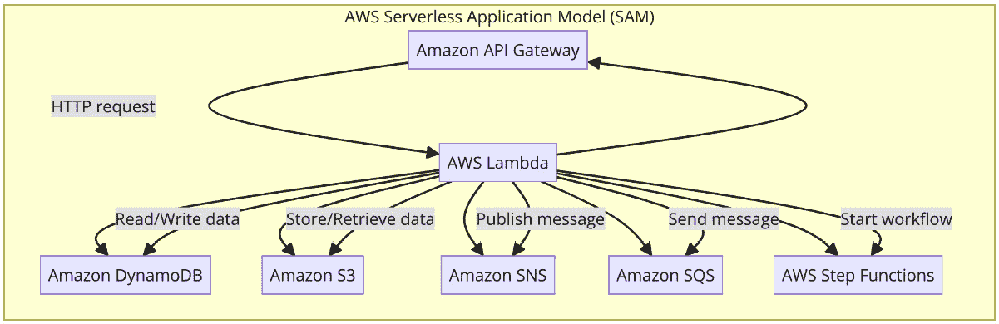
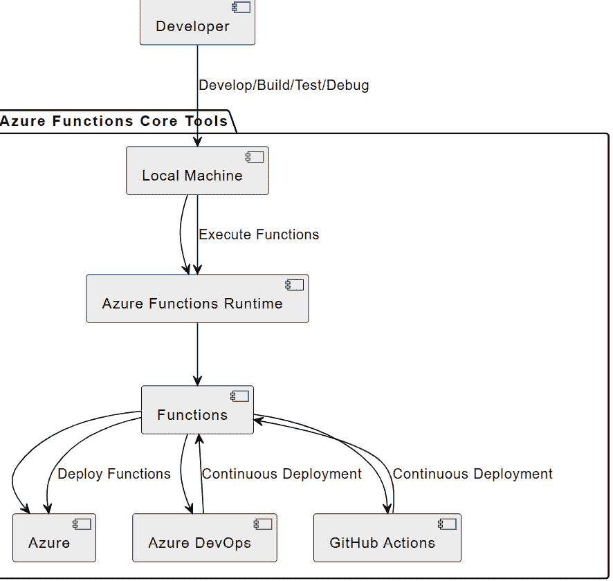
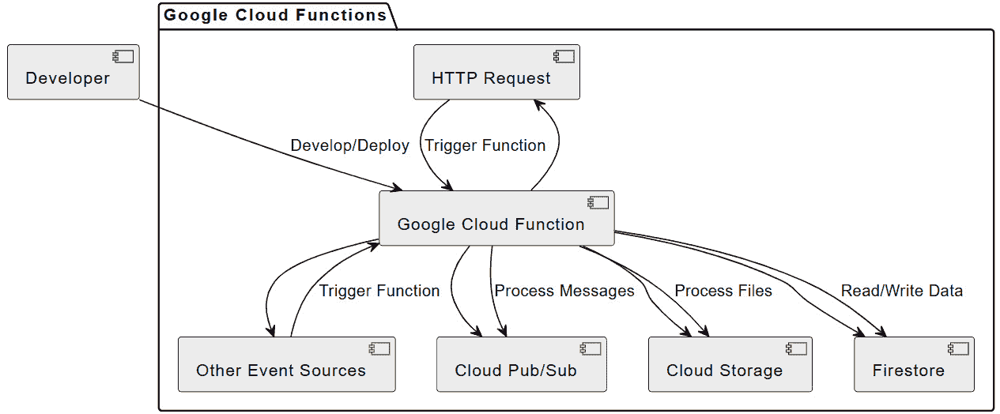
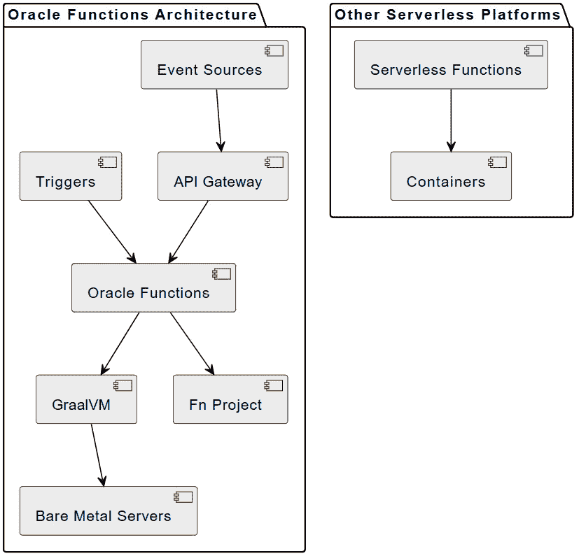
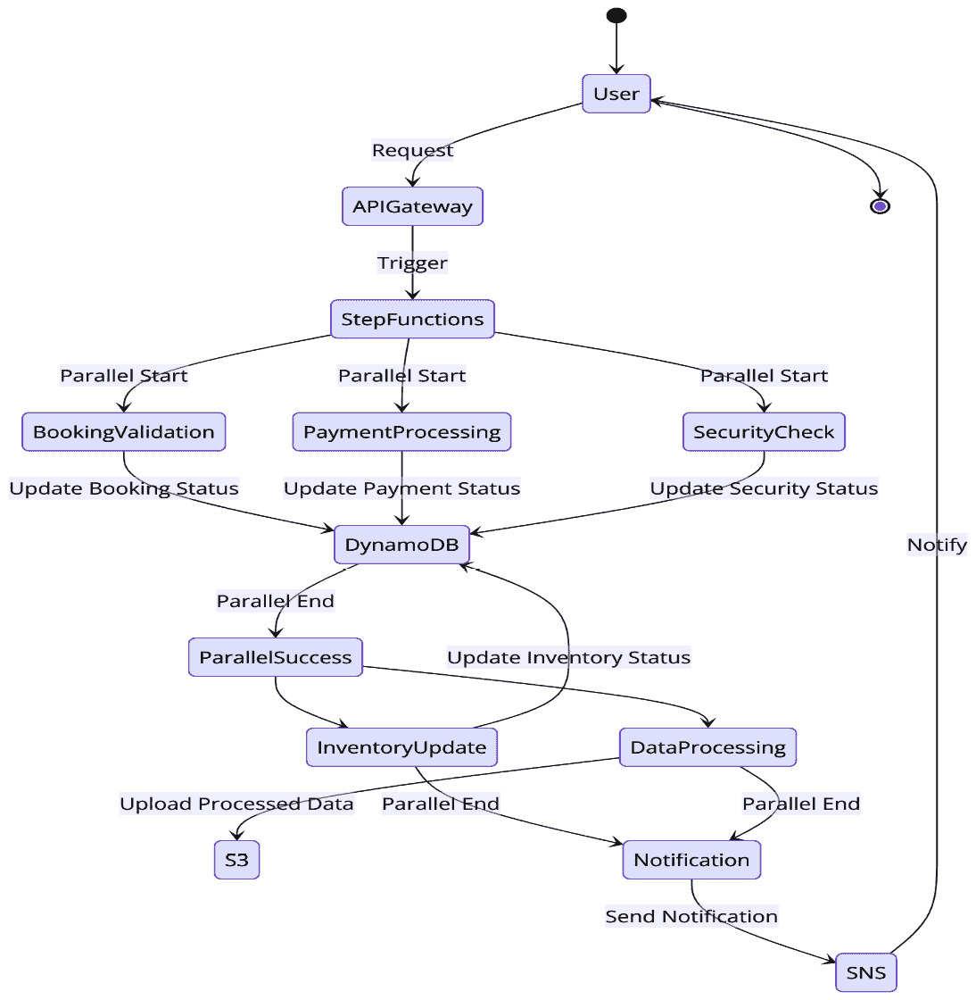

# 第九章：无服务器计算与 Java 的并发能力

无服务器计算彻底改变了应用程序的部署和管理，允许开发者专注于编写代码，而云服务提供商则处理底层基础设施。本章探讨了无服务器计算的基本要素以及 Java 的并发能力如何在此环境中有效利用。我们将深入研究无服务器计算的基本概念、其优势、特别有益的具体场景以及涉及的权衡。

无服务器架构在可扩展性、成本效益和降低运营成本方面提供了显著的好处，但同时也带来了冷启动延迟、资源限制和供应商锁定等挑战。了解这些权衡对于做出关于何时以及如何使用无服务器计算的明智决策至关重要。

本章将涵盖以下关键主题：

+   Java 无服务器计算基础

+   将 Java 的并发模型适配到无服务器环境中

+   介绍无服务器框架和服务：AWS SAM、Azure Functions Core Tools、Google Cloud Functions 和 Oracle Functions

+   专注于并发的 Java 无服务器函数的行业实例

+   使用无服务器框架构建的实际方法

我们将探讨如何将 Java 的并发功能适配到无服务器环境中，从而开发出可扩展且高效的应用程序。通过实际示例和代码片段，您将学习如何在 Java 无服务器应用程序中实现并发，利用 ExecutorService、CompletableFuture 和并行流等工具。

我们还将讨论优化 Java 无服务器应用程序的最佳实践，包括最小化冷启动、高效资源管理和利用 Spring Cloud Function、Micronaut 和 Quarkus 等框架。

到本章结束时，您将具备构建和优化基于 Java 的无服务器应用程序的知识，确保在各种云平台上实现高性能和响应性。

# 技术要求

您需要安装并配置 AWS **命令行界面**（**CLI**）：[`docs.aws.amazon.com/cli/latest/userguide/getting-started-install.html`](https://docs.aws.amazon.com/cli/latest/userguide/getting-started-install.html)。

这里是执行此操作的说明：

1.  访问官方 AWS CLI 安装页面。

1.  选择您的操作系统（Windows、Mac 或 Linux）并下载安装程序。

1.  运行安装程序并遵循屏幕上的说明。

1.  安装完成后，使用 aws configure 命令配置您的 AWS CLI 并提供凭证。您需要您的访问密钥 ID 和秘密访问密钥，这些可以在您的 AWS IAM 控制台中找到。

您还需要 AWS 无服务器应用程序模型 CLI 来部署无服务器应用程序：[`docs.aws.amazon.com/serverless-application-model/latest/developerguide/install-sam-cli.html`](https://docs.aws.amazon.com/serverless-application-model/latest/developerguide/install-sam-cli.html)。

下面是相应的说明：

1.  访问官方 AWS SAM CLI 安装页面。

1.  按照您操作系统的说明（Windows、Mac 或 Linux）进行操作。这通常涉及下载并运行脚本或安装程序。

1.  安装完成后，通过在终端中运行 sam --version 来验证安装。这应该会显示安装的 AWS SAM CLI 版本。

本章中的代码可以在 GitHub 上找到：

[`github.com/PacktPublishing/Java-Concurrency-and-Parallelism`](https://github.com/PacktPublishing/Java-Concurrency-and-Parallelism)

# Java 无服务器计算的基础

无服务器计算是一种云计算执行模型，它彻底改变了应用程序的开发和部署方式。在这个模型中，云服务提供商动态管理服务器的分配和配置，使得开发者可以专注于编写代码，无需担心底层基础设施。尽管应用程序仍然运行在服务器上，但这些服务器的管理，包括扩展和维护，完全由云服务提供商处理。这种方法与传统基于服务器的架构有显著的不同，在传统架构中，开发者负责管理和维护承载其应用程序的服务器。

## 无服务器计算的核心概念

无服务器架构围绕几个核心概念构建。其中一个关键概念是事件驱动方法，函数在响应各种触发器时执行，如 HTTP 请求、数据库事件和设备活动。这种模型特别适合 Java 开发者，因为 Java 的并发特性，如多线程和异步处理，与无服务器计算的事件驱动特性完美契合。此外，Java 广泛的库和工具生态系统增强了它与亚马逊 AWS Lambda、谷歌云和 Azure Functions 等提供商的云函数的集成。这些特性使 Java 成为开发可扩展和高效无服务器应用程序的强大选择。

另一个关键概念是无状态，这意味着函数通常在调用之间不保留任何状态。这使可扩展性达到高水平，因为多个函数实例可以并发运行而不相互干扰。然而，函数也可以通过使用外部数据源或服务（如 AWS Lambda 与外部数据库或 Kalix 用于有状态无服务器应用程序）来设计为有状态。无服务器平台还提供基于需求的自动扩展，消除了手动扩展的需要，并确保应用程序能够高效地处理可变的工作负载。

此外，无服务器计算通过将服务器和数据库管理等常规任务卸载给云服务提供商，简化了后端开发，使开发者能够专注于编写业务逻辑。最后，无服务器架构与微服务架构高度兼容，允许独立部署功能离散的部分。

传统上，Java 由于其冗长的语法和与 Python 或 JavaScript 等语言相比较慢的启动时间，并不是无服务器计算的首选。然而，Quarkus 和 Micronaut 等框架的最新发展显著降低了 Java 的启动时间和内存使用，提高了其在无服务器环境中的适用性。虽然 Spring Native 最初在这个领域显示出希望，但它已被弃用，转而采用集成到 Spring Boot 3+中的官方原生支持。Spring Boot 3+中的这一新原生支持提供了增强的功能和能力，使 Java 开发者能够创建高效、可扩展的无服务器应用程序，充分利用云原生架构的优势。

## 无服务器计算的优势和使用场景

无服务器计算提供了几个令人信服的优势，尤其是在可扩展性、成本效益和降低运营成本方面。

最显著的好处之一是增强了可扩展性。无服务器架构可以根据应用程序的需求即时自动扩展或缩减。这意味着在高峰流量期间，应用程序可以无缝地处理增加的负载，而无需任何人工干预。此外，无服务器函数的无状态特性允许它们并发和并行运行，从而实现高吞吐量和响应速度。

无服务器计算的另一个关键优势是成本效益。采用按使用付费的定价模式，您只需为函数在执行时间内的资源消耗付费。这消除了与闲置计算资源相关的成本，使其成为具有可变或间歇性工作负载的应用程序的有吸引力的选择。此外，无服务器计算可以通过最小化对持续服务器维护和管理的需求来降低总拥有成本。

无服务器计算提供了降低运营开销的潜力。通过将服务器管理任务，如维护、打补丁和扩展等任务外包给云服务提供商，开发者可以更多地关注代码和功能。部署流程通常简化，允许更快地更新和发布新功能，而无需直接管理基础设施。

然而，需要注意的是，无服务器架构可能会引入自己的复杂性。管理不同函数或服务的多个运行时可能需要额外的配置和监控。这对于大型应用程序尤其相关，因为在不同的环境中保持一致性可能变得具有挑战性。虽然无服务器平台通常提供内置的高可用性和容错功能，但确保应用程序的弹性可能仍然需要仔细的设计和优化。

此外，无服务器架构可以轻松集成到其他云服务中，并能够由这些服务的事件自动触发，从而创建高度响应的事件驱动应用程序和自动化工作流程。

总的来说，无服务器计算可以是一个强大的工具，但评估其是否适合您的特定用例以及了解涉及的潜在权衡是很重要的。

## 无服务器计算的优势和权衡

虽然无服务器计算提供了许多好处，但它也伴随着一些权衡和潜在的缺点，开发者必须考虑：

+   **冷启动**：最常被引用的缺点之一是冷启动延迟。当无服务器函数在一段时间的不活跃后调用时，它可能需要一些时间来初始化，导致响应时间延迟。这对于需要低延迟响应的应用程序来说可能特别有问题。

+   **资源限制**：无服务器平台对每个函数可用的执行时间、内存和计算资源施加限制。这些限制可能使得运行长时间运行的过程或计算密集型任务变得具有挑战性。

+   **供应商锁定**：使用无服务器架构通常会使开发者绑定到特定云服务提供商的生态系统，这使得在没有重大重做的情况下迁移应用程序到另一个提供商变得困难。

+   **调试和监控的复杂性**：与传统基于服务器的应用程序相比，调试无服务器函数可能更加复杂。无服务器函数的短暂性和它们分布式的执行环境可能会使调试过程变得复杂。此外，监控和维护多个无服务器函数的可观察性需要强大的工具和实践。

+   **状态管理**：无服务器函数本质上是无状态的，这可能会使跨多个调用管理应用程序状态变得复杂。开发者需要使用外部存储解决方案，如数据库或缓存服务来管理状态，这可能会引入额外的复杂性和延迟。

+   **成本效益**：虽然无服务器计算对于许多用例可能是成本效益的，但它可能并不总是最经济的选择。高频调用或具有持续流量的应用程序与预留实例或传统基于服务器的架构相比，可能会产生更高的成本。

+   **安全担忧**：无服务器计算中基础设施管理的抽象意味着开发者对底层环境的控制较少。这可能会引入安全担忧，因为云提供商基础设施中的漏洞或配置错误可能会影响应用程序。

## 何时使用无服务器？

结合之前概述的优势，以下是一些无服务器计算特别有益的场景：

+   **微服务架构**：采用微服务架构的应用程序，其中每个服务都是一个小型、可独立部署的单元。

+   **事件驱动应用程序**：响应各种事件（如数据流、用户操作或物联网信号）的系统。

+   **无状态处理**：执行无状态操作的应用程序，如图像处理、数据转换或**提取、转换、加载**（**ETL**）任务。

然而，需要注意的是，无服务器架构可能并不适合所有场景。以下是一些无服务器可能不是最佳选择的情况：

+   需要长时间运行的过程或高计算需求的应用程序

+   需要低延迟响应或具有严格性能要求的工作负载

+   需要维护服务器状态或具有复杂或状态化工作流程的应用程序

+   需要完全控制底层基础设施和操作系统的场景

在决定是否使用无服务器时，评估您特定的应用程序需求、可扩展性需求和成本考虑至关重要。无服务器在可扩展性、成本效率和开发敏捷性方面可以提供显著的好处，但重要的是要仔细评估它是否与您的应用程序特性和目标相匹配。

# 将 Java 的并发模型适应无服务器环境

无服务器计算对 Java 的传统并发模型提出了独特的挑战。无服务器函数的短暂和无状态特性要求从长期运行的线程池和共享可变状态转移到更动态和隔离的并发模式。在这种情况下，开发者必须专注于设计符合无服务器架构短暂、事件驱动特性的并发策略。

Java 中的有效无服务器并发围绕在严格的时间和资源约束内最大化函数效率。这涉及到利用异步操作，特别是通过 CompletableFuture 来处理非阻塞 I/O 任务并优化吞吐量。开发者应该构建代码以高效处理事件，这是无服务器设计的一个核心原则。

在无服务器函数中使用 CompletableFuture 进行异步处理时，考虑函数的执行时间限制至关重要。

这里有一个示例：

```java
public class ServerlessAsyncFunction implements RequestHandler<APIGatewayProxyRequestEvent, APIGatewayProxyResponseEvent> {
    @Override
    public APIGatewayProxyResponseEvent handleRequest(APIGatewayProxyRequestEvent input, Context context) {
        CompletableFuture<String> dbFuture = CompletableFuture.supplyAsync(this::queryDatabase);
        CompletableFuture<String> apiFuture = CompletableFuture.supplyAsync(this::callExternalAPI);
        try {
            String result = CompletableFuture.allOf(
                dbFuture, apiFuture)
                .thenApply(v -> processResults(
                    dbFuture.join(), apiFuture.join()))
                .get(context.getRemainingTimeInMillis(),
                    TimeUnit.MILLISECONDS);
            return new APIGatewayProxyResponseEvent(
                ).withStatusCode(200).withBody(result);
        } catch (TimeoutException e) {
            return new APIGatewayProxyResponseEvent(
                ).withStatusCode(408).withBody(
                    "Request timed out");
        } catch (Exception e) {
            return new APIGatewayProxyResponseEvent(
                ).withStatusCode(500).withBody(
                    "Internal error");
        }
    }
    private String queryDatabase() {
        // Database query logic
        return "Database result";
    }
    private String callExternalAPI() {
        // API call logic
        return "API result";
    }
    private String processResults(String dbResult, String
        apiResult) {
        // Processing logic
        return "Processed result: " + dbResult + ",
             " + apiResult;
    }
}
```

此演示展示了如何在无服务器函数中使用 `CompletableFuture` 进行异步处理。通过并发执行数据库查询和 API 调用，函数最小化了整体执行时间并提高了响应性。这在无服务器环境中尤其有益，因为减少执行时间可以导致成本降低和更好的可扩展性。

对于数据处理，虽然并行流可能有益，但在无服务器环境中，考虑权衡是很重要的：

```java
public class DataProcessingLambda implements RequestHandler<List<Data>, List<ProcessedData>> {
    @Override
    public List<ProcessedData> handleRequest(
        List<Data> dataList, Context context) {
            LambdaLogger logger = context.getLogger();
            logger.log("Starting data processing");
  // Use parallel stream only if the data size justifies it
            boolean useParallel = dataList.size() > 100;
// Adjust threshold based on your specific use case
            Stream<Data> dataStream = useParallel ? dataList.            parallelStream() : dataList.stream();
        List<ProcessedData> processedDataList = dataStream
                .map(this::processDataItem)
                .collect(Collectors.toList());
        logger.log("Data processing completed");
        return processedDataList;
    }
    private ProcessedData processDataItem(Data data) {
        // Ensure this method is thread-safe and efficient
        return new ProcessedData(data);
    }
}
```

此演示说明了在无服务器函数中使用 Java 的并行流处理大型数据集的方法。通过根据数据大小有条件地使用并行流，函数可以有效地利用多个 CPU 核心，并发处理数据。这种方法显著提高了大型数据集的性能，使函数在无服务器环境中更具可扩展性和响应性。

随着无服务器计算继续获得普及，Java 的并发特性将在使开发者能够构建可扩展、响应迅速且高性能的无服务器应用程序中发挥关键作用。为了进一步优化 Java 无服务器应用程序，让我们探讨设计和使用框架及库的最佳实践。

## 设计高效的 Java 无服务器应用程序

为了确保 Java 无服务器应用程序的性能和成本效益最佳，遵循设计最佳实践并利用适当的框架和库至关重要。以下是一些关键指南和建议：

+   **最小化冷启动**：冷启动发生在为无服务器函数分配新实例时。为了减少冷启动时间，开发者可以采用几种技术：

    +   **AWS Lambda SnapStart**：SnapStart 通过对初始化执行环境进行快照并在需要时恢复它来优化初始化过程，显著减少了冷启动延迟。要使用 SnapStart，请在您的 Lambda 函数配置中启用它，并确保您的代码与序列化兼容。

    +   **启用已配置并发性**：此功能通过预初始化实例来保持函数活跃，确保快速响应时间。根据预期的流量模式，在您的 Lambda 函数设置中配置已配置并发性。

    +   **使用自定义镜像优化 Java 虚拟机运行时**：例如 GraalVM Native Image 工具可以将 Java 应用程序编译成本地可执行文件，从而减少启动时间和内存消耗。要使用自定义镜像，请执行以下操作：

        +   使用 GraalVM Native Image 构建您的应用程序。

        +   使用 AWS Lambda Runtime Interface Client 创建自定义 Lambda 运行时。

        +   将您的本地可执行文件与自定义运行时打包在一起。

        +   将包作为 Lambda 函数部署。

+   **额外的优化**：

    +   在您的函数中尽量减少依赖以减小包大小

    +   对非必需资源使用懒加载

    +   实施缓存策略以处理频繁访问的数据

    +   优化您的代码以快速启动，尽可能将初始化逻辑移出处理器方法

+   **高效内存和资源管理**：

    +   **合理分配函数内存**：分配足够的内存以避免性能瓶颈，同时注意成本。

    +   **优化代码执行**：编写高效的代码以减少执行时间，避免在函数处理器中包含繁重的初始化逻辑。

    +   **连接池**：使用 Amazon RDS Proxy 有效地管理数据库连接，因为传统的连接池库，如 HikariCP，不建议用于无服务器使用。

+   **无状态设计**：设计函数为无状态，以确保可扩展性并避免状态管理问题。使用外部存储服务，如 Amazon **简单存储服务**（**S3**）、DynamoDB 或 Redis 进行状态持久化。

+   **高效的数据处理**：

    +   **使用流处理大量数据**：流处理有助于处理大型数据集，而无需将所有数据加载到内存中。Java 的 Stream API 对此很有用。

    +   **优化序列化**：使用高效的序列化库，如 Jackson 进行 JSON 处理，并优化序列化和反序列化过程。

+   **监控和日志记录**：

    +   **集成日志记录**：使用集中式日志服务，如 AWS CloudWatch Logs，并结构化日志以便于跟踪和调试。

    +   **性能监控**：工具如 AWS X-Ray 有助于跟踪和监控无服务器函数的性能。

### AWS Lambda 的 Java 特定优化技术

对于使用 AWS Lambda 的 Java 开发者来说，有多种技术可用于优化函数的运行时性能。这些技术可以帮助您最小化冷启动时间，减少内存使用，并提高整体执行速度：

+   **应用程序类数据共享（AppCDS）**：通过将加载类的元数据保存到存档文件中，从而在后续 JVM 启动时内存映射，提高启动时间和内存占用。

+   `-XX:+TieredCompilation -XX:TieredStopAtLevel=1`，以平衡启动时间和长期性能。

+   **利用 GraalVM 原生映像**：将 Java 应用程序编译成原生可执行文件可以显著减少冷启动时间和内存使用。

### 框架和库

**Spring Cloud Function** 通过允许开发者使用标准 Java 接口和 Spring 注解编写无服务器函数，简化了无服务器开发。这允许在本地创建、测试和部署，然后在各种云基础设施上无缝执行，无需修改代码。它支持事件驱动架构，处理触发器，如 HTTP 请求、消息队列和计时器，同时其函数的自动发现和注册简化了开发过程。

为了说明，考虑一个简单的 Spring Boot 应用程序：

```java
@SpringBootApplication
public class SpringFunctionApp {
    public static void main(String[] args) {
        SpringApplication.run(
            SpringFunctionApp.class, args);
    }    @Bean
    public Function<String, String> uppercase() {
        return value -> value.toUpperCase();
    }}
```

在此 Spring Boot 应用程序中，Spring Cloud Function 自动注册 `uppercase()` 方法作为函数。当触发时，Spring Cloud Function 将传入的请求映射到相应的函数，使用提供的输入执行它，并返回结果。这一抽象层允许无缝部署到各种无服务器环境，让开发者能够专注于业务逻辑。

**Micronaut**，以其快速的启动时间和最小的内存占用而闻名，是构建无服务器函数的理想选择。Micronaut 设计用于创建轻量级和模块化的 JVM 基于应用程序，与流行的无服务器平台无缝集成。

让我们看看一个简单的 Micronaut 函数：

```java
@FunctionBean("helloFunction")
public class HelloFunction extends FunctionInitializer implements Function<APIGatewayV2HTTPEvent, APIGatewayV2HTTPResponse> {
    @Override
    public APIGatewayV2HTTPResponse apply(
        APIGatewayV2HTTPEvent request) {
            return APIGatewayV2HTTPResponse.builder()
                    .withStatusCode(200)
                    .withBody("Hello World")
                    .build();
        }}
```

在此代码中，`@FunctionBean("helloFunction")` 注解指定了 `HelloFunction` 类作为 Micronaut 函数 bean。`HelloFunction` 类继承自 `FunctionInitializer` 并实现了 Function 接口，专门用于处理 API Gateway HTTP 事件 (`APIGatewayV2HTTPEvent`)。

重写的 `apply()` 方法高效地处理传入的请求，返回一个包含状态码 200 和正文 `"Hello World"` 的 `APIGatewayV2HTTPResponse`。这种设置使得函数的部署到各种无服务器平台变得简单，包括 AWS Lambda。

`GraalVM` 和 `OpenJDK HotSpot`。其设计优先考虑快速启动时间和低内存消耗，使其成为无服务器应用程序的一个有吸引力的选择。

让我们看看一个基本的 Quarkus 函数：

```java
public class GreetingLambda {
    public APIGatewayProxyResponseEvent handleRequest(
        APIGatewayProxyRequestEvent input) {
            return new APIGatewayProxyResponseEvent()
                .withStatusCode(200)
                .withBody("Hello, " + input.getBody());
```

此代码片段展示了使用 Quarkus 构建的函数。`GreetingLambda` 类具有一个 `handleRequest()` 方法，专门用于管理传入的 AWS API Gateway 请求 (`APIGatewayProxyRequestEvent`)。此方法处理请求并构建一个 `APIGatewayProxyResponseEvent`，返回一个状态码为 200 的响应，并包含一个结合请求体的个性化问候。

虽然此函数本质上是针对 AWS Lambda 部署而设计的，但要将其适配到 Azure Functions 或 Google Cloud Functions，则需要修改以适应这些平台处理 HTTP 请求的独特机制。

### AWS Lambda Java 库

亚马逊提供了一套专门为在 AWS Lambda 上构建无服务器应用程序设计的库 ([`docs.aws.amazon.com/lambda/latest/dg/lambda-java.html`](https://docs.aws.amazon.com/lambda/latest/dg/lambda-java.html))，这极大地简化了与其他 AWS 服务的集成过程。这些库针对简化 Lambda 函数的开发而定制，确保它们可以高效地与各种 AWS 资源和服务交互。

让我们考察一个简单的 AWS Lambda 函数：

```java
public class S3ObjectProcessor implements RequestHandler<S3Event, String> {
    @Override
    public String handleRequest(S3Event event,Context context){
        // Get the first S3 record from the event
        S3EventNotificationRecord record = event.getRecords().get(0);
        // Extract the S3 object key from the record
        String objectKey = record.getS3().getObject().getKey();
        // Log the object key
        context.getLogger().log(
            "S3 Object uploaded: " + objectKey);
        return "Object processed successfully: " + objectKey;
    }}
```

此代码演示了如何利用 AWS Lambda Java 库构建一个响应 S3 事件的 serverless 函数。`RequestHandler` 接口和 `S3Event` 类分别由 `aws-lambda-java-core` 和 `aws-lambda-java-events` 库提供。`context` 对象提供了 Lambda 函数的运行时信息和日志记录器。

通过遵循最佳实践并利用正确的框架和库，开发者可以构建高效且可扩展的 Java 无服务器应用程序。这些实践确保了降低延迟、优化资源使用和易于维护，而框架和库提供了强大的工具以简化开发和部署流程。展望未来，应用这些原则将有助于实现满足现代云计算需求的高性能无服务器应用程序。

# 引入无服务器框架和服务 - AWS SAM、Azure Functions Core Tools、Google Cloud Functions 和 Oracle Functions

为了有效地管理和在不同云平台上部署无服务器应用程序，了解 AWS、Azure 和 Google Cloud 提供的框架至关重要。这些框架简化了定义、部署和管理无服务器资源的过程，使开发者更容易构建和维护可扩展的应用程序。

## AWS 无服务器应用程序模型

AWS **无服务器应用程序模型**（**SAM**）是一个在 AWS 上构建无服务器应用程序的框架。它扩展了 AWS CloudFormation，提供了一种简化定义无服务器资源（如 AWS Lambda 函数、API Gateway API、DynamoDB 表等）的方法。这如图 *图 9.1* 所示：



图 9.1：AWS 无服务器应用程序模型

AWS SAM 框架图展示了使用 AWS 服务构建典型无服务器架构中涉及的交互和组件。以下是关键组件的分解：

+   **AWS Lambda**：一项无服务器计算服务。它允许您在不配置或管理服务器的情况下运行代码。

+   **Amazon API Gateway**：一项完全托管的服务，允许您创建 HTTP API，这些 API 作为无服务器应用程序的前门。客户端可以通过这些 API 调用您的 Lambda 函数。

+   **事件**：事件触发 Lambda 函数的执行。这些事件可以来自不同的来源：

    +   通过 API Gateway 的 HTTP 请求

    +   数据源（如 S3 存储桶或 DynamoDB 表）的变化

    +   基于时间的计划触发器

+   **Amazon DynamoDB**：一项用于存储和检索数据的 NoSQL 数据库服务。您的 Lambda 函数可以与 Amazon DynamoDB 交互以存储或检索数据。

+   **Amazon S3**：一项可扩展的对象存储服务。您的 Lambda 函数可以与 Amazon S3 交互以存储或检索文件。

+   **Amazon SNS/SQSimple**：**简单通知服务**（**SNS**）是一个发布/订阅消息传递服务，而**简单队列服务**（**SQS**）是一个消息队列服务。您的 Lambda 函数可以使用 SNS 将消息发布到 SQS 队列或订阅从它们接收消息。

+   **AWS Step Functions**：一个用于编排由多个 Lambda 函数组成的流程的服务。它允许您定义执行顺序并处理错误。

图*9*.1 展示了使用 AWS SAM 框架在 AWS 上构建的无服务器应用程序。用户通过 API 网关端点发起交互，然后这些请求被导向 AWS Lambda 函数。这些 Lambda 函数可以访问和处理来自各种来源的数据，例如 DynamoDB（数据库）、S3（存储）、SNS（消息传递）和 SQS（队列）。可选地，可以使用 AWS Step Functions 来编排涉及多个 Lambda 函数的复杂工作流程。通过利用 AWS SAM 及其模板，开发者可以在 AWS 上创建可扩展且成本效益高的无服务器应用程序。

SAM 还允许对 Lambda 函数进行本地测试。这是一个非常有用的功能，可以帮助开发者在将代码部署到生产环境之前进行调试和故障排除。本地测试 Lambda 函数有两种方式：使用 AWS 工具包或在调试模式下运行 AWS SAM。AWS 工具包是 IDE 插件，允许您设置断点、检查变量并逐行执行代码。SAM 还允许您在调试模式下运行 AWS SAM，以便连接到第三方调试器，如 ptvsd 或 Delve。

有关使用 SAM 进行本地测试的更多信息，请参阅 AWS 文档：[`docs.aws.amazon.com/serverless-application-model/latest/developerguide/serverless-sam-cli-using-debugging.html`](https://docs.aws.amazon.com/serverless-application-model/latest/developerguide/serverless-sam-cli-using-debugging.html)。

## Azure Functions 核心工具

此**命令行界面**（**CLI**）提供了一个本地开发环境，该环境模拟 Azure Functions 的运行时。它允许开发者在将函数部署到 Azure 之前，在自己的机器上构建、测试和调试它们。此外，**Azure Functions 核心工具**与 Azure DevOps 或 GitHub Actions 等工具的持续部署管道集成。让我们看看*图 9*.2：



图 9.2：Azure Functions 核心工具图

图*9*.2 说明了使用 Azure Functions 核心工具开发、测试和部署 Azure 函数所涉及的组件和工作流程。以下是详细描述：

+   **开发者**：开发者与本地机器交互，以开发、构建、测试和调试 Azure Functions。

+   **本地机器**：这是开发者安装 Azure Functions 核心工具的环境。它提供了一个本地开发环境，该环境模拟 Azure Functions 的运行时。

+   **Azure Functions Runtime**：此组件在本地机器上模拟 Azure Functions 运行时，允许开发者在将函数部署到 Azure 之前在本地执行和测试函数。

+   **函数**：这些是由开发者创建和管理的单个函数。它们由 Azure Functions 运行时执行，并可以部署到 Azure。

+   **Azure**：这代表函数部署的 Azure 云环境。一旦函数在本地测试通过，它们就会被部署到 Azure 以用于生产。

+   **Azure DevOps**：这是一套用于管理整个应用程序生命周期的开发工具和服务。它与 Azure Functions Core Tools 集成，以启用函数的持续部署到 Azure。

+   **GitHub Actions**：这是 GitHub 提供的 **持续集成**（**CI**）和 **持续部署**（**CD**）平台。它与 Azure Functions Core Tools 集成，以自动化函数的 Azure 部署。

*图 9*.2*表示使用 Azure Functions Core Tools 进行本地开发、测试和持续部署 Azure Functions 的完整工作流程。

## Google Cloud Functions

**Google Cloud Functions** 是一种轻量级的、事件驱动的计算服务，允许您在事件发生时运行代码。它旨在通过简单、单功能的函数构建和连接云服务，如*图 9*.3*所示：



图 9.3：Google Cloud Functions

*图 9*.3*展示了 Google Cloud Functions 的架构，展示了其组件及其交互。Google Cloud Functions 是无服务器函数驻留的核心组件。这些函数可以被各种 **事件源**触发，如下所示：

+   **HTTP 请求**：函数可以被 HTTP 请求触发，从而实现基于 Web 的交互

+   **云 Pub/Sub**：函数可以处理 Cloud Pub/Sub（一种允许您在独立应用程序之间发送和接收消息的消息服务）的消息。

+   **云存储**：函数可以被云存储中的事件触发，例如文件创建、修改或删除

+   **Firestore**：函数可以与 Firestore（一个 NoSQL 文档数据库）交互，以读取和写入数据

+   **其他事件源**：函数还可以由其他支持的事件源触发，提供了处理各种类型事件时的灵活性

这种架构允许开发者使用无服务器函数构建事件驱动的应用程序，消除了管理服务器基础设施的需要。它与各种 Google Cloud 服务无缝集成，为运行事件驱动代码提供了一个可扩展和灵活的环境。

## Oracle Functions

**Oracle Functions** 是一个完全管理的无服务器平台，允许您运行代码而无需配置或管理服务器。



图 9.4：Oracle Functions

*图 9**.4* 展示了 Oracle Functions 的架构，突出了关键组件：

+   **Oracle Functions**：基于开源 Fn Project 构建的核心无服务器计算服务

+   **GraalVM**：高性能运行环境以其出色的冷启动性能而闻名

+   **裸金属服务器**：增强性能和可预测性的基础基础设施

+   **API 网关**：管理和路由传入请求到适当的函数

+   **事件源和触发器**：函数执行的多种来源和激活器

关键优势包括以下内容：

+   **性能**：在裸金属服务器上运行的 GraalVM 减少了冷启动时间并提高了整体函数性能

+   **灵活性**：通过 API 网关和多样化的事件源实现灵活的函数触发和管理

+   **效率**：通过避免容器开销实现更好的资源利用

与传统无服务器架构的主要区别如下：

+   **运行时**：使用 GraalVM 而不是传统的 JVM 运行时

+   **部署**：函数在裸金属服务器上运行，而不是虚拟化环境或容器中

+   **架构**：是容器原生但无容器，避免了常见的容器开销

+   **基础**：基于开源 Fn Project，与许多专有产品不同

这些特性有助于 Oracle Functions 专注于高性能和效率，尤其是在冷启动时间和资源利用方面。

Oracle Functions 的裸金属部署在性能关键场景中表现出色，在这些场景中，速度和可预测的延迟是首要任务。然而，对于成本敏感的应用，容器化选项如 AWS Lambda 可能更具吸引力。如果您在 Java 工作负载中优先考虑冷启动，由 GraalVM 支持的 Oracle Functions 可能具有潜在优势。对于处理高度敏感数据的应用程序，裸金属的隔离可能更可取。

# 行业案例 – 专注于并发的 Java 无服务器函数

让我们深入了解一些公司如何使用 Java 无服务器函数以及它们如何在应用程序中处理并发的真实世界案例。我们将探讨行业案例，提取宝贵的经验教训，并检查代码示例，以了解在考虑并发的情况下实现 Java 无服务器应用程序的实际方面。

## Airbnb – 使用无服务器解决方案优化房产列表

Airbnb，领先的在线住宿和体验市场，采用无服务器架构来增强房产列表和用户交互的管理。Airbnb 使用 AWS Lambda 来实现这一点：

+   **图像处理**：当托管方上传其房产的图像时，AWS Lambda 函数被触发以处理和优化图像，以适应各种设备格式和分辨率。这项任务以并发方式执行，以有效地处理*多个* *上传*。

+   **搜索索引**：AWS Lambda 函数在新的属性被列出或现有的属性被更新时实时更新搜索索引。这确保了用户能够接收到最准确和最新的搜索结果。

通过利用 AWS Lambda，Airbnb 确保其无服务器架构中的高性能、灵活性和可靠性。图像处理和搜索索引快速高效地执行，提升了用户体验。独立部署和更新无服务器函数的能力允许快速迭代和部署新功能。此外，无服务器函数提供高可用性和容错性，为用户保持无缝体验。

## LinkedIn – 利用无服务器架构增强数据处理

世界上最大的职业社交网络 LinkedIn 利用无服务器架构来管理和处理由用户交互、职位发布和内容共享产生的大量数据。LinkedIn 利用 Azure Functions 来高效地处理这些任务：

+   **实时通知**：LinkedIn 使用 Azure Functions 来处理实时通知。当用户收到连接请求或消息时，一个事件触发 Azure Functions 来及时处理和发送通知。

+   **数据分析**：Azure Functions 实时处理数据流，汇总指标并生成洞察。这使得 LinkedIn 能够向用户提供其个人资料的最新分析，例如资料查看和搜索出现次数。

Azure Functions 使 LinkedIn 能够在其无服务器架构中实现可扩展性、效率和成本效益。Azure Functions 的自动扩展功能确保 LinkedIn 能够处理数百万并发用户交互。无服务器函数减少了基础设施管理开销，使 LinkedIn 的工程团队能够专注于开发新功能。此外，按使用付费的定价模型有助于在流量波动期间优化成本。

## Expedia – 使用无服务器解决方案简化旅行预订

全球旅行预订平台 Expedia 利用基于 Java 的 AWS Lambda 函数来处理其服务的各个方面，确保其平台上的高效和可靠运行：

+   **预订确认**：AWS Lambda 函数实时管理预订确认。当用户完成预订时，一个事件触发 Lambda 函数来确认预订、更新库存并通知用户。

+   **价格聚合**：Expedia 使用 Lambda 从多家航空公司和酒店同时聚合价格。这确保了用户能够实时获得最具竞争力的价格，提升了预订体验。

+   **用户通知**：Lambda 函数向用户发送个性化的通知，包括更新、提醒和特别优惠。

AWS Lambda 使 Expedia 能够在其无服务器架构中实现可扩展性、效率和改进的用户体验。AWS Lambda 的自动扩展功能允许 Expedia 无缝处理预订量的高峰。无服务器函数通过同时处理多个数据源来简化复杂流程，例如价格聚合。实时通知和确认增强了整体用户体验，为旅行者提供及时和相关的信息。

这些案例研究展示了行业领导者如何利用无服务器架构和并发管理来优化其应用程序。通过采用无服务器解决方案，公司可以在各自的领域实现可扩展性、效率、成本效益和增强的用户体验。

# 使用无服务器框架构建——一种实用方法

无服务器框架是开发者的工具箱，用于构建高效且健壮的无服务器应用程序。这些框架超越了云提供商提供的核心计算服务，提供了一套全面的工具和功能。在本节中，我们将深入了解无服务器框架的重要性以及它们如何简化开发过程。为了巩固这一理解，我们将通过代码演示探索一个真实世界的例子。具体来说，我们将看到 AWS SAM 如何简化在 AWS 上定义和部署无服务器应用程序。在本节结束时，您将能够在自己的项目中利用无服务器框架的力量！

## 使用 AWS SAM 定义和部署无服务器应用程序

我们将设计一个全球旅行预订平台的模拟，该平台利用基于 Java 的 AWS Lambda 函数来处理其服务的各个方面。这包括预订验证、支付处理、安全检查、库存更新、数据处理和用户通知。我们将使用 AWS Step Functions 来编排这些任务，使用 DynamoDB 进行数据存储，使用 AWS Cognito 进行安全检查，以及使用 API Gateway 来公开端点。

请查看*图 9**.5*：



图 9.5：全球旅行预订系统

为了完成这项任务，我们将在无服务器架构中使用 AWS 云服务。我们的方法涉及使用 AWS Step Functions 协调多个 Lambda 函数，这是一个旨在编排复杂工作流的服务。这使得我们能够定义每个函数的执行顺序，并优雅地处理潜在的错误。

在我们的旅行预订系统中，几个专门的 Lambda 函数在*Step Functions*工作流程中协作。这些函数包括`BookingValidationFunction`、`PaymentProcessingFunction`、`SecurityCheckFunction`、`InventoryUpdateFunction`、`DataProcessingFunction`和`SendNotificationFunction`。每个函数处理预订过程中的特定步骤。在本节中，我们将重点关注`BookingValidationFunction`作为示例。此函数的 Java 代码如下，而其余函数的代码可以在 GitHub 存储库中找到。

通过使用 Step Functions，我们获得了创建更健壮和可管理的系统的能力。Step Functions 简化了错误处理，提供了对工作流程进度的可见性，并使我们能够自动重试失败的步骤。这导致了一个更可靠和可扩展的解决方案，用于管理旅行预订过程的复杂性。

`BookingValidationFunction`负责验证预订请求数据，确保所有必需字段和数据格式都是正确的。它还通过查询 DynamoDB 表来验证请求的项目或日期的可用性。

下面是`BookingValidationFunction`的 Java 代码：

```java
public class BookingValidationFunctionApplication {
    public static void main(String[] args) {
        SpringApplication.run(
            BookingValidationFunctionApplication.class,
                args);
    }    @Bean
    public Function<Map<String, Object>, Map<String, Object>>     bookingValidation() {
        return input -> {
            Map<String, Object> response =new HashMap<>();
            // Validate booking details
            if (validateBooking(input)) {
                // Update DynamoDB with booking status
                if (verifyAvailability(input)) {
                    response.put(
                        "status", "Booking Validated");
                } else {
                    response.put("status",
                        "Booking Not Available");
                }            } else {
                response.put("status",
                    "Invalid Booking Data");
            }return response;
        };}
private boolean validateBooking(Map<String,Object> input) {
        // Implement validation logic: check for required fields and         data format
        // Example validation
        return input.containsKey(
            "bookingDate") && input.containsKey("itemId");
    }private boolean verifyAvailability(Map<String, Object> input) {
        // Implement availability check logic by querying the         BookingTable in DynamoDB
        // This is a placeholder for actual DynamoDB query logic
        // Example query
        String bookingDate = (String) input.get(
            "bookingDate");
        String itemId = (String) input.get("itemId");
        // Assume a service class exists to handle DynamoDB operations
        // return bookingService.isAvailable(bookingDate,
           itemId);
        // For the sake of example, let's assume all bookings are         available
        return true;
    }}
```

BookingValidationFunctionApplication 是一个 Spring Boot 应用程序，作为验证预订详情的无服务器函数。

被`@Bean`注解的`bookingValidation()`方法是根据输入数据验证预订详情的主要功能。它检查所需字段的是否存在，通过查询 DynamoDB 中的`BookingTable`（占位符逻辑）来验证预订的可用性，并返回包含验证状态的响应映射。

该类还包括用于实现验证逻辑的占位符方法`validateBooking()`和可用性检查逻辑`verifyAvailability()`。

接下来，我们在 CloudFormation 模板中创建必要的资源。DynamoDB 表`BookingTable`和`InventoryTable`分别存储和管理预订和库存数据，从而实现与旅行预订和可用库存项目相关的信息的有效和可扩展的持久化。

```java
        # DynamoDB Tables
BookingTable:
    Type: AWS::DynamoDB::Table
    Properties:
        TableName: BookingTable
        AttributeDefinitions:
              - AttributeName: BookingId
              AttributeType: S
        KeySchema:
            - AttributeName: BookingId
              KeyType: HASH
        ProvisionedThroughput:
            ReadCapacityUnits: 5
            WriteCapacityUnits: 5
InventoryTable:
    Type: AWS::DynamoDB::Table
    Properties:
        TableName: InventoryTable
        AttributeDefinitions:
            - AttributeName: ItemId
            AttributeType: S
        KeySchema:
            - AttributeName: ItemId
            KeyType: HASH
        ProvisionedThroughput:
            ReadCapacityUnits: 5
            WriteCapacityUnits: 5
```

在我们的无服务器架构中，我们使用 Amazon Cognito 来处理用户身份验证和授权。Cognito 是一个完全托管的服务，允许您轻松地将用户注册、登录和访问控制添加到您的 Web 和移动应用程序中。

在我们的案例中，我们将创建一个 Cognito 用户池（`CognitoUserPool`）。这个用户目录作为我们应用程序用户身份的中心存储库。当用户注册或登录时，Cognito 安全地存储他们的信息并处理身份验证过程。它提供了以下功能：

+   **用户管理**：创建、读取、更新和删除用户资料

+   **身份验证**：验证用户凭据并颁发安全令牌（例如，JWTs）以进行访问

+   **安全**：强制执行密码策略、多因素认证（MFA）和其他安全措施

+   **授权**：根据用户属性或组定义细粒度的访问控制

+   **联邦**：与外部身份提供者（如 Facebook、Google 或企业身份系统）集成

通过利用 Cognito，我们可以卸载用户管理的复杂性，专注于构建旅行预订应用程序的核心功能：

```java
# Cognito User Pool
CognitoUserPool:
    Type: AWS::Cognito::UserPool
    Properties:
        UserPoolName: TravelBookingUserPool
```

数据处理完成后，处理后的数据上传到 `ProcessedDataBucket`，这是一个 S3 存储桶：

```java
# S3 Bucket for processed data
ProcessedDataBucket:
    Type: AWS::S3::Bucket
    Properties:
        BucketName: processed-data-bucket
```

创建一个名为 `BookingNotificationTopic` 的 Amazon SNS 主题，以方便发送与预订事件相关的通知：

```java
# SNS Topic for notifications
BookingNotificationTopic:
    Type: AWS::SNS::Topic
    Properties:
        TopicName: BookingNotificationTopic
```

定义一个 AWS `LambdaExecutionRole`，为 Lambda 函数提供必要的权限，以便访问和交互各种 AWS 服务，例如 DynamoDB、S3、SNS 和 Cognito：

```java
# IAM Role for Lambda
LambdaExecutionRole:
    Type: AWS::IAM::Role
    Properties:
        AssumeRolePolicyDocument:
            Version: '2012-10-17'
            Statement:
                - Effect: Allow
            Principal:
                Service: lambda.amazonaws.com
                Action: sts:AssumeRole
        Policies:
            - PolicyName: LambdaPolicy
            PolicyDocument:
                Version: '2012-10-17'
            Statement:
                - Effect: Allow
                Action:
                    - dynamodb:PutItem
                    - dynamodb:GetItem
                    - dynamodb:UpdateItem
                    - s3:PutObject
                    - sns:Publish
                    - cognito-idp:AdminGetUser
                Resource: '*'
```

为每个 Lambda 函数指定函数名称、处理程序、运行时和代码位置（S3 存储桶和键）。为每个 Lambda 函数指定函数名称、处理程序、运行时和代码位置（S3 存储桶和键）：

```java
# Lambda Functions
BookingValidationFunction:
    Type: AWS::Lambda::Function
    Properties:
        FunctionName: BookingValidationFunction
        Handler: com.example.BookingValidationFunctionApplication::apply
        Role: !GetAtt LambdaExecutionRole.Arn
        Runtime: java17
        Code:
               S3Bucket: your-s3-bucket-name
 S3Key: booking-validation-1.0-SNAPSHOT.jar
```

对于其他每个 Lambda 函数（`PaymentProcessingFunction`、`SecurityCheckFunction`、`InventoryUpdateFunction`、`DataProcessingFunction` 和 `SendNotificationFunction`），你将在 CloudFormation 模板的 `Resources` 部分中编写类似的定义，调整 `FunctionName`、`Handler`、`CodeUri` 和 `Policies` 属性以匹配各自的实现。

接下来，我们在 CloudFormation 模板中创建 Step Functions 状态机。使用 `AWS::StepFunctions::StateMachine` 资源类型，并在 `DefinitionString` 属性中使用 Amazon States Language 定义状态机定义：

```java
# Step Function
TravelBookingStateMachine:
    Type: AWS::StepFunctions::StateMachine
    Properties:
        StateMachineName: TravelBookingStateMachine
        RoleArn: !GetAtt LambdaExecutionRole.Arn
        DefinitionString: !Sub |
            {"Comment": "Travel Booking Workflow",
            "StartAt": "ParallelTasks",
            "States": {
                "ParallelTasks": {
                "Type": "Parallel",
                "Branches": [
                    {"StartAt": "BookingValidation",
                        "States": {
                        "BookingValidation": {
                        "Type": "Task",
                    "Resource": "${
                        BookingValidationFunction.Arn}",
                        "End": true
                    }
                }
            },
            {"StartAt": "PaymentProcessing",
                "States": {
                    "PaymentProcessing": {
                        "Type": "Task",
                        "Resource": "${
                        PaymentProcessingFunction.Arn}",
                        "End": true
                    }
                }
            },
            {"StartAt": "SecurityCheck",
                "States": {
                    "SecurityCheck": {
                        "Type": "Task",
                        "Resource": "${
                            SecurityCheckFunction.Arn}",
                        "End": true
                    }
                }
            }
          ],
            "Next": "InventoryUpdate"
            },
            "InventoryUpdate": {
                "Type": "Task",
                "Resource": "${
                    InventoryUpdateFunction.Arn}",
                "Next": "DataProcessing"
            },
            "DataProcessing": {
                "Type": "Task",
                "Resource": "${
                    DataProcessingFunction.Arn}",
                "Next": "SendNotification"
            },
            "SendNotification": {
                "Type": "Task",
                "Resource": "${
                    SendNotificationFunction.Arn}",
                "End": true
            }
        }
    }
```

此 AWS Step Functions 状态机定义描述了旅行预订系统的流程。该流程从三个任务的并行执行开始："BookingValidation"、"PaymentProcessing" 和 "SecurityCheck"。这些任务通过使用单独的 Lambda 函数同时执行。

并行任务完成后，工作流程继续到 `"InventoryUpdate"` 任务，该任务使用 `"InventoryUpdateFunction"` Lambda 函数更新库存。

接下来，使用 `"DataProcessingFunction"` Lambda 函数执行 `"DataProcessing"` 任务，以进行任何必要的数据处理。

最后，触发 `"SendNotification"` 任务，该任务使用 `"SendNotification Function"` Lambda 函数向用户发送通知。

状态机定义利用之前创建的 Lambda 函数，并指定这些任务执行的流程和顺序。这为处理旅行预订提供了一个结构化和协调的工作流程。

以下代码为旅行预订应用程序设置 API 网关：

```java
 API Gateway
TravelBookingApi:
    Type: AWS::ApiGateway::RestApi
    Properties:
        Name: TravelBookingApi
TravelBookingResource:
    Type: AWS::ApiGateway::Resource
    Properties:
        ParentId: !GetAtt TravelBookingApi.RootResourceId
        PathPart: booking
        RestApiId: !Ref TravelBookingApi
TravelBookingMethod:
    Type: AWS::ApiGateway::Method
    Properties:
        AuthorizationType: NONE
        HttpMethod: POST
        ResourceId: !Ref TravelBookingResource
        RestApiId: !Ref TravelBookingApi
        Integration:
            IntegrationHttpMethod: POST
            Type: AWS_PROXY
            Uri: !Sub "arn:aws:apigateway:us-west-2:states:action/StartExecution"
```

`TravelBookingApi` 资源创建了一个名为 `TravelBookingApi` 的新 REST API。现在，`TravelBookingResource` 在此 API 下定义了一个新的资源路径 `/booking`。`TravelBookingMethod` 为 `/booking` 资源设置了一个 `POST` 方法，该方法与 AWS Step Functions 集成以启动旅行预订工作流程执行。

将 Java 代码和 CloudFormation 堆栈部署（准备您的环境）。确保您有一个 AWS 账户，并且有创建资源（如 DynamoDB 表、API Gateway、Lambda 函数、IAM 角色 等）所需的必要权限。

如果您还没有安装和配置 AWS CLI，请查阅[`docs.aws.amazon.com/cli/latest/userguide/cli-chap-configure.html`](https://docs.aws.amazon.com/cli/latest/userguide/cli-chap-configure.html)中的说明。

将 Lambda 函数代码打包成 JAR 文件，并上传到 S3 桶中。请注意 S3 桶的名称以及存储 JAR 文件的键（路径）。在运行 CloudFormation 脚本时需要这些信息。

之后，修改 CloudFormation 脚本。确保 `S3Bucket: !Ref Bucket Name` 和 `S3Key: booking-validation-1.0-SNAPSHOT.jar` 参数值与存储您的 Lambda 代码的 S3 桶名称和 JAR 文件名称匹配。

运行 CloudFormation 脚本。将 CloudFormation 脚本保存到文件中，例如，`travel-booking-template.yaml`。

打开终端或命令提示符。运行以下命令以创建一个新的 CloudFormation 堆栈：

```java
aws cloudformation create-stack --stack-name TravelBookingStack --template-body file://travel-booking-template.yaml --parameters ParameterKey=BucketName,ParameterValue=YOUR_S3_BUCKET_NAME
```

将 `YOUR_S3_BUCKET_NAME` 替换为您的 S3 桶的实际名称，并将 `stack-name` 替换为您的堆栈名称。

`--parameters` 标志用于将参数传递给 CloudFormation 模板。参数在模板中定义，允许您在堆栈创建时提供动态值。在这种情况下，`--parameters` 标志用于指定存储 Lambda 代码的 S3 桶名称。

您可以在 AWS 管理控制台中的 CloudFormation 下监控堆栈创建的进度。或者，您可以使用 AWS CLI 检查状态：

```java
aws cloudformation describe-stacks --stack-name TravelBookingStack
```

将堆栈名称 `TravelBookingStack` 替换为您的堆栈名称。

一旦堆栈创建完成，请验证所有资源（DynamoDB 表、API Gateway、Lambda 函数、IAM 角色 等）是否已成功创建。您可以通过 AWS 管理控制台中的每个服务来检查资源。

资源部署完成后，您可以测试 API Gateway 端点。API Gateway URL 可在 CloudFormation 堆栈的输出部分或 AWS 管理控制台中的 API Gateway 服务中找到。

我们可以使用 curl 或 Postman 等工具测试 API Gateway。

首先，我们使用 curl：

```java
curl -X POST https://YOUR_API_GATEWAY_URL/booking -d '{"bookingId": "12345", "itemId": "item123", "quantity": 1, "paymentToken": "token123", "amount": "100"}'
```

将 `YOUR_API_GATEWAY_URL` 替换为您的 API Gateway 实例的实际 URL。

接下来，我们使用 Postman：

+   将 HTTP 方法设置为 `POST`

+   输入您的 API 网关的 URL，后跟 `/booking`

+   在请求体中，使用原始 JSON 提供所需的预订详情。以下是一个 JSON 有效负载的示例：

```java
{  "bookingId": "12345",
  "itemId": "item123",
  "quantity": 1,
  "paymentToken": "token123",
  "amount": 100,
  "customerName": "John Doe",
  "customerEmail": "john.doe@example.com"
}
```

删除 CloudFormation 堆栈将删除堆栈创建的所有资源，有助于避免不必要的成本和资源使用。要删除 CloudFormation 堆栈创建的资源，请运行以下命令：

```java
aws cloudformation delete-stack --stack-name TravelBookingStack
```

将堆栈名称`TravelBookingStack`替换为您自己的堆栈名称。

本节探讨了用于构建旅行预订应用的无服务器框架。我们强调了它们的优点以及它们如何简化开发。关键要点如下：

+   无服务器框架通过综合工具简化了开发

+   我们使用 Spring Cloud Function 构建了一个基于 Java 的预订验证函数

+   AWS Step Functions 在预订工作流程中编排任务

+   我们探讨了将 DynamoDB、Cognito、API Gateway 和其他 AWS 服务集成

通过理解这些概念，您将能够利用无服务器框架构建高效的旅行预订应用，并探索这些框架和 AWS 服务提供的进一步功能。

# 摘要

在本章中，我们探讨了无服务器计算及其与 Java 并发能力的集成。我们检查了无服务器架构的核心概念，包括事件驱动处理、无状态和自动扩展，以及它们的优点和潜在缺点。理解这些概念对于在您的应用程序中有效地利用无服务器计算至关重要。

我们讨论了将 Java 的并发模型适应无服务器环境，重点关注 CompletableFuture 和并行流等工具。我们强调了 Java 无服务器应用程序的最佳实践，包括最小化冷启动、高效资源管理和利用 Spring Cloud Function、Micronaut 和 Quarkus 等框架的策略。

本章介绍了主要的无服务器平台，如 AWS SAM、Azure Functions Core Tools、Google Cloud Functions 和 Oracle Functions，突出了它们的独特功能和如何简化无服务器应用程序的开发和部署。我们探讨了针对 Java 的优化技术，以增强无服务器环境中的性能并减少延迟。

通过 Airbnb、LinkedIn 和 Expedia 等公司的实际案例，我们看到了无服务器架构和并发管理的实际应用。这些案例研究说明了行业领导者如何利用无服务器解决方案实现可扩展性、效率和提升用户体验。

最后，我们提供了一个使用 AWS SAM 构建旅行预订应用的动手示例，展示了如何集成各种 AWS 服务并使用 AWS Step Functions 编排工作流程。这种实用方法使您能够有效地部署和管理无服务器应用程序。

到本章结束时，你应该能够充分利用 Java 的并发功能，应用优化最佳实践，并在项目中使用无服务器架构做出明智的决定。

随着我们从无服务器架构过渡到更广泛的云计算范式，下一章将探讨现代应用程序开发的另一个关键方面：自动扩展。*第十章* 将深入探讨同步 Java 的并发模型与云自动扩展动态，基于我们讨论的并发编程概念，并将它们应用于云环境的弹性特性。对于希望创建健壮、可扩展的 Java 应用程序，能够高效适应云平台中不同工作负载的开发者来说，这些知识将是必不可少的。

# 问题

1.  与传统的基于服务器的架构相比，无服务器计算的主要优势是什么？

    1.  更高的服务器管理开销

    1.  资源的手动扩展

    1.  自动扩展和降低运营开销

    1.  与云服务的集成有限

1.  哪个 Java 并发特性特别适用于在无服务器函数中执行异步任务？

    1.  **Java 虚拟** **机** (**JVM**)

    1.  CompletableFuture

    1.  **Java 数据库** **连接** (**JDBC**)

    1.  JavaBeans

1.  Fork/Join 框架在 Java 无服务器应用程序中的主要目的是什么？

    1.  加密数据传输

    1.  处理单线程操作

    1.  通过将任务划分为更小的子任务来管理递归任务

    1.  记录和错误处理

1.  以下哪项最佳实践有助于最小化 Java 无服务器应用程序的冷启动？

    1.  使用最重的部署包

    1.  优化函数大小并使用预配并发

    1.  避免使用任何形式的并发

    1.  启用所有可能的云服务

1.  使用并行流在无服务器 Java 函数中的关键好处是什么？

    1.  阻塞所有任务的主线程

    1.  通过并发数据处理提高性能

    1.  简化部署过程

    1.  减少错误处理的需求

# 第三部分：在云中掌握并发——最后的边疆

随着我们通过 Java 并发景观的旅程达到高潮，*第三部分* 探讨了在云环境中并发编程最先进和前瞻性的方面。本节综合了之前章节中获得的知识，将其应用于云计算的前沿领域以及更远的地方。

每一章都提供了实用的、现实世界的例子和用例，使读者能够以创新的方式应用书中早期部分的概念。随着我们进入总结阶段，*第三部分* 为读者提供了愿景和工具，使他们能够在云计算时代及其之后的前沿并发编程中处于领先地位，将他们从熟练的开发者转变为 Java 并发的大师。

本部分包括以下章节：

+   *第十章*, *同步 Java 并发与云自动扩展动态*

+   *第十一章*, *云计算中的高级 Java 并发实践*

+   *第十二章*, *未来的展望*
