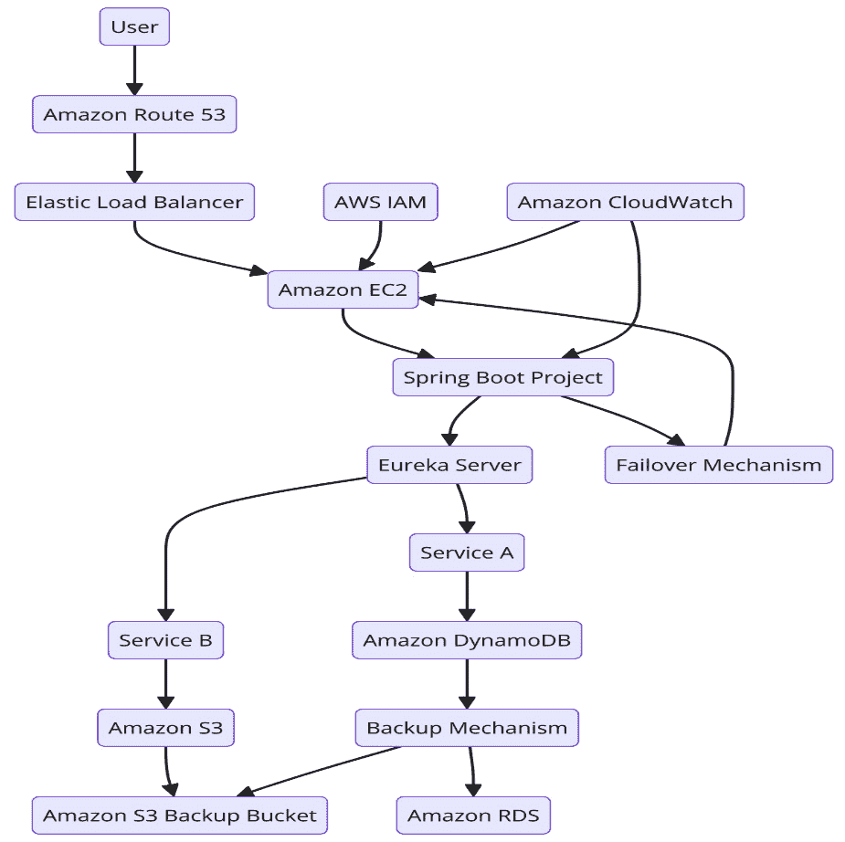
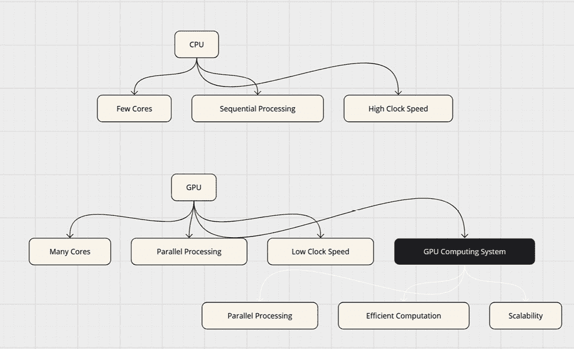
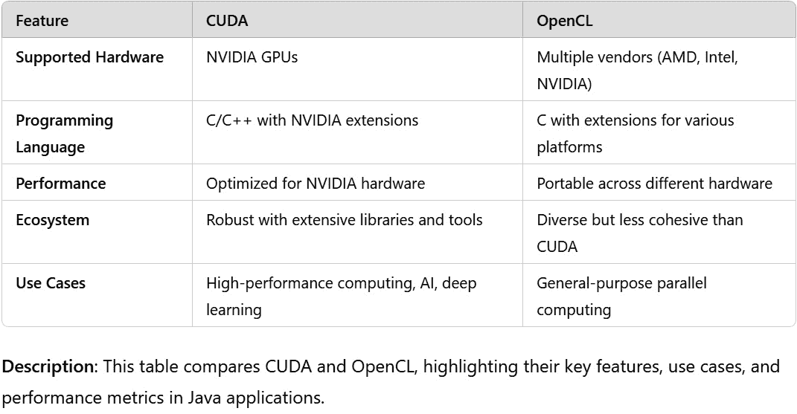
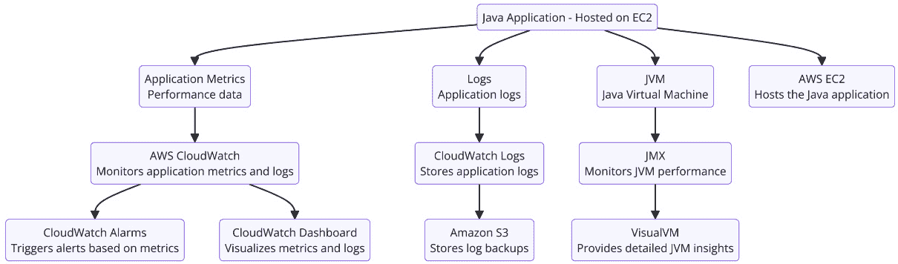

# 第十一章：云计算中的高级 Java 并发实践

在今天快速发展的技术环境中，**云计算**已成为现代软件架构的组成部分。随着 Java 继续在企业应用程序中占据主导地位，了解如何在云环境中利用其并发能力对于开发人员和架构师来说至关重要。本章深入探讨了针对云计算场景量身定制的 Java 并发实践。

在本章中，你将获得在云环境中实现健壮、可扩展和高效并发 Java 应用程序的实际知识。我们将探讨增强冗余和故障转移机制的最新技术，利用**图形处理单元（GPU**）加速计算任务，以及为基于云的 Java 应用程序实施专门的监控解决方案。

到本章结束时，你将具备设计和优化 Java 应用程序的技能，使其能够充分利用云基础设施的力量。你将学习如何实现云特定冗余，利用**计算统一设备架构（CUDA**）和**开放计算语言（OpenCL**）进行 GPU 加速，并设置综合监控系统，该系统集成了云原生和 Java 中心工具。

这些高级实践将使你能够创建高性能、具有弹性的 Java 应用程序，在云环境中轻松扩展。无论你是在处理数据密集型应用程序、实时处理系统还是复杂分布式架构，本章涵盖的技术将帮助你充分发挥 Java 并发在云中的潜力。

在本章中，我们将涵盖以下主要主题：

+   增强 Java 应用程序中的云特定冗余和故障转移

+   Java 中的 GPU 加速：利用 CUDA、OpenCL 和本地库

+   云中 Java 并发的专门监控

让我们开始这段旅程，掌握云计算中的高级 Java 并发实践！

# 技术要求

为了充分参与第十一章的内容和示例，请确保以下内容已安装和配置：

+   **CUDA 工具包**：这为构建和运行 GPU 加速应用程序提供了环境。从 NVIDIA 开发者网站下载和安装：[`developer.nvidia.com/cuda-downloads`](https://developer.nvidia.com/cuda-downloads)。

+   **Java 绑定 CUDA（JCuda）库**：这使 CUDA 能够集成到 Java 中。从[`www.jcuda.org/downloads/downloads.html`](http://www.jcuda.org/downloads/downloads.html)下载并将 JAR 文件添加到你的项目类路径中。

+   `aws configure`。

+   **Java 虚拟机（JVM）监控工具（JConsole 或 VisualVM）**：在 CUDA 执行期间监控 JVM 性能。启动并连接到你的运行中的应用程序。

这里有一些额外的说明：

+   **GPU 硬件**：运行示例需要具备 CUDA 功能的 NVIDIA GPU

+   **操作系统（OS）兼容性**：确保您的操作系统与 CUDA Toolkit 和 JCuda 版本兼容

请参考每个工具的文档以获取安装说明和故障排除。

本章中的代码可以在 GitHub 上找到：

[`github.com/PacktPublishing/Java-Concurrency-and-Parallelism`](https://github.com/PacktPublishing/Java-Concurrency-and-Parallelism)

# 在 Java 应用程序中增强云特定的冗余和故障转移

在云计算领域，冗余和故障转移机制对于确保应用程序的无间断可用性和弹性至关重要。**冗余**涉及复制关键组件或资源，而**故障转移**是指在主系统故障的情况下自动切换到备份系统。这些机制对于减轻硬件故障、网络中断或其他在云环境中可能发生的意外中断的影响至关重要。通过实施冗余和故障转移策略，开发者可以最小化停机时间，防止数据丢失，并保持应用程序的整体可靠性。

Java 提供了一套强大的工具集，用于构建健壮的云应用程序，使开发者即使在利用托管云服务的情况下也能实现冗余、复制和故障转移机制。

## 利用 Java 库和框架

通过利用 Java 库和框架，Java 开发者可以通过各自的 SDK（例如 Java 的 AWS SDK）或使用云无关的框架（如 Spring Cloud）无缝集成云提供商的托管服务。这些工具抽象了大部分底层基础设施复杂性，简化了冗余和故障转移策略的实施。

对于负载均衡，Java 应用程序使用特定提供商的 SDK 或框架与基于云的负载均衡器（例如，AWS **弹性负载均衡**（**ELB**），Azure 负载均衡器）进行交互。Java 代码可以动态发现健康的实例并更新负载均衡器配置，确保流量高效路由。此外，在需要直接控制的场景中，Java 应用程序可以实现客户端负载均衡算法。

关于数据复制，Java 库简化了与云存储服务的交互（例如，Amazon **简单存储服务**（**S3**），DynamoDB），抽象了复制的复杂性。Java 代码通过实现诸如最终一致性、冲突解决或利用云服务提供的一致性级别等策略来处理数据一致性挑战。开发者还可以利用云提供商的 API 或 SDK 以编程方式管理备份和恢复过程。

对于故障转移机制，Java 应用程序可以使用提供者 API 主动监控云资源的健康状态，在必要时进行快速故障转移操作。通过集成 Amazon Route 53 或 Eureka 等服务，Java 应用程序可以动态定位健康的实例，并根据故障调整配置。此外，Java 内置的异常处理机制和重试库能够从故障中优雅地恢复，并实现无缝切换到备用资源。

## 编写故障转移和高级机制的测试场景

在为云环境中的 Java 应用程序实现故障转移和其他高级机制时，编写全面和正确的测试场景对于确保这些机制的可靠性和有效性至关重要。以下是测试故障转移和高级机制的一些关键考虑因素和最佳实践：

+   **模拟** **网络故障**：

    +   使用 Linux 中的工具，如 **Traffic Control** （**TC**）引入网络延迟、中断或分区

    +   确保您的应用程序可以处理部分网络故障，并且仍然可以将流量路由到健康的实例

+   **测试** **资源不可用**：

    +   模拟关键资源（如数据库、消息代理或外部 API）的不可用性

    +   验证您的应用程序能否在不崩溃的情况下切换到备用资源或进入降级模式

+   **自动化** **故障转移测试**：

    +   使用自动化工具，如 Chaos Monkey 或 Gremlin，随机终止实例或诱导故障

    +   自动验证故障转移过程并检查是否成功切换到备用系统

+   **监控** **故障转移性能**：

    +   测量您的应用程序检测故障并切换到备用系统所需的时间

    +   确保在故障转移过程中以及之后，性能指标保持在可接受的范围内

通过结合这些测试实践，并根据实际观察不断细化测试场景，开发者可以确保他们的 Java 应用程序在云环境中的健壮性和可靠性。

让我们开发一个实际练习，展示在 AWS 环境中实现 Java 技术的云冗余和故障转移。我们将创建一个示例应用程序，展示负载均衡、数据复制和故障转移机制。

## 实际练习 – 弹性的云原生 Java 应用程序

在我们开始实际练习之前，重要的是要注意，它假设您对 Spring Boot 和 Spring Cloud 有一定的了解。Spring Boot 是一个流行的 Java 框架，它简化了独立、生产级 Spring 应用程序的开发。它提供了一种简化的方式来配置和运行 Spring 应用程序，设置最少。另一方面，Spring Cloud 是一系列工具和库的集合，它通过云特定功能（如服务发现、配置管理和断路器）增强了 Spring Boot 应用程序。

如果你刚开始接触 Spring Boot 和 Spring Cloud，不要担心！虽然对这些技术的深入了解是有益的，但练习将侧重于构建弹性云原生 Java 应用程序相关的关键概念和组件。要开始使用 Spring Boot，你可以参考[`spring.io/projects/spring-boot`](https://spring.io/projects/spring-boot)的官方文档和指南。要了解 Spring Cloud 及其各种模块的介绍，请查看[`spring.io/projects/spring-cloud`](https://spring.io/projects/spring-cloud)的 Spring Cloud 文档。

在这个练习中，我们将创建一个全面的基于 Java 的应用程序，演示在 AWS 环境中实现云冗余、故障转移机制以及具有一致性和冲突解决的数据复制。我们将使用 AWS 服务，如 ELB、Amazon DynamoDB、Amazon S3 和 Amazon Route 53。我们还将利用 AWS SDK for Java 和 Spring Cloud 进行云无关的实现。

*图 11.1* 展示了具有弹性的云原生 Java 应用程序：



图 11.1：基于 AWS 的具有备份和故障转移机制的 Java 应用程序架构

此图展示了在 AWS 环境中部署的基于 Java 的应用程序的全面架构，包括云冗余、故障转移机制以及具有一致性和冲突解决的数据复制。关键组件包括 Amazon Route 53 用于**域名系统**（**DNS**）路由、ELB 用于在多个**弹性计算云**（**EC2**）实例之间分发流量，以及由 Eureka 服务器管理的 Spring Boot 项目托管服务实例。服务 A 与 Amazon DynamoDB 交互，而服务 B 与 Amazon S3 交互，备份机制确保数据复制到专门的 S3 备份桶。Amazon **关系数据库服务**（**RDS**）用于关系数据库管理，**身份和访问管理**（**IAM**）用于安全访问管理，CloudWatch 用于监控和性能洞察。已实施故障转移机制以确保高可用性和可靠性。

下面是这个应用程序涉及步骤的总结：

+   (`pom.xml`)。

+   **步骤 2：实现** **负载均衡**：

    +   创建一个 REST 控制器，包含用于模拟负载均衡服务的端点。

    +   使用 Ribbon 配置客户端负载均衡机制。*   **步骤 3：实现具有一致性和** **冲突解决** 的数据复制：

    +   创建一个服务，用于与 Amazon S3 和 DynamoDB 交互以进行数据复制。

    +   实现将数据复制到 S3 和 DynamoDB 的方法，处理最终一致性，并解决冲突。

    +   使用 S3 实现 DynamoDB 数据的备份和恢复机制。*   **步骤 4：创建用于** **数据操作** 的 REST 端点：

    +   创建一个 REST 控制器以暴露数据操作端点，包括备份和恢复.*   **步骤 5：实现** **故障转移机制**：

    +   创建一个健康检查端点并与 Eureka 集成以进行服务发现和故障转移。*   **步骤 6：使用 CloudFormation** **配置 AWS 资源**：

    +   更新 CloudFormation 模板以包括必要的 AWS 资源，例如 S3 存储桶和 DynamoDB 表。*   **步骤 7：部署** **并测试**：

    +   将 CloudFormation 堆栈部署以配置所需的 AWS 资源。

    +   将 Spring Boot 应用程序部署到位于负载均衡器后面的 AWS EC2 实例。

    +   测试应用程序的负载均衡、数据复制、一致性处理、备份和故障转移机制。*   **步骤 8：其他考虑因素**：（详细实现将不会涉及）

本练习提供了使用 Spring Boot、AWS 服务和各种架构模式构建弹性云原生 Java 应用程序的全面动手实践体验。通过遵循这些步骤，读者将获得实施负载均衡、数据复制、一致性管理、故障转移机制和其他构建云中稳健应用程序的基本方面的实际知识。

**步骤 1：设置 Spring** **Boot 项目**：

使用 Spring Initializer 或您首选的方法创建一个新的 Spring Boot 项目。将以下依赖项添加到您的`pom.xml`文件中：

```java
<dependencies>
    <dependency>
        <groupId>org.springframework.boot</groupId>
        <artifactId>spring-boot-starter-web</artifactId>
    </dependency>
    <dependency>
        <groupId>com.amazonaws</groupId>
        <artifactId>aws-java-sdk</artifactId>
        <version>2.17.102</version>
    </dependency>
    <dependency>
        <groupId>org.springframework.cloud</groupId>
        <artifactId>spring-cloud-starter-aws</artifactId>
    </dependency>
    <dependency>
        <groupId>org.springframework.cloud</groupId>
        <artifactId>spring-cloud-starter-netflix-eureka-client</artifactId>
    </dependency>
</dependencies>
```

**步骤 2：实现** **负载均衡**：

创建一个 REST 控制器，具有模拟负载均衡服务的端点：

```java
@RestController
public class LoadBalancedController {
    @GetMapping("/serviceA")
    public String serviceA() {
        return "Service A Response";
    }
    @GetMapping("/serviceB")
    public String serviceB() {
        return "Service B Response";
    }
}
```

创建一个配置类以启用 Ribbon 进行客户端负载均衡：

```java
@Configuration
@RibbonClient(name = "serviceA")
public class RibbonConfiguration {
    // Custom Ribbon configuration can be added here
}
```

**步骤 3：实现具有一致性和** **冲突解决的数据复制**：

创建一个服务以与 Amazon S3 和 DynamoDB 交互进行数据复制，处理最终一致性、冲突解决以及备份/恢复。以下`DataReplicationService`类的关键部分。对于完整的实现，请参阅书籍附带的 GitHub 存储库：

```java
@Service
public class DataReplicationService {
    private final S3Client s3Client;
    private final DynamoDbClient dynamoDbClient;
    private final String tableName = "MyTable";
    public DataReplicationService() {
        this.s3Client = S3Client.builder().build();
        this.dynamoDbClient = DynamoDbClient.builder().build();
    }
    public void replicateToS3(String key, String content) {
        PutObjectRequest putObjectRequest = PutObjectRequest.builder()
                .bucket("my-bucket")
                .key(key)
                .build();
        s3Client.putObject(putObjectRequest,
            RequestBody.fromString(content));
    }
    public void replicateToDynamoDB(String key,
        String value) {
        PutItemRequest putItemRequest = PutItemRequest.builder()
            .tableName(tableName)
            .item(Map.of("Key",
                AttributeValue.builder().s(key).build(),
                         "Value", AttributeValue.builder().s(value).                         build()))
                .build();
        dynamoDbClient.putItem(putItemRequest);
    }
    public Optional<String> retrieveFromDynamoDB(
        String key) {
            GetItemRequest getItemRequest = GetItemRequest.builder()
                .tableName(tableName)
                .key(Map.of("Key", AttributeValue.builder().s(key).                build()))
                .build();
        try {
            GetItemResponse response = dynamoDbClient.            getItem(getItemRequest);
            return Optional.ofNullable(response.item().get(
                "Value")).map(AttributeValue::s);
        } catch (DynamoDbException e) {
            throw new RuntimeException(
                "Failed to retrieve item from DynamoDB",e);
        }
    }
    // For complete implementation, refer to the book's accompanying GitHub repository.
}
```

**步骤 4：为** **数据操作创建 REST 端点**：

创建一个 REST 控制器以暴露数据操作端点，包括备份和恢复：

```java
@RestController
@RequestMapping("/data")
public class DataController {
    private final DataReplicationService dataService;
    public DataController(
        DataReplicationService dataService) {
            this.dataService = dataService;
        }
        @PostMapping("/s3")
        public String replicateToS3(@RequestParam String key,         @RequestParam String content) {
            dataService.replicateToS3(key, content);
            return "Data replicated to S3";
        }
        @PostMapping("/dynamo")
        public String replicateToDynamoDB(@RequestParam String key,         @RequestParam String value) {
            dataService.replicateToDynamoDB(key, value);
            return "Data replicated to DynamoDB";
        }
        @GetMapping("/dynamo/{key}")
        public String retrieveFromDynamoDB(@PathVariable String key) {
        return dataService.retrieveFromDynamoDB(
            key).orElse("No data found");
        }
        @PostMapping("/dynamo/conflict")
        public String resolveConflict(@RequestParam String key,         @RequestParam String newValue) {
            dataService.resolveConflict(key, newValue);
            return "Conflict resolved in DynamoDB";
        }
        @PostMapping("/backup/{key}")
        public String backupToS3(@PathVariable String key){
            dataService.backupDynamoDBToS3(key);
            return "Data backed up to S3";
        }
        @PostMapping("/restore/{key}")
        public String restoreFromS3(@PathVariable String key) {
            dataService.restoreFromS3(key);
            return "Data restored from S3 to DynamoDB";
        }
    }
```

**步骤 5：实现** **故障转移机制**：

创建一个健康检查端点并与 Eureka 集成以进行服务发现和故障转移：

```java
@RestController
public class FailoverController {
    private final EurekaClient eurekaClient;
    public FailoverController(EurekaClient eurekaClient) {
        this.eurekaClient = eurekaClient;
    }
    @GetMapping("/health")
    public String health() {
        return "OK";
    }
    @GetMapping("/failover")
    public String failover() {
        InstanceInfo instance = eurekaClient.        getNextServerFromEureka("serviceB", false);
        return "Failing over to " + instance.getHomePageUrl();
    }
}
```

**步骤 6：使用 CloudFormation** **配置 AWS 资源**：

更新您的 CloudFormation 模板以包括备份 S3 存储桶和其他必要资源：

```java
AWSTemplateFormatVersion: '2010-09-09'
Resources:
    MyBucket:
        Type: 'AWS::S3::Bucket'
        Properties:
            BucketName: 'my-bucket'
    BackupBucket:
        Type: 'AWS::S3::Bucket'
        Properties:
            BucketName: 'my-bucket-backup'
    MyTable:
        Type: 'AWS::DynamoDB::Table'
        Properties:
            TableName: 'MyTable'
            AttributeDefinitions:
            - AttributeName: 'Key'
            AttributeType: 'S'
        KeySchema:
            - AttributeName: 'Key'
            KeyType: 'HASH'
        ProvisionedThroughput:
            ReadCapacityUnits: 5
            WriteCapacityUnits: 5
    MyLoadBalancer:
        Type: 'AWS::ElasticLoadBalancing::LoadBalancer'
        Properties:
        AvailabilityZones: !GetAZs ''
        Listeners:
            - LoadBalancerPort: '80'
            InstancePort: '8080'
            Protocol: 'HTTP'
        HealthCheck:
            Target: 'HTTP:8080/health'
            Interval: '30'
            Timeout: '5'
            UnhealthyThreshold: '2'
            HealthyThreshold: '10'
    MyRoute53:
        Type: 'AWS::Route53::RecordSet'
        Properties:
            HostedZoneName: 'example.com.'
            Name: 'myapp.example.com.'
        Type: 'A'
            AliasTarget:
            HostedZoneId: !GetAtt MyLoadBalancer.CanonicalHostedZoneNameID
            DNSName: !GetAtt MyLoadBalancer.DNSName
```

**步骤 7：部署** **并测试**：

**部署 CloudFormation 堆栈**：打开终端并确保您已安装并配置了 AWS CLI 以及适当的凭证。运行以下命令以创建 CloudFormation 堆栈：

```java
aws cloudformation create-stack --stack-name ResilientJavaApp --template-body file://template.yaml --parameters ParameterKey=UniqueSuffix,ParameterValue=youruniquesuffix, ParameterKey=HostedZoneName,ParameterValue=yourHostedZoneName. ParameterKey=DomainName,ParameterValue=yourDomainName
```

等待堆栈创建完成。您可以使用以下命令检查状态：

```java
aws cloudformation describe-stacks --stack-name <your-stack-name>
```

**部署 Spring Boot 应用程序**：使用以下命令将 Spring Boot 应用程序打包成 JAR 文件：

```java
mvn clean package
```

使用 SCP 将 JAR 文件上传到您的 EC2 实例：

```java
scp -i /path/to/key-pair.pem target/your-application.jar ec2-user@<EC2-Instance-Public-IP>:/home/ec2-user/
```

**在 EC2 上运行应用程序**：SSH 到您的 EC2 实例并运行 Spring Boot 应用程序：

```java
ssh -i /path/to/key-pair.pem ec2-user@<EC2-Instance-Public-IP>
java -jar /home/ec2-user/your-application.jar
```

**测试** **应用程序**：

+   **测试** **负载均衡**：

    +   在浏览器中访问负载均衡器 URL。

    +   通过多次刷新页面并检查响应来确保流量分布到各个实例。

+   **测试数据复制** **和一致性**：

    +   使用 REST 端点来复制数据、处理冲突并测试备份和恢复功能。

    +   这里有一些示例 API 调用：

```java
curl -X POST "http://<Load-Balancer-URL>/data/s3?key=testKey&content=testContent"
curl -X POST "http://<Load-Balancer-URL>/data/dynamo?key=testKey&value=testValue
```

**测试故障转移**：

+   通过停止 AWS 管理控制台中的一个 EC2 实例来模拟实例故障。

+   确保故障转移机制将流量引导到健康的实例。

**步骤 8**：**其他注意事项**：

虽然这本书侧重于构建云 Java 应用程序，但重要的是要注意，当使用 AWS 为此应用程序工作时，还有一些额外的注意事项需要注意。由于本书的范围，我们不会深入探讨这些 AWS 技术的细节，但以下是一些关键点：

+   **实现适当的身份验证和授权**：保护您的端点和 AWS 资源

+   **添加指标和监控**：设置 AWS CloudWatch 警报和仪表板

+   **实现电路断路器以增强弹性**：使用 Hystrix 或 Resilience4j 等工具

+   **添加缓存机制以减少数据库负载**：与 AWS ElastiCache 集成

+   **实现适当的测试**：确保通过单元测试和集成测试进行全面的测试覆盖

+   **设置 CI/CD 管道以实现自动化部署**：使用 AWS CodePipeline 或 Jenkins

有关更多详细信息及相关 AWS 技术的参考链接，请参阅*附录 A*。

这个实际练习展示了如何利用 AWS 服务构建一个具有弹性的、云原生 Java 应用程序。我们已经实现了负载均衡、具有一致性管理的数据复制和故障转移机制等关键概念。通过利用 Spring Boot、AWS SDK 以及 S3、DynamoDB 和 ELB 等 AWS 服务，我们创建了一个能够处理云环境中高可用性和容错性的强大架构。

当我们过渡到下一节时，我们将关注点从云弹性转移到计算性能。虽然云计算提供了可扩展性和可靠性，但 GPU 加速提供了大规模并行处理的可能性，为 Java 应用程序中的计算密集型任务开辟了新的天地。下一节将探讨 Java 开发者如何利用 GPU 在合适的场景中显著提升性能，补充我们刚刚讨论的弹性策略。

# Java 中的 GPU 加速 – 利用 CUDA、OpenCL 和本地库

为了在 Java 应用程序中利用 GPU 的巨大计算能力，开发者有几种选择可供选择。本节探讨了 Java 开发者如何利用 CUDA、OpenCL 和本地库来加速计算并利用 GPU 的并行处理能力。我们将深入研究每种方法的优缺点，引导您找到最适合您特定用例的解决方案。

## GPU 计算基础

GPU 已经从最初的渲染图形的目的演变为强大的通用计算工具。这种转变，被称为**通用计算在图形处理单元上**（**GPGPU**），利用 GPU 的并行处理能力，在某些任务中比传统的 CPU 更有效地执行计算。

与具有针对顺序处理任务优化的少量核心的 CPU 不同，GPU 具有许多针对并行任务优化的较小核心。这种架构允许在可以分解为较小、并发操作的任务中实现显著的加速。

让我们看看*图 11.2*：



图 11.2：GPU 与 CPU 架构对比

此图展示了中央处理单元（**CPU**）和 GPU 之间的基本架构差异，以及 GPU 计算的概念，这些内容在此处进一步解释：

+   **核心** **数量**：

    +   **CPU**：这以相对较少的核心数量为特征。这些核心强大且专为高效处理顺序处理任务而设计。

    +   **GPU**：这具有大量较小的核心。这些核心针对处理并行处理任务进行了优化，使得 GPU 能够同时执行许多计算。

+   **处理风格**：

    +   **CPU**：这针对顺序任务执行进行了优化。这意味着 CPU 被设计为以特定顺序处理一系列指令，使其非常适合需要高单线程性能的任务。

    +   **GPU**：这专为并行任务执行而设计。GPU 擅长将任务分解成更小的、并发的操作，这使得它们非常适合可以并行化的任务，如图形渲染和科学计算。

+   **时钟速度**：

    +   **CPU**：CPU 通常具有更高的时钟速度，这允许快速的单线程性能。这意味着 CPU 可以非常快速地执行指令，一次一个。

    +   **GPU**: 通常，与 CPU 相比，每个核心的时钟速度较低。然而，拥有许多核心带来的巨大并行性弥补了单个核心较低时钟速度的不足，使得并行处理大量数据集变得高效。

+   **GPU 计算**：这扩展了 GPU 在图形之外的特性，引入了以下功能：

+   **并行处理**：这利用 GPU 的架构来同时执行数千次计算。

    +   **高效计算**：这优化了特定类型计算的资源使用。

    +   **可扩展性**：这允许通过添加更多 GPU 来轻松扩展计算能力。

该图有效地展示了 CPU 是如何设计用于高速顺序处理，拥有较少但更强大的核心，而 GPU 则是为了大规模并行处理而构建，拥有许多较小的核心。这种架构差异是 GPGPU 概念的基础，它利用 GPU 的并行处理能力来执行非图形任务，显著加速了可并行化的计算任务。

对于想要深入了解 GPU 架构及其复杂性的读者，网上有几种优秀的资源可供参考。NVIDIA 开发者网站提供了关于 CUDA 和 GPU 架构的详细文档，包括 CUDA C++编程指南([`docs.nvidia.com/cuda/cuda-c-programming-guide/`](https://docs.nvidia.com/cuda/cuda-c-programming-guide/))和 CUDA 运行时 API([`docs.nvidia.com/cuda/cuda-runtime-api/`](https://docs.nvidia.com/cuda/cuda-runtime-api/))。这些资源提供了 CUDA 编程模型、内存层次结构和优化技术的深入解释。为了更直观地展示 GPU 架构，NVIDIA 的*GPU Gems*系列([`developer.nvidia.com/gpugems`](https://developer.nvidia.com/gpugems))汇集了一系列关于高级 GPU 编程技术和案例研究的文章和教程。

## CUDA 和 OpenCL 概述 – 在 Java 应用程序中的差异和用途

CUDA 和 OpenCL 是两个主要的 GPU 计算框架。它们服务于类似的目的，但具有不同的差异和用例，尤其是在 Java 应用程序中。

**CUDA**是一个专有的并行计算平台和 API，专门为 NVIDIA GPU 设计。它提供了出色的性能优化和细粒度控制 NVIDIA GPU 硬件，使其非常适合计算密集型任务。CUDA 附带了一套完整的库、开发工具和调试器，用于高效的 GPU 编程。它提供了访问 NVIDIA 特定库的权限，例如用于深度学习的**CUDA 深度神经网络**(**cuDNN**)库、用于快速傅里叶变换的**CUDA 快速傅里叶变换**(**cuFFT**)库以及用于线性代数操作的**CUDA 基本线性代数子程序**(**cuBLAS**)库。然而，CUDA 仅限于 NVIDIA GPU，这限制了其在其他硬件上的可移植性。虽然存在 Java 绑定（例如，JCuda、JCublas），但集成和使用可能不如 C/C++那样无缝。

**OpenCL** 是由 Khronos Group 维护的跨平台并行编程开放标准。它运行在来自不同供应商的广泛硬件上，包括 NVIDIA、AMD 和 Intel。OpenCL 代码可以在各种 GPU 和 CPU 上运行，使其在不同平台上的适用性更广。它被多个供应商广泛采用和支持，提供了更广泛的应用范围。在 Java 中，通过如 JOCL 等库，OpenCL 得到了良好的支持，为 Java 应用程序提供了利用 OpenCL 的便捷方式。然而，由于 OpenCL 的通用性更强，其工具和生态系统可能不如 CUDA 那样广泛，因此它可能无法在 NVIDIA GPU 上达到与 CUDA 相同的性能优化水平。

*图 11.3* 展示了一个表格，提供了 CUDA 和 OpenCL 之间的简洁比较。它突出了在几个重要方面的关键差异，包括支持的硬件、编程语言、性能特性、生态系统和典型用例。



图 11.3：CUDA 和 OpenCL 的比较

以下是一些使用 CUDA 和 OpenCL 的 Java 应用程序的示例：

+   **图像和视频处理**：加速图像滤波、视频编码/解码和计算机视觉算法等任务

+   **科学计算**：加速模拟、数值计算和数据分析

+   **机器学习和深度学习**：在 GPU 上训练和推理神经网络

+   **金融建模**：加速定量金融中的复杂计算

### 在 Java 中选择 CUDA 和 OpenCL

在 Java 中，CUDA 和 OpenCL 的选择取决于具体需求：

+   **目标硬件**：对于 NVIDIA GPU 和最大性能，CUDA 可能是更好的选择。对于跨平台兼容性，OpenCL 更受欢迎。

+   **性能与可移植性**：考虑绝对性能（CUDA 在 NVIDIA GPU 上）和跨不同硬件的可移植性之间的权衡。

+   **易用性和工具**：CUDA 为 NVIDIA GPU 提供了更成熟的生态系统，而 OpenCL 可能需要更多的手动设置和优化。

+   **特定应用需求**：仅在 CUDA 或 OpenCL 中可用的专用库或功能也可以指导决策。

要全面了解 CUDA，请参考 CUDA 工具包文档（[`docs.nvidia.com/cuda/`](https://docs.nvidia.com/cuda/)），它涵盖了从安装到编程指南和 API 引用的各个方面。OpenCL 规范和文档可以在 Khronos Group 网站上找到（[`www.khronos.org/opencl/`](https://www.khronos.org/opencl/)），提供了 OpenCL 编程模型和 API 的详细见解。此外，Aaftab Munshi、Benedict R. Gaster、Timothy G. Mattson 和 Dan Ginsburg 合著的《OpenCL 编程指南》（[`www.amazon.com/OpenCL-Programming-Guide-Aaftab-Munshi/dp/0321749642`](https://www.amazon.com/OpenCL-Programming-Guide-Aaftab-Munshi/dp/0321749642)）是掌握 OpenCL 编程概念和最佳实践的强烈推荐资源。

## TornadoVM – 基于 GraalVM 的 GPU 加速

除了 CUDA 和 OpenCL 之外，另一种使用 GPU 加速 Java 应用程序的选项是**TornadoVM**。TornadoVM 是**GraalVM**的一个插件，它是 Java 的一个高性能运行时，能够无缝地在 GPU 和其他加速器上执行 Java 代码。

TornadoVM 利用 Graal 编译器自动将 Java 字节码转换为 OpenCL 或 PTX（CUDA）代码，使开发者能够在无需大量代码修改或低级编程的情况下利用 GPU 加速。它支持包括 NVIDIA、AMD 和 Intel 在内的广泛 GPU 架构。

TornadoVM 的一个关键优势是它能够根据目标 GPU 架构的具体特性优化代码执行。它采用高级编译器优化和运行时技术，以最大化性能和资源利用率。

要使用 TornadoVM，开发者需要安装 GraalVM 和 TornadoVM 插件。然后，他们可以在 Java 代码中使用 TornadoVM 特定的注解来标记应该卸载到 GPU 的方法或循环。TornadoVM 负责其余部分，自动在 GPU 上编译和执行注解代码。

想要了解更多关于 TornadoVM 及其使用的信息，读者可以参考官方 TornadoVM 文档：[`github.com/beehive-lab/TornadoVM`](https://github.com/beehive-lab/TornadoVM)。

在下一节中，我们将创建一个实践练习，展示如何在 Java 应用程序中利用 GPU 进行计算任务。我们将使用 CUDA 创建一个简单的矩阵乘法应用程序，以展示 GPU 加速。

## 实践练习 – Java 中的 GPU 加速矩阵乘法

**目标**：使用 Java 和 CUDA 实现矩阵乘法算法，并比较其与基于 CPU 的实现性能。

这里是一个分步指南：

在`pom.xml`文件中包含 JCuda 库：

```java
<dependencies>
    <dependency>
        <groupId>org.jcuda</groupId>
        <artifactId>jcuda</artifactId>
        <version>12.0.0</version> </dependency>
    <dependency>
        <groupId>org.jcuda</groupId>
        <artifactId>jcublas</artifactId>
        <version>12.0.0</version>
    </dependency>
</dependencies>
```

**步骤 2：实现矩阵乘法的 CPU 版本**：以下是一个标准的 CPU 实现矩阵乘法：

```java
public class MatrixMultiplication {
    public static float[][] multiplyMatricesCPU(
        float[][] a, float[][] b) {
            int m = a.length;
            int n = a[0].length;
            int p = b[0].length;
            float[][] result = new float[m][p];
            for (int i = 0; i < m; i++) {
                for (int j = 0; j < p; j++) {
                    for (int k = 0; k < n; k++) {
                        result[i][j] += a[i][k] * b[k][j];
                    }
                }
            }
        return result;
    }
}
```

`multiplyMatricesCPU()`方法使用嵌套循环执行矩阵乘法，适用于 CPU 执行。

**第 3 步：使用 JCuda 实现 GPU 版本**：让我们创建一个使用 JCuda 的 GPU 加速版本：

```java
public class MatrixMultiplicationGPU {
    public static float[][] multiplyMatricesGPU(
        float[][] a, float[][] b) {
            int m = a.length;
            int n = a[0].length;
            int p = b[0].length;
        // Initialize JCublas
        JCublas.cublasInit();
        // Allocate memory on GPU
            Pointer d_A = new Pointer();
            Pointer d_B = new Pointer();
            Pointer d_C = new Pointer();
            JCublas.cublasAlloc(m * n, Sizeof.FLOAT, d_A);
            JCublas.cublasAlloc(n * p, Sizeof.FLOAT, d_B);
            JCublas.cublasAlloc(m * p, Sizeof.FLOAT, d_C);
        // Copy data to GPU
            JCublas.cublasSetVector(
                m * n, Sizeof.FLOAT, Pointer.to(
                    flattenMatrix(a)), 1, d_A, 1);
            JCublas.cublasSetVector(n * p, Sizeof.FLOAT,
                Pointer.to(flattenMatrix(b)), 1, d_B, 1);
        // Perform matrix multiplication
            JCublas.cublasSgemm('n', 'n', m, p, n, 1.0f,
                d_A, m, d_B, n, 0.0f, d_C, m);
        // Copy result back to CPU
            float[] resultFlat = new float[m * p];
            JCublas.cublasGetVector(m * p, Sizeof.FLOAT,
                d_C, 1, Pointer.to(resultFlat), 1);
        // Free GPU memory
            JCublas.cublasFree(d_A);
            JCublas.cublasFree(d_B);
            JCublas.cublasFree(d_C);
        // Shutdown JCublas
            JCublas.cublasShutdown();
            return unflattenMatrix(resultFlat, m, p);
}
private static float[] flattenMatrix(float[][] matrix) {
    int m = matrix.length;
    int n = matrix[0].length;
    float[] flattened = new float[m * n];
    for (int i = 0; i < m; i++) {
        System.arraycopy(matrix[i], 0, flattened, i * n,n);
    }
    return flattened;
}
    private static float[][] unflattenMatrix(
        float[] flattened, int m, int p) {
            float[][] result = new float[m][p];
            for (int i = 0; i < m; i++) {
                System.arraycopy(flattened, i * p,
                    result[i], 0, p);
            }
            return result;
        }
}
```

本课程使用 Java cuBLAS 库（**JCublas**）在 GPU 上执行矩阵乘法，包括内存分配、数据传输和计算。

**第 4 步：创建主类以比较 CPU 和 GPU 性能**：因此，让我们创建一个比较类：

```java
public class MatrixMultiplicationComparison {
    public static void main(String[] args) {
        int size = 1000; // Size of the square matrices
        float[][] a = generateRandomMatrix(size, size);
        float[][] b = generateRandomMatrix(size, size);
        // CPU multiplication
        long startTimeCPU = System.currentTimeMillis();
        float[][] resultCPU = MatrixMultiplication.        multiplyMatricesCPU(a, b);
        long endTimeCPU = System.currentTimeMillis();
        System.out.println("CPU time: " + (
            endTimeCPU - startTimeCPU) + " ms");
        // GPU multiplication
        long startTimeGPU = System.currentTimeMillis();
        float[][] resultGPU = MatrixMultiplicationGPU.        multiplyMatricesGPU(a, b);
        long endTimeGPU = System.currentTimeMillis();
        System.out.println("GPU time: " + (
            endTimeGPU - startTimeGPU) + " ms");
        // Verify results
        boolean correct = verifyResults(resultCPU,
            resultGPU);
        System.out.println(
            "Results are correct: " + correct);
    }
    private static float[][] generateRandomMatrix(int rows,
        int cols) {
        float[][] matrix = new float[rows][cols];
        for (int i = 0; i < rows; i++) {
            for (int j = 0; j < cols; j++) {
                matrix[i][j] = (float) Math.random();
            }
        }
        return matrix;
    }
    private static boolean verifyResults(float[][] a,
        float[][] b) {
        if (a.length != b.length || a[0].length != b[0].length) {
            return false;
        }
        for (int i = 0; i < a.length; i++) {
            for (int j = 0; j < a[0].length; j++) {
                if (Math.abs(a[i][j] - b[i][j]) > 1e-5) {
                    return false;
                }
            }
        }
        return true;
    }
}
```

本课程生成随机矩阵，使用 CPU 和 GPU 方法进行乘法运算，并比较它们的性能和精度。

`MatrixMultiplicationComparison`类。它将使用 CPU 和 GPU 实现执行矩阵乘法，并比较它们的执行时间。

**第 6 步：分析结果**：比较 CPU 和 GPU 实现的执行时间。对于大型矩阵，您应该看到 GPU 版本有显著的加速。

这个实际练习演示了如何利用 GPU 加速 Java 中的常见计算任务。它展示了通过 JCuda 集成 CUDA，提供了一个 GPU 计算如何显著提高适合任务的性能的实例。

记住，在生产环境中处理潜在的异常和边缘情况。此外，为了获得更好的性能，考虑在您的内核中使用更高级的 CUDA 功能，如共享内存和优化的内存访问模式。

对于那些渴望探索 GPU 加速的更高级主题及其在 Java 中的应用的人来说，以下资源强烈推荐：

+   Wen-mei W. Hwu 的《*GPU Computing Gems Emerald Edition*》提供了一系列针对不同领域的 GPU 计算技术和算法。

+   *Java on GPUs*网站（[`xperti.io/blogs/accelerating-java-with-gpu/`](https://xperti.io/blogs/accelerating-java-with-gpu/））提供了专门针对在 Java 应用程序中利用 GPU 的教程、文章和案例研究。

这些资源将帮助您深化对 GPU 加速及其在 Java 项目中实际应用的理解。

在我们结束对 Java 中 GPU 加速的探索之后，我们看到了如何利用 CUDA 或 OpenCL 可以显著提高并行处理任务的性能。这些知识为我们的下一个关键主题——*云端 Java 并发的专用监控*奠定了基础。在这里，我们将探讨如何有效地监控和优化这些高性能 Java 应用程序在分布式云环境中的性能。

# 云端 Java 并发的专用监控

在云环境中监控并发操作对于几个关键原因至关重要。性能优化位居首位，因为它允许开发者识别并行执行中的瓶颈和低效之处。有效的监控确保了分布式系统中的资源管理效率，这是云计算的一个关键方面。它还在错误检测中发挥重要作用，能够快速识别和诊断与竞态条件或死锁相关的问题。此外，监控提供了宝贵的可扩展性见解，帮助团队了解应用程序在不同负载下的性能表现，这反过来又为扩展决策提供了信息。最后，通过优化资源使用，它有助于成本控制，这是有效管理云计算费用的一个关键因素。

## 监控挑战

在云环境中监控 Java 并发带来了一系列独特的挑战。云系统的分布式特性使得难以获得跨多个实例或服务的并发操作的统一视图。动态扩展，云计算的一个标志，要求监控系统能够快速适应资源规模上下变化的基础设施变化。在云环境中产生的监控数据量巨大，给管理和分析带来了重大挑战。延迟和网络问题可能导致数据收集的延迟和不一致，从而复杂化实时监控工作。安全和合规问题要求仔细考虑，以确保监控实践符合云安全标准和数据保护法规。找到既兼容 Java 并发结构又兼容云原生技术的监控工具可能具有挑战性。最后，需要在详细监控的需求和监控工具本身对性能的影响之间找到一个微妙的平衡点。

这些挑战凸显了在云环境中有效监控 Java 并发的专门方法的需求，我们将在接下来的章节中深入探讨这一主题。

## 监控工具和技术

**云原生监控工具**对于维护在云中运行的应用程序的性能和可靠性至关重要。领先的云提供商提供强大的解决方案，以帮助监控、故障排除和优化您的云基础设施。

这里简要介绍了一些流行的云原生监控工具：

+   **AWS CloudWatch**：来自 AWS 的全面监控和可观察性服务。它允许您收集指标、监控日志文件、为特定阈值设置警报，甚至自动对 AWS 资源的变化做出反应。通过自定义指标，您可以跟踪应用程序特定的数据点，从而更深入地了解应用程序的行为。

+   **Google Cloud Monitoring**：这是来自**Google Cloud Platform**（**GCP**）的强大监控解决方案，为您提供整个云环境的统一视图。它自动从各种 GCP 资源收集指标，并提供对应用程序和服务健康、性能和可用性的洞察。Google Cloud Monitoring 还与其他 GCP 服务（如 Cloud Logging 和 Cloud Trace）集成，以提供完整的可观察性解决方案。

+   **Azure Monitor**：这是微软 Azure 的全面监控解决方案，**Azure Monitor**从您的云和本地环境中收集和分析遥测数据。它允许您监控多个方面，包括应用性能、基础设施健康和平台日志。Azure Monitor 的可定制仪表板和警报可以帮助您在问题影响用户之前主动识别和解决问题。

+   **其他云原生工具**：如 Datadog、New Relic 和 Prometheus 等几个其他云原生工具提供了高级监控功能和与各种云提供商的集成。这些工具提供诸如分布式跟踪、**应用性能监控**（**APM**）和基础设施监控等功能，为您提供了云环境的整体视图。

通过利用这些云原生监控工具，您可以深入了解应用性能，识别潜在瓶颈，并主动优化云基础设施。这有助于提高可靠性、减少停机时间，并提升整体用户体验。

让我们探索以 Java 为中心的工具。在云中部署的 Java 应用程序通常需要专门的监控工具来管理其独特的复杂性，特别是在并发和性能方面。流行的以 Java 为中心的工具包括以下内容：

+   **Java 管理扩展**（**JMX**）是一种 Java 技术，它提供用于管理和监控应用程序、系统对象、设备和面向服务的网络的工具。它允许监控 JVM 健康，例如内存使用、垃圾回收和线程状态。可以创建自定义 MBeans 来公开特定于应用程序的指标。

+   **VisualVM**是一个集成了多个命令行**Java 开发工具包**（**JDK**）工具和轻量级分析功能的可视化工具。它提供了对 JVM 性能的详细洞察，并支持堆转储分析、线程分析和分析。

+   可以使用库，如 Dropwizard Metrics 或 Micrometer，构建**定制监控解决方案**来满足特定需求。这些解决方案提供了定义和收集特定于应用程序的指标以及与各种后端（如 Prometheus、Graphite 或 AWS CloudWatch）集成的灵活性。

利用这些专门的监控工具和技术确保在云环境中有效管理 Java 并发，从而提高性能、可靠性和成本效率。

### 集成云原生和以 Java 为中心的监控以实现最佳性能

有效监控云原生 Java 应用程序通常涉及云原生和以 Java 为中心的工具的组合。云原生工具，如 AWS CloudWatch、Google Cloud Monitoring 和 Azure Monitor，提供了整个云基础设施的高级概述，包括资源利用率、网络流量和整体系统健康。它们提供了关于您的 Java 应用程序如何与云环境交互的宝贵见解。

以 Java 为中心的工具，如 JMX、VisualVM 和定制监控解决方案，深入挖掘 Java 应用程序本身的内部结构。它们监控 JVM 指标，如垃圾回收、线程状态和内存使用，以及通过自定义 MBeans 或如 Dropwizard Metrics 之类的库公开的应用程序特定指标。这些工具对于理解 Java 代码的性能和行为至关重要。

实际上，通常最方便和有效的方法是同时使用这两种类型的工具。云原生工具提供了应用程序如何融入云生态系统的整体图景，而以 Java 为中心的工具则提供了对应用程序内部工作的细致洞察。集成这些工具可以帮助您将云级别的事件与 Java 级别的指标相关联，从而更全面地了解应用程序的性能，并更容易进行故障排除。

例如，您可能使用 CloudWatch 来监控整个 AWS 基础设施的 CPU 和内存利用率，同时使用 JMX 来跟踪 Java 应用程序中的垃圾回收频率和持续时间。如果 CloudWatch 显示 CPU 使用量激增，您可以使用 JMX 来确定这是否与过度的垃圾回收或其他 Java 特定问题有关。这种集成方法使您能够快速识别并解决在影响用户之前性能瓶颈和其他问题。

#### 用例 - 监控云中的 Java Web 应用程序

在本用例中，我们将使用 AWS CloudWatch（一种云原生工具）和 JMX（一种以 Java 为中心的工具）来监控部署在 AWS 上的基于 Java 的 Web 应用程序。目标是实现全面的监控，涵盖云基础设施和应用程序特定指标。

让我们看看*图 11.4*：



图 11.4：增强的 Java 应用程序监控设置

此图展示了托管在 AWS EC2 上的 Java 应用程序的监控设置。它详细说明了如何使用各种工具收集、监控和可视化应用程序指标和日志。应用程序指标发送到 AWS CloudWatch，它还存储日志并触发警报以发出警报。JMX 用于监控 JVM 性能，通过 VisualVM 提供详细的洞察。日志备份到 Amazon S3 以提供额外的存储和检索。此设置确保了对应用程序性能和可靠性的全面监控和警报。

**步骤 1：设置** **AWS CloudWatch**：

首先，确保您的项目依赖项中包含 AWS SDK for Java。然后，创建一个简单的 Java 应用程序，将其自定义指标发布到 CloudWatch。

如果使用 Maven，请将其添加到您的 `pom.xml` 文件中：

```java
<!-- Add to your pom.xml -->
<dependency>
    <groupId>com.amazonaws</groupId>
    <artifactId>aws-java-sdk-cloudwatch</artifactId>
        <version> 2.17.102 </version>
</dependency>
```

创建 `CloudWatchMonitoring` 类。提供一个简化的接口，使用 AWS SDK for Java 将自定义指标发布到 AWS CloudWatch：

```java
public class CloudWatchMonitoring {
    private final CloudWatchClient cloudWatch;
    public CloudWatchMonitoring(String accessKey,
        String secretKey) {
            AwsBasicCredentials awsCredentials = AwsBasicCredentials.            create(accessKey, secretKey);
            this.cloudWatch = CloudWatchClient.builder()
                .region(Region.US_EAST_1)
                .credentialsProvider(StaticCredentialsProvider.                create(awsCredentials))
                .build();
    }
    public void publishCustomMetric(String metricName,
        double value) {
            MetricDatum datum = MetricDatum.builder()
                .metricName(metricName)
                .unit(StandardUnit.COUNT)
                .value(value)
                .build();
        PutMetricDataRequest request = PutMetricDataRequest.builder()
                .namespace("MyAppNamespace")
                .metricData(datum)
                .build();
        cloudWatch.putMetricData(request);
        System.out.println("Metric '" + metricName + "' published to         CloudWatch.");
    }
}
```

**步骤 2：设置** **JMX**：

在您的 Java 应用程序中启用 JMX 以监控 JVM 性能指标，如内存使用、垃圾回收和线程状态。以下是一个示例代码：

```java
public class JMXMonitoring {
    public interface CustomMBean {
        int getMetric();
        void setMetric(int metric);
    }
    public static class Custom implements CustomMBean {
        private int metric = 0;
        @Override
        public int getMetric() {
            return metric;
        }
        @Override
        public void setMetric(int metric) {
            this.metric = metric;
        }
    }
    public static CustomMBean createAndRegisterMBean(
        MBeanServer mbs) throws Exception {
            CustomMBean customMBean = new Custom();
            ObjectName name = new ObjectName(
                "com.example:type=CustomMBean");
            mbs.registerMBean(customMBean, name);
            return customMBean;
        }
}
```

**步骤 3：将指标发布到** **AWS CloudWatch**：

在设置 AWS CloudWatch 后，下一步是从您的 Java 应用程序发布自定义指标到 CloudWatch。请按照以下步骤操作：

首先，发布自定义指标：

+   使用提供的 Java 代码将自定义指标发送到 CloudWatch。这涉及到实现一个与 AWS SDK 交互的类以发布指标数据。

+   确保指标对您的应用程序性能和健康具有意义和相关性。

之后，在 AWS 管理控制台中监控指标：

+   一旦您的指标开始发布，您可以通过 AWS 管理控制台下的 CloudWatch 服务进行监控。设置必要的仪表板和警报以跟踪关键指标并在潜在问题发生时接收通知。

+   创建 `MonitoringApplication` 类，我们将在下一步中完成。

创建一个名为 `MonitoringApplication` 的新类，它将作为应用程序的主要入口点并集成 CloudWatch 和 JMX 监控：

```java
public class MonitoringApplication {
    private static JMXMonitoring.CustomMBean customMBean;
    private static CloudWatchMonitoring cloudWatchMonitor;
    public static void main(String[] args) {
        // Initialize CloudWatch monitoring
        cloudWatchMonitor = new CloudWatchMonitoring(
            "your-access-key", "your-secret-key");
        // Initialize JMX monitoring
        setupJMXMonitoring();
        // Start periodic monitoring
        startPeriodicMonitoring();
        System.out.println("Monitoring systems initialized.         Application running...");
        // Keep the application running
        try {
            Thread.sleep(Long.MAX_VALUE);
        } catch (InterruptedException e) {
            e.printStackTrace();
        }
    }
    private static void setupJMXMonitoring() {
        try {
            MBeanServer mbs = ManagementFactory.            getPlatformMBeanServer();
            customMBean = JMXMonitoring.createAndRegisterMBean(mbs);
            customMBean.setMetric(0); // Set initial metric value
            System.out.println("JMX Monitoring setup complete. Initial             metric value: " + customMBean.getMetric());
        } catch (Exception e) {
            e.printStackTrace();
        }
    }
    private static void startPeriodicMonitoring() {
        ScheduledExecutorService executor = Executors.        newSingleThreadScheduledExecutor();
        executor.scheduleAtFixedRate(() -> {
            try {
                // Simulate metric change
                int currentMetric = customMBean.getMetric();
                int newMetric = currentMetric + 1;
                customMBean.setMetric(newMetric);
                // Publish to CloudWatch
                cloudWatchMonitor.publishCustomMetric("JMXMetric",                 newMetric);
                System.out.println("Updated JMX metric: " +                 newMetric);
            } catch (Exception e) {
                e.printStackTrace();
            }
        }, 0, 60, TimeUnit.SECONDS); // Run every 60 seconds
    }
}
```

注意，此 `MonitoringApplication` 类执行以下操作：

+   初始化 CloudWatch 和 JMX 监控。

+   设置周期性监控，每 60 秒更新 JMX 指标并将其发布到 CloudWatch。

+   使应用程序无限期运行。

请记住将 `"your-access-key"` 和 `"your-secret-key"` 替换为您的实际 AWS 凭据，并考虑在生产环境中使用更安全的方法来管理这些凭据。

**步骤 4：运行** **应用程序**：

要启用 JMX 运行应用程序，请使用以下命令：

```java
mvn exec:java -Dexec.mainClass="com.example.MonitoringApplication" -Dcom.sun.management.jmxremote -Dcom.sun.management.jmxremote.port=9090 -Dcom.sun.management.jmxremote.authenticate=false -Dcom.sun.management.jmxremote.ssl=false
```

**步骤 5：连接到 JMX**：一旦您的应用程序运行并启用了 JMX，您可以使用 JMX 客户端连接到它：

+   使用 JConsole 或 VisualVM 等 JMX 客户端连接到您的应用程序。

+   如果使用 JConsole，请执行以下操作：

    1.  打开一个终端并输入：`jconsole`。

    1.  选择`localhost:9090`进行连接。

    1.  点击**连接**。

+   如果使用 VisualVM，请执行以下操作：

    1.  打开 VisualVM。

    1.  右键单击`localhost:9090`并为连接命名。

    1.  双击新连接以打开它。

    1.  连接后，您应该在 MBeans 选项卡下看到您的自定义 MBean。

通过集成 AWS CloudWatch 和 JMX，您可以全面了解应用程序的性能，结合云原生监控的优势和详细的 JVM 洞察。这种方法确保了在云中运行的 Java 应用程序具有最佳性能和可靠性。

在云环境中维护高性能、可靠的 Java 应用程序，有效的监控至关重要。通过结合云原生工具如 AWS CloudWatch 和 Java 中心解决方案如 JMX，开发者可以全面了解其应用程序的行为，从基础设施级指标到 JVM 特定洞察。这种集成方法允许快速识别和解决性能瓶颈，高效地管理资源，并主动优化并发操作。随着云技术的不断发展，掌握这些监控技术对于希望充分利用云计算潜力同时确保其应用程序保持稳健和可扩展性的 Java 开发者来说将至关重要。

# 摘要

在本章中，我们探讨了针对云计算环境定制的 Java 并发实践，为您提供强大的工具和技术，以优化云中的 Java 应用程序。

我们首先深入研究了云特有的冗余和故障转移机制，学习了如何增强分布式系统中 Java 应用程序的弹性。您已经获得了关于使用 AWS 服务和 Spring Boot 实现负载均衡、具有一致性管理的数据复制以及健壮的故障转移策略的实用知识。这个基础确保了您的应用程序能够在动态的云环境中保持高可用性和容错性。

接下来，我们进入了 GPU 加速领域，发现了如何在 Java 应用程序中利用 CUDA 和 OpenCL。您已经学习了 GPU 计算的基本原理以及它与传统 CPU 处理的不同之处。通过实施 GPU 加速矩阵乘法等实际练习，您亲眼见证了如何显著提高计算密集型任务的性能。

最后，我们解决了在云中监控 Java 并发的重要问题。您已经了解了专用监控的重要性、它所提出的挑战以及如何使用云原生和 Java 中心工具的组合来克服这些挑战。将 AWS CloudWatch 与 JMX 集成的实际示例为您提供了一个全面的监控方法，涵盖了基础设施和应用级指标。

通过掌握这些高级实践，你现在已准备好在云环境中设计、实施和维护高性能、可扩展的 Java 应用程序。你可以自信地处理复杂的并发场景，使用 GPU 优化计算任务，并在分布式系统中保持对应用程序性能的可见性。

随着云计算的不断发展，你在本章中获得的本领将证明在充分发挥 Java 在云环境中并发能力方面极为宝贵。记住，随着新工具和技术不断出现，始终要考虑你特定应用程序的独特需求，在应用这些高级实践时。

在我们结束对云计算高级 Java 并发的探索之旅时，自然会思考未来将是什么样子。在我们的最后一章《未来的展望》中，我们将探讨云计算技术的新兴趋势和 Java 在这个动态领域的演变角色。我们将揭示 Java 如何继续适应并塑造云计算的未来，确保你为这个不断变化的领域的下一波创新做好准备。

# 问题

1.  以下哪项不是在云环境中监控并发操作的关键原因？

    1.  性能优化

    1.  资源管理

    1.  错误检测

    1.  用户界面设计

1.  在云计算的 Java 应用程序中使用 GPU 加速的主要优势是什么？

    1.  简化的代码结构

    1.  减少能耗

    1.  提高并行任务性能

    1.  加强网络安全

1.  哪个工具专门设计用于监控 Java 应用程序，并提供对 JVM 性能的详细洞察？

    1.  AWS CloudWatch

    1.  VisualVM

    1.  Google Cloud Monitoring

    1.  Azure Monitor

1.  在云特定冗余的背景下，数据复制主要旨在实现什么？

    1.  减少网络延迟

    1.  最小化数据丢失并提高可用性

    1.  提高用户界面响应速度

    1.  降低云存储成本

1.  在云环境中监控 Java 并发的一个主要挑战是什么？

    1.  监控工具的可用性有限

    1.  云架构的过度简单化

    1.  获得分布式操作的统一视图的困难

    1.  云平台对 Java 应用程序的支持不足
