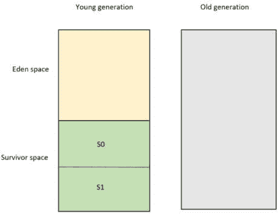
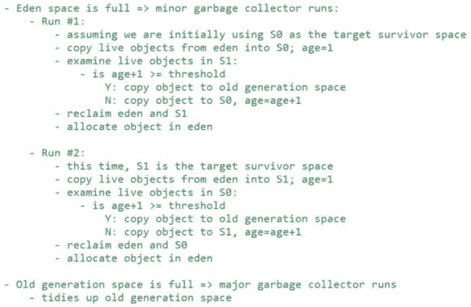
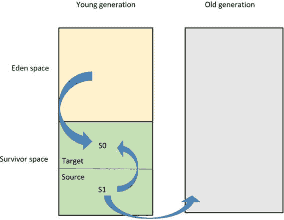
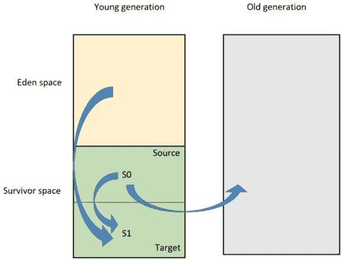
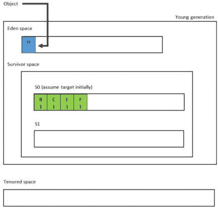
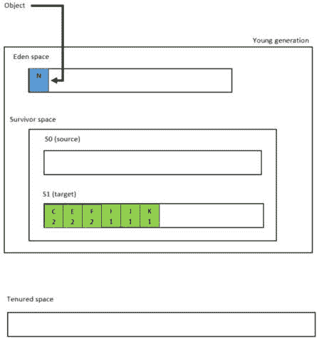
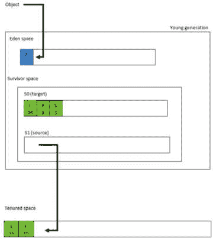

# 第三章：放大堆空间

在 *第二章* 中，我们讨论了内存中引用和对象之间的区别。引用及其引用的对象密切相关。我们发现，Java 的按值调用机制可能导致一个名为 **逃逸引用** 的安全问题，除了可变对象之外。借助示例代码和图表，我们探讨了这些问题以及如何通过防御性复制来解决它们。

我们知道原始类型和引用可以存在于栈和堆上，而对象仅存在于堆上。现在，我们准备更仔细地查看堆，为下一章关于 **垃圾收集**（**GC**）的内容做准备。在本章中，我们将涵盖以下主题：

+   探索堆上的不同代

+   学习如何使用这些空间

# 探索堆上的不同代

堆空间由两个不同的内存区域组成：

+   年轻代空间

+   老年代（持久）空间。

虽然我们不会在本章深入探讨 **GC** 过程，但我们需要解释什么是 *活* 对象。活对象是从 GC 根可达的对象。

## 垃圾收集根

GC 根是一种特殊的活对象，因此不符合 GC 条件。所有从 GC 根可达的对象也是活的，因此也不符合 GC 条件。GC 根在 GC 中充当起始点，即从这些根开始，标记所有可达的对象为 *活*。最常见的 GC 根如下：

+   栈上的局部变量

+   所有活跃的 Java 线程

+   静态变量（因为这些可以由它们的类引用）

+   **Java 本地接口**（**JNI**）引用 – 作为 JNI 调用一部分由本地代码创建的对象。这是 GC 根的一个非常特殊的情况，因为 JVM 无法知道对象是否被本地代码引用。

让我们检查这些空间在内存中的表现，如图 *图 3**.1* 所示：

图 3.1 – 堆代

在这一点上，我们需要简要定义，以便我们可以讨论如何使用这些空间：

+   **年轻代空间** – 年轻代空间，有时称为 **苗床** 或 **新** 空间，包含两个独立的区域：**伊甸** 空间和 **幸存** 空间。这两个区域都服务于不同的功能，总体目标是提高内存效率。我们将依次讨论它们：

    +   **伊甸空间**：*新*对象在伊甸空间中分配。当伊甸空间满了，没有空间再分配新对象时，年轻代（**次要**）垃圾收集器启动。

    +   **幸存空间**：有两个等分的幸存空间，即 S0 和 S1。次要垃圾收集器交替使用这些区域。我们将在稍后更详细地探讨这一点。

+   **老年代空间** – 这也被称为**晋升**空间。这是长期存在的对象所在的地方。换句话说，垃圾收集器将经过一定数量 GC 的存活对象移动到这里。当晋升空间满了，这会触发**主要**GC。

现在我们对空间有了简要的了解，让我们来看看它们是如何被使用的。

# 学习如何使用这些空间

要了解这些不同空间的使用方式，我们将分两个不同阶段来解释。最初，我们将检查在小型 GC 算法中如何使用这些空间。随后，通过一个示例，我们将展示算法的实际运行。

## 理解小型垃圾回收算法

让我们从小型 GC 算法开始。*图 3**.2*是小型 GC 过程的高级伪代码：

图 3.2 – 小型垃圾回收算法的伪代码

让我们通过一个*给定-当-然后*场景来检查前面图中概述的过程。

+   **给定**：**S0**作为目标幸存者空间和**S1**作为初始源幸存者空间。

+   **当**：运行小型垃圾回收器。换句话说，eden 空间没有足够的空间来分配 JVM 希望分配的对象。

+   `1`，因为它们刚刚度过了它们的第一轮 GC 周期。

+   **S1**被检查，并且任何年龄达到给定阈值（**晋升阈值**）的存活对象被复制到老年代空间，这意味着它们已经晋升。换句话说，这是一个长期存在的对象，所以将其复制到老年代区域，那里有更长时间存在的对象。这使得未来的小型 GC 运行更加高效，因为它确保这些相同的对象不会被重新检查。

+   剩余的存活**S1**对象（那些没有晋升的对象）被复制到**S0**，它们的年龄增加一个，因为它们刚刚通过了另一个 GC 周期。

注意，使用 JVM 参数`-XX:MaxTenuringThreshold`可以配置晋升阈值。实际上，这个标志允许您自定义对象在最终晋升到老年代之前将在幸存者空间中停留多少次 GC 周期。然而，在使用此参数时必须谨慎，因为大于 15 的值指定对象永远不会晋升，从而无限期地用旧对象填满幸存者空间。

*图 3**.3*显示了刚刚讨论的过程：

图 3.3 – 以 S0 为目标空间的小型垃圾回收

这里是一个总结：

+   将实时 eden 对象复制到`1`

+   将旧的存活**S1**对象复制到长生存空间

+   将年轻的存活**S1**对象复制到**S0**（年龄增加）

现在 eden 和**S1**中的存活对象已经被复制（保存），现在 eden 和**S1**都可以被回收。

当小回收器再次运行时，每个对象有`1`个集合。由于**S1**现在是目标空间，**S0**成为源空间。垃圾收集器检查**S0**并将长寿对象复制到持久代空间，将短寿对象复制到**S1**。*图 3.4*显示了此过程：

图 3.4 – 以 S1 为目标空间的小型垃圾收集

这里是一个总结：

+   所有的活动 eden 对象都被复制到`1`）

+   复制老、活动的**S0**对象到长生存空间

+   复制年轻、活动的**S0**对象到**S1**（年龄增加）

由于 eden 和**S0**中的活动对象已被复制，因此 eden 和**S0**都可以被回收。

现在我们已经讨论了空间的使用方式，我们将通过一个例子来增强我们的解释。

## 展示小垃圾收集算法的实际操作

*图 3.5*显示了在第一次小垃圾收集器运行之前内存中的情况：

图 3.5 – 小型垃圾收集第 1 次之前的初始堆状态

在前面的图中，对象**H**代表 JVM 试图在 eden 空间为其分配内存的对象。eden 空间包括以下内容：

+   红色对象没有来自 GC 根的引用。它们符合 GC 的条件。

+   绿色对象是活动对象，意味着它们是 GC 根或者可以通过 GC 根访问。这些对象**不**符合 GC 的条件。

+   白色空间是 eden 空间中的间隙。如果有足够的连续空间来分配对象，则对象存储在 eden 中，并返回其引用。然而，如果由于内存碎片化，没有足够的连续空间来分配对象，则会触发小（年轻代）GC。

存活空间包括以下内容：

+   **S0** – 初始为空；我们将假设 JVM 最初使用它作为目标存活空间

+   **S1** – 初始也为空；由于**S0**是目标空间，**S1**成为源空间（由于**S1**最初没有内容，这第一次没有影响）

持久代（老年代）空间包括长寿对象。长寿对象是经过一定预定义数量的次要 GC 后存活的对象。这是一个可以通过`-XX:MaxTenuringThreshold` JVM 参数自定义的阈值值。

如*图 3.5*所示，JVM 需要分配对象**H**，但由于 eden 空间不足，这触发了小（年轻代）GC。对象**A**、**D**和**G**可以从 eden 中移除，而对象**B**、**C**、**E**和**F**可以移动到**S0**。eden 空间被回收，对象**H**被分配。

*图 3.6*显示了第一次小 GC 完成后的堆状态：

图 3.6 – 小型垃圾回收后的堆状态 #1

在前面的图中，对象 **H** 被分配在 eden 中，而对象 **B**、**C**、**E** 和 **F** 在 **S0** 中。注意，**S0** 中的每个对象年龄都是 **1**，因为这是它们第一次在小型垃圾回收后幸存。

*图 3**.7* 展示了第二次小型垃圾回收运行前的堆状态：

图 3.7 – 小型垃圾回收前的堆状态 #2

在 *图 3**.7* 中，JVM 正在尝试分配对象 **N**，但在 eden 中没有为其留出空间。这将触发小型垃圾收集器运行（第二次）。在 eden 空间中，对象 **H**、**L** 和 **M** 符合垃圾收集条件，而对象 **I**、**J** 和 **K** 是活动的。在幸存空间 **S0** 中，对象 **B** 现在符合垃圾收集条件，而对象 **C**、**E** 和 **F** 是活动的。

*图 3**.8* 展示了第二次小型垃圾回收运行后的堆状态：

图 3.8 – 小型垃圾回收后的堆状态 #2

在 *图 3**.8* 中，**S1** 现在是目标幸存空间，因此 **S0** 是源。垃圾收集器将活动对象 **C**、**E** 和 **F** 从 **S0** 移动到 **S1**，将它们的年龄值从 **1** 增加到 **2**。然后垃圾收集器回收 **S0** 空间。

对象 **I**、**J** 和 **K** 被从 eden 移动到 **S1**，年龄值为 **1**，因为这是它们第一次在小型垃圾回收后幸存。eden 空间被回收，并分配了对象 **N**。

最后要展示的是对象移动到持久空间。这正是 *图* *3**.9* 所展示的：

图 3.9 – 对象移动到持久空间

*图 3**.9* 代表经过 15 次小型垃圾回收后的堆状态。对象 **E** 和 **F** 移动到持久空间，因为它们的年龄值 **15** 达到了阈值（默认阈值是 15）。下一次小型垃圾收集器运行时，这两个对象将不会出现，从而使得垃圾收集器运行得更有效率。

对象 **X** 是触发小型垃圾收集器的对象，对于这次迭代，**S1** 是源，**S0** 是目标幸存空间。对象 **J**、**P** 和 **S** 仍然是活动的，分别以 **14**、**8** 和 **3** 的年龄计数从 **S1** 移动到 **S0**。

在我们结束这一章之前，值得提一下一些其他相关的 JVM 标志：

+   `-Xms` 和 `-Xmx` 分别指定堆的最小和最大大小。

+   `-XX:NewSize` 和 `-XX:MaxNewSize` 分别指定年轻代的最小和最大大小。

+   `-XX:SurvivorRatio` 指定两个幸存空间相对于 eden 空间的大小比例。例如，`-XX:SurvivorRatio=6` 将 eden 和一个幸存空间之间的比例设置为 `1:6`。换句话说，每个幸存空间将是 eden 的六分之一大小，因此是年轻代（不是七分之一，因为有两个幸存空间）的八分之一。

+   `-XX:NewRatio` 表示新年代相对于老年代的大小比例。例如，`-XX:NewRatio=3` 将新年代和老年代之间的比例设置为 `1:3`。这意味着新年代（包括 eden 和两个幸存空间）占堆的 25%，而老年代占剩余的 75%。

+   `-XX:PretenureSizeThreshold` – 如果一个对象的大小大于此标志指定的值，则该对象将立即晋升到老年代，这意味着对象直接分配到老年代空间。默认值是 `0`，这意味着没有对象将直接分配到堆的老年代。

通常，保持年轻代空间在总堆大小的 25%到 33%之间。这确保了老年代空间始终更大。这是可取的，因为完全垃圾回收（full GCs）比部分垃圾回收（minor ones）更昂贵。

本章内容到此结束。让我们回顾一下主要要点。

# 概述

在本章中，我们聚焦于堆空间。我们首先检查堆上的不同代，即年轻代空间和老年代（晋升）空间。

年轻代空间分为两个空间：eden 空间和幸存空间。eden 空间是新对象分配的地方。幸存空间由两个大小相等的空间组成，即 S0 和 S1。在回收内存时，小（年轻代）垃圾回收器使用这些幸存空间。当 eden 空间中没有足够的连续空间来分配对象时，会触发小垃圾回收。我们使用伪代码和图表来检查小垃圾回收器如何利用代和空间。然后，我们使用具有几个用例场景的示例来加强这些概念。

晋升空间是长期存活对象所在的地方。我们看到了如果一个对象在几个垃圾回收周期中存活下来，该对象将移动到晋升空间，以使后续的小垃圾回收周期更高效。最后，我们查看相关的 JVM 标志。

现在我们已经了解了堆，并对小垃圾回收器有了高级概述，我们准备深入探讨垃圾回收（GC），这是下一章的主题。
