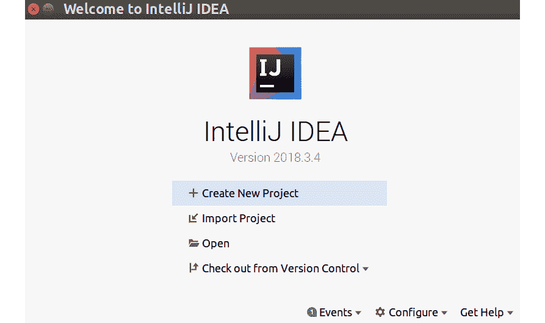
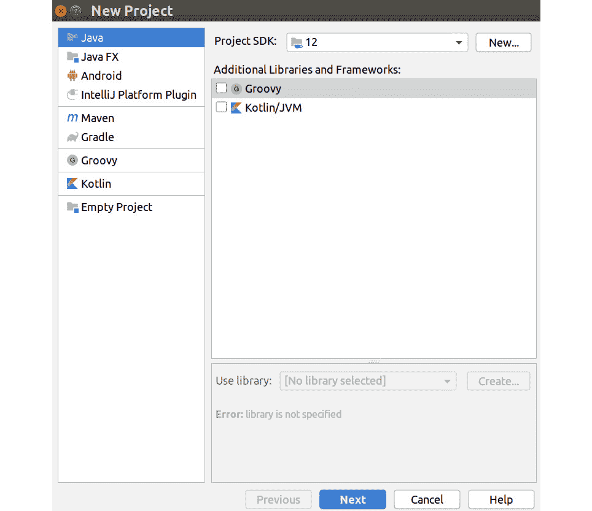
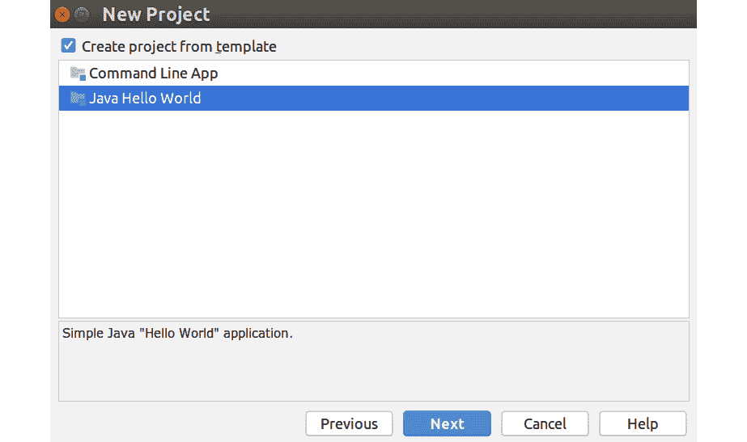
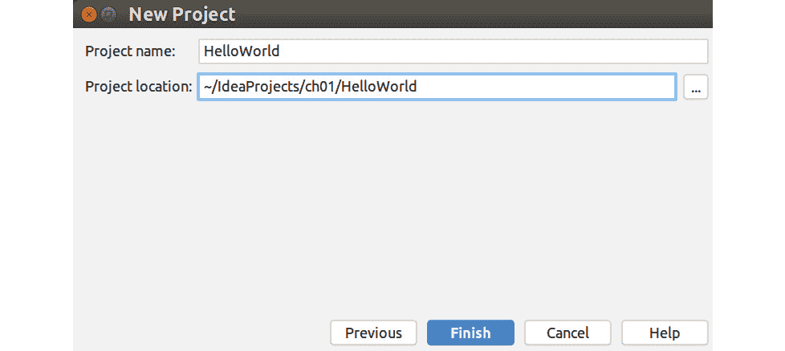
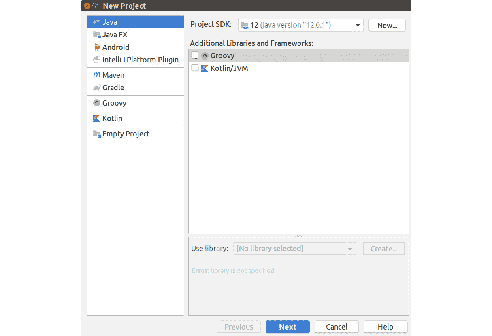
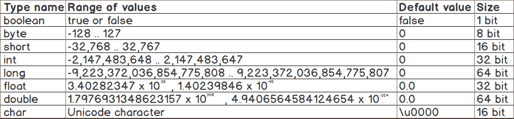

# 第一章：1. 入门

概述

在本章中，我们将介绍 Java 的基础知识。你将首先学习如何编写和编译你的第一个 "Hello World!" 程序——这是学习任何新语言的第一个传统步骤。然后，我们将讨论 **命令行界面**（**CLI**）和 **图形用户界面**（**GUI**）之间的区别，以及两者的相对优势。到本章结束时，你将理解变量背后的基本概念，了解如何在其中存储数据，甚至如何对你的代码进行注释。

# 简介

在学习如何使用几乎任何编程语言进行编程时，你通常会测试的第一个示例被称为 "hello world"。这是可能的最简单应用程序；目的是将 "hello world" 表达式写入编程环境提供的任何用户界面。执行此程序将向你介绍使用 IntelliJ 编辑器编写代码的基础，利用不同类型的数据打印到用户界面，以及如何对你的代码添加注释。

当你编写第一个程序时，你也会发现 Java 的语法是如何构建的，以及它与 C 或 C++ 等其他语言的关系。理解语法是开始阅读代码的关键。你将学习如何区分命令和函数的开始和结束，如何在代码块之间传递参数，以及如何添加注释，这些注释将有助于你在将来回顾你的软件时。

本章介绍了编写和测试程序的基础，这是构建本书中所有代码的第一步。

# 编写、编译和执行你的 "Hello World!" 程序

在前言中，你看到了如何安装 IntelliJ 开发环境。虽然你可以用任何文本编辑器编写 Java 代码，但我们认为看到如何使用像上述软件包这样的最先进工具来创建应用程序是很好的。

然而，在一步一步地指导你运行第一个程序之前，我们应该先看看将成为你第一个在 Java 上运行的可执行代码。以下代码列表显示了程序。阅读它，我们稍后会修订每个部分的功能：

```java
public class Main {
    public static void main (String[] args) {
        System.out.println("Hello World!"); 
    }
}
```

第一行是我们所说的类定义。Java 中的所有程序都被称作 `main`。在这个程序中，你可以看到 `Main` 类包含一个名为 `main` 的方法，这个方法会将句子 "Hello World!" 打印到系统的默认输出。

包含在类定义（`public class Main`）中的代码表明，这个类本身是公开的，这意味着它可以从你电脑上运行的其他程序中访问。同样，方法定义（`public static void main(String[] args)`）也是这样。然而，还有一些其他的事情需要我们注意：

+   `static`表示系统中没有实例化`main`方法。由于 Java 虚拟机的工作方式，`main`方法必须是静态的，否则将无法执行它。

+   `void`表示`main`方法不会向调用它的任何代码返回任何内容。实际上，方法可以向执行它的代码发送答案，正如我们将在本书后面看到的那样。

+   `main`是方法的名称。你不能给它赋予不同的名称，因为这个方法是使程序可执行的方法，需要这样命名。

+   `String[] args`是`main`方法的参数。参数作为字符串列表传递。换句话说，程序可以从计算机内的其他部分获取参数并用作数据。在`main`方法的具体情况下，这些是在调用程序时可以在**命令行界面**（CLI）中输入的字符串。

## 练习 1：在 Java 中创建你的 Hello World 程序

IntelliJ 为你提供了一个预先制作的“Hello World”模板。模板可以帮助你更快地开始编写代码，因为它们提供了你可能需要的组件来加速开发。模板也可以用于教育目的；当测试“Hello World”时就是这种情况。

对于这个第一个练习，我们从编辑器开始。我们将保留一些默认选项不变。我们稍后会看到如何根据我们的需求个性化一些选项：

1.  打开 IntelliJ，你会看到一个窗口提供给你几个选项。点击`创建新项目`。它应该是列表中的第一个选项：

    图 1.1：在 IntelliJ IDE 中创建新项目

1.  应该出现一个新的界面。这里的默认选项是为了创建一个 Java 程序，所以你只需点击`下一步`：

    图 1.2：创建新的 Java 项目

1.  打勾以从模板创建项目。点击`Java Hello World`然后点击`下一步`：

    图 1.3：从模板创建 Java Hello World 项目

1.  将项目命名为`chapter01`。然后，点击`完成`：

    图 1.4：创建 Hello World 项目

1.  由于我们没有选择存储项目的文件夹（故意为之），IntelliJ 会提供在用户空间内创建默认项目文件夹的可能性。点击`确定`：

    图 1.5：IntelliJ IDE 中的默认项目文件夹选项

1.  你将看到一个弹出窗口，其中包含有关如何使用该软件的提示。如果你以前从未使用过这种类型的开发环境，那么这是了解每次 IntelliJ 启动时如何工作的好方法。选择你的首选项，然后点击`关闭`：![图 1.6：如何使用 IDE 的提示

    ![图片 C13927_01_06.jpg]

    图 1.6：如何使用 IDE 的提示

1.  IntelliJ 会提醒你有关使用专门用于学习更多关于编程环境信息的特殊标签页的可能性。点击`明白了`。

1.  编辑器显示一个菜单栏、代码导航栏、项目导航区域以及实际的编辑器，在这里你可以看到我们之前解释过的代码。现在，是时候测试它了。点击`运行`按钮（这是代码导航栏右侧的三角形）。![图 1.7：通过点击运行按钮执行程序

    ![图片 C13927_01_07.jpg]

    图 1.7：通过点击运行按钮执行程序

1.  当程序运行时，IntelliJ 底部的终端窗口展开。在这里，你可以看到软件如何调用 JVM，程序的结果，以及编辑器中的一行显示`Process finished with exit code 0`，这意味着没有发生错误。![图 1.8：JVM 显示输出

    ![图片 C13927_01_08.jpg]

图 1.8：JVM 显示输出

注意

由于我们在这个例子中默认选择了所有选项，所以你会看到我们的程序被命名为`Main.java`。在下一章中，我们将看到如何创建我们自己命名的程序。

## 基本语法和命名约定

在`hello world`程序中，当你关注语法时，首先会注意到我们如何将代码分组到由花括号`{`和`}`标记的块中。`Main`类包含`main`方法。换句话说，`main`被嵌套在`Main`中。这就是 Java 中定义类的方式——原则上，它们包含它们将要使用到的所有方法。

Java 语法的另一个方面是大小写很重要。如果一个命令被定义为`Print`，它不同于另一个名为`print`的命令，编译器会将它们识别为不同的。大小写属于一种约定，是程序员之间关于 Java 中命名格式的一种不成文规则。你会注意到类被命名为`HelloWorld`。在 Java 中，约定规定方法、类、变量等应该通过使用大写字母来连接单词，以此作为单词分隔的标记。此外，类的名称应该以大写字母开头。

注意

当你刚开始时，很容易混淆语法，语法是严格的，必须遵守，以便编译器能够运行，以及约定，约定是为了让开发者更好地理解代码应该如何工作。

在一定程度上，Java 编译器不关心空白字符，但有一个关于使用它们的约定，可以使代码更易读。你看到的第一个代码列表（`Example01.java`）可以重写如下，一旦编译和执行，将产生完全相同的结果：

```java
public class Main {
    public static void main(String[] args) { 
        System.out.println("Hello World!"); 
    }
}
```

`System.out.println("Hello World!")` 函数调用将在 CLI 上打印出预期的消息。该命令嵌套在 `main(String[] args)` 方法定义中，该方法定义又嵌套在 `class` 定义中。你可以添加更多空白字符，但这不会影响程序的功能。这是 Java 语法的一部分，也是其他编程语言（如 C，C++和 Scala）的一部分。

此外，请注意，“`Hello World!`” 是一个 `String`，一种数据类型。下一节将探讨哪些类型的数据可以作为参数发送到 `System.out.println()` 方法调用。

## 打印不同数据类型

在 Java 中，定义具有使用不同参数集的能力的方法是很常见的。例如，`System.out.println()` 方法可以打印出不仅仅是文本的其他类型的数据。例如，你可以尝试打印出一个简单的数字并查看结果。`Example03.java` 在代码中添加了几行，以展示不同类型的数据：

```java
public class Main {
    public static void main(String[] args) { 
        System.out.println("This is text"); 
        System.out.println('A'); 
        System.out.println(53); 
        System.out.println(23.08f); 
        System.out.println(1.97); 
        System.out.println(true); 
    }
}
```

之前的例子将在 CLI 上打印出四行，代表发送给 `System.out.println()` 方法的不同参数。结果将如下所示：

```java
This is text
A
53
23.08
1.97
true
Process finished with exit code 0
```

你在这个结果中看到了六种不同的数据类型：一些文本，一个字符，一个整数，两种不同的十进制数，和一个布尔陈述。在 Java 编程语言中，我们分别将这些数据类型定义为 `String`，`char`，`int`，`float`，`double` 和 `boolean`。关于数据类型还有很多东西要学习，但让我们首先介绍一个新主题：**变量**。这将有助于理解数据类型为什么很重要。

## 变量和变量类型

变量是赋予计算机内存槽位的可读性名称。每个槽位都可以存储一些数据，例如一个数字，一段文本，一个密码，或室外温度的值。这类数据就是我们所说的**变量类型**。在我们的编程语言中，变量类型和数据类型的数量一样多。我们使用的数据类型定义了分配给存储数据的内存量。一个字节（由 8 位组成）比一个整数（由 32 位组成）小。一个**字符串**由多个字符组成，因此比整数大。

`byte`, `int`（整数简称），`String` 和 `char`（字符简称）是变量类型。为了使用变量，你需要为编译器定义它，以便编译器知道它需要为存储数据分配一些空间。变量定义是通过首先确定其类型，然后是变量的名称，然后你可以选择性地用某个值初始化它。

以下代码列表显示了如何定义几个不同类型的变量：

```java
// a counter
int counter = 0;
// a String
String errMsg = "You should press 'NEXT' to continue";
// a boolean
boolean isConnected = false;
```

下一个练习将指导你如何修改 `Example03.java` 中的代码列表，以便打印出变量的值。

## 练习 2：打印不同类型的数据

在这个练习中，我们将声明不同数据类型的变量并将它们打印为输出。为此，执行以下步骤：

1.  打开 IntelliJ。如果你还没有尝试 `Example03.java` 中的代码列表，让我们先使用 `HelloWorld` 模板创建一个新的项目：

    图 1.9：创建一个新的 Java 项目

1.  一旦你到达由开发环境生成的代码步骤，复制所有代码，将其擦除，然后粘贴 `Example03.java` 列表中的代码：

1.  尝试运行代码，并检查结果是否符合 *打印不同数据类型* 中解释的内容。

1.  首先，声明一个 `String` 类型的变量并初始化它：

    ```java
    public class Main {
        public static void main(String[] args) { 
            String t = "This is text";
            System.out.println("This is text"); 
            System.out.println('A'); 
            System.out.println(53); 
            System.out.println(23.08f); 
            System.out.println(1.97); 
            System.out.println(true); 
        }
    }
    ```

1.  然后，将第一个 `System.out.println()` 命令中的文本替换为变量。由于变量链接到包含字符串的内存块，执行程序将给出相同的结果：

    ```java
    public class Main {
        public static void main(String[] args) { 
            String t = "This is a text";
            System.out.println(t); 
            System.out.println('A'); 
            System.out.println(53); 
            System.out.println(23.08f); 
            System.out.println(1.97); 
            System.out.println(true); 
        }
    }
    ```

1.  继续声明一个 `char` 类型的变量，另一个 `int` 类型的变量，一个 `double` 类型的变量，最后，一个 `boolean` 类型的变量。在打印到 CLI 时，使用变量名而不是值：

    ```java
    public class Main {
        public static void main(String[] args) { 
            String t = "This is a text";
            char c = 'A';
            int i = 53;
            float f = 23.08f;
            double d = 1.97;
            boolean b = true;
            System.out.println(t);
            System.out.println(c);
            System.out.println(i);
            System.out.println(f);
            System.out.println(d);
            System.out.println(b);
        }
    }
    ```

通过这个例子，你不仅学习了不同类型的数据以及存储这些数据的变量，还学习了方法如何处理多种数据类型。

注意

注意到当定义 `float` 类型时，需要在数字后面附加字母 f。这样，Java 就能区分这两种类型的十进制变量。

## 原始数据类型与引用数据类型

一些数据类型建立在其他类型之上。例如，字符串是由字符序列组成的，所以，从某种意义上说，没有字符就没有字符串。可以说字符比字符串对语言更核心。像字符一样，还有其他用于定义编程语言特性的数据类型。这些对于语言本身构建来说是基本的数据类型，我们称之为基本数据类型。

下表描述了你在 Java 中会发现的一些基本变量类型及其特性：



图 1.10：Java 中的基本类型

八种基本数据类型包括 `byte`、`short`、`int` 和 `long`)、`float` 和 `double`)、以及 `char`)。*练习 2，打印不同类型的数据* 展示了如何在我们的程序中使用这些类型中的变量。

注意

字符串不是原始数据类型。我们称之为引用数据类型。一个有助于你记住为什么它被称为“引用”的记忆法是，它不是链接到实际数据，而是链接到数据存储在内存中的位置；因此，它是“一个引用。”本书后面你还将介绍其他引用数据类型。请注意，`float`和`double`在处理一些十进制数的用途（如货币）时不够精确。Java 有一个高精度的十进制数据类型称为`BigDecimal`，但它不是原始类型。

## 空值（Null）

与原始数据类型有默认值一样，引用数据类型（可以是任何类型的数据）有一个共同的方式来表达它们不包含数据。作为一个引用类型变量的例子，定义为`empty`的字符串的默认值是`null`。

然而，空值比这要复杂得多——它还可以用来确定终止。继续以字符串的例子为例，当存储在内存中时，它将是一个以`null`结尾的字符数组。这样，就可以在字符串内进行迭代，因为有一个共同的方式来表示你已经到达了它的末尾。

在程序执行过程中，可以修改计算机内存的内容。我们通过在代码中使用变量来实现这一点。接下来的代码示例将向您展示如何在程序运行时创建一个空的`String`类型变量并修改其值：

```java
public class Main {
    public static void main(String[] args) { 
        String t = null;
        System.out.println(t); 
        t = "Joe ...";
        System.out.println(t); 
        t = "went fishing";
        System.out.println(t); 
    }
}
```

之前的例子展示了如何声明一个空字符串，如何在程序中修改其值，以及程序将如何处理显示空字符串的内容。它实际上会在 CLI 上打印出单词`null`。请查看程序的完整输出：

```java
null
Joe ...
went fishing
Process finished with exit code 0  
```

程序声明了一个空变量，并通过给它赋新值，用新内容覆盖了变量的内容。

## 字符和字符串

如同在*原始数据类型与引用数据类型*中解释的那样，字符串由字符序列组成。一个字符是一个代表字母表中的字母、数字、人类可读的符号（如感叹号）或甚至肉眼看不见的符号（如空白空间、换行符或制表符）的符号。字符串是变量，它引用内存中包含一维字符数组的部分。

Java 允许使用字符的数学组合来创建字符串。让我们以之前打印消息"`Joe . . . went fishing`"的例子为例。让我们修改它，使其将字符串的不同部分相加，而不是在每一步覆盖变量：

```java
public class Main {
    public static void main(String[] args) { 
        String t = null;
        System.out.println(t); 
        t = t + "Joe . . . ";
        System.out.println(t); 
        t = t + "Joe . . . went fishing";
        System.out.println(t); 
    }
}
```

这个程序的输出结果将是以下内容：

```java
null
nullJoe ...
nullJoe ... went fishing
Process finished with exit code 0
```

在这里发生的情况是，程序通过向字符串中追加新部分来使其变长，并打印出字符串。然而，结果是不可预期的（除非你真的想让程序在字符串前打印出`null`）。

现在是时候看看当你没有正确声明变量时会发生什么了。修改之前的代码列表，并从开发环境中观察结果。

## 练习 3：声明字符串

修改 `Example05.java` 中的代码示例，以查看开发环境将如何响应变量声明的无效性。为此，请执行以下步骤：

1.  首先，使用 `HelloWorld` 模板创建一个程序，并用 `Example05.java` 文件中的列表覆盖所有代码。

1.  尝试运行程序。你应该得到本节前面展示的结果。

1.  将声明字符串的行修改如下：

    ```java
    String t;
    ```

1.  当执行程序时，你会得到一个错误作为结果：

    ```java
    Error:(4, 28) java: variable t might not have been initialized
    ```

1.  声明字符串为空，即不包含任何字符。你可以通过以下代码行声明字符串：

    ```java
    String t = "";
    ```

    在进行此修改后，程序的结果将如下所示：

    ```java
    Joe ...
    Joe … went fishing
    Process finished with exit code 0
    ```

## 进行一些数学运算

你可以说，`Example05.java` 文件中的代码列表代表了一种 *添加* 字符串的方法。这种添加字符串的操作称为 *连接*。同时，还可以使用变量作为方程的一部分执行各种简单和复杂的数学运算。

Java 中的基本数学运算符是加法 (+), 减法 (-), 乘法 (*), 和除法 (/)。这里展示了某些操作是如何执行的示例：

```java
t = a + 5;
b = t * 6.23;
n = g / s - 45;
```

操作的顺序是正常数学的顺序：先乘除，后加减。如果需要嵌套，可以使用花括号：

```java
h = (4 + t) / 2;
f = j * (e – 5 / 2);
```

还有其他数学运算符，例如平方根 (`sqrt()`), 最小值 (`min()`), 和向上取整 (`round()`)。调用这些更高级的操作需要调用 Java 中的 `Math` 库中的方法。让我们看看一些示例代码，它将执行一些数学运算以了解这是如何工作的，稍后我们将使用这些方法尝试解决一个简单的三角学方程：

```java
public class Main {
    public static void main(String[] args) {
        float f = 51.49f;
        System.out.println(f);
        int i = Math.round(f);
        System.out.println(i);
    }
}
```

在前面的例子中，你声明了一个 `float` 类型的变量并打印它。接下来，你声明了一个 `int` 类型的变量，并用上一步变量四舍五入的结果初始化它，这样就消除了数字的小数部分。你可以看到 `round()` 是 Java 的 `Math` 库的一部分，因此必须这样调用。

`Math.round()` 和 `System.out.println()` 分别是调用属于标准 Java 库 `Math` 和 `System` 的方法的示例。Java 提供了大量的有用方法，这将使你与软件的交互变得快速而简单。我们将在本书的后面部分探讨它们。

## 练习 4：解决一个简单的三角学问题

本练习的目标是求解直角三角形的斜边长度，给定其他两边的长度。请注意，计算直角三角形斜边的公式如下：*h*2 *= a*2 *+ b*2

![图 1.11：一个直角三角形，边长为 a 和 b，h 为斜边]


图 1.11：一个直角三角形，边长为 a 和 b，h 为斜边

要做到这一点，请执行以下步骤：

1.  再次以`HelloWorld`模板作为练习的出发点，创建程序，然后通过修改其内容来构建一个新的程序。

1.  声明每个问题变量的值。将对应斜边的变量初始化为`0`。将所有变量声明为`double`类型：

    ```java
    double a = 3;
    double b = 4;
    double h = 0;
    ```

1.  由于`a`和`b`的平方和等于`h`的平方，将方程重写如下：

    ```java
    h = Math.sqrt(a*a + b*b);
    ```

    `sqrt()`方法用于获取一个数的平方根。

1.  添加必要的代码以打印出结果：

    ```java
    System.out.println(h);
    ```

    该程序的预期结果应该是以下内容：

    ```java
    5.0
    Process finished with exit code 0
    ```

1.  编程语言通常提供多种解决问题的方法。在这个特定的情况下，你可以通过使用`Math.pow()`方法来解决变量`a`和`b`的平方的计算。这将通过参数给出的指数来计算基数的幂：

    ```java
    h = Math.sqrt(Math.pow(a,2) + Math.pow(b,2));
    ```

    经过所有修改后的最终程序形式如下：

    ```java
    public class Main {
        public static void main(String[] args) {
            double a = 3;
            double b = 4;
            double h = 0;
            h = Math.sqrt(Math.pow(a,2) + Math.pow(b,2));
            System.out.println(h);
        }
    }
    ```

## 注释有助于你共享代码

到目前为止，你只是编写程序并测试它们。但如果你打算参与一个大型软件项目，你将在其中与其他人合作开发应用程序，你必须与他人共享你的代码。共享代码是当代开发者工作的重要部分，为了共享代码，你必须对代码进行注释，以便他人可以理解你为什么以你代码中的方式解决某些挑战。

在 Java 中，有两种方式来注释代码：内联注释，使用双斜杠`//`标记；以及更广泛的注释，通常用于大块代码的开头，使用由斜杠和星号组成的开始标签`/*`和由星号和斜杠组成的结束标签`*/`。

以下示例展示了如何对上一个练习的结果程序添加注释：

```java
public class Main {
    public static void main(String[] args) {
        double a = 3; // first side of the triangle
        double b = 4; // second side of the triangle
        double h = 0; // hypotenuse, init with value 0
        // equation to solve the hypotenuse
        h = Math.sqrt(Math.pow(a,2) + Math.pow(b,2));
        System.out.println(h); // print out the results
    }
}
```

在前面的例子中，我们注释了程序的开头和每一行。目的是突出不同的代码注释方式——内联注释、行前注释、代码开头注释。你会在注释中注意到一些特殊的东西；例如，开头注释包括代码的作者（最终，你也会包括你的联系信息）以及版权声明，让人们知道他们可以多大程度上重新使用你的代码。

注意

代码的版权声明通常取决于特定公司的政策，并且几乎每个项目都有所不同。在添加这些到你的代码时要小心。

## 命令行界面（CLI）与图形用户界面（GUI）

在这本书中，我们将使用 CLI 作为测试和部署代码的方式。另一方面，我们将使用 IntelliJ 开发环境编写代码，它有一个 **图形用户界面**（**GUI**）。我们有意避免编写将使用 GUI 与用户交互的程序。Java 在当前形式下，主要用于作为在服务器上运行的服务，因此生成 GUI 不是使用 Java 的主要目标。

到目前为止，这本书已经邀请你从 IntelliJ 环境中运行代码。接下来的练习将帮助你创建一个完全编译的应用程序并在 CLI 中运行它。

## 练习 5：从 CLI 运行代码

我们将从创建 `HelloWorld` 示例开始。我们将编译它，然后从终端窗口中查找它。你必须记住你创建程序所在的文件夹，因为我们将从那里执行它。在这个例子中，我们将文件夹命名为 `chapter01`。如果你给它起了不同的名字，你将不得不记住在代码中必要的时候使用正确的文件夹名称：

1.  点击 `构建项目` 按钮（这是工具栏上的锤子），检查系统没有抛出任何错误。如果有任何错误，窗口底部的控制台将打开，指示可能的错误。

1.  接下来，在编辑器内打开终端，你将在环境窗口的底部看到一个按钮。这将显示一个从程序创建位置开始的 CLI。你可以通过输入 `ls` 命令来查看文件夹的内容：

    ```java
    usr@localhost:~/IdeaProjects/chapter01$ ls
    chapter01.iml  out  src
    ```

1.  将有两个不同的文件夹和一个文件。我们感兴趣的是检查名为 `out` 的文件夹。它是包含我们程序编译版本的文件夹。

1.  通过输入 `cd out` 命令导航到该文件夹。这个文件夹包含一个名为 `production` 的单个子文件夹——进入它，以及随后的 `chapter01` 子文件夹：

    ```java
    usr@localhost:~/IdeaProjects/chapter01$ cd out
    usr@localhost:~/IdeaProjects/chapter01/out$ cd production
    usr@localhost:~/IdeaProjects/chapter01/out/production$ cd chapter01
    usr@localhost:~/IdeaProjects/chapter01/out/production/chapter01$ ls
    Main.class
    ```

1.  一旦到达正确的文件夹，你将找到一个名为 `Main.class` 的文件。这是你程序的编译版本。要执行它，你需要调用 `java Main` 命令。你将直接在 CLI 中看到程序的结果：

    ```java
    usr@localhost:~/IdeaProjects/chapter01/out/production/chapter01$ java Main
    Hello World!
    ```

## 活动 1：获取两个数字的最小值

编写一个程序，该程序将检查作为变量输入的两个数字，并打印出消息 "`两个数字的最小值：XX 和 YY 是 ZZ`"，其中 `XX`、`YY` 和 `ZZ` 分别代表两个变量的值和操作的结果。为此，执行以下步骤：

1.  声明 3 个双精度变量：`a`、`b` 和 `m`。分别用 `3`、`4` 和 `0` 初始化它们。

1.  创建一个 `String` 变量 `r`，它应该包含要打印的输出消息。

1.  使用 `min()` 方法获取两个数字的最小值并将值存储在 m 中。

1.  打印结果。

    注意

    活动的解决方案可以在第 532 页找到。

# 摘要

本章向你介绍了 IntelliJ 开发环境的使用，这是本书中将使用的基工具。IntelliJ 的许多功能在其他工具中也很常见，包括菜单中使用的语言和整体编程界面。

你已经看到了 Java 语法的一些基本方面：如何定义类，如何将代码嵌套在花括号内，以及分号如何结束每个命令。注释有助于使代码更易于阅读，无论是与其他可能合作的开发者，还是在你未来回顾代码时。

原始类型提供了一组可能的变量类型，这些类型可以在你的程序中使用，用于携带数据、存储操作结果以及在代码的不同块之间传输信息。

本章中的所有示例都是基于修改我们用作出发点的初始示例构建的：“hello world”——即，在命令行界面打印一个字符串。在后面的章节中，你将学习如何从头创建自己的类，根据你的需求命名它们，并将它们存储在不同的文件夹中。下一章将专门介绍 Java 中控制程序流程的语句。

KAY34
