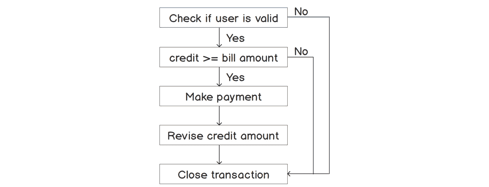

# 第二章：2. 学习基础知识

概述

在本章中，我们将执行不具有我们迄今为止所看到的典型线性流程的程序。您将首先学习如何使用 if、else、else if 和 switch-case 语句来控制程序的流程。您将练习在 Java 中运行 for、while 和 do-while 循环，以执行重复性任务，以及如何传递命令行参数来修改程序的运行方式。到本章结束时，您将能够实现不可变、静态（全局）变量，以及 Java 的变量类型推断机制。

# 简介

商业应用程序有许多特殊情况。这些条件可能包括从特定年份开始寻找分配规则的变化，或者根据员工的职位不同而以不同的方式处理不同类型的员工。为了编写这样的特殊情况代码，您将需要条件逻辑。您基本上告诉计算机在满足特定条件时执行一系列操作。

在我们深入探讨高级 Java 主题之前，您需要了解 Java 语法的基础知识。虽然这部分内容可能看起来很简单，但您会发现您需要在您的应用程序中反复使用本章中展示的技术和语法。

如您在*第一章* *入门*中看到的，Java 的语法大量借鉴了 C 和 C++。这同样适用于控制程序流程的条件语句。Java，像大多数计算机语言一样，允许您这样做。本章涵盖了 Java 语言的基本语法，特别是您控制应用程序流程的方法。

本章，以及下一章关于面向对象编程的章节，将使您对 Java 程序的工作方式有良好的实际了解。您将能够承担更高级的 API 和主题。通过这些基本材料，您将准备好过渡到更复杂的代码。

# 控制程序的流程

想象一下从您的电子钱包中支付账单。只有当您的电子钱包中的信用余额大于或等于账单金额时，您才能进行支付。以下流程图显示了可以实现的简单逻辑：


图 2.1：if-else 语句的代表性流程图

在这里，信用额度决定了程序的执行路径。为了便于此类场景，Java 使用`if`语句。

使用`if`语句，当且仅当特定条件为真时，您的应用程序将执行一段代码。在以下代码中，如果`happy`变量为`true`，则紧随`if`语句之后的代码块将执行。如果`happy`变量不是`true`，则紧随`if`语句之后的代码块将不会执行。

```java
boolean happy = true;// initialize a Boolean variable as true
if (happy) //Checks if happy is true
    System.out.println("I am happy.");
```

## 练习 1：创建基本的 if 语句

在大多数软件行业中，您只负责代码的一个模块，并且您可能已经知道变量中存储的值。在这种情况下，您可以使用`if`语句和`print`语句。在这个练习中，使用`if`语句检查分配给变量的值是`true`还是`false`：

1.  为本章和其他章节的示例创建一个目录。文件夹命名为`sources`。

1.  在 IntelliJ 中，从文件菜单中选择`文件` -> `新建` -> `项目`。

1.  在`新建项目`对话框中，选择`Java`项目。点击`下一步`。

1.  打开复选框以从模板创建项目。点击`命令行应用程序`。点击`下一步`。

1.  将项目命名为`chapter02`。

1.  对于项目位置，点击带有三个点（`…`）的按钮，然后选择您之前创建的`sources`文件夹。

1.  删除基本包名，使此条目为空。您将在第六章的*库、包和模块*中使用 Java 包。

1.  点击`完成`。

    IntelliJ 将创建一个名为`chapter02`的项目，并在`chapter02`内部创建一个`src`文件夹。这是您的 Java 代码将存放的地方。IntelliJ 还会创建一个名为`Main`的类：

    ```java
    public class Main {
        public static void main(String[] args) {
        // write your code here
        }
    }
    ```

    将名为`Main`的类重命名为`Exercise01`。（我们将在本章创建许多小示例。）

1.  在文本编辑器窗口中双击单词`Main`，然后右键单击它。

1.  从上下文菜单中选择`重构` | `重命名…`，输入`Exercise01`，然后按`Enter`。

    您现在将看到以下代码：

    ```java
    public class Exercise01 {
        public static void main(String[] args) {
        // write your code here
        }
    }
    ```

1.  在`main()`方法中，定义两个布尔变量`happy`和`sad`：

    ```java
        boolean happy = true;
        boolean sad = false;
    ```

1.  现在，创建两个`if`语句，如下所示：

    ```java
    if (happy)
        System.out.println("I am happy.");
    // Usually put the conditional code into a block.
    if (sad) {
        // You will not see this.
        System.out.println("The variable sad is true.");
    }
    ```

    最终的代码应类似于以下内容：

    ```java
    public class Exercise01 {
        public static void main(String[] args) {
            boolean happy = true;
            boolean sad = false;
            if (happy)
                System.out.println("I am happy.");
            // Usually put the conditional code into a block.
            if (sad) {
            // You will not see this.
                System.out.println("The variable sad is true.");
            }
        }
    }
    ```

1.  点击位于文本编辑器窗口左侧、指向类名`Exercise01`的绿色箭头。选择第一个菜单选项，`运行` `Exercise01.main()`。

1.  在`运行`窗口中，您将看到您的 Java 程序路径，然后是以下输出：

    ```java
    I am happy.
    ```

`我很高兴。`这一行来自第一个`if`语句，因为`happy`布尔变量为真。

注意，第二个`if`语句没有执行，因为`sad`布尔变量为假。

您几乎总是想使用花括号来定义`if`条件后面的代码块。如果不这样做，您可能会在程序中发现奇怪的错误。例如，在以下代码中，将`i`变量设置为零的第二条语句将始终执行：

```java
if (i == 5)
    System.out.println("i is 5");
    i = 0;
```

与 Python 等语言不同，Java 中缩进不计。以下代码将更清晰地显示实际执行的内容：

```java
if (i == 5) {
    System.out.println("i is 5");
}
i = 0;
```

最后一行总是执行，因为它在花括号关闭后的`if`语句之外。

## 比较运算符

除了 Java 的布尔值外，您还可以在条件语句中使用比较。这些比较必须形成一个解析为`true`或`false`的布尔表达式。比较运算符允许您通过比较值来构建布尔表达式。Java 的主要比较运算符包括以下内容：


图 2.2：Java 中的比较运算符

比较运算符（如`==`）对于文本值的工作方式可能不符合您的预期。请参阅本章后面的*比较字符串*部分，了解如何比较文本值。

注意

单个等号`=`用于赋值。两个等号`==`用于比较值。因此，通常您永远不会在布尔表达式中使用`=`来检查条件。

## 练习 2：使用 Java 比较运算符

一个在线零售店仅在目的地距离商店 10 公里（km）范围内提供免费送货。根据最近商店位置和家的距离，我们可以使用比较运算符来编写此业务逻辑：

1.  在 IntelliJ 的`项目`面板中，右键单击名为`src`的文件夹。

1.  从菜单中选择`新建` -> `Java 类`。

1.  将新类的名称输入为`Exercise02`。

1.  定义名为`main()`的方法：

    ```java
    public static void main(String[] args) {
    }
    ```

1.  在`main()`方法内部，定义我们将用于比较的变量：

    ```java
    int maxDistance = 10;       // km
    int distanceToHome = 11;
    ```

1.  在变量声明后输入以下`if`语句：

    ```java
    if (distanceToHome > maxDistance) {
        System.out.println("Distance from the store to your home is");
        System.out.println("  more than " + maxDistance + "km away.");
        System.out.println("That is too far for free delivery.");
    }
    if (distanceToHome <= maxDistance) {
        System.out.println("Distance from the store to your home is");
        System.out.println("  within " + maxDistance + "km away.");
        System.out.println("You get free delivery!");
    }
    ```

    最终代码应类似于以下链接所示：[`packt.live/32Ca9YS`](https://packt.live/32Ca9YS)

1.  使用左侧的绿色箭头运行`Exercise02`程序。

    在`运行`窗口中，您将看到您的 Java 程序路径，然后是以下输出：

    ```java
    Distance from the store to your home is
      more than 10km away.
    That is too far for free delivery.
    ```

## 嵌套`if`语句

嵌套意味着在另一个代码结构中嵌入一个结构。您可以在任何代码块中嵌套`if`语句，包括在`if`语句之后的代码块。以下是一个嵌套`if`语句中逻辑如何评估的示例：



图 2.3：嵌套 if-else 语句的代表流程图

## 练习 3：实现嵌套`if`语句

在以下练习中，我们将嵌套一个`if`语句在另一个`if`语句中，以检查车辆的速度是否超过限速，如果是这样，是否超过可罚款的速度：

1.  使用前一个练习中的技术，创建一个名为`Exercise03`的新类。

1.  将`speed`、`speedForFine`和`maxSpeed`变量分别声明为`75`、`70`和`60`：

    ```java
    public class Exercise03 {
        public static void main(String[] args) {
            int speed = 75;
            int maxSpeed = 60;
            int speedForFine = 70;
        }
    }
    ```

1.  创建一个嵌套`if`语句，其中外层`if`语句检查速度是否大于或等于最大限速，内层循环检查速度是否大于或等于罚款限速：

    ```java
    // Nested if statements.
    if (speed >= maxSpeed) { 
        System.out.println("You're over the speed limit!"); 
    if (speed >= speedForFine) { 
        System.out.println("You are eligible for a fine!"); 
    }
    ```

1.  使用左侧的绿色箭头运行`Exercise03`程序。

    在`运行`窗口中，您将看到您的 Java 程序路径，然后是以下输出：

    ```java
    You're over the speed limit!
    You are eligible for a fine!
    ```

    注意

    尝试更改代码中的速度值，然后再次运行程序。您将看到不同的速度值会产生不同的输出。

## 使用 if 和 else 进行双向分支

如果`if`语句的条件不成立，则执行`if`语句代码块后面的`else`语句。您还可以使用`else if`语句提供额外的测试。

基本语法如下：

```java
if (speed > maxSpeed) {
    System.out.println("Your speed is greater than the max. speed limit");
} else if (speed < maxSpeed) {
    System.out.println("Your speed is less than the max. speed limit");
} else {
    System.out.println("Your speed is equal to the max. speed limit");
}
```

第三行（在 `else` 块中）只有在前两行（`if` 或 `else if` 代码块）都不为真时才会打印。无论速度的值如何，只有一行会打印。

## 练习 4：使用 if 和 else 语句

一个公平贸易咖啡烘焙商如果你订购超过 5 公斤的整咖啡豆，将提供 10% 的折扣，如果你订购超过 50 公斤，将提供 15% 的折扣。我们将使用 `if`、`else if` 和 `else` 语句来编写这些业务规则：

1.  使用之前练习中的技术，创建一个名为 `Exercise04` 的新类。

1.  进入 `main` 方法，并按以下方式声明变量：

    ```java
    public static void main(String[] args) {
        int noDiscount = 0;
        int mediumDiscount = 10;     // Percent
        int largeDiscount = 15;
        int mediumThreshold = 5;     // Kg
        int largeThreshold = 50;
        int purchaseAmount = 40;
    }
    ```

1.  输入以下 `if`、`else if` 和 `else` 语句：

    ```java
    if (purchaseAmount >= largeThreshold) {
        System.out.println("You get a discount of " + largeDiscount + "%");
    } else if (purchaseAmount >= mediumThreshold) {
        System.out.println("You get a discount of " + mediumDiscount + "%");
    } else {
        // Sorry
        System.out.println("You get a discount of " + noDiscount + "%");
    }
    ```

    注意，我们首先检查最大的阈值。这样做的原因是，大于或等于 `largeThreshold` 的值也将大于或等于 `mediumThreshold`。

    注意

    本练习的完整源代码可以在以下网址找到：[`packt.live/33UTu35`](https://packt.live/33UTu35)。

1.  使用左侧的绿色箭头运行 `Exercise04` 程序。

    在 **Run** 窗口中，你会看到你的 Java 程序的路径，然后是以下输出：

    ```java
    You get a discount of 10%
    ```

## 使用复杂条件

Java 允许你使用逻辑运算符创建复杂的条件语句。逻辑运算符通常只用于布尔值。以下是 Java 中可用的逻辑运算符：

+   `AND (&&)`: 如果 `a` 和 `b` 都为 `true`，则 `a` && `b` 将评估为 `true`

+   `OR (||)`: 如果 `a` 或 `b`，或两者都为 `true`，则 `a` || `b` 将评估为 `true`

+   `NOT (!)`: 如果 `a` 是 `false`，则 `!a` 将评估为 `true`

使用条件运算符在 `if` 语句中检查多个条件。例如，以下是一个 `if` 语句，其中两个条件都必须为真，整体 `if` 语句才会执行：

```java
boolean red = true;
boolean blue = false;
if ((red) && (blue)) {
    System.out.println("Both red AND blue are true.");
}
```

在这种情况下，整体表达式解析为 `false`，因为 `blue` 变量是 `false`，`print` 语句将不会执行。

注意

总是使用括号来通过将条件分组使你的条件更清晰。

你也可以使用 `||` 运算符来检查表达式是否为真：

```java
boolean red = true;
boolean blue = false;
if ((red) || (blue)) {
    System.out.println("Either red OR blue OR both are true.");
}
```

在这种情况下，整体表达式解析为 `true`，因为至少有一部分是 `true`。因此，`print` 语句将执行：

```java
boolean blue = false;
if (!blue) {
    System.out.println("The variable blue is false");
}
```

`blue` 的值初始化为 `false`。由于我们在 `if` 语句中检查 `blue` 变量的非，`print` 语句将执行。以下练习展示了我们可以如何使用逻辑运算符。

## 练习 5：使用逻辑运算符创建复杂条件

这个练习展示了之前描述的每个条件运算符的示例。你正在编写一个处理健身追踪器数据的程序。为了完成这个任务，你需要编写一个检查运动期间正常心率的代码。

如果一个人是 30 岁，正常心率应在每分钟 95 次（bpm）到 162 次（bpm）之间。如果一个人是 60 岁，正常心率应在每分钟 80 次到 136 次（bpm）之间。

使用以下步骤来完成：

1.  使用前一个练习中的技术，在`main`方法中创建一个名为`Exercise05`的新类并声明变量。

    ```java
    public static void main(String[] args) {
        int age = 30;
        int bpm = 150;
    }
    ```

1.  创建一个`if`语句来检查 30 岁人的心率：

    ```java
    if (age == 30) {
        if ((bpm >= 95) && (bpm <= 162)) {
            System.out.println("Heart rate is normal.");
        } else if (bpm < 95) {
            System.out.println("Heart rate is very low.");
        } else {
            System.out.println("Heart rate is very high.");
        }
    ```

    我们有嵌套条件来检查 30 岁人的允许范围。

1.  创建一个`else if`语句来检查 60 岁人的心率：

    ```java
    } else if (age == 60) {
        if ((bpm >= 80) && (bpm <= 136)) {
            System.out.println("Heart rate is normal.");
        } else if (bpm < 80) {
            System.out.println("Heart rate is very low.");
        } else {
            System.out.println("Heart rate is very high.");
        }
    }
    ```

    我们有嵌套条件来检查 60 岁人的允许范围。

1.  使用左侧的绿色箭头运行`Exercise05`程序。

    在`Run`窗口中，你会看到你的 Java 程序路径，然后是以下输出：

    ```java
    Heart rate is normal.
    ```

1.  将`age`改为`60`并重新运行程序；你的输出应该是以下内容：

    ```java
    Heart rate is very high.
    ```

    注意

    本练习的完整源代码可以在以下链接找到：[`packt.live/2W3YAHs`](https://packt.live/2W3YAHs)。

## 在 if 条件中使用算术运算符

你也可以在布尔表达式中使用算术运算符，如`Example01.java`所示：

```java
public class Example01 {
    public static void main(String[] args) {
        int x = 2;
        int y = 1;
        if ((x + y) < 5) {
            System.out.println("X added to Y is less than 5.");
        }
    }
}
```

在这种情况下，输出将是以下内容：

```java
X added to Y is less than 5
```

在这里，`(x + y)`的值被计算，然后结果与`5`进行比较。因此，由于`x`加上`y`的结果是`3`，小于`5`，条件为真。因此，执行`print`语句。现在我们已经看到了`if else`语句的变体，我们将现在看看如何使用三元运算符来表示`if else`语句。

## 三元运算符

Java 允许使用三元（或三部分）运算符`?:`的简写形式来表示`if else`语句。这通常用于检查变量是否在允许的最大（或最小）值范围内。

基本格式是：*布尔表达式* `?` *true 块* `:` *false 块*，如下所示：

```java
x = (x > max) ? max : x;
```

JVM 解析`(x > max)`布尔表达式。如果为真，则表达式返回问号后面的值。在这种情况下，该值将被设置为`x`变量，因为代码行以赋值开始，`x =`。如果表达式解析为假，则返回冒号后面的值。

## 练习 6：使用三元运算符

考虑过山车最小身高要求为 121 厘米（cm）。在这个练习中，我们将使用三元运算符来检查这个条件。执行以下步骤：

1.  使用前一个练习中的技术，创建一个名为`Exercise06`的新类。

1.  声明并赋值给`height`和`minHeight`变量。同时，声明一个字符串变量以打印输出信息：

    ```java
    public static void main(String[] args) {
        int height = 200;
        int minHeight = 121;
        String result;
    ```

1.  使用三元运算符检查最小身高要求并设置`result`的值：

    ```java
    result = (height > minHeight) ? "You are allowed on the ride" : "Sorry you do not meet the height requirements";
    System.out.println(result);
    }
    ```

    因此，如果高度大于 `minHeight`，将返回第一个语句（`You are allowed on the ride`）。否则，将返回第二个语句（`Sorry you do not meet the height requirements`）。

    你的代码应该类似于以下内容：

    ```java
    public class Exercise06 {
        public static void main(String[] args) {
            int height = 200;
            int minHeight = 121;
            String result;
            result = (height > minHeight) ? "You are allowed on the ride" :          "Sorry you do not meet the height requirements";
            System.out.println(result);
        }
    }
    ```

1.  运行 `Exercise06` 程序。

    在 `Run` 窗口中，你会看到你的 Java 程序的路径，然后是以下输出：

    ```java
    You are allowed on the ride
    ```

## 相等可能很棘手

Java 的十进制类型，如 `float` 和 `double`（以及对象版本 `Float` 和 `Double`），在内存中的存储方式不适用于常规的相等性检查。

当比较十进制值时，你通常需要定义一个表示你认为足够接近的值。例如，如果两个值之间的差异在 *.001* 以内，那么你可能觉得足够接近，可以认为这两个值相等。

## 练习 7：比较十进制值

在这个练习中，你将运行一个程序，该程序检查两个双精度值是否足够接近，可以被认为是相等的：

1.  使用前一个练习中的技术，创建一个名为 `Exercise07` 的新类。

1.  输入以下代码：

    ```java
    public class Exercise07 {
        public static void main(String[] args) {
            double a = .6 + .6 + .6 + .6 + .6 + .6;
            double b = .6 * 6;
            System.out.println("A is " + a);
            System.out.println("B is " + b);
            if (a != b) {
                System.out.println("A is not equal to B.");
            }
            // Check if close enough.
            if (Math.abs(a - b) < .001) {
                System.out.println("A is close enough to B.");
            }
        }
    }
    ```

    `Math.abs()` 方法返回输入的绝对值，确保输入是正数。

    我们将在第六章*库、包和模块*中学习更多关于 `Math` 包的内容。

1.  使用左侧的绿色箭头运行 `Exercise07` 程序。

    在运行窗口中，你会看到你的 Java 程序的路径，然后是以下输出：

    ```java
    A is 3.6
    B is 3.5999999999999996
    A is not equal to B.
    A is close enough to B.
    ```

    注意 `a` 和 `b` 由于双精度类型的内部存储而有所不同。

    注意

    关于 Java 表示浮点数的更多信息，请参阅 [`packt.live/2VZdaQy`](https://packt.live/2VZdaQy)。

## 比较字符串

在 Java 中，你不能使用 `==` 来比较两个字符串。相反，你需要使用 `String` 类的 `equals` 方法。这是因为 `==` 与 `String` 对象只是检查它们是否是同一个对象。你通常想要检查字符串值是否相等：

```java
String cat = new String("cat");
String dog = new String("dog");
if (cat.equals(dog)) {
    System.out.println("Cats and dogs are the same.");
}
```

在名为 `cat` 的 `String` 对象上的 `equals` 方法，如果传入的 `String`，`dog`，与第一个 `String` 的值相同，则返回 true。在这种情况下，这两个字符串不同。因此，布尔表达式将解析为 false。

你也可以在 Java 中使用字面字符串，用双引号界定这些字符串。以下是一个示例：

```java
if (dog.equals("dog")) {
    System.out.println("Dogs are dogs.");
}
```

此情况比较一个名为 `dog` 的 `String` 变量与字面字符串 `"dog"`。

`Example09` 展示了如何调用 equals 方法：

```java
Example09.java
15             if (dog.equals(dog)) {
16             System.out.println("Dogs are dogs.");
17         }
18
19         // Using literal strings
20         if (dog.equals("dog")) {
21             System.out.println("Dogs are dogs.");
22         }
23
24         // Can compare using a literal string, too.
25         if ("dog".equals(dog)) {
26             System.out.println("Dogs are dogs.");
https://packt.live/2BtrKGz
```

你应该得到以下输出：

```java
Cats and dogs are not the same.
Dogs are dogs.
Dogs are dogs.
Dogs are dogs.
```

## 使用 switch 语句

`switch` 语句类似于一系列嵌套的 `if`-`else`-`if` 语句。使用 `switch`，你可以从一组值中选择。

基本语法如下：

```java
switch(season) {
    case 1: message = "Spring";
        break;
    case 2: message = "Summer";
        break;
    case 3: message = "Fall";
        break;
    case 4: message = "Winter";
        break;
    default: message = "That's not a season";
        break;
}
```

使用 `switch` 关键字，放置要检查的变量。在这种情况下，我们正在检查一个名为 `season` 的变量。每个 `case` 语句代表 `switch` 变量（季节）的一个可能值。如果 `season` 的值为 `3`，则将执行匹配的 `case` 语句，将 `message` 变量设置为字符串 `Fall`。`break` 语句结束该情况的执行。

`default` 语句用于捕获任何不符合定义情况的意外值。最佳实践是始终包含一个 `default` 语句。让我们看看如何在程序中实现这种逻辑。

## 练习 8：使用 switch

在这个练习中，你将运行一个将数字映射到季节的程序：

1.  使用前一个练习中的技术，创建一个名为 `Exercise08` 的新类。

1.  在 `main()` 方法中输入并设置以下变量：

    ```java
    public static void main(String[] args) {
        int season = 3;
        String message;
    }
    ```

1.  输入以下 `switch` 语句。

    ```java
        switch(season) {
            case 1: message = "Spring";
                break;
            case 2: message = "Summer";
                break;
            case 3: message = "Fall";
                break;
            case 4: message = "Winter";
                break;
            default: message = "That's not a season";
                break;
        }
    ```

1.  并输入一个 `println` 语句以显示结果：

    ```java
    System.out.println(message);
    ```

    注意

    你可以在此处找到该练习的代码：[`packt.live/35WXm58`](https://packt.live/35WXm58)。

1.  使用左侧的绿色箭头运行 `Exercise08` 程序。

    在 `Run` 窗口中，你会看到你的 Java 程序的路径，然后是以下输出：

    ```java
    Fall
    ```

    因为 `season` 变量被设置为 `3`，所以 Java 执行了值为 `3` 的 `case`，因此在这种情况下，将 `message` 变量设置为字符串 `Fall`。

    注意

    没有一条规则可以决定何时使用 `switch` 语句而不是一系列的 `if`-`else` 语句。在许多情况下，你的选择将基于代码的清晰度。此外，`switch` 语句仅限于具有单个值的 `case`，而 `if` 语句可以测试更复杂的条件。

通常，你会在特定情况的代码后放置一个 `break` 语句。你不必这样做。代码将从 `case` 的开始处继续执行，直到下一个 `break` 语句。这允许你以类似的方式处理多个条件。

## 练习 9：允许情况自然过渡

在这个练习中，你将为《金发姑娘和三只熊》中的粥确定温度调整。例如，如果粥太热，你需要降低温度。如果太冷，则提高温度：

1.  使用前一个练习中的技术，创建一个名为 `Exercise09` 的新类。

1.  在 `main()` 方法中输入并设置以下变量：

    ```java
    public static void main(String[] args) {
        int tempAdjustment = 0;
        String taste = "way too hot";
    }
    ```

1.  接下来，输入以下 `switch` 语句：

    ```java
        switch(taste) {
            case "too cold":    tempAdjustment += 1;
                break;
            case "way too hot": tempAdjustment -= 1;
            case "too hot":     tempAdjustment -= 1;
                break;
            case "just right":  // No adjustment
            default:
                break;
        }
    ```

1.  打印出结果：

    ```java
        System.out.println("Adjust temperature: " + tempAdjustment);
    ```

1.  使用左侧的绿色箭头运行 `Exercise09` 程序。

    在运行窗口中，你会看到你的 Java 程序的路径，然后是以下输出：

    ```java
    Adjust temperature: -2
    ```

    仔细查看 `switch` 语句。如果味道变量的值太冷，则将温度增加 1。如果值太热，则将温度减少 1。但请注意，没有 break 语句，所以代码会继续执行并再次将温度降低 1。这意味着如果粥太热，温度会减少 1。如果非常热，则减少 2。如果粥正好合适，则不需要调整。

    注意

    从 Java 7 开始，您可以在 `switch` 语句中使用字符串。在 Java 7 之前，您不能这样做。

## 使用 Java 12 增强型 switch 语句

Java 12 提供了 `switch` 语句的新形式。旨在用于确定变量值的 `switch` 语句，新的 `switch` 语法允许您将包含 `switch` 结果的变量分配给值。

新的语法看起来像这样：

```java
int tempAdjustment = switch(taste) {
    case "too cold" ->    1;
    case "way too hot" -> -2;
    case "too hot" ->    -1;
    case "just right" -> 0;
    default -> 0;
};
```

这种 `switch` 语法不使用 break 语句。相反，对于给定的 case，只有 `->` 之后的代码块会被执行。然后，该代码块中的值作为 `switch` 语句的值返回。

我们可以使用新语法重写 `Exercise09` 示例，如下所示练习所示。

注意

IntelliJ 需要配置以支持 Java 12 `switch` 语句。

## 练习 10：使用 Java 12 switch 语句

在这个练习中，我们将使用与上一个练习相同的示例。不过，这次我们将实现 Java 12 提供的新 switch case 语法。在我们开始编写程序之前，您需要修改 IntelliJ 的配置。我们将在练习的初始几个步骤中设置它：

1.  从 `运行` 菜单中选择 `编辑` 配置。

1.  点击 `编辑` 模板。

1.  点击 `应用程序`。

1.  将以下内容添加到 `VM` 选项中：

    ```java
    --enable-preview
    ```

1.  点击 `确定`。

    这将启用 IntelliJ 对 Java 12 增强型 switch 语句的支持。

1.  使用前一个练习中的技术，创建一个名为 `Exercise10` 的新类。

1.  在 `main()` 方法中输入并设置此变量：

    ```java
    public static void main(String[] args) {
        String taste = "way too hot";
    }
    ```

1.  按如下方式定义 `switch` 语句：

    ```java
    int tempAdjustment = switch(taste) {
        case "too cold" ->    1;
        case "way too hot" -> -2;
        case "too hot" ->    -1;
        case "just right" -> 0;
        default -> 0;
    };
    ```

    注意 `switch` 后的分号。记住，我们是在整个语句中将变量分配给值。

1.  然后打印出选定的值：

    ```java
    System.out.println("Adjust temperature: " + tempAdjustment);
    ```

1.  当您运行此示例时，您应该看到与上一个示例相同的输出：

    ```java
    Adjust temperature: -2
    ```

    完整代码如下：

    ```java
    public class Exercise10 {
        public static void main(String[] args) {
            String taste = "way too hot";
            int tempAdjustment = switch(taste) {
                case "too cold" ->    1;
                case "way too hot" -> -2;
                case "too hot" ->    -1;
                case "just right" -> 0;
                default -> 0;
            };
            System.out.println("Adjust temperature: " + tempAdjustment);
        }
    }
    ```

# 循环和执行重复性任务

在本章中，我们将介绍使用循环执行重复性任务。主要的循环类型如下：

+   `for` 循环

+   `while` 循环

+   `do-while` 循环

`for` 循环重复执行一定次数的块。当您确定需要多少次迭代时，请使用 `for` 循环。`for` 循环的新形式遍历集合中的每个项目。

`while` 循环在给定条件为真时执行一个块。当条件变为假时，`while` 循环停止。同样，`do-while` 循环执行一个块并检查一个条件。如果条件为真，则 `do-while` 循环运行下一次迭代。

如果你不确定需要多少次迭代，请使用 `while` 循环。例如，当搜索数据以找到特定元素时，你通常会在找到它时停止。

如果你总是想执行一个块，然后才检查是否需要另一个迭代，请使用 `do-while` 循环。

## 使用 for 循环进行循环

`for` 循环会执行相同块代码给定次数。语法来自 C 语言：

```java
for(set up; boolean expression; how to increment) {
    // Execute these statements…
}
```

在前面的代码中，我们可以看到：

+   每个部分都由分号（`;`）分隔。

+   `set up` 部分在整个 for 循环的开始处执行。它只运行一次。

+   在每次迭代（包括第一次）都会检查 `boolean expression`。只要这个表达式解析为 true，循环就会执行另一个迭代。

+   `how to increment` 部分定义了你想如何增加循环变量。通常，你会在每次迭代时加一。

以下练习将在 Java 中实现一个经典的 for 循环。

## 练习 11：使用经典 for 循环

这个练习将使用经典的 for 循环语法运行 `for` 循环四次：

1.  使用前一个练习中的技术，创建一个名为 `Exercise11` 的新类。

1.  输入一个 `main()` 方法以及以下代码：

    ```java
    public static void main(String[] args) {
        for (int i = 1; i < 5; i++) {
            System.out.println("Iteration: " + i);
        }
    }
    ```

1.  使用绿色箭头左边的绿色箭头运行 `Exercise11` 程序。

    在 `Run` 窗口中，你会看到你的 Java 程序的路径，然后是以下输出：

    ```java
    Iteration: 1
    Iteration: 2
    Iteration: 3
    Iteration: 4
    ```

这是程序执行的方式：

+   `int i = 1` 是 `for` 循环的设置部分。

+   每次迭代都会检查的布尔表达式是 `i < 5`。

+   `how to increment` 部分告诉 `for` 循环使用 `++` 运算符在每个迭代中加一。

+   对于每次迭代，括号内的代码都会执行。它会一直这样执行，直到布尔表达式停止为 `true`。

除了旧的经典 `for` 循环之外，Java 还提供了一个增强型 `for` 循环，用于遍历集合和数组。

我们将在本书的后面部分更详细地介绍数组和集合；目前，你可以将数组想象成存储在单个变量中的相同数据类型值的集合，而集合则是存储在单个变量中的不同数据类型值的集合。

## 练习 12：使用增强型 for 循环

遍历数组元素意味着增量值始终为 1，起始值始终为 0。这使得 Java 能够减少遍历数组的语法。在这个练习中，你将遍历 `letters` 数组中的所有项：

1.  使用前一个练习中的技术，创建一个名为 `Exercise12` 的新类。

1.  输入一个 `main()` 方法：

    ```java
    public static void main(String[] args) {
    }
    ```

1.  输入以下数组：

    ```java
    String[] letters = { "A", "B", "C" };
    ```

    *第四章*，*集合、列表和 Java 内置 API*，将更深入地介绍数组语法。目前，我们有一个包含三个 `String` 值的数组，`A`、`B` 和 `C`。

1.  输入一个增强型 `for` 循环：

    ```java
    for (String letter : letters) {
        System.out.println(letter);
    }
    ```

    注意 `for` 循环的简化语法。在这里，变量 letter 遍历 letters 数组中的每个元素。

1.  使用绿色箭头左边的绿色箭头运行 `Exercise12` 程序。

    在 `Run` 窗口中，你会看到你的 Java 程序的路径，然后是以下输出：

    ```java
    A
    B
    C
    ```

## 使用 Break 和 Continue 跳出循环

与我们在 `switch` 示例中看到的 `break` 语句一样，`break` 语句会完全跳出循环。将不再发生更多的迭代。

`continue` 语句会跳出循环的当前迭代。然后 Java 将评估循环表达式以进行下一次迭代。

## 练习 13：使用 break 和 continue

这个练习展示了如何使用 `break` 跳出循环，或者使用 `continue` 跳到下一次迭代：

1.  使用上一练习中的技术，创建一个名为 `Exercise13` 的新类。

1.  输入一个 `main()` 方法：

    ```java
    public static void main(String[] args) {
    }
    ```

1.  定义一个稍长的 `String` 值数组：

    ```java
    String[] letters = { "A", "B", "C", "D" };
    ```

1.  输入以下 for 循环：

    ```java
    for (String letter : letters) {
    }
    ```

    这个循环通常会迭代四次，每次迭代一个 `letters` 数组中的字母。但我们将通过下一行代码改变这一点。

1.  在循环中添加一个条件：

    ```java
    if (letter.equals("A")) {
        continue;    // Jump to next iteration
    }
    ```

    使用 `continue` 的意思是，如果当前字母等于 `A`，则跳到下一次迭代。剩余的循环代码将不会执行。

1.  接下来，我们将打印出当前字母：

    ```java
    System.out.println(letter);
    ```

    对于所有到达这里的迭代，你将看到当前字母被打印出来。

1.  使用 `break` 完成循环：

    ```java
    if (letter.equals("C")) {
        break;     // Leave the for loop
    }
    ```

    如果 `letter` 的值是 `C`，则代码将完全跳出循环。由于我们的字母数组中还有另一个值 `D`，所以我们根本看不到那个值。当 `letter` 的值为 `C` 时，循环结束。

1.  使用左侧的绿色箭头运行 `Exercise13` 程序。

    在 `Run` 窗口中，你会看到你的 Java 程序的路径，然后是以下输出：

    ```java
    B
    C
    ```

`Exercise13.java` 包含完整的示例：

注意

练习 13 的源代码可以在以下链接找到：[`packt.live/2MDczAV`](https://packt.live/2MDczAV)。

## 使用 while 循环

在许多情况下，你事先不知道需要多少次迭代。在这种情况下，使用 `while` 循环而不是 `for` 循环。

`while` 循环会重复，只要（或 *while*）布尔表达式解析为真：

```java
while (boolean expression) {
    // Execute these statements…
}
```

与 `for` 循环类似，你通常会使用一个变量来计数迭代。尽管如此，你不必这样做。你可以使用任何布尔表达式来控制 `while` 循环。

## 练习 14：使用 while 循环

这个练习实现了一个与 *Exercise10* 类似的循环，它展示了 `for` 循环：

1.  使用上一练习中的技术，创建一个名为 `Exercise14` 的新类。

1.  输入一个 `main()` 方法：

    ```java
    public static void main(String[] args) {
    }
    ```

1.  输入以下变量设置和 `while` 循环：

    ```java
    int i = 1;
    while (i < 10) {
        System.out.println("Odd: " + i);
        i += 2;
    }
    ```

    注意这个循环每次递增 `i` 变量两次。这会导致打印出奇数。

1.  使用左侧的绿色箭头运行 `Exercise14` 程序。

    在 `Run` 窗口中，你会看到你的 Java 程序的路径，然后是以下输出：

    ```java
    Odd: 1
    Odd: 3
    Odd: 5
    Odd: 7
    Odd: 9
    ```

    注意

    常见的一个错误是忘记在布尔表达式中使用的变量递增。

## 使用 do-while 循环

`do-while`循环提供了对`while`循环的一种变体。与先检查条件不同，`do-while`循环在每个迭代后检查条件。这意味着使用`do-while`循环时，你将始终至少有一个迭代。通常，只有当你确定你想要迭代块在第一次执行，即使条件为假时，你才会使用`do-while`循环。

`do-while`循环的一个示例用法是如果你正在向用户提出一系列问题，然后读取用户的响应。你总是想先问第一个问题。

基本格式如下：

```java
do {
    // Execute these statements…
} while (boolean expression);
```

注意布尔表达式后面的分号。

`do-while`循环先执行迭代块一次，然后检查布尔表达式以确定是否应该运行另一个迭代。

`Example17.java`展示了`do-while`循环：

```java
public class Example17 {
    public static void main(String[] args) {
        int i = 2;
        do {
            System.out.println("Even: " + i);
            i += 2;
        } while (i < 10);
    }
}
```

此示例打印出偶数。

注意

你也可以在`while`和`do-while`循环中使用`break`和`continue`。

# 处理命令行参数

命令行参数是传递给 Java 程序`main()`方法的参数。到目前为止的每个示例中，你都看到了`main()`方法接受一个`String`值的数组。这些是程序的命令行参数。

命令行参数通过提供一种向程序提供输入的方式证明了它们的有用性。这些输入是启动程序时命令行的一部分，当从终端 shell 窗口运行时。

## 练习 15：测试命令行参数

此练习展示了如何将命令行参数传递给 Java 程序，并展示了如何在程序内部访问这些参数：

1.  使用前一个练习中的技术，创建一个名为`Exercise15`的新类。

1.  输入以下代码：

    ```java
    public class Exercise15 {
        public static void main(String[] args) {
            for (int i = 0; i < args.length; i++) {
                System.out.println(i + " " + args[i]);
            }
        }
    }
    ```

    此代码使用`for`循环遍历所有命令行参数，这些参数由`java`命令放入名为`args`的`String`数组中。

    每次迭代都会打印出参数的位置（`i`）和值（`args[i]`）。请注意，Java 数组从 0 开始计数位置，`args.length`包含`args`数组中的值数量。

    要运行此程序，我们将采取与之前不同的方法。

1.  在 IntelliJ 应用程序的底部，点击`Terminal`。这将显示一个命令行 shell 窗口。

    当使用 IntelliJ 进行这些示例时，代码存储在名为`src`的文件夹中。

1.  在`Terminal`窗口中输入以下命令：

    ```java
    cd src
    ```

    这将切换到包含示例源代码的文件夹。

1.  输入`javac`命令来编译 Java 程序：

    ```java
    javac Exercise15.java
    ```

    此命令在当前目录中创建一个名为`Exercise15.class`的文件。IntelliJ 通常将这些.*class*文件放入不同的文件夹。

1.  现在，使用带有你想要传递的参数的`java`命令运行程序：

    ```java
    java Exercise15 cat dog wombat
    ```

    在这个命令中，`Exercise15`是具有`main()`方法的 Java 类名，`Exercise15`。命令行上`Exercise15`之后的值作为命令行参数传递给`Exercise15`应用程序。每个参数由一个空格字符分隔，所以我们有三个参数：*cat*、*dog*和*wombat*。

1.  你将看到以下输出：

    ```java
    0 cat
    1 dog
    2 wombat
    ```

    第一个参数位于`args`数组的位置`0`，是`cat`。位置`1`的参数是`dog`，位置`2`的参数是`wombat`。

    注意

    运行编译后的 Java 程序的`java`命令支持一组命令行参数，例如定义可用的堆内存空间。有关控制 Java 程序执行的命令行参数的详细信息，请参阅 Oracle Java 文档[`packt.live/2BwqwdJ`](https://packt.live/2BwqwdJ)。

## 转换命令行参数

命令行参数在 Java 程序中以字符串值的形式出现。然而，在许多情况下，你将希望将这些*字符串值*转换为数字。

如果你期望一个整数值，你可以使用`Integer.parseInt()`将一个`String`转换为`int`。

如果你期望一个双精度值，你可以使用`Double.parseDouble()`将一个`String`转换为`double`。

## 练习 16：将字符串转换为整数和双精度浮点数

这个练习提取命令行参数并将它们转换为数字：

1.  使用前一个练习中的技术，创建一个名为`Exercise16`的新类。

1.  输入`main()`方法：

    ```java
    public class Exercise16 {
        public static void main(String[] args) {
        }
    }
    ```

1.  输入以下代码将第一个参数转换为`int`值：

    ```java
        if (args.length > 0) {
            int intValue = Integer.parseInt(args[0]);
            System.out.println(intValue);
        }
    ```

    这段代码首先检查是否有命令行参数，然后如果有，将`String`值转换为`int`。

1.  输入以下代码将第二个参数转换为`double`值：

    ```java
        if (args.length > 1) {
            double doubleValue = Double.parseDouble(args[1]);
            System.out.println(doubleValue);
        }
    ```

    这段代码检查是否有第二个命令行参数（从 0 开始计数）并且如果有，将`String`转换为`double`值。

1.  输入*第一章*，*入门*中介绍的`javac`命令来编译 Java 程序：

    ```java
    javac Exercise16.java
    ```

    这个命令在当前目录中创建一个名为`Exercise16.class`的文件。

1.  现在，使用`java`命令运行程序：

    ```java
    java Exercise16 42 65.8
    ```

    你将看到以下输出：

    ```java
    42
    65.8
    ```

    打印出的值已经将字符串值转换为程序内部的数字。这个例子没有尝试捕获错误，所以你必须正确输入输入。

    注意

    如果传入的字符串不包含数字，`Integer.parseInt()`和`Double.parseDouble()`都将抛出`NumberFormatException`。有关异常的更多信息，请参阅*第五章*，*异常*。

## 深入了解变量——不可变性

**不可变**对象不能修改其值。在 Java 术语中，一旦不可变对象被构造，就不能修改该对象。

不可变性可以为 JVM 提供很多优势，因为 JVM 知道不可变对象不能被修改。这可以真正帮助垃圾回收。当编写使用多个线程的程序时，知道一个对象不能被另一个线程修改可以使你的代码更安全。

在 Java 中，`String`对象是不可变的。虽然你可能觉得你可以将`String`赋给不同的值，但实际上，当你尝试更改`String`时，Java 会创建一个新的对象。

## 比较 final 和不可变

除了不可变对象之外，Java 还提供了`final`关键字。使用`final`后，你不能改变对象引用本身。你可以在`final`对象内部更改数据，但不能更改引用的对象。

将`final`与不可变对象进行对比。不可变对象不允许对象内部的数据更改。`final`对象不允许对象指向另一个对象。

## 使用静态值

*静态*变量是类中所有实例共有的。这与仅适用于类的一个实例（或对象）的实例变量不同。例如，`Integer`类的每个实例可以持有不同的`int`值。但是，在`Integer`类中，`MAX_VALUE`和`MIN_VALUE`是静态变量。这些变量为所有整数的实例定义一次，使它们本质上成为全局变量。

注意

*第三章*，*面向对象编程*，深入探讨了类和对象。

静态变量通常用作常量。为了保持它们的常量状态，你通常希望将它们定义为`final`：

```java
public static final String MULTIPLY = "multiply";
```

注意

按照惯例，Java 常量的名称全部为大写。

`Example20.java`定义了一个常量`MULTIPLY`：

```java
public class Example20 {
    public static final String MULTIPLY = "multiply";
    public static void main(String[] args) {
        System.out.println("The operation is " + MULTIPLY);
    }
}
```

由于`MULTIPLY`常量是一个 final 值，如果你的代码尝试在设置后更改该值，你将得到编译错误。

## 使用局部变量类型推断

Java 是一种静态类型语言，这意味着每个变量和每个参数都有一个定义的类型。随着 Java 提供了创建更复杂类型的能力，特别是与集合相关，Java 的变量类型语法变得越来越复杂。为了帮助解决这个问题，Java 10 引入了局部变量类型推断的概念。

使用这种方式，你可以声明一个`var`类型的变量。只要完全清楚变量的实际类型，Java 编译器就会为你处理这些细节。以下是一个示例：

```java
var s = new String("Hello");
```

此示例为`s`变量创建了一个新的`String`。尽管`s`是用`var`关键字声明的，但`s`实际上是`String`类型。也就是说，此代码等同于以下代码：

```java
String s = new String("Hello");
```

仅使用`String`类型，这并不能节省你多少打字。然而，当你遇到更复杂类型时，你将真正感激`var`关键字的使用。

注意

*第四章*，*集合、列表和 Java 内置 API*，涵盖了集合，在那里你会看到非常复杂的数据类型。

`Example21.java`展示了局部变量类型推断的实际应用：

```java
public class Example21 {
    public static void main(String[] args) {
        var s = new String("Hello");
        System.out.println("The value is " + s);
        var i = Integer.valueOf("42");
        System.out.println("The value is " + i);
    }
}
```

当你运行此示例时，你将看到以下输出：

```java
The value is Hello
The value is 42
```

## 活动一：输入和比较范围

你被要求编写一个程序，该程序接受患者的血压作为输入，然后确定该血压是否在理想范围内。

血压有两个组成部分，即收缩压和舒张压。

根据 [`packt.live/2oaVsgs`](https://packt.live/2oaVsgs)，理想收缩压数值应大于 90 且小于 120。90 以下为低血压。120 以上至 140 为高血压前期，140 以上为高血压。

理想舒张压的范围是 60 到 80。60 以下为低血压。80 以上至 90 以下为高血压前期，90 以上为高血压。


图 2.4：收缩压和舒张压的理想范围

为了进行这项活动，如果任一数值超出理想范围，则报告为非理想血压：

1.  编写一个应用程序，接受两个数值，即收缩压和舒张压。将两个输入转换为 `int` 值。

1.  在程序开始时检查输入的数量是否正确。如果缺少任何输入，则打印错误信息。在这种情况下退出应用程序。

1.  与之前提到的理想值进行比较。输出一条消息，描述输入为低血压、理想血压、高血压前期或高血压。

    要打印错误信息，请使用 `System.err.println` 而不是 `System.out.println`。

1.  使用各种输入尝试你的程序，以确保其正常工作。

    你需要使用 IntelliJ 的终端面板通过命令行输入编译和运行程序。回顾练习 15 和 16 了解如何操作的详细信息。

1.  血压通常报告为收缩压/舒张压。

    注意

    本活动的解决方案可在第 533 页找到。

# 概述

本章涵盖了大量的 Java 语法——你需要学习这些内容才能处理更高级的主题。你会发现自己在编写的每一个 Java 应用程序中都会用到这些技术。

我们首先通过使用条件语句如 `if`、`else if`、`else` 和 `switch` 语句来控制程序的流程。然后我们转向不同的循环，这些循环可以用来执行重复性任务。在此之后，我们探讨了如何在运行时使用命令行参数提供值。这是将输入传递到 Java 应用程序的一种方法。本章中的每个示例都创建了一个类，但我们还没有对这些类做太多的事情。

在下一章中，你将学习关于类、方法和面向对象编程的知识，以及如何通过类做更多的事情。
