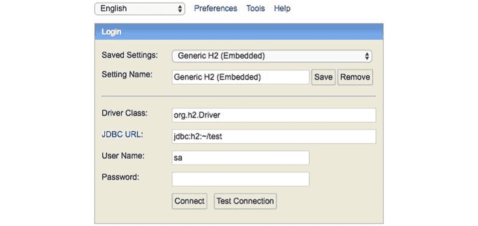
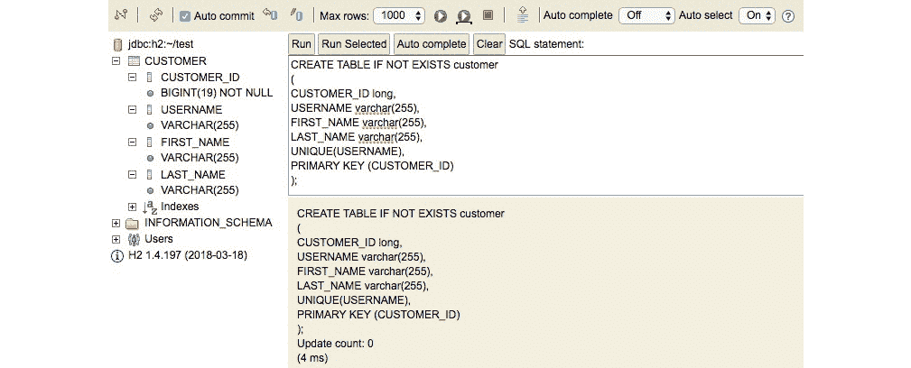
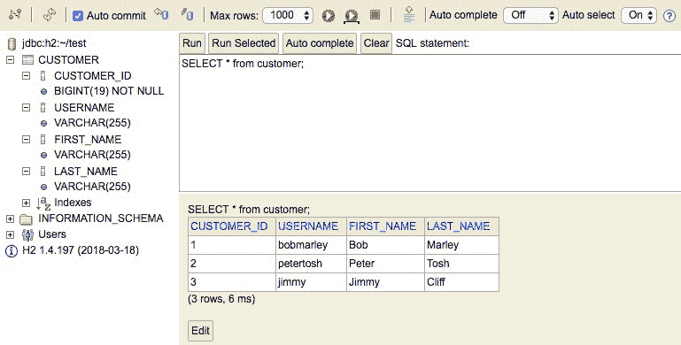

# 第七章：7. 数据库和 JDBC

概述

在下一章中，你将学习如何使用**Java 数据库连接**（**JDBC**）从 Java 应用程序中访问关系型数据库。这始于在关系型数据库中创建表以存储和排序数据。只有在此基础上，你才能通过编写基本的 SQL 查询来检索和修改这些数据。一旦这个基础建立起来，你将能够将这些技能应用到 Java 应用程序中，特别是为了通过 JDBC 访问数据库并运行查询。你还将进一步练习使用 JDBC PreparedStatement 接口，以允许使用参数化 SQL 语句，通过减少耗时和重复的按键操作来提高速度。到本章结束时，你将知道如何从 JDBC 中插入和更新数据，并自信地处理它抛出的任何异常。

# 简介

数据库——尤其是关系型数据库——被用于成千上万的应用程序中，从小型家庭应用到大型的企业系统。为了帮助我们编写访问数据库的应用程序，Java 提供了一些非常实用的工具，从**Java 数据库连接**（**JDBC**）开始。

**JDBC**允许 Java 应用程序连接到众多数据库，前提是你有正确的驱动程序：一个设计用来与特定数据库通信的 Java 库。一旦连接，JDBC 提供了一种通用的方式来访问数据库。你只会遇到少数几个需要了解底层数据库实现具体细节的区域。

# 关系型数据库

关系型数据库最初由 E. F. Codd 定义，将数据存储在由列和行组成的表中。例如，以下表可以用来存储客户信息：


](img/C13927_07_01.jpg)

图 7.1：客户数据库表

在这个客户表示例中，每一行有四个列：一个 ID、一个用户名、一个名和一个姓。

注意

除了像 Sting、Cher 和 Bono 这样的名人之外，一些民族群体只使用一个名字。你并不总是会有姓氏和名字。

每一行都需要一种独特的方式来区分该行与其他所有行，这被称为**唯一主键**。在这种情况下，ID 列充当唯一键。在这个表中，你也可以使用用户名作为唯一键。

一些表使用单个列作为键，而其他表则使用多个列中的值来形成键，这被称为**组合键**。

关系型数据库使用多个表。你可以根据行中的信息将表与其他表关联起来。

例如，在一个在线系统中，每个客户可能有多个电子邮件地址。你可以使用一个单独的表来模拟这种关系，如表 2 所示：


](img/C13927_07_02.jpg)

图 7.2：电子邮件地址数据库表

在表 2 中，每一行都有一个唯一的 ID，通过 `EMAIL_ID` 列。每一行也通过在 `CUSTOMER_ID` 列中持有用户表的 ID 来链接回客户表。这使得 `EMAIL` 表能够链接到 `CUSTOMER` 表。例如，用户 `bobmarley` 在系统中有两个电子邮件地址，一个用于家庭，一个用于工作。

注意

这些电子邮件地址不是真实的。

在这个假设的例子中，也可能有用于邮政地址、客户偏好、账单和其他事物的表。每个表都可能关联回客户表。

要使用关系数据库，您需要一个 **关系数据库管理系统**（**RDBMS**），这是管理表的软件。

# 关系数据库管理系统

一些最常用的关系数据库管理系统（RDBMS）包括 Oracle、MySQL、SQL Server、PostgreSQL 和 DB2。在每种情况下，您都有在服务器（或服务器）上运行的软件来管理数据，以及用于查询和操作数据的独立客户端软件。

要使用 RDMS，您首先需要安装数据库软件。

## 安装数据库

在本章中，我们将使用一个名为 H2 的开源数据库。H2 完全用 Java 编写，因此您可以在任何运行 JVM 的地方运行它，例如在 Windows、Linux 或 macOS 系统上。由于其可移植性和简单性，H2 适用于本章中我们将创建的数据库表。

H2 有一些不错的功能，它提供了一个基于浏览器的数据库控制台，您可以使用它来访问数据库。

注意

H2 也可以在您的应用程序中作为嵌入式的内存数据库使用。在这种情况下，数据库服务器和客户端都存在于您的 Java 应用程序中。

要安装 H2，请访问 [`packt.live/2MYw1XX`](https://packt.live/2MYw1XX) 并下载 `h2`。

在 `h2` 文件夹内，您将看到名为 `bin`、`docs`、`service` 和 `src` 的子文件夹。`docs` 文件夹中的文档也在线可用。

`bin` 文件夹包含打包成 JAR 文件的 H2 数据库软件。它还包含 Windows 批处理文件和 Unix/Linux 脚本。

## 练习 1：运行 H2 数据库

现在您已经安装了数据库，下一步是让数据库运行起来。为此，请执行以下步骤：

1.  要运行 H2 数据库，您可以使用 `bin` 文件夹中的其中一个脚本，或者简单地运行 `jar` 文件。例如：

    ```java
    java -jar h2*.jar
    ```

    无论您如何启动 H2 数据库，您都可以通过浏览器访问它。在某些系统上，例如 macOS，H2 将在您的默认浏览器中打开数据库控制台。

1.  如果它没有自动打开，您只需将浏览器指向 `http://10.0.1.7:8082/`。

1.  您将看到带有填写信息的登录面板，如图 *图 7.1* 所示：

    图 7.3：Web 数据库控制台的登录面板

    在开始时，所有信息都应该填写正确。数据库驱动程序（本章后面将讨论）是 `org.h2.Driver`，JDBC URL 是 `jdbc:h2:~/test`，用户名是 `sa`（系统管理员），密码为空。

    显然，在实际数据库中，你会使用实际的密码。

1.  点击 `连接`。

    几分钟后，你会看到主控制台面板，你已进入。

    注意

    默认情况下，H2 将数据库存储在你的主目录中。使用名为 `test` 的数据库，你应该在你的主目录中看到两个以 `test` 开头并以 `db` 结尾的文件。

一旦安装并运行了 H2 数据库，下一步就是开始创建表。为此，你需要用一种叫做 SQL 的语言编写命令。

# 介绍 SQL

**结构化查询语言**（**SQL**，通常发音为“sequ-el”）为查询和操作关系数据库中的数据提供了一种通用语言。虽然有一些差异，但 SQL 在 Oracle、SQL Server、MySQL 和 H2 等关系数据库系统中大多以相同的方式工作。

你需要做的第一件事是创建一个表。为此，使用 `CREATE TABLE` SQL 命令。要创建表，你必须提供表名、列名和类型以及任何约束。

## 练习 2：创建客户表

使用 SQL `CREATE TABLE` 命令创建一个 `customer` 表。它应包含客户 ID 和用户的姓氏和名字。

1.  在右上角的输入面板中输入以下 SQL 命令：

    ```java
    CREATE TABLE IF NOT EXISTS customer
    (
    CUSTOMER_ID long,
    USERNAME varchar(255),
    FIRST_NAME varchar(255),
    LAST_NAME varchar(255),
    UNIQUE(USERNAME),
    PRIMARY KEY (CUSTOMER_ID)
    );
    ```

1.  输入 SQL 命令后，点击 `运行` 按钮。

    *图 7.2* 展示了主要数据库控制台窗口：



图 7.4：创建表后的 H2 数据库控制台

注意在 *图 7.4* 中，一旦表创建完成，你会在左侧面板看到表名 `CUSTOMER`。你可以点击 `+` 符号展开表条目并查看列，如 *图 7.4* 所示。

`CREATE TABLE` 命令可以被分解为其组成部分。命令以 `CREATE TABLE` 开始。之后，`IF NOT EXISTS` 表示如果表已存在则不尝试重新创建表（使用 `ALTER TABLE` 命令来更改现有表的结构）：

```java
CREATE TABLE IF NOT EXISTS customer
```

接下来是表名，`customer`。

在括号之后，你会看到列的定义然后是约束：

```java
CUSTOMER_ID long,
USERNAME varchar(255),
FIRST_NAME varchar(255),
LAST_NAME varchar(255),
```

`CUSTOMER_ID` 列是 `long` 类型，类似于 Java 的 `long` 类型。这个列将是唯一的键。

`USERNAME`、`FIRST_NAME` 和 `LAST_NAME` 列都是 `varchar` 类型。`varchar` 类型可以存储最多指定为 `255` 个字符的变长字符（文本）数据。

接下来是约束：

```java
UNIQUE(USERNAME),
PRIMARY KEY (USER_ID)
```

`USERNAME`列必须是唯一的，而`CUSTOMER_ID`列是主键。（主键也必须是唯一的。）当您插入数据时，数据库将强制执行这些约束。请注意，您可以通过逗号分隔多个列名来创建一个复合主键。这意味着这些列中的值组合必须是唯一的。

整个命令以一个闭括号和一个分号结束。SQL 使用分号与 Java 一样，表示语句的结束。

## 向表中插入数据

要向表中插入数据，请使用`INSERT INTO`命令。基本语法如下：

```java
INSERT INTO table_name
(column1, column2, column3, column4)
VALUES (value1, value2, value3, value4);
```

您首先列出列，然后为这些列提供值。对于不允许为空的列，您必须提供值。在这种情况下，`CUSTOMER_ID`和`USERNAME`是必需的。每个都必须是唯一的。

注意

SQL 使用单引号字符来界定字符串。如果您需要输入引号字符，请使用两个一起，例如`Java''s`。不要尝试使用一些文字处理软件中使用的智能引号。

## 练习 3：插入数据

此练习再次使用 H2 网络控制台。

1.  在右上角的输入面板中输入以下 SQL 语句：

    ```java
    INSERT INTO customer
    (CUSTOMER_ID, USERNAME, FIRST_NAME, LAST_NAME)
    VALUES (1, 'bobmarley', 'Bob', 'Marley');
    ```

1.  输入 SQL 命令后，单击`运行`按钮。

1.  使用以下两个 SQL 语句重复这两个步骤：

    ```java
    INSERT INTO customer
    (CUSTOMER_ID, USERNAME, FIRST_NAME, LAST_NAME)
    VALUES (2, 'petertosh', 'Peter', 'Tosh');
    INSERT INTO customer
    (CUSTOMER_ID, USERNAME, FIRST_NAME, LAST_NAME)
    VALUES (3, 'jimmy', 'Jimmy', 'Cliff');
    ```

    注意

    大多数关系型数据库管理系统（RDBMS）支持自动管理主键 ID 号的类型。然而，不同的数据库软件的语法可能会有所不同。有关 H2 数据库中`IDENTIIY`类型的详细信息，请参阅[`packt.live/2J6z5Qt`](https://packt.live/2J6z5Qt)。

## 检索数据

要从表（或多个表）中检索数据，请使用`SELECT`命令。SQL `SELECT`命令允许您查询数据。您必须指定您要查找的内容。

基本语法如下：

```java
SELECT what_columns_you_want
FROM table_name
WHERE criteria_you_want;
```

您可以提供以逗号分隔的列列表以返回，或者使用星号`*`来表示您希望返回所有列。最简单的查询如下：

```java
SELECT * from customer;
```

您现在应该看到所有返回的行，如*图 7.3*所示：



图 7.5：查询客户表中的所有行

您可以使用`WHERE`子句来细化您的查询。例如：

```java
SELECT * from customer
WHERE first_name = 'Bob';
```

这将返回所有`first_name`列值等于`Bob`的行，到目前为止，这将是仅有一行。

您可以使用带有`LIKE`修饰符的通配符查询：

```java
SELECT * from customer
WHERE username LIKE '%e%';
```

此查询返回所有用户名中包含`e`的行。

在 SQL 中，百分号用作通配符。此示例在值的开头和结尾都有一个通配符。例如，您可以使用单个通配符来查询值的结尾：

```java
SELECT * from customer
WHERE username LIKE '%ey';
```

此示例查询所有用户名值以`ey`结尾的记录。

您可以使用`OR`或`AND`在`WHERE`子句中进行更详细的查询。例如：

```java
SELECT * from customer
WHERE 
    first_name = 'Peter'
OR
    last_name = 'Cliff';
```

此示例返回所有`first_name`为`Peter`或`last_name`为`Cliff`的行，在这个例子中是两行。

使用 `OR` 运算符，`SELECT` 语句返回所有符合任一条件的行。使用 `AND` 运算符，两个条件部分都必须匹配：

```java
SELECT * from customer
WHERE 
    first_name = 'Peter'
AND
    last_name = 'Cliff';
```

由于没有行同时符合两个条件，此示例将返回零行。

到目前为止，我们使用星号来表示我们想要返回所有列。您可以使用逗号分隔的列名列表来指定。例如：

```java
SELECT first_name, last_name from customer
order by
last_name, first_name;
```

此示例还使用了 `ORDER BY` 子句来告诉数据库按特定顺序返回记录，在这种情况下，按 `last_name` 排序，然后按 `first_name` 排序。

SQL 使用两个短横线 `--` 来表示注释的开始，如下所示：

```java
-- This is a comment.
```

SQL 查询可以非常复杂。这些例子只是提供了一个小的示例。

注意

有关 SQL 的更多信息，您可以参考以下 Packt 视频：[`packt.live/33KIi8S`](https://packt.live/33KIi8S)。

## 关联表

大多数数据库都包含多个表，其中许多表将是相关的。从早期的例子中，我们可以将客户表与一个单独的电子邮件地址表相关联。在先前的例子中，电子邮件表中的每一行都包含了与客户表相关行的 ID。

## 练习 4：创建电子邮件表

这个练习使用的是 H2 网络控制台。在这个练习中，我们将创建一个电子邮件表并向其中插入一些值。

1.  在右上角的输入面板中输入以下 SQL：

    ```java
    CREATE TABLE IF NOT EXISTS email
    (
    EMAIL_ID long,
    CUSTOMER_ID long,
    EMAIL_ADDRESS varchar(255),
    EMAIL_TYPE varchar(255),
    PRIMARY KEY (EMAIL_ID)
    );
    ```

1.  输入 SQL 命令后，点击 `运行` 按钮。

1.  包含以下 `INSERT` 语句，然后点击 `运行` 按钮：

    ```java
    INSERT INTO email
    (EMAIL_ID, CUSTOMER_ID, EMAIL_ADDRESS, EMAIL_TYPE)
    VALUES (1,1, 'bob@example.com', 'HOME');
    ```

1.  包含以下 `INSERT` 语句，然后点击 `运行` 按钮：

    ```java
    INSERT INTO email
    (EMAIL_ID, CUSTOMER_ID, EMAIL_ADDRESS, EMAIL_TYPE)
    VALUES (2,1, 'bob.marley@big_company.com', 'WORK');
    ```

1.  包含以下 `INSERT` 语句，然后点击 `运行` 按钮：

    ```java
    INSERT INTO email
    (EMAIL_ID, CUSTOMER_ID, EMAIL_ADDRESS, EMAIL_TYPE)
    VALUES (3,2, 'petertosh888@example.com', 'HOME');
    ```

注意我们如何必须管理 ID，即 `EMAIL_ID` 和相关的 `CUSTOMER_ID`。这可能会变得繁琐。将 Java 对象映射到关系表的 Java 库，如 Hibernate，可以帮助解决这个问题。

注意

Hibernate 被认为是 ORM，即对象关系映射器。有关 Hibernate 的更多信息，请参阅 [`packt.live/2Bs5z3k`](https://packt.live/2Bs5z3k)。

一旦在多个相关表中有了数据，您就可以一次性查询多个表，并将结果连接起来。

## 从多个表中选择数据

当您使用 SQL 选择语句从多个表中查询数据时，您需要在 `WHERE` 子句中列出您希望返回的所有列（来自所有表），以及搜索条件。在 `WHERE` 子句中，您需要根据某些共同值将两个表连接起来。

例如，`email` 表有一个 `customer_id` 列，可以用来与 `customer` 表关联。为了关联它，编写如下查询：

```java
SELECT username, email_address 
FROM customer, email
WHERE email_type = 'HOME'
AND 
email.customer_id = customer.customer_id;
```

在此查询中，我们请求来自客户表的 `username` 以及来自电子邮件表的 `email_address`。`FROM` 部分列出了客户和电子邮件表。

`WHERE` 子句变得更加有趣。此查询查找所有类型为 `HOME` 的电子邮件地址。为了将其与客户表连接起来，并确保你得到正确的客户，查询添加了一个连接，其中电子邮件表的 `customer_id` 列与客户表的 `customer_id` 列相对应。这确保了你得到正确的客户对齐。

## 修改现有行

`UPDATE` 命令让你修改现有行。要更新数据，你需要指定要更改的行以及要更改的值。基本语法如下：

```java
UPDATE table_name
SET column1 = value1, column2 = value2
WHERE where_clause_to_find_rows
```

## 练习 5：修改电子邮件数据

如果用户，如 `bobmarley`，切换到不同的工作电子邮件，你需要更新电子邮件表。为此，执行以下步骤：

1.  前往 H2 数据库控制台。

1.  包含以下 SQL 查询，然后点击“运行”：

    ```java
    SELECT * from email;
    ```

    此命令让你在更改任何内容之前查看表中当前有哪些值。

1.  接下来，输入以下 `UPDATE` 语句，然后点击“运行”：

    ```java
    UPDATE email
    SET EMAIL_ADDRESS = 'bob.marley@another_company.com'
    WHERE customer_id = 1
    AND email_type = 'WORK';
    ```

    此查询更改了客户 `bobmarley` 的 `email_address` 条目，但只是 `WORK` 电子邮件。

1.  现在，再次运行选择查询（并点击“运行”）以查看表如何更改：

    ```java
    SELECT * from email;
    ```

    你现在应该看到以下表格中所示的结果：


图 7.6：查询输出

## 删除数据

要从表中删除数据，请使用 `DELETE` 命令：

```java
DELETE FROM table_name
WHERE criteria_for_which_rows_to_delete;
```

例如，要删除客户 `bobmarley` 的工作电子邮件，你会使用如下命令：

```java
DELETE FROM email
WHERE customer_id = 1
AND email_type = 'WORK';
```

注意

当你有相关的表时，删除数据变得更加复杂。例如，如果你删除一个客户，你还需要删除该客户的电子邮件表中的所有行。在这个例子中，电子邮件表依赖于客户表，但反之则不成立。

在本章迄今为止的所有示例中，我们都在 H2 控制台中使用了 SQL 来处理测试数据库中的数据。在你的 Java 应用程序中，你将使用 JDBC 来实现几乎相同的目标。

## JDBC——从 Java 访问数据库

JDBC 提供了一个通用的 API 来处理数据库。大多数情况下，JDBC 与关系数据库一起工作，但你可以处理任何有 **JDBC 驱动程序** 的数据源，这是与数据源通信并实现 JDBC API 的 Java 库。

注意

JDBC 最好的部分之一是大多数驱动程序库是用 Java 编写的，因此你可以在运行 JVM 的任何平台上使用这些驱动程序。

使用 JDBC 的第一步是与数据源连接，通常是数据库。

## 连接到数据库

使用 JDBC 连接到数据库的最简单方法是使用 `java.sql.DriverManager` 类上的 `getConnection()` 方法：

```java
Connection conn = DriverManager.getConnection("jdbc:h2:~/test", "sa", "");
```

此方法需要三个参数：

+   JDBC URL 以 `jdbc:h2` 开头，告诉 `DriverManager` 查找 H2 JDBC 驱动程序。`~/test` 告诉 H2 在当前用户的家目录中查找名为 `test` 的数据库。（这是运行 Java 程序的你。）`test` 是 H2 创建的默认数据库名。

+   在此情况下，连接的用户的用户名是 `sa`，代表系统管理员。

+   在这种情况下，密码是空的。

    注意

    除了 H2，你连接数据库时很可能不会遇到空密码。H2 默认设置了 `sa` 账户，你可以用它进行测试。

`getConnection()` 方法返回一个 `java.sql.Connection` 对象，你可以将其用作与数据库交互的起点。

注意

连接到数据库的其他方法有很多，尤其是在使用连接池时，这些方法将在本章后面进行描述。

几乎所有的 JDBC 操作都可能抛出 `java.sql.SQLException`，因此你通常会使用 try-catch 块来包装 JDBC 调用。

当你完成 JDBC 连接时，你应该关闭连接：

```java
conn.close();
```

## 使用 JDBC 查询数据

要使用 JDBC 从数据库中查询，创建 `java.sql.Statement` 并执行查询：

```java
String sql = "SELECT * from customer order by username";
statement = conn.createStatement();
ResultSet results = statement.executeQuery(sql);
```

使用 `Connection` 对象创建一个语句。然后，你可以使用 `executeQuery()` 方法执行 SQL 查询，该方法返回一个 `java.sql.ResultSet` 对象。

`ResultSet` API 最初可能会让人困惑。它基于游标的概念，即程序在数据中的位置记录。通过在 `ResultSet` 上调用 `next()`，你可以将游标移动到下一行。

因此，查询的正常流程将类似于以下内容：

```java
String sql = "SELECT * from customer order by username";
statement = conn.createStatement();
ResultSet results = statement.executeQuery(sql);
while (results.next()) {
    // Process the current row.
}
```

`ResultSet` 从一个位置——游标——开始，在第一行之前，因此你需要调用 `next()` 来获取第一行数据。当 `next()` 方法返回 false 时，表示已到达数据的末尾。

这样迭代 `ResultSet` 的部分原因是因为某些数据库表包含如此多的记录，你无法同时将它们全部保存在内存中。因此，一般的技巧是逐行处理。

对于每一行数据，调用 `ResultSet` 上的 `get` 方法。例如，要获取字符串值，调用 `getString()`：

```java
String username = results.getString("USERNAME");
```

在此示例中，我们将列名传递给 `getString()`。它返回当前行的 `USERNAME` 列的值。

你还可以传递结果集中列的位置。例如：

```java
String username = results.getString(2);
```

位置号是结果集中列的位置，这取决于查询。

注意

与 Java 中的几乎所有其他内容不同，JDBC 列的计数从 1 开始，而不是 0。

你必须知道列中的数据类型，才能调用适当的 `get` 方法。例如，要获取 `long` 类型的值，调用 `getLong()`：

```java
Long id = results.getLong("CUSTOMER_ID");
```

注意

如果你不确定列中的数据类型，可以调用 `getObject()`。

当完成 `ResultSet` 的操作后，调用 `close()`。同样，当你完成语句的操作后，也调用 `close()`。在这些对象上调用 `close()` 方法可以释放资源。

## 练习 6：使用 JDBC 查询数据

这个练习将创建一个 IntelliJ 项目，引入 H2 数据库 JDBC 驱动的依赖项，然后查询数据库：

1.  在 IntelliJ 的“文件”菜单中选择“新建”然后选择“项目...”。

1.  选择`Gradle`作为项目类型。点击“下一步”。

1.  对于“组 ID”，输入 `com.packtpub.db`。

1.  对于“工件 ID”，输入 `customers`。

1.  在“版本”中输入 `1.0`。

1.  在下一页接受默认设置。点击“下一步”。

1.  将项目名称保留为 `customers`。

1.  点击“完成”。

1.  在 IntelliJ 文本编辑器中调用 `build.gradle`。

1.  将 `sourceCompatibility` 设置为 `12`：

    ```java
    sourceCompatibility = 12
    ```

1.  将插件块替换为以下内容，就像我们在 *第六章*，*库、包和模块* 中做的那样：

    ```java
    buildscript {
        repositories {
            jcenter()
        }
        dependencies {
            classpath 'com.github.jengelman.gradle.plugins:shadow:2.0.1'
        }
    }
    apply plugin: 'java'
    apply plugin: 'com.github.johnrengelman.shadow'
    ```

1.  添加以下依赖项以将 H2 库纳入项目：

    ```java
    // https://mvnrepository.com/artifact/com.h2database/h2
    implementation group: 'com.h2database', name: 'h2', version: '1.4.197'
    ```

    注意，提供 JDBC 驱动的相同 jar 文件还包括整个数据库软件。

1.  将以下内容添加到项目的 `build.gradle` 文件末尾，以定义可执行 jar 的主类：

    ```java
    jar {
        manifest {
            attributes 'Main-Class': 'com.packtpub.db.Query
        }
    }
    ```

1.  在 `src/main/java` 文件夹中创建一个新的 Java 包。

1.  将包名输入为 `com.packtpub.db`。

1.  在“项目”窗格中右键单击此包，创建一个名为 `Query` 的新 Java 类。

1.  为“查询”类创建一个 `main()` 方法：

```java
Query.java
6   public static void main(String[] args) {
7  
8      String sql = "SELECT * from customer order by username";
9  
10     Statement statement;
11 
12     Connection conn;
13     try {
14         conn = DriverManager.getConnection("jdbc:h2:~/test", "sa", "");
15 
16         statement = conn.createStatement();
17 
18         ResultSet results = statement.executeQuery(sql);
https://packt.live/2PbKanp
```

此程序建立与 H2 数据库的连接。注意所有 JDBC 调用都被包装在 try-catch 块中。

在建立 `connection` 之后，程序要求 `Connection` 创建一个 `Statement`。在 `Statement` 上调用 `executeQuery()` 执行查询，返回一个 `ResultSet`。通过 `while` 循环，程序遍历 `ResultSet` 中的每一行，提取数据并打印。

最后，程序关闭了使用的资源。

这设置了一个可执行的 jar，它将运行 `Query` 类。请记住运行 `shadowJar` Gradle 任务来构建带有依赖项的可执行 jar。

当你运行此程序时，你应该看到如下类似的输出：

```java
1 bobmarley Bob Marley
3 jimmy Jimmy Cliff
2 petertosh Peter Tosh
```

注意，查询要求数据库按用户名排序结果。

如果你从 H2 网页控制台连接到数据库，当你运行此程序时，你会看到如下错误：

```java
org.h2.jdbc.JdbcSQLException: Database may be already in use: null. Possible solutions: close all other connection(s); use the server mode [90020-197]
```

你还应该看到完整的错误堆栈跟踪。这个错误表明你已经以用户 `sa` 登录到数据库。点击 H2 网页控制台左上角的断开连接图标来关闭网页控制台与数据库的连接。

在 *第六章*，*使用 JDBC 查询数据* 的“查询”类中，我们使用字符串作为 SQL 查询。当你的程序生成整个 SQL 语句时，这没问题。然而，如果你接受用户输入然后构建一个字符串作为 SQL，你的程序可能会受到 SQL 注入攻击的威胁，恶意用户输入的 SQL 语法旨在破坏你的数据库。

注意

要详细了解 SQL 注入漏洞，请参阅 [`packt.live/2OYGF3g`](https://packt.live/2OYGF3g)。

由于这个风险，你应该在将用户输入放入 SQL 语句之前对其进行清理。

## 清理用户输入

要清理用户输入：

+   您可以自己正确地清理数据。例如，您可以禁止可能形成 SQL 语法的字符。

+   您可以使用`PreparedStatement`接口并在预编译语句上设置值。JDBC 将为您清理输入。

## 使用预编译语句

JDBC 预编译语句接受一个带有数据值占位符的 SQL 语句。在大多数数据库中，JDBC 将 SQL 发送到数据库进行编译。当您向数据库发送 SQL 语句时，数据库需要将 SQL 编译成数据库本地的内部格式，然后数据库可以执行该语句。

使用常规语句时，您可以将 SQL 语句提供给`executeQuery()`和`executeUpdate()`等方法。您可以使用`Statement`重复使用并提供一个完全不同的 SQL 语句。

相反，使用`PreparedStatement`时，您使用 SQL 字符串准备语句，这就是您得到的所有内容。幸运的是，尽管如此，您提供了数据值的占位符。这意味着您可以使用`PreparedStatement`重复插入多个记录到表中，例如。

从*练习 5*，*修改电子邮件数据*，我们使用`UPDATE`语句：

```java
UPDATE email
SET EMAIL_ADDRESS = 'bob.marley@another_company.com'
WHERE customer_id = 1
AND email_type = 'WORK';
```

使用`PreparedStatement`时，您会使用问号`?`作为输入值的占位符：

```java
String sql = "UPDATE email " +
    "SET EMAIL_ADDRESS = ? " +
    "WHERE customer_id = ? " +
    "AND email_type = ? ";
```

注意

在预编译语句中，您不需要在字符串占位符周围放置单引号。JDBC 会为您处理这一点。

在使用`PreparedStatement`之前，需要填写这些占位符。例如：

```java
statement = conn.prepareStatement(sql);
statement.setString(1, "bob.marley@another_company.com");
statement.setLong(2, 1L);
statement.setString(3, "WORK");
int rowsChanged = statement.executeUpdate();
```

将带有占位符的 SQL 字符串传递给连接上的`prepareStatement()`方法。然后，调用`setString()`、`setLong()`等，以填写占位符值。在每个设置方法调用中，您传递要填充的占位符的索引，从第一个占位符的`1`开始。然后，传递要填充的值。JDBC 将处理防止 SQL 注入攻击。

对于常规`Statement`，您可以通过调用`executeQuery()`执行 SQL 查询，或通过调用`executeUpdate()`修改数据库。`executeUpdate()`方法处理`INSERT`、`UPDATE`和`DELETE SQL`语句。

在这个例子中，`executeUpdate()`返回被修改的表中的行数。

使用预编译语句的主要好处之一是 JDBC 将清理输入值，因此您不必这样做。另一个主要好处是性能提升。如果您反复执行相同的 SQL 语句，或者几乎相同的语句，只是值不同，那么使用预编译语句将加快速度，这主要是由于预编译语句。

## 事务和回滚

在关系型数据库中，事务将一组 SQL 语句组合在一起。要么所有语句都成功，要么事务将回滚，撤销这些语句。此外，数据库将事务中的所有语句视为同时发生，这有助于确保数据的一致性。

在 JDBC 中，事务会一直持续到你在连接上调用`commit()`。如果发生故障，你应该在连接上调用`rollback()`以将数据恢复到事务开始之前的状态。

默认情况下，JDBC 连接以自动提交模式开始。这意味着每个 JDBC 连接都会逐个提交。如果你想将几个语句组合在一个事务中，你首先需要关闭自动提交模式：

```java
conn.setAutoCommit(false);
```

注意

在完成对数据库的访问后，你应该将自动提交模式关闭后再打开。

当你想结束事务并将结果提交到数据库时，调用`commit()`：

```java
conn.commit();
```

如果抛出`SQLException`，你将想要回滚事务：

```java
} catch (SQLException e) {
    e.printStackTrace();
    try {
        if (conn != null) {
            conn.rollback();
        }
    } catch (SQLException nested) {
        nested.printStackTrace();
    }
} 
```

这段代码展示了使用 JDBC 时最繁琐的部分之一。在你的`SQLException`异常处理程序中，所做的调用——例如`rollback()`——也可能抛出另一个`SQLException`，你需要捕获它。你会发现 JDBC 代码充满了嵌套的`try`-`catch`-`finally`块。*练习 7*，*使用带有事务的预编译语句*展示了这一技术的实际应用。

## 练习 7：使用带有事务的预编译语句

在这个练习中，我们将创建另一个 Java 类，该类使用 JDBC `PreparedStatement`更新电子邮件表中的数据，并将该更新包装在 JDBC 事务中。

1.  在 IntelliJ 中创建一个名为`Prepared`的新类并创建一个`main()`方法。

1.  导入所需的库：

    ```java
    package com.packtpub.db;
    import java.sql.Connection;
    import java.sql.DriverManager;
    import java.sql.PreparedStatement;
    import java.sql.SQLException;
    ```

1.  在`Prepared`类中输入以下代码。

    ```java
    public class Prepared {
        public static void main(String[] args) {
            Connection conn = null;
            PreparedStatement statement = null;
            String sql = "UPDATE email " +            "SET EMAIL_ADDRESS = ? " +
                "WHERE customer_id = ? " +
                "AND email_type = ? ";
    ```

    `Prepared`类首先定义一个使用占位符的`SQL UPDATE`语句。这个 SQL 语句稍后将放入`PreparedStatement`中。

1.  在第一个 try-catch 块中，程序获取数据库的`Connection`，然后使用参数`false`调用`setAutoCommit()`以关闭自动提交模式。JDBC 现在期望程序管理事务。

```java
Prepared.java
20         try {
21             conn = DriverManager.getConnection("jdbc:h2:~/test", "sa", "");
22             conn.setAutoCommit(false);
23 
24             statement = conn.prepareStatement(sql);
25             statement.setString(1, "bob.marley@another_company.com");
26             statement.setLong(2, 1L);
27             statement.setString(3, "WORK");
28 
29             int rowsChanged = statement.executeUpdate();
30 
31             conn.commit();
32 
33             System.out.println("Number rows changed: " + rowsChanged);
https://packt.live/2MSobyQ
```

当你运行`main()`方法时，你应该看到以下输出：

```java
Number rows changed: 1
```

只应修改一行。

程序将 SQL 字符串传递给连接的`prepareStatement()`方法。这创建了一个初始化给定 SQL 的`PreparedStatement`。接下来，程序在`PreparedStatement`中填充占位符值。

完成后，程序在语句上调用`executeUpdate()`，提交事务，然后告诉我们更改了多少行。

如果任何 JDBC 调用抛出`SQLException`，catch 块将打印堆栈跟踪，然后在连接上调用`rollback()`。调用`rollback()`也可能抛出`SQLException`，因此程序也会捕获它，打印堆栈跟踪。

原始的 try-catch-finally 块中的`finally`块将自动提交事务模式恢复，然后对`PreparedStatement`和连接调用`close()`，这可能会导致每个都抛出`SQLException`。

## 简化 JDBC 编程

如你所见，使用 JDBC 编程是繁琐的。正因为如此，许多项目都在 JDBC API 上开发了包装器，以简化 JDBC 调用。

Java 本身包含了许多实用类，例如 `JdbcRowSet`，它包装 `ResultSet` 对象并提供了一个相对简单的 API。

注意

Spring 框架提供了一系列实用工具来简化 JDBC 编程。更多信息请参考 [`packt.live/35PalWP`](https://packt.live/35PalWP)。

到目前为止，最受欢迎的无需 JDBC API 不便即可访问数据库的方法是使用对象关系映射软件。

## 使用对象关系映射软件

如其名所示，**对象关系映射**（**ORM**）软件在对象世界和关系表世界之间进行映射。使用 ORM，你通常编写一个 Java 类来表示表中的一行。

例如，以下类可以代表客户表中的一行：

```java
Customer.java
1  package com.packtpub.db;
2  
3  public class Customer {
4      Long customerId;
5      String username;
6      String firstName;
7      String lastName;
8  
9      public Customer(Long customerId, String username, String firstName, String       lastName) {
10         this.customerId = customerId;
11         this.username = username;
12         this.firstName = firstName;
13         this.lastName = lastName;
14     }
https://packt.live/2pvQhYT
```

`Customer` 类通常被称为 **纯 Java 对象**（**POJO**）。ORM 软件允许你使用查询表并获取 POJO 列表，或者在一个 POJO 中填写数据，然后将该对象持久化到数据库。在大多数情况下，ORM 软件使用反射来发现类中的字段并将它们映射到表中的列。

注意

*第十九章* 讲解反射。

**Java 持久化 API**（**JPA**）提供了一个标准化的 API，用于使用注解来描述映射，从而定义对象和数据库表之间的映射。JPA 还定义了一个 API，用于将 POJO 持久化到数据库表。

在标准的 Java 持久化 API 之下，你需要使用一个 JPA 提供者，这是一个实现 JPA 的库。最常用的 JPA 提供者是 **Hibernate**。

注意

关于 JPA 的更多信息，请参考 [`packt.live/2OZjHsP`](https://packt.live/2OZjHsP)。JPA 是 **Java 企业版**（**JavaEE**）的一部分。

## 数据库连接池

`DriverManager.getConnection()` 方法建立数据库连接可能需要相当长的时间。为了帮助解决这个问题，你可以使用数据库连接池。

连接池会建立多个并管理到数据库的连接。然后你的应用程序可以从池中请求一个空闲连接。你的代码使用连接后，将其返回到池中。

一些主要的连接池软件库包括：

+   HikariCP，来自 [`packt.live/2Bw7gg5`](https://packt.live/2Bw7gg5)

+   Apache Commons DBCP，来自 [`packt.live/31p4xQg`](https://packt.live/31p4xQg)

+   C3p0，来自 [`packt.live/2pw1vN0`](https://packt.live/2pw1vN0)

+   Tomcat 连接池，来自 [`packt.live/31pGgcJ`](https://packt.live/31pGgcJ)

## 非关系型，或 NoSQL 数据库

关系型数据库在数据与 SQL 数据库表中的列和行很好地工作时表现良好。在现实世界中，并非所有数据都能整齐地适应这个模型。这导致了 NoSQL 数据库的创建，这是一种不支持关系表的数据库管理软件。

注意

奇怪的是，一些 NoSQL 数据库支持类似于 SQL 的语言来访问数据。

NoSQL 数据库各不相同，描述这些数据库的一些类别有所重叠。Terrastore，[`packt.live/2P23i7e`](https://packt.live/2P23i7e)，和 MongoDB，[`packt.live/31qJVY0`](https://packt.live/31qJVY0)，被认为是文档存储数据库。在这些系统中，你存储一个完整的文档，通常是结构化文档。

Cassandra，[`packt.live/2MtDtej`](https://packt.live/2MtDtej)，和 HBase，[`packt.live/2VWebsp`](https://packt.live/2VWebsp)，有时被称为列存储或列族数据库，它们将数据存储在列中，而不是像大多数 SQL 数据库那样按行存储。如果你正确地组织了列，这些数据库可以非常快速地检索数据。你还可以存储大量的列。

Neo4j，[`packt.live/2o51EXm`](https://packt.live/2o51EXm)，是一个图数据库。在图数据库中，你通过元素之间的关系来检索数据。这些关系形成了一个图。

## 活动一：跟踪你的进度

在这个活动中，我们将设置 H2 数据库中的数据库表来跟踪你在本课程中的进度。以下步骤将帮助我们完成这个活动：

1.  创建一个名为`student`的表，其中每条记录都包含有关学生（例如你）的信息。定义 ID、姓名和姓氏列。

1.  创建一个名为`chapter`的表，其中每条记录都包含有关章节的信息。定义 ID（使用章节编号）和章节标题列。为了简单起见，你可以只输入到包括这一章在内的所有章节。

1.  创建一个名为`student_progress`的表来关联学生和章节，这个表应该包含学生的 ID、章节的 ID 以及完成章节的日期。使用`SQL DATE`类型，并将数据传递为`yyyy-MM-dd`。这个表应该有一个复合主键。

    你可以使用 H2 网络控制台创建表并插入记录。

1.  创建两个使用 JDBC 的 Java 程序。

    创建第一个程序来查询给定学生完成的所有章节及其完成时间。输入学生的姓名和姓氏。这将生成如下输出：

    ```java
    BOB MARLEY
    2019-03-01  2 Learning the Basics
    2019-03-01  7 Databases and JDBC
    ```

    创建第二个程序来插入章节完成情况。输入学生的姓名、姓氏以及章节编号。程序应标记该章节为今天已完成。

    由于这两个程序都接受用户输入，请确保在每个程序中使用`PreparedStatement`来处理可能的有害输入数据。你可以将这些程序作为本章之前创建的客户项目的一部分来创建。

    注意

    活动的解决方案可以在第 548 页找到。

# 摘要

本章介绍了关系数据库管理系统（RDBMS）和 SQL 语言，这是用于处理关系数据库的语言。我们使用了一个全 Java 数据库，称为 H2。SQL 是一种用于检索和修改存储在关系数据库中的数据的语言。JDBC 是一个与关系数据库通信的 Java API。你可以使用 SQL 命令来检索和修改数据。

数据库的内容远不止一个章节所能展示的，但在完成练习后，你应该能够开始使用 SQL 和 JDBC 与数据库进行工作。一本关于 SQL 的书或培训课程可以帮助你深入研究高级数据库主题。

注意

Packt 视频《SQL 从入门到精通：MySQL 版》- 使用 MySQL 掌握 SQL：[`packt.live/33KIi8S`](https://packt.live/33KIi8S) 将帮助你提升 SQL 技能。

在下一章中，你将学习使用 Java 进行网络和文件操作。
