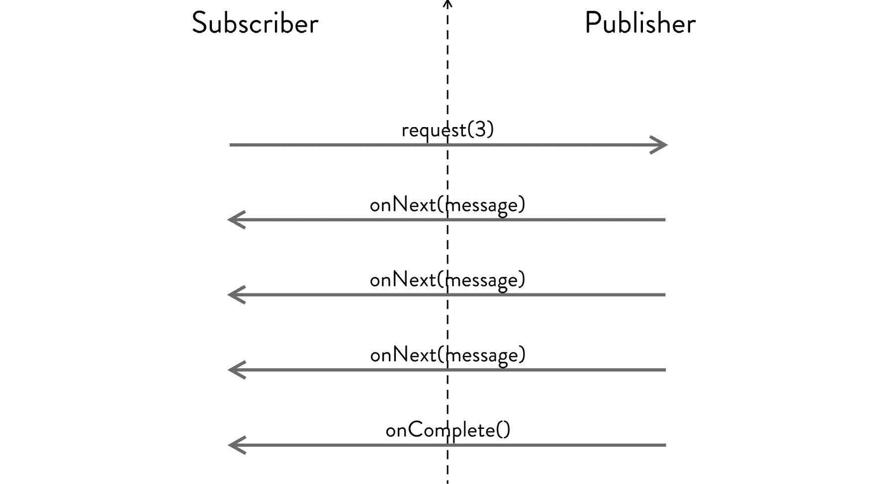
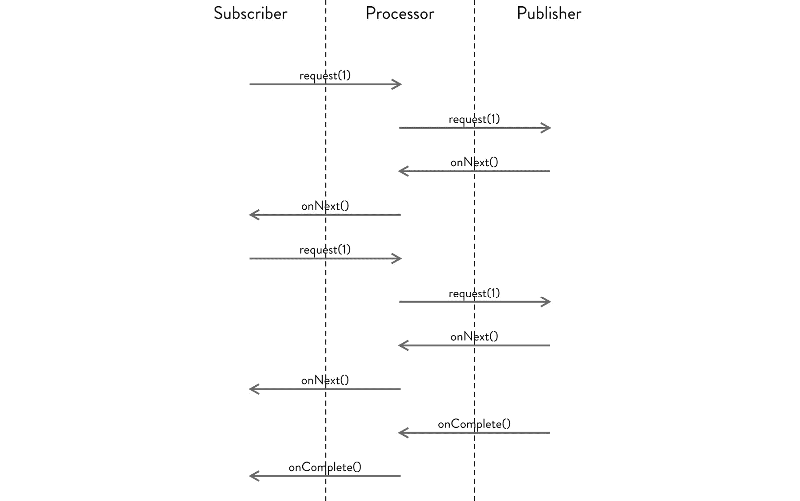

# 第十七章：17. 使用 Java Flow 的响应式编程

概述

本章将介绍 Java Flow API 和响应式流规范的优势。它将首先以一般术语定义 Flow 和响应式流的动机，以及 Java 中发布者、订阅者和处理器的相应功能。然后，你将学习如何使用基本的 `SubmissionPublisher` 来构建响应式应用程序，并在最后几节中练习使用 Flow 实现一个简单的订阅者和处理器。

# 简介

响应式流规范展示了软件架构中一个持续发展的方向，被称为响应式系统。这些系统理想情况下具有以下优势：

+   更快的响应

+   更可控的相互响应

+   提高可靠性

Java 9 中引入了一个用于开发响应式系统或应用程序的原生支持的 API，称为 Flow。

Java 9 Flow API 的目的不是与已经开发、高度采用且受到赞赏的响应式库或 API 竞争。Flow API 诞生的最大原因是需要在这些库之间找到一个共同点；确保无论使用哪种实现，响应式编程的核心都是相同的。这样，你可以轻松地从一种实现转换到另一种实现。

为了实现这一点，Java Flow API 遵循响应式流规范——大多数库在设计时都将其作为蓝图使用的规范。该规范的设计者响应式流倡议始于 2013 年，由 Netflix 和其他几家对可靠交付内容有利益的大公司发起。

注意

虽然它们可能共享很多相同的术语，但 Flow API 与 Java 8 的 Streams API 完全无关。它们专注于解决不同类型的问题。

简而言之，响应式编程是一种使用通过流式传输事件相互通信的组件来编写程序的方法。这些事件通常是异步的，并且永远不会使接收方感到压力。在响应式系统中，有两个主要组件——发布者和订阅者。这与网络化的 pub/sub 系统类似，但规模更小。

Java Flow API（或者更确切地说，Flow 遵循的响应式流）有三个主要角色：

+   发布者了解可用的数据，并按需将其推送到任何感兴趣的订阅者。

+   订阅者是需求数据的一方。

+   处理器可能位于发布者和订阅者之间。处理器可以在将发布的数据释放给订阅者或另一个处理器之前拦截和转换这些数据。因此，处理器可以同时充当订阅者和发布者。

这些组件之间的通信具有推送和拉取两种性质。订阅者首先请求发布者发送最多 `n` 条消息。这是通信的拉取部分。在此请求之后，发布者将开始向订阅者发送消息，但不会超过 `n` 条消息。



图 17.1：订阅者和发布者之间的通信

当发布者发送了最终消息后，它将提供一个通知，表明消息发送已完成，订阅者可以据此采取必要的行动——可能请求更多消息或完全终止通信。

我们将在本章进一步探讨的整个 Flow API 都定义在一个单独的 Java 类中。它为每个参与者定义了一个接口，以及一个额外的接口，描述了订阅对象，这是发布者和订阅者之间的消息链接。

# Publisher

发布者持有其他组件感兴趣获取的数据。发布者将等待一个对数据感兴趣的订阅者请求发送 n 个项目，然后才会开始向订阅者发送这些项目。

请求特定数量的项目，而不是请求所有项目，这被称为背压，在 Reactive Streams 规范中非常重要。这种背压允许监听器一次请求他们能够处理的项目数量，确保应用程序不会停滞或崩溃。

Flow 和 Reactive Streams 中 `Publisher` 的接口如下：

```java
@FunctionalInterface
public static interface Publisher<T> {
    public void subscribe(Subscriber<? super T> subscriber);
}
```

您会注意到它是一个函数式接口，如果您愿意，可以将其实现为 lambda 表达式。

## SubmissionPublisher

创建一个完全功能的发布者可能相当复杂。幸运的是，Flow 包含一个完整的实现，称为 `SubmissionPublisher`。我们将在本章的几个示例中使用这个类。

您可以直接使用 `SubmissionPublisher` 作为组件，或者作为扩展 `Publisher` 的超类。`SubmissionPublisher` 需要一个 `Executor` 和一个缓冲区大小。默认情况下，它将使用常见的 `ForkJoinPool` 和一个缓冲区大小为 256：

```java
SubmissionPublisher<?> publisher = new SubmissionPublisher<>();
SubmissionPublisher<?> publisher = new SubmissionPublisher<>(ForkJoinPool.commonPool(), Flow.defaultBufferSize());
```

选择执行器应根据您的应用程序设计和预期处理的任务来决定。在某些情况下，常见的 `ForkJoinPool` 是最佳选择，而在其他情况下，一个计划中的线程池可能效果更好。您可能需要尝试不同的执行器和缓冲区大小，以找到最适合您需求的组合：

```java
SubmissionPublisher<?> publisher = new SubmissionPublisher<>(Executors.newCachedThreadPool(), 512);
```

您还可以将 `SubmissionPublisher` 作为您自己实现的超类使用。

在以下示例中，`MyPublisher` 扩展了 `SubmissionPublisher`，但定义了一个固定的 `threadpool` 执行器，而不是常见的 `ForkJoinPool` 执行器：

```java
public class MyPublisher extends SubmissionPublisher<String> {
    public MyPublisher() {
        super(Executors.newFixedThreadPool(1), Flow.defaultBufferSize());
    }
}
```

# Subscriber

订阅者代表最终用户。它在流的末尾接收数据并对它进行操作。操作可能包括更新用户界面、推送到另一个组件或以任何方式进行转换。

订阅者的接口包含四个不同的回调，每个回调都代表来自发布者或订阅者本身的某种类型的信息：

+   `onSubscribe:` 当订阅者拥有有效的订阅时，会调用 `onSubscribe` 方法。通常，这用于启动从发布者发送项目的交付。`Subscriber` 通常会在这里通知 `Publisher`，通过请求另一个项目。

+   `onNext:` 当 `Publisher` 提供另一个项目时，会调用 `onNext` 方法。

+   `onError:` 当发生错误时，会调用 `onError` 方法。这通常意味着订阅者将不再接收任何更多消息，并且应该关闭。

+   `onComplete:` 当发布者发送了最后一个项目时，会调用 `onComplete` 方法。

以下示例说明了所有这些回调：

```java
public static interface Subscriber<T> {
    public void onSubscribe(Subscription subscription);
    public void onNext(T item);
    public void onError(Throwable throwable);
    public void onComplete();
}
```

## 订阅

`Subscriber` 可以使用订阅 API 来控制发布者，无论是通过请求更多项目，还是完全取消订阅：

```java
public static interface Subscription {
    public void request(long n);
    public void cancel();
}
```

是 `Publisher` 创建订阅。每当 `Subscriber` 订阅了该 `Publisher` 时，它会这样做。如果一个 `Subscriber` 竟然订阅了同一个发布者两次，它将触发 `onError()` 回调并抛出 `IllegalStateException`。

## 练习 1：具有单个发布者和单个订阅者的简单应用程序

在这个练习中，我们将构建一个具有单个 `Publisher` 和单个 `Subscriber` 的应用程序。`Publisher` 将发送一条消息字符串到 `Subscriber`，然后将其打印到终端。这些消息位于 `lipsum.txt` 文件中，该文件应放置在你的 `projects /res` 文件夹中。对于这个练习，我们将使用常见的 `ForkJoinPool` 来生成执行器：

1.  如果 IntelliJ 已经启动，但没有打开任何项目，请选择 `创建新项目`。如果 IntelliJ 已经打开了项目，请从菜单中选择 `文件` à `新建` à `项目`。

1.  在 `新建项目` 对话框中，选择 Java 项目，然后点击 `下一步`。

1.  打勾以从模板创建项目。选择 `命令行应用程序`，然后点击 `下一步`。

1.  将新项目命名为 `Chapter17`。

1.  IntelliJ 会为你提供一个默认的项目位置。如果你希望选择一个不同的位置，你可以在这里输入。

1.  将包名设置为 `com.packt.java.chapter17`。

1.  点击 `完成`。

    IntelliJ 将创建你的项目，名为 `Chapter17`，并具有标准的文件夹结构。IntelliJ 还将创建一个名为 `Main.java` 的主入口点。

1.  将此文件重命名为 `Exercise1.java`。完成时，它应该看起来像这样：

    ```java
    package com.packt.java.chapter17;
    public class Exercise1 {
        public static void main(String[] args) {
        // write your code here
        }
    }
    ```

1.  在这个练习中，我们将使用`SubmissionPublisher`。这是`Publisher`接口的一个完整功能实现，您可以使用它来演示反应式应用程序的基本功能。声明一个默认的`SubmissionPublisher`，如下所示，然后初始化它：

    ```java
    package com.packt.java.chapter17;
    import java.util.concurrent.SubmissionPublisher;
    public class Exercise1 {
        public static void main(String[] args) {
            SubmissionPublisher<String> publisher = new SubmissionPublisher<>();
        }
    }
    ```

1.  Flow 不包含任何现成的`Subscriber`实现，因此我们需要实现自己的`Subscriber`。创建一个名为`LipsumSubscriber`的新类，并允许它实现`Flow.Subscriber`接口。您的新类应类似于以下示例：

    ```java
        @Override
        public void onSubscribe(Flow.Subscription subscription) {
        }
        @Override
        public void onNext(String item) {
        }
        @Override
        public void onError(Throwable throwable) {
        }
        @Override
        public void onComplete() {
        }
    }
    ```

1.  订阅者有四个方法需要实现。当`Subscription`对象被创建时，发布者将调用`onSubscribe`方法。通常，您会存储对该订阅的引用，以便可以向发布者发出请求。在您的`LipsumSubscriber`类中创建一个`Flow.Subscription`成员变量，并将`onSubscribe`方法中的引用存储起来：

    ```java
        private Flow.Subscription subscription;
        @Override
        public void onSubscribe(Flow.Subscription subscription) {
            this.subscription = subscription;
        }
        @Override
        public void onNext(String item) {
        }
        @Override
        public void onError(Throwable throwable) {
        }
        @Override
        public void onComplete() {
        }
    }
    ```

1.  通常，在创建订阅时，您也会请求至少一个项目。使用`request`方法从发布者请求一个项目：

    ```java
        @Override
        public void onSubscribe(Flow.Subscription subscription) {
            this.subscription = subscription;
            this.subscription.request(1);
        }
        @Override
        public void onNext(String item) {
        }
        @Override
        public void onError(Throwable throwable) {
        }
        @Override
        public void onComplete() {
        }
    }
    ```

1.  看一下类中的下一个方法，称为`onNext`，这是发布者每次向所有订阅者发出项目时执行的回调。在这个例子中，我们将简单地打印项目的内容：

    ```java
        @Override
        public void onNext(String item) {
            System.out.println(item);
        }
        @Override
        public void onError(Throwable throwable) {
        }
        @Override
        public void onComplete() {
        }
    }
    ```

1.  为了从发布者那里获取更多项目，我们需要不断请求它们；这被称为背压。在处理一次可以处理多少个项目方面，控制权在订阅者手中。在这个练习中，我们将一次处理一个项目，然后请求另一个。在将当前项目打印到控制台后，请求另一个项目：

    ```java
        @Override
        public void onNext(String item) {
            System.out.println(item);
            this.subscription.request(1);
        }
        @Override
        public void onError(Throwable throwable) {
        }
        @Override
        public void onComplete() {
        }
    }
    ```

1.  订阅者可以使用`onError`和`onComplete`方法进行清理，并确保没有资源被无用地保留。在这个例子中，我们将简单地打印错误和完成消息：

    ```java
        @Override
        public void onError(Throwable throwable) {
            System.out.println(throwable.getMessage());
        }
        @Override
        public void onComplete() {
            System.out.println("completed");
        }
    }
    ```

1.  回到`main`方法，创建一个新的订阅者，并允许它订阅发布者：

    ```java
    package com.packt.java.chapter17;
    import java.util.concurrent.SubmissionPublisher;
    public class Exercise1 {
        public static void main(String[] args) {
            SubmissionPublisher<String> publisher = new SubmissionPublisher<>();
            LipsumSubscriber lipsumSubscriber = new LipsumSubscriber();
            publisher.subscribe(lipsumSubscriber);
        }
    }
    ```

1.  然而，这实际上并不会做任何事情。发布者仍然没有要发送的数据，因此我们需要向发布者提供数据。我们将使用`lipsum.txt`文件作为源。将文件复制到项目中`res/`文件夹。如果该文件夹不存在，则创建它：

    ```java
    package com.packt.java.chapter17;
    import java.util.concurrent.SubmissionPublisher;
    public class Exercise1 {
        public static void main(String[] args) {
            SubmissionPublisher<String> publisher = new SubmissionPublisher<>();
            LipsumSubscriber lipsumSubscriber = new LipsumSubscriber();
            publisher.subscribe(lipsumSubscriber);
            String filePath = "res/lipsum.txt";
        }
    }
    ```

1.  要将`lipsum.txt`文件中的单词发送到`Publisher`，您需要将文件加载到某种容器中。我们将使用`Stream` API 来加载单词，然后立即将它们推送到发布者。将流包装在 try-with-resources 块中，以便在加载后 JVM 自动关闭资源：

    ```java
    package com.packt.java.chapter17;
    import java.io.IOException;
    import java.nio.file.Files;
    import java.nio.file.Paths;
    import java.util.Arrays;
    import java.util.concurrent.SubmissionPublisher;
    import java.util.stream.Stream;
    public class Exercise1 {
        public static void main(String[] args) {
            SubmissionPublisher<String> publisher = new SubmissionPublisher<>();
            LipsumSubscriber lipsumSubscriber = new LipsumSubscriber();
            publisher.subscribe(lipsumSubscriber);
            String filePath = "res/lipsum.txt";
            try (Stream<String> words = Files.lines(Paths.get(filePath))) {
                words.flatMap((l) -> Arrays.stream(l.split("[\\s.,\\n]+")))              .forEach(publisher::submit);
            } catch (IOException e) {
                e.printStackTrace();
            }
        }
    }
    ```

    在这里，我们将文件作为字符串流加载。它将逐行将文件中的行加载到单个字符串中。由于每一行可能包含多个单词，我们需要对每一行应用平坦映射以提取单词。我们使用一个简单的正则表达式将行拆分为单词，寻找一个或多个空白字符、标点符号或换行符。

    注意

    你可以在*第十五章*，*使用流处理数据*中了解更多关于 Streams API 和这里使用的方法。

1.  在这一点上，程序将执行并打印文件中可用的所有单词。然而，你可能注意到它没有打印任何完成消息。这是因为我们实际上还没有通知`Subscriber`流已经结束。发送完成信号，如下所示：

    ```java
    package com.packt.java.chapter17;
    import java.io.IOException;
    import java.nio.file.Files;
    import java.nio.file.Paths;
    import java.util.Arrays;
    import java.util.concurrent.SubmissionPublisher;
    import java.util.stream.Stream;
    public class Exercise1 {
        public static void main(String[] args) {
            SubmissionPublisher<String> publisher = new SubmissionPublisher<>();
            LipsumSubscriber lipsumSubscriber = new LipsumSubscriber();
            publisher.subscribe(lipsumSubscriber);
            String filePath = "res/lipsum.txt";
            try (Stream<String> words = Files.lines(Paths.get(filePath))) {
                words.flatMap((l) -> Arrays.stream(l.split("[\\s.,\\n]+")))              .forEach(publisher::submit);
                publisher.close();
            } catch (IOException e) {
                e.printStackTrace();
            }
        }
    }
    ```

    运行此程序应在控制台产生以下输出：

    ```java
    Lorem
    ipsum
    dolor
    sit
    amet
    consectetur
    adipiscing
    elit
    Pellentesque
    malesuada
    ultricies
    ultricies
    Curabitur
    ...
    ```

在构建了你的第一个响应式应用程序后，你可能注意到在非常简单的程序中使用这种额外的逻辑并没有太多意义，如本例所示。将响应式流的概念应用于简单示例几乎没有意义，因为它旨在用于异步应用程序，在这些应用程序中，你可能不确定`Subscriber`何时或是否可以接收消息。

# 处理器

处理器在 Flow 中有点像变色龙；它可以同时充当`Subscriber`和`Publisher`。

添加处理器等接口的几个不同原因之一可能是因为你有一个你不完全信任的数据流。想象一下从服务器异步流数据，数据通过缺乏交付承诺的 UDP 连接传递；这些数据最终会被损坏，你需要处理这种情况。一种简单的方法是在发布者和订阅者之间注入某种类型的过滤器。这就是`Processor`大显身手的地方。

使用处理器另一个可能的原因是将多态数据流在不同的订阅者之间分离，以便可以根据数据类型采取不同的操作。

## 练习 2：使用处理器将字符串流转换为数字

在这个练习中，我们将首先构建一个发布者，该发布者定期从文本文件发布字符串。然后，我们将使用调度器来控制计时器。然后，`Subscriber`应该尝试将某个字符串转换为数字。`numbers.txt`文件将用于构建此应用程序。在这个例子中，我们还将展示如何使用 Supplier 实现来清理数据处理，以使数据源抽象化。

`numbers.txt`文件包含故意引入的错误，我们将在`Subscriber`之前应用处理器来处理这些错误：

1.  如果`Chapter17`项目尚未打开，请将其在 IDEA 中打开。

1.  使用`File` | `New` | `Java Class`菜单创建一个新的 Java 类。

1.  在`创建新类`对话框中，将`Name`设置为`Exercise2`，然后选择`OK`。

    IntelliJ 将创建你的新类。它应该看起来像以下代码片段：

    ```java
    package com.packt.java.chapter17;
    public class Exercise2 {
    }
    ```

1.  向此类添加一个`main`方法：

    ```java
    package com.packt.java.chapter17;
    public class Exercise2 {
        public static void main (String[] args) {
        }
    }
    ```

1.  我们将继续使用 Flow 库中提供的基本`SubmissionPublisher`，但在本练习中，我们将创建自己的子类。创建一个名为`NumberPublisher`的新类。它应该扩展`SubmissionPublisher`，如下面的代码块所示：

    ```java
    package com.packt.java.chapter17;
    import java.util.concurrent.SubmissionPublisher;
    public class NumberPublisher extends SubmissionPublisher<String> {
    }
    ```

1.  我们的新 `NumberPublisher` 应该定期向任何感兴趣的 `Subscriber` 发布数字。在如何实现这一点方面有几个不同的选项，但可能最简单的解决方案是使用 `Timer`。向你的发布者添加一个 `Timer` 和一个 `TimerTask`：

    ```java
    package com.packt.java.chapter17;
    import java.util.Timer;
    import java.util.TimerTask;
    import java.util.concurrent.SubmissionPublisher;
    public class NumberPublisher extends SubmissionPublisher<String> {
        final Timer timer = new Timer();
        final TimerTask timerTask = new TimerTask() {
            @Override
            public void run() {
            }
        };
        public NumberPublisher() {
        }
    }
    ```

1.  当发布者关闭时，`Timer` 也应该关闭。覆盖发布者的 `close()` 方法，并在发布者即将关闭之前调用 `Timer` 的 `cancel()` 方法：

    ```java
        @Override
        public void close() {
            timer.cancel();
            super.close();
        }
    ```

1.  有两种不同的方式让发布者向连接的订阅者发送项目。使用 `submit()` 或 `offer()`。`submit()` 以“发射并遗忘”的方式工作，而 `offer()` 允许发布者使用处理程序重试发送项目一次。在我们的情况下，`submit()` 就足够好了。但在提交之前，你需要一些数据。使用依赖注入向 `Publisher` 添加一个 `Supplier`：

    ```java
    package com.packt.java.chapter17;
    import java.util.Timer;
    import java.util.TimerTask;
    import java.util.concurrent.SubmissionPublisher;
    import java.util.function.Supplier;
    public class NumberPublisher extends SubmissionPublisher<String> {
        final Timer timer = new Timer();
        final TimerTask timerTask = new TimerTask() {
            @Override
            public void run() {
            }
        };
        final Supplier<String> supplier;
        public NumberPublisher(Supplier<String> supplier) {
            this.supplier = supplier;
        }
        @Override
        public void close() {
            timer.cancel();
            super.close();
        }
    }
    ```

    注意

    供应商是一个常用于传递结果的功能式接口——向任何人或任何事物传递。

1.  现在我们知道了如何使用 `Supplier` 获取所需的数据，我们实际上可以将其发送给订阅者。在 `TimerTask` 的 `run()` 方法中，添加对 `submit()` 的调用并从供应商获取数据：

    ```java
            @Override
            public void run() {
                submit(supplier.get());
            }
        };
        final Supplier<String> supplier;
        public NumberPublisher(Supplier<String> supplier) {
            this.supplier = supplier;
        }
        @Override
        public void close() {
            timer.cancel();
            super.close();
        }
    }
    ```

1.  最后还有一件事，因为发布者在尝试从供应商获取项目或继续发送项目时可能会遇到麻烦。我们需要在尝试执行 `submit()` 方法时捕获任何异常。添加一个 try-catch 子句，并使用 `closeExceptionally()` 方法通知任何订阅者我们遇到了困难。执行 `closeExceptionally()` 将迫使发布者进入一个无法发送任何其他内容的状态：

    ```java
            @Override
            public void run() {
                try {
                    submit(supplier.get());
                } catch (Exception e) {
                    closeExceptionally(e);
                }
            }
        };
        final Supplier<String> supplier;
        public NumberPublisher(Supplier<String> supplier) {
            this.supplier = supplier;
        }
        @Override
        public void close() {
            timer.cancel();
            super.close();
        }
    }
    ```

1.  现在，`TimerTask` 已经完全实现。数据通过 `Supplier` 注入到 `Publisher` 中，并且关闭处理已经就绪。剩下要做的只是实际安排定期发布。使用 `Timer`，每秒重复执行 `TimerTask`。由于 `TimerTask` 只接受毫秒，我们需要记住将延迟乘以 `1000`。我们还设置了初始延迟为 `1000` 毫秒：

    ```java
    package com.packt.java.chapter17;
    import java.util.Timer;
    import java.util.TimerTask;
    import java.util.concurrent.SubmissionPublisher;
    import java.util.function.Supplier;
    public class NumberPublisher extends SubmissionPublisher<String> {
        final Timer timer = new Timer();
        final TimerTask timerTask = new TimerTask() {
            @Override
            public void run() {
                try {
                    submit(supplier.get());
                } catch (Exception e) {
                    closeExceptionally(e);
                }
            }
        };
        final Supplier<String> supplier;
        public NumberPublisher(Supplier<String> supplier) {
            this.supplier = supplier;
            this.timer.schedule(timerTask, 1000, 1000);
        }
        @Override
        public void close() {
            timer.cancel();
            super.close();
        }
    }
    ```

1.  现在，我们的 `NumberPublisher` 已经准备好了，我们需要开始向它提供数据，但为了提供应该发布的数据，我们需要加载数据。我们将发送的数据位于 `numbers.txt` 文件中。将 `numbers.txt` 文件复制到 `/res` 文件夹，如果文件夹不存在则创建它。

1.  在 `Exercise2` 类中，创建一个名为 `getStrings()` 的新方法，该方法将返回 `numbers.txt` 文件中的数字作为 `Strings`：

    ```java
    package com.packt.java.chapter17;
    public class Exercise2 {
        public static void main(String[] args) {
        }
        private static String[] getStrings() {
        }
    }
    ```

1.  在这个新方法中，创建一个名为 `filePath` 的变量。让它指向位于 `/res` 文件夹中的 `numbers.txt` 文件。我们将使用这个 `filePath` 变量在下一步加载文件内容：

    ```java
    package com.packt.java.chapter17;
    public class Exercise2 {
        public static void main(String[] args) {
        }
        private static String[] getStrings() {
            String filePath = "res/numbers.txt";
        }
    }
    ```

1.  将文件内容加载到 `String` 流中，然后使用 try-with-resources 块包装加载操作，这样我们就不需要在完成时关心释放文件资源：

    ```java
    package com.packt.java.chapter17;
    import java.io.IOException;
    import java.nio.file.Files;
    import java.nio.file.Paths;
    import java.util.stream.Stream;
    public class Exercise2 {
        public static void main(String[] args) {
        }
        private static String[] getStrings() {
            String filePath = "res/numbers.txt";
            try (Stream<String> words = Files.lines(Paths.get(filePath))) {

            } catch (IOException e) {
                e.printStackTrace();
            }
        }
    }
    ```

1.  `numbers.txt`文件包含很多数字和一些可能后来引起麻烦的其他字符。但是，为了实际上解码文件到单个单词，我们需要审查文件的结构。让我们打开它，你应该会看到类似这样的内容——多行具有类似列的结构：

    ```java
    6   2e   22    4   11   59   73   41   60    8
    42   91   99   89   17   96   54   24   77   36
    12    9   64   0a   31   75    1   14   34   56
    67   78   37   87   93   92  100   28   47    5
    52   85   29   38   21   88   65   81   25   70
    95    3   74    2   35   84   32   66   86   69
    58   45   48   10   26   53   40   13   49   94
    98   71   39   68   76   43   63   7g   72   80
    61   46   57   18   79   27   20   83   82   33
    97   2h   50   44   15   16   55   30   19   51
    ```

1.  我们刚刚加载的字符串流不会很有帮助。流中的每个项目将代表一行，我们需要在它对我们有用之前对其进行转换。首先，应用一个`flatMap`操作符来为原始流中的每个项目创建一个新的流。这将使我们能够将每一行拆分成多个项目，并将它们返回到主流中：

    ```java
    package com.packt.java.chapter17;
    import java.io.IOException;
    import java.nio.file.Files;
    import java.nio.file.Paths;
    import java.util.Arrays;
    import java.util.stream.Stream;
    public class Exercise2 {
        public static void main(String[] args) {
        }
        private static String[] getStrings() {
            String filePath = "res/numbers.txt";
            try (Stream<String> words = Files.lines(Paths.get(filePath))) {
                return words.flatMap((line) ->               Arrays.stream(line.split("[\\s\\n]+")))
            } catch (IOException e) {
                e.printStackTrace();
            }
        }
    } 
    ```

    注意

    你可以在第十五章“使用流处理数据”和第十二章“正则表达式”中了解更多关于使用流处理数据的信息。

1.  流现在包含代表每一行的每一列的项目。但是，为了使用这些数据，我们需要根据长度进行过滤，因为我们不希望有任何长度为`0`的单词，然后我们需要将流转换成一个字符串数组。过滤流的项目，只允许长度超过`0`的单词通过：

    ```java
    package com.packt.java.chapter17;
    import java.io.IOException;
    import java.nio.file.Files;
    import java.nio.file.Paths;
    import java.util.Arrays;
    import java.util.stream.Stream;
    public class Exercise2 {
        public static void main(String[] args) {
        }
        private static String[] getStrings() {
            String filePath = "res/numbers.txt";
            try (Stream<String> words = Files.lines(Paths.get(filePath))) {
                return words.flatMap((line) -> Arrays.stream(line.split("[\\s\\n]+")))
                        .filter((word) -> word.length() > 0)
            } catch (IOException e) {
                e.printStackTrace();
            }
        }
    }
    ```

1.  现在，将整个流转换成一个字符串数组。这将返回一个字符串数组给方法的调用者。然而，如果我们读取文件时出现错误，我们也需要返回一些内容。在`getStrings()`方法的最后返回`null`。发布者会将`null`解释为错误并抛出`NullPointerException`，关闭与订阅者的连接：

    ```java
    package com.packt.java.chapter17;
    import java.io.IOException;
    import java.nio.file.Files;
    import java.nio.file.Paths;
    import java.util.Arrays;
    import java.util.stream.Stream;
    public class Exercise2 {
        public static void main(String[] args) {
        }
        private static String[] getStrings() {
            String filePath = "res/numbers.txt";
            try (Stream<String> words = Files.lines(Paths.get(filePath))) {
                return words.flatMap((line) ->               Arrays.stream(line.split("[\\s\\n]+")))
                        .filter((word) -> word.length() > 0)
                        .toArray(String[]::new);
            } catch (IOException e) {
                e.printStackTrace();
            } 
            return null;
        }
    }
    ```

1.  我们小程序的数据已经准备好推送到发布者，以便它可以发送给任何感兴趣的订阅者。现在，我们需要构建一个供应商，它将接受这些字符串，并在发布者请求时逐个将它们发送给发布者。在`Exercise2`类的`main`方法中创建一个供应商：

    ```java
    package com.packt.java.chapter17;
    import java.io.IOException;
    import java.nio.file.Files;
    import java.nio.file.Paths;
    import java.util.Arrays;
    import java.util.function.Supplier;
    import java.util.stream.Stream;
    public class Exercise2 {
        public static void main(String[] args) {
            Supplier<String> supplier = new Supplier<String>() {
                @Override
                public String get() {
                    return null;
                }
            };
        }
    }
    ```

1.  让供应商调用`getStrings()`来检索完整的数组：

    ```java
    public class Exercise2 {
        public static void main(String[] args) {
            Supplier<String> supplier = new Supplier<String>() {
                @Override
                public String get() {
                    String[] data = getStrings();
                    return null;
                }
            };
        }
    }
    ```

1.  然而，供应商不能返回整个数据集；它被设计为一次返回一个字符串。为了使这起作用，我们需要保留发送到`Supplier`的最后一个字符串的索引：

    ```java
    public class Exercise2 {
        public static void main(String[] args) {
            Supplier<String> supplier = new Supplier<String>() {
                int index;
                @Override
                public String get() {
                    String[] data = getStrings();
                    return data[index];
                }
            };
        }
    }
    ```

1.  这将不断返回文件中的第一个数字，而这不是我们想要的。因此，我们需要在有人请求供应商字符串时每次递增索引：

    ```java
    public class Exercise2 {
        public static void main(String[] args) {
            Supplier<String> supplier = new Supplier<String>() {
                int index;
                @Override
                public String get() {
                    String[] data = getStrings();
                    return data[index++];
                }
            };
        }
    }
    ```

1.  然而，当我们达到文件中的最后一个数字时，这会抛出一个异常。因此，我们需要对此进行保护。在这种情况下，当我们到达末尾时，我们将返回`null`。添加一个`if`语句，检查我们是否走得太远：

    ```java
    public class Exercise2 {
        public static void main(String[] args) {
            Supplier<String> supplier = new Supplier<String>() {
                int index;
                @Override
                public String get() {
                    String[] data = getStrings();
                    if (index < data.length - 1) {
                        return data[index++];
                    } else {
                        return null;
                    }
                }
            };
        }
    }
    ```

1.  供应商现在可以由我们的`NumberPublisher`使用了。在`Exercise2`的`main()`方法中创建一个`NumberPublisher`实例，并将供应商作为参数传递：

    ```java
    public class Exercise2 {
        public static void main(String[] args) {
            Supplier<String> supplier = new Supplier<String>() {
                int index;
                @Override
                public String get() {
                    String[] data = getStrings();
                    if (index < data.length - 1) {
                        return data[index++];
                    } else {
                        return null;
                    }
                }
            };
            NumberPublisher publisher = new NumberPublisher(supplier);
        }
    }
    ```

1.  创建一个订阅者，并允许它在订阅成功时请求一个项目。然后，每次它接收到一个项目时请求一个新的项目——背压。在实现订阅者时，为每个方法添加打印输出，这样我们就可以轻松地看到发生了什么：

    ```java
    package com.packt.java.chapter17;
    import java.io.IOException;
    import java.nio.file.Files;
    import java.nio.file.Paths;
    import java.util.Arrays;
    import java.util.concurrent.Flow;
    import java.util.function.Supplier;
    import java.util.stream.Stream;
    public class Exercise2 {
        public static void main(String[] args) {
            Supplier<String> supplier = new Supplier<String>() {
                int index;
                @Override
                public String get() {
                    String[] data = getStrings();
                    if (index < data.length - 1) {
                        return data[index++];
                    } else {
                        return null;
                    }
                }
            };
            NumberPublisher publisher = new NumberPublisher(supplier);
            publisher.subscribe(new Flow.Subscriber<>() {
                Flow.Subscription subscription;
                @Override
                public void onSubscribe(Flow.Subscription subscription) {
                    this.subscription = subscription;
                    subscription.request(1);
                }
                @Override
                public void onNext(String item) {
                    System.out.println("onNext: " + item);
                    subscription.request(1);
                }
                @Override
                public void onError(Throwable throwable) {
                    System.out.println("onError: " + throwable.getMessage());
                }
                @Override
                public void onComplete() {
                    System.out.println("onComplete()");
                }
            });
        }
    }
    ```

    运行此代码，你应该在控制台得到输出，整个文件应该打印：

    ```java
    onNext: 6
    onNext: 2e
    onNext: 22
    onNext: 4
    onNext: 11
    onNext: 59
    onNext: 73
    ...
    ```

1.  然而，在订阅者中，我们期望得到可以轻松转换为整数的数据。如果我们对文本应用简单的整数解析，我们最终会遇到麻烦：

    ```java
    publisher.subscribe(new Flow.Subscriber<>() {
                Flow.Subscription subscription;
                @Override
                public void onSubscribe(Flow.Subscription subscription) {
                    this.subscription = subscription;
                    subscription.request(1);
                }
                @Override
                public void onNext(String item) {
                    System.out.println("onNext: " + Integer.valueOf(item));
                    subscription.request(1);
                }
                @Override
                public void onError(Throwable throwable) {
                    System.out.println("onError: " + throwable.getMessage());
                }
                @Override
                public void onComplete() {
                    System.out.println("onComplete()");
                }
    });
    ```

    这将在到达第二个项目 `2e` 时停止，抛出一个解析异常，显然，这并不是一个整数：

    ```java
    onNext: 6
    onError: For input string: "2e"
    ```

    为了纠正有问题的订阅者的问题，你当然可以在那里捕获异常。但在这个练习中，我们将涉及一个过滤器处理器。`Processor` 将订阅 `Publisher`，而 `Subscriber` 将订阅 `Processor`。本质上，`Processor` 既是发布者也是订阅者。为了让我们更容易理解，允许 `NumberProcessor` 扩展 `SubmissionPublisher`，就像 `NumberPublisher` 一样。

    

    图 17.2：订阅者、处理器和发布者之间的通信

1.  创建一个名为 `NumberProcessor` 的类，允许它扩展 `SubmissionPublisher` 并实现 `Flow.Processor` 接口：

    ```java
    package com.packt.java.chapter17;
    import java.util.concurrent.Flow;
    import java.util.concurrent.SubmissionPublisher;
    public class NumberProcessor extends SubmissionPublisher<String> implements Flow.Processor<String, String> {
        @Override
        public void onSubscribe(Flow.Subscription subscription) {
        }
        @Override
        public void onNext(String item) {
        }
        @Override
        public void onError(Throwable throwable) {
        }
        @Override
        public void onComplete() {
        }
    }
    ```

1.  `NumberProcessor` 将订阅 `NumberPublisher`，就像订阅者一样，它需要存储对发布者的引用，以便它可以控制何时请求新项目。将 `onSubscribe()` 中接收到的引用存储在处理器中的私有字段中。同时，利用这个机会从发布者那里请求第一个项目：

    ```java
    package com.packt.java.chapter17;
    import java.util.concurrent.Flow;
    import java.util.concurrent.SubmissionPublisher;
    public class NumberProcessor extends SubmissionPublisher<String> implements   Flow.Processor<String, String> {
        private Flow.Subscription subscription;
        @Override
        public void onSubscribe(Flow.Subscription subscription) {
            this.subscription = subscription;
            this.subscription.request(1);
        }
        @Override
        public void onNext(String item) {
        }
        @Override
        public void onError(Throwable throwable) {
        }
        @Override
        public void onComplete() {
        }
    }
    ```

1.  每次从发布者接收项目时，你也需要请求下一个项目，就像订阅者一样：

    ```java
    package com.packt.java.chapter17;
    import java.util.concurrent.Flow;
    import java.util.concurrent.SubmissionPublisher;
    public class NumberProcessor extends SubmissionPublisher<String> implements Flow.Processor<String, String> {
        private Flow.Subscription subscription;
        @Override
        public void onSubscribe(Flow.Subscription subscription) {
            this.subscription = subscription;
            this.subscription.request(1);
        }
        @Override
        public void onNext(String item) {
            this.subscription.request(1);
        }
        @Override
        public void onError(Throwable throwable) {
        }
        @Override
        public void onComplete() {
        }
    }
    ```

1.  如果 `NumberPublisher` 的订阅被关闭，我们还需要通知订阅者存在问题。同样，当订阅结束时，我们也需要通知订阅者。在 `onError()` 回调中，添加对 `closeExceptionally()` 的调用，并在 `onComplete()` 中添加对 `close()` 的调用：

    ```java
    package com.packt.java.chapter17;
    import java.util.concurrent.Flow;
    import java.util.concurrent.SubmissionPublisher;
    public class NumberProcessor extends SubmissionPublisher<String> implements   Flow.Processor<String, String> {
        private Flow.Subscription subscription;
        @Override
        public void onSubscribe(Flow.Subscription subscription) {
            this.subscription = subscription;
            this.subscription.request(1);
        }
        @Override
        public void onNext(String item) {
            this.subscription.request(1);
        }
        @Override
        public void onError(Throwable throwable) {
            closeExceptionally(throwable);
        }
        @Override
        public void onComplete() {
            close();
        }
    }
    ```

1.  处理器几乎完成了。唯一缺少的是将接收到的项目传达给订阅者。我们将在 `onNext()` 回调方法中这样做。然而，由于我们知道可能存在无效的值，我们想要过滤掉这些值。我们将为此使用一个谓词，在 `NumberProcessor` 类中声明一个谓词：

    ```java
    package com.packt.java.chapter17;
    import java.util.concurrent.Flow;
    import java.util.concurrent.SubmissionPublisher;
    import java.util.function.Predicate;
    public class NumberProcessor extends SubmissionPublisher<String> implements   Flow.Processor<String, String> {
        private Flow.Subscription subscription;
        private Predicate<String> predicate = new Predicate<String>() {
            @Override
            public boolean test(String s) {
                return false;
            }
        };
        @Override
        public void onSubscribe(Flow.Subscription subscription) {
            this.subscription = subscription;
            this.subscription.request(1);
        }
        @Override
        public void onNext(String item) {
            this.subscription.request(1);
        }
        @Override
        public void onError(Throwable throwable) {
            closeExceptionally(throwable);
        }
        @Override
        public void onComplete() {
            close();
        }
    }
    ```

1.  谓词是一个简单的函数式接口，它使用 `test()` 方法来验证输入。如果值是可接受的，则 `test()` 方法应始终返回 `true`；如果值有误，则返回 `false`。在我们的谓词中，我们将尝试解析提供的字符串。如果解析成功，我们将返回 `true`；否则，返回 `false`：

    ```java
    package com.packt.java.chapter17;
    import java.util.concurrent.Flow;
    import java.util.concurrent.SubmissionPublisher;
    import java.util.function.Predicate;
    public class NumberProcessor extends SubmissionPublisher<String> implements   Flow.Processor<String, String> {
        private Flow.Subscription subscription;
        private Predicate<String> predicate = new Predicate<String>() {
            @Override
            public boolean test(String s) {
                try {
                    Integer.valueOf(s);
                    return true;
                } catch (NumberFormatException e) {
                    return false;
                }
            }
        };
        @Override
        public void onSubscribe(Flow.Subscription subscription) {
            this.subscription = subscription;
            this.subscription.request(1);
        }
        @Override
        public void onNext(String item) {
            this.subscription.request(1);
        }
        @Override
        public void onError(Throwable throwable) {
            closeExceptionally(throwable);
        }
        @Override
        public void onComplete() {
            close();
        }
    }
    ```

1.  在 `onNext()` 回调中，我们现在可以使用我们的谓词来验证在提交给订阅者之前提供的值：

    ```java
    package com.packt.java.chapter17;
    import java.util.concurrent.Flow;
    import java.util.concurrent.SubmissionPublisher;
    import java.util.function.Predicate;
    public class NumberProcessor extends SubmissionPublisher<String> implements Flow.Processor<String, String> {
        private Flow.Subscription subscription;
        private Predicate<String> predicate = new Predicate<String>() {
            @Override
            public boolean test(String s) {
                try {
                    Integer.valueOf(s);
                    return true;
                } catch (NumberFormatException e) {
                    return false;
                }
            }
        };
        @Override
        public void onSubscribe(Flow.Subscription subscription) {
            this.subscription = subscription;
            this.subscription.request(1);
        }
        @Override
        public void onNext(String item) {
            if (predicate.test(item)) {
                submit(item);
            }
            this.subscription.request(1);
        }
        @Override
        public void onError(Throwable throwable) {
            closeExceptionally(throwable);
        }
        @Override
        public void onComplete() {
            close();
        }
    }
    ```

    注意

    你可以在*第十六章*，*谓词和其他功能接口*中了解更多关于谓词及其使用方法的信息。

1.  现在既然你的`Processor`已经准备好了，就在`NumberPublisher`和`Subscriber`之间注入它：

    ```java
    package com.packt.java.chapter17;
    import java.io.IOException;
    import java.nio.file.Files;
    import java.nio.file.Paths;
    import java.util.Arrays;
    import java.util.concurrent.Flow;
    import java.util.function.Supplier;
    import java.util.stream.Stream;
    public class Exercise2 {
        public static void main(String[] args) {
            Supplier<String> supplier = new Supplier<String>() {
                int index;
                @Override
                public String get() {
                    String[] data = getStrings();
                    if (index < data.length - 1) {
                        return data[index++];
                    } else {
                        return null;
                    }
                }
            };
            NumberPublisher publisher = new NumberPublisher(supplier);
            NumberProcessor processor = new NumberProcessor();
            publisher.subscribe(processor);
            processor.subscribe(new Flow.Subscriber<>() {
                Flow.Subscription subscription;
                @Override
                public void onSubscribe(Flow.Subscription subscription) {
                    this.subscription = subscription;
                    subscription.request(1);
                }
                @Override
                public void onNext(String item) {
                    System.out.println("onNext: " + Integer.valueOf(item));
                    subscription.request(1);
                }
                @Override
                public void onError(Throwable throwable) {
                    System.out.println("onError: " + throwable.getMessage());
                }
                @Override
                public void onComplete() {
                    System.out.println("onComplete()");
                }
            });
        }
        private static String[] getStrings() {
            String filePath = "res/numbers.txt";
            try (Stream<String> words = Files.lines(Paths.get(filePath))) {
                return words.flatMap((line) -> Arrays.stream(line.split("[\\s\\n]+")))
                        .filter((word) -> word.length() > 0)
                        .toArray(String[]::new);
            } catch (IOException e) {
                e.printStackTrace();
            }
            return null;
        }
    }
    ```

    运行此示例后，你应该看到处理器在值到达订阅者之前从文件中过滤掉错误数值：

    ```java
    onNext: 6
    onNext: 22
    onNext: 4
    onNext: 11
    onNext: 59
    onNext: 73
    onNext: 41
    onNext: 60
    onNext: 8
    ...
    ```

这个例子展示了如何从出版商那里获取内容，并通过处理器确保值的有效性。

## 活动 1：让 NumberProcessor 将值格式化为整数

进一步改进`NumberProcessor`。让它不仅验证值可以被解析为整数，而且将它们作为整数发布给订阅者。订阅者应仅接受整数值，不再需要解析接收到的值。

1.  将处理器发布的项类型更改为 Integer。在实现中做出必要的更改以匹配新类型。

1.  更改处理器的订阅者，它应在`onNext`方法中仅接受整数值。

    注意

    本活动的解决方案可以在第 568 页找到。

# 摘要

在本章中，你学习了响应式流组件的基础知识，它们如何通信，以及它们在响应式应用程序中的相应角色。

在大多数情况下，你应该避免使用 Flow API 构建响应式应用程序，因为那里有更多高级且用户友好的响应式库可用。Flow API 仅提供响应式应用程序的基本构建块，而像 Akka 或 RxJava 这样的实现将为你提供更丰富的体验，提供诸如节流、过滤和去抖动等基本功能。如果你对深入响应式编程感兴趣，有整本书都是关于这个主题的。

如前所述，Flow 为构建自己的响应式流库提供了基础，尽管这可能很复杂。如果你希望实现自己的响应式流库，你应该首先审查响应式流技术兼容性套件。这个基于测试的套件将帮助你确保你的实现遵循响应式流规则。

在下一章，专注于单元测试之后，你应该准备好开始查看兼容性套件并构建自己的响应式流库。
