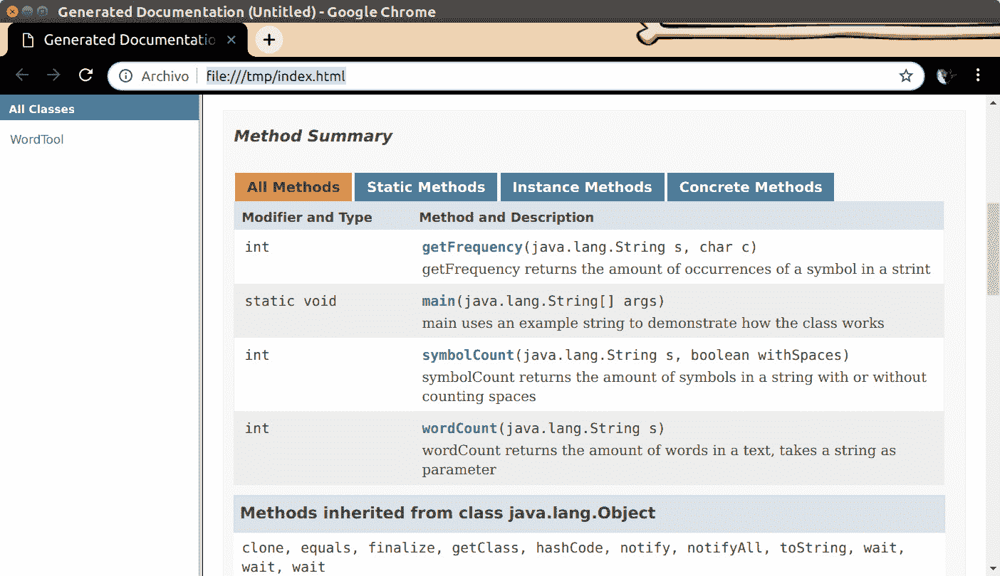
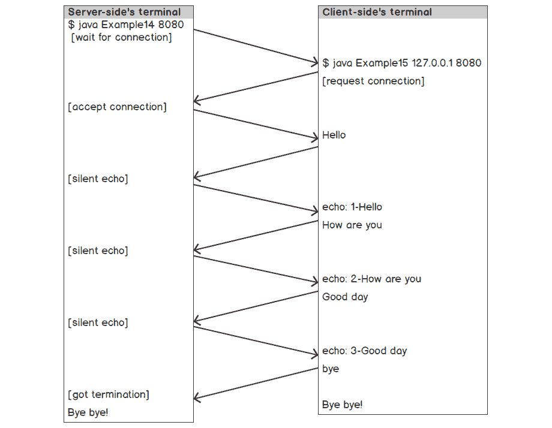

# 附录

## 关于

本节包含帮助学生执行书中活动的说明。它包括学生为完成和实现本书目标而要执行的详细步骤。

# 1. 入门

## 活动一：获取两个数字的最小值

**解决方案**

1.  声明 `3` 个 `double` 变量：`a`、`b` 和 `m`。分别用 `3`、`4` 和 `0` 初始化它们。

    ```java
    double a = 3;
    double b = 4;
    double m = 0; // variable for the minimum
    ```

1.  创建一个 `String` 变量 `r`，它应包含要打印的输出消息。

    ```java
    // string to be printed
    String r = "The minimum of numbers: " + a + " and " + b + " is ";
    ```

1.  使用 `min()` 方法获取两个数字的最小值，并将其存储在 `m` 中。

    ```java
    // mathematical operation
    m = Math.min(a,b);
    ```

1.  打印结果。

    ```java
    System.out.println(r + m); // print out the results
    ```

    注意

    本活动的完整代码可以在以下链接找到：[`packt.live/2MFtRNM`](https://packt.live/2MFtRNM)

# 2. 学习基础知识

## 活动一：获取输入并比较范围

**解决方案**

1.  在 `main()` 中，引入一个 `if` 语句来检查输入的参数长度是否正确：

    ```java
    public class Activity1 {
        public static void main(String[] args) {
            if (args.length < 2) {
                System.err.println("Error. Usage is:");
                System.err.println("Activity1 systolic diastolic");
                System.exit(-1);
            }
    ```

1.  将这些参数解析为 `int` 值，并保存到变量中：

    ```java
            int systolic  = Integer.parseInt(args[0]);
            int diastolic = Integer.parseInt(args[1]);
    ```

1.  使用以下代码检查输入的不同值，以查看血压是否在期望的范围内：

    ```java
            System.out.print(systolic + "/" + diastolic + " is ");
            if ((systolic <= 90) || (diastolic <= 60)) {
                System.out.println("low blood pressure.");
            } else if ((systolic >= 140) || (diastolic >= 90)) {
                System.out.println("high blood pressure.");
            } else if ((systolic >= 120) || (diastolic >= 80)) {
                System.out.println("pre-high blood pressure.");
            } else {
                System.out.println("ideal blood pressure.");
            }
        }
    }
    ```

# 3. 面向对象编程

## 活动一：将符号频率计算添加到 WordTool

**解决方案**

向之前创建的 `WordTool` 类添加一个方法来计算特定符号的频率。为此，执行以下步骤：

1.  添加一个方法来计算字符串中的单词数量。

    ```java
    public int wordCount ( String s ) {
        int count = 0;  // variable to count words
        // if the entry is empty or is null, count is zero
        // therefore we evaluate it only otherwise
        if ( !(s == null || s.isEmpty()) ) {
            // use the split method from the String class to
            // separate the words having the whitespace as separator
            String[] w = s.split("\\s+");
            count = w.length;
        }
        return count;
    }
    ```

1.  添加一个方法来计算字符串中的字母数量，并添加区分是否有空格的选项。

    ```java
    public int symbolCount ( String s, boolean withSpaces ) {
        int count = 0;  // variable to count symbols
        // if the entry is empty or is null, count is zero
        // therefore we evaluate it only otherwise
        if ( !(s == null || s.isEmpty()) ) {
            if (withSpaces) {
                // with whitespaces return the full length
                count = s.length();
            } else {
                // without whitespaces, eliminate whitespaces
                // and get the length on the fly
                count = s.replace(" ", "").length();
            }
        }
        return count;
    }
    ```

1.  添加一个方法来计算特定符号的频率。

    ```java
    public int getFrequency ( String s, char c ) {
        int count = 0;
        // if the entry is empty or is null, count is zero
        // therefore we evaluate it only otherwise
        if ( !(s == null || s.isEmpty()) ) {
            count = s.length() - s.replace(Character.toString(c), "").length();
        }
        return count;
    }
    ```

1.  在主类中，创建 `WordTool` 类的对象，并添加一个包含您选择的文本行的字符串变量。

    ```java
    WordTool wt = new WordTool();
    String text = "The river carried the memories from her childhood.";
    ```

1.  添加一个变量来包含在文本中要查找的符号，并选择一个符号，在这种情况下是 '`e`'。因为它是一个字符，所以使用单引号来界定它。

    ```java
    char search = 'e';
    ```

1.  在主方法中添加代码以打印出 `WordTool` 执行的计算。

    ```java
    System.out.println( "Analyzing the text: \n" + text );
    System.out.println( "Total words: " + wt.wordCount(text) );
    System.out.println( "Total symbols (w. spaces): " + wt.symbolCount(text, true) );
    System.out.println( "Total symbols (wo. spaces): " + wt.symbolCount(text, false) );
    System.out.println( "Total amount of " + search + ": " + wt.getFrequency(text, search) );
    ```

## 活动二：向 WordTool 添加文档

**解决方案**

确保为每个示例都添加文档，并添加足够的元数据，以便人们知道如何处理不同的方法。

1.  为类添加一个介绍性注释，您至少应包括简短文本、`@author`、`@version` 和 `@since` 参数。

    ```java
    /**
      * <H1>WordTool</H1>
      * A class to perform calculations about text.
      *
      * @author Joe Smith
      * @version 0.1
      * @since 20190305
      */
    ```

1.  为 `wordCount` 方法添加解释，记得包括参数和方法的预期输出，作为 `@param` 和 `@return`。

    ```java
    /**
      * <h2>wordCount</h2>
      * returns the amount of words in a text, takes a string as parameter
      *
      * @param s
      * @return int
      */
    public int wordCount ( String s ) { [...]
    ```

1.  同样为 `symbolCount` 添加一个方法。

    ```java
    /**
      * <h2>symbolCount</h2>
      * returns the amount of symbols in a string with or without counting spaces
      *
      * @param s
      * @param withSpaces
      * @return int
      */
    public int symbolCount ( String s, boolean withSpaces ) { [...]
    ```

1.  不要忘记类中的最后一个方法，`getFrequency`。

    ```java
    /**
      * <h2>getFrequency</h2>
      * returns the amount of occurrences of a symbol in a string
      *
      * @param s
      * @param c
      * @return int
      */
    public int getFrequency ( String s, char c ) { [...]
    ```

1.  现在您已经准备好从本示例中导出文档文件。

    本活动产生的文档网站应类似于以下截图所示：



图 3.12：文档网站

# 4. 集合、列表和 Java 的内置 API

## 活动一：在数组中搜索多个出现

**解决方案**

1.  创建 `text` 数组。

    ```java
    String[] text = {"So", "many", "books", "so", "little", "time"};
    ```

1.  创建包含要搜索的单词的变量：so

    ```java
    String searchQuery = "so";
    ```

1.  初始化变量`occurrence`为`-1`。

    ```java
    int occurrence = -1;
    ```

1.  创建一个`for`循环来遍历数组并检查其出现。

    ```java
    for(int i = 0; i < text.length; i++) {
        occurrence = text[i].compareToIgnoreCase(searchQuery);
        if (occurrence == 0) {
            System.out.println("Found query at: " + i);
        }
    }
    ```

    注意

    此活动的完整代码可以在以下链接找到：[`packt.live/35RQ9Ud`](https://packt.live/35RQ9Ud)

## 活动二：遍历大型列表

**解决方案**

1.  首先，你应该创建一个包含随机数字的随机大小的列表。创建你将用于存储数字的列表。你将存储类型为`Double`的数字。

    ```java
    List <Double> numbers = new ArrayList <Double> ();
    ```

1.  定义下一个列表的大小，使用我们命名为`numNodes`的变量。将变量类型设为`long`。由于随机方法不生成该类型，你需要对结果进行类型转换。

    ```java
    long numNodes = (long) Math.round(Math.random() * 10000);
    ```

1.  使用`for`循环遍历列表并创建其中的每个元素。

    ```java
    for (int i = 0; i < numNodes; i++) {
        numbers.add(Math.random() * 100);
    }
    ```

1.  为了计算平均值，你可以创建一个迭代器，它将遍历值列表并添加与每个元素对应的加权值。

    ```java
    Iterator iterator = numbers.iterator();
    ```

1.  来自`iterator.next()`方法返回的值必须在与其他元素总数进行比较之前转换为`Double`类型。

    ```java
    Double average = 0.0;
    while(iterator.hasNext()) {
        average += (Double) iterator.next() / numNodes;
    }
    ```

1.  不要忘记打印出结果。

    ```java
    System.out.println("Average: " + average);
    ```

    注意

    此活动的完整代码可以在以下链接找到：[`packt.live/35Yvo9m`](https://packt.live/35Yvo9m)

# 5. 异常

## 活动一：设计异常类记录数据

**解决方案**

1.  导入此程序运行所需的相关类：`NoSuchFileException`和`logging`。

    ```java
    import java.nio.file.NoSuchFileException;
    import java.util.logging.*;
    ```

1.  创建自己的方法来引发异常，首先从创建一个用于`NullPointerException`情况的方法开始。

    ```java
    public static void issuePointerException() throws NullPointerException {
        throw new NullPointerException("Exception: file not found");
    }
    ```

1.  如果文件未找到，你还需要一个方法来处理：`NoSuchFileException`。

    ```java
    public static void issueFileException() throws NoSuchFileException {
        throw new NoSuchFileException("Exception: file not found");
    }
    ```

1.  返回到`Main`方法，创建一个`logger`对象，该对象将报告异常及其严重程度。

    ```java
    Logger logger = Logger.getAnonymousLogger();
    ```

1.  通过命令行界面捕获传递给脚本的参数并将其存储在一个变量中。

    ```java
    int exceptionNum = Integer.valueOf(args[0]);
    ```

1.  使用 switch-case 语句区分可能的异常以进行日志记录。记住使用 try-catch 捕获异常。

```java
Activity01.java
1  switch (exceptionNum) {
2      case 1:
3          try {
4            issuePointerException();
5          } catch (NullPointerException ne) {
6            logger.log(Level.SEVERE, "Exception happened", ne);
7          }
8          break;
9      case 2:
10         try {
11           issueFileException();
12         } catch (NoSuchFileException ne) {
13           logger.log(Level.WARNING, "Exception happened", ne);
14         }
15         break;
https://packt.live/33SEL8B
```

# 6. 库、包和模块

## 活动一：跟踪夏季高温

**解决方案**

1.  创建一个 IntelliJ Gradle 项目。按照以下方式修改`settings.gradle`：

    ```java
    rootProject.name = 'temps'
    ```

1.  按照以下方式修改`build.gradle`：

    ```java
    build.gradle
    1  buildscript {
    2      repositories {
    3          jcenter()
    4      }
    5      dependencies {
    6          classpath 'com.github.jengelman.gradle.plugins:shadow:2.0.1'
    7      }
    8  }
    https://packt.live/2pJJJFY
    ```

1.  创建一个名为`City`的`class`。添加以下字段和构造函数：

    ```java
    package com.packtpub.temps;
    public class City {
        private String name;
        private String country;
        double summertimeHigh;      // In degrees C
        public City(String name, String country, double summertimeHigh) {
            this.name = name;
            this.country = country;
            this.summertimeHigh = summertimeHigh;
        }
    }
    ```

1.  在类内部右键单击。选择`Generate`，然后选择`Getter and Setter`。选择所有字段并点击`OK`。这将生成 getter 和 setter 方法：

    ```java
    public String getName() {
        return name;
    }
    public void setName(String name) {
        this.name = name;
    }
    public String getCountry() {
        return country;
    }
    public void setCountry(String country) {
        this.country = country;
    }
    public double getSummertimeHigh() {
        return summertimeHigh;
    }
    public void setSummertimeHigh(double summertimeHigh) {
        this.summertimeHigh = summertimeHigh;
    }
    ```

1.  添加一个将摄氏度转换为华氏度的方法。此方法使用`TempConverter`类：

    ```java
    public String format(boolean fahrenheit) {
        String degrees = summertimeHigh + " C";
        if (fahrenheit) {
            degrees = TempConverter.convertToF(summertimeHigh) + " F";
        }
        return name + ", " + country + " " + degrees;
    }
    ```

1.  创建一个名为`SummerHigh`的`class`来保存夏季高温的城市信息。输入以下属性和构造函数：

    ```java
    package com.packtpub.temps;
    public class SummerHigh {
        private City base;
        private City moderateCuts;
        private City noCuts;
        public SummerHigh(City base, City moderateCuts, City noCuts) {
            this.base = base;
            this.moderateCuts = moderateCuts;
            this.noCuts = noCuts;
        }
    }
    ```

1.  在类内部右键单击。选择`Generate`，然后选择`Getter and Setter`。选择所有字段并点击`OK`。这将生成 getter 和 setter 方法：

    ```java
    public City getBase() {
        return base;
    }
    public void setBase(City base) {
        this.base = base;
    }
    public City getModerateCuts() {
        return moderateCuts;
    }
    public void setModerateCuts(City moderateCuts) {
        this.moderateCuts = moderateCuts;
    }
    public City getNoCuts() {
        return noCuts;
    }
    public void setNoCuts(City noCuts) {
        this.noCuts = noCuts;
    }
    ```

1.  输入一个格式化方法以便输出可读：

    ```java
    public String format(boolean fahrenheit) {
        StringBuilder builder = new StringBuilder();
        builder.append("In 2100, ");
        builder.append(base.format(fahrenheit));
        builder.append(" will be like\n   ");
        builder.append(noCuts.format(fahrenheit));
        builder.append(" with no emissions cuts,");
        builder.append("\n   ");
        builder.append(moderateCuts.format(fahrenheit));
        builder.append(" with moderate emissions cuts");
        return builder.toString();
    }
    ```

    此代码使用了`City`类的`format()`方法。

1.  创建一个名为`SummerHighs`的类。此类包含`SummerHigh`对象的表。输入以下字段和构造函数以初始化表：

    ```java
    package com.packtpub.temps;
    import com.google.common.collect.HashBasedTable;
    import com.google.common.collect.Table;
    import java.util.Map;
    public class SummerHighs {
        private Table<String, String, SummerHigh> data;
        public SummerHighs() {
            data = HashBasedTable.create();
        }
    }
    ```

1.  通过`city`获取夏季高温信息的方法：

    ```java
    public SummerHigh getByCity(String city) {
        Map<String, SummerHigh> row = data.row(city.toLowerCase());
        SummerHigh summerHigh = null;
        for ( String key : row.keySet()) {
            summerHigh = row.get(key);
        }
        return summerHigh;
    }
    ```

    此方法使用`Guava`库的`Table`类。

1.  通过`country`获取夏季高温信息的方法：

    ```java
    public SummerHigh getByCountry(String country) {
        Map<String, SummerHigh> column = data.column(country.toLowerCase());
        SummerHigh summerHigh = null;
        for ( String key : column.keySet()) {
            summerHigh = column.get(key);
        }
        return summerHigh;
    }
    ```

    此方法还使用了`Guava`库的`Table`类。

1.  现在创建一些方便的方法，以便更容易地添加城市：

    ```java
    // Convenience methods to help initialize data.
    public void addSummerHigh(SummerHigh summerHigh) {
        City baseCity = summerHigh.getBase();
        data.put(baseCity.getName().toLowerCase(),
                baseCity.getCountry().toLowerCase(), summerHigh);
    }
    public SummerHigh createSummerHigh(City base, City moderateCuts,
                                       City noCuts) {
        return new SummerHigh(base, moderateCuts, noCuts);
    }
    public City createCity(String name, String country, double summertimeHigh) {
        return new City(name, country, summertimeHigh);
    }
    ```

1.  然后，创建一个初始化之前描述的夏季高温数据的方法：

    ```java
    SummerHighs.java
    67     addSummerHigh(
    68         createSummerHigh(
    69             createCity("Tokyo", "Japan", 26.2),
    70             createCity("Beijing", "China", 29.0),
    71             createCity("Wuhan", "China", 31.2)
    72         )
    73     );
    https://packt.live/2qELV2d
    ```

1.  创建一个名为`Main`的类来运行我们的程序。然后，创建如下所示的`main()`方法：

    ```java
    Main.java
    6          SummerHighs summerHighs = new SummerHighs();
    7          summerHighs.initialize();
    8  
    9          boolean fahrenheit = false;
    10         // Handle inputs
    11         if (args.length < 2) {
    12             System.err.println("Error: usage is:");
    13             System.err.println(" -city London");
    14             System.err.println(" -country United Kingdom");
    15         }
    16
    17         String searchBy = args[0];
    18         String name = args[1];
    19         SummerHigh high = null;
    20         if ("-city".equals(searchBy)) {
    21             high = summerHighs.getByCity(name);
    22         } else if ("-country".equals(searchBy)) {
    23             high = summerHighs.getByCountry(name);
    24         }
    https://packt.live/2BBF2AO
    ```

1.  最后，创建一个名为`TempConverter`的类，用于将摄氏度转换为华氏度：

    ```java
    package com.packtpub.temps;
    public class TempConverter {
        public static double convertToF(double degreesC) {
            double degreesF = (degreesC * 9/5) + 32;
            // Round to make nicer output.
            return Math.round(degreesF * 10.0) / 10.0;
        }
    }
    ```

# 7. 数据库和 JDBC

## 活动 1：跟踪你的进度

**解决方案**

1.  `student`表包含有关`student`的信息：

    ```java
    CREATE TABLE IF NOT EXISTS student
    (
    STUDENT_ID long,
    FIRST_NAME varchar(255),
    LAST_NAME varchar(255),
    PRIMARY KEY (STUDENT_ID)
    );
    ```

1.  `chapter`表包含`chapter number`和`name`：

    ```java
    CREATE TABLE IF NOT EXISTS chapter
    (
    CHAPTER_ID long,
    CHAPTER_NAME varchar(255),
    PRIMARY KEY (CHAPTER_ID)
    );
    ```

    注意`chapter ID`是`chapter number`。

1.  `student_progress`表将`student ID`映射到`chapter ID`，表示特定学生完成了特定章节：

    ```java
    CREATE TABLE IF NOT EXISTS student_progress
    (
    STUDENT_ID long,
    CHAPTER_ID long,
    COMPLETED date,
    PRIMARY KEY (STUDENT_ID, CHAPTER_ID)
    );
    ```

    注意使用`student ID`和`chapter ID`作为复合`primary key`，每个学生只能完成每个章节一次。没有重试的机会。

1.  这里是一个假设的学生：

    ```java
    INSERT INTO student
    (STUDENT_ID, FIRST_NAME, LAST_NAME)
    VALUES (1, 'BOB', 'MARLEY');
    ```

    注意，为了便于匹配名称，我们将它们全部大写插入。

1.  以下`INSERT`语句提供了前七个章节的数据：

    ```java
    INSERT INTO chapter
    (CHAPTER_ID, CHAPTER_NAME)
    VALUES (1, 'Getting Started');
    INSERT INTO chapter
    (CHAPTER_ID, CHAPTER_NAME)
    VALUES (2, 'Learning the Basics');
    INSERT INTO chapter
    (CHAPTER_ID, CHAPTER_NAME)
    VALUES (3, 'Object-Oriented Programming: Classes and Methods');
    INSERT INTO chapter
    (CHAPTER_ID, CHAPTER_NAME)
    VALUES (4, 'Collections, Lists, and Java's Built-In APIs');
    INSERT INTO chapter
    (CHAPTER_ID, CHAPTER_NAME)
    VALUES (5, 'Exceptions');
    INSERT INTO chapter
    (CHAPTER_ID, CHAPTER_NAME)
    VALUES (6, 'Modules, Packages, and Libraries');
    INSERT INTO chapter
    (CHAPTER_ID, CHAPTER_NAME)
    VALUES (7, 'Databases and JDBC');
    ```

    注意插入带引号的文本时使用的两个单引号。

1.  要添加`student_progress`记录，生成如下`INSERT`语句：

    ```java
    INSERT INTO student_progress
    (STUDENT_ID, CHAPTER_ID, COMPLETED)
    VALUES (1, 2, '2019-08-28');
    ```

    这应该在 Java 程序中使用`PreparedStatement`来完成。

1.  要查询学生的进度，使用如下查询：

    ```java
    SELECT first_name, last_name, chapter.chapter_id, chapter_name, completed
    FROM student, chapter, student_progress
    WHERE first_name = 'BOB'
    AND last_name = 'MARLEY'
    AND student.student_id = student_progress.student_id
    AND chapter.chapter_id = student_progress.chapter_id
    ORDER BY chapter_id;
    ```

    注意`first name`和`last name`将由用户输入。这应该放在`PreparedStatement`中。

    `ORDER BY`子句确保输出将按章节顺序显示。

1.  `ShowProgress`程序输出给定学生已完成的章节：

    ```java
    ShowProgress.java
    1  package com.packtpub.db;
    2  import java.sql.*;
    3  public class ShowProgress {
    4      public static void main(String[] args) {
    5          if (args.length < 2) {
    6             System.err.println("Error: please enter the first and last               name.");
    7              System.exit(-1);
    8          }
    9          // Get student first and last name as inputs.
    10         String firstName = args[0].toUpperCase();
    11         String lastName = args[1].toUpperCase();
    https://packt.live/31EPNg4
    ```

    注意在搜索数据库之前，将输入的姓氏和名字强制转换为大写。此外，注意我们不允许两个学生有相同的名字。这并不现实。

    查询后，程序输出学生的姓名，然后为每个完成的章节输出一行。

1.  要运行此程序，在 Gradle 中构建`shadowJar`任务，然后在构建目录的`IntelliJ`子目录下的`libs`中运行如下命令。

    输出将如下所示：

    ```java
    BOB MARLEY
    2019-03-01  2 Learning the Basics
    2019-03-01  3 Object-Oriented Programming: Classes and Methods
    2019-03-01  7 Databases and JDBC
    ```

1.  `RecordProgress`程序添加了一个`student_progress`记录：

    ```java
    RecordProgress.java
    1  package com.packtpub.db;
    2  
    3  import java.sql.*;
    4  
    5  public class RecordProgress {
    6      public static void main(String[] args) {
    7  
    8          // Get input
    9          if (args.length < 3) {
    10             System.err.println("Error: please enter first last chapter.");
    11             System.exit(-1);
    12         }
    13 
    14         // Get student first and last name and chapter number.
    15         String firstName = args[0].toUpperCase();
    https://packt.live/362QaF1
    ```

1.  要运行此程序，使用如下命令：

    ```java
    java -cp customers-1.0-all.jar com.packtpub.db.RecordProgress bob marley 4
    ```

    你将看到如下输出：

    ```java
    Number rows added: 1
    ```

    如前所述，在搜索数据库之前，将输入的名称强制转换为大写。

# 8. 套接字、文件和流

## 活动 1：将目录结构写入文件

**解决方案**

1.  导入相关的类以使此示例工作。基本上，你将使用集合、文件和相关的异常。

    ```java
    import java.io.IOException;
    import java.nio.file.*;
    import java.nio.file.attribute.BasicFileAttributes;
    import java.util.Collections;
    ```

1.  确定你将开始查找目录的文件夹。让我们假设你从`user.home`开始。声明一个指向该文件夹的 Path 对象。

    ```java
    Path path = Paths.get(System.getProperty("user.home"));
    ```

1.  接下来，你将调用`File.walkFileTree`，这将允许你迭代文件夹结构直到一定深度。在这种情况下，你可以设置任何深度，例如`10`。这意味着程序将挖掘到`10`级目录以查找文件。

    ```java
    Files.walkFileTree(path, Collections.emptySet(), 10, new SimpleFileVisitor<Path>() { [...]
    ```

1.  在这种情况下，方法包括覆盖`SimpleFileVisitor`的几个方法以提取路径信息并将其作为字符串返回，从而使文件结构易于阅读。第一个要覆盖的方法是`preVisitDirectory`，当类中的目录项恰好是一个嵌套目录时，将触发此方法。

    ```java
    @Override
    public FileVisitResult preVisitDirectory(Path dir, BasicFileAttributes attrs) {
    ```

1.  在`preVisitDirectory`内部，有一些操作你需要执行。首先，你需要计算你在目录结构中的深度，因为你将需要它来打印空格作为格式化程序输出的方式。`preVisitDirectory`将当前路径作为名为`dir`的参数获取。但它也会使用全局路径参数（记住我们从`user.home`开始）。声明一个名为`depthInit`的变量来存储在路径时你在目录结构中的位置。

    ```java
    String [] pathArray = path.toString().split("/");
    int depthInit = pathArray.length;
    ```

1.  重复此操作，但这次使用当前目录，将结果存储在名为`depthCurrent`的变量中。

    ```java
    String [] fileArray = dir.toString().split("/");
    int depthCurrent = fileArray.length;
    ```

1.  使用`for`循环在当前文件夹名前打印一些空格。

    ```java
    for (int i = depthInit; i < depthCurrent; i++) {
        System.out.print("    ");
    }
    ```

1.  最后，打印出文件夹/文件的名称，并退出方法。

    ```java
    System.out.println(fileArray[fileArray.length - 1]);
    return FileVisitResult.CONTINUE;
    ```

1.  在`SimpleFileVisitor`中需要覆盖的第二个方法是`visitFileFailed`。此方法处理当读取用户无权进入的路径或类似情况时触发的异常。完整的方法如下。

    ```java
    @Override
    public FileVisitResult visitFileFailed(Path file, IOException exc) throws IOException {
        System.out.println("visitFileFailed: " + file);
        return FileVisitResult.CONTINUE;
    }
    ```

1.  现在尝试运行程序。你将看到类似以下内容的家目录目录列表，其中每个四个空格的块代表在文件夹结构中深入一级。

    ```java
    topeka
        snap
            gnome-calculator
            gnome-system-monitor
            libreoffice
        Downloads
    [...]
    ```

1.  现在将结果存储在文件中而不是简单地打印到 CLI 中，已经是一个简单的练习了。首先，你需要声明一个文件名，在这个例子中，让我们创建一个最终会存储在 Main 类所在同一文件夹中的文件。

    ```java
    String fileName = "temp.txt";
    Path pathFile = Paths.get(fileName);
    ```

1.  接下来，你应该检查日志文件是否已存在于文件夹中，这将有助于决定你是创建它还是简单地将其数据附加到它上面。

    ```java
    if(!Files.exists(pathFile))  {
        try {
            // Create the file
            Files.createFile(pathFile);
            System.out.println("New file created at: " + pathFile);
        } catch (IOException ioe) {
            System.out.println("EXCEPTION when creating file: " + ioe.getMessage());
        }
    }
    ```

1.  你将不得不修改覆盖的`preVisitDirectory`以包括将数据写入你刚刚创建的文件的可能性。

    ```java
    Activity01.java
    27 public FileVisitResult preVisitDirectory(Path dir, BasicFileAttributes      attrs) {
    28  
    29     String toFile = "";
    30  
    31     String [] pathArray = path.toString().split("/");
    32     int depthInit = pathArray.length;
    33     String [] fileArray = dir.toString().split("/");
    34     int depthCurrent = fileArray.length;
    35     for (int i = depthInit; i < depthCurrent; i++) {
    36         toFile += "    ";
    37     }
    38     toFile += fileArray[fileArray.length - 1];
    39  
    40     if(Files.exists(pathFile))
    https://packt.live/35Ye4kR
    ```

1.  执行代码现在将给出一个位于你执行代码的同一文件夹中的文件作为结果。

    ```java
    user@computer:~/[...]/Activity0801/out/production/Activity0801$ ls
    'Main$1.class'   Main.class   temp.txt
    ```

## 活动二：改进 EchoServer 和 EchoClient 程序

**解决方案**

1.  预期结果将需要您以非常相似的方式修改服务器和客户端。在客户端，您将不得不做以下类似的事情：

    ```java
    Client.java
    1  import java.io.*;
    2  import java.net.*;
    3  
    4  public class Client {
    5      public static void main(String[] args) throws IOException {
    6          if (args.length != 2) {
    7              System.err.println(
    8                      "Usage: java EchoClient <host name> <port number>");
    9              System.exit(1);
    10         }
    11 
    12         String hostName = args[0];
    13         int portNumber = Integer.parseInt(args[1]);
    14 
    https://packt.live/2MEFg0w
    ```

1.  在服务器上，修改应该看起来像以下这样：

```java
Server.java
1  import java.net.*;
2  import java.io.*;
3  
4  public class Server {
5      public static void main(String[] args) throws IOException {
6  
7          if (args.length != 1) {
8              System.err.println("Usage: java EchoServer <port number>");
9              System.exit(1);
10         }
11 
12         int portNumber = Integer.parseInt(args[0]);
13 
14         try (
15                 ServerSocket serverSocket =
https://packt.live/2WbxAWv
```

服务器和客户端之间预期的交互应该如下所示：



图 8.2：服务器和客户端之间的交互

# 9. 使用 HTTP

## 活动一：使用 jsoup 库从网络下载文件

**解决方案**

程序相对较短。主要任务是找出 `select()` 方法调用中的 CSS 查询：

1.  创建一个名为 `Activity1` 的类。

1.  在 `main()` 中，启动一个 `try-catch` 块

    ```java
            try {

            } catch (IOException e) {
                e.printStackTrace();
            }
    ```

1.  在 `try` 块内部，使用 `Jsoup` 库下载位于[`packt.live/2BqZbtq`](https://packt.live/2BqZbtq)的远程网页内容。这将导致网页内容存储在 `Document` 对象中。

    ```java
            String url = "http://hc.apache.org/";
                Document doc =
                        Jsoup.connect(url).get();
    ```

1.  接下来，查询文档以获取所有具有 `section` CSS 类的 `DIV` 元素。

    ```java
    Elements sections = doc.select("div.section");
    ```

1.  您将需要遍历这些 `DIV` 元素中的每一个。

    ```java
                for (Element div : sections) {
                    for (Element child : div.children()) {
                    }
                }
    ```

1.  在内层循环内部，查找 `H3` 标题标签。

    ```java
                        String tag = child.tagName();
                        if (tag.equalsIgnoreCase("h3")) {
                        }
    ```

1.  最后，在检测标签是否为 H3 元素的 `if` 语句内部，找到所有用于 HTML 链接的锚（A）标签，并打印出每个链接的文本。

    ```java
                            Elements links = child.getElementsByTag("a");
                            for (Element link : links) {
                                System.out.println(link.text());
                            }
    ```

    注意

    您可以在此处找到此活动的完整代码：[`packt.live/33SEhPP`](https://packt.live/33SEhPP)

# 11. 进程

## 活动一：创建父进程以启动子进程

**解决方案**

1.  子进程应该有一个类似于以下算法：

    ```java
    Child.java
    9     public static void main(String[] args) throws java.io.IOException,       InterruptedException {
    10        int ch;
    11        System.out.print ("Let's echo: ");
    12        while ((ch = System.in.read ()) != '\n')
    13            System.out.print ((char) ch);
    14        BufferedWriter bw=new BufferedWriter(
    15                new FileWriter(new File("mycal2022.txt")));
    16            int cont = 0;
    17            while(cont <= 50) {
    18                System.out.println(cont++);
    19                cont %= 50;
    20                bw.write(cont + "\n");
    https://packt.live/32I5Afu
    ```

    这里有一个调用 `System.in.available()` 来检查子程序输出缓冲区中是否有数据。

1.  另一方面，父程序应该考虑包含类似以下内容：

```java
Parent.java
18         try {
19             process.waitFor(5, TimeUnit.SECONDS);
20         } catch (InterruptedException ie) {
21             System.out.println("WARNING: interrupted exception fired");
22         }
23
24         System.out.println("trying to write");
25         OutputStream out = process.getOutputStream();
26         Writer writer = new OutputStreamWriter(out);
27         writer.write("This is how we roll!\n");
28         writer.flush();
29
30         File file = new File("data.log");
31         FileWriter fileWriter = new FileWriter(file);
32         BufferedWriter bufferedWriter = new BufferedWriter(fileWriter);
33
34         System.out.println("trying to read");
35         InputStream in = process.getInputStream();
36         Reader reader = new InputStreamReader(in);
37         BufferedReader bufferedReader = new BufferedReader(reader);
38         String line = bufferedReader.readLine();
39
40         // send to screen
41         System.out.println(line);
https://packt.live/2MEBlR9
```

# 12. 正则表达式

## 活动一：检查入口是否以所需格式输入的正则表达式

**解决方案**

1.  访问[`packt.live/2MYzyFq`](https://packt.live/2MYzyFq)。

1.  将练习 1 中已有的正则表达式添加规则，允许数字后面有一个可选的字母：

    ```java
    [a-zA-Z]{2,}\s{1}\d+[a-zA-Z]{1}
    ```

1.  检查 RE 是否适用于 *Strandvagen 1a* 和 *Ringvagen 2b*。

# 13. 使用 Lambda 表达式的函数式编程

## 活动一：修改不可变列表

**解决方案**

1.  编写一个应用程序，修改练习 2 中找到的 ShoppingCart 类，以允许从购物车中删除项目。

    ```java
            public ShoppingCart removeItem(ShoppingItem item) {
               Map<String, Integer> newList = new HashMap<>(mShoppingList);
                int value = 0;
                if (newList.containsKey(item.name)) {
                    value = newList.get(item.name);
                }
                if (value > 0) {
                    newList.put(item.name, --value);
                }
                return new ShoppingCart(newList);
            }
    ```

1.  向 ShoppingCart 类添加一个新功能，允许用户在单次调用中向购物车添加多个项目。

    ```java
    public ShoppingCart addItems(ShoppingItem... items) {
                Map<String, Integer> newList = new HashMap<>(mShoppingList);
                ShoppingCart newCart = null;
                for (ShoppingItem item : items) {
                    newCart = addItem(item);
                }
    ```

1.  通过修改主应用程序文件中的代码来证明新功能按预期工作。

    ```java
    public class Activity1 {
        public static void main(String[] args) {
            ShoppingCart myFirstCart = new ShoppingCart(new HashMap<>());
            ShoppingCart mySecondCart = myFirstCart.addItem(new           ShoppingItem("Chair", 150));
            ShoppingCart myThirdCart = mySecondCart.addItem(new           ShoppingItem("Table", 350));
    ```

您可以在[`packt.live/2q045er`](https://packt.live/2q045er)找到此活动的完整代码。

# 14. 递归

## 活动一：计算斐波那契数列

**解决方案**

1.  创建一个名为 `Fibonacci` 的类。

1.  创建一个名为 `fibonacci` 的静态方法，用于计算给定数字的斐波那契数列。如果输入数字大于 `1`，则此方法将调用自身。

    ```java
        public static int fibonacci(int number) {
            if (number == 0) {
                return number;
            } else if (number == 1) {
                return 1;
            } else {
                return (fibonacci(number - 1) + fibonacci(number - 2));
            }
        }
    ```

    如果输入数字是 `0` 或 `1`，则此方法返回输入数字（分别是 `0` 或 `1`）。

1.  创建一个 `main()` 方法，调用 `fibonacci` 方法，输入从 `0` 到 `16`（或小于 `17` 的值，如下所示）。

    ```java
        public static void main(String[] args) {
            for (int i = 0; i < 17; i++) {
                System.out.println( fibonacci(i) );
            }
        }
    ```

    注意

    本活动的完整代码可以在以下链接找到：[`packt.live/32DtjNT`](https://packt.live/32DtjNT).

# 15. 使用流处理数据

## 活动一：对商品应用折扣

**解决方案**

```java
Activity1.java
30         double sum = calculatePrice(fruitCart, vegetableCart, meatAndFishCart);
31         System.out.println(String.format("Sum: %.2f", sum));
32
33         Map<String, Double> discounts = Map.of("Cod", 0.2, "Salad", 0.5);
34
35         double sumDiscount = calculatePriceWithDiscounts(discounts, fruitCart, vegetableCart,            meatAndFishCart);
36         System.out.println(String.format("Discount sum: %.2f", sumDiscount));
37     }
38
39     private static double calculatePrice(ShoppingCart... carts) {
40         return Stream.of(carts)
41                 .flatMap((cart) -> { return cart.mArticles.stream(); })
42                 .mapToDouble((item) -> { return item.price; })
43                 .sum();
44     }
https://packt.live/35Zm5Gj
```

## 活动二：寻找具体信息

**解决方案**

```java
Activity2.java
61         private ShoppingArticle(String name, String category, double price, String unit) {
62             this.name = name;
63             this.category = category;
64             this.price = price;
65             this.unit = unit;
66         }
67
68         @Override
69         public String toString() {
70             return name + " (" + category + ")";
71         }
72     }
73
74     private static ShoppingArticle findCheapestFruit (List<ShoppingArticle> articles) {
75         return articles.stream()
76                 .filter((article) -> article.category.equals("Fruits"))
77                 .min(Comparator.comparingDouble(article -> article.price))
78                 .orElse(null);
79     }
80
81     private static ShoppingArticle findMostExpensiveVegetable (List<ShoppingArticle> articles) {
82         return articles.stream()
83                 .filter((article) -> article.category.equals("Vegetables"))
84                 .max(Comparator.comparingDouble(article -> article.price))
85                 .orElse(null);
86     }
https://packt.live/32EnOid
```

# 16. 断言和其他功能接口

## 活动一：切换传感器状态

**解决方案**

```java
Activity1.java
52         for (Sensor sensor : sensors) {
53             if (hasAlarmOrWarning.test(sensor)) {
54                 alarmOrWarning = true;
55             }
56         }
57
58         if (alarmOrWarning) {
59             System.out.println("Alarm, or warning, was triggered!");
60
61
62             for (Sensor sensor : sensors) {
63                 System.out.println(sensor.batteryHealth() + ", " + sensor.triggered());
64             }
65         }
66     }
67
68 }
https://packt.live/33Vnc7X
```

## 活动二：使用递归函数

**解决方案**

```java
Activity2.java
36     private static double loopedAverageHealth(Integer[] batteryHealths) {
37         double average = 0;
38         for (int i = 0; i < batteryHealths.length; i++) {
39             average += batteryHealths[i];
40         }
41         average = average / batteryHealths.length;
42         return average;
43     }
44
45     private static double streamedAverageHealth(Integer[] batteryHealths) {
46         return Stream.of(batteryHealths)
47                 .mapToDouble(Integer::intValue)
48                 .average()
49                 .orElse(0);
50     }
51
52     private static double recursiveAverageHealth(Integer[] batteryHealths, int index) {
53         double average = batteryHealths[index] / (double) batteryHealths.length;
54         if (index == 0) {
55             return average;
56         } else {
57             return average + recursiveAverageHealth(batteryHealths, index - 1);
58         }
59     }
60 }
https://packt.live/32EnJep
```

## 活动三：使用 Lambda 函数

**解决方案**

```java
Activity3.java
37     private static double loopedAverageHealth(Integer[] batteryHealths) {
38         double average = 0;
39         for (int i = 0; i < batteryHealths.length; i++) {
40             average += batteryHealths[i];
41         }
42         average = average / batteryHealths.length;
43         return average;
44     }
45
46     private static double streamedAverageHealth(Integer[] batteryHealths) {
47         return Stream.of(batteryHealths)
48                 .mapToDouble(Integer::intValue)
49                 .average()
50                 .orElse(0);
51     }
52
53     private static double recursiveAverageHealth(Integer[] batteryHealths, int index) {
54         double average = batteryHealths[index] / (double) batteryHealths.length;
55         if (index == 0) {
56             return average;
57         } else {
58             return average + recursiveAverageHealth(batteryHealths, index - 1);
59         }
60     }
61 }
https://packt.live/2BxaoIK
```

# 17. 使用 Java Flow 进行响应式编程

## 活动一：让 NumberProcessor 格式化值为整数

**解决方案**

1.  将处理器发布的商品类型更改为 Integer。在实现中做出必要的更改以匹配新类型：

    ```java
    Activity1.java
    53             @Override
    54             public void onComplete() {
    55                 System.out.println("onComplete()");
    56             }
    57         });
    58     }
    59
    60
    61     private static String[] getStrings() {
    62         String filePath = "res/numbers.txt";
    63         try (Stream<String> words = Files.lines(Paths.get(filePath))) {
    64             return words.flatMap((line) -> Arrays.stream(line.split("[\\s\\n]+")))
    65                     .filter((word) -> word.length() > 0)
    66                     .toArray(String[]::new);
    67         } catch (IOException e) {
    68             e.printStackTrace();
    69         }
    70         return null;
    71     }
    72 }
    https://packt.live/32GPq6b
    ```

1.  更改处理器的订阅者，它应该在 `onNext` 方法中只接受整数值：

    ```java
      @Override
                public void onSubscribe(Flow.Subscription subscription) {
                    this.subscription = subscription;
                    subscription.request(1);
                }
    ```

# 18. 单元测试

## 活动一：计算字符串中的单词数

**解决方案**

1.  创建一个名为 `WordCount` 的类。

1.  定义一个名为 `countWords()` 的方法，它接受一个 `String` 作为输入。该方法将计算 `String` 中的单词数。

    ```java
        public int countWords(String text) {
            int count = 0;
            return count;
        }
    ```

1.  在 `countWords()` 中，检查输入字符串是否为 null。如果不是，则删除文本开头和结尾的任何空格。然后，将 `String` 分割成单词。

    ```java
            if (text != null) {
                String trimmed = text.trim();
                if (trimmed.length() > 0) {
                    String[] words = trimmed.split("\\s+");
                    count = words.length;
                }
            }
    ```

    注意正则表达式 `\s+` 的使用，它被传递给 `split()` 方法。这将把 `String` 分割成单词。另外，注意开头的反斜杠字符需要转义。

    注意

    WordCount.java 文件的完整代码可以在以下链接找到：[`packt.live/32DtjNT`](https://packt.live/32DtjNT).

接下来，按照以下方式编写参数化测试。

1.  在 `src/test` 目录下（不是 `src/main`）创建一个名为 `WordCountTest` 的类。

1.  使用 `ParameterizedTest` 注解并定义一个 `CsvSource`，包含测试数据。

    ```java
        @ParameterizedTest
        @CsvSource({
            "'A man, a plan, a canal. Panama',  7",
            "'Able was I ere I saw Elba',  7",
            ", 0",
            "'', 0",
            "'   ', 0",
            "' A cat in the hat with spaces   ', 7"
        })
    ```

    测试数据接受两个值，一个要检查的文本字符串和单词数。注意标点符号和空格的位置，以查看 `WordCount` 类是否正常工作。

1.  创建 `test` 方法，使用输入参数并验证报告的单词数是否与预期的单词数匹配。

    ```java
        public void testWordCounts(String text, int expected) {
            WordCount wordCount = new WordCount();
            int count = wordCount.countWords(text);
            Assertions.assertEquals(expected, count,
                    "Expected " + expected + " for input[" + text + "]");
        }
    ```

    注意

    WordCountTest.java 文件的完整代码可以在以下链接找到：[`packt.live/2oafOq9`](https://packt.live/2oafOq9).
