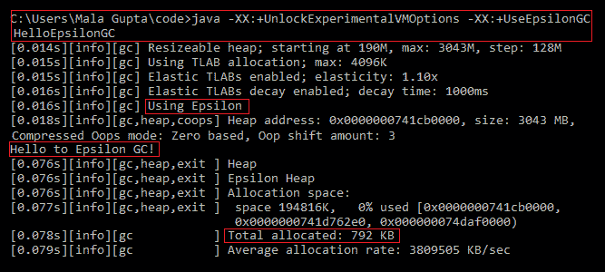
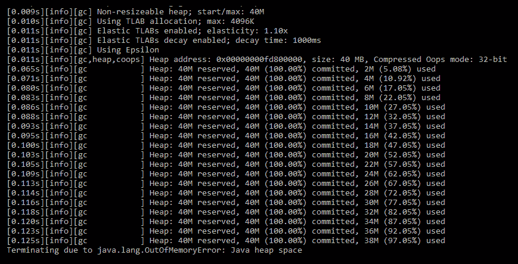
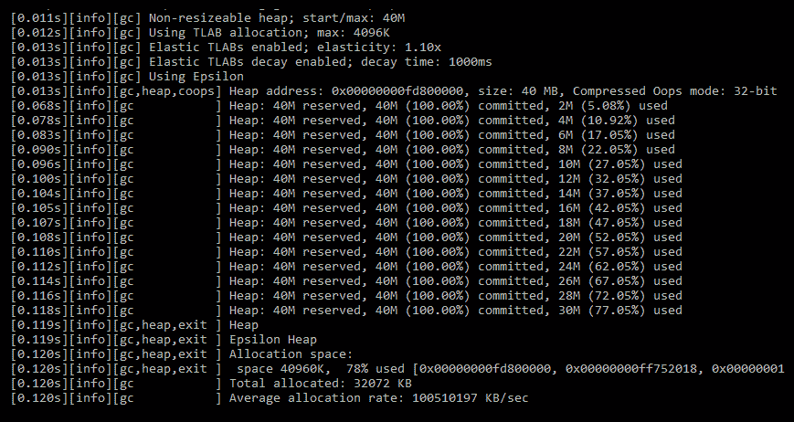

# 第六章：Epsilon GC

想象一下，一个软件组织用不会编码的程序员替换了原来的程序员，以此来计算他们耗尽资金并关闭需要多长时间。在这种情况下，没有产生新的收入，而员工工资仍在继续。以类似的方式，当您使用在 Java 11 中引入的 Epsilon **垃圾回收器**（**GC**）时，软件应用程序用 Epsilon 替换其 GC，它不会释放内存——以计算 Java 虚拟机（**JVM**）耗尽所有内存并关闭需要多长时间。

Epsilon 是一个 **无操作**（**no-op**）GC——也就是说，它不会收集任何垃圾。它只处理内存分配。当可用的 Java 堆耗尽时，JVM 关闭。

如果这个 GC 对您来说看起来很奇怪，请再想想。Epsilon GC 被添加为基准，以测试应用程序的性能、内存使用、延迟和吞吐量改进。

在本章中，我们将涵盖以下主题：

+   为什么需要 Epsilon

+   Epsilon 的特性

+   使用 Epsilon 的示例

+   Epsilon 的用例

# 技术要求

要使用本章中的代码，您应该在您的系统上安装 JDK 版本 11 或更高版本。

本章中所有的代码都可以通过以下网址访问：[`github.com/PacktPublishing/Java-11-and-12-New-Features`](https://github.com/PacktPublishing/Java-11-and-12-New-Features)。

让我们从探讨为什么我们需要一个不收集任何垃圾的 GC 开始。

# Epsilon GC 的动机

您可能见过海报声称到 2050 年，我们海洋中的塑料将比鱼还多。 我们还在 2019 年。那么，海洋分析师是如何预测 2050 年的情况的呢？可能有多种方法。也许他们只是假设塑料被添加而没有清理，或者也许他们只是使用当前塑料污染增加的速率，或者他们可能应用了另一种算法。

这句话的本质是，通过得出一个数字（例如 2050 年），他们可以传播关于海洋塑料污染增加的意识。通过声称将有 *比鱼更多的塑料*，他们可以吸引大众的注意，并鼓励他们现在就开始工作。人们害怕最坏的情况；如果你向他们展示一个令人担忧的情况，他们更有可能做出反应（按照建议的方式）。

同样，您可以使用 Epsilon GC 来预测您应用程序的性能能力。因为 Epsilon GC 可以测量和调整应用程序的性能、内存使用、延迟和吞吐量，而无需回收分配的内存。如果您想对应用程序性能进行基准测试，Epsilon GC 是您的工具。

Epsilon GC 用于将其他 GC 与您的应用程序在多个因素上进行基准测试，例如性能和内存使用，以优化您的应用程序并使用最适合您项目的最佳 GC。

# Epsilon 的特性

Epsilon 不会清除未使用对象的堆内存；它只分配内存。当 JVM 内存不足时，它会通过抛出 `OutOfMemoryError` 错误来关闭。如果启用了堆转储，Epsilon 将在抛出 `OutOfMemoryError` 错误后执行堆转储。

Epsilon GC 使用简单的、无锁的 **线程局部分配缓冲区**（**TLAB**）分配。这是通过以线性方式分配内存的连续部分来实现的。TLAB 分配的主要好处之一是它将进程绑定到已分配给它的内存。

Epsilon GC 使用的屏障集完全为空，因此得名，**无操作**。由于它不回收内存，因此它不需要担心维护对象图、对象标记、对象压缩或对象复制。

您会使用 Epsilon 产生任何延迟开销吗？是的，这是可能的。当 Epsilon **分配**内存时，您的应用程序可能会遇到延迟开销——即如果内存大小太大，并且正在分配的内存块也很大。

# 延迟与应用程序性能

想象一下，您的应用程序每秒处理数千条消息。在这种情况下，即使是一毫秒或更长时间的延迟也可能对您的系统性能产生影响。最糟糕的是，您甚至不知道何时 GC 会启动并开始收集。

我有一个建议；以不会收集任何垃圾的方式使用 Epsilon GC 执行您的应用程序作为基准。现在使用您选择的 GC 执行您的应用程序，并分析日志。现在您可以过滤出由于 GC（如 GC 工作者调度、GC 屏障成本或 GC 周期）引起的延迟。您的系统性能也可能由于与 GC 无关的问题而受到影响——例如操作系统调度或编译器问题。

# GC 引起的开销与系统开销

GC 周期存在延迟开销。对于关键应用，这可能会影响期望的吞吐量。通过仔细选择多个参数的组合，例如堆大小、分配单元、GC 周期持续时间、区域大小以及各种其他参数，您可以在各种 GC（包括 Epsilon）之间比较您应用程序的性能。

然而，开销也可能由系统引起，这与 GC 无关。使用多个 GC 执行您的应用程序将使您能够将 GC 引起的开销与系统开销分开，并选择最适合您应用程序的 GC。

通过使用无操作 GC（如 Epsilon），您可以过滤出由于 OS/编译器问题引起的 GC 引起的性能问题。

# 极短生命周期的任务

想象一下，您需要创建一个极短生命周期的应用程序。当您退出应用程序时，JVM 关闭，所有堆内存都会被回收。由于执行 GC 周期需要一些时间（尽管尽可能少），您可能会考虑使用 Epsilon GC 与您的应用程序一起使用。

让我们通过使用一些示例代码来使用 Epsilon GC 开始吧。

# 开始使用 HelloEpsilon GC 类

让我们编写一个 `HelloEpsilon` 类，并使用 Epsilon GC 执行它。以下是示例代码：

```java
class HelloEpsilonGC { 
    public static void main(String[] args) { 
        System.out.println("Hello to Epsilon GC!"); 
    } 
} 
```

要使用 Epsilon GC 执行前面的代码，您必须使用 `-XX:+UnlockExperimentalVMOptions` 选项和 `-XX:+UseEpsilonGC` 选项，然后是执行类：

```java
    >java -XX:+UnlockExperimentalVMOptions -XX:+UseEpsilonGC 
    HelloEpsilonGC

```

以下截图突出显示了前面的命令在顶部；其余部分包括 GC 输出：



如前一个截图所示，以下描述了 GC 输出：

+   JVM 使用 Epsilon GC

+   将 `Hello to Epsilon GC!` 字符串输出到标准输出

+   它只包括一个 `792 KB` 的分配

Epsilon 的字面意思是任意小的量。这与它的操作码相一致。

最近，我在讲解 Java 11 特性时，一位与会者提出了一个问题。他问道：

我明白 Epsilon GC 不收集 Java 堆，但它是否收集栈内存？

我认为这是一个重要的问题。我们通常只有在需要时才关心细节。

如果你知道答案，这个问题可能对你来说微不足道。如果不知道，让我们在下一节中回答这个简单而重要的问题。

# GC 收集哪个内存区域——栈还是堆？

JVM 定义了不同的堆栈和堆内存管理机制。所有 GC 通过回收未使用或未引用的对象占用的空间来清理堆内存区域。GC 不从栈内存中回收空间。

栈内存区域由当前线程用于方法的执行。当当前线程完成当前方法的执行时，栈内存被释放（不涉及 GC 收集）。原始数据存储在栈内存上。

在方法中，局部原始变量和对对象的引用（不是实际的对象）存储在栈上。实际的对象存储在堆上。在方法执行后可访问的局部原始变量和引用变量定义在堆内存区域。本质上，以下情况发生：

+   所有对象都存储在堆上。

+   局部对象引用存储在栈上；实例或静态对象引用存储在堆上。

+   局部原始变量及其值存储在栈上。实例或静态原始变量及其值存储在堆上。

让我们来看一些简单的用例，在这些用例中，Epsilon GC 可以帮助您提高应用程序的性能、内存使用、延迟和吞吐量。

# 使用 Epsilon 进行内存压力测试

假设你不想你的应用程序，或者说，你应用程序的一部分使用超过一定数量的堆内存，比如 40 MB。你怎么断言这一点？在这种情况下，你可以配置使用`-Xmx40m`来执行你的应用程序。以下是一些示例代码，它将相同的字符串值作为键/值对添加到`HashMap`中，然后通过多次迭代（精确到`1_000_000`）来删除它：

```java
import java.util.*; 
class EpMap { 
    public static void main(String args[]) { 
        Map<String, String> myMap = new HashMap<String, String>(); 
        int size = 1_000_000; 
        for(int i = 0; i < size; i++) { 
            String java = new String("Java"); 
            String eJavaGuru = new String("eJavaGuru.com"); 
            myMap.put(java, eJavaGuru); 
            myMap.remove(java); 
        } 
    } 
} 
```

你可以使用以下命令执行它：

```java
    > java -XX:+UnlockExperimentalVMOptions -XX:+UseEpsilonGC -Xlog:gc* 
    -Xmx40M EpMap

```

前面的代码会因`OutOfMemoryError`而退出，如下面的截图所示：



让我们回顾一下生成此输出的代码，并检查我们是否可以对此做些什么。目前，代码使用`new`运算符创建相同的字符串值。让我们看看如果我将它修改为使用字符串池会发生什么，如下所示：

```java
import java.util.*; 
class EpMap { 
    public static void main(String args[]) { 
        Map<String, String> myMap = new HashMap<String, String>(); 
        int size = 1_000_000; 
        for(int i = 0; i < size; i++) { 
            String java = "Java";
            String eJavaGuru = "eJavaGuru.com"; 
            myMap.put(java, eJavaGuru); 
            myMap.remove(java); 
        } 
    } 
} 
```

在执行此修改后的代码时，尝试执行以下命令：

```java
    > java -XX:+UnlockExperimentalVMOptions -XX:+UseEpsilonGC -Xlog:gc* 
    -Xmx40M EpMap

```

前面的代码不会因为`OutOfMemoryError`而退出，并完成执行，如下面的截图所示：



减少垃圾只是解决内存不足错误的一种方法。为了防止或延迟 GC 周期，你也可以通过调整多个参数来调整你的运行时——例如增加堆大小或设置 GC 周期运行前的最小时间。

这让我想到了一个非常有趣的案例；你能设计一个无垃圾应用程序，也就是说，一个可以永久与 Epsilon 一起工作的应用程序吗？我认为我们已经有几个在生产中并且被开发者使用（如下一节所述）。

# 设计一个无垃圾应用程序

在*哪个内存区域 GC 收集——栈还是堆？*部分，我提到 GC 回收堆内存——这可能包括（非局部）原始数据类型或对象。在你的 Java 应用程序中，堆内存可以由以下任一变量或对象使用：

+   您应用程序使用的第三方库

+   JDK API

+   您的应用程序类

有多种方法可以减少垃圾生成——通过优先使用原始数据类型而不是对象，重用缓冲区，使用对象池，丢弃临时对象创建，以及其他方法。

这里有一个证明这是可能的例子。最受欢迎的无垃圾应用程序之一是 Log4j，它是 Apache 的一个日志应用程序，默认情况下以所谓的无垃圾模式运行。这意味着它重用对象和缓冲区，并尽可能避免分配临时对象。它还有一个所谓的低垃圾模式；这种模式并不是完全无垃圾，但它也不使用 ThreadLocal 字段。你可以访问[`logging.apache.org/log4j/2.x/manual/garbagefree.html`](https://logging.apache.org/log4j/2.x/manual/garbagefree.html)了解更多信息。

# VM 接口测试

Java 10 添加了 GC 接口——提供一个干净的 GC 开发接口，以便 GC 开发者和 HotSpot 开发者不会在开发新的 GC 时感到困难，并且可以轻松定位现有 GC 的功能。

在一定程度上，Epsilon 验证了 GC 接口。由于它不回收内存，因此实际上不需要实现那些需要它维护对象以回收、删除或复制它们的那些方法。所以，它可以直接继承默认实现（不应该做任何工作）。由于它有效，Epsilon 有助于测试 VM 接口。

# 摘要

在本章中，我们介绍了 Epsilon，这是一个无操作 GC，它只分配内存而不释放堆内存。

你可以使用 Epsilon 和其他 GC 来执行你的应用程序，以测量你的应用程序的性能、内存使用、延迟和吞吐量——最终使用最佳可能的组合——调整你的运行时环境并优化你的应用程序。

在下一章中，你将有机会使用 Java 最激动人心的特性之一——HTTP 客户端，该客户端使用反应式流以非同步和非阻塞的方式通过网络访问资源。
