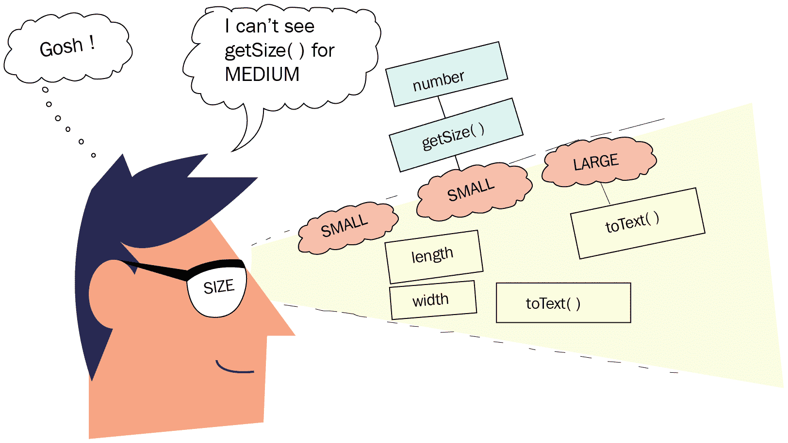

# 第十三章：Project Amber 中的增强枚举

枚举为有限和预定义的常量集添加了类型安全。枚举使您能够定义一个具有状态和行为的新的类型（例如类或接口）。**Project Amber**正在增强枚举，通过添加类型变量（泛型）和允许更精确的枚举类型检查，将它们提升到下一个层次。这将使枚举能够定义具有类型信息、状态和行为的常量——仅适用于每个常量。这些增强将减少将枚举重构为类以使用泛型的需求。

在本章中，我们将涵盖以下主题：

+   增强枚举的原因

+   为枚举常量添加状态和行为

+   创建泛型枚举

+   访问特定常量的状态和行为

+   对枚举常量执行更精确的类型检查

# 快速背景

**枚举**引入了类型安全到常量的使用中，这些常量之前是通过使用`static`和`final`变量（如`int`）定义的。

# 示例

想象一下将衬衫的尺寸限制为一些预定义的尺寸（如`Small`、`Medium`和`Large`）。以下代码展示了您如何使用枚举（`Size`）来实现这一点：

```java
enum Size {SMALL, MEDIUM, LARGE}
```

Java 的编码规范建议使用大写字母来定义枚举常量（如`SMALL`）。常量中的多个单词可以使用下划线分隔。

以下代码展示了您如何在一个类`Shirt`中使用`Size`枚举来限制其尺寸为`Size`枚举中定义的常量：

```java
class Shirt { 
    Size size;              // instance variable of type Size 
    Color color; 

    Shirt(Size size, Color color) {      // Size object with Shirt                                                                     
                                         // instantiation 
        this.size = size; 
        this.color = color; 
    } 
} 
```

在`Shirt`类中，`Size`类型的实例变量限制了分配给它的值只能是`Size.SMALL`、`Size.MEDIUM`和`Size.LARGE`。以下代码是另一个类`GarmentFactory`如何使用枚举常量创建`Shirt`类实例的示例：

```java
class GarmentFactory { 
    void createShirts() { 
        Shirt redShirtS = new Shirt(Size.SMALL, Color.red); 
        Shirt greenShirtM = new Shirt(Size.MEDIUM, Color.green); 
        Shirt redShirtL = new Shirt(Size.LARGE, Color.red); 
    } 
} 
```

枚举定义了具有预定义常量集的新类型。枚举为常量值添加了类型安全。

# 反编译枚举——幕后

每个用户定义的枚举隐式扩展了`java.lang.Enum`类。幕后，前面部分定义的单一行的`Size`枚举（枚举）被编译成类似以下的内容（我在代码中添加了注释以解释它；当您编译枚举时，您不会得到类似的注释）：

```java
final class Size extends Enum                 // 'enum' converted to final class  
{ 
    public static final Size SMALL;           // variables to store  
    public static final Size MEDIUM;          // enum constants 
    public static final Size LARGE;           //  

    private static final Size $VALUES[];    // array of all enum 
                                            // constants 

    static 
    {                                       // static initializer 
        SMALL = new Size("SMALL", 0);       // to initialize enum                                                                                             
                                            // constants 
        MEDIUM = new Size("MEDIUM", 1);     // 
        LARGE = new Size("LARGE", 2);       // 
        $VALUES = (new Size[] {             // 
            SMALL, MEDIUM, LARGE            // & populate array of enum                                             
                                            // constants 
        }); 
    } 
    public static Size[] values() 
    { 
                return (Size[])$VALUES.clone();       // Avoiding any                                                                                                          
                                                    // modification to  
    }                                // $VALUES by calling methods 
    public static Size valueOf(String s) 
    { 
        return (Size)Enum.valueOf(Size, s); 
    } 
    private Size(String s, int i) 
    { 
        super(s, i); 
    } 
} 
```

枚举是语法糖。编译器将您的枚举构造扩展为`java.lang.Enum`以创建一个类。它添加了变量、初始化器和获取所需行为的方法。

# 枚举常量的状态和行为

枚举常量可以有自己的状态和行为。您可以定义一个对所有枚举常量都通用的状态和行为，或者定义每个枚举常量特有的状态和行为。但是，您能访问特定于枚举常量的状态或行为吗？让我们来看看。

# 为枚举常量添加状态和行为

您可以通过在枚举中定义实例变量和方法来向枚举常量添加状态和行为。所有这些都可以通过枚举常量访问。让我们通过向之前定义的`Size`枚举添加状态和行为来修改它。每个枚举常量都可以定义一个常量特定的类体，定义新的状态和行为，或覆盖其定义的枚举方法的默认行为。以下是一个示例：

```java
enum Size { 
    SMALL(36, 19), 
    MEDIUM(32, 20) {               // Constant specific class body  
        int number = 10;                    // variable specific to 
                                            //MEDIUM 
        int getSize() {                     // method specific to 
                                            //MEDIUM 
            return length + width; 
        } 
    }, 
    LARGE(34, 22) { 
        @Override  
        public String toText() {            // overriding method toText 
                                            //for  
            return "LARGE";                 // constant LARGE 
        } 
    }; 

    int length;                             // instance variable 
                                            //accessible 
    int width;                              // to all enum constants 

    Size(int length, int width) {           // enum constructor; 
                                            //accepts length 
        this.length = length;               // and width 
        this.width = width; 
    } 

    int getLength() {                       // method accessible to all 
                                            //enum 
        return length;                      // constants 
    } 

    int getWidth() {                        // method accessible to all 
                                            //enum 
        return width;                       // constants 
    }  

    public String toText() {               // method accessible to all 
                                           //enum 
        return length + " X " + width;     // constants 
    } 
} 
```

在前面的示例中，`Size`枚举定义了三个枚举常量——`SMALL`、`MEDIUM`和`LARGE`。它还定义了实例变量（`length`和`breadth`）、构造函数以及`getLength()`、`getWidth`和`toText()`方法。

# 访问枚举常量的状态和行为

目前，枚举常量可以访问以下内容：

+   所有枚举常量共有的状态和行为

+   覆盖的方法

对于在上一节中定义的`Size`枚举，您可以访问所有枚举常量共有的状态和行为，如下所示：

```java
System.out.println(Size.SMALL.toText());  // toString is defined for all constants 
```

上述代码将产生以下输出：

```java
36 X 19 
```

您还可以按如下方式访问特定枚举常量覆盖的行为：

```java
System.out.println(Size.LARGE.toText()); 
```

上述代码将产生以下输出：

```java
LARGE
```

然而，您无法访问特定于枚举常量的状态或行为，如下面的代码所示：

```java
System.out.println(Size.MEDIUM.number);          // Doesn't compile 
System.out.println(Size.MEDIUM.getSize());       // Doesn't compile 
```

使用`MEDIUM`常量无法访问`getSize()`方法和`number`变量。这是因为`MEDIUM`创建了一个匿名类并覆盖了`Size`枚举的方法。它无法访问常量、特定状态或行为，因为它仍然由`Size`类型的变量引用。以下图应有助于您记住这一点：



现有的枚举不允许访问特定于枚举常量的状态或行为，因为这会创建一个匿名类来执行此操作。

# 访问枚举常量的解决方案

访问特定于枚举常量的成员（如变量和方法）的一种方法是为所有成员定义它们，但仅允许特定成员使用（我知道，这并不推荐）。我已经移除了与此无关的代码，以展示其工作原理，如下所示：

```java
enum Size {
    SMALL(36, 19),
    MEDIUM(32, 20),
    LARGE(34, 22);
    int length;                            // instance variable 
                                           //accessible
    int width;                             // to all enum constants
    Size(int length, int width) {          // enum constructor; accepts 
                                            //length
         this.length = length;             // and width
         this.width = width;
    }
    int getSize() {
       if (this == MEDIUM)
         return length + width;
       else                                           // throws runtime 
                                                      // exception
         throw new UnsupportedOperationException();   // if used with 
                                                      // constants
    }                                                 // other than 
                                                      //MEDIUM
}
```

让我们尝试使用枚举常量访问`getSize()`方法：

```java
System.out.println(MEDIUM.getSize());
System.out.println(LARGE.getSize());
```

上述代码的输出如下：

```java
52
Exception in thread—java.lang.UnsupportedOperationException
```

首先，添加不适用于所有枚举常量的代码（`getSize()`方法）会破坏封装。在前面的示例中，我在主体中定义了`getSize()`，而只有`MEDIUM`枚举常量需要`getSize()`方法。这既不理想也不推荐。

将其与基类及其派生类的排列进行比较，在基类中添加所有针对不同派生类的特定行为。然而，这并不推荐，因为它没有定义封装的代码。

# 使用枚举常量进行继承

以下是一个枚举的另一个示例，它通过将子类的实例传递给枚举构造函数与一组子类一起工作。为了说明问题，我已经修改了`Size`枚举，这是我们自本章开始以来一直在工作的枚举。以下是被修改的代码：

```java
class Measurement {}                      // base class 
class Small extends Measurement {         // derived class 
    String text = "Small";                // state specific to class 
                                          //Small 
} 
class Medium extends Measurement {        // derived class 
    public int getLength() {              // behavior specific to class 
                                          //Medium 
        return 9999; 
    } 
} 
class Large extends Measurement {}        // derived class 

enum Size {                                
    SMALL(new Small()),                // constant created using Small 
                                       //instance 
    MEDIUM(new Medium()),              // constant created using Medium 
                                       //instance 
    LARGE(new Large());                // constant created using Large 
                                       //instance 

    private Measurement mObj;     // Measurement is base class of  
                                  // classes Small, Medium & Large 

    Size(Measurement obj) {     // wraps Measurement instance as an 
                                //Enum instance 
        mObj = obj; 
    } 
    Measurement getMeasurement() { // get the wrapped instance 
        return mObj; 
    } 
}
```

再次强调，您无法访问特定于枚举常量的代码的状态和行为。以下是一个示例：

```java
class Test1 { 
    public static void main(String args[]) { 
        var large = Size.LARGE; 
        System.out.println(large.getMeasurement()
                             .getLength());      // doesn't compile 
                                                 // the type of the                                                     
                                                 // variable used 
                                                 // to wrap the value                                                  
                                                 // of enum  
                                                 // constant is                                                          
                                                 // Measurement  
    } 
} 
```

在这里，增强枚举发挥了作用。JEP 301 通过向其中添加类型变量或泛型来引入增强枚举。让我们在下一节看看它是如何工作的。

# 将泛型添加到枚举中

让我们重写上一例中的枚举代码，给枚举`Size`添加一个变量类型。有界类型参数（`<T extends Measurement>`）限制了可以传递给`Size`枚举的参数类型，仅限于`Measurement`类及其派生类。

本节修改了上一节中的代码。要理解示例代码及其目的，请阅读上一节（如果您还没有阅读的话）。

修改后的代码如下：

```java
enum Size <T extends Measurement> {      // enum with type parameter 
    SMALL(new Small()), 
    MEDIUM(new Medium()), 
    LARGE(new Large()); 

    private T mObj; 

    Size(T obj) { 
        mObj = obj; 
    } 
    T getMeasurement() { 
        return mObj; 
    } 
} 

class Measurement {} 
class Small extends Measurement { 
    String text = "Small"; 
} 
class Medium extends Measurement {} 
class Large extends Measurement { 
    public int getLength() { 
        return 40; 
    } 
}
```

以下代码可以用来访问特定于常量的行为，例如，`getLength()`方法，它只能被`LARGE`常量访问，如下所示：

```java
var large = Size.LARGE; 
System.out.println(large.getMeasurement().getLength());  
```

在增强枚举（添加了泛型）中，您将能够访问枚举常量的特定状态或行为。

让我们再来看一个泛型枚举的例子，它可以用来限制用户数据到某些类型。

以下示例创建了一个泛型枚举`Data`，它可以作为类型参数`T`传递：

```java
public enum Data<T> { 
    NAME<String>,                // constants of generic  
    AGE<Integer>,                // enum Data 
    ADDRESS<Address>; 
} 
```

`FormData`类定义了一个泛型方法，可以接受`Data`枚举的常量以及与枚举常量相同类型的值：

```java
public class FormData { 
    public <T> void add(Data<T> type, T value) { 
        //..code 
    } 
}
```

以下代码展示了如何使用`Data`枚举的常量来限制传递给`add`方法的值的类型组合：

```java
FormData data = new FormData(); 
data.add(Data.NAME, "Pavni");            // okay; type of NAME and 
                                         // Pavni is String 
data.add(Data.AGE, 22);                  // okay; type of AGE and 22 is 
                                         // Integer 
data.add(Data.ADDRESS, "California");    // Won't compile. "California"  
                                         // is String, not Address 
                                         // instance 
```

在不匹配的数据的情况下，代码在编译时失败，这使得开发者更容易纠正它。

编译错误总是比运行时异常要好。使用泛型枚举`Data`将使代码在编译时因传递给`add()`的值组合不匹配而失败。

# 枚举常量的更精确类型

增强枚举的两个主要目标之一是执行更精确的类型检查。目前，所有枚举常量的类型是它们定义的枚举。以我们的示例枚举`Size`为例，这本质上意味着所有枚举常量（`SMALL`、`MEDIUM`和`LARGE`）的类型是`Size`，这是不正确的（如下面的图所示）：


虽然枚举常量允许定义一个包含变量和方法的具体类体，但其常量类型不够精确，无法允许访问枚举常量特定的值。即使在泛型枚举的情况下，枚举常量的静态类型也不够精确，无法捕获个别常量的完整类型信息。

# 摘要

在本章中，你学习了 Java 5 中枚举如何引入类型安全到常量。我们介绍了每个枚举常量都可以拥有其独特的状态和行为，而不仅仅是所有枚举常量共有的内容。然而，使用现有的枚举无法访问特定于枚举常量的状态和行为。

接下来，我们讨论了增强型枚举如何使用泛型和访问特定的状态和行为。通过示例，我们还介绍了类型参数如何促进枚举常量的更精确类型化。

在下一章中，我们将介绍 Project Amber 中的数据类是如何带来语言变化以定义数据载体类的。
