# 第五章：使用 Java 9 构建模块化应用程序

在上一章中，我们讨论了 Java 9 中变量处理程序的变化以及它们与 AtoMiC 工具包的关系。我们还讨论了弃用警告以及为什么在特定情况下现在被抑制。作为*Project Coin*的一部分，对 Java 7 引入的变化的五个增强功能也得到了回顾。最后，我们探讨了导入语句处理的改进。

在本章中，我们将根据*Project Jigsaw*的规定来检查 Java 模块的结构。我们将深入探讨*Project Jigsaw*是如何作为 Java 平台的一部分来实现的。我们还将回顾与模块化系统相关的 Java 平台的关键内部变化。

我们在这里将要讨论的主题包括：

+   Java 模块化简介

+   Java 平台模块系统的回顾

+   模块化 JDK 源代码

+   模块化运行时镜像

+   了解模块化系统

+   模块化 Java 应用程序打包

+   Java 链接器

+   内部 API 的封装

# 模块化入门

在我们深入探讨本章中 Java 9 的增强功能之前，让我们先来了解一下在 Java 语境下什么是模块化。

我们可以将“模块化”这个术语定义为一种设计或构建类型，在我们的语境中，是指计算机软件。这种软件设计涉及一组模块，这些模块共同构成了整体。例如，一栋房子可以是作为一个单一结构建造，或者以模块化方式建造，其中每个房间都是独立建造并连接起来形成一个家。通过这个类比，你可以在建造你的家时选择性地添加或不添加模块。在我们的类比中，模块的集合就成为了你家的设计。你的设计不需要使用每个模块，只需要你想要的那些。所以，例如，如果有地下室和奖励室模块，而你的设计不包括这些模块化房间，那么这些模块就不会用来建造你的家。另一种选择是每个家都包括每个房间，而不仅仅是那些被使用的房间。这当然是浪费的。让我们看看这如何与软件相关联。

这个概念可以应用于计算机架构和软件系统。我们的系统可以由几个组件组成，而不是一个庞大的系统。正如你可能想象的那样，这为我们提供了一些特定的好处：

+   我们应该能够扩展我们的 Java 应用程序以在小型设备上运行

+   我们的 Java 应用程序将更小

+   我们的模块化代码可以更加有针对性

+   对面向对象编程模型的更多使用

+   增加的封装机会

+   我们的代码将更加高效

+   Java 应用程序的性能将提高

+   整体系统复杂性降低

+   测试和调试更加容易

+   代码维护更加容易

Java 转向模块化系统是出于几个原因。以下是 Java 9 平台创建模块化系统的 Java 平台的主要条件：

+   **Java 开发工具包**（**JDK**）太大，难以支持小型设备。即使在下一节中讨论的紧凑配置文件中，支持某些小型设备也困难重重，在某些情况下甚至不可能。

+   由于 JDK 过大，难以使用我们的 Java 应用程序实现真正优化的性能。在这种情况下，越小越好。

+   **Java 运行时环境**（**JRE**）太大，无法有效地测试和维护我们的 Java 应用程序。这导致耗时、低效的测试和维护操作。

+   **Java 归档**（**JAR**）文件也太大。这使得支持小型设备变得有困难。

+   由于 JDK 和 JRE 都是包罗万象的，因此安全性是一个很大的担忧。例如，内部 API，由于公共访问修饰符的性质，即使 Java 应用程序没有使用，仍然可用。

+   最后，我们的 Java 应用程序是不必要的庞大。

模块化系统有以下要求：

+   必须有一个公共接口，以允许所有连接的模块之间实现互操作性

+   必须支持隔离和连接测试

+   编译时操作必须能够识别正在使用的模块

+   模块运行时支持

模块是 Java 9 中的一个新概念和组件；它是一组命名的数据和代码集合。具体来说，模块是一组：

+   包

+   类

+   接口

+   代码

+   数据

+   资源

成功实施的关键在于，Java 9 中的模块在其模块声明中自我描述。模块名称必须是唯一的，通常使用反向域名模式。以下是一个示例声明：

```java
    module com.three19.irisScan { }
```

模块声明包含在一个`module-info.java`文件中，该文件应位于模块的根目录中。正如预期的那样，此文件被编译成一个`module-info.class`文件，并将放置在适当的输出目录中。这些输出目录是在模块源代码中建立的。

在下一节中，我们将查看 Java 9 在模块化方面的具体更改。

# 检查 Java 的平台模块系统 [JEP-200]

JEP-200 的核心目标是使用**Java 平台模块系统**（**JPMS**）对**Java 开发工具包**（**JDK**）进行模块化。在 Java 9 之前，我们对 JDK 的了解包括对其主要组件的认识：

+   Java 运行时环境（JRE）

+   解释器（java）

+   编译器（javac）

+   归档器（jar）

+   文档生成器（javadoc）

模块化 JDK 的任务是将它分解成可以在编译时或运行时组合的组件。模块结构基于以下模块配置文件，这些配置文件在 Java 8 中被作为紧凑配置文件建立。以下表格详细说明了这三个配置文件中的每一个：

**紧凑配置文件 1**：

| `java.io` | `java.lang.annotation` | `java.lang.invoke` |
| --- | --- | --- |
| `java.lang.ref` | `java.lang.reflect` | `java.math` |
| `java.net` | `java.nio` | `java.nio.channels` |
| `java.nio.channels.spi` | `java.nio.charset` | `java.nio.charset.spi` |
| `java.nio.file` | `java.nio.file.attribute` | `java.nio.file.spi` |
| `java.security` | `java.security.cert` | `java.security.interfaces` |
| `java.security.spec` | `java.text` | `java.text.spi` |
| `java.time` | `java.time.chrono` | `java.time.format` |
| `java.time.temporal` | `java.time.zone` | `java.util` |
| `java.util.concurrent` | `java.util.concurrent.atomic` | `java.util.concurrent.locks` |
| `java.util.function` | `java.util.jar` | `java.util.logging` |
| `java.util.regex` | `java.util.spi` | `java.util.stream` |
| `java.util.zip` | `javax.crypto` | `javax.crypto.interfaces` |
| `javax.crypto.spec` | `javax.net` | `javax.net.ssl` |
| `javax.script` | `javax.security.auth` | `javax.security.auth.callback` |
| `javax.security.auth.login` | `javax.security.auth.spi` | `javax.security.auth.spi` |
| `javax.security.auth.x500` | `javax.security.cert` |  |

**紧凑配置文件 2**:

| `java.rmi` | `java.rmi.activation` | `java.rmi.dgc` |
| --- | --- | --- |
| `java.rmi.registry` | `java.rmi.server` | `java.sql` |
| `javax.rmi.ssl` | `javax.sql` | `javax.transaction` |
| `javax.transaction.xa` | `javax.xml` | `javax.xml.database` |
| `javax.xml.namespace` | `javax.xml.parsers` | `javax.xml.stream` |
| `javax.xml.stream.events` | `javax.xml.stream.util` | `javax.xml.transform` |
| `javax.xml.transform.dom` | `javax.xml.transform.sax` | `javax.xml.transform.stax` |
| `javax.xml.transform.stream` | `javax.xml.validation` | `javax.xml.xpath` |
| `org.w3c.dom` | `org.w3c.dom.bootstrap` | `org.w3c.dom.events` |
| `org.w3c.dom.ls` | `org.xml.sax` | `org.xml.sax.ext` |
| `org.xml.sax.helpers` |  |  |

**紧凑配置文件 3**:

| `java.lang.instrument` | `java.lang.management` | `java.security.acl` |
| --- | --- | --- |
| `java.util.prefs` | `javax.annotation.processing` | `javax.lang.model` |
| `javax.lang.model.element` | `javax.lang.model.type` | `javax.lang.model.util` |
| `javax.management` | `javax.management.loading` | `javax.management.modelmbean` |
| `javax.management.monitor` | `javax.management.openmbean` | `javax.management.relation` |
| `javax.management.remote` | `javax.management.remote.rmi` | `javax.management.timer` |
| `javax.naming` | `javax.naming.directory` | `javax.naming.event` |
| `javax.naming.ldap` | `javax.naming.spi` | `javax.security.auth.kerberos` |
| `javax.security.sasl` | `javax.sql.rowset` | `javax.sql.rowset.serial` |
| `javax.sql.rowest.spi` | `javax.tools` | `javax.xml.crypto` |
| `javax.xml.crypto.dom` | `javax.xml.crypto.dsig` | `javax.xml.crypto.dsig.dom` |
| `javax.xml.crypto.dsig.keyinfo` | `javax.xml.crypto.dsig.spec` | `org.ieft.jgss` |

这三个紧凑模块配置文件代表了 Java 9 中标准化模块系统的基石。这种标准化的有效性依赖于以下六个原则：

+   所有由 JCP 管理的模块都必须以字符串`java.`开头。因此，如果一个空间实用工具模块正在开发中，它将有一个类似于`java.spatial.util`的名称。

**JCP** 指的是 **Java Community Process**。JCP 允许开发者为 Java 创建技术规范。您可以在官方 JCP 网站上了解更多关于 JCP 的信息并成为会员--[`www.jcp.org`](http://www.jcp.org)。

+   非 JCP 模块被视为 JDK 的一部分，并且它们的名称必须以字符串 `jdk.` 开头。

+   确保方法调用链正确工作。以下流程图可以最好地说明这一点：

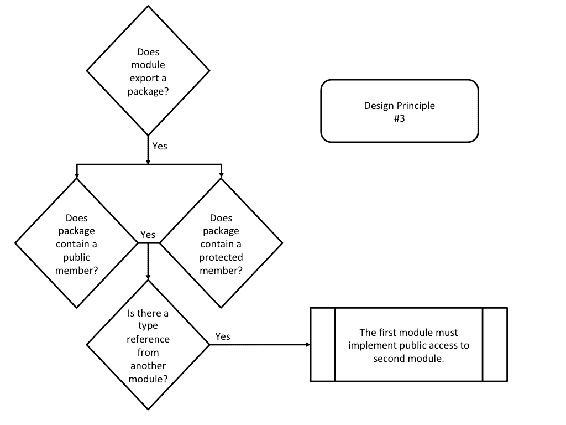

如前述流程图所示，它仅适用于导出包的模块。

+   第四个原则涉及在标准模块中使用标准和非标准 API 包。以下流程图说明了该原则的约定实施：

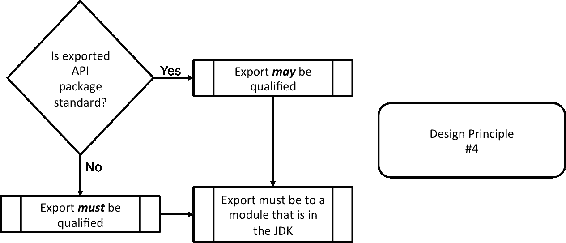

+   第五个设计原则是标准模块可以依赖于多个非标准模块。虽然这种依赖是被允许的，但对非标准模块的隐式可读性访问是不允许的。

+   最终的设计原则确保非标准模块不导出标准 API 包。

# 模块化 JDK 源代码 [JEP-201]

如前所述，Project Jigsaw 的目标是模块化。预期的标准模块化系统将应用于 Java SE 平台和 JDK。除了效率提升外，模块化转变还将带来更好的安全性和易于维护性。JEP-201 中详细说明的增强主要集中在 JDK 源代码重组上。让我们更详细地看看。

重组 JDK 的源代码是一项重大任务，并以下列子目标完成：

+   为 JDK 开发者提供对新的 Java 9 模块化系统的见解和熟悉度。因此，这个目标针对的是 JDK 开发者，而不是主流开发者。

+   确保在整个 JDK 构建过程中建立并维护模块边界。这是一项必要的预防措施，以确保模块化系统在 Java 9 的增强过程中以及更具体地说，在实现模块化系统时保持稳定。

+   第三个目标是确保未来的增强，特别是与 *Project Jigsaw* 相关的增强，可以轻松地集成到新的模块化系统中。

这次源代码重组的重要性不容小觑。Java 9 之前的源代码组织已有 20 年历史。这次久拖不决的 JDK 源代码重组将使代码的维护变得更加容易。让我们先看看 JDK 源代码的先前组织，然后再检查其中的变化。

# Java 9 之前 JDK 源代码组织

JDK 是代码文件、工具、库等代码的集合。以下插图提供了 JDK 组件的概述：

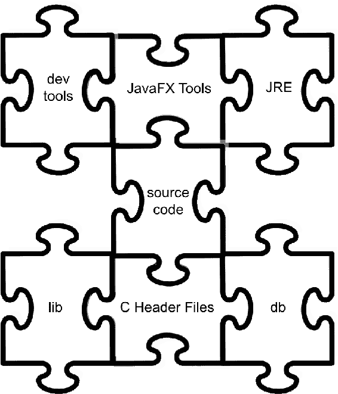

前述图示中 JDK 组件的 Java 9 之前组织将在接下来的七个子节中详细说明。

# 开发工具

开发工具位于`bin`目录中。这些工具包括七个广泛的分类，每个分类在后续章节中详细说明。

# 部署

这是一套旨在帮助部署 Java 应用程序的工具：

+   `appletviewer`：此工具允许您在没有网络浏览器的情况下运行和调试 Java 小程序。

+   `extcheck`：此工具允许您在 JAR 文件中找到冲突。

+   `jar`：此工具用于创建和操作 JAR 文件。JAR 文件是 Java 归档文件。

+   `java`：这是 Java 应用程序启动器。

+   `javac`：这是 Java 编译器。

+   `javadoc`：此工具生成 API 文档。

+   `javah`：此工具允许您编写本地方法；它生成 C 头文件。

+   `javap`：此工具用于反汇编类文件。

+   `javapackager`：用于签名和打包 Java 应用程序，包括 JavaFX。

+   `jdb`：这是 Java 调试器。

+   `jdeps`：这是一个用于分析 Java 类依赖关系的分析器。

+   `pack200`：这是一个将 JAR 文件压缩成`pack200`文件的工具。使用此工具的压缩率令人印象深刻。

+   `unpack200`：此工具解包`pack200`文件，生成 JAR 文件。

# 国际化

如果您对创建本地化应用程序感兴趣，以下工具可能很有用：

+   `native2ascii`：此工具将普通文本转换为 Unicode Latin-1。

# 监控

用于提供 JVM 性能数据的监控工具包括：

+   `jps`：这是**JVM 进程状态工具**（**jps**）。它提供特定系统上 HotSpot JVM 的列表。

+   `jstat`：这是 JVM 统计监控工具。它从具有 HotSpot JVM 的机器收集日志数据和性能信息。

+   `jstatd`：这是**jstat**守护进程工具。它运行一个 RMI 服务器应用程序以监控 HotSpot JVM 操作。

# RMI

**RMI**工具是**远程方法调用**工具。它们帮助开发者创建在网络（包括互联网）上运行的应用程序：

+   `rmic`：此工具可以为网络上的对象生成存根和骨架。

+   `rmiregistry`：这是一个远程对象的注册服务

+   `rmid`：此工具是 RMI 的激活系统守护进程。

+   `serialver`：此工具返回类的`serialVersionUID`值。

# 安全

这套安全工具使开发者能够创建可以在开发者的计算机系统以及远程系统上强制执行的安全策略：

+   `keytool`：此工具管理安全证书和密钥库

+   `jarsigner`：此工具用于生成和验证 JAR 签名，以创建/打开 JAR 文件

+   `policytool`：此工具具有图形用户界面，帮助开发者管理他们的安全策略文件

# 故障排除

这些实验性故障排除工具对于非常具体的故障排除很有用。它们是实验性的，因此不受官方支持：

+   `jinfo`：此工具为特定进程、文件或服务器提供配置信息。

+   `jhat`：这是一个堆转储工具。它实例化一个 Web 服务器，以便可以使用浏览器查看堆。

+   `jmap`：这个工具从进程、文件或服务器显示堆和共享对象内存映射。

+   `jsadebugd`：这是 Java 的服务性代理调试守护进程。它作为进程或文件的调试服务器。

+   `jstack`：这是一个 Java 堆栈跟踪工具，它为进程、文件或服务器提供线程堆栈跟踪。

# 互联网服务

这套工具提供了一组可以与**Java Web Start**和其他网络服务一起使用的实用工具：

+   `javaws`：这是一个命令行工具，用于启动 Java Web Start。

+   `schemagen`：这个工具用于生成 Java 架构的架构。这些架构用于 XML 绑定。

+   `wsgen`：这个工具用于生成可移植的 JAX-WS 组件。

+   `wsimport`：这个工具用于导入可移植的 JAX-WS 组件。

+   `xjc`：这是用于 XML 绑定的绑定编译器。

# JavaFX 工具

JavaFX 工具位于几个不同的位置，包括`bin`、`man`和`lib`目录。

# Java 运行时环境

**Java 运行时环境**（**JRE**）位于`jre`目录中。关键内容包括**Java 虚拟机**（**JVM**）和类库。

# 源代码

JDK 的源代码，在 Java 9 之前，具有以下基本组织结构：

```java
    source code / [shared, OS-specific] / [classes / native] / Java API
     package name / [.file extension]
```

让我们更详细地看看这个。在源代码之后，我们有两种选择。如果代码是跨平台的，那么它是一个共享目录；否则，它是特定于操作系统的。例如：

```java
    src/share/...
    src/windows/...
```

接下来，我们有类目录或本地语言目录。例如：

```java
    src/share/classes/...
    src/share/classes/java/...
```

接下来，我们有 Java API 包的名称，后面跟着文件扩展名。文件扩展名取决于内容，如`.java`、`.c`等。

# 库

`lib`目录包含了`bin`目录中一个或多个开发工具所需的类库。以下是一个典型的 Java 8 `lib`目录中的文件列表：

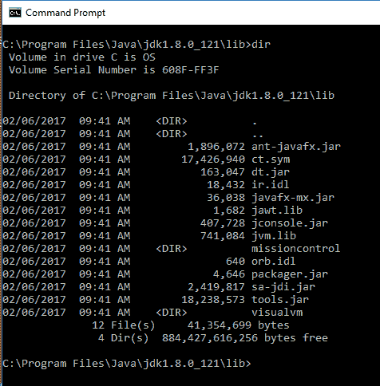

检查目录列表并不能提供很高的粒度洞察力。我们可以使用以下命令列出任何`.jar`文件中的类--`jar tvf fileName.jar`。以下是一个示例，展示了在命令行中执行`jar tvf javafx-mx.jar`时生成的类列表：

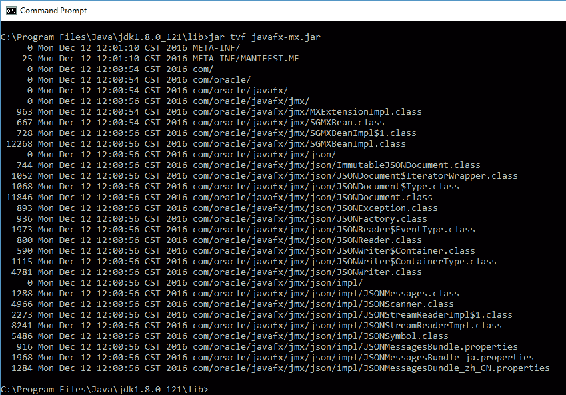

# C 头文件

`/include`目录包含 C 头文件。这些文件主要支持以下内容：

+   **Java 本地接口**（**JNI**）：这是用于本地代码编程支持的。JNI 用于将 Java 本地方法和 JVM 嵌入到本地应用程序中。

+   **JVM 工具接口**（**JVM TI**）：这是由工具用于对运行 JVM 的应用进行状态检查和执行控制的。

# 数据库

Apache Derby 关系数据库存储在`/db`目录中。您可以在以下网站了解更多关于 Java DB 的信息：

[`docs.oracle.com/javadb/support/overview.html`](http://docs.oracle.com/javadb/support/overview.html)

[`db.apache.org/derby/manuals/#docs_10.11`](http://db.apache.org/derby/manuals/#docs_10.11)

# JDK 源代码重新组织

在前面的章节中，你了解到 Java 9 之前的源代码组织架构如下：

```java
    source code / [shared, OS-specific] / [classes / native] / Java API 
     package name / [.file extension]
```

在 Java 9 中，我们有一个新的模块化架构。该架构如下：

```java
    source code / module / [shared, OS-specific] / [classes / native / 
    configuration] / [ package / include / library ] /
     [.file extension]
```

新架构中有一点不同，最值得注意的是模块名称。在共享或操作系统特定的目录之后，要么是类目录，要么是 C 或 C++源文件的本地目录，或者是一个配置目录。这种看似基本的组织架构的改变导致代码库的可维护性大大提高。

# 理解模块化运行时图像 [JEP-220]

Java 9 的模块化系统需要对运行时图像进行更改以实现兼容性。这些更改的好处包括以下领域的增强：

+   可维护性

+   性能

+   安全性

这些变化的核心是一个用于资源命名的新的 URI 架构。这些资源包括模块和类。

**统一资源标识符**（**URI**）与**统一资源定位符**（**URL**）类似，因为它标识了某物的名称和位置。对于 URL，那“某物”是一个网页；对于 URI，它是一个资源。

JEP-220 有五个主要目标，这些目标在以下章节中详细说明。

# 运行时格式采用

为 Java 9 创建了一种运行时格式，用于存储类和其他资源文件。此格式适用于以下情况下的存储类和其他资源：

+   当新的运行时格式比 Java 9 之前的 JAR 格式具有更高的效率（时间和空间）时。

**JAR**文件是一个**Java 归档**文件。这是一种基于传统 ZIP 格式的压缩文件格式。

+   当存储类和其他资源可以单独隔离和加载时。

+   当 JDK 和库类以及资源可以存储时。这包括应用程序模块。

+   当它们以促进未来增强的方式设计时。这要求它们是可扩展的、有文档的并且灵活的。

# 运行时图像重构

Java 中有两种运行时图像类型--JDK 和 JRE。随着 Java 9 的推出，这两种图像类型都被重构，以区分用户可以使用和修改的文件与开发者及其应用程序可以使用的但不能修改的内部文件。

JDK 构建系统在 Java 9 之前产生了一个 JRE 和一个 JDK。JRE 是 Java 平台的完整实现。JDK 包括 JRE 以及其他工具和库。Java 9 的一个显著变化是 JRE 子目录不再是 JDK 图像的一部分。这一变化部分是为了确保这两种图像类型（JDK 和 JRE）具有相同的图像结构。有了共同和重新组织过的结构，未来的更改将更加高效地集成。

如果你之前在 Java 9 之前创建了针对特定结构的自定义插件，那么你的应用程序可能在 Java 9 中无法工作。如果你明确地引用`tools.jar`，这也同样适用。

以下图表提供了 Java 9 发布之前每个图像内容的概览：

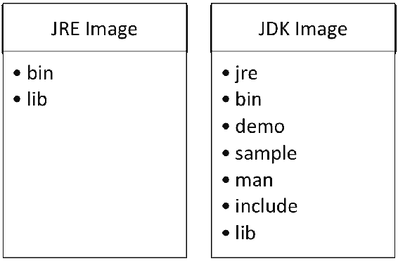

下图展示了 Java 9 运行时图像。如图所示，完整的 JDK 图像包含与模块化运行时图像相同的目录，以及 demo、sample、man 和 includes 目录：

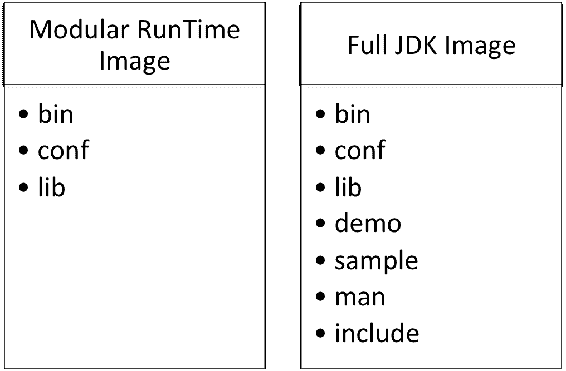

JRE 或 JDK 图像之间不再有区别。现在，使用 Java 9，JDK 图像是包含完整开发工具的 JRE 图像。

# 支持常见操作

开发者有时必须编写执行需要访问运行时图像的操作的代码。Java 9 包括对这些常见操作的支持。这是由于 JDK 和 JRE 运行时图像结构的重构和标准化而成为可能的。

# 撤销 JDK 类的权限

Java 9 允许撤销单个 JDK 类的权限。这一变化加强了系统安全性，因为它确保 JDK 类只接收系统操作所需的权限。

# 保留现有行为

JEP-220 的最终目标是确保现有类不受负面影响。这指的是没有依赖内部 JDK 或 JRE 运行时图像的应用程序。

# 了解模块系统 [JEP-261]

本 JEP 的目的是在 Java 平台上实现新的模块系统。您会记得，模块化系统是为了为 Java 程序提供可靠的配置和强大的封装而创建的。这一实现的关键是链接时间概念。如图所示，链接时间是编译时间和运行时间之间可选的阶段。这个阶段允许将适当的模块组装成优化的运行时图像。这在一定程度上是由于 jlink 链接工具，您将在本章后面了解更多关于它的信息：

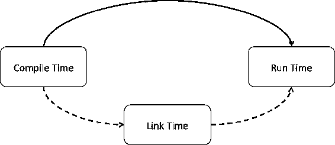

# 模块路径

组织模块以便它们可以轻松找到是很重要的。模块路径，即一系列模块组件或目录，提供了搜索使用的组织结构。这些路径组件按顺序搜索，返回第一个包含模块的路径组件。

模块及其路径不应被视为与包或类路径相同。它们确实是不同的，并且具有更高的精确度。关键区别在于，在类路径中，搜索的是单个组件。模块路径搜索返回完整的模块。这种类型的搜索可以通过以下路径进行，按照提供的顺序搜索，直到返回一个模块：

+   编译模块路径

+   升级模块路径

+   系统模块

+   应用程序模块路径

让我们简要回顾一下这些路径。编译模块路径仅在编译时适用，包含模块定义。升级模块路径包含编译后的模块定义。系统模块是内置的，包括 Java SE 和 JDK 模块。最后一个路径，应用程序模块路径，包含来自应用程序模块以及库模块的编译后的模块定义。

# 访问控制边界违规

作为一名专业开发者，你总是希望你的代码是安全的、可移植的，并且没有错误，这需要严格遵守 Java 构造，如封装。在某些情况下，例如白盒测试，你需要打破 JVM 规定的封装。这个规定允许跨模块访问。

为了允许打破封装，你可以在你的模块声明中添加一个`add-exports`选项。以下是你会使用的语法：

```java
    module com.three19.irisScan 
    {
      - - add-exports <source-module>/<package> = <target-module> 
      (, <target-module> )*
    }
```

让我们更仔细地看看前面的语法。《<source-module>》和`<target-module>`是模块名称，`<package>`是包的名称。使用`add-exports`选项允许我们违反访问控制边界。

关于使用`add-exports`选项有两个规则：

+   它可以在模块中使用多次

+   每次使用都必须是`<source-module>`和`<target-module>`的唯一配对

不建议除非绝对必要，否则使用`add-exports`选项。它的使用允许对库模块内部 API 的危险访问。这种使用使得你的代码依赖于内部 API 不会改变，而这超出了你的控制。

# 运行时

HotSpot 虚拟机实现了`jmod`和`jlink`命令行工具的`<options>`。以下是`jmod`命令行工具的`<options>`列表：

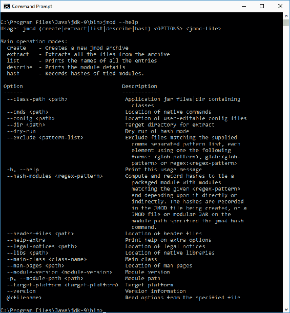

以下是`jlink`命令行工具的`<options>`列表：

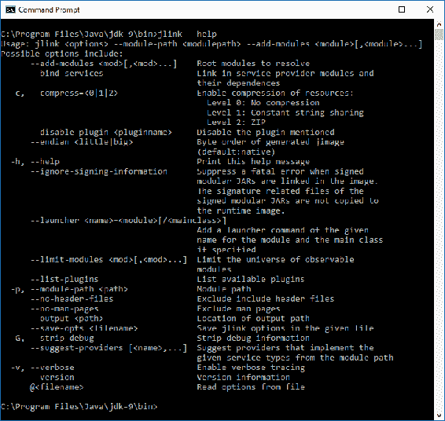

# 模块化 Java 应用程序打包 [JEP-275]

Java 9 的一个重大改进是**Java Packager**生成的运行时二进制文件的大小。这在一定程度上是由于**Java Linker**，它将在下一节中介绍。Java Packager 的工作流程在 Java 9 中基本上与 Java 8 相同。正如你将在本节后面看到的那样，工作流程中添加了新的工具。

Java Packager 仅创建 JDK 9 应用程序。这种对 Java Packager 的改变旨在简化并使生成运行时映像的过程更高效。因此，Java Packager 将只为它关联的 SDK 版本创建运行时映像。

# 高级查看 Java Linker

在 Java Linker 工具`jlink`在 Java 9 中引入之前，运行时图像的创建包括复制整个 JRE。然后，删除未使用的组件。简单来说，`jlink`简化了仅包含所需模块的运行时图像的创建。`jlink`被 Java Packager 用于生成嵌入式运行时图像。

# Java Packager 选项

Java Packager 的语法如下：

```java
 javapackager -command [-options]
```

有五种不同的命令（`-command`）可以使用。它们如下所述：

| **command** | **描述** |
| --- | --- |
| `-createbss` | 此命令用于将文件从 CSS 转换为二进制 |
| `-createjar` | 此命令，与附加参数一起使用，创建一个 JAR 归档文件 |
| `-deploy` | 此命令用于生成 jnlp 和 HTML 文件 |
| `-makeall` | 结合`-createjar`、`-deploy`和编译步骤 |
| `-signJar` | 此命令创建并签名一个 JAR 文件 |

`-createbss`命令的`[-options]`包括：

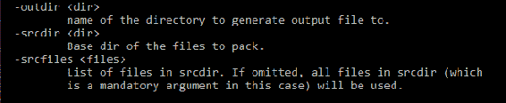

`-createjar`命令的`[-options]`包括：

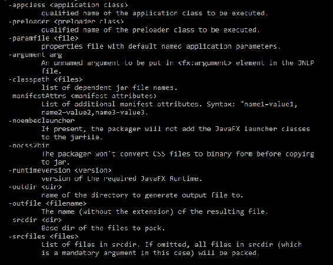

`-deploy`命令的`[-options]`包括：

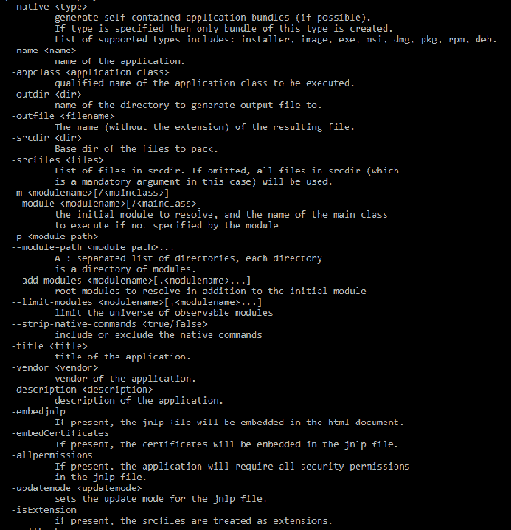

这里是`-deploy`命令剩余的`[-options]`：

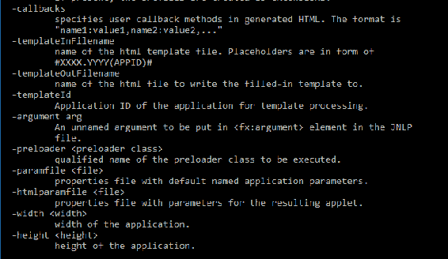

`-makeall`命令的`[-options]`包括：

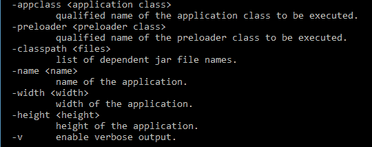

`-signJar`的`[-options]`包括：

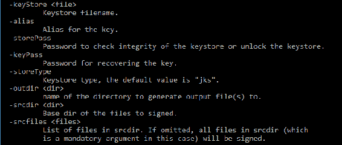

Java Packager 分为两个模块：

```java
    jdk.packager
    jdk.packager.services
```

# JLink - Java 链接 [JEP-282]

Java 链接器，通常称为 JLink，是一个创建自定义运行时图像的工具。此工具收集适当的模块及其依赖项，然后对它们进行优化以创建图像。这代表了 Java 的一个重大变化，随着 Java 9 的发布。在 Java Linker 工具`jlink`可用之前，运行时图像的创建最初包括复制整个 JRE。在后续步骤中，删除了未使用的组件。在 Java 9 中，`jlink`仅使用所需模块创建运行时图像。`jlink`被 Java Packager 用于生成嵌入式运行时图像。

如前文所述，JEP-282 导致链接时间成为编译时间和运行时间之间可选的阶段。在这个阶段，适当的模块被组装成一个优化的运行时图像。

JLink 是一个命令行链接工具，允许创建包含 JDK 模块较小子集的运行时图像。这导致运行时图像更小。以下语法包括四个组件--`jlink`命令、选项、模块路径和输出路径：

```java
$ jlink <options> ---module-path <modulepath> --output <path>
```

这里是`jlink`工具可以使用的选项列表，以及每个选项的简要描述：

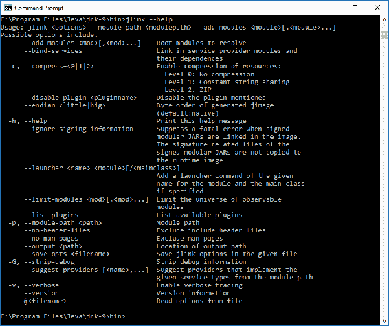

模块路径告诉链接器在哪里找到模块。链接器将不会使用展开的模块或 JAR/JMOD 文件。

输出路径简单地告知链接器在哪里保存自定义运行时镜像。

# 封装大多数内部 API [JEP-260]

JEP-260 被实现是为了使 Java 平台更加安全。这个 JEP 的核心目标是封装大多数内部 API。具体来说，JDK 的大多数内部 API 默认情况下不再可访问。目前，被认为是*关键*和*广泛使用*的内部 API 仍然可访问。在未来，我们可能会看到替代它们的功能，到那时，这些内部 API 将默认不可访问。

那么，为什么这个变化是必要的呢？有几个广泛使用的 API 是不稳定的，在某些情况下，还没有标准化。不受支持的 API 不应有权访问 JDK 的内部细节。因此，JEP-260 导致了 Java 平台安全性的提高。一般来说，你应在你的开发项目中避免使用不受支持的 API。

上述关键的 API（JDK 内部的）包括：

+   `sun.misc`

+   `sun.misc.Unsafe`

+   `sun.reflect.Reflection`

+   `sun.reflect.ReflectionFactory.newConstrutorForSerialization`

上述关键的内部 API 在 JDK 9 中仍然可访问。它们可以通过`jdk.unsupported` JDK 模块来访问。完整的 JRE 和 JDK 镜像将包含`jdk.unsupported`模块。

你可以使用 Java 依赖分析工具`jdeps`来帮助确定你的 Java 程序是否有任何对 JDK 内部 API 的依赖。

这是一个值得关注的有趣变化。很可能，当 Java 10 发布时，目前可访问的内部 API 将默认不可访问。

# 摘要

在本章中，我们检查了由*Project Jigsaw*指定的 Java 模块的结构，并深入研究了*Project Jigsaw*是如何实现以改进 Java 平台的。我们还回顾了与模块化系统相关的 Java 平台的关键内部更改。我们的回顾从模块入门开始，我们学习了 Java 9 的模块化系统在优势和需求方面的内容。

我们探讨了 Java 9 如何将模块化引入 JDK，包括其源代码和组织结构。我们还探讨了构成 JDK 的七个主要工具类别。正如我们所了解的，Java 9 的模块化也扩展到运行时镜像，从而提高了可维护性、性能和安全性。我们引入了**链接时间**的概念，作为编译时间和运行时间之间可选的阶段。我们在本章的结尾回顾了 Java 链接器和 Java 9 如何封装内部 API。

在下一章中，我们将探讨如何将我们的现有应用程序迁移到 Java 9 平台。我们将查看手动和半自动迁移过程。
