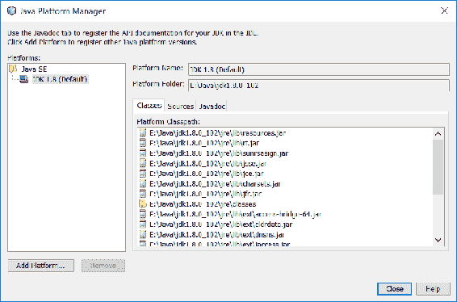
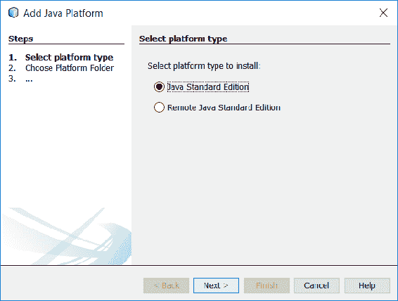
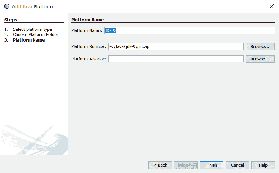
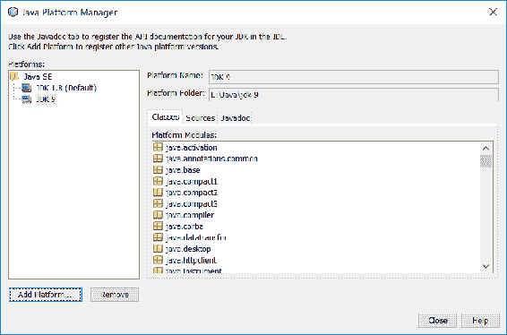

# 第十九章：简介

在建造一座新建筑的过程中，一套蓝图帮助所有相关方进行沟通——建筑师、电工、木匠、水管工等等。它详细说明了形状、尺寸和材料等内容。没有它们，每个分包商都会被留下猜测要做什么，在哪里做，以及如何做。没有这些蓝图，现代建筑几乎是不可能的。

你手中的——或者在你面前的屏幕上——是一套不同类型的蓝图。这些蓝图并不是详细说明如何构建你的特定软件系统，因为每个项目和环境都有独特的约束和要求，这些蓝图提供了如何构建各种基于 Java 的系统的示例，提供了如何使用 **Java 开发工具包**（**JDK**）中特定特性的示例，特别关注你可以应用于特定问题的 Java 9 的新特性。

由于仅使用新的 Java 9 特性构建应用程序是不可能的，因此我们还将使用并突出显示 JDK 中许多最新的特性。在我们深入探讨这涉及的内容之前，让我们简要地讨论一下最近主要 JDK 发布的一些这些出色的新特性。希望大多数 Java 商店已经使用 Java 7，因此我们将重点关注版本 8，当然还有版本 9。

在本章中，我们将涵盖以下主题：

+   Java 8 的新特性

+   Java 9 的新特性

+   项目

# Java 8 的新特性

Java 8，于 2014 年 3 月 8 日发布，可能是自 2004 年发布的 Java 5 以来最具争议的两个特性——lambda 和 streams。随着函数式编程在 JVM 世界中的流行，尤其是在 Scala 等语言的帮助下，Java 的拥护者已经呼吁了几年更多的函数式语言特性。最初计划在 Java 7 中发布，该特性被从那个版本中删除，最终在 Java 8 中稳定发布。

虽然可以希望每个人都熟悉 Java 的 lambda 支持，但经验表明，由于各种原因，许多公司对新的语言版本和特性的采用速度较慢，因此一个快速的介绍可能是有帮助的。

# Lambda

术语 lambda，其根源在于由 Alonzo Church 在 1936 年开发的 lambda 演算，简单地说是指一个匿名函数。通常，一个函数（或方法，在更正式的 Java 术语中），是 Java 源代码中的一个静态命名的工件：

```java
    public int add(int x, int y) { 
      return x + y; 
    } 
```

这种简单的方法被命名为 `add`，它接受两个 `int` 参数并返回一个 `int` 参数。随着 lambda 的引入，现在可以这样编写：

```java
    (int x, int y) → x + y 
```

或者，更简单地说，如下所示：

```java
    (x, y) → x + y 
```

这种缩写语法表示我们有一个接受两个参数并返回它们和的函数。根据 lambda 的使用位置，编译器可以推断出参数的类型，这使得第二个，甚至更简洁的格式成为可能。最重要的是，注意这个方法不再有名字。除非它被分配给变量或作为参数传递（稍后会更详细地讨论这一点），否则它不能在任何系统中的任何地方被引用或使用。

当然，这个例子过于简单。更好的例子可能出现在许多 API 中，其中方法的参数是实现所谓的 **单抽象方法（SAM**）接口的实现，至少在 Java 8 之前，这是一个只有一个方法的接口。`Runnable` 是 SAM 的一个典型例子。以下是一个 pre-lambda `Runnable` 使用的例子：

```java
    Runnable r = new Runnable() { 
      public void run() { 
        System.out.println("Do some work"); 
      } 
    }; 
    Thread t = new Thread(r); 
    t.start(); 
```

使用 Java 8 的 lambda，这段代码可以大大简化为以下形式：

```java
    Thread t = new Thread(() ->
      System.out.println("Do some work")); 
    t.start(); 
```

`Runnable` 方法的体仍然相当简单，但清晰度和简洁度的提升应该是相当明显的。

虽然 lambda 是匿名函数（也就是说，它们没有名字），但 Java 的 lambda，就像许多其他语言一样，也可以分配给变量并作为参数传递（实际上，如果没有这种功能，功能几乎毫无价值）。回顾前面代码中的 `Runnable` 方法，我们可以将 `Runnable` 的声明和使用分开，如下所示：

```java
    Runnable r = () { 
      // Acquire database connection 
      // Do something really expensive 
    }; 
    Thread t = new Thread(r); 
    t.start(); 
```

这比前面的例子更冗长。`Runnable` 方法的占位符体旨在模仿现实世界中的 `Runnable` 可能的样子，以及为什么尽管 lambda 提供了简洁性，人们可能仍然希望将新定义的 `Runnable` 方法分配给变量。这种新的 lambda 语法允许我们声明 `Runnable` 方法的体，而无需担心方法名、签名等。诚然，任何不错的 IDE 都会帮助处理这种样板代码，但这种新的语法为您和将维护您的代码的无穷无尽的开发者提供了更少的噪音，以便在调试代码时解析。

任何 SAM 接口都可以写成 lambda。您有一个只需要使用一次的比较器吗？

```java
    List<Student> students = getStudents(); 
    students.sort((one, two) -> one.getGrade() - two.getGrade()); 
```

那么 `ActionListener` 呢？

```java
    saveButton.setOnAction((event) -> saveAndClose()); 
```

此外，您可以在 lambda 中使用自己的 SAM 接口，如下所示：

```java
    public <T> interface Validator<T> { 
      boolean isValid(T value); 
    } 
    cardProcessor.setValidator((card) 
    card.getNumber().startsWith("1234")); 
```

这种方法的优点不仅使消费代码更加简洁，而且也减少了创建这些具体 SAM 实例的努力。也就是说，开发者不必在匿名类和具体命名类之间做出选择，而可以声明它，干净且简洁。

除了 Java 开发者多年来一直在使用的 SAMs（单抽象方法接口）之外，Java 8 引入了许多功能接口，以帮助促进更函数式风格的编程。Java 8 的 Javadoc 列出了 43 个不同的接口。在这些接口中，有一些基本的函数**形状**你应该了解，其中一些如下：

| `BiConsumer<T,U>` | 这表示一个接受两个输入参数且不返回结果的操作 |
| --- | --- |
| `BiFunction<T,U,R>` | 这表示一个接受两个参数并产生结果的函数 |
| `BinaryOperator<T>` | 这表示对两个相同类型的操作数进行操作，产生与操作数相同类型的结果 |
| `BiPredicate<T,U>` | 这表示一个接受两个参数的谓词（布尔值函数） |
| `Consumer<T>` | 这表示一个接受单个输入参数且不返回结果的操作 |
| `Function<T,R>` | 这表示一个接受一个参数并产生结果的函数 |
| `Predicate<T>` | 这表示一个接受一个参数的谓词（布尔值函数） |
| `Supplier<T>` | 这表示一个结果提供者 |

这些接口有无数的使用场景，但也许最好的方式是将注意力转向 Java 8 的下一个重要特性——Streams。

# 流

Java 8 的另一个主要新增功能，也许是最能体现 lambda 表达式优势的地方，就是新的**Streams API**。如果你要搜索 Java 流的定义，你会得到从“数据元素流”这样的相对循环定义到“Java 流是 monads”这样的更技术性的定义，两者可能都是正确的。Streams API 允许 Java 开发者通过一系列步骤与数据元素流进行交互。即使这样描述也不是非常清晰，所以让我们通过查看一些示例代码来了解它的含义。

假设你有一个特定班级的分数列表。你可能想知道班级中女生的平均分数。在 Java 8 之前，你可能写成这样：

```java
    double sum = 0.0; 
    int count = 0; 
    for (Map.Entry<Student, Integer> g : grades.entrySet()) { 
      if ("F".equals(g.getKey().getGender())) { 
        count++; 
        sum += g.getValue(); 
      } 
    } 
    double avg = sum / count; 
```

我们初始化两个变量，一个用于存储总和，一个用于计数。然后我们遍历分数。如果学生的性别是女性，我们增加计数器并更新总和。当循环结束时，我们就有了计算平均分所需的信息。这可以工作，但有点冗长。新的 Streams API 可以帮助解决这个问题：

```java
    double avg = grades.entrySet().stream() 
     .filter(e -> "F".equals(e.getKey().getGender())) // 1 
     .mapToInt(e -> e.getValue()) // 2 
     .average() // 3 
     .getAsDouble(); //4 
```

这个新版本并没有显著减小，但代码的目的更加清晰。在之前的非流代码中，我们必须像计算机一样解析代码，并推断其预期目的。使用流，我们有清晰、声明性的方式来表达应用逻辑。对于映射中的每个条目执行以下操作：

1.  过滤掉所有`gender`不是`F`的条目。

1.  将每个值映射到原始的 int 类型。

1.  计算平均分数。

1.  将值作为 double 类型返回。

使用基于流和 lambda 的方法，我们不需要声明临时、中间变量（成绩计数和总分），也不需要担心计算平均数。JDK 为我们做了所有的繁重工作。

# 新的 java.time 包

虽然 lambda 表达式和流式处理是极其重要的变革性更新，但在 Java 8 中，我们还得到了另一个长期期待的改变，至少在某些圈子中，它同样令人兴奋：一个新的日期/时间 API。任何在 Java 中处理日期和时间的开发者都知道`java.util.Calendar`及其公司的痛苦。显然，你可以完成你的工作，但并不总是那么美观。许多开发者发现 API 的使用过于痛苦，因此他们将其集成到他们的项目中。Java 架构师也同意这一点，并聘请了 Joda Time 的作者 Stephen Colebourne 领导 JSR 310，将 Joda Time（修复各种设计缺陷）的一个版本带到了平台上。我们将在本书的后面部分详细探讨如何使用这些新的 API。

# 默认方法

在我们将注意力转向 Java 9 之前，让我们先看看另一个重要的语言特性：默认方法。自从 Java 开始以来，接口被用来定义类的外观，暗示了一种特定的行为，但无法实现这种行为。这使得在许多情况下多态性变得更加简单，因为任何数量的类都可以实现给定的接口，并且消费代码将它们视为该接口，而不是它们实际是的具体类。

然而，多年来 API 开发者面临的一个问题是如何在不破坏现有代码的情况下演进 API 及其接口。例如，以 JavaServer Faces 1.1 规范中的`ActionSource`接口为例。当 JSF 1.2 专家小组在制定规范的下一个版本时，他们确定需要向接口添加一个新属性，这将导致两个新方法——获取器和设置器。他们不能简单地添加方法到接口中，因为这会破坏规范的所有实现，需要实现者更新他们的类。显然，这种破坏是不可接受的，因此 JSF 1.2 引入了`ActionSource2`，它扩展了`ActionSource`并添加了新方法。虽然这种方法被许多人认为很丑陋，但 1.2 专家小组有几个选择，而且没有一个选择是很好的。

然而，随着 Java 8 的到来，接口现在可以在接口定义上指定默认方法，如果扩展类没有提供该方法，编译器将使用该方法实现。以下代码片段可以作为例子：

```java
    public interface Speaker { 
      void saySomething(String message); 
    } 
    public class SpeakerImpl implements Speaker { 
      public void saySomething(String message) { 
        System.out.println(message); 
      } 
    } 
```

我们已经开发了自己的 API 并将其公开，并且它证明非常受欢迎。然而，随着时间的推移，我们发现了一个我们想要改进的地方：我们希望添加一些便利方法，例如`sayHello()`和`sayGoodbye()`，以节省我们的用户一些时间。然而，正如之前讨论的那样，如果我们只是将这些新方法添加到接口中，一旦用户更新到库的新版本，就会破坏他们的代码。默认方法允许我们扩展接口，并通过定义一个实现来避免破坏：

```java
    public interface Speaker { 
      void saySomething(String message); 
      default public void sayHello() { 
        System.out.println("Hello"); 
      } 
      default public void sayGoodbye() { 
        System.out.println("Good bye"); 
      } 
    } 
```

现在，当用户更新他们的库 JAR 文件时，他们立即获得这些新方法和它们的行为，而无需做出任何更改。当然，要使用这些方法，用户将需要修改他们的代码，但他们不需要这样做，直到——如果——他们想要这样做。

# Java 9 的新特性

就像任何新的 JDK 版本一样，这个版本包含了大量令人兴奋的新特性。当然，最吸引人的特性将根据您的需求而有所不同，但我们将特别关注一些与我们共同构建的项目最相关的几个新特性。首先是最大的一个，Java 模块系统。

# Java 平台模块系统/Project Jigsaw

尽管 Java 8 是一个功能齐全的版本，但许多人认为它有些令人失望。它缺乏备受期待的**Java 平台模块系统**（**JPMS**），虽然更通俗地被称为 Project Jigsaw，但并不完全准确。Java 平台模块系统最初计划于 2011 年与 Java 7 一起发布，但由于一些悬而未决的技术问题而被推迟到 Java 8。Project Jigsaw 不仅是为了完成模块系统，还为了模块化 JDK 本身，这将有助于 Java SE 缩小到更小的设备，如移动电话和嵌入式系统。Jigsaw 计划与 2014 年发布的 Java 8 一起发布，但它再次被推迟，因为 Java 架构师认为他们还需要更多时间来正确实施该系统。然而，最终，Java 9 将最终交付这个长期承诺的项目。

话虽如此，这究竟是什么呢？长期以来一直困扰着 API 开发者，包括 JDK 架构师的一个问题是无法隐藏公共 API 的实现细节。一个来自 JDK 的例子是开发者不应直接使用的私有类，例如`com.sun.*/sun.*`包和类。一个完美的例子——私有 API 被广泛用于公共领域——是`sun.misc.Unsafe`类。除了在 Javadoc 中有一个措辞强烈的警告，不要使用这些内部类之外，几乎没有其他方法可以阻止它们的使用。直到现在。

使用 JPMS，开发者将能够使实现类公开，以便它们可以在项目中轻松使用，但又不暴露给模块外部，这意味着它们不会暴露给 API 或库的消费者。为此，Java 架构师引入了一个新的文件，`module-info.java`，类似于现有的`package-info.java`文件，位于模块的根目录中，例如，在`src/main/java/module-info.java`。它被编译成`module-info.class`，并在运行时通过反射和新的`java.lang.Module`类可用。

那么这个文件的作用是什么，它的样子又是什么样的呢？Java 开发者可以使用这个文件来命名模块，列出其依赖项，并向系统表达，无论是编译时还是运行时，哪些包被导出到外部世界。例如，假设在我们前面的流示例中，我们有三个包：`model`、`api`和`impl`。我们希望暴露模型和 API 类，但不暴露任何实现类。我们的`module-info.java`文件可能看起来像这样：

```java
    module com.packt.j9blueprints.intro { 
      requires com.foo; 
      exports com.packt.j9blueprints.intro.model; 
      exports com.packt.j9blueprints.intro.api; 
    } 
```

这个定义暴露了我们想要导出的两个包，并且也声明了对`com.foo`模块的依赖。如果在编译时该模块不可用，项目将无法构建；如果在运行时不可用，系统将抛出异常并退出。请注意，`requires`语句没有指定版本。这是故意的，因为决定不将版本选择问题作为模块系统的一部分来处理，而是将其留给更合适的系统，例如构建工具和容器。

当然，关于模块系统还可以说很多，但对其所有功能和局限性的详尽讨论超出了本书的范围。不过，我们将以模块的形式实现我们的应用程序，因此我们将在整本书中看到系统的使用——也许会有更详细的解释。

想要更深入讨论 Java 平台模块系统的读者可以搜索马克·雷诺尔德的文章《模块系统现状》。

# 进程处理 API

在 Java 的早期版本中，与本地操作系统进程交互的开发者必须使用一个相当有限的 API，一些操作需要回退到本地代码。作为**Java 增强提案**（**JEP**）102 的一部分，Java 进程 API 被扩展了以下功能（引用自 JEP 文本）：

+   获取当前 Java 虚拟机 pid 以及使用现有 API 创建的进程 pid 的能力。

+   列举系统上进程的能力。每个进程的信息可能包括其 pid、名称、状态以及可能的使用资源。

+   处理进程树的能力；特别是，一些销毁进程树的方法。

+   处理数百个子进程的能力，可能通过复用输出或错误流来避免为每个子进程创建一个线程。

我们将在我们的第一个项目中探索这些 API 更改，即进程查看器/管理器（有关详细信息，请参阅以下章节）。

# 并发更改

正如 Java 7 所做的那样，Java 架构师重新审视了并发库，进行了一些必要的更改，这次是为了支持 reactive-streams 规范。这些更改包括一个新类`java.util.concurrent.Flow`，它包含几个嵌套接口：`Flow.Processor`、`Flow.Publisher`、`Flow.Subscriber`和`Flow.Subscription`。

# REPL

似乎有很多令人兴奋的变化并不是语言上的变化。而是添加了一个**REPL**（**读取-评估-打印-循环**），这是一个语言壳的高级术语。实际上，这个新工具的命令是`jshell`。这个工具允许我们输入或粘贴 Java 代码并立即获得反馈。例如，如果我们想实验前面章节中讨论的 Streams API，我们可以这样做：

```java
$ jshell 
|  Welcome to JShell -- Version 9-ea 
|  For an introduction type: /help intro 

jshell> List<String> names = Arrays.asList(new String[]{"Tom", "Bill", "Xavier", "Sarah", "Adam"}); 
names ==> [Tom, Bill, Xavier, Sarah, Adam] 

jshell> names.stream().sorted().forEach(System.out::println); 
Adam 
Bill 
Sarah 
Tom 
Xavier 
```

这是一个非常受欢迎的添加，应该有助于 Java 开发者快速原型设计和测试他们的想法。

# 项目

在简要而高层次地概述了可用的新功能之后，我们将要覆盖的这些蓝图看起来是什么样子？我们将构建十个不同类型的应用程序，这些应用程序在复杂性和种类上有所不同，并涵盖广泛的问题。在每个项目中，我们将特别关注我们强调的新功能，但也会看到一些较旧的、经过验证的语言特性和库被广泛使用，任何有趣或新颖的使用都会被标记出来。因此，以下是我们的项目阵容。

# 进程查看器/管理器

在实现古老的 Unix 工具——**top**的 Java 版本时，我们将探索一些进程处理 API 的改进。结合这个 API 和 JavaFX，我们将构建一个图形工具，允许用户查看和管理系统上运行的过程。

本项目将涵盖以下内容：

+   Java 9 进程 API 增强

+   JavaFX

# 重复文件查找器

随着系统老化，文件系统中的杂乱无章，尤其是重复文件的可能性似乎呈指数增长。利用一些新的文件 I/O 库，我们将构建一个工具来扫描一组用户指定的目录以识别重复文件。将 JavaFX 重新放回工具箱中，我们将添加一个图形用户界面，它将提供更用户友好的方式来交互式地处理重复文件。

本项目将涵盖以下内容：

+   Java 文件 I/O

+   哈希库

+   JavaFX

# 日期计算器

随着 Java 8 的发布，Oracle 将基于对 Joda Time 的重设计，或多或少地集成到一个新的库中，即 JDK。官方称为 JSR 310，这个新库解决了 JDK 长期存在的问题——官方日期库不足且难以使用。在本项目中，我们将构建一个简单的命令行日期计算器，它将接受一个日期，例如，并添加任意数量的时间。以下是一段示例代码：

```java
$ datecalc "2016-07-04 + 2 weeks" 
2016-07-18 
$ datecalc "2016-07-04 + 35 days" 
2016-08-08 
$ datecalc "12:00CST to PST" 
10:00PST 
```

本项目将涵盖以下内容：

+   Java 8 日期/时间 API

+   正则表达式

+   Java 命令行库

# 社交媒体聚合器

在这么多社交媒体网络上拥有账户的一个问题是跟踪每个平台上发生的事情。拥有 Twitter、Facebook、Google+、Instagram 等账户的活跃用户可能会花费大量时间在不同的网站或应用程序之间跳转，阅读最新的更新。在本章中，我们将构建一个简单的聚合器应用程序，它将从用户的每个社交媒体账户中提取最新的更新，并在一个地方显示它们。功能将包括以下内容：

+   多个社交媒体网络的账户：

    +   Twitter

    +   Pinterest

    +   Instagram

+   只读的社交媒体帖子丰富列表

+   链接到适当的网站或应用程序，以便快速轻松地跟进

+   桌面和移动版本

本项目将涵盖以下内容：

+   REST/HTTP 客户端

+   JSON 处理

+   JavaFX 和 Android 开发

鉴于这项工作的规模和范围，我们将实际上分两章来完成：第一章是 JavaFX，第二章是 Android。

# 邮件过滤器

管理电子邮件可能很棘手，尤其是如果你有多个账户。如果你从多个位置（即从多个桌面或移动应用程序）访问你的邮件，管理你的邮件规则可能会更加棘手。如果你的邮件系统不支持存储在服务器上的规则，你将决定将规则放在哪里，以便它们最常运行。通过这个项目，我们将开发一个应用程序，允许我们编写各种规则，并通过可选的后台进程运行它们，以始终保持你的邮件得到适当的整理。

一个示例`rules`文件可能看起来像这样：

```java
    [ 
      { 
        "serverName": "mail.server.com", 
        "serverPort": "993", 
        "useSsl": true, 
        "userName": "me@example.com", 
        "password": "password", 
        "rules": [ 
           {"type": "move", 
               "sourceFolder": "Inbox", 
               "destFolder": "Folder1", 
               "matchingText": "someone@example.com"}, 
            {"type": "delete", 
               "sourceFolder": "Ads", 
               "olderThan": 180} 
         ] 
      } 
    ] 
```

本项目将涵盖以下内容：

+   JavaMail

+   JavaFX

+   JSON 处理

+   操作系统集成

+   文件输入/输出

# JavaFX 照片管理

Java 开发工具包提供了一套非常强大的图像处理 API。在 Java 9 中，这些 API 通过改进对 TIFF 规范的支持得到了增强。在本章中，我们将通过创建图像/照片管理应用程序来练习这个 API。我们将添加从用户指定的位置导入图像到配置的官方目录的支持。我们还将回顾重复文件查找器，并重用项目开发中的一些代码，以帮助我们识别重复的图像。

本项目将涵盖以下内容：

+   新的`javax.imageio`包

+   JavaFX

+   NetBeans 富客户端平台

+   Java 文件输入/输出

# 客户端/服务器笔记应用程序

你是否曾经使用过基于云的笔记应用？你是否想过要创建自己的应用？在本章中，我们将创建这样一个应用，包括完整的前端和后端。在服务器端，我们将数据存储在广受欢迎的文档数据库 MongoDB 中，并通过 REST 接口公开应用程序的业务逻辑的适当部分。在客户端，我们将使用 JavaScript 开发一个非常基本的用户界面，这将使我们能够实验并展示如何在 Java 项目中使用 JavaScript。

本项目将涵盖以下内容：

+   文档数据库（MongoDB）

+   JAX-RS 和 RESTful 接口

+   JavaFX

+   JavaScript 和 Vue 2

# 无服务器 Java

无服务器，也称为**函数即服务**（**FaaS**），是目前最热门的趋势之一。它是一种应用/部署模型，其中一个小型函数被部署到一个管理函数几乎所有方面的服务中——启动、关闭、内存等，从而让开发者从担心这些细节中解脱出来。在本章中，我们将编写一个简单的无服务器 Java 应用程序，看看它是如何完成的，以及你如何可能在自己的应用程序中使用这项新技术。

本项目将涵盖以下内容：

+   创建亚马逊网络服务账户

+   配置 AWS Lambda、简单通知服务、简单电子邮件服务和 DynamoDB

+   编写和部署 Java 函数

# 安卓桌面同步客户端

通过这个项目，我们将稍微改变一下方向，专注于 Java 生态系统的一个不同部分：安卓。为此，我们将关注一些安卓用户仍然面临的问题——安卓设备和桌面（或笔记本电脑）系统的同步。虽然各种云服务提供商都在推动我们将越来越多的内容存储在云端并流式传输到设备上，但有些人仍然出于各种原因（从云资源的成本到不可靠的无线连接和隐私问题）更愿意直接在设备上存储照片和音乐。

在本章中，我们将构建一个系统，允许用户在他们的设备和桌面或笔记本电脑之间同步音乐和照片。我们将构建一个安卓应用程序，为用户提供从移动设备端配置和监控同步的用户界面，以及一个安卓服务，如果需要，将在后台执行同步。我们还将构建桌面上的相关组件——一个图形应用程序，用于从桌面配置和监控过程，以及一个后台进程，用于处理桌面端的同步。

本项目将涵盖以下内容：

+   安卓

+   用户界面

+   服务

+   JavaFX

+   REST

# 入门

我们快速浏览了一些我们将使用的新语言特性。我们还快速概述了我们将要构建的项目。最后还有一个问题：我们将使用什么工具来完成我们的工作？

当涉及到开发工具时，Java 生态系统拥有丰富的资源，因此我们有大量的选择。我们面临的最基本的选择是构建工具。在我们的工作中，我们将使用 Maven。虽然有一个强大而积极的社区会提倡 Gradle，但 Maven 似乎是目前最常用的构建工具，并且似乎从主要的 IDE 中获得了更稳健、成熟和本地的支持。如果您还没有安装 Maven，您可以通过访问 [`maven.apache.org`](http://maven.apache.org/) 下载适用于您操作系统的发行版，或者使用您的操作系统支持的任何包管理系统。

对于 IDE，所有截图、说明等都将使用 NetBeans——来自 Oracle 的免费开源 IDE。当然，IntelliJ IDEA 和 Eclipse 都有支持者，它们都是不错的选择，但 NetBeans 提供了开箱即用的完整和强大的开发环境，并且速度快、稳定、免费。要下载 NetBeans，请访问 [`netbeans.org`](http://netbeans.org/) 并下载适用于您操作系统的相应安装程序。由于我们使用 Maven，而 Maven 同时也支持 IDEA 和 Eclipse，因此您应该能够在您选择的任何 IDE 中打开这里展示的项目。尽管在 GUI 中显示了步骤，但您仍需要根据您选择的 IDE 进行调整。

在撰写本文时，NetBeans 的最新版本是 8.2，使用它进行 Java 9 开发的最佳方法是运行 Java 8 的 IDE，并添加 Java 9 作为 SDK。有一个基于 Java 9 运行的 NetBeans 开发版本，但作为一个开发版本，它有时可能不稳定。一个稳定的 NetBeans 9 应该与 Java 9 本身大致同时发布。在此期间，我们将继续使用 8.2：

1.  要添加 Java 9 支持，我们需要添加一个新的 Java 平台，并且我们将通过点击“工具 | 平台”来完成这一操作。

1.  这将打开 Java 平台管理器界面：



1.  在屏幕左下角点击“添加平台...”。



1.  我们希望添加一个 Java 标准版平台，因此我们将接受默认设置并点击“下一步”。


1.  在“添加 Java 平台”屏幕上，我们将导航到我们已安装 Java 9 的位置，选择 JDK 目录，然后点击“下一步”。



1.  我们需要为新 Java 平台命名（NetBeans 默认为非常合理的 JDK 9），因此我们将点击“完成”并现在可以看到我们新添加的 Java 9 选项。



当项目 SDK 设置完成后，我们就准备好体验这些新的 Java 9 特性了，我们将在第十八章“Java 中的进程管理”中开始这一过程。链接。

如果你使用 Java 9 运行 NetBeans，这应该在本书出版时是可能的，那么你将已经配置了 Java 9。然而，如果你需要特定版本的 Java 8，你可以使用前面的步骤进行配置。

# 摘要

在本章中，我们快速浏览了 Java 8 的一些新特性，包括 lambda 表达式、流、新的日期/时间包和默认方法。从 Java 9 开始，我们快速了解了 Java 平台模块系统（JPMS）和 Project Jigsaw、进程处理 API、新的并发更改以及新的 Java REPL。对于每一个，我们都讨论了其是什么以及为什么，并查看了一些这些可能对我们编写系统产生影响的例子。我们还探讨了本书中我们将要构建的项目类型以及我们将使用的工具。

在我们继续之前，我想重申一个早期的观点——每个软件项目都是不同的，因此不可能以这种方式编写这本书，让你可以简单地复制粘贴大量代码到你的项目中。同样，每个开发者编写代码的方式也不同；我组织代码的方式可能与你的大相径庭。因此，在阅读这本书时，重要的是要记住这一点，不要纠结于细节。这里的目的是不是向你展示使用这些 API 的唯一正确方式，而是提供一个你可以参考的例子，以更好地了解它们可能的使用方式。从每个例子中学习你能学到的，根据你的需要修改，然后去构建一些令人惊叹的东西。

话虽如此，让我们将注意力转向我们的第一个项目，进程管理器，以及新的进程处理 API。
