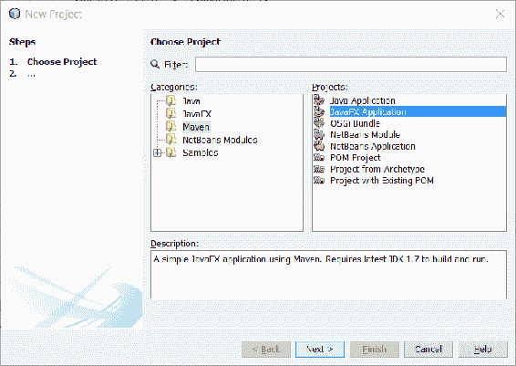
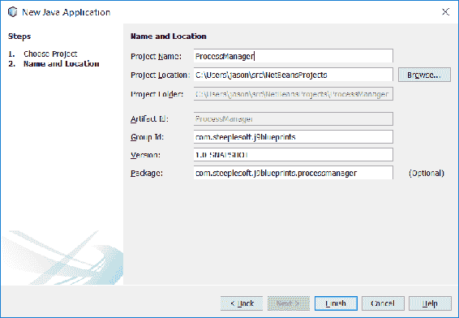
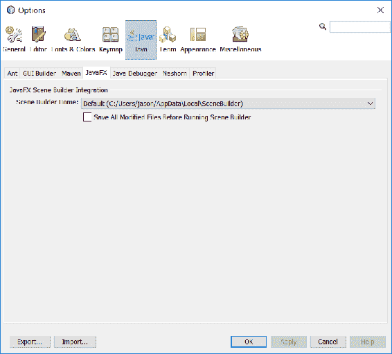
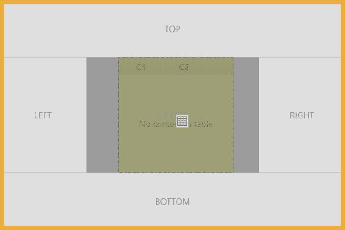
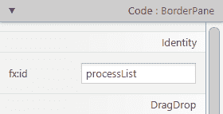
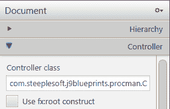
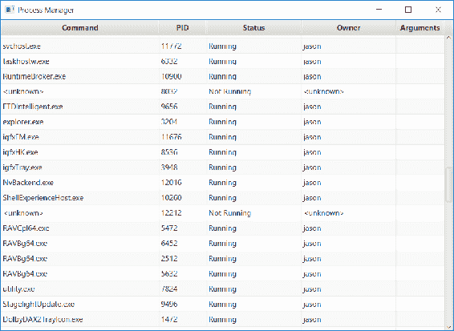

# 第二十章：Java 中的进程管理

通过快速浏览 Java 9 的一些新特性以及之前几个版本的一些特性，让我们将注意力转向以实际方式应用这些新 API。我们将从一个简单的进程管理器开始。

虽然让应用程序或实用程序内部处理所有用户的问题通常是理想的，但有时出于各种原因需要运行（或**外部调用**）外部程序。从 Java 的最初几天起，JDK 就通过`Runtime`类和各种 API 支持了这一点。以下是最简单的示例：

```java
    Process p = Runtime.getRuntime().exec("/path/to/program"); 
```

一旦进程被创建，你可以通过`Process`类跟踪其执行，该类具有`getInputStream()`、`getOutputStream()`和`getErrorStream()`等方法。我们还可以通过`destroy()`和`waitFor()`方法对进程进行基本的控制。Java 8 通过添加`destroyForcibly()`和`waitFor(long, TimeUnit)`方法推动了事物的发展。引用自**Java 增强提案**（**JEP**），我们看到了以下新功能的原因：

*许多企业应用程序和容器涉及多个 Java 虚拟机和进程，并且长期存在以下需求：*

+   *能够获取当前 Java 虚拟机的 pid 以及使用现有 API 创建的进程的 pid。*

+   *能够枚举系统上的进程。每个进程的信息可能包括其 pid、名称、状态以及可能的使用资源。*

+   *能够处理进程树，特别是提供一种销毁进程树的方法。*

+   *能够处理数百个子进程，可能通过复用输出或错误流来避免为每个子进程创建一个线程。*

在本章中，我们将构建一个简单的进程管理应用程序，类似于 Windows 任务管理器或*nix 的 top。当然，用 Java 编写的进程管理器几乎没有需求，但这将是我们探索这些新的进程处理 API 的绝佳途径。此外，我们还将花一些时间了解其他语言特性和 API，即 JavaFX 和`Optional`。

本章涵盖了以下主题：

+   创建项目

+   启动应用程序

+   定义用户界面

+   初始化用户界面

+   添加菜单

+   更新进程列表

话虽如此，让我们开始吧。

# 创建项目

通常来说，如果构建可以在不使用特定 IDE 或其他专有工具的情况下重现，那就更好了。幸运的是，NetBeans 提供了创建基于 Maven 的 JavaFX 项目的功能。点击“文件”|“新建项目”，然后选择`Maven`，然后选择 JavaFX 应用程序：



接下来，执行以下步骤：

1.  点击“下一步”。

1.  将项目名称输入为`ProcessManager`。

1.  将组 ID 输入为`com.steeplesoft`。

1.  将包输入为`com.steeplesoft.processmanager`。

1.  选择项目位置。

1.  点击完成。

以下截图作为示例：



一旦创建了新项目，我们需要更新 Maven 的`pom`文件以使用 Java 9：

```java
    <build> 
      <plugins> 
        <plugin> 
          <groupId>org.apache.maven.plugins</groupId> 
          <artifactId>maven-compiler-plugin</artifactId> 
          <version>3.6.1</version> 
          <configuration> 
            <source>9</source> 
            <target>9</target> 
          </configuration> 
        </plugin> 
      </plugins> 
    </build> 
```

现在，NetBeans 和 Maven 都配置好了使用 Java 9，我们准备开始编码。

# 启动应用

如介绍中所述，这将是一个基于 JavaFX 的应用，所以我们将首先创建应用的骨架。这是一个 Java 9 应用，我们打算使用 Java 模块系统。为此，我们需要创建模块定义文件`module-info.java`，它位于我们的源树根目录。这是一个基于 Maven 的项目，所以那将是`src/main/java`：

```java
    module procman.app { 
      requires javafx.controls; 
      requires javafx.fxml; 
    } 
```

这个小文件做了几件事情。首先，它定义了一个新的`procman.app`模块。接下来，它告诉系统这个模块`requires`两个 JDK 模块：`javafx.controls`和`javafx.fxml`。如果我们没有指定这两个模块，那么我们下面将要看到的系统将无法编译，因为 JDK 不会将所需的类和包提供给我们的应用。这些模块是 Java 9 标准 JDK 的一部分，所以这不应该是一个问题。然而，这可能在 Java 未来的版本中发生变化，并且这个模块声明将帮助我们通过强制宿主 JVM 提供模块或失败启动来防止应用在运行时出现故障。也有可能通过**J-Link**工具构建自定义的 Java 运行时，所以在 Java 9 下缺少这些模块仍然是一个可能性。在我们的模块配置完成后，让我们转向应用。

新兴的标准目录布局似乎是这样的：`src/main/java/*<module1>*`，`src/main/java/*<module2>*`，等等。在撰写本书时，虽然 Maven 可以被诱导采用这种布局，但插件本身，尽管它们在 Java 9 下运行，似乎并不足够模块化，以允许我们以这种方式组织我们的代码。因此，为了简单起见，我们将一个 Maven 模块视为一个 Java 模块，并保持项目的标准源布局。

我们将要创建的第一个类是`Application`的子类，这是 NetBeans 为我们创建的。它创建了`Main`类，我们将它重命名为`ProcessManager`：

```java
    public class ProcessManager extends Application { 
      @Override 
      public void start(Stage stage) throws Exception { 
        Parent root = FXMLLoader 
         .load(getClass().getResource("/fxml/procman.fxml")); 

        Scene scene = new Scene(root); 
        scene.getStylesheets().add("/styles/Styles.css"); 

        stage.setTitle("Process Manager"); 
        stage.setScene(scene); 
        stage.show(); 
      } 

      public static void main(String[] args) { 
        launch(args); 
      } 
    } 
```

我们的`ProcessManager`类扩展了 JavaFX 的基类`Application`，它提供了启动和停止应用的各种功能。我们在`main()`方法中看到我们只是委托给`Application.launch(String[])`，它为我们启动新应用做了繁重的工作。

这个类的更有趣的部分是`start()`方法，这是 JavaFX 生命周期回调到我们的应用的地方，给了我们构建用户界面的机会，我们将在下一部分完成。

# 定义用户界面

当构建 JavaFX 应用程序的用户界面时，你可以有两种方式：代码或标记。为了使我们的代码更小、更易读，我们将使用 FXML 构建用户界面——这是一种专门为 JavaFX 创建的基于 XML 的语言，用于表达用户界面。这给我们带来了另一个二选一的选择——我们是手动编写 XML，还是使用图形工具？同样，选择很简单——我们将使用一个工具，**Scene Builder**，这是一个最初由 Oracle 开发并由 Gluon 维护和支持的所见即所得工具。然而，我们还将查看 XML 源代码，以便了解正在进行的操作，所以如果你不喜欢使用 GUI 工具，你也不会被排除在外。

安装和使用 Scene Builder，正如你所预期的那样，相当简单。它可以从 [`gluonhq.com/labs/scene-builder/`](http://gluonhq.com/labs/scene-builder/) 下载。一旦安装，你需要在 NetBeans 的设置窗口中指定其位置，这可以在 Java | JavaFX 下的设置窗口完成，如下面的截图所示：



我们现在准备好创建 FXML 文件。在项目视图中的 `resources` 目录下，创建一个名为 `fxml` 的新文件夹，并在该文件夹中创建一个名为 `procman.fxml` 的文件，如下所示：

```java
    <BorderPane  

      fx:controller="com.steeplesoft.procman.Controller"> 
    </BorderPane> 
```

`BorderPane` 是一个容器，定义了五个区域——`top`、`bottom`、`left`、`right` 和 `center`，这使我们能够相当粗略地控制控件在表单上的位置。通常，使用 `BorderPane`，每个区域都使用嵌套容器来提供通常必要的更细粒度的控制。对于我们的需求，这种级别的控制将非常完美。

用户界面的主要关注点是进程列表，所以我们将从这里开始，使用 Scene Builder，我们想要点击左侧手风琴上的“控件”部分，然后向下滚动到`TableView`。点击它并将其拖到表单上的`CENTER`区域，如 Scene Builder 中的这个截图所示：



生成的 FXML 应该看起来像这样：

```java
    <center> 
        <TableView fx:id="processList" 
               BorderPane.alignment="CENTER"> 
        </TableView> 
    </center> 
```

在其他区域没有组件的情况下，`TableView` 将扩展以填充窗口的全部区域，这是我们目前想要的。

# 初始化用户界面

虽然 FXML 定义了用户界面的结构，但我们确实需要一些 Java 代码来初始化各种元素、响应用户操作等。这个类被称为控制器，它只是一个扩展了 `javafx.fxml.Initializable` 的类：

```java
    public class Controller implements Initializable { 
      @FXML 
      private TableView<ProcessHandle> processList; 
      @Override 
      public void initialize(URL url, ResourceBundle rb) { 
      } 
    } 
```

`initialize()` 方法来自接口，并由 JavaFX 运行时在从先前的 `Application` 类调用 `FXMLLoader.load()` 时创建控制器时使用。注意实例变量 `processList` 上的 `@FXML` 注解。当 JavaFX 初始化控制器时，在调用 `initialize()` 方法之前，系统会查找指定 `fx:id` 属性的 FXML 元素，并将该引用分配给控制器中适当的实例变量。为了完成这个连接，我们必须对我们的 FXML 文件进行最后一次更改：

```java
    <TableView fx:id="processList" BorderPane.alignment="CENTER">
    ...
```

该更改也可以在 Scene Builder 中进行，如本截图所示：



fx:id 属性的值必须与已用 `@FXML` 注释的实例变量的名称匹配。当调用 `initialize` 时，`processList` 将具有对 `TableView` 的有效引用，我们可以在 Java 代码中对其进行操作。

fx:id 的值也可以通过 Scene Builder 设置。要设置值，请点击表单编辑器中的控件，然后在右侧折叠面板中展开代码部分。在 fx:id 字段中，输入所需的变量名。

最后一部分是指定 FXML 文件的控制器。在 XML 源中，您可以通过用户界面根元素的 `fx:controller` 属性来设置此属性：

```java
    <BorderPane  xmlns="http://javafx.com/javafx/8.0.60"
      xmlns:fx="http://javafx.com/fxml/1" 
      fx:controller="com.steeplesoft.procman.Controller">
```

这也可以通过 Scene Builder 设置。在左侧折叠面板的文档部分中，展开控制器部分，并在控制器类字段中输入所需的完全限定类名：



在这些组件就绪后，我们可以开始初始化 `TableView` 的工作，这使我们回到了我们的主要兴趣点，即处理 API 的过程。我们的起点是 `ProcessHandles.allProcesses()`。从 Javadoc 中，你了解到这个方法返回 **当前进程可见的所有进程的快照**。从流中的每个 `ProcessHandle`，我们可以获取关于进程 ID、其状态、子进程、父进程等信息。每个 `ProcessHandle` 还有一个嵌套对象 `Info`，其中包含关于进程的信息快照。由于不是所有信息都在各种支持的平台上可用，并且受到当前进程权限的限制，`Info` 对象上的属性是 `Optional<T>` 实例，表示值可能已设置也可能未设置。花点时间快速了解一下 `Optional<T>` 是什么可能是有益的。

Javadoc 将 `Optional<T>` 描述为 **一个可能包含或不包含非空值的容器对象**。受 Scala 和 Haskell 的启发，`Optional<T>` 在 Java 8 中被引入，以允许 API 作者提供更安全的空值接口。在 Java 8 之前，`ProcessHandle.Info` 上的方法可能定义如下：

```java
    public String command(); 
```

为了消费 API，开发者可能会编写类似以下的内容：

```java
    String command = processHandle.info().command(); 
    if (command == null) { 
      command = "<unknown>"; 
    } 
```

如果开发者未能显式检查空值，则几乎肯定会在某个时刻发生 `NullPointerException`。通过使用 `Optional<T>`，API 作者向用户表明返回值可能为空，并且应该小心处理。因此，更新的代码可能如下所示：

```java
    String command = processHandle.info().command() 
     .orElse("<unknown>"); 
```

现在，我们可以在一行简洁的代码中获取值，如果存在，或者如果没有值，则返回默认值。`ProcessHandle.Info` API 广泛使用这种结构，我们将在后面看到。

`Optional` 还为我们开发者提供了什么？有许多实例方法可以帮助澄清空值处理代码：

+   `filter(Predicate<? super T> predicate)`: 使用此方法，我们可以过滤 `Optional` 的内容。而不是使用 `if...else` 块，我们可以将 `Predicate` 传递给 `filter()` 方法并直接进行测试。`Predicate` 是一个 `@FunctionalInterface`，它接受一个输入并返回一个布尔值。例如，一些 JavaFX `Dialog` 的使用可能返回 `Optional<ButtonType>`。如果我们只想在用户点击特定按钮（例如，确定）时执行某些操作，我们可以这样过滤 `Optional`：

```java
        alert.showAndWait() 
         .filter(b -> b instanceof ButtonType.OK) 
```

+   `map(Function<? super T,? extends U> mapper)`: `map` 函数允许我们将 `Optional` 的内容传递给一个函数，该函数将对其进行一些处理，并返回它。然而，函数的返回值将被包装在 `Optional` 中：

```java
        Optional<String> opts = Optional.of("hello"); 
        Optional<String> upper = opts.map(s ->  
         s.toUpperCase()); 
        Optional<Optional<String>> upper2 =  
         opts.map(s -> Optional.of(s.toUpperCase())); 
```

注意 `Optional` 中 `upper2` 的双重包装。如果 `Function` 返回 `Optional`，它将被另一个 `Optional` 包装，从而产生这种不希望的双重包装。幸运的是，我们有另一种选择。

+   `flatMap(Function<? super T,Optional<U>> mapper)`: `flatMap` 函数结合了两个函数式思想--映射和扁平化。如果 `Function` 的结果是 `Optional` 对象，而不是双重包装值，它将被扁平化为单个 `Optional` 对象。回顾先前的示例，我们得到如下结果：

```java
        Optional<String> upper3 = opts.flatMap(s ->      
         Optional.of(s.toUpperCase())); 
```

注意，与 `upper2` 不同，`upper3` 是一个单独的 `Optional`：

+   `get()`: 如果存在，则返回包装的值。如果没有值，则抛出 `NoSuchElementException` 错误。

+   `ifPresent(Consumer<? super T> action)`: 如果 `Optional` 对象包含一个值，则将其传递给 `Consumer`。如果没有值，则不执行任何操作。

+   `ifPresentOrElse(Consumer<? super T> action, Runnable emptyAction)`: 与 `ifPresent()` 类似，如果存在值，它将传递给 `Consumer`。如果没有值，则执行 `Runnable emptyAction`。

+   `isPresent()`: 这个方法简单地返回 `Optional` 对象是否包含一个值。

+   `or(Supplier<Optional<T>> supplier)`: 如果 `Optional` 对象有一个值，则描述该 `Optional`。如果没有值，则返回由 `Supplier` 产生的 `Optional` 对象。

+   `orElse(T other)`: 如果 `Optional` 对象包含一个值，则返回该值。如果没有值，则返回 `other`。

+   `orElseGet(Supplier<? extends T> supplier)`: 这与前面提到的 `orElse()` 的工作方式相同，但如果不存在值，则返回 `Supplier` 的结果。

+   `orElseThrow(Supplier<? extends X> exceptionSupplier)`: 如果存在值，则返回该值。如果不存在值，则抛出由 `Supplier` 提供的 `Exception`。

`Optional` 还有一些静态方法，这些方法有助于创建 `Optional` 实例，其中一些如下：

+   `empty()`: 这返回一个空的 `Optional` 对象。

+   `of(T value)`: 这返回一个描述非空值的 `Optional` 对象。如果值为空，则抛出 `NullPointerException`。

+   `ofNullable(T value)`: 这返回一个描述值的 `Optional` 对象。如果值为空，则返回一个空的 `Optional`。

在我们掌握了 `Optional<T>` 的简要介绍之后，让我们看看它的存在如何影响我们的应用程序。

将注意力转回到 `initialize()` 方法，我们的第一步是获取要显示的进程列表。流 API 使得这一点非常简单：

```java
    ProcessHandle.allProcesses() 
     .collect(Collectors.toList()); 
```

`allProcesses()` 方法返回 `Stream<ProcessHandle>`，这允许我们将新的流操作应用于我们的问题。在这种情况下，我们只想创建一个包含所有 `ProcessHandle` 实例的 `List`，因此我们调用 `collect()`，这是一个接受 `Collector` 的流操作。我们可以从多个选项中选择，但我们需要一个 `List`，所以我们使用 `Collectors.toList()`，它将收集流中的每个项目，并在流结束时返回一个 `List`。请注意，`List` 的参数化类型将与 `Stream` 相匹配，在这种情况下是 `ProcessHandle`。

这一行代码，然后，为我们提供了一个 `List<ProcessHandle>`，其中包含当前进程可以看到的系统中每个进程，但这只完成了一半。`TableView` API 不接受 `List<T>`。它只支持 `ObservableList<T>`，但那是什么？它的 Javadoc 定义得非常简单--*一个允许监听器在变化发生时跟踪更改的列表*。换句话说，当这个列表发生变化时，`TableView` 将自动被告知并重新绘制自己。一旦我们将 `TableView` 与这个列表关联起来，我们只需要担心数据，控制将处理其余部分。创建 `ObservableList` 非常简单：

```java
    @FXML 
    private TableView<ProcessHandle> processView; 
    final private ObservableList<ProcessHandle> processList =  
      FXCollections.observableArrayList(); 
    // ... 
    processView.setItems(processList);      
    processList.setAll(ProcessHandle.allProcesses() 
     .collect(Collectors.toList())); 
```

在我们的情况下，`TableView` 实例由运行时注入（此处包含以供参考），我们通过 `FXCollections.observableArrayList()` 创建 `ObservableList`。在 `initialize()` 中，我们通过 `setItems()` 将 `ObservableList` 设置在 `TableView` 上，然后通过 `setAll()` 填充 `ObservableList`。这样，我们的 `TableView` 就拥有了渲染自身所需的所有数据。几乎是这样。它有渲染所需的数据，但它**如何**渲染呢？`ProcessHandle.Info` 的每个字段去哪里了？为了回答这个问题，我们必须定义表上的列，并告诉每个列从哪里获取其数据。

要做到这一点，我们需要创建几个 `TableColumn<S,T>` 实例。`TableColumn` 负责显示其列标题（如适当），以及每个单元格的值。然而，你必须告诉它**如何**显示单元格。这是通过单元格值工厂来完成的。在 Java 7 中，这个 API 会得到如下代码：

```java
    TableColumn<ProcessHandle, String> commandCol =  
     new TableColumn<>("Command"); 
    commandCol.setCellValueFactory(new  
      Callback<TableColumn.CellDataFeatures<ProcessHandle, String>,  
       ObservableValue<String>>() { 
         public ObservableValue<String> call( 
          TableColumn.CellDataFeatures<ProcessHandle,  
           String> p) { 
             return new SimpleObjectProperty(p.getValue()
              .info() 
              .command() 
              .map(Controller::afterLast) 
              .orElse("<unknown>")); 
           } 
       }
    ); 
```

我先为你说出来：这真的很丑陋。幸运的是，我们可以利用 lambda 表达式和类型推断来简化代码，使其更容易阅读：

```java
    TableColumn<ProcessHandle, String> commandCol =  
     new TableColumn<>("Command"); 
    commandCol.setCellValueFactory(data ->  
     new SimpleObjectProperty(data.getValue().info().command() 
      .map(Controller::afterLast) 
      .orElse("<unknown>"))); 
```

这将十四行代码替换为六行。看起来更漂亮了。现在，我们只需要再这样做五次，每次对应一个列。尽管前面的代码已经有所改进，但仍然有相当多的重复代码。再次强调，Java 8 函数式接口可以帮助我们进一步清理代码。对于每一列，我们想要指定标题、宽度和从 `ProcessHandle.Info` 中提取的内容。我们可以用这个方法来封装这些：

```java
    private <T> TableColumn<ProcessHandle, T>  
      createTableColumn(String header, int width,  
       Function<ProcessHandle, T> function) { 
         TableColumn<ProcessHandle, T> column = 
          new TableColumn<>(header); 

         column.setMinWidth(width); 
         column.setCellValueFactory(data ->  
          new SimpleObjectProperty<T>( 
           function.apply(data.getValue()))); 
           return column; 
    } 
```

`Function<T,R>` 接口是 `FunctionalInterface`，它代表一个接受一个类型 `T` 并返回另一个类型 `R` 的函数。在我们的例子中，我们定义这个方法为接受一个 `String`、一个 `int` 以及一个接受 `ProcessHandle` 并返回泛型类型的函数作为参数。这可能有点难以想象，但有了这个方法定义，我们可以用对这个方法的调用替换前面的代码以及类似的代码。现在，前面的相同代码可以简化为这样：

```java
    createTableColumn("Command", 250,  
      p -> p.info().command() 
      .map(Controller::afterLast) 
      .orElse("<unknown>")) 
```

现在我们只需要将这些列添加到控件中，我们可以用这个方法来完成：

```java
    processView.getColumns().setAll( 
      createTableColumn("Command", 250,  
      p -> p.info().command() 
       .map(Controller::afterLast) 
       .orElse("<unknown>")), 
      createTableColumn("PID", 75, p -> p.getPid()), 
      createTableColumn("Status", 150,  
       p -> p.isAlive() ? "Running" : "Not Running"), 
      createTableColumn("Owner", 150,  
       p -> p.info().user() 
        .map(Controller::afterLast) 
        .orElse("<unknown>")), 
      createTableColumn("Arguments", 75,  
       p -> p.info().arguments().stream() 
        .map(i -> i.toString()) 
        .collect(Collectors.joining(", ")))); 
```

注意，我们在 `ProcessHandle.Info` 上使用的每个方法都返回我们在前面代码中看到的 `Optional<T>`。由于它这样做，我们有一个非常优雅且干净的 API 来获取我们想要的信息（或合理的默认值），而无需在生产环境中担心 `NullPointerException`。

如果我们现在运行应用程序，我们应该得到类似这样的结果：



目前看起来不错，但还不是完全准备好。我们希望能够启动新的进程以及终止现有的进程。这两者都需要菜单，所以我们将添加这些菜单。

# 添加菜单

JavaFX 中的菜单从 `MenuBar` 组件开始。我们当然希望这个菜单在窗口的顶部，所以我们将组件添加到我们的 `BorderPane` 的 `top` 部分。如果你使用 Scene Builder，你的 FXML 文件最终会变成这样：

```java
    <MenuBar BorderPane.alignment="CENTER"> 
      <menus> 
        <Menu mnemonicParsing="false" text="File"> 
          <items> 
            <MenuItem mnemonicParsing="false" text="Close" /> 
          </items> 
        </Menu> 
        <Menu mnemonicParsing="false" text="Edit"> 
          <items> 
            <MenuItem mnemonicParsing="false" text="Delete" /> 
          </items> 
        </Menu> 
        <Menu mnemonicParsing="false" text="Help"> 
          <items> 
            <MenuItem mnemonicParsing="false" text="About" /> 
          </items> 
        </Menu> 
      </menus> 
    </MenuBar> 
```

我们不需要编辑菜单，所以我们可以从 FXML 文件中删除该部分（或者在 Scene Builder 中右键单击第二个 `Menu` 条目并点击删除）。要创建我们想要的菜单项，我们向 `File` 元素下的 `item` 元素添加适当的 `MenuItem` 条目：

```java
    <Menu mnemonicParsing="true" text="_File"> 
      <items> 
        <MenuItem mnemonicParsing="true"  
          onAction="#runProcessHandler"  
          text="_New Process..." /> 
        <MenuItem mnemonicParsing="true"  
          onAction="#killProcessHandler"  
          text="_Kill Process..." /> 
        <MenuItem mnemonicParsing="true"  
          onAction="#closeApplication"  
          text="_Close" /> 
      </items> 
    </Menu> 
```

每个这些 `MenuItem` 条目都定义了三个属性：

+   `mnemonicParsing`：这指示 JavaFX 使用任何以下划线开头字母作为键盘快捷键

+   `onAction`：这标识了当 `MenuItem` 被激活/点击时将在控制器上被调用的方法

+   `text`：这定义了 `MenuItem` 的标签

最有趣的部分是 `onAction` 以及它与控制器的关系。JavaFX 当然知道这个形式是由 `com.steeplesoft.procman.Controller` 支持的，所以它会寻找具有以下签名的方：

```java
    @FXML 
    public void methodName(ActionEvent event) 
```

`ActionEvent` 是一个在 JavaFX 中被用于多种场景的类。在我们的情况下，我们有针对每个菜单项的特定方法，所以事件本身并不太有趣。让我们看看每个处理程序，从最简单的 `closeApplication` 开始：

```java
    @FXML 
    public void closeApplication(ActionEvent event) { 
      Platform.exit(); 
    } 
```

这里没有什么可看的；当菜单项被点击时，我们通过调用 `Platform.exit()` 来退出应用程序。

接下来，让我们看看如何终止一个进程：

```java
    @FXML 
    public void killProcessHandler(final ActionEvent event) { 
      new Alert(Alert.AlertType.CONFIRMATION,  
      "Are you sure you want to kill this process?",  
      ButtonType.YES, ButtonType.NO) 
       .showAndWait() 
       .filter(button -> button == ButtonType.YES) 
       .ifPresent(response -> { 
         ProcessHandle selectedItem =  
          processView.getSelectionModel() 
           .getSelectedItem(); 
         if (selectedItem != null) { 
           selectedItem.destroy(); 
           processListUpdater.updateList(); 
         } 
       }); 
    } 
```

我们在这里有很多事情要做。我们首先做的是创建一个类型为 `CONFIRMATION` 的 `Alert` 对话框，该对话框要求用户确认请求。对话框有两个按钮：`YES` 和 `NO`。一旦对话框创建完成，我们就调用 `showAndWait()`，正如其名称所暗示的那样——它会显示对话框并等待用户的响应。它返回 `Optional<ButtonType>`，该类型包含用户点击的按钮类型，这将是 `ButtonType.YES` 或 `ButtonType.NO`，这取决于我们创建的 `Alert` 对话框类型。使用 `Optional`，我们可以应用 `filter()` 来找到我们感兴趣的按钮类型，即 `ButtonType.YES`，这将返回另一个 `Optional`。如果用户点击了是，`ifPresent()` 将返回 true（多亏了我们的过滤器），然后我们传递的 lambda 将被执行。非常棒且简洁。

下一个感兴趣的区域是 lambda。一旦我们确定用户想要终止一个进程，我们需要确定要终止哪个进程。为此，我们通过 `TableView.getSelectionModel() .getSelectedItem()` 询问 `TableView` 哪一行被选中。如果我们需要检查 null（唉，这里没有 `Optional`），我们必须这样做，以防用户实际上没有选择任何行。如果它非空，我们可以在 `TableView` 给我们的 `ProcessHandle` 上调用 `destroy()`。然后我们调用 `processListUpdater.updateList()` 来刷新 UI。我们稍后再来看这个。

我们最终的动作处理程序必须运行以下命令：

```java
    @FXML 
    public void runProcessHandler(final ActionEvent event) { 
      final TextInputDialog inputDlg = new TextInputDialog(); 
      inputDlg.setTitle("Run command..."); 
      inputDlg.setContentText("Command Line:"); 
      inputDlg.setHeaderText(null); 
      inputDlg.showAndWait().ifPresent(c -> { 
        try { 
          new ProcessBuilder(c).start(); 
        } catch (IOException e) { 
            new Alert(Alert.AlertType.ERROR,  
              "There was an error running your command.") 
              .show(); 
          } 
      }); 
    } 
```

在许多方面，这与前面的 `killProcessHandler()` 方法相似——我们创建一个对话框，设置一些选项，调用 `showAndWait()`，然后处理 `Optional`。不幸的是，对话框不支持构建器模式，这意味着我们没有漂亮的、流畅的 API 来构建对话框，所以我们分几个离散的步骤来做。处理 `Optional` 也类似。我们调用 `ifPresent()` 来查看对话框是否返回了一个命令行（即用户输入了一些文本并且按下了 OK），如果有的话，将其传递给 lambda。

让我们快速看一下 lambda。这是另一个多行 lambda 的例子。虽然我们之前看到的 lambda 大多数都是简单的单行函数，但请记住，lambda**可以**跨越多行。为了支持这一点，我们只需要像我们这样做，用大括号包裹代码块，然后一切照旧。对于这样的多行 lambda，必须小心，因为 lambda 给我们带来的可读性和简洁性的任何收益都可能很快被一个变得太大的 lambda 体所掩盖或消除。在这些情况下，将代码提取到方法中并使用方法引用可能是明智的选择。最终，决定权在你，但请记住 Uncle Bob Martin 的话--*清晰是王道*。

关于菜单的一个最后项目。为了更加有用，应用程序应该提供一个上下文菜单，允许用户右键单击一个进程并从那里将其终止，而不是点击行，将鼠标移动到`File`菜单，等等。添加上下文菜单是一个简单的操作。我们只需要像这样修改我们的`TableView`定义在 FXML 中：

```java
    <TableView fx:id="processView" BorderPane.alignment="CENTER"> 
      <contextMenu> 
        <ContextMenu> 
          <items> 
            <MenuItem onAction="#killProcessHandler"  
               text="Kill Process..."/> 
          </items> 
        </ContextMenu> 
      </contextMenu> 
    </TableView> 
```

在这里，我们向我们的`TableView`添加了一个`contextMenu`子项。与它的兄弟`MenuBar`类似，`contextMenu`有一个`items`子项，该子项反过来又有 0 个或多个`MenuItem`子项。在这种情况下，`Kill Process...`的`MenuItem`看起来与`File`下的非常相似，唯一的区别是`mnemonicProcessing`信息。我们甚至重用了`ActionEvent`处理程序，所以没有额外的编码，无论你点击哪个菜单项，终止进程的行为总是相同的。

# 更新进程列表

如果应用程序启动并显示了一个进程列表，但从未更新过该列表，那么它将毫无用处。我们需要的，是能够定期更新列表的方法，为此，我们将使用一个`Thread`。

如你所知或不知，`Thread`大致是一种在后台运行任务的方式（Javadoc 将其描述为程序中的*执行线程*）。一个系统可以是单线程或多线程的，这取决于系统的需求和运行时环境。多线程编程很难做对。幸运的是，我们的用例相当简单，但我们仍然必须谨慎行事，否则我们会看到一些非常意外的行为。

通常情况下，当你创建一个`Thread`时，你会得到这样的建议：实现一个`Runnable`接口，然后将它传递给线程的构造函数，这是一个非常好的建议，因为它使你的类层次结构更加灵活，因为你不会绑定到一个具体的基类（`Runnable`是一个`interface`）。然而，在我们的案例中，我们有一个相对简单的系统，从这个方法中获得的收益很小，所以我们将直接扩展`Thread`并简化我们的代码，同时封装我们期望的行为。让我们看看我们的新类：

```java
    private class ProcessListUpdater extends Thread { 
      private volatile boolean running = true; 

      public ProcessListRunnable() { 
        super(); 
        setDaemon(true); 
      } 

      public void shutdown() { 
        running = false; 
      } 

      @Override 
      public void run() { 
        while (running) { 
          updateList(); 
          try { 
            Thread.sleep(5000); 
          } catch (InterruptedException e) { 
              // Ignored 
            } 
        } 
      }  

      public synchronized void updateList() { 
        processList.setAll(ProcessHandle.allProcesses() 
          .collect(Collectors.toList())); 
        processView.sort(); 
      } 
    } 
```

我们有一个相当基础的类，我们给它起了一个合理且具有意义的名字，它扩展了`Thread`类。在构造函数中，请注意我们调用了`setDaemon(true)`。这将允许我们的应用程序按预期退出，而不是阻塞等待线程终止。我们还定义了一个`shutdown()`方法，我们将从应用程序中使用它来停止线程。

`Thread`类确实有各种状态控制方法，如`stop()`、`suspend()`、`resume()`等，但这些都已被弃用，因为它们被认为固有不安全。搜索文章《为什么`Thread.stop`、`Thread.suspend`和`Thread.resume`被弃用？》，如果你想了解更多细节；然而，现在的建议最佳实践是使用控制标志，就像我们用`running`做的那样，向`Thread`类发出信号，表明它需要清理和关闭。

最后，我们来到了`Thread`类的核心，即`run()`方法，它无限循环（或者直到`running`变为 false），在执行完工作后休眠五秒钟。实际的工作是在`updateList()`中完成的，它构建进程列表，更新我们之前讨论过的`ObservableList`，然后指示`TableView`根据用户的排序选择重新排序（如果有的话）。这是一个公共方法，允许我们在需要时调用它，就像我们在`killProcessHandler()`中做的那样。这让我们有了以下代码块来设置它：

```java
    @Override 
    public void initialize(URL url, ResourceBundle rb) { 
      processListUpdater = new ProcessListUpdater(); 
      processListUpdater.start(); 
      // ... 
    } 
```

以下代码将关闭它，这我们在`closeHandler()`中已经看到了：

```java
    processListUpdater.shutdown(); 
```

留意细节的人会注意到`updateList()`上有`synchronized`关键字。这是为了防止由于从多个线程调用此方法而可能引起的任何类型的竞争条件。想象一下这样的场景：当用户决定终止一个进程，并在线程唤醒时点击确认对话框上的 OK 按钮（这类事情发生的频率可能比你想象的要高）。我们可能有两个线程同时调用`updateList()`，结果第一个线程在第二个线程击中`processView.sort()`时刚好触发了`processList.setAll()`。当另一个线程正在重建列表时调用`sort()`会发生什么？很难确定，但可能会造成灾难性的后果，所以我们想禁止这种情况。`synchronized`关键字指示 JVM 只允许一次只有一个线程执行该方法，导致其他所有线程排队等待轮到它们（请注意，它们的执行顺序是非确定性的，所以你不能根据线程运行`synchronized`方法的顺序来建立任何期望）。这避免了竞争条件的发生，并确保我们的程序不会崩溃。

虽然在这里是合适的，但在使用`同步`方法时必须小心，因为获取和释放锁可能代价高昂（尽管在现代化的 JVM 中要小得多），更重要的是，它强制线程在遇到这个方法调用时按顺序运行，这可能导致应用程序中出现非常不希望出现的延迟，尤其是在 GUI 应用程序中。在编写自己的多线程应用程序时，请记住这一点。

# 摘要

这样一来，我们的应用程序就完成了。虽然这不是一个特别复杂的应用程序，但它确实包括了几个有趣的技术，例如 JavaFX、Lambda 表达式、Streams、`ProcessHandle`以及相关的类，还有线程。

在下一章中，我们将构建一个简单的命令行工具来查找重复文件。通过这个过程，我们将亲身体验新的文件 I/O API、Java 持久化 API（JPA）、文件哈希以及一些 JavaFX。
