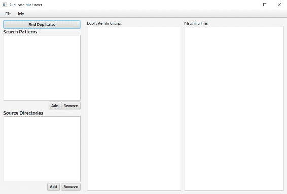

# 第二十一章：重复文件查找器

任何运行了一段时间的系统都会开始受到硬盘杂乱的影响。例如，对于大型音乐和照片收藏来说，这一点尤其如此。除了最挑剔的文件被复制和移动之外，我们最终会在这里和那里都有副本。然而，问题是，这些副本中哪些是重复的，哪些不是？在本章中，我们将构建一个文件遍历实用程序，它将扫描一组目录以查找重复文件。我们将能够指定是否应该删除重复文件、**隔离**或只是报告。

在本章中，我们将涵盖以下主题：

+   Java 平台模块系统

+   Java NIO（新 I/O）文件 API

+   文件哈希

+   **Java 持久化 API**（**JPA**）

+   新的 Java 日期/时间 API

+   编写命令行实用程序

+   更多 JavaFX

# 入门

这个应用程序在概念上相当简单，但比上一章我们讨论的要复杂一些，因为我们会有命令行和图形界面两个界面。经验丰富的程序员可能会立即看到在两个界面之间共享代码的需要，因为**DRY**（不要重复自己）是良好设计系统的一个许多标志之一。因此，为了促进这种代码共享，我们将引入第三个模块，该模块提供了一个可以被其他两个项目使用的库。我们将把这些模块称为`lib`、`cli`和`gui`。设置项目的第一步是创建各种 Maven POM 文件来描述项目的结构。父 POM 看起来可能像这样：

```java
    <?xml version="1.0" encoding="UTF-8"?> 
    <project  

      xsi:schemaLocation="http://maven.apache.org/POM/4.0.0  
      http://maven.apache.org/xsd/maven-4.0.0.xsd"> 
      <modelVersion>4.0.0</modelVersion> 

     <groupId>com.steeplesoft.dupefind</groupId> 
     <artifactId>dupefind-master</artifactId> 
     <version>1.0-SNAPSHOT</version> 
     <packaging>pom</packaging> 

     <modules> 
       <module>lib</module> 
       <module>cli</module> 
       <module>gui</module> 
     </modules> 

     <name>Duplicate Finder - Master</name> 
    </project> 
```

这是一个相当典型的 POM 文件。我们首先将确定项目的父项目，这样我们就可以继承许多设置、依赖项等，避免在这个项目中重复它们。接下来，我们将定义项目的 Maven 坐标。请注意，我们没有为这个项目定义版本，允许父项目的版本向下传递。这将允许我们在一个地方增加版本，并隐式更新所有子项目。

对于那些以前没有见过多模块项目的读者来说，这个 POM 的最后一个有趣的部分是`modules`部分。对于那些新手来说，需要注意的是，每个`module`元素都指的是一个目录名，它是当前目录的直接子目录，并且应该按照它们所需的顺序声明。在我们的情况下，CLI 和 GUI 都依赖于库，所以`lib`排在第一位。接下来，我们需要为每个模块创建 POM 文件。这些每个都是典型的 jar 类型 POM，所以没有必要在这里包含它们。每个都会有不同的依赖项，但我们将根据需要来讨论这些依赖项。

# 构建库

这个项目的基石是库，CLI 和 GUI 都将使用这个库，所以从这里开始是有意义的。在设计库时——它的输入、输出和一般行为——了解我们到底想要这个系统做什么，这很有帮助，所以让我们花点时间来讨论功能需求。

如介绍中所述，我们希望能够搜索任意数量的目录中的重复文件。我们还希望能够将搜索和比较限制在仅某些文件上。如果我们没有指定匹配模式，那么我们希望检查每个文件。

最重要的是如何识别匹配。当然，有无数种方法可以做到这一点，但我们将采用以下方法：

+   识别具有相同文件名的文件。想想那些你可能已经从相机下载图片到电脑保存，然后后来可能忘记了你已经下载了这些图片，所以你又在其他地方复制了它们的情况。显然，你只需要一个副本，但是例如文件`IMG_9615.JPG`在临时目录中与你在图片备份目录中的文件是否相同？通过识别具有匹配名称的文件，我们可以测试它们以确保它们是相同的。

+   识别具有相同大小的文件。这里的匹配可能性较小，但仍然存在机会。例如，一些照片管理软件在从设备导入图片时，如果发现具有相同名称的文件，会修改第二个文件的文件名并将两个文件都存储起来，而不是停止导入并要求立即用户干预。这可能导致大量文件，如`IMG_9615.JPG`和`IMG_9615-1.JPG`。这个检查将有助于识别这些情况。

+   对于上面的每个匹配项，为了确定文件是否实际上是匹配的，我们将根据文件内容生成一个哈希值。如果有多个文件生成了相同的哈希值，这些文件实际上是相同的可能性非常高。我们将这些文件标记为潜在的重复文件。

这是一个相当简单的算法，应该相当有效，但我们确实有一个问题，尽管这个问题可能不是立即显而易见的。如果你有大量的文件，特别是具有大量潜在重复文件的集合，处理所有这些文件可能是一个非常耗时的过程，我们希望尽可能减少这个过程，这导致我们有一些非功能性需求：

+   程序应该以并发方式处理文件，以尽可能减少处理大量文件集所需的时间。

+   这种并发性应该是有界的，这样系统就不会因为处理请求而超负荷。

+   考虑到可能存在大量数据，系统必须设计得避免耗尽所有可用的 RAM 并导致系统不稳定。

在这个相当简短的函数性和非函数性需求列表中，我们应该准备好开始。就像上一个应用程序一样，让我们先定义我们的模块。在 `src/main/java` 中，我们将创建这个 `module-info.java`：

```java
    module com.steeplesoft.dupefind.lib { 
      exports com.steeplesoft.dupefind.lib; 
    } 
```

初始时，编译器——以及 IDE——会抱怨 `com.steeplesoft.dupefind.lib` 包不存在，并且不会编译项目。现在还不用担心这个问题，因为我们现在就会创建这个包。

在功能性需求中使用 **并发** 这个词，很可能会立刻让人联想到线程的概念。我们在第十八章 管理 Java 进程 中介绍了线程的概念，所以如果你不熟悉它们，请回顾一下上一章的相关内容。

在这个项目中，我们使用线程的方式与上一个项目不同，因为我们会有一些需要完成的工作，一旦完成，我们希望线程退出。我们还需要等待这些线程完成它们的工作，以便我们可以分析它们。在 `java.util.concurrent` 包中，JDK 提供了几个选项来完成这项任务。

# 带有 Future 接口的并发 Java

其中一个更常见且受欢迎的 API 是 `Future<V>` 接口。`Future` 是封装异步计算的一种方式。通常，`Future` 实例由 `ExecutorService` 返回，我们稍后会讨论它。一旦调用者获得 `Future` 的引用，它就可以继续在其他任务上工作，同时 `Future` 在另一个线程的背景中运行。当调用者准备好 `Future` 的结果时，它调用 `Future.get()`。如果 `Future` 已经完成其工作，调用将立即返回结果。然而，如果 `Future` 仍在工作，对 `get()` 的调用将阻塞，直到 `Future` 完成。

然而，对于我们的用途来说，`Future` 并不是最合适的选择。查看非功能性需求，我们看到避免通过显式耗尽可用内存而导致系统崩溃的愿望被明确列出。正如我们稍后将会看到的，这将通过将数据存储在轻量级的磁盘数据库中来实现，我们将会实现这一点——同样，正如我们稍后将会看到的——通过在检索文件信息时将其存储，而不是通过收集数据然后在后处理方法中保存它。鉴于这一点，我们的 `Future` 不会返回任何内容。虽然有一种方法可以使它工作（将 `Future` 定义为 `Future<?>` 并返回 `null`），但这并不是最自然的方法。

可能最合适的方案是`ExecutorService`，它是一个提供了额外功能（例如创建`Future`的能力，如前所述，以及管理队列的终止）的`Executor`。那么，`Executor`是什么呢？`Executor`是一个比简单地调用`new Thread(runnable).start()`更健壮的执行`Runnable`的机制。该接口本身非常基础，仅包含`execute(Runnable)`方法，因此仅从查看 Javadoc 中无法立即看出其价值。然而，如果你查看`ExecutorService`，这是所有由 JDK 提供的`Executor`实现以及各种`Executor`实现的接口，它们的价值就很容易显现出来。现在让我们快速浏览一下。

查看`Executors`类，我们可以看到五种不同类型的`Executor`实现：一个缓存线程池、一个固定大小的线程池、一个计划线程池、一个单线程执行器和一个工作窃取线程池。除了单线程`Executor`是唯一例外外，这些都可以直接实例化（`ThreadPoolExecutor`、`ScheduledThreadPoolExecutor`和`ForkJoinPool`），但 JDK 作者强烈建议用户使用`Executors`类上的便利方法。话虽如此，这些选项分别是什么，为什么你可能会选择其中一个？

+   `Executors.newCachedThreadPool()`: 此方法返回一个提供缓存线程池的`Executor`。随着任务的到来，`Executor`将尝试找到一个未使用的线程来执行任务。如果找不到，将创建一个新的`Thread`并开始工作。当任务完成时，`Thread`将返回到池中以等待重用。大约 60 秒后，未使用的线程将被销毁并从池中移除，这防止了资源被分配后从未释放。尽管如此，在使用此`Executor`时必须小心，因为线程池是无界的，这意味着在重负载下，系统可能会被活跃的线程压垮。

+   `Executors.newFixedThreadPool(int nThreads)`: 此方法返回一个与之前提到的类似但有所不同的`Executor`，其区别在于线程池的大小被限制在最多`nThreads`。

+   `Executors.newScheduledThreadPool(int corePoolSize)`: 此`Executor`能够根据可选的初始延迟和基于延迟和`TimeUnit`值的周期性来调度任务。例如，查看`schedule(Runnable command, long delay, TimeUnit unit)`方法。

+   `Executors.newSingleThreadExecutor()`: 此方法将返回一个使用单个线程来执行提交给它的任务的`Executor`。任务将保证按照它们提交的顺序执行。

+   `Executors.newWorkStealingExecutor()`: 此方法将返回一个所谓的**工作窃取**`Executor`，它属于`ForkJoinPool`类型。提交给此`Executor`的任务将以一种方式编写，以便能够将工作分配给额外的工作线程，直到工作的大小低于用户定义的阈值。

考虑到我们的非功能性需求，固定大小的`ThreadPoolExecutor`似乎是最合适的选择。然而，我们需要支持的一个配置选项是强制为每个找到的文件生成哈希值。根据前面的算法，只有具有重复名称或大小的文件会被哈希化。但是，用户可能希望对他们的文件规范进行更彻底的分析，并希望对每个文件强制进行哈希处理。我们将使用工作窃取（或分叉/合并）池来实现这一点。

在选择了我们的线程方法后，让我们看看库的入口点，我们将称之为`FileFinder`的类。由于这是我们的入口点，它需要知道我们想要搜索的位置以及我们想要搜索的内容。这将给我们实例变量`sourcePaths`和`patterns`：

```java
    private final Set<Path> sourcePaths = new HashSet<>(); 
    private final Set<String> patterns = new HashSet<>(); 
```

我们将变量声明为`private`，因为这是一种良好的面向对象实践。我们还将它们声明为`final`，以帮助避免这些变量被分配新值导致的微妙错误。一般来说，我发现将变量默认标记为`final`是一种良好的实践，以防止此类微妙错误。在这种情况下，此类类的实例变量只能声明为`final`，如果它要么立即被赋予值，就像我们在这里所做的那样，要么在类的构造函数中赋予值。

我们还希望在现在定义我们的`ExecutorService`：

```java
    private final ExecutorService es = 
      Executors.newFixedThreadPool(5); 
```

我们有些任意地将线程池限制为五个线程，因为它似乎在为重请求提供足够的工作线程和分配大量线程之间提供了一个公平的平衡，而这些线程在大多数情况下可能不会被使用。在我们的情况下，这可能是被夸大了一点的小问题，但确实是一件需要记住的事情。

接下来，我们需要提供一种存储任何找到的重复项的方法。以下代码行作为示例：

```java
    private final Map<String, List<FileInfo>> duplicates =  
      new HashMap<>(); 
```

我们将在稍后看到更多细节，但，目前我们只需要注意的是，这是一个以文件哈希为键的`Map`，其中包含`List<FileInfo>`对象。

需要注意的最后一个变量可能有些出乎意料——一个`EntityManagerFactory`。你可能想知道那是什么？`EntityManagerFactory`是与由**Java 持久化 API**（**JPA**）定义的持久化单元交互的接口，它是 Java 企业版规范的一部分。幸运的是，该规范被编写得如此，以至于它可以在我们这样的**标准版**（**SE**）环境中使用。

那么，我们用这样的 API 做什么呢？如果您回顾一下非功能性需求，我们指定了我们要确保搜索重复文件不会耗尽系统上的可用内存。对于非常大的搜索，文件及其哈希值的列表可能会增长到问题的大小。再加上生成哈希值所需的内存，我们稍后会讨论这一点，我们很可能遇到内存不足的情况。因此，我们将使用 JPA 将我们的搜索信息保存到一个简单、轻量级的数据库（SQLite）中，这将允许我们将数据保存到磁盘。它还将允许我们比反复迭代内存结构更有效地查询和过滤结果。

在我们能够使用那些 API 之前，我们需要更新我们的模块描述符，让系统知道我们现在需要持久化模块。以下代码片段可以作为示例：

```java
    module dupefind.lib { 
      exports com.steeplesoft.dupefind.lib; 
      requires java.logging; 
      requires javax.persistence; 
    } 
```

我们已经向系统声明我们需要`javax.persistence`和`java.logging`，我们稍后会使用。正如我们在第十八章管理 Java 中的进程中讨论的，如果这些模块中的任何一个不存在，JVM 实例将无法启动。

模块定义中可能更为重要的部分是`exports`子句。通过这一行（可能有一行或多行），我们告诉系统我们正在导出指定包中的所有类型。这一行将允许我们的 CLI 模块（我们稍后会讨论）使用该模块中的类（以及如果我们添加任何的话，还包括接口、枚举等）。如果一个类型的包没有`export`，那么消费模块将无法看到该类型，我们稍后也会演示这一点。

理解这一点后，让我们看看我们的构造函数：

```java
    public FileFinder() { 
      Map<String, String> props = new HashMap<>(); 
      props.put("javax.persistence.jdbc.url",  
       "jdbc:sqlite:" +  
       System.getProperty("user.home") +  
       File.separator +  
       ".dupfinder.db"); 
      factory = Persistence.createEntityManagerFactory 
       ("dupefinder", props); 
      purgeExistingFileInfo(); 
    } 
```

要配置持久化单元，JPA 通常使用一个`persistence.xml`文件。然而，在我们的情况下，我们希望对数据库文件的存储位置有更多的控制。正如您在前面的代码中所看到的，我们正在使用`user.home`环境变量来构建 JDBC URL。然后我们使用 JPA 定义的键将这个 URL 存储在一个`Map`中，以指定 URL。这个`Map`随后被传递给`createEntityManagerFactory`方法，该方法覆盖了`persistence.xml`中设置的任何内容。这允许我们将数据库放在适合用户操作系统的家目录中。

在我们的类构建和配置完成后，是时候看看我们如何找到重复的文件了：

```java
    public void find() { 
      List<PathMatcher> matchers = patterns.stream() 
       .map(s -> !s.startsWith("**") ? "**/" + s : s) 
       .map(p -> FileSystems.getDefault() 
       .getPathMatcher("glob:" + p)) 
       .collect(Collectors.toList()); 
```

我们的第一步是根据用户指定的模式创建一个`PathMatcher`实例列表。`PathMatcher`实例是一个函数式接口，由尝试匹配文件和路径的对象实现。我们的实例是从`FileSystems`类中检索的。

当请求 `PathMatcher` 时，我们必须指定全局模式。正如在 `map()` 的第一次调用中可以看到的，我们必须调整用户指定的内容。通常，模式掩码简单地指定为类似 `*.jpg` 的内容。然而，这样的模式掩码不会按用户期望的方式工作，它只会查看当前目录，而不会遍历任何子目录。为了做到这一点，模式必须以 `**/` 前缀开始，我们在 `map()` 调用中这样做。使用调整后的模式，我们从系统的默认 `FileSystem` 请求 `PathMatcher` 实例。请注意，我们指定匹配器模式为 `"glob:" + p`，因为我们确实需要表明我们正在指定一个 `glob` 文件。

在我们的匹配器准备就绪后，我们就可以开始搜索了。我们用以下代码来完成：

```java
    sourcePaths.stream() 
     .map(p -> new FindFileTask(p)) 
     .forEach(fft -> es.execute(fft)); 
```

使用 `Stream` API，我们将每个源路径映射到一个 lambda 表达式，该表达式创建一个 `FindFileTask` 实例，并提供它将搜索的源路径。这些 `FileFindTask` 实例中的每一个都将通过 `execute()` 方法传递给我们的 `ExecutorService`。

`FileFindTask` 方法是这个过程这一部分的工作马。它是一个 `Runnable`，因为我们将会将其提交给 `ExecutorService`，但它也是一个 `FileVisitor<Path>`，因为它将会在遍历文件树时使用，我们从 `run()` 方法中执行这一操作：

```java
    @Override 
    public void run() { 
      final EntityTransaction transaction = em.getTransaction(); 
      try { 
        transaction.begin(); 
        Files.walkFileTree(startDir, this); 
        transaction.commit(); 
      } catch (IOException ex) { 
        transaction.rollback(); 
      } 
    } 
```

由于我们将会通过 JPA 将数据插入数据库，因此我们需要首先开始一个事务。由于这是一个应用程序管理的 `EntityManager`，我们必须手动管理事务。我们在 `try/catch` 块之外获取 `EntityTransaction` 实例的引用，以简化对其的引用。在 `try` 块内部，我们开始事务，通过 `Files.walkFileTree()` 开始文件遍历，如果过程成功，则提交事务。如果失败——如果抛出了 `Exception`——则回滚事务。

`FileVisitor` API 需要实现许多方法，其中大多数并不特别有趣，但为了清晰起见，我们将展示它们：

```java
    @Override 
    public FileVisitResult preVisitDirectory(final Path dir,  
    final BasicFileAttributes attrs) throws IOException { 
      return Files.isReadable(dir) ?  
       FileVisitResult.CONTINUE : FileVisitResult.SKIP_SUBTREE; 
    } 
```

在这里，我们告诉系统如果目录可读，则继续遍历该目录。否则，我们跳过它：

```java
    @Override 
    public FileVisitResult visitFileFailed(final Path file,  
     final IOException exc) throws IOException { 
       return FileVisitResult.SKIP_SUBTREE; 
    } 
```

API 要求实现这个方法，但我们并不非常关心文件读取失败，所以我们简单地返回一个跳过结果：

```java
    @Override 
    public FileVisitResult postVisitDirectory(final Path dir,  
     final IOException exc) throws IOException { 
       return FileVisitResult.CONTINUE; 
    } 
```

与前面的方法类似，这个方法也是必需的，但我们对此特定事件不感兴趣，所以我们向系统发出继续的信号：

```java
    @Override 
    public FileVisitResult visitFile(final Path file, final
     BasicFileAttributes attrs) throws IOException { 
       if (Files.isReadable(file) && isMatch(file)) { 
         addFile(file); 
       } 
       return FileVisitResult.CONTINUE; 
    } 
```

现在我们来到了一个我们感兴趣的方法。我们将检查文件是否可读，然后检查它是否匹配。如果是，我们添加该文件。无论如何，我们继续遍历树。我们如何测试文件是否匹配？以下代码片段可以作为示例：

```java
    private boolean isMatch(final Path file) { 
      return matchers.isEmpty() ? true :  
       matchers.stream().anyMatch((m) -> m.matches(file)); 
    } 
```

我们遍历我们之前传递给类的`PathMatcher`实例列表。如果`List`为空，这意味着用户没有指定任何模式，那么该方法的结果始终是`true`。然而，如果有项目在`List`中，我们就在`List`上使用`anyMatch()`方法，传递一个检查`Path`是否与`PathMatcher`实例匹配的 lambda 表达式。

添加文件非常简单：

```java
    private void addFile(Path file) throws IOException { 
      FileInfo info = new FileInfo(); 
      info.setFileName(file.getFileName().toString()); 
      info.setPath(file.toRealPath().toString()); 
      info.setSize(file.toFile().length()); 
      em.persist(info); 
    } 
```

我们创建一个`FileInfo`实例，设置属性，然后通过`em.persist()`将其持久化到数据库。

我们的任务定义并提交给`ExecutorService`后，我们需要坐下来等待。我们通过以下两个方法调用来实现这一点：

```java
    es.shutdown(); 
    es.awaitTermination(Integer.MAX_VALUE, TimeUnit.SECONDS); 
```

第一步是要求`ExecutorService`关闭。`shutdown()`方法将立即返回，但它将指示`ExecutorService`拒绝任何新任务，并在它们空闲时关闭其线程。如果没有这一步，线程将继续无限期地运行。接下来，我们将等待服务关闭。我们指定最大等待时间以确保我们给任务足够的时间完成。一旦这个方法返回，我们就准备好处理结果，这将在下面的`postProcessFiles()`方法中完成：

```java
    private void postProcessFiles() { 
      EntityManager em = factory.createEntityManager(); 
      List<FileInfo> files = getDuplicates(em, "fileName"); 
```

# 使用 JPA 的现代数据库访问

让我们在这里暂停一下。还记得我们关于**Java 持久化 API**（**JPA**）和数据库的讨论吗？这里就是我们看到它的地方。使用 JPA，与数据库的交互是通过`EntityManager`接口完成的，我们从巧妙命名的`EntityManagerFactory`中检索它。需要注意的是，`EntityManager`实例不是线程安全的，因此它们不应该在线程之间共享。这就是为什么我们没有在构造函数中创建一个并传递它的原因。这当然是一个局部变量，所以我们不需要太担心，直到我们决定将其作为参数传递给另一个方法，这正是我们现在正在做的。正如我们一会儿将看到的，所有事情都在同一个线程中发生，所以我们现在不需要担心线程安全问题。

使用我们的`EntityManager`，我们调用`getDuplicates()`方法，并传递管理器和字段名，`fileName`。这个方法看起来是这样的：

```java
    private List<FileInfo> getDuplicates(EntityManager em,  
     String fieldName) { 
       List<FileInfo> files = em.createQuery( 
         DUPLICATE_SQL.replace("%FIELD%", fieldName), 
          FileInfo.class).getResultList(); 
       return files; 
    } 
```

这是对 Java 持久化 API 的一个相当直接的使用——我们创建一个查询，并告诉它我们想要什么，然后返回一个`FileInfo`引用的`List`。`createQuery()`方法创建一个`TypedQuery`对象，我们将调用`getResultList()`来检索结果，这给我们`List<FileInfo>`。

在我们继续之前，我们需要对 Java 持久化 API 有一个简短的介绍。JPA 被称为**对象关系映射**（**ORM**）工具。它提供了一种面向对象、类型安全和数据库无关的方式来存储数据，通常是在关系型数据库中。该规范/库允许应用程序作者使用具体的 Java 类来定义他们的数据模型，然后通过 JPA 接口持久化和/或读取它们，而无需过多考虑当前使用的数据库的具体机制。（开发者并不完全免于数据库的担忧——这一点是有争议的——但通过 JPA 接口抽象，这些担忧大大减少）。获取连接、创建 SQL 语句、将其发送到服务器、处理结果等过程都由库来处理，使得开发者可以更多地关注应用程序的业务，而不是底层架构。它还允许数据库之间有高度的便携性，因此应用程序（或库）可以轻松地从一种系统移动到另一种系统，只需进行最小更改（通常限于配置更改）。

JPA 的核心是`Entity`，它是业务对象（如果你更喜欢，可以称为领域模型）的数据模型。在 Java 代码中，这表现为一个**普通的 Java 对象**（**POJO**），并用各种注解进行标记。对所有这些注解（或整个 API）的完整讨论超出了本书的范围，但我们将使用足够多的它们来帮助你入门。

在给出这个基本解释之后，让我们来看看我们唯一的实体——`FileInfo`类：

```java
    @Entity 
    public class FileInfo implements Serializable { 
      @GeneratedValue 
      @Id 
      private int id; 
      private String fileName; 
      private String path; 
      private long size; 
      private String hash; 
    } 
```

这个类有五个属性。唯一需要特别注意的属性是`id`。这个属性包含每行的主键值，所以我们用`@Id`来标注它。我们还用`@GeneratedValue`来标注这个字段，表示我们有一个简单的主键，希望系统生成值。这个注解有两个属性：`strategy`和`generator`。策略的默认值是`GenerationType.AUTO`，我们在这里愉快地接受它。其他选项包括`IDENTITY`、`SEQUENCE`和`TABLE`。在更复杂的使用中，你可能需要明确指定一个策略，这允许你微调键的生成方式（例如，起始数字、分配大小、序列或表名等）。通过选择`AUTO`，我们告诉 JPA 为我们的目标数据库选择合适的生成策略。如果你指定了除`AUTO`之外的其他策略，你还需要使用`@SequenceGenerator`为`SEQUENCE`和`@TableGenerator`为`TABLE`指定生成器的详细信息。你还需要使用生成器属性将生成器的 ID 提供给`@GeneratedValue`注解。我们使用默认值，因此不需要指定此属性的值。

接下来的四个字段是我们已经识别出需要捕获的数据项。请注意，如果我们不需要对这些字段映射到数据库列的任何特殊指定，则不需要进行注释。然而，如果我们想更改默认值，我们可以应用`@Column`注释并设置适当的属性，这些属性可以是`columnDefinition`（用于帮助生成列的 DDL）、`insertable`、`length`、`name`、`nullable`、`precision`、`scale`、`table`、`unique`和`updatable`中的一个或多个。再次强调，我们对默认值感到满意。

JPA 还要求每个属性都有一个 getter 和 setter；规范似乎措辞有些奇怪，这导致了对是否这是一个硬性要求存在一些歧义，不同的 JPA 实现处理方式不同，但出于实践考虑，提供这两个确实是更安全的。如果你需要一个只读属性，你可以尝试不设置 setter，或者简单地设置一个无操作方法。我们没有在这里展示 getter 和 setter，因为它们没有什么有趣的地方。我们还省略了 IDE 生成的`equals()`和`hashCode()`方法。

为了帮助展示模块系统，我们将我们的实体放在了`com.steeplesoft.dupefind.lib.model`子包中。我们将提前透露一点，这个类将由我们的 CLI 和 GUI 模块共同使用，因此我们需要更新我们的模块定义如下：

```java
    module dupefind.lib { 
      exports com.steeplesoft.dupefind.lib; 
      exports com.steeplesoft.dupefind.lib.model; 
      requires java.logging; 
      requires javax.persistence; 
    } 
```

这就是我们的实体所需要的一切，所以让我们将注意力转回到我们的应用程序逻辑上。`createQuery()`调用值得讨论。通常，当使用 JPA 时，查询是用所谓的**JPAQL**（**Java Persistence API Query Language**）编写的。它看起来非常像 SQL，但它有更多的面向对象的感觉。例如，如果我们想查询数据库中每个`FileInfo`记录，我们会用这个查询来做：

```java
 SELECT f FROM FileInfo f 
```

我将关键字全部大写，变量名小写，实体名驼峰式。这主要是一个风格问题，但尽管大多数标识符不区分大小写，JPA 确实要求实体名称的大小写与它所代表的 Java 类的大小写相匹配。你还必须指定一个别名，或识别变量，对于实体，我们简单地称之为`f`。

要获取特定的`FileInfo`记录，你可以指定一个如下所示的`WHERE`子句：

```java
 SELECT f from FileInfo f WHERE f.fileName = :name 
```

使用这个查询，我们可以像 SQL 一样过滤查询，并且，就像 SQL 一样，我们指定一个位置参数。参数可以是名称，就像我们在这里所做的那样，或者简单地是一个`?`。如果你使用名称，你将使用该名称在查询上设置参数值。如果你使用问号，你必须使用其在查询中的索引来设置参数。对于小型查询，这通常没问题，但对于更大、更复杂的查询，我建议使用名称，这样你就不必管理索引值，因为这几乎肯定会引起某个时刻的 bug。设置参数可能看起来像这样：

```java
 Query query = em.createQuery( 
      "SELECT f from FileInfo f WHERE f.fileName = :name"); 
    query.setParameter("name", "test3.txt"); 
    query.getResultList().stream() //... 
```

话虽如此，让我们来看看我们的查询：

```java
 SELECT f  
    FROM FileInfo f,  
      (SELECT s.%FIELD%  
        FROM FileInfo s  
        GROUP BY s.%FIELD%  
        HAVING (COUNT(s.%FIELD%) > 1)) g 
    WHERE f.%FIELD% = g.%FIELD%  
    AND f.%FIELD% IS NOT NULL  
    ORDER BY f.fileName, f.path 
```

这个查询相当复杂，所以让我们分解一下，看看发生了什么。首先，在我们的`SELECT`查询中，我们将只指定`f`，这是我们正在查询的实体的标识变量。接下来，我们从常规表和临时表中选择，这是由`FROM`子句中的子查询定义的。我们为什么要这样做呢？我们需要识别所有具有重复值（`fileName`、`size`或`hash`）的行。为了做到这一点，我们使用了一个带有`COUNT`聚合函数的`HAVING`子句，`HAVING (COUNT(fieldName) > 1)`实际上意味着给我所有这个字段出现超过一次的行。`HAVING`子句需要一个`GROUP BY`子句，一旦完成，所有具有重复值的行都会聚合到一行。一旦我们有了这些行的列表，我们就会将真实（或物理）表与这些结果连接起来，以过滤我们的物理表。最后，我们在`WHERE`子句中过滤掉空字段，然后按`fileName`和`path`排序，这样我们就不需要在 Java 代码中这样做，这可能会比由数据库完成要低效——数据库是为这类操作设计的系统。

你还应该注意 SQL 中的`%FIELD%`属性。我们将为多个字段运行相同的查询，因此我们已经编写了一次查询，并在文本中放置了一个标记，我们将用所需的字段替换它，这有点像一种*穷人的*模板。当然，有各种各样的方法可以做到这一点（你可能有一个你认为更好的方法），但这种方法简单易用，所以在这个环境中完全可接受。

我们还应该注意的是，一般来说，将 SQL 与值连接或像我们这样做字符串替换是一个非常糟糕的想法，但我们的场景略有不同。如果我们接受用户输入并以这种方式将其插入 SQL 中，那么我们肯定会成为 SQL 注入攻击的目标。然而，在我们的使用中，我们并没有从用户那里获取输入，所以这种方法应该是完全安全的。在数据库性能方面，这也不应该有任何不利影响。虽然我们需要进行三次不同的硬解析（每个字段一次），但这与我们硬编码源文件中的查询没有区别。这两个问题以及许多其他问题，在你编写查询时总是值得考虑的（这就是为什么我说开发者主要被屏蔽在数据库问题之外）。

所有这些步骤都帮助我们完成了第一步，即识别所有具有相同名称的文件。我们现在需要识别具有相同大小的文件，这可以通过以下代码片段来完成：

```java
    List<FileInfo> files = getDuplicates(em, "fileName"); 
    files.addAll(getDuplicates(em, "size")); 
```

在我们调用查找重复文件名时，我们声明了一个局部变量`files`来存储这些结果。在查找具有重复大小的文件时，我们调用相同的`getDuplicates()`方法，但使用正确的字段名，并通过`List.addAll()`方法将其添加到`files`中。

现在我们有一个所有可能重复项的完整列表，因此我们需要为这些中的每一个生成哈希，以查看它们是否真的是重复的。我们将使用这个循环来完成：

```java
    em.getTransaction().begin(); 
    files.forEach(f -> calculateHash(f)); 
    em.getTransaction().commit(); 
```

简而言之，我们开始一个事务（因为我们将在数据库中插入数据），然后通过`List.forEach()`和调用`calculateHash(f)`的 lambda 表达式遍历每个可能的重复项，并传递`FileInfo`实例。一旦循环结束，我们就提交事务以保存我们的更改。

`calculateHash()`函数做什么？让我们看看：

```java
    private void calculateHash(FileInfo file) { 
      try { 
        MessageDigest messageDigest =  
          MessageDigest.getInstance("SHA3-256"); 
        messageDigest.update(Files.readAllBytes( 
          Paths.get(file.getPath()))); 
        ByteArrayInputStream inputStream =  
          new ByteArrayInputStream(messageDigest.digest()); 
        String hash = IntStream.generate(inputStream::read) 
         .limit(inputStream.available()) 
         .mapToObj(i -> Integer.toHexString(i)) 
         .map(s -> ("00" + s).substring(s.length())) 
         .collect(Collectors.joining()); 
        file.setHash(hash); 
      } catch (NoSuchAlgorithmException | IOException ex) { 
        throw new RuntimeException(ex); 
      } 
    }  
```

这个简单的方法封装了读取文件内容并生成哈希所需的工作。它使用`SHA3-256`哈希请求`MessageDigest`实例，这是 Java 9 支持的四种新哈希之一（其他三种是`SHA3-224`、`SHA3-384`和`SHA3-512`）。许多开发者的第一反应是去抓取 MD-5 或 SHA-1，但它们现在不再被认为是可靠的。使用新的 SHA-3 应该可以保证我们避免任何假阳性。

该方法的其他部分在如何执行其工作方面非常有趣。首先，它读取指定文件的所有字节，并将它们传递给`MessageDigest.update()`，这将更新`MessageDigest`对象的内部状态，以给我们想要的哈希。接下来，我们创建一个`ByteArrayInputStream`，它包装了`messageDigest.digest()`的结果。

在我们的哈希准备好后，我们将基于这些字节生成一个字符串。我们将通过使用我们刚刚创建的`InputStream`作为源的`IntStream.generate()`方法来生成一个流。我们将流生成限制在`inputStream`中可用的字节。对于每个字节，我们将通过`Integer.toHexString()`将其转换为字符串；然后使用零到两个空格进行填充，这防止了例如单个十六进制字符`E`和`F`被解释为`EF`；然后使用`Collections.joining()`将它们全部收集到一个字符串中。最后，我们更新`FileInfo`对象。

灵敏的读者可能会注意到一些有趣的地方：我们调用`FileInfo.setHash()`来改变对象的价值，但我们从未告诉系统持久化这些更改。这是因为我们的`FileInfo`实例是一个受管理的实例，意味着我们是从 JPA 获取的，JPA 在某种程度上正在关注它。由于我们是通过 JPA 检索的，当我们对其状态进行任何更改时，JPA 知道它需要持久化这些更改。当我们调用调用方法中的`em.getTransaction().commit()`时，JPA 会自动将这些更改保存到数据库中。

这种自动持久化的一个问题是：如果你通过 JPA 获取一个对象，然后通过某种序列化对象的方式（例如，通过远程 EJB 接口）传递它，那么 JPA 实体就被说成是“分离的”。为了将其重新附加到持久化上下文中，你需要调用 `entityManager.merge()`，之后这种行为将恢复。除非你需要将持久化上下文的内存状态与底层数据库同步，否则不需要调用 `entityManager.flush()`。

一旦我们计算了潜在重复项的哈希值（在这个阶段，鉴于它们有重复的 SHA-3 哈希，它们几乎肯定是实际重复项），我们就准备好收集和报告它们：

```java
    getDuplicates(em, "hash").forEach(f -> coalesceDuplicates(f)); 
    em.close(); 
```

我们调用相同的 `getDuplicates()` 方法来查找重复的哈希值，并将每个记录传递给 `coalesceDuplicates()` 方法，该方法将以适当的方式将这些分组，以便报告给我们的 CLI 或 GUI 层，或者，也许，给任何其他消费此功能的程序：

```java
    private void coalesceDuplicates(FileInfo f) { 
      String name = f.getFileName(); 
      List<FileInfo> dupes = duplicates.get(name); 
      if (dupes == null) { 
        dupes = new ArrayList<>(); 
        duplicates.put(name, dupes); 
      } 
      dupes.add(f); 
    } 
```

这个简单的方法遵循了一个可能非常熟悉的模式：

1.  根据 key，即文件名，从 `Map` 中获取 `List`。

1.  如果映射不存在，则创建它并将其添加到映射中。

1.  将 `FileInfo` 对象添加到列表中。

这完成了重复文件检测。回到 `find()`，我们将调用 `factory.close()` 以成为一个好的 JPA 公民，然后返回到调用代码。有了这个，我们就准备好构建我们的 CLI。

# 构建命令行界面

与我们新库交互的主要方式将是我们现在将要开发的命令行界面。不幸的是，Java SDK 内置的功能无法帮助我们创建复杂的命令行工具。如果你使用过 Java 任何时间，你一定见过以下的方法签名：

```java
    public static void main(String[] args) 
```

显然，存在一种处理命令行参数的机制。`public static void main` 方法接收代表用户在命令行提供的字符串数组的参数，但这只是开始。为了解析选项，开发者需要遍历数组，分析每个条目。它可能看起来像这样：

```java
    int i = 0; 
    while (i < args.length) { 
      if ("--source".equals(args[i])) { 
         System.out.println("--source = " + args[++i]); 
      } else if ("--target".equals(args[i])) { 
         System.out.println("--target = " + args[++i]); 
      } else if ("--force".equals(args[i])) { 
        System.out.println("--force set to true"); 
      } 
      i++; 
    } 
```

这是一个有效的解决方案，尽管非常简单且容易出错。它假设跟随 `--source` 和 `--target` 的任何内容都是该参数的值。如果用户输入 `--source --target /foo`，那么我们的处理器就会崩溃。显然，我们需要更好的解决方案。幸运的是，我们有选择。

如果你搜索 Java 命令行库，你会找到很多（至少最后统计有 10 个）。我们的空间（和时间）是有限的，所以我们显然不能讨论所有这些库，所以我将提到我熟悉的第一个三个：Apache Commons CLI、Airline 和 Crest。它们中的每一个与竞争对手都有一些相当显著的不同。

Commons CLI 采用更程序化的方法；可用的选项列表、其名称、描述、是否有参数等等，都是通过 Java 方法调用来定义的。一旦创建了`Options`列表，然后手动解析命令行参数。前面的例子可以重写如下：

```java
    public static void main(String[] args) throws ParseException { 
      Options options = new Options(); 
      options.addOption("s", "source", true, "The source"); 
      options.addOption("t", "target", true, "The target"); 
      options.addOption("f", "force", false, "Force"); 
      CommandLineParser parser = new DefaultParser(); 
      CommandLine cmd = parser.parse(options, args); 
      if (cmd.hasOption("source")) { 
        System.out.println("--source = " +  
          cmd.getOptionValue("source")); 
      } 
      if (cmd.hasOption("target")) { 
        System.out.println("--target = " +  
          cmd.getOptionValue("target")); 
      } 
      if (cmd.hasOption("force")) { 
         System.out.println("--force set to true"); 
      } 
    } 
```

它确实更加冗长，但我认为它也更清晰，更健壮。我们可以指定选项的长名和短名（例如`--source`与`-s`），我们可以为其提供描述，而且最好的是，我们得到了内置的验证，确保选项有它所需的价值。尽管这是一个很大的改进，但根据经验，我了解到这里的程序方法在实践中会变得繁琐。让我们看看下一个候选人，看看它的表现如何。

Airline 是一个命令行库，最初是 GitHub 上 airlift 组织的一部分。经过一段时间的不活跃后，它被 Rob Vesse 分叉并赋予了新的生命([`rvesse.github.io/airline`](http://rvesse.github.io/airline))。Airline 对命令行定义的方法更基于类——要定义一个命令工具，你需要声明一个新的类，并使用多个注解来适当标记。让我们用 Airline 实现前面的简单命令行：

```java
    @Command(name = "copy", description = "Copy a file") 
    public class CopyCommand { 
      @Option(name = {"-s", "--source"}, description = "The source") 
      private String source; 
      @Option(name = {"-t", "--target"}, description = "The target") 
      private String target; 
      @Option(name = {"-f", "--force"}, description = "Force") 
      private boolean force = false; 
      public static void main(String[] args) { 
        SingleCommand<CopyCommand> parser =  
          SingleCommand.singleCommand(CopyCommand.class); 
        CopyCommand cmd = parser.parse(args); 
        cmd.run(); 
      } 

      private void run() { 
        System.out.println("--source = " + source); 
        System.out.println("--target = " + target); 
        if (force) { 
          System.out.println("--force set to true"); 
        } 
      } 
    } 
```

选项处理在代码量上持续增长，但我们也越来越清晰地了解到支持哪些选项，以及它们各自的意义。我们的命令通过类声明中的`@Command`明确定义。可能的选项以`@Option`注解的实例变量来界定，而`run()`方法中的业务逻辑完全不含命令行解析代码。当这个方法被调用时，所有数据已经被提取，我们准备开始工作。这看起来非常不错，但让我们看看最后一个竞争者能提供什么。

Crest 是 Tomitribe 公司的一个库，该公司是 TomEE 背后的公司，TomEE 是基于备受尊敬的 Tomcat Servlet 容器的“所有 Apache Java EE Web Profile 认证堆栈”。Crest 对命令定义的方法是基于方法的，其中每个命令定义一个方法。它也使用注解，并提供开箱即用的 Bean Validation 以及可选的命令发现。因此，重新实现我们的简单命令可能看起来像这样：

```java
    public class Commands { 
      @Command 
      public void copy(@Option("source") String source, 
        @Option("target") String target, 
        @Option("force") @Default("false") boolean force) { 
          System.out.println("--source = " + source); 
          System.out.println("--target = " + target); 
          if (force) { 
            System.out.println("--force set to true"); 
          } 
       } 
    } 
```

这似乎是两者的最佳结合：既简洁又清晰，并且仍然会保持命令的实际逻辑不受任何 CLI 解析问题的干扰，除非你介意方法上的注解。尽管实际实现逻辑的代码不受此类问题的干扰。虽然 Airline 和 Crest 都提供了对方没有的东西，但 Crest 对我来说是胜出的，所以我们将使用它来实现我们的命令行界面。

选择了一个库之后，让我们来看看我们的 CLI 可能的样子。最重要的是，我们需要能够指定我们想要搜索的路径（或路径）。很可能会发现这些路径中的大多数文件具有相同的扩展名，但这肯定不会总是如此，因此我们希望允许用户仅指定要匹配的文件模式（例如，`.jpg`）。一些用户可能也对运行扫描所需的时间感兴趣，所以让我们添加一个开关来开启该输出。最后，让我们添加一个开关来使过程更加详细。

在设置好功能需求后，让我们开始编写我们的命令。Crest 在命令声明中是基于方法的，但我们需要一个类来放置我们的方法。如果这个 CLI 更复杂（或者，例如，如果你正在为应用程序服务器编写 CLI），你可以很容易地将多个 CLI 命令放在同一个类中，或者将类似的命令分组在几个不同的类中。它们的结构完全取决于你，因为 Crest 对你的选择都很满意。

我们将从 CLI 接口声明开始，如下所示：

```java
    public class DupeFinderCommands { 
      @Command 
      public void findDupes( 
        @Option("pattern") List<String> patterns, 
        @Option("path") List<String> paths, 
        @Option("verbose") @Default("false") boolean verbose, 
        @Option("show-timings")  
        @Default("false") boolean showTimings) { 
```

在我们讨论前面的代码之前，我们需要声明我们的 Java 模块：

```java
    module dupefind.cli { 
      requires tomitribe.crest; 
      requires tomitribe.crest.api; 
    } 
```

我们定义了一个新的模块，其名称与我们的库模块名称相似。我们还声明了我们 `require` 两个 Crest 模块。

回到我们的源代码，我们有我们在功能需求中讨论的四个参数。请注意，`patterns` 和 `paths` 被定义为 `List<String>`。当 Crest 解析命令行时，如果它发现这些中的一个有多个实例（例如，`--path=/path/one--path=/path/two`），它将收集所有这些值并将它们存储为一个 `List`。此外，请注意，`verbose` 和 `showTimings` 被定义为 `boolean`，因此我们看到了一个很好的例子，说明 Crest 将代表我们执行类型强制转换。我们为这两个都设置了默认值，因此当我们的方法执行时，我们确保有合理、可预测的值。

该方法的业务逻辑相当简单。我们将首先处理详细模式标志，按照以下方式打印出请求的操作摘要：

```java
    if (verbose) { 
      System.out.println("Scanning for duplicate files."); 
      System.out.println("Search paths:"); 
      paths.forEach(p -> System.out.println("t" + p)); 
      System.out.println("Search patterns:"); 
      patterns.forEach(p -> System.out.println("t" + p)); 
      System.out.println(); 
    } 
```

然后，我们将执行实际的工作。多亏了我们构建库的工作，所有重复搜索的逻辑都隐藏在我们的 API 后面：

```java
    final Instant startTime = Instant.now(); 
    FileFinder ff = new FileFinder(); 
    patterns.forEach(p -> ff.addPattern(p)); 
    paths.forEach(p -> ff.addPath(p)); 

    ff.find(); 

    System.out.println("The following duplicates have been found:"); 
    final AtomicInteger group = new AtomicInteger(1); 
    ff.getDuplicates().forEach((name, list) -> { 
      System.out.printf("Group #%d:%n", group.getAndIncrement()); 
      list.forEach(fileInfo -> System.out.println("t"  
        + fileInfo.getPath())); 
    }); 
    final Instant endTime = Instant.now(); 
```

这段代码最初无法编译，因为我们没有告诉系统我们需要它。我们现在可以这样做：

```java
    module dupefind.cli { 
      requires dupefind.lib; 
      requires tomitribe.crest; 
      requires tomitribe.crest.api; 
    } 
```

我们现在可以导入 `FileFinder` 类。首先，为了证明这些模块确实在执行它们应该做的事情，让我们尝试导入一些未导出的内容：`FindFileTask`。让我们创建一个简单的类：

```java
    import com.steeplesoft.dupefind.lib.model.FileInfo; 
    import com.steeplesoft.dupefind.lib.util.FindFileTask; 
    public class VisibilityTest { 
      public static void main(String[] args) { 
        FileInfo fi; 
        FindFileTask fft; 
      } 
    } 
```

如果我们尝试编译这个，Maven/javac 将会大声抱怨，错误信息如下：

```java
[ERROR] Failed to execute goal org.apache.maven.plugins:maven-compiler-plugin:3.6.1:compile (default-compile) on project cli: Compilation failure: Compilation failure:
[ERROR] /C:/Users/jason/src/steeplesoft/DupeFinder/cli/src/main/java/com/
steeplesoft/dupefind/cli/VisibilityTest.java:[9,54] 
com.steeplesoft.dupefind.lib.util.FindFileTask is not visible because 
package com.steeplesoft.dupefind.lib.util is not visible 
[ERROR] /C:/Users/jason/src/steeplesoft/DupeFinder/cli/src/main/java/com/
steeplesoft/dupefind/cli/VisibilityTest.java:[13,9] cannot find symbol 
[ERROR] symbol:   class FindFileTask 
[ERROR] location: class com.steeplesoft.dupefind.cli.VisibilityTest 
```

我们已经成功隐藏了我们的实用工具类，同时公开了我们的公共 API。这种做法可能需要一段时间才能普及，但它应该能够神奇地防止私有 API 作为伪公共 API 的结晶。

回到任务，我们创建了一个`FileFinder`类的实例，使用`String.forEach`将我们的`paths`和`patterns`传递给查找器，然后通过调用`find()`开始工作。这项工作本身是线程化的，但我们提供了一个同步 API，所以这里的调用将会阻塞，直到工作完成。一旦返回，我们就开始向屏幕打印详细信息。由于`FindFiles.getDuplicates()`返回`Map<String, List<FileInfo>>`，我们在`Map`上调用`forEach()`来遍历每个键，然后我们在`List`上调用`forEach()`来打印每个文件的信息。我们还使用了一个`AtomicInteger`作为索引，因为这个变量必须是 final 或实际上是 final 的，所以我们只使用一个`final`的`AtomicInteger`实例。对于更有经验的开发者来说，可能会想到`BigInteger`，但它是不变的，所以它在这里不是一个好的选择。

运行命令的输出将类似于以下内容：

```java
The following duplicates have been found: 
Group #1: 
     C:somepathtestset1file5.txt 
     C:somepathtestset2file5.txt 
Group #2: 
     C:somepathtestset1file11.txt 
     C:somepathtestset1file11-1.txt 
     C:somepathtestset2file11.txt 
```

接下来，我们处理`showTimings`。虽然我在前面的代码中没有提到它，但现在我会提到，我们在处理前后获取一个`Instant`实例（来自`java.time`库的 Java 8 日期/时间库）。只有当`showTimings`为 true 时，我们才会实际对它们进行处理。执行此操作的代码如下所示：

```java
    if (showTimings) { 
      Duration duration = Duration.between(startTime, endTime); 
      long hours = duration.toHours(); 
      long minutes = duration.minusHours(hours).toMinutes(); 
      long seconds = duration.minusHours(hours) 
         .minusMinutes(minutes).toMillis() / 1000; 
      System.out.println(String.format( 
        "%nThe scan took %d hours, %d minutes, and %d seconds.%n",  
         hours, minutes, seconds)); 
    } 
```

使用我们的两个`Instant`，我们得到一个`Duration`，然后开始计算小时、分钟和秒。希望这永远不会超过一个小时，但准备好总是好的。这就是 CLI 的所有代码了。Crest 为我们处理了命令行参数解析的重活，让我们有一个简单且干净的逻辑实现。

我们还需要添加最后一件事，那就是 CLI 的帮助信息。对于最终用户来说，能够找到如何使用我们的命令是非常有帮助的。幸运的是，Crest 内置了支持来提供这些信息。要添加帮助信息，我们需要在命令类相同的包中创建一个名为`OptionDescriptions.properties`的文件（记住，由于我们使用 Maven，这个文件应该在`src/main/resource`下），如下所示：

```java
 path = Adds a path to be searched. Can be specified multiple times. 
    pattern = Adds a pattern to match against the file names (e.g.,
    "*.png").
    Can be specified multiple times. 
    show-timings= Show how long the scan took 
    verbose = Show summary of duplicate scan configuration 
```

这样做将会产生如下输出：

```java
 $ java -jar cli-1.0-SNAPSHOT.jar help findDupes 
    Usage: findDupes [options] 
    Options: 
      --path=<String[]>    Adds a path to be searched. Can be
                            specified multiple times. 
      --pattern=<String[]> Adds a pattern to match against
                            the file names
                           (e.g., "*.png"). Can be specified
                             multiple times. 
      --show-timings       Show how long the scan took 
      --verbose            Show summary of duplicate scan configuration 
```

你可以尽可能详细，而不会让你的源代码变得难以阅读。

到此为止，我们的 CLI 功能已经完整。在我们继续之前，我们需要查看一些 CLI 的构建问题，并看看 Crest 如何适应。显然，我们需要告诉 Maven 在哪里可以找到我们的 Crest 依赖项，如下面的代码片段所示：

```java
    <dependency> 
      <groupId>org.tomitribe</groupId> 
      <artifactId>tomitribe-crest</artifactId> 
      <version>${crest.version}</version> 
    </dependency> 
```

我们还需要告诉它在哪里可以找到我们的重复查找库，如下所示：

```java
    <dependency> 
      <groupId>${project.groupId}</groupId> 
      <artifactId>lib</artifactId> 
      <version>${project.version}</version> 
    </dependency> 
```

注意`groupId`和`version`：由于我们的 CLI 和库模块是同一个父多模块构建的一部分，我们将`groupId`和`version`设置为父模块的，这样我们就可以从单个位置管理它，这使得更改组或升级版本变得简单得多。

更有趣的部分是我们 POM 的`build`部分。首先，让我们从`maven-compiler-plugin`开始。虽然我们针对的是 Java 9，但我们将要讨论的`crest-maven-plugin`似乎不喜欢为 Java 9 生成的类，因此我们指示编译插件生成 Java 1.8 字节码：

```java
    <plugin> 
      <groupId>org.apache.maven.plugins</groupId> 
      <artifactId>maven-compiler-plugin</artifactId> 
      <configuration> 
         <source>1.8</source> 
         <target>1.8</target> 
      </configuration> 
    </plugin> 
```

接下来，我们需要设置`crest-maven-plugin`。为了将我们的命令类暴露给 Crest，我们有两种选择：我们可以使用运行时扫描类，或者我们可以在构建时让 Crest 扫描命令。为了使这个实用程序尽可能小，以及尽可能减少启动时间，我们将选择后者，因此我们需要在构建中添加另一个插件，如下所示：

```java
    <plugin> 
      <groupId>org.tomitribe</groupId> 
      <artifactId>crest-maven-plugin</artifactId> 
      <version>${crest.version}</version> 
      <executions> 
         <execution> 
            <goals> 
              <goal>descriptor</goal> 
            </goals> 
         </execution> 
      </executions> 
    </plugin> 
```

当这个插件运行时，它将生成一个名为`crest-commands.txt`的文件，Crest 将在启动时处理该文件以查找类。这在这里可能节省不了多少时间，但确实是一些值得记住的大项目。

最后，我们不希望用户每次都要担心设置类路径（或模块路径！），因此我们将引入 Maven Shade 插件，该插件将创建一个包含所有依赖项的单个 fat jar，包括传递依赖项：

```java
    <plugin> 
      <artifactId>maven-shade-plugin</artifactId> 
      <version>2.1</version> 
      <executions> 
         <execution> 
             <phase>package</phase> 
             <goals> 
                <goal>shade</goal> 
              </goals> 
              <configuration> 
                 <transformers> 
                   <transformer implementation= 
                     "org.apache.maven.plugins.shade.resource
                      .ManifestResourceTransformer"> 
                     <mainClass> 
                       org.tomitribe.crest.Main 
                     </mainClass> 
                   </transformer> 
                 </transformers> 
              </configuration> 
         </execution> 
      </executions> 
    </plugin> 
```

构建完成后，我们可以使用以下命令运行搜索：

```java
 java -jar targetcli-1.0-SNAPSHOT.jar findDupes 
      --path=../test/set1 --path=../test/set2 -pattern=*.txt 
```

显然，它还可以进一步改进，因此我们可能希望将其与脚本包装器（shell、批处理等）一起分发，但 jar 的数量从大约 18 个减少到 1 个，这是一个很大的改进。

在我们的 CLI 完成之后，让我们创建一个简单的 GUI 来消费我们的库。

# 构建图形用户界面

对于我们的 GUI，我们希望暴露与命令行相同的功能类型，但显然，有一个漂亮的图形界面。为此，我们再次选择 JavaFX。我们将为用户提供一种方式，通过选择对话框选择要搜索的目录，以及一个字段来添加搜索模式。一旦识别出重复项，我们将它们显示在列表中供用户浏览。所有重复组都将列出，并且当点击时，该组中的文件将在另一个列表中显示。用户可以在列表上右键单击并选择查看文件（或文件）或删除它（或它们）。当我们完成时，应用程序将看起来像这样：



首先，让我们创建我们的项目。在 NetBeans 中，转到文件 | 新项目，然后选择 Maven | JavaFX 应用程序。你可以取任何你喜欢的名字，但我们使用了`Duplicate Finder - GUI`这个名字，`groupId`为`com.steeplesoft.dupefind`，`artifactId`为`gui`。

一旦你有了你的项目，你应该有两个类，`Main`和`FXMLController`，以及`fxml/Scene.fxml`资源。这听起来可能有些重复，但在我们进一步之前，我们需要按照以下方式设置我们的 Java 模块：

```java
    module dupefind.gui { 
      requires dupefind.lib; 
      requires java.logging; 
      requires javafx.controls; 
      requires javafx.fxml; 
      requires java.desktop; 
    } 
```

然后，为了创建我们看到的界面，我们将使用`BorderPane`，并在其`top`部分添加`MenuBar`，如下所示：

```java
    <top> 
      <MenuBar BorderPane.alignment="CENTER"> 
        <menus> 
          <Menu mnemonicParsing="false"  
            onAction="#closeApplication" text="File"> 
            <items> 
              <MenuItem mnemonicParsing="false" text="Close" /> 
            </items> 
          </Menu> 
          <Menu mnemonicParsing="false" text="Help"> 
            <items> 
              <MenuItem mnemonicParsing="false"  
                onAction="#showAbout" text="About" /> 
            </items> 
          </Menu> 
        </menus> 
      </MenuBar> 
    </top> 
```

当你使用 Scene Builder 添加`MenuBar`时，它会自动为你添加几个示例`Menu`条目。我们已经删除了不需要的条目，并将剩余的与控制器类中的 Java 方法绑定。具体来说，`Close`菜单将调用`closeApplication()`，而`About`将调用`showAbout()`。这看起来就像书中之前看到的菜单标记，所以没有太多可说的。

剩余的布局稍微复杂一些。在`left`部分，我们有一些控件垂直堆叠。JavaFX 有一个内置的容器，使得这样做变得容易：`VBox`。我们稍后会看到它的内容，但它的用法看起来像这样：

```java
    <VBox BorderPane.alignment="TOP_CENTER"> 
      <children> 
         <HBox... /> 
         <Separator ... /> 
         <Label .../> 
         <ListView ... /> 
         <HBox ... /> 
         <Label ... /> 
         <ListView... /> 
         <HBox ... /> 
      </children> 
      <padding> 
         <Insets bottom="10.0" left="10.0" right="10.0" 
           top="10.0" /> 
      </padding> 
    </VBox> 
```

这不是有效的 FXML，所以不要尝试复制和粘贴。为了清晰起见，我省略了子元素的细节。正如你所见，`VBox`有多个子元素，每个子元素都将垂直堆叠，但是，正如我们从前面的截图中所见，有一些我们希望水平对齐。为了实现这一点，我们在需要的地方嵌套了一个`HBox`实例。它的标记看起来就像`VBox`。

在这个 FXML 的部分没有太多值得注意的内容，但有两点需要注意。我们希望用户界面的某些部分在窗口大小调整时能够收缩和扩展，即`ListView`。默认情况下，每个组件的各种高度和宽度属性（最小、最大和首选）将使用计算大小，这意味着，大致上，它们将变得足够大以渲染自身，在大多数情况下这是可以的。在我们的情况下，我们希望两个`ListView`实例尽可能在其各自的容器内扩展，在这种情况下，是之前讨论过的`VBox`。为了实现这一点，我们需要像这样修改我们的两个`ListView`实例：

```java
    <ListView fx:id="searchPatternsListView" VBox.vgrow="ALWAYS" /> 
    ... 
    <ListView fx:id="sourceDirsListView" VBox.vgrow="ALWAYS" /> 
```

当两个`ListView`实例都设置为`ALWAYS`增长时，它们将相互竞争可用空间，并最终共享它。可用空间，当然，取决于`VBox`实例的高度以及其他容器中其他组件的计算高度。设置了该属性后，我们可以增加或减少窗口的大小，并观察两个`ListView`实例如何增长和收缩，而其他一切保持不变。

对于用户界面的其余部分，我们将应用相同的策略来排列组件，但这次，我们将从一个`HBox`实例开始，并根据需要将其分割。我们有两个`ListView`实例，我们希望它们也填充所有可用空间，所以我们以相同的方式标记这些实例。每个`ListView`实例还有一个`Label`，因此我们将每个`Label`/`ListView`对包裹在一个`VBox`实例中，以获得垂直分布。在伪 FXML 中，这看起来像这样：

```java
    <HBox> 
      <children> 
         <Separator orientation="VERTICAL"/> 
         <VBox HBox.hgrow="ALWAYS"> 
           <children> 
             <VBox VBox.vgrow="ALWAYS"> 
                <children> 
                  <Label ... /> 
                  <ListView ... VBox.vgrow="ALWAYS" /> 
                </children> 
             </VBox> 
           </children> 
         </VBox> 
         <VBox HBox.hgrow="ALWAYS"> 
           <children> 
             <Label ... /> 
             <ListView ... VBox.vgrow="ALWAYS" /> 
           </children> 
         </VBox> 
      </children> 
    </HBox> 
```

在用户界面的这部分有一个值得注意的项目，那就是我们之前讨论过的上下文菜单。为了给一个控件添加上下文，你需要在目标控件的 FXML 中嵌套一个`contextMenu`元素，如下所示：

```java
    <ListView fx:id="matchingFilesListView" VBox.vgrow="ALWAYS"> 
      <contextMenu> 
        <ContextMenu> 
          <items> 
            <MenuItem onAction="#openFiles" text="Open File(s)..." /> 
            <MenuItem onAction="#deleteSelectedFiles"  
              text="Delete File(s)..." /> 
           </items> 
         </ContextMenu> 
      </contextMenu> 
    </ListView> 
```

我们定义了一个包含两个`MenuItem`的内容菜单：`"Open File(s)..."`和`"Deleted File(s)..."`。我们还使用`onAction`属性指定了这两个`MenuItem`的动作。我们将在接下来的方法中查看这些。

这标志着我们用户界面定义的结束，因此现在我们将注意力转向 Java 代码，在那里我们将完成用户界面的准备工作，以及实现我们应用程序的逻辑。

虽然我们没有展示完成这个任务的 FXML，但我们的 FXML 文件与我们的控制器类`FXMLController`相关联。当然，这个类可以命名为任何东西，但我们选择使用 IDE 生成的名称。在一个更大的应用程序中，需要对这个类的命名给予更多的关注。为了允许将我们的用户界面组件注入到我们的代码中，我们需要在我们的类中声明实例变量，并用`@FXML`注解标记它们。以下是一些示例：

```java
    @FXML 
    private ListView<String> dupeFileGroupListView; 
    @FXML 
    private ListView<FileInfo> matchingFilesListView; 
    @FXML 
    private Button addPattern; 
    @FXML 
    private Button removePattern; 
```

还有其他几个，但这应该足以展示这个概念。请注意，我们不是声明了一个普通的`ListView`，而是将我们的实例参数化为`ListView<String>`和`ListView<FileInfo>`。我们知道这是我们放入控制器的，所以指定类型参数在编译时提供了类型安全，同时也允许我们在与它们交互时避免每次都需要进行类型转换。

接下来，我们需要设置将包含用户输入的搜索路径和模式的集合。我们将使用`ObservableList`实例来完成这项工作。记住，在使用`ObservableList`实例时，容器可以自动根据需要重新渲染自身，当`Observable`实例被更新时：

```java
    final private ObservableList<String> paths =  
      FXCollections.observableArrayList(); 
    final private ObservableList<String> patterns =  
      FXCollections.observableArrayList(); 
```

在`initialize()`方法中，我们可以开始将事物联系起来。以下代码片段可以作为示例：

```java
    public void initialize(URL url, ResourceBundle rb) { 
      searchPatternsListView.setItems(patterns); 
      sourceDirsListView.setItems(paths); 
```

在这里，我们将我们的`ListView`实例与我们的`ObservableList`实例关联起来。现在，在任何这些列表被更新的时候，用户界面将立即反映这一变化。

接下来，我们需要配置重复文件组的`ListView`。从我们的图书馆返回的数据是一个`Map`，其键是一个`List<FileInfo>`对象，通过重复的哈希值进行索引。显然，我们不希望向用户展示哈希列表，所以，就像命令行界面（CLI）一样，我们希望用更友好的标签来表示每个文件组。为了做到这一点，我们需要创建一个`CellFactory`，它将创建一个负责渲染单元格的`ListCell`。我们将按照以下方式完成：

```java
    dupeFileGroupListView.setCellFactory( 
      (ListView<String> p) -> new ListCell<String>() { 
        @Override 
        public void updateItem(String string, boolean empty) { 
          super.updateItem(string, empty); 
          final int index = p.getItems().indexOf(string); 
          if (index > -1) { 
            setText("Group #" + (index + 1)); 
          } else { 
            setText(null); 
          } 
       } 
    }); 
```

虽然 lambda 表达式可以非常好，因为它们往往可以使代码更加简洁，但它们也可能隐藏一些细节。在非 lambda 代码中，上面的 lambda 表达式可能看起来像这样：

```java
    dupeFileGroupListView.setCellFactory(new  
      Callback<ListView<String>, ListCell<String>>() { 
        @Override 
        public ListCell<String> call(ListView<String> p) { 
          return new ListCell<String>() { 
            @Override 
            protected void updateItem(String t, boolean bln) { 
             super.updateItem(string, empty); 
              final int index = p.getItems().indexOf(string); 
              if (index > -1) { 
                setText("Group #" + (index + 1)); 
              } else { 
                setText(null); 
              } 
            } 
          }; 
        } 
    }); 
```

你当然会得到更多的细节，但阅读起来也更困难。在这里包含两者的主要目的是双重的：一方面是为了展示为什么 lambda 表达式通常如此之好，另一方面是为了展示实际涉及到的类型，这有助于 lambda 表达式更有意义。有了对 lambda 表达式的这种理解，这个方法在做什么呢？

首先，我们调用`super.updateItem()`，因为这仅仅是良好的实践。接下来，我们找到正在渲染的字符串的索引。API 为我们提供了字符串（因为它是一个`ListView<String>`），所以我们找到它在我们的`ObservableList<String>`中的索引。如果找到了，我们将单元格的文本设置为`Group #`加上索引加一（因为 Java 中的索引通常是零基的）。如果字符串没有找到（`ListView`正在渲染一个空单元格），我们将文本设置为 null 以确保字段为空。

接下来，我们需要在`matchingFilesListView`上执行类似的程序：

```java
    matchingFilesListView.getSelectionModel() 
      .setSelectionMode(SelectionMode.MULTIPLE); 
    matchingFilesListView.setCellFactory( 
      (ListView<FileInfo> p) -> new ListCell<FileInfo>() { 
        @Override 
        protected void updateItem(FileInfo fileInfo, boolean bln) { 
          super.updateItem(fileInfo, bln); 
          if (fileInfo != null) { 
             setText(fileInfo.getPath()); 
          } else { 
             setText(null); 
          } 
        } 
    }); 
```

这几乎完全相同，但有一些例外。首先，我们将`ListView`的选择模式设置为`MULTIPLE`。这将允许用户控制点击感兴趣的项，或者按住 shift 键点击一系列行。接下来，我们以相同的方式设置`CellFactory`。请注意，由于`ListView`实例的参数化类型是`FileInfo`，因此`ListCell.updateItem()`方法签名中的类型不同。

我们还有一个最后的用户界面设置步骤。如果你回顾一下截图，你会注意到查找重复项按钮的宽度与`ListView`相同，而其他按钮的宽度仅足够渲染其内容。我们通过将`Button`元素的宽度绑定到其容器的宽度来实现这一点，这是一个`HBox`实例：

```java
    findFiles.prefWidthProperty().bind(findBox.widthProperty()); 
```

我们正在获取首选宽度属性，它是一个`DoubleProperty`，并将其绑定到`findBox`的宽度属性（也是一个`DoubleProperty`）上，这是控制器的容器。`DoubleProperty`是一个`Observable`实例，就像`ObservableListView`一样，所以我们告诉`findFiles`控制器观察其容器的宽度属性，并在其他属性变化时相应地设置自己的值。这让我们以一种方式设置属性，然后就可以忘记它了。除非我们想要打破这两个属性之间的绑定，否则我们再也不必考虑它了，我们当然不需要手动监视一个属性来更新作者。框架为我们做了这件事。

那么，那些按钮呢？我们如何让它们做些什么？我们通过将`Button`元素的`onAction`属性设置为控制器中的方法来实现：`#someMethod`转换为`Controller.someMethod(ActionEvent event)`。我们可以以至少两种方式处理这个问题：我们可以为每个按钮创建一个单独的处理程序方法，或者，就像我们在这里所做的那样，我们可以创建一个，然后根据需要委托给另一个方法；两种方式都可以：

```java
    @FXML 
    private void handleButtonAction(ActionEvent event) { 
      if (event.getSource() instanceof Button) { 
        Button button = (Button) event.getSource(); 
        if (button.equals(addPattern)) { 
          addPattern(); 
        } else if (button.equals(removePattern)) { 
        // ... 
```

我们必须确保我们实际上得到了一个`Button`元素，然后我们将其转换为实例并比较注入的实例。每个按钮的实际处理程序如下：

```java
    private void addPattern() { 
      TextInputDialog dialog = new TextInputDialog("*.*"); 
      dialog.setTitle("Add a pattern"); 
      dialog.setHeaderText(null); 
      dialog.setContentText("Enter the pattern you wish to add:"); 

      dialog.showAndWait() 
      .filter(n -> n != null && !n.trim().isEmpty()) 
      .ifPresent(name -> patterns.add(name)); 
    } 
```

要添加一个模式，我们创建一个带有适当文本的`TextInputDialog`实例，然后调用`showAndWait()`。在 JavaFX 8 中，这个方法的优点是它返回`Optional<String>`。如果用户在对话框中输入文本，并且如果用户点击了 OK，`Optional`将包含内容。我们通过调用`ifPresent()`来识别这一点，传递给它一个 lambda，该 lambda 将新模式添加到`ObservableList<String>`中，这会自动更新用户界面。如果用户没有点击 OK，`Optional`将是空的。如果用户没有输入任何文本（或者输入了一堆空格），`filter()`的调用将阻止 lambda 运行。

删除项与删除模式类似，尽管我们可以通过一个实用方法隐藏一些细节，因为我们有两个功能需求。我们确保有东西被选中，然后显示一个确认对话框，如果用户点击 OK，则从`ObservableList<String>`中删除模式：

```java
    private void removePattern() { 
      if (searchPatternsListView.getSelectionModel() 
      .getSelectedIndex() > -1) { 
        showConfirmationDialog( 
          "Are you sure you want to remove this pattern?", 
          (() -> patterns.remove(searchPatternsListView 
          .getSelectionModel().getSelectedItem()))); 
      } 
    } 
```

让我们看看`showConfirmationDialog`方法：

```java
    protected void showConfirmationDialog(String message, 
     Runnable action) { 
      Alert alert = new Alert(Alert.AlertType.CONFIRMATION); 
      alert.setTitle("Confirmation"); 
      alert.setHeaderText(null); 
      alert.setContentText(message); 
      alert.showAndWait() 
      .filter(b -> b == ButtonType.OK) 
      .ifPresent(b -> action.run()); 
    } 
```

再次，这与之前的对话框非常相似，应该很容易理解。这里有趣的部分是使用 lambda 作为方法参数，这使得它成为一个高阶函数——意味着它接受一个函数作为参数，返回一个函数作为其结果，或者两者都是。我们传递`Runnable`，因为我们想要一个不接受任何内容并返回任何内容的 lambda，而`Runnable`是一个`FunctionalInterface`，符合这个描述。在我们显示对话框并获取用户响应后，我们将只过滤出点击了按钮 OK 的响应，并且如果存在，我们将通过`action.run()`执行`Runnable`。我们必须指定`b -> action.run()`，因为`ifPresent()`接受一个`Consumer<? super ButtonType>`，所以我们创建一个并忽略传入的值，这样我们就可以保护我们的调用代码不受该细节的影响。

添加路径需要一个`DirectoryChooser`实例：

```java
    private void addPath() { 
        DirectoryChooser dc = new DirectoryChooser(); 
        dc.setTitle("Add Search Path"); 
        dc.setInitialDirectory(new File(lastDir)); 
        File dir = dc.showDialog(null); 
        if (dir != null) { 
            try { 
                lastDir = dir.getParent(); 
                paths.add(dir.getCanonicalPath()); 
            } catch (IOException ex) { 
                Logger.getLogger(FXMLController.class.getName()).log(
                  Level.SEVERE, null, ex); 
            } 
        } 
    } 
```

在创建`DirectoryChooser`实例时，我们将初始目录设置为用户上次使用的目录，以便为用户提供便利。当应用程序启动时，这默认为用户的主目录，但一旦成功选择了一个目录，我们将`lastDir`设置为添加的目录的父目录，这样如果需要输入多个路径，用户就可以从上次停止的地方开始。`DirectoryChooser.showDialog()`返回一个文件，所以我们获取其规范路径并将其存储在 paths 中，这再次导致我们的用户界面自动更新。

删除路径看起来与删除模式非常相似，如以下代码片段所示：

```java
    private void removePath() { 
      showConfirmationDialog( 
        "Are you sure you want to remove this path?", 
        (() -> paths.remove(sourceDirsListView.getSelectionModel() 
        .getSelectedItem()))); 
    } 
```

代码基本相同，只是 lambda 不同。难道 lambda 不是最酷的吗？

`findFiles()`按钮的处理程序与我们的 CLI 代码有点不同，但看起来很相似，如下所示：

```java
    private void findFiles() { 
       FileFinder ff = new FileFinder(); 
       patterns.forEach(p -> ff.addPattern(p)); 
       paths.forEach(p -> ff.addPath(p)); 

       ff.find(); 
       dupes = ff.getDuplicates(); 
       ObservableList<String> groups =  
         FXCollections.observableArrayList(dupes.keySet()); 

       dupeFileGroupListView.setItems(groups); 
    } 
```

我们创建`FileFinder`实例，使用流和 lambda 表达式设置路径和模式，然后启动搜索过程。当它完成后，我们通过`getDuplicates()`获取重复文件信息列表，然后使用映射的键创建一个新的`ObservableList<String>`实例，并将其设置在`dupeFileGroupListView`上。

现在我们需要添加处理组列表鼠标点击的逻辑，因此我们将 FXML 文件中`ListView`的`onMouseClicked`属性设置为`#dupeGroupClicked`，如下面的代码块所示：

```java
    @FXML 
    public void dupeGroupClicked(MouseEvent event) { 
      int index = dupeFileGroupListView.getSelectionModel() 
       .getSelectedIndex(); 
      if (index > -1) { 
        String hash = dupeFileGroupListView.getSelectionModel() 
        .getSelectedItem(); 
        matchingFilesListView.getItems().clear(); 
        matchingFilesListView.getItems().addAll(dupes.get(hash)); 
      } 
    } 
```

当控件被点击时，我们获取索引并确保它是非负的，以确保用户确实点击了某个东西。然后我们从`ListView`获取所选项目的哈希值。记住，虽然`ListView`可能显示类似`Group #2`的内容，但该行的实际内容是哈希值。我们只是使用自定义的`CellFactory`给它一个更漂亮的标签。有了哈希值，我们清除`matchingFilesListView`中的项目列表，然后获取控件的`ObservableList`并添加所有通过哈希值键入的`FileInfo`对象。再次，我们通过`Observable`的力量获得自动的用户界面更新。

我们还希望用户能够使用键盘导航重复组列表，以更新匹配文件列表。我们通过将我们的`ListView`上的`onKeyPressed`属性设置为指向这个相当简单的方法来实现：

```java
    @FXML 
    public void keyPressed(KeyEvent event) { 
      dupeGroupClicked(null); 
    } 
```

恰好我们对这两个方法中的实际`Event`（它们实际上从未被使用）不太感兴趣，因此我们可以天真地委托给之前讨论的鼠标点击方法。

我们还需要实现两个更小的功能：查看匹配文件和删除匹配文件。

我们已经创建了上下文菜单和菜单项，所以我们只需要实现如下所示的处理方法：

```java
    @FXML 
    public void openFiles(ActionEvent event) { 
      matchingFilesListView.getSelectionModel().getSelectedItems() 
      .forEach(f -> { 
        try { 
          Desktop.getDesktop().open(new File(f.getPath())); 
        } catch (IOException ex) { 
          // ... 
        } 
      }); 
    } 
```

匹配文件列表允许多选，因此我们需要从选择模型获取`List<FileInfo>`而不是我们之前看到的单个对象。然后我们调用`forEach()`来处理条目。我们希望以用户在操作系统中配置的任何应用程序打开文件。为此，我们使用 Java 6 中引入的 AWT 类：`Desktop`。我们通过`getDesktop()`获取实例，然后调用`open()`，传递指向我们的`FileInfo`目标的`File`。

删除文件的过程类似：

```java
    @FXML 
    public void deleteSelectedFiles(ActionEvent event) { 
      final ObservableList<FileInfo> selectedFiles =  
        matchingFilesListView.getSelectionModel() 
        .getSelectedItems(); 
      if (selectedFiles.size() > 0) { 
        showConfirmationDialog( 
          "Are you sure you want to delete the selected files", 
           () -> selectedFiles.forEach(f -> { 
            if (Desktop.getDesktop() 
            .moveToTrash(new File(f.getPath()))) {                         
              matchingFilesListView.getItems() 
              .remove(f); 
              dupes.get(dupeFileGroupListView 
               .getSelectionModel() 
               .getSelectedItem()).remove(f); 
            } 
        })); 
      } 
    } 
```

与打开文件类似，我们获取所有选定的文件。如果至少有一个文件，我们通过`showConfirmationDialog()`确认用户的意图，并传递一个处理删除的 lambda 表达式。我们再次使用`Desktop`类执行实际的文件删除操作，将文件移动到文件系统提供的垃圾桶中，为用户提供一个安全的删除选项。如果文件成功删除，我们从`ObservableList`中移除其条目，以及我们的缓存重复文件`Map`，这样在用户再次点击此文件组时就不会显示。

# 摘要

如此，我们的应用程序就完成了。那么，我们涵盖了哪些内容呢？从项目描述来看，这似乎是一个相当简单的应用程序，但随着我们开始分解需求并深入到实现中，我们最终覆盖了大量的领域——这种情况并不罕见。我们构建了一个多模块的 Maven 项目。我们介绍了 Java 并发，包括基本的`Thread`管理和`ExecutorService`的使用，以及 Java 持久化 API，展示了基本的`@Entity`定义、`EntityManagerFactory/EntityManager`的使用和 JPAQL 查询编写。我们还讨论了使用`MessageDigest`类创建文件哈希，并演示了新的文件 I/O API，包括目录树遍历 API。我们还使用嵌套容器、"链接"的`ListView`实例和绑定属性在 JavaFX 中构建了一个更复杂的用户界面。

对于这样一个“简单”的项目来说，内容已经相当丰富了。我们的下一个项目也将相对简单，因为我们将构建一个命令行日期计算器，这将使我们能够探索`java.time`包，并了解这个新的日期/时间 API 提供了哪些功能。
