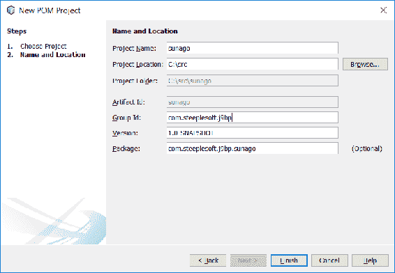
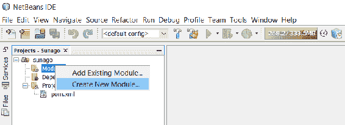
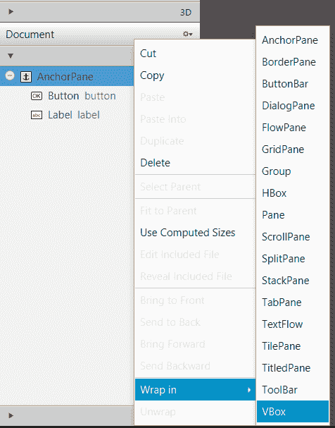
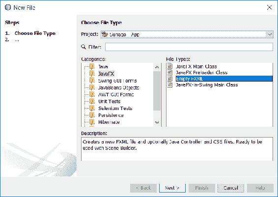
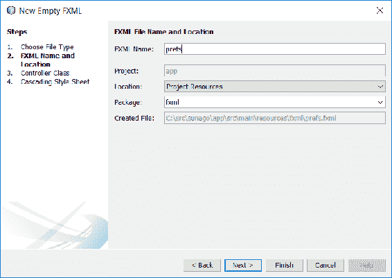
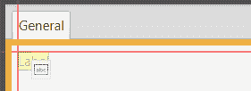

# 第二十三章：Sunago - 社交媒体聚合器

对于我们的下一个项目，我们将尝试做一些更具雄心的事情；我们将构建一个桌面应用程序，该程序从各种社交媒体网络中聚合数据，并在一次无缝交互中显示。我们还将尝试一些新事物，并给这个项目起一个名字，这个名字可能比我们迄今为止使用的干燥、尽管准确、但略显无趣的`描述转变为名称`更具吸引力。因此，这个应用程序，我们将称之为 Sunago，这是古希腊词（Koine）συνάγω的音译，其意为**我聚集在一起**、**收集**、**集合**。

构建应用程序将涵盖几个不同的主题，有些熟悉，有些新颖。该列表包括以下内容：

+   JavaFX

+   国际化和本地化

+   **服务提供者接口**（**SPI**）

+   消费 REST API

+   `ClassLoader`操作

+   Lambda，Lambda，还有更多的 Lambda

如同往常，这些只是亮点，其中穿插着许多有趣的项目。

# 开始

就像每个应用程序一样，在我们开始之前，我们需要考虑我们希望应用程序做什么。也就是说，功能需求是什么？从高层次上讲，描述告诉我们我们希望以广泛的方式实现什么，但更具体地说，我们希望用户能够做到以下事情：

+   连接到几个不同的社交媒体网络

+   在网络层面上确定要检索哪组数据（用户、列表等）

+   在综合显示中查看每个网络的项目列表

+   能够确定项目来自哪个网络

+   点击一个项目，并在用户的默认浏览器中加载它

除了这个应用程序**应该**做的事情的列表之外，它**不应该**做的事情包括以下内容：

+   对项目进行回应/回复

+   对项目进行评论

+   管理朋友/关注列表

这些功能将是应用程序的绝佳补充，但它们在基本应用程序的架构上并没有提供太多有趣的东西，所以为了保持简单——并且继续前进——我们将范围限制在给定的基本需求集。

那么，在应用程序中从哪里开始呢？就像前面的章节一样，我们将将其制作为一个桌面应用程序，所以让我们从这里开始，从 JavaFX 应用程序开始。我将在这里透露一点，以便稍后更容易：这将是一个多模块项目，因此我们首先需要创建父项目。在 NetBeans 中，点击文件 | 新建项目...，然后选择`Maven`类别，如下面的截图所示：



当你点击“完成”时，你会看到一个空项目。一旦我们向这个项目添加模块，区分它们可能会变得困难，所以我作为一个习惯的做法是给每个模块一个独特、具有“命名空间”的名称。也就是说，每个模块都有自己的名称，当然，但我会在其前面加上项目的名称。例如，由于这是项目的基 POM，我称之为 `Master`。为了反映这一点，我修改了生成的 POM，使其看起来像这样：

```java
    <?xml version="1.0" encoding="UTF-8"?> 
    <project   

      xsi:schemaLocation="http://maven.apache.org/POM/4.0.0  
      http://maven.apache.org/xsd/maven-4.0.0.xsd"> 
      <modelVersion>4.0.0</modelVersion> 
      <groupId>com.steeplesoft.sunago</groupId> 
      <artifactId>master</artifactId> 
      <version>1.0-SNAPSHOT</version> 
      <name>Sunago - Master</name> 
      <packaging>pom</packaging> 
    </project> 
```

目前这还没有什么。像这样的父 POM 给我们的优势是，如果我们愿意，我们可以用一个命令构建所有项目，并且我们可以将任何共享配置移动到这个共享父 POM 中以减少重复。不过，我们现在需要添加一个模块，NetBeans 会帮助我们做到这一点，如截图所示：



在点击“创建新模块...”后，你会看到一个熟悉的“新建项目”窗口，从那里你需要选择 Maven | JavaFX 应用程序，然后点击“下一步”。在“新建 Java 应用程序”屏幕中，输入 `app` 作为项目名称，然后点击“完成”（所有其他默认值都可以接受）。

再次，我们希望给这个模块一个有意义的名称，所以让我们按照以下方式修改生成的 `pom.xml`：

```java
    <?xml version="1.0" encoding="UTF-8"?> 
    <project   

      xsi:schemaLocation="http://maven.apache.org/POM/4.0.0  
      http://maven.apache.org/xsd/maven-4.0.0.xsd"> 
      <modelVersion>4.0.0</modelVersion> 
      <parent> 
        <groupId>com.steeplesoft.sunago</groupId> 
        <artifactId>master</artifactId> 
        <version>1.0-SNAPSHOT</version> 
      </parent> 
      <artifactId>sunago</artifactId> 
      <name>Sunago - App</name> 
      <packaging>jar</packaging> 
    </project> 
```

当 NetBeans 创建项目时，它会为我们生成几个工件——两个类，`FXMLController` 和 `MainApp`，以及资源，`fxml/Scene.xml` 和 `styles/Styles.css`。虽然这可能是显而易见的，但工件应该有能够清楚地传达其目的的名称，所以让我们重命名这些。

类 `FxmlContoller` 应该重命名为 `SunagoController`。可能最快、最简单的方法是在项目视图中双击打开它，然后在源编辑器中点击类声明中的类名，并按 *Ctrl* + *R*。应该会出现重命名类的对话框，在那里你需要输入新名称，然后按 *Enter*。这将为你重命名类和文件。现在重复这个过程，将 `MainApp` 重命名为 `Sunago`。

我们还希望将生成的 FXML 文件，`Scene.xml`，重命名为 `sunago.fxml`。要做到这一点，请在项目视图中右键单击文件，并在上下文菜单中选择“重命名...”。在重命名对话框中输入新名称（不带扩展名），然后按 *Enter*。在此期间，我们还可以将 `Styles.css` 重命名为 `styles.css`，以确保大小写一致。这是一件小事，但代码的一致性可以帮助你在未来有人接管你的代码时增强信心。

不幸的是，重命名这些文件并不会调整 Java 源中对它们的引用，所以我们需要编辑 `Sunago.java` 来指向这些新名称，操作方法如下：

```java
    @Override
    public void start(Stage stage) throws Exception {
      Parent root = fxmlLoader.load(
        getClass().getResource("/fxml/sunago.fxml"));

        Scene scene = new Scene(root);
        scene.getStylesheets().add("/styles/styles.css");

        stage.setTitle("Sunago, your social media aggregator");
        stage.setScene(scene);
        stage.show();
    }
```

注意，我们还把标题改成了更合适的内容。

# 设置用户界面

如果我们愿意，现在就可以运行我们的应用程序。这会很无聊，但它会运行。让我们试着解决无聊的部分。

默认创建的 FXML 只是一个带有两个子组件的 AnchorPane，一个按钮（Button）和一个标签（Label）。我们不需要这些，所以让我们去掉它们。我们的主要用户界面将会非常简单——基本上，只是一个组件的垂直堆叠——因此我们可以使用 VBox 作为我们的根组件。也许，将根组件从现有的 AnchorPane 更改为 VBox 的最简单方法就是使用 Scene Builder 将此组件包裹在 VBox 中，然后删除 AnchorPane：



要做到这一点，通过双击文件（假设您已正确配置 NetBeans，使其知道 Scene Builder 的位置）在 Scene Builder 中打开 FXML 文件。在 Scene Builder 中，在左侧折叠面板的文档部分右键单击 AnchorPane，选择“包裹”（Wrap in），然后选择 VBox，如前面的截图所示。然后 Scene Builder 将修改 FXML 文件，使 AnchorPane 成为 VBox 的子组件，正如预期的那样。完成之后，您可以在 AnchorPane 上右键单击，然后点击“删除”以删除它及其子组件。这将给我们留下一个比我们开始时更无聊的空用户界面。现在我们可以通过添加一些控件——一个菜单栏（MenuBar）和一个列表视图（ListView）——来修复它。通过在折叠面板的控件部分单击每个组件并将它们拖动到 VBox 中来实现这一点。如果您将组件放在 VBox 上，它们将被添加到其子组件列表中。确保菜单栏（MenuBar）在列表视图（ListView）之前，否则您将得到一个非常奇怪的界面。

在我们返回代码之前，现在让我们先配置这些组件。在左侧的文档部分选择 VBox，然后我们需要在右侧的折叠面板中选择布局部分。对于最小宽度（Min Width）和最小高度（Min Height），分别输入`640`和`480`。这将使窗口的默认尺寸更大，更用户友好。

对于菜单栏（MenuBar），我们需要展开其“文档”（Document）下的条目，然后展开其每个菜单子项（Menu children），这样每个菜单（Menu）都应该显示一个菜单项（MenuItem）。点击第一个菜单，然后在右侧，将“文本”（Text）设置为`_File`，并勾选“快捷键解析”。这将允许用户按下*Alt* + *F*来激活（或显示）此菜单。接下来，点击其`MenuItem`子项，将“文本”（Text）设置为`_Exit`，并勾选“快捷键解析”。（如果`Menu`、`MenuItem`、`Button`等文本中包含下划线，请确保已勾选“快捷键解析”。为了简洁起见，我不会再次明确指出这一点。）打开代码部分，并将“动作”（On Action）值设置为`closeApplication`。

第二个`Menu`应该将其文本值设置为`_Edit`。其`MenuItem`应标记为`_Settings`，并具有`showPreferences`的操作值。最后，第三个`Menu`应标记为`_Help`，其`MenuItem`标记为`About`，操作值为`showAbout`。

接下来，我们想要给`ListView`一个 ID，所以选择左侧的它，确保右侧的代码部分已展开，并输入`entriesListView`作为 fx:id。

我们最后需要做的编辑是将控制器设置好。我们在左侧的折页中这样做，在底部的控制器部分，然后展开它，确保控制器类值与我们在 NetBeans 中刚刚创建的 Java 类和包相匹配，然后保存文件。

# 设置控制器

回到 NetBeans，我们需要调整我们的控制器以反映我们在 FXML 中刚刚做出的更改。在`SunagoController`中，我们需要添加`entriesListView`属性，如下所示：

```java
    @FXML 
    private ListView<SocialMediaItem> entriesListView; 
```

注意参数化类型是`SocialMediaItem`。这是我们将在接下来的几分钟内创建的自定义模型。在我们着手处理之前，我们需要完成用户界面的连接。我们在 FXML 中定义了三个`onAction`处理程序。相应的代码如下：

```java
    @FXML 
    public void closeApplication(ActionEvent event) { 
      Platform.exit(); 
    } 
```

关闭应用程序就像在`Platform`类上调用`exit`方法一样简单。显示“关于”框也相当简单，正如我们在`showAbout`方法中看到的：

```java
    @FXML 
    public void showAbout(ActionEvent event) { 
      Alert alert = new Alert(Alert.AlertType.INFORMATION); 
      alert.setTitle("About..."); 
      alert.setHeaderText("Sunago (συνάγω)"); 
      alert.setContentText("(c) Copyright 2016"); 
      alert.showAndWait(); 
    } 
```

使用内置的`Alert`类，我们构建一个实例，并设置适合关于屏幕的值，然后通过`showAndWait()`以模态方式显示它。

预设窗口的逻辑要复杂得多，因此我们将其封装在一个新的控制器类中，并调用其`showAndWait()`方法。

```java
    @FXML 
    public void showPreferences(ActionEvent event) { 
      PreferencesController.showAndWait(); 
    } 
```

# 编写模型类

在我们查看它之前，主控制器中还有一些其他的项目需要我们处理。首先是之前提到的模型类，`SocialMediaItem`。正如你可能想象的那样，从社交网络返回的数据结构可能相当复杂，并且肯定多种多样。例如，推文的资料需求可能与 Instagram 帖子的需求大不相同。因此，我们希望能够在简单、可重用的接口后面隐藏这些复杂性和差异。在现实世界中，这样的简单抽象并不总是可能的，但在这里，我们有一个这样的接口在`SocialMediaItem`中，正如你在这段代码中可以看到的：

```java
    public interface SocialMediaItem { 
      String getProvider(); 
      String getTitle(); 
      String getBody(); 
      String getUrl(); 
      String getImage(); 
      Date getTimestamp(); 
    } 
```

抽象的一个问题是，为了使它们可重用，你偶尔必须以某种方式结构化它们，以便它们暴露出可能不被每个实现使用的属性。这还不明显，但这里确实是这样。这是有些人认为不可接受的情况，他们可能是有道理的，但这实际上是一个权衡的问题。我们的选择包括一个略微膨胀的接口或一个复杂的系统，其中每个网络支持模块（我们将在稍后讨论）提供自己的渲染器，并且应用程序必须查询每个模块，寻找可以处理每个项目的渲染器，同时在绘制`ListView`。当然，可能还有其他选择，但面对（至少）那两个，为了简单和性能，我们将选择第一个选项。然而，在设计你自己的系统时遇到类似情况时，你需要评估你项目的各种要求，并做出适当的选择。对于我们的需求，简单的方法已经足够了。

无论如何，每个社交媒体网络模块都将实现该接口来封装其数据。这将给应用程序提供一个通用的接口，以便消费，而无需确切知道它来自何处。然而，我们现在需要告诉`ListView`如何绘制包含`SocialMediaItem`的单元格。我们可以通过在控制器的`initialize()`方法中添加以下代码行来实现这一点，如下所示：

```java
    entriesListView.setCellFactory(listView ->  
      new SocialMediaItemViewCell()); 
```

显然，那是一个 lambda 表达式。对于好奇的人，前面方法的 lambda 版本看起来像这样：

```java
    entriesListView.setCellFactory( 
      new Callback<ListView<SocialMediaItem>,  
      ListCell<SocialMediaItem>>() {  
        @Override 
        public ListCell<SocialMediaItem> call( 
          ListView<SocialMediaItem> param) { 
            return new SocialMediaItemViewCell(); 
          } 
    }); 
```

# 完成控制器

在我们查看`SocialMediaItemViewCell`之前，还有两个控制器项目。第一个是包含`ListView`数据的列表。记住，`ListView`从`ObservableList`操作。这使得我们可以更改列表中的数据，并且它将自动反映在用户界面中。为了创建该列表，我们将在定义类属性时使用 JavaFX 辅助方法，如下所示：

```java
    private final ObservableList<SocialMediaItem> entriesList =  
      FXCollections.observableArrayList(); 
```

然后，我们需要将那个`List`连接到我们的`ListView`。回到`initialize()`，我们有以下内容：

```java
    entriesListView.setItems(entriesList); 
```

为了完成`SocialMediaItem`接口的渲染，让我们这样定义`SocialMediaItemViewCell`：

```java
    public class SocialMediaItemViewCell extends  
      ListCell<SocialMediaItem> { 
      @Override 
      public void updateItem(SocialMediaItem item, boolean empty) { 
        super.updateItem(item, empty); 
        if (item != null) { 
          setGraphic(buildItemCell(item)); 
          this.setOnMouseClicked(me -> SunagoUtil 
            .openUrlInDefaultApplication(item.getUrl())); 
        } else { 
            setGraphic(null); 
          } 
      } 

      private Node buildItemCell(SocialMediaItem item) { 
        HBox hbox = new HBox(); 
        InputStream resource = item.getClass() 
          .getResourceAsStream("icon.png"); 
        if (resource != null) { 
          ImageView sourceImage = new ImageView(); 
          sourceImage.setFitHeight(18); 
          sourceImage.setPreserveRatio(true); 
          sourceImage.setSmooth(true); 
          sourceImage.setCache(true); 
          sourceImage.setImage(new Image(resource)); 
          hbox.getChildren().add(sourceImage); 
        } 

        if (item.getImage() != null) { 
          HBox picture = new HBox(); 
          picture.setPadding(new Insets(0,10,0,0)); 
          ImageView imageView = new ImageView(item.getImage()); 
          imageView.setPreserveRatio(true); 
          imageView.setFitWidth(150); 
          picture.getChildren().add(imageView); 
          hbox.getChildren().add(picture); 
        } 

        Label label = new Label(item.getBody()); 
        label.setFont(Font.font(null, 20)); 
        label.setWrapText(true); 
        hbox.getChildren().add(label); 

        return hbox; 
      } 

    } 
```

这里发生了很多事情，但`updateItem()`是我们关注的第一个点。这是每次屏幕上行的更新都会调用的方法。注意，我们检查`item`是否为 null。我们这样做是因为`ListView`调用此方法不是针对其`List`中的每个项目，而是针对`ListView`中每个可见的行，无论是否有数据。这意味着，如果`List`有五个项目，但`ListView`足够高以显示十行，则此方法将被调用十次，最后五次调用将使用 null 的`item`。在这些情况下，我们调用`setGraphic(null)`来清除可能之前已渲染的任何项目。

然而，如果 `item` 不为空，我们需要构建用于显示项目的 `Node`，这通过 `buildItemCell()` 完成。对于每个项目，我们希望渲染三个项目——社交媒体网络图标（这样用户可以一眼看出项目来自哪里），项目内嵌入的任何图像，以及最后，项目中的任何文本/标题。为了帮助安排这些，我们从一个 `HBox` 开始。

接下来，我们尝试找到一个网络图标。如果我们有一个正式的合同，我们会在其中包含一些语言，规定模块应包含一个名为 `icon.png` 的文件，该文件与模块的 `SocialMediaItem` 实现位于同一包中。然后，使用实现用的 `ClassLoader`，我们尝试获取资源的 `InputStream`。我们检查 null，只是为了确保实际上找到了图像；如果是这样，我们创建一个 `ImageView`，设置一些属性，然后将资源包裹在一个 `Image` 中，将其交给 `ImageView`，然后将 `ImageView` 添加到 `HBox`。

# 为项目添加图像

如果项目有一个图像，我们以与网络图标图像相同的方式处理它。不过，这次我们在将其添加到外部的 `HBox` 之前，实际上是将 `ImageView` 包裹在一个另一个 `HBox` 中。我们这样做是为了可以在图像周围添加填充（通过 `picture.setPadding(new Insets()`)），给这个图像和网络图标之间留出一些空间。

最后，我们创建一个 `Label` 来持有项目的主体。我们通过 `label.setFont(Font.font(null, 20))` 将文本的字体大小设置为 `20` 点，并将其添加到我们的 `HBox` 中，然后将其返回给调用者 `updateItem()`。

每次当你有一个 `ListView` 时，你很可能会想要一个自定义的 `ListCell` 实现，就像我们这里所做的那样。在某些情况下，在 `List` 内容上调用 `toString()` 可能是合适的，但并不总是如此，而且你当然不能像我们这里这样拥有一个复杂的 `ListCell` 结构，而不自己实现 `ListCell`。如果你计划进行大量的 JavaFX 开发，那么熟悉这项技术是非常明智的。

# 构建首选项用户界面

我们最终完成了主要控制器，现在我们可以将注意力转向下一个大块，`PreferencesController`。我们的首选项对话框将像通常预期的那样是一个模态对话框。它将提供一个带有标签页的界面，其中一个标签页用于常规设置，然后为每个受支持的社会网络提供一个标签页。我们通过向我们的项目中添加一个新的 FXML 文件和控制器来开始这项工作，NetBeans 有一个很好的向导来完成这个任务。在所需的包上右键单击，然后点击新建 | 其他。从类别列表中，选择 `JavaFX`，然后从文件类型列表中选择 `Empty FXML`，如以下截图所示：



点击下一步后，你应该会看到 FXML 名称和位置步骤。这将允许我们指定新文件的名字和创建它的包，如以下截图所示：



点击“下一步”将带我们进入控制器类步骤。在这里，我们可以创建一个新的控制器类，或者将我们的文件附加到现有的一个上。由于这是一个我们应用的新对话框/窗口，我们需要创建一个新的控制器，如下所示：


选择“使用 Java 控制器”复选框，输入`PreferencesController`作为名称，并选择所需的包。我们可以点击“下一步”，这将带我们进入层叠样式表步骤，但我们对此控制器不感兴趣，所以，我们通过点击“完成”结束向导，这将带我们到我们新创建的控制器类的源代码。

让我们从布局用户界面开始。双击新的`prefs.fxml`文件，在 Scene Builder 中打开它。像我们上一个 FXML 文件一样，默认的根元素是 AnchorPane。对于这个窗口，我们希望使用 BorderPane，所以我们使用上次同样的技术来替换 AnchorPane--右键单击组件，然后点击“包裹在 | BorderPane”。AnchorPane 现在嵌套在 BorderPane 中，所以我们再次右键单击它并选择删除。

要构建用户界面，我们现在从左侧的折叠面板中拖动一个 TabPane 控件，并将其放入 BorderPane 的中心区域。这将向我们的用户界面添加一个带有两个标签的 TabPane。我们现在只需要一个，所以删除第二个。我们希望给标签一个有意义的名称。我们可以通过在预览窗口中双击标签（或在检查器的属性部分选择文本属性）并输入“通用”来实现。最后，展开检查器的代码部分，输入`tabPane`作为 fx:id。

现在，我们需要提供一个用户可以关闭窗口并保存或丢弃更改的方法。我们通过将 ButtonBar 组件拖到我们的 border pane 的底部区域来实现这一点。这将添加一个带有单个按钮的 ButtonBar，但我们需要两个，所以我们将另一个按钮拖到 ButtonBar 上。这个控件的好处是它会为我们处理按钮位置和填充，所以，当我们放下新按钮时，它将自动添加到正确的右侧位置。（这种行为可以被覆盖，但它工作得正好符合我们的要求，所以我们只需接受默认设置。）

对于每个“按钮”，我们需要设置三个属性--`text`、`fx:id`和`onAction`。第一个属性在检查器的属性部分，最后两个在代码部分。第一个按钮的值是“保存”、`savePrefs`和`savePreferences`。对于第二个按钮，值是“取消”、`cancel`和`closeDialog`。在检查器中选择`ButtonBar`的布局部分，并将右填充设置为 10，以确保“按钮”不会压在窗口的边缘上。

最后，我们将添加我们目前唯一的偏好设置。我们希望允许用户指定从每个社交媒体网络获取的请求的最大项目数。对于那些应用程序已经有一段时间（或从未）未被使用的情况，我们这样做。在这些情况下，我们不想尝试下载成千上万的推文。为了支持这一点，我们添加了两个控件，`Label` 和 `TextField`。

获取标签控件的位置相当简单，因为它是第一个组件。Scene Builder 将提供红色指南线来帮助你将组件精确地放置到你想要的位置，如图所示：



确保 `TextField` 与标签对齐可能会有些棘手。默认情况下，当你将组件拖放到 TabPane 上时，Scene Builder 会添加一个 AnchorPane 来容纳新组件。HBox 可能是一个更好的选择，但我们将继续使用 AnchorPane 来演示 Scene Builder 的这个功能。如果你将一个 `TextField` 拖放到 TabPane 上并尝试定位它，你应该会看到更多的红色线条出现。定位正确时，你应该会看到一条红色线条穿过标签和 `TextField` 的中间，表明两个组件垂直对齐。这正是我们想要的，所以确保 `TextField` 和标签之间有一个小空间，并将其放下。

我们需要给标签一些有意义的文本，所以在预览窗口中双击它，并输入 `Number of items to retrieve`。我们还需要给 `TextField` 一个 ID，以便我们可以与之交互，所以点击该组件，在检查器中展开代码部分，并将 fx:id 设置为 `itemCount`。

我们的用户界面虽然基础，但现在我们已经尽可能完善了，所以保存文件，关闭 Scene Builder，并返回到 NetBeans。

# 保存用户偏好

为了使我们的新定义的用户界面能够连接到我们的控制器，我们需要创建实例变量来匹配控件与设置的 `fx:id` 属性，因此，我们将这些添加到 `PreferencesController` 中，如下所示：

```java
    @FXML 
    protected Button savePrefs; 
    @FXML 
    protected Button cancel; 
    @FXML 
    protected TabPane tabPane; 
```

在 `initialize()` 方法中，我们需要为我们的 `itemCount` 字段添加支持加载已保存的值，因此我们需要稍微谈谈偏好设置。

Java 作为一种通用语言，使得编写任何你能够想象到的偏好存储策略成为可能。幸运的是，它还提供了一些不同的标准 API，允许你以更易于移植的方式实现，这些是 `Preferences` 和 `Properties`。

`java.util.Properties`类自 JDK 1.0 版本以来就存在了，尽管其基本、无装饰的 API 可能让人一目了然，但它仍然是一个非常有用的抽象。在本质上，`Properties`是一个`Hashtable`实现，其中添加了从输入流和读取器加载数据的方法，以及将数据写入输出流和写入器的方法（除了其他一些相关方法）。所有的属性都被视为带有`String`键的`String`值。由于`Properties`是一个`Hashtable`，您仍然可以使用`put()`和`putAll()`来存储非字符串数据，但如果你调用`store()`，这将导致`ClassCastException`，因此，最好避免这样做。

`java.util.prefs.Preferences`类是在 Java 1.4 中添加的，它是一个更加现代的 API。与属性不同，我们必须单独处理持久性，而偏好则为我们隐式地处理了这一点——我们不需要担心它是如何或何时被写入的。实际上，设置偏好的调用可能立即返回，而实际的持久化可能要过一段时间才会发生。`Preferences` API 的契约保证，即使在 JVM 关闭的情况下，偏好也会被持久化，前提是这是一个正常、有序的关闭（根据定义，如果 JVM 进程突然死亡，能做的事情很少）。

此外，用户也不必担心如何保存偏好设置。实际的底层存储是一个特定实现的细节。它可能是一个平面文件、特定于操作系统的注册表、数据库或某种目录服务器。对于好奇的人来说，实际的实现是通过在`java.util.prefs.PreferencesFactory`系统属性中指定类名来选择的。如果没有定义，系统将查找文件`META-INF/services/java.util.prefs.PreferencesFactory`（这是一种称为 SPI 的机制，我们将在稍后深入探讨），并使用那里定义的第一个类。最后，如果这些都失败了，将加载并使用底层平台的实现。

那么，应该选择哪一个呢？两者都可以像另一个一样工作，但你必须决定你是否想要控制信息存储的位置（`Properties`）或者实现上的简便（`Preferences`）。在某种程度上，可移植性也可能是一个考虑因素。例如，如果你有在某种移动或嵌入式设备上运行的 Java 代码，你可能没有权限写入文件系统，甚至可能根本不存在文件系统。为了展示这两个实现可能有多么相似，我们将实现这两个。

为了把我的观点摆得更加清楚，我希望尽可能多的代码可以在 Android 环境中重用。为了帮助实现这一点，我们将创建一个非常简单的接口，如下所示：

```java
    public interface SunagoPreferences { 
      String getPreference(String key); 
      String getPreference(String key, String defaultValue); 
      Integer getPreference(String key, Integer defaultValue); 
      void putPreference(String key, String value); 
      void putPreference(String key, Integer value); 
    } 
```

我们只处理字符串和整数，因为应用的需求相当基础。接口定义好了，我们如何获取实现类的引用？为此，我们将使用我们已经简要提到过的技术——服务提供者接口（SPI）。

# 使用服务提供者接口的插件和扩展

当我们查看 `Preferences` 类以及实现的选择和加载方式时，我们已经提到了 SPI，但具体是什么呢？服务提供者接口是一个相对通用的术语，指的是第三方可以实现的接口（或者一个可以扩展的类，无论是否为抽象类），以提供额外功能、替换现有组件等。

简而言之，目标系统（例如，在我们之前的例子中就是 JDK 本身）的作者定义并发布了一个接口。理想情况下，这个系统会提供一个默认实现，但在所有情况下这并非必需。任何感兴趣的第三方都可以实现这个接口，注册它，然后目标系统就可以加载并使用它。这种方法的优点之一是目标系统可以很容易地扩展，而不需要与第三方耦合。也就是说，虽然第三方通过接口了解目标系统，但目标系统对第三方一无所知。它只是在操作它定义的接口。

这些第三方插件是如何在目标系统中注册的？第三方开发者会创建一个文本文件，使用特定目录中的特定文件。文件名与要实现的接口同名。以 `Preferences` 类的例子来说，将实现 `java.util.prefs.PreferencesFactory` 接口，因此文件名将是这个，它将位于库类路径根目录下的 `META-INF/services` 目录中。在一个基于 Maven 的项目中，该文件将在 `src/main/resources/META-INF/services` 中找到。文件只包含实现接口的类的名称。服务文件中也可以列出多个类，每个类占一行。但是否使用这些类取决于消费系统。

所有这些对我们来说意味着什么呢？如前所述，我们将难得地展示多个 `Preferences` 支持的实现。这两个类都足够小，我们可以展示 `Properties` 和 `Preferences` 的用法，并使用 SPI 来选择一个使用。

让我们从基于 `Properties` 的实现开始：

```java
    public class SunagoProperties implements SunagoPreferences { 
      private Properties props = new Properties(); 
      private final String FILE = System.getProperty("user.home")  
        + File.separator + ".sunago.properties"; 

      public SunagoProperties() { 
        try (InputStream input = new FileInputStream(FILE)) { 
          props.load(input); 
        } catch (IOException ex) { 
        } 
    } 
```

在前面的代码中，我们首先实现了我们的 `SunagoPreferences` 接口。然后我们创建了一个 `Properties` 类的实例，我们还定义了一个文件名和位置的常量，我们将它以系统无关的方式放在用户的家目录中。

# 使用 try-with-resources 处理资源

构造函数显示了之前没有讨论的有趣之处--try-with-resources。在 Java 8 之前，你可能写成这样：

```java
    public SunagoProperties(int a) { 
      InputStream input = null; 
      try { 
        input = new FileInputStream(FILE); 
        props.load(input); 
      } catch  (IOException ex) { 
        // do something 
      } finally { 
          if (input != null) { 
            try { 
                input.close(); 
            } catch (IOException ex1) { 
                Logger.getLogger(SunagoProperties.class.getName()) 
                  .log(Level.SEVERE, null, ex1); 
            } 
          } 
        } 
    } 
```

之前的代码非常冗长，它在外部声明了一个`InputStream`，然后在`try`块中对其进行一些操作。在`finally`块中，我们尝试关闭`InputStream`，但首先必须检查它是否为 null。如果，比如说，文件不存在（这不会是第一次创建此类），将会抛出异常，并且`input`将为 null。如果不是 null，我们可以在它上面调用`close()`，但那可能会抛出`IOException`，因此我们必须将其包裹在一个`try/catch`块中。

Java 8 引入了 try-with-resources 构造，这使得代码更加简洁。如果一个对象是`AutoCloseable`的实例，那么它可以在`try`声明中定义，并且当`try`块的作用域结束时，无论是否抛出`Exception`，它都会自动关闭。这允许我们将原本可能需要十四行代码的功能，用四行代码表达，并且噪音更少。

除了`AutoCloseable`之外，请注意，我们通过`Properties.load(InputStream)`将文件中的任何现有值加载到我们的`Properties`实例中。

接下来，我们看到的是相当直接的 getter 和 setter 方法：

```java
    @Override 
    public String getPreference(String key) { 
      return props.getProperty(key); 
    } 

    @Override 
    public String getPreference(String key, String defaultValue) { 
      String value = props.getProperty(key); 
      return (value == null) ? defaultValue : value; 
    } 

    @Override 
    public Integer getPreference(String key, Integer defaultValue) { 
      String value = props.getProperty(key); 
      return (value == null) ? defaultValue :  
        Integer.parseInt(value); 
    } 

    @Override 
    public void putPreference(String key, String value) { 
      props.put(key, value); 
      store(); 
    } 

    @Override 
    public void putPreference(String key, Integer value) { 
      if (value != null) { 
        putPreference(key, value.toString()); 
      } 
    } 
```

最终的方法是将我们的偏好写回的方法，具体如下：

```java
    private void store() { 
      try (OutputStream output = new FileOutputStream(FILE)) { 
        props.store(output, null); 
      } catch (IOException e) { } 
    } 
```

最后这种方法看起来很像我们的构造函数，但我们创建了一个`OutputStream`，并调用`Properties.store(OutputStream)`将我们的值写入文件。请注意，我们从每个 put 方法中调用此方法，以确保尽可能忠实地将用户偏好持久化到磁盘。

基于偏好的实现看起来会是什么样子？并没有太大的不同。

```java
    public class SunagoPreferencesImpl implements SunagoPreferences { 
      private final Preferences prefs = Preferences.userRoot() 
        .node(SunagoPreferencesImpl.class.getPackage() 
        .getName()); 
      @Override 
      public String getPreference(String key) { 
        return prefs.get(key, null); 
      } 
      @Override 
      public String getPreference(String key, String defaultValue) { 
        return prefs.get(key, defaultValue); 
      } 

      @Override 
      public Integer getPreference(String key,Integer defaultValue){ 
        return prefs.getInt(key, defaultValue); 
      } 
      @Override 
      public void putPreference(String key, String value) { 
        prefs.put(key, value); 
      } 
      @Override 
      public void putPreference(String key, Integer value) { 
        prefs.putInt(key, value); 
      } 
    } 
```

有两点需要注意。首先，我们不需要处理持久化，因为`Preferences`会为我们处理。其次，`Preferences`实例的创建需要一些注意。显然，我认为，我们希望这些偏好是针对用户的，所以我们从`Preferences.userRoot()`开始，以获取根偏好节点。然后我们请求存储我们偏好的节点，我们选择将其命名为我们的类的包名。

这会将事情置于何处？在 Linux 上，文件可能看起来像这样 ``~/.java/.userPrefs/_!':!bw"t!#4!cw"0!'`!~@"w!'w!~@"z!'8!~g"0!#4!ag!5!')!c!!u!(:!d@"u!'%!~w"v!#4!}@"w!(!=/prefs.xml``（是的，这是一个目录名）。在 Windows 上，这些偏好被保存在 Windows 注册表的`HKEY_CURRENT_USERSOFTWAREJavaSoftPrefscom.steeplesoft.sunago.app`键下。不过，除非你想直接与这些文件交互，否则它们的精确位置和格式仅仅是实现细节。有时，了解这些也是一件好事。

我们有两个实现，那么我们如何选择使用哪一个呢？在文件（包括为了清晰起见的源根）`src/main/resources/META-INF/service/com.steeplesoft.sunago.api.SunagoPreferences`中，我们可以放置以下两条中的一条：

```java
    com.steeplesoft.sunago.app.SunagoPreferencesImpl 
    com.steeplesoft.sunago.app.SunagoProperties 
```

你可以列出两者，但只会选择第一个，我们现在就会看到这一点。为了简化问题，我们将其封装在一个实用方法中，如下所示：

```java
    private static SunagoPreferences preferences; 
    public static synchronized 
          SunagoPreferences getSunagoPreferences() { 
        if (preferences == null) { 
          ServiceLoader<SunagoPreferences> spLoader =  
            ServiceLoader.load(SunagoPreferences.class); 
          Iterator<SunagoPreferences> iterator = 
            spLoader.iterator(); 
          preferences = iterator.hasNext() ? iterator.next() : null; 
        } 
        return preferences; 
    } 
```

在这里可能有点过度，我们通过将`SunagoPreferences`接口的实例声明为私有静态，并通过一个同步方法使其可用，该方法检查`null`并在需要时创建实例，来实现了一个单例。

虽然这很有趣，但不要让它分散你对方法核心的注意力。我们使用`ServiceLoader.load()`方法向系统请求`SunagoPreferences`接口的任何实现。再次强调，为了明确，它不会在系统中选择**任何**实现，而**只有**那些在我们之前描述的服务文件中列出的实现。使用`ServiceLoader<SunagoPreferences>`实例，我们获取一个迭代器，如果它有一个条目（`iterator.hasNext()`），我们就返回该实例（`iterator.next()`）。如果没有，我们返回`null`。这里有一个`NullPointerException`的风险，因为我们正在返回`null`，但我们也在提供一个实现，因此避免了这种风险。然而，在你的代码中，你需要确保你有实现，就像我们在这里所做的那样，或者确保消费代码已经准备好处理`null`。

# 添加网络 - Twitter

到目前为止，我们有一个相当基础的应用程序，它可以保存和加载其首选项，但让我们回到我们在这里的目的，开始连接到社交网络。我们希望开发一个框架，使其能够轻松地添加对不同社交网络的支持。技术上，正如我们很快就会看到的，**网络**甚至不需要是社交的，因为唯一表明特定类型源的是涉及的类和接口的名称。然而，实际上，我们将专注于社交网络，我们将使用几个不同的网络来展示一些多样性。为此，我们将从 Twitter 开始，这是一个广受欢迎的微博平台，以及 Instagram，这是一个越来越以照片为中心的网络，现在它是 Facebook 的一部分。

说到 Facebook，为什么我们不展示与该社交网络的集成呢？两个原因——一是它与 Twitter 没有显著的不同，所以没有太多新内容可以介绍；二是最重要的是，Facebook 提供的权限使得以我们感兴趣的方式与之集成几乎是不可能的。例如，读取用户主页时间线（或墙）的权限仅授予针对那些 Facebook 目前不可用的平台的应用程序，而完全不授予桌面应用程序，这是我们在这里的目标。

如前所述，我们希望提供一个方法来添加更多网络，而无需更改核心应用程序，因此我们需要开发一个 API。在这里我们将讨论这个 API 的大致**完成**状态（任何软件真的有完成的时候吗？）。然而，虽然你会看到一个相当完整的 API，但有一个警告——试图从那个抽象开始创建抽象——也就是说，从头开始编写抽象——很少会有好结果。通常最好编写一个具体的实现来更好地理解所需的细节，然后提取抽象。你在这里看到的是这个过程的结果，因此这个过程不会在这里进行深入讨论。

# 注册为 Twitter 开发者

要创建一个与 Twitter 集成的应用程序，我们需要创建一个 Twitter 开发者账户，然后创建一个 Twitter 应用程序。为了创建账户，我们需要访问[`dev.twitter.com`](https://dev.twitter.com/)，并点击加入按钮。一旦你创建了你的开发者账户，你可以点击“我的应用”链接进入[`apps.twitter.com`](https://apps.twitter.com/)。在这里，我们需要点击创建新应用按钮，这将带我们到一个看起来有点像这样的表单：


虽然我们正在开发的应用程序名为*Sunago*，但你无法使用这个名字，因为它已经被占用；你必须创建一个你自己的独特名称，假设你打算自己运行这个应用程序。一旦你创建了应用程序，你将被带到新应用的应用管理页面。从该页面，你可以管理你应用的权限和密钥，如果需要，你也可以删除你的应用。

在这个页面上需要注意的一件事，因为我们很快就会用到，就是如何找到你应用的消费者密钥和密钥。这些是长数字字母字符串，你的应用将使用它们来与 Twitter 的服务进行身份验证。为了代表用户与 Twitter 交互——我们的最终目标——需要另一组令牌，我们很快就会获取。你的消费者密钥和密钥——特别是消费者密钥——应该保密。如果这个组合被公开泄露，其他用户将能够冒充你的应用，如果他们滥用服务，可能会给你带来严重的麻烦。因此，你不会在任何地方看到我生成的密钥/密钥组合，无论是这本书还是源代码中，这就是为什么你需要生成自己的原因。

现在我们已经拥有了消费者密钥和密钥，我们需要决定如何与 Twitter 进行通信。Twitter 提供了一个公共 REST API，他们在网站上进行了文档说明。如果我们愿意，我们可以选择某种 HTTP 客户端，并开始进行调用。然而，出于简单性、清晰性、健壮性、容错性等方面的考虑，我们可能更倾向于使用某种高级库。幸运的是，确实存在这样一个库，即 Twitter4J，它将使我们的集成变得更加简单和干净（对于好奇的人来说，Twitter4J 有 200 多个 Java 类。虽然我们不需要所有通过 REST API 表示并公开的功能，但它应该能给你一个编写 Twitter REST 接口合理包装所需工作范围的印象）。

如前所述，我们希望在不需要更改核心应用程序的情况下将网络添加到 Sunago 中，因此我们将编写我们的 Twitter 集成到一个单独的 Maven 模块中。这将要求我们将为 Sunago 编写的部分代码提取到另一个模块中。然后，我们的 Twitter 模块和主要应用程序模块将添加对这个新模块的依赖。由于我们将有多个模块在运行，我们将确保指出每个类属于哪个模块。完成之后，我们的项目依赖关系图将如下所示：


从技术上讲，我们之所以在应用程序模块和 Instagram 以及 Twitter 模块之间显示依赖关系，是因为我们将它们作为同一项目的一部分构建。正如我们将看到的，第三方开发者可以轻松地开发一个独立的模块，将其添加到应用程序的运行时类路径中，并看到应用程序中的变化，而无需这种构建级别的依赖。然而，希望这个图能帮助解释模块之间的关系。

# 将 Twitter 偏好添加到 Sunago

让我们从向我们的偏好屏幕添加 Twitter 开始。在我们能够进行任何集成之前，我们需要能够配置应用程序，或者更准确地说，Twitter 模块，以便它可以以特定用户身份连接。为了实现这一点，我们将向 API 模块添加一个新接口，如下所示：

```java
    public abstract class SocialMediaPreferencesController { 
      public abstract Tab getTab(); 
      public abstract void savePreferences(); 
    } 
```

此接口将为 Sunago 提供两个钩子进入模块——一个让模块有机会绘制自己的偏好用户界面，另一个允许它保存这些偏好。然后我们可以在我们的模块中实现这一点。在我们这样做之前，让我们看看应用程序将如何找到这些实现，以便它们可以被使用。为此，我们再次转向 SPI。在 Sunago 的`PreferencesController`接口中，我们添加以下代码：

```java
    private List<SocialMediaPreferencesController> smPrefs =  
      new ArrayList<>(); 
    @Override 
    public void initialize(URL url, ResourceBundle rb) { 
      itemCount.setText(SunagoUtil.getSunagoPreferences() 
       .getPreference(SunagoPrefsKeys.ITEM_COUNT.getKey(), "50")); 
      final ServiceLoader<SocialMediaPreferencesController>  
       smPrefsLoader = ServiceLoader.load( 
         SocialMediaPreferencesController.class); 
       smPrefsLoader.forEach(smp -> smPrefs.add(smp)); 
       smPrefs.forEach(smp -> tabPane.getTabs().add(smp.getTab())); 
    } 
```

我们有一个实例变量来保存我们找到的任何`SocialMediaPreferencesController`实例。接下来，在`initialize()`中，我们调用熟悉的`ServiceLoader.load()`方法来查找任何实现，然后将它们添加到我们之前创建的`List`中。一旦我们有了控制器的列表，我们就对每个控制器调用`getTab()`，将返回的`Tab`实例添加到`PreferencesController`接口的`tabPane`中。

在澄清了加载部分之后，现在让我们看看 Twitter 首选项用户界面实现。我们首先实现将支持这个用户界面部分的控制器，如下所示：

```java
    public class TwitterPreferencesController  
      extends SocialMediaPreferencesController { 
        private final TwitterClient twitter; 
        private Tab tab; 

        public TwitterPreferencesController() { 
          twitter = new TwitterClient(); 
        } 

        @Override 
        public Tab getTab() { 
          if (tab == null) { 
            tab = new Tab("Twitter"); 
            tab.setContent(getNode()); 
          } 

          return tab; 
    } 
```

我们将在稍后查看`TwitterClient`，但首先，关于`getTab()`的一个说明。请注意，我们创建了需要返回的`Tab`实例，但我们将其内容的创建委托给`getNode()`方法。`Tab.setContent()`允许我们通过单个调用完全替换标签页的内容，这是我们将在下面使用的东西。`getNode()`方法看起来像这样：

```java
    private Node getNode() { 
      return twitter.isAuthenticated() ? buildConfigurationUI() : 
        buildConnectUI(); 
    } 
```

如果用户已经进行了身份验证，那么我们想要展示一些配置选项。如果没有，那么我们需要提供一种连接到 Twitter 的方法。

```java
    private Node buildConnectUI() { 
      HBox box = new HBox(); 
      box.setPadding(new Insets(10)); 
      Button button = new Button(MessageBundle.getInstance() 
       .getString("connect")); 
      button.setOnAction(event -> connectToTwitter()); 

      box.getChildren().add(button); 

      return box; 
    } 
```

在这个简单的用户界面中，我们创建一个`HBox`主要是为了添加一些填充。如果没有传递给`setPadding()`方法的`new Insets(10)`实例，我们的按钮就会紧贴窗口的顶部和左侧边缘，这从视觉上并不吸引人。接下来，我们创建`Button`，并设置`onAction`处理程序（现在忽略那个构造函数参数）。

有趣的部分隐藏在`connectToTwitter`中，如下代码所示：

```java
    private void connectToTwitter() { 
      try { 
        RequestToken requestToken =  
          twitter.getOAuthRequestToken(); 
        LoginController.showAndWait( 
          requestToken.getAuthorizationURL(), 
           e -> ((String) e.executeScript( 
             "document.documentElement.outerHTML")) 
              .contains("You've granted access to"), 
               e -> { 
                 final String html =  
                   "<kbd aria-labelledby="code-desc"><code>"; 
                    String body = (String) e.executeScript( 
                      "document.documentElement.outerHTML"); 
                    final int start = body.indexOf(html) +  
                     html.length(); 
                    String code = body.substring(start, start+7); 
                    saveTwitterAuthentication(requestToken, code); 
                    showConfigurationUI(); 
               }); 
      } catch (TwitterException ex) { 
        Logger.getLogger(getClass().getName()) 
          .log(Level.SEVERE, null, ex); 
      } 
    } 
```

# OAuth 和登录到 Twitter

我们将在稍后绕道进入`LoginController`，但首先，让我们确保我们理解这里发生了什么。为了代表用户登录 Twitter，我们需要生成一个 OAuth 请求令牌，从中我们可以获取一个授权 URL。这些细节被 Twitter4J API 很好地隐藏起来，但基本上，这是在应用程序管理页面上列出的 OAuth 授权 URL，请求令牌作为查询字符串传递。正如我们将看到的，这个 URL 将在`WebView`中打开，提示用户对 Twitter 进行身份验证并授权应用程序（或拒绝）：


如果用户成功身份验证并授权应用程序，`WebView`将被重定向到成功页面，该页面显示一个我们需要捕获的数字代码，以完成收集所需的身份验证/授权凭据。成功页面可能看起来像这样：


对于不熟悉 OAuth 的人来说，这允许我们作为用户进行认证，现在和未来的任意时刻，而无需存储用户的实际密码。我们应用程序与 Twitter 之间握手的结果是一个令牌和令牌密钥，我们将将其传递给 Twitter 以进行认证。只要这个令牌有效（用户可以通过 Twitter 的网页界面随时使其无效），我们就可以连接并代表该用户进行操作。如果密钥遭到破坏，用户可以撤销密钥，这只会影响预期的应用程序和任何试图使用被盗密钥的人。

`LoginController` 是 API 模块的一部分，为我们处理所有样板代码，如下代码所示：

```java
    public class LoginController implements Initializable { 
      @FXML 
      private WebView webView; 
      private Predicate<WebEngine> loginSuccessTest; 
      private Consumer<WebEngine> handler; 

      public static void showAndWait(String url,  
       Predicate<WebEngine> loginSuccessTest, 
       Consumer<WebEngine> handler) { 
         try { 
           fxmlLoader loader = new fxmlLoader(LoginController 
             .class.getResource("/fxml/login.fxml")); 

           Stage stage = new Stage(); 
           stage.setScene(new Scene(loader.load())); 
           LoginController controller =  
              loader.<LoginController>getController(); 
           controller.setUrl(url); 
           controller.setLoginSuccessTest(loginSuccessTest); 
           controller.setHandler(handler); 

           stage.setTitle("Login..."); 
           stage.initModality(Modality.APPLICATION_MODAL); 

           stage.showAndWait(); 
         } catch (IOException ex) { 
           throw new RuntimeException(ex); 
         } 
    } 
```

上述代码是一个基本的 FXML 支持的 JavaFX 控制器，但我们确实有一个静态辅助方法来处理创建、配置和显示实例的细节。我们使用 FXML 加载场景，获取控制器（它是封装类的实例），设置 `loginSuccessTest` 和 `handler` 属性，然后显示对话框。

`loginSuccessTest` 和 `handler` 看起来奇怪吗？它们是 Java 8 函数式接口 `Predicate<T>` 和 `Consumer<T>` 的实例。`Predicate` 是一个函数式接口，它接受一个类型，在我们的例子中是 `WebEngine`，并返回一个 `boolean`。它旨在检查给定指定类型的变量是否满足某种条件。在这个例子中，我们调用 `WebEngine.executeScript().contains()` 来提取文档的一部分，并查看它是否包含表示我们已被重定向到登录成功页面的特定文本。

`Consumer<T>` 是一个函数式接口（或者在我们的情况下，是一个 lambda），它接受指定类型的单个参数，并返回 void。我们的处理器是一个 `Consumer`，当 `Predicate` 返回 true 时被调用。lambda 从 HTML 页面提取代码，调用 `saveTwitterAuthentication()` 以完成用户认证，然后调用 `showConfigurationUI()` 来更改用户界面，以便用户可以配置与 Twitter 相关的设置。

方法 `saveTwitterAuthentication()` 非常直接，具体如下所示：

```java
    private void saveTwitterAuthentication(RequestToken requestToken,
     String code) { 
       if (!code.isEmpty()) { 
         try { 
           AccessToken accessToken = twitter 
             .getAcccessToken(requestToken, code); 
           prefs.putPreference(TwitterPrefsKeys.TOKEN.getKey(),  
             accessToken.getToken()); 
           prefs.putPreference(TwitterPrefsKeys.TOKEN_SECRET.getKey(),  
             accessToken.getTokenSecret()); 
         } catch (TwitterException ex) { 
           Logger.getLogger(TwitterPreferencesController 
             .class.getName()).log(Level.SEVERE, null, ex); 
         } 
       } 
    } 
```

方法 `twitter.getAccessToken()` 接收我们的请求令牌和从网页中提取的代码，并向 Twitter REST 端点发送一个 HTTP `POST` 请求，生成我们需要的令牌密钥。当这个请求返回时，我们将令牌和令牌密钥存储到我们的 `Preferences` 存储中（同样，对此一无所知）。

方法 `showConfigurationUI()` 以及相关方法也应该很熟悉。

```java
    private void showConfigurationUI() { 
      getTab().setContent(buildConfigurationUI()); 
    } 
    private Node buildConfigurationUI() { 
      VBox box = new VBox(); 
      box.setPadding(new Insets(10)); 

      CheckBox cb = new CheckBox(MessageBundle.getInstance() 
        .getString("homeTimelineCB")); 
      cb.selectedProperty().addListener( 
        (ObservableValue<? extends Boolean> ov,  
          Boolean oldVal, Boolean newVal) -> { 
            showHomeTimeline = newVal; 
          }); 

      Label label = new Label(MessageBundle.getInstance() 
        .getString("userListLabel") + ":"); 

      ListView<SelectableItem<UserList>> lv = new ListView<>(); 
      lv.setItems(itemList); 
      lv.setCellFactory(CheckBoxListCell.forListView( 
        item -> item.getSelected())); 
      VBox.setVgrow(lv, Priority.ALWAYS); 

      box.getChildren().addAll(cb, label, lv); 
      showTwitterListSelection(); 

      return box;
    } 
```

在此方法中新增的一项是添加到 `CheckBox` 的 `selectedProperty` 上的监听器。每次选中值改变时，我们的监听器都会被调用，这将设置 `showHomeTimeline` 布尔值的值。

`ListView`也需要特别注意。注意参数化类型，`SelectableItem<UserList>`。那是什么？那是一个我们创建的抽象类，用于包装用于`CheckBoxListCell`的条目，这在`setCellFactory()`调用中可以看到。这个类看起来是这样的：

```java
    public abstract class SelectableItem<T> { 
      private final SimpleBooleanProperty selected =  
        new SimpleBooleanProperty(false); 
      private final T item; 
      public SelectableItem(T item) { 
        this.item = item; 
      } 
      public T getItem() { 
        return item; 
      } 
      public SimpleBooleanProperty getSelected() { 
        return selected; 
      } 
    } 
```

这个类位于 API 模块中，它是一个简单的包装器，围绕任意类型添加一个`SimpleBooleanProperty`。我们看到当设置单元格工厂时如何操作这个属性--`lv.setCellFactory(CheckBoxListCell.forListView(item -> item.getSelected()))`。我们通过`getSelected()`方法公开`SimpleBooleanProperty`，这个方法由`CheckBoxListCell`用来设置和读取每一行的状态。

我们最终的用户界面相关方法是这个：

```java
    private void showTwitterListSelection() { 
      List<SelectableItem<UserList>> selectable =  
        twitter.getLists().stream() 
         .map(u -> new SelectableUserList(u)) 
         .collect(Collectors.toList()); 
      List<Long> selectedListIds = twitter.getSelectedLists(prefs); 
      selectable.forEach(s -> s.getSelected() 
        .set(selectedListIds.contains(s.getItem().getId()))); 
      itemList.clear(); 
      itemList.addAll(selectable); 
    } 
```

使用相同的`SelectableItem`类，我们从 Twitter 请求用户可能创建的所有列表，我们将它们包装在`SelectableUserList`中，这是一个覆盖`toString()`方法的`SelectableItem`子类，以在`ListView`中提供用户友好的文本。我们加载首选项中的任何已检查的列表，设置它们各自的布尔值/复选框，并更新我们的`ObservableList`以及用户界面。

我们需要实现的最后一个方法来满足`SocialMediaPreferencesController`契约是`savePreferences()`，如下所示：

```java
    public void savePreferences() { 
      prefs.putPreference(TwitterPrefsKeys.HOME_TIMELINE.getKey(),  
       Boolean.toString(showHomeTimeline)); 
      List<String> selectedLists = itemList.stream() 
       .filter(s -> s != null) 
       .filter(s -> s.getSelected().get()) 
       .map(s -> Long.toString(s.getItem().getId())) 
       .collect(Collectors.toList()); 
      prefs.putPreference(TwitterPrefsKeys.SELECTED_LISTS.getKey(),  
       String.join(",", selectedLists)); 
    } 
```

这主要是将用户的选项保存到首选项中的直接操作，但列表处理值得指出。我们不是手动遍历列表中的每个项目，而是可以使用流并应用几个`filter()`操作来去除对我们无兴趣的条目，然后将每个通过筛选的`SelectableUserList`映射到`Long`（这是列表的 ID），最后将它们收集到一个`List<String>`中。我们使用`String.join()`连接这个`List`，并将其写入我们的首选项。

# 添加 Twitter 模型

我们还需要实现其他几个接口来完成我们的 Twitter 支持。第一个，也是更简单的一个是`SocialMediaItem`：

```java
    public interface SocialMediaItem { 
      String getProvider(); 
      String getTitle(); 
      String getBody(); 
      String getUrl(); 
      String getImage(); 
      Date getTimestamp(); 
    } 
```

这个先前的接口为我们提供了一个很好的抽象，可以覆盖社交网络可能返回的各种类型的数据，而不会因为大多数（或许多）网络未使用的字段而过于沉重。这个`Tweet`类的 Twitter 实现如下所示：

```java
    public class Tweet implements SocialMediaItem { 
      private final Status status; 
      private final String url; 
      private final String body; 

      public Tweet(Status status) { 
        this.status = status; 
        body = String.format("@%s: %s (%s)",  
          status.getUser().getScreenName(), 
          status.getText(), status.getCreatedAt().toString()); 
        url = String.format("https://twitter.com/%s/status/%d", 
          status.getUser().getScreenName(), status.getId()); 
    } 
```

从 Twitter4J 类`Status`中提取我们感兴趣的信息，并将其存储在实例变量中（它们的 getter 没有显示，因为它们只是简单的 getter）。对于`getImage()`方法，我们尽力从推文中提取任何图像，如下所示：

```java
    public String getImage() { 
      MediaEntity[] mediaEntities = status.getMediaEntities(); 
      if (mediaEntities.length > 0) { 
        return mediaEntities[0].getMediaURLHttps(); 
      } else { 
          Status retweetedStatus = status.getRetweetedStatus(); 
          if (retweetedStatus != null) { 
            if (retweetedStatus.getMediaEntities().length > 0) { 
              return retweetedStatus.getMediaEntities()[0] 
               .getMediaURLHttps(); 
            } 
          } 
        } 
      return null; 
    } 
```

# 实现 Twitter 客户端

第二个接口是`SocialMediaClient`。这个接口不仅作为 Sunago 与任意社交网络集成交互的抽象，而且还作为对感兴趣的开发者的指南，向他们展示集成的最低要求。它看起来是这样的：

```java
    public interface SocialMediaClient { 
      void authenticateUser(String token, String tokenSecret); 
      String getAuthorizationUrl(); 
      List<? Extends SocialMediaItem> getItems(); 
      boolean isAuthenticated(); 
    } 
```

对于 Twitter 支持，这个前置接口是通过`TwitterClient`类实现的。类的大部分内容相当基础，所以我们在这里不会重复展示（如果您想了解详细信息，可以在源代码库中查看），但有一个实现细节可能值得花些时间研究。这个方法是`processList()`，如下所示：

```java
    private List<Tweet> processList(long listId) { 
      List<Tweet> tweets = new ArrayList<>(); 

      try { 
        final AtomicLong sinceId = new AtomicLong( 
          getSinceId(listId)); 
        final Paging paging = new Paging(1,  
          prefs.getPreference(SunagoPrefsKeys. 
          ITEM_COUNT.getKey(), 50), sinceId.get()); 
        List<Status> statuses = (listId == HOMETIMELINE) ?  
          twitter.getHomeTimeline(paging) : 
           twitter.getUserListStatuses(listId, paging); 
        statuses.forEach(s -> { 
          if (s.getId() > sinceId.get()) { 
            sinceId.set(s.getId()); 
          } 
          tweets.add(new Tweet(s)); 
        }); 
        saveSinceId(listId, sinceId.get()); 
      } catch (TwitterException ex) { 
          Logger.getLogger(TwitterClient.class.getName()) 
           .log(Level.SEVERE, null, ex); 
        } 
        return tweets; 
    } 
```

在这个最后的方法中，有几件事情在进行。首先，我们希望限制实际检索的推文数量。如果这是第一次使用该应用，或者很长时间以来的第一次使用，可能会有大量的推文。检索所有这些推文在网络上、内存和可能处理时间上都会相当昂贵。我们使用 Twitter4J 的`Paging`对象来实现这个限制。

我们也不希望检索我们已经拥有的推文，因此，对于每个列表，我们保留一个`sinceId`，我们可以将其传递给 Twitter API。它将使用这个 ID 来查找 ID 大于`sinceId`的指定数量的推文。

将所有这些封装在`Paging`对象中，我们调用`twitter.getHomeTimeline()`，如果列表 ID 是`-1`（我们用来标识主时间线的内部 ID），或者调用`twitter.getUserListStatus()`来获取用户定义的列表。对于返回的每个`Status`，我们更新`sinceId`（我们使用`AtomicLong`来建模，因为任何在 lambda 内部使用的变量都必须是 final 或实际上是 final 的），并将推文添加到我们的`List`中。在退出之前，我们将列表的`sinceId`存储在我们的内存存储中，然后返回 Twitter 列表的推文。

# 简要了解国际化与本地化

虽然有些基础，但我们的 Twitter 集成现在已经完成，因为它满足了我们对网络的函数需求。然而，我们还需要快速查看一段代码。在之前的代码示例中，您可能已经注意到类似这样的代码：`MessageBundle.getInstance().getString("homeTimelineCB")`。这是什么，它做什么？

`MessageBundle`类是对 JDK 提供的国际化本地化设施（也称为 i18n 和 l10n，其中数字代表从单词中删除的字母数量）的一个小包装。这个类的代码如下：

```java
    public class MessageBundle { 
      ResourceBundle messages =  
        ResourceBundle.getBundle("Messages", Locale.getDefault()); 

      private MessageBundle() { 
      } 

      public final String getString(String key) { 
        return messages.getString(key); 
      } 

      private static class LazyHolder { 
        private static final MessageBundle INSTANCE =  
          new MessageBundle(); 
      } 

      public static MessageBundle getInstance() { 
        return LazyHolder.INSTANCE; 
      } 
    } 
```

这里有两个主要的项目值得关注。我们将从类的末尾开始，即`getInstance()`方法。这是一个所谓的**按需初始化持有者**（**IODH**）模式的例子。在 JVM 中有一个`MessageBundle`类的单个、静态实例。然而，它不会初始化，直到`getInstance()`方法被调用。这是通过利用 JVM 加载和初始化静态的方式实现的。一旦以任何方式引用了一个类，它就会被加载到`ClassLoader`中，此时该类上的任何静态都会被初始化。私有的静态类`LazyHolder`**不会**在 JVM 确定需要访问它之前初始化。一旦我们调用`getInstance()`，它引用`LazyHolder.INSTANCE`，类就会被初始化，并创建单例实例。

应该注意的是，有绕过我们试图实现的单例特性的方法（例如，通过反射），但我们的用例在这里不需要担心这种攻击。

实际功能是在类的第一行实现的，如下所示

```java
    ResourceBundle messages =  
      ResourceBundle.getBundle("Messages", Locale.getDefault()); 
```

根据 Javadoc 的描述，`ResourceBundle`文件*包含特定区域的对象*。通常，这意味着字符串，正如在我们的案例中一样。`getBundle()`方法将尝试查找并加载一个具有指定区域名称的包。在我们的案例中，我们正在寻找一个名为`Messages`的包。技术上，我们正在寻找一个具有共享基础名称`Messages`的包族中的包。系统将使用指定的`Locale`来查找正确的文件。这种解析将遵循`Locale`使用的相同查找逻辑，因此`getBundle()`方法将返回具有最具体匹配名称的包。

假设我们在我的电脑上运行这个应用程序。我住在美国，所以我的系统默认的区域设置是`en_US`。根据`Locale`查找规则，那么`getBundle()`将尝试按以下顺序定位文件：

1.  `Messages_en_US.properties`.

1.  `Messages_en.properties`.

1.  `Messages.properties`.

系统将从最具体的文件开始，直到找到请求的键。如果任何文件中都没有找到，将抛出`MissingResourceException`。每个文件都由键/值对组成。我们的`Messages.properties`文件看起来如下：

```java
    homeTimelineCB=Include the home timeline 
    userListLabel=User lists to include 
    connect=Connect 
    twitter=Twitter 
```

这只是键到本地化文本的简单映射。我们可以有一个`Messages_es.properties`文件，包含以下行：

```java
    userListLabel=Listas de usuarios para incluir 
```

如果文件中只有这个条目，那么文件中的这个标签将是西班牙语，其余的都将是来自`Message.properties`的默认值，在我们的案例中是英语。

# 使我们的 JAR 文件变得庞大

这样，我们的实现现在就完成了。然而，在我们可以按照预期的方式使用它之前，我们需要进行一些构建更改。如果您还记得章节开头对需求进行的讨论，我们希望构建一个系统，该系统可以轻松地允许第三方开发者编写模块，这些模块将为任意社交网络提供支持，而无需修改核心应用程序。为了提供这种功能，这些开发者需要提供一个 Sunago 用户可以放入文件夹中的 JAR。当应用程序启动时，新的功能现在可用。

因此，我们的任务就是捆绑所有必需的代码。按照目前的项目状态，创建了一个单一的 JAR 文件，其中只包含我们的类。但这还不够，因为我们依赖于 Twitter4J jar。其他模块可能有更多的依赖项。要求用户放入，比如说，六个或更多的 jar 文件可能有点过分。幸运的是，Maven 有一个机制可以让我们完全避免这个问题：shade 插件。

通过在我们的构建中配置此插件，我们可以生成一个单一的 jar 文件，它包含我们的类和资源，以及项目中声明的每个依赖项。这通常被称为**fat jar**，如下所示：

```java
    <build> 
      <plugins> 
        <plugin> 
          <artifactId>maven-shade-plugin</artifactId> 
            <version>${plugin.shade}</version> 
              <executions> 
                <execution> 
                  <phase>package</phase> 
                    <goals> 
                      <goal>shade</goal> 
                    </goals> 
                  </execution> 
              </executions> 
        </plugin> 
      </plugins> 
    </build> 
```

这是一个官方的 Maven 插件，因此我们可以省略`groupId`，并且我们在 POM 继承树的某个地方定义了一个属性，`plugin.shade`。当运行包阶段时，此插件的 shade 目标将执行并构建我们的 fat jar。

```java
$ ll target/*.jar
  total 348
  -rwx------+ 1 jason None  19803 Nov 20 19:22 original-twitter-1.0-
  SNAPSHOT.jar
  -rwx------+ 1 jason None 325249 Nov 20 19:22 twitter-1.0-
  SNAPSHOT.jar  
```

原始的 jar 文件，体积相对较小，被重命名为`original-twitter-1.0-SNAPSHOT.jar`，而 fat jar 则使用配置的最终名称。正是这个 fat jar 被安装在本地的 Maven 仓库中，或者部署到如 Artifactory 这样的工件管理器。

尽管如此，还存在一个小问题。我们的推特模块依赖于 API 模块，以便能够看到应用程序暴露的接口和类。目前，这些内容也被包含在 fat jar 中，而我们并不希望这样，因为这可能会在某些情况下导致一些`ClassLoader`问题。为了防止这种情况，我们将这个依赖项标记为`provided`，如下所示：

```java
    <dependency> 
      <groupId>${project.groupId}</groupId> 
      <artifactId>api</artifactId> 
      <version>${project.version}</version> 
      <scope>provided</scope> 
    </dependency> 
```

如果我们现在执行`mvn clean install`，我们将得到一个包含我们所需捆绑的类，并且已经准备好分发的 fat jar。

为了尽可能简化，我们只需在 Sunago 的应用模块中声明对这个 jar 的依赖，如下所示：

```java
    <dependencies> 
      <dependency> 
        <groupId>${project.groupId}</groupId> 
        <artifactId>api</artifactId> 
        <version>${project.version}</version> 
      </dependency> 
      <dependency> 
        <groupId>${project.groupId}</groupId> 
        <artifactId>twitter</artifactId> 
        <version>${project.version}</version> 
      </dependency> 
    </dependencies> 
```

如果我们现在运行 Sunago，我们将看到推特被添加到我们的设置屏幕上，一旦连接并配置，我们将在主屏幕上看到推文。我们还会注意到主屏幕有点单调，更重要的是，它不提供刷新内容的方式，所以让我们来修复这个问题。

# 添加刷新按钮

在“项目”窗口中，找到`sunago.fxml`，右键单击它，然后选择“编辑”。我们将手动进行这个用户界面更改，只是为了积累经验。向下滚动，直到找到关闭的`Menubar`标签（`</Menubar>`）。在其后的行中，插入以下这些行：

```java
    <ToolBar > 
      <items> 
        <Button fx:id="refreshButton" /> 
        <Button fx:id="settingsButton" /> 
      </items> 
    </ToolBar> 
```

在`SunagoController`中，我们需要添加以下实例变量：

```java
    @FXML 
    private Button refreshButton; 
    @FXML 
    private Button settingsButton; 
```

然后，在`initialize()`中，我们需要这样设置它们：

```java
    refreshButton.setGraphic(getButtonImage("/images/reload.png")); 
    refreshButton.setOnAction(ae -> loadItemsFromNetworks()); 
    refreshButton.setTooltip(new Tooltip("Refresh")); 

    settingsButton.setGraphic(getButtonImage("/images/settings.png")); 
    settingsButton.setOnAction(ae -> showPreferences(ae)); 
    settingsButton.setTooltip(new Tooltip("Settings")); 
```

注意，我们做的不仅仅是设置动作处理器。我们首先调用`setGraphic()`。记得在我们讨论 Twitter 首选项标签时，调用`setGraphic()`会替换掉你指定的`Node`子节点。在这两个例子中，`Node`是一个`ImageView`，它来自`getButtonImage()`方法。

```java
    private ImageView getButtonImage(String path) { 
      ImageView imageView = new ImageView( 
        new Image(getClass().getResourceAsStream(path))); 
      imageView.setFitHeight(32); 
      imageView.setPreserveRatio(true); 
      return imageView; 
    } 
```

在我们设置动作处理器之后，我们还设置了一个工具提示。当用户将鼠标悬停在按钮上时，这将给我们的图形按钮一个文本描述，就像在这个屏幕截图中所见：


值得一看的是刷新按钮的动作处理器，如下所示：

```java
    private void loadItemsFromNetworks() { 
      List<SocialMediaItem> items = new ArrayList<>(); 
      clientLoader.forEach(smc -> { 
        if (smc.isAuthenticated()) { 
            items.addAll(smc.getItems()); 
        } 
      }); 

      items.sort((o1, o2) ->  
        o2.getTimestamp().compareTo(o1.getTimestamp())); 
      entriesList.addAll(0, items); 
    } 
```

这是我们从`initialize()`中调用的相同方法。使用我们之前讨论的服务提供者接口，我们遍历系统中可用的每个`SocialMediaClient`。如果客户端已对其网络进行认证，我们调用`getItems()`方法，并将它可能返回的内容添加到本地变量`items`中。一旦我们查询了系统中配置的所有网络，我们就对列表进行排序。这将导致各种网络的条目相互交织，因为它们是按时间戳降序排列的。然后，我们将这个排序后的列表添加到我们的`ObservableList`的头部，即零元素，这样它们就会在用户界面中出现在列表的顶部。

# 添加另一个网络 - Instagram

为了我们可以看到另一种类型的集成，以及展示我们定义的接口如何使添加新网络相对快速和容易，让我们向 Sunago 添加一个额外的网络——Instagram。虽然 Instagram 属于 Facebook，但在撰写本文时，其 API 比社交媒体巨头更为宽松，因此我们可以相对容易地添加一个有趣的集成。

与 Twitter 类似，我们在处理与 Instagram API 交互的方式上有选择权。就像 Twitter 一样，Instagram 提供了一个使用 OAuth 进行安全保护的公共 REST API。同样，就像 Twitter 一样，由于所需的努力水平，手动实现一个客户端来消费这些 API 并不是一个吸引人的提议。再次强调，除非有充分的理由编写自己的客户端库，否则如果可用，我建议使用某种客户端包装器应该是首选路线。幸运的是，有一个——jInstagram。

# 注册为 Instagram 开发者

在开始编写我们的客户端之前，我们需要向服务注册一个新的 Instagram 客户端。我们通过首先创建（如果需要）一个 Instagram 开发者账户在[`www.instagram.com/developer`](https://www.instagram.com/developer)来完成这个操作。一旦我们有了账户，我们需要通过点击页面上的“注册您的应用程序”按钮或直接访问[`www.instagram.com/developer/clients/manage/`](https://www.instagram.com/developer/clients/manage/)来注册我们的应用程序。从这里，我们需要点击“注册新客户端”，这将显示此表单：


一旦你注册了新的客户端，你可以在生成的网页上点击“管理”按钮来获取你的客户端 ID 和密钥。请保留这些信息，因为你很快就会需要它们。

接下来，我们将开始实际的客户端创建，就像我们为 Twitter 模块所做的那样。不过，我们将称之为`Sunago - Instagram`和`artifactIdinstagram`。我们还将继续添加 jInstagram 依赖项，如下所示：

```java
    <artifactId>instagram</artifactId> 
    <name>Sunago - Instagram</name> 
    <packaging>jar</packaging> 
    <dependencies> 
      <dependency> 
        <groupId>${project.groupId}</groupId> 
        <artifactId>api</artifactId> 
        <version>${project.version}</version> 
        <scope>provided</scope> 
      </dependency> 
      <dependency> 
        <groupId>com.sachinhandiekar</groupId> 
        <artifactId>jInstagram</artifactId> 
        <version>1.1.8</version> 
      </dependency> 
    </dependencies> 
```

注意，我们已将 Sunago `api`依赖项添加为已提供的作用域。我们还需要添加 Shade 插件配置，它看起来就像在 Twitter 模块中一样，所以这里没有展示。

# 实现 Instagram 客户端

在我们创建了新的模块之后，我们需要创建三个特定的项目来满足 Sunago API 模块提供的契约。我们需要`SocialMediaPreferencesController`、`SocialMediaClient`和`SocialMediaItem`。

我们的`SocialMediaPreferencesController`实例是`InstagramPreferencesController`。它具有接口所需的相同`getTab()`方法，如下所示：

```java
    public Tab getTab() { 
      if (tab == null) { 
        tab = new Tab(); 
        tab.setText("Instagram"); 
        tab.setContent(getNode()); 
      } 

      return tab; 
    } 

    private Node getNode() { 
      Node node = instagram.isAuthenticated() 
        ? buildConfigurationUI() : buildConnectUI(); 
      return node; 
    } 
```

为了节省时间和空间，在这个例子中，我们让 Instagram 的实现比为 Twitter 创建的实现要简单得多，所以用户界面定义没有太多兴趣。然而，身份验证处理很有趣，因为尽管它使用了与 Twitter 相同的 OAuth 流程，但数据返回的方式更容易消费。连接按钮调用此方法：

```java
    private static final String CODE_QUERY_PARAM = "code="; 
    private void showConnectWindow() { 
      LoginController.showAndWait(instagram.getAuthorizationUrl(), 
        e -> e.getLocation().contains(CODE_QUERY_PARAM), 
        e -> { 
          saveInstagramToken(e.getLocation()); 
          showInstagramConfig(); 
        }); 
    } 
```

这使用了我们在 Twitter 中看到的`LoginController`，但我们的`Predicate`和`Consumer`要简洁得多。用户被重定向到的页面将代码作为查询参数包含在 URL 中，因此不需要抓取 HTML。我们可以直接从 URL 中提取，如下所示：

```java
    private void saveInstagramToken(String location) { 
      int index = location.indexOf(CODE_QUERY_PARAM); 
      String code = location.substring(index +  
        CODE_QUERY_PARAM.length()); 
      Token accessToken = instagram. 
        verifyCodeAndGetAccessToken(code); 
      instagram.authenticateUser(accessToken.getToken(),  
        accessToken.getSecret()); 
    } 
```

一旦我们有了代码，我们使用`instagram`对象上的 API 来获取访问令牌，然后我们使用它来验证用户。那么`instagram`对象看起来是什么样子呢？像`TwitterClient`一样，`InstagramClient`是一个`SocialMediaClient`，它封装了 jInstagram API。

```java
    public final class InstagramClient implements
    SocialMediaClient { 

      private final InstagramService service; 
      private Instagram instagram; 
```

jInstagram API 有两个我们需要使用的对象。`InstagramService`封装了 OAuth 逻辑。我们使用以下方式通过构建器获取其实例：

```java
    service = new InstagramAuthService() 
     .apiKey(apiKey) 
     .apiSecret(apiSecret) 
     .callback("http://blogs.steeplesoft.com") 
     .scope("basic public_content relationships follower_list") 
     .build(); 
```

如前所述，为了在本地运行应用程序，你需要提供自己的 API 密钥和密钥对。我们唯一需要回调 URL 的地方是提供一个 Instagram 重定向我们客户端的地方。一旦它这样做，我们就从查询参数中提取代码，就像我们之前看到的那样。最后，我们必须提供一个作用域列表，这是 Instagram 所说的权限，大致上。这个列表将允许我们获取认证用户关注的账户列表，我们将使用它来获取图片：

```java
    @Override 
    public List<? extends SocialMediaItem> getItems() { 
      List<Photo> items = new ArrayList<>(); 
      try { 
        UserFeed follows = instagram.getUserFollowList("self"); 
        follows.getUserList().forEach(u ->  
          items.addAll(processMediaForUser(u))); 
      } catch (InstagramException ex) { 
        Logger.getLogger(InstagramClient.class.getName()) 
          .log(Level.SEVERE, null, ex); 
      } 

      return items; 
    } 
```

如果你阅读了 jInstagram 的文档，你可能会倾向于使用`instagram.getUserFeeds()`这个方法，如果你这样做，你会得到我得到的结果——一个`404`错误页面。Instagram 在其 API 上做了一些工作，而 jInstagram 还没有反映出来。那么，我们需要做的是实现我们自己的包装器，这 jInstagram 做得相当简单。在这里，我们得到了用户关注的用户列表。对于每个用户，我们调用`processMediaForUser()`来获取和存储任何挂起的图片。

```java
    private List<Photo> processMediaForUser(UserFeedData u) { 
      List<Photo> userMedia = new ArrayList<>(); 
      try { 
        final String id = u.getId(); 
        instagram.getRecentMediaFeed(id, 
          prefs.getPreference(SunagoPrefsKeys.ITEM_COUNT 
            .getKey(), 50), 
          getSinceForUser(id), null, null, null).getData() 
            .forEach(m -> userMedia.add(new Photo(m))); 
        if (!userMedia.isEmpty()) { 
          setSinceForUser(id, userMedia.get(0).getId()); 
        } 
      } catch (InstagramException ex) { 
        Logger.getLogger(InstagramClient.class.getName()) 
          .log(Level.SEVERE, null, ex); 
      } 
      return userMedia; 
    } 
```

使用与 Twitter 客户端相同的**since ID**和最大计数方法，我们请求用户的任何最近媒体。每个返回的项目都通过 lambda 包装在一个`Photo`实例中，这是我们的 Instagram 的`SocialMediaItem`子类。一旦我们有了我们的列表，如果它不为空，我们就获取第一个`Photo`，我们知道这是最老的，因为这是 Instagram API 返回数据的方式，我们获取 ID，将其存储为下一次调用此方法时的 since ID。最后，我们返回`List`，以便它可以添加到之前给出的主`Photo`列表中。

# 在 Sunago 中加载我们的插件

这样，我们的新集成就完成了。要看到它的实际效果，我们将依赖项添加到 Sunago 的 POM 中，如下所示：

```java
    <dependency> 
      <groupId>${project.groupId}</groupId> 
      <artifactId>instagram</artifactId> 
      <version>${project.version}</version> 
    </dependency> 
```

然后，我们运行应用程序。

显然，为每个新的集成添加依赖并不是一个理想的解决方案，至少不是因为用户不会从 IDE 或使用 Maven 运行应用程序。那么，我们需要的是一种方法，让应用程序能够在用户的机器上运行时找到任何模块（或者如果你更喜欢这个术语，插件）。最简单的解决方案是通过如下这样的 shell 脚本启动应用程序：

```java
    #!/bin/bash 
    JARS=sunago-1.0-SNAPSHOT.jar 
    SEP=: 
    for JAR in `ls ~/.sunago/*.jar` ; do 
      JARS="$JARS$SEP$JAR" 
    done 

    java -cp $JARS com.steeplesoft.sunago.app.Sunago 
```

这个先前的 shell 脚本使用主 Sunago jar 创建了一个类路径，并加上在`~/.sunago`中找到的任何 JAR 文件，然后运行应用程序。这很简单且有效，但确实需要针对每个操作系统版本。幸运的是，这仅仅意味着为 Mac 和 Linux 编写这个 shell 脚本，以及为 Windows 编写一个批处理文件。这并不难做或难以维护，但确实需要你有权限访问这些操作系统来测试和验证你的脚本。

另一个选择是利用类加载器。虽然说出来可能听起来很简单，但`ClassLoader`实际上是一个负责加载类（以及其他资源）的对象。在任何给定的 JVM 中，都存在多个类加载器在工作，它们以分层的方式排列，从启动`ClassLoader`开始，然后是平台`ClassLoader`，最后是系统或应用`ClassLoader`。可能某个应用程序或运行时环境，例如**Java 企业版**（**Java EE**）应用程序服务器，可能会将一个或多个`ClassLoader`实例作为应用程序`ClassLoader`的子类加载器添加。这些添加的`ClassLoader`实例本身可能是分层的，也可能是**兄弟**。无论如何，它们几乎肯定是应用程序`ClassLoader`的子类加载器。

对类加载器和所有相关内容的全面讨论超出了本书的范围，但可以简单地说，我们可以创建一个新的`ClassLoader`，以便应用程序能够找到我们**插件**jar 文件中的类和资源。为此，我们需要向我们的应用程序类 Sunago 添加几个方法——确切地说，是三个方法——我们首先从构造函数开始：

```java
    public Sunago() throws Exception { 
      super(); 
      updateClassLoader(); 
    } 
```

通常（尽管并非总是如此），当 JavaFX 应用程序启动时，会运行`public static void main`方法，该方法在`Application`类上调用`launch()`静态方法，该类是我们子类化的。根据`javafx.application.Application`的 Javadoc，JavaFX 运行时在启动应用程序时执行以下步骤：

1.  构造指定`Application`类的实例。

1.  调用`init()`方法。

1.  调用`start(javafx.stage.Stage)`方法。

1.  等待应用程序完成，这发生在以下任何一种情况发生时：

    1.  应用程序调用`Platform.exit()`。

    1.  最后一个窗口已关闭，平台上的`implicitExit`属性为 true。

1.  调用`stop()`方法。

我们希望在步骤 1 中执行我们的`ClassLoader`工作，在`Application`的构造函数中，以确保后续的所有内容都有一个最新的`ClassLoader`。这项工作是在我们需要添加的第二个方法中完成的，即：

```java
    private void updateClassLoader() { 
      final File[] jars = getFiles(); 
      if (jars != null) { 
        URL[] urls = new URL[jars.length]; 
        int index = 0; 
        for (File jar : jars) { 
          try { 
            urls[index] = jar.toURI().toURL(); 
            index++; 
          } catch (MalformedURLException ex) { 
              Logger.getLogger(Sunago.class.getName()) 
               .log(Level.SEVERE, null, ex); 
            } 
        } 
        Thread.currentThread().setContextClassLoader( 
          URLClassLoader.newInstance(urls)); 
      } 
    } 
```

我们首先获取 jar 文件的列表（我们将在稍后看到这段代码），然后，如果数组非空，我们需要构建一个`URL`数组，因此，我们遍历`File`数组，并调用`.toURI().toURL()`来完成。一旦我们有了`URL`数组，我们创建一个新的`ClassLoader`（`URLClassLoader.newInstance(urls)`），然后通过`Thread.currentThread().setContextClassLoader()`设置当前线程的`ClassLoader`。

这是我们的最终附加方法`getFiles()`：

```java
    private File[] getFiles() { 
      String pluginDir = System.getProperty("user.home")  
       + "/.sunago"; 
      return new File(pluginDir).listFiles(file -> file.isFile() &&  
       file.getName().toLowerCase().endsWith(".jar")); 
    } 
```

这个最后的方法只是扫描`$HOME/.sunago`中的文件，寻找以`.jar`结尾的文件。返回一个包含零个或多个 jar 文件列表给我们的调用代码，以便包含在新的`ClassLoader`中，我们的工作就完成了。

因此，你有两种方法可以将插件 jar 动态地添加到运行时。每种方法都有其优点和缺点。第一种方法需要跨平台开发和维护，而第二种方法风险略高，因为类加载器可能会很复杂。我已经在 Windows 和 Linux 上测试了第二种方法，在 Java 8 和 9 上没有检测到错误。当然，你使用哪种方法将取决于你独特的环境和需求，但你至少有两个选项可以开始评估。

# 摘要

说了这么多，我们的应用程序已经完成。当然，几乎没有软件是完全完整的，Sunago 还有很多可以改进的地方。Twitter 支持可以扩展以包括直接消息。Instagram 模块需要添加一些配置选项。虽然通过 Facebook API 暴露的功能有限，但可以添加某种有意义的 Facebook 集成。Sunago 本身也可以修改，例如，添加支持在应用程序内查看社交媒体内容（而不是调用宿主操作系统的默认浏览器）。还有一些可以解决的轻微用户体验问题。而且这个列表可以一直继续下去。不过，我们确实拥有一个中等复杂度的网络应用程序，展示了 Java 平台的一些特性和功能。我们构建了一个可扩展的、国际化的 JavaFX 应用程序，展示了服务提供者接口和`ClassLoader`魔法的使用，并提供了许多关于 lambda、流操作和函数式接口的示例。

在下一章中，我们将基于这里提出的思想，构建 Sunago 的 Android 端口，这样我们就可以随身携带我们的社交媒体聚合功能。
