# 第十二章：内存管理和调试

本章讨论了管理 Java 应用程序的内存。理解垃圾收集过程对于开发内存效率高的应用程序至关重要。我们将向您介绍 Java 9 中使用的垃圾收集算法。然后，我们将介绍 Java 9 的一些新特性，这些特性有助于高级应用程序诊断。我们还将向您展示如何使用新的“使用资源”构造来管理资源。稍后，我们将向您展示 Java 9 中引入的新堆栈跟踪 API。以下内容将涵盖：

+   理解 G1 垃圾收集器

+   JVM 的统一日志记录

+   使用 JVM 的新诊断命令

+   尝试使用资源以更好地处理资源

+   改进调试的堆栈跟踪

+   一些提高内存使用效率的最佳实践

# 简介

内存管理是内存分配（用于程序执行）和内存重用（在分配的某些内存不再使用后）的过程。在 Java 中，这个过程是自动发生的，称为**垃圾收集**（**GC**）。GC 的有效性影响两个主要的应用程序特性——响应性和吞吐量。

响应性是通过应用程序对请求的响应速度（提供必要的数据）来衡量的。例如，网站返回页面或桌面应用程序对事件的响应速度有多快。自然地，响应时间越低，用户体验就越好，这是许多应用程序设计和实现的目标。

吞吐量表示应用程序在单位时间内可以完成的工作量。例如，一个 Web 应用程序可以服务多少请求或数据库可以支持多少事务。数字越大，应用程序可能产生的价值就越大，它可以容纳的用户数量也越多。

并非每个应用程序都需要具有尽可能小的响应性和最大的吞吐量。一个应用程序可能是一个异步提交并执行其他任务的程序，这不需要太多的用户交互。也可能只有少数潜在的应用程序用户，因此低于平均的吞吐量可能已经足够。然而，有些应用程序对这两个特征中的一个或两个都有很高的要求，并且不能容忍 GC 过程强加的长时间暂停。

GC，另一方面，需要停止任何应用程序的执行以重新评估内存使用情况，并从不再使用的旧数据中释放它。这样的 GC 活动期间被称为“停止世界”。它们越长，GC 完成其工作的速度就越快，应用程序冻结的时间就越长，最终可能会足够大，以至于影响应用程序的响应性和吞吐量。如果出现这种情况，GC 调整和 JVM 优化就变得很重要，并且需要理解 GC 原则及其现代实现。

不幸的是，这一步常常被忽略。为了提高响应速度和/或吞吐量，公司和个人只是增加内存和其他计算能力，从而为原本微小的现有问题提供了成长的空间。除了硬件和软件成本外，扩大后的基础设施还需要更多的人来维护，最终证明建立一个专门致力于维护系统的全新组织是合理的。到那时，问题已经达到几乎无法解决的规模，并依赖于那些创造了它的人，迫使他们在其余的专业生涯中做那些例行——几乎是琐事——的工作。

在本章中，我们将重点关注即将成为 Java 9 默认垃圾回收器的**Garbage-First**（**G1**）垃圾回收器。然而，我们也会参考一些其他可用的 GC 实现，以便对比和解释一些使 G1 得以实现的设计决策。此外，它们可能比 G1 更适合某些系统。

内存组织和管理工作是 JVM 开发中非常专业和复杂的领域。本书的目的不是处理此类级别的实现细节。我们的重点是那些可以帮助应用程序开发者通过设置 JVM 运行时的相应参数来调整以适应应用程序需求的 GC 方面。

GC 使用两个内存区域，堆和栈，这说明了任何 GC 实现的主要原理。第一个区域由 JVM 用于分配内存并存储由程序创建的对象。当一个对象使用`new`关键字创建时，它被分配在堆上，而对其的引用则存储在栈上。栈还存储原始变量和当前方法或线程使用的堆对象的引用。栈以**后进先出**（**LIFO**）的方式操作。栈比堆小得多，只有 GC 读取它。

这里有一个稍微简单化，但对我们目的来说足够好的，对任何 GC 主要活动的概述：遍历堆中的对象，并移除那些在栈中没有任何引用的对象。

# 理解 G1 垃圾回收器

之前的 GC 实现包括**Serial GC**、**Parallel GC**和**Concurrent Mark-Sweep**（**CMS**）收集器。它们将堆分为三个部分：年轻代、老年代或持久代，以及用于存放大小为标准区域 50%或更大的对象的巨大区域。年轻代包含大多数新创建的对象；这是最活跃的区域，因为大多数对象都是短命的，很快（随着它们的年龄增长）就会成为收集的候选对象。术语年龄指的是对象存活过的收集周期数。年轻代有三个收集周期：一个*Eden 空间*和两个存活空间，如存活 0（*S0*）和存活 1（*S1*）。对象会通过它们移动（根据它们的年龄和其他一些特征），直到最终被丢弃或放入老年代。

老年代包含年龄超过一定限度的对象。这个区域比年轻代大，因此这里的垃圾回收成本更高，发生的频率也没有年轻代那么高。

永久代包含描述应用程序中使用的类和方法的元数据。它还存储字符串、库类和方法。

当 JVM 启动时，堆是空的，然后对象会被推入 Eden。当它填满时，会启动一个次要 GC 过程。它会移除未引用的和循环引用的对象，并将其他对象移动到*S0*区域。

首先，任何新的对象都会分配到 Eden 空间。两个存活空间最初都是空的。当 Eden 空间填满时，会触发一个次要垃圾回收。引用的对象会被移动到 S0 空间。未引用的对象会被删除。

下一个次要的垃圾回收（GC）过程将引用的对象迁移到*S1*，并增加那些在之前的次要收集中存活下来的对象的年龄。在所有存活下来的对象（不同年龄）都移动到*S1*之后，S0 和 Eden 都变为空。

在下一个次要收集中，*S0*和*S1*会交换它们的作用。引用的对象从 Eden 移动到*S1*，从*S1*移动到*S0*。

在每个次要收集中，达到一定年龄的对象会被移动到老年代。正如我们之前提到的，老年代最终会被检查（在几个次要收集之后），未引用的对象会被从那里移除，并且内存会被碎片化。这种清理老年代的过程被认为是主要的收集。

永久代在不同的时间由不同的 GC 算法进行清理。

G1 GC 的做法有所不同。它将堆分成大小相等的区域，并为每个区域分配一个相同的角色--Eden、存活或老--但会根据需要动态地改变具有相同角色的区域数量。这使得内存清理过程和内存碎片化更加可预测。

# 准备工作

序列 GC 在同一周期内清理年轻代和旧代（序列化，因此得名）。在任务期间，它会停止世界。这就是为什么它用于具有一个 CPU 和几百 MB 堆栈大小的非服务器应用程序。

并行 GC 在所有可用核心上并行工作，尽管线程数可以配置。它也会停止世界，仅适用于可以容忍长时间冻结时间的应用程序。

CMS 收集器是为了解决这个非常问题——长时间暂停。它是通过不碎片化旧代和与应用程序执行并行进行一些分析（通常使用 25%的 CPU）来实现的。当旧代达到 68%满时（默认值，但此值可以配置）开始收集旧代。

G1 GC 算法与 CMS 收集器类似。首先，它并发地识别堆中所有引用的对象，并相应地标记它们。然后它首先收集最空旷的区域，从而释放大量空闲空间。这就是为什么它被称为*垃圾优先*。因为它使用许多小专用区域，它有更好的机会预测清理其中一个所需的时间，并适应用户定义的暂停时间（G1 偶尔可能会超过它，但大多数时候非常接近）。

G1 的主要受益者是那些需要大堆栈（6 GB 或更多）且不能容忍长时间暂停（0.5 秒或更少）的应用程序。如果一个应用程序遇到太多和/或太长的暂停问题，它可以从切换到 CMS 或并行 GC（尤其是旧代并行 GC）到 G1 GC 中受益。如果不是这种情况，切换到 G1 收集器不是使用 JDK 9 的必要条件。

G1 GC 从使用停止世界暂停进行驱逐（将年轻代内部的对象移动到旧代）的年轻代收集开始。当旧代的占用达到一定阈值时，它也会被收集。旧代中一些对象的收集是并行的，一些对象是使用停止世界暂停收集的。步骤包括以下内容：

+   使用停止世界暂停进行的幸存区域（根区域）的初始标记，这些区域可能引用旧代中的对象。

+   在应用程序继续运行的同时，扫描幸存区域以查找对旧代对象的引用，这是并行的。

+   在应用程序继续运行的同时，在整个堆上并发标记活对象。

+   备注步骤完成了使用停止世界暂停进行的活对象标记。

+   清理过程计算活对象的年龄，使用停止世界暂停释放区域，并将它们返回到空闲列表（并发）。

由于大多数对象是短命的，并且通过更频繁地扫描年轻代可以更容易地释放大量内存，因此前面的序列可能会与年轻代撤离混合。

在混合阶段，当 G1 收集年轻代和旧生代中已标记为大部分垃圾的区域，以及巨大分配阶段，当大对象被移动到或从巨大区域撤离时，也存在混合阶段。

在以下情况下会执行完全垃圾收集，使用停止世界暂停：

+   **并发失败**：如果在标记阶段旧生代已满，则发生这种情况。

+   **提升失败**：如果在混合阶段旧生代空间不足，则发生这种情况。

+   **撤离失败**：当收集器无法将对象提升到幸存空间以及旧生代时发生这种情况。

+   **巨大分配**：当应用程序尝试分配一个非常大的对象时发生这种情况。

如果调整得当，您的应用程序应该避免完全垃圾收集。

为了帮助进行垃圾收集器调优，JVM 文档描述了**人体工程学**——这个过程是指“通过 JVM 和垃圾收集器调优，例如基于行为的调优，来提高应用程序性能。JVM 为垃圾收集器、堆大小和运行时编译器提供了平台相关的默认选择。这些选择符合不同类型应用程序的需求，同时需要较少的命令行调整。此外，基于行为的调优会动态调整堆的大小以满足应用程序指定的行为”（来自 JVM 文档）。

# 如何做到这一点...

1.  要了解 GC 的工作原理，编写以下程序：

```java
        package com.packt.cookbook.ch12_memory;
        import java.util.ArrayList;
        import java.util.List;
        import java.util.stream.IntStream;
        public class Chapter12Memory {
          public static void main(String... args) {
            int max = 99888999;
            System.out.println("Chapter12Memory.main() for " 
                                + max + " is running...");
            List<AnObject> list = new ArrayList<>();
            IntStream.range(0, max)
                     .forEach(i -> list.add(new AnObject(i)));
          }
          private static class AnObject {
            private int prop;
            AnObject(int i){ this.prop = i; }
          }
        }
```

如您所见，它创建了 99,888,999 个对象并将它们添加到 `List<AnObject> list` 集合中。您可以通过减少最大对象数（`max`）来调整它，以匹配您计算机的配置。

1.  G1 GC 是 Java 9 的默认收集器，所以如果它对您的应用程序足够好，您就不需要设置任何东西。不过，您可以通过在命令行上提供 `-XX:+UseG1GC` 来显式启用 G1（在包含 `com.packt.cookbook.ch12_memory.Chapter12Memory` 类和 `main()` 方法的可执行 `.jar` 文件所在的同一文件夹中运行）：

```java
 java -XX:+UseG1GC -cp ./cookbook-1.0.jar
      com.packt.cookbook.ch12_memory.Chapter12Memory
```

注意，我们假设您能够构建一个可执行的 `.jar` 文件并理解基本的 Java 执行命令。如果不能，请参阅 JVM 文档。

可以通过设置以下选项之一来使用其他可用的垃圾收集器：

+   +   使用 `-XX:+UseSerialGC` 来使用串行收集器。

    +   使用 `-XX:+UseParallelGC` 来使用具有并行压缩的并行收集器（这使并行收集器能够并行执行主要收集）。如果没有并行压缩，主要收集将使用单个线程执行，这可能会显著限制可伸缩性。通过 `-XX:+UseParallelOldGC` 选项禁用并行压缩。

    +   使用 `-XX:+UseConcMarkSweepGC` 来使用 CMS 收集器。

1.  要查看 GC 的日志消息，设置`-Xlog:gc`。您还可以使用 Unix 实用程序`time`来测量完成任务所需的时间（实用程序发布输出中的最后三行，因此如果您不能或不想这样做，则不需要使用它）：

```java
 time java -Xlog:gc -cp ./cookbook-1.0.jar
      com.packt.cookbook.ch12_memory.Chapter12Memory
```

1.  运行前面的命令，结果可能如下（实际值可能因您的计算机而异）：

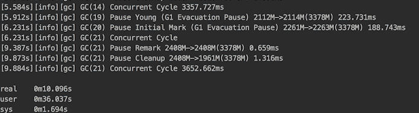

您可以看到 GC 走过了我们描述的大多数步骤。它从收集年轻代开始。然后，当`List<AnObject> list`对象（参见前面的代码）变得太大（超过年轻代区域的 50%）时，为其分配的内存位于*巨大*区域。您还可以看到初始标记步骤以及随后的重标记和其他之前描述的步骤。

每一行都以 JVM 运行的总时间（以秒为单位）开始，并以每个步骤花费的时间（以毫秒为单位）结束。在截图底部，我们看到由`time`实用程序打印的三个行：

+   +   `real`表示花费的墙钟时间——自命令运行以来经过的所有时间（应与 JVM 运行时间的第一列对齐）

    +   `user`表示进程在用户模式代码（内核外）中所有 CPU 花费的时间；它更大是因为 GC 与应用程序并发工作

    +   `sys`表示 CPU 在进程内核中花费的时间

    +   `user`+`sys`表示进程使用的 CPU 时间

1.  设置`-XX:+PrintGCDetails`选项（或只需在日志选项`-Xlog:gc*`中添加一个`*`）以查看 GC 活动的更多细节（在以下截图，我们只提供了与 GC 步骤 0 相关的日志开头）：

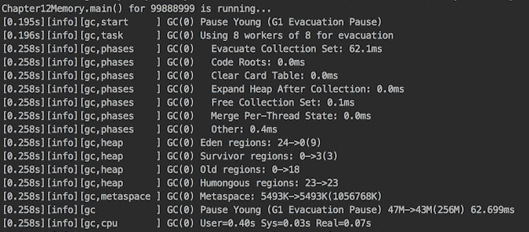

现在日志中每个 GC 步骤都有十几个条目，并以记录每个步骤所花费的`User`、`Sys`和`Real`时间（由`time`实用程序累积的数量）结束。您可以通过添加更多短生命周期的对象（例如）来修改程序，并查看 GC 活动如何变化。

1.  使用`-Xlog:gc*=debug`选项（以下仅为片段）获取更多信息：

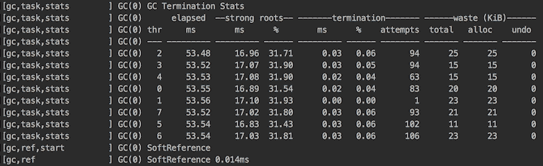

因此，选择您需要多少信息进行分析取决于您。

我们将在本章的下一个配方“JVM 的统一日志”中讨论日志格式和其它日志选项的更多细节。

# 它是如何工作的...

如我们之前提到的，G1 GC 使用默认的人体工程学值，这可能是大多数应用程序足够好的。以下是其中最重要的列表（`<ergo>`表示实际值根据环境以人体工程学方式确定）：

+   `-XX:MaxGCPauseMillis=200`保存最大暂停时间的值

+   `-XX:GCPauseTimeInterval=<ergo>`保存 GC 步骤之间的最大暂停时间（默认未设置，允许 G1 在需要时连续执行垃圾回收）

+   `-XX:ParallelGCThreads=<ergo>` 保存在垃圾收集暂停期间用于并行工作的最大线程数（默认情况下，从可用的线程数派生；如果进程可用的 CPU 线程数小于或等于 8，则使用此数量；否则，将大于 8 的线程的八分之五添加到最终的线程数）。

+   `-XX:ConcGCThreads=<ergo>` 保存用于并发工作的最大线程数（默认设置为 `-XX:ParallelGCThreads` 除以 4）。

+   `-XX:+G1UseAdaptiveIHOP` 表示初始化堆占用应该是自适应的。

+   `-XX:InitiatingHeapOccupancyPercent=45` 设置前几个收集周期；G1 将使用旧生代的 45% 占用率作为标记开始阈值。

+   `-XX:G1HeapRegionSize=<ergo>` 保存基于初始和最大堆大小的堆区域大小（默认情况下，因为堆包含大约 2048 个堆区域，堆区域的大小可以从 1 MB 到 32 MB 不等，且必须是 2 的幂）。

+   `-XX:G1NewSizePercent=5` 和 `-XX:G1MaxNewSizePercent=60` 定义了年轻代的总大小，这两个值作为当前使用的 JVM 堆大小的百分比之间变化。

+   `-XX:G1HeapWastePercent=5` 保存收集集合候选者中允许未回收空间的比例（如果收集集合候选者的空闲空间低于此值，G1 将停止空间回收）。

+   `-XX:G1MixedGCCountTarget=8` 保存空间回收阶段预期的长度，以收集次数计。

+   `-XX:G1MixedGCLiveThresholdPercent=85` 保存旧生代区域中活动对象占用的百分比，在此之后，该区域将不会在此空间回收阶段被收集。

通常，G1 在默认配置中的目标是*在高吞吐量下提供相对较小、均匀的暂停时间*（来自 G1 文档）。如果这些默认设置不适合您的应用程序，您可以更改暂停时间（使用 `-XX:MaxGCPauseMillis`）和最大 Java 堆大小（使用 `-Xmx` 选项）。请注意，尽管如此，实际暂停时间在运行时可能不会完全匹配，但 G1 将尽力达到目标。

如果你想提高吞吐量，可以降低暂停时间目标或请求更大的堆。为了提高响应性，可以更改暂停时间值。请注意，尽管如此，使用 `-Xmn`、`-XX:NewRatio` 或其他选项限制年轻代大小可能会妨碍暂停时间控制，因为*年轻代大小是 G1 允许其满足暂停时间的主要手段*（来自 G1 文档）。

一个可能的原因是，在日志中出现暂停全 GC（分配失败）时性能不佳。这通常发生在短时间内创建了太多对象（并且不能快速收集）或者许多大（巨大）对象不能及时分配的情况下。有几种推荐的处理此情况的方法：

+   在大量巨型对象过多的情况下，尝试通过增加区域大小，使用 `-XX:G1HeapRegionSize` 选项（当前选定的堆区域大小在日志开头打印）来减少它们的数量。

+   增加堆的大小。

+   通过设置 `-XX:ConcGCThreads` 来增加并发标记线程的数量。

+   促进标记开始得更早（利用 G1 基于早期应用程序行为做出决策的事实）。通过修改 `-XX:G1ReservePercent` 来增加自适应 IHOP 计算中使用的缓冲区，或者通过使用 `-XX:-G1UseAdaptiveIHOP` 和 `-XX:InitiatingHeapOccupancyPercent` 手动设置来禁用自适应的 IHOP 计算。

仅在解决完全 GC 之后，才能开始调整 JVM 以获得更好的响应性和/或吞吐量。JVM 文档确定了以下响应性调整案例：

+   不寻常的系统或实时使用

+   引用处理时间过长

+   仅年轻代收集耗时过长

+   混合收集耗时过长

+   高更新 RS 和扫描 RS 时间

通过减少整体暂停时间和暂停频率，可以获得更好的吞吐量。请参考 JVM 文档以识别和获得缓解问题的建议。

# 参见

请参考本章中的以下食谱：

+   JVM 统一日志

+   使用 JVM 的新诊断命令

+   一些提高内存使用效率的最佳实践

# JVM 统一日志

Java 9 实现了 *JEP 158: Unified JVM Logging*，该提案要求 *为 JVM 的所有组件引入一个共同的日志系统*。JVM 的主要组件包括以下内容：

+   类加载器

+   运行时数据区域

    +   栈区域

    +   方法区

    +   堆区域

    +   PC 寄存器

    +   原生方法栈

+   执行引擎

    +   解释器

    +   JIT 编译器

    +   垃圾收集

    +   原生方法接口 JNI

    +   原生方法库

所有这些组件的日志消息现在都可以通过统一日志捕获和分析，统一日志由 `-Xlog` 选项开启。

新的日志系统的主要特点如下：

+   使用日志级别：`trace`、`debug`、`info`、`warning`、`error`

+   消息标签，用于标识 JVM 组件、动作或特定感兴趣的消息

+   三种输出类型：`stdout`、`stderr` 和 `file`

+   对每行一条消息的限制执行

# 准备工作

要快速查看所有日志可能性，您可以运行以下命令：

```java
java -Xlog:help
```

这里是输出：

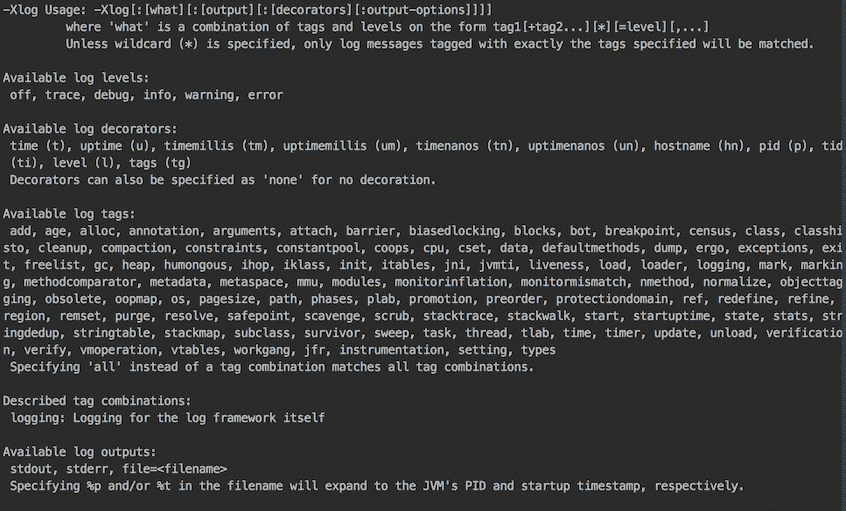

如您所见，`-Xlog` 选项的格式定义如下：

```java
-Xlog[:[what][:[output][:[decorators][:output-options]]]]
```

让我们详细解释这个选项：

+   `what` 是标签和级别的组合，形式为 `tag1[+tag2...][*][=level][,...]`。我们已经在使用 `-Xlog:gc*=debug` 选项中的 `gc` 标签时展示了此结构的用法。通配符 (`*`) 表示您想查看所有具有 `gc` 标签的消息（可能还有其他标签）。如果没有 `-Xlog:gc=debug` 通配符，则表示您只想查看由一个标签（在这种情况下为 `gc`）标记的消息。如果仅使用 `-Xlog`，则日志将显示所有 `info` 级别的消息。

+   `output` 设置输出类型（默认为 `stdout`）。

+   `decorators` 指示了日志每行开头将放置的内容（在组件实际日志消息之前）。默认的装饰器包括 `uptime`、`level` 和 `tags`，每个都包含在方括号内。

+   `output_options` 可能包括 `filecount=file count` 和/或 `filesize=file size with optional K, M or G suffix`。

总结一下，默认的日志配置如下：

```java
-Xlog:all=info:stdout:uptime,level,tags
```

# 如何做到这一点...

让我们运行一些日志设置，如下所示：

1.  运行以下命令：

```java
 java -Xlog:cpu -cp ./cookbook-1.0.jar
      com.packt.cookbook.ch12_memory.Chapter12Memory
```

没有消息，因为 JVM 不会仅使用 `cpu` 标签记录消息。该标签与其他标签结合使用。

1.  添加一个 `*` 符号并再次运行命令：

```java
 java -Xlog:cpu* -cp ./cookbook-1.0.jar
      com.packt.cookbook.ch12_memory.Chapter12Memory
```

结果将如下所示：


如您所见，标签 `cpu` 仅包含记录垃圾回收任务执行时间的消息。即使我们将日志级别设置为 `trace` 或 `debug`（例如 `-Xlog:cpu*=debug`），也不会显示其他消息。

1.  现在运行带有 `heap` 标签的命令：

```java
 java -Xlog:heap* -cp ./cookbook-1.0.jar
      com.packt.cookbook.ch12_memory.Chapter12Memory
```

您将只会得到与堆相关的消息：

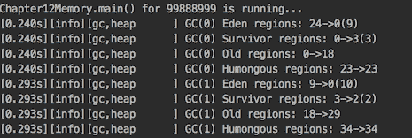

但让我们更仔细地看看第一行。它以三个装饰器开始--`uptime`、`log` 级别和 `tags`--然后是消息本身，该消息以收集周期号（在这种情况下为 0）和 Eden 区域数量从 24 降至 0（现在数量为 9）的信息开始。这是由于（正如我们在下一行中看到的那样）幸存区域的数量从 0 增长到 3，旧生代（第三行）的数量增长到 18，而巨大区域（23）的数量没有变化。这些都是第一个收集周期中的所有堆相关消息。然后，第二个收集周期开始。

1.  再次添加 `cpu` 标签并运行：

```java
 java -Xlog:heap*,cpu* -cp ./cookbook-1.0.jar
      com.packt.cookbook.ch12_memory.Chapter12Memory
```

如您所见，`cpu` 消息显示了每个周期花费的时间：

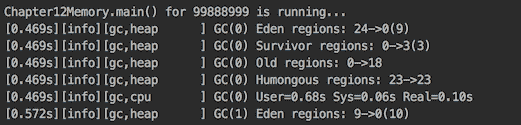

1.  尝试使用两个通过符号 `+` 结合的标签（例如 `-Xlog:gc+heap`）。它只会显示具有两个标签的消息（类似于二进制 `AND` 操作）。请注意，通配符不能与 `+` 符号一起使用（例如 `-Xlog:gc*+heap` 不起作用）。

1.  您还可以选择输出类型和装饰器。实际上，装饰器级别似乎不太具有信息性，并且可以通过显式列出所需的装饰器来轻松省略。考虑以下示例：

```java
 java -Xlog:heap*,cpu*::uptime,tags -cp ./cookbook-1.0.jar
      com.packt.cookbook.ch12_memory.Chapter12Memory
```

注意如何插入两个冒号（`:`）以保留输出类型的默认设置。我们也可以显式地显示它：

```java
 java -Xlog:heap*,cpu*:stdout:uptime,tags -cp ./cookbook-1.0.jar
      com.packt.cookbook.ch12_memory.Chapter12Memory
```

要删除任何装饰，可以将它们设置为`none`：

```java
 java -Xlog:heap*,cpu*::none -cp ./cookbook-1.0.jar
      com.packt.cookbook.ch12_memory.Chapter12Memory
```

新日志系统最有用的方面是标签选择。它允许更好地分析每个 JVM 组件及其子系统的内存演变，或者找到性能瓶颈，分析每个收集阶段所花费的时间——这两者对于 JVM 和应用调整都至关重要。

# 参见

请参阅本章的其他食谱：

+   使用 JVM 的新诊断命令

+   改进调试的堆栈跟踪

+   一些更好的内存使用最佳实践

# 使用 JVM 的新诊断命令

如果您打开 Java 安装的`bin`文件夹，您可以在其中找到相当多的命令行实用程序，这些实用程序可以用来诊断问题并监控使用**Java 运行时环境**（**JRE**）部署的应用程序。它们使用不同的机制来获取它们报告的数据。这些机制是针对**虚拟机**（**VM**）实现、操作系统和版本的。通常，只有工具集的一小部分适用于特定时间点的特定问题。

在这个食谱中，我们将关注 Java 9 中引入的新诊断命令，其中一些列在*JEP 228：添加更多诊断命令*中（实际的命令名称与 JEP 中的略有不同）。新诊断命令作为命令行实用程序`jcmd`的命令实现。您可以在 Java 安装的同一`bin`文件夹中找到此实用程序，并且可以通过在命令提示符中键入`jcmd`来调用它。

如果您输入了它，并且机器上当前没有 Java 进程正在运行，您将只得到一行，如下所示：

```java
87863 jdk.jcmd/sun.tools.jcmd.JCmd 
```

这表明当前只有一个 Java 进程正在运行（`jcmd`实用程序本身），并且它具有**进程标识符**（**PID**）87863（每次运行都会不同）。

让我们运行另一个 Java 程序，例如：

```java
java -cp ./cookbook-1.0.jar com.packt.cookbook.ch12_memory.Chapter12Memory
```

`jcmd`的输出将显示（带有不同的 PID）以下内容：

```java
87864 jdk.jcmd/sun.tools.jcmd.JCmd 
87785 com.packt.cookbook.ch12_memory.Chapter12Memory
```

如您所见，如果没有选项输入，`jcmd`实用程序会报告所有当前运行的 Java 进程的 PID。在获取 PID 之后，您可以使用`jcmd`从运行该进程的 JVM 请求数据：

```java
jcmd 88749 VM.version 
```

或者，您可以通过引用应用程序的主类来避免使用 PID（并且在不带参数的情况下调用`jcmd`）：

```java
jcmd Chapter12Memory VM.version
```

您可以阅读 JVM 文档以获取有关`jcmd`实用程序及其使用方法的更多详细信息。在本食谱中，我们将仅关注 Java 9 附带的新诊断命令。

# 如何做到这一点...

1.  通过运行以下行获取可用的`jcmd`命令的完整列表：

```java
 jcmd PID/main-class-name help
```

将 `PID/main-class` 替换为进程标识符或主类名称。该列表特定于 JVM，因此命令请求从特定进程获取数据。

1.  如果可能，请使用 JDK 8 和 JDK 9 编译相同的类，并为每个 JSK 版本运行前面的命令。这样，您可以比较列表并看到 JDK 9 引入了以下新的 `jcmd` 命令：

+   +   `Compiler.queue`：这将打印已排队等待使用 C1 或 C2（单独的队列）编译的方法

    +   `Compiler.codelist`：这将打印带有完整签名、地址范围和状态（存活、不可进入和僵尸）的 n 方法（编译），并允许选择打印到 `stdout`、文件、XML 或文本输出

    +   `Compiler.codecache`：这将打印代码缓存的内容，其中 JIT 编译器存储生成的本地代码以改进性能

    +   `Compiler.directives_add file`：这将从文件中添加编译器指令到指令栈的顶部

    +   `Compiler.directives_clear`：这将清除编译器指令栈（仅保留默认指令）

    +   `Compiler.directives_print`：这将从顶部到底部打印编译器指令栈上的所有指令

    +   `Compiler.directives_remove`：这将从编译器指令栈中移除最顶部的指令

    +   `GC.heap_info`：这将打印当前的堆参数和状态

    +   `GC.finalizer_info`：这将显示收集具有终结器（即 `finalize()` 方法）的对象的终结器线程的状态

    +   `JFR.configure`：这允许配置 Java 飞行记录器

    +   `JVMTI.data_dump`：这将打印 Java 虚拟机工具接口数据转储

    +   `JVMTI.agent_load`：这将加载（附加）Java 虚拟机工具接口代理

    +   `ManagementAgent.status`：这将打印远程 JMX 代理的状态

    +   `Thread.print`：这将打印所有带有堆栈跟踪的线程

    +   `VM.log [option]`：这允许在 JVM 启动后运行时设置 JVM 日志配置（我们已在先前的菜谱中描述），（可用性可以通过使用 `VM.log list` 查看）

    +   `VM.info`：这将打印统一的 JVM 信息（版本和配置），所有线程及其状态（无线程转储和堆转储）的列表，堆摘要，JVM 内部事件（GC、JIT、safepoint 等），带有已加载本地库的内存映射，VM 参数和环境变量，以及操作系统和硬件的详细信息

    +   `VM.dynlibs`：这将打印有关动态库的信息

    +   `VM.set_flag`：这允许设置 JVM *可写*（也称为 *可管理*）标志（有关标志的列表，请参阅 JVM 文档）

    +   `VM.stringtable` 和 `VM.symboltable`：这些将打印所有 UTF-8 字符串常量

    +   `VM.class_hierarchy [full-class-name]`：这将打印所有已加载的类或仅打印指定的类层次结构

    +   `VM.classloader_stats`：这将打印有关类加载器的信息

    +   `VM.print_touched_methods`：这将打印在运行时被接触的所有方法

如您所见，这些新命令属于几个组，分别由前缀编译器、**垃圾收集器**（**GC**）、**Java 飞行记录器**（**JFR**）、**Java 虚拟机工具接口**（**JVMTI**）、**管理代理**（与远程 JMX 代理相关）、线程和 VM 表示。在这本书中，我们没有足够的空间详细讲解每个命令。我们只会演示一些最实用的命令的使用方法。

# 它是如何工作的...

要获取`jcmd`工具的帮助，请运行以下命令：

```java
jcmd -h 
```

这里是命令的结果：

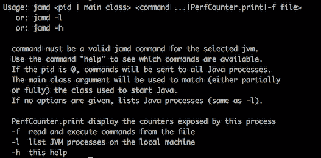

它告诉我们命令也可以从指定在`-f`之后的文件中读取，并且存在一个`PerfCounter.print`命令，该命令会打印出进程的所有性能计数器（统计信息）。

让我们运行以下命令：

```java
jcmd Chapter12Memory GC.heap_info
```

输出可能看起来如下：

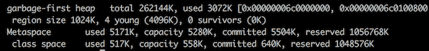

它显示了总堆大小以及使用了多少，年轻代区域的大小以及分配了多少个区域，以及`Metaspace`和`class space`的参数。

以下命令在寻找失控线程或想了解幕后发生的事情时非常有用：

```java
jcmd Chapter12Memory Thread.print
```

这里是可能输出的一个片段：

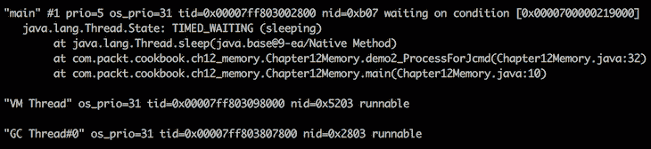

以下命令可能是使用最频繁的，因为它提供了关于硬件、整个 JVM 进程及其组件当前状态的大量信息：

```java
jcmd Chapter12Memory VM.info
```

它以一个摘要开始，如下所示：

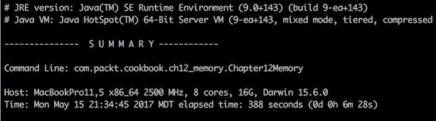

然后是一般的过程描述：

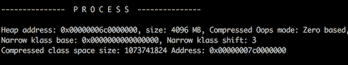

然后是堆的详细信息（这仅仅是其中的一小部分）：

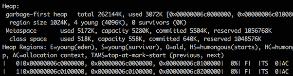

然后它会打印编译事件、GC 堆历史、去优化事件、内部异常、事件、动态库、日志选项、环境变量、VM 参数以及运行进程的系统的许多参数。

`jcmd`命令为 JVM 进程提供了深入的了解，这有助于我们调试和调整进程以获得最佳性能和最优资源使用。

# 参见

请参考本章的其他食谱：

+   改进调试的堆栈跟踪

+   一些提高内存使用效率的最佳实践

# 尝试使用资源以更好地处理资源

管理资源很重要。以下是 JDK 7 文档中的一段摘录：

"典型的 Java 应用程序操作多种类型的资源，如文件、流、套接字和数据库连接。这些资源必须非常小心地处理，因为它们在操作过程中会获取系统资源。因此，你需要确保即使在出现错误的情况下它们也能被释放。实际上，不正确的资源管理是生产应用程序中常见的失败原因，常见的陷阱是数据库连接和文件描述符在代码的其他地方发生异常后仍然保持打开状态。这导致当资源耗尽时，应用程序服务器经常需要重新启动，因为操作系统和服务器应用程序通常对资源有一个上限限制。"

语句*because they acquire system resources for their operations*是关键。这意味着不当处理（未释放）资源可能会耗尽系统操作的能力。这就是为什么在 JDK 7 中引入了*try-with-resources*语句，并在第六章的*数据库编程*示例中使用了它：

```java
try (Connection conn = getDbConnection()){
  try (Statement st = createStatement(conn)) {
    st.execute(sql);
  }
} catch (Exception ex) {
  ex.printStackTrace();
}
```

同一语句的另一种变体是将资源的获取都包含在同一个`try`块中：

```java
try (Connection conn = getDbConnection();
Statement st = createStatement(conn)) {
  st.execute(sql);
} catch (Exception ex) {
  ex.printStackTrace();
}
```

作为提醒，我们使用了`getDbConnection()`和`createStatement()`方法。以下是`getDbConnection()`方法：

```java
Connection getDbConnection() {
  PGPoolingDataSource source = new PGPoolingDataSource();
  source.setServerName("localhost");
  source.setDatabaseName("cookbook");
  try {
    return source.getConnection(); 
  } catch(Exception ex) {
    ex.printStackTrace();
    return null;
  }
}
```

这里是`createStatement()`方法：

```java
Statement createStatement(Connection conn) {
  try {
    return conn.createStatement();
  } catch(Exception ex) {
    ex.printStackTrace();
    return null;
  }
}
```

这非常有帮助，但在某些情况下，我们仍然需要按照旧风格编写额外的代码。例如，如果有一个接受`Statement`对象作为参数的`execute()`方法，而我们希望在使用后立即释放（关闭）它。在这种情况下，代码将如下所示：

```java
void execute(Statement st, String sql){
  try {
    st.execute(sql);
  } catch (Exception ex) {
    ex.printStackTrace();
  } finally {
    if(st != null) {
      try{
        st.close();
      } catch (Exception ex) {
        ex.printStackTrace();
      }
    }
  }
}
```

如您所见，其中大部分只是样板复制粘贴代码。

新的*try-with-resources*语句（随 Java 9 推出）通过允许将有效 final 变量用作*try-with-resources*语句中的资源来解决这个问题。

# 如何做...

1.  使用新的*try-with-resources*语句重写前面的示例：

```java
        void execute(Statement st, String sql){
          try (st) {
            st.execute(sql);
          } catch (Exception ex) {
            ex.printStackTrace();
          }
        }
```

如您所见，它更加简洁和专注，无需反复编写关闭资源的简单代码。不再需要`finally`和额外的`try...catch`。

1.  尝试编写它，以便在使用后立即关闭连接：

```java
        void execute(Connection conn, Statement st, String sql) {
          try (conn; st) {
            st.execute(sql);
          } catch (Exception ex) {
            ex.printStackTrace();
          }
        }
```

这可能或可能不适合你的应用程序连接处理，但通常，这种能力很有用。

1.  尝试不同的组合，例如以下：

```java
        Connection conn = getDbConnection();
        Statement st = conn.createStatement();
        try (conn; st) {
          st.execute(sql);
        } catch (Exception ex) {
          ex.printStackTrace();
        }
```

你也可以尝试这种组合：

```java
        Connection conn = getDbConnection();
        try (conn; Statement st = conn.createStatement()) {
          st.execute(sql);
        } catch (Exception ex) {
          ex.printStackTrace();
        }
```

新的语句提供了更多的灵活性，可以编写满足需求的代码，而无需编写关闭资源的行。

唯一的要求如下：

+   +   包含在`try`语句中的变量必须是 final 或有效 final

    +   资源必须实现`AutoCloseable`接口，它只包含一个方法：

```java
        void close() throws Exception;
```

# 它是如何工作的...

为了演示新语句的工作方式，让我们创建我们自己的实现`AutoCloseable`的资源，并以类似于先前示例中资源的方式使用它们。

这里有一个资源：

```java
class MyResource1 implements AutoCloseable {
  public MyResource1(){
    System.out.println("MyResource1 is acquired");
  }
  public void close() throws Exception {
    //Do what has to be done to release this resource
    System.out.println("MyResource1 is closed");
  }
}
```

这里是第二个资源：

```java
class MyResource2 implements AutoCloseable {
  public MyResource2(){
    System.out.println("MyResource2 is acquired");
  }
  public void close() throws Exception {
    //Do what has to be done to release this resource
    System.out.println("MyResource2 is closed");
  }
}
```

让我们在代码示例中使用它们：

```java
MyResource1 res1 = new MyResource1();
MyResource2 res2 = new MyResource2();
try (res1; res2) {
  System.out.println("res1 and res2 are used");
} catch (Exception ex) {
  ex.printStackTrace();
}
```

如果我们运行它，结果将如下所示：

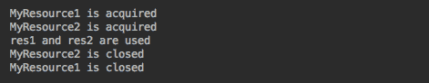

注意，`try`语句中列出的第一个资源最后关闭。如果我们只做一项更改，并在`try`语句中交换顺序：

```java
MyResource1 res1 = new MyResource1();
MyResource2 res2 = new MyResource2();
try (res2; res1) {
  System.out.println("res1 and res2 are used");
} catch (Exception ex) {
  ex.printStackTrace();
}
```

输出确认了这一点：

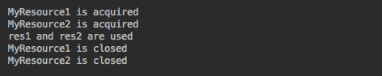

关闭资源时反向顺序的规则解决了资源之间可能的最重要依赖问题，但程序员需要定义关闭资源的顺序（通过在`try`语句中按正确顺序列出它们）。幸运的是，大多数标准资源的关闭由 JVM 优雅地处理，如果资源以错误的顺序列出，代码不会中断。尽管如此，将它们按创建的顺序列出仍然是一个好主意。

# 参考以下内容

请参考本章的其他食谱：

+   一些提高内存使用效率的最佳实践

# 堆栈跟踪用于改进调试

堆栈跟踪在确定问题的来源时非常有帮助，尽管通常需要阅读它是因为一些不愉快的意外。偶尔，尤其是在一个大而复杂的系统中，当自动修复可行时，需要以编程方式读取它。

自 Java 1.4 以来，当前堆栈跟踪可以通过`java.lang.Thread`和`java.lang.Throwable`类访问。你可以在代码的任何方法中添加以下行：

```java
Thread.currentThread().dumpStack();
```

你还可以添加以下行：

```java
new Throwable().printStackTrace();
```

它会将堆栈跟踪打印到标准输出。或者，从 Java 8 开始，你可以使用以下任何一行代码达到相同的效果：

```java
Arrays.stream(Thread.currentThread().getStackTrace())
      .forEach(System.out::println);

Arrays.stream(new Throwable().getStackTrace())
      .forEach(System.out::println);

```

你可以使用堆栈跟踪来查找调用者的完全限定名称，使用以下这些行之一：

```java
System.out.println("This method is called by "+Thread.currentThread()
                        .getStackTrace()[1].getClassName());

System.out.println("This method is called by " + new Throwable()
                        .getStackTrace()[0].getClassName());
```

所有上述行都是由于`java.lang.StackTraceElement`类，它表示堆栈跟踪中的一个堆栈帧。此类提供了其他方法，描述由该堆栈跟踪元素表示的执行点，这允许以编程方式访问堆栈跟踪信息。例如，你可以在程序的任何位置运行以下代码片段：

```java
Arrays.stream(Thread.currentThread().getStackTrace())
  .forEach(e -> {
    System.out.println();
    System.out.println("e="+e);
    System.out.println("e.getFileName()="+ e.getFileName());
    System.out.println("e.getMethodName()="+ e.getMethodName());
    System.out.println("e.getLineNumber()="+ e.getLineNumber());
});

```

你也可以从程序中的任何位置运行这一行：

```java
Arrays.stream(new Throwable().getStackTrace())
  .forEach(x -> {
    System.out.println();
    System.out.println("x="+x);
    System.out.println("x.getFileName()="+ x.getFileName());
    System.out.println("x.getMethodName()="+ x.getMethodName());
    System.out.println("x.getLineNumber()="+ x.getLineNumber());
});

```

在任何情况下，你都可以看到你获得了多少信息。不幸的是，这些丰富的数据伴随着代价。JVM 捕获整个堆栈（除了隐藏的堆栈帧），这可能会影响性能，而实际上你可能只需要这些数据的一小部分（就像在先前的例子中我们只使用堆栈跟踪数组的一个元素）。

这就是新的 Java 9 类`java.lang.StackWalker`及其嵌套的`Option`类和`StackFrame`接口派上用场的地方。

# 准备工作

`StackWalker`类有四个静态工厂方法`getInstance()`的变体，分别是`getInstance()`，它们的不同之处在于它们可以接受以下几种选项之一或没有任何选项：

+   `StackWalker getInstance()`: 这是配置为跳过所有隐藏帧和没有调用者类引用。

+   `StackWalker getInstance(StackWalker.Option option)`: 这个方法创建了一个具有给定选项的实例，指定它可以访问的栈帧信息。

+   `StackWalker getInstance(Set<StackWalker.Option> options)`: 这个方法创建了一个具有给定选项集的实例，指定它可以访问的栈帧信息。如果给定的集合为空，则实例配置与`StackWalker getInstance()`实例完全相同。

+   `StackWalker getInstance(Set<StackWalker.Option> options, int estimatedDepth)`: 这个方法创建了一个与前面类似的实例，并接受`estimatedDepth`参数，该参数指定此实例将遍历的估计栈帧数，以便它可以估计可能需要的缓冲区大小。

以下值之一作为选项传递：

+   `StackWalker.Option.RETAIN_CLASS_REFERENCE`

+   `StackWalker.Option.SHOW_HIDDEN_FRAMES`

+   `StackWalker.Option.SHOW_REFLECT_FRAMES`

`StackWalker`类还有三个方法：

+   `T walk(Function<Stream<StackWalker.StackFrame>, T> function)`: 这个方法将给定的函数应用于当前线程的`StackFrames`流，从栈顶帧开始遍历，即调用此`walk`方法的那个方法。

+   `void forEach(Consumer<StackWalker.StackFrame> action)`: 这个方法对当前线程的`StackFrame`流中的每个元素执行给定的操作，从栈顶帧开始遍历，即调用`forEach`方法的那个方法。此方法等同于调用`walk(s -> { s.forEach(action); return null; })`。

+   `Class<?> getCallerClass()`: 这个方法获取调用`getCallerClass()`方法的调用者的`Class`对象。如果此`StackWalker`实例未配置`RETAIN_CLASS_REFERENCE`选项，则此方法抛出`UnsupportedOperationException`。

# 如何实现...

创建几个相互调用的类和方法，以便您可以执行堆栈跟踪处理。

1.  创建一个`Clazz01`类：

```java
        public class Clazz01 {
          public void method(){
            new Clazz03().method("Do something");
            new Clazz02().method();
          }
        }
```

1.  创建一个`Clazz02`类：

```java
        public class Clazz02 {
          public void method(){
            new Clazz03().method(null);
          }
        }
```

1.  创建一个`Clazz03`类：

```java
        public class Clazz03 {
          public void method(String action){
            if(action != null){
              System.out.println(action);
              return;
            }
            System.out.println("Throw the exception:");
            action.toString();
          }
        }
```

1.  编写一个`demo4_StackWalk()`方法：

```java
        private static void demo4_StackWalk(){
          new Clazz01().method();
        }
```

从`Chapter12Memory`类的`main`方法中调用此方法：

```java
        public class Chapter12Memory {
          public static void main(String... args) {
            demo4_StackWalk();
          }
        }
```

如果我们现在运行`Chapter12Memory`类，结果将如下所示：

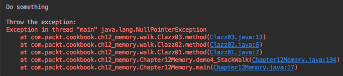

消息`Do something`从`Clazz01`传递到`Clazz03`并打印出来。然后`Clazz02`将 null 传递给`Clazz03`，在`NullPointerException`导致的堆栈跟踪之前打印出消息`Throw the exception:`。

# 它是如何工作的...

为了更深入地理解这里的概念，让我们修改`Clazz03`：

```java
public class Clazz03 {
  public void method(String action){
    if(action != null){
      System.out.println(action);
      return;
    }
    System.out.println("Print the stack trace:");
    Thread.currentThread().dumpStack();
  }
}
```

结果将是以下内容：

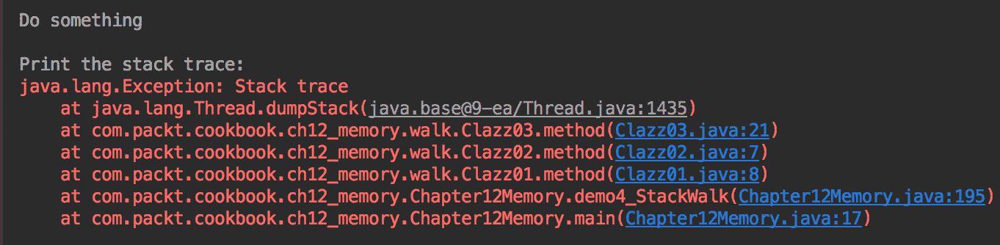

或者，我们可以通过使用`Throwable`而不是`Thread`来得到类似的结果：

```java
new Throwable().printStackTrace();
```

它看起来非常熟悉：

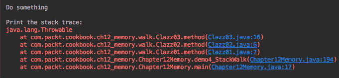

下面的两行代码会产生类似的结果：

```java
Arrays.stream(Thread.currentThread().getStackTrace())
                             .forEach(System.out::println);
Arrays.stream(new Throwable().getStackTrace())
                             .forEach(System.out::println);

```

现在有了 Java 9，相同的输出可以通过使用`StackWalker`类来实现。让我们看看如果我们按照以下方式修改`Clazz03`会发生什么：

```java
public class Clazz03 {
  public void method(String action){
    if(action != null){
      System.out.println(action);
      return;
    }
    StackWalker stackWalker = StackWalker.getInstance();
    stackWalker.forEach(System.out::println);
  }
}
```

结果将是相同的：

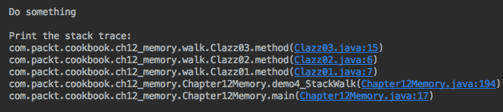

然而，与在内存中生成并存储在数组中的完整堆栈跟踪相反，`StackWalker`类只提供所需元素。这已经是一个很大的优点。然而，当我们需要调用者类名时，`StackWalker`显示最大的优势。我们不再需要获取所有数组并只使用一个元素，现在我们可以通过以下两行代码获取所需的信息：

```java
System.out.println("Print the caller class name:");
System.out.println(StackWalker.getInstance(StackWalker
                        .Option.RETAIN_CLASS_REFERENCE)
                        .getCallerClass().getSimpleName());

```

我们将得到以下结果：


# 参见

请参考本章的其他示例：

+   一些提高内存使用效率的最佳实践

# 一些提高内存使用效率的最佳实践

内存管理可能永远都不会成为你的问题，或者它可能成为你生活中挥之不去的永恒故事，亦或是介于两者之间的任何情况。对于大多数程序员来说，这很可能不是一个问题，尤其是在垃圾收集算法不断改进的情况下。G1 垃圾收集器（JVM 9 的默认设置）无疑是朝着正确方向迈出的一步。但你也可能会被叫去（或者自己注意到）应用程序性能下降的问题，那时你才会了解到自己应对挑战的准备程度。

这个方法试图帮助你避免这种情况，或者成功摆脱它。

# 它是如何工作的...

第一道防线是代码本身。在之前的示例中，我们已经讨论了在不再需要资源时立即释放资源以及使用`StackWalker`以减少内存使用的必要性。互联网上有许多建议，但它们可能不适用于你的应用程序。你将不得不监控内存消耗并测试你的设计决策，尤其是在你的代码处理大量数据之前，决定在哪里集中注意力。

例如，如果集合很小（不同的集合使用更多或更少的内存），那么集合的选择可能无关紧要。然而，程序员通常使用相同的编码模式，人们可以通过他们的风格来识别代码的作者。这就是为什么在长期来看，找出最有效的结构并经常使用它们是有回报的。然而，尽量让你的代码易于理解；可读性是代码质量的重要方面。

这里有一些关于内存感知编码风格的流行建议：

+   使用延迟初始化并在使用前创建对象，特别是如果这种需求根本不可能实现的话

+   使用 `StringBuilder` 而不是 `+` 运算符

+   如果适合你的需求，在使用 `HashSet` 之前使用 `ArrayList`（内存使用量按顺序从 `ArrayList` 增加到 `LinkedList`、`HashTable`、`HashMap` 和 `HashSet`）

+   如果无法避免，请避免使用正则表达式并缓存 `Pattern` 引用

+   优先使用原始类型而不是类包装器（使用自动装箱）

+   不要忘记清理缓存并删除不必要的条目

+   注意循环内创建的对象

一旦代码开始执行其预期功能，就立即测试和评估你的代码。你可能需要更改设计或实现的一些细节。这也会影响你未来的决策。任何环境都有许多分析器和诊断工具可用。我们在本章的*使用 JVM 的新诊断命令*配方中描述了其中之一（`jcmd`）。

了解你的垃圾回收器是如何工作的（参见配方，*理解 G1 垃圾回收器*）并且不要忘记使用 JVM 日志记录（在配方*JVM 的统一日志记录*中描述）。

之后，你可能需要调整 JVM 和垃圾回收器。以下是一些最常用的 JVM 参数（默认情况下，大小以字节为单位指定，但你可以附加字母 k 或 K 来表示千字节，m 或 M 来表示兆字节，g 或 G 来表示吉字节）：

+   `-Xms size`：这设置了堆的初始大小，它必须是 1024 的倍数且大于 1 MB。

+   `-Xmx size`：这设置了堆的最大大小，它必须是 1024 的倍数且大于 2 MB。默认值是在运行时根据系统配置选择的。对于服务器部署，`-Xms size` 和 `-Xmx size` 通常设置为相同的值。实际的内存使用量可能超过你通过 `-Xmx size` 设置的量，因为它仅限制 Java 堆大小，而 JVM 还为其他目的分配内存，包括每个线程的栈。

+   `-Xmn size`：这设置了年轻代（幼崽代）的堆的初始和最大大小。如果年轻代的大小太小，则将执行大量的垃圾回收。如果大小太大，则只执行完全垃圾回收，这可能需要很长时间才能完成。Oracle 建议将年轻代的大小保持在整体堆大小的 25% 到 50% 之间。此参数等同于 `-XX:NewSize=size`。为了有效地进行垃圾回收，`-Xmn size` 应低于 `-Xmx size`。

+   `-XX:MaxNewSize=size`：这设置了年轻代（幼崽代）的堆的最大大小。默认值是按人体工程学设置的。Oracle 建议在总可用内存之后，第二个最有影响力的因素是保留给年轻代的堆比例。默认情况下，年轻代的最低大小为 1310 MB，最大大小为无限。

+   `-XX:NewRatio=ratio`: 这设置年轻代和老年代大小之间的比率；默认设置为 2。

+   `-Xss size`: 这设置线程栈大小，默认值取决于平台：

    +   Linux/ARM (32-bit): 320 KB

    +   Linux/ARM (64-bit): 1024 KB

    +   Linux/x64 (64-bit): 1024 KB

    +   OS X (64-bit): 1024 KB

    +   Oracle Solaris/i386 (32-bit): 320 KB

    +   Oracle Solaris/x64 (64-bit): 1024 KB

    +   Windows: 默认值取决于虚拟内存

每个线程都有一个栈，因此栈大小将限制 JVM 可以拥有的线程数。如果栈大小太小，可能会得到 `java.lang.StackOverflowError` 异常。然而，将栈大小设置得太大也可能耗尽内存，因为每个线程将分配比它需要的更多内存。

+   `-XX:MaxMetaspaceSize=size`: 这设置分配给类元数据的内存上限，默认情况下不受限制。

内存泄漏的明显迹象是旧代增长导致全 GC 运行得更频繁。为了调查，您可以使用将堆内存转储到文件的 JVM 参数：

+   `-XX:+HeapDumpOnOutOfMemoryError`: 当抛出 `java.lang.OutOfMemoryError` 异常时，将 Java 堆保存到当前目录的文件中。您可以使用 `-XX:HeapDumpPath=path` 选项显式设置堆转储文件的路径和名称。默认情况下，此选项禁用，当抛出 `OutOfMemoryError` 异常时不会转储堆。

+   `-XX:HeapDumpPath=path`: 这设置写入堆转储的路径和文件名，该转储由堆分析器（`hprof`）提供，当设置 `-XX:+HeapDumpOnOutOfMemoryError` 参数时。默认情况下，文件在当前工作目录中创建，命名为 `java_pidpid.hprof`，其中 `pid` 是导致错误的进程标识符。

+   `-XX:OnOutOfMemoryError="< cmd args >;< cmd args >"`: 这设置在首次抛出 `OutOfMemoryError` 异常时运行的自定义命令或一系列分号分隔的命令。如果字符串包含空格，则必须用引号括起来。有关命令字符串的示例，请参阅 `-XX:OnError` 参数的描述。

+   `-XX:+UseGCOverheadLimit`: 这启用了一种策略，限制 JVM 在抛出 `OutOfMemoryError` 异常之前在 GC 上花费的时间比例。此选项默认启用，如果超过 98% 的总时间用于垃圾收集且少于 2% 的堆被回收，并行 GC 将抛出 `OutOfMemoryError` 异常。当堆较小时，此功能可以用来防止应用程序长时间运行而几乎没有进展。要禁用此选项，请指定 `-XX:-UseGCOverheadLimit`。

# 参见

请参阅本章的其他食谱：

+   理解 G1 垃圾收集器

+   JVM 的统一日志记录

+   使用 JVM 的新诊断命令

+   尝试使用资源以更好地处理资源

+   改进调试的堆栈跟踪
