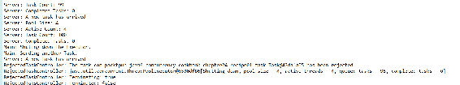
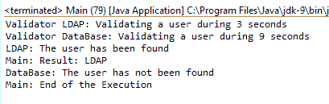
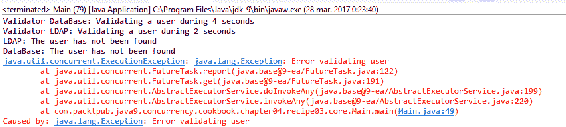
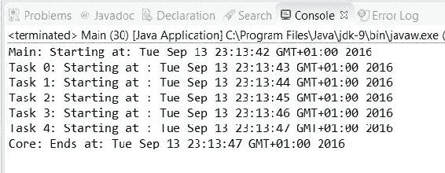
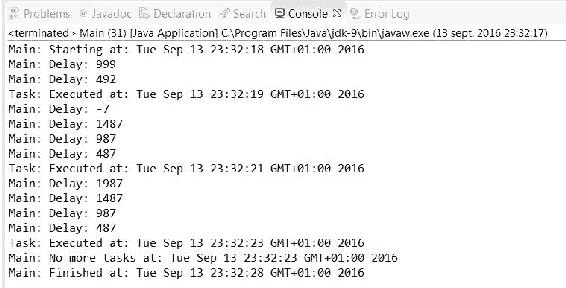
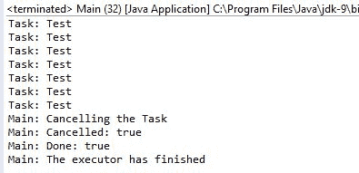

# 第四章：线程执行器

在本章中，我们将涵盖以下主题：

+   创建线程执行器并控制其拒绝的任务

+   在执行器中执行返回结果的任务

+   运行多个任务并处理第一个结果

+   运行多个任务并处理所有结果

+   在延迟后运行执行器中的任务

+   定期在执行器中运行任务

+   在执行器中取消任务

+   控制执行器中任务完成

+   在执行器中分离任务的启动和结果处理

# 简介

通常，当你用 Java 开发一个简单的并发编程应用程序时，首先创建一些`Runnable`对象，然后创建相应的`Thread`对象来执行它们。如果你必须开发一个运行大量并发任务的应用程序，这种方法将带来以下缺点：

+   你将不得不实现所有与代码相关的信息来管理`Thread`对象（创建、结束和获取结果）。

+   你将不得不为每个任务创建一个`Thread`对象。执行大量任务可能会影响应用程序的吞吐量。

+   你将需要有效地控制和管理工作站的资源。如果你创建太多线程，可能会使系统饱和。

自 Java 5 以来，Java 并发 API 提供了一种旨在解决这些问题的机制。这个机制被称为**执行器框架**，它围绕`Executor`接口、其子接口`ExecutorService`以及实现这两个接口的`ThreadPoolExecutor`类。

此机制将任务创建和执行分离。使用执行器，你只需实现`Runnable`或`Callable`对象并将它们发送到执行器。它负责它们的执行，使用必要的线程运行它们。但不仅如此；它通过线程池来提高性能。当你向执行器发送任务时，它会尝试使用池中的线程来执行任务。这样做是为了避免不断创建线程。`Executor`框架的另一个重要优点是`Callable`接口。它与`Runnable`接口类似，但提供了两个改进，具体如下：

+   该接口的主要方法名为`call()`，可能返回一个结果。

+   当你向执行器发送`Callable`对象时，你会得到一个实现了`Future`接口的对象。你可以使用此对象来控制`Callable`对象的状态和结果。

本章介绍了九个菜谱，展示了如何使用前面提到的类和其他 Java 并发 API 提供的变体来使用`Executor`框架。

# 创建线程执行器并控制其拒绝的任务

使用`Executor`框架的第一步是创建`ThreadPoolExecutor`类的对象。你可以使用这个类提供的四个构造函数，或者使用名为`Executors`的工厂类来创建`ThreadPoolExecutor`。一旦你有了执行器，你就可以发送`Runnable`或`Callable`对象去执行。

当你想要完成执行器的执行时，使用`shutdown()`方法。执行器会等待正在运行或等待执行的任务完成。然后，它完成执行。

如果你在一个执行器的`shutdown()`方法和执行结束之间发送一个任务，该任务将被拒绝。这是因为执行器不再接受新的任务。`ThreadPoolExecutor`类提供了一个机制，当任务被拒绝时会被调用。

在这个菜谱中，你将学习如何使用`Executors`类创建一个新的`ThreadPoolExecutor`对象，如何向`Executor`发送任务，以及如何控制`Executor`类的拒绝任务。

# 准备工作

你应该阅读第一章中关于*创建、运行和设置线程特性*的菜谱，学习 Java 中线程创建的基本机制。你可以比较这两种机制，并根据问题选择一个。

本菜谱的示例使用 Eclipse IDE 实现。如果你使用 Eclipse 或 NetBeans 等其他 IDE，请打开它并创建一个新的 Java 项目。

# 如何做...

按照以下步骤实现示例：

1.  首先，实现服务器将要执行的任务。创建一个名为`Task`的类，该类实现了`Runnable`接口：

```java
        public class Task implements Runnable {

```

1.  声明一个名为`initDate`的`Date`属性来存储任务的创建日期，以及一个名为`name`的`String`属性来存储任务的名称：

```java
        private final Date initDate; 
        private final String name;

```

1.  实现类的构造函数，初始化两个属性：

```java
        public Task(String name){ 
          initDate=new Date(); 
          this.name=name; 
        }

```

1.  实现类的`run()`方法：

```java
        @Override 
        public void run() {

```

1.  首先，写入`initDate`属性和实际日期，即任务的开始日期：

```java
        System.out.printf("%s: Task %s: Created on: %s\n",
                          Thread.currentThread().getName(),
                          name,initDate); 
        System.out.printf("%s: Task %s: Started on: %s\n",
                          Thread.currentThread().getName(),
                          name,new Date());

```

1.  然后，让任务随机休眠一段时间：

```java
        try { 
          Long duration=(long)(Math.random()*10); 
          System.out.printf("%s: Task %s: Doing a task during %d
                             seconds\n", Thread.currentThread().getName(),
                            name,duration); 
          TimeUnit.SECONDS.sleep(duration); 
        } catch (InterruptedException e) { 
          e.printStackTrace(); 
        }

```

1.  最后，将任务的完成日期写入控制台：

```java
         System.out.printf("%s: Task %s: Finished on: %s\n",
                           Thread.currentThread().getName(),
                           name,new Date());

```

1.  创建一个名为`RejectedTaskController`的类，该类实现了`RejectedExecutionHandler`接口。实现这个接口的`rejectedExecution()`方法。然后写入被拒绝的任务名称以及执行器的名称和状态：

```java
        public class RejectedTaskController implements
                                              RejectedExecutionHandler { 
          @Override 
          public void rejectedExecution(Runnable r,
                                        ThreadPoolExecutor executor) { 
            System.out.printf("RejectedTaskController: The task %s has been
                              rejected\n",r.toString()); 
            System.out.printf("RejectedTaskController: %s\n",
                              executor.toString()); 
            System.out.printf("RejectedTaskController: Terminating: %s\n",
                              executor.isTerminating()); 
            System.out.printf("RejectedTaksController: Terminated: %s\n",
                              executor.isTerminated()); 
          }

```

1.  现在实现`Server`类，该类将使用执行器执行它接收到的每个任务。创建一个名为`Server`的类：

```java
        public class Server {

```

1.  声明一个名为`executor`的`ThreadPoolExecutor`属性：

```java
        private final ThreadPoolExecutor executor;

```

1.  实现类的构造函数，使用`Executors`类初始化`ThreadPoolExecutor`对象，并设置拒绝任务的处理器：

```java
        public Server(){ 
          executor =( ThreadPoolExecutor ) Executors.newFixedThreadPool(
                        Runtime.getRuntime().availableProcessors() ); 
          RejectedTaskController controller=new
                                         RejectedTaskController(); 
          executor.setRejectedExecutionHandler(controller); 
        }

```

1.  实现`executeTask()`方法。它接收一个`Task`对象作为参数并将其发送到执行器。首先，向控制台写入一条消息，表明已到达一个新的任务：

```java
        public void executeTask(Task task){ 
          System.out.printf("Server: A new task has arrived\n");

```

1.  然后，调用执行器的`execute()`方法并将其发送到任务：

```java
        executor.execute(task);

```

1.  最后，将一些执行器数据写入控制台以查看其状态：

```java
        System.out.printf("Server: Pool Size: %d\n",
                          executor.getPoolSize()); 
        System.out.printf("Server: Active Count: %d\n",
                          executor.getActiveCount()); 
        System.out.printf("Server: Task Count: %d\n",
                          executor.getTaskCount()); 
        System.out.printf("Server: Completed Tasks: %d\n",
                          executor.getCompletedTaskCount());

```

1.  接下来，实现`endServer()`方法。在此方法中，调用执行器的`shutdown()`方法来完成其执行：

```java
        public void endServer() { 
          executor.shutdown(); 
        }

```

1.  通过创建一个名为`Main`的类并添加`main()`方法来实现示例的主类。首先，创建 100 个任务并将它们发送到`Executor`：

```java
        public class Main { 
          public static void main(String[] args) { 
            Server server=new Server(); 

            System.out.printf("Main: Starting.\n"); 
              for (int i=0; i<100; i++){ 
                Task task=new Task("Task "+i); 
                server.executeTask(task); 
              }

```

1.  然后，调用`Server`的`endServer()`方法来关闭执行器：

```java
        System.out.printf("Main: Shuting down the Executor.\n"); 
        server.endServer();

```

1.  最后，发送一个新的任务。此任务将被拒绝，因此我们将看到这个机制是如何工作的：

```java
        System.out.printf("Main: Sending another Task.\n"); 
        Task task=new Task("Rejected task"); 
        server.executeTask(task); 

        System.out.printf("Main: End.\n");

```

# 它是如何工作的...

本例的关键是`Server`类。此类创建并使用`ThreadPoolExecutor`来执行任务。

第一个重要点是`Server`类的构造函数中创建`ThreadPoolExecutor`。`ThreadPoolExecutor`类有四个不同的构造函数，但由于它们的复杂性，Java 并发 API 提供了`Executors`类来构建执行器和相关对象。虽然您可以直接使用其构造函数之一创建`ThreadPoolExecutor`，但建议您使用`Executors`类。

在这种情况下，您使用`Executors`类的`newFixedThreadPool()`方法创建了一个缓存线程池来创建执行器。此方法创建了一个具有最大线程数的执行器。如果您发送的任务数量超过线程数，剩余的任务将阻塞，直到有可用的空闲线程来处理它们。此方法接收您希望执行器中拥有的最大线程数作为参数。在我们的例子中，我们使用了`Runtime`类的`availableProcessors()`方法，它返回 JVM 可用的处理器数量。通常，这个数字与计算机的核心数相匹配。

线程的重用具有减少线程创建时间的优势。然而，缓存线程池的缺点是对于新任务有恒定的空闲线程。因此，如果您向此执行器发送过多的任务，可能会超载系统。

一旦创建了执行器，您可以使用`execute()`方法发送`Runnable`或`Callable`类型的任务进行执行。在这种情况下，您发送了实现了`Runnable`接口的`Task`类的对象。

您还打印了一些包含执行器信息的日志消息。具体来说，您使用了以下方法：

+   `getPoolSize()`: 此方法返回执行器池中的实际线程数。

+   `getActiveCount()`: 此方法返回在执行器中执行任务的线程数量。

+   `getTaskCount()`: 此方法返回已安排执行的任务数量。返回的值仅是一个近似值，因为它会动态变化。

+   `getCompletedTaskCount()`: 此方法返回执行器完成的任务数量。

`ThreadPoolExecutor` 类以及一般执行器的一个关键方面是，你必须显式地结束它们。如果你不这样做，执行器将继续执行，程序将不会结束。如果执行器没有要执行的任务，它将继续等待新任务，并且不会结束其执行。Java 应用程序不会结束，直到所有非守护线程完成它们的执行。因此，如果你不终止执行器，你的应用程序将永远不会结束。

要向执行器指示你想要结束它，请使用 `ThreadPoolExecutor` 类的 `shutdown()` 方法。当执行器完成所有挂起任务的执行后，它也会结束其执行。在你调用 `shutdown()` 方法后，如果你尝试向执行器发送另一个任务，它将被拒绝，并且执行器将抛出 `RejectedExecutionException` 异常，除非你已经实现了拒绝任务的经理，就像在我们的案例中一样。要管理执行器的拒绝任务，你需要创建一个实现 `RejectedExecutionHandler` 接口的类。此接口有一个名为 `rejectedExecution()` 的方法，它有两个参数：

+   存储已拒绝的任务的 `Runnable` 对象

+   存储拒绝任务的执行器的 `Executor` 对象

对于执行器拒绝的每个任务，都会调用此方法。你需要使用 `ThreadPoolExecutor` 类的 `setRejectedExecutionHandler()` 方法来建立拒绝任务的处理器。

以下截图显示了此示例执行的部分：



注意，当最后一个任务到达执行器时，池中的线程数和正在执行的线程数都表示为 4。这指的是执行示例的 PC 的核心数，这是 `availableProcessors()` 方法返回的数值。一旦完成，我们关闭执行器，下一个任务将被拒绝。`RejectedTaskController` 将任务和执行器的信息写入控制台。

# 还有更多...

`Executors` 类提供了其他方法来创建 `ThreadPoolExecutor`：

+   `newCachedThreadPool()`: 此方法返回一个 `ExecutorService` 对象，因此它已被转换为 `ThreadPoolExecutor` 以访问其所有方法。你创建的缓存线程池在需要时创建新线程来执行新任务。此外，如果它们已经完成了正在运行的任务的执行，它将重用它们。

+   `newSingleThreadExecutor()`: 这是一个固定大小线程执行器的极端情况。它创建一个只有一个线程的执行器，因此一次只能执行一个任务。

`ThreadPoolExecutor` 类提供了许多方法来获取有关其状态的信息。我们在示例中使用了 `getPoolSize()`、`getActiveCount()` 和 `getCompletedTaskCount()` 方法来获取有关池大小、线程数和执行器完成任务的数量的信息。您还可以使用 `getLargestPoolSize()` 方法；它返回一次在池中达到的最大线程数。

`ThreadPoolExecutor` 类还提供了与执行器最终化相关的一些其他方法。这些方法包括：

+   `shutdownNow()`: 这将立即关闭执行器。它不会执行挂起的任务。它返回一个包含所有挂起任务的列表。当您调用此方法时正在运行的任务将继续执行，但该方法不会等待它们的最终化。

+   `isTerminated()`: 此方法返回 true，如果您调用了 `shutdown()` 或 `shutdownNow()` 方法；执行器将相应地完成关闭过程。

+   `isShutdown()`: 如果您调用了执行器的 `shutdown()` 方法，此方法返回 `true`。

+   `awaitTermination(long timeout, TimeUnit unit)`: 此方法阻塞调用线程，直到执行器的任务结束或发生超时。`TimeUnit` 类是一个枚举，具有以下常量：`DAYS`、`HOURS`、`MICROSECONDS`、`MILLISECONDS`、`MINUTES`、`NANOSECONDS` 和 `SECONDS`。

如果您想等待任务完成，无论它们的持续时间如何，请使用大超时，例如，`DAYS`。

# 参见

+   在第九章 “监控 Executor 框架”配方，*测试并发应用程序*

# 在返回结果的执行器中执行任务

`Executor` 框架的一个优点是它允许您运行返回结果的并发任务。Java 并发 API 通过以下两个接口实现这一点：

+   `Callable`：此接口有一个 `call()` 方法。在此方法中，您必须实现任务的逻辑。`Callable` 接口是一个参数化接口，这意味着您必须指明 `call()` 方法将返回的数据类型。

+   `Future`：此接口有一些方法可以获取 `Callable` 对象生成的结果并管理其状态。

在本配方中，您将学习如何实现返回结果的任务并在执行器上运行它们。

# 准备工作

本配方的示例已使用 Eclipse IDE 实现。如果您使用 Eclipse 或其他 IDE，例如 NetBeans，请打开它并创建一个新的 Java 项目。

# 如何实现...

按照以下步骤实现示例：

1.  创建一个名为 `FactorialCalculator` 的类。指定它实现由 `Integer` 类型参数化的 `Callable` 接口：

```java
        public class FactorialCalculator implements Callable<Integer> {

```

1.  声明一个名为 `number` 的私有 `Integer` 属性，用于存储此任务将用于其计算的数字：

```java
        private final Integer number;

```

1.  实现类的构造函数，初始化类的属性：

```java
        public FactorialCalculator(Integer number){ 
          this.number=number; 
        }

```

1.  实现`call()`方法。此方法返回`FactorialCalculator`的数字属性的阶乘：

```java
        @Override 
        public Integer call() throws Exception {

```

1.  首先，创建并初始化方法中使用的内部变量：

```java
        int result = 1;

```

1.  如果数字是`0`或`1`，则返回`1`。否则，计算数字的阶乘。为了教育目的，在两次乘法之间让这个任务休眠 20 毫秒：

```java
        if ((number==0)||(number==1)) { 
          result=1; 
        } else { 
          for (int i=2; i<=number; i++) { 
            result*=i; 
            TimeUnit.MILLISECONDS.sleep(20); 
          } 
        }

```

1.  使用操作的结果向控制台发送一条消息：

```java
        System.out.printf("%s: %d\n",Thread.currentThread().getName(),
                          result);

```

1.  返回操作的结果：

```java
        return result;

```

1.  通过创建一个名为`Main`的类并添加`main()`方法来实现示例的主类：

```java
        public class Main { 
          public static void main(String[] args) {

```

1.  使用`Executors`类的`newFixedThreadPool()`方法创建`ThreadPoolExecutor`来运行任务。将`2`作为参数传递，即作为执行器中的线程数：

```java
        ThreadPoolExecutor executor=(ThreadPoolExecutor)Executors
                                               .newFixedThreadPool(2);

```

1.  创建一个`Future<Integer>`对象的列表：

```java
        List<Future<Integer>> resultList=new ArrayList<>();

```

1.  使用`Random`类创建一个随机数生成器：

```java
        Random random=new Random();

```

1.  创建一个包含十个步骤的循环。在每一步中，我们生成一个随机数：

```java
        for (int i=0; i<10; i++){ 
          Integer number= random.nextInt(10);

```

1.  然后，我们创建一个`FactorialCalculator`对象，将生成的随机数作为参数传递：

```java
        FactorialCalculator calculator=new FactorialCalculator(number);

```

1.  调用执行器的`submit()`方法将`FactorialCalculator`任务发送到执行器。此方法返回一个`Future<Integer>`对象来管理任务，并最终获取其结果：

```java
        Future<Integer> result=executor.submit(calculator);

```

1.  将`Future`对象添加到之前创建的列表中：

```java
          resultList.add(result); 
        }

```

1.  创建一个`do`循环来监控执行器的状态：

```java
        do {

```

1.  首先，使用执行器的`getCompletedTaskNumber()`方法向控制台发送一条消息，指示已完成任务的数目：

```java
        System.out.printf("Main: Number of Completed Tasks: %d\n",
                          executor.getCompletedTaskCount());

```

1.  然后，对于列表中的 10 个`Future`对象，使用`isDone()`方法写一条消息，指示它管理的任务是否已完成：

```java
        for (int i=0; i<resultList.size(); i++) { 
          Future<Integer> result=resultList.get(i); 
          System.out.printf("Main: Task %d: %s\n",i,result.isDone()); 
        }

```

1.  让线程休眠 50 毫秒：

```java
        try { 
          TimeUnit.MILLISECONDS.sleep(50); 
        } catch (InterruptedException e) { 
          e.printStackTrace(); 
        }

```

1.  当执行器的已完成任务数少于 10 时，重复此循环：

```java
        } while (executor.getCompletedTaskCount()<resultList.size());

```

1.  在控制台，写出每个任务获得的结果。对于每个`Future`对象，使用`get()`方法获取其任务返回的`Integer`对象：

```java
        System.out.printf("Main: Results\n"); 
        for (int i=0; i<resultList.size(); i++) { 
          Future<Integer> result=resultList.get(i); 
          Integer number=null; 
          try { 
            number=result.get(); 
          } catch (InterruptedException e) { 
            e.printStackTrace(); 
          } catch (ExecutionException e) { 
            e.printStackTrace(); 
          }

```

1.  然后，将数字打印到控制台：

```java
          System.out.printf("Main: Task %d: %d\n",i,number); 
        }

```

1.  最后，调用执行器的`shutdown()`方法来最终化其执行：

```java
        executor.shutdown();

```

# 它是如何工作的...

在这个菜谱中，你学习了如何使用`Callable`接口启动返回结果的并发任务。你实现了`FactorialCalculator`类，该类实现了`Callable`接口，并将`Integer`作为结果类型。因此，`call()`方法返回一个`Integer`值。

此例中的另一个关键点是`Main`类。你使用`submit()`方法向执行器发送了一个要执行的对象。此方法接收一个`Callable`对象作为参数，并返回一个`Future`对象，你可以用它实现两个主要目标：

+   你可以控制任务的状况，你可以取消任务并检查它是否已经完成。为此，你使用了`isDone()`方法。

+   您可以获取 `call()` 方法返回的结果。为此，您使用了 `get()` 方法。此方法等待 `Callable` 对象完成 `call()` 方法的执行并返回其结果。如果在 `get()` 方法等待结果时线程被中断，它将抛出一个 `InterruptedException` 异常。如果 `call()` 方法抛出异常，则 `get()` 方法也会抛出一个 `ExecutionException` 异常。

# 更多内容...

当您调用 `Future` 对象的 `get()` 方法，并且由该对象控制的任务尚未完成时，该方法将被阻塞，直到任务完成。`Future` 接口提供了 `get()` 方法的另一个版本：

+   `get(long timeout, TimeUnit unit)`: 这个版本的 `get` 方法，如果任务的输出不可用，将等待指定的时间。如果在指定的时间内过去，结果仍然不可用，它将抛出一个 `TimeoutException` 异常。`TimeUnit` 类是一个枚举，具有以下常量：`DAYS`、`HOURS`、`MICROSECONDS`、`MILLISECONDS`、`MINUTES`、`NANOSECONDS` 和 `SECONDS`。

# 参见

+   本章中关于*创建线程执行器并控制其拒绝的任务*、*运行多个任务并处理第一个结果*以及*运行多个任务并处理所有结果*的食谱

# 运行多个任务并处理第一个结果

在并发编程中，当您有各种并发任务可供解决问题，但您只对第一个结果感兴趣时，会出现一个常见问题。例如，您想对一个数组进行排序。您有多种排序算法。您可以启动所有这些算法，并获取第一个排序数组的算法的结果，即给定数组的最快排序算法。

在本食谱中，您将学习如何使用 `ThreadPoolExecutor` 类实现此场景。您将使用两种机制来尝试验证用户。如果其中一种机制能够验证用户，则用户将被验证。

# 准备工作

本食谱的示例已使用 Eclipse IDE 实现。如果您使用 Eclipse 或其他 IDE，例如 NetBeans，请打开它并创建一个新的 Java 项目。

# 如何做到这一点...

按照以下步骤实现示例：

1.  创建一个名为 `UserValidator` 的类，该类将实现用户验证的过程：

```java
        public class UserValidator {

```

1.  声明一个名为 `name` 的私有 `String` 属性，该属性将存储用户验证系统的名称：

```java
        private final String name;

```

1.  实现类的构造函数，初始化其属性：

```java
        public UserValidator(String name) { 
          this.name=name; 
        }

```

1.  实现名为 `validate()` 的方法。它接收两个 `String` 参数，即您想要验证的用户的名字和密码：

```java
        public boolean validate(String name, String password) {

```

1.  创建一个名为 `random` 的 `Random` 对象：

```java
        Random random=new Random();

```

1.  等待一个随机的时间段以模拟用户验证的过程：

```java
        try { 
          long duration=(long)(Math.random()*10); 
          System.out.printf("Validator %s: Validating a user during %d
                             seconds\n", this.name,duration); 
          TimeUnit.SECONDS.sleep(duration); 
        } catch (InterruptedException e) { 
          return false; 
        }

```

1.  返回一个随机的 `Boolean` 值。当用户被验证时，`validate()` 方法返回 `true`，否则返回 `false`：

```java
          return random.nextBoolean(); 
        }

```

1.  实现`getName()`方法。此方法返回名称属性的值：

```java
        public String getName(){ 
          return name; 
        }

```

1.  现在，创建一个名为`ValidatorTask`的类，该类将以`UserValidation`对象作为并发任务执行验证过程。指定它实现了由`String`类参数化的`Callable`接口：

```java
        public class ValidatorTask implements Callable<String> {

```

1.  声明一个名为`validator`的私有`UserValidator`属性：

```java
        private final UserValidator validator;

```

1.  声明两个名为`user`和`password`的私有`String`属性：

```java
        private final String user; 
        private final String password;

```

1.  实现类的构造函数，该构造函数将初始化所有属性：

```java
        public ValidatorTask(UserValidator validator, String user,
                             String password){ 
          this.validator=validator; 
          this.user=user; 
          this.password=password; 
        }

```

1.  实现将返回`String`对象的`call()`方法：

```java
        @Override 
        public String call() throws Exception {

```

1.  如果用户没有被`UserValidator`对象验证，向控制台发送一条消息表明这一点，并抛出`Exception`：

```java
        if (!validator.validate(user, password)) { 
          System.out.printf("%s: The user has not been found\n",
                            validator.getName()); 
          throw new Exception("Error validating user"); 
        }

```

1.  否则，向控制台发送一条消息，表明用户已验证，并返回`UserValidator`对象的名称：

```java
        System.out.printf("%s: The user has been found\n",
                          validator.getName()); 
        return validator.getName();

```

1.  现在通过创建一个名为`Main`的类并添加`main()`方法来实现示例的主类：

```java
        public class Main { 
          public static void main(String[] args) {

```

1.  创建两个名为`user`和`password`的`String`对象，并用测试值初始化它们：

```java
        String username="test"; 
        String password="test";

```

1.  创建两个名为`ldapValidator`和`dbValidator`的`UserValidator`对象：

```java
        UserValidator ldapValidator=new UserValidator("LDAP"); 
        UserValidator dbValidator=new UserValidator("DataBase");

```

1.  创建两个名为`ldapTask`和`dbTask`的`TaskValidator`对象。分别用`ldapValidator`和`dbValidator`初始化它们：

```java
        TaskValidator ldapTask=new TaskValidator(ldapValidator,
                                                 username, password); 
        TaskValidator dbTask=new TaskValidator(dbValidator,
                                               username,password);

```

1.  创建一个`TaskValidator`对象列表，并将你创建的两个对象添加到其中：

```java
        List<TaskValidator> taskList=new ArrayList<>(); 
        taskList.add(ldapTask); 
        taskList.add(dbTask);

```

1.  使用`Executors`类的`newCachedThreadPool()`方法和一个名为`result`的字符串变量创建一个新的`ThreadPoolExecutor`对象：

```java
        ExecutorService executor=(ExecutorService)Executors
                                             .newCachedThreadPool(); 
        String result;

```

1.  调用执行器对象的`invokeAny()`方法。此方法接收`taskList`作为参数，并返回`String`。同时，它将返回的`String`对象写入控制台：

```java
        try { 
          result = executor.invokeAny(taskList); 
          System.out.printf("Main: Result: %s\n",result); 
        } catch (InterruptedException e) { 
          e.printStackTrace(); 
        } catch (ExecutionException e) { 
          e.printStackTrace(); 
        }

```

1.  使用`shutdown()`方法终止执行器，并向控制台发送一条消息，表明程序已结束：

```java
        executor.shutdown(); 
        System.out.printf("Main: End of the Execution\n");

```

# 它是如何工作的...

示例的关键在`Main`类中。`ThreadPoolExecutor`类的`invokeAny()`方法接收一个任务列表，然后启动它们，并返回第一个完成且未抛出异常的任务的结果。此方法返回与任务`call()`方法返回的数据类型相同。在这种情况下，它返回了一个`String`值。

以下截图显示了当其中一个任务验证用户时的示例执行输出：



示例有两个返回随机布尔值的`UserValidator`对象。每个`UserValidator`对象由`TaskValidator`类实现的`Callable`对象使用。如果`UserValidator`类的`validate()`方法返回一个假值，则`TaskValidator`类抛出`Exception`。否则，它返回`true`值。

因此，我们有两个可以返回`true`值或抛出`Exception`的任务。你可以有以下四种可能性：

+   两个任务都返回`true`值。在这里，`invokeAny()`方法的结果是首先完成的任务名称。

+   第一个任务返回`true`值，而第二个任务抛出`Exception`。在这里，`invokeAny()`方法的结果是第一个任务的名字。

+   第一个任务抛出`Exception`，而第二个任务返回`true`值。在这里，`invokeAny()`方法的结果是第二个任务的名字。

+   两个任务都抛出`Exception`。在这个类中，`invokeAny()`方法抛出`ExecutionException`异常。

如果你多次运行示例，你将得到四种可能解决方案中的每一个。

以下截图显示了当两个任务都抛出异常时应用程序的输出：



# 还有更多...

`ThreadPoolExecutor`类提供了`invokeAny()`方法的另一个版本：

+   `invokeAny(Collection<? extends Callable<T>> tasks, long timeout, TimeUnit unit)`：此方法执行所有任务，并在给定超时之前，如果没有抛出异常，返回第一个完成任务的的结果。`TimeUnit`类是一个枚举，具有以下常量：`DAYS`、`HOURS`、`MICROSECONDS`、`MILLISECONDS`、`MINUTES`、`NANOSECONDS`和`SECONDS`。

# 参见

+   本章的*运行多个任务并处理所有结果*菜谱

# 运行多个任务并处理所有结果

`Executor`框架允许你在不担心线程创建和执行的情况下执行并发任务。它为你提供了`Future`类，你可以使用这个类来控制任务的状态并获取在执行器中执行的任务的结果。

当你想要等待一个任务的最终完成时，你可以使用以下两种方法：

+   `Future`接口的`isDone()`方法如果任务已完成其执行，则返回`true`。

+   `ThreadPoolExecutor`类的`awaitTermination()`方法在调用`shutdown()`方法后，将线程置于休眠状态，直到所有任务完成执行。

这两种方法有一些缺点。使用第一种方法，你只能控制任务的完成。使用第二种方法，你必须关闭执行器以等待线程；否则，方法的调用将立即返回。

`ThreadPoolExecutor`类提供了一个方法，允许你向执行器发送一个任务列表，并等待列表中所有任务的最终完成。在这个菜谱中，你将通过实现一个包含 10 个任务执行并打印它们完成后的结果的示例来学习如何使用这个功能。

# 准备工作

这个菜谱的示例已经使用 Eclipse IDE 实现。如果你使用 Eclipse 或 NetBeans 等其他 IDE，请打开它并创建一个新的 Java 项目。

# 如何做...

按照以下步骤实现示例：

1.  创建一个名为`Result`的类来存储这个示例中并发任务生成的结果：

```java
        public class Result {

```

1.  声明两个私有属性，即一个名为`name`的`String`属性和一个名为`value`的`int`属性：

```java
        private String name; 
        private int value;

```

1.  实现相应的`get()`和`set()`方法以设置和返回名称和值属性：

```java
        public String getName() { 
          return name; 
        } 
        public void setName(String name) { 
          this.name = name; 
        } 
        public int getValue() { 
          return value; 
        } 
        public void setValue(int value) { 
          this.value = value; 
        }

```

1.  创建一个名为`Task`的类，该类实现了由`Result`类参数化的`Callable`接口：

```java
        public class Task implements Callable<Result> {

```

1.  声明一个名为`name`的私有`String`属性：

```java
        private final String name;

```

1.  实现类的构造函数以初始化其属性：

```java
        public Task(String name) { 
          this.name=name; 
        }

```

1.  实现类的`call()`方法。在这种情况下，该方法将返回一个`Result`对象：

```java
        @Override 
        public Result call() throws Exception {

```

1.  首先，向控制台发送一条消息以指示任务开始：

```java
        System.out.printf("%s: Staring\n",this.name);

```

1.  然后，等待一个随机的时间段：

```java
        try { 
          long duration=(long)(Math.random()*10); 
          System.out.printf("%s: Waiting %d seconds for results.\n",
                            this.name,duration); 
          TimeUnit.SECONDS.sleep(duration); 
        } catch (InterruptedException e) { 
          e.printStackTrace(); 
        }

```

1.  为了在`Result`对象中返回一个`int`值，计算五个随机数的总和：

```java
        int value=0; 
        for (int i=0; i<5; i++){ 
          value+=(int)(Math.random()*100); 
        }

```

1.  创建一个`Result`对象并用此`Task`对象的名称和之前执行的操作的结果初始化它：

```java
        Result result=new Result(); 
        result.setName(this.name); 
        result.setValue(value);

```

1.  向控制台发送一条消息以指示任务已完成：

```java
        System.out.println(this.name+": Ends");

```

1.  返回`Result`对象：

```java
          return result; 
        }

```

1.  最后，通过创建一个名为`Main`的类并添加`main()`方法来实现示例的主类：

```java
        public class Main { 

          public static void main(String[] args) {

```

1.  使用`Executors`类的`newCachedThreadPool()`方法创建一个`ThreadPoolExecutor`对象：

```java
        ExecutorService executor=(ExecutorService)Executors
                                               .newCachedThreadPool();

```

1.  创建一个`Task`对象的列表。创建 10 个`Task`对象并将它们保存在这个列表中：

```java
        List<Task> taskList=new ArrayList<>(); 
        for (int i=0; i<10; i++){ 
          Task task=new Task("Task-"+i); 
          taskList.add(task); 
        }

```

1.  创建一个`Future`对象列表。这些对象由`Result`类参数化：

```java
        List<Future<Result>>resultList=null;

```

1.  调用`ThreadPoolExecutor`类的`invokeAll()`方法。这个类将返回之前创建的`Future`对象列表：

```java
        try { 
          resultList=executor.invokeAll(taskList); 
        } catch (InterruptedException e) { 
          e.printStackTrace(); 
        }

```

1.  使用`shutdown()`方法终止执行器：

```java
        executor.shutdown();

```

1.  将处理`Future`对象列表的任务结果写入控制台：

```java
        System.out.println("Main: Printing the results"); 
        for (int i=0; i<resultList.size(); i++){ 
          Future<Result> future=resultList.get(i); 
          try { 
            Result result=future.get(); 
            System.out.println(result.getName()+": "+result.getValue()); 
          } catch (InterruptedException | ExecutionException e) { 
            e.printStackTrace(); 
          } 
        }

```

# 它是如何工作的...

在这个菜谱中，你学习了如何使用`invokeAll()`方法将任务列表发送到执行器，并等待所有任务的最终完成。该方法接收一个`Callable`对象列表，并返回一个`Future`对象列表。这个列表将包含每个任务的`Future`对象。`Future`对象列表中的第一个对象将控制`Callable`对象列表中的第一个任务，第二个对象控制第二个任务，依此类推。

首先要考虑的是，用于声明存储结果对象的列表中`Future`接口参数化的数据类型必须与用于参数化`Callable`对象的数据类型兼容。在这种情况下，你使用了相同的数据类型：`Result`类。

关于`invokeAll()`方法的一个重要观点是，你将仅使用`Future`对象来获取任务的结果。因为当所有任务完成时，该方法才会结束，所以如果你调用返回的`Future`对象的`isDone()`方法，所有调用都将返回 true 值。

# 还有更多...

`ExecutorService`类提供了`invokeAll()`方法的另一个版本：

+   `invokeAll(Collection<? extends Callable<T>> tasks, long timeout, TimeUnit unit)`: 此方法执行所有任务，并在所有任务完成时返回它们的执行结果，即如果它们在给定的超时时间之前完成。`TimeUnit` 类是一个枚举，具有以下常量：`DAYS`、`HOURS`、`MICROSECONDS`、`MILLISECONDS`、`MINUTES`、`NANOSECONDS` 和 `SECONDS`。

# 参考以下内容

+   本章中的 *在返回结果的执行器中执行任务* 和 *运行多个任务并处理第一个结果* 菜单

# 在延迟后运行任务

`Executor` 框架提供了 `ThreadPoolExecutor` 类，用于使用线程池执行 `Callable` 和 `Runnable` 任务，这有助于您避免所有线程创建操作。当您向执行器发送任务时，它会根据执行器的配置尽可能快地执行。在某些情况下，您可能不希望立即执行任务。您可能希望在一段时间后执行任务或定期执行。为此，Executor 框架提供了 `ScheduledExecutorService` 接口及其实现，即 `ScheduledThreadPoolExecutor` 类。

在本菜谱中，您将学习如何创建 `ScheduledThreadPoolExecutor` 并使用它来安排在给定时间后的任务执行。

# 准备工作

本菜谱的示例已使用 Eclipse IDE 实现。如果您使用 Eclipse 或其他 IDE，例如 NetBeans，请打开它并创建一个新的 Java 项目。

# 如何操作...

按照以下步骤实现示例：

1.  创建一个名为 `Task` 的类，该类实现了由 `String` 类参数化的 `Callable` 接口：

```java
        public class Task implements Callable<String> {

```

1.  声明一个名为 `name` 的私有 `String` 属性，用于存储任务的名称：

```java
        private final String name;

```

1.  实现类的构造函数，初始化名称属性：

```java
        public Task(String name) { 
          this.name=name; 
        }

```

1.  实现该 `call()` 方法。向控制台发送一条包含实际日期的消息，并返回一些文本，例如，`Hello, world`：

```java
        public String call() throws Exception { 
          System.out.printf("%s: Starting at : %s\n",name,new Date()); 
          return "Hello, world"; 
        }

```

1.  通过创建一个名为 `Main` 的类并添加 `main()` 方法来实现示例的主类：

```java
        public class Main { 
          public static void main(String[] args) {

```

1.  使用 `Executors` 类的 `newScheduledThreadPool()` 方法创建一个 `ScheduledThreadPoolExecutor` 类型的执行器，将 `1` 作为参数传递：

```java
        ScheduledExecutorService executor=Executors
                                           .newScheduledThreadPool(1);

```

1.  使用 `ScheduledThreadPoolExecutor` 实例的 `schedule()` 方法初始化和启动一些任务（在我们的例子中是五个）：

```java
        System.out.printf("Main: Starting at: %s\n",new Date()); 
        for (int i=0; i<5; i++) { 
          Task task=new Task("Task "+i); 
          executor.schedule(task,i+1 , TimeUnit.SECONDS); 
        }

```

1.  使用 `shutdown()` 方法请求执行器的最终化：

```java
        executor.shutdown();

```

1.  使用执行器的 `awaitTermination()` 方法等待所有任务的最终化：

```java
        try { 
          executor.awaitTermination(1, TimeUnit.DAYS); 
        } catch (InterruptedException e) { 
          e.printStackTrace(); 
        }

```

1.  编写一条消息以指示程序完成的时间：

```java
        System.out.printf("Main: Ends at: %s\n",new Date());

```

# 它是如何工作的...

此示例的关键点是`Main`类和`ScheduledThreadPoolExecutor`的管理。与`ThreadPoolExecutor`类一样，要创建预定执行器，Java 建议您使用`Executors`类。在这种情况下，您使用了`newScheduledThreadPool()`方法。您将数字`1`作为参数传递给此方法。此参数指的是您想要在池中拥有的线程数。

要在预定执行器中经过一段时间后执行任务，您必须使用`schedule()`方法。此方法接收以下三个参数：

+   您想要执行的任务

+   任务在执行前需要等待的时间段

+   时间段的单位，指定为`TimeUnit`类的常量

在这种情况下，每个任务将等待与任务数组中的位置相等的秒数（`TimeUnit.SECONDS`）加一。

如果您想在特定时间执行任务，计算该日期与当前日期之间的差异，并使用该差异作为任务的延迟。

以下截图显示了此示例的执行输出：



您可以看到任务是如何开始执行的，每个任务每秒一个。所有任务都是同时发送到执行器，但比前一个任务晚 1 秒。

# 更多内容...

您还可以使用`Runnable`接口来实现任务，因为`ScheduledThreadPoolExecutor`类的`schedule()`方法接受这两种类型的任务。

尽管`ScheduledThreadPoolExecutor`类是`ThreadPoolExecutor`类的子类（因此继承了所有其功能），但 Java 建议您仅使用`ScheduledThreadPoolExecutor`类来执行预定任务。

最后，当您调用`shutdown()`方法时，您可以配置`ScheduledThreadPoolExecutor`类的行为，并且有挂起的任务正在等待它们的延迟时间结束。默认行为是，即使执行器最终化，这些任务也会被执行。您可以使用`ScheduledThreadPoolExecutor`类的`setExecuteExistingDelayedTasksAfterShutdownPolicy()`方法更改此行为。如果您将`setExecuteExistingDelayedTasksAfterShutdownsPolicy()`方法调用为传递`false`作为参数，则在调用`shutdown()`方法后，挂起的任务将不会执行。

# 参见

+   本章中关于“在返回结果的执行器中执行任务”的配方

# 在执行器中定期运行任务

执行器框架提供了`ThreadPoolExecutor`类，用于使用线程池执行并发任务，这有助于您避免所有线程创建操作。当您向执行器发送任务时，它会根据其配置尽可能快地执行任务。当任务结束时，任务将从执行器中删除，如果您想再次执行它，您必须再次将其发送到执行器。

然而，Executor 框架通过`ScheduledThreadPoolExecutor`类提供了执行周期性任务的可能性。在这个菜谱中，你将学习如何使用这个类的这个功能来安排周期性任务。

# 准备工作

本菜谱的示例已使用 Eclipse IDE 实现。如果你使用 Eclipse 或 NetBeans 等其他 IDE，请打开它并创建一个新的 Java 项目。

# 如何操作...

按照以下步骤实现示例：

1.  创建一个名为`Task`的类，并指定它实现`Runnable`接口：

```java
        public class Task implements Runnable {

```

1.  声明一个名为`name`的私有`String`属性，该属性将存储任务的名称：

```java
        private final String name;

```

1.  实现类的构造函数，初始化属性：

```java
        public Task(String name) { 
          this.name=name; 
        }

```

1.  实现`run()`方法。向控制台写入实际日期的消息以验证任务是否在指定期间执行：

```java
        @Override 
        public void run() { 
          System.out.printf("%s: Executed at: %s\n",name,new Date()); 
        }

```

1.  通过创建一个名为`Main`的类并添加`main()`方法来实现示例的主类：

```java
        public class Main { 
          public static void main(String[] args) {

```

1.  使用`Executors`类的`newScheduledThreadPool()`方法创建`ScheduledExecutorService`。将`1`作为参数传递给这个方法：

```java
        ScheduledExecutorService executor=Executors
                                           .newScheduledThreadPool(1);

```

1.  向控制台写入实际日期的消息：

```java
        System.out.printf("Main: Starting at: %s\n",new Date());

```

1.  创建一个新的`Task`对象：

```java
        Task task=new Task("Task");

```

1.  使用`scheduledAtFixRate()`方法将此对象发送到 executor。使用之前创建的任务作为参数：第一个数字、第二个数字和`TimeUnit.SECONDS`常量。此方法返回一个`ScheduledFuture`对象，你可以使用它来控制任务的状态：

```java
        ScheduledFuture<?> result=executor.scheduleAtFixedRate(task, 1,
                                                  2, TimeUnit.SECONDS);

```

1.  使用 10 步循环来编写下一次任务执行剩余时间。在循环中，使用`ScheduledFuture`对象的`getDelay()`方法来获取下一次任务执行前的毫秒数：

```java
        for (int i=0; i<10; i++){ 
          System.out.printf("Main: Delay: %d\n",result
                                     .getDelay(TimeUnit.MILLISECONDS));

```

1.  线程休眠 500 毫秒。

```java
          try { 
            TimeUnit.MILLISECONDS.sleep(500); 
          } catch (InterruptedException e) { 
            e.printStackTrace(); 
          } 
        }

```

1.  使用`shutdown()`方法结束 executor：

```java
        executor.shutdown();

```

1.  让线程休眠 5 秒以验证周期性任务已完成：

```java
        try { 
          TimeUnit.SECONDS.sleep(5); 
        } catch (InterruptedException e) { 
          e.printStackTrace(); 
        }

```

1.  编写一条消息以指示程序结束：

```java
        System.out.printf("Main: Finished at: %s\n",new Date());

```

# 它是如何工作的...

当你想使用 Executor 框架执行周期性任务时，你需要一个`ScheduledExecutorService`对象。为了创建它（就像创建每个 executor 一样），Java 推荐使用`Executors`类。这个类作为 executor 对象的工厂。在这种情况下，你使用了`newScheduledThreadPool()`方法来创建一个`ScheduledExecutorService`对象。这个方法接收池中线程的数量作为参数。由于在这个例子中只有一个任务，你传递了`1`作为参数。

一旦你有了执行周期性任务所需的执行器，你就将任务发送到执行器。你使用了`scheduledAtFixedRate()`方法。此方法接受四个参数：你想要周期性执行的任务、任务首次执行前的延迟时间、两次执行之间的周期，以及第二和第三个参数的时间单位。它是`TimeUnit`类的一个常量。`TimeUnit`类是一个枚举，具有以下常量：`DAYS`、`HOURS`、`MICROSECONDS`、`MILLISECONDS`、`MINUTES`、`NANOSECONDS`和`SECONDS`。

一个需要考虑的重要点是，两次执行之间的周期是这两个执行开始之间的时间间隔。如果你有一个执行时间为 5 秒的周期性任务，并且你设置了 3 秒的周期，你将同时有两个任务实例在执行。

`scheduleAtFixedRate()`方法返回一个`ScheduledFuture`对象，它扩展了`Future`接口，并具有处理计划任务的方法。`ScheduledFuture`是一个参数化接口。在这个例子中，由于你的任务是一个未参数化的`Runnable`对象，你必须使用`?`符号作为参数来参数化它们。

你使用了`ScheduledFuture`接口的一个方法。`getDelay()`方法返回任务下一次执行的时间。此方法接收一个`TimeUnit`常量，表示你想要接收结果的时间单位。

以下截图显示了示例执行的输出：



你可以看到任务每 2 秒执行一次（以 Task: 前缀表示）和每 500 毫秒在控制台写入的延迟。这就是主线程被休眠的时间。当你关闭执行器时，计划中的任务结束执行，你将不再在控制台看到任何消息。

# 更多...

`ScheduledThreadPoolExecutor`提供了其他方法来安排周期性任务。它是`scheduleWithFixedRate()`方法。它具有与`scheduledAtFixedRate()`方法相同的参数，但有一个值得注意的差异。在`scheduledAtFixedRate()`方法中，第三个参数确定两次执行开始之间的时间间隔。在`scheduledWithFixedRate()`方法中，参数确定任务执行结束和开始之间的时间间隔。

你还可以使用`shutdown()`方法配置`ScheduledThreadPoolExecutor`类的实例的行为。默认行为是在你调用此方法时，计划中的任务完成。你可以使用`ScheduledThreadPoolExecutor`类的`setContinueExistingPeriodicTasksAfterShutdownPolicy()`方法通过传递一个 true 值来更改此行为。周期性任务在调用`shutdown()`方法时不会结束。

# 参见

+   本章中的*创建线程执行器并控制其拒绝的任务*和*在执行器中延迟运行任务*的食谱

# 在执行器中取消任务

当您与执行器一起工作时，您不需要管理线程。您只需实现 `Runnable` 或 `Callable` 任务并将它们发送到执行器。执行器负责创建线程、在线程池中管理它们，并在不需要时结束它们。有时，您可能想要取消发送到执行器的任务。在这种情况下，您可以使用 `Future` 的 `cancel()` 方法，这允许您执行取消操作。在本菜谱中，您将学习如何使用此方法取消发送到执行器的任务。

# 准备工作

此菜谱的示例已使用 Eclipse IDE 实现。如果您使用 Eclipse 或其他 IDE，例如 NetBeans，请打开它并创建一个新的 Java 项目。

# 如何做...

按照以下步骤实现示例：

1.  创建一个名为 `Task` 的类，并指定它实现由 `String` 类参数化的 `Callable` 接口。实现 `call()` 方法。在无限循环中向控制台写入一条消息，并使其休眠 `100` 毫秒：

```java
        public class Task implements Callable<String> { 
          @Override 
          public String call() throws Exception { 
            while (true){ 
              System.out.printf("Task: Test\n"); 
              Thread.sleep(100); 
            } 
          }

```

1.  通过创建一个名为 `Main` 的类并添加 `main()` 方法来实现示例的主类：

```java
        public class Main { 
          public static void main(String[] args) {

```

1.  使用 `Executors` 类的 `newCachedThreadPool()` 方法创建一个 `ThreadPoolExecutor` 对象：

```java
        ThreadPoolExecutor executor=(ThreadPoolExecutor)Executors
                                               .newCachedThreadPool();

```

1.  创建一个新的 `Task` 对象：

```java
        Task task=new Task();

```

1.  使用 `submit()` 方法将任务发送到执行器：

```java
        System.out.printf("Main: Executing the Task\n"); 
        Future<String> result=executor.submit(task);

```

1.  使主任务休眠 2 秒：

```java
        try { 
          TimeUnit.SECONDS.sleep(2); 
        } catch (InterruptedException e) { 
          e.printStackTrace(); 
        }

```

1.  使用 `result` 对象的 `cancel()` 方法取消任务的执行，`result` 是由 `submit()` 方法返回的 `Future` 对象。将 true 值作为 `cancel()` 方法的参数传递：

```java
        System.out.printf("Main: Canceling the Task\n"); 
        result.cancel(true);

```

1.  将对 `isCancelled()` 和 `isDone()` 方法的调用结果写入控制台。这是为了验证任务已被取消，因此已经完成：

```java
        System.out.printf("Main: Canceled: %s\n",result.isCancelled()); 
        System.out.printf("Main: Done: %s\n",result.isDone());

```

1.  使用 `shutdown()` 方法结束执行器，并写入一条消息以指示程序的最终化：

```java
        executor.shutdown(); 
        System.out.printf("Main: The executor has finished\n");

```

# 它是如何工作的...

当您想要取消发送到执行器的任务时，您使用 `Future` 接口的 `cancel()` 方法。根据 `cancel()` 方法的参数和任务的状态，此方法的行为不同：

+   如果任务已完成或之前已被取消，或者由于任何其他原因无法取消，则方法将返回 `false` 值，并且任务不会被取消。

+   如果任务正在执行器中等待获取执行它的 `Thread` 对象，则任务将被取消，并且永远不会开始执行。如果任务已经在运行，则取决于方法参数。`cancel()` 方法接收一个布尔值作为参数。如果此参数的值为 `true` 且任务正在运行，则任务将被取消。如果参数的值为 `false` 且任务正在运行，则任务不会被取消。

以下截图显示了此示例的执行输出：



# 更多...

如果你使用控制已取消任务的 `Future` 对象的 `get()` 方法，`get()` 方法将抛出 `CancellationException` 异常。

# 参见

+   本章中关于 *在执行器中执行返回结果的任务* 的配方

# 控制在执行器中完成任务的执行

Java API 提供了 `FutureTask` 类作为可取消的异步计算。它实现了 `Runnable` 和 `Future` 接口，并提供了 `Future` 接口的基本实现。我们可以使用 `Callable` 或 `Runnable` 对象（`Runnable` 对象不返回结果，因此在这种情况下我们必须传递 `Future` 对象将返回的结果作为参数）。它提供了取消执行和获取计算结果的方法。它还提供了一个名为 `done()` 的方法，允许你在执行器中执行的任务最终化后执行一些代码。它可以用来进行一些后处理操作，例如生成报告、通过电子邮件发送结果或释放一些资源。当 `FutureTask` 类内部调用控制此 `FutureTask` 对象的任务执行完成时，将调用此方法。该方法在设置任务的结果并将其状态更改为 `isDone` 后调用，无论任务是否已取消或正常完成。

默认情况下，此方法为空。你可以覆盖 `FutureTask` 类并实现此方法以更改行为。在本配方中，你将学习如何覆盖此方法以在任务最终化后执行代码。

# 准备工作

本配方的示例已使用 Eclipse IDE 实现。如果你使用 Eclipse 或其他 IDE，例如 NetBeans，请打开它并创建一个新的 Java 项目。

# 如何做...

按照以下步骤实现示例：

1.  创建一个名为 `ExecutableTask` 的类，并指定它实现由 `String` 类参数化的 `Callable` 接口：

```java
        public class ExecutableTask implements Callable<String> {

```

1.  声明一个名为 `name` 的私有 `String` 属性。它将存储任务的名称。实现 `getName()` 方法以返回此属性的值：

```java
        private final String name; 
        public String getName(){ 
          return name; 
        }

```

1.  实现类的构造函数以初始化任务的名称：

```java
        public ExecutableTask(String name){ 
          this.name=name; 
        }

```

1.  实现类的 `call()` 方法。让任务随机休眠一段时间，并返回一个包含任务名称的消息：

```java
        @Override 
        public String call() throws Exception { 
          try { 
            long duration=(long)(Math.random()*10); 
            System.out.printf("%s: Waiting %d seconds for results.\n",
                              this.name,duration); 
            TimeUnit.SECONDS.sleep(duration); 
          } catch (InterruptedException e) {}     
          return "Hello, world. I'm "+name; 
        }

```

1.  实现一个名为 `ResultTask` 的类，该类扩展了由 `String` 类参数化的 `FutureTask` 类：

```java
        public class ResultTask extends FutureTask<String> {

```

1.  声明一个名为 `name` 的私有 `String` 属性。它将存储任务的名称：

```java
        private final String name;

```

1.  实现类的构造函数。它必须接收一个 `Callable` 对象作为参数。调用父类的构造函数并使用接收到的任务属性初始化 `name` 属性：

```java
        public ResultTask(ExecutableTask callable) { 
          super(callable); 
          this.name= callable.getName(); 
        }

```

1.  覆盖 `done()` 方法。检查 `isCancelled()` 方法的值，并根据返回值向控制台写入不同的消息：

```java
        @Override 
        protected void done() { 
          if (isCancelled()) { 
            System.out.printf("%s: Has been canceled\n",name); 
          } else { 
            System.out.printf("%s: Has finished\n",name); 
          } 
        }

```

1.  通过创建一个名为`Main`的类并添加`main()`方法来实现示例的主类：

```java
        public class Main { 
          public static void main(String[] args) {

```

1.  使用`Executors`类的`newCachedThreadPool()`方法创建`ExecutorService`：

```java
        ExecutorService executor=Executors.newCachedThreadPool();

```

1.  创建一个数组来存储五个`ResultTask`对象：

```java
        ResultTask resultTasks[]=new ResultTask[5];

```

1.  初始化`ResultTask`对象。对于数组中的每个位置，首先你必须使用该对象创建`ExecutorTask`然后创建`ResultTask`。然后，使用`submit()`方法将`ResultTask`发送到执行器：

```java
        for (int i=0; i<5; i++) { 
          ExecutableTask executableTask=new ExecutableTask("Task "+i); 
          resultTasks[i]=new ResultTask(executableTask); 
          executor.submit(resultTasks[i]); 
        }

```

1.  将主线程休眠 5 秒：

```java
        try { 
          TimeUnit.SECONDS.sleep(5); 
        } catch (InterruptedException e1) { 
          e1.printStackTrace(); 
        }

```

1.  取消你发送到执行器的所有任务：

```java
        for (int i=0; i<resultTasks.length; i++) { 
          resultTasks[i].cancel(true); 
        }

```

1.  使用`ResultTask`对象的`get()`方法将那些未被取消的任务的结果写入控制台：

```java
        for (int i=0; i<resultTasks.length; i++) { 
          try { 
            if (!resultTasks[i].isCancelled()){ 
              System.out.printf("%s\n",resultTasks[i].get()); 
            } 
          } catch (InterruptedException | ExecutionException e) { 
            e.printStackTrace(); 
          }     
        }

```

1.  使用`shutdown()`方法结束执行器：

```java
            executor.shutdown(); 
          } 
        }

```

# 它是如何工作的...

当被控制的任务完成执行时，`FutureTask`类会调用`done()`方法。在这个例子中，你实现了`Callable`对象，`ExecutableTask`类，然后是控制`ExecutableTask`对象执行的`FutureTask`类的子类。

`done()`方法在`FutureTask`类内部被调用，在建立返回值并更改任务状态为`isDone`之后。你不能更改任务的结果值或更改其状态，但你可以关闭任务使用的资源，写入日志消息或发送通知。`FutureTask`类可以用来确保一个特定的任务只运行一次，因为调用它的`run()`方法将只执行其包装的`Runnable`/`Callable`接口一次（当结果可用时，可以使用`get`方法获取结果）。

# 参见

+   本章中的*在执行器中执行返回结果的任务*菜谱

# 在执行器中分离任务的启动和结果的处理

通常情况下，当你使用执行器执行并发任务时，你会向执行器发送`Runnable`或`Callable`任务，并获取`Future`对象来控制方法。你可以找到需要将任务发送到执行器在一个对象中，并在另一个对象中处理结果的情况。对于这种情况，Java 并发 API 提供了`CompletionService`类。

`CompletionService`类有一个方法可以发送任务到执行器，还有一个方法可以获取已完成执行的下个任务的`Future`对象。内部，它使用一个`Executor`对象来执行任务。这种行为的好处是共享一个`CompletionService`对象并将任务发送到执行器，以便其他人可以处理结果。限制是第二个对象只能获取已完成执行的任务的`Future`对象，因此这些`Future`对象只能用来获取任务的结果。

在这个菜谱中，你将学习如何使用`CompletionService`类来分离在执行器中启动任务的过程和其结果的处理。

# 准备中

此菜谱的示例已使用 Eclipse IDE 实现。如果您使用 Eclipse 或其他 IDE，例如 NetBeans，请打开它并创建一个新的 Java 项目。

# 如何做到这一点...

按照以下步骤实现示例：

1.  创建一个名为 `ReportGenerator` 的类，并指定它实现由 `String` 类参数化的 `Callable` 接口：

```java
        public class ReportGenerator implements Callable<String> {

```

1.  声明两个名为 `sender` 和 `title` 的私有 `String` 属性。这些属性将代表报告的数据：

```java
        private final String sender; 
        private final String title;

```

1.  实现类的构造函数以初始化两个属性：

```java
        public ReportGenerator(String sender, String title){ 
          this.sender=sender; 
          this.title=title; 
        }

```

1.  实现 `call()` 方法。首先，让线程随机休眠一段时间：

```java
        @Override 
        public String call() throws Exception { 
          try { 
            Long duration=(long)(Math.random()*10); 
            System.out.printf("%s_%s: ReportGenerator: Generating a
                              report during %d seconds\n",this.sender,
                              this.title,duration); 
            TimeUnit.SECONDS.sleep(duration); 
          } catch (InterruptedException e) { 
            e.printStackTrace(); 
          }

```

1.  然后，使用 `sender` 和 `title` 属性生成报告字符串，并返回该字符串：

```java
          String ret=sender+": "+title; 
          return ret; 
        }

```

1.  创建一个名为 `ReportRequest` 的类，并指定它实现 `Runnable` 接口。此类将模拟一些报告请求：

```java
        public class ReportRequest implements Runnable {

```

1.  声明一个名为 `name` 的私有 `String` 属性，用于存储 `ReportRequest` 的名称：

```java
        private final String name;

```

1.  声明一个名为 `service` 的私有 `CompletionService` 属性。`CompletionService` 接口是一个参数化接口。使用 `String` 类：

```java
        private final CompletionService<String> service;

```

1.  实现类的构造函数以初始化两个属性：

```java
        public ReportRequest(String name, CompletionService<String>
                             service){ 
          this.name=name; 
          this.service=service; 
        }

```

1.  实现 `run()` 方法。创建三个 `ReportGenerator` 对象，并使用 `submit()` 方法将它们发送到 `CompletionService` 对象：

```java
        @Override 
        public void run() { 
          ReportGenerator reportGenerator=new ReportGenerator(name,
                                                              "Report"); 
          service.submit(reportGenerator); 

        }

```

1.  创建一个名为 `ReportProcessor` 的类。此类将获取 `ReportGenerator` 任务的输出。指定它实现 `Runnable` 接口：

```java
        public class ReportProcessor implements Runnable {

```

1.  声明一个名为 `service` 的私有 `CompletionService` 属性。由于 `CompletionService` 接口是一个参数化接口，因此使用 `String` 类作为此 `CompletionService` 接口的参数：

```java
        private final CompletionService<String> service;

```

1.  声明一个名为 `end` 的私有 `Boolean` 属性。添加 `volatile` 关键字以确保所有线程都能访问属性的真正值：

```java
        private volatile boolean end;

```

1.  实现类的构造函数以初始化两个属性：

```java
        public ReportProcessor (CompletionService<String> service){ 
          this.service=service; 
          end=false; 
        }

```

1.  实现 `run()` 方法。当 `end` 属性为 `false` 时，调用 `CompletionService` 接口的 `poll()` 方法以获取完成服务已执行的任务的下一个 `Future` 对象：

```java
        @Override 
        public void run() { 
          while (!end){ 
            try { 
              Future<String> result=service.poll(20, TimeUnit.SECONDS);

```

1.  然后，使用 `Future` 对象的 `get()` 方法获取任务的输出，并将结果写入控制台：

```java
              if (result!=null) { 
                String report=result.get(); 
                System.out.printf("ReportReceiver: Report Received: %s\n",
                                  report); 
              }       
            } catch (InterruptedException | ExecutionException e) { 
              e.printStackTrace(); 
            } 
          } 
          System.out.printf("ReportSender: End\n"); 
        }

```

1.  实现一个修改 `end` 属性值的 `stopProcessing()` 方法：

```java
        public void stopProcessing() { 
          this.end = true; 
        }

```

1.  通过创建一个名为 `Main` 的类并添加 `main()` 方法来实现示例的主类：

```java
        public class Main { 
          public static void main(String[] args) {

```

1.  使用 `Executors` 类的 `newCachedThreadPool()` 方法创建 `ThreadPoolExecutor`：

```java
        ExecutorService executor=Executors.newCachedThreadPool();

```

1.  使用之前创建的执行器作为构造函数的参数创建 `CompletionService`：

```java
        CompletionService<String> service=new
                                   ExecutorCompletionService<>(executor);

```

1.  创建两个 `ReportRequest` 对象和执行它们的线程：

```java
        ReportRequest faceRequest=new ReportRequest("Face", service); 
        ReportRequest onlineRequest=new ReportRequest("Online", service);   
        Thread faceThread=new Thread(faceRequest); 
        Thread onlineThread=new Thread(onlineRequest);

```

1.  创建一个 `ReportProcessor` 对象和执行它的线程：

```java
        ReportProcessor processor=new ReportProcessor(service); 
        Thread senderThread=new Thread(processor);

```

1.  启动三个线程：

```java
        System.out.printf("Main: Starting the Threads\n"); 
        faceThread.start(); 
        onlineThread.start(); 
        senderThread.start();

```

1.  等待 `ReportRequest` 线程的最终化：

```java
        try { 
          System.out.printf("Main: Waiting for the report generators.\n"); 
          faceThread.join(); 
          onlineThread.join(); 
        } catch (InterruptedException e) { 
          e.printStackTrace(); 
        }

```

1.  使用`shutdown()`方法完成执行器，并使用`awaitTermination()`方法等待任务的最终化：

```java
        System.out.printf("Main: Shutting down the executor.\n"); 
        executor.shutdown(); 
        try { 
          executor.awaitTermination(1, TimeUnit.DAYS); 
        } catch (InterruptedException e) { 
          e.printStackTrace(); 
        }

```

1.  完成对`ReportSender`对象的执行，将它的`end`属性设置为 true：

```java
        processor.stopProcessing(); 
        System.out.println("Main: Ends");

```

# 它是如何工作的...

在示例的主类中，您使用`Executors`类的`newCachedThreadPool()`方法创建了`ThreadPoolExecutor`。然后，您使用该`Executor`对象初始化一个`CompletionService`对象，因为完成服务使用执行器来执行其任务。要使用完成服务执行任务，请使用`submit()`方法，如`ReportRequest`类中所示。

当这些任务之一在完成服务完成其执行时执行，服务将用于控制其执行的`Future`对象存储在队列中。`poll()`方法访问此队列以检查是否有任何任务已完成其执行；如果是，它返回队列的第一个元素，这是一个已完成执行的任务的`Future`对象。当`poll()`方法返回一个`Future`对象时，它将其从队列中删除。在这种情况下，您向方法传递了两个属性以指示您想要等待任务最终化的时间，以防已完成任务的队列中没有结果。

一旦创建了`CompletionService`对象，您就创建了两个`ReportRequest`对象，这些对象执行一个`ReportGenerator`任务，使用之前创建并作为参数传递给`ReportRequest`对象构造函数的`CompletionService`对象执行`ReportGenerator`任务

# 更多内容...

`CompletionService`类可以执行`Callable`或`Runnable`任务。在这个例子中，您使用了`Callable`，但您也可以发送`Runnable`对象。由于`Runnable`对象不产生结果，`CompletionService`类的哲学在这种情况下不适用。

此类还提供了两个其他方法来获取已完成任务的`Future`对象。这些方法如下：

+   `poll()`：不带参数的`poll()`方法检查队列中是否有任何`Future`对象。如果队列为空，它将立即返回 null。否则，它返回其第一个元素并将其从队列中删除。

+   `take()`：此方法不带参数，检查队列中是否有任何`Future`对象。如果队列为空，它将阻塞线程，直到队列中有元素。如果队列中有元素，它将返回并从队列中删除其第一个元素。

在我们的情况下，我们使用带超时的`poll()`方法来控制何时结束`ReportProcessor`任务的执行。

# 参见

+   本章中关于*在返回结果的执行器中执行任务*的配方
