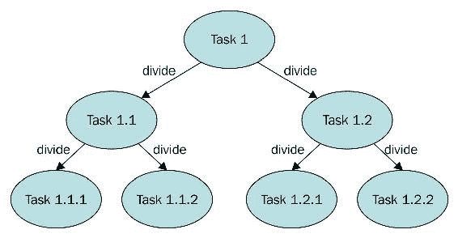
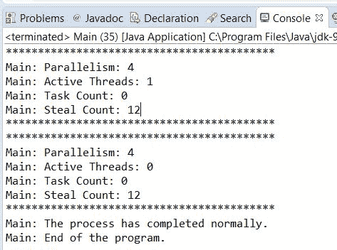
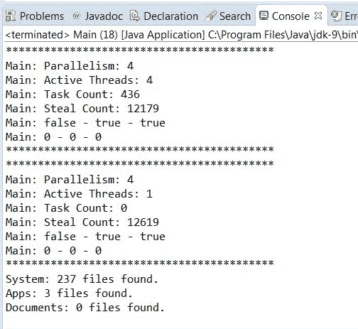
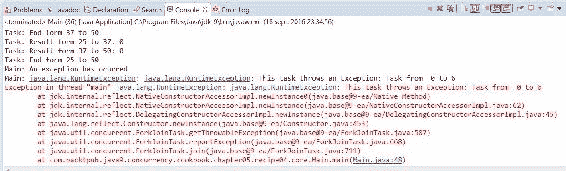
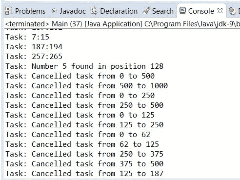

# 第五章：Fork/Join 框架

在本章中，我们将涵盖：

+   创建 fork/join 池

+   联合任务的结果

+   异步运行任务

+   在任务中抛出异常

+   取消任务

# 简介

通常，当你实现一个简单的并发 Java 应用程序时，你会实现一些 `Runnable` 对象，然后是相应的 `Thread` 对象。你在程序中控制这些线程的创建、执行和状态。Java 5 通过引入 `Executor` 和 `ExecutorService` 接口及其实现类（例如，`ThreadPoolExecutor` 类）进行了改进。

**Executor** 框架将任务创建和执行分离。使用它，你只需实现 `Runnable` 对象并使用一个 `Executor` 对象。你将 `Runnable` 任务发送给执行器，然后它创建、管理和最终化执行这些任务所需的线程。

Java 7 进一步发展，并包括了一个面向特定问题的 `ExecutorService` 接口的额外实现。它是 **fork/join 框架**。

该框架旨在解决可以使用分治技术分解为更小任务的问题。在一个任务内部，你检查你想要解决的问题的大小，如果它大于一个设定的阈值，你将其分解为更小的任务，这些任务使用框架执行。如果问题的大小小于设定的阈值，你直接在任务中解决问题，然后，可选地，返回一个结果。以下图表总结了这一概念：



没有公式可以确定问题的参考大小，这决定了任务是否要细分，取决于其特征。你可以使用任务中要处理的元素数量和执行时间的估计来确定参考大小。测试不同的参考大小，以选择最适合你问题的最佳选项。你可以将 `ForkJoinPool` 视为一种特殊的 `Executor`。

该框架基于以下两个操作：

+   **Fork 操作**：当你将任务分解为更小的任务并使用框架执行它们时。

+   **Join 操作**：当一个任务等待其创建的任务的最终化。它用于合并这些任务的结果。

fork/join 框架和 Executor 框架之间的主要区别是 **工作窃取** 算法。与 Executor 框架不同，当任务正在等待使用 join 操作创建的子任务的最终化时，执行该任务的线程（称为 **工作线程**）会寻找尚未执行的其他任务，并开始它们的执行。通过这种方式，线程充分利用它们的运行时间，从而提高应用程序的性能。

为了实现这一目标，由 fork/join 框架执行的任务有以下限制：

+   任务只能使用`fork()`和`join()`操作作为同步机制。如果它们使用其他同步机制，当它们处于同步操作时，工作线程无法执行其他任务。例如，如果在 fork/join 框架中将任务挂起，执行该任务的线程在挂起期间不会执行另一个任务。

+   任务不应执行 I/O 操作，例如在文件中读取或写入数据。

+   任务不能抛出受检异常。它们必须包含处理它们的必要代码。

fork/join 框架的核心由以下两个类组成：

+   `ForkJoinPool`：这个类实现了`ExecutorService`接口和工作窃取算法。它管理工作线程并提供有关任务状态及其执行的信息。

+   `ForkJoinTask`：这是将在`ForkJoinPool`中执行的任务的基类。它提供了在任务内部执行`fork()`和`join()`操作的机制以及控制任务状态的方法。通常，为了实现你的 fork/join 任务，你将实现这个类的三个子类之一：`RecursiveAction`用于没有返回结果的任务，`RecursiveTask`用于返回一个结果的任务，以及`CountedCompleter`用于在所有子任务完成后启动完成动作的任务。

该框架提供的多数特性都包含在 Java 7 中，但 Java 8 在其中添加了一些小特性。它包括了一个默认的`ForkJoinPool`对象。你可以使用`ForkJoinPool`类的静态方法`commonPool()`来获取它。默认的 fork/join 执行器将默认使用由你的计算机可用的处理器数量确定的线程数。你可以通过更改系统属性`java.util.concurrent.ForkJoinPool.common.parallelism`的值来改变这种默认行为。这个默认池被并发 API 的其他类内部使用。例如，**并行流**使用它。Java 8 还包含了之前提到的`CountedCompleter`类。

本章介绍了五个配方，展示了如何高效地使用 fork/join 框架。

# 创建一个 fork/join 池

在这个配方中，你将学习如何使用 fork/join 框架的基本元素。这包括以下内容：

+   创建一个用于执行任务的`ForkJoinPool`对象

+   在池中执行创建`ForkJoinTask`的子类

你将要使用的 fork/join 框架的主要特性如下：

+   你将使用默认构造函数创建`ForkJoinPool`。

+   在任务内部，你将使用 Java API 文档推荐的结构：

```java
        if (problem size > default size){ 
          tasks=divide(task); 
          execute(tasks); 
        } else { 
          resolve problem using another algorithm; 
        } 

```

+   你将以同步方式执行任务。当一个任务执行两个或多个子任务时，它将等待它们的完成。这样，执行该任务的线程（称为工作线程）将寻找其他任务来执行，充分利用它们的执行时间。

+   你将要实现的任务不会返回任何结果，因此你将`RecursiveAction`类作为它们实现的基础类。

# 准备工作

本菜谱中的示例已使用 Eclipse IDE 实现。如果你使用 Eclipse 或其他 IDE，如 NetBeans，打开它并创建一个新的 Java 项目。

# 如何实现...

在这个菜谱中，你将实现一个更新一系列产品价格的任务。初始任务将负责更新列表中的所有元素。你将使用大小为 10 作为参考大小，因此如果一个任务需要更新超过 10 个元素，它将把分配给它的列表部分分成两部分，并创建两个任务来更新相应部分的产品价格。

按照以下步骤实现示例：

1.  创建一个名为`Product`的类来存储产品的名称和价格：

```java
        public class Product { 

```

1.  声明一个名为`name`的私有`String`属性和一个名为`price`的私有`double`属性：

```java
        private String name; 
        private double price; 

```

1.  实现这些字段的 getter 和 setter 方法。它们非常简单实现，所以不包括其源代码。

1.  创建一个名为`ProductListGenerator`的类来生成一系列随机产品：

```java
        public class ProductListGenerator { 

```

1.  实现接收一个带有列表大小的`int`参数的`generate()`方法。它返回一个包含生成产品列表的`List<Product>`对象：

```java
        public List<Product> generate (int size) { 

```

1.  创建一个对象以返回产品列表：

```java
        List<Product> ret=new ArrayList<Product>(); 

```

1.  生成产品列表。将相同的单价分配给所有产品，例如`10`，以检查程序是否运行良好：

```java
          for (int i=0; i<size; i++){ 
            Product product=new Product(); 
            product.setName("Product "+i); 
            product.setPrice(10); 
            ret.add(product); 
          } 
          return ret; 
        } 

```

1.  创建一个名为`Task`的类。指定它扩展`RecursiveAction`类：

```java
        public class Task extends RecursiveAction { 

```

1.  声明一个名为`products`的私有`List<Product>`属性：

```java
        private List<Product> products; 

```

1.  声明两个名为`first`和`last`的私有`int`属性。这些属性将确定任务需要处理的产品的块：

```java
        private int first; 
        private int last; 

```

1.  声明一个名为`increment`的私有`double`属性来存储产品价格的增量：

```java
        private double increment; 

```

1.  实现类的构造函数，用于初始化类的所有属性：

```java
        public Task (List<Product> products, int first, int last,
                     double increment) { 
          this.products=products; 
          this.first=first; 
          this.last=last; 
          this.increment=increment; 
        } 

```

1.  实现一个名为`compute()`的方法，该方法将实现任务的逻辑：

```java
        @Override 
        protected void compute() { 

```

1.  如果`last`和`first`属性之间的差异小于`10`（任务需要更新少于`10`个产品），使用`updatePrices()`方法增加该组产品的价格：

```java
        if (last - first<10) { 
          updatePrices(); 

```

1.  如果`last`和`first`属性之间的差异大于或等于`10`，创建两个新的`Task`对象，一个用于处理产品的前半部分，另一个用于处理后半部分，并使用`invokeAll()`方法在`ForkJoinPool`中执行它们：

```java
        } else { 
          int middle=(last+first)/2; 
          System.out.printf("Task: Pending tasks:%s\n",
                            getQueuedTaskCount()); 
          Task t1=new Task(products, first,middle+1, increment); 
          Task t2=new Task(products, middle+1,last, increment); 
          invokeAll(t1, t2);   
        } 

```

1.  实现`updatePrices()`方法。此方法更新列表中`first`和`last`属性之间的位置所占据的产品：

```java
        private void updatePrices() { 
          for (int i=first; i<last; i++){ 
            Product product=products.get(i); 
            product.setPrice(product.getPrice()*(1+increment)); 
          } 
        } 

```

1.  通过创建一个名为`Main`的类并添加`main()`方法来实现示例的主类：

```java
        public class Main { 
          public static void main(String[] args) { 

```

1.  使用`ProductListGenerator`类创建一个包含`10000`个产品的列表：

```java
        ProductListGenerator generator=new ProductListGenerator(); 
        List<Product> products=generator.generate(10000); 

```

1.  创建一个新的`Task`对象来更新列表中所有产品的`prices`。参数`first`取值为`0`，`last`参数取值为`10000`（产品列表的大小）：

```java
        Task task=new Task(products, 0, products.size(), 0.20); 

```

1.  使用不带参数的构造函数创建一个`ForkJoinPool`对象：

```java
        ForkJoinPool pool=new ForkJoinPool(); 

```

1.  使用`execute()`方法在池中执行任务：

```java
        pool.execute(task); 

```

1.  实现一个每五毫秒显示池进化的代码块，将池的一些参数的值写入控制台，直到任务完成其执行：

```java
        do { 
          System.out.printf("Main: Thread Count:%d\n",
                            pool.getActiveThreadCount()); 
          System.out.printf("Main: Thread Steal:%d\n",
                            pool.getStealCount()); 
          System.out.printf("Main: Parallelism:%d\n",
                            pool.getParallelism()); 
          try { 
            TimeUnit.MILLISECONDS.sleep(5); 
          } catch (InterruptedException e) { 
            e.printStackTrace(); 
          } 
        } while (!task.isDone()); 

```

1.  使用`shutdown()`方法关闭池：

```java
        pool.shutdown(); 

```

1.  使用`isCompletedNormally()`方法检查任务是否无错误地完成，并在这种情况下向控制台写入一条消息：

```java
        if (task.isCompletedNormally()){ 
          System.out.printf("Main: The process has completed
                             normally.\n"); 
        } 

```

1.  所有产品在增加后的预期价格是`12`。将所有价格差异为`12`的产品名称和价格写入，以检查它们的价格是否都正确增加：

```java
        for (int i=0; i<products.size(); i++){ 
          Product product=products.get(i); 
          if (product.getPrice()!=12) { 
            System.out.printf("Product %s: %f\n",
                              product.getName(),product.getPrice()); 
          } 
        } 

```

1.  写入一条消息以指示程序的最终化：

```java
        System.out.println("Main: End of the program.\n"); 

```

# 它是如何工作的...

在这个例子中，你创建了一个`ForkJoinPool`对象和一个在池中执行的`ForkJoinTask`类的子类。为了创建`ForkJoinPool`对象，你使用了不带参数的构造函数，因此它将以默认配置执行。它创建了一个具有与计算机处理器数量相等的线程数量的池。当创建`ForkJoinPool`对象时，那些线程会被创建并在池中等待，直到有任务到达以供执行。

由于`Task`类不返回结果，它扩展了`RecursiveAction`类。在配方中，你使用了推荐的实现任务的架构。如果任务需要更新超过`10`个产品，它将那个元素集分成两个块，创建两个任务，并将一个块分配给每个任务。你使用了`Task`类中的`first`和`last`属性来知道这个任务在产品列表中需要更新的位置范围。你使用`first`和`last`属性来仅使用一个产品列表的副本，而不是为每个任务创建不同的列表。

为了执行任务创建的子任务，它调用`invokeAll()`方法。这是一个同步调用，任务在继续（可能完成）其执行之前等待子任务的最终化。当任务等待其子任务时，执行它的工作线程会获取另一个等待执行的任务并执行它。通过这种行为，fork/join 框架提供了比`Runnable`和`Callable`对象本身更有效的任务管理。

`ForkJoinTask` 类的 `invokeAll()` 方法是 Executor 和 fork/join 框架之间主要区别之一。在 Executor 框架中，所有任务都必须发送到执行器，而在这个例子中，任务包括在池内执行和控制任务的方法。你在扩展了 `RecursiveAction` 类的 `Task` 类中使用了 `invokeAll()` 方法，而 `RecursiveAction` 类又扩展了 `ForkJoinTask` 类。

你使用 `execute()` 方法向池中发送了一个独特的任务来更新所有产品列表。在这种情况下，这是一个异步调用，主线程继续执行。

你使用了 `ForkJoinPool` 类的一些方法来检查正在运行的任务的状态和演变。该类包括更多可用于此目的的方法。请参阅第九章 *监控 fork/join 池* 菜单，*测试并发应用程序*，以获取这些方法的完整列表。

最后，就像使用 Executor 框架一样，你应该使用 `shutdown()` 方法来结束 `ForkJoinPool`。

以下截图显示了此示例的部分执行过程：



你可以看到任务完成工作，产品价格更新。

# 还有更多...

`ForkJoinPool` 类提供了其他方法来执行任务。这些方法如下：

+   `execute (Runnable task)`: 这是示例中使用的 `execute()` 方法的另一个版本。在这种情况下，你向 `ForkJoinPool` 类发送一个 `Runnable` 任务。请注意，`ForkJoinPool` 类不使用 `Runnable` 对象的工作窃取算法。它仅与 `ForkJoinTask` 对象一起使用。

+   `invoke(ForkJoinTask<T> task)`: 虽然 `execute()` 方法会对 `ForkJoinPool` 类进行异步调用，正如你在示例中所学，但 `invoke()` 方法会对 `ForkJoinPool` 类进行同步调用。这个调用会一直持续到作为参数传递的任务完成执行才会返回。

+   你还可以使用在 `ExecutorService` 接口中声明的 `invokeAll()` 和 `invokeAny()` 方法。这些方法接收 `Callable` 对象作为参数。`ForkJoinPool` 类不使用 `Callable` 对象的工作窃取算法，因此你最好使用 `ThreadPoolExecutor` 来执行它们。

`ForkJoinTask` 类还包括示例中使用的 `invokeAll()` 方法的其他版本。这些版本如下：

+   `invokeAll(ForkJoinTask<?>... tasks)`: 这个方法版本使用可变数量的参数列表。你可以传递任意数量的 `ForkJoinTask` 对象作为参数。

+   `invokeAll(Collection<T> tasks)`: 这个方法版本接受一个泛型类型 `T` 的对象集合（例如，`ArrayList` 对象、`LinkedList` 对象或 `TreeSet` 对象）。这个泛型类型 `T` 必须是 `ForkJoinTask` 类或其子类。

虽然`ForkJoinPool`类是为执行`ForkJoinTask`对象而设计的，但你也可以直接执行`Runnable`和`Callable`对象。你还可以使用`ForkJoinTask`类的`adapt()`方法，该方法接受一个`Callable`对象或`Runnable`对象，并返回一个`ForkJoinTask`对象以执行该任务。

# 参见

+   在第九章的*监控 fork/join 池*菜谱中，*测试并发应用程序*

# 合并任务的结果

Fork/join 框架提供了执行返回结果的任务的能力。这种任务通过`RecursiveTask`类实现。这个类扩展了`ForkJoinTask`类，并实现了 Executor 框架提供的`Future`接口。

在任务内部，你必须使用 Java API 文档中推荐的架构：

```java
    if (problem size > size){ 
      tasks=Divide(task); 
      execute(tasks); 
      joinResults() 
      return result; 
    } else { 
      resolve problem; 
      return result; 
    } 

```

如果任务需要解决比预定义大小更大的问题，你将问题分解成更多的子任务，并使用 fork/join 框架执行这些子任务。当它们完成执行后，启动任务将获得所有子任务生成的结果，将它们分组，并返回最终结果。最终，当在池中启动的任务完成执行时，你将获得其结果，这实际上是整个问题的最终结果。

在这个菜谱中，你将通过开发一个在文档中查找单词的应用程序来学习如何使用这种问题解决方法，该应用程序将实现以下两种类型的任务：

+   一个文档任务，将在文档的一组行中搜索一个单词

+   一行任务，将在文档的一部分中搜索一个单词

所有任务都将返回单词在它们处理的文档部分或行中的出现次数。在这个菜谱中，我们将使用 Java 并发 API 提供的默认 fork/join 池。

# 如何做到这一点...

按照以下步骤实现示例：

1.  创建一个名为`DocumentMock`的类。它将生成一个字符串矩阵，以模拟文档：

```java
        public class DocumentMock { 

```

1.  创建一个包含一些单词的字符串数组。这个数组将用于生成字符串矩阵：

```java
        private String words[]={"the","hello","goodbye","packt",
                                "java","thread","pool","random",
                                "class","main"}; 

```

1.  实现一个`generateDocument()`方法。该方法接收行数、每行的单词数以及示例将要查找的单词作为参数。它返回一个字符串矩阵：

```java
        public String[][] generateDocument(int numLines, int numWords,
                                           String word){ 

```

1.  首先，创建生成文档所需的必要对象——字符串矩阵和一个用于生成随机数的`Random`对象：

```java
        int counter=0; 
        String document[][]=new String[numLines][numWords]; 
        Random random=new Random(); 

```

1.  用字符串填充数组。在每个位置存储在单词数组中随机位置的字符串，并计算程序将在生成的数组中查找的单词出现的次数。你可以使用这个值来检查程序是否正确地完成了其工作：

```java
        for (int i=0; i<numLines; i++){ 
          for (int j=0; j<numWords; j++) { 
            int index=random.nextInt(words.length); 
            document[i][j]=words[index]; 
            if (document[i][j].equals(word)){ 
              counter++; 
            } 
          } 
        } 

```

1.  写一条包含单词出现次数的消息，并返回生成的矩阵：

```java
        System.out.println("DocumentMock: The word appears "+ counter+"
                            times in the document"); 
        return document; 

```

1.  创建一个名为 `DocumentTask` 的类，并指定它扩展由 `Integer` 类参数化的 `RecursiveTask` 类。这个类将实现一个任务，用于计算一组行中单词出现的次数：

```java
        public class DocumentTask extends RecursiveTask<Integer> { 

```

1.  声明一个名为 `document` 的私有 `String` 矩阵和两个名为 `start` 和 `end` 的私有 `int` 属性。此外，声明一个名为 `word` 的私有 `String` 属性：

```java
        private String document[][]; 
        private int start, end; 
        private String word; 

```

1.  实现类的构造函数以初始化所有属性：

```java
        public DocumentTask (String document[][], int start, int end,
                             String word){ 
          this.document=document; 
          this.start=start; 
          this.end=end; 
          this.word=word; 
        } 

```

1.  实现 `compute()` 方法。如果 `end` 和 `start` 属性之间的差小于 `10`，任务通过调用 `processLines()` 方法计算这些位置之间的行中单词出现的次数：

```java
        @Override 
        protected Integer compute() { 
          Integer result=null; 
          if (end-start<10){ 
            result=processLines(document, start, end, word); 

```

1.  否则，将行组分成两个对象，创建两个新的 `DocumentTask` 对象来处理这两组，并使用 `invokeAll()` 方法在池中执行它们：

```java
        } else { 
          int mid=(start+end)/2; 
          DocumentTask task1=new DocumentTask(document,start,mid,word); 
          DocumentTask task2=new DocumentTask(document,mid,end,word); 
          invokeAll(task1,task2); 

```

1.  然后，使用 `groupResults()` 方法将两个任务返回的值相加。最后，返回任务计算出的结果：

```java
          try { 
            result=groupResults(task1.get(),task2.get()); 
          } catch (InterruptedException | ExecutionException e) { 
            e.printStackTrace(); 
          } 
        } 
        return result; 

```

1.  实现 `processLines()` 方法。它接收字符串矩阵、`start` 属性、`end` 属性以及任务正在搜索的 `word` 属性作为参数：

```java
        private Integer processLines(String[][] document, int start,
                                     int end,String word) { 

```

1.  对于任务必须处理的每一行，创建一个 `LineTask` 对象来处理完整行，并将它们存储在任务列表中：

```java
        List<LineTask> tasks=new ArrayList<LineTask>(); 
        for (int i=start; i<end; i++){ 
          LineTask task=new LineTask(document[i], 0,
                                     document[i].length, word); 
          tasks.add(task); 
        } 

```

1.  使用 `invokeAll()` 方法执行该列表中的所有任务：

```java
        invokeAll(tasks); 

```

1.  将所有这些任务返回的值相加并返回结果：

```java
        int result=0; 
        for (int i=0; i<tasks.size(); i++) { 
          LineTask task=tasks.get(i); 
          try { 
            result=result+task.get(); 
          } catch (InterruptedException | ExecutionException e) { 
            e.printStackTrace(); 
          } 
        } 
        return result; 

```

1.  实现 `groupResults()` 方法。它将两个数字相加并返回结果：

```java
        private Integer groupResults(Integer number1,Integer number2) { 
          Integer result; 
          result=number1+number2; 
          return result; 
        } 

```

1.  创建一个名为 `LineTask` 的类，并指定它扩展由 `Integer` 类参数化的 `RecursiveTask` 类。这个类将实现一个任务，用于计算一行中单词出现的次数：

```java
        public class LineTask extends RecursiveTask<Integer>{ 

```

1.  声明一个名为 `line` 的私有 `String` 数组属性和两个名为 `start` 和 `end` 的私有 `int` 属性。最后，声明一个名为 `word` 的私有 `String` 属性：

```java
        private String line[]; 
        private int start, end; 
        private String word; 

```

1.  实现类的构造函数以初始化所有属性：

```java
        public LineTask(String line[],int start,int end,String word) { 
          this.line=line; 
          this.start=start; 
          this.end=end; 
          this.word=word; 
        } 

```

1.  实现类的 `compute()` 方法。如果 `end` 和 `start` 属性之间的差小于 `100`，任务使用 `count()` 方法在由 `start` 和 `end` 属性确定的行片段中搜索单词：

```java
        @Override 
        protected Integer compute() { 
          Integer result=null; 
          if (end-start<100) { 
            result=count(line, start, end, word); 

```

1.  否则，将行中的单词组分成两部分，创建两个新的 `LineTask` 对象来处理这两组单词，并使用 `invokeAll()` 方法在池中执行它们：

```java
        } else { 
          int mid=(start+end)/2; 
          LineTask task1=new LineTask(line, start, mid, word); 
          LineTask task2=new LineTask(line, mid, end, word); 
          invokeAll(task1, task2); 

```

1.  然后，使用 `groupResults()` 方法将两个任务返回的值相加。最后，返回任务计算出的结果：

```java
          try { 
            result=groupResults(task1.get(),task2.get()); 
          } catch (InterruptedException | ExecutionException e) { 
            e.printStackTrace(); 
          } 
        } 
        return result; 

```

1.  实现 `count()` 方法。它接收包含完整行的字符串数组、`start` 属性、`end` 属性以及任务正在搜索的 `word` 属性作为参数：

```java
        private Integer count(String[] line, int start, int end,
                              String word) { 

```

1.  比较存储在`start`和`end`属性之间的位置上的单词与任务正在搜索的`word`属性，如果它们相等，则增加`counter`变量：

```java
        int counter; 
        counter=0; 
        for (int i=start; i<end; i++){ 
          if (line[i].equals(word)){ 
            counter++; 
          } 
        } 

```

1.  为了减慢示例的执行速度，将任务休眠`10`毫秒：

```java
        try { 
          Thread.sleep(10); 
        } catch (InterruptedException e) { 
          e.printStackTrace(); 
        } 

```

1.  返回`counter`变量的值：

```java
        return counter; 

```

1.  实现`groupResults()`方法。它将两个数字相加并返回`result`：

```java
        private Integer groupResults(Integer number1,Integer number2) { 
          Integer result; 
          result=number1+number2; 
          return result; 
        } 

```

1.  通过创建一个名为`Main`的类并包含一个`main()`方法来实现示例的主类：

```java
        public class Main{ 
          public static void main(String[] args) { 

```

1.  使用`DocumentMock`类创建具有`100`行和每行`1000`个单词的`Document`：

```java
        DocumentMock mock=new DocumentMock(); 
        String[][] document=mock.generateDocument(100, 1000, "the"); 

```

1.  创建一个新的`DocumentTask`对象来更新整个文档的产品。`start`参数取值为`0`，`end`参数取值为`100`：

```java
        DocumentTask task=new DocumentTask(document, 0, 100, "the"); 

```

1.  使用`commmonPool()`方法获取默认的`ForkJoinPool`执行器，并使用`execute()`方法在上面执行任务：

```java
        ForkJoinPool commonPool=ForkJoinPool.commonPool(); 
        commonPool.execute(task); 

```

1.  实现一个代码块，显示池的进度信息，每秒将池的一些参数的值写入控制台，直到任务完成执行：

```java
        do { 
          System.out.printf("*************************
                             *****************\n"); 
          System.out.printf("Main: Active Threads: %d\n",
                            commonPool.getActiveThreadCount()); 
          System.out.printf("Main: Task Count: %d\n",
                            commonPool.getQueuedTaskCount()); 
          System.out.printf("Main: Steal Count: %d\n",
                            commonPool.getStealCount()); 
          System.out.printf("***********************************
                             *******\n"); 
          try { 
            TimeUnit.SECONDS.sleep(1); 
          } catch (InterruptedException e) { 
            e.printStackTrace(); 
          } 
        } while (!task.isDone()); 

```

1.  使用`shutdown()`方法关闭池：

```java
        pool.shutdown(); 

```

1.  使用`awaitTermination()`方法等待任务的最终化：

```java
        try { 
          pool.awaitTermination(1, TimeUnit.DAYS); 
        } catch (InterruptedException e) { 
          e.printStackTrace(); 
        } 

```

1.  写出文档中单词出现的次数。检查这个数字是否与`DocumentMock`类写出的数字相同：

```java
        try { 
          System.out.printf("Main: The word appears %d in the
                             document",task.get()); 
        } catch (InterruptedException | ExecutionException e) { 
          e.printStackTrace(); 
        } 

```

# 它是如何工作的...

在这个例子中，你实现了两个不同的任务：

+   `DocumentTask`：此类任务必须处理由`start`和`end`属性确定的文档的一组行。如果这组行的数量小于`10`，它将为每一行创建一个`LineTask`，当它们完成执行后，它将那些任务的结果相加并返回总和的`result`。如果任务必须处理的行组的数量为`10`或更大，它将这组行分成两部分，并创建两个`DocumentTask`对象来处理这些新组。当这些任务完成执行后，任务将它们的结果相加并返回这个总和作为`result`。

+   `LineTask`：此类任务必须处理文档某一行的一组单词。如果这组单词的数量小于`100`，任务将直接在该组单词中搜索单词并返回单词出现的次数。否则，它将单词组分成两部分，并创建两个`LineTask`对象来处理这些组。当这些任务完成执行后，任务将两个任务的结果相加并返回这个总和作为`result`。

在 `Main` 类中，你使用了默认的 `ForkJoinPool`（通过静态方法 `commonPool()` 获取）并在其中执行了一个 `DocumentTask` 类，该类需要处理每行 `100` 行和每行 `1000` 个单词的文档。此任务将使用其他 `DocumentTask` 对象和 `LineTask` 对象来分解问题，当所有任务完成执行后，你可以使用原始任务来获取整个文档中单词出现的总数。由于任务返回结果，它们扩展了 `RecursiveTask` 类。

要获取 `Task` 返回的结果，你使用了 `get()` 方法。此方法声明在 `RecursiveTask` 类实现的 `Future` 接口中。

当你执行程序时，你可以比较在控制台写入的第一行和最后一行。第一行是文档生成时计算的单词出现次数，最后一行是 fork/join 任务计算出的相同数字。

# 更多...

`ForkJoinTask` 类提供了另一种完成任务执行并返回结果的方法，即 `complete()` 方法。此方法接受 `RecursiveTask` 类参数化中使用的对象类型，并在调用 `join()` 方法时将此对象作为任务的结果返回。建议使用此方法为异步任务提供结果。

由于 `RecursiveTask` 类实现了 `Future` 接口，因此 `get()` 方法还有一个版本：

+   `get(long timeout, TimeUnit unit)`：此版本的 `get()` 方法，如果任务的结果不可用，将等待指定的时间。如果指定的时间过去后结果仍然不可用，则方法返回一个 `null` 值。`TimeUnit` 类是一个枚举，具有以下常量：`DAYS`、`HOURS`、`MICROSECONDS`、`MILLISECONDS`、`MINUTES`、`NANOSECONDS` 和 `SECONDS`。

# 参见

+   本章中 *创建 fork/join 池* 的配方

+   第九章中的 *监控 fork/join 池* 配方，*测试并发应用程序*

# 异步运行任务

当你在 `ForkJoinPool` 中执行 `ForkJoinTask` 时，你可以以同步或异步的方式进行。当你以同步方式执行时，将任务发送到池中的方法不会返回，直到发送的任务完成执行。当你以异步方式执行时，将任务发送到执行器的那个方法会立即返回，因此任务可以继续执行。

你应该意识到这两种方法之间有一个很大的区别。当你使用同步方法时（例如，使用 `invokeAll()` 方法），调用这些方法之一的任务（例如，`invokeAll()` 方法）将暂停，直到它发送到池中的任务完成其执行。这允许 `ForkJoinPool` 类使用工作窃取算法将新任务分配给执行睡眠任务的工人线程。相反，当你使用异步方法（例如，使用 `fork()` 方法）时，任务将继续执行，因此 `ForkJoinPool` 类不能使用工作窃取算法来提高应用程序的性能。在这种情况下，只有当你调用 `join()` 或 `get()` 方法等待任务的最终化时，`ForkJoinPool` 类才能使用该算法。

除了 `RecursiveAction` 和 `RecursiveTask` 类之外，Java 8 引入了一个新的 `ForkJoinTask` 类，它与 `CountedCompleter` 类一起使用。使用这类任务，你可以在启动任务且没有挂起的子任务时包含一个完成动作。这种机制基于类中包含的一个方法（即 `onCompletion()` 方法）和挂起任务的计数器。

此计数器默认初始化为零，你可以在需要时以原子方式递增它。通常，你将逐个递增此计数器，正如你启动子任务时那样。最后，当任务完成其执行时，你可以尝试完成任务的执行，并相应地执行 `onCompletion()` 方法。如果挂起的计数大于零，则递减一个。如果为零，则执行 `onCompletion()` 方法，然后尝试完成父任务。

在本食谱中，你将学习如何使用 `ForkJoinPool` 和 `CountedCompleter` 类提供的异步方法来管理任务。你将实现一个程序，该程序将在文件夹及其子文件夹中搜索具有特定扩展名的文件。你将要实现的 `CountedCompleter` 类将处理文件夹的内容。对于该文件夹内的每个子文件夹，它将以异步方式向 `ForkJoinPool` 类发送一个新的任务。对于该文件夹内的每个文件，任务将检查文件的扩展名，并在继续的情况下将其添加到结果列表中。当一个任务完成时，它将将其子任务的全部结果列表插入其结果任务中。

# 如何实现...

按照以下步骤实现示例：

1.  创建一个名为 `FolderProcessor` 的类，并指定它扩展了参数化为 `List<String>` 类型的 `CountedCompleter` 类：

```java
        public class FolderProcessor extends
                                CountedCompleter<List<String>> { 

```

1.  声明一个名为 `path` 的私有 `String` 属性。该属性将存储任务将要处理的文件夹的完整路径：

```java
        private String path; 

```

1.  声明一个名为 `extension` 的私有 `String` 属性。该属性将存储任务将要查找的文件的扩展名：

```java
        private String extension; 

```

1.  声明两个名为`tasks`和`resultList`的私有`List`属性。我们将使用第一个来存储从该任务启动的所有子任务，并使用另一个来存储该任务的结果列表：

```java
        private List<FolderProcessor> tasks; 
        private List<String> resultList;      

```

1.  为该类实现一个构造函数以初始化其属性及其父类。我们将其声明为`protected`，因为它只会在内部使用：

```java
        protected FolderProcessor (CountedCompleter<?> completer,
                                   String path, String extension) { 
          super(completer); 
          this.path=path; 
          this.extension=extension; 
        } 

```

1.  我们实现其他公共构造函数以供外部使用。由于此构造函数创建的任务不会有父任务，因此我们不将此对象作为参数包含：

```java
        public FolderProcessor (String path, String extension) { 
          this.path=path; 
          this.extension=extension; 
        } 

```

1.  实现`compute()`方法。由于我们的任务的基础类是`CountedCompleter`类，因此此方法的返回类型为`void`：

```java
        @Override 
        public void compute() { 

```

1.  首先，初始化两个列表属性：

```java
        resultList=new ArrayList<>(); 
        tasks=new ArrayList<>(); 

```

1.  获取文件夹的内容：

```java
        File file=new File(path); 
        File content[] = file.listFiles(); 

```

1.  对于文件夹中的每个元素，如果存在子文件夹，则创建一个新的`FolderProcessor`对象，并使用`fork()`方法异步执行它。我们使用类的第一个构造函数，并将当前任务作为新任务的完成者任务传递。我们还使用`addToPendingCount()`方法增加挂起任务的计数器：

```java
        if (content != null) { 
          for (int i = 0; i < content.length; i++) { 
            if (content[i].isDirectory()) { 
              FolderProcessor task=new FolderProcessor(this,
                              content[i].getAbsolutePath(), extension); 
              task.fork(); 
              addToPendingCount(1); 
              tasks.add(task); 

```

1.  否则，使用`checkFile()`方法比较文件的扩展名与您正在寻找的扩展名，如果它们相等，则将文件的完整路径存储在之前声明的字符串列表中：

```java
          } else { 
            if (checkFile(content[i].getName())){ 
              resultList.add(content[i].getAbsolutePath()); 
            } 
          } 
        } 

```

1.  如果`FolderProcessor`子任务列表中的元素超过`50`个，向控制台写入一条消息以指示这种情况：

```java
          if (tasks.size()>50) { 
            System.out.printf("%s: %d tasks ran.\n",
                              file.getAbsolutePath(),tasks.size()); 
          } 
        } 

```

1.  最后，尝试使用`tryComplete()`方法完成当前任务：

```java
          tryComplete(); 
        } 

```

1.  实现`onCompletion()`方法。当所有子任务（从当前任务分叉的所有任务）完成执行时，将执行此方法。我们将所有子任务的结果列表添加到当前任务的结果列表中：

```java
        @Override 
        public void onCompletion(CountedCompleter<?> completer) { 
          for (FolderProcessor childTask : tasks) { 
            resultList.addAll(childTask.getResultList()); 
          } 
        } 

```

1.  实现`checkFile()`方法。此方法比较作为参数传递的文件名是否以您正在寻找的`extension`结尾。如果是，则方法返回`true`值，否则返回`false`值：

```java
        private boolean checkFile(String name) { 
          return name.endsWith(extension); 
        } 

```

1.  最后，实现`getResultList()`方法以返回任务的結果列表。此方法的代码非常简单，因此不会包含在内。

1.  通过创建一个名为`Main`的类并包含一个`main()`方法来实现示例的主类：

```java
        public class Main { 
          public static void main(String[] args) { 

```

1.  使用默认构造函数创建`ForkJoinPool`：

```java
        ForkJoinPool pool=new ForkJoinPool(); 

```

1.  创建三个`FolderProcessor`任务。初始化每个任务时使用不同的文件夹路径：

```java
        FolderProcessor system=new FolderProcessor("C:\\Windows",
                                                   "log"); 
        FolderProcessor apps=new FolderProcessor("C:\\Program Files",
                                                 "log"); 
        FolderProcessor documents=new FolderProcessor("C:\\Documents
                                                 And Settings","log"); 

```

1.  使用`execute()`方法在池中执行三个任务：

```java
        pool.execute(system); 
        pool.execute(apps); 
        pool.execute(documents); 

```

1.  在三个任务完成执行之前，每秒向控制台写入有关池状态的信息：

```java
        do { 
          System.out.printf("**********************************
                             ********\n"); 
          System.out.printf("Main: Active Threads: %d\n",
                            pool.getActiveThreadCount()); 
          System.out.printf("Main: Task Count: %d\n",
                            pool.getQueuedTaskCount()); 
          System.out.printf("Main: Steal Count: %d\n",
                            pool.getStealCount()); 
          System.out.printf("**********************************
                             ********\n"); 
          try { 
            TimeUnit.SECONDS.sleep(1); 
          } catch (InterruptedException e) { 
            e.printStackTrace(); 
          } 
        } while ((!system.isDone())||(!apps.isDone())||
                 (!documents.isDone())); 

```

1.  使用`shutdown()`方法关闭`ForkJoinPool`：

```java
        pool.shutdown(); 

```

1.  将每个任务生成的结果数量写入控制台：

```java
        List<String> results; 

        results=system.join(); 
        System.out.printf("System: %d files found.\n",results.size()); 

        results=apps.join(); 
        System.out.printf("Apps: %d files found.\n",results.size()); 

        results=documents.join(); 
        System.out.printf("Documents: %d files found.\n",
                           results.size()); 

```

# 它是如何工作的...

以下截图显示了先前示例的部分执行情况：



本例的关键在于`FolderProcessor`类。每个任务处理一个文件夹的内容。正如你所知，这个内容有以下两种元素：

+   文件

+   其他文件夹

如果任务找到一个文件夹，它将创建另一个`FolderProcessor`对象来处理该文件夹，并使用`fork()`方法将其发送到池中。此方法将任务发送到将执行它的池，如果它有一个空闲的工作线程，或者它可以创建一个新的线程。该方法立即返回，因此任务可以继续处理文件夹的内容。对于每个文件，任务将其扩展名与其正在寻找的扩展名进行比较，如果它们相等，则将文件的名称添加到`results`列表中。

一旦任务处理完分配文件夹的所有内容，我们就尝试完成当前任务。正如我们在本食谱的介绍中所解释的，当我们尝试完成一个任务时，`CountedCompleter`的代码会查找待处理任务计数器的值。如果这个值大于`0`，它会减少该计数器的值。相反，如果值是`0`，任务将执行`onCompletion()`方法，然后尝试完成其父任务。在我们的情况下，当一个任务正在处理一个文件夹并找到一个子文件夹时，它会创建一个新的子任务，使用`fork()`方法启动该任务，并增加待处理任务的计数器。因此，当一个任务处理完其全部内容时，该任务的待处理任务计数器将等于我们启动的子任务数量。当我们调用`tryComplete()`方法时，如果当前任务的文件夹有子文件夹，这个调用将减少待处理任务的数量。只有当所有子任务都已完成，它的`onCompletion()`方法才会被执行。如果当前任务的文件夹没有任何子文件夹，待处理任务的计数器将为零；`onComplete()`方法将立即被调用，然后它将尝试完成其父任务。这样，我们从上到下创建了一个任务树，这些任务从下到上完成。在`onCompletion()`方法中，我们处理所有子任务的输出列表，并将它们的元素添加到当前任务的输出列表中。

`ForkJoinPool`类还允许以异步方式执行任务。你使用了`execute()`方法将三个初始任务发送到池中。在`Main`类中，你还使用`shutdown()`方法关闭了池，并写下了关于其中正在运行的任务的状态和进化的信息。`ForkJoinPool`类包括更多可用于此目的的方法。请参阅第九章中关于*监控 fork/join 池*的食谱，*测试并发应用程序*，以查看这些方法的完整列表。

# 还有更多...

在这个例子中，我们使用了`addToPendingCount()`方法来增加待处理任务的计数器，但我们还有其他方法可以用来改变这个计数器的值：

+   `setPendingCount()`: 此方法设置待处理任务计数器的值。

+   `compareAndSetPendingCount()`: 此方法接收两个参数。第一个是预期值，第二个是新值。如果待处理任务计数器的值等于预期值，则将其值设置为新的值。

+   `decrementPendingCountUnlessZero()`: 此方法会减少待处理任务计数器的值，除非它等于零。

`CountedCompleter`类还包括其他方法来管理任务的完成。以下是最重要的几个：

+   `complete()`: 此方法独立于待处理任务计数器的值执行`onCompletion()`方法，并尝试完成其完成者（父）任务。

+   `onExceptionalCompletion()`: 当调用`completeExceptionally()`方法或`compute()`方法抛出`Exception`时，此方法会被执行。重写此方法以包含处理此类异常的代码。

在这个例子中，你使用了`join()`方法等待任务的最终化并获取其结果。你也可以使用以下两种`get()`方法版本之一来完成这个目的：

+   `get(long timeout, TimeUnit unit)`: 此版本的`get()`方法，如果任务的结果不可用，将等待指定的时间。如果指定的时间过去后结果仍然不可用，则方法返回一个`null`值。`TimeUnit`类是一个枚举，具有以下常量：`DAYS`、`HOURS`、`MICROSECONDS`、`MILLISECONDS`、`MINUTES`、`NANOSECONDS`和`SECONDS`

+   `join()`方法不能被中断。如果你中断了调用`join()`方法的线程，该方法会抛出`InterruptedException`异常。

# 参见

+   本章中的*创建 fork/join 池*配方

+   在第九章的*监控 fork/join 池*配方中，*测试并发应用程序*

# 在任务中抛出异常

Java 中有两种类型的异常：

+   **检查型异常**: 这些异常必须在方法的`throws`子句中指定或在它们内部捕获。例如，`IOException`或`ClassNotFoundException`。

+   **非检查型异常**: 这些异常不需要指定或捕获。例如，`NumberFormatException`。

在 `ForkJoinTask` 类的 `compute()` 方法中不能抛出任何已检查的异常，因为这个方法在其实现中不包含任何 `throws` 声明。您必须包含必要的代码来处理已检查的异常。另一方面，您可以抛出（或方法内部使用的任何方法或对象可以抛出）未检查的异常。`ForkJoinTask` 和 `ForkJoinPool` 类的行为可能与你预期的不同。程序不会完成执行，你也不会在控制台看到任何关于异常的信息。它只是被默默吞没，就像它没有被抛出一样。只有当你调用初始任务的 `get()` 方法时，异常才会被抛出。然而，您可以使用 `ForkJoinTask` 类的一些方法来了解任务是否抛出了异常，以及抛出了什么类型的异常。在本食谱中，您将学习如何获取这些信息。

# 准备工作

本例的食谱实现使用了 Eclipse IDE。如果您使用 Eclipse 或其他如 NetBeans 之类的 IDE，请打开它并创建一个新的 Java 项目。

# 如何操作...

按照以下步骤实现示例：

1.  创建一个名为 `Task` 的类。指定它实现 `RecursiveTask` 类，并使用 `Integer` 类进行参数化：

```java
        public class Task extends RecursiveTask<Integer> { 

```

1.  声明一个名为 `array` 的私有 `int` 数组。它将模拟您在本例中将要处理的数据数组：

```java
        private int array[]; 

```

1.  声明两个名为 `start` 和 `end` 的私有 `int` 属性。这些属性将确定任务需要处理的数组元素：

```java
        private int start, end; 

```

1.  实现类的构造函数，初始化其属性：

```java
        public Task(int array[], int start, int end){ 
          this.array=array; 
          this.start=start; 
          this.end=end; 
        } 

```

1.  实现任务的 `compute()` 方法。由于您已将 `RecursiveTask` 类参数化为 `Integer` 类，因此此方法必须返回一个 `Integer` 对象。首先，向控制台发送一条消息，包含 `start` 和 `end` 属性的值：

```java
        @Override 
        protected Integer compute() { 
          System.out.printf("Task: Start from %d to %d\n",start,end);  

```

1.  如果此任务需要处理的元素块（由 `start` 和 `end` 属性确定）的大小小于 `10`，则检查数组中第四个位置的元素（索引号为三）是否在该块中。如果是这样，则抛出 `RuntimeException`。然后，让任务休眠一秒钟：

```java
        if (end-start<10) { 
          if ((3>start)&&(3<end)){ 
            throw new RuntimeException("This task throws an"+
                            "Exception: Task from  "+start+" to "+end); 
          } 
          try { 
            TimeUnit.SECONDS.sleep(1); 
          } catch (InterruptedException e) { 
            e.printStackTrace(); 
          } 

```

1.  否则（此任务需要处理的元素块的大小为 10 或更大），将元素块分成两半，创建两个 `Task` 对象来处理这些块，并使用 `invokeAll()` 方法在池中执行它们。然后，我们将这些任务的结果写入控制台：

```java
        } else { 
          int mid=(end+start)/2; 
          Task task1=new Task(array,start,mid); 
          Task task2=new Task(array,mid,end); 
          invokeAll(task1, task2); 
          System.out.printf("Task: Result form %d to %d: %d\n",
                            start,mid,task1.join()); 
          System.out.printf("Task: Result form %d to %d: %d\n",
                            mid,end,task2.join()); 
        } 

```

1.  向控制台发送一条消息，指示任务的结束，并写入 `start` 和 `end` 属性的值：

```java
        System.out.printf("Task: End form %d to %d\n",start,end); 

```

1.  将 `0` 作为任务的结果返回：

```java
        return 0; 

```

1.  通过创建一个名为 `Main` 的类并包含一个 `main()` 方法来实现示例的主类：

```java
        public class Main { 
          public static void main(String[] args) { 

```

1.  创建一个包含 `100` 个整数数字的数组：

```java
        int array[]=new int[100]; 

```

1.  创建一个 `Task` 对象来处理那个 `array`：

```java
        Task task=new Task(array,0,100); 

```

1.  使用默认构造函数创建一个 `ForkJoinPool` 对象：

```java
        ForkJoinPool pool=new ForkJoinPool(); 

```

1.  使用 `execute()` 方法在池中执行任务：

```java
        pool.execute(task); 

```

1.  使用 `shutdown()` 方法关闭 `ForkJoinPool` 类：

```java
        pool.shutdown(); 

```

1.  使用 `awaitTermination()` 方法等待任务的最终化。由于你希望无论任务完成所需时间多长都等待其最终化，因此将值 `1` 和 `TimeUnit.DAYS` 作为参数传递给此方法：

```java
        try { 
          pool.awaitTermination(1, TimeUnit.DAYS); 
        } catch (InterruptedException e) { 
          e.printStackTrace(); 
        } 

```

1.  使用 `isCompletedAbnormally()` 方法检查任务或其子任务是否抛出了异常。在这种情况下，将异常消息写入控制台。使用 `ForkJoinTask` 类的 `getException()` 方法获取该异常：

```java
        if (task.isCompletedAbnormally()) { 
          System.out.printf("Main: An exception has ocurred\n"); 
          System.out.printf("Main: %s\n",task.getException()); 
        } 
        System.out.printf("Main: Result: %d",task.join()); 

```

# 它是如何工作的...

在此配方中实现的 `Task` 类处理一个数字数组。它检查它必须处理的数字块是否有 `10` 个或更多元素。在这种情况下，它将块分成两部分并创建两个新的 `Task` 对象来处理这些块。否则，它会在数组的第四个位置（索引号为三）查找元素。如果该元素在任务必须处理的块中，它将抛出 `RuntimeException`。

当你执行程序时，会抛出异常，但程序不会停止。在 `Main` 类中，你使用原始任务调用了 `ForkJoinTask` 类的 `isCompletedAbnormally()` 方法。如果该任务或其子任务抛出了异常，此方法返回 `true`。你还使用了同一对象的 `getException()` 方法来获取它抛出的 `Exception` 对象。

当你在任务中抛出未检查的异常时，它也会影响其父任务（将其发送到 `ForkJoinPool` 类的任务）及其父任务的父任务，依此类推。如果你审查整个程序的输出，你会看到某些任务的最终化没有输出消息。这些任务的起始消息如下：

```java
    Task: Starting form 0 to 100 
    Task: Starting form 0 to 50 
    Task: Starting form 0 to 25 
    Task: Starting form 0 to 12 
    Task: Starting form 0 to 6 

```

这些任务是抛出异常及其父任务的那些任务。所有这些任务都异常完成。当你使用可能抛出异常的 `ForkJoinPool` 和 `ForkJoinTask` 对象开发程序时，请考虑这一点，如果你不希望出现这种行为。

以下截图显示了此示例的部分执行：



# 更多内容...

在此示例中，你使用了 `join()` 方法等待任务的最终化并获取其结果。你也可以使用以下两种 `get()` 方法的其中一种来达到此目的：

+   `get()`: 此版本的 `get()` 方法在 `ForkJoinTask` 完成其执行后返回 `compute()` 方法返回的值，或者它等待直到其最终化。

+   `get(long timeout, TimeUnit unit)`: 此版本的 `get()` 方法，如果任务的输出不可用，将等待指定的时间。如果指定的时间过去而结果仍然不可用，则方法返回一个 `null` 值。`TimeUnit` 类是一个枚举，具有以下常量：`DAYS`、`HOURS`、`MICROSECONDS`、`MILLISECONDS`、`MINUTES`、`NANOSECONDS` 和 `SECONDS`。

`get()`方法和`join()`方法之间有两个主要区别：

+   `join()`方法不能被中断。如果你中断调用`join()`方法的线程，该方法会抛出`InterruptedException`。

+   当`get()`方法会返回`ExecutionException`如果任务抛出任何未检查的异常时，`join()`方法将返回`RuntimeException`。

如果不是抛出异常，而是使用`ForkJoinTask`类的`completeExceptionally()`方法，你可以获得与示例中相同的结果。代码如下：

```java
    Exception e=new Exception("This task throws an Exception: "+
                              "Task from  "+start+" to "+end); 
    completeExceptionally(e); 

```

# 参见

+   本章中创建一个**创建 fork/join 池**的配方

# 取消任务

当你在`ForkJoinPool`类中执行`ForkJoinTask`对象时，你可以在它们开始执行之前取消它们。`ForkJoinTask`类提供了`cancel()`方法用于此目的。当你想要取消一个任务时，你必须注意一些要点，如下所示：

+   `ForkJoinPool`类不提供任何方法来取消它在池中运行或等待的所有任务

+   当你取消一个任务时，你不会取消该任务已执行的任务

在这个配方中，你将实现一个取消`ForkJoinTask`对象的示例。你将查找数组中数字的位置。第一个找到数字的任务将取消其余任务。由于 fork/join 框架不提供此功能，你将实现一个辅助类来完成此取消。

# 准备中...

本配方的示例已使用 Eclipse IDE 实现。如果您使用 Eclipse 或其他 IDE 如 NetBeans，请打开它并创建一个新的 Java 项目。

# 如何做...

按照以下步骤实现示例：

1.  创建一个名为`ArrayGenerator`的类。这个类将生成一个指定大小的随机整数数组。实现一个名为`generateArray()`的方法。它将生成数字数组。它接收数组的大小作为参数：

```java
        public class ArrayGenerator { 
          public int[] generateArray(int size) { 
            int array[]=new int[size]; 
            Random random=new Random(); 
            for (int i=0; i<size; i++){ 
              array[i]=random.nextInt(10); 
            } 
            return array; 
          } 

```

1.  创建一个名为`TaskManager`的类。我们将使用这个类来存储示例中使用的`ForkJoinPool`中执行的所有任务。由于`ForkJoinPool`和`ForkJoinTask`类的限制，你将使用这个类来取消`ForkJoinPool`类的所有任务：

```java
        public class TaskManager { 

```

1.  声明一个使用`ForkJoinTask`类参数化的对象列表，使用名为`List`的`Integer`类参数化：

```java
        private final ConcurrentLinkedDeque<SearchNumberTask> tasks; 

```

1.  实现类的构造函数。它初始化任务列表：

```java
        public TaskManager(){ 
          tasks=new ConcurrentLinkedDeque<>(); 
        } 

```

1.  实现一个`addTask()`方法。它将一个`ForkJoinTask`对象添加到任务列表中：

```java
        public void addTask(ForkJoinTask<Integer> task){ 
          tasks.add(task); 
        } 

```

1.  实现一个`cancelTasks()`方法。它将使用`cancel()`方法取消存储在列表中的所有`ForkJoinTask`对象。它接收一个参数，即想要取消其余任务的`ForkJoinTask`对象。该方法取消所有任务：

```java
        public void cancelTasks(SearchNumberTask cancelTask){ 
          for (SearchNumberTask task  :tasks) { 
            if (task!=cancelTask) { 
              task.cancel(true); 
              task.logCancelMessage(); 
            } 
          } 
        } 

```

1.  实现一个名为 `SearchNumberTask` 的类。指定它扩展了参数化为 `Integer` 类的 `RecursiveTask` 类。这个类将在整数数组的元素块中查找一个数字：

```java
        public class SearchNumberTask extends RecursiveTask<Integer> { 

```

1.  声明一个名为 `numbers` 的私有 `int` 数组：

```java
        private int numbers[]; 

```

1.  声明两个名为 `start` 和 `end` 的私有 `int` 属性。这些属性将确定这个任务需要处理的数组元素：

```java
        private int start, end; 

```

1.  声明一个名为 `number` 的私有 `int` 属性来存储你要查找的数字：

```java
        private int number; 

```

1.  声明一个名为 `manager` 的私有 `TaskManager` 属性。你将使用这个对象来取消所有任务：

```java
        private TaskManager manager; 

```

1.  声明一个私有的 `int` 常量并将其初始化为 `-1`。当任务找不到数字时，它将返回这个值：

```java
        private final static int NOT_FOUND=-1; 

```

1.  实现类的构造函数以初始化其属性：

```java
        public SearchNumberTask(int numbers[], int start, int end,
                                int number, TaskManager manager){ 
          this.numbers=numbers; 
          this.start=start; 
          this.end=end; 
          this.number=number; 
          this.manager=manager; 
        } 

```

1.  实现一个名为 `compute()` 的方法。首先，向控制台写入一条消息，指示 `start` 和 `end` 属性的值：

```java
        @Override 
        protected Integer compute() { 
          System.out.println("Task: "+start+":"+end); 

```

1.  如果 `start` 和 `end` 属性之间的差异大于 `10`（任务需要处理数组中的超过 `10` 个元素），调用 `launchTasks()` 方法将这个任务的工作分成两个子任务：

```java
        int ret; 
        if (end-start>10) { 
          ret=launchTasks(); 

```

1.  否则，在调用 `lookForNumber()` 方法的任务需要处理的数组块中查找数字：

```java
        } else { 
          ret=lookForNumber(); 
        } 

```

1.  返回任务的结果：

```java
        return ret; 

```

1.  实现一个名为 `lookForNumber()` 的方法：

```java
        private int lookForNumber() { 

```

1.  对于这个任务需要处理的元素块中的所有元素，比较该元素中存储的值与你要查找的数字。如果它们相等，向控制台写入一条消息，在这种情况下，使用 `TaskManager` 对象的 `cancelTasks()` 方法取消所有任务，并返回找到数字的元素位置：

```java
        for (int i=start; i<end; i++){ 
          if (numbers[i]==number) { 
            System.out.printf("Task: Number %d found in position %d\n",
                              number,i); 
            manager.cancelTasks(this); 
            return i; 
          } 

```

1.  在循环内部，让任务休眠一秒钟：

```java
          try { 
            TimeUnit.SECONDS.sleep(1); 
          } catch (InterruptedException e) { 
            e.printStackTrace(); 
          } 
        } 

```

1.  最后，返回 `-1` 值：

```java
          return NOT_FOUND; 
        } 

```

1.  实现一个名为 `launchTasks()` 的方法。首先，将这个任务需要处理的数字块分成两块，然后创建两个 `Task` 对象来处理它们：

```java
        private int launchTasks() { 
          int mid=(start+end)/2; 

          Task task1=new Task(numbers,start,mid,number,manager); 
          Task task2=new Task(numbers,mid,end,number,manager); 

```

1.  将任务添加到 `TaskManager` 对象中：

```java
        manager.addTask(task1); 
        manager.addTask(task2); 

```

1.  使用 `fork()` 方法异步执行两个任务：

```java
        task1.fork(); 
        task2.fork(); 

```

1.  等待任务的最终化，如果第一个任务的结果不等于 `-1`，则返回第一个任务的结果，否则返回第二个任务的结果：

```java
        int returnValue; 
        returnValue=task1.join(); 
        if (returnValue!=-1) { 
          return returnValue; 
        } 

        returnValue=task2.join(); 
        return returnValue; 

```

1.  实现一个名为 `writeCancelMessage()` 的方法，在任务被取消时写入一条消息：

```java
        public void logCancelMessage(){ 
          System.out.printf("Task: Canceled task from %d to %d",
                            start,end); 
        } 

```

1.  通过创建一个名为 `Main` 的类并包含一个 `main()` 方法来实现示例的主类：

```java
        public class Main { 
          public static void main(String[] args) { 

```

1.  使用 `ArrayGenerator` 类创建一个包含 `1000` 个数字的数组：

```java
        ArrayGenerator generator=new ArrayGenerator(); 
        int array[]=generator.generateArray(1000); 

```

1.  创建一个 `TaskManager` 对象：

```java
        TaskManager manager=new TaskManager(); 

```

1.  使用默认构造函数创建一个 `ForkJoinPool` 对象：

```java
        ForkJoinPool pool=new ForkJoinPool(); 

```

1.  创建一个用于处理之前生成的数组的 `Task` 对象：

```java
        SearchNumberTask task=new SearchNumberTask (array,0,1000,
                                                    5,manager); 

```

1.  使用 `execute()` 方法在池中异步执行任务：

```java
        pool.execute(task); 

```

1.  使用 `shutdown()` 方法关闭池：

```java
        pool.shutdown(); 

```

1.  使用 `ForkJoinPool` 类的 `awaitTermination()` 方法等待任务的最终化：

```java
        try { 
          pool.awaitTermination(1, TimeUnit.DAYS); 
        } catch (InterruptedException e) { 
          e.printStackTrace(); 
        } 

```

1.  向控制台写入一条消息，指示程序的结束：

```java
        System.out.printf("Main: The program has finished\n"); 

```

# 它是如何工作的...

`ForkJoinTask` 类提供了一个 `cancel()` 方法，允许你在任务尚未执行之前取消它。这是一个非常重要的点。如果任务已经开始执行，调用 `cancel()` 方法将没有任何效果。该方法接收一个名为 `mayInterruptIfRunning` 的 `Boolean` 类型的参数。这个名称可能让你认为，如果你向该方法传递 `true` 值，即使任务正在运行，任务也会被取消。Java API 文档指定，在 `ForkJoinTask` 类的默认实现中，此属性没有任何效果。只有当任务尚未开始执行时，才会取消任务。取消任务对已取消任务发送到池中的任务没有影响。它们将继续执行。

Fork/join 框架的一个限制是它不允许取消 `ForkJoinPool` 中所有的任务。为了克服这个限制，你实现了 `TaskManager` 类。它存储了所有已发送到池中的任务。它有一个取消它存储的所有任务的方法。如果一个任务因为正在运行或已完成而无法取消，`cancel()` 方法将返回 `false` 值，这样你就可以尝试取消所有任务，而不必担心可能的副作用。

在示例中，你实现了一个在数字数组中查找数字的任务。你按照 fork/join 框架的建议将问题分解成更小的子问题。你只对数字的一个出现感兴趣，所以当你找到它时，你取消其他任务。

以下截图显示了此示例执行的一部分：



# 参见

+   本章中 *创建 fork/join 池* 的配方
