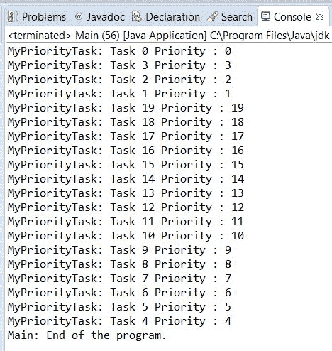
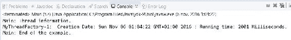
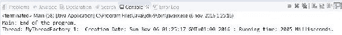
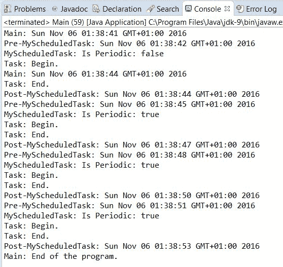
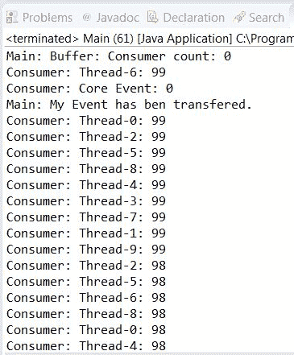
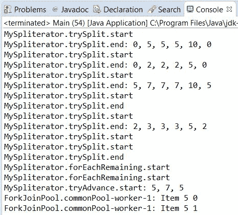
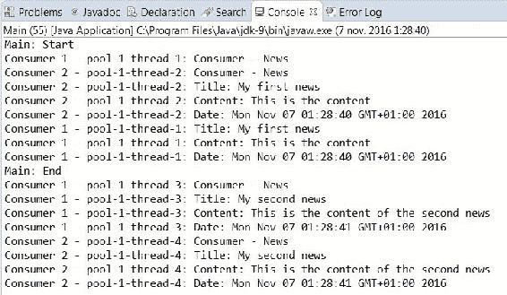

# 第八章：自定义并发类

在本章中，我们将涵盖以下主题：

+   自定义 ThreadPoolExecutor 类

+   实现基于优先级的 Executor 类

+   实现 ThreadFactory 接口以生成自定义线程

+   在 Executor 对象中使用我们的 ThreadFactory

+   自定义在计划线程池中运行的任务

+   实现 ThreadFactory 接口以生成 fork/join 框架的自定义线程

+   自定义在 fork/join 框架中运行的任务

+   实现自定义锁类

+   实现基于优先级的传输队列

+   实现您自己的原子对象

+   实现您自己的流生成器

+   实现您自己的异步流

# 简介

Java 并发 API 提供了许多接口和类来实现并发应用程序。它们提供了低级机制，例如`Thread`类、`Runnable`或`Callable`接口，或者`synchronized`关键字。它们还提供了高级机制，例如`Executor`框架和 Java 7 版本中添加的 fork/join 框架，或者 Java 8 中添加的`Stream`框架，以处理大量数据集。尽管如此，您可能会发现自己正在开发一个程序，其中 Java API 的默认配置和/或实现不符合您的需求。

在这种情况下，您可能需要根据 Java 提供的实现实现您自己的自定义并发工具。基本上，您可以：

+   实现一个接口以提供该接口定义的功能，例如`ThreadFactory`接口。

+   覆盖一个类的一些方法以适应您的需求。例如，覆盖`Phaser`类的`onAdvance()`方法，默认情况下该方法不执行任何有用的操作，并应被覆盖以提供一些功能。

通过本章的食谱，您将学习如何在不从头设计并发框架的情况下更改一些 Java 并发 API 类的行为。您可以将这些食谱作为实现您自己的自定义的起点。

# 自定义 ThreadPoolExecutor 类

`Executor`框架是一种机制，允许您将线程创建与其执行分离。它基于`Executor`和`ExecutorService`接口，`ThreadPoolExecutor`类实现了这两个接口。它有一个内部线程池，并提供方法允许您发送两种类型的任务并在池线程中执行它们。这些任务是：

+   实现`Runnable`接口的任务不返回结果

+   实现返回结果的`Callable`接口的任务

在这两种情况下，您只需将任务发送给执行器。执行器使用其池中的线程之一或创建一个新的线程来执行这些任务。它还决定任务执行的时刻。

在这个菜谱中，你将学习如何重写 `ThreadPoolExecutor` 类的一些方法来计算你将在执行器中执行的任务的执行时间，并在执行器完成执行时在控制台统计信息中写入关于执行器的内容：

# 准备就绪

本菜谱的示例使用 Eclipse IDE 实现。如果您使用 Eclipse 或其他 IDE，例如 NetBeans，请打开它并创建一个新的 Java 项目：

# 如何做到这一点...

按照以下步骤实现示例：

1.  创建一个名为 `MyExecutor` 的类，该类扩展了 `ThreadPoolExecutor` 类：

```java
        public class MyExecutor extends ThreadPoolExecutor {

```

1.  声明一个名为 `startTimes` 的私有 `ConcurrentHashMap` 属性，该属性由 `String` 和 `Date` 类参数化：

```java
        private final ConcurrentHashMap<Runnable, Date> startTimes;

```

1.  实现类的构造函数。使用 `super` 关键字调用父类的构造函数并初始化 `startTime` 属性：

```java
        public MyExecutor(int corePoolSize, int maximumPoolSize,
                          long keepAliveTime, TimeUnit unit,
                          BlockingQueue<Runnable> workQueue) {
          super(corePoolSize, maximumPoolSize, keepAliveTime, unit,
                workQueue);
          startTimes=new ConcurrentHashMap<>();
        }

```

1.  重写 `shutdown()` 方法。在控制台输出已执行、正在运行和挂起的任务信息。然后，使用 `super` 关键字调用父类的 `shutdown()` 方法：

```java
        @Override 
        public void shutdown() { 
          System.out.printf("MyExecutor: Going to shutdown.\n"); 
          System.out.printf("MyExecutor: Executed tasks: %d\n",
                            getCompletedTaskCount());

```

```java
          System.out.printf("MyExecutor: Running tasks: %d\n",
                            getActiveCount());                                      System.out.printf("MyExecutor: Pending tasks: %d\n",
                            getQueue().size()); 
          super.shutdown(); 
        }

```

1.  重写 `shutdownNow()` 方法。在控制台输出已执行、正在运行和挂起的任务信息。然后，使用 `super` 关键字调用父类的 `shutdownNow()` 方法：

```java
        @Override 
        public List<Runnable> shutdownNow() { 
          System.out.printf("MyExecutor: Going to immediately
                            shutdown.\n"); 
          System.out.printf("MyExecutor: Executed tasks: %d\n",
                            getCompletedTaskCount()); 
          System.out.printf("MyExecutor: Running tasks: %d\n",
                            getActiveCount()); 
          System.out.printf("MyExecutor: Pending tasks: %d\n",
                            getQueue().size()); 
          return super.shutdownNow(); 
        }

```

1.  重写 `beforeExecute()` 方法。在控制台输出将要执行任务的线程名称和任务的哈希码。使用任务的哈希码作为键在 `HashMap` 中存储开始日期：

```java
        @Override 
        protected void beforeExecute(Thread t, Runnable r) { 
          System.out.printf("MyExecutor: A task is beginning: %s : %s\n",
                                t.getName(),r.hashCode()); 
          startTimes.put(r, new Date()); 
        }

```

1.  重写 `afterExecute()` 方法。在控制台输出任务的结果，并计算任务运行时间，通过从存储在 `HashMap` 中的当前日期的任务开始日期中减去：

```java
          @Override 
          protected void afterExecute(Runnable r, Throwable t) { 
            Future<?> result=(Future<?>)r; 
            try { 
              System.out.printf("*********************************\n"); 
              System.out.printf("MyExecutor: A task is finishing.\n"); 

```

```java
              System.out.printf("MyExecutor: Result: %s\n",
                                result.get()); 
              Date startDate=startTimes.remove(r); 
              Date finishDate=new Date(); 
              long diff=finishDate.getTime()-startDate.getTime(); 
              System.out.printf("MyExecutor: Duration: %d\n",diff); 
              System.out.printf("*********************************\n"); 
            } catch (InterruptedException | ExecutionException e) { 
              e.printStackTrace(); 
            } 
          } 
        }

```

1.  创建一个名为 `SleepTwoSecondsTask` 的类，该类实现了由 `String` 类参数化的 `Callable` 接口。实现 `call()` 方法。使当前线程休眠 2 秒，并返回当前日期转换为 `String` 类型：

```java
        public class SleepTwoSecondsTask implements Callable<String> { 

          public String call() throws Exception { 
            TimeUnit.SECONDS.sleep(2); 
            return new Date().toString(); 
          } 

        }

```

1.  通过创建一个名为 `Main` 的类并实现一个 `main()` 方法来实现示例的主类：

```java
        public class Main { 
          public static void main(String[] args) {

```

1.  创建一个名为 `myExecutor` 的 `MyExecutor` 对象：

```java
        MyExecutor myExecutor=new MyExecutor(4, 8, 1000,
                                  TimeUnit.MILLISECONDS,
                                  new LinkedBlockingDeque<Runnable>());

```

1.  创建一个由 `String` 类参数化的 `Future` 对象列表，用于存储您将要发送给执行器的任务的输出结果：

```java
        List<Future<String>> results=new ArrayList<>();

```

1.  提交 10 个 `Task` 对象：

```java
        for (int i=0; i<10; i++) { 
          SleepTwoSecondsTask task=new SleepTwoSecondsTask(); 
          Future<String> result=myExecutor.submit(task); 
          results.add(result); 
        }

```

1.  使用 `get()` 方法获取前五个任务的执行结果。在控制台写入它们：

```java
        for (int i=0; i<5; i++){ 
          try { 
            String result=results.get(i).get(); 
            System.out.printf("Main: Result for Task %d : %s\n",
                              i,result); 
          } catch (InterruptedException | ExecutionException e) { 
            e.printStackTrace(); 
          } 
        }

```

1.  使用 `shutdown()` 方法完成执行器的执行：

```java
        myExecutor.shutdown();

```

1.  使用 `get()` 方法获取最后五个任务的执行结果。在控制台写入它们：

```java
        for (int i=5; i<10; i++){ 
          try { 
            String result=results.get(i).get(); 
            System.out.printf("Main: Result for Task %d : %s\n",
                              i,result); 
          } catch (InterruptedException | ExecutionException e) { 
            e.printStackTrace(); 
          } 
        }

```

1.  使用 `awaitTermination()` 方法等待执行器的完成：

```java
        try { 
          myExecutor.awaitTermination(1, TimeUnit.DAYS); 
        } catch (InterruptedException e) { 
          e.printStackTrace(); 
        }

```

1.  输出一条消息，表明程序执行的结束：

```java
        System.out.printf("Main: End of the program.\n");

```

# 它是如何工作的...

在这个示例中，我们通过扩展`ThreadPoolExecutor`类并重写其四个方法来实现自定义执行器。`beforeExecute()`和`afterExecute()`方法用于计算任务的执行时间。`beforeExecute()`方法在任务执行之前执行；在这种情况下，我们使用`HashMap`来存储任务的开始日期。`afterExecute()`方法在任务执行之后执行。你可以从`HashMap`中获取已完成的任务的`startTime`，然后计算实际日期和`startTime`之间的差异以获取任务的执行时间。你还重写了`shutdown()`和`shutdownNow()`方法，将执行器中执行的任务的统计信息写入控制台。这些任务包括：

+   使用`getCompletedTaskCount()`方法获取已执行的任务

+   使用`getActiveCount()`方法获取当前正在运行的任务

+   使用执行器存储待处理任务的阻塞队列的`size()`方法获取待处理任务

实现`Callable`接口的`SleepTwoSecondsTask`类将其执行线程休眠 2 秒，而`Main`类，你向其中发送 10 个任务到你的执行器，使用它和其他类来演示其功能。

执行程序，你将看到程序如何显示每个正在运行的任务的时间跨度以及调用`shutdown()`方法时的执行器统计信息。

# 相关内容

+   在第四章的*创建线程执行器并控制其拒绝的任务*示例中，*线程执行器*

+   本章中的*在 Executor 对象中使用我们的 ThreadFactory*示例

# 实现基于优先级的执行器类

在 Java 并发 API 的第一个版本中，你必须创建和运行你应用程序的所有线程。在 Java 5 版本中，随着 Executor 框架的出现，引入了一种新的并发任务执行机制。

使用 Executor 框架，你只需要实现你的任务并将它们发送到执行器。执行器负责创建和执行执行你的任务的线程。

在内部，执行器使用阻塞队列来存储待处理任务。这些任务按照到达执行器的顺序存储。一个可能的替代方案是使用优先队列来存储新任务。这样，如果一个具有高优先级的任务到达执行器，它将在所有其他已经等待但优先级相对较低的其他线程之前执行。

在这个示例中，你将学习如何调整一个执行器，该执行器将使用优先队列来存储你发送给执行器执行的任务。

# 准备工作

本示例的代码是在 Eclipse IDE 中实现的。如果你使用 Eclipse 或 NetBeans 等其他 IDE，请打开它并创建一个新的 Java 项目。

# 如何操作...

按以下步骤实现示例：

1.  创建一个名为`MyPriorityTask`的类，该类实现了`Runnable`和`Comparable`接口，并使用`MyPriorityTask`类接口进行参数化：

```java
        public class MyPriorityTask implements Runnable,
                              Comparable<MyPriorityTask> {

```

1.  声明一个名为`priority`的私有`int`属性：

```java
        private int priority;

```

1.  声明一个名为`name`的私有`String`属性：

```java
        private String name;

```

1.  实现类的构造函数以初始化其属性：

```java
        public MyPriorityTask(String name, int priority) { 
          this.name=name; 
          this.priority=priority; 
        }

```

1.  实现一个方法来返回优先级属性值：

```java
        public int getPriority(){ 
          return priority; 
        }

```

1.  实现声明在`Comparable`接口中的`compareTo()`方法。它接收一个`MyPriorityTask`对象作为参数，并比较两个对象的优先级：当前对象和参数对象。你让优先级更高的任务先于优先级低的任务执行：

```java
        @Override 
        public int compareTo(MyPriorityTask o) { 
          return Integer.compare(o.getPriority(), this.getPriority()); 
        }

```

1.  实现`run()`方法。将当前线程休眠 2 秒：

```java
        @Override 
        public void run() { 
          System.out.printf("MyPriorityTask: %s Priority : %d\n",
                            name,priority); 
          try { 
            TimeUnit.SECONDS.sleep(2); 
          } catch (InterruptedException e) { 
            e.printStackTrace(); 
            Thread.currentThread().interrupt(); 
          } 
        }

```

1.  通过创建一个名为`Main`的类并实现一个`main()`方法来实现示例的主类：

```java
        public class Main { 
          public static void main(String[] args) {

```

1.  创建一个名为`executor`的`ThreadPoolExecutor`对象。使用参数化由`Runnable`接口的`PriorityBlockingQueue`作为此执行器将用于存储其挂起任务的队列：

```java
        ThreadPoolExecutor executor=new ThreadPoolExecutor(4,4,1,
                                    TimeUnit.SECONDS,
                                    new PriorityBlockingQueue<Runnable>());

```

1.  使用循环计数器作为任务优先级的依据，向执行器发送 10 个任务。使用`execute()`方法将任务发送到执行器：

```java
        for (int i=0; i<10; i++){ 
          MyPriorityTask task=new MyPriorityTask ("Task "+i,i); 
          executor.execute(task); 
        }

```

1.  将当前线程休眠 1 秒：

```java
        try { 
          TimeUnit.SECONDS.sleep(1); 
        } catch (InterruptedException e) { 
          e.printStackTrace(); 
        }

```

1.  使用循环计数器作为任务优先级的依据，向执行器发送 10 个额外的任务。使用`execute()`方法将任务发送到执行器：

```java
        for (int i=10; i<20; i++) { 
          MyPriorityTask task=new MyPriorityTask ("Task "+i,i); 
          executor.execute(task);       
        }

```

1.  使用`shutdown()`方法关闭执行器：

```java
        executor.shutdown();

```

1.  使用`awaitTermination()`方法等待执行器的最终化：

```java
        try { 
          executor.awaitTermination(1, TimeUnit.DAYS); 
        } catch (InterruptedException e) { 
          e.printStackTrace(); 
        }

```

1.  在控制台写入一条消息，指示程序的最终化：

```java
        System.out.printf("Main: End of the program.\n");

```

# 它是如何工作的...

将普通执行器转换为基于优先级的执行器很简单。你只需要传递一个参数化由`Runnable`接口的`PriorityBlockingQueue`对象作为参数。但与执行器一起，你应该知道存储在优先队列中的所有对象都必须实现`Comparable`接口。

你实现了实现了`Runnable`接口的`MyPriorityTask`类，该类将作为任务执行，并实现了`Comparable`接口以便存储在优先队列中。这个类有一个`Priority`属性，用于存储任务的优先级。如果一个任务的这个属性值更高，它将更早被执行。`compareTo()`方法决定了任务在优先队列中的顺序。在`Main`类中，你向执行器发送了 20 个不同优先级的任务。你首先发送给执行器的任务将是首先被执行的任务。由于执行器空闲等待任务，所以一旦任务到达，它就会立即执行。你创建了具有四个执行线程的执行器，所以前四个任务将是首先被执行的。然后，其余的任务将根据它们的优先级执行。

以下截图显示了此示例的一次执行：



# 还有更多...

您可以配置`Executor`以使用任何实现`BlockingQueue`接口的实现。一个有趣的实现是`DelayQueue`。此类用于存储具有延迟激活的元素。它提供仅返回活动对象的方法。您可以使用此类来实现自己的`ScheduledThreadPoolExecutor`类版本。

# 参见

+   在第四章，“线程执行器”中的*创建线程执行器并控制其拒绝的任务*食谱

+   本章的*自定义 ThreadPoolExecutor 类*食谱

+   在第七章，“并发集合”中的*使用按优先级排序的阻塞线程安全队列*食谱

# 实现 ThreadFactory 接口以生成自定义线程

工厂模式是面向对象编程世界中广泛使用的设计模式。它是一种创建型模式，其目标是开发一个具有创建一个或多个类对象使命的类。然后，当我们想要创建这些类中的一个对象时，我们使用工厂而不是使用 new 运算符。

使用这个工厂，我们将对象的创建集中化，从而获得易于更改创建对象类别或创建这些对象的方式的优势，考虑到我们在使用有限资源创建对象时的限制。例如，我们只能拥有具有易于生成对象创建统计数据的能力的*N*个此类对象。

Java 提供了`ThreadFactory`接口来实现`Thread`对象工厂。Java 并发 API 的一些高级实用工具，如`Executor`框架或 fork/join 框架，使用线程工厂来创建线程。Java 并发 API 中工厂模式的另一个例子是`Executors`类。它提供了许多创建不同类型的`Executor`对象的方法。在本食谱中，您将通过添加新功能来扩展`Thread`类，并将实现一个线程工厂类来生成此类线程。

# 准备工作

本食谱的示例已使用 Eclipse IDE 实现。如果您使用 Eclipse 或 NetBeans 等其他 IDE，请打开它并创建一个新的 Java 项目。

# 如何操作...

按照以下步骤实现示例：

1.  创建一个名为`MyThread`的类，该类扩展了`Thread`类：

```java
        public class MyThread extends Thread {

```

1.  声明三个名为`creationDate`、`startDate`和`finishDate`的私有`Date`属性：

```java
        private final Date creationDate; 
        private Date startDate; 
        private Date finishDate;

```

1.  实现类的构造函数。它接收要执行的名称和`Runnable`对象作为参数。初始化线程的创建日期：

```java
        public MyThread(Runnable target, String name ){ 
          super(target,name); 
          creationDate = new Date(); 
        }

```

1.  实现 run()方法。存储线程的起始日期，调用父类的 run()方法，并存储执行完成日期：

```java
        @Override 
        public void run() { 
          setStartDate(); 
          super.run(); 
          setFinishDate(); 
        }

```

1.  实现一个方法来设置`startDate`属性值：

```java
        public synchronized void setStartDate() { 
          startDate=new Date(); 
        }

```

1.  实现一个方法来设置`finishDate`属性值：

```java
        public synchronized void setFinishDate() { 
          finishDate=new Date(); 
        }

```

1.  实现一个名为 `getExecutionTime()` 的方法，该方法计算线程的执行时间，即开始和结束日期之间的差异：

```java
        public synchronized long getExecutionTime() { 
          return finishDate.getTime()-startDate.getTime(); 
        }

```

1.  重写 `toString()` 方法以返回线程的创建日期和执行时间：

```java
        @Override 
        public synchronized String toString(){ 
          StringBuilder buffer=new StringBuilder(); 
          buffer.append(getName()); 
          buffer.append(": "); 
          buffer.append(" Creation Date: "); 
          buffer.append(creationDate); 
          buffer.append(" : Running time: "); 
          buffer.append(getExecutionTime()); 
          buffer.append(" Milliseconds."); 
          return buffer.toString(); 
        }

```

1.  创建一个名为 `MyThreadFactory` 的类，该类实现了 `ThreadFactory` 接口：

```java
        public class MyThreadFactory implements ThreadFactory {

```

1.  声明一个名为 `counter` 的私有 `AtomicInteger` 属性：

```java
        private AtomicInteger counter;

```

1.  声明一个名为 `prefix` 的私有 `String` 属性：

```java
        private String prefix;

```

1.  实现类的构造函数以初始化其属性：

```java
        public MyThreadFactory (String prefix) { 
          this.prefix=prefix; 
          counter=new AtomicInteger(1); 
        }

```

1.  实现 `newThread()` 方法。创建一个 `MyThread` 对象并增加 `counter` 属性：

```java
        @Override 
        public Thread newThread(Runnable r) { 
          MyThread myThread=new MyThread(r,prefix+"-"+counter
                                                  .getAndIncrement()); 
          return myThread; 
        }

```

1.  创建一个名为 `MyTask` 的类，该类实现了 `Runnable` 接口。实现 `run()` 方法。将当前线程休眠 2 秒：

```java
        public class MyTask implements Runnable { 
          @Override 
          public void run() { 
            try { 
              TimeUnit.SECONDS.sleep(2); 
            } catch (InterruptedException e) { 
              e.printStackTrace(); 
            } 
          } 
        }

```

1.  通过创建一个名为 `Main` 的类并实现 `main()` 方法来实现示例的主类：

```java
        public class Main { 
          public static void main(String[] args) throws Exception {

```

1.  创建一个 `MyThreadFactory` 对象：

```java
        MyThreadFactory myFactory=new MyThreadFactory
                                               ("MyThreadFactory");

```

1.  创建一个 `Task` 对象：

```java
        MyTask task=new MyTask();

```

1.  使用工厂的 `newThread()` 方法创建一个 `MyThread` 对象来执行任务：

```java
        Thread thread=myFactory.newThread(task);

```

1.  启动线程并等待其最终化：

```java
        thread.start(); 
        thread.join();

```

1.  使用 `toString()` 方法编写有关线程的信息：

```java
        System.out.printf("Main: Thread information.\n"); 
        System.out.printf("%s\n",thread); 
        System.out.printf("Main: End of the example.\n");

```

# 它是如何工作的...

在这个菜谱中，你实现了一个自定义的 `MyThread` 类，该类扩展了 `Thread` 类。这个类有三个属性来存储创建日期、执行开始日期和执行结束日期。使用开始日期和结束日期属性，你实现了 `getExecutionTime()` 方法，该方法返回线程执行任务所花费的总时间。最后，你重写了 `toString()` 方法以生成有关线程的信息。

一旦你有了自己的线程类，你通过实现 `ThreadFactory` 接口来实现一个工厂来创建该类的对象。如果你打算将你的工厂作为一个独立对象使用，则不需要使用该接口，但如果你想要将此工厂与 Java 并发 API 的其他类一起使用，你必须通过实现该接口来构建你的工厂。`ThreadFactory` 接口只有一个方法：`newThread()` 方法。该方法接收一个 `Runnable` 对象作为参数，并返回一个 `Thread` 对象以执行 `Runnable` 对象。在你的情况下，你返回了一个 `MyThread` 对象。

为了检查这两个类，你实现了 `MyTask` 类，该类实现了 `Runnable` 对象。这是由 `MyThread` 对象管理的线程要执行的任务。一个 `MyTask` 实例将其执行线程休眠 2 秒。

在示例的主方法中，你使用 `MyThreadFactory` 工厂创建了一个 `MyThread` 对象来执行 `Task` 对象。如果你执行程序，你将看到一条消息，其中包含执行线程的开始日期和执行时间。以下截图显示了此示例生成的输出：



# 还有更多...

Java 并发 API 提供了`Executors`类来生成线程执行器，通常是`ThreadPoolExecutor`类的对象。您也可以使用此类通过`defaultThreadFactory()`方法获取`ThreadFactory`接口的最基本实现。此方法生成的工厂将生成属于同一`ThreadGroup`对象的基本`Thread`对象。您可以在程序中出于任何目的使用`ThreadFactory`接口，而不仅仅是与 Executor 框架相关。

# 在 Executor 对象中使用我们的 ThreadFactory

在前面的食谱中，我们介绍了工厂模式，并提供了如何实现实现`ThreadFactory`接口的线程工厂的示例。

Executor 框架是一种机制，允许您分离线程创建和执行。它基于`Executor`和`ExecutorService`接口以及实现这两个接口的`ThreadPoolExecutor`类。它有一个内部线程池，并提供允许您将两种类型的任务发送到池中执行的方法。这两种类型任务如下：

+   实现`Runnable`接口的类，用于实现不返回结果的任务

+   实现`Callable`接口的类，用于实现返回结果的任务

内部，`Executor`框架使用`ThreadFactory`接口来创建它使用的线程，以生成新的线程。在本食谱中，您将学习如何实现自己的线程类，一个线程工厂来创建此类线程，以及如何在 Executor 中使用此工厂，以便 Executor 执行您的线程。

# 准备工作

阅读前面的食谱并实现其示例。

本食谱的示例已使用 Eclipse IDE 实现。如果您使用 Eclipse 或另一个 IDE，例如 NetBeans，请打开它并创建一个新的 Java 项目。

# 如何做...

按照以下步骤实现示例：

1.  将`MyThread`、`MyThreadFactory`和`MyTask`类复制到项目中。它们是在`实现 ThreadFactory 接口以生成 fork/join 框架的自定义线程`食谱中实现的。您将在本示例中使用它们。

1.  通过创建一个名为`Main`的类并包含一个`main()`方法来实现示例的主类：

```java
        public class Main { 
          public static void main(String[] args) throws Exception {

```

1.  创建一个名为`threadFactory`的`MyThreadFactory`对象：

```java
        MyThreadFactory threadFactory=new MyThreadFactory
                                                  ("MyThreadFactory");

```

1.  使用`Executors`类的`newCachedThreadPool()`方法创建一个新的`Executor`对象。将之前创建的工厂对象作为参数传递。新的`Executor`对象将使用此工厂创建必要的线程，因此它将执行`MyThread`线程：

```java
        ExecutorService executor=Executors.newCachedThreadPool
                                                     (threadFactory);

```

1.  创建一个新的`Task`对象，并使用`submit()`方法将其发送到执行器：

```java
        MyTask task=new MyTask(); 
        executor.submit(task);

```

1.  使用`shutdown()`方法关闭执行器：

```java
        executor.shutdown();

```

1.  使用`awaitTermination()`方法等待执行器的最终化：

```java
        executor.awaitTermination(1, TimeUnit.DAYS);

```

1.  写一条消息以指示程序结束：

```java
        System.out.printf("Main: End of the program.\n");

```

# 它是如何工作的...

在前一个配方中的 *How it works...* 部分中，你有一个关于 `MyThread`、`MyThreadFactory` 和 `MyTask` 类如何工作的详细解释。

在示例的 `main()` 方法中，你使用 `Executors` 类的 `newCachedThreadPool()` 方法创建了一个 `Executor` 对象。你将之前创建的工厂对象作为参数传递，因此创建的 `Executor` 对象将使用该工厂创建所需的线程并执行 `MyThread` 类的线程。

执行程序，你将看到一条包含线程开始日期和执行时间的消息。以下截图显示了此示例生成的输出：



# 参见

+   本章中 *实现 ThreadFactory 接口以生成 fork/join 框架的自定义线程* 的配方

# 自定义在计划线程池中运行的任务

计划线程池是 `Executor` 框架的基本线程池的扩展，允许你安排在一段时间后执行的任务的执行。它由 `ScheduledThreadPoolExecutor` 类实现，并允许执行以下两种类型的任务：

+   **延迟任务**：这类任务在一段时间后只执行一次

+   **周期性任务**：这类任务在延迟后执行，然后定期执行

延迟任务可以执行 `Callable` 和 `Runnable` 对象，但周期性任务只能执行 `Runnable` 对象。由计划池执行的所有任务都是 `RunnableScheduledFuture` 接口的一个实现。在本配方中，你将学习如何实现自己的 `RunnableScheduledFuture` 接口实现以执行延迟和周期性任务。

# 准备工作

本配方的示例已使用 Eclipse IDE 实现。如果你使用 Eclipse 或其他 IDE，例如 NetBeans，请打开它并创建一个新的 Java 项目。

# 如何做到...

按照以下步骤实现示例：

1.  创建一个名为 `MyScheduledTask` 的类，该类由一个名为 `V` 的泛型类型参数化。它扩展了 `FutureTask` 类并实现了 `RunnableScheduledFuture` 接口：

```java
        public class MyScheduledTask<V> extends FutureTask<V>
                                implements RunnableScheduledFuture<V> {

```

1.  声明一个名为 `task` 的私有 `RunnableScheduledFuture` 属性：

```java
        private RunnableScheduledFuture<V> task;

```

1.  声明一个名为 `executor` 的私有 `ScheduledThreadPoolExecutor` 类：

```java
        private ScheduledThreadPoolExecutor executor;

```

1.  声明一个名为 `period` 的私有 `long` 属性：

```java
        private long period;

```

1.  声明一个名为 `startDate` 的私有 `long` 属性：

```java
        private long startDate;

```

1.  实现类的构造函数。它接收将要由任务执行的 `Runnable` 对象，该任务将返回的结果，用于创建 `MyScheduledTask` 对象的 `RunnableScheduledFuture` 任务，以及将要执行任务的 `ScheduledThreadPoolExecutor` 对象。调用其父类的构造函数并存储任务和 `executor` 属性：

```java
        public MyScheduledTask(Runnable runnable, V result,
                               RunnableScheduledFuture<V> task,
                               ScheduledThreadPoolExecutor executor) { 
          super(runnable, result); 
          this.task=task; 
          this.executor=executor; 
        }

```

1.  实现一个`getDelay()`方法。如果任务是周期性的并且`startDate`属性具有非零值，则计算返回值作为`startDate`属性和实际日期之间的差异。否则，返回存储在任务属性中的原始任务的延迟。别忘了你必须以传递的时间单位返回结果：

```java
        @Override 
        public long getDelay(TimeUnit unit) { 
          if (!isPeriodic()) { 
            return task.getDelay(unit); 
          } else { 
            if (startDate==0){ 
              return task.getDelay(unit); 
            } else { 
              Date now=new Date(); 
              long delay=startDate-now.getTime(); 
              return unit.convert(delay, TimeUnit.MILLISECONDS); 
            } 
          } 
        }

```

1.  实现一个`compareTo()`方法。调用原始任务的`compareTo()`方法：

```java
        @Override 
        public int compareTo(Delayed o) { 
          return task.compareTo(o); 
        }

```

1.  实现一个`isPeriodic()`方法。调用原始任务的`isPeriodic()`方法：

```java
        @Override 
        public boolean isPeriodic() { 
          return task.isPeriodic(); 
        }

```

1.  实现一个`run()`方法。如果是周期性任务，你必须使用下一个执行任务的开始日期更新其`startDate`属性。计算它为实际日期和周期的总和。然后，再次将任务添加到`ScheduledThreadPoolExecutor`对象的队列中：

```java
        @Override 
        public void run() { 
          if (isPeriodic() && (!executor.isShutdown())) { 
            Date now=new Date(); 
            startDate=now.getTime()+period; 
            executor.getQueue().add(this); 
          }

```

1.  使用`runAndReset()`方法调用任务并打印实际日期的消息到控制台。然后，再次使用实际日期打印另一条消息到控制台：

```java
          System.out.printf("Pre-MyScheduledTask: %s\n",new Date()); 
          System.out.printf("MyScheduledTask: Is Periodic: %s\n",
                            isPeriodic()); 
          super.runAndReset(); 
          System.out.printf("Post-MyScheduledTask: %s\n",new Date()); 
        }

```

1.  实现一个`setPeriod()`方法来设置此任务的周期：

```java
        public void setPeriod(long period) { 
          this.period=period; 
        }

```

1.  创建一个名为`MyScheduledThreadPoolExecutor`的类来实现一个执行`MyScheduledTask`任务的`ScheduledThreadPoolExecutor`对象。指定这个类扩展`ScheduledThreadPoolExecutor`类：

```java
        public class MyScheduledThreadPoolExecutor extends
                                          ScheduledThreadPoolExecutor {

```

1.  实现一个仅调用其父类构造函数的类构造函数：

```java
        public MyScheduledThreadPoolExecutor(int corePoolSize) { 
          super(corePoolSize); 
        }

```

1.  实现一个`decorateTask()`方法。它接收即将执行的`Runnable`对象和将执行此`Runnable`对象的`RunnableScheduledFuture`任务作为参数。使用这些对象创建并返回一个`MyScheduledTask`任务来构建它们：

```java

        @Override 
        protected <V> RunnableScheduledFuture<V> decorateTask(
                                   Runnable runnable,
                                   RunnableScheduledFuture<V> task) { 
          MyScheduledTask<V> myTask=new MyScheduledTask<V>(runnable,
                                                    null, task,this);   
          return myTask; 
        }

```

1.  覆盖`scheduledAtFixedRate()`方法。调用其父类的方法，将返回的对象转换为`MyScheduledTask`对象，并使用`setPeriod()`方法设置该任务的周期：

```java
        @Override 
        public ScheduledFuture<?> scheduleAtFixedRate(Runnable command,
                       long initialDelay, long period, TimeUnit unit) { 
          ScheduledFuture<?> task= super.scheduleAtFixedRate(command,
                                        initialDelay, period, unit); 
          MyScheduledTask<?> myTask=(MyScheduledTask<?>)task; 
          myTask.setPeriod(TimeUnit.MILLISECONDS.convert(period,unit)); 
          return task; 
        }

```

1.  创建一个实现`Runnable`接口的名为`Task`的类：

```java
        public class Task implements Runnable {

```

1.  实现一个`run()`方法。在任务开始时打印一条消息，将当前线程休眠 2 秒，并在任务结束时打印另一条消息：

```java
        @Override 
        public void run() { 
          System.out.printf("Task: Begin.\n"); 
          try { 
            TimeUnit.SECONDS.sleep(2); 
          } catch (InterruptedException e) { 
            e.printStackTrace(); 
          } 
          System.out.printf("Task: End.\n"); 
        }

```

1.  通过创建一个名为`Main`的类并包含一个`main()`方法来实现示例的主类：

```java
        public class Main { 

          public static void main(String[] args) throws Exception{

```

1.  创建一个名为`executor`的`MyScheduledThreadPoolExecutor`对象。使用`4`作为参数以在池中有两个线程：

```java
        MyScheduledThreadPoolExecutor executor=new
                                 MyScheduledThreadPoolExecutor(4);

```

1.  创建一个名为`task`的`Task`对象。在控制台写入实际日期：

```java
        Task task=new Task(); 
        System.out.printf("Main: %s\n",new Date());

```

1.  使用`schedule()`方法将延迟任务发送到执行器。任务将在延迟 1 秒后执行：

```java
        executor.schedule(task, 1, TimeUnit.SECONDS);

```

1.  将主线程休眠`3`秒：

```java
        TimeUnit.SECONDS.sleep(3);

```

1.  创建另一个`Task`对象。再次在控制台打印实际日期：

```java
        task=new Task(); 
        System.out.printf("Main: %s\n",new Date());

```

1.  使用`scheduleAtFixedRate()`方法将周期性任务发送到执行器。任务将在延迟 1 秒后执行，然后每 3 秒执行一次：

```java
        executor.scheduleAtFixedRate(task, 1, 3, TimeUnit.SECONDS);

```

1.  将主线程休眠 10 秒：

```java
        TimeUnit.SECONDS.sleep(10);

```

1.  使用 `shutdown()` 方法关闭执行器。使用 `awaitTermination()` 方法等待执行器的最终化：

```java
        executor.shutdown(); 
        executor.awaitTermination(1, TimeUnit.DAYS);

```

1.  在控制台写入一条消息，指示程序的结束：

```java
        System.out.printf("Main: End of the program.\n");

```

# 它是如何工作的...

在这个菜谱中，你实现了 `MyScheduledTask` 类，以实现一个可以在 `ScheduledThreadPoolExecutor` 执行器上执行的自定义任务。这个类扩展了 `FutureTask` 类，并实现了 `RunnableScheduledFuture` 接口。它实现了 `RunnableScheduledFuture` 接口，因为所有在计划执行器中执行的任务都必须实现这个接口并扩展 `FutureTask` 类。这是因为这个类提供了 `RunnableScheduledFuture` 接口中声明的方法的有效实现。所有之前提到的接口和类都是参数化类，并且它们具有任务将返回的数据类型。

要在计划执行器中使用 `MyScheduledTask` 任务，你需要在 `MyScheduledThreadPoolExecutor` 类中重写 `decorateTask()` 方法。这个类扩展了 `ScheduledThreadPoolExecutor` 执行器，该方法提供了一个机制，将 `ScheduledThreadPoolExecutor` 执行器实现的默认计划任务转换为 `MyScheduledTask` 任务。因此，当你实现自己的计划任务版本时，你必须实现自己的计划执行器版本。

`decorateTask()` 方法简单地创建一个新的 `MyScheduledTask` 对象，并带有四个参数。第一个参数是一个将要被执行的任务中的 `Runnable` 对象。第二个参数是任务将要返回的对象。在这种情况下，任务不会返回结果，所以使用了 null 值。第三个参数是新的对象将要替换的池中的任务，最后一个是将要执行任务的执行器。在这种情况下，你使用 this 关键字来引用创建任务的执行器。

`MyScheduledTask` 类可以执行延迟和周期性任务。你实现了两个方法，包含了执行这两种任务所需的所有逻辑。它们是 `getDelay()` 和 `run()` 方法。

`getDelay()` 方法由计划执行器调用，以确定是否需要执行一个任务。这个方法在延迟和周期性任务中的行为会发生变化。如前所述，`MyScheduledClass` 类的构造函数接收将要执行 `Runnable` 对象的原始 `ScheduledRunnableFuture` 对象，并将其存储为类的属性，以便访问其方法和数据。当我们执行一个延迟任务时，`getDelay()` 方法返回原始任务的延迟；然而，在周期性任务的情况下，`getDelay()` 方法返回 `startDate` 属性和实际日期之间的差异。

`run()` 方法是执行任务的方法。周期性任务的一个特殊性是，如果您想再次执行任务，必须将任务的下一次执行放入执行器的队列中作为一个新任务。因此，如果您正在执行周期性任务，您需要设置 `startDate` 属性的值，并将其添加到任务的实际执行日期和周期中，然后将任务再次存储在执行器的队列中。`startDate` 属性存储了任务下一次执行开始的时间。然后，您使用 `FutureTask` 类提供的 `runAndReset()` 方法执行任务。在延迟任务的情况下，您不需要将它们放入执行器的队列中，因为它们只能执行一次。

您还必须考虑执行器是否已关闭。如果是这样，您不需要再次将周期性任务存储在执行器的队列中。

最后，您在 `MyScheduledThreadPoolExecutor` 类中重写了 `scheduleAtFixedRate()` 方法。我们之前提到，对于周期性任务，您需要使用任务的周期来设置 `startDate` 属性的值，但您还没有初始化这个周期。您必须重写这个接收该周期作为参数的方法；这样做是为了将其传递给 `MyScheduledTask` 类，以便它可以使用它。

示例完整地包含了实现 `Runnable` 接口的 `Task` 类，它是计划执行器中执行的任务。示例的主类创建了一个 `MyScheduledThreadPoolExecutor` 执行器，并将以下两个任务发送给它：

+   一个延迟任务，将在实际日期后 1 秒执行

+   一个周期性任务，将在实际日期后的第一次执行 1 秒，然后每 3 秒执行一次

以下截图显示了此示例的部分执行情况。您可以检查两种任务是否正确执行：



# 还有更多...

`ScheduledThreadPoolExecutor` 类提供了一个接收 `Callable` 对象作为参数的 `decorateTask()` 方法的另一个版本，而不是 `Runnable` 对象。

# 参见

+   在 第四章 的 *线程执行器* 部分中，*在执行器中延迟执行任务* 和 *在执行器中周期性执行任务* 的食谱

# 实现 ThreadFactory 接口以生成 fork/join 框架的自定义线程

Java 9 最有趣的功能之一是 fork/join 框架。它是对 `Executor` 和 `ExecutorService` 接口的实现，允许您执行 `Callable` 和 `Runnable` 任务，而无需管理执行它们的线程。

此执行器面向执行可以分解为更小部分的任务。其主要组件如下：

+   这是一种特殊类型的任务，由 `ForkJoinTask` 类实现。

+   它提供了两个操作来将任务分割成子任务（fork 操作）以及等待这些子任务的最终化（join 操作）。

+   这是一个算法，称为工作窃取算法，它优化了线程池中线程的使用。当任务等待其子任务时，执行它的线程被用来执行另一个线程。

Fork/Join 框架的主类是 `ForkJoinPool` 类。内部，它有两个以下元素：

+   一队列等待执行的任务

+   一组执行任务的线程池

`ForkJoinWorkerThread` 类为 `Thread` 类添加了新方法，例如当线程创建时执行的 `onStart()` 方法以及用于清理线程使用的资源的 `onTermination()` 方法。`ForkJoinPool` 类使用 `ForkJoinWorkerThreadFactory` 接口的一个实现来创建它所使用的工作线程。

在这个菜谱中，你将学习如何实现一个用于 `ForkJoinPool` 类的自定义工作线程，以及如何使用它，通过扩展 `ForkJoinPool` 类并实现 `ForkJoinWorkerThreadFactory` 接口来创建工厂。

# 准备工作

本菜谱的示例使用 Eclipse IDE 实现。如果你使用 Eclipse 或其他 IDE，如 NetBeans，请打开它并创建一个新的 Java 项目。

# 如何做到这一点...

按照以下步骤实现示例：

1.  创建一个名为 `MyWorkerThread` 的类，该类扩展了 `ForkJoinWorkerThread` 类：

```java
        public class MyWorkerThread extends ForkJoinWorkerThread {

```

1.  声明并创建一个由 `Integer` 类参数化的私有 `ThreadLocal` 属性 `taskCounter`：

```java
        private final static ThreadLocal<Integer> taskCounter=
                                         new ThreadLocal<Integer>();

```

1.  实现类的构造函数：

```java
        protected MyWorkerThread(ForkJoinPool pool) { 
          super(pool); 
        }

```

1.  重写 `onStart()` 方法。在其父类中调用该方法，向控制台打印一条消息，并将此线程的 `taskCounter` 属性值设置为零：

```java
        @Override 
        protected void onStart() { 
          super.onStart(); 
          System.out.printf("MyWorkerThread %d: Initializing task
                             counter.\n", getId()); 
          taskCounter.set(0); 
        }

```

1.  重写 `onTermination()` 方法。将此线程的 `taskCounter` 属性值写入控制台：

```java
        @Override 
        protected void onTermination(Throwable exception) { 
          System.out.printf("MyWorkerThread %d: %d\n",
                            getId(),taskCounter.get()); 
          super.onTermination(exception); 
        }

```

1.  实现 `addTask()` 方法。增加 `taskCounter` 属性的值：

```java
        public void addTask(){ 
          taskCounter.set(taskCounter.get() + 1);; 
        }

```

1.  创建一个名为 `MyWorkerThreadFactory` 的类，该类实现了 `ForkJoinWorkerThreadFactory` 接口。实现 `newThread()` 方法。创建并返回一个 `MyWorkerThread` 对象：

```java
        public class MyWorkerThreadFactory implements
                       ForkJoinWorkerThreadFactory { 
          @Override 
          public ForkJoinWorkerThread newThread(ForkJoinPool pool) { 
            return new MyWorkerThread(pool); 
          } 

        }

```

1.  创建一个名为 `MyRecursiveTask` 的类，该类扩展了由 `Integer` 类参数化的 `RecursiveTask` 类：

```java
        public class MyRecursiveTask extends RecursiveTask<Integer> {

```

1.  声明一个名为 `array` 的私有 `int` 数组：

```java
        private int array[];

```

1.  声明两个名为 `start` 和 `end` 的私有 `int` 属性：

```java
        private int start, end;

```

1.  实现类的构造函数，初始化其属性：

```java
        public Task(int array[],int start, int end) { 
          this.array=array; 
          this.start=start; 
          this.end=end; 
        }

```

1.  实现一个 `compute()` 方法来计算数组中起始位置和结束位置之间的所有元素的总和。首先，将执行任务的线程转换为 `MyWorkerThread` 对象，并使用 `addTask()` 方法增加该线程的任务计数器：

```java
        @Override 
        protected Integer compute() { 
          Integer ret; 
          MyWorkerThread thread=(MyWorkerThread)Thread.currentThread(); 
          thread.addTask();

```

1.  如果数组中起始位置和结束位置之间的差异大于 100 个元素，我们计算中间位置并创建两个新的`MyRecursiveTask`任务来分别处理第一部分和第二部分。如果差异等于或小于 100，我们计算起始位置和结束位置之间所有元素的总和：

```java
        if (end-start>100) { 
          int mid=(start+end)/2; 
          MyRecursiveTask task1=new MyRecursiveTask(array,start,mid); 
          MyRecursiveTask task2=new MyRecursiveTask(array,mid,end); 
          invokeAll(task1,task2); 
          ret=addResults(task1,task2); 
        } else { 
          int add=0; 
          for (int i=start; i<end; i++) { 
            add+=array[i]; 
          } 
          ret=add; 
        }

```

1.  让线程休眠 10 毫秒，并返回任务的执行结果：

```java
          try { 
            TimeUnit.MILLISECONDS.sleep(10); 
          } catch (InterruptedException e) { 
            e.printStackTrace(); 
          } 
          return ret; 
        }

```

1.  实现一个名为`addResults()`的方法。计算并返回作为参数接收的两个任务的结果总和：

```java
        private Integer addResults(Task task1, Task task2) { 
          int value; 
          try { 
            value = task1.get().intValue()+task2.get().intValue(); 
          } catch (InterruptedException e) { 
            e.printStackTrace(); 
            value=0; 
          } catch (ExecutionException e) { 
            e.printStackTrace(); 
            value=0; 
          }

```

1.  通过创建一个名为`Main`的类并实现一个`main()`方法来实现示例的主类：

```java
        public class Main { 

          public static void main(String[] args) throws Exception {

```

1.  创建一个名为`factory`的`MyWorkerThreadFactory`对象：

```java
        MyWorkerThreadFactory factory=new MyWorkerThreadFactory();

```

1.  创建一个名为`pool`的`ForkJoinPool`对象。将之前创建的`factory`对象传递给构造函数：

```java
        ForkJoinPool pool=new ForkJoinPool(4, factory, null, false);

```

1.  创建一个包含 100,000 个整数的数组。初始化所有元素为 1：

```java
        int array[]=new int[100000]; 
        for (int i=0; i<array.length; i++){ 
          array[i]=1; 
        }

```

1.  创建一个新的`task`对象来计算数组中所有元素的总和：

```java
        MyRecursiveTask task=new MyRecursiveTask(array,0,array.length);

```

1.  使用`execute()`方法将任务发送到线程池：

```java
        pool.execute(task);

```

1.  使用`join()`方法等待任务的结束：

```java
        task.join();

```

1.  使用`shutdown()`方法关闭线程池：

```java
        pool.shutdown();

```

1.  使用`awaitTermination()`方法等待执行器的最终化：

```java
        pool.awaitTermination(1, TimeUnit.DAYS);

```

1.  使用`get()`方法将任务的执行结果写入控制台：

```java
        System.out.printf("Main: Result: %d\n",task.get());

```

1.  在控制台写入一条消息，表明示例结束：

```java
        System.out.printf("Main: End of the program\n");

```

# 它是如何工作的...

Fork/Join 框架使用的线程被称为工作线程。Java 包括一个名为`ForkJoinWorkerThread`的类，它扩展了`Thread`类并实现了 Fork/Join 框架使用的工作线程。

在这个示例中，你实现了`MyWorkerThread`类，该类扩展了`ForkJoinWorkerThread`类并重写了`ForkJoinWorkerThread`类的两个方法。你的目标是实现每个工作线程中的任务计数器，以便你可以知道一个工作线程执行了多少个任务。你使用`ThreadLocal`属性实现了计数器。这样，每个线程都会以对你，即程序员来说透明的方式拥有自己的计数器。

你重写了`ForkJoinWorkerThread`类的`onStart()`方法来初始化任务计数器。当工作线程开始执行时，会调用此方法。你还重写了`onTermination()`方法，将任务计数器的值打印到控制台。当工作线程完成执行时，会调用此方法。此外，你在`MyWorkerThread`类中实现了一个方法。`addTask()`方法增加每个线程的任务计数器。

`ForkJoinPool` 类，与 Java 并发 API 中的所有执行器一样，使用工厂创建其线程。因此，如果你想在 `ForkJoinPool` 类中使用 `MyWorkerThread` 线程，你必须实现你的线程工厂。对于 fork/join 框架，这个工厂必须实现 `ForkJoinPool.ForkJoinWorkerThreadFactory` 类。你为此实现了 `MyWorkerThreadFactory` 类。这个类只有一个方法，用于创建一个新的 `MyWorkerThread` 对象。

最后，你只需要使用你创建的工厂初始化一个 `ForkJoinPool` 类。你在 `Main` 类中这样做，使用 `ForkJoinPool` 类的构造函数。

以下截图显示了程序的部分输出：


你可以看到 `ForkJoinPool` 对象如何执行了四个工作线程，以及每个线程执行了多少个任务。

# 更多...

请注意，当线程正常完成或抛出异常时，`ForkJoinWorkerThread` 类提供的 `onTermination()` 方法会被调用。该方法接收一个 `Throwable` 对象作为参数。如果参数为 null 值，工作线程正常完成；然而，如果参数有值，线程会抛出异常。你必须包含必要的代码来处理这种情况。

# 参见

+   在 第五章 的 *创建 fork/join 池* 菜谱中，*Fork/Join 框架*

+   在 第一章 的 *通过工厂创建线程* 菜谱中，*线程管理*

# 自定义在 fork/join 框架中运行的任务

`Executor` 框架将任务创建和执行分离。使用它，你只需要实现 `Runnable` 对象并使用一个 `Executor` 对象。你只需要将 `Runnable` 任务发送给执行器，它会创建、管理和最终化执行这些任务所需的线程。

Java 9 在 fork/join 框架中提供了一种特殊的执行器类型（在 Java 7 中引入）。这个框架旨在解决可以使用分治技术分解成更小任务的问题。在任务内部，你必须检查你想要解决的问题的大小；如果它大于设定的阈值，你将问题分解成两个或更多任务，并使用框架执行它们。如果问题的大小小于设定的阈值，你直接在任务中解决问题；可选地，它返回一个结果。fork/join 框架实现了工作窃取算法，这提高了这类问题的整体性能。

Fork/Join 框架的 `main` 类是 `ForkJoinPool` 类。内部，它包含以下两个元素：

+   等待执行的任务队列

+   执行任务的线程池

默认情况下，由`ForkJoinPool`类执行的任务是`ForkJoinTask`类的对象。您也可以将`Runnable`和`Callable`对象发送到`ForkJoinPool`类，但它们无法充分利用分叉/合并框架的所有优点。通常，您会将`ForkJoinTask`类的两个子类之一发送到`ForkJoinPool`对象：

+   `RecursiveAction`：如果您的任务不返回结果

+   `RecursiveTask`：如果您的任务返回结果

在这个菜谱中，您将学习如何通过实现一个扩展`ForkJoinTask`类的任务来为分叉/合并框架实现自己的任务。您将要实现的任务将测量并写入其执行时间，以便您可以控制其演变。您还可以实现自己的分叉/合并任务来写入日志信息，获取任务中使用的资源，或后处理任务的输出结果。

# 如何做到这一点...

按照以下步骤实现示例：

1.  创建一个名为`MyWorkerTask`的类，并指定它扩展由`Void`类型参数化的`ForkJoinTask`类：

```java
        public abstract class MyWorkerTask extends ForkJoinTask<Void> {

```

1.  声明一个名为`name`的私有`String`属性来存储任务的名称：

```java
        private String name;

```

1.  实现类的构造函数以初始化其属性：

```java
        public MyWorkerTask(String name) { 
          this.name=name; 
        }

```

1.  实现返回`null`的`getRawResult()`方法。这是`ForkJoinTask`类的抽象方法之一。由于`MyWorkerTask`任务不会返回任何结果，因此此方法必须返回`null`：

```java
        @Override 
        public Void getRawResult() { 
          return null; 
        }

```

1.  实现`setRawResult()`方法。这是`ForkJoinTask`类的另一个抽象方法。由于`MyWorkerTask`任务不会返回任何结果，因此请留空此方法的主体：

```java
        @Override 
        protected void setRawResult(Void value) { 

        }

```

1.  实现`exec()`方法。这是任务的主方法。在这种情况下，将任务的逻辑委托给`compute()`方法。计算此方法的执行时间并将其写入控制台：

```java
        @Override 
        protected boolean exec() { 
          Date startDate=new Date(); 
          compute(); 
          Date finishDate=new Date(); 
          long diff=finishDate.getTime()-startDate.getTime(); 
          System.out.printf("MyWorkerTask: %s : %d Milliseconds to
                             complete.\n",name,diff); 
          return true; 
        }

```

1.  实现返回任务名称的`getName()`方法：

```java
        public String getName(){ 
          return name; 
        }

```

1.  声明抽象方法`compute()`。如前所述，此方法将实现任务的逻辑，并且必须由`MyWorkerTask`类的子类实现：

```java
        protected abstract void compute();

```

1.  创建一个名为`Task`的类，该类扩展了`MyWorkerTask`类：

```java
        public class Task extends MyWorkerTask {

```

1.  声明一个名为`array`的私有`int`值数组：

```java
        private int array[];

```

1.  实现类的构造函数以初始化其属性：

```java
        public Task(String name, int array[], int start, int end){ 
          super(name); 
          this.array=array; 
          this.start=start; 
          this.end=end; 
        }

```

1.  实现`compute()`方法。此方法根据起始和结束属性增加数组元素块。如果此元素块包含超过 100 个元素，则将块分成两部分，并创建两个`Task`对象来处理每一部分。使用`invokeAll()`方法将这些任务发送到池中：

```java
        protected void compute() { 
          if (end-start>100){ 
            int mid=(end+start)/2; 
            Task task1=new Task(this.getName()+"1",array,start,mid); 
            Task task2=new Task(this.getName()+"2",array,mid,end); 
            invokeAll(task1,task2);

```

1.  如果元素块少于 100 个元素，使用`for`循环增加所有元素：

```java
        } else { 
        for (int i=start; i<end; i++) { 
          array[i]++; 
        }

```

1.  最后，让执行任务的线程休眠 50 毫秒：

```java
            try { 
              Thread.sleep(50); 
            } catch (InterruptedException e) { 
              e.printStackTrace(); 
            } 
          } 
        }

```

1.  接下来，通过创建一个名为`Main`的类并包含一个`main()`方法来实现示例的主类：

```java
        public class Main { 
          public static void main(String[] args) throws Exception {

```

1.  创建一个包含 10,000 个元素的`int`数组：

```java
        int array[]=new int[10000];

```

1.  创建一个名为`pool`的`ForkJoinPool`对象：

```java
        ForkJoinPool pool=new ForkJoinPool();

```

1.  创建一个 `Task` 对象来增加数组中所有元素。构造函数的参数将 `Task` 作为任务名称，数组对象，以及值 0 和 10000 给出，表示此任务必须处理整个数组：

```java
        Task task=new Task("Task",array,0,array.length);

```

1.  使用 `execute()` 方法将任务发送到池中：

```java
        pool.invoke(task);

```

1.  使用 `shutdown()` 方法关闭 `pool`：

```java
        pool.shutdown();

```

1.  在控制台中写入一条消息，表示程序结束：

```java
        System.out.printf("Main: End of the program.\n");

```

# 它是如何工作的...

在这个菜谱中，你实现了扩展 `ForkJoinTask` 类的 `MyWorkerTask` 类。这是你自己的基类，用于实现可以在 `ForkJoinPool` 执行器中执行的任务，并且可以利用执行器的所有优点，因为它是一个工作窃取算法。此类相当于 `RecursiveAction` 和 `RecursiveTask` 类。

当你扩展 `ForkJoinTask` 类时，你必须实现以下三个方法：

+   `setRawResult()`: 此方法用于设置任务的结果。由于你的任务不返回任何结果，请留空此方法。

+   `getRawResult()`: 此方法用于返回任务的结果。由于你的任务不返回任何结果，此方法返回 null。

+   `exec()`: 此方法实现了任务的逻辑。在这种情况下，你将逻辑委托给了抽象的 `compute()` 方法（作为 `RecursiveAction` 和 `RecursiveTask` 类）。然而，在 `exec()` 方法中，你测量了方法的执行时间，并将其写入控制台。

最后，在示例的主类中，你创建了一个包含 10,000 个元素的数组，一个 `ForkJoinPool` 执行器，以及一个 `Task` 对象来处理整个数组。执行程序，你会看到执行的不同任务如何在控制台中写入它们的执行时间。

# 参见

+   第五章中的 *创建 fork/join 池* 菜谱

+   本章的 *实现 ThreadFactory 接口以生成 fork/join 框架的自定义线程* 菜谱

# 实现自定义锁类

锁是 Java 并发 API 提供的基本同步机制之一。它们允许程序员保护代码的关键部分，以便一次只有一个线程可以执行该代码块。它提供了以下两个操作：

+   `lock()`: 当你想访问关键部分时调用此操作。如果有其他线程正在运行此关键部分，其他线程将被阻塞，直到它们被锁唤醒以获取访问关键部分的权限。

+   `unlock()`: 你在关键部分结束时调用此操作，以允许其他线程访问它。

在 Java 并发 API 中，锁在 `Lock` 接口中声明，并在某些类中实现，例如 `ReentrantLock` 类。

在这个菜谱中，你将学习如何通过实现一个实现了 `Lock` 接口的类来创建自己的 `Lock` 对象，该对象可以用于保护关键部分。

# 准备中

此菜谱的示例已使用 Eclipse IDE 实现。如果您使用 Eclipse 或其他 IDE，例如 NetBeans，请打开它并创建一个新的 Java 项目。

# 如何做到这一点...

按照以下步骤实现示例：

1.  创建一个名为 `MyAbstractQueuedSynchronizer` 的类，它扩展了 `AbstractQueuedSynchronizer` 类：

```java
        public class MyAbstractQueuedSynchronizer extends
                                        AbstractQueuedSynchronizer {

```

1.  声明一个名为 `state` 的私有 `AtomicInteger` 属性：

```java
        private final AtomicInteger state;

```

1.  实现类的构造函数，以初始化其属性：

```java
        public MyAbstractQueuedSynchronizer() { 
          state=new AtomicInteger(0); 
        }

```

1.  实现一个名为 `tryAcquire()` 的方法。此方法尝试将状态变量的值从零更改为一。如果成功，则返回 `true` 值；否则，返回 `false`：

```java
        @Override 
        protected boolean tryAcquire(int arg) { 
          return state.compareAndSet(0, 1); 
        }

```

1.  实现一个名为 `tryRelease()` 的方法。此方法尝试将状态变量的值从一更改为零。如果成功，则返回 `true`；否则，返回 `false`：

```java
        @Override 
        protected boolean tryRelease(int arg) { 
          return state.compareAndSet(1, 0); 
        }

```

1.  创建一个名为 `MyLock` 的类，并指定它实现 `Lock` 接口：

```java
        public class MyLock implements Lock{

```

1.  声明一个名为 `sync` 的私有 `AbstractQueuedSynchronizer` 属性：

```java
        private final AbstractQueuedSynchronizer sync;

```

1.  实现类的构造函数，以使用一个新的 `MyAbstractQueueSynchronizer` 对象初始化 `sync` 属性：

```java
        public MyLock() { 
          sync=new MyAbstractQueuedSynchronizer(); 
        }

```

1.  实现一个名为 `lock()` 的方法。调用 `sync` 对象的 `acquire()` 方法：

```java
        @Override 
        public void lock() { 
          sync.acquire(1); 
        }

```

1.  实现一个名为 `lockInterruptibly()` 的方法。调用 `sync` 对象的 `acquireInterruptibly()` 方法：

```java
        @Override 
        public void lockInterruptibly() throws InterruptedException { 
          sync.acquireInterruptibly(1); 
        }

```

1.  实现一个名为 `tryLock()` 的方法。调用 `sync` 对象的 `tryAcquireNanos()` 方法：

```java
        @Override 
        public boolean tryLock() { 
          try { 
            return sync.tryAcquireNanos(1, 1000); 
          } catch (InterruptedException e) { 
            e.printStackTrace(); 
            Thread.currentThread().interrupt(); 
            return false; 
          } 
        }

```

1.  实现一个带有两个参数的 `tryLock()` 方法的另一个版本：一个名为 `time` 的长参数和一个名为 `unit` 的 `TimeUnit` 参数。调用 `sync` 对象的 `tryAcquireNanos()` 方法：

```java
        @Override 
        public boolean tryLock(long time, TimeUnit unit) throws
                                         InterruptedException { 
          return sync.tryAcquireNanos(1, TimeUnit.NANOSECONDS
                                             .convert(time, unit)); 
        }

```

1.  实现一个名为 `unlock()` 的方法。调用 `sync` 对象的 `release()` 方法：

```java
        @Override 
        public void unlock() { 
          sync.release(1); 
        }

```

1.  实现一个名为 `newCondition()` 的方法。创建 `sync` 对象内部类 `ConditionObject` 的新对象：

```java
        @Override 
        public Condition newCondition() { 
          return sync.new ConditionObject(); 
        }

```

1.  创建一个名为 `Task` 的类，并指定它实现 `Runnable` 接口：

```java
        public class Task implements Runnable {

```

1.  声明一个名为 `lock` 的私有 `MyLock` 属性：

```java
        private final MyLock lock;

```

1.  声明一个名为 `name` 的私有 `String` 属性：

```java
        private final String name;

```

1.  实现类的构造函数，以初始化其属性：

```java
        public Task(String name, MyLock lock){ 
          this.lock=lock; 
          this.name=name; 
        }

```

1.  实现类的 `run()` 方法。获取锁，让线程休眠 2 秒，然后释放锁对象：

```java
        @Override 
        public void run() { 
          lock.lock(); 
          System.out.printf("Task: %s: Take the lock\n",name); 
          try { 
            TimeUnit.SECONDS.sleep(2); 
            System.out.printf("Task: %s: Free the lock\n",name); 
          } catch (InterruptedException e) { 
            e.printStackTrace(); 
          } finally { 
            lock.unlock(); 
          } 
        }

```

1.  通过创建一个名为 `Main` 的类并包含一个 `main()` 方法来实现示例的主类：

```java
        public class Main { 
          public static void main(String[] args) {

```

1.  创建一个名为 `lock` 的 `MyLock` 对象：

```java
        MyLock lock=new MyLock();

```

1.  创建并执行 10 个 `Task` 任务：

```java
        for (int i=0; i<10; i++){ 
          Task task=new Task("Task-"+i,lock); 
          Thread thread=new Thread(task); 
          thread.start(); 
        }

```

1.  使用 `tryLock()` 方法尝试获取锁。等待一秒，如果没有获取到锁，则写一条消息并再次尝试：

```java
        boolean value; 
        do { 
          try { 
            value=lock.tryLock(1,TimeUnit.SECONDS); 
            if (!value) { 
              System.out.printf("Main: Trying to get the Lock\n"); 
            } 
          } catch (InterruptedException e) { 
            e.printStackTrace(); 
            value=false; 
          } 
        } while (!value);

```

1.  写一条消息，表示您已获取锁并释放它：

```java
        System.out.printf("Main: Got the lock\n"); 
        lock.unlock();

```

1.  写一条消息，表示程序结束：

```java
        System.out.printf("Main: End of the program\n");

```

# 它是如何工作的...

Java 并发 API 提供了一个可以用来实现具有锁或信号量功能的同步机制的类。它被称为`AbstractQueuedSynchronizer`，正如其名所示，它是一个抽象类。它提供了控制访问临界区和管理阻塞并等待访问该区域的线程队列的操作。这些操作基于两个抽象方法：

+   `tryAcquire()`: 这个方法被调用以尝试获取对临界区的访问。如果调用它的线程可以访问临界区，则该方法返回`true`值。否则，它返回`false`值。

+   `tryRelease()`: 这个方法被调用以尝试释放对临界区的访问。如果调用它的线程可以释放访问，则该方法返回`true`值。否则，它返回`false`值。

在这些方法中，你必须实现你用来控制临界区访问的机制。在这种情况下，你实现了扩展`AbstractQueuedSyncrhonizer`类的`MyAbstractQueuedSynchonizer`类，并使用`AtomicInteger`变量来控制临界区的访问。如果锁是空闲的，这个变量将存储值`0`，这样线程就可以访问临界区；如果锁被阻塞，变量将存储值`1`，这样线程就无法访问临界区。

你使用了`AtomicInteger`类提供的`compareAndSet()`方法，该方法尝试将第一个参数指定的值更改为第二个参数指定的值。为了实现`tryAcquire()`方法，你尝试将原子变量的值从零更改为一。同样，为了实现`tryRelease()`方法，你尝试将原子变量的值从一更改为零。

你必须实现`AtomicInteger`类，因为其他`AbstractQueuedSynchronizer`类的实现（例如，`ReentrantLock`使用的实现）在内部作为私有类实现。这是在使用的类中完成的，因此你无法访问它。

然后，你实现了`MyLock`类。这个类实现了`Lock`接口，并有一个`MyQueuedSynchronizer`对象作为属性。为了实现`Lock`接口的所有方法，你使用了`MyQueuedSynchronizer`对象的方法。

最后，你实现了实现`Runnable`接口的`Task`类，并使用`MyLock`对象来获取对临界区的访问。这个临界区使线程休眠 2 秒。`main`类创建了一个`MyLock`对象，并运行了 10 个共享锁的`Task`对象。`main`类还尝试使用`tryLock()`方法获取对锁的访问。

当你执行示例时，你可以看到只有一个线程可以访问临界区，当这个线程完成时，另一个线程就可以访问它了。

你可以使用自己的 `Lock` 接口来记录其利用率日志，控制其锁定时间，或者实现高级同步机制来控制，例如，资源的访问，以便它只在特定时间可用。

# 更多内容...

`AbstractQueuedSynchronizer` 类提供了两个可以用来管理锁状态的方法。它们是 `getState()` 和 `setState()` 方法。这些方法接收和返回一个表示锁状态的整数值。你可以使用它们而不是 `AtomicInteger` 属性来存储锁的状态。

Java 并发 API 提供了另一个类来实现同步机制。它是 `AbstractQueuedLongSynchronizer` 类，它与 `AbstractQueuedSynchronizer` 相当，但使用一个长属性来存储线程的状态。

# 参见

+   在 第二章 的 *使用锁同步代码块* 菜谱中，*基本线程同步*

# 基于优先级的传输队列实现

Java 9 API 提供了几个数据结构来处理并发应用程序。从这些数据结构中，我们想强调以下两个数据结构：

+   `LinkedTransferQueue`：这种数据结构应该用于具有生产者/消费者结构的应用程序。在这样的应用程序中，你有一个或多个数据的生产者和一个或多个数据的消费者，所有这些共享一个数据结构。生产者将数据放入数据结构中，消费者从那里取出数据。如果数据结构为空，消费者将被阻塞，直到他们有数据可以消费。如果它已满，生产者将被阻塞，直到他们有空间可以放置数据。

+   `PriorityBlockingQueue`：在这个数据结构中，元素以有序方式存储。它们必须实现 `Comparable` 接口并带有 `compareTo()` 方法。当你将一个元素插入结构时，它会与结构中的元素进行比较，直到找到其位置。

`LinkedTransferQueue` 的元素按照它们到达的顺序存储，因此先到达的元素会被优先消费。当你想要开发一个生产者/消费者程序，其中数据是按照某些优先级而不是到达时间进行消费时，这种情况可能会发生。在这个菜谱中，你将学习如何实现一个用于生产者/消费者问题的数据结构，其元素将按照优先级排序；优先级更高的元素将被优先消费。

# 准备工作

本菜谱的示例已使用 Eclipse IDE 实现。如果你使用 Eclipse 或其他 IDE，例如 NetBeans，请打开它并创建一个新的 Java 项目。

# 如何实现...

按照以下步骤实现示例：

1.  创建一个名为 `MyPriorityTransferQueue` 的类，该类扩展了 `PriorityBlockingQueue` 类并实现了 `TransferQueue` 接口：

```java
        public class MyPriorityTransferQueue<E> extends
                 PriorityBlockingQueue<E> implements TransferQueue<E> {

```

1.  声明一个名为 `counter` 的私有 `AtomicInteger` 属性，用于存储等待消费元素的消费者数量：

```java
        private final AtomicInteger counter;

```

1.  声明一个名为 `transferred` 的私有 `LinkedBlockingQueue` 属性：

```java
        private final LinkedBlockingQueue<E> transfered;

```

1.  声明一个名为 `lock` 的私有 `ReentrantLock` 属性：

```java
        private final ReentrantLock lock;

```

1.  实现类的构造函数以初始化其属性：

```java
        public MyPriorityTransferQueue() { 
          counter=new AtomicInteger(0); 
          lock=new ReentrantLock(); 
          transfered=new LinkedBlockingQueue<E>(); 
        }

```

1.  实现名为 `tryTransfer()` 的方法。该方法尝试立即将元素发送给等待的消费者，如果可能的话。如果没有消费者等待，则方法返回 `false`：

```java
        @Override 
        public boolean tryTransfer(E e) { 
          boolean value=false; 
          try { 
            lock.lock(); 
            if (counter.get() == 0) { 
              value = false; 
            } else { 
              put(e); 
              value = true; 
            } 
          } finally { 
            lock.unlock(); 
          } 
          return value;    
        }

```

1.  实现名为 `transfer()` 的方法。该方法尝试立即将元素发送给等待的消费者，如果可能的话。如果没有消费者等待，该方法将元素存储在一个特殊队列中，以便发送给第一个尝试获取元素的消费者，并阻塞线程直到元素被消费：

```java
          @Override 
          public void transfer(E e) throws InterruptedException { 
            lock.lock(); 
            if (counter.get()!=0) { 
              try { 
                put(e); 
              } finally { 
                lock.unlock(); 
              } 
            } else { 
              try { 
                transfered.add(e); 
              } finally { 
                lock.unlock(); 
              } 
              synchronized (e) { 
              e.wait(); 
            } 
          } 
        }

```

1.  实现一个名为 `tryTransfer()` 的方法，该方法接收三个参数：元素、如果没有消费者等待时等待消费者的时间，以及指定等待时间的单位。如果有等待的消费者，它立即发送元素。否则，它将指定的时间转换为毫秒，并使用 `wait()` 方法使线程休眠。当消费者取走元素时，如果线程正在 `wait()` 方法中休眠，你需要使用 `notify()` 方法唤醒它，就像你马上要看到的那样：

```java
        @Override 
        public boolean tryTransfer(E e, long timeout, TimeUnit unit)
                                       throws InterruptedException { 
          lock.lock(); 
          if (counter.get() != 0) { 
            try { 
              put(e); 
            } finally { 
              lock.unlock(); 
            } 
            return true; 
          } else { 
            long newTimeout=0; 
            try { 
              transfered.add(e); 
              newTimeout = TimeUnit.MILLISECONDS.convert(timeout, unit); 
            } finally { 
              lock.unlock(); 
            } 
            e.wait(newTimeout); 
            lock.lock(); 
            boolean value; 
            try { 
              if (transfered.contains(e)) { 
                transfered.remove(e); 
                value = false; 
              } else { 
                value = true; 
              } 
            } finally { 
              lock.unlock(); 
            } 
            return value; 
          } 
        }

```

1.  实现名为 `hasWaitingConsumer()` 的方法。使用 `counter` 属性的值来计算此方法的返回值。如果 `counter` 的值大于零，则返回 `true`；否则，返回 `false`：

```java
        @Override 
        public boolean hasWaitingConsumer() { 
          return (counter.get()!=0); 
        }

```

1.  实现名为 `getWaitingConsumerCount()` 的方法。返回 `counter` 属性的值：

```java
        @Override 
        public int getWaitingConsumerCount() { 
          return counter.get(); 
        }

```

1.  实现名为 `take()` 的方法。该方法由消费者在想要消费元素时调用。首先，获取之前定义的锁并增加等待消费者的数量：

```java
        @Override 
        public E take() throws InterruptedException { 
          lock.lock(); 
          try { 
            counter.incrementAndGet();

```

1.  如果已传递队列中没有元素，释放锁并尝试使用 `take()` 元素从队列中获取元素，然后再次获取锁。如果队列中没有元素，此方法将使线程休眠，直到有元素可以消费：

```java
        E value=transfered.poll(); 
        if (value==null) { 
          lock.unlock(); 
          value=super.take(); 
          lock.lock();

```

1.  否则，从已传递队列中取出元素，如果有一个线程正在等待消费该元素，则唤醒它。考虑到你正在同步一个从外部进入此类的对象。你必须保证该对象在应用程序的其他部分不会被用于锁定：

```java
        } else { 
          synchronized (value) { 
            value.notify(); 
          } 
        }

```

1.  最后，减少等待消费者的计数器并释放锁：

```java
            counter.decrementAndGet(); 
          } finally { 
            lock.unlock(); 
          } 
          return value; 
        }

```

1.  接下来，实现一个名为 `Event` 的类，该类扩展了由 `Event` 类参数化的 `Comparable` 接口：

```java
        public class Event implements Comparable<Event> {

```

1.  声明一个名为 `thread` 的私有 `String` 属性，用于存储创建事件的线程名称：

```java
        private final String thread;

```

1.  声明一个名为 `priority` 的私有 `int` 属性，用于存储事件的优先级：

```java
        private final int priority;

```

1.  实现类的构造函数以初始化其属性：

```java
        public Event(String thread, int priority){ 
          this.thread=thread; 
          this.priority=priority; 
        }

```

1.  实现一个方法以返回 `thread` 属性的值：

```java
        public String getThread() { 
          return thread; 
        }

```

1.  实现一个方法以返回 `priority` 属性的值：

```java
        public int getPriority() { 
          return priority; 
        }

```

1.  实现 `compareTo()` 方法。此方法比较实际事件与作为参数接收的事件。如果实际事件比参数具有更高的优先级，则返回 `-1`；如果实际事件比参数具有更低的优先级，则返回 `1`；如果两个事件具有相同的优先级，则返回 `0`。您将按优先级降序获取列表。具有更高优先级的事件将首先存储在队列中：

```java
        public int compareTo(Event e) { 
          return Integer.compare(e.priority, this.getPriority()); 
        }

```

1.  实现一个名为 `Producer` 的类，该类实现了 `Runnable` 接口：

```java
        public class Producer implements Runnable {

```

1.  声明一个名为 `buffer` 的私有 `MyPriorityTransferQueue` 属性，该属性由 `Event` 类参数化，用于存储由该生产者生成的事件：

```java
        private final MyPriorityTransferQueue<Event> buffer;

```

1.  实现类的构造函数以初始化其属性：

```java
        public Producer(MyPriorityTransferQueue<Event> buffer) { 
          this.buffer=buffer; 
        }

```

1.  实现类的 `run()` 方法。创建 100 个 `Event` 对象，使用其创建顺序作为优先级（最新的事件将具有最高的优先级），并使用 `put()` 方法将它们插入队列：

```java
        @Override 
        public void run() { 
          for (int i=0; i<100; i++) { 
            Event event=new Event(Thread.currentThread().getName(),i); 
            buffer.put(event); 
          } 
        }

```

1.  实现一个名为 `Consumer` 的类，该类实现了 `Runnable` 接口：

```java
        public class Consumer implements Runnable {

```

1.  声明一个名为 `buffer` 的私有 `MyPriorityTransferQueue` 属性，用于获取该类消费的事件：

```java
        private final MyPriorityTransferQueue<Event> buffer;

```

1.  实现类的构造函数以初始化其属性：

```java
        public Consumer(MyPriorityTransferQueue<Event> buffer) { 
          this.buffer=buffer; 
        }

```

1.  实现 `run()` 方法。使用 `take()` 方法消费 1,002 个事件（示例中生成的事件全部），并将生成事件的线程数及其优先级写入控制台：

```java
        @Override 
        public void run() { 
          for (int i=0; i<1002; i++) { 
            try { 
              Event value=buffer.take(); 
              System.out.printf("Consumer: %s: %d\n",value.getThread(),
                                value.getPriority()); 
            } catch (InterruptedException e) { 
              e.printStackTrace(); 
            } 
          } 
        }

```

1.  通过创建一个名为 `Main` 的类并实现一个 `main()` 方法来实现示例的 `main` 类：

```java
        public class Main { 

          public static void main(String[] args) throws Exception {

```

1.  创建一个名为 `buffer` 的 `MyPriorityTransferQueue` 对象：

```java
        MyPriorityTransferQueue<Event> buffer=new
                                MyPriorityTransferQueue<Event>();

```

1.  创建一个 `Producer` 任务并启动 10 个线程来执行此任务：

```java
        Producer producer=new Producer(buffer); 
        Thread producerThreads[]=new Thread[10]; 
        for (int i=0; i<producerThreads.length; i++) { 
          producerThreads[i]=new Thread(producer); 
          producerThreads[i].start(); 
        }

```

1.  创建并启动一个 `Consumer` 任务：

```java
        Consumer consumer=new Consumer(buffer); 
        Thread consumerThread=new Thread(consumer); 
        consumerThread.start();

```

1.  在控制台中写入实际的消费者数量：

```java
        System.out.printf("Main: Buffer: Consumer count: %d\n",
                          buffer.getWaitingConsumerCount());

```

1.  使用 `transfer()` 方法将事件传递给消费者：

```java
        Event myEvent=new Event("Core Event",0); 
        buffer.transfer(myEvent); 
        System.out.printf("Main: My Event has ben transfered.\n");

```

1.  使用 `join()` 方法等待生产者的最终化：

```java
        for (int i=0; i<producerThreads.length; i++) { 
          try { 
            producerThreads[i].join(); 
          } catch (InterruptedException e) { 
            e.printStackTrace(); 
          } 
        }

```

1.  让线程休眠 1 秒：

```java
        TimeUnit.SECONDS.sleep(1);

```

1.  写入实际的消费者数量：

```java
        System.out.printf("Main: Buffer: Consumer count: %d\n",
                          buffer.getWaitingConsumerCount());

```

1.  使用 `transfer()` 方法传递另一个事件：

```java
        myEvent=new Event("Core Event 2",0); 
        buffer.transfer(myEvent);

```

1.  使用 `join()` 方法等待消费者的最终化：

```java
        consumerThread.join();

```

1.  编写一条消息以指示程序结束：

```java
        System.out.printf("Main: End of the program\n");

```

# 它是如何工作的...

在这个菜谱中，你实现了 `MyPriorityTransferQueue` 数据结构。这是一个用于生产者/消费者问题的数据结构，但其元素是按优先级排序的，而不是按到达顺序排序。由于 Java 不允许多重继承，你做出的第一个决定与 `MyPriorityTransferQueue` 类的基类有关。你扩展了这个类以使用 `PriorityBlockingQueue` 中实现的操作，而不是实现它们。你还实现了 `TransferQueue` 接口以添加与生产者/消费者相关的功能。我们做出这个选择是因为我们认为实现 `TransferQueue` 接口的方法比实现 `PriorityBlockingQueue` 类中的方法更容易。然而，你也可以实现从 `LinkedTransferQueue` 类扩展的类，并实现必要的方法以获得自己的 `PriorityBlockingQueue` 类版本。

`MyPriortyTransferQueue` 类有以下三个属性：

+   `AtomicInteger` 属性名为 `counter`：此属性存储等待从数据结构中取元素的消费者数量。当消费者调用 `take()` 操作从数据结构中取元素时，计数器增加。当消费者完成 `take()` 操作的执行后，计数器再次减少。此计数器用于 `hasWaitingConsumer()` 和 `getWaitingConsumerCount()` 方法的实现。

+   `ReentrantLock` 属性名为 `lock`：此属性用于控制对实现操作的访问。根据此属性，只允许一个线程与数据结构一起工作。

+   最后，它有一个 `LinkedBlockingQueue` 列表来存储已转移的元素。

你在 `MyPriorityTransferQueue` 中实现了某些方法。所有方法都声明在 `TransferQueue` 接口中，而 `take()` 方法则实现在 `PriorityBlockingQueue` 接口中。这两者之前已经描述过。以下是其余内容的描述：

+   `tryTransfer(E e)`：此方法尝试直接将一个元素发送给消费者。如果有消费者在等待，它将元素存储在优先队列中，以便消费者立即消费，然后返回 `true` 值。如果没有人在等待，它返回 `false` 值。

+   `transfer(E e)`：此方法直接将一个元素发送给消费者。如果有消费者在等待，它将元素存储在优先队列中，以便消费者立即消费。否则，元素将被存储在已转移元素列表中，线程将被阻塞，直到元素被消费。当线程被置于睡眠状态时，你必须释放锁，因为如果你不这样做，你将阻塞队列。

+   `tryTransfer(E e, long timeout, TimeUnit unit)`：此方法与`transfer()`方法类似，但在这里，线程会阻塞由其参数确定的周期。当线程被置于休眠状态时，你必须释放锁，因为如果不这样做，你将阻塞队列。

+   `take()`：此方法返回下一个要消费的元素。如果传输元素列表中有元素，则从列表中取出元素。否则，从优先队列中取出。

一旦实现了数据结构，你就实现了`Event`类。这是你在数据结构中存储的元素的类。`Event`类有两个属性用于存储生产者的 ID 和事件的优先级，并且它实现了`Comparable`接口，因为这是你的数据结构的要求。

然后，你实现了`Producer`和`Consumer`类。在示例中，你有 10 个生产者和一个消费者，他们共享同一个缓冲区。每个生产者生成了 100 个具有递增优先级的事件，因此优先级较高的事件是最后生成的。

示例的主类创建了一个`MyPriorityTransferQueue`对象、10 个生产者和一个消费者，并使用`MyPriorityTransferQueue`缓冲区的`transfer()`方法将两个事件传输到缓冲区。

以下截图显示了程序执行的部分输出：



你可以查看具有更高优先级的事件是如何首先被消费的，以及消费者是如何消费传递的事件的。

# 相关内容

+   在第七章的*使用按优先级排序的阻塞线程安全队列*和*使用阻塞线程安全双端队列*菜谱中，*并发集合*

# 实现自己的原子对象

原子变量是在 Java 5 版本中引入的；它们提供对单个变量的原子操作。当一个线程使用原子变量执行操作时，类的实现包括一个机制来检查操作是否是原子性的。

在这个菜谱中，你将学习如何扩展原子对象并实现两个遵循原子对象机制的运算，以保证所有操作都在一个步骤中完成。

# 准备工作

本菜谱的示例使用 Eclipse IDE 实现。如果你使用 Eclipse 或 NetBeans 等不同的 IDE，请打开它并创建一个新的 Java 项目。

# 如何操作...

按照以下步骤实现示例：

1.  创建一个名为`ParkingCounter`的类，并指定它扩展`AtomicInteger`类：

```java
        public class ParkingCounter extends AtomicInteger {

```

1.  声明一个名为`maxNumber`的私有`int`属性以存储允许进入停车场的最大汽车数量：

```java
        private final int maxNumber;

```

1.  实现类的构造函数以初始化其属性：

```java
        public ParkingCounter(int maxNumber){ 
          set(0); 
          this.maxNumber=maxNumber; 
        }

```

1.  实现名为 `carIn()` 的方法。如果计数器的值小于已设定的最大值，则该方法增加汽车计数器。构建一个无限循环并使用 `get()` 方法获取内部计数器的值：

```java
        public boolean carIn() { 
          for (;;) { 
            int value=get();

```

1.  如果值等于 `maxNumber` 属性，则计数器不能增加（停车场已满，汽车不能进入）。在这种情况下，方法返回 `false` 值：

```java
        if (value==maxNumber) { 
          System.out.printf("ParkingCounter: The parking lot is full.\n"); 
          return false;

```

1.  否则，增加值并使用 `compareAndSet()` 方法将旧值与新值进行交换。此方法返回 `false` 值；计数器未增加，因此您必须重新开始循环。如果它返回 `true`，则表示已进行更改，然后您返回 `true` 值：

```java
            } else { 
              int newValue=value+1; 
              boolean changed=compareAndSet(value,newValue); 
              if (changed) { 
                System.out.printf("ParkingCounter: A car has entered.\n"); 
                return true; 
              } 
            } 
          } 
        }

```

1.  实现名为 `carOut()` 的方法。如果计数器的值大于 `0`，则该方法减少汽车计数器。构建一个无限循环并使用 `get()` 方法获取内部计数器的值：

```java
        public boolean carOut() { 
          for (;;) { 
            int value=get(); 
            if (value==0) { 
              System.out.printf("ParkingCounter: The parking lot is
                                 empty.\n"); 
              return false; 
            } else { 
              int newValue=value-1; 
              boolean changed=compareAndSet(value,newValue); 
              if (changed) { 
                System.out.printf("ParkingCounter: A car has gone out.\n"); 
                return true; 
              } 
            } 
          } 
        }

```

1.  创建一个名为 `Sensor1` 的类，该类实现了 `Runnable` 接口：

```java
        public class Sensor1 implements Runnable {

```

1.  声明一个名为 `counter` 的私有 `ParkingCounter` 属性：

```java
        private final ParkingCounter counter;

```

1.  实现类的构造函数以初始化其属性：

```java
        public Sensor1(ParkingCounter counter) { 
          this.counter=counter; 
        }

```

1.  实现名为 `run()` 的方法。多次调用 `carIn()` 和 `carOut()` 操作：

```java
        @Override 
        public void run() { 
          counter.carIn(); 
          counter.carIn(); 
          counter.carIn(); 
          counter.carIn(); 
          counter.carOut(); 
          counter.carOut(); 
          counter.carOut(); 
          counter.carIn(); 
          counter.carIn(); 
          counter.carIn(); 
        }

```

1.  创建一个名为 `Sensor2` 的类，该类实现了 `Runnable` 接口：

```java
        public class Sensor2 implements Runnable {

```

1.  声明一个名为 `counter` 的私有 `ParkingCounter` 属性：

```java
        private ParkingCounter counter;

```

1.  实现类的构造函数以初始化其属性：

```java
        public Sensor2(ParkingCounter counter) { 
          this.counter=counter; 
        }

```

1.  实现名为 `run()` 的方法。多次调用 `carIn()` 和 `carOut()` 操作：

```java
        @Override 
        public void run() { 
          counter.carIn(); 
          counter.carOut(); 
          counter.carOut(); 
          counter.carIn(); 
          counter.carIn(); 
          counter.carIn(); 
          counter.carIn(); 
          counter.carIn(); 
          counter.carIn(); 
        }

```

1.  通过创建一个名为 `Main` 的类并包含一个 `main()` 方法来实现示例的主类：

```java
        public class Main { 

          public static void main(String[] args) throws Exception {

```

1.  创建一个名为 `counter` 的 `ParkingCounter` 对象：

```java
        ParkingCounter counter=new ParkingCounter(5);

```

1.  创建并启动一个 `Sensor1` 和 `Sensor2` 任务：

```java
        Sensor1 sensor1=new Sensor1(counter); 
        Sensor2 sensor2=new Sensor2(counter); 

        Thread thread1=new Thread(sensor1); 
        Thread thread2=new Thread(sensor2); 

        thread1.start(); 
        thread2.start();

```

1.  等待两个任务的最终化：

```java
        thread1.join(); 
        thread2.join();

```

1.  在控制台输出计数器的实际值：

```java
        System.out.printf("Main: Number of cars: %d\n",counter.get());

```

1.  在控制台输出表示程序结束的消息：

```java
        System.out.printf("Main: End of the program.\n");

```

# 它是如何工作的...

`ParkingCounter` 类通过两个原子操作 `carIn()` 和 `carOut()` 扩展了 `AtomicInteger` 类。该示例模拟了一个控制系统内停车场内汽车数量的系统。停车场可以接纳一定数量的汽车，该数量由 `maxNumber` 属性表示。

`carIn()` 操作比较停车场内实际汽车数量与最大值。如果它们相等，汽车不能进入停车场，方法返回 `false` 值。否则，它使用以下原子操作的以下结构：

+   在局部变量中获取原子对象的值。

+   将新值存储在不同的变量中。

+   使用 `compareAndSet()` 方法尝试用新值替换旧值。如果此方法返回 `true`，则表示您作为参数发送的旧值是变量的值；因此，它改变了值。操作是以原子方式进行的，因为 `carIn()` 方法返回 `true`。如果 `compareAndSet()` 方法返回 `false`，则表示您作为参数发送的旧值不是变量的值（其他线程已修改它）；因此，操作不能以原子方式完成。操作将重新开始，直到可以以原子方式完成。

`carOut()` 方法与 `carIn()` 方法类似。您还实现了两个 `Runnable` 对象，它们使用 `carIn()` 和 `carOut()` 方法来模拟停车活动。当您执行程序时，您可以看到停车场永远不会超过汽车的最大数量。

# 参见

+   在 第七章 的 *使用原子变量* 菜单中，*并发集合*

# 实现自己的流生成器

流是一系列数据，允许您以顺序或并行方式对其应用一系列操作（通常用 lambda 表达式表示），以过滤、转换、排序、归约或构建新的数据结构。它在 Java 8 中引入，并且是该版本中引入的最重要特性之一。

流基于 `Stream` 接口以及包含在 `java.util.stream` 包中的相关类和接口。它们还引发了在许多类中引入新方法，以从不同的数据结构生成流。您可以从实现 `Collection` 接口的每个数据结构创建 `Stream` 接口：从 `File`、`Directory`、`Array` 以及许多其他来源。

Java 还包括从您自己的源创建流的不同机制。其中最重要的包括：

+   `Supplier` 接口：此接口定义了 `get()` 方法。当 `Stream` 需要处理另一个对象时，它将被调用。您可以使用 `Stream` 类的 `generate()` 静态方法从 `Supplier` 接口创建 `Stream`。请注意，此源可能是无限的，因此您必须使用 `limit()` 或类似方法来限制 `Stream` 中的元素数量。

+   `Stream.Builder` 接口：此接口提供了 `accept()` 和 `add()` 元素来向 `Stream` 添加元素，以及 `build()` 方法，该方法返回使用之前添加的元素创建的 `Stream` 接口。

+   `Spliterator` 接口：此接口定义了遍历和分割源元素所需的方法。您可以使用 `StreamSupport` 类的 `stream()` 方法生成 `Stream` 接口以处理 `Spliterator` 的元素。

在本章中，你将学习如何实现自己的 `Spliterator` 接口以及如何创建一个 `Stream` 接口来处理其数据。我们将使用一个元素矩阵。正常的 `Stream` 接口应该一次处理一个元素，但我们将使用 `Spliterator` 类一次处理一行。

# 准备工作

这个食谱的示例已经使用 Eclipse IDE 实现。如果你使用 Eclipse 或其他 IDE，如 NetBeans，打开它并创建一个新的 Java 项目。

# 如何实现...

按照以下步骤实现示例：

1.  创建一个名为 `Item` 的类来存储矩阵中每个元素的信息。它将包含三个私有属性：一个名为 `name` 的 `String` 属性和两个名为 `row` 和 `column` 的整型属性。创建获取和设置这些属性值的方法。这个类的代码非常简单，所以这里不会包含它。

1.  创建一个名为 `MySpliterator` 的类。指定它实现了由 `Item` 类参数化的 `Spliterator` 接口。这个类有四个属性：一个名为 `items` 的 `Item` 对象矩阵和三个整型属性 `start`、`end` 和 `current`，用于存储将由这个 `Spliterator` 接口处理的第一和最后一个元素以及正在处理的当前元素。实现这个类的构造函数以初始化所有这些属性：

```java
        public class MySpliterator implements Spliterator<Item> { 

          private Item[][] items; 
          private int start, end, current; 

          public MySpliterator(Item[][] items, int start, int end) { 
            this.items=items; 
            this.start=start; 
            this.end=end; 
            this.current=start; 
          }

```

1.  实现 `characteristics()` 方法。这个方法将返回一个 `int` 类型的值，用于描述 `Spliterator` 的行为。这个值的含义将在后面的 *工作原理...* 部分进行解释：

```java
        @Override 
        public int characteristics() { 
          return ORDERED | SIZED | SUBSIZED; 
        }

```

1.  实现 `estimatedSize()` 方法。这个方法将返回这个 `Spliterator` 需要处理的元素数量。我们将通过计算 `end` 和 `current` 属性之间的差值来计算它：

```java
        @Override 
        public long estimateSize() { 
          return end - current; 
        }

```

1.  现在实现 `tryAdvance()` 方法。这个方法将被调用以尝试处理 `Spliterator` 的一个元素。`tryAdvance()` 方法的输入参数是一个实现了 `Consumer` 接口的对象。它将由 Stream API 调用，所以我们只需要关注它的实现。在我们的例子中，正如本章引言中提到的，我们有一个 `Item` 对象的矩阵，并且我们每次将处理一行。接收到的 `Consumer` 函数将处理一个 `Item` 对象。因此，如果 `Spliterator` 接口仍有元素要处理，我们将使用 `Consumer` 函数的 `accept()` 方法处理当前行的所有项目：

```java
        @Override 
        public boolean tryAdvance(Consumer<? super Item> consumer) { 
          System.out.printf("MySpliterator.tryAdvance.start: %d, %d, %d\n",
                            start,end,current); 
            if (current < end) { 
              for (int i=0; i<items[current].length; i++) { 
                consumer.accept(items[current][i]); 
              } 
              current++; 
              System.out.printf("MySpliterator.tryAdvance.end:true\n"); 
              return true; 
            } 
            System.out.printf("MySpliterator.tryAdvance.end:false\n"); 
            return false; 
          }

```

1.  现在实现 `forEachRemaining()` 方法。这个方法将接收一个 `Consumer` 接口的实现，并将这个函数应用于 `Spliterator` 的剩余元素。在我们的例子中，我们将为所有剩余元素调用 `tryAdvance()` 方法：

```java
        @Override 
        public void forEachRemaining(Consumer<? super Item> consumer) { 
          System.out.printf("MySpliterator.forEachRemaining.start\n"); 
          boolean ret; 
          do { 
            ret=tryAdvance(consumer); 
          } while (ret); 
          System.out.printf("MySpliterator.forEachRemaining.end\n"); 
        }

```

1.  最后，实现 `trySplit()` 方法。这个方法将由并行流调用，将 `Spliterator` 分割成两个子集。它将返回一个新 `Spliterator` 对象，该对象包含将由另一个线程处理的元素。当前线程将处理剩余的元素。如果 `spliterator` 对象不能分割，你必须返回一个 null 值。在我们的情况下，我们将计算我们必须处理的元素中间的元素。前半部分将由当前线程处理，后半部分将由另一个线程处理：

```java
        @Override 
        public Spliterator<Item> trySplit() { 
          System.out.printf("MySpliterator.trySplit.start\n"); 

          if (end-start<=2) { 
            System.out.printf("MySpliterator.trySplit.end\n"); 
            return null; 
          } 
          int mid=start+((end-start)/2); 
          int newStart=mid; 
          int newEnd=end; 
          end=mid; 
          System.out.printf("MySpliterator.trySplit.end: %d, %d, %d,
                            %d, %d, %d\n",start, mid, end, newStart,
                            newEnd, current); 

          return new MySpliterator(items, newStart, newEnd); 
        }

```

1.  现在，实现项目的 `Main` 类及其 `main()` 方法。首先，声明并初始化一个包含 10 行 10 列 `Item` 对象的矩阵：

```java
        public class Main { 

          public static void main(String[] args) { 
            Item[][] items; 
            items= new Item[10][10]; 

            for (int i=0; i<10; i++) { 
              for (int j=0; j<10; j++) { 
                items[i][j]=new Item(); 
                items[i][j].setRow(i); 
                items[i][j].setColumn(j); 
                items[i][j].setName("Item "+i+" "+j); 
              } 
            }

```

1.  然后，创建一个 `MySpliterator` 对象来处理矩阵中的所有元素：

```java
        MySpliterator mySpliterator=new MySpliterator(items, 0,
                                                      items.length);

```

1.  最后，使用 `StreamSupport` 类的 `stream()` 方法从 `Spliterator` 创建一个流。将 `true` 值作为第二个参数传递，表示我们的流将是并行的。然后，使用 `Stream` 类的 `forEach()` 方法写入每个元素的信息：

```java
          StreamSupport.stream(mySpliterator, true).forEach( item -> { 
            System.out.printf("%s: %s\n",Thread.currentThread()
                              .getName(),item.getName()); 
          }); 
        }

```

# 它是如何工作的...

本例的主要元素是 `Spliterator`。这个接口定义了可以用来处理和分区元素源的方法，例如 `Stream` 对象的源。你很少需要直接使用 `Spliterator` 对象。只有当你想要不同的行为——也就是说，如果你想要实现自己的数据结构并从中创建 `Stream`——才使用 `Spliterator` 对象。

`Spliterator` 有一个定义其行为的特征集。具体如下：

+   `CONCURRENT`: 数据源可以安全地并发修改

+   `DISTINCT`: 数据源中的所有元素都是唯一的

+   `IMMUTABLE`: 数据源中的元素可以被添加、删除或替换

+   `NONNULL`: 数据源中没有 null 元素

+   `ORDERED`: 数据源中的元素有一个顺序

+   `SIZED`: `estimateSize()` 方法返回的值是 `Spliterator` 的确切大小

+   `SORTED`: `Spliterator` 的元素是有序的

+   `SUBSIZED`: 在调用 `trySplit()` 方法后，你可以获得 `Spliterator` 两部分的精确大小

在我们的情况下，我们使用 `DISTINCT`、`IMMUTABLE`、`NONNULL`、`ORDERED`、`SIZED` 和 `SUBSIZED` 特征定义了 `Spliterator`。

然后，我们实现了 `Spliterator` 接口中所有没有默认实现的方法：

+   `characteristics()`: 这个方法返回 `Spliterator` 对象的特征。具体来说，它返回一个整数值，你使用位或运算符 (`|`) 在你的 `Spliterator` 对象的各个特征之间计算得到。请注意，返回的值应该与你的 `Spliterator` 对象的真实特征一致。

+   `estimatedSize()`：此方法返回在当前时刻调用`forEachRemaining()`方法时将处理的元素数量。在我们的情况下，我们返回了确切值，因为我们知道它，但方法的定义讨论了估计的大小。

+   `tryAdvance()`：此方法将指定的函数应用于下一个要处理的元素（如果有的话），并返回 true。如果没有要处理的元素，它将返回 false。在我们的情况下，此方法接收了一个`Consumer`，它处理了一个 Item 对象，但我们一次处理一行 Item 对象。因此，我们遍历了该行的所有项目，并调用了`Consumer`的`accept()`方法。

+   `trySplit()`：此方法用于将当前`Spliterator`分割成两个不同的部分，以便每个部分可以由不同的线程处理。在理想情况下，您应该将数据源分成具有相同元素数量的两半。但在我们的情况下，我们计算了起始索引和结束索引之间的中间元素，并生成了两个元素块。从起始到中间元素的部分由当前`Spliterator`处理，从中间到结束元素的部分由新的`Spliterator`对象处理。如果您不能分割数据源，此方法将返回一个 null 值。在我们的情况下，`Spliterator`只有两个元素，所以它不会被分割。

`Spliterator`接口的其他方法具有默认实现，但我们重写了`forEachRemaining()`方法。此方法将接收到的函数（`Consumer`接口的实现）应用于尚未处理的`Spliterator`的元素。我们实现了自己的版本，以便在控制台写入消息。我们使用了`tryAdvance()`方法来处理每个单独的项目。

以下截图显示了此示例的部分输出：



首先，调用`trySplit()`方法来分割数据源，然后调用`forEachRemaining()`方法来处理由`trySplit()`方法生成的每个`Spliterator`的所有元素。

# 更多...

您可以从不同的数据源获取`Spliterator`接口的实现。`BaseStream`类提供了`spliterator()`方法，该方法从`Stream`的元素中返回一个`Spliterator`。其他数据结构，如`ConcurrentLinkedDeque`、`ConcurrentLinkedQueue`或`Collection`，也提供了`spliterator()`方法，以获取该接口的实现来处理这些数据结构的元素。

# 参见

+   第六章中“从不同源创建流”的配方，*并行和反应式流*

# 实现自己的异步流

反应式流([`www.reactive-streams.org/`](http://www.reactive-streams.org/))定义了一种机制，以提供具有非阻塞背压的异步流处理。

反应式流基于三个元素：

+   它是信息发布者

+   它有一个或多个此信息的订阅者

+   它在发布者和消费者之间提供订阅关系

Java 9 包含了三个接口--`Flow.Publisher`、`Flow.Subscriber` 和 `Flow.Subscription`--以及一个实用类，`SubmissionPublisher`，以便我们实现反应式流应用程序。

在本菜谱中，您将学习如何仅使用三个接口实现自己的反应式应用程序。请注意，我们将实现三个元素之间的预期行为。发布者只会向请求它们的订阅者发送元素，并且将以并发方式这样做。但您可以通过修改方法的实现轻松地修改此行为。

# 准备工作

本菜谱的示例已使用 Eclipse IDE 实现。如果您使用 Eclipse 或其他 IDE，例如 NetBeans，请打开它并创建一个新的 Java 项目。

# 如何操作...

按照以下步骤实现示例：

1.  实现一个名为 `News` 的类。该类实现了从发布者发送到订阅者的元素。它将有两个名为 `title` 和 `content` 的私有 `String` 属性，以及一个名为 `date` 的 `Date` 属性。它还将有获取和设置这些属性值的方法。这个类的源代码非常简单，所以这里不会包含它。

1.  创建一个名为 `Consumer` 的类，并指定它实现由 `News` 类参数化的 `Subscriber` 接口。它将有两个私有属性：一个名为 `subscription` 的 `Subscription` 对象和一个名为 `name` 的 `String` 属性。实现类的构造函数以初始化 `name` 属性：

```java
        public class Consumer implements Subscriber<News> { 

          private Subscription subscription; 
          private String name; 

          public Consumer(String name) { 
            this.name=name; 
          }

```

1.  实现 `onComplete()` 方法。当发布者不再发送任何额外元素时，应调用此方法。在我们的例子中，我们只在控制台写入一条消息：

```java
        @Override 
        public void onComplete() { 
          System.out.printf("%s - %s: Consumer - Completed\n", name,
                            Thread.currentThread().getName()); 
        }

```

1.  实现 `onError()` 方法。当发生错误时，发布者应调用此方法。在我们的例子中，我们只在控制台写入一条消息：

```java
        @Override 
        public void onError(Throwable exception) { 
          System.out.printf("%s - %s: Consumer - Error: %s\n", name,
                            Thread.currentThread().getName(),
                            exception.getMessage()); 
        }

```

1.  然后，实现 `onNext()`。此方法接收一个 `News` 对象作为参数，并且当发布者向订阅者发送项目时，应由发布者调用。在我们的例子中，我们在控制台写入 `News` 对象属性的值，并使用 `Subscription` 对象的 `request()` 方法请求额外的项目：

```java
        @Override 
        public void onNext(News item) { 
          System.out.printf("%s - %s: Consumer - News\n", name,
                            Thread.currentThread().getName()); 
          System.out.printf("%s - %s: Title: %s\n", name,
                            Thread.currentThread().getName(),
                            item.getTitle()); 
          System.out.printf("%s - %s: Content: %s\n", name,
                            Thread.currentThread().getName(),
                            item.getContent()); 
          System.out.printf("%s - %s: Date: %s\n", name,
                            Thread.currentThread().getName(),
                            item.getDate()); 
          subscription.request(1); 
        }

```

1.  最后，实现 `onSubscription()`。此方法将由发布者调用，并且将是它调用的 `Subscriber` 的第一个方法。它接收发布者和订阅者之间的 `Subscription`。在我们的例子中，我们存储 `Subscription` 对象，并使用 `request()` 方法请求订阅者处理第一个项目：

```java
        @Override 
        public void onSubscribe(Subscription subscription) { 
          this.subscription = subscription; 
          subscription.request(1); 
          System.out.printf("%s: Consumer - Subscription\n",
                            Thread.currentThread().getName()); 
        }

```

1.  实现一个名为 `MySubscription` 的类，并指定它实现 `Subscription` 接口。它将有一个名为 `canceled` 的私有 `Boolean` 属性和一个名为 `requested` 的私有整数属性：

```java
        public class MySubscription implements Subscription { 

          private boolean canceled=false; 
          private long requested=0;

```

1.  实现由`Subscription`接口提供的`cancel()`方法以取消发布者和订阅者之间的通信。在我们的例子中，我们将取消属性设置为`true`：

```java
        @Override 
        public void cancel() { 
          canceled=true; 
        }

```

1.  实现由`Subscription`接口提供的`request()`方法。该方法由订阅者用于从发布者请求元素。它接收订阅者请求的元素数量作为参数。在我们的例子中，我们增加请求属性的值：

```java
        @Override 
        public void request(long value) { 
          requested+=value; 
        }

```

1.  实现获取取消属性值的`isCanceled()`方法，获取请求属性值的`getRequested()`方法，以及减少请求属性值的`decreaseRequested()`方法：

```java
        public boolean isCanceled() { 
          return canceled; 
        } 

        public long getRequested() { 
          return requested; 
        } 

        public void decreaseRequested() { 
          requested--;      
        }

```

1.  实现一个名为`ConsumerData`的类。这个类将由发布者用来存储每个订阅者的信息。它将有一个名为`consumer`的私有`Consumer`属性和一个名为`subscription`的私有`MySubscription`属性。它还将有`get()`和`set()`这些属性值的方法。这个类的源代码非常简单，所以这里不会包含它。

1.  实现一个名为`PublisherTask`的类，并指定它实现了`Runnable`接口。它将有一个名为`consumerData`的私有`ConsumerData`属性和一个名为`news`的私有`News`属性。实现一个构造函数以初始化这两个属性：

```java
        public class PublisherTask implements Runnable { 

        private ConsumerData consumerData; 
        private News news; 

        public PublisherTask(ConsumerData consumerData, News news) { 
          this.consumerData = consumerData; 
          this.news = news; 
        }

```

1.  实现`run()`方法。该方法将获取`ConsumerData`属性的`MySubscription`对象。如果订阅没有被取消，并且已经请求了元素（属性值大于 0），我们将使用其`onNext()`方法将`News`对象发送给订阅者，然后减少请求属性的值：

```java
          @Override 
          public void run() { 
            MySubscription subscription = consumerData.getSubscription(); 
            if (!(subscription.isCanceled() && (subscription.getRequested()
                                                               > 0))) { 
              consumerData.getConsumer().onNext(news); 
              subscription.decreaseRequested(); 
            } 
          } 
        }

```

1.  然后，实现一个名为`MyPublisher`的类，并指定它实现了由`News`类参数化的`Publisher`接口。它将存储一个私有的`ConsumerData`对象`ConcurrentLinkedDeque`和一个名为`executor`的`ThreadPoolExecutor`对象。实现类的构造函数以初始化这两个属性：

```java
        public class MyPublisher implements Publisher<News> { 

          private ConcurrentLinkedDeque<ConsumerData> consumers; 
          private ThreadPoolExecutor executor; 

          public MyPublisher() { 
            consumers=new ConcurrentLinkedDeque<>(); 
            executor = (ThreadPoolExecutor)Executors.newFixedThreadPool
                          (Runtime.getRuntime().availableProcessors()); 
          }

```

1.  现在，实现`subscribe()`方法。该方法将接收一个`Subscriber`对象作为参数，该对象希望以这种形式接收此发布者的项目。我们创建`MySubscription`和`ConsumerData`对象，将`ConsumerData`存储在`ConcurrentLinkedDeque`中，并调用订阅者的`onSubscribe()`方法将订阅对象发送给`Subscriber`对象：

```java
        @Override 
        public void subscribe(Subscriber<? super News> subscriber) { 

          ConsumerData consumerData=new ConsumerData(); 
          consumerData.setConsumer((Consumer)subscriber); 

          MySubscription subscription=new MySubscription(); 
          consumerData.setSubscription(subscription); 

          subscriber.onSubscribe(subscription); 

          consumers.add(consumerData); 
        }

```

1.  现在实现`publish()`方法。该方法接收一个`News`参数，并将其发送给满足之前解释的条件的订阅者。为此，我们为每个`Subscriber`创建一个`PublisherTask`方法，并将这些任务发送到执行器：

```java
        public void publish(News news) { 
          consumers.forEach( consumerData -> { 
            try { 
              executor.execute(new PublisherTask(consumerData, news)); 
            } catch (Exception e) { 
              consumerData.getConsumer().onError(e); 
            } 
          }); 
        }

```

1.  最后，实现示例中的`Main`类及其`main()`方法。我们创建一个发布者和两个订阅者，并将它们订阅到发布者：

```java
        public class Main { 

          public static void main(String[] args) { 

            MyPublisher publisher=new MyPublisher(); 

            Subscriber<News> consumer1, consumer2; 
            consumer1=new Consumer("Consumer 1"); 
            consumer2=new Consumer("Consumer 2"); 

            publisher.subscribe(consumer1); 
            publisher.subscribe(consumer2);

```

1.  然后，创建一个`News`对象，将其发送到发布者，主线程休眠一秒，创建另一个`News`对象，并将其再次发送到发布者：

```java
        System.out.printf("Main: Start\n"); 

          News news=new News(); 
          news.setTitle("My first news"); 
          news.setContent("This is the content"); 
          news.setDate(new Date()); 

          publisher.publish(news); 

          try { 
            TimeUnit.SECONDS.sleep(1); 
          } catch (InterruptedException e) { 
            e.printStackTrace(); 
          } 

          news=new News(); 
          news.setTitle("My second news"); 
          news.setContent("This is the content of the second news"); 
          news.setDate(new Date()); 
          publisher.publish(news); 

          System.out.printf("Main: End\n"); 

        }

```

# 它是如何工作的...

在此示例中，我们使用 Java 9 API 提供的接口实现了发布者和订阅者之间的响应式流通信，并遵循响应式流规范中定义的预期行为。

我们有一个由`MyPublisher`类实现的发布者，以及由`Consumer`类实现的订阅者。发布者之间存在订阅关系，每个订阅者都由`MySubscription`对象实现。

通信周期从订阅者调用发布者的`subscribe()`方法开始。发布者必须在他们之间创建订阅，并使用`onSubscribe()`方法将订阅发送给订阅者。订阅者必须使用订阅的`request()`方法来表明它已准备好处理来自发布者的更多元素。当发布者发布一个项目时，它将通过他们之间的订阅将其发送给所有请求了发布者元素的订阅者。

我们添加了所有必要的元素，以确保以并发方式保证这种行为。

以下截图显示了此示例的执行输出：



# 还有更多...

创建一个使用响应式流的程序的最简单方法是使用`SubsmissionPublisher`类。这个类实现了`Publisher`接口，并提供了使用它作为应用程序发布部分所需的方法。

# 参见

+   在第六章中，关于*使用响应式流的响应式编程*的配方，*并行和响应式流*，第七部分
