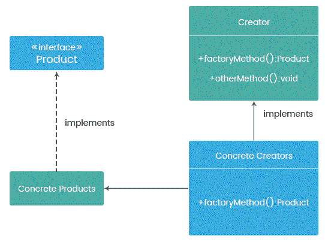
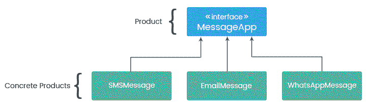
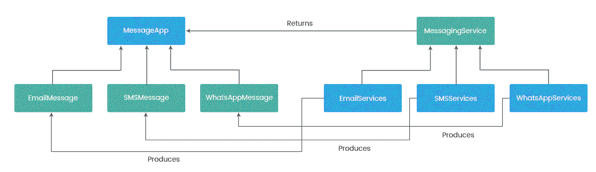
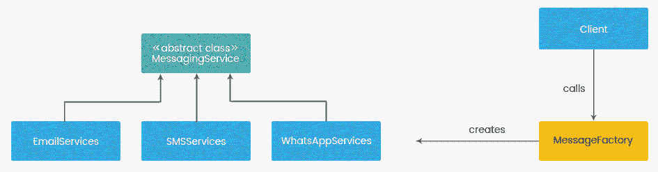
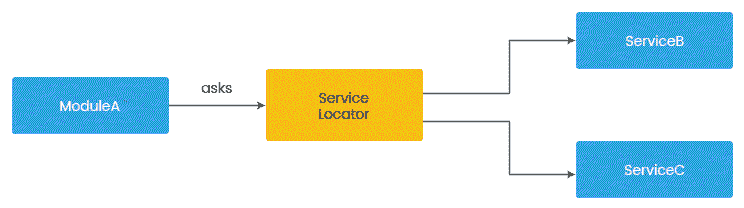
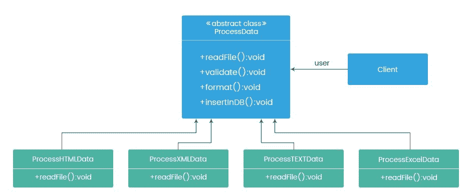
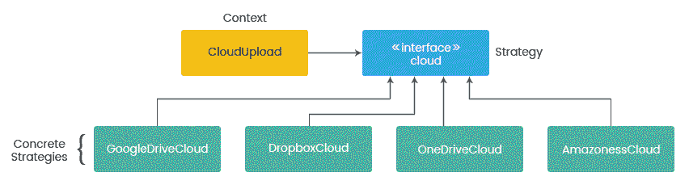
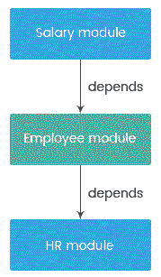

# 第七章：IoC 模式和最佳实践

现在你已经到达了这一章节，你应该知道什么是**依赖注入**（**DI**），为什么它如此重要，它在 Java 的最近版本中是如何体现的，以及如何使用流行的框架，如 Spring 和 Google Guice，以及各种作用域来实现它。

据说，直到用最佳的方法和实践应用，知道某事是不够的。只有当知识以正确的方式实施时，知识才是力量。不恰当的方法可能会造成大混乱。

软件行业正朝着模块化发展。DI 和**控制反转**（**IoC**）容器的概念正是由于这一点而创建的，这也是为什么它们今天如此受欢迎。尽管如此，许多开发者不知道如何充分利用 DI。

在这一章中，我们将通过学习正确的模式和最佳实践来探索 DI 的真实优势，将这些我们在前几章中获得的 DI 专业知识应用到实践中。这一章的目的不是做任何新的事情；相反，我们将学习如何以正确的方式做事。

在这一章中，我们将涵盖以下主题：

+   实现 IoC 的各种模式

+   配置样式

+   使用 setter 方法与构造函数进行注入

+   循环依赖

+   最佳实践和反模式

# 实现 IoC 的各种模式

让我们回顾一下**依赖倒置原则**（**DIP**）的内容：高级模块不应该依赖于低级模块；两者都应该依赖于抽象。这是使任何应用程序模块化和可调整的基本要求。

在设计任何系统时，我们应该确保高级类不直接实例化低级类；相反，它们应该依赖于抽象（接口或抽象类）而不是直接依赖于其他具体类。DIP 没有指定这是如何发生的，因此需要一种技术来分离低级模块和高级模块。IoC 提供了这种技术。

实现 IoC 有多种模式，包括将对象创建过程从你的类反转到其他类，以及减少模块或类之间的耦合。让我们讨论这些模式，更多地关注它们如何解耦模块并实现关注点的分离：

+   工厂方法模式

+   服务定位器模式

+   模板方法模式

+   策略模式

所有这些模式封装了特定的责任，这使得系统模块化。

# 工厂方法模式

工厂方法模式关注定义一个用于创建依赖对象的接口（或抽象类）方法。这个方法被称为工厂方法。持有工厂方法的类（或接口）将被视为抽象创建者。实际的对象创建过程不会在工厂方法中直接发生。

具体创建者（实现工厂方法的类）将决定实例化哪个依赖类。简而言之，依赖对象是在运行时决定的。这个过程已在以下图中描述：



工厂模式的实现是一个四步过程：

1.  声明产品（抽象产品类型）。

1.  创建具体产品。

1.  定义工厂方法 – 创建者。

1.  创建具体创建者（具体子类）。

让我们通过一个例子来理解这些步骤。假设你正在为一家消息服务提供商开发一个应用程序。最初，公司为蜂窝设备提供短信服务。因此，你应用程序代码的第一个版本仅处理短信消息分发，假设大部分代码是在`SMS`类中编写的。

逐渐地，服务变得流行，你希望添加其他大量消息服务，如电子邮件、WhatsApp 和其他社交媒体消息服务。这需要代码更改，因为你已经将所有代码添加到了`SMS`类中。在将来，每当引入新的消息服务到系统中时，都需要这种代码更改。

工厂方法模式建议，这个问题的解决方案将是通过将对象创建过程从客户端代码（使用 new 运算符）倒置到特定方法：工厂方法。工厂方法定义了一个公共接口，它返回一个抽象产品类型。具体产品的创建是在实现工厂方法的子类中完成的。在前面的图中，从工厂方法返回的对象被称为**Product**。首先，让我们为前面的例子定义一个抽象产品类型及其具体实现。

# 定义产品（抽象类型）及其具体实现

在我们的案例中，`**MessageApp**`接口代表一个抽象产品类型。每个消息应用程序的实现将位于它们各自的 concrete 类中，这些类是具体产品类型，例如`**SMSMessage**`、`**EmailMessage**`和`**WhatsAppMessage**`。这种关系用以下图表示：



产品（抽象类型）和所有具体产品类应如下所示：

```java
// Product (abstract type)
public interface MessageApp {
  void sendMessage(String message);
}

//Concrete Product
public class EmailMessage implements MessageApp {
  @Override
  public void sendMessage(String message) {
    //Mail specific implementation
    System.out.println("Sending eMail message ...."+message);
  }
}

//Concrete Product
public class SMSMessage implements MessageApp {
  @Override
  public void sendMessage(String message) {
    //SMS specific implementation.
    System.out.println("sending SMS message ..."+message);
  }
}

//Concrete Product
public class WhatsAppMessage implements MessageApp {
  @Override
  public void sendMessage(String message) {
    //Whatsapp specific implementation
    System.out.println("Sending Whatsapp message ..."+message);
  }
}
```

# 定义工厂方法（创建者接口）及其具体实现

下一步是创建一个类并定义一个返回抽象产品类型（在我们的案例中是**MessageApp**）的工厂方法。这个类被认为是抽象创建者。工厂方法可以是接口或抽象方法的形式。所有具体创建者都必须实现这个工厂方法。以下图描述了这些组件之间的完整关系：



在这里，`**MessagingService**`是创建者，而`**EmailServices**`、`**SMSServices**`和`**WhatsAppServices**`是具体创建者。每个具体创建者生产相应的具体产品类型。

工厂方法和其具体的实现类应如下所示：

```java
//Abstract creator
public abstract class MessagingService {
  //This is Factory method.
  public abstract MessageApp createMessageApp();
}

//Concrete creator
public class EmailServices extends MessagingService{
  @Override
  public MessageApp createMessageApp() {
    return new EmailMessage();
  }
}

//Concrete creator
public class SMSServices extends MessagingService {
  @Override
  public MessageApp createMessageApp() {
    return new SMSMessage();
  }
}

//Concrete creator
public class WhatsAppServices extends MessagingService {
  @Override
  public MessageApp createMessageApp() {
    return new WhatsAppMessage();
  }
}
```

在前面的例子中，我们使用了抽象类，但你也可以使用接口作为工厂方法（抽象创建者）。如果你计划提供任何公共方法，你可以选择抽象类，否则接口是一个合适的选择。

最后，提供特定实现的工厂类如下所示：

```java
public class MessagingFactory {
  public MessageApp getMessageApp(MessageType messageType) {
    MessageApp messageApp = null;
    // 1.Based on messageType value, create concrete implementation.
    // 2.Call factory method on each of them to get abstract product type - MessageApp in our case
    // 3.call common method on abstract product type to execute desire operation.

    switch(messageType) {
    case SMSType:
      messageApp = new SMSServices().createMessageApp();
      break;
    case EmailType:
      messageApp = new EmailServices().createMessageApp();
      break;
    case WhatsAppType:
      messageApp = new WhatsAppServices().createMessageApp();
      break;
    default: System.out.println(" Unknown message type .. Please provide valid message type "); 
    }
    return messageApp;
  }
}
```

这个类根据特定的`enum`类型返回具体的实现。以下代码片段展示了客户端代码如何使用工厂方法：

```java
public class Client {
  public static void main(String[] args) {
    MessagingFactory messagingFactory = new MessagingFactory();
    MessageApp smsApp = messagingFactory.getMessageApp(MessageType.SMSType);
    MessageApp emailApp = messagingFactory.getMessageApp(MessageType.EmailType);
    MessageApp whatsAppApp = messagingFactory.getMessageApp(MessageType.WhatsAppType);
    smsApp.sendMessage(" Hello ");
    emailApp.sendMessage(" this is test ");
    whatsAppApp.sendMessage(" Good Morning");
  }
}
```

这可以用以下图表来描述：



使用工厂方法模式，你可以将产品创建过程从客户端类中抽象出来。这样，工厂方法模式消除了具体产品类对整个系统的依赖。此外，工厂方法将实际的对象创建过程委托给具体的创建者。只要客户端代码知道类型，工厂类就会提供该类型的依赖对象。这样，工厂方法允许客户端代码依赖于抽象而不是具体实现。这就是通过工厂方法模式实现 IoC 的方式。

# 服务定位器模式

服务定位器模式涉及通过引入一个中介来从客户端对象中移除依赖。客户端对象将通过中介来获取所需的依赖。我们将这个中介称为服务定位器，或者简称定位器。

服务定位器涉及通过抽象层获取服务的过程。理想情况下，定位器应持有所有服务（依赖），并通过单个接口提供它们。它是一种中央存储库，通常通过字符串或接口类型来查找服务。

服务定位器描述了如何注册和定位服务，而不是告诉我们如何实例化它。它允许应用程序为给定的契约注册具体的实现。你可以通过编程或通过配置添加服务。服务定位器的实现如下所示：



这是一种非常简单的服务定位器模式。**ModuleA**依赖于由**Service Locator**提供的**ServiceB**和**ServiceC**。然而，你可以使**Service Locator**更加抽象，以便它可以处理任何类型的服务。让我们了解如何做到这一点。

总是暴露任何服务的一个接口是一个好主意。以下代码片段将展示两个这样的服务接口及其实现：

```java
public interface CompressionAlgorithm {
  void doCompress();
}
public interface EncryptionAlgorithm {
  void doEncryption();
}

public class RARCompression implements CompressionAlgorithm {
  @Override
  public void doCompress() {
    System.out.println(" Compressing in RAR format ... ");
  }
}

public class ZIPCompression implements CompressionAlgorithm {
  @Override
  public void doCompress() {
    System.out.println(" Compressing in ZIP format ... ");
  }
}

```

我们希望从服务定位器获取压缩和加密服务。我们将编写`ServiceLocator`类，它是一个单例，允许我们注册这些服务。一旦完成，客户端就可以通过服务接口类型来获取服务。`ServiceLocator`类将如下所示：

```java
public class ServiceLocator {
  // Map which holds all services.
  private Map<Class<?>,Map<String,Object>> serviceRegistry = new HashMap<Class<?>,Map<String,Object>>(); 
  private static ServiceLocator serviceLocator;

  // private constructor to make this class singleton 
  private ServiceLocator() {

  }

  //Static method to get only existing instance. If no instance is there, create the new one.
  public static ServiceLocator getInstance() {
    if(serviceLocator == null) {
      serviceLocator = new ServiceLocator();
    }
    return serviceLocator;
  }

  public <T> void registerService(Class<T> interfaceType, String key, Object serviceObject) {

    Map<String,Object> serviceOfSameTypeMap = serviceRegistry.get(interfaceType);
    if(serviceOfSameTypeMap !=null) {
      serviceRegistry.get(interfaceType).put(key, serviceObject);
    }else {
      serviceOfSameTypeMap = new HashMap<String,Object>();
      serviceOfSameTypeMap.put(key, serviceObject);
      serviceRegistry.put(interfaceType, serviceOfSameTypeMap);
    }
  }

  public <T> T getSerivce(Class<T> interfaceType, String key) {
    Map<String,Object> serviceOfSameTypeMap = serviceRegistry.get(interfaceType);
    if(serviceOfSameTypeMap != null) {
      T service = (T)serviceOfSameTypeMap.get(key);
      if(service !=null) {
        return service;
      }else {
        System.out.println(" Service with key "+ key +" does not exist");
        return null;
      }
    }else {
      System.out.println(" Service of type "+ interfaceType.toString() + " does not exist");
      return null;
    }
  }
}
```

对于注册服务来说，使用接口不是强制性的，但这是一个好的实践。在未来，如果引入了相同接口的新服务或引入了全新的接口的一组新服务，它们可以很容易地适应，而不会影响客户端代码。

此外，有了界面，客户端代码更加通用，你只需更改键值就可以更改实现，使系统更加灵活和松散耦合。最后，客户端代码中使用了服务定位器，正如以下代码片段所示：

```java
public class ServiceLocatorDemo {

  public static void main(String[] args) {

    ServiceLocator locator = ServiceLocator.getInstance();
    initializeAndRegisterServices(locator);
    CompressionAlgorithm rarCompression = locator.getSerivce(CompressionAlgorithm.class, "rar");
    rarCompression.doCompress();

    CompressionAlgorithm zipCompression = locator.getSerivce(CompressionAlgorithm.class, "zip");
    zipCompression.doCompress();

    EncryptionAlgorithm rsaEncryption = locator.getSerivce(EncryptionAlgorithm.class, "rsa");
    rsaEncryption.doEncryption();

    EncryptionAlgorithm aesEncryption = locator.getSerivce(EncryptionAlgorithm.class, "aes");
    aesEncryption.doEncryption();
 }

  private static void initializeAndRegisterServices( ServiceLocator locator ) {

    CompressionAlgorithm rarCompression = new RARCompression();
    CompressionAlgorithm zipCompression = new ZIPCompression();
    EncryptionAlgorithm rsaEncryption = new RSAEncrption();
    EncryptionAlgorithm aesEncryption = new AESEncrption();

    locator.registerService(CompressionAlgorithm.class, "rar", rarCompression);
    locator.registerService(CompressionAlgorithm.class, "zip", zipCompression);
    locator.registerService(EncryptionAlgorithm.class, "rsa", rsaEncryption);
    locator.registerService(EncryptionAlgorithm.class, "aes", aesEncryption);
  }
}
```

服务定位器解耦了类与其依赖关系。这种安排的直接好处是，依赖关系可以替换，而几乎不需要或（理想情况下）不需要代码更改。这样，服务定位器模式就颠倒了客户端代码到定位器组件的控制流。这就是 IoC 是如何实现的。

在服务定位器模式中，你需要确保在对象开始使用服务之前，所有服务都 readily available。

初看之下，工厂方法模式和服务定位器模式似乎工作方式相似。然而，它们之间有一些区别，如下所示：

+   **构建成本：**如果工厂方法中的类实例化过程非常昂贵（从资源消耗的角度来看），那么在工厂方法中创建新对象将导致性能问题。简而言之，工厂方法中的构建成本可能会影响整体系统性能。在服务定位器模式中，所有依赖对象都是在应用程序启动时（理想情况下）创建的。客户端可以从预先实例化的注册表中获取依赖服务。

+   **现有对象与新建对象：**有时，你需要每次都使用相同的对象。在工厂方法模式中，我们每次都返回一个新的实例，而服务定位器模式返回依赖服务的现有实例给调用者。

+   **所有权：**由于工厂类向调用者返回一个全新的实例，因此所有权属于调用者类，而服务定位器定位并返回服务的现有实例，因此返回对象的拥有权属于服务定位器。

# 模板方法模式

模板方法模式涉及定义算法的通用结构，然后允许子类在不改变完整结构的情况下更改或重新定义算法的一部分。换句话说，模板方法模式在一系列操作中定义了一个函数，允许子类在不改变完整结构的情况下重新定义几个步骤。

在此模式中，基类声明了具有占位符的通用过程，并允许子类提供这些占位符的具体实现，同时保持整体结构不变。

让我们通过一个例子来理解模板方法模式。假设您正在编写一个程序来获取行数据，验证它，格式化它，并将其插入到数据库中。最初，行数据以 CSV 文件的形式提供，因此您创建了一个名为`ProcessCSVData`的类。此类包含以下步骤的逻辑：

1.  读取 CSV 文件

1.  验证数据

1.  格式化数据

1.  将数据插入到数据库中

一年后，引入了更多原始数据格式，如 HTML、XML、文本和 Excel。对于这些格式中的每一个，如果您创建一个单独的类，您将最终拥有大量的相似代码。显然，这些类在文件格式上相当不同，而它们在数据验证、格式化和插入到数据库中的其他逻辑上是相同的。

考虑使用这些类的客户端代码。您需要提供大量的`if...else`条件来选择特定的实现。这不是一个好的设计。为了实现可重用性，消除代码重复并使算法结构完整是至关重要的。如果所有这些类都共享一个公共基类，则可以通过使用多态来解决这个问题。

要实现模板方法模式，您需要确定算法中哪些步骤是通用的，哪些是变体或可定制的。通用步骤应在基类中实现，而变体步骤应放置在基类中，带有默认实现或根本无实现。变体步骤将被视为占位符或扩展点，必须由具体派生类提供。

在我们的例子中，从文件中读取数据是唯一的可变步骤，因此我们将它保留在基类中，并在方法中使用默认（或无）实现。这被认为是模板方法。所有具体子类都必须提供此模板方法的实现（从相应格式中读取文件）。其他步骤，如验证、格式化和插入到数据库中，是通用或不变的，因此保持它们在基类中不变。此实现由以下图表描述：



以下代码片段表示此实现：

```java
public abstract class ProcessData {
  //Template method
  public abstract void readFile(); 
  public void validate() {
    System.out.println(" Validating data ..");
  }
  public void format() {
    System.out.println(" Formatting data ..");
  }
  public void insertInDB() {
    System.out.println(" Inserting data into Database ..");
  }
}
```

实现的子类应如下所示：

```java
public class ProcessExcelData extends ProcessData{
  @Override
  public void readFile() {
    System.out.println(" Reading Excel file");
  }
}

public class ProcessHTMLData extends ProcessData{
  @Override
  public void readFile() {
    System.out.println(" Reading HTML file");
  }
}

public class ProcessTEXTData extends ProcessData{
  @Override
  public void readFile() {
    System.out.println(" Reading Text file");
  }
}

public class ProcessXMLData extends ProcessData{
  @Override
  public void readFile() {
    System.out.println(" Reading Excel file");
  }
}
```

最后，使用模板方法的客户端代码应如下所示：

```java
public class TemplateDemo {

  public static void main(String args[]) {

    ProcessData processData = new ProcessExcelData();
    processData.readFile();
    processData.validate();
    processData.format();
    processData.insertInDB();

    processData = new ProcessHTMLData();
    processData.readFile();
    processData.validate();
    processData.format();
    processData.insertInDB();
  }
}
```

在客户端代码中，我们只使用了两个子类。同样，您也可以使用剩余的两个子类。您将得到以下输出：

```java
 Reading Excel file
 Validating data ..
 Formatting data ..
 Inserting data into Database ..
 Reading HTML file
 Validating data ..
 Formatting data ..
 Inserting data into Database ..
```

模板方法模式允许框架定义程序的不变部分，并指定所有可能的定制选项的钩子或占位符。这样，框架成为产品的中心点，而定制化被视为核心功能之上的附加功能或附加组件。

为每个模板方法编写的定制化代码将从通用框架或组件中获取通用功能。换句话说，每个客户的定制化都从通用框架接收控制流。这种倒置的控制机制被亲切地命名为好莱坞原则——“不要调用我们，我们会调用你”。这就是通过模板方法模式实现 IoC 的方式。

# 策略模式

策略模式定义了一组算法，封装每个算法，并在运行时使它们可互换。这种模式让实现独立于使用它的客户端。简而言之，你可以通过在运行时更改算法来更改类的输出。策略模式侧重于创建一个具有不同实现且遵循相同行为契约的接口。

让我们用一个例子来理解这个模式。假设你正在开发一个将文档上传到云中的应用程序。最初，你被提供了一个 Google Drive 上传。你可能编写了 `GoogleDriveCloud` 类并将所有逻辑放在那里。

在稍后的某个阶段，你决定支持上传到更多云平台，如 Dropbox、OneDrive 和 Amazon S3。在这个时候，你为每个平台编写了单独的类，例如 `DropboxCloud`、`OneDriveCloud` 和 `AmazoneS3Cloud`。

所有这些类都用于将文档上传到相应的云。当你使用它们在代码中时，你可能会根据某些条件编写选择特定实现的代码。

在前述情况下，`CloudUpload` 类与每个云实现紧密耦合，这不是一个好的设计。当你试图在未来适应更多的云支持时，你可以考虑这些问题。每个新的实现都需要修改 `CloudUpload` 类。这是对开放-封闭原则的明显违反：它讨论的是**对扩展开放但对修改封闭**。

这种情况可以通过策略模式来缓解。该模式涉及定义一组相关的算法（各种云平台的实现）并将它们封装在独立于宿主类（`CloudUpload`）的类中。解决方案用以下图表描述：



前述图表的实现将如下所示：

```java
//Interface
public interface Cloud {
  void upload();
}

//Concrete Algorithm
public class GoogleDriveCloud implements Cloud {
  @Override
  public void upload() {
    System.out.println(" Uploading on Google Drive ");
  }
}

//Concrete Algorithm
public class DropboxCloud implements Cloud {
  @Override
  public void upload() {
    System.out.println(" Uploading on Dropbox ");
  }
}

//Concrete Algorithm
public class OneDriveCloud implements Cloud {
  @Override
  public void upload() {
    System.out.println(" Uploading on OneDrive ");
  }
}

//Concrete Algorithm
public class AmazoneS3Cloud implements Cloud {
  @Override
  public void upload() {
    System.out.println(" Uploading on Amazone S3 ");
  }
}
```

我们已经声明了一个名为 `Cloud` 的接口，它将由每个具体类实现。`CloudUpload` 类代表一个 `Context` 类。它持有 `Cloud` 的引用，该引用通过以下构造函数提供：

```java
public class CloudUpload {
  private final Cloud cloud;
  public CloudUpload(Cloud cloud) {
    this.cloud = cloud;
  }
  public void upload() {
    this.cloud.upload();
  }
}
```

在这个设计中，每个云实现类只具有将文档上传到特定云的逻辑，遵循**单一职责**原则。`CloudUpload`类没有直接引用任何具体类，而是引用类型`Cloud`，它包含实际的实现。在这种情况下，我们遵循以下原则：**面向接口编程，而不是面向实现**。

在应用策略模式之后，你现在可以通过创建`CloudUpload`类的对象并在构造函数中传递适当的实现来上传文档，如下面的代码片段所示：

```java
public class StrategyDemo {
  public static void main(String[] args) {
    CloudUpload googleCloud = new CloudUpload(new GoogleDriveCloud());
    googleCloud.upload();
    CloudUpload dropBpxCloud = new CloudUpload(new DropboxCloud());
    dropBpxCloud.upload();
    CloudUpload oneDriveCloud = new CloudUpload(new OneDriveCloud());
    oneDriveCloud.upload();
    CloudUpload amazoneS3Cloud = new CloudUpload(new AmazoneS3Cloud());
    amazoneS3Cloud.upload();
  }
}
```

如果未来需要额外的云实现支持，`CloudUpload`类不会发生变化。单元测试变得简单直接。`CloudUpload`类只知道如何处理策略类（`Cloud`实现），而不是通过条件块来选择特定的实现。

这样，策略模式帮助我们实现可插拔的行为。选择`Cloud`实现的逻辑现在已从`CloudUpload`类中移除。这就是如何借助策略模式实现 IoC。

# 配置样式

几乎所有的 IoC 容器都允许你选择代码或基于文件（XML）的配置来声明依赖项。尽管它们服务于相同的目的，但你可能会对在特定场景下哪种选项最好感到困惑。

例如，基于文件（主要是 XML）的配置适用于需要部署到多个环境的应用程序。另一方面，存在一些特定场景，在这些场景中，基于代码的配置被优先选择。识别这两种配置之间的差异将有助于你选择哪一种更适合你。

# 基于文件（XML）与基于代码的配置

基于 XML 的配置的好处是，你可以在不重新编译、构建和部署应用程序代码的情况下更改依赖项。这在需要交换相同类型依赖项的情况下听起来很有用。但再次强调，这真的是你想要的吗？换句话说，如果你没有在运行时动态更改依赖项实现的要求，那么基于文件的配置并不那么有用。

然而，基于文件的配置通常更难以阅读和分析，尤其是在它变得庞大而笨拙时。基于 XML 的配置在编译时不会警告你任何错误。这些错误只能在运行时被发现，而且修复它们相当棘手且耗时。另一方面，基于代码的配置支持编译时错误检查。这意味着如果构建成功，你就完成了，并且在运行时不会遇到任何惊喜。

# 使用 setter 方法与构造函数进行注入

依赖注入有两种简单的方法——基于 setter 或基于构造函数的依赖注入。这两种方法执行相同的操作——注入依赖项，但在对象生命周期的不同时间。一个发生在对象实例化期间，而另一个发生在显式调用 setter 方法时。

当你使用这两种选项实现依赖注入时，一个非常明显的困境就会出现。理解这些差异很重要，因为它反映了面向对象编程环境中的基本问题：我们是使用构造函数参数初始化字段变量，还是通过 setter 方法来初始化？

# 基于构造函数的依赖注入

使用构造函数传递依赖项在描述创建对象所需内容方面更为清晰。如果允许，你可以编写多个版本的构造函数，每个构造函数接受不同组合的依赖项对象。

除了使用构造函数初始化字段外，你还可以通过不提供 setter 方法来隐藏它们。这种安排的优势在于，你可以确保通过构造函数设置的依赖项将可用于对象的生命周期。这很重要，因为如果你不希望某个依赖项在对象出生时被更改，那么使用构造函数初始化而不提供 setter 将使其不可变。基于构造函数的依赖注入将在加载上下文时决定依赖注入的顺序。

通过构造函数传递依赖项将管理对象创建图的顺序，并最终降低循环依赖的风险。相反，对于基于构造函数的依赖注入，Spring 不允许你使用**代码生成库**（**CGLIB**）创建代理。你需要使用基于接口的代理或无参数构造函数。

你应该将传递依赖到构造函数的方法作为你的首选方法。理想情况下，所有活动/强制依赖项都必须通过构造函数传递。

# 基于 setter 的依赖注入

基于 setter 的依赖注入的基本思想是，一旦对象被创建（主要是使用无参数构造函数），就可以调用 setter 方法来提供依赖项以形成一个对象图，或者只是为了测试目的提供模拟对象。

如果只有几个构造函数参数，基于构造函数的依赖注入是合适的。如果有大量的构造函数参数，看起来会很混乱。即使有多个构造函数版本，帮助也不大。在这种情况下，你应该依赖于基于 setter 的依赖注入。

理想情况下，所有可选或条件依赖都应该通过基于 setter 的依赖注入来提供。这种方法的缺点是，你必须确保在客户端对象开始使用之前调用 setter 方法。使用 setter 方法的另一个风险是，在执行后期修改的依赖项可能会导致意外的或模糊的结果，这有时很难追踪。此外，如果使用 setter 方法配置不当，你可能会遇到循环依赖，这在运行时可能会遇到。

# 循环依赖

循环或循环依赖是一种情况，其中两个或多个独立模块或组件依赖于彼此以正常工作。这被称为相互递归。循环依赖通常在定义模块或组件之间的依赖关系时在模块化框架中发生。

“循环依赖”这个术语在领域模型中非常常见，其中一组对象相互关联。类之间的循环依赖不一定有害。事实上，在特定情况下，它们是合适的。以一个处理领域对象，如学生和课程的示例，你可能需要一个`Student`类来获取学生已报名的课程，以及一个`Course`类来获取在该课程上报名的学生列表。很明显，`Student`和`Course`类是相互依赖的，但如果在这种情况下需要循环依赖，那么尝试移除它可能会引入其他问题。

在软件设计环境中，软件组件或模块之间的循环依赖会产生负面影响，因此被视为不良实践。这可能是设计问题。一般来说，管理不善的依赖关系的软件设计比具有清晰分层模块结构的软件设计更难维护。在设计系统时，以模块化方式设计，你需要记住可能会出现的问题，特别是由于循环依赖引起的问题。

# 循环依赖问题

循环依赖可以在软件程序中创建许多冗余效果。在设计方面，首先是相互依赖的模块之间的紧密耦合，这使得重用单个模块变得更加困难或不可能。一般来说，有几个原因你应该避免对象之间的循环引用。它会导致以下问题：

+   **没有依赖层次和可重用性：** 通常，我们用代码所在的层来量化代码；例如，高级、低级等。每一层只应设置对下面层的依赖（如果有的话）。通常，当你定义模块之间的依赖关系时，会创建一个依赖图或层次结构，但在循环依赖的情况下，这会被消除。这意味着没有依赖层次。例如，假设你有以下依赖层次：

    +   模块 A 依赖于模块 B

    +   模块 B 依赖于模块 C

    +   假设目前模块 C 没有依赖

根据这种安排，我们可以将模块 A 识别为顶层，模块 B 位于中间级别，模块 C 位于层次结构的底层。假设在一段时间后，我们需要让模块 C 依赖于模块 A（无论出于什么原因）。

当这种情况发生时，高低级别之间不再有区分，这意味着不再存在层次结构。所有模块处于同一级别。此外，由于它们存在循环依赖，它们也不再是独立的。这种情况形成了一个单一的巨大虚拟模块，它被划分为相互依赖的部分。您无法独立使用其中任何一个。

+   **更改复制：**循环依赖会引发一系列的变化。例如，如果某个模块发生任何变化，这可能会影响其他模块，从而对整体软件架构产生不良影响，例如编译错误和逻辑程序错误。由于其本质，循环依赖可能会产生其他不可预测的问题，例如无限递归。

+   **可读性和可维护性：**具有循环引用的代码自然比没有循环引用的代码更难以理解和阅读。这种代码本质上是脆弱的，容易出错。确保您的代码没有循环依赖将使代码易于操作，并使代码能够轻松适应变化，从而实现易于维护。从单元测试的角度来看，具有循环依赖的代码更难以测试，因为它无法被隔离。

# 原因和解决方案

如我们所见，循环依赖通常是由于不良的设计/编码实践造成的。在大型的软件应用开发中，程序员可能会偏离上下文并产生循环引用。

为了克服这个问题，您可以借助各种工具来查找不想要的循环依赖。这应该是一个持续的活动，并从开发周期的开始就应用。例如，Eclipse 有一个名为 Java Dependency Viewer 的插件，可以帮助查看类和 Java 包之间的依赖关系。

通过遵循某些模式和原则可以解决循环依赖问题，这些模式和原则将在以下章节中讨论。

# 单一职责原则

让我们了解如何通过应用单一职责原则来消除循环依赖。假设您正在跟踪系统中的三个模块：

+   薪酬模块

+   员工模块

+   人力资源模块

**薪酬模块**生成薪酬并通过电子邮件发送。生成薪酬依赖于**员工模块**。为了获取一些细节，例如评估过程和奖励积分，**员工模块**依赖于人力资源模块。此时，依赖层次结构将如图所示：



在某个时间点，比如说您需要在**人力资源模块**中实现电子邮件功能。由于电子邮件功能存在于**薪资模块**中，您决定将**薪资模块**的依赖关系赋予**人力资源模块**。在这个时刻，依赖关系图看起来像以下图表：


这种情况形成了一个循环依赖。为了避免这种情况，您需要遵循单一职责原则。这个原则指出，一个模块或类应该承担功能单一部分的职责。该模块或类应该完全拥有该功能，并且必须完全封装。模块提供的所有服务不得偏离主要功能。

在我们的例子中，薪资模块不仅生成薪资，还发送电子邮件。这是违反单一职责原则的。当一个模块执行多个职责时，可能会出现不良的依赖管理，这可能导致以下情况：

+   **代码重复：**您可能在多个模块中编写相似和通用的功能。例如，在这种情况下，您可以在人力资源模块中编写电子邮件发送功能以避免循环依赖，但最终会导致代码重复，这会在以后引发维护问题。

+   **循环依赖：**正如我们在前面的案例中看到的。

您需要编写一个名为“工具模块”的独立模块，并将电子邮件发送功能放在其中。在重构此代码后，**人力资源模块**和**薪资模块**现在都依赖于工具模块。这就是如何通过遵循单一职责原则来消除循环依赖。

# 将依赖的设置从构造函数推迟到设置器

让我们通过提供从构造函数到设置器的依赖关系来了解如何解决循环依赖。存在一个特殊情况，由于循环依赖，甚至无法创建领域模型的对象。例如，假设您正在开发一个为`tyre`制造商的应用程序；这些轮胎用于汽车。根据汽车的最大速度，您需要设置轮胎的最小轮辋尺寸。为此，您创建了`Car`和`Tyre`类，如下面的代码片段所示：

```java
public class Car {
  private Tyre tyre;
  private int maxSpeed;

  public Car(Tyre tyre) {
    this.tyre = tyre;
    setMaxSpeed(150);
  }
  public int getMaxSpeed() {
    return maxSpeed;
  }
  public void setMaxSpeed(int maxSpeed) {
    this.maxSpeed = maxSpeed;
  }
}

public class Tyre {
  private Car car;
  private int minRimSize;

  public Tyre(Car car) {
    this.car = car;
    if(this.car.getMaxSpeed()>100 && this.car.getMaxSpeed()<200) {
      setMinRimSize(15);
    }else if(this.car.getMaxSpeed()<100) {
      System.out.println("Minimum RIM size is 14");
      setMinRimSize(14);
    }
  }
  public int getMinRimSize() {
    return minRimSize;
  }
  public void setMinRimSize(int minRimSize) {
    this.minRimSize = minRimSize;
  }
}
```

如您所见，`Car`和`Tyre`类相互依赖。依赖关系通过构造函数传递，这就是为什么它是循环依赖的原因。您无法为它们中的任何一个创建对象。为了处理这种情况，您需要在每种情况下将设置依赖关系从构造函数推迟到设置器。我们决定在`Car`类中进行此更改，如下面的代码片段所示：

```java
public class Car{
  private Tyre tyre;
  private int maxSpeed;

  public Car() {
  }
  public void setTyre(Tyre tyre) {
    this.tyre = tyre;
  }
  public Tyre getTyre() {
    return tyre;
  }
  public int getMaxSpeed() {
    return maxSpeed;
  }
  public void setMaxSpeed(int maxSpeed) {
    this.maxSpeed = maxSpeed;
  }
}

```

将`Tyre`的依赖关系从构造函数移动到设置器方法。在`Tyre`类中，您需要将当前类的引用（`Tyre`）设置到`Car`对象中，如下面的代码片段所示：

```java
public class Tyre {

  private Car car;
  private int minRimSize;

  public Tyre(Car car) {
    this.car = car;
    this.car.setTyre(this);

    if(this.car.getMaxSpeed()>100 && this.car.getMaxSpeed()<200) {
      System.out.println("Minimum RIM size is 15");
      setMinRimSize(15);
    }else if(this.car.getMaxSpeed()<100) {
      System.out.println("Minimum RIM size is 14");
      setMinRimSize(14);
    }

  }
  public int getMinRimSize() {
    return minRimSize;
  }
  public void setMinRimSize(int minRimSize) {
    this.minRimSize = minRimSize;
  }
}
```

现在一切都已解决。您可以首先创建`Car`类型的对象，然后创建`Tyre`类型的对象，以便您可以传递`car`对象的引用给它。客户端代码如下所示：

```java
public class CircularDependencyWithSetterDemo {

  public static void main(String[] args) {
      Car car = new Car();
      car.setMaxSpeed(120);
      Tyre tyre = new Tyre(car);

      car.setMaxSpeed(90);
      tyre = new Tyre(car);
  }
}
```

# 类和包的迁移

循环依赖的一个可能原因是 Java 包中某些类的一个依赖链。比如说，`com.packt.util`与不同的包交叉，到达同一包中的其他类，`com.packt.util`。这是一个可以通过移动类和重新组织包来解决的问题。您可以使用现代 IDE 执行此类重构活动。

# Spring 框架中的循环依赖

让我们探讨在 Spring 框架中循环依赖是如何发生的以及如何处理它。Spring 提供了一个 IoC 容器，该容器加载所有豆类并尝试按特定顺序创建对象，以确保它们正常工作。例如，假设我们有三个豆类，以下是他们依赖关系的层次结构：

+   `Employee`豆类

+   `HRService`豆类

+   `CommonUtilService`豆类

`Employee`豆类依赖于`HRService`豆类，而`HRService`豆类又依赖于`CommonUtilService`豆类。

在这种情况下，`CommonUtilService`被视为低级豆类，而`Employee`豆类被视为高级豆类。Spring 将首先为所有低级豆类创建对象，以便创建`CommonUtilService`豆类，然后它将创建`HRService`豆类（并将`CommonUtilService`豆类的对象注入其中），然后它将创建`Employee`豆类的对象（并将`HRService`豆类的对象注入其中）。

现在，您需要使`CommonUtilService`豆类依赖于`Employee`。这是一个循环依赖。此外，所有依赖关系都是通过构造函数设置的。

在循环依赖的情况下，高级和低级模块之间的区别消失了。这意味着 Spring 将陷入困境，不知道应该先实例化哪个豆类，因为它们相互依赖。结果，Spring 将引发`BeanCurrentlyInCreationException`错误。

这只会在构造函数注入的情况下发生。如果依赖关系是通过 setter 方法设置的，即使豆类相互依赖，这个问题也不会发生。这是因为上下文加载时，没有依赖关系存在。

让我们为这个创建代码并看看 Spring 是如何检测循环依赖的。代码如下：

```java
@Component("commonUtilService")
public class CommonUtilService {
  private Employee employee;
  public CommonUtilService(Employee employee) {
    this.employee = employee;
  }
}

@Component("employee")
public class Employee {
  private HRService hrService;
  public Employee(HRService hrService) {
    this.hrService=hrService;
  }
}

@Component("hrService")
public class HRService {
  private CommonUtilService commonUtilService;
  public HRService(CommonUtilService commonUtilService) {
    this.commonUtilService=commonUtilService;
  }
}
```

Java 配置和客户端代码如下所示：

```java
@Configuration
@ComponentScan(basePackages="com.packt.spring.circulardependency.model.simple")
public class SpringConfig {
}

public class SpringCircularDependencyDemo {
  public static void main(String[] args) {
    ApplicationContext springContext = new AnnotationConfigApplicationContext(SpringConfig.class);
    Employee employee = (Employee) springContext.getBean("employee");
    HRService hrService = (HRService) springContext.getBean("hrService");
    CommonUtilService commonUtilService = (CommonUtilService) springContext.getBean("commonUtilService");
  }
}
```

运行此代码后，所有豆类都会出现`BeanCurrentlyInCreationException`错误，如下所示：

```java
Unsatisfied dependency expressed through constructor parameter 0; nested exception is org.springframework.beans.factory.UnsatisfiedDependencyException: Error creating bean with name 'employee' defined in file 
```

为了避免这种情况，您需要重新设计前面的结构。在少数情况下，可能由于遗留代码的设计限制，无法更改结构。在这种情况下，Spring 提供了一些解决方案，如下所述。

# 相比构造函数注入，使用 setter/field 注入

这可能是最简单、最直接的选择。在循环依赖中，如果构造函数注入创建了循环引用，你可以在 setter 方法中延迟 DI。这允许 Spring 无问题地加载 bean 上下文。更新的代码如下所示：

```java
@Component("employee")
public class Employee {
  private HRService hrService;
  @Autowired
  public void setHrService(HRService hrService) {
    this.hrService = hrService;
    System.out.println(" HRService dependency is set ");
  }
}

@Component("hrService")
public class HRService {
  private CommonUtilService commonUtilService;
  @Autowired
  public void setCommonUtilService(CommonUtilService commonUtilService) {
    this.commonUtilService = commonUtilService;
    System.out.println(" CommonUtilService dependency is set ");
  }
}

@Component("commonUtilService")
public class CommonUtilService {
  private Employee employee;
  @Autowired
  public void setEmployee(Employee employee) {
    this.employee = employee;
    System.out.println(" Employee dependency is set ");
  }
}
```

所有依赖都通过带有 `@Autowired` 注解的 setter 方法设置。Spring 首先创建所有三个实例，然后使用 setter 方法设置它们。

在 bean 的字段上设置 `@Autowired` 注解与 setter 注入等效。如果你在类的字段上使用 `@Autowired` 注解，Spring 不会对循环依赖发出抱怨。

# 使用 `@Lazy` 注解

另一种解决方案是使用 `@Lazy` 注解。这个注解将指示 Spring 仅在需要时加载 bean，而不是在上下文加载时。Spring 将在上下文加载期间创建一个代理 bean 并将其传递给另一个对象。更新的代码如下所示：

```java
@Component("employee")
public class Employee {
  private HRService hrService;
  public Employee(@Lazy HRService hrService) {
    this.hrService=hrService;
  }
  public void displayEmployeeName() {
    System.out.println(" Employee name is Nilang ");
  }
}

@Component("hrService")
public class HRService {
  private CommonUtilService commonUtilService;
  public HRService(@Lazy CommonUtilService commonUtilService) {
    this.commonUtilService=commonUtilService;
  }
}

@Component("commonUtilService")
public class CommonUtilService {
  private Employee employee;
  public CommonUtilService(@Lazy Employee employee) {
    this.employee = employee;
  }
  public void showEmployeeNameFromDependency() {
    this.employee.displayEmployeeName();
  }
}
```

构造函数依赖通过 `@Lazy` 注解设置。这段代码将正常运行，实际依赖仅在调用时注入。为了演示这一点，我们在 `Employee` 实例中创建了一个 `displayEmployeeName` 方法，我们将使用来自 `CommonUtilService` 实例的依赖引用来调用它，如下面的代码片段所示：

```java
ApplicationContext springContext = new AnnotationConfigApplicationContext(SpringConfigForLazy.class);

    Employee employee = (Employee) springContext.getBean("employee");
    HRService hrService = (HRService) springContext.getBean("hrService");
    CommonUtilService commonUtilService = (CommonUtilService) springContext.getBean("commonUtilService");
    commonUtilService.showEmployeeNameFromDependency();
```

当调用 `showEmployeeNameFromDependency` 方法时，它将内部调用 `CommonUtilService` 中员工引用的 `displayEmployeeName` 方法。当发生这种情况时，Spring 实际上会注入依赖。你将得到以下输出：

```java
 Employee name is Nilang 
```

# 最佳实践和反模式

到目前为止，我们讨论了使用 IoC 容器来实现 DI，但最常见的错误之一是在没有进行真正的 DI 的情况下使用 IoC 容器。这听起来可能有些奇怪，但这是一个事实。在没有正确理解底层概念的情况下，这样的错误是可能发生的。

理想情况下，DI 实现应该仅在应用程序启动时引用 IoC 容器。如果开发者自己包装 IoC 容器并将其传递给其他组件以减少任何依赖，这并不是一个好的设计。让我们用一个例子来理解这个问题。

# 要注入什么 - 容器本身还是只是依赖？

当你尝试将容器本身包装在单例类或公共静态方法中，以向其他组件或模块提供依赖时，就会发生注入容器的情况，如下面的代码片段所示：

```java
public class AccountService {
  //Service method.
  public void getVariablePay() {
    System.out.println("getting variable pay..");
  }
}

public class HRService {
  public int getLeaveInGivenMonth(int monthNo) {
    System.out.println(" getting no of leaves for month "+monthNo);
    return 2; // just for demo purpose.
  }
}
/* ServiceManager serves like dependency supplier */
public class ServiceManager {
  private static ApplicationContext springContext = new ClassPathXmlApplicationContext("application-context.xml");
 private ServiceManager() {
  }
  //This method will return the dependency 
  public static Object getDependentService(String serviceName) {
    Object dependency = null;
    if(springContext !=null) {
      dependency = springContext.getBean(serviceName);
    }
    return dependency;
  }
}

public class EmployeeService {
  private AccountService accountService;
  private HRService hrService;
  //constructor
  public EmployeeService() {
    if(ServiceManager.getDependentService("accountService") !=null) {
      accountService = (AccountService) ServiceManager.getDependentService("accountService");
    }
    if(ServiceManager.getDependentService("hrService") !=null) {
      hrService = (HRService) ServiceManager.getDependentService("hrService");
    }
  }
  public void generateRewardPoints() {
    if(hrService !=null && accountService !=null) {
      int noOfLeaves = this.hrService.getLeaveInGivenMonth(8);
      System.out.println("No of Leaves are : "+noOfLeaves);
      this.accountService.getVariablePay();
      //Some complex logic to generate rewards points based on variable  pay and total leave 
      //taken in given month.
    }
  }
}
```

这与服务定位器模式等价。在这段代码中，`ServiceManager` 类持有容器的引用。它将通过其静态方法返回依赖（服务）。`EmployeeService` 类使用 `ServiceManager` 获取其依赖（`HRService` 和 `AccountService`）。乍一看，这似乎非常合适，因为我们不希望 `EmployeeService` 与 `HRService` 和 `AccountService` 紧密耦合。

虽然我们在前面的代码中移除了依赖的耦合，但这并不是我们所说的 DI。前一个案例中的基本错误是，我们没有提供依赖，而是依赖其他类来提供它。实际上，我们移除了一个实体的依赖，但添加了另一个。这是使用 IoC 容器非常糟糕且没有正确实现 DI 的一个经典例子。

`ServiceManager` 类是一个单例类，通过其静态方法提供依赖。我们不是将 `HRService` 和 `AccountService` 注入到 `EmployeeService` 中，而是依赖 `ServiceManager` 提供依赖。

你可能会争辩说，前面的方法将多个依赖项替换为单个类，并将有效地减少依赖。然而，DI 的好处并没有完全实现。当该类发生变化时，对 `ServiceManager` 的紧密依赖问题才会显现出来。例如，如果你更改 `HRManager` 或 `AccoutService` 类的配置，你需要更改 `ServiceManager` 的代码。

这种情况的一个副作用是，从单元测试的角度来看，事情并不清晰。DI 的好处是，只需查看类的构造函数，就应该知道它依赖于什么，这样你就可以在单元测试时非常容易地注入模拟对象。

在这种情况下，情况正好相反。理想情况下，调用者应该提供依赖，但在这个案例中，调用者没有提供任何东西，而组件（`EmployeeService`）通过使用自己的单例类来获取依赖。`EmployeeService` 类的构造函数将是空的，你可能只有在彻底查看其源代码后才能确定其依赖。

之前的设计更像是服务定位器的实现。然而，服务定位器还有一些其他的局限性，如下所示：

+   **隔离性：** 注册到注册表中的服务对于调用者或客户端类来说最终是黑盒。这导致系统可靠性降低，因为很难识别和纠正依赖服务中发生的错误。

+   **并发性：** 服务定位器有一个独特的服务注册表，如果它被并发组件访问，可能会导致性能瓶颈。

+   **依赖解析：** 对于客户端代码，服务定位器提供的注册表有点像黑盒，这可能在运行时引起问题，例如，如果依赖项尚未注册，或者存在任何特定的依赖项问题。

+   **可维护性：** 在服务定位器中，由于服务实现的代码与客户端代码是隔离的，因此不清楚何时新的更改会在运行时破坏此功能。

+   **可测试性：** 服务定位器将所有服务存储在注册表中，这使得单元测试变得稍微困难一些，因为所有测试可能都需要依赖注册表来显式设置各种模拟服务类。

我们的目标是使客户端代码与其依赖项或提供依赖项的任何类完全解耦。在前面的例子中，我们希望打破 `EmployeeService` 与其依赖项之间的耦合。

让我们改进前面的设计，并重写 `EmployeeService` 类，如下面的代码片段所示：

```java
public class EmployeeService {
  private AccountService accountService;
  private HRService hrService;
  //constructor
  public EmployeeService(AccountService accountService,HRService hrService) {
    this.accountService = accountService;
    this.hrService = hrService;
  }
  public void generateRewardPoints() {
    if(hrService !=null && accountService !=null) {
      int noOfLeaves = this.hrService.getLeaveInGivenMonth(8);
      System.out.println("No of Leaves are : "+noOfLeaves);
      this.accountService.getVariablePay();
      //Some complex logic to generate rewards points based on variable pay and total leave 
      //taken in given month.
    }
  }
}
```

现在，`EmployeeService` 类不再依赖于 `HRService` 和 `AccountService` 类。这正是我们想要达到的目标。你的业务代码不应该了解其依赖项。这是 IoC 容器的职责来提供它们。现在这段代码更易于阅读和理解。依赖关系可以通过查看构造函数来预测。

如果你希望实例化 `EmployeeService`，你只需要传递 `HRService` 和 `AccountService` 类的对象。在进行单元测试时，你可以传递模拟对象并测试这些服务之间的集成。现在这个过程变得非常简单。这是 DI 的正确实现和含义。

# 过度注入

每个设计模式都解决特定设计问题，但任何单一模式并不一定适用于你遇到的每一个情况。你应用的模式或方法应该是因为它是给定问题的正确选择，而不仅仅是因为你了解它并希望实现它。

依赖注入是一种模式（而不是一个框架），因此你需要考虑合适的场景来实现它。有可能使 DI 变得冗余。在代码中注入一切并不是必要的。如果你这样做，代码解耦的目的就无法得到正确实现；相反，依赖图变得无效。

显然，DI 在代码维护方面提供了很大的灵活性，以更有意义和有用的方式执行单元测试，从而实现模块化。然而，你应该只在真正需要时利用其灵活性。DI 的目的是减少耦合，而不是包装和提供每个依赖项，这不是一个明智的决定。

例如，假设你需要一个`Calendar`对象来执行各种日历相关操作。传统的方法是使用静态方法——例如`Calendar`类的`getInstance`方法，例如`Calendar.getInstance()`。这是`Calendar`类中的一个静态工厂，用于创建对象。

如果你尝试通过 DI 传递`Calendar`对象，你将不会得到任何新东西。所有传递`Calendar`对象的方法（整个调用链——从注入位置到使用位置）都将有额外的参数。这最终给程序员带来了传递`Calendar`对象的负担。此外，`Calendar`对象没有通过抽象注入，因此参数是`Calendar`类型，而不是任何抽象或接口类型。这意味着改变实现没有明显的优势，因为我们传递的是具体类型而不是抽象类型（因为在 Java 中的`Calendar`类中这是不可能的）。

理想情况下，任何 Java、第三方库或仅提供静态功能且可以在所有组件或模块中通用的自定义类，都应使用静态方式（类引用）或单例机制（如果需要实例）来使用，而不是将它们注入到类中。

另一个例子是在 Java 中使用`Logger`。获取 logger 实例的典型方式是调用`Logger`类的`getLogger`静态方法，并传递你想要提供日志功能的类。在这种情况下，通过 DI 传递`Logger`对象将是过度设计。

不仅如此，使用 DI 注入此类库将导致仅通过构造函数、方法或属性注入依赖项的组件可用的功能减少。此外，几乎不可能提供任何有意义的抽象，这些抽象可以轻松应用于任何此类库。这将使你在实现上无法获得任何有意义的灵活性。

当你需要提供具有不同依赖配置的依赖项，或者当你想支持同一依赖项的不同实现时，请选择 DI 模式。如果不需要混合依赖项或提供不同的实现，那么 DI 不是合适的解决方案。

# 在没有容器的情况下实现 IoC

现在，我们深知 DI（依赖注入）的目的是通过构造函数、setter 方法或属性为组件提供依赖，从而使它们与依赖服务分离。传统的理解是，这只能通过使用 IoC（控制反转）容器来实现。然而，并非所有情况都如此。

理想情况下，IoC 容器应该用于配置和解决复杂应用中相对较大的依赖项集合。如果你处理的是一个只有少数组件和依赖项的简单应用，不使用容器是明智的。相反，你可以手动配置依赖项。

此外，在集成容器困难的传统系统中，你可以选择手动提供依赖项。你可以实现各种模式，例如工厂方法、服务定位器、策略或模板方法模式来管理依赖项。

# 摘要

在本章中，我们学习了一些关于管理依赖项的最佳实践和模式的重要观点。尽管已经证明 DI 通过解耦客户端代码与其依赖项，为代码带来了更大的灵活性和模块化，但还有一些事情我们应该遵循，以充分利用它。

在开始时，我们学习了除了依赖注入（DI）之外的其他模式，这些模式有助于我们实现控制反转（IoC）。你绝对可以在代码中使用它们来解耦无法使用 IoC 容器的模块。例如，在一个无法通过 IoC 容器管理依赖项的传统代码中，这些模式对于实现 IoC 非常有用。

我们熟悉了各种配置选项，并学习了如何选择正确的选项。我们还看到了在配置依赖项时使用的注入风格。在处理依赖项管理时，一个非常明显的问题是循环引用，这会导致循环依赖。我们已经观察到了循环依赖引起的问题、其成因以及如何在编码中避免它们。

最后，我们深入探讨了在使用 DI 时应遵循的最佳实践、模式和反模式。如果我们知道如何做某事，并不意味着它总是适用。DI 也是如此。它是一个模式，因此应该以正确的方式使用来解决特定问题。它可能并不适用于所有情况。

我们在这里暂停一下。我们希望你喜欢在整本书中学习 DI 的旅程。我们试图尽可能简单明了地传达基本原理。
