# 第二章.齿轮和滑轮 - 构建块

我们在上一章讨论了算法，但本书的标题也包括了“数据结构”这个术语。那么什么是数据结构呢？数据结构是数据在内存中的组织形式，通常是经过优化的，以便特定算法可以使用。我们已经看到，算法是一系列导致期望结果的步骤。在程序的情况下，总有一些输入和输出。输入和输出都包含数据，因此必须以某种方式组织。因此，算法的输入和输出都是数据结构。实际上，算法必须经过的所有中间状态也必须以某种形式存储在数据结构中。没有算法来操作它们，数据结构就没有任何用途，没有数据结构，算法也无法工作。这是因为它们就是这样获取输入、发出输出或存储它们的中间状态的。数据可以组织的有很多种方式。简单的数据结构也是不同类型的变量。例如，`int` 是一个存储一个 4 字节整数值的数据结构。我们甚至可以有存储一组特定类型值的类。然而，我们还需要考虑如何存储大量相同类型值的集合。在这本书中，我们将用剩下的时间讨论同一类型值的集合，因为存储集合的方式决定了哪些算法可以对其工作。一些存储值集合的最常见方式有自己的名称；我们将在本章中讨论它们。它们如下：

+   数组

+   链表

+   双向链表

+   循环链表

这些是我们将用来构建更复杂的数据结构的基本构建块。即使我们不直接使用它们，我们也会使用它们的概念。

# 数组

如果你是一名 Java 程序员，你一定使用过数组。数组是为一系列数据提供的最基本存储机制。数组最好的地方是数组的元素是顺序存储的，并且可以通过单条指令完全随机地访问。

通过元素逐个遍历数组元素非常简单。由于任何元素都可以随机访问，你只需不断递增索引并保持访问此索引处的元素。以下代码展示了数组的遍历和随机访问：

```java
    public static void printAllElements(int[] anIntArray){ 
        for(int i=0;i<anIntArray.length;i++){ 
            System.out.println(anIntArray[i]); 
        } 
    }
```

## 数组中元素的插入

数组中的所有元素都存储在连续的内存中。这使得可以在常数时间内访问任何元素。程序只需计算与索引相对应的偏移量，然后直接读取信息。但这意味着它们也是有限的，并且具有固定的大小。如果你想在数组中插入一个新元素，你需要创建一个包含一个更多元素的新数组，并将整个原始数据以及新值一起复制。为了避免所有这些复杂性，我们将从将现有元素移动到新位置开始。我们想要做的是取出一个元素，将所有元素向上移动到目标位置以腾出空间，并将提取的值插入到相同的位置。

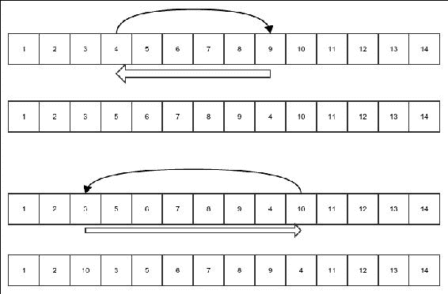

图 1：将现有数组元素插入新位置

前面的图解释了我们所说的这种操作。细黑箭头显示了正在重新插入的元素的运动，粗白箭头显示了数组元素的变化。在每个情况下，底部图显示了重新插入完成后的数组。请注意，移动要么向左要么向右，这取决于起始索引和结束索引。让我们用代码来实现这一点：

```java
       public static void insertElementAtIndex(int[] array, int startIndex, int targetIndex){ 
         int value = array[startIndex]; 
         if(startIndex==targetIndex){ 
            return; 
         }else if(startIndex < tarGetIndex){ 
            for(int i=startIndex+1;i<=targetIndex;i++){ 
                array[i-1]=array[i]; 
            } 
            array[targetIndex]=value; 
         }else{ 
            for(int i=startIndex-1;i>=targetIndex;i--){ 
                array[i+1]=array[i]; 
            } 
            array[targetIndex]=value; 
         } 
       }
```

前述算法的运行时间复杂度是什么？对于所有我们的情况，我们只考虑最坏的情况。算法何时表现最差？为了理解这一点，让我们看看算法中最频繁的操作是什么。当然是在循环中发生的移动。当`startIndex`位于数组的开始而`targetIndex`位于末尾或相反时，移动次数达到最大。在这种情况下，必须逐个移动除一个元素之外的所有元素。在这种情况下，运行时间必须是数组元素数量的一些常数倍加上一些其他常数，以考虑非重复操作。因此，它是*T(n) = K(n-1)+C*，其中*K*和*C*是常数，*n*是数组中的元素数量，*T(n)*是算法的运行时间。这可以表示如下：

*T(n) = K(n-1)+C = Kn + (C-K)*

以下步骤解释了表达式的含义：

1.  根据大 O 定义的规则 1，*T(n) = O(Kn + (C-K))*。

1.  根据定义的规则 3，*T(n) = O(Kn)*。

1.  我们知道对于足够大的*n*，*|-(C-K)| < |Kn + (C-K)|*是正确的。因此，根据规则 3，由于*T(n) = O(Kn + (C-K))*，这意味着*T(n) = O(Kn + (C-K) + (-(C-K)))*，即*T(n) = O(Kn)*。

1.  最后，根据规则 2，*T(n) = O(n)*。

现在由于数组是算法的主要输入，输入的大小用*n*表示。所以我们将说，算法的运行时间是*O(n)*，其中*n*是输入的大小。

## 插入新元素及其附加过程

接下来，我们继续到插入新元素的过程。由于数组的大小是固定的，插入操作需要我们创建一个新的数组并将所有之前的元素复制到其中。以下图解展示了在新的数组中进行插入的概念：

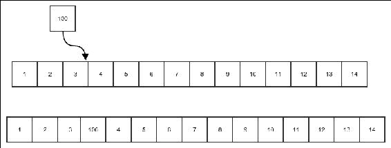

图 2：将新元素插入到数组中

以下代码正是这样做的：

```java
    public static int [] insertExtraElementAtIndex(int[] array, int index, int value){ 
        int [] newArray = new int[array.length+1]; 
```

首先，你只需像在原始数组中一样复制目标位置之前的所有元素：

```java
        for(int i=0;i<index;i++){ 
            newArray[i] = array[i]; 
        } 
```

然后，新值必须放置在正确的位置：

```java
        newArray[index]=value;
```

最后，通过将它们的位移动一位来复制数组中的其余元素：

```java
        for(int i=index+1;i<newArray.length;i++){ 
            newArray[i]=array[i-1]; 
        } 
        return newArray; 
    }
```

当代码准备好后，附加操作就意味着只需将其插入到末尾，如下面的代码所示：

```java
    public static int[] appendElement(int[] array, int value){ 
        return insertExtraElementAtIndex(array, array.length, value); 
    }
```

前述算法的运行时间复杂度是多少？好吧，无论我们做什么，我们都必须将原始数组中的所有元素复制到新数组中，这是循环中的操作。因此，运行时间是 *T(n) = Kn + C*，其中 *K* 和 *C* 是一些常数，而 *n* 是数组的大小，也就是输入的大小。我将这个验证步骤留给你，以便找出这个：*T(n) = O(n)*。

# 链表

数组非常适合存储数据。我们也看到，数组的任何元素都可以在 *O(1)* 时间内读取。但是数组的大小是固定的。改变数组的大小意味着创建一个新的数组并将所有元素复制到原始数组中。对于调整大小问题的最简单解决办法是将每个元素存储在不同的对象中，然后在每个元素中持有对下一个元素的引用。这样，添加新元素的过程只需创建该元素并将其附加到原始链表的最后一个元素上。在另一种变体中，新元素可以被添加到现有链表的开始位置：

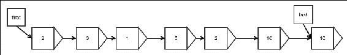

图 3：链表的示例

*图 3* 展示了一个链表的示例。箭头代表引用。每个元素都存储在一个**包装对象**中，该对象还持有对下一个元素包装器的引用。还有两个额外的引用指向第一个和最后一个元素，这对于任何操作开始都是必需的。最后一个引用是可选的，但它极大地提高了向末尾附加的性能，正如我们将看到的。

为了开始讨论，让我们以下面的方式创建一个链表节点：

```java
public class LinkedList<E> implements Iterable<E>, Visualizable { 
```

首先，我们在`LinkedList`类内部创建一个`Node`类，它将作为元素的包装器，并持有对下一个节点的引用：

```java
  protected static class Node<E> { 
    protected E value; 
    protected Node next; 

    public String toString(){ 
        return value.toString(); 
    } 
  } 

  int length = 0; 
  Node<E>[] lastModifiedNode;    
```

然后，我们必须为第一个和最后一个元素设置引用：

```java
    Node<E> first; 
    Node<E> last; 
```

最后，我们创建一个名为`getNewNode()`的方法，该方法创建一个新的空节点。如果我们想在任何子类中使用不同的节点类，我们将需要这个方法：

```java
    protected Node<E> getNewNode() { 
        Node<E> node = new Node<>(); 
        lastModifiedNode = new Node[]{node}; 
        return node; 
    }
}
```

在这个阶段，未完成的类 `LinkedList` 将无法存储任何元素；不过，让我们看看如何实现这一点。请注意，我们已经实现了 `Iterable` 接口。这将允许我们通过高级 for 循环遍历所有元素。

## 在末尾追加

在末尾追加是通过简单地从原始链表的最后一个元素创建一个指向正在追加的新元素的链接，然后重新分配最后一个元素的引用来实现的。第二步是必需的，因为新元素是新的最后一个元素。这将在以下图中展示：

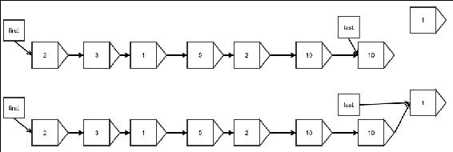

图 4：在链表末尾追加

当你向一开始就是空的链表追加元素时，会有一个小的区别。在这种情况下，第一个和最后一个引用都是 null，这种情况必须单独处理。以下图解释了这种情况：

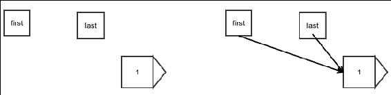

图 5：向空链表追加

我们将通过以下简单代码实现这一点。我们返回刚刚添加的节点。这对任何扩展此类的类都很有帮助。我们将在所有情况下都这样做，我们将在讨论双链表时看到这一点：

```java
    public Node<E> appendLast(E value) { 
        Node node = getNewNode(); 
        node.value = value; 
```

我们只尝试更新当前最后一个节点的引用，如果列表不为空：

```java
        if (last != null) 
            last.next = node;
```

然后，我们必须更新最后一个引用，因为新元素不会是最后一个元素：

```java
        last = node;
```

最后，如果列表为空，新元素也必须是第一个新元素，我们必须相应地更新第一个引用，如图所示：

```java
        if (first == null) { 
            first = node; 
        } 
        length++; 
        return node;
    }
```

注意，我们还跟踪列表的当前长度。这并不是必需的，但如果这样做，我们就不必遍历整个列表来计算列表中有多少元素。

现在，当然，有一个重要的问题：向链表追加元素的时间复杂度是多少？好吧，如果我们像之前那样做——也就是说，通过有一个指向最后一个元素的特别引用——我们不需要任何循环，就像我们在代码中看到的那样。如果程序没有任何循环，所有操作都是一次性操作，因此所有操作都在常数时间内完成。你可以验证一个常数函数具有这种复杂度：*O(1)*。将此与在数组末尾追加的内容进行比较。它需要创建一个新的数组，并且具有 *O(n)* 的复杂度，其中 *n* 是数组的大小。

## 在起始位置插入

在列表的起始位置插入元素与在末尾追加它非常相似。唯一的区别是您需要更新第一个引用而不是最后一个引用：

```java
    public Node<E> appendFirst(E value) { 
        Node node = getNewNode(); 
        node.value = value; 
        node.next = first; 
        first = node; 
        if (length == 0) 
            last = node; 
        length++; 
        return node;
    }
```

## 在任意位置插入

在任意位置插入可以通过与我们在第一个元素中执行插入相同的方式进行，只是我们需要更新前一个元素的引用而不是第一个引用。然而，有一个问题；我们需要找到插入元素的位置。除了从开始处开始并一直走到正确的位置同时计数我们经过的每个节点外，没有其他方法可以找到它。

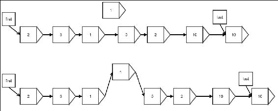

图 6：在链表中插入任意元素

我们可以如下实现这个想法：

```java
    public Node<E> insert(int index, E value) { 
        Node<E> node = getNewNode(); 
```

首先，我们处理特殊情况：

```java
        if (index < 0 || index > length) { 
            throw new IllegalArgumentException("Invalid index for insertion"); 
        } else if (index == length) { 
            return appendLast(value); 
        } else if (index == 0) { 
            return appendFirst(value); 
        } else { 
```

如前所述，我们在计数节点的同时走到期望的位置，或者在这种情况下，在相反方向上计数索引：

```java
            Node<E> result = first; 
            while (index > 1) { 
                index--; 
                result = result.next; 
            } 
```

最后，我们更新引用：

```java
            node.value = value; 
            node.next = result.next; 
            result.next = node; 
            length++; 
            return node;
        } 
    }
```

这个算法的复杂度是多少？有一个循环必须运行与索引相同的次数。这个算法似乎运行时间依赖于输入的值，而不仅仅是其大小。在这种情况下，我们只对最坏情况感兴趣。那么最坏情况是什么？它是指我们需要走过列表中的所有元素，也就是说，当我们必须将元素插入列表的末尾时，除了最后一个元素。在这种情况下，我们必须走过*n-1*个元素才能到达那里并做一些常数工作。因此，步数将是*T(n) = C(n-1)+K*，其中*C*和*K*是某些常数。所以，*T(n) = O(n)*。

## 查找任意元素

查找任意元素的值有两种不同的情况。对于第一个和最后一个元素，这很简单。由于我们直接引用了第一个和最后一个元素，我们只需遍历那个引用并读取其中的值。我将这个留给你去观察它是如何实现的。

然而，如何读取任意元素？由于我们只有前向引用，我们必须从开始处开始并一直走到，在遍历引用的同时计数步数，直到我们到达我们想要的元素。

让我们看看我们如何做到这一点：

```java
    public E findAtIndex(int index) { 
```

我们从第一个元素开始：

```java
        Node<E> result = first; 
        while (index >= 0) { 
            if (result == null) { 
                throw new NoSuchElementException(); 
            } else if (index == 0) { 
```

当索引为`0`时，我们最终到达了期望的位置，因此我们返回：

```java
                return result.value; 
            } else { 
```

如果我们还没有到达那里，我们必须移动到下一个元素并继续计数：

```java
                index--; 
                result = result.next; 
            } 
        } 
        return null; 
    }
```

这里，我们也有一个循环，它需要运行多次。最坏的情况是你只需要删除一个元素，但它不是最后一个；最后一个可以直接找到。很容易看出，就像你在任意位置插入一样，这个算法的运行时间复杂度也是*O(n)*。

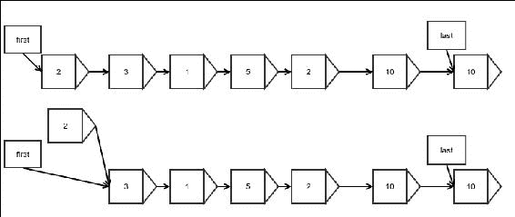

图 7：删除开始位置的元素

在开始位置删除元素意味着简单地更新第一个元素的引用为下一个元素的引用。请注意，我们不会更新刚刚删除的元素的引用，因为该元素以及引用无论如何都会被垃圾回收：

```java
    public Node<E> removeFirst() { 
        if (length == 0) { 
            throw new NoSuchElementException(); 
        } 
```

将引用分配给下一个元素：

```java
        Node<E> origFirst = first;        
        first = first.next; 
        length--; 
```

如果没有更多的元素，我们还必须更新最后一个引用：

```java
        if (length == 0) { 
            last = null; 
        } 
        return origFirst;
    }
```

## 移除任意元素

移除任意元素与从开始移除元素非常相似，只是你更新前一个元素持有的引用，而不是名为 first 的特殊引用。以下图示展示了这一点：

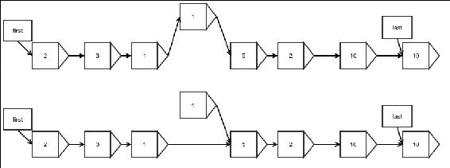

图 8：移除任意元素

注意，只有链表中的链接需要重新分配给下一个元素。以下代码执行了前面图示中的操作：

```java
    protected Node<E> removeAtIndex(int index) { 
        if (index >= length || index < 0) { 
            throw new NoSuchElementException(); 
        } 
```

当然，移除第一个元素是一个特殊情况：

```java
        if (index == 0) { 
            Node<E> nodeRemoved = first; 
            removeFirst(); 
            return nodeRemoved; 
        } 
```

首先，找出需要移除的元素之前的元素，因为这个元素需要更新其引用：

```java
        Node justBeforeIt = first; 
        while (--index > 0) { 
            justBeforeIt = justBeforeIt.next; 
        } 
```

如果最后一个元素是被移除的元素，则更新最后一个引用：

```java
        Node<E> nodeRemoved = justBeforeIt.next; 
        if (justBeforeIt.next == last) { 
            last = justBeforeIt.next.next; 
        } 
```

更新前一个元素持有的引用：

```java
        justBeforeIt.next = justBeforeIt.next.next; 
        length--; 
        return nodeRemoved; 
    }
```

很容易看出，该算法的最坏情况时间复杂度是*O(n)*——这与查找任意元素相似——因为这是在移除之前需要做的事情。实际移除过程本身只需要常数步数。

## 迭代

由于我们在 Java 中工作，我们更喜欢实现`Iterable`接口。它让我们能够以简化的 for 循环语法遍历列表。为此，我们首先必须创建一个迭代器，它将允许我们逐个获取元素：

```java
    protected class ListIterator implements Iterator<E> { 
        protected Node<E> nextNode = first; 

        @Override 
        public boolean hasNext() { 
            return nextNode != null; 
        } 

        @Override 
        public E next() { 
            if (!hasNext()) { 
                throw new IllegalStateException(); 
            } 
            Node<E> nodeToReturn = nextNode; 
            nextNode = nextNode.next; 
            return nodeToReturn.value; 
        } 
    }
```

代码是自我解释的。每次调用它时，我们都移动到下一个元素并返回当前元素的值。现在我们实现`Iterable`接口的`iterator`方法，使我们的列表成为一个可迭代的：

```java
    @Override 
    public Iterator<E> iterator() { 
        return new ListIterator(); 
    }
```

这使我们能够使用以下代码：

```java
        for(Integer x:linkedList){ 
            System.out.println(x); 
        }
```

上述代码假设变量`linkedList`是`LinkedList<Integer>`。任何扩展此类的列表也将自动获得此属性。

# 双向链表

你有没有注意到没有快速的方法从链表的末尾移除元素？这是因为即使有快速的方法找到最后一个元素，也没有快速的方法找到它之前需要更新引用的元素。我们必须从头开始遍历以找到前一个元素。那么，为什么不保留另一个引用来存储倒数第二个元素的位置呢？这是因为在你移除元素之后，你将如何更新引用呢？将没有指向那个元素的引用。看起来为了实现这一点，我们必须存储从开始到前一个元素的所有元素的引用。最好的方法是在每个元素或节点中存储前一个元素的引用以及指向下一个元素的引用。这样的链表被称为**双向链表**，因为元素是双向链接的：

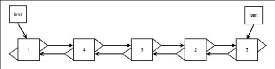

图 9：双向链表

我们将通过扩展我们的原始链表来实现双向链表，因为许多操作都是相似的。我们可以以下面的方式创建基本类：

```java
public class DoublyLinkedList<E> extends LinkedList<E> { 
```

我们创建一个新的 `Node` 类，它扩展了原始类并添加了对前一个节点的引用：

```java
    protected static class DoublyLinkedNode<E> extends Node<E> { 
        protected DoublyLinkedNode<E> prev; 
    }
```

当然，我们需要重写 `getNode()` 方法来使用此节点：

```java
    @Override 
    protected Node<E> getNewNode() { 
        return new DoublyLinkedNode<E>(); 
    } 
}
```

## 在开头或结尾进行插入

在开头进行插入与单链表的插入非常相似，除了我们现在必须更新下一个节点的引用以指向其前一个节点。在这种情况下，被插入的节点没有前一个节点，因此不需要做任何事情：

```java
    public Node<E> appendFirst(E value) { 
        Node<E> node = super.appendFirst(value); 
        if (first.next != null) 
            ((DoublyLinkedNode<E>) first.next).prev = (DoublyLinkedNode<E>) first; 
        return node; 
    }
```

图像上，它可以如下所示可视化：

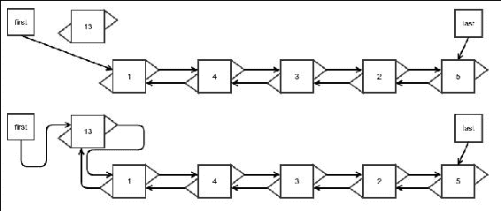

图 10：双向链表的开头插入

在末尾的插入非常相似，如下所示：

```java
    public Node<E> appendLast(E value) { 
        DoublyLinkedNode<E> origLast = (DoublyLinkedNode<E>) this.last; 
        Node<E> node = super.appendLast(value); 
```

如果原始列表为空，原始的最后一个引用将是 `null`：

```java
        if (origLast == null) { 
            origLast = (DoublyLinkedNode<E>) first; 
        } 
        ((DoublyLinkedNode<E>) this.last).prev = origLast; 
        return node; 
    }
```

插入的复杂性与单链表相同。实际上，双向链表上的所有操作都具有与单链表相同的运行时间复杂度，除了移除最后一个元素的过程。因此，我们将在此讨论移除最后一个元素之前不再重复这一点。你应该验证在其他所有情况下，复杂度与单链表相同。

## 在任意位置插入

与其他所有操作一样，这个操作与在单链表的任意位置进行插入的过程非常相似，除了你需要更新前一个节点的引用。

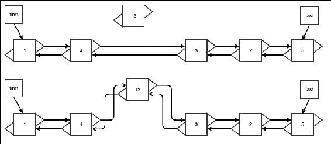

图 11：双向链表的任意位置插入

以下代码为我们完成了这项工作：

```java
    public Node<E> insert(int index, E value) { 
        DoublyLinkedNode<E> inserted = (DoublyLinkedNode<E>) super.insert(index, value); 

```

在第一个和最后一个元素的情况下，我们的重写方法仍然会被调用。因此，没有必要再次考虑它们：

```java
        if(index!=0 && index!=length) { 
            if (inserted.next != null) { 
```

这一部分需要稍作解释。在 *图 11* 中，被插入的节点是 **13**。其前一个节点应该是 **4**，它原本是下一个节点 **3** 的前一个节点：

```java
                inserted.prev = ((DoublyLinkedNode<E>) inserted.next).prev; 
```

下一个节点 **3** 的 `prev` 引用现在必须持有新插入的节点 **13**：

```java
                ((DoublyLinkedNode<E>) inserted.next).prev = inserted; 
            } 
        } 
        return inserted; 
    }
```

## 移除第一个元素

移除第一个元素几乎与单链表相同。唯一的额外步骤是将下一个节点的 `prev` 引用设置为 `null`。以下代码执行此操作：

```java
    public Node<E> removeFirst() { 
        super.removeFirst(); 
        if (first != null) { 
            ((DoublyLinkedNode<E>) first).prev = null; 
        } 
        return first; 
    }
```

下面的图显示了发生的情况。此外，请注意，查找元素实际上并不需要更新：

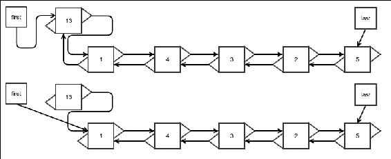

图 12：从双向链表中移除第一个元素

如果我们寻找的索引更接近链表末尾，可以有一个优化来从最后一个元素遍历到第一个元素；然而，这并不会改变查找操作的渐进复杂度。所以我们就保持在这个阶段。如果你感兴趣，可以很容易地找出如何进行这种优化。

## 移除任意元素

就像其他操作一样，移除操作在单链表中的元素移除情况下非常相似，只是我们需要更新`prev`引用：

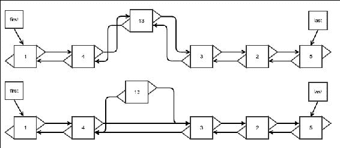

图 13：从双链表中移除任意元素

以下代码将帮助我们实现这一点：

```java
    public Node<E> removeAtIndex(int index) { 
        if(index<0||index>=length){ 
            throw new NoSuchElementException(); 
        }
```

这是一个需要额外注意的特殊情况。双链表在移除最后一个元素时表现得尤为出色。我们将在下一节讨论`removeLast()`方法：

```java
        if(index==length-1){ 
            return removeLast(); 
        } 
```

其余的代码相对容易理解：

```java
        DoublyLinkedNode<E> nodeRemoved 
               = (DoublyLinkedNode<E>) super.removeAtIndex(index); 
        if ((DoublyLinkedNode<E>) nodeRemoved.next != null) 
            ((DoublyLinkedNode<E>) nodeRemoved.next).prev 
                 = nodeRemoved.prev; 
        return nodeRemoved; 
    } 
```

## 移除最后一个元素

这正是双链表真正发光的地方。这也是我们一开始选择使用双链表的原因。而且代码量并不多。看看这个：

```java
    public Node<E> removeLast() { 
        Node<E> origLast = last; 
        if(last==null){ 
            throw new IllegalStateException
                          ("Removing element from an empty list"); 
        } 
```

只需利用我们可以访问前一个节点的引用，并且可以很容易地更新最后一个引用的事实：

```java
        last = ((DoublyLinkedNode<E>)last).prev; 
```

如果移除后列表不为空，将新最后一个元素的下一个引用设置为 null。如果新列表为空，则更新第一个元素：

```java
        if(last!=null){ 
            last.next = null; 
        } else{ 
            first = null; 
        } 
```

不要忘记更新长度：

```java
        length--; 
        return origLast;
    }
```

我们不需要新的图来理解引用的更新，因为它们实际上与移除第一个元素的过程非常相似。唯一的区别在于，在单链表中，我们需要走到链表的末尾才能找到列表的前一个元素。然而，在双链表中，我们可以一步更新它，因为我们始终可以访问前一个节点的引用。这极大地减少了运行时间，从单链表中的*O(n)*降低到双链表中的*O(1)*。

# 循环链表

循环链表是一个普通的链表，除了最后一个元素持有对第一个元素的引用作为其下一个元素。这当然也解释了它的名字。例如，当你持有一个玩家列表，他们轮流进行循环赛时，这会很有用。如果你使用循环链表，并且随着玩家完成他们的回合而不断旋转，实现会变得更加简单：

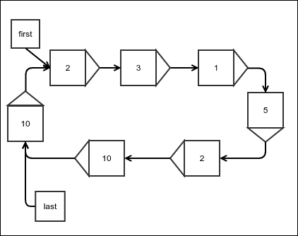

图 14：循环链表

循环链表的基本结构与简单链表相同；不需要更多的字段或方法：

```java
public class CircularLinkedList<E> extends LinkedList<E>{ 
}
```

## 插入

这与简单链表的插入操作相同，只是你需要将最后一个引用的下一个元素赋值为第一个：

```java
    @Override 
    public Node<E> appendFirst(E value) { 
        Node<E> newNode = super.appendFirst(value); 
        last.next = first; 
        return newNode; 
    }
```

从这个，不难猜出在末尾添加元素的方式：

```java
    @Override 
    public Node<E> appendLast(E value) { 
        Node<E> newNode =  super.appendLast(value); 
        last.next = first; 
        return newNode; 
    } 
```

在任何其他索引处插入，当然，与简单链表的插入相同；不需要更多更改。这意味着插入的复杂性与简单链表相同。

## 删除

删除操作也只有在删除第一个或最后一个元素时才会改变。在任何情况下，只需更新最后一个元素的下一个引用即可解决问题。唯一需要更改这个引用的地方是在删除第一个元素时。这是因为我们用于简单链表的相同操作不会更新前一个元素的下一个引用，而这正是我们需要做的：

```java
    @Override 
    public Node<E> removeFirst() { 
        Node<E> newNode =  super.removeFirst(); 
        last.next = first; 
        return newNode; 
    }
```

在删除操作中，不需要做其他任何事情。

## 旋转

我们在这里所做的是将第一个元素的下一个元素移动到第一个位置。这正是“旋转”这个名字所暗示的：

```java
    public void rotate(){ 
        last = first; 
        first = first.next; 
    }
```

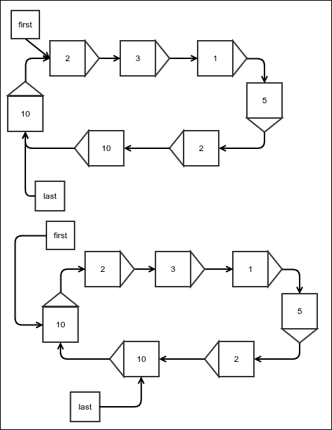

图 15：循环链表的旋转

在简单链表中执行相同的操作只需要分配一个额外的引用。你应该能够弄清楚如何在简单链表中做到这一点。但这个操作对于循环链表来说看起来更自然，因为从概念上讲，没有第一个元素。

循环链表真正的力量在于迭代器，它永远不会结束。如果列表非空，迭代器将具有`hasNext()`方法，它总是返回 true。这意味着你可以简单地不断调用迭代器的`next()`方法，并按轮询方式持续处理元素。以下代码应该能清楚地说明我的意思：

```java
        for(int i=0;i<30;i++){ 
            System.out.print(" "+ linkedList.first); 
            linkedList.rotate(); 
        }
```

### 注意

注意，如果你尝试使用增强型 for 循环与循环链表一起使用，你将遇到无限循环。

# 摘要

我们介绍了一些基本数据结构和操作它们的算法。除此之外，我们还发现了它们的运行时间复杂度。为了总结这一点，数组提供了最快的随机访问，其时间复杂度为*O(1)*。但是数组不能改变大小；它们唯一允许的修改是更改元素的值。链表允许以*O(1)*时间在末尾快速追加和在开头插入。然而，*O(1)*的删除操作仅适用于删除第一个元素。这通过一个双向链表得到解决，它也允许从末尾以*O(1)*删除。循环链表在最后一个元素的下一个引用中保存对第一个元素的引用。这使得列表成为一个循环结构，允许无限循环。

在接下来的章节中，我们将讨论数据结构抽象称为抽象数据类型。我们将使用本章中看到的数据结构来实现抽象数据类型，这些抽象数据类型随后将在后面的章节中使用。
