# 第八章. 更多关于搜索 – 搜索树和哈希表

在前面的章节中，我们探讨了二分查找和树。在本章中，我们将了解它们之间的关系以及这种关系如何帮助我们创建更灵活、可搜索的数据结构。我们还将探讨一种称为哈希表的不同类型的可搜索结构。使用这些结构的原因是它们允许数据结构发生变异，同时仍然可搜索。基本上，我们需要能够轻松地从数据结构中插入和删除元素，同时仍然能够高效地进行搜索。这些结构相对复杂，因此我们需要逐步理解它们。

在本章中，我们将涵盖以下主题：

+   二叉搜索树

+   平衡二叉搜索树

+   哈希表

# 二叉搜索树

你已经知道什么是二分查找。让我们回到之前章节中的排序数组，再次研究它。如果你考虑二分查找，你知道你需要从排序数组的中间开始。根据要搜索的值，要么如果中间元素是搜索项，就返回，要么根据搜索值是大于还是小于中间值，向左或向右移动。之后，我们继续以相同的方式进行递归。这意味着每一步的着陆点相当固定；它们是中间值。我们可以像在下一张图中那样绘制所有搜索路径。在每一步中，箭头连接到右半部和左半部的中间点，考虑到当前位置。在底部部分，我们分解数组并展开元素，同时保持箭头的源和目标相似。正如人们可以看到的，这给了我们一个二叉树。由于这个树中的每条边都是从二分查找中一步的中间点到下一步的中间点的移动，因此可以通过简单地跟随其边缘在树中执行相同的搜索。这个树非常恰当地被称为二叉搜索树。这个树的每一层代表二分查找中的一步：

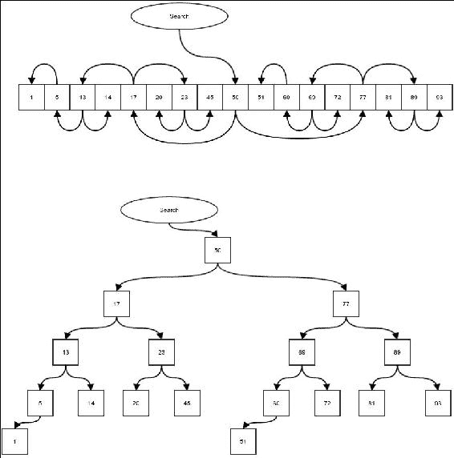

二叉搜索树

假设我们想要搜索编号为**23**的项目。我们从树的原始中点开始，即树的根。根的值是**50**。**23**小于**50**，所以我们必须检查左侧；在我们的树中，跟随左侧边缘。我们到达值**17**。**23**大于**17**，所以我们必须跟随右侧边缘，到达值**23**。我们刚刚找到了我们一直在寻找的元素。这个算法可以总结如下：

1.  从根开始。

1.  如果当前元素等于搜索元素，我们就完成了。

1.  如果搜索元素小于当前元素，我们跟随左侧边缘并从 2 开始再次进行。

1.  如果搜索元素大于当前元素，我们跟随右侧边缘并从 2 开始再次进行。

要编写此算法，我们首先必须创建一个二叉搜索树。创建一个扩展`BinaryTree`类的`BinarySearchTree`类，然后将你的算法放入其中：

```java
public class BinarySearchTree<E extends Comparable<E>> extends BinaryTree<E> {

    protected Node<E> searchValue(E value, Node<E> root){
        if(root==null){
            return null;
        }
        int comp = root.getValue().compareTo(value);
        if(comp == 0){
            return root;
        }else if(comp>0){
            return searchValue(value, root.getLeft());
        }else{
            return  searchValue(value, root.getRight());
        }
    }
```

现在将方法封装起来，这样你就不需要传递根节点。此方法还检查树是否为空树，如果是，则搜索失败：

```java
    public Node<E> searchValue(E value){
        if(getRoot()==null){
            return null;
        }else{
            return searchValue(value, getRoot());
        }
    }
    …

}
```

那么，修改二叉树中的数组究竟有什么意义呢？毕竟，我们不是还在做完全相同的搜索吗？嗯，关键是当我们以树的形式拥有它时，我们可以轻松地在树中插入新值或删除一些值。在数组的情况下，插入和删除的时间复杂度是线性的，并且不能超过预分配的数组大小。

## 在二叉搜索树中插入

在二叉搜索树中插入是通过首先搜索要插入的值来完成的。这要么找到元素，要么在新的值应该所在的位置上搜索失败。一旦我们到达这个位置，我们就可以简单地在该位置添加元素。在下面的代码中，我们再次重写搜索，因为我们找到空位插入元素后需要访问父节点：

```java
    protected Node<E> insertValue(E value, Node<E> node){
        int comp = node.getValue().compareTo(value);
        Node<E> child;
        if(comp<=0){
            child = node.getRight();
            if(child==null){
                return addChild(node,value,false);
            }else{
                return insertValue(value, child);
            }
        }else if(comp>0){
            child = node.getLeft();
            if(child==null){
                return addChild(node,value,true);
            }else{
                return insertValue(value, child);
            }
        }else{
            return null;
        }
    }
```

我们可以将这个方法封装起来，使其不需要起始节点。这也确保了当我们向空树插入时，我们只需添加一个根节点：

```java
    public Node<E> insertValue(E value){
        if(getRoot()==null){
            addRoot(value);
            return getRoot();
        }else{
            return insertValue(value, getRoot());
        }
    }
```

假设在我们之前的树中，我们想要插入值**21**。以下图显示了使用箭头的搜索路径以及新值是如何插入的：

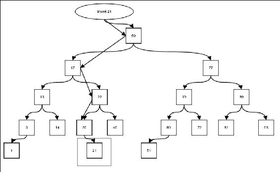

在二叉树中插入新值

现在我们有了在树中插入元素的手段，我们可以通过连续插入来简单地构建树。以下代码创建了一个包含 20 个元素的随机树，然后对其进行中序遍历：

```java
BinarySearchTree<Integer> tree = new BinarySearchTree<>();
for(int i=0;i<20;i++){
    int value = (int) (100*Math.random());
    tree.insertValue(value);
}
tree.traverseDepthFirst((x)->System.out.print(""+x), tree.getRoot(), DepthFirstTraversalType.INORDER);
```

如果你运行前面的代码，你总会发现元素是排序的。为什么是这样呢？我们将在下一节中看到这一点。

如果插入的元素与搜索树中已存在的元素相同，应该怎么办？这取决于特定的应用。通常，由于我们是按值搜索，我们不希望有相同值的重复副本。为了简单起见，如果值已经存在，我们将不会插入该值。

## 二叉搜索树的不变量

不变量是无论与其相关的结构如何修改，其属性都保持不变的性质。二叉搜索树的顺序遍历将始终以排序顺序遍历元素。为了理解为什么会这样，让我们考虑二叉树的另一个不变量：一个节点的左子树的所有后代都具有小于或等于该节点值的值，而一个节点的右子树的所有后代都具有大于该节点值的值。如果你考虑我们如何使用二分搜索算法形成二叉搜索树，这就可以理解为什么这是正确的。这就是为什么当我们看到比我们的搜索值大的元素时，我们总是移动到左子树。这是因为所有右子树的后代值都大于左子树，所以没有必要浪费时间检查它们。我们将利用这一点来证明二叉搜索树的顺序遍历将以节点值的排序顺序遍历元素。

我们将使用归纳法来论证这一点。假设我们有一个只有一个节点的树。在这种情况下，任何遍历都可以很容易地排序。现在让我们考虑一个只有三个元素的树，如图所示：

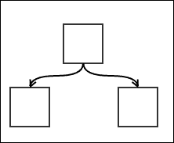

具有三个节点的二叉搜索树

对此树的顺序遍历将首先处理左子树，然后是父节点，最后是右子树。由于搜索树保证了左子树具有小于或等于父节点的值，而右子树具有大于或等于父节点值的值，因此遍历是排序的。

现在让我们考虑我们的通用情况。假设我们讨论的这个不变量对于具有最大*h*层级的树是正确的。我们将证明，在这种情况下，对于具有最大*h+1*层级的树也是正确的。我们将考虑一个通用的搜索树，如图所示：

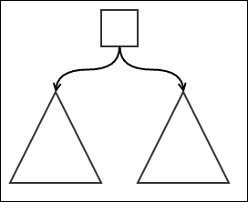

通用二叉搜索树

三角形代表具有最大 *n* 层的子树。我们假设对于子树，这个不变量是成立的。现在，中序遍历会首先以排序顺序遍历左子树，然后是父节点，最后是同样顺序的右子树。子树的排序顺序遍历是由假设这些子树的不变量成立所隐含的。这将导致顺序 *[按排序顺序遍历左子代][遍历父节点][按排序顺序遍历右子代]*。由于左子代都小于或等于父节点，而右子代都大于或等于父节点，所以提到的顺序实际上是一个排序顺序。因此，可以绘制一个最大层 *h+1* 的树，如图所示，每个子树的最大层为 *n*。如果这种情况成立，并且对于所有层 *h* 的树，这个不变量都是成立的，那么对于层 *h+1* 的树也必须成立。

我们已经知道，对于最大层为 1 和 2 的树，这个不变量是成立的。然而，对于最大层为 3 的树也必须成立。这暗示它对于最大层为 4 的树也必须成立，以此类推，直到无穷大。这证明了对于所有 *h*，这个不变量是成立的，并且是普遍成立的。

## 从二叉搜索树中删除一个元素

我们对二叉搜索树的所有修改都感兴趣，其中结果树仍然是一个有效的二叉搜索树。除了插入之外，我们还需要能够执行删除操作。也就是说，我们需要能够从树中删除一个现有的值：

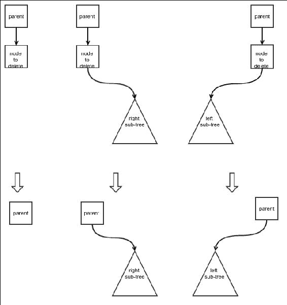

节点删除的三个简单情况

主要关注的是知道如何处理被删除节点的子节点。我们不希望从树中丢失这些值，同时我们还想确保树仍然是一个搜索树。我们需要考虑四种不同的情况。相对容易的三个情况已在前面图中展示。以下是这些情况的简要描述：

+   第一种情况是没有子节点的情况。这是最简单的情况；我们只需删除该节点。

+   第二种情况是只有一个右子树的情况。在这种情况下，子树可以取代被删除的节点。

+   第三种情况与第二种情况非常相似，只是它关于左子树。

第四种情况当然是当要删除的节点有两个子节点时。在这种情况下，没有一个子节点可以取代要删除的节点，因为另一个子节点也需要被附加到某个地方。我们通过用另一个节点替换需要删除的节点来解决这个问题，这个节点可以是两个子节点的有效父节点。这个节点是右子树的最小节点。为什么是这样呢？这是因为如果我们从这个右子树中删除这个节点，右子树的剩余节点将大于或等于这个节点。当然，这个节点也大于左子树中的所有节点。这使得这个节点成为一个有效的父节点。

接下来要问的问题是：右子树中的最小节点是什么？记住，当我们移动到一个节点的左子节点时，我们总是得到一个小于或等于当前节点的值。因此，我们必须继续向左遍历，直到没有更多的左子节点。如果我们这样做，我们最终会到达最小节点。任何子树的最小节点不能有任何左子节点，因此可以使用删除的第一个或第二个情况来删除它。因此，第四种情况的删除操作用于：

+   将右子树中最小节点的值复制到要删除的节点

+   删除右子树中的最小节点

要编写删除代码，我们首先需要向我们的 `BinaryTree` 类添加几个方法，这个类是用来删除节点和重写节点值的。`deleteNodeWithSubtree` 方法简单地删除一个节点及其所有后代。它简单地忘记了所有后代。它也有一定的检查来确认输入的有效性。通常，根的删除必须单独处理：

```java
    public void deleteNodeWithSubtree(Node<E> node){
        if(node == null){
            throw new NullPointerException("Cannot delete to null parent");
        }else if(node.containerTree != this){
            throw new IllegalArgumentException(
                "Node does not belong to this tree");
        }else {
            if(node==getRoot()){
                root=null;
                return;
            }else{
                Node<E> partent = node.getParent();
                if(partent.getLeft()==node){
                    partent.left = null;
            }else{
                partent.right = null;
            }
        }
    }
}
```

现在我们向 `BinaryTree` 类添加另一个方法来重写节点中的值。我们不允许这个类使用 `node` 类的公共方法来保持封装：

```java
    public void setValue(Node<E> node, E value){
        if(node == null){
            throw new NullPointerException("Cannot add node to null parent");
        }else if(node.containerTree != this){
            throw new IllegalArgumentException(
                     "Parent does not belong to this tree");
        }else {
            node.value = value;
        }
    }
```

上述代码是自我解释的。最后，我们编写一个方法来用一个来自同一棵树的另一个节点替换节点的子节点。这在情况 2 和 3 中很有用：

```java
    public Node<E> setChild(Node<E> parent, Node<E> child, boolean left){
        if(parent == null){
            throw new NullPointerException("Cannot set node to null parent");
        }else if(parent.containerTree != this){
            throw new IllegalArgumentException(
                "Parent does not belong to this tree");
        }else {
            if(left){
                parent.left = child;
            }else{
                parent.right = child;
            }
            if(child!=null) {
                child.parent = parent;
            }
            return child;
        }
    }
```

最后，我们在 `BinarySearchTree` 中添加一个方法来找到子树中的最小节点。我们继续向左走，直到没有更多的左子节点：

```java
    protected Node<E> getLeftMost(Node<E> node){
        if(node==null){
            return null;
        }else if(node.getLeft()==null){
            return node;
        }else{
            return getLeftMost(node.getLeft());
        }
    }
```

现在我们可以实现我们的删除算法。首先，我们创建一个 `deleteNode` 方法来删除一个节点。然后我们可以使用这个方法来删除一个值：

```java
    private Node<E> deleteNode(Node<E> nodeToBeDeleted) {

        boolean direction;
        if(nodeToBeDeleted.getParent()!=null
           && nodeToBeDeleted.getParent().getLeft()==nodeToBeDeleted){
            direction = true;
        }else{
            direction = false;
        }
```

**情况 1**：没有子节点。在这种情况下，我们可以简单地删除节点：

```java
        if(nodeToBeDeleted.getLeft()==null &&
            nodeToBeDeleted.getRight()==null){
            deleteNodeWithSubtree(nodeToBeDeleted);
            return nodeToBeDeleted;
        }
```

**情况 2**：只有一个右子节点。右子节点可以取代被删除的节点：

```java
        else if(nodeToBeDeleted.getLeft()==null){
            if(nodeToBeDeleted.getParent() == null){
                root = nodeToBeDeleted.getRight();
            }else {
                setChild(nodeToBeDeleted.getParent(),
                nodeToBeDeleted.getRight(), direction);
            }
             return nodeToBeDeleted;
         }
```

**情况 3**：只有一个左子节点。左子节点可以取代被删除的节点：

```java
        else if(nodeToBeDeleted.getRight()==null){
            if(nodeToBeDeleted.getParent() == null){
                root = nodeToBeDeleted.getLeft();
            }else {
                setChild(nodeToBeDeleted.getParent(),
                nodeToBeDeleted.getLeft(), direction);
            }
            return nodeToBeDeleted;
        }
```

**情况 4**：左子节点和右子节点都存在。在这种情况下，首先我们将右子树中最左边的子节点的值（或后继）复制到要删除的节点。一旦这样做，我们就删除右子树中最左边的子节点：

```java
        else{
         Node<E> nodeToBeReplaced = getLeftMost(nodeToBeDeleted.getRight());
            setValue(nodeToBeDeleted, nodeToBeReplaced.getValue());
            deleteNode(nodeToBeReplaced);
            return nodeToBeReplaced;
        }
    }
```

删除一个节点的过程证明要复杂一些，但并不困难。在下一节中，我们将讨论二叉搜索树操作的复杂度。

## 二叉搜索树操作的复杂度

我们首先考虑的操作是搜索操作。它从根开始，每次从一个节点移动到其子节点之一时，就向下移动一个级别。在搜索操作期间必须遍历的最大边数必须等同于树的最大高度——即任何节点与根之间的最大距离。如果树的高度是 *h*，那么搜索的复杂度是 *O(h)*。

现在树中节点数 *n* 和树的高度 *h* 之间有什么关系？这实际上取决于树是如何构建的。任何级别至少需要有一个节点，所以在最坏的情况下，*h = n*，搜索复杂度为 *O(n)*。我们的最佳情况是什么？或者更确切地说，我们希望 *h* 与 *n* 之间保持什么关系？换句话说，给定一个特定的 *n*，最小 *h* 是多少。为了回答这个问题，我们首先问，在高度 *h* 的树中我们可以容纳的最大 *n* 是多少？

根只是一个单一元素。根的子节点构成一个完整的级别，为高度为 2 的树添加两个节点。在下一级，我们将为这一级中的任何节点有两个子节点。所以下一级或第三级总共有 *2X2=4* 个节点。可以很容易地看出，树的级别 *h* 总共有 *2^((h-1))* 个节点。高度为 *h* 的树可以拥有的节点总数如下：

```java
n = 1 + 2 + 4+ … + 2(h-1) = 2h – 1
=> 2h = (n+1) 
=> h = lg (n+ 1)
```

这是我们的理想情况，其中搜索的复杂度是 *O(lg n)*。所有级别都满的二叉树称为平衡二叉树。我们的目标是即使在插入或删除操作时也要保持树的平衡性质。然而，在一般情况下，如果元素插入的顺序是任意的，树就不会保持平衡。

插入只需要搜索元素；一旦完成，添加一个新节点就是一个常数时间操作。因此，它的复杂度与搜索相同。删除实际上最多需要两次搜索（在第四种情况下），因此它的复杂度也与搜索相同。

# 自平衡二叉搜索树

当进行插入和删除操作时，在一定程度上保持平衡的二叉搜索树被称为自平衡二叉搜索树。为了创建一个平衡的不平衡树的版本，我们使用一种称为**旋转**的特殊操作。我们将在下一节中讨论旋转：

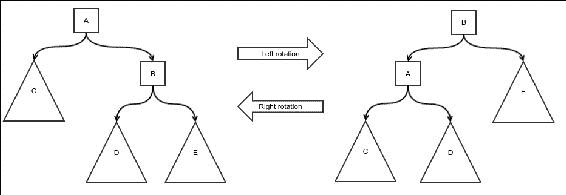

二叉搜索树的旋转

此图展示了节点 **A** 和 **B** 上的旋转操作。对 **A** 进行左旋转会生成右侧的图像，而对 **B** 进行右旋转会生成左侧的图像。为了可视化旋转，首先考虑将子树 **D** 拔出。这个子树位于中间某个位置。现在节点向左或向右旋转。在左旋转的情况下，右子节点变为父节点，而父节点变为原始子节点的左子节点。一旦完成这个旋转，**D** 子树就被添加到原始父节点的右子节点位置。右旋转与左旋转完全相同，但方向相反。

它如何帮助平衡一棵树？注意图中的左侧。你会意识到右侧看起来更重，然而，一旦你执行左旋转，左侧看起来会更重。实际上，左旋转将右子树的深度减少一个，并将左子树的深度增加一个。即使最初，与左侧相比，右侧的深度为 2，你也可以通过左旋转来修复它。唯一的例外是子树 **D**，因为 **D** 的根保持在同一级别；其最大深度没有变化。对于右旋转，类似的论点同样成立。

旋转保持树的搜索树属性不变。如果我们打算用它来平衡搜索树，这一点非常重要。让我们考虑左旋转。从位置上，我们可以得出以下不等式：

+   **C** 中的每个节点 ≤ **A**

+   A ≤ B

+   **A** ≤ **D** 中的每个节点 ≤ **B**

+   **B** ≤ **E** 中的每个节点

执行旋转后，我们以相同的方式检查不等式，发现它们完全相同。这证明了旋转保持搜索树属性不变的事实。旋转算法的想法很简单：首先取出中间子树，进行旋转，然后重新连接中间子树。以下是在我们的 `BinaryTree` 类中的实现：

```java
    protected void rotate(Node<E> node, boolean left){
```

首先，让我们做一些参数值检查：

```java
        if(node == null){
            throw new IllegalArgumentException("Cannot rotate null node");
        }else if(node.containerTree != this){
            throw  new IllegalArgumentException(
                "Node does not belong to the current tree");
        }
        Node<E> child = null;
        Node<E> grandchild = null;
        Node<E> parent = node.getParent();
        boolean parentDirection;
```

我们想要移动的子节点和孙节点取决于旋转的方向：

```java
        if(left){
            child = node.getRight();
            if(child!=null){
                grandchild = child.getLeft();
            }
        }else{
            child = node.getLeft();
            if(child!=null){
                grandchild = child.getRight();
            }
        }
```

根节点需要像往常一样进行特殊处理：

```java
        if(node != getRoot()){
            if(parent.getLeft()==node){
                parentDirection = true;
            }else{
                parentDirection = false;
            }
            if(grandchild!=null)
                deleteNodeWithSubtree(grandchild);
            if(child!=null)
                deleteNodeWithSubtree(child);
                deleteNodeWithSubtree(node);
            if(child!=null) {
                setChild(parent, child, parentDirection);
                setChild(child, node, left);
            }
            if(grandchild!=null)
                setChild(node, grandchild, !left);
        }else{
            if(grandchild!=null)
                deleteNodeWithSubtree(grandchild);
            if(child!=null)
                deleteNodeWithSubtree(child);
                deleteNodeWithSubtree(node);
            if(child!=null) {
                root = child;
                setChild(child, node, left);
            }
            if(grandchild!=null)
                setChild(node, grandchild, !left);
                root.parent = null;
        }
    }
```

现在，我们可以看看我们的第一个自平衡二叉树，称为 AVL 树。

## AVL 树

AVL 树是我们第一个自平衡二叉搜索树。想法很简单：尽可能保持每个子树平衡。理想的情况是，从每个节点开始，左右子树的高度完全相同。然而，由于节点数量不是*2^p* *-1*的形式，其中*p*是正整数，我们无法总是实现这一点。相反，我们允许有一点灵活性。重要的是，左子树和右子树的高度差不能超过一。如果在任何插入或删除操作中意外破坏了这个条件，我们将应用旋转来修复它。我们只需要担心高度差为两个，因为我们一次只考虑一个元素的插入和删除，插入一个元素或删除它不能使高度变化超过一个。因此，我们的最坏情况是已经有一个差异，新的添加或删除又产生了一个差异，需要旋转来修复。

最简单的旋转类型在以下图中展示。三角形代表等高的子树。请注意，左子树的高度比右子树的高度少两个：

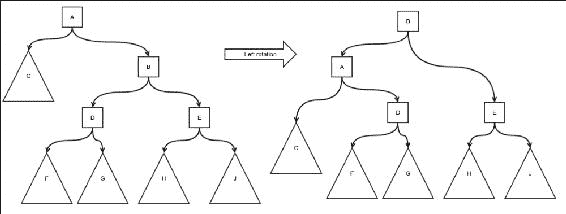

AVL 树 – 简单旋转

因此，我们进行左旋转以生成结构子树，如图所示。您可以看到子树的高度符合我们的条件。简单的右旋转情况完全相同，只是方向相反。我们必须对所有节点的前辈进行此操作，这些节点要么被插入，要么被删除，因为只有这些节点的子树高度受到影响。由于旋转也会导致高度变化，我们必须从底部开始，在旋转的同时向上走到根节点。

还有一种称为双重旋转的情况。请注意，由于旋转，中间孙子的根的子树的高度没有改变。因此，如果这是不平衡的原因，简单的旋转无法解决这个问题。这也在以下图中展示：

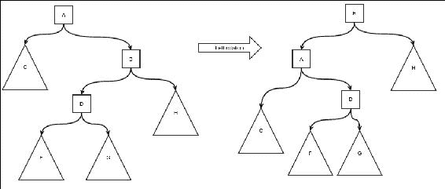

简单旋转无法修复这种不平衡

在这里，接收插入的子树以**D**为根，或者从子树**C**中删除了一个节点。在插入的情况下，请注意，由于**B**的左子树的高度只比其右子树高一个，所以**B**上不会进行旋转。然而，**A**是不平衡的。**A**的左子树的高度比其右子树低两个。但是，如果我们对**A**进行旋转，如前图所示，这并不能解决问题；只是将左重条件转换成了右重条件。为了解决这个问题，我们需要进行双重旋转，如下一图所示。首先，我们对中间的孙子节点进行相反方向的旋转，使其在相反方向上不会失衡。之后的简单旋转将修复不平衡。

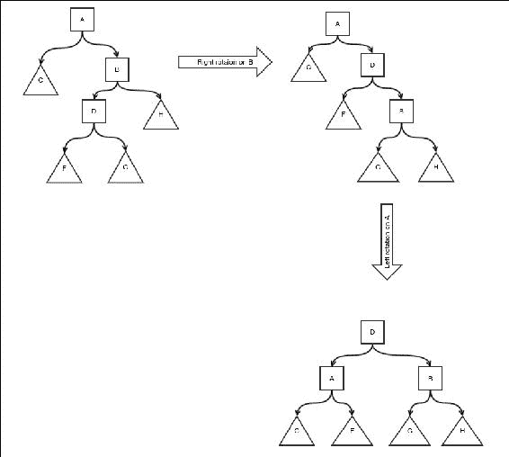

AVL 树双重旋转

因此，我们创建了一个 AVL 树类，并在`Node`类中添加了一个额外的字段来存储其根的子树的高度：

```java
public class AVLTree<E extends Comparable<E>> 
          extends BinarySearchTree<E>{
    public static class Node<E extends Comparable<E>> 
              extends BinaryTree.Node{
        protected int height = 0;
        public Node(BinaryTree.Node parent,
                    BinaryTree containerTree, E value) {
            super(parent, containerTree, value);
        }
    }
```

我们必须重写`newNode`方法以返回我们的扩展节点：

```java
    @Override
    protected BinaryTree.Node<E> newNode(
      BinaryTree.Node<E> parent, BinaryTree<E> containerTree, E value) {
        return new Node(parent, containerTree, value);
    }
```

我们使用一个实用方法来检索子树的高度，并进行空检查。空子树的高度为零：

```java
    private int nullSafeHeight(Node<E> node){
        if(node==null){
            return 0;
        }else{
            return node.height;
        }
    }
```

首先，我们包括一个方法来计算和更新节点根的子树的高度。高度是其孩子最大高度加一：

```java
    private void nullSafeComputeHeight(Node<E> node){
        Node<E> left = (Node<E>) node.getLeft();
        Node<E> right = (Node<E>) node.getRight();
        int leftHeight = left==null? 0 : left.height;
        int rightHeight = right==null? 0 :right.height;
        node.height =  Math.max(leftHeight, rightHeight)+1;
    }
```

我们还在`BinaryTree`中重写了`rotate`方法，以便在旋转后更新子树的高度：

```java
    @Override
    protected void rotate(BinaryTree.Node<E> node, boolean left) {
        Node<E> n = (Node<E>) node;
        Node<E> child;
        if(left){
            child = (Node<E>) n.getRight();
        }else{
            child = (Node<E>) n.getLeft();
        }
        super.rotate(node, left);
        if(node!=null){
            nullSafeComputeHeight(n);
        }
        if(child!=null){
            nullSafeComputeHeight(child);
        }
    }
```

通过这些方法，我们实现了从节点到根节点的整个平衡过程，如前述代码所示。平衡位是通过检查左右子树高度差来完成的。如果差值为 0、1 或-1，则不需要做任何事情。我们只需递归地向上移动树。当高度差为 2 或-2 时，这就是我们需要进行平衡的时候：

```java
    protected void rebalance(Node<E> node){
        if(node==null){
            return;
        }
        nullSafeComputeHeight(node);
        int leftHeight = nullSafeHeight((Node<E>) node.getLeft());
        int rightHeight = nullSafeHeight((Node<E>) node.getRight());
        switch (leftHeight-rightHeight){
            case -1:
            case 0:
            case 1:
                rebalance((Node<E>) node.getParent());
                break;
            case 2:
                int childLeftHeight = nullSafeHeight(
                        (Node<E>) node.getLeft().getLeft());
                int childRightHeight = nullSafeHeight(
                        (Node<E>) node.getLeft().getRight());
                if(childRightHeight > childLeftHeight){
                    rotate(node.getLeft(), true);
                }
                Node<E> oldParent = (Node<E>) node.getParent();
                rotate(node, false);
                rebalance(oldParent);
                break;
            case -2:
                childLeftHeight = nullSafeHeight(
                        (Node<E>) node.getRight().getLeft());
                childRightHeight = nullSafeHeight(
                        (Node<E>) node.getRight().getRight());
                if(childLeftHeight > childRightHeight){
                    rotate(node.getRight(), false);
                }
                oldParent = (Node<E>) node.getParent();
                rotate(node, true);
                rebalance(oldParent);
                break;
        }
    }
```

一旦旋转实现，实现插入和删除操作就非常简单。我们首先进行常规的插入或删除，然后进行平衡。一个简单的插入操作如下：

```java
  @Override
    public BinaryTree.Node<E> insertValue(E value) {
        Node<E> node = (Node<E>) super.insertValue(value);
        if(node!=null)
            rebalance(node);
            return node;
    }
```

删除操作也非常相似。它只需要一个额外的检查来确认节点确实被找到并删除：

```java
@Override
    public BinaryTree.Node<E> deleteValue(E value) {
        Node<E> node = (Node<E>) super.deleteValue(value);
        if(node==null){
            return null;
        }
        Node<E> parentNode = (Node<E>) node.getParent();
        rebalance(parentNode);
        return node;
    }
```

### AVL 树中搜索、插入和删除的复杂度

AVL 树的最坏情况是它具有最大不平衡。换句话说，当给定节点数达到最大高度时，树是最差的。为了找出这是多少，我们需要以不同的方式提出问题，给定高度 h：能够实现这一点的最小节点数（n）是多少？设实现这一点的最小节点数为*f(h)*。高度为*h*的树将有两个子树，并且不失一般性，我们可以假设左子树比右子树高。我们希望这两个子树也具有最小节点数。因此，左子树的高度将是*f(h-1)*。我们希望右子树的高度最小，因为这不会影响整个树的高度。然而，在 AVL 树中，同一级别的两个子树的高度差最大为 1。这个子树的高度是*h-2*。因此，右子树的节点数是*f(h-2)*。整个树也必须有一个根节点，因此总节点数：

```java
f(h) = f(h-1) + f(h-2) + 1
```

它几乎看起来像是斐波那契数列的公式，除了*+1*部分。我们的起始值是 1 和 2，因为*f(1) = 1*（只有根节点）和*f(2) = 2*（只有一个孩子）。这大于斐波那契数列的起始值，斐波那契数列的起始值是 1 和 1。当然，节点数将大于相应的斐波那契数。所以，以下就是情况：

```java
f(h) ≥ Fh where Fh is the hth Fibonacci number.
```

我们知道对于足够大的*h*，*F*h* ≈ φ*F*h-1*成立；这里*φ*是黄金比例*(1 + √5)/2*。这意味着*F*h* = C φ*h，其中 C 是某个常数。所以，我们得到以下：

```java
f(h) ≥ C φ h
=>n ≥ C  φ h
=> log φn ≥  h +  log φ C
=> h = O(  log φn) = O(lg n)
```

这意味着即使是 AVL 树的最坏高度也是对数级的，这正是我们想要的。由于插入过程在每个级别处理一个节点，直到达到插入位置，因此插入的复杂度是*O(lg n)*；执行搜索和删除操作也是一样，原因相同。

# 红黑树

AVL 树保证了对数级的插入、删除和搜索。但它会进行很多旋转。在大多数应用中，插入和删除都是随机排序的。因此，这些树最终会平衡。然而，由于 AVL 树旋转得太快，它可能会在不需要的情况下频繁地在相反方向上进行旋转。这可以通过不同的方法来避免：知道何时旋转子树。这种方法被称为红黑树。

在红黑树中，节点有一个颜色，要么是黑色，要么是红色。在节点操作期间可以切换颜色，但它们必须遵循以下条件：

+   根节点必须是黑色的

+   红色节点不能有黑色子节点

+   任何以任何节点为根的子树的黑色高度等于以兄弟节点为根的子树的黑色高度

现在什么是子树的黑高？它是从根到叶子的黑色节点的数量。当我们说*叶*时，我们实际上是指空孩子，它们被认为是黑色的，并且允许父节点为红色而不违反规则 2。这无论我们走哪条路径都是一样的。这是因为第三个条件。所以第三个条件也可以重新表述为：从任何子树的根到其任何叶子节点的路径上的黑色节点数量是相同的，无论我们选择哪个叶子。

为了便于操作，叶子的空孩子也被视为某种半节点；空孩子总是被认为是黑色的，并且是唯一真正被视为叶子的节点。所以叶子不包含任何值。但它们与其他红黑树中的传统叶子不同。新节点可以添加到叶子，但不能添加到红黑树中；这是因为这里的叶子是空节点。因此，我们不会明确地绘制它们或把它们放入代码中。它们只对计算和匹配黑高有帮助：

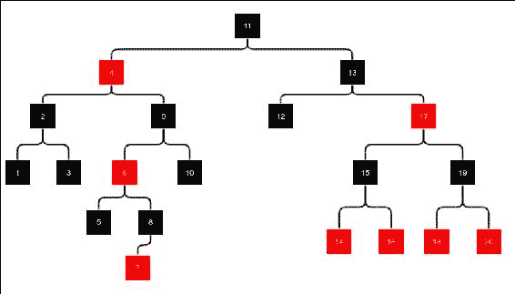

红黑树的例子

在我们高度为 4 的红黑树例子中，空节点是黑色的，这些节点没有显示（在打印副本中，浅色或灰色节点是红色节点，深色节点是黑色节点）。

插入和删除都比 AVL 树复杂，因为我们需要处理更多的情况。我们将在以下章节中讨论这个问题。

## 插入

插入是以我们处理 BST（二叉搜索树）相同的方式进行。插入完成后，新节点被着色为红色。这保留了黑高，但它可能导致一个红色节点成为另一个红色节点的子节点，这将违反条件 2。因此，我们需要进行一些操作来修复这个问题。以下两个图显示了四种插入情况：

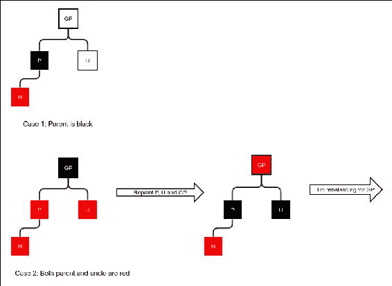

红黑树插入的 1 和 2 情况

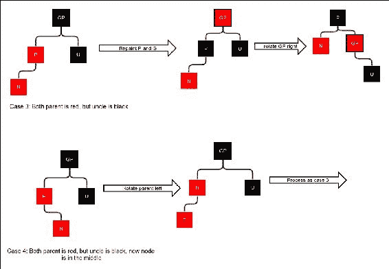

红黑树插入的 3 和 4 情况

让我们逐个讨论插入的情况。注意，图中的树看起来是黑色和不平衡的。但这仅仅是因为我们没有绘制整个树；这只是我们感兴趣的树的一部分。重要的是，无论我们做什么，任何节点的黑高都不会改变。如果必须增加黑高以适应新节点，它必须在顶层；所以我们只需将其移动到父节点。以下四种情况如下：

1.  父节点是黑色的。在这种情况下，不需要做任何事情，因为它没有违反任何约束。

1.  父节点和叔叔节点都是红色的。在这种情况下，我们需要重新着色父节点、叔叔节点和祖父节点，并且黑高保持不变。注意现在没有违反任何约束。然而，如果祖父节点是根节点，则保持它为黑色。这样，整个树的黑高就增加了 1。

1.  父节点是红色，叔叔节点是黑色。新添加的节点位于父节点与祖父节点相同的侧。在这种情况下，我们进行旋转并重新着色。我们首先重新着色父节点和祖父节点，然后旋转祖父节点。

1.  这与情况 3 类似，但新添加的节点位于父节点与祖父节点相反的一侧。由于这样做会改变新添加节点的黑色高度，所以不能应用情况 3。在这种情况下，我们旋转父节点，使其与情况 3 相同。

1.  注意，所有这些情况都可以以相反的方向发生，即镜像。我们将以相同的方式处理这两种情况。

让我们创建一个扩展`BinarySearchTree`类的`RedBlackTree`类。我们必须再次扩展`Node`类，并包括一个标志以知道节点是否为黑色：

```java
public class RedBlackTree<E extends Comparable<E>> extends BinarySearchTree<E>{
    public static class Node<E> extends BinaryTree.Node<E>{
        protected int blackHeight = 0;
        protected boolean black = false;
        public Node(BinaryTree.Node parent,
                    BinaryTree containerTree, E value) {
            super(parent, containerTree, value);
        }
    }

    @Override
    protected  BinaryTree.Node<E> newNode(
      BinaryTree.Node<E> parent, BinaryTree<E> containerTree, E value) {
        return new Node(parent, containerTree, value);
    }
...
}
```

我们现在添加一个实用方法，该方法返回一个节点是否为黑色。如前所述，空节点被认为是黑色：

```java
    protected boolean nullSafeBlack(Node<E> node){
        if(node == null){
            return true;
        }else{
            return node.black;
        }
    }
```

现在我们已经准备好在插入后定义重新平衡的方法。这种方法与前面描述的四个情况相同。我们维护一个`nodeLeftGrandChild`标志，用于存储父节点是否是祖父节点的左子节点或其右子节点。这有助于我们找到叔叔节点，并在正确的方向上进行旋转：

```java
    protected void rebalanceForInsert(Node<E> node){
        if(node.getParent() == null){
            node.black = true;
        }else{
            Node<E> parent = (Node<E>) node.getParent();
            if(parent.black){
                return;
            }else{
                Node<E> grandParent = (Node<E>) parent.getParent();
                boolean nodeLeftGrandChild = grandParent.getLeft()== parent;

                Node<E> uncle = nodeLeftGrandChild?
                  (Node<E>) grandParent.getRight()
                  : (Node<E>) grandParent.getLeft();
                if(!nullSafeBlack(uncle)){
                    if(grandParent!=root)
                        grandParent.black = false;
                        uncle.black = true;
                        parent.black = true;
                        rebalanceForInsert(grandParent);
                }else{
                    boolean middleChild = nodeLeftGrandChild?
                      parent.getRight() == node:parent.getLeft() == node;
                    if (middleChild){
                        rotate(parent, nodeLeftGrandChild);
                        node = parent;
                        parent = (Node<E>) node.getParent();
                    }
                    parent.black = true;
                    grandParent.black = false;
                    rotate(grandParent, !nodeLeftGrandChild);
                }
            }

        }
    }
```

插入现在是按照以下方式进行的：

```java
    @Override
    public BinaryTree.Node<E> insertValue(E value) {
        Node<E> node = (Node<E>) super.insertValue(value);
        if(node!=null)
            rebalanceForInsert(node);
        return node;
    }
```

## 删除

删除操作从正常的二叉搜索树删除操作开始。如果你还记得，这通常涉及删除最多只有一个子节点的节点。删除内部节点是通过首先复制右子树最左节点的值然后删除它来完成的。因此，我们只考虑这种情况：

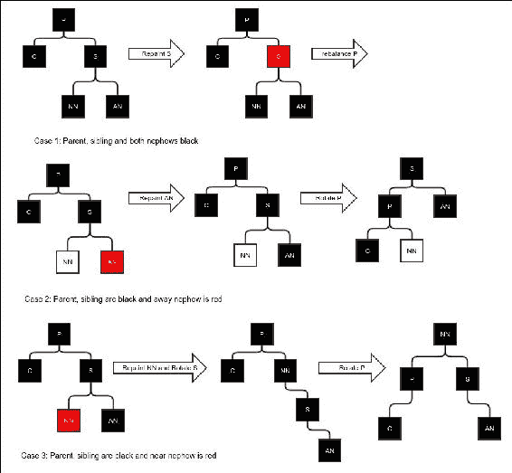

红黑树删除操作的 1、2 和 3 种情况

删除完成后，被删除节点的父节点要么没有子节点，要么有一个子节点，这个子节点原本是其祖父节点。在插入过程中，我们需要解决的问题是一个红色父节点的红色子节点。在删除过程中，这种情况不会发生。但它可以导致黑色高度发生变化。

一个简单的情况是，如果我们删除一个红色节点，黑色高度不会发生变化，所以我们不需要做任何事情。另一个简单的情况是，如果被删除的节点是黑色且子节点是红色，我们可以简单地重新着色子节点为黑色，以恢复黑色高度。

黑色子节点实际上是不可能发生的，因为这意味着原始树是黑色且不平衡的，因为被删除的节点有一个单独的黑色子节点。但由于递归的存在，在递归重新平衡的过程中向上移动路径时，实际上可以出现黑色子节点。在以下讨论中，我们只考虑被删除的节点是黑色且子节点也是黑色（或空子节点，被认为是黑色）的情况。删除操作按照以下情况执行，如图所示*红黑树删除操作的 1、2 和 3 种情况*和*从红黑树删除的 4、5 和 6 种情况*：

1.  我们遇到的第一种情况是父节点、兄弟节点以及两个侄子节点都是黑色。在这种情况下，我们可以简单地重新绘制兄弟节点为红色，这将使父节点变为黑色并保持平衡。然而，整个子树的黑色高度将减少一个；因此，我们必须从父节点开始继续重新平衡。

1.  这是父节点和兄弟节点为黑色，但远侄子节点为红色的情况。在这种情况下，我们不能重新绘制兄弟节点，因为这会使红色兄弟节点有一个红色子节点，违反了约束 2。因此，我们首先将红色侄子节点重新着色为黑色，然后旋转以修复侄子节点的黑色高度，同时修复子节点的黑色高度。

1.  当近侄子节点为红色而不是远侄子节点时，旋转不会恢复被重新着色的近侄子节点的黑色高度。因此，我们重新着色 NN，但进行双重旋转。

1.  现在考虑当兄弟节点为红色时会发生什么。我们首先使用相反的颜色重新绘制父节点和兄弟节点，并旋转 P。但这并不会改变任何节点的黑色高度；它将情况简化为 5 或 6，我们将在下面讨论。因此，我们只需再次递归地调用重新平衡代码。

1.  我们现在完成了所有父节点为黑色的情况。这是一个父节点为红色的情况。在这种情况下，我们将近侄子节点视为黑色。简单地旋转父节点就可以修复黑色高度。

1.  我们最后的案例是当父节点为红色且近侄子节点为红色时。在这种情况下，我们重新着色父节点并进行双重旋转。注意，顶部节点仍然为红色。这不是问题，因为原始的顶部节点，即父节点，也是红色，因此它的父节点必须是黑色。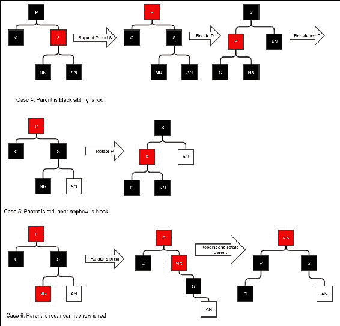

    从红黑树中删除的 4、5 和 6 种情况

现在我们可以定义`rebalanceForDelete`方法，编码所有前面的情况：

```java
    protected void rebalanceForDelete(Node<E> parent, boolean nodeDirectionLeft){
        if(parent==null){
            return;
        }
        Node<E> node = (Node<E>) (nodeDirectionLeft? parent.getLeft(): parent.getRight());
        if(!nullSafeBlack(node)){
            node.black = true;
            return;
        }

        Node<E> sibling = (Node<E>) (nodeDirectionLeft? parent.getRight(): parent.getLeft());

        Node<E> nearNephew = (Node<E>) (nodeDirectionLeft?sibling.getLeft():sibling.getRight());

        Node<E> awayNephew = (Node<E>) (nodeDirectionLeft?sibling.getRight():sibling.getLeft());

        if(parent.black){
            if(sibling.black){
                if(nullSafeBlack(nearNephew) && nullSafeBlack(awayNephew)){
                    sibling.black = false;
                    if(parent.getParent()!=null){
                        rebalanceForDelete (
                          (Node<E>) parent.getParent(),
                          parent.getParent().getLeft() == parent);
                    }
                }else if(!nullSafeBlack(awayNephew)){
                    awayNephew.black = true;
                    rotate(parent, nodeDirectionLeft);
                }else{
                    nearNephew.black = true;
                    rotate(sibling, !nodeDirectionLeft);
                    rotate(parent, nodeDirectionLeft);
                }

            }else{
                parent.black = false;
                sibling.black = true;
                rotate(parent, nodeDirectionLeft);
                rebalanceForDelete(parent, nodeDirectionLeft);
            }
        }else{

            if(nullSafeBlack(nearNephew)){
                rotate(parent, nodeDirectionLeft);
            }else{
                parent.black = true;
                rotate(sibling, !nodeDirectionLeft);
                rotate(parent, nodeDirectionLeft);
            }
        }

    }
```

现在我们覆盖了`deleteValue`方法，在删除后调用重新平衡。我们只需要在删除的节点是黑色时进行重新平衡。我们首先检查这一点。然后，我们需要确定被删除的子节点是父节点的左子节点还是右子节点。之后，我们可以调用`rebalanceForDelete`方法：

```java
    @Override
    public BinaryTree.Node<E> deleteValue(E value) {
        Node<E> node = (Node<E>) super.deleteValue(value);

        if(node !=null && node.black && node.getParent()!=null){
            Node<E> parentsCurrentChild = (Node<E>) (node.getLeft() == null ? node.getRight(): node.getLeft());
            if(parentsCurrentChild!=null){
                boolean isLeftChild = parentsCurrentChild.getParent().getLeft() == parentsCurrentChild;
                rebalanceForDelete(
                        (Node<E>) node.getParent(), isLeftChild);
            }else{
                boolean isLeftChild = node.getParent().getRight()!=null;
                rebalanceForDelete(
                        (Node<E>) node.getParent(), isLeftChild);
            }

        }
        return node;
    }
```

## 红黑树的最坏情况

最坏可能的红黑树是什么？我们试图以与 AVL 树案例相同的方式找出答案。虽然这个案例稍微复杂一些。要使最小节点数 n 适应高度 h，我们首先需要选择一个黑高。现在我们希望尽可能少地有黑节点，这样我们就不必在试图拉伸高度的节点兄弟中包含黑节点来平衡黑高。由于红节点不能成为另一个节点的父节点，我们必须有交替的黑节点。我们考虑高度 *h* 和一个偶数，这样黑高就是 *h/2 = l*。为了简单起见，我们既不计算高度也不计算黑高的黑空节点。下一个图显示了最坏树的一些示例：

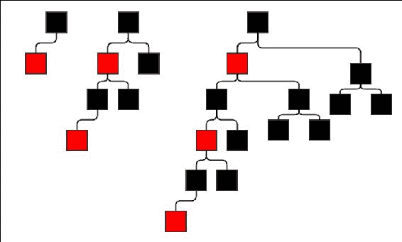

最坏的红黑树

当然，一般想法是，有一条路径具有最大可能的高度。这条路径应该填充尽可能多的红节点，而其他路径则填充尽可能少的节点，即只填充黑节点。一般想法在下一个图中显示。

高度为 *l-1* 的满黑树中的节点数当然是 *2* ^(*l-1*) *– 1*。所以，如果高度为 *h = 2l* 的节点数为 *f(l)*，那么我们就有递归公式：

```java
f(l) = f(l-1) + 2 ( 2l-1 – 1) + 2
=> f(l) = f(l-1) + 2l
```

现在，从前面的图中，我们还可以看到 *f(1) = 2*，*f(2) = 6*，和 *f(3) = 14*。看起来公式应该是 *f(l) = 2* ^(*l-1*) *-2*。我们已经有了基本案例。如果我们能证明如果公式对 l 成立，那么它对 *l+1* 也成立，我们就能通过归纳法证明所有 *l* 的公式。这正是我们将要尝试做的：

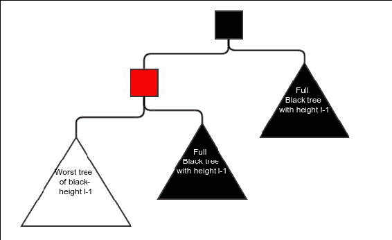

最坏红黑树的一般想法

我们已经有了 *f(l+1) = f(l) + 2l+1*，并且我们也假设 *f(l) = 2l+1-2*。所以这是这种情况：*f(l+1) = 2l+1-2 + 2l+1 = 2l+2-2*。因此，如果公式对 *l* 成立，它对 *l+1* 也成立；因此，通过归纳法证明了这一点。

所以，最小节点数如下：

```java
n = f(l) =  2l+2-2\. 
=> lg n = lg ( 2l+2-2)   
=> lg n >  lg ( 2l+1)
=> lg n > l+1
=> l + 1< lg n
=> l < lg n
=> l = O (lg n)
```

因此，红黑树有一个保证的对数高度；从这个事实可以推导出，搜索、插入和删除操作都是对数的。

# 哈希表

哈希表是一种完全不同的可搜索结构。这个想法始于所谓的哈希函数。这是一个函数，为任何所需类型的值提供一个整数。例如，字符串的哈希函数必须为每个字符串返回一个整数。Java 要求每个类都必须有一个 `hashcode()` 方法。对象类默认实现了一个方法，但每当我们要重写 `equals` 方法时，我们必须重写默认实现。哈希函数具有以下属性：

+   相同的值必须始终返回相同的哈希值。这被称为哈希的一致性。在 Java 中，这意味着如果`x`和`y`是两个对象，并且`x.equals(y)`为`true`，那么`x.hashcode() == y.hashcode()`。

+   不同的值可能返回相同的哈希值，但最好是它们不返回相同的值。

+   哈希函数可以在常数时间内计算。

一个完美的哈希函数将为不同的值提供不同的哈希值。然而，通常这种哈希函数不能在常数时间内计算。因此，我们通常求助于生成看似随机但实际上是值的复杂函数的哈希值。例如，`String`类的`hashcode`看起来像这样：

```java
public int hashCode() {
    int h = hash;
     if (h == 0 && value.length > 0) {
        char val[] = value;

        for (int i = 0; i < value.length; i++) {
            h = 31 * h + val[i];
        }
         hash = h;
    }
    return h;
}
```

注意，这是一个由构成字符计算出的复杂函数。

哈希表保持一个由哈希码索引的桶数组。桶可以有多种数据结构，但在这里，我们将使用链表。这使得能够在常数时间内跳转到某个桶，并且桶保持足够小，以至于桶内的搜索，即使是线性搜索，也不会花费太多。

让我们为我们的哈希表创建一个骨架类：

```java
public class HashTable<E> {
    protected LinkedList<E> [] buckets;
    protected double maximumLoadFactor;
    protected int totalValues;
    public HashTable(int initialSize, double maximumLoadFactor){
        buckets = new LinkedList[initialSize];
        this.maximumLoadFactor = maximumLoadFactor;
    }
    …
}
```

我们接受两个参数。`InitialSize`是我们想要开始的初始桶数量，我们的第二个参数是最大负载因子。

什么是负载因子？负载因子是每个桶的平均值。如果桶的数量是*k*，并且其中的总值为*n*，那么负载因子是*n/k*。

## 插入

插入操作首先计算哈希值，然后选择该索引处的桶。现在首先，线性搜索该桶以查找值。如果找到值，则不执行插入；否则，将新值添加到桶的末尾。

首先，我们创建一个用于在给定的桶数组中插入的函数，然后使用它来执行插入操作。这在您动态扩展哈希表时非常有用：

```java
    protected boolean insert(E value, int arrayLength,
                             LinkedList<E>[] array) {
        int hashCode = value.hashCode();
        int arrayIndex = hashCode % arrayLength;
        LinkedList<E> bucket = array[arrayIndex];
        if(bucket == null){
            bucket = new LinkedList<>();
            array[arrayIndex] = bucket;
        }
        for(E element: bucket){
            if(element.equals(value)){
                return false;
            }
        }
        bucket.appendLast(value);
        totalValues++;
        return true;
    }
```

注意，有效的哈希码是通过将实际哈希码除以桶的数量得到的余数来计算的。这样做是为了限制哈希码的数量。

这里还有一件事要做，那就是重新哈希。重新哈希是在哈希表超过预定义的负载因子（或在某些情况下由于其他条件，但我们将使用负载因子）时动态扩展哈希表的过程。重新哈希是通过创建一个更大的桶数组的第二个桶数组并复制每个元素到新的桶集合中完成的。现在，旧的桶数组被丢弃。我们创建此函数如下：

```java
    protected void rehash(){
        double loadFactor = ((double)(totalValues))/buckets.length;
        if(loadFactor>maximumLoadFactor){
            LinkedList<E> [] newBuckets = new LinkedList[buckets.length*2];
            totalValues = 0;
            for(LinkedList<E> bucket:buckets){
                if(bucket!=null) {
                    for (E element : bucket) {
                        insert(element, newBuckets.length, newBuckets);
                    }
                }
            }
            this.buckets = newBuckets;
        }
    }
```

现在我们可以有一个为值完成的`insert`函数：

```java
    public boolean insert(E value){
        int arrayLength = buckets.length;
        LinkedList<E>[] array = buckets;
        boolean inserted = insert(value, arrayLength, array);
        if(inserted)
            rehash();
        return inserted;
    }
```

### 插入的复杂度

很容易看出，除非我们不得不重新散列，否则插入操作几乎是常数时间；在这种情况下，它是 *O(n)*。那么我们得重新散列多少次？假设负载因子为 *l*，桶的数量为 *b*。假设我们从 `initialSize` *B* 开始。由于我们每次重新散列时都会加倍，所以桶的数量将是 *b = B.2* ^R；这里 *R* 是我们重新散列的次数。因此，元素的总数可以表示为：*n = bl = Bl. 2* *R*。看看这个：

```java
lg n = R + lg(Bl) .
=> R = ln n – lg (Bl) = O(lg n)
```

大约有 `lg n` 次重新散列操作，每次操作的复杂度为 `O(n)`。因此，插入 `n` 个元素的平均复杂度为 `O(n lg n)`。因此，插入每个元素的平均复杂度为 `O(lg n)`。当然，如果所有值都聚集在我们插入的单个桶中，这就不适用了。那么，每次插入的复杂度将是 `O(n)`，这是插入操作的最坏情况复杂度。

删除与插入非常相似；它涉及在搜索后从桶中删除元素。

## 搜索

搜索很简单。我们计算哈希码，转到适当的桶，并在桶中进行线性搜索：

```java
public E search(E value){
    int hash = value.hashCode();
    int index = hash % buckets.length;
    LinkedList<E> bucket = buckets[index];
    if(bucket==null){
        return null;
    }else{
        for(E element: bucket){
            if(element.equals(value)){
                return element;
            }
        }
        return null;
    }
}
```

### 搜索的复杂度

如果值分布均匀，搜索操作的复杂度是常数时间。这是因为在这种情况下，每个桶中的元素数量将小于或等于负载因子。然而，如果所有值都在同一个桶中，搜索将简化为线性搜索，其复杂度为 *O(n)*。所以最坏情况是线性的。在大多数情况下，搜索的平均复杂度是常数时间，这比二叉搜索树的复杂度要好。

## 负载因子选择

如果负载因子太大，每个桶将包含大量值，这将导致线性搜索性能不佳。但如果负载因子太小，将会有大量的未使用桶，导致空间浪费。这实际上是在搜索时间和空间之间的一种折衷。可以证明，对于均匀分布的哈希码，空桶的分数可以近似表示为 e^(-l)，其中 l 是负载因子，e 是自然对数的底数。如果我们使用负载因子为 3，那么空桶的分数将大约是 e^(-3) = 0.0497 或 5%，这并不坏。在非均匀分布的哈希码（即，具有不同宽度的值的不同范围的概率不等）的情况下，空桶的分数总是更大的。空桶占用数组空间，但它们不会提高搜索时间。因此，它们是不受欢迎的。

# 摘要

在本章中，我们看到了一系列可搜索和可修改的数据结构。所有这些结构都允许你在插入新元素或删除元素的同时保持可搜索性，而且这种可搜索性还相当优化。我们看到了二叉搜索树，其中搜索遵循从根到树的路径。如果这些二叉搜索树是自平衡类型，那么它们在保持可搜索性的同时可以进行最优化的修改。我们研究了两种不同的自平衡树：AVL 树和红黑树。红黑树比 AVL 树平衡性较差，但它们所需的旋转次数比 AVL 树少。最后，我们探讨了哈希表，这是一种不同类型的可搜索结构。尽管在最坏情况下的搜索或插入复杂度为*O(n)*，但在大多数情况下，哈希表提供常数时间的搜索和平均时间的插入（*O(lg n)*)。如果一个哈希表不持续增长，那么平均插入和删除操作也将是常数时间。

在下一章中，我们将看到一些更重要的通用数据结构。
