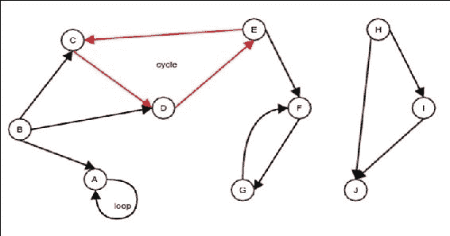
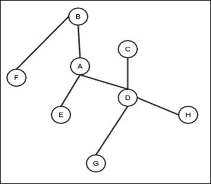
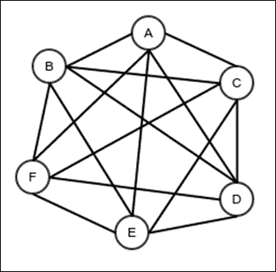
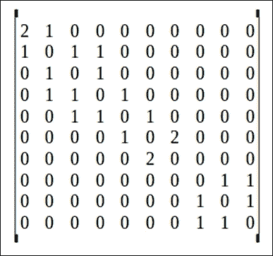
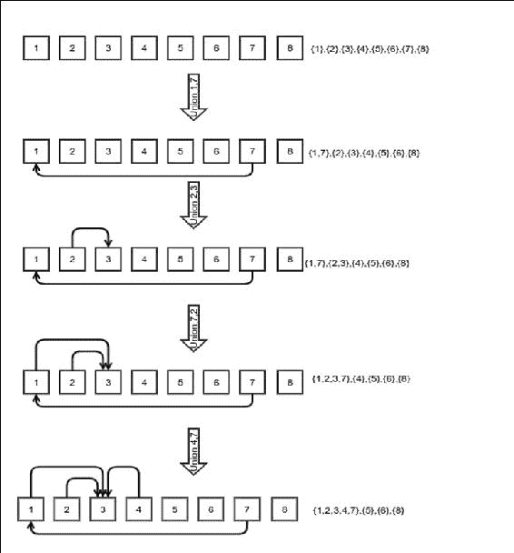

# 第十章：图的概念

图是树的推广。在树中，每个节点只有一个父节点。在图中，一个节点可以有多个父节点。最常见的方式来思考图是将它视为顶点和边的集合。顶点就像点，边就像连接点的线。在图的一般概念中，没有限制哪些顶点可以通过边连接。这允许图模拟多种现实生活中的概念。例如，互联网是一个图，其中顶点是网页，边是页面之间的超链接。一个社交网络网站，如 Facebook，有一个包含个人资料的图，其中顶点是个人资料，边是个人资料之间的友谊。每个软件都有一个依赖图，称为依赖关系图，其中顶点是使用的不同软件库，边是软件库之间的依赖关系。图的例子无穷无尽。在本章中，我们将讨论以下主题：

+   不同类型的图

+   图的 ADT（抽象数据类型）

+   图在内存中的表示

+   图的遍历

+   循环检测

+   拓扑树

+   最小生成树

# 什么是图？

图是由顶点和连接顶点的边组成的一组。*图 1*展示了图的一个示例的视觉表示。这里有几个需要注意的特点，我们将在下一节讨论：


图 1：无向图的示例

+   **无向图**：无向图是一种边没有方向的图，如图*图 1*所示。

+   **有向图**：这是一种边有方向的图。

+   **路径**：路径是一系列连接一组彼此不同的顶点的边，除了第一个和最后一个顶点可能相同之外。例如，在*图 1*中，边**AB**、**BD**和**DE**代表一个路径。它也可以描述为**ABDE**路径，该路径不重复其顶点。在有向图中，边必须仅按指定的方向遍历，才能形成构成路径所需的边的序列。

+   **环**：环是一个至少涉及两个顶点的路径；它从同一个顶点开始和结束。例如，在*图 1*中，路径**DCED**是一个环。

+   **环**：环是一个连接节点到自身的边。在*图 1*中，顶点**A**有一个环。

+   **子图**：图的子图是另一种类型的图，其中所有的边和顶点都与原始图的边和顶点相同。例如，在*图 1*中，节点**A**、**B**和**C**以及边**AB**和**BC**代表一个子图。

+   **连通图**：连通图是一个存在从任意顶点开始并结束在任意但不同的顶点的路径的图。*图 1*中的图不是连通的。但是，顶点**H**、**I**和**J**以及边**HI**、**IJ**和**JH**表示一个连通子图：

    图 2. 有向图的例子

+   **树**：树是一个连通但无向图，没有环或循环。*图 3*展示了树的例子。请注意，这与我们之前研究过的树略有不同。这棵树没有特定的根。这棵树中的节点没有特定的父节点，任何节点都可以作为根：

    图 3. 树的例子

+   **森林**：森林是一个无连接、无向图，没有环或循环。你可以把森林想象成树集合。单独一棵树也是一个森林。换句话说，森林是零棵或多棵树的集合。

+   **完全图**：完全图是在给定顶点数的情况下具有最大边数的无向图。它也有约束，即两个给定顶点之间只能有一条边，没有环。*图 4*展示了完全图的例子。对于一个顶点集*V*和边集*E*的完全图，*|E| = |V| ( |V| - 1) / 2*。很容易看出为什么会这样。每个顶点都会与其他*|V| - 1*个节点之间有一条边。这总共是*|V| ( |V| - 1)*条边。然而，在这种方法中，每条边都被计算了两次，一次为它的两个顶点之一。因此，完全图中的实际边数是*|V| ( |V| - 1) / 2*：

    图 4. 完全图

# 图形抽象数据类型

我们现在将定义表示图的图形抽象数据类型应该做什么。稍后，我们将讨论这个 ADT 的不同实现。一个图必须支持以下操作：

+   **添加顶点**：这添加一个新顶点

+   **移除顶点**：这移除一个顶点

+   **添加边**：这添加一条新边；在我们的图中，为了简单起见，我们将在两个顶点之间允许最多一条边

+   **移除边**：这移除一条边

+   **相邻**：这检查两个给定的顶点是否相邻，即是否存在给定节点之间的边

+   **邻居**：这返回与给定顶点相邻的顶点列表

+   **获取顶点值**：这获取存储在顶点中的值

+   **设置顶点值**：这存储一个值在顶点中

+   **获取边值**：这获取存储在边中的值

+   **设置边值**：这设置存储在边中的值

+   **无向图**：这返回图是否为无向图

+   **获取所有顶点**：这返回包含所有顶点的自平衡二叉搜索树

+   **最大顶点 ID**：这返回顶点的最高 ID

我们算法的依赖性将取决于上述操作在图数据结构中可用。以下 Java 接口是这个 ADT 的实现：

```java
public interface Graph<V, E> {
    int addVertex();
    void removeVertex(int id);
    void addEdge(int source, int target);
    void removeEdge(int source, int target);
    boolean isAdjacent(int source, int target);
    LinkedList getNeighbors(int source);
    void setVertexValue(int vertex, V value);
    V getVertexValue(int vertex);
    void setEdgeValue(int source, int target, E value);
    E getEdgeValue(int source, int target);
    boolean isUndirected();
    BinarySearchTree<Integer> getAllVertices();
    int maxVertexID();
}
```

我们通过 ID 标识每个顶点；边通过源顶点和目标顶点来标识。在无向图的情况下，源点和目标点可以互换。但在有向图的情况下，它们是不可互换的。

现在我们有了 ADT，我们希望有一个实现。为了实现图数据结构，我们需要在内存中选择一种表示方式。

# 图在内存中的表示

图可以通过三种主要方式表示：邻接矩阵、邻接表和关联矩阵。

## 邻接矩阵

邻接矩阵是一个矩阵，一个值表，其中每个值代表一条边，行和列都代表顶点。矩阵中的值可以是条目成员。边的值可以存储在矩阵本身中。也可以有一个特殊值来表示边的不存在。以下图像显示了*图 1*的邻接矩阵，其中边的值表示对应顶点之间的边数：



关于邻接矩阵可以注意以下事项：

+   行用于表示边的源点，列用于表示边的目标点

+   在无向图的情况下，源点和目标点是不可区分的，因此邻接矩阵是对称的

以下代码提供了一个使用邻接矩阵实现的图 ADT。我们使用二维数组来存储矩阵。任何顶点的 ID 直接用作数组的索引。这适用于存储顶点内部值的数组以及存储在边中的值，甚至边的存在性。当我们删除一个顶点时，我们不释放其空间；我们这样做是为了确保新顶点的 ID 不会移动。这提高了查找性能，但在资源方面是浪费的：

```java
public class AdjacencyMatrixGraphWithSparseVertex<V,E> implements Graph<V, E> {

    private static class NullEdgeValue{};
```

我们创建了两个特殊对象来表示边和顶点；这些对象尚未持有值。一个空引用指向不存在边或顶点：

```java
    private NullEdgeValue nullEdge = new NullEdgeValue();
    private NullEdgeValue nullVertex = new NullEdgeValue();

    Object [][] adjacencyMatrix = new Object[0][];
    Object[] vertexValues = new Object[0];
```

一个标志位用于确定图是否无向：

```java
    boolean undirected;

    public AdjacencyMatrixGraphWithSparseVertex(boolean undirected){
        this.undirected = undirected;
    }
```

添加顶点涉及创建一个新的矩阵和一个顶点值数组，并将所有旧值复制到其中：

```java
    @Override
    public int addVertex() {
        int numVertices = adjacencyMatrix.length;
        Object [][] newAdjacencyMatrix = new Object[numVertices+1][];
        for(int i=0;i<numVertices;i++){
            newAdjacencyMatrix[i] = new Object[numVertices+1];
            System.arraycopy(adjacencyMatrix[i],0, newAdjacencyMatrix[i], 0, numVertices);
        }
        newAdjacencyMatrix[numVertices] = new Object[numVertices+1];
        adjacencyMatrix = newAdjacencyMatrix;
        Object [] vertexValuesNew = new Object[vertexValues.length+1];
        System.arraycopy(vertexValues,0, vertexValuesNew, 0, vertexValues.length);
        vertexValuesNew[vertexValues.length] = nullVertex;
        vertexValues = vertexValuesNew;
        return numVertices;
    }
```

由于我们没有释放任何空间，删除顶点只需将值设置为 null。请注意，删除顶点必须伴随着所有相关边的删除，这是通过循环完成的：

```java
    @Override
    public void removeVertex(int id) {
        vertexValues[id] = null;
        for(int i=0;i<adjacencyMatrix.length;i++){
            adjacencyMatrix[id][i] = null;
            adjacencyMatrix[i][id] = null;
        }
    }
```

添加边涉及在邻接矩阵中设置特定位置。如果图是无向的，将会有两次更新。这是因为源点和目标点可以互换，而邻接矩阵始终是对称的：

```java
    @Override
    public void addEdge(int source, int target) {
        if(adjacencyMatrix[source][target] == null){
            adjacencyMatrix[source][target] = nullEdge;
            if(undirected){
                adjacencyMatrix[target][source] = nullEdge;
            }
        }else{
            throw new IllegalArgumentException("Edge already exists");
        }
    }
```

以下操作是最简单的，因为它只涉及将一个边设置为 null。在无向图的情况下，会有一个相应的更新来交换源和目标：

```java
    @Override
    public void removeEdge(int source, int target) {
        adjacencyMatrix[source][target] = null;
        if(undirected){
            adjacencyMatrix[target][source] = null;
        }
    }
```

以下是一个检查邻接矩阵的简单操作：

```java
    @Override
    public boolean isAdjacent(int source, int target) {
        return adjacencyMatrix[source][target] != null;
    }
```

对于任何给定的源，找到矩阵中同一行的所有边并将它们添加到一个我们可以返回的链表中。请注意，在有向图中，它只按正向遍历边：

```java
    @Override
    public LinkedList getNeighbors(int source) {
        LinkedList<Integer> neighborList = new LinkedList<>();
        for(int i=0;i<adjacencyMatrix.length;i++){
            if(adjacencyMatrix[source][i]!=null){
                neighborList.appendLast(i);
            }
        }
        return neighborList;
    }
```

我们将顶点的所有值存储在不同的数组中：

```java
    @Override
    public void setVertexValue(int vertex, V value) {
        vertexValues[vertex] = value;
    }

    @Override
    public V getVertexValue(int vertex) {
        if(vertexValues[vertex]!=nullVertex)
            return (V)vertexValues[vertex];
        else
            throw new IllegalArgumentException("Vertex "+vertex
                 +" does not exist");
    }
```

存储在边中的值可以存储在邻接矩阵本身中：

```java
    @Override
    public void setEdgeValue(int source, int target, E value) {
        adjacencyMatrix[source][target] = value;
        if(undirected){
            adjacencyMatrix[target][source] = value;
        }
    }

    @Override
    public E getEdgeValue(int source, int target) {
        if(adjacencyMatrix[source][target] != nullEdge) {
            return (E) adjacencyMatrix[source][target];
        }else {
            return null;
        }
    }

@Override
    public boolean isUndirected() {
        return undirected;
    }

    @Override
    public BinarySearchTree<Integer> getAllVertices() {
        BinarySearchTree<Integer> allVertices = new RedBlackTree<>();
        for(int i=0;i<vertexValues.length;i++){
            if(vertexValues[i]!=null){
                allVertices.insertValue(i);
            }
        }
        return allVertices;
    }

    @Override
    public int maxVertexID() {
        return vertexValues.length-1;
    }
}
```

### 稀疏邻接矩阵图操作的复杂度

现在我们来分析我们已讨论的操作的复杂度：

+   **添加顶点**: 添加顶点需要我们创建一个新的二维数组，其长度和 w 的复杂度为 idth *|V|*，然后将整个旧内容复制到新数组中。在这里，*|V|* 代表顶点集合 *V* 的基数。那么邻接矩阵的大小是多少呢？它是一个长度或宽度等于 *|V|* 的方阵，因此其大小是 *|V|*²。因此，添加新边的复杂度是 *θ(|V|*²*)*。

+   **移除顶点**: 移除顶点涉及到移除与给定顶点相对应的所有边。一个顶点可以关联的最大边数是 *|V|*，这是邻接矩阵中行或列的长度。我们必须设置包含要删除的顶点的行和列中的所有值，因此需要更改的值的数量计算为 *2|V| - 1*。减一的这部分来自于这样一个事实，即行和列有一个共同的边，代表正在删除的节点上的环。这个共同的边在行和列中都计算了两次。因此，其中之一必须停止。因此，这个操作的复杂度是 *θ(2|V| - 1) = θ(|V|)*。

+   **添加边和移除边**: 添加边就像在邻接矩阵的单个条目中设置一个特殊值一样简单。它具有这种复杂度：*θ(1)*。移除边只是在同一位置设置 null。

+   **相邻**: 这个操作涉及检查给定源和目标之间是否存在边。它检查邻接矩阵中的一个条目，因此具有这种复杂度：*θ(1)*。

+   **邻居**: 这个操作需要读取邻接矩阵行的所有值。因此，它需要读取 *|V|* 个值，并可能将它们添加到一个链表中。因此，这个操作的复杂度是 *θ( |V| )*。

+   **在顶点和边上设置和获取值**: 这些操作需要将单个值读入或读出邻接矩阵。这些操作都是 *θ(1)*。

+   **获取所有顶点**: 这涉及到遍历所有顶点并将它们插入到一个二叉搜索树中。因此，这个操作的复杂度是 *θ( |V| lg |V|)*。

## 更高效的空间邻接矩阵图

上述图实现的问题在于，当我们删除顶点时无法恢复任何空间。恢复空间的问题在于它会改变后来添加的顶点的索引。为了避免这种情况，我们可以选择顶点的 ID 与其在数组中的索引位置分开。如果我们这样做，我们需要能够使用给定的 ID 搜索顶点的索引。这种映射可以通过一个自平衡的二分搜索树来完成，这正是我们在这里要做的。

首先，我们创建一个代表图顶点的单独类。想法是允许对顶点的 ID 进行比较。不同的图实现可以扩展这个类以适应图顶点中的额外数据：

```java
public class GraphVertex<V> implements Comparable<GraphVertex<V>>{
    int id;
    V value;

    public GraphVertex(int id, V value) {
        this.id = id;
        this.value = value;
    }

    public int getId() {
        return id;
    }

    public void setId(int id) {
        this.id = id;
    }

    public V getValue() {
        return value;
    }

    public void setValue(V value) {
        this.value = value;
    }

    @Override
    public boolean equals(Object o) {
        if (this == o) return true;
        if (o == null || getClass() != o.getClass()) return false;
        GraphVertex<?> that = (GraphVertex<?>) o;
        return id == that.id;
    }

    @Override
    public int hashCode() {
        return id;
    }

    @Override
    public int compareTo(GraphVertex<V> o) {
        return id - o.id;
    }
}
```

有了这个类，我们可以实现基于邻接矩阵的图实现，具有密集的顶点和边表示：

```java
public class AdjacencyMatrixGraphWithDenseVertex<V,E> implements Graph<V, E> {
```

首先，我们扩展 `GraphVertex` 类以包括一个 `addition` 字段，该字段存储顶点在邻接矩阵和用于存储顶点值的数组中的索引：

```java
    class Vertex extends GraphVertex<V>{
        int internalIndex;

        public Vertex(int id, V value, int internalIndex) {
            super(id, value);
            this.internalIndex = internalIndex;
        }

        public int getInternalIndex() {
            return internalIndex;
        }

        public void setInternalIndex(int internalIndex) {
            this.internalIndex = internalIndex;
        }
    }
```

`nextId` 变量用于存储将要使用的下一个 ID：

```java
    private int nextId;
```

用特殊值来表示空顶点和边：

```java
    private static class NullValue {};
    private NullValue nullEdge = new NullValue();

    Object [][] adjacencyMatrix = new Object[0][];
```

下面的二分搜索树存储了顶点及其在数组中的索引：

```java
    RedBlackTree<GraphVertex<V>> vertices = new RedBlackTree<>();
    boolean undirected;

    public AdjacencyMatrixGraphWithDenseVertex(boolean undirected){
        this.undirected = undirected;
    }
```

添加过程涉及与之前相同的操作，除了额外的生成新 ID 并在搜索树中存储条目的操作：

```java
    @Override
    public int addVertex() {
        int id = nextId++;
        int numVertices = adjacencyMatrix.length;
        Object [][] newAdjacencyMatrix = new Object[numVertices+1][];
        for(int i=0;i<numVertices;i++){
            newAdjacencyMatrix[i] = new Object[numVertices+1];
            System.arraycopy(adjacencyMatrix[i],0, newAdjacencyMatrix[i], 0, numVertices);
        }
        newAdjacencyMatrix[numVertices] = new Object[numVertices+1];

        vertices.insertValue(new Vertex(id, null, adjacencyMatrix.length));
        adjacencyMatrix = newAdjacencyMatrix;
        return numVertices;
    }
```

现在删除顶点实际上涉及创建一个较小的邻接矩阵并复制所有边，除了与被删除顶点关联的边：

```java
    @Override
    public void removeVertex(int id) {
        BinaryTree.Node<GraphVertex<V>> node = vertices.searchValue(new GraphVertex<V>(id, null));
        if(node!=null){
            int internalId = ((Vertex)(node.getValue())).getInternalIndex();
            int numVertices = adjacencyMatrix.length;
            Object [][] newAdjacencyMatrix = new Object[numVertices-1][];
```

首先，复制被删除顶点所在行之前的全部行：

```java
            for(int i=0;i<internalId;i++){
                newAdjacencyMatrix[i] = new Object[numVertices-1];
                System.arraycopy(adjacencyMatrix[i],0, newAdjacencyMatrix[i], 0, internalId);
                System.arraycopy(adjacencyMatrix[i],internalId+1, newAdjacencyMatrix[i], internalId, numVertices-internalId-1);
            }
```

然后，复制被删除顶点所在行之后的全部行：

```java
            for(int i=internalId+1;i<numVertices;i++){
                newAdjacencyMatrix[i-1] = new Object[numVertices-1];
                System.arraycopy(adjacencyMatrix[i],0, newAdjacencyMatrix[i-1], 0, internalId);
                System.arraycopy(adjacencyMatrix[i],internalId+1, newAdjacencyMatrix[i-1], internalId, numVertices-internalId-1);
            }
            adjacencyMatrix = newAdjacencyMatrix;
```

现在，调整被删除顶点之后添加的所有顶点的索引。我们通过先序遍历树并在适当的时候更新索引来完成此操作：

```java
            vertices.traverseDepthFirstNonRecursive((gv)->{
                if(((Vertex)gv).getInternalIndex()>internalId)
                    ((Vertex)gv).setInternalIndex(((Vertex)gv).getInternalIndex()-1);
            }, BinaryTree.DepthFirstTraversalType.PREORDER);
            vertices.deleteValue(new GraphVertex<>(id, null));
        }else{
            throw new IllegalArgumentException("Vertex with id "+id
            +" does not exist");
        }
    }
```

添加边涉及在邻接矩阵中设置一个条目。然而，在这样做之前，我们需要查找顶点的索引：

```java
    @Override
    public void addEdge(int source, int target) {
        BinaryTree.Node<GraphVertex<V>> sNode = vertices.searchValue(
                new GraphVertex<V>(source, null));
        BinaryTree.Node<GraphVertex<V>> tNode = vertices.searchValue(
                new GraphVertex<V>(target, null));
        if(sNode!=null && tNode!=null) {
            int s = ((Vertex)(sNode.getValue())).getInternalIndex();
            int t = ((Vertex)(tNode.getValue())).getInternalIndex();
            if(adjacencyMatrix[s][t] == null){
                adjacencyMatrix[s][t] = nullEdge;
                if(undirected){
                    adjacencyMatrix[t][s] = nullEdge;
                }
            }else{
                throw new IllegalArgumentException("Edge already exists");
            }
        }else{
            throw new IllegalArgumentException("Non-existent ID");
        }

    }
```

这与添加边相同，只是我们将邻接矩阵中相应的条目改为 null：

```java
    @Override
    public void removeEdge(int source, int target) {
        BinaryTree.Node<GraphVertex<V>> sNode = vertices.searchValue(
                new GraphVertex<V>(source, null));
        BinaryTree.Node<GraphVertex<V>> tNode = vertices.searchValue(
                new GraphVertex<V>(target, null));
        if(sNode!=null && tNode!=null) {
            int s = ((Vertex)(sNode.getValue())).getInternalIndex();
            int t = ((Vertex)(tNode.getValue())).getInternalIndex();
            adjacencyMatrix[s][t] = null;
        }else{
            throw new IllegalArgumentException("Non-existent ID");
        }

    }
```

检查两个顶点是否相邻涉及像之前一样在邻接矩阵中查找一个值。但同样，我们首先必须查找顶点的索引：

```java
    @Override
    public boolean isAdjacent(int source, int target) {
        BinaryTree.Node<GraphVertex<V>> sNode = vertices.searchValue(
                new GraphVertex<V>(source, null));
        BinaryTree.Node<GraphVertex<V>> tNode = vertices.searchValue(
                new GraphVertex<V>(target, null));
        if(sNode!=null && tNode!=null) {
            int s = ((Vertex)(sNode.getValue())).getInternalIndex();
            int t = ((Vertex)(tNode.getValue())).getInternalIndex();
            return adjacencyMatrix[s][t] != null;
        }else{
            throw new IllegalArgumentException("Non-existent ID");
        }

    }
```

获取邻居列表稍微复杂一些。我们没有一种搜索机制允许我们通过索引来搜索 ID。因此，我们不是读取邻接矩阵中的一行，而是简单地先序遍历搜索树并检查邻接矩阵中是否存在与顶点相关的边。我们只在源顶点和问题顶点之间存在边时添加顶点：

```java
    @Override
    public LinkedList<Integer> getNeighbors(int source) {
        BinaryTree.Node<GraphVertex<V>> node = vertices.searchValue(
                        new GraphVertex<V>(source, null));
        if(node!=null){
            LinkedList<Integer> neighborsList = new LinkedList<>();
            int sourceInternalIndex = ((Vertex) node.getValue()).getInternalIndex();
            vertices.traverseDepthFirstNonRecursive((gv)->{
                int targetInternalIndex = ((Vertex) gv).getInternalIndex();
                if(adjacencyMatrix[sourceInternalIndex][targetInternalIndex]!=null)
                    neighborsList.appendLast(gv.getId());
            }, BinaryTree.DepthFirstTraversalType.INORDER);
            return neighborsList;
        }else{
            throw new IllegalArgumentException("Vertex with id "+source+" does not exist");
        }

    }
```

将值设置到边和顶点中或从边和顶点中获取值的过程与之前相同，除了在使用之前需要从顶点的 ID 中查找索引：

```java
    @Override
    public void setVertexValue(int vertex, V value) {
        BinaryTree.Node<GraphVertex<V>> node =
                vertices.searchValue(
                        new GraphVertex<V>(vertex, null));
        if(node!=null){
            node.getValue().setValue(value);
        }else{
            throw new IllegalArgumentException("Vertex with id "+vertex+" does not exist");
        }
    }

    @Override
    public V getVertexValue(int vertex) {
        BinaryTree.Node<GraphVertex<V>> node =
                vertices.searchValue(
                        new GraphVertex<V>(vertex, null));
        if(node!=null){
            return node.getValue().getValue();
        }else{
            throw new IllegalArgumentException("Vertex with id "+vertex+" does not exist");
        }
    }

    @Override
    public void setEdgeValue(int source, int target, E value) {
        BinaryTree.Node<GraphVertex<V>> sNode = vertices.searchValue(
                new GraphVertex<V>(source, null));
        BinaryTree.Node<GraphVertex<V>> tNode = vertices.searchValue(
                new GraphVertex<V>(target, null));
        if(sNode!=null && tNode!=null) {
            int s = ((Vertex)(sNode.getValue())).getInternalIndex();
            int t = ((Vertex)(tNode.getValue())).getInternalIndex();
            adjacencyMatrix[s][t] = value;
            if (undirected) {
                adjacencyMatrix[t][s] = value;
            }
        }else{
            throw new IllegalArgumentException("Non-existent ID");
        }
    }

    @Override
    public E getEdgeValue(int source, int target) {
        BinaryTree.Node<GraphVertex<V>> sNode = vertices.searchValue(
                new GraphVertex<V>(source, null));
        BinaryTree.Node<GraphVertex<V>> tNode = vertices.searchValue(
                new GraphVertex<V>(target, null));
        if(sNode!=null && tNode!=null) {
            int s = ((Vertex)(sNode.getValue())).getInternalIndex();
            int t = ((Vertex)(tNode.getValue())).getInternalIndex();
            return (E) adjacencyMatrix[s][t];
        }else{
            throw new IllegalArgumentException("Non-existent ID");
        }
    }

@Override
    public boolean isUndirected() {
        return undirected;
    }

    @Override
    public BinarySearchTree<Integer> getAllVertices() {
        BinarySearchTree<Integer> allVertices = new RedBlackTree<>();
        vertices.traverseDepthFirstNonRecursive(
          (v) -> allVertices.insertValue(v.getId()),
           BinaryTree.DepthFirstTraversalType.PREORDER);
        return allVertices;
    }
    @Override
    public int maxVertexID() {
        return nextId-1;
    }
}
```

### 基于密集邻接矩阵的图的运算复杂度

以下是我们刚刚在基于密集邻接矩阵的图中讨论的运算的复杂度：

+   **添加顶点**：添加顶点的操作仍然具有相同的 *θ(|V|²*)* 操作，用于创建一个新的邻接矩阵并复制所有旧值。在搜索树中插入新顶点的附加操作是 *θ(lg |V|)*。因此，整个操作仍然是 *θ(|V|²)*。

+   **删除顶点**：在这里删除顶点的操作遵循重新创建邻接矩阵并复制所有旧值的相同操作，这是 *θ(|V|²)*。从搜索树中删除顶点的操作是 *θ(lg |V|)*。因此，整个操作是 *θ(|V|²)*。

+   **添加边和删除边**：更新邻接矩阵中的条目的操作仍然是 *θ(1)*。然而，现在我们需要在搜索树中进行两次查找，以确定源和目标索引。这两次查找都是 *θ(lg |V|)*。因此，整个操作是 *θ(lg |V|)*。

+   **相邻**：这也同样是 *θ(lg |V|)*，原因与前面提到的相同点。

+   **邻居**：遍历搜索树是 *θ(|V|)*，并且对于遍历的每个顶点，我们创建一个固定数量的操作。查找源顶点的索引是 *θ(lg |V|)*。因此，整个操作仍然是 *θ(|V|)*。

+   **在顶点和边设置和获取值**：这些操作需要固定数量的查找（一个或两个），然后进行常数时间的设置或获取适当值的操作。查找是 *θ(lg |V|)*，因此整个操作也是 *θ(lg |V|)*。

+   **获取所有顶点**：与之前的实现一样，此操作是 *θ( |V| lg |V|)*。

## 邻接表

邻接表是稀疏图的一种更节省空间的图表示。稀疏图是与具有相同顶点数的完全图相比边数非常少的图。完全图有 *|V| (|V| - 1) / 2 = θ(|V|²)* 条边，将图作为邻接矩阵存储所需的内存空间也是 *θ(|V|²)*。因此，在密集（几乎完全）图的情况下，将其存储为邻接矩阵是有意义的。然而，对于稀疏图来说，这并不成立。

在邻接表表示中，顶点存储在数组或某种其他数据结构中，边与顶点一起存储在某些列表或某种其他结构中。首先，我们将考虑一个基于邻接表的表示，其中顶点按其 ID 存储在数组中，就像稀疏邻接矩阵表示的情况一样。它存在相同的问题：当删除顶点时，我们无法减小顶点数组的大小。然而，在这种情况下，边列表被删除，这使得它比我们在邻接矩阵中遇到的情况要节省空间得多：

```java
public class AdjacencyListGraphWithSparseVertex<V,E> implements Graph<V,E> {
    boolean undirected;

    public AdjacencyListGraphWithSparseVertex(boolean undirected) {
        this.undirected = undirected;
    }
```

`Edge` 类存储了从顶点起源的边的目标和值。顶点存储了与之关联的边的集合。我们根据目标边的 ID 使边可比较，这样我们就可以将它们存储在二叉搜索树中，以便根据 ID 容易查找：

```java
class Edge implements Comparable<Edge>{
        E value;
        int target;
```

为了提高 `getNeighbors` 操作的性能，我们在节点中存储邻居列表。我们在节点中存储一个指针，该指针对应于 `targetNode` 状态变量中此节点的目标：

```java
        DoublyLinkedList.DoublyLinkedNode<Integer> targetNode;

        public Edge(int target) {
            this.target = target;
        }

        @Override
        public boolean equals(Object o) {
            if (this == o) return true;
            if (o == null || getClass() != o.getClass()) return false;

            Edge edge = (Edge) o;

            return target == edge.target;

        }

        @Override
        public int hashCode() {
            return target;
        }

        @Override
        public int compareTo(Edge o) {
            return target - o.target;
        }
    }
```

`Vertex` 类用于存储顶点及其关联的边。边存储在红黑树中：

```java
    class Vertex extends GraphVertex<V>{
        RedBlackTree<Edge>
                edges = new RedBlackTree<>();
        DoublyLinkedList<Integer> neighbors = new DoublyLinkedList<>();
        public Vertex(int id, V value) {
            super(id, value);
        }
    }
```

然后将顶点存储在数组中：

```java
    Object[] vertices = new Object[0];
```

添加顶点不需要我们复制任何边；它只是确保顶点被复制到新创建的更大大小的数组中：

```java
    @Override
    public int addVertex() {
        Object[] newVertices = new Object[vertices.length+1];
        System.arraycopy(vertices, 0, newVertices, 0, vertices.length);
        newVertices[vertices.length] = new Vertex(vertices.length, null);
        vertices=newVertices;
        return newVertices.length-1;
    }
```

删除顶点需要首先将其位置上的顶点设置为 null。然而，您还必须删除所有其他顶点中与被删除顶点作为目标的边：

```java
    @Override
    public void removeVertex(int id) {
        Vertex sVertex = (Vertex) vertices[id];
        if(sVertex==null){
            throw new IllegalArgumentException("Vertex "+ id +" does not exist");
        }
        LinkedList<Integer> neighbors = getNeighbors(id);
        Edge dummyEdgeForId = new Edge(id);
```

我们必须删除与被删除顶点相关联的所有边：

```java
        for(int t:neighbors){
            Edge e = ((Vertex)vertices[t]).edges.deleteValue(dummyEdgeForId).getValue();
            ((Vertex)vertices[t]).neighbors.removeNode(e.targetNode);
        }
        vertices[id] = null;
    }
```

添加边需要在其关联的顶点中创建相应的条目：

```java
    @Override
    public void addEdge(int source, int target) {
        Vertex sVertex = (Vertex) vertices[source];
        Edge sEdge = sVertex.edges.insertValue(new Edge(target)).getValue();
        sEdge.targetNode = (DoublyLinkedList.DoublyLinkedNode<Integer>)
        sVertex.neighbors.appendLast(sEdge.target);
        if(undirected){
            Vertex tVertex = (Vertex) vertices[target];
            Edge tEdge = tVertex.edges.insertValue(new Edge(source)).getValue();
            tEdge.targetNode = (DoublyLinkedList.DoublyLinkedNode<Integer>)
            tVertex.neighbors.appendLast(tEdge.target);
        }
    }
```

删除边需要从关联的顶点中删除相应的条目：

```java
    @Override
    public void removeEdge(int source, int target) {
        Vertex sVertex = (Vertex) vertices[source];
        Edge deletedEdge = sVertex.edges.deleteValue(new Edge(target)).getValue();
        sVertex.neighbors.removeNode(deletedEdge.targetNode);
        if(undirected){
            Vertex tVertex = (Vertex) vertices[target];
            deletedEdge = tVertex.edges.deleteValue(new Edge(source)).getValue();
            tVertex.neighbors.removeNode(deletedEdge.targetNode);
        }
    }
```

检查邻接关系涉及首先查找源顶点，然后在相应的红黑树中查找目标边的边：

```java
    @Override
    public boolean isAdjacent(int source, int target) {
        Vertex sVertex = (Vertex) vertices[source];
        return sVertex.edges.searchValue(new Edge(target))!=null;
    }
```

我们预先计算了邻居列表，所以我们只需简单地返回此列表：

```java
    @Override
    public LinkedList<Integer> getNeighbors(int source) {s
        Vertex sVertex = (Vertex) vertices[source];
        return sVertex.neighbors;
    }
```

设置和获取顶点或边的值的过程是显而易见的：

```java
    @Override
    public void setVertexValue(int vertex, V value) {
        Vertex sVertex = (Vertex) vertices[vertex];
        if(sVertex==null){
            throw new IllegalArgumentException("Vertex "+ vertex 
            + "does not exist");
        }else{
            sVertex.setValue(value);
        }
    }

    @Override
    public V getVertexValue(int vertex) {
        Vertex sVertex = (Vertex) vertices[vertex];
        if(sVertex==null){
            throw new IllegalArgumentException("Vertex "+ vertex 
              + "does not exist");
        }else{
            return sVertex.getValue();
        }
    }

    @Override
    public void setEdgeValue(int source, int target, E value) {
        Vertex sVertex = (Vertex) vertices[source];
        Vertex tVertex = (Vertex) vertices[target];
        if(sVertex==null){
            throw new IllegalArgumentException("Vertex "+ source 
              + "does not exist");
        }else if(tVertex==null){
            throw new IllegalArgumentException("Vertex "+ target 
               + "does not exist");
        }else{
            BinaryTree.Node<Edge> node = sVertex.edges.searchValue(new Edge(target));
            if(node==null){
                throw new IllegalArgumentException("Edge between "+ source + "and" + target + "does not exist");

            }else{
                node.getValue().value = value;
            }
        }
    }

    @Override
    public E getEdgeValue(int source, int target) {
        Vertex sVertex = (Vertex) vertices[source];
        Vertex tVertex = (Vertex) vertices[target];
        if(sVertex==null){
            throw new IllegalArgumentException("Vertex "+ source 
                 + "does not exist");
        }else if(tVertex==null){
            throw new IllegalArgumentException("Vertex "+ target 
                  + "does not exist");
        }else{
            BinaryTree.Node<Edge> node =
                    sVertex.edges.searchValue(new Edge(target));
            if(node==null){
                throw new IllegalArgumentException("Edge between "+ source + "and" + target + "does not exist");
            }else{
                return node.getValue().value;
            }
        }
    }

    @Override
    public boolean isUndirected() {
        return undirected;
    }

    @Override
    public BinarySearchTree<Integer> getAllVertices() {
        BinarySearchTree<Integer> allVertices = new RedBlackTree<>();
        for(int i=0;i<vertices.length;i++){
            if(vertices[i]!=null){
                allVertices.insertValue(i);
            }
        }
        return allVertices;
    }

    @Override
    public int maxVertexID() {
        return vertices.length-1;
    }
}
```

### 基于邻接表的图的操作复杂度

以下列出了我们在基于邻接表的图中讨论的操作的复杂度：

+   **添加顶点**：添加顶点需要首先创建一个新的数组，然后将所有顶点复制到其中。所以它是 *θ(|V|)*。

+   **删除顶点**：删除过程不会改变顶点的数组。然而，此操作涉及检查每个顶点以删除具有被删除顶点作为目标的边。因此，此操作也是 *θ(|V|)*。

+   添加边和删除边：此操作的第一个步骤是查找源顶点，这是常数时间。第二个步骤是在红黑树中添加或删除边，所以它是 *θ(lg |V|)*。因此，添加/删除边的整个操作是 *θ(lg |V|)*。

+   **相邻**：此操作的第一个步骤是查找源顶点，这是常数时间。第二个步骤是在红黑树中查找边，所以它是 *θ(lg |V|)*。因此，添加/删除边的整个操作是 *θ(lg |V|)*。

+   **邻居**：由于邻居列表是预先计算的，其复杂度与查找顶点相同，即常数时间。

+   **在顶点设置和获取值**：这些操作需要首先查找顶点，这是常数时间。第二步是设置/获取值。这些操作是 *θ(1)*。

+   **在边处设置和获取值**：这些操作需要首先查找源顶点，然后查找特定的边。第一个操作是 *θ(1)*，第二个是 *θ(lg |V|)*。最后，设置或获取边的值是 *θ(l)*。因此，总操作是 *θ(lg |V|)*。

+   **获取所有顶点**：此操作是 *θ( |V| lg |V| )*，就像之前的实现一样。

## 基于邻接表且顶点密集存储的图

就像基于邻接矩阵的图一样，可以使用搜索树而不是数组来密集存储顶点。这允许我们在删除顶点时不影响其他顶点的 ID 来恢复空间。其他所有内容都与基于数组的顶点存储相同：

```java
public class AdjacencyListGraphWithDenseVertex<V,E> implements Graph<V,E> {
```

`nextId` 变量存储下一个要插入的顶点的 ID 值：

```java
    int nextId;
    boolean undirected;
```

我们仍然有 `Edge` 和 `Vertex` 类：

```java
    class Edge implements Comparable<Edge>{
        E value;
        int target;

        DoublyLinkedList.DoublyLinkedNode<Integer> targetNode;
        public Edge(int target) {
            this.target = target;
        }

        @Override
        public boolean equals(Object o) {
            if (this == o) return true;
            if (o == null || getClass() != o.getClass()) 
                 return false;
            Edge edge = (Edge) o;
            return target == edge.target;
        }

        @Override
        public int hashCode() {
            return target;
        }

        @Override
        public int compareTo(Edge o) {
            return target - o.target;
        }
    }
    class Vertex extends GraphVertex<V>{
        RedBlackTree<Edge> edges = new RedBlackTree<Edge>();

        DoublyLinkedList<Integer> neighbors 
                           = new DoublyLinkedList<>();
        public Vertex(int id, V value) {
            super(id, value);
        }
    }

    public AdjacencyListGraphWithDenseVertex(boolean undirected) {
        this.undirected = undirected;
    }
```

现在，我们不再使用数组来存储顶点，而是使用红黑树：

```java
    RedBlackTree<GraphVertex<V>> vertices = new RedBlackTree<>();
```

添加新顶点意味着在红黑树中插入一个新的顶点：

```java
    @Override
    public int addVertex() {
        vertices.insertValue(new Vertex(nextId++, null));
        return nextId;
    }
```

与之前一样，删除过程不仅包括删除顶点，还要遍历所有其他顶点，删除所有以被删除顶点为目标顶点的边：

```java
    @Override
    public void removeVertex(int id) {
        vertices.deleteValue(new GraphVertex<V>(id, null));
        vertices.traverseDepthFirstNonRecursive((gv)->{
                BinaryTree.Node<Edge> edgeNode = ((Vertex) gv).edges.deleteValue(new Edge(id));
                if(edgeNode!=null){
                    Edge edge = edgeNode.getValue();
                    ((Vertex) gv)
                        .neighbors.removeNode(edge.targetNode);
                }
        },
                BinaryTree.DepthFirstTraversalType.INORDER);
    }
```

第一步是找到源节点和目标节点以确认它们的存在。之后，将边添加到源节点的边集合中。如果图是无向的，也将边添加到目标节点的边集合中：

```java
    @Override
    public void addEdge(int source, int target) {
        BinaryTree.Node<GraphVertex<V>> sNode =
          vertices.searchValue(new GraphVertex<V>(source, null));
        BinaryTree.Node<GraphVertex<V>> tNode =
                vertices.searchValue(
                        new GraphVertex<V>(target, null));
        if(sNode == null){
            throw new IllegalArgumentException("Vertex ID "+source+" does not exist");
        }else if(tNode == null){
            throw new IllegalArgumentException("Vertex ID "+target+" does not exist");
        }else{
            Vertex sVertex = (Vertex) sNode.getValue();
            Vertex tVertex = (Vertex) tNode.getValue();
            Edge tEdge = new Edge(target);
            sVertex.edges.insertValue(tEdge);
            tEdge.targetNode = (DoublyLinkedList.DoublyLinkedNode<Integer>) sVertex.neighbors
              .appendLast(tVertex.getId());
            if(undirected) {
                Edge sEdge = new Edge(source);
                tVertex.edges.insertValue(sEdge);
                sEdge.targetNode = (DoublyLinkedList.DoublyLinkedNode<Integer>) tVertex.neighbors
                  .appendLast(sVertex.getId());
            }
        }
    }
```

第一步与之前相同。之后，从源节点的边集合中删除边。如果图是无向的，也从目标节点的边集合中删除边：

```java
    @Override
    public void removeEdge(int source, int target) {
        BinaryTree.Node<GraphVertex<V>> sNode =
                vertices.searchValue(
                        new GraphVertex<V>(source, null));
        BinaryTree.Node<GraphVertex<V>> tNode =
                vertices.searchValue(
                        new GraphVertex<V>(target, null));
        if(sNode == null){
            throw new IllegalArgumentException("Vertex ID "+source+" does not exist");
        }else if(tNode == null){
            throw new IllegalArgumentException("Vertex ID "+target+" does not exist");
        }else{
            Vertex sVertex = (Vertex) sNode.getValue();
            Edge deletedEdge = sVertex.edges.deleteValue(new Edge(target)).getValue();
            sVertex.neighbors.removeNode(deletedEdge.targetNode);
            if(undirected) {
                Vertex tVertex = (Vertex) tNode.getValue();
                deletedEdge = tVertex.edges.deleteValue(new Edge(source)).getValue();
              tVertex.neighbors.removeNode(deletedEdge.targetNode);
            }
        }
    }
```

第一步与之前相同。之后，查找具有正确目标顶点的边。如果找到边，则顶点相邻：

```java
    @Override
    public boolean isAdjacent(int source, int target) {
        BinaryTree.Node<GraphVertex<V>> sNode =
                vertices.searchValue(
                        new GraphVertex<V>(source, null));
        BinaryTree.Node<GraphVertex<V>> tNode =
                vertices.searchValue(
                        new GraphVertex<V>(target, null));
        if(sNode == null){
            throw new IllegalArgumentException("Vertex ID "
                                   +source+" does not exist");
        }else if(tNode == null){
            throw new IllegalArgumentException("Vertex ID "
                                   +target+" does not exist");
        }else{
            Vertex sVertex = (Vertex) sNode.getValue();
            return sVertex.edges.searchValue(
                                 new Edge(target)) != null;

        }
    }
```

我们只需查找顶点，然后返回预先计算好的邻居列表：

```java
    @Override
    public LinkedList<Integer> getNeighbors(int source) {
        BinaryTree.Node<GraphVertex<V>> sNode =
                vertices.searchValue(
                        new GraphVertex<V>(source, null));
        if(sNode == null){
            throw new IllegalArgumentException(
                    "Vertex ID "+source+" does not exist");
        }else{
            Vertex sVertex = (Vertex) sNode.getValue();
            return  sVertex.neighbors;
        }
    }
```

设置和获取值的流程与之前相同，只是在设置值之前，我们需要在红黑树中查找顶点/顶点而不是在数组中：

```java
    @Override
    public void setVertexValue(int vertex, V value) {
        BinaryTree.Node<GraphVertex<V>> sNode =
                vertices.searchValue(
                        new GraphVertex<V>(vertex, null));
        if(sNode == null){
            throw new IllegalArgumentException("Vertex ID "
                               +vertex+" does not exist");
        }else{
            Vertex sVertex = (Vertex) sNode.getValue();
            sVertex.setValue(value);
        }
    }

    @Override
    public V getVertexValue(int vertex) {
        BinaryTree.Node<GraphVertex<V>> sNode =
                vertices.searchValue(
                        new GraphVertex<V>(vertex, null));
        if(sNode == null){
            throw new IllegalArgumentException("Vertex ID "
                               +vertex+" does not exist");
        }else{
            Vertex sVertex = (Vertex) sNode.getValue();
            return sVertex.getValue();
        }
    }

    @Override
    public void setEdgeValue(int source, int target, E value) {
        BinaryTree.Node<GraphVertex<V>> sNode =
                vertices.searchValue(
                        new GraphVertex<V>(source, null));
        BinaryTree.Node<GraphVertex<V>> tNode =
                vertices.searchValue(
                        new GraphVertex<V>(target, null));
        if(sNode == null){
            throw new IllegalArgumentException("Vertex ID
                           "+source+" does not exist");
        }else if(tNode == null){
            throw new IllegalArgumentException("Vertex ID
                           "+target+" does not exist");
        }else{
            Vertex sVertex = (Vertex) sNode.getValue();
            BinaryTree.Node<Edge> edgeNode =
                    sVertex.edges.searchValue(new Edge(target));
            if(edgeNode!=null) {
                edgeNode.getValue().value = value;
                if (undirected) {
                    Vertex tVertex = (Vertex) tNode.getValue();
                    edgeNode = tVertex.edges
                            .searchValue(new Edge(source));
                    edgeNode.getValue().value = value;
                }
            }else{
                throw new IllegalArgumentException(
                          "No edge exists between the vertices "
                          + source + " and " + target);
            }
        }
    }

    @Override
    public E getEdgeValue(int source, int target) {
        BinaryTree.Node<GraphVertex<V>> sNode =
                vertices.searchValue(
                        new GraphVertex<V>(source, null));
        BinaryTree.Node<GraphVertex<V>> tNode =
                vertices.searchValue(
                        new GraphVertex<V>(target, null));
        if(sNode == null){
            throw new IllegalArgumentException("Vertex ID
                               "+source+" does not exist");
        }else if(tNode == null){
            throw new IllegalArgumentException("Vertex ID
                               "+target+" does not exist");
        }else{
            Vertex sVertex = (Vertex) sNode.getValue();
            BinaryTree.Node<Edge> edgeNode =
                    sVertex.edges.searchValue(new Edge(target));
            if(edgeNode!=null) {
                return edgeNode.getValue().value;

            }else{
                throw new IllegalArgumentException(
                           "No edge exists between the vertices "
                           + source + " and " + target);
            }
        }
    }

    @Override
    public boolean isUndirected() {
        return undirected;
    }

    @Override
    public BinarySearchTree<Integer> getAllVertices() {
        BinarySearchTree<Integer> allVertices 
                                = new RedBlackTree<>();
        vertices.traverseDepthFirstNonRecursive(
                  (v) -> allVertices.insertValue(v.getId()),
                BinaryTree.DepthFirstTraversalType.PREORDER);
        return allVertices;
    }

    @Override
    public int maxVertexID() {
        return nextId -1;
    }
}
```

### 基于邻接表且顶点密集存储的图的运算复杂度

基于邻接表的图的运算复杂度如下：

+   **添加顶点**：添加顶点需要在红黑树中插入一个顶点。因此，此操作是 *θ(lg |V|)*。

+   **删除顶点**：删除过程需要从红黑树中删除顶点，其复杂度是 *θ(lg |V|)*。然而，此操作涉及检查每个顶点以删除具有被删除顶点作为目标顶点的边。因此，此操作也是 *θ(|V|)*。

+   **添加边和删除边**：这个操作的第一个步骤是查找源顶点，这是*θ(lg |V|)*。第二步是向/从红黑树添加或删除边，所以这也是*θ(lg |V|)*。因此，添加/删除边的整个操作是*θ(lg |V|)*。

+   **相邻**：这个操作的第一个步骤是查找源顶点，这是*θ(lg |V|)*。第二步是在红黑树中查找边，这也是*θ(lg |V|)*。因此，添加/删除边的整个操作是*θ(lg |V|)*。

+   **邻居**：邻居列表是预先计算的，所以这个操作的复杂度与搜索顶点的复杂度相同，即*θ(lg |V|)*。

+   **在顶点上设置和获取值**：这些操作需要你首先查找顶点，这是*θ(lg |V|)*。第二步是设置/获取值。这些操作是*θ(lg |V|)*。

+   **在边上的设置和获取值**：这些操作需要你首先查找源顶点，然后是特定的边。这两个操作都是*θ(lg |V|)*。最后，设置或获取边的值是*θ(l)*。因此，总操作是*θ(lg |V|)*。

+   **获取所有顶点**：这里，这个操作也是*θ( |V| lg |V|)*。

# 图的遍历

图的遍历是图遍历的等价物，正如在前面章节中讨论的那样。就像在树的情况下，我们可以进行广度优先或深度优先遍历。然而，与树不同，图可以通过不经过边来访问所有顶点。这使得必须单独考虑遍历所有边和顶点。另一件事是，图没有指定的根，因此我们可以从任何特定的顶点开始。最后，由于图可能不是连通的，我们可能无法从单个顶点开始遍历所有顶点/边。这是通过重复执行遍历来实现的，每次从尚未访问的任何顶点开始。这是对基本广度优先或深度优先遍历的简单扩展，我们将在下面讨论。

首先，让我们讨论使用广度优先搜索和深度优先搜索来访问顶点。这涉及到维护两个顶点集合：一个存储所有已发现但尚未访问/探索的顶点，另一个存储一个布尔数组，用于检查一个顶点是否已经被探索/访问。

已发现但尚未探索的顶点集合可以是两种类型之一：如果是栈，我们就有深度优先遍历；如果是队列，我们就有广度优先遍历。

要在单个方法中实现深度优先和广度优先搜索，我们需要创建我们的`Stack`和`Queue`接口的超接口。我们需要在其中定义三个方法：

```java
public interface OrderedStore<E> {
    void insert(E value);
    E pickFirst();
    E checkFirst();
}
```

现在将这些方法实现为`Stack`和`Queue`接口的默认方法，以便委托给它们适当的方法：

```java
public interface Stack<E> extends OrderedStore<E>{
    void push(E value);
    E pop();
    E peek();
    @Override
    default E checkFirst(){
        return peek();
    }

    @Override
    default void insert(E value){
        push(value);
    }

    @Override
    default E pickFirst(){
        return pop();
    }
}

public interface Queue<E> extends OrderedStore<E>{
    void enqueue(E value);
    E dequeue();
    E peek();

    @Override
    default E checkFirst(){
        return peek();
    }

    @Override
    default void insert(E value){
        enqueue(value);
    }

    @Override
    default E pickFirst(){
        return dequeue();
    }
}
```

这允许我们使用`OrderedStore`接口来同时持有栈和队列。我们还创建了一个新的函数式接口，它代表一个接受两个参数且不返回任何内容的 lambda 表达式：

```java
public interface TwoArgumentStatement<E,F> {
    void doSomething(E e, F f);
}
```

我们将此搜索作为 Graph 接口本身的默认方法实现。

```java
enum TraversalType{
    DFT, BFT
}
```

在开始时，我们只将起始顶点插入到尚未探索的顶点集合中。然后，我们循环直到处理完所有在搜索中可以发现的顶点，并且顶点集合中没有更多元素。我们避免处理已经处理过的顶点集合中的每个顶点。否则，我们将其标记为“正在处理”并对其调用访问者。最后，我们通过将所有邻居插入到必须处理的元素集合中来扩展此顶点：

```java
default void visitAllConnectedVertices(int startingNode, TwoArgumentStatement<Integer,  V> visitor, TraversalType type) {
        OrderedStore<Integer> toBeProcessed = null;
        boolean doneProcessing[] = new boolean[maxVertexID()+1];
        switch (type){
            case BFT: 
                toBeProcessed = new QueueImplLinkedList<Integer>(); 
                break;
            case DFT: 
                toBeProcessed = new StackImplLinkedList<Integer>(); 
                break;
        }

        toBeProcessed.insert(startingNode);

        while(toBeProcessed.checkFirst()!=null){

            int currentVertex = toBeProcessed.pickFirst();
            if(doneProcessing[currentVertex]){
                continue;
            }

            doneProcessing[currentVertex] = true;
            visitor.doSomething(currentVertex,
                           getVertexValue(currentVertex));  
```

```java
            for(int neighbor:getNeighbors(currentVertex)){
                if(doneProcessing[neighbor]==false){
                    toBeProcessed.insert(neighbor);
                }
            }
        }
    }
```

边的遍历过程也非常相似；我们可以遵循广度优先或深度优先遍历。在这种情况下，访问者需要访问边的源和目标，这使得有必要将它们都存储在我们使用的栈或队列中。为此，我们创建了一个名为`Edge`的类。该类是可比较的，以便边可以存储在二叉搜索树中以实现易于搜索的能力：

```java
class Edge implements Comparable<Edge>{
        int source;
        int target;

        public Edge(int source, int target) {
            this.source = source;
            this.target = target;
        }

        @Override
        public boolean equals(Object o) {
            if (this == o) return true;
            if (o == null || getClass() != o.getClass())
                return false;

            Edge edge = (Edge) o;

            if (source != edge.source) return false;
            return target == edge.target;

        }

        @Override
        public int hashCode() {
            int result = source;
            result = 31 * result + target;
            return result;
        }

        @Override
        public int compareTo(Edge o) {
            if(source!=o.source){
                return source - o.source;
            }else {
                return target - o.target;
            }
        }
    }
```

现在，我们可以使用广度优先和深度优先遍历来实现边的遍历过程：

```java
default void visitAllConnectedEdges(int startingNode, ThreeArgumentStatement<Integer, Integer, E> visitor,
                                        TraversalType type){

        OrderedStore<Edge> toBeProcessed = null;
        boolean doneProcessing[] = new boolean[maxVertexID()+1];
        switch (type){
            case BFT: toBeProcessed = new QueueImplLinkedList<Edge>(); break;
            case DFT: toBeProcessed = new StackImplLinkedList<Edge>(); break;
        }
        toBeProcessed.insert(new Edge(-1, startingNode));
        while (toBeProcessed.checkFirst()!=null){
            Edge edge = toBeProcessed.pickFirst();
            LinkedList<Integer> neighbors = getNeighbors(edge.target);
            if(edge.source>=0) {
                visitor.doSomething(edge.source, edge.target,
                  getEdgeValue(edge.source, edge.target));
            }
            if(doneProcessing[edge.target]){
                continue;
            }

            for(int target: neighbors){
                if(isUndirected() && doneProcessing[target]){
                    continue;
                }
                Edge nextEdge = new Edge(edge.target, target);
                if(nextEdge.target!=edge.source)
                    toBeProcessed.insert(nextEdge);
            }

            doneProcessing[edge.target] = true;
        }
    }
```

## 遍历的复杂性

对于每次遍历，无论是所有顶点还是边，都必须遍历所有边。即使你只想访问顶点，这也是正确的。实际复杂度取决于特定的映射实现，因此我们将使用操作`getNeighbors`方法的复杂度是*θ(g(|V|))*。

如果你正在访问边或顶点，确保每个顶点只扩展一次。这个操作执行了*|V|*次，每次都是*θ(g(|V|))*。因此，由于顶点的扩展，找到邻居的复杂度是*θ(|V|g(|V|))*。当扩展时，它们被访问一次，对于每条边，我们有一个邻居。其中一些邻居之前已经被访问过；然而，我们需要执行常数时间来验证这一点。所以每个顶点只被访问一次，每个邻居只被检查一次。这改变了复杂度到*θ(|V|g(|V|) + |E|)*。由于我们已经看到了一个具有常数时间`getNeighbors`方法的图实现，我们可以有一个*θ(|V| + |E|)*的遍历。

# 循环检测

遍历的一个用途是循环检测。没有任何循环的连通无向图是一个树。没有任何循环的有向图称为有向无环图（DAG）。在图中进行循环检测可以非常相似地进行。在无向图的情况下，如果我们进行 DFS 并且同一个节点作为边的目标被访问两次，则存在循环。由于边是无向的，如果源或目标之前未见过，我们就满意了。

在有向图的情况下，如果你想知道是否存在循环，仅仅访问相同的节点两次是不够的；我们还应该考虑边的方向。这意味着在遍历边时，我们需要知道我们是否可以到达我们开始的同一个节点。这要求我们在进行 DFS 时记住整个路径。这就是为什么我们使用递归辅助方法在有向图中检测循环。我们首先创建有向循环的辅助方法。`checkDirectedCycleFromVertex`方法接受路径和顶点的二叉搜索树。顶点列表是存储所有顶点的列表，已访问的顶点必须被移除，这样它们就不会在后续的循环检测中作为起点使用。整数列表是从起点在深度优先遍历中的路径。如果一个顶点在相同的路径中重复出现，这意味着存在一个循环：

```java
default void checkDirectedCycleFromVertex(
            com.example.functional.LinkedList<Integer> path, BinarySearchTree<Integer> allVertices){
```

列表头部是路径中最深的顶点；我们需要扩展这个：

```java
        int top = path.head();
        allVertices.deleteValue(top);
        LinkedList<Integer> neighbors = getNeighbors(top);
```

现在如果任何邻居已经存在于路径中，则存在一个循环，这正是我们要检查的。如果找到循环，我们抛出一个自定义异常的实例：

```java
        for(int n:neighbors){
            com.example.functional.LinkedList<Integer> pathPart = path;
            while (!pathPart.isEmpty()){
                int head = pathPart.head();
                if(head == n){
                    throw new CycleDetectedException("Cycle detected");
                }
                pathPart = pathPart.tail();
            }
            checkDirectedCycleFromVertex(path.add(n), allVertices);
        }
    }
```

现在我们为两种类型的图创建检测循环的方法。遍历所有顶点，因为图中可能有未连接的部分。有向图可能有一些顶点由于边的方向性，无法从特定的起始顶点到达。然而，一旦在任何遍历中访问了一个顶点，它就不需要再次访问。这是通过将所有顶点放在二叉搜索树中并删除已访问的顶点来实现的：

```java
default boolean detectCycle(){
```

首先，我们获取所有顶点的列表。我们直接通过理解顶点在图中的存储方式来获取它：

```java
        BinarySearchTree<Integer> allVertices = getAllVertices();
        try {
            if (isUndirected()) {
                while (allVertices.getRoot() != null) {
                    int start = allVertices.getRoot().getValue();
                    RedBlackTree<Integer> metAlready 
                                     = new RedBlackTree<>();
                    metAlready.insertValue(start);
                    allVertices.deleteValue(start);
                    visitAllConnectedEdges(start, (s, t, v) -> {
                            if(metAlready.searchValue(t) == null) {
                                metAlready.insertValue(t);
                                allVertices.deleteValue(t);
                            }else if(metAlready.searchValue(s)== null){
                                metAlready.insertValue(s);
                                allVertices.deleteValue(s);
                            }else{
                                throw new CycleDetectedException(
                                  "found "+t);
                            }
                        }, TraversalType.DFT);
                }
            } else {
                while (allVertices.getRoot() != null) {
                    checkDirectedCycleFromVertex(
                      com.example.functional.LinkedList
                      .<Integer>emptyList().add(allVertices.getRoot().getValue()), allVertices);
                }
            }
        }catch (CycleDetectedException ex){
            return true;
        }
        return false;
    }
```

## 循环检测算法的复杂度

首先，让我们检查无向图中循环检测的复杂度。`getAllVertices`的复杂度是*Ө* *(|V| lg |V|)*。在已访问顶点的搜索树中查找一个顶点的复杂度是*Ө* *( lg |V| )*。我们为每条边做两次这样的查找。我们还需要在`metAlready`搜索树中插入一个新的顶点，并在`allVertices`搜索树中删除一个顶点；这些操作对于每条边的复杂度是*Ө* *( lg |V| )*。因此，总复杂度是*Ө* *(|E| lg |V|)*。

现在让我们考虑在有向图中进行循环检测的复杂度。在这里，我们遍历每条边一次。然而，对于每条边，我们必须查看整个路径以确定当前顶点是否在路径中。路径的长度可能是这样的：*|V| - 1*。因此，当我们为每条边进行检查时，复杂度是*O(|E||V|)*；这比*O(|E|lg |V|)*要高得多。

# 生成树和最小生成树

在一个连通图中，生成树是一个由所有顶点和一些边组成的子图。因此，子图是一个树；它是一个没有环或循环的连通图。*图 5*展示了图中生成树的一个例子：


图 5. 图的生成树（用红色表示）

树具有保持顶点连接所需的最少边数。从树中移除任何边都会使图断开。这在连接不同地点且道路数量最少的地图中可能很有用。有了这个动机，我们会对具有最小总道路长度的生成树非常感兴趣。这可能很重要，因为建设道路是一笔昂贵的开销。或者，我们可以为城市设计一条公交线路图，将所有重要地点连接起来，而不需要创建太多路线；此外，较短的路线更好。这样的生成树被称为最小生成树。找到最小生成树是一个重要问题。但在我们讨论算法之前，让我们看看最小生成树的一些性质。

## 对于任何具有顶点集 V 和边集 E 的树，|V| = |E| + 1

首先，让我们考虑这个命题：从树中移除任何一条边将创建两个没有连接的树。让我们假设相反的情况。我们有一个包含两个顶点 A 和 B 以及它们之间的一条边 X 的图。假设即使我们移除 X，树仍然保持连通。这意味着即使删除 X，A 和 B 之间仍然存在一条路径 P。这意味着在原始图中，我们可以通过 P 从 A 走到 B，并使用 X 回到 A。这意味着原始图有一个环。但是原始图被假设是一个树，所以这是不可能的。因此，我最初关于从树中移除任何边将创建两个没有连接的树的命题是正确的。

现在，让我们从一个具有边集 E 和顶点集 V 的图 G 开始。如果我们移除所有边，我们当然只会剩下 V。这些没有边的顶点集实际上是单顶点树，它们之间没有连接。

我们从一个树开始，比如说 G，移除一条边。现在我们有两个树。现在我们可以移除另一条边，这将把其中一个树分成两个，所以我们有三个树。这样，在移除每条边之后，我们都会多出一个树。因此，在移除所有边之后，我们将有*|E| + 1*个树（因为移除任何边之前有一个树）。这些必须是*|V|*个单顶点树。所以，要么*|V| = |E|+1*，要么*|E| = |V| - 1*。

## 任何连通的无向图都有一个生成树

让我们考虑一个无向图。如果有环和环。首先，我们简单地删除所有环。考虑 A 和 B 作为两个相邻并构成环的顶点。这意味着如果我们从 A 到 B 走边，我们可以使用另一条路径：从 B 到 A（这就是它成为环的原因）。所以如果我们删除从 B 到 A 的边，我们仍然会有一个连通图。我们对每个环执行这个操作。在这些操作结束时，我们将有一个没有环或环的连通图；这是一个树。这个树连接了所有顶点，所以它是一个生成树。

## 任何具有属性|V| = |E| + 1 的无向连通图是一个树

现在，让我们检查前面定理的逆命题。假设存在一个连通图，其中*|V| = |E| + 1*。我们假设它不是一个树。这个图必须有一个生成树，它是一个子图，边数更少。这个生成树将有相同的顶点数（因为我们从未删除任何顶点），但边数更少。因此，如果生成树有边集*E* ¹，那么我们有*| E* ¹*|| < |E| => | E* ¹*|| + 1 < |E| + 1 => | E* ¹*|| + 1 < |V|*。但是这是不可能的，因为新的图是一个树。所以，原始命题是任何具有属性*|V| = |E| +1*的无向连通图是一个树。

## 分割属性

分割指的是一个最小边集，当移除这些边时，会将一个连通的无向图分割成两个没有连接的单独连通图。给定图中可以有多个分割。

分割属性可以这样定义：如果一个边是分割的一个元素，并且它在分割中具有最小的成本，那么它是图的最小生成树的一部分。为了验证这一点，首先注意，对于任何无向连通图的分割，生成树将始终恰好包含分割中的一个成员。

让我们有一个分割 X，它将图 G 分割成子图 H 和 J。让 G 有一个称为 S 的生成树。由于 G 是一个连通图且 X 是一个分割，这意味着 H 和 J 彼此之间是连通的。如果 X 为空，则意味着 G 不是连通的；这是不可能的。现在我们有了 X 的子集 Y，其中 Y 的所有成员都是生成树 S 的一部分。如果 Y 为空，则 H 和 J 的顶点在 S 中将是不连通的，所以这是不可能的。现在，作为对*|Y| = 1*的矛盾，我们假设*|Y| > 1*。这意味着在 S 中有超过一条边在 H 和 J 之间。让我们从中选择两条。第一条是在 H 中的顶点 A 和 J 中的顶点 B 之间，第二条是在 H 中的顶点 C 和 J 中的顶点 D 之间。现在，由于生成树 S 将 H 和 J 的所有顶点都连接起来，在 Y 之外 S 中存在从 A 到 C 和从 D 到 B 的路径。因此，我们使用我们选择的一条边从 A 到 C 和 C 到 D，并使用另一条边从 D 到 B 和 B 到 A。这意味着 S 有一个环，因此 S 不是一个树，这是矛盾的。因此，*|Y| = 1*。因此，生成树在无向连通图中的任何分割中恰好有一个成员。

如果 S 是 G 的最小生成树，且 X 是 G 中的一个分割，将 G 划分为 H 和 J，S 对于 X 有且仅有一个成员，正如前一小节所证明的。让它是除了具有最低成本的那条边之外的任何边。由于 S 是生成树，如果我们移除 X 中的边，我们将有两个不连通的子树，它们是 H 和 J 的生成树。如果我们现在插入 X 中的任何其他边，这条新边将把这些子树重新连接到单个生成树。这是因为 X 的所有边都在 H 中的一个顶点和 J 中的另一个顶点之间。因此，我们可以用 X 中的边和具有最低成本的边替换 S 中的 X 成员，从而创建 G 的另一个生成树。但是新树中的边将与 S 中的边相同，除了成本低于 S 中的那条边。因此，新生成树边的总成本必须低于 S，这与 S 是最小生成树的事实相矛盾。因此，最小生成树 S 必须在分割 X 中具有成本最低的边。

## 对于所有边的成本都不同的图，最小生成树是唯一的。

假设我们有一个连通的无向图 G，它有两个不同的最小生成树，即 S 和 T。由于 S 和 T 是不同的，并且具有相同数量的边（因为对于生成树，计算是 *|V| = |E| + 1*），在 S 中存在一条边 E，它不在 T 中。让这条边在顶点 A 和 B 之间。现在让我们将 G 的顶点集划分为两个部分：Y 和 Z。创建这样的划分，使得 A 属于 Y，B 属于 Z，并且 Y 和 Z 是不相交的，并且它们一起包含所有顶点。让 X 是将 G 划分为包含在 Y 和 Z 中的两个子图的分割。由于 A 属于 Y 且 B 属于 Z，边 E 在 A 和 B 之间属于 X。由于 X 是一个分割，S 是一个生成树，X 中必须恰好有一条边是 S 的部分；在这种情况下，它必须是边 E。现在，由于 T 也是生成树且 E 不是 T 的成员，X 中必须还有另一个成员在 T 中；让我们称它为 **f**。

如果我们从 S 中移除边 E，我们将有两个不同的树，如果插入 f，它们将再次连接。这是因为 f 是 Y 和 Z 之间顶点的边，并且两个部分已经是树。所以现在我们剩下另一个生成树。

所有成本都是不同的；边 E 的成本与边 f 的成本不同。如果 f 的成本低于 E，新的生成树的总成本将低于 S。尽管如此，这是不可能的，因为 S 是最小生成树。因此，f 的成本必须高于 E。

我们可以对 S 中不在 T 中的每条边都这样做；当没有更多边可用时，S 将转换为 T。在这个过程中，每一步边的总成本都会增加。这意味着 T 中边的总成本必须高于 S 中的总成本。然而，这是不可能的，因为 S 和 T 都是最小生成树。因此，我们最初的假设，即可能存在两个不同的最小生成树是错误的。因此，在所有边的成本都不同的图中，每个最小生成树都是唯一的。

# 寻找最小生成树

根据我们刚才讨论的性质，我们现在可以定义一个寻找图的最小生成树的算法。假设已经给出了一组边 F，并且它们是最小生成树 G 的成员。现在我们正在尝试找到另一条也是最小生成树成员的边。首先，我们选择一条边 e，其成本与 E 和 F 中的其他边相比是最小的。由于一些边已经给出，一些顶点已经连接。如果选择的边 e 位于两个已经连接的顶点之间，我们简单地拒绝这条边，并找到下一条成本最小的边。我们这样做，直到找到一条连接两个尚未连接的顶点的边 f。我们的断言是 f 是最小生成树的新成员。为了确认这一点，让我们假设 f 位于顶点 A 和 B 之间。根据我们的程序描述，A 和 B 之间没有连接。让我们将顶点分为两个部分：H 和 J。让所有连接到 A 的顶点，包括 A 本身，都在 H 中，所有连接到 B 的顶点，包括 B 本身，都在 J 中。其余的顶点分配到集合 H 中。由于 H 和 J 是原始图 G 中顶点的划分，我们在原始图 G 中有一个分割 X，它以这种方式分割图 G，使得 H 中的所有顶点都放在一个子图中，而 J 中的所有顶点都放在另一个子图中。我们知道 X 中的最小成本成员是最小生成树 G 的成员。现在，当然，f 是 X 的成员，因为它连接了 A 和 B。它也是 X 中所有边中成本最低的边。这是因为 X 中的所有边都在剩余的边中（否则 H 和 J 中的一些顶点会连接，这是不可能的，因为我们创建了两个集合的方式），而 f 是所有剩余边中成本最低的。这意味着 f 是生成树的新成员。因此，我们使用以下步骤来构建最小生成树：

1.  从一个空的边集作为生成树开始。

1.  如果还有剩余的边，并且所有顶点都没有连接，则选择成本最低的一条。

1.  如果边位于两个已连接的顶点之间，则丢弃它并回到步骤 2。

1.  否则，将边添加到最小生成树的边集中。

1.  从步骤 1 重复。

现在的问题是，如何有效地知道两个顶点是否连接。解决方案是一个称为并查集森林的数据结构。

## 并查集

并查集的目的是能够判断两个给定的对象是否属于同一集合。此数据结构允许你首先指定全集的所有成员，然后指定哪些成员属于同一分区，从而将两个分区合并为一个分区。它表示全集的分区集合，并允许我们查询全集的两个成员是否属于同一分区。

树以相反的指针形式保持，即子节点知道其父节点；然而，父节点没有指向子节点的任何指针。其想法是在同一棵树中保持连接的值。森林中的每一棵树都有一个代表节点，即其根节点。如果两个节点有相同的代表根节点，它们在同一分区中；否则，它们不在同一分区中。

此数据结构有三个重要的操作：

+   向全集添加一个新对象。

+   **Union 两个对象**：这将导致这些对象所属的分区合并为一个分区。

+   **Find**：这将返回对象所属分区的代表对象。如果两个不同对象的 find 操作的结果相同，则对象将属于同一分区。

以下是一个可以存储可比较对象的`Union`并查集的实现：

```java
public class UnionFind<E extends Comparable<E>> {
```

每个节点都持有对其父节点的引用。如果没有父节点，即如果节点是其树的根，则父节点为 null。所有节点还存储其秩，即以自身为根的树的身高：

```java
    private class Node implements Comparable<Node>{
        Node parent;
        E object;
        int rank;

        public Node(E  object) {
            this.object = object;
            rank = 0;
        }

        @Override
        public int compareTo(Node o) {
            return object.compareTo(o.object);
        }
    }
```

所有节点都存储在红黑树中，因此它们具有对数搜索：

```java
    BinarySearchTree<Node> allNodes = new RedBlackTree<>();
```

此外，我们还想保持可用分区的数量计数：

```java
    int partitionCount;
```

`add`操作向全集添加一个新对象，该操作使用红黑树实现：

```java
    public void add(E object){
        Node n = new Node(object);
        allNodes.insertValue(n);
        partitionCount++;
    }
```

这是一个内部方法，逐个遍历父节点，直到找到对象所属的树的根：

```java
    Node findRoot(Node n){
        if(n.parent==null){
            return n;
        }else{
            return findRoot(n.parent);
        }
    }
```



图 6\. 并查集森林中的并操作。它所表示的分区在旁边显示。

并操作合并两棵树。这是通过将两棵树的其中一个根设置为另一棵树的根的父节点来实现的。当合并高度不等的两棵树时，较矮树的根被设置为较高树根的父节点；否则，可以选择两个中的任何一个作为根。当合并两个高度相等的树时，根的秩只增加。当合并不等高的树时，合并树的身高与较高树的身高相同。*图 6*显示了并操作：

```java
    public void union(E o1, E o2){
        BinaryTree.Node<Node> node1 = allNodes.searchValue(new Node(o1));
        BinaryTree.Node<Node> node2 = allNodes.searchValue(new Node(o2));
        if(node1==null || node2==null){
            throw new IllegalArgumentException("Objects not found");
        }
        Node n1 = node1.getValue();
        Node n2 = node2.getValue();
        Node p1 = findRoot(n1);
        Node p2 = findRoot(n2);
        if(p1==p2){
            return;
        }
        int r1 = n1.rank;
        int r2 = n2.rank;
        if(r1>r2){
            p2.parent = p1;
        }else if(r2>r1){
            p1.parent = p2;
        }else{
            p2.parent = p1;
            p1.rank++;
        }
        partitionCount--;
    }
```

`find`操作首先查找与对象相关的节点，然后找到根节点。返回根节点中包含的对象：

```java
    public E find(E object){
        BinaryTree.Node<Node> node1 = allNodes.searchValue(new Node(object));
        if(node1==null){
            throw new IllegalArgumentException("Objects not found");
        }
        Node n = node1.getValue();
        return findRoot(n).object;
    }
}
```

## 并查集操作的复杂度

首先，让我们考虑找到任何节点的根节点的复杂度；这是一个内部操作。这个操作的复杂度是 *θ(h)*，其中 *h* 是树的高度。现在，树的高度有什么上界？设 *f(h)* 为高度为 *h* 的树中的最小节点数。树总是通过合并两个较小的树来创建的。如果被合并的树的高度不相等，合并后的树的高度与两个初始树中较高的那个相同，并且现在它比原始较高的树有更多的节点。这不是创建最坏树的方法，最坏树必须通过合并两个具有相同高度的最小节点数的树来创建。合并后，合并后的树的高度比被合并的两个树中的任何一个都要高。所以，为了创建高度为 *h+1* 的最坏树，我们必须合并两个高度为 *h* 的最坏树。执行这个操作的公式是 *f(h+1) = 2 f(h)*。因此，如果 *f(0) = C*，其中 *C* 是某个常数，*f(1) = 2C, f(2)=4C, …, f(h) = 2* ^h *C*。因此，如果节点数为 *n*，那么 *n ≥ f(h) = 2* ^h *C => lg n ≥ lg (2* ^h *C) = h + lg C => h ≤ lg n – lg C => h = O(lg n)*。这意味着找到给定节点根的复杂度也是 *O(lg n)*。

+   添加新对象涉及在红黑树中插入新节点，因此复杂度是 *θ(lg n)*。

+   **查找**：这个操作首先涉及查找对应于对象的节点。这是在红黑树中的搜索操作；因此它是 *θ(lg n)*。之后，它涉及查找这个节点的根，这是 *O(lg n)*。最后，我们返回节点中的对象，这是常数时间。因此，整个查找操作的复杂度是 *θ(lg n)*。

+   并查集涉及三个操作。第一个是搜索节点中的对象，这是 *θ(lg n)*。第二个是找到与每个节点关联的树的根，这也是 *O(lg n)*。最后，它涉及到树的合并，这是一个常数时间操作。因此，整个操作的复杂度是 *θ(lg n)*。

## 最小生成树算法的实现

现在我们可以实现我们的最小生成树算法。首先，我们创建一个我们将用于实现的类。`CostEdge` 类表示一个边及其成本。`compareTo` 方法被重写以比较成本而不是 ID：

```java
class CostEdge extends Edge{
        Integer cost;

        public CostEdge(int source, int target, int cost) {
            super(source, target);
            this.cost = cost;
        }

        @Override
        public int compareTo(Edge o) {
            return cost - ((CostEdge)o).cost;
        }
    }
```

`costFinder` 参数是一个返回边成本的 lambda 函数。`edgeQueue` 是一个优先队列，允许我们按照边的成本顺序考虑它们。我们可以每次都出队成本最低的边，正如我们的算法所要求的。`unionFind` 的目的是跟踪在已经选择了一些边之后哪些顶点是连通的。首先，我们遍历所有边并将它们入队到优先队列，然后我们遍历所有顶点并将它们添加到 `unionFind` 中。之后，正如我们的算法所描述的，我们按照边的成本顺序选择边，并且只有在它们不在已经连通的顶点之间时才添加它们。`unionFind` 跟踪哪些顶点是连通的。生成树的边以链表的形式返回：

```java
default LinkedList<Edge> minimumSpanningTree(OneArgumentExpression<E,Integer> costFinder){
        if(!isUndirected()){
            throw new IllegalStateException(
              "Spanning tree only applicable to undirected trees");
        }
        LinkedList<Edge> subGraph = new LinkedList<>();

        PriorityQueue<CostEdge> edgeQueue = new LinkedHeap<>((x, y)->x.compareTo(y));

        UnionFind<Integer> unionFind = new UnionFind<>();

        this.visitAllConnectedEdges(getAllVertices().getRoot().getValue(), (s,t,v)-> edgeQueue.enqueue(
            new CostEdge(s,t,costFinder.compute(v))), TraversalType.DFT);

        this.getAllVertices().traverseDepthFirstNonRecursive(
          (x)->unionFind.add(x),
                BinaryTree.DepthFirstTraversalType.PREORDER);

        while((unionFind.getPartitionCount()>1 
                               && edgeQueue.checkMinimum()!=null){
            Edge e = edgeQueue.dequeueMinimum();
            int sGroup = unionFind.find(e.source);
            int tGroup = unionFind.find(e.target);
            if(sGroup!=tGroup){
                subGraph.appendLast(e);
                unionFind.union(e.source, e.target);
            }
        }
        return subGraph;
    }
```

## 最小生成树算法的复杂度

访问所有边并将它们添加到优先队列的复杂度可以低至 *Ө* *(|V| + |E| + |E| lg |E|)*，因为遍历边的复杂度是 *Ө* *(|V| + |E|)*，将所有边添加到优先队列的复杂度是 *Ө* *(|E| lg |E|)*。由于连通图有 *|E| ≥|V| -1*，*Ө* *(|V| + |E| + |E| lg |E|) =* *Ө* *(|E| lg |E|)*。将所有顶点插入并查集的操作通过 *Ө* *(|V| lg |V|)* 完成，因为添加每个顶点的复杂度是 *Ө* *(lg |V|)*。

现在我们来考虑算法的核心。对于每条边，出队最小边的复杂度是 *Ө* *(lg |E|)*，在 `unionFind` 中查找每个源点和目标点的复杂度是 *Ө* *(lg |V|)*，添加到链表是常数时间，在 `unionFind` 上执行并集操作是 *Ө* *(lg |V|)*。因此，对于每条边，复杂度是 *Ө* *(lg |V| + lg |E|)*。由于 *|E| ≥|V| -1*，这相当于每条边的 *Ө* *(lg |E|)*。因此，核心部分的复杂度是 *Ө* *(|V| lg |E|)*，因为我们停止在添加了 *|V| - 1* 条边之后，并且所有顶点都已经连通。

将所有先前步骤的复杂度相加，我们得到最小生成树算法的总复杂度为 *Ө* *(|E| lg |E|) +* *Ө* *(lg |V|) +* *Ө* *(|V| lg |E|) =* *Ө* *(|E| lg |E| + |V| lg* *|V|) =* *Ө* *(|E| lg |E|)*，因为 *|E| ≥|V| -1*。

这个算法被称为克鲁斯卡尔算法，由约瑟夫·克鲁斯卡尔发明。如果已经有一个排序好的边列表，克鲁斯卡尔算法的复杂度是 *Ө* *(|V| lg |E|)*。由于我们已经检查到所有边都处理完毕，如果传递一个不连通的图，它将给出一个最小生成树的集合，每个连通子图一个。

# 摘要

在本章中，我们看到了什么是图，以及它们在现实世界中的适用场景。我们看到了在内存中实现图数据结构的一些方法。然后我们研究了在 BFT 和 DFT 中遍历图的方法。我们使用遍历来检测图中的环。最后，我们看到了什么是生成树，什么是最小生成树，以及如何在图中找到它们。

在下一章中，我们将稍微偏离一下，探索一种简单而优雅的实现某些并发编程的方法，称为响应式编程。
