# 第三章。多线程和响应式编程

在本课中，我们将探讨一种通过编程方式在几个工作者之间分割任务以支持应用程序高性能的方法。这就是 4500 年前建造金字塔的方式，这种方法自那时以来一直有效。但是，对可以召集到同一项目上的劳工数量有一个限制。共享资源为劳动力增加的上限提供了一个天花板，无论是按平方英尺和加仑（如金字塔时代的居住区和水源）计算，还是按千兆字节和千兆赫兹（如计算机的内存和处理能力）计算。

生活空间和计算机内存的分配、使用和限制非常相似。然而，我们对人力和 CPU 的处理能力有不同的感知。历史学家告诉我们，成千上万的古埃及人在同一时间从事切割和移动巨大的石块。即使我们知道这些工人一直在轮换，其中一些人暂时休息或处理其他事务，然后回来替换完成年度任务的人，其他人死亡或受伤并被新招募的工人替换，我们也不会对他们的意思有任何疑问。

但在计算机数据处理的情况下，当我们听到关于同时执行的工作线程时，我们自然会假设它们确实按照编程的方式并行执行。只有当我们揭开这样的系统的盖子后，我们才意识到这种并行处理只有在每个线程由不同的 CPU 执行时才可能。否则，它们共享相同的处理能力，我们之所以认为它们同时工作，仅仅是因为它们使用的时隙非常短——只是我们日常生活中所用时间单位的一小部分。当线程共享相同的资源时，在计算机科学中我们说它们是并发执行的。

在本课中，我们将讨论通过使用并发处理数据的工作者（线程）来提高 Java 应用程序性能的方法。我们将展示如何通过池化线程来有效地使用线程，如何同步访问的数据，如何在运行时监控和调整工作者线程，以及如何利用响应式编程的概念。

但在这样做之前，让我们回顾一下在同一个 Java 进程中创建和运行多个线程的基本知识。

# 先决条件

创建工作者线程主要有两种方式——通过扩展`java.lang.Thread`类和通过实现`java.lang.Runnable`接口。当我们扩展`java.lang.Thread`类时，我们不需要实现任何内容：

```java
class MyThread extends Thread {
}
```

我们的`MyThread`类继承了具有自动生成值的`name`属性和`start()`方法。我们可以运行这个方法并检查`name`：

```java
System.out.print("demo_thread_01(): ");
MyThread t1 = new MyThread();
t1.start();
System.out.println("Thread name=" + t1.getName());
```

如果我们运行这段代码，结果将如下所示：


如你所见，生成的`name`是`Thread-0`。如果我们在这个 Java 进程中创建另一个线程，`name`将是`Thread-1`，依此类推。`start()`方法什么都不做。源代码显示，如果实现了`run()`方法，它会调用这个方法。

我们可以像下面这样向`MyThread`类添加任何其他方法：

```java
class MyThread extends Thread {
    private double result;
    public MyThread(String name){ super(name); }
    public void calculateAverageSqrt(){
        result =  IntStream.rangeClosed(1, 99999)
                           .asDoubleStream()
                           .map(Math::sqrt)
                           .average()
                           .getAsDouble();
    }
    public double getResult(){ return this.result; }
}
```

`calculateAverageSqrt()`方法计算前 99999 个整数的平均平方根，并将结果分配给一个可以在任何时候访问的属性。以下代码演示了我们可以如何使用它：

```java
System.out.print("demo_thread_02(): ");
MyThread t1 = new MyThread("Thread01");
t1.calculateAverageSqrt();
System.out.println(t1.getName() + ": result=" + t1.getResult());
```

运行这段代码会得到以下结果：


正如你所预期的那样，`calculateAverageSqrt()`方法会阻塞，直到计算完成。它在主线程中执行，没有利用多线程的优势。为了做到这一点，我们将`run()`方法中的功能移动：

```java
class MyThread01 extends Thread {
    private double result;
    public MyThread01(String name){ super(name); }
    public void run(){
        result =  IntStream.rangeClosed(1, 99999)
                           .asDoubleStream()
                           .map(Math::sqrt)
                           .average()
                           .getAsDouble();
    }
    public double getResult(){ return this.result; }
}
```

现在我们再次调用`start()`方法，就像第一个例子一样，并期望得到计算结果：

```java
System.out.print("demo_thread_03(): ");
MyThread01 t1 = new MyThread01("Thread01");
t1.start();
System.out.println(t1.getName() + ": result=" + t1.getResult());
```

然而，这段代码的输出可能会让你感到惊讶：


这意味着主线程在新的`t1`线程完成计算之前就访问（并打印）了`t1.getResult()`函数。我们可以通过实验和修改`run()`方法的实现来查看`t1.getResult()`函数是否可以得到部分结果：

```java
public void run() {
    for (int i = 1; i < 100000; i++) {
        double s = Math.sqrt(1\. * i);
        result = result + s;
    }
    result = result / 99999;
}
```

然而，如果我们再次运行`demo_thread_03()`方法，结果仍然是相同的：


创建一个新的线程并让它开始运行需要时间。同时，`main`线程立即调用`t1.getResult()`函数，因此还没有得到任何结果。

为了给新的（子）线程足够的时间来完成计算，我们添加以下代码：

```java
try {
     t1.join();
 } catch (InterruptedException e) { 
     e.printStackTrace();
 }
```

你已经注意到我们暂停了主线程 100 毫秒，并添加了打印当前线程名称，以说明我们所说的“主线程”，即自动分配给执行`main()`方法的线程的名称。前一段代码的输出如下：

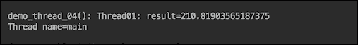

100 毫秒的延迟足以让`t1`线程完成计算。这是创建多线程计算线程的两种方法中的第一种。第二种方法是实现`Runnable`接口。如果执行计算的类已经扩展了其他某个类，并且由于某些原因不能或不想使用组合，这可能就是唯一可行的方法。`Runnable`接口是一个功能接口（只有一个抽象方法），其中包含必须实现的`run()`方法：

```java
@FunctionalInterface
public interface Runnable {
    /**
     * When an object implementing interface <code>Runnable</code> is used
     * to create a thread, starting the thread causes the object's
     * <code>run</code> method to be called in that separately executing
     * thread.
     */
    public abstract void run();
```

我们在`MyRunnable`类中实现这个接口：

```java
class MyRunnable01 implements Runnable {
    private String id;
    private double result;
    public MyRunnable01(int id) {
        this.id = String.valueOf(id);
    }
    public String getId() { return this.id; }
    public double getResult() { return this.result; }
    public void run() {
        result = IntStream.rangeClosed(1, 99999)
                          .asDoubleStream()
                          .map(Math::sqrt)
                          .average()
                          .getAsDouble();
    }
}
```

它具有与之前`Thread01`类相同的功能，我们还添加了一个 id，如果需要的话可以用来识别线程，因为`Runnable`接口没有像`Thread`类那样的内置`getName()`方法。

同样，如果我们像这样执行这个类而不暂停`main`线程：

```java
System.out.print("demo_runnable_01(): ");
MyRunnable01 myRunnable = new MyRunnable01(1);
Thread t1 = new Thread(myRunnable);
t1.start();
System.out.println("Worker " + myRunnable.getId() 
           + ": result=" + myRunnable.getResult());
```

输出将如下所示：


我们现在将添加暂停，如下所示：

```java
System.out.print("demo_runnable_02(): ");
MyRunnable01 myRunnable = new MyRunnable01(1);
Thread t1 = new Thread(myRunnable);
t1.start();
try {
    t1.join();
} catch (InterruptedException e) { 
    e.printStackTrace();
}
System.out.println("Worker " + myRunnable.getId() 
           + ": result=" + myRunnable.getResult());
```

结果与`Thread01`类产生的结果完全相同：


所有的前例都将生成的结果存储在类属性中。但情况并不总是如此。通常，工作线程要么将其值传递给另一个线程，要么将其存储在数据库或其他外部位置。在这种情况下，可以利用`Runnable`接口作为函数式接口，并将必要的处理函数作为 lambda 表达式传递给新线程：

```java
System.out.print("demo_lambda_01(): ");
String id = "1";
Thread t1 = 
    new Thread(() -> IntStream.rangeClosed(1, 99999)
         .asDoubleStream().map(Math::sqrt).average()
         .ifPresent(d -> System.out.println("Worker " 
                            + id + ": result=" + d)));
t1.start();
try {
    t1.join();
} catch (InterruptedException e) { 
    e.printStackTrace();
}
```

结果将完全相同，如下所示：


根据首选风格，你可以重新排列代码并将 lambda 表达式隔离在变量中，如下所示：

```java
Runnable r = () -> IntStream.rangeClosed(1, 99999)
       .asDoubleStream().map(Math::sqrt).average()
      .ifPresent(d -> System.out.println("Worker " 
                           + id + ": result=" + d));
Thread t1 = new Thread(r);
```

或者，你也可以将 lambda 表达式放在一个单独的方法中：

```java
void calculateAverage(String id) {
    IntStream.rangeClosed(1, 99999)
        .asDoubleStream().map(Math::sqrt).average()
        .ifPresent(d -> System.out.println("Worker " 
                            + id + ": result=" + d));
}
void demo_lambda_03() {
    System.out.print("demo_lambda_03(): ");
    Thread t1 = new Thread(() -> calculateAverage("1"));
    ...
}
```

结果将和这里显示的一样：


在对线程创建的基本理解到位之后，我们现在可以回到关于使用多线程构建高性能应用的讨论。换句话说，在了解每个工作线程所需的能力和资源之后，我们现在可以讨论将众多线程引入如此大规模项目（如吉萨金字塔）的物流问题。

编写管理工作线程生命周期及其对共享资源访问的代码是可能的，但这在不同的应用中是相同的。这就是为什么在 Java 的几个版本之后，线程管理的基础设施成为了标准 JDK 库的一部分，即`java.util.concurrent`包。这个包包含大量支持多线程和并发的接口和类。我们将在后续章节中讨论如何使用这些功能的大部分，同时讨论线程池、线程监控、线程同步及相关主题。

# 线程池

在本节中，我们将探讨`java.util.concurrent`包中定义的`Executor`接口及其实现。它们封装了线程管理，并最小化了应用开发者编写与线程生命周期相关的代码所需的时间。

在`java.util.concurrent`包中定义了三个`Executor`接口。第一个是基本的`Executor`接口，其中只有一个`void execute(Runnable r)`方法。它基本上替换了以下内容：

```java
Runnable r = ...;
(new Thread(r)).start()
```

然而，我们也可以通过从池中获取它来避免创建新线程。

第二个是`ExecutorService`接口，它扩展了`Executor`并添加了以下一组方法，用于管理工作线程和执行器本身的生命周期：

+   `submit()`: 将`Runnable`接口或`Callable`接口的对象放入队列以执行（允许工作线程返回一个值）；返回`Future`接口的对象，可以用来访问`Callable`返回的值以及管理工作线程的状态

+   `invokeAll()`: 将一组接口 `Callable` 对象放入执行队列，当所有工作线程完成时返回 `Future` 对象列表（也有带超时的重载 `invokeAll()` 方法）

+   `invokeAny()`: 将一组接口 `Callable` 对象放入执行队列；返回任意一个工作线程完成的 `Future` 对象（也有带超时的重载 `invokeAny()` 方法）

管理工作线程状态和服务的相关方法：

+   `shutdown()`: 防止将新工作线程提交到服务中

+   `isShutdown()`: 检查执行器的关闭是否被启动

+   `awaitTermination(long timeout, TimeUnit timeUnit)`: 在发出关闭请求后等待所有工作线程完成执行，或者超时发生，或者当前线程被中断，以先发生者为准

+   `isTerminated()`: 检查在启动关闭后所有工作线程是否已完成；除非首先调用 `shutdown()` 或 `shutdownNow()`，否则它永远不会返回 `true`

+   `shutdownNow()`: 中断所有未完成的工作线程；工作线程应该被编写成定期检查自己的状态（例如使用 `Thread.currentThread().isInterrupted()`），并优雅地自行关闭；否则，即使在调用 `shutdownNow()` 之后，它也会继续运行

第三个接口是 `ScheduledExecutorService`，它扩展了 `ExecutorService` 并添加了允许调度工作线程执行（一次性或周期性）的方法。

可以使用 `java.util.concurrent.ThreadPoolExecutor` 或 `java.util.concurrent.ScheduledThreadPoolExecutor` 类创建基于池的 `ExecutorService` 实现。还有一个 `java.util.concurrent.Executors` 工厂类，涵盖了大多数实际案例。因此，在为工作线程池编写自定义代码之前，我们强烈建议查看 `java.util.concurrent.Executors` 类的以下工厂方法：

+   `newSingleThreadExecutor()`: 创建一个 `ExecutorService`（池）实例，按顺序执行工作线程

+   `newFixedThreadPool()`: 创建一个线程池，重用固定数量的工作线程；如果所有工作线程仍在执行时提交新任务，它将被放入队列中，直到有工作线程可用

+   `newCachedThreadPool()`: 创建一个线程池，根据需要添加新线程，除非在之前创建了空闲线程；空闲六十秒的线程将从缓存中移除

+   `newScheduledThreadPool()`: 创建一个固定大小的线程池，可以调度在给定延迟后运行或周期性执行的命令

+   `newSingleThreadScheduledExecutor()`: 创建一个单线程执行器，可以调度在给定延迟后运行或周期性执行的命令

+   `newWorkStealingThreadPool()`：这创建了一个使用与`ForkJoinPool`相同的窃取工作机制的线程池，这对于工作线程生成其他线程的情况特别有用，例如在递归算法中。

这些方法都有重载版本，允许传入一个`ThreadFactory`，当需要时用于创建新线程。让我们通过代码示例看看这一切是如何工作的。

首先，我们创建一个实现`Runnable`的`MyRunnable02`类——我们未来的工作线程：

```java
class MyRunnable02 implements Runnable {
    private String id;
    public MyRunnable02(int id) {
        this.id = String.valueOf(id);
    }
    public String getId(){ return this.id; }
    public void run() {
        double result = IntStream.rangeClosed(1, 100)
           .flatMap(i -> IntStream.rangeClosed(1, 99999))
           .takeWhile(i -> 
                 !Thread.currentThread().isInterrupted())
           .asDoubleStream()
           .map(Math::sqrt)
           .average()
           .getAsDouble();
        if(Thread.currentThread().isInterrupted()){
            System.out.println(" Worker " + getId() 
                       + ": result=ignored: " + result);
        } else {
            System.out.println(" Worker " + getId() 
                                + ": result=" + result);
        }
}
```

注意这个实现与之前示例的重要区别——`takeWhile(i -> !Thread.currentThread().isInterrupted())`操作允许只要工作线程的状态没有被设置为中断（在调用`shutdownNow()`方法时发生），流就可以继续流动。一旦`takeWhile()`的谓词返回`false`（工作线程被中断），线程就会停止产生结果（仅忽略当前的`result`值）。在真实系统中，这相当于跳过将`result`值存储到数据库，例如。

值得注意的是，在前面的代码中使用`interrupted()`状态方法来检查线程状态可能会导致结果不一致。由于`interrupted()`方法返回正确的状态值然后清除线程状态，因此对该方法的第二次调用（或者在调用`interrupted()`方法之后的`isInterrupted()`方法的调用）总是返回`false`。

虽然在这个代码中不是这种情况，但我们想在这里提到一些开发者在实现工作线程中的`try/catch`块时可能会犯的错误。例如，如果工作线程需要暂停并等待中断信号，代码通常看起来像这样：

```java
try {
    Thread.currentThread().wait();
} catch (InterruptedException e) {}
// Do what has to be done
```

```java
The better implementation is as follows:
```

```java
try {
    Thread.currentThread().wait();
} catch (InterruptedException e) {
    Thread.currentThread().interrupt();
}
// Do what has to be done
```

```java
join() method, we did not need to do that because that was the main code (the highest level code) that had to be paused.
```

现在，我们可以展示如何使用`ExecutiveService`池的缓存池实现来执行之前的`MyRunnable02`类（其他类型的线程池以类似方式使用）。首先，我们创建池，提交三个`MyRunnable02`类的实例以供执行，然后关闭池：

```java
ExecutorService pool = Executors.newCachedThreadPool();
IntStream.rangeClosed(1, 3).
       forEach(i -> pool.execute(new MyRunnable02(i)));
System.out.println("Before shutdown: isShutdown()=" 
          + pool.isShutdown() + ", isTerminated()=" 
                                + pool.isTerminated());
pool.shutdown(); // New threads cannot be submitted
System.out.println("After  shutdown: isShutdown()=" 
          + pool.isShutdown() + ", isTerminated()=" 
                                + pool.isTerminated());
```

如果我们运行这些行，我们将看到以下输出：


没有惊喜！在调用`shutdown()`方法之前，`isShutdown()`方法返回`false`值，之后返回`true`值。`isTerminated()`方法返回`false`值，因为还没有任何工作线程完成。

让我们在`shutdown()`方法之后添加以下代码来测试它：

```java
try {
    pool.execute(new MyRunnable02(100));
} catch(RejectedExecutionException ex){
    System.err.println("Cannot add another worker-thread to the service queue:\n" + ex.getMessage());
}
```

现在的输出将包含以下消息（截图可能太大，无法适应这个页面，或者当适应页面时无法阅读）：

```java
Cannot add another worker-thread to the service queue:
Task com.packt.java9hp.ch09_threads.MyRunnable02@6f7fd0e6 
    rejected from java.util.concurrent.ThreadPoolExecutor
    [Shutting down, pool size = 3, active threads = 3, 
    queued tasks = 0, completed tasks = 0]
```

如预期，在调用`shutdown()`方法之后，不能再向池中添加更多的工作线程。

现在，让我们看看在启动关闭之后我们能做什么：

```java
long timeout = 100;
TimeUnit timeUnit = TimeUnit.MILLISECONDS;
System.out.println("Waiting for all threads completion " 
                     + timeout + " " + timeUnit + "...");
// Blocks until timeout or all threads complete execution
boolean isTerminated = 
                pool.awaitTermination(timeout, timeUnit);
System.out.println("isTerminated()=" + isTerminated);
if (!isTerminated) {
    System.out.println("Calling shutdownNow()...");
    List<Runnable> list = pool.shutdownNow(); 
    printRunningThreadIds(list);
    System.out.println("Waiting for threads completion " 
                     + timeout + " " + timeUnit + "...");
    isTerminated = 
                pool.awaitTermination(timeout, timeUnit);
    if (!isTerminated){
        System.out.println("Some threads are running...");
    }
    System.out.println("Exiting.");
}
```

`printRunningThreadIds()`方法看起来像这样：

```java
void printRunningThreadIds(List<Runnable> l){
    String list = l.stream()
            .map(r -> (MyRunnable02)r)
            .map(mr -> mr.getId())
            .collect(Collectors.joining(","));
    System.out.println(l.size() + " thread"
       + (l.size() == 1 ? " is" : "s are") + " running"
            + (l.size() > 0 ? ": " + list : "") + ".");
}
```

上述代码的输出将如下所示：

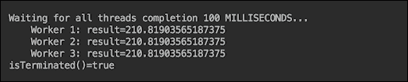

这意味着每个工作线程有足够的时间完成计算。（注意，如果您尝试在您的计算机上重现这些数据，结果可能会有所不同，因为性能的差异，因此您需要调整超时时间。）

当我们将等待时间减少到 75 毫秒时，输出如下所示：

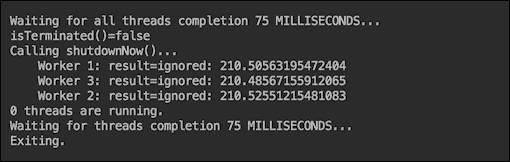

在我们的计算机上，75 毫秒不足以让所有线程完成，因此它们被`shutdownNow()`中断，并且它们的部分结果被忽略。

现在让我们从`MyRunnable01`类中移除对中断状态的检查：

```java
class MyRunnable02 implements Runnable {
    private String id;
    public MyRunnable02(int id) {
        this.id = String.valueOf(id);
    }
    public String getId(){ return this.id; }
    public void run() {
        double result = IntStream.rangeClosed(1, 100)
           .flatMap(i -> IntStream.rangeClosed(1, 99999))
           .asDoubleStream()
           .map(Math::sqrt)
           .average()
           .getAsDouble();
        System.out.println(" Worker " + getId() 
                                + ": result=" + result);
}
```

没有检查，即使我们将超时时间减少到 1 毫秒，结果也会如下所示：

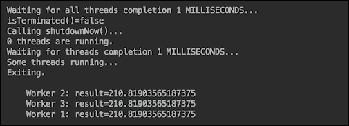

这是因为工作线程从未注意到有人试图中断它们，并且已经完成了分配的计算。这个最后的测试展示了在工作线程中监视中断状态的重要性，以避免许多可能的问题，即数据损坏和内存泄漏。

展示的缓存池在工作线程执行短期任务且数量不会过大时运行良好，不会出现任何问题。如果您需要更严格控制任何时刻运行的最多工作线程数，请使用固定大小的线程池。我们将在本课的后续部分讨论如何选择池大小。

单线程池非常适合按特定顺序执行任务，或者当每个任务都需要如此多的资源，以至于不能与其他任务并行执行时。使用单线程执行的其他情况可能是，当工作线程修改相同的数据，但数据无法通过其他方式保护免受并行访问时。线程同步将在本课的后续部分更详细地讨论。

在我们的示例代码中，到目前为止，我们只包括了`Executor`接口的`execute()`方法。我们将在本课的后续部分讨论线程监控时演示`ExecutorService`池的其他方法。

本节的最后一点。工作线程不一定是同一类的对象。它们可能代表完全不同的功能，但仍可由一个池管理。

# 监视线程

监视线程有两种方式，一种是程序化方式，另一种是使用外部工具。我们已经看到了如何检查工作计算的结果。让我们回顾一下那段代码。我们还将稍微修改我们的工作实现：

```java
class MyRunnable03 implements Runnable {
  private String name;
  private double result;
  public String getName(){ return this.name; }
  public double getResult() { return this.result; }
  public void run() {
    this.name = Thread.currentThread().getName();
    double result = IntStream.rangeClosed(1, 100)
      .flatMap(i -> IntStream.rangeClosed(1, 99999))
      .takeWhile(i -> !Thread.currentThread().isInterrupted())
      .asDoubleStream().map(Math::sqrt).average().getAsDouble();
    if(!Thread.currentThread().isInterrupted()){
      this.result = result;
    }
  }
}
```

对于工作线程的标识，我们不再使用自定义 ID，而是现在使用在执行时自动分配的线程名（这就是为什么我们在`run()`方法中分配`name`属性，该方法在执行上下文中被调用，当线程获得其名称时）。新的类`MyRunnable03`可以这样使用：

```java
void demo_CheckResults() {
    ExecutorService pool = Executors.newCachedThreadPool();
    MyRunnable03 r1 = new MyRunnable03();
    MyRunnable03 r2 = new MyRunnable03();
    pool.execute(r1);
    pool.execute(r2);
    try {
        t1.join();
    } catch (InterruptedException e) { 
        e.printStackTrace();
    }
    System.out.println("Worker " + r1.getName() + ": result=" + r1.getResult());
    System.out.println("Worker " + r2.getName() + ": result=" + r2.getResult());
    shutdown(pool);
}
```

`shutdown()`方法包含以下代码：

```java
void shutdown(ExecutorService pool) {
    pool.shutdown();
    try {
        if(!pool.awaitTermination(1, TimeUnit.SECONDS)){
            pool.shutdownNow();
        }
    } catch (InterruptedException ie) {}
}
```

如果我们运行前面的代码，输出将如下所示：


如果您计算机上的结果不同，请尝试增加 `sleepMs()` 方法的输入值。

另一种获取应用程序工作线程信息的方法是使用 `Future` 接口。我们可以通过 `ExecutorService` 池的 `submit()` 方法访问此接口，而不是使用 `execute()`、`invokeAll()` 或 `invokeAny()` 方法。以下代码展示了如何使用 `submit()` 方法：

```java
ExecutorService pool = Executors.newCachedThreadPool();
Future f1 = pool.submit(new MyRunnable03());
Future f2 = pool.submit(new MyRunnable03());
printFuture(f1, 1);
printFuture(f2, 2);
shutdown(pool);
```

`printFuture()` 方法具有以下实现：

```java
void printFuture(Future future, int id) {
    System.out.println("printFuture():");
    while (!future.isCancelled() && !future.isDone()){
        System.out.println("    Waiting for worker " 
                                + id + " to complete...");
        sleepMs(10);
    }
    System.out.println("    Done...");
}
```

`sleepMs()` 方法包含以下代码：

```java
void sleepMs(int sleepMs) {
    try {
        TimeUnit.MILLISECONDS.sleep(sleepMs);
    } catch (InterruptedException e) {}
}
```

我们更喜欢这种实现方式而不是传统的 `Thread.sleep()`，因为它明确指出了使用的时间单位。

如果我们执行前面的代码，结果将类似于以下内容：

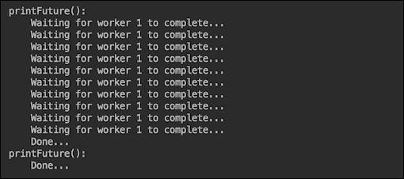

`printFuture()` 方法阻塞了主线程的执行，直到第一个线程完成。同时，第二个线程也已经完成。如果我们调用 `printFuture()` 方法在 `shutdown()` 方法之后，到那时两个线程都已经完成了，因为我们已经设置了 1 秒的等待时间（见 `pool.awaitTermination()` 方法），这对于它们完成工作来说是足够的：


如果您认为从线程监控的角度来看信息不多，`java.util.concurrent` 包通过 `Callable` 接口提供了更多功能。它是一个函数式接口，允许通过 `ExecutiveService` 方法（`submit()`、`invokeAll()` 和 `invokeAny()`）使用 `Future` 对象返回任何对象（包含工作线程计算的结果）。例如，我们可以创建一个包含工作线程结果的类：

```java
class Result {
    private double result;
    private String workerName;
    public Result(String workerName, double result) {
        this.result = result;
        this.workerName = workerName;
    }
    public String getWorkerName() { return workerName; }
    public double getResult() { return result;}
}
```

我们还包含了工作线程的名称，以便监控哪个线程生成了展示的结果。实现 `Callable` 接口的类可能看起来像这样：

```java
class MyCallable01<T> implements Callable {
  public Result call() {
    double result = IntStream.rangeClosed(1, 100)
       .flatMap(i -> IntStream.rangeClosed(1, 99999))
       .takeWhile(i -> !Thread.currentThread().isInterrupted())
       .asDoubleStream().map(Math::sqrt).average().getAsDouble();

    String workerName = Thread.currentThread().getName();
    if(Thread.currentThread().isInterrupted()){
        return new Result(workerName, 0);
    } else {
        return new Result(workerName, result);
    }
  }
}
```

下面是使用 `MyCallable01` 类的代码：

```java
ExecutorService pool = Executors.newCachedThreadPool();
Future f1 = pool.submit(new MyCallable01<Result>());
Future f2 = pool.submit(new MyCallable01<Result>());
printResult(f1, 1);
printResult(f2, 2);
shutdown(pool);
```

`printResult()` 方法包含以下代码：

```java
void printResult(Future<Result> future, int id) {
    System.out.println("printResult():");
    while (!future.isCancelled() && !future.isDone()){
        System.out.println("    Waiting for worker " 
                              + id + " to complete...");
        sleepMs(10);
    }
    try {
        Result result = future.get(1, TimeUnit.SECONDS);
        System.out.println("    Worker " 
                + result.getWorkerName() + ": result = " 
                                   + result.getResult());
    } catch (Exception ex) {
        ex.printStackTrace();
    }
}
```

此代码的输出可能如下所示：

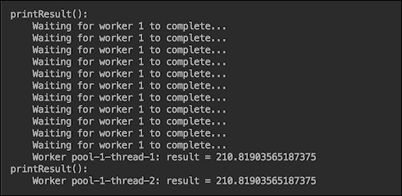

早期输出显示，与前面的示例一样，`printResult()` 方法等待第一个工作线程完成，因此第二个线程设法同时完成其工作。如您所见，使用 `Callable` 的优点是，如果我们需要，我们可以从 `Future` 对象中检索实际结果。

`invokeAll()` 和 `invokeAny()` 方法的用法看起来相似：

```java
ExecutorService pool = Executors.newCachedThreadPool();
try {
    List<Callable<Result>> callables = 
              List.of(new MyCallable01<Result>(), 
                           new MyCallable01<Result>());
    List<Future<Result>> futures = 
                             pool.invokeAll(callables);
    printResults(futures);
} catch (InterruptedException e) {
    e.printStackTrace();
}
shutdown(pool);
```

`printResults()` 方法正在使用您已经知道的 `printResult()` 方法：

```java
void printResults(List<Future<Result>> futures) {
    System.out.println("printResults():");
    int i = 1;
    for (Future<Result> future : futures) {
        printResult(future, i++);
    }
}
```

如果我们运行前面的代码，输出将如下所示：

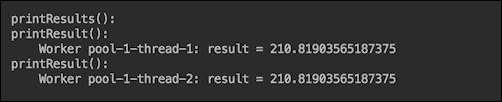

如您所见，不再需要等待工作线程完成工作。这是因为 `invokeAll()` 方法在所有工作完成后返回 `Future` 对象的集合。

`invokeAny()`方法的行为类似。如果我们运行以下代码：

```java
System.out.println("demo_InvokeAny():");
ExecutorService pool = Executors.newCachedThreadPool();
try {
    List<Callable<Result>> callables = 
                   List.of(new MyCallable01<Result>(), 
                            new MyCallable01<Result>());
    Result result = pool.invokeAny(callables);
    System.out.println("    Worker " 
                        + result.getWorkerName()
                  + ": result = " + result.getResult());
} catch (InterruptedException | ExecutionException e) {
    e.printStackTrace();
}
shutdown(pool);
```

下面的将是输出：


这些是程序化监控线程的基本技术，但可以轻松扩展我们的示例以涵盖更复杂的案例，这些案例针对特定应用程序的需求。在第 5 课，*利用新 API 改进代码*中，我们还将讨论使用在 JDK 8 中引入并在 JDK 9 中扩展的`java.util.concurrent.CompletableFuture`类以程序化方式监控工作线程的另一种方法。

如果需要，可以使用`java.lang.Thread`类获取有关应用程序工作线程的信息，以及 JVM 进程中的所有其他线程：

```java
void printAllThreads() {
    System.out.println("printAllThreads():");
    Map<Thread, StackTraceElement[]> map = Thread.getAllStackTraces();
    for(Thread t: map.keySet()){
        System.out.println("    " + t);
    }
```

现在，让我们按如下方式调用此方法：

```java
void demo_CheckResults() {
    ExecutorService pool = Executors.newCachedThreadPool();
    MyRunnable03 r1 = new MyRunnable03();
    MyRunnable03 r2 = new MyRunnable03();
    pool.execute(r1);
    pool.execute(r2);
    sleepMs(1000);
    printAllThreads();
    shutdown(pool);
}
```

结果看起来像这样：

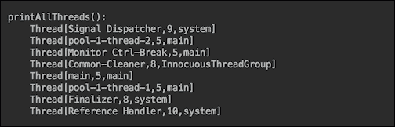

我们利用了`Thread`类的`toString()`方法，该方法只打印线程名称、优先级以及它所属的线程组。我们看到在名称为`pool-1-thread-1`和`pool-1-thread-2`的列表下，我们明确创建的两个应用程序线程（除了`main`线程）。但是，如果我们调用`shutdown()`方法之后的`printAllThreads()`方法，输出将如下所示：

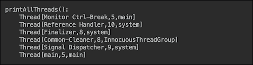

我们在列表中不再看到`pool-1-thread-1`和`pool-1-thread-2`线程，因为`ExecutorService`池已被关闭。

我们可以轻松地添加从同一映射中提取的堆栈跟踪信息：

```java
void printAllThreads() {
    System.out.println("printAllThreads():");
    Map<Thread, StackTraceElement[]> map 
                               = Thread.getAllStackTraces();
    for(Thread t: map.keySet()){
        System.out.println("   " + t);
        for(StackTraceElement ste: map.get(t)){
            System.out.println("        " + ste);
        }
    }
}
```

然而，这将在书页上占用太多空间。在第 5 课中，当我们介绍 JDK 9 带来的新 Java 功能时，我们还将讨论通过`java.lang.StackWalker`类访问堆栈跟踪的更好方法。

`Thread`类对象有几个其他方法，可以提供有关线程的信息，如下所示：

+   `dumpStack()`: 这将堆栈跟踪打印到标准错误流

+   `enumerate(Thread[] arr)`: 这将当前线程的线程组及其子组中的活动线程复制到指定的数组`arr`

+   `getId()`: 这提供了线程的 ID

+   `getState()`: 这读取线程的状态；`enum Thread.State`的可能值可以是以下之一：

    +   `NEW`: 这是尚未启动的线程

    +   `RUNNABLE`: 这是当前正在执行的线程

    +   `BLOCKED`: 这是等待监视器锁释放而被阻塞的线程

    +   `WAITING`: 这是等待中断信号的线程

    +   `TIMED_WAITING`: 这是等待指定等待时间中断信号的线程

    +   `TERMINATED`: 这是已经退出的线程

+   `holdsLock(Object obj)`: 这表示线程是否持有指定对象的监视器锁

+   `interrupted()` 或 `isInterrupted()`: 这表示线程是否被中断（收到中断信号，意味着中断标志被设置为 `true`）

+   `isAlive()`: 这表示线程是否存活

+   `isDaemon()`: 这表示线程是否是守护线程。

`java.lang.management` 包为监控线程提供了类似的功能。让我们运行这个代码片段，例如：

```java
void printThreadsInfo() {
    System.out.println("printThreadsInfo():");
    ThreadMXBean threadBean = 
                      ManagementFactory.getThreadMXBean();
    long ids[] = threadBean.getAllThreadIds();
    Arrays.sort(ids);
    ThreadInfo[] tis = threadBean.getThreadInfo(ids, 0);
    for (ThreadInfo ti : tis) {
        if (ti == null) continue;
        System.out.println("    Id=" + ti.getThreadId() 
                       + ", state=" + ti.getThreadState() 
                          + ", name=" + ti.getThreadName());
    }
}
```

为了更好的展示，我们利用了线程 ID 的列表，并且，如你之前所见，我们按 ID 对输出进行了排序。如果我们调用 `shutdown()` 方法之前的 `printThreadsInfo()` 方法，输出将如下所示：

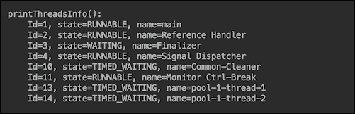

然而，如果我们调用 `shutdown()` 方法之后的 `printThreadsInfo()` 方法，输出将不再包括我们的工作线程，这与使用 `Thread` 类 API 的情况完全相同：

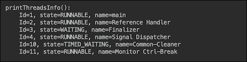

`java.lang.management.ThreadMXBean` 接口提供了许多关于线程的其他有用数据。你可以参考 Oracle 网站上关于此接口的官方 API 获取更多信息，请查看此链接：[`docs.oracle.com/javase/8/docs/api/index.html?java/lang/management/ThreadMXBean.html`](https://docs.oracle.com/javase/8/docs/api/index.html?java/lang/management/ThreadMXBean.html)。

在前面提到的线程列表中，你可能已经注意到了 `Monitor Ctrl-Break` 线程。这个线程为在 JVM 进程中监控线程提供了另一种方式。在 Windows 上按下 *Ctrl* 和 *Break* 键会导致 JVM 将线程转储打印到应用程序的标准输出。在 Oracle Solaris 或 Linux 操作系统上，同样的效果可以通过 *Ctrl* 键和反斜杠 *\* 组合实现。这使我们来到了用于线程监控的外部工具。

如果你无法访问源代码或更喜欢使用外部工具进行线程监控，JDK 安装中提供了几个诊断工具。在以下列表中，我们只提到了允许进行线程监控的工具，并且只描述了这些工具的这一功能（尽管它们还有其他广泛的功能）：

+   `jcmd` 工具通过 JVM 进程 ID 或主类名向同一台机器上的 JVM 发送诊断命令请求：`jcmd <process id/main class> <command> [options]`，其中 `Thread.print` 选项打印进程中所有线程的堆栈跟踪。

+   JConsole 监控工具使用 JVM 内置的 JMX 仪器来提供有关运行应用程序的性能和资源消耗的信息。它有一个线程选项卡，显示了随时间变化的线程使用情况、当前活动线程数以及自 JVM 启动以来最高活动线程数。可以选择线程及其名称、状态和堆栈跟踪，以及对于阻塞线程，线程等待获取的同步器以及拥有锁的线程。使用 **死锁检测** 按钮来识别死锁。运行此工具的命令是 `jconsole <进程 ID>` 或（对于远程应用程序）`jconsole <主机名>:<端口号>`，其中 `端口号` 是 JVM 启动命令中指定的启用 JMX 代理的端口号。

+   `jdb` 实用程序是一个示例命令行调试器。它可以附加到 JVM 进程，并允许您检查线程。

+   `jstack` 命令行实用程序可以附加到 JVM 进程，并打印所有线程的堆栈跟踪，包括 JVM 内部线程，以及可选的本地堆栈帧。它还允许检测死锁。

+   **Java 飞行记录器**（**JFR**）提供了有关 Java 进程的信息，包括等待锁的线程、垃圾回收等。它还允许获取线程转储，这些转储类似于由 `Thread.print` 诊断命令或使用 jstack 工具生成的转储。如果满足条件，可以设置 **Java 任务控制**（**JMC**）以转储飞行记录。JMC UI 包含有关线程、锁竞争和其他延迟的信息。尽管 JFR 是一个商业功能，但在开发人员桌面/笔记本电脑以及测试、开发和生产环境中的评估目的上是免费的。

### 注意

您可以在官方 Oracle 文档中找到有关这些和其他诊断工具的更多详细信息，网址为 [`docs.oracle.com/javase/9/troubleshoot/diagnostic-tools.htm`](https://docs.oracle.com/javase/9/troubleshoot/diagnostic-tools.htm)。

# 线程池执行器大小

在我们的示例中，我们使用了一个缓存线程池，根据需要创建新线程，或者如果可用，则重用已经使用但已完成任务的线程，并将其返回到池中以进行新的分配。我们不必担心创建过多的线程，因为我们的演示应用程序最多只有两个工作线程，而且它们的生命周期相当短。

但在应用没有固定的工作线程数量限制，或者没有好的方法来预测线程可能占用的内存量或执行时间的情况下，对工作线程数量设置上限可以防止应用性能意外下降、内存耗尽或任何其他工作线程使用的资源耗尽。如果线程行为极不可预测，单个线程池可能是唯一的解决方案，可以选择使用自定义线程池执行器（关于这个选项的更多内容将在后面解释）。但在大多数情况下，固定大小的线程池执行器是在应用需求和代码复杂度之间的一种良好的实用折衷方案。根据具体要求，这样的执行器可能是以下三种类型之一：

+   一个简单、固定大小的`ExecutorService.newFixedThreadPool(int nThreads)`线程池，它不会超过指定的大小，但也不会采用其他方式

+   几个允许使用不同延迟或执行周期调度不同线程组的`ExecutorService.newScheduledThreadPool(int nThreads)`线程池

+   `ExecutorService.newWorkStealingPool(int parallelism)`，它适应指定的 CPU 数量，你可以将其设置为高于或低于你电脑上实际 CPU 数量的值

在任何先前的池中设置固定大小过低可能会剥夺应用有效利用可用资源的机会。因此，在选择池大小之前，建议花些时间对其进行监控和调整 JVM（参见本课程的一个部分中如何操作），目标是识别应用行为的特殊性。实际上，部署-监控-调整的周期必须在应用生命周期内重复进行，以便适应并利用代码或执行环境中的变化。

你首先考虑的第一个参数是系统中的 CPU 数量，因此线程池大小至少应该与 CPU 的数量一样大。然后，你可以监控应用，看看每个线程占用 CPU 的时间以及它使用其他资源（如 I/O 操作）的时间。如果未使用 CPU 的时间与线程的总执行时间相当，那么你可以通过**未使用 CPU 的时间/总执行时间**来增加池大小。但这是在另一个资源（磁盘或数据库）不是线程之间的争用对象的情况下。如果后者是情况，那么你可以使用该资源而不是 CPU 作为划分因素。

假设您的应用程序的工作线程不是太大或执行时间太长，属于典型工作线程的主流人群，它们在合理短的时间内完成工作，您可以通过添加（向上取整）所需响应时间与线程使用 CPU 或其他最具有争议性资源的时间的比率来增加池大小。这意味着，在相同的所需响应时间下，线程使用 CPU 或其他并发访问的资源越少，池大小应该越大。如果争议性资源具有提高并发访问能力的能力（如数据库中的连接池），首先考虑利用该功能。

如果在运行时由于不同情况，同时运行的线程数发生变化，您可以使池大小动态，并在所有线程完成后关闭旧池，创建一个新的具有新大小的池。在添加或删除可用资源后，可能还需要重新计算新池的大小。您可以使用`Runtime.getRuntime().availableProcessors()`根据当前可用的 CPU 数量程序化地调整池大小，例如。

如果 JDK 附带的可用线程池执行器实现没有满足特定应用程序的需求，在从头编写线程管理代码之前，首先尝试使用`java.util.concurrent.ThreadPoolExecutor`类。它有几个重载的构造函数。

为了让您了解其功能，以下是一个具有最多选项的构造函数：

```java
ThreadPoolExecutor (int corePoolSize, int maximumPoolSize, long keepAliveTime, TimeUnit unit, BlockingQueue<Runnable> workQueue, ThreadFactory threadFactory, RejectedExecutionHandler handler)
```

之前提到的参数如下（引用自 JavaDoc）：

+   `corePoolSize`: 这是池中要保留的线程数，即使它们处于空闲状态，除非设置了`allowCoreThreadTimeOut`

+   `maximumPoolSize`: 这是池中允许的最大线程数

+   `keepAliveTime`: 当线程数大于核心数时，这是超出空闲线程等待新任务以终止的最大时间

+   `unit`: 这是`keepAliveTime`参数的时间单位

+   `workQueue`: 这是用于在执行之前持有任务的队列，此队列将仅保留通过`execute`方法提交的`Runnable`任务

+   `threadFactory`: 这是在执行器创建新线程时使用的工厂

+   `handler`: 当执行因为线程边界和队列容量达到而阻塞时，这是要使用的处理器

除了`workQueue`参数之外，之前的构造函数参数也可以在创建`ThreadPoolExecutor`对象后通过相应的 setter 进行设置，从而使得对现有池特性的动态调整更加灵活。

# 线程同步

我们已经收集了足够的人力和资源，如食物、水和工具，用于金字塔建设。我们将人员分成团队，并为每个团队分配一项任务。有一群人（一个池）住在附近的村庄，处于待命状态，随时准备替换那些在任务中生病或受伤的人。我们调整了劳动力数量，以确保只有少数人将在村庄中闲置。我们通过工作-休息周期轮换团队，以保持项目以最大速度进行。我们监控了整个过程，并调整了团队数量和所需供应品的流动，以确保没有明显的延误，整个项目有稳定的可测量进度。然而，整体上有很多移动部件，以及各种大小不一的意外事件和问题不断发生。

为了确保工人和团队不会相互干扰，并且存在某种交通规则，以便在上一阶段完成之前不会开始下一技术阶段，主要建筑师派遣他的代表到建筑工地的所有关键点。这些代表确保任务以预期的质量按规定的顺序执行。他们有权在上一团队未完成之前阻止下一团队开始工作。他们就像交通警察或可以关闭或允许进入工作场所的锁，如果/当必要时。

这些代表所做的工作可以用现代语言定义为执行单元动作的协调或同步。没有它，成千上万工人努力的成果将是不可预测的。从万米高空看的大局将看起来平稳和谐，就像从飞机窗户看到的农民田地。但如果没有更仔细的检查和对关键细节的关注，这个看似完美的画面可能会带来微薄的收成，如果有的话。

同样，在多线程执行环境的安静电子空间中，如果工作线程共享对同一工作场所的访问，它们必须进行同步。例如，让我们为线程创建以下类-工作者：

```java
class MyRunnable04 implements Runnable {
  private int id;
  public MyRunnable04(int id) { this.id = id; }
  public void run() {
    IntStream.rangeClosed(1, 5)
      .peek(i -> System.out.println("Thread "+id+": "+ i))
      .forEach(i -> Demo04Synchronization.result += i);
    }
}
```

正如你所见，它按顺序将 1、2、3、4、5（因此，预期的结果是 15）添加到`Demo04Synchronization`类的静态属性中：

```java
public class Demo04Synchronization {
    public static int result;
    public static void main(String... args) {
        System.out.println();
        demo_ThreadInterference();
    }
    private static void demo_ThreadInterference(){
        System.out.println("demo_ThreadInterference: ");
        MyRunnable04 r1 = new MyRunnable04(1);
        Thread t1 = new Thread(r1);
        MyRunnable04 r2 = new MyRunnable04(2);
        Thread t2 = new Thread(r2);
        t1.start();
        sleepMs(100);
        t2.start();
        sleepMs(100);
        System.out.println("Result=" + result);
    }
    private static void sleepMs(int sleepMs) {
        try {
            TimeUnit.MILLISECONDS.sleep(sleepMs);
        } catch (InterruptedException e) {}
    }
}
```

在早期的代码中，当主线程第一次暂停 100 毫秒时，线程`t1`将变量的值增加到 15，然后线程`t2`再增加 15，得到总和 30。以下是输出：

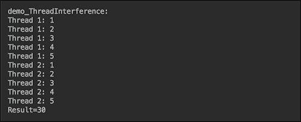

如果我们移除第一次 100 毫秒的暂停，线程将并发工作：

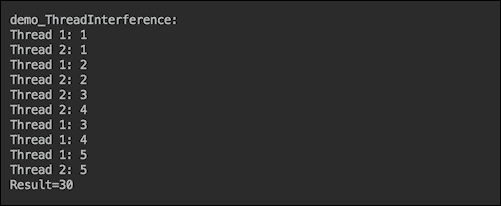

最终结果仍然是 30。我们对这段代码感到满意，并将其作为经过良好测试的代码部署到生产环境中。然而，如果我们将加数的数量从 5 增加到 250，例如，结果就会变得不稳定，并且每次运行的结果都不同。以下是第一次运行（我们为了节省空间，在每个线程中注释掉了打印输出）：


这里是另一次运行的输出：


这证明了`Demo04Synchronization.result += i`操作不是原子的。这意味着它由几个步骤组成，从`result`属性中读取值，向其添加一个值，然后将结果和赋值回`result`属性。这允许以下场景，例如：

+   两个线程都读取了`result`的当前值（因此每个线程都有一个相同的原始`result`值的副本）

+   每个线程都向同一个原始整数添加另一个整数

+   第一个线程将和赋值给`result`属性

+   第二个线程将其和赋值给`result`属性

正如你所见，第二个线程并不知道第一个线程所做的加法，并覆盖了第一个线程分配给`result`属性的值。但这样的线程交错并不总是发生。这只是一种机会游戏。这就是为什么我们只使用五个数字时没有看到这样的效果。但随着并发动作数量的增加，这种情况发生的概率会增加。

在金字塔构建过程中也可能发生类似的情况。第二个团队可能在第一个团队完成他们的任务之前开始做某事。我们肯定需要一个**同步器**，它由`synchronized`关键字提供。使用它，我们可以在`Demo04Synchronization`类中创建一个方法（一个建筑师代表），该方法将控制对`result`属性的访问，并添加这个关键字：

```java
private static int result;
public static synchronized void incrementResult(int i){
    result += i;
}
```

现在我们还必须在工作线程的`run()`方法中进行修改：

```java
public void run() {
    IntStream.rangeClosed(1, 250)
       .forEach(Demo04Synchronization::incrementResult);
}
```

现在的输出显示每次运行都有相同的最终数字：


`synchronized`关键字告诉 JVM 一次只允许一个线程进入这个方法。所有其他线程都将等待，直到当前访问者从该方法退出。

通过在代码块中添加`synchronized`关键字也可以达到相同的效果：

```java
public static void incrementResult(int i){
    synchronized (Demo04Synchronization.class){
        result += i;
    }
}
```

区别在于块同步需要一个对象——在静态属性同步的情况下（如我们的例子），这是一个类对象；在实例属性同步的情况下，可以是任何其他对象。每个对象都有一个内在的锁或监视器锁，通常简单地称为监视器。一旦一个线程获取了对一个对象的锁，其他线程就不能在同一个对象上获取锁，直到第一个线程在从锁定代码的正常退出后释放锁，或者如果代码抛出异常。

事实上，在同步方法的情况下，一个对象（方法所属的对象）也用于锁定。这只是在幕后自动发生，不需要程序员显式使用对象的锁。

如果您无法访问`main`类代码（如前面的示例所示），您可以保持`result`属性为公共的，并为工作线程添加一个同步方法（而不是像我们之前所做的那样添加到类中）：

```java
class MyRunnable05 implements Runnable {
    public synchronized void incrementResult(int i){
        Demo04Synchronization.result += i;
    }
    public void run() {
        IntStream.rangeClosed(1, 250)
                .forEach(this::incrementResult);
    }
}
```

在这种情况下，`MyRunnable05`工作类的对象默认提供其内锁。这意味着，您需要为所有线程使用`MyRunnable05`类的相同对象：

```java
void demo_Synchronized(){
    System.out.println("demo_Synchronized: ");
    MyRunnable05 r1 = new MyRunnable05();
    Thread t1 = new Thread(r1);
    Thread t2 = new Thread(r1);
    t1.start();
    t2.start();
    sleepMs(100);
    System.out.println("Result=" + result);
}
```

上述代码的输出与之前相同：


可以争论说，这种最后的实现更可取，因为它将同步的责任分配给了线程（及其代码的作者），而不是共享资源。这样，同步的需要会随着线程实现的发展而变化，前提是客户端代码（使用相同或不同对象进行线程的）也可以根据需要更改。

在某些操作系统中可能还存在另一个可能的并发问题。根据线程缓存如何实现，一个线程可能会保留属性`result`的本地副本，并且在另一个线程更改其值后不更新它。通过在共享（线程间的）属性上添加`volatile`关键字，可以保证其当前值始终从主内存中读取，因此每个线程都将看到其他线程所做的更新。在我们的前一个示例中，我们只是将`Demo04Synchronization`类属性设置为`private static volatile int result`，向同一类或线程添加一个同步的`incrementResult()`方法，就不再需要担心线程相互干扰了。

描述的线程同步通常对于主流应用程序来说是足够的。但是，更高的性能和高度并发的处理通常需要更仔细地查看线程转储，这通常表明方法同步比块同步更有效。当然，这也取决于方法的大小和块的大小。由于所有尝试访问同步方法或块的线程都将停止执行，直到当前访问方法或块的访问者退出它，因此，尽管存在开销，一个小同步块可能比大同步方法提供更好的性能。

对于某些应用程序，默认的内置锁的行为，即仅阻塞直到锁被释放，可能不适合。如果是这种情况，请考虑使用 `java.util.concurrent.locks` 包中的锁。与使用默认内置锁相比，基于该包中锁的访问控制有几个不同之处。这些差异可能对您的应用程序有利或提供不必要的复杂性，但了解它们很重要，这样您就可以做出明智的决定：

+   同步代码块不需要属于一个方法；它可以跨越多个方法，由对实现 `Lock` 接口的对象调用 `lock()` 和 `unlock()` 方法（调用）界定

+   当创建一个名为 `ReentrantLock` 的 `Lock` 接口对象时，可以将一个 `fair` 标志传递给构造函数，这使得锁能够首先授予等待时间最长的线程访问权限，这有助于避免饥饿（当低优先级线程永远无法获得锁时）

+   允许线程在承诺被阻塞之前测试锁是否可访问

+   允许中断等待锁的线程，使其不会无限期地保持阻塞状态

+   您可以使用您应用程序需要的任何功能自行实现 `Lock` 接口

`Lock` 接口的使用典型模式如下：

```java
Lock lock = ...;
...
    lock.lock();
    try {
        // the fragment that is synchronized
    } finally {
        lock.unlock();
    }
...
}
```

注意到 `finally` 块。这是保证最终释放 `lock` 的方式。否则，`try-catch` 块内的代码可能会抛出异常，而锁永远不会被释放。

除了 `lock()` 和 `unlock()` 方法之外，`Lock` 接口还有以下方法：

+   `lockInterruptibly()`: 如果当前线程没有被中断，则获取锁。类似于 `lock()` 方法，该方法在等待直到获取锁时阻塞，与 `lock()` 方法不同的是，如果另一个线程中断了等待线程，则此方法会抛出 `InterruptedException` 异常

+   `tryLock()`: 如果在调用时锁是空闲的，则立即获取锁

+   `tryLock(long time, TimeUnit unit)`: 如果在给定的等待时间内锁是空闲的，并且当前线程没有被中断，则获取锁

+   `newCondition()`: 这将返回一个与该 `Lock` 实例绑定的新 `Condition` 实例，在获取锁之后，线程可以释放它（在 `Condition` 对象上调用 `await()` 方法）直到其他线程在同一个 `Condition` 对象上调用 `signal()` 或 `signalAll()`，也可以通过使用重载的 `await()` 方法指定超时时间，如果在此期间没有收到信号，线程将在超时后恢复，有关更多详细信息，请参阅 `Condition` API

本书范围不允许我们展示 `java.util.concurrent.locks` 包中提供的所有线程同步的可能性。描述所有这些功能需要几节课。但即使从这简短的描述中，你也可以看出，很难找到一个无法使用 `java.util.concurrent.locks` 包解决的同步问题。

当需要将几行代码作为一个原子（全部或无）操作隔离时，方法或代码块的同步才有意义。但在简单赋值给变量或数字的增减（如我们之前的例子所示）的情况下，使用 `java.util.concurrent.atomic` 包中的类来同步此操作是一个更好的方法，这些类支持对单个变量的无锁线程安全编程。这些类的多样性涵盖了所有数字，甚至包括数组以及如 `AtomicBoolean`、`AtomicInteger`、`AtomicIntegerArray`、`AtomicReference` 和 `AtomicReferenceArray` 这样的引用类型。

总共有 16 个类。根据值类型，每个类都允许一个完整的可想象的操作范围，即 `set()`、`get()`、`addAndGet()`、`compareAndSet()`、`incrementAndGet()`、`decrementAndGet()` 以及许多其他操作。每个操作都比使用 `synchronized` 关键字实现的相同操作更高效。而且不需要 `volatile` 关键字，因为它在底层使用它。

如果并发访问的资源是一个集合，`java.util.concurrent` 包提供了各种线程安全实现，这些实现比同步的 `HashMap`、`Hashtable`、`HashSet`、`Vector` 和 `ArrayList`（如果我们比较相应的 `ConcurrentHashMap`、`CopyOnWriteArrayList` 和 `CopyOnWriteHashSet`）表现更好。传统的同步集合锁定整个集合，而并发集合使用诸如锁剥离等高级技术来实现线程安全。并发集合在读取更多而更新较少的情况下特别出色，并且它们比同步集合具有更高的可伸缩性。但如果共享集合的大小较小且写入占主导地位，并发集合的优势并不那么明显。

# 调整 JVM

任何大型项目一样，每个金字塔建筑都经历了相同的设计、规划、执行和交付的生命周期。在整个这些阶段中，都在进行持续的调整，复杂项目之所以被称为复杂，是有原因的。在这一点上，软件系统并无不同。我们设计、规划并构建它，然后持续地进行更改和调整。如果我们幸运的话，新的更改不会退回到初始阶段，也不需要更改设计。为了防止这种极端的步骤，我们使用原型（如果使用瀑布模型）或迭代交付（如果采用敏捷流程）来早期发现可能的问题。就像年轻的父母一样，我们总是保持警惕，日夜监控我们孩子的进展。

正如我们在前面的某个部分提到的，每个 JDK 9 安装都附带了一些诊断工具，或者可以在它们的基础上使用，以监控你的 Java 应用程序。这些工具的完整列表（以及如果需要如何创建自定义工具的建议）可以在 Oracle 网站上找到的官方 Java SE 文档中找到：[`docs.oracle.com/javase/9/troubleshoot/diagnostic-tools.htm`](https://docs.oracle.com/javase/9/troubleshoot/diagnostic-tools.htm)。

使用这些工具可以识别应用程序的瓶颈，并通过编程方式或调整 JVM 本身或两者兼之来解决它。最大的收益通常来自于良好的设计决策和使用某些编程技术和框架，其中一些我们在其他部分已经描述过。在本节中，我们将探讨在应用了所有可能的代码更改之后或更改代码不是选项时，可用的选项，因此我们所能做的就是调整 JVM 本身。

努力的目标取决于应用程序配置文件的结果以及以下非功能性需求：

+   延迟，即应用程序对输入的响应速度

+   吞吐量，即应用程序在给定时间单位内完成的工作量

+   内存占用，即应用程序所需的内存量

其中一个方面的改进通常只能以牺牲其他一个或两个方面的代价为前提。内存消耗的减少可能会降低吞吐量和延迟，而降低延迟通常只能通过增加内存占用来实现，除非你能引入更快的 CPU，从而提高所有三个特性。

应用程序配置文件可能显示某个特定操作在循环中持续分配大量内存。如果你可以访问代码，你可以尝试优化这段代码，从而减轻 JVM 的压力。或者，它可能显示涉及 I/O 或其他与低设备交互的情况，而在代码中你无法做任何事情来改善它。

定义应用程序和 JVM 调优的目标需要建立指标。例如，众所周知，将延迟的传统度量作为平均响应时间隐藏了比揭示的更多关于性能的信息。更好的延迟指标将是最大响应时间与 99%最佳响应时间的结合。对于吞吐量，一个好的指标将是单位时间内的交易数量。通常，这个指标的倒数（每笔交易的时间）密切反映了延迟。对于内存占用，最大分配的内存（在负载下）允许进行硬件规划，并设置防止可怕的`OutOfMemoryError`异常的防护措施。避免完全（停止世界）垃圾回收周期将是理想的。然而，在实践中，如果**Full GC**不经常发生，不会明显影响性能，并在几个周期后最终达到大约相同的堆大小，那就足够好了。

不幸的是，这种要求的简单性在实践中并不常见。现实生活总是带来更多的问题，如下所示：

+   目标延迟（响应时间）是否可能超过？

+   如果是，那么多频繁以及增加多少？

+   响应时间差的周期可以持续多长时间？

+   谁或什么在生产中测量延迟？

+   目标性能是峰值性能吗？

+   预期的峰值负载是多少？

+   预期的峰值负载将持续多长时间？

只有在回答了所有这些问题并建立了指标（反映非功能性要求）之后，我们才能开始调整代码，运行它，并反复进行性能分析，然后调整代码并重复循环。这项活动必须消耗大部分努力，因为与代码更改带来的性能提升相比，JVM 本身的调优只能带来一小部分性能提升。

然而，为了防止浪费努力并尝试在配置不当的环境中强制执行代码，必须尽早进行几次 JVM 调优。JVM 配置必须尽可能慷慨，以便代码可以利用所有可用资源。

首先，从 JVM 9 支持的四种垃圾收集器中选择，如下所示：

+   **串行收集器**：这使用单个线程来执行所有的垃圾回收工作

+   **并行收集器**：这使用多个线程来加速垃圾回收

+   **并发标记清除（CMS）收集器**：这以牺牲更多处理器时间为代价，使用较短的垃圾回收暂停时间

+   **垃圾优先（G1）收集器**：这是为具有大内存的多处理器机器设计的，但以高概率满足垃圾收集暂停时间目标，同时实现高吞吐量。

官方的 Oracle 文档（[`docs.oracle.com/javase/9/gctuning/available-collectors.htm`](https://docs.oracle.com/javase/9/gctuning/available-collectors.htm)）提供了以下垃圾收集选择的初始指南：

+   如果应用程序的数据集很小（最多约 100 MB），那么选择带有 `-XX:+UseSerialGC` 选项的串行收集器

+   如果应用程序将在单个处理器上运行且没有暂停时间要求，那么选择带有 `-XX:+UseSerialGC` 选项的串行收集器

+   如果（a）峰值应用程序性能是首要任务，并且（b）没有暂停时间要求或一秒或更长的暂停是可以接受的，那么让虚拟机选择收集器或使用 `-XX:+UseParallelGC` 选择并行收集器

+   如果响应时间比整体吞吐量更重要，并且垃圾收集暂停必须短于大约一秒，那么选择带有 `-XX:+UseG1GC 或 -XX:+UseConcMarkSweepGC` 的并发收集器

但如果您还没有特定的偏好，让 JVM 选择垃圾收集器，直到您更多地了解应用程序的需求。在 JDK 9 中，某些平台上默认选择 G1，如果您使用的硬件有足够的资源，这是一个良好的开始。

Oracle 还推荐使用默认设置的 G1，然后使用 `-XX:MaxGCPauseMillis` 选项调整不同的暂停时间目标，并使用 `-Xmx` 选项设置最大 Java 堆大小。增加暂停时间目标或堆大小通常会导致更高的吞吐量。延迟也会受到暂停时间目标变化的影响。

在调整垃圾回收（GC）时，保持 `-Xlog:gc*=debug` 记录选项是有益的。它提供了关于垃圾回收活动的许多有用细节。JVM 调整的第一个目标是减少完全堆 GC 周期（Full GC）的数量，因为它们非常消耗资源，从而可能减慢应用程序的速度。这是由于旧年代区域占用过高造成的。在日志中，它被标识为“暂停完全（分配失败）”。以下是一些减少 Full GC 发生概率的可能步骤：

+   使用 `-Xmx` 增加堆的大小。但请确保它不超过物理 RAM 的大小。更好的是，为其他应用程序留出一些 RAM 空间。

+   明确使用 `-XX:ConcGCThreads` 增加并发标记线程的数量。

+   如果大对象占用了太多的堆空间（注意 `gc+heap=info` 记录显示大对象区域旁边的数字），尝试使用 `-XX: G1HeapRegionSize` 增加区域大小。

+   观察 GC 日志并修改代码，以确保您应用程序创建的几乎所有对象都不会移动到年轻代之外（死亡年轻）。

+   一次添加或更改一个选项，这样您可以清楚地了解 JVM 行为变化的原因。

这几个步骤将帮助你创建一个试错循环，这将使你对所使用的平台、应用程序的需求以及 JVM 和所选 GC 对不同选项的敏感性有更深入的理解。具备这些知识后，你将能够通过更改代码、调整 JVM 或重新配置硬件来满足非功能性性能要求。

# 响应式编程

在经历了几次失败尝试和几次灾难性的中断，以及英雄般的恢复之后，金字塔建造的过程逐渐成形，古代建造者能够完成几个项目。最终形状有时并不完全符合预期（最初的金字塔最终变成了弯曲的），但无论如何，金字塔至今仍在沙漠中装饰着。这种经验代代相传，设计和过程经过足够的调整，能够在 4000 多年后仍然产生令人惊叹且令人愉悦的景象。

软件实践也随着时间的推移而改变，尽管自图灵先生编写第一个现代程序以来，我们只有大约 70 年的时间。起初，当世界上只有少数程序员时，计算机程序通常是一系列连续的指令。函数式编程（将函数当作一等公民来推动）也引入得很早，但并没有成为主流。相反，**GOTO**指令允许你在意大利面般的代码中滚动。随后是结构化编程，然后是面向对象编程，函数式编程在某个领域甚至蓬勃发展。异步处理由按下的按键生成的事件成为许多程序员的常规操作。JavaScript 试图使用所有最佳实践，获得了大量力量，尽管这牺牲了程序员在调试（有趣）阶段的挫败感。最后，随着线程池和 lambda 表达式成为 JDK SE 的一部分，将响应式流 API 添加到 JDK 9 使 Java 成为允许使用异步数据流的响应式编程家族的一员。

公平地说，即使没有这个新 API，我们也能够异步处理数据——通过旋转工作线程和使用线程池以及可调用对象（正如我们在前面的章节中所描述的）或者通过传递回调（即使有时在“谁调用谁”的迷宫中丢失）。但是，编写了几次这样的代码之后，人们会注意到，大多数这样的代码只是管道，可以封装在一个框架中，这可以显著简化异步处理。这就是 Reactive Streams 倡议（[`www.reactive-streams.org`](http://www.reactive-streams.org)）得以创立的原因，该倡议的范围如下定义：

Reactive Streams 的范围是找到一个最小的接口、方法和协议集，以描述实现目标所需的必要操作和实体——具有非阻塞背压的异步数据流。

**非阻塞背压** 这个术语非常重要，因为它标识了现有异步处理中的一个问题——协调传入数据的速率与系统处理它们的能力，无需停止（阻塞）数据输入。解决方案仍然包括通过通知源消费者难以跟上输入来提供一些背压，但新的框架应该比仅仅阻塞流更灵活地响应传入数据速率的变化，因此得名 **reactive**。

Reactive Streams API 包含了类中包含的五个接口，分别是 `java.util.concurrent.Flow`、`Publisher`、`Subscriber`、`Subscription` 和 `Processor`：

```java
@FunctionalInterface
public static interface Flow.Publisher<T> {
  public void subscribe(Flow.Subscriber<? super T> subscriber);
}

public static interface Flow.Subscriber<T> {
  public void onSubscribe(Flow.Subscription subscription);
  public void onNext(T item);
  public void onError(Throwable throwable);
  public void onComplete();
}

public static interface Flow.Subscription {
  public void request(long numberOfItems);
  public void cancel();
}

public static interface Flow.Processor<T,R> 
               extends Flow.Subscriber<T>, Flow.Publisher<R> {
}
```

`Flow.Subscriber` 对象在将 `Flow.Subscriber` 对象作为参数传递给 `subscribe()` 方法后，成为 `Flow.Publisher` 对象产生的数据的订阅者。发布者（`Flow.Publisher` 对象）调用订阅者的 `onSubscribe()` 方法，并传递一个 `Flow.Subscription` 对象作为参数。现在，订阅者可以通过调用订阅的 `request()` 方法从发布者请求 `numberOffItems` 的数据。这就是当订阅者决定何时请求另一个项目进行处理时实现拉模型的途径。订阅者可以通过调用 `cancel()` 订阅方法从发布者服务中取消订阅。

作为回报（或者如果没有请求，如果实现者决定这样做，那将是一个推送模型），发布者可以通过调用订阅者的 `onNext()` 方法将新项目传递给订阅者。发布者还可以通过调用订阅者的 `onError()` 方法告诉订阅者项目生产遇到了问题，或者通过调用订阅者的 `onComplete()` 方法告诉订阅者没有更多数据将到来。

`Flow.Processor` 接口描述了一个可以同时作为订阅者和发布者的实体。它允许创建这样的处理器的链（管道），因此订阅者可以从发布者那里接收一个项目，对其进行调整，然后将结果传递给下一个订阅者。

这是 Reactive Streams 初始化计划定义的最小接口集（现在它是 JDK 9 的一部分），以支持具有非阻塞背压的异步数据流。正如你所见，它允许订阅者和发布者相互通信并协调，如果需要的话，协调传入数据的速率，从而使得我们讨论开始时提到的背压问题有各种解决方案。

实现这些接口的方法有很多。目前，在 JDK 9 中，只有一个接口的实现示例——`SubmissionPublisher`类实现了`Flow.Publisher`接口。但已经存在几个其他库实现了响应式流 API：RxJava、Reactor、Akka Streams 和 Vert.x 是最知名的。在我们的例子中，我们将使用 RxJava 2.1.3。您可以在[`reactivex.io`](http://reactivex.io)下找到 RxJava 2.x API，其名称为 ReactiveX，代表响应式扩展。

在做这件事的同时，我们还想讨论`java.util.stream`包中的流和响应式流（例如在 RxJava 中实现）之间的区别。使用任何流都可以编写非常相似的代码。让我们看看一个例子。这是一个遍历五个整数、只选择偶数（2 和 4）、将它们每个都进行转换（取所选数字的平方根）然后计算两个平方根的平均值的程序。它基于传统的`for`循环。

让我们从相似性开始。使用任何流都可以实现相同的功能。例如，这里有一个遍历五个整数的方法，只选择偶数（在这种情况下是 2 和 4），将它们每个都进行转换（取每个偶数的平方根），然后计算两个平方根的平均值。它基于传统的`for`循环：

```java
void demo_ForLoop(){
    List<Double> r = new ArrayList<>();
    for(int i = 1; i < 6; i++){
        System.out.println(i);
        if(i%2 == 0){
            System.out.println(i);
            r.add(doSomething(i));
        }
    }
    double sum = 0d;
    for(double d: r){ sum += d; }
    System.out.println(sum / r.size());
}
static double doSomething(int i){
    return Math.sqrt(1.*i);
}
```

如果我们运行这个程序，结果将如下所示：

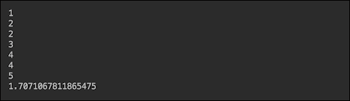

可以使用包`java.util.stream`以以下方式实现相同的功能（具有相同的输出）：

```java
void demo_Stream(){
    double a = IntStream.rangeClosed(1, 5)
        .peek(System.out::println)
        .filter(i -> i%2 == 0)
        .peek(System.out::println)
        .mapToDouble(i -> doSomething(i))
        .average().getAsDouble();
    System.out.println(a);
}
```

可以使用 RxJava 实现相同的功能：

```java
void demo_Observable1(){
    Observable.just(1,2,3,4,5)
        .doOnNext(System.out::println)
        .filter(i -> i%2 == 0)
        .doOnNext(System.out::println)
        .map(i -> doSomething(i))
        .reduce((r, d) -> r + d)
        .map(r -> r / 2)
        .subscribe(System.out::println);
}
```

RxJava 基于`Observable`对象（充当`Publisher`的角色）和订阅`Observable`并等待数据发出的`Observer`。从`Observable`到`Observer`的每个发出数据项（在链式操作中）都可以通过流畅风格中的操作进行处理（参见前面的代码）。每个操作都接受一个 lambda 表达式。操作功能从其名称中显而易见。

尽管可以表现得与流相似，但`Observable`具有显著不同的功能。例如，一旦流关闭，就不能重新打开，而`Observable`可以被重用。以下是一个例子：

```java
void demo_Observable2(){
    Observable<Double> observable = Observable
            .just(1,2,3,4,5)
            .doOnNext(System.out::println)
            .filter(i -> i%2 == 0)
            .doOnNext(System.out::println)
            .map(Demo05Reactive::doSomething);

    observable
            .reduce((r, d) -> r + d)
            .map(r -> r / 2)
            .subscribe(System.out::println);

    observable
            .reduce((r, d) -> r + d)
            .subscribe(System.out::println);
}
```

在前面的代码中，我们使用了两次`Observable`——一次用于计算平均值，一次用于求所有偶数平方根的总和。输出如下所示：

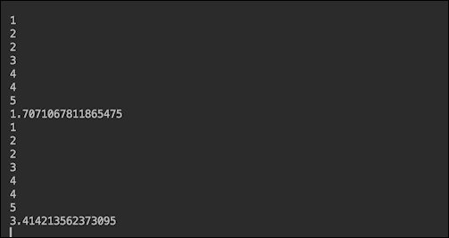

如果我们不希望`Observable`运行两次，我们可以通过添加`.cache()`操作来缓存其数据：

```java
void demo_Observable2(){
    Observable<Double> observable = Observable
            .just(1,2,3,4,5)
            .doOnNext(System.out::println)
            .filter(i -> i%2 == 0)
            .doOnNext(System.out::println)
            .map(Demo05Reactive::doSomething)
            .cache();

    observable
            .reduce((r, d) -> r + d)
            .map(r -> r / 2)
            .subscribe(System.out::println);

    observable
            .reduce((r, d) -> r + d)
            .subscribe(System.out::println);
}
```

之前代码的结果如下：

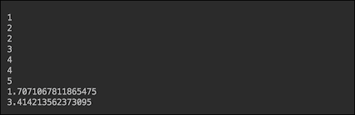

您可以看到，第二次使用相同的`Observable`利用了缓存的数据，从而提高了性能。

另一个 `Observable` 的优点是异常可以被 `Observer` 捕获：

```java
subscribe(v -> System.out.println("Result=" + v),
        e -> {
            System.out.println("Error: " + e.getMessage());
            e.printStackTrace();
        },
        () -> System.out.println("All the data processed"));
```

`subscribe()` 方法被重载，允许传入一个、两个或三个函数：

+   第一个是用于成功的情况

+   第二个是在发生异常时使用

+   第三个是在所有数据处理完毕后调用

`Observable` 模型还允许对多线程处理有更多的控制。在流中使用 `.parallel()` 不允许你指定要使用的线程池。但在 RxJava 中，你可以使用 `Observable` 中的 `subscribeOn()` 方法设置你喜欢的线程池类型：

```java
observable.subscribeOn(Schedulers.io())
        .subscribe(System.out::println);
```

`subscribeOn()` 方法告诉 `Observable` 在哪个线程上放置数据。`Schedulers` 类有生成线程池的方法，这些方法主要处理 I/O 操作（如我们的示例所示），或者计算密集型（方法 `computation()`），或者为每个工作单元创建一个新线程（方法 `newThread()`），以及其他几个，包括传入自定义线程池（方法 `from(Executor executor)`）。

本书格式不允许我们描述 RxJava API 和其他响应式流实现的全部丰富性。它们的主要思想反映在响应式宣言（[`www.reactivemanifesto.org/`](http://www.reactivemanifesto.org/））中，该宣言描述响应式系统作为新一代高性能软件解决方案。建立在异步消息驱动过程和响应式流之上，这些系统能够展示响应式宣言中声明的特性：

+   **弹性**：这可以根据需要根据负载进行扩展和收缩

+   **更好的响应性**：在这里，处理可以通过异步调用并行化

+   **弹性**：在这里，系统被分解成多个（通过消息松散耦合）组件，从而便于灵活的复制、包含和隔离

使用响应式流来实现之前提到的特性来编写响应式系统的代码构成了响应式编程。这种系统在当今的典型应用是微服务，这将在下一课中描述。

# 摘要

在本课中，我们讨论了通过使用多线程来提高 Java 应用程序性能的方法。我们描述了如何通过线程池减少创建线程的开销，以及适用于不同处理需求的多种类型的线程池。我们还提出了选择池大小时考虑的因素，以及如何同步线程，以确保它们不会相互干扰并产生最佳性能结果。我们指出，每个关于性能改进的决定都必须通过直接监控应用程序来做出和测试，我们讨论了通过编程和利用各种外部工具进行此类监控的可能选项。最后一步，JVM 调优，可以通过我们在相应部分列出的 Java 工具标志来完成。通过采用反应式编程的概念，还可以进一步提高 Java 应用程序的性能，我们将其作为最有效的向高度可扩展和高度性能的 Java 应用程序迈进的主要竞争者之一。

在下一课中，我们将讨论通过将应用程序拆分为几个微服务来添加更多工作者，每个微服务独立部署，并使用多个线程和反应式编程来提高性能、响应、可扩展性和容错性。

# 评估

1.  命名一个计算前 99999 个整数的平均平方根并将结果分配给一个可以随时访问的属性的方法。

1.  以下哪个方法创建了一个固定大小的线程池，可以安排在给定延迟后运行命令，或者定期执行：

    1.  `newscheduledThreadPool()`

    1.  `newWorkStealingThreadPool()`

    1.  `newSingleThreadScheduledExecutor()`

    1.  `newFixedThreadPool()`

1.  判断是否为 True 或 False：可以利用`Runnable`接口是一个函数式接口，并将必要的处理函数作为 lambda 表达式传递到新线程中。

1.  在调用`__________`方法后，不能再向池中添加更多工作线程。

    1.  `shutdownNow()`

    1.  `shutdown()`

    1.  `isShutdown()`

    1.  `isShutdownComplete()`

1.  ________ 基于`Observable`对象，该对象扮演发布者的角色。
