# 第一章：Java 9 入门

你想学习 Java，并且你有一个很好的理由。Java 是一种现代且成熟的编程语言，在许多行业中广泛使用，无论是电信、金融还是其他行业。Java 开发者的职位数量最多，可能也是薪酬最高的。这使语言对年轻专业人士来说具有吸引力。另一方面，这并非没有原因。Java 语言、工具以及围绕它的整个基础设施都是复杂和综合的。成为一名 Java 专业人士不是一天或一周就能发生的；这是一项多年的工作。要成为 Java 专家，你需要了解的不仅仅是编程语言，还包括面向对象编程原则、开源库、应用服务器、网络、数据库以及你可以成为专家的许多其他事物。尽管如此，学习语言是绝对必须的，所有其他实践都应建立在它之上。通过这本书，你将能够学习 Java 版本 9 以及更多内容。

在本章中，您将了解 Java 环境，并获得如何安装它、编辑示例代码、编译和运行 Java 的逐步指导。您将熟悉帮助开发的基本工具，无论是 Java 的一部分还是由其他供应商提供的。本章将涵盖以下主题：

+   Java 简介

+   安装 Windows、Linux 和 Mac OS X

+   执行`jshell`

+   使用其他 Java 工具

+   使用集成开发环境

# Java 入门

这就像在森林中走一条路。你可以专注于道路上的砾石，但这毫无意义。相反，你可以欣赏周围的环境，树木、鸟儿和周围的环境，这会更加愉快。这本书也是类似的，因为我不会只关注语言。不时地，我会涉及与道路接近的主题，并在你完成这本书后，给你一些概述和方向，告诉你可以进一步探索的地方。我不会只教你语言，还会稍微谈谈算法、面向对象编程原则、围绕 Java 开发的工具以及专业人士是如何工作的。这将会与我们将要遵循的编码示例混合在一起。最后，最后一章将完全致力于这个主题，即接下来要学习什么以及如何进一步成为专业的 Java 开发者。

到这本书印刷的时候，Java 将已经完成了 22 年的历史。[`www.oracle.com/technetwork/java/javase/overview/javahistory-index-198355.html`](http://www.oracle.com/technetwork/java/javase/overview/javahistory-index-198355.html)。在这段时间里，这种语言发生了很大的变化，并且变得更加完善。真正需要问的问题不是它已经存在了多久，而是它还能持续多久？学习这种语言是否仍然值得？自从 Java 诞生以来，已经发展出了许多新的语言([`blog.takipi.com/java-vs-net-vs-python-vs-ruby-vs-node-js-who-reigns-the-job-market/`](http://blog.takipi.com/java-vs-net-vs-python-vs-ruby-vs-node-js-who-reigns-the-job-market/))。这些语言更加现代，并且具有函数式编程特性，顺便说一句，Java 从版本 8 开始也拥有了这些特性。许多人认为 Java 已经是过去式——未来属于 Scala、Swift、Go、Kotlin、JavaScript 等语言。你可以将许多其他语言添加到这个列表中，并且对于每一种语言，你都可以找到一篇庆祝 Java 被埋葬的博客文章。对于这种担忧，有两种答案——一种是务实的商业方法，另一种则是更偏向于工程：

+   考虑到 COBOL 仍然在金融行业中积极使用，并且 COBOL 开发者的收入可能比 Java 开发者更高，所以说作为一名 Java 开发者，你将在接下来的 40 年内找到职位并不太冒险。就我个人而言，我愿意赌超过 100 年，但考虑到我的年龄，预测超过 20 到 40 年之后可能并不公平。

+   Java 不仅仅是一种语言；它也是一种技术，你将从这本书中了解到一些关于它的内容。这项技术包括 **Java 虚拟机**（**JVM**），通常被称为 JVM，并为许多语言提供了运行时环境。例如，Kotlin 和 Scala 无法在没有 JVM 的情况下运行。即使 Java 将被边缘化，JVM 仍然在企业场景中占据着领先地位。

理解和学习 JVM 的基本操作几乎和语言本身一样重要。Java 是一种编译和解释型语言。它是一种结合了两者最佳特性的特殊生物。在 Java 之前，存在解释型语言和编译型语言。

解释型语言是由解释器从源代码中读取，然后解释器执行代码。在这些语言中的每一个，都有一个初步的词法和语法分析步骤；然而，在那之后，作为程序本身的解释器由处理器执行，并且解释器持续不断地解释程序代码以了解应该做什么。编译型语言则不同。在这种情况下，源代码被编译成二进制（在 Windows 平台上是 `.exe` 文件），操作系统加载并直接执行。编译型程序通常运行得更快，但通常有一个较慢的编译阶段，可能会使开发速度变慢，并且执行环境不太灵活。Java 结合了这两种方法。

要执行 Java 程序，Java 源代码必须编译成 JVM 字节码（`.class`文件），然后由 JVM 加载并解释或编译。嗯...它是解释还是编译？Java 附带的是**即时编译（JIT）**器。这使得计算密集型的编译阶段和编译语言相对较慢。JVM 首先开始解释 Java 字节码，在执行这一过程的同时，它还会跟踪执行统计信息。当它收集到足够的代码执行统计信息时，它会编译成本地代码（例如，在 Intel/AMD 平台上的 x86 代码）以直接执行频繁执行的代码部分，并继续解释很少使用的代码片段。毕竟，为什么浪费昂贵的 CPU 时间来编译一些几乎从未使用过的代码呢？（例如，在启动时读取配置并在应用程序服务器重新启动之前不再执行的代码。）编译到字节码是快速的，并且只为有回报的代码段生成代码。

同样有趣的是，即时编译（JIT）利用代码执行的统计数据来优化代码。例如，如果它看到某个条件分支在 99%的情况下被执行，而另一个分支只在 1%的情况下被执行，那么它将生成运行快速的本地代码，从而优先考虑频繁执行的分支。如果该程序部分的行性行为随时间变化，并且统计数据表明比率发生了变化，JIT 会自动定期重新编译字节码。这一切都是自动的，并且是在幕后进行的。

除了自动编译之外，JVM 还有一个极其重要的特性——它管理 Java 程序的内存。现代语言的执行环境都这样做，Java 是第一个主流具有自动垃圾回收（GC）功能的语言。在 Java 之前，我用了 20 年的时间在 C 语言编程，跟踪所有内存分配并确保在程序不再需要时释放内存是一件非常痛苦的事情。在代码的某个点上忘记内存分配，以及长时间运行的程序会慢慢消耗所有内存。这些问题在 Java 中实际上已经不存在了。我们必须为此付出代价——GC 需要处理器容量和一些额外的内存，但在大多数企业应用程序中，我们并不缺少这些。一些特殊的程序，如控制重型卡车刹车的实时嵌入式系统可能没有这样的奢侈。这些程序仍然使用汇编或 C 语言编写。对于我们其他人来说，我们有 Java，尽管对于许多专业人士来说这可能看起来很奇怪，甚至*几乎实时*的程序，如高频交易应用程序，也是用 Java 编写的。

这些应用程序通过网络连接到证券交易所，并以毫秒级的速度买卖股票，以响应市场变化。Java 能够做到这一点。Java 的运行时环境，您需要用它来执行编译后的 Java 代码，这还包括 JVM 本身，其中包含允许 Java 程序访问网络、磁盘上的文件和其他资源的代码。为此，运行时包含高级类，代码可以实例化、执行，并完成底层工作。您也将这样做。这意味着实际的 Java 代码在想要使用或提供 REST 服务时，不需要处理 IP 数据包、TCP 连接，甚至 HTTP 处理。这些功能已经在运行时库中实现，应用程序程序员只需在代码中包含这些类，并在与程序匹配的抽象级别上使用它们提供的 API。当您用 Java 编程时，可以专注于您想要解决的真正问题，即业务代码，而不是底层系统代码。如果它不在标准库中，您可以在某些外部库的某个产品中找到它，而且很可能您还会找到一个针对该问题的开源解决方案。

这也是 Java 的一个优点。有大量的开源库可供各种用途使用。如果您在开始编写底层代码时找不到适合您问题的库，那么可能您正在做错事。这本书中有一些重要的话题，例如类加载器或反射，不是因为您每天都需要使用它们，而是因为它们被框架使用，了解它们有助于理解这些框架的工作原理。如果您不使用反射或编写自己的类加载器或直接编写多线程程序就无法解决问题，那么您可能选择了错误的框架。几乎肯定有一个好的选择：Apache 项目、Google 以及软件行业中的许多其他重要参与者都将他们的 Java 库作为开源发布。

这也适用于多线程编程。Java 从一开始就是一个多线程编程环境。JVM 和运行时支持执行代码的程序。执行在多个线程上并行运行。有一些运行时语言结构支持从非常低级到高抽象级别的并行执行程序。多线程代码利用多核处理器，这更加高效。这些处理器越来越普遍。20 年前，只有高端服务器才有多个处理器，只有 Digital Alpha 处理器具有 64 位架构和超过 100 MHz 的 CPU 时钟。10 年前，服务器端普遍采用多处理器结构，大约 5 年前，多核处理器出现在一些台式机和笔记本电脑上。今天，甚至移动电话也有。当 Java 在 1995 年开始时，创造它的天才们已经看到了这个未来。

他们设想 Java 是一种*一次编写，到处运行*的语言。在当时，该语言的首要目标是运行在浏览器中的 applet。如今，许多人（我也持有这种观点）认为 applet 是一个错误的目标，或者至少事情并没有以正确的方式进行。至于现在，您在互联网上遇到 applet 的频率比 Flash 应用程序或恐龙要低。 

然而，与此同时，Java 解释器也在没有任何浏览器的情况下执行服务器和客户端应用程序；此外，随着语言和执行环境的发展，这些应用领域变得越来越相关。如今，Java 的主要用途是企业计算和移动应用程序，主要是 Android 平台；对于未来，随着物联网（**IoT**）越来越成为焦点，该环境在嵌入式系统中的使用也在增长。

# 安装 Java

要开发、编译和执行 Java 程序，您将需要 Java 执行环境。由于我们通常用于软件开发的操作系统没有预先安装该语言，您将不得不下载它。尽管有多个语言的实现，但我建议您从 Oracle 下载软件的官方版本。Java 的官方网站是[`java.com`](http://java.com)，您可以从这里下载语言的最新版本。在撰写本书时，Java 的第九版尚未发布。一个早期预发布版本可以通过[`jdk9.java.net/`](http://jdk9.java.net/)下载。稍后，发布版本也将从这里提供。


您可以从这里下载的被称为早期访问版本的代码，仅供实验使用，任何专业人士都不应将其用于真正的专业目的

在该页面上，您必须点击单选按钮以接受许可协议。之后，您可以点击链接，直接开始下载安装包。该许可协议是一个特殊的早期访问许可版本，您作为专业人士应仔细阅读、理解，并且只有在您同意条款的情况下才接受。

有针对 Windows 32 位和 64 位系统、Mac OS X、Linux 32 位和 64 位版本、适用于 ARM 处理器的 Linux、适用于 SPARC 处理器系统的 Solaris 以及 Solaris x86 版本的单独安装包。由于您不太可能使用 Solaris，我将仅详细说明 Windows、Linux 和 Mac OS X 的安装过程。在后面的章节中，示例将始终是 Mac OS X，但既然 Java 是一种“一次编写，到处运行”的语言，安装后没有区别。目录分隔符可能不同，Windows 上的类路径分隔符是分号而不是冒号，终端或命令应用程序的外观和感觉也可能不同。然而，在重要的情况下，我会尽力不忘记提及。

为了让您感到困惑，每个操作系统版本的 Java 下载都列出了 JRE 和 JDK 的链接。**JRE**代表**Java 运行环境**，它包含运行 Java 程序所需的所有工具和可执行文件。**JDK**是**Java 开发工具包**，它包含开发 Java 程序所需的所有工具和可执行文件，包括 Java 程序的执行。换句话说，JDK 包含自己的 JRE。目前，您只需要下载 JDK。

在安装过程中，有一个重要的点在三个操作系统上都是相同的，您在安装前必须做好准备：安装 Java，您应该有管理员权限。

# Windows 上的安装

Windows 上的安装过程是从双击下载的文件开始的。它将启动安装程序，显示欢迎界面。

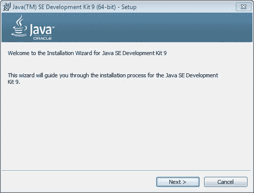

按下“下一步”按钮，我们会得到一个窗口，您可以在其中选择要安装的部分。让我们保留默认选择，这意味着我们将安装下载的所有 Java 部分，然后按下“下一步”按钮。下一个窗口是我们选择安装目标文件夹的地方。

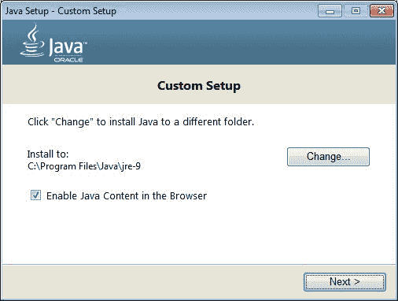

就目前而言，我们不更改安装程序选择的目录。按“下一步”。稍后，当您成为一名专业的 Java 开发者时，您可能决定将 Java 安装到不同的位置，但那时您已经必须知道自己在做什么。

您可能需要多次点击“下一步”按钮，然后安装程序完成。当被要求时，提供管理员密码，然后 Voilà！Java 已安装。这真的是非常常见的 Windows 安装过程。

最后一步是设置环境变量 `JAVA_HOME`。在 Windows 上，我们必须打开控制面板并选择“编辑账户环境变量”菜单。

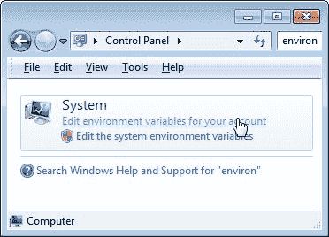

这将打开一个新窗口，我们应该使用它来为当前用户创建一个新的环境变量。

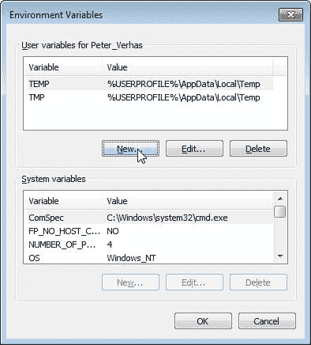

新变量的名称必须是 `JAVA_HOME`，其值应指向 JDK 的安装目录。

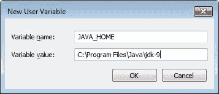

在大多数系统中，此值是 C:Program FilesJavajdk-9\. 这被许多 Java 程序和工具用来定位 Java 运行时。

# MAC OS X 上的安装

在本节中，我们将逐步介绍如何在 OS X 平台上安装 Java。我将描述本书编写时发布的版本安装过程。至于现在，Java 9 预览版安装可能有些棘手。很可能 Java 9 版本的安装步骤与 Java 8 更新 92 相似或相同。

OS X 版本的 Java 以 `.dmg` 文件的形式提供。这是 OS X 的打包格式。要打开它，只需在浏览器保存文件的 `下载` 文件夹中双击文件，操作系统将文件挂载为只读磁盘镜像。

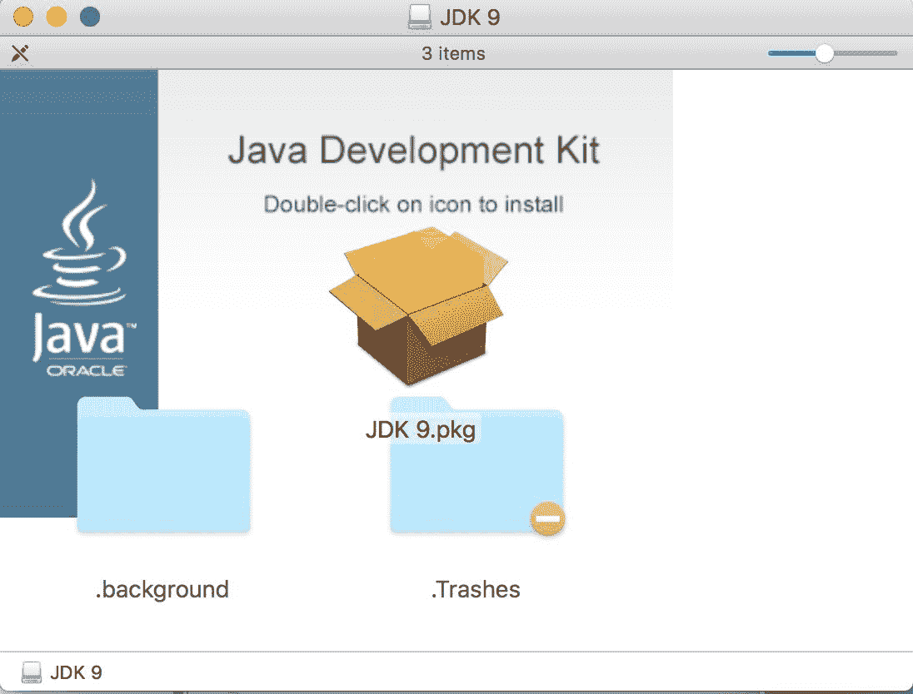

该磁盘上只有一个文件：安装镜像。在 Finder 应用程序中双击文件名或图标，安装过程将开始。

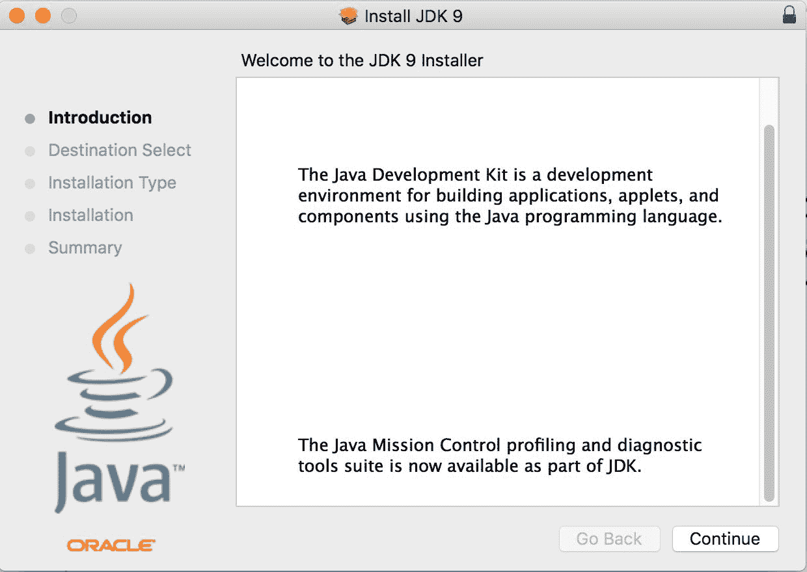

首次打开的屏幕是欢迎屏幕。点击继续，您将看到显示将要安装内容的摘要页面。

您会看到一个标准的 Java 安装并不奇怪。这次，按钮的名称是安装。点击它，您将看到以下内容：

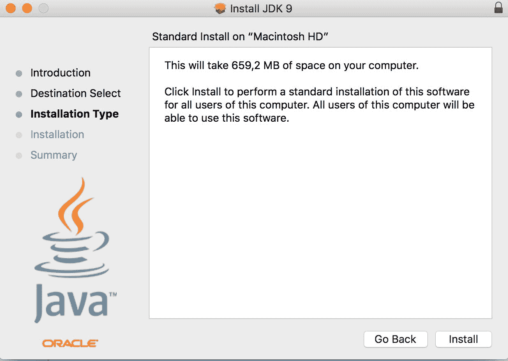

这是您必须提供管理员用户登录参数（用户名和密码）的时候。提供后，安装开始，几秒钟后，您将看到一个摘要页面。

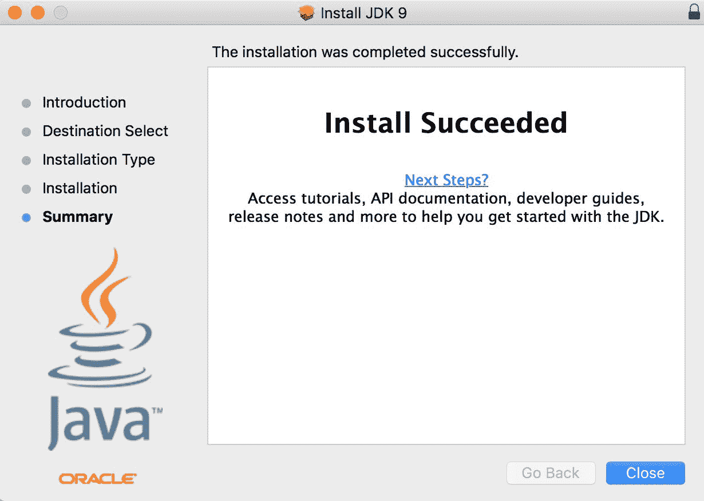

点击关闭，您就准备好了。您已经在您的 Mac 上安装了 Java。可选地，您可以卸载安装磁盘，稍后也可以删除 `.dmg` 文件。您不需要它，如果您需要，您可以从 Oracle 下载它。

最后，需要检查安装是否成功。实践是检验真理的唯一标准。启动一个终端窗口，在提示符下输入 `java -version`，Java 将告诉您已安装的版本。

在下一张屏幕截图中，您可以看到我的工作站上的输出以及切换不同 Java 版本时有用的 Mac OS 命令：

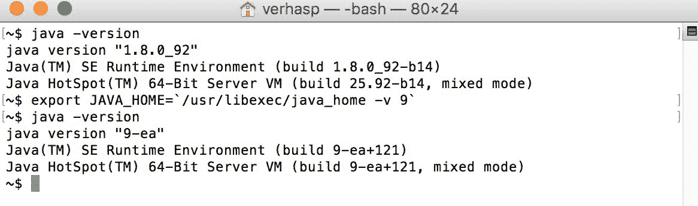

在屏幕截图中，您可以看到我已经安装了 Java JDK 1.8u92 版本，同时，我还安装了一个 Java 9 预发布版本，我将用它来测试本书中 Java 的新特性。

# Linux 上的安装

根据 Linux 的版本，有几种方法可以在 Linux 上安装 Java。在这里，我将描述一种在所有版本上大致相同的方法。我使用的是 Debian。

第一步与其他任何操作系统相同：下载安装包。在 Linux 的情况下，您应该选择以`tar.gz`结尾的包。这是一种压缩归档格式。您还应该仔细选择与您的机器处理器和操作系统的 32/64 位版本相匹配的包。下载完包后，您必须切换到 root 模式，发出`su`命令。这是截图上显示的安装命令中的第一个命令。

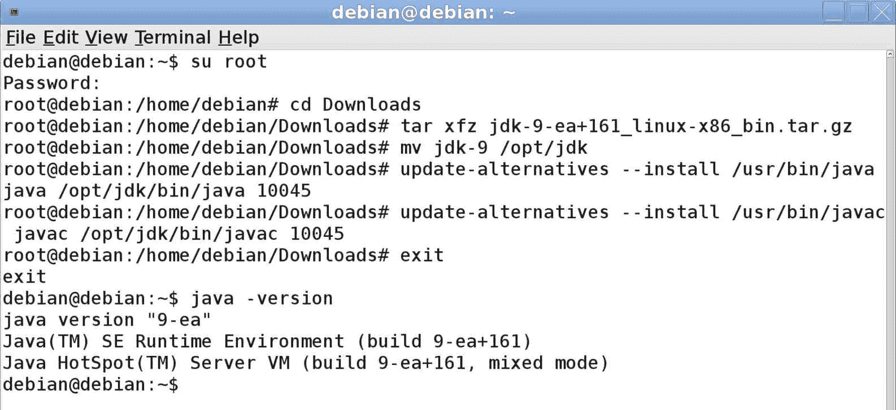

`tar`命令将归档解压缩到子文件夹中。在 Debian 中，此子文件夹必须移动到`/opt/jdk`，并使用`mv`命令来完成此操作。这两个`update-alternatives`命令是 Debian 特有的。这些告诉操作系统，如果已经安装了较旧的 Java，则使用新安装的 Java。我用来在虚拟机上测试和演示安装过程的 Debian 带有 7 年前的 Java 版本。

安装的最后一步与其他任何操作系统相同：通过发出`java -version`命令来检查安装是否成功。在 Linux 的情况下，这一点尤为重要，因为安装过程不会检查下载的版本是否与操作系统和处理器架构相匹配。

# 设置 JAVA_HOME

`JAVA_HOME`环境变量在 Java 中扮演着特殊角色。尽管 JVM 可执行文件`java.exe`或`java`位于`PATH`中（因此您可以在命令提示符（终端）中通过输入名称`java`来执行它，而不需要指定目录），但建议您使用正确的 Java 安装来设置此环境变量。变量的值应指向已安装的 JDK。有许多 Java 相关程序，例如 Tomcat 或 Maven，它们使用此变量来定位已安装和当前使用的 Java 版本。在 Mac OS X 中，设置此变量是不可避免的。

在 OS X 中，当您输入`java`时开始执行的程序是一个包装器，它首先查看`JAVA_HOME`以决定启动哪个 Java 版本。如果此变量未设置，那么 OS X 将自行决定，从可用的已安装 JDK 版本中选择。要查看可用的版本，您可以发出以下命令：

```java
    ~$ /usr/libexec/java_home -V
Matching Java Virtual Machines (10):
 9, x86_64:    "Java SE 9-ea"    /Library/Java/JavaVirtualMachines/jdk-9.jdk/Contents/Home
 1.8.0_92, x86_64:    "Java SE 8"    /Library/Java/JavaVirtualMachines/jdk1.8.0_92.jdk/Contents/Home
 1.7.0_60, x86_64:    "Java SE 7"    /Library/Java/JavaVirtualMachines/jdk1.7.0_60.jdk/Contents/Home
/Library/Java/JavaVirtualMachines/jdk-9.jdk/Contents/Home

```

然后，您将获得已安装 JDK 的列表。请注意，命令是小写的，但选项是大写的。如果您不向程序提供任何选项和参数，它将简单地返回它认为最新且最适合目的的 JDK。正如我从我的终端窗口复制了命令输出一样，您可以看到我在我的机器上安装了相当多的 Java 版本。

程序响应的最后一行是 JDK 的主目录，这是默认的。你可以使用一些 bash 编程来设置你的 `JAVA_HOME` 变量：

```java
    export JAVA_HOME=$(/usr/libexec/java_home)

```

你可以将这个文件放在你的 `.bashrc` 文件中，每次启动终端应用程序时都会执行它，因此 `JAVA_HOME` 将始终被设置。如果你想使用不同的版本，可以使用 `-v`（这次是小写的选项）来指定相同的实用程序，如下所示：

```java
    export JAVA_HOME=$(/usr/libexec/java_home -v 1.8)

```

参数是你想要使用的 Java 版本。请注意，这个版本号变成了：

```java
    export JAVA_HOME=$(/usr/libexec/java_home -v 9)

```

如果你想使用 Java JDK 预览版而不是 1.9，对于这个事实没有解释——这就是生活。

注意，还有一个对 Java 很重要的环境变量——`CLASSPATH`。我们稍后会讨论它。

# 执行 jshell

既然我们已经花费了很多时间安装 Java，现在是时候稍微烧一下手指了。因为我们使用的是 Java 9，所以有一个新的工具可以帮助开发者与语言互动。这是一个 **读取-评估-打印-循环**（**REPL**）工具，许多语言工具集都包含这个工具，Java 也有实现，但 9 版本是第一个包含这个功能的版本。

REPL 是一个具有交互式提示和可以直接输入而无需编辑独立文件的命令语言的工具。输入的命令将被直接执行，然后循环再次开始，等待用户输入下一个命令。这是一个非常有效的工具，可以在不等待编辑、编译和加载的情况下尝试一些语言结构。这些步骤由 REPL 工具自动且透明地完成。

Java 9 中的 REPL 工具被称为 jshell。要启动它，只需输入其名称。如果它不在 `PATH` 中，那么输入与 Java 9 一起安装的 jshell 的完整路径，如下面的示例所示：

```java
    $ jshell
|  Welcome to JShell -- Version 9-ea
|  For an introduction type: /help intro
jshell> 

```

jshell 以交互式方式启动，它显示的提示符是 `jshell>`，以帮助您识别 jshell 是否正在运行以及您输入的内容是否被程序读取而不是操作系统 shell。由于这是您第一次启动 jshell，它会告诉您输入 `/help intro`。让我们试试。它将打印出有关 jshell 的简短文本，如下面的代码所示：

```java
    jshell> /help intro
| 
|  intro
| 
|  The jshell tool allows you to execute Java code, getting immediate results.
|  You can enter a Java definition (variable, method, class, etc), like:  int x = 8
|  or a Java expression, like:  x + x
|  or a Java statement or import.
|  These little chunks of Java code are called 'snippets'.
| 
|  There are also jshell commands that allow you to understand and
|  control what you are doing, like:  /list
| 
|  For a list of commands: /help

```

好吧，所以我们可以输入 Java 片段和 `/list`，但这只是可用命令的一个例子。我们可以通过输入 `/help` 来获取更多信息，如下面的代码所示：

```java
    jshell> /help
|  Type a Java language expression, statement, or declaration.
|  Or type one of the following commands:
|     /list [<name or id>|-all|-start]                             -- list the source you have typed
|     /edit <name or id>                                           -- edit a source entry referenced by name or id
|     /drop <name or id>                                           -- delete a source entry referenced by name or id
|     /save [-all|-history|-start] <file>                          -- Save snippet source to a file.
...

Hello World example:
```

```java
    jshell> System.out.println("Hello World!")
Hello World!

```

这是 Java 中最短的 Hello World 程序。在 Java 9 之前，如果你想做的只是打印出 `Hello World!`，你必须创建一个程序文件。它必须包含一个类的源代码，包括 `public static main` 方法，这个方法包含了我们在 Java 9 jshell 中必须输入的那一行。仅仅为了简单的打印示例代码，这很麻烦。现在它要容易得多，jshell 也更加宽容，允许我们在行尾省略分号。

我们接下来应该尝试的是声明一个变量，如下所示：

```java
    jshell> int a = 13
a ==> 13
jshell> 

```

我们声明了一个名为 `a` 的变量，并将其值赋给它-`13`。该变量的类型是 `int`，这是 Java 中整数类型的缩写。现在这个变量已经在我们片段中了，所以如果我们想的话可以打印出来，如下所示：

```java
    jshell> System.out.println(a)
13

```

是时候在 jshell 中输入比单行更复杂的代码了。

```java
    jshell> void main(String[] args){
 ...>  System.out.println("Hello World")
 ...> }
|  Error:
|  ';' expected
|   System.out.println("Hello World")
| 

```

jshell 识别出这不是一条单行命令，并且它无法处理我们之前输入的内容，当我们按下第一行末尾的 *Enter* 键时，它会提示我们输入更多的字符，因此它显示 `...>` 作为续行提示。我们输入组成整个 hello world `main` 方法的命令，但这次 jshell 不允许我们遗漏分号。这只有在单行片段的情况下才被允许。由于 jshell 是交互式的，所以很容易纠正错误；按上箭头键几次以获取上一行，这次在第二行的末尾添加分号：

```java
    jshell> void main(String[] args){
 ...>  System.out.println("Hello World");
 ...> }
|  created method main(String[])

```

这个方法是为我们创建的片段，现在我们可以调用它：

```java
    jshell> main(null)
Hello World

```

它确实工作了。你可以列出创建的所有片段，如下所示：

```java
    jshell> /list
 1 : System.out.println("Hello World!")
 2 : int a = 13;
 3 : System.out.println(a)
 4 : void main(String[] args){
 System.out.println("Hello World");
 }

```

而且，既然我们想要继续编写一个完整的 Java 版本的 *hello world*，我们可以将我们的工作从 jshell 保存到文件中，如下所示：

```java
    jshell> /save HelloWorld.java

```

最后，我们通过输入 `/exit` 退出了 jshell。当你回到系统提示符时，输入 `cat HelloWorld.java`（或在 Windows 上输入 `type HelloWorld.java`）以查看文件的内容。如下所示：

```java
    $ cat HelloWorld.java
System.out.println("Hello World!")
int a = 13;
System.out.println(a)
void main(String[] args){
 System.out.println("Hello World");
 }

```

该文件包含我们依次输入的所有片段。如果你认为你弄乱了 shell，有很多不再需要的变量和代码片段，你可以发出 `/reset` 命令：

```java
    jshell> /reset
|  Resetting state.

```

在此命令之后，jshell 和它早期启动时一样干净

```java
    jshell> /list

jshell>

```

仅列出不会产生任何内容，因为我们已经删除了所有内容。幸运的是，我们已经将 jshell 的状态保存到了文件中，我们也可以通过发出 `/open` 命令来加载文件的内容：

```java
    jshell> /open HelloWorld.java
Hello World!
13

```

它从文件中加载行并执行它，就像字符被输入到命令提示符中一样。

```java
/edit command followed by the number of the snippet:
```

```java
    jshell> /edit 1

```

你可能还记得我们输入的第一个命令是 `System.out.println` 系统调用，它将参数打印到控制台。在 `/edit 1` 命令后按下 *Enter* 键后，你不会得到提示符。相反，jshell 打开一个包含要编辑片段的独立图形编辑器，如下所示：

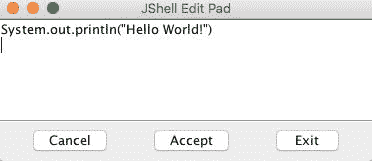

编辑框中的文本，使其看起来像这样：

```java
    printf("Hello World!")

```

点击接受然后退出。当你点击接受时，终端将执行片段并显示以下结果：

```java
    Hello World!

```

我们使用的 `printf` 方法代表格式化打印。这可能在许多其他语言中很常见。它最初由 C 语言引入，尽管名字晦涩，但名字保留了下来。这也是标准 Java 类 `PrintStream` 的一部分，就像 `println` 一样。在 `println` 的情况下，我们必须在方法名前写 `System.out`。在 `printf` 的情况下，我们不需要。为什么？

原因是 jshell 定义了一些片段，这些片段在 jshell 启动或重置时自动加载。如果你发出带有 `-start` 选项的 `/list` 命令，你可以看到这些片段，如下所示：

```java
    jshell> /list -start

 s1 : import java.util.*;
 s2 : import java.io.*;
 s3 : import java.math.*;
 s4 : import java.net.*;
 s5 : import java.util.concurrent.*;
 s6 : import java.util.prefs.*;
 s7 : import java.util.regex.*;
 s8 : void printf(String format, Object... args) { System.out.printf(format, args); }

printf, which is also the name of a method in the PrintStream class.
```

如果你想要列出你输入的所有片段以及预定义的片段，以及那些包含某些错误因此未执行的片段，你可以使用 `/list` 命令的 `-all` 选项，如下所示：

```java
    jshell> /list -all

...
 s7 : import java.util.regex.*;
...
 1 : System.out.println("Hello World!")
...
 e1 : System.out.println("Hello World!")
 int a = 14;
 5 : System.out.println("Hello World!");
...

```

为了简洁，一些行已被从实际输出中删除。预加载的行带有 `s` 前缀进行编号。包含错误的片段带有 `e` 前缀的编号。

如果你想要再次执行一些代码片段，你只需要在相应位置输入 `/n`，其中 `n` 是片段的编号，如下所示：

```java
    jshell> /1
System.out.println("Hello World!")
Hello World!

```

你不能重新执行预加载的片段或包含错误的片段。实际上，这些都不需要。预加载的片段声明了一些导入并定义了一个片段方法；错误的片段由于是错误的，所以无法执行。

```java
/-n. Here, n is the number of the snippet counting from the last one. So, if you want to execute the very last snippet, then you have to write /-1. If you want to execute the one before the last one, you have to write /-2. Note that if you already typed /-1, then the last one is the re-execution of the last snippet and snippet number -2 will become number -3.
```

通过其他方式也可以避免列出所有片段。当你只对某些类型的片段感兴趣时，你可以使用特殊的命令。

如果我们只想看到在片段中定义的变量，那么我们可以发出 `/vars` 命令，如下所示：

```java
    jshell> /vars
|    int a = 13

```

如果我们只想看到类，可以使用 `command/types` 命令：

```java
    jshell> class s {}
|  created class s

jshell> /types
|    class s

```

这里，我们只是创建了一个空类，然后列出了它。

要列出在片段中定义的方法，可以发出 `/methods` 命令：

```java
    jshell> /methods
|    printf (String,Object...)void
|    main (String[])void

```

你可以在输出中看到，只有两个方法，如下所示：

+   `printf`：这是在预加载的片段中定义的

+   `main`：这是我们定义的

如果你想要查看你输入的所有内容，你必须为所有输入的片段和命令发出 `/history` 命令。（我不会在这里复制输出；我不想让自己难堪。你应该亲自尝试并查看你自己的历史。）

回想一下，我们可以通过发出 `/reset` 命令来删除所有片段。你还可以单独删除片段。为此，你应该发出 `/drop n` 命令，其中 `n` 是片段编号：

```java
    jshell> /drop 1
|  This command does not accept the snippet '1' : System.out.println("Hello World!")
|  See /types, /methods, /vars, or /list

1 was executed and the /drop command actually drops the defined variable, type, or method. There is nothing to be dropped in the first snippet. But, if we reissue the /list command, we will get the following results:
```

```java
    jshell> /list

 1 : System.out.println("Hello World!")
 2 : int a = 13;
 3 : System.out.println(a)
 4 : void main(String[] args){
 System.out.println("Hello World");
 }

```

我们可以看到，我们也可以删除第二个或第四个片段：

```java
    jshell> /drop 2
|  dropped variable a

jshell> /drop 4
|  dropped method main(String[])

```

jshell 的错误信息提示查看 `/types`、`/methods`、`/vars` 或 `/list` 命令的输出。问题是 `/types`、`/methods` 和 `/vars` 并不显示片段的编号。这很可能是 jshell 预发布版本中的一个小的错误，可能在 JDK 发布时得到修复。

当我们编辑片段时，jshell 打开了一个单独的图形编辑器。可能的情况是，你正在远程服务器上使用 ssh 运行 jshell，并且无法打开一个单独的窗口。你可以使用 `/set` 命令设置编辑器。这个命令可以设置 jshell 的许多配置选项。要使用无处不在的 vi 设置编辑器，请发出以下命令：

```java
    jshell> /set editor "vi"
|  Editor set to: vi

```

之后，jshell 将在你发出`/edit`命令的同一终端窗口中打开内嵌的 vi。

不仅编辑器可以设置。你可以设置启动文件，以及 jshell 在执行命令后如何将反馈打印到控制台。

如果你设置了启动文件，那么在`/reset`命令之后，将执行启动文件中列出的命令，而不是 jshell 的内置命令。这也意味着你将无法直接使用默认导入的类，并且你将没有`printf`方法片段，除非你的启动文件包含导入和片段的定义。

创建以下内容的`sample.startup`文件：

```java
void println(String message) { System.out.println(message); }

```

启动一个新的 jshell 并执行它如下所示：

```java
    jshell> /set start sample.startup

jshell> /reset
|  Resetting state.

jshell> println("wuff")
wuff

jshell> printf("This won't work...")
|  Error:
|  cannot find symbol
|    symbol:   method printf(java.lang.String)
|  printf("This won't work...")
|  ^----^

```

`println`方法已定义，但默认启动中定义的`printf`方法没有。

反馈定义了 jshell 打印的提示，然后等待输入，继续行的提示，以及每个命令后的消息详情。有预定义的模式，如下所示：

+   普通

+   静默

+   简洁

+   详细

默认选择普通。如果你发出`/set feedback silent`命令，则提示变为`->`，jshell 将不会打印关于命令的详细信息。`/set feedback concise`代码打印更多一些信息，而`/set feedback verbose`则打印关于执行命令的详细信息：

```java
    jshell> /set feedback verbose
|  Feedback mode: verbose

jshell> int z = 13
z ==> 13
|  modified variable z : int
|    update overwrote variable z : int

```

你也可以定义自己的模式，使用`/set mode xyz`命令给新模式命名，其中`xyz`是新模式的名称。之后，你可以为该模式设置提示、截断和格式。当格式定义后，你可以像使用内置模式一样使用它。

最后，但同样重要的是，jshell 最重要的命令是`/exit`。这将仅终止程序，然后你将返回到操作系统 shell 提示符。

现在，让我们编辑`HelloWorld.java`文件以创建我们的第一个 Java 程序。为此，你可以使用 vi、记事本、Emacs 或你机器上可用的任何东西，只要它适合你。稍后，我们将使用一些集成开发环境（IDE），如 NetBeans、Eclipse 或 IntelliJ；然而，现在一个简单的文本编辑器就足够了。

编辑文件，使其内容如下所示：

```java
public class HelloWorld { 
  public static void main(String[] args){ 
        System.out.println("Hello World"); 
       } 
  }

```

要将源代码编译成可由 JVM 执行的字节码，我们必须使用名为`javac`的 Java 编译器：

```java
    javac HelloWorld.java

```

这将在当前目录中生成`java.class`文件。这是一个可执行的编译代码，可以按照以下方式执行：

```java
    $ java HelloWorld
Hello World

```

使用这个命令，你已经创建并执行了你的第一个完整的 Java 程序。你可能还在想我们在做什么。如何和为什么，我会解释；但首先，我想让你有一种感觉，它确实可以工作。

```java
main method and we inserted the declaration of the class around it.
```

在 Java 中，你不能像许多其他语言那样有独立的方法或函数。每个方法都属于某个类，每个类都应该在单独的文件中声明（好吧，几乎是这样，但现在让我们跳过例外）。文件名必须与类名相同。编译器要求 `public` 类必须这样做。即使是非 `public` 类，我们通常也遵循这个约定。如果你将文件名从 `HelloWorld.java` 改为 `Hello.java`，当你尝试用新名称编译文件时，编译器会显示错误。

```java
    $ mv HelloWorld.java Hello.java
~/Dropbox/java_9-by_Example$ javac Hello.java
Hello.java:2: error: class HelloWorld is public, should be declared in a file named HelloWorld.java
public class HelloWorld {
 ^
1 error

```

因此，让我们将其改回原始名称：`mv Hello.java HelloWorld.java`。

类的声明从关键字 `class` 开始，然后是类的名称，一个开括号，直到匹配的闭括号。其中之间的一切都属于该类。

现在，让我们跳过为什么我在类名前写 `public`，而专注于其中的主方法。由于该方法不返回任何值，因此它的返回值是 `void`。参数名为 `args`，是一个字符串数组。当 JVM 启动 `main` 方法时，它会将命令行参数传递给程序的这个数组。然而，这次我们不使用它。`main` 方法包含打印出 `Hello World` 的行。现在，让我们更详细地检查这一行。

在其他语言中，将内容打印到控制台只需要一个 `print` 语句或一个非常类似的命令。我记得一些 BASIC 解释器甚至允许我们用 `?` 代替 `print`，因为打印到屏幕非常常见。在过去 40 年中，这种情况发生了很大变化。我们现在使用图形屏幕、互联网以及许多其他输入和输出通道。如今，将内容写入控制台并不常见。

通常，在专业的企业级大型应用中，甚至没有一行代码是做这个的。相反，我们会将文本直接导向日志文件，通过消息队列发送消息，以及通过 TCP/IP 协议发送请求并接收响应。由于这种情况很少使用，所以在语言中创建一个快捷方式没有必要。在编写了几个程序之后，当你熟悉了调试器和日志功能时，你将不会直接将任何内容打印到控制台。

尽管如此，Java 具有一些特性，允许你以最初为 UNIX 设计的“老方法”直接将文本发送到进程的标准输出。在 Java 中，所有东西都必须是一个对象或类，因此这是以 Java 方式实现的。要访问系统输出，有一个名为 `System` 的类，它包含以下三个变量：

+   `in`：这是标准输入流

+   `out`：这是标准输出流

+   `err`：这是标准错误流

要引用输出流变量，因为它不在我们的类中，而是在`System`中，我们必须指定类名，因此我们将在程序中将其称为`System.out`。这个变量的类型是`PrintStream`，它也是一个类。在 Java 中，类和类型是同义词。每个类型为`PrintStream`的对象都有一个名为`println`的方法，它接受一个`String`。如果实际的打印流是标准输出，并且我们是从命令行执行 Java 代码，那么字符串就会被发送到控制台。

该方法被命名为`main`，在 Java 程序中这是一个特殊的名称。当我们从命令行启动 Java 程序时，JVM 会从我们在命令行上指定的类中调用名为`main`的方法。它可以这样做，因为我们声明了这个方法为`public`，这样任何人都可以看到并调用它。如果它是`private`的，那么它只能从定义在同一个源文件中的同一个类或类中看到和调用。

该方法也被声明为`static`，这意味着它可以在不实际实例化包含这些方法的类的情况下被调用。如今，使用静态方法通常被认为不是一种好的做法，除非它们实现的是根本无法与实例相关联的功能，或者有不同实现，例如`java.lang.Math`类中的函数；但是，代码执行必须从某个地方开始，Java 运行时通常不会自动为我们创建类的实例。

要启动代码，命令行应该如下所示：

```java
    java -cp . HelloWorld

```

`-cp`选项代表类路径。对于 Java 来说，类路径是一个相当复杂的概念，但就目前而言，让我们简单地说，它是一个包含我们的类的目录和 JAR 文件的列表。类路径的列表分隔符在 UNIX-like 系统中是`:`（冒号），在 Windows 中是`;`（分号）。在我们的情况下，类路径是实际的目录，因为 Java 编译器就是在那里创建了`HelloWorld.class`。如果我们没有在命令行上指定类路径，Java 将使用当前目录作为默认值。这就是为什么我们的程序最初在没有`-cp`选项的情况下也能工作。

`java`和`javac`都处理许多选项。要获取选项列表，请输入`javac -help`或`java -help`。我们使用 IDE 来编辑代码，并且在开发过程中，我们经常使用 IDE 来编译、构建和运行代码。在这种情况下，环境设置了合理的参数。对于生产，我们使用支持环境配置的构建工具。正因为如此，我们很少遇到这些命令行选项。尽管如此，专业人士至少需要理解它们的含义，并且知道在哪里学习它们实际的使用方法，以防万一需要。

# 查看字节码

类文件是一个二进制文件。这种格式的最主要作用是让 JVM 执行，并在代码使用库中的某些类时为 Java 编译器提供符号信息。当我们编译包含 `System.out.println` 的程序时，编译器会查看编译后的 `.class` 文件，而不是源代码。它必须找到名为 `System` 的类、名为 `out` 的字段和 `println` 方法。当我们调试一段代码或试图找出为什么程序找不到类或方法时，我们需要一种方法来查看 `.class` 文件的二进制内容。这不是日常任务，需要一些高级知识。

要做到这一点，有一个可以以或多或少可读的格式显示 `.class` 文件内容的 *反汇编器*。这个命令叫做 `javap`。要执行它，你可以发出以下命令：

```java
    $ javap HelloWorld.class
Compiled from "HelloWorld.java"
public class HelloWorld {
 public HelloWorld();
 public static void main(java.lang.String[]);
}

```

程序的输出显示，类文件包含一个名为 `HelloWorld()` 的 Java 类；这似乎是一个与类名相同的名称的方法，它还包含我们编写的那个方法。

与类名相同名称的 *方法* 是类的构造函数。由于 Java 中的每个类都可以被实例化，因此需要一个构造函数。如果我们不提供，那么 Java 编译器会为我们创建一个。这就是默认构造函数。默认构造函数没有做任何特殊的事情，只是返回一个新实例。如果我们自己提供一个构造函数，那么 Java 编译器就不会费心创建一个。

`javap` 反汇编器不会显示方法内部的内容或它包含的 Java 代码，除非我们提供 `-c` 选项：

```java
    $ javap -c HelloWorld.class
Compiled from "HelloWorld.java"
public class HelloWorld {
 public HelloWorld();
 Code:
 0: aload_0
 1: invokespecial #1                  // Method java/lang/Object."<init>":()V
 4: return
 public static void main(java.lang.String[]);
 Code:
 0: getstatic     #2                  // Field java/lang/System.out:Ljava/io/PrintStream;
 3: ldc           #3                  // String hali
 5: invokevirtual #4                  // Method java/io/PrintStream.println:(Ljava/lang/String;)V
 8: return
}

```

它非常晦涩难懂，不是普通人类能理解的。只有少数处理 Java 代码生成的专家才能流畅地阅读它。但是，看看它可以帮助你了解字节码的含义。它就像一个古老的汇编语言。尽管这是二进制代码，但其中并没有什么秘密：Java 是开源的，类文件格式有很好的文档记录，并且对专家来说是可调试的。

# 将类打包到 JAR 文件中

当你交付一个 Java 应用程序时，通常代码会被打包成 JAR、WAR、EAR 或其他一些打包格式。我们再次学到一些看似晦涩难懂的东西，但实际上，这并不复杂。它们都是 ZIP 文件。你可以使用 WinZip 或其他有许可证的压缩管理器打开这些文件。额外的要求是，例如，在 JAR 文件的情况下，归档应包含一个名为 `META-INF` 的目录，并在其中包含一个名为 `MANIFEST.MF` 的文件。这个文件是一个文本文件，包含以下格式的元信息：

```java
Manifest-Version: 1.0 
Created-By: 9-ea (Oracle Corporation)

```

文件中可能包含很多其他信息，但如果我们使用以下命令将类文件打包到 jar 中，Java 提供的工具 `jar` 会放入这些信息的最小版本：

```java
         jar -cf hello.jar HelloWorld.class

```

`-c`选项告诉 JAR 归档器创建一个新的 JAR 文件，而`f`选项用于指定新存档的名称。我们在这里指定的是`hello.jar`，添加到其中的是类文件。

打包的 JAR 文件也可以用来启动 Java 应用程序。Java 可以直接从 JAR 存档中读取并从那里加载类。唯一的要求是它们必须在类路径上。

注意，您不能将单个类放在类路径上，只能是目录。由于 JAR 文件是包含内部目录结构的存档，它们的行为就像目录一样。

使用`ls hello.jar`检查 JAR 文件是否已创建，并删除`rm HelloWorld.class`类文件，只是为了确保当我们发出命令行时，代码是从 JAR 文件而不是从类中执行的。

```java
    $ java -cp hello.jar HelloWorld
Hello World

```

然而，要查看 JAR 文件的内容，建议您使用 JAR 工具而不是 WinZip，尽管这可能更舒适。真正的专业人士使用 Java 工具来处理 Java 文件。

```java
$ jar -tf hello.jar 
META-INF/ 
META-INF/MANIFEST.MF 
HelloWorld.class

```

# 管理正在运行的 Java 应用程序

JDK 附带的一套 Java 工具支持运行和管理正在运行的 Java 应用程序。为了有一个在执行时我们可以管理的程序，我们需要一个不仅运行几毫秒，而且在运行时还会向控制台打印一些内容的代码。让我们创建一个名为`HelloWorldLoop.java`的新程序，其内容如下：

```java
public class HelloWorldLoop { 
  public static void main(String[] args){ 
       for( ;; ){ 
         System.out.println("Hello World"); 
         } 
       } 
  }

```

程序包含一个`for`循环。循环允许重复执行代码块，我们将在第二章，“第一个真正的 Java 程序 - 排序姓名”中讨论它们。我们在这里创建的循环是一个特殊的循环，它永远不会终止，而是重复打印方法调用，打印`Hello World`，直到我们通过按*Ctrl* + *c*或发出 Linux 或 OSX 上的`kill`命令或通过 Windows 的任务管理器终止程序来结束程序。

在一个窗口中编译并启动它，然后打开另一个终端窗口来管理应用程序。

我们首先应该熟悉的是`jps`命令。[`docs.oracle.com/javase/7/docs/technotes/tools/share/jps.html`](http://docs.oracle.com/javase/7/docs/technotes/tools/share/jps.html)它列出了在机器上运行的 Java 进程，如下所示：

```java
$ jps 
21873 sun.tools.jps.Jps 
21871 HelloWorldLoop

```

您可以看到有两个进程——一个是我们要执行的程序，另一个是`jps`程序本身。不出所料，jps 工具也是用 Java 编写的。您也可以向`jps`传递选项，这些选项在网上有文档说明。

有许多其他工具，我们将考察其中之一，这是一个非常强大且易于使用的工具——Java VisualVM。

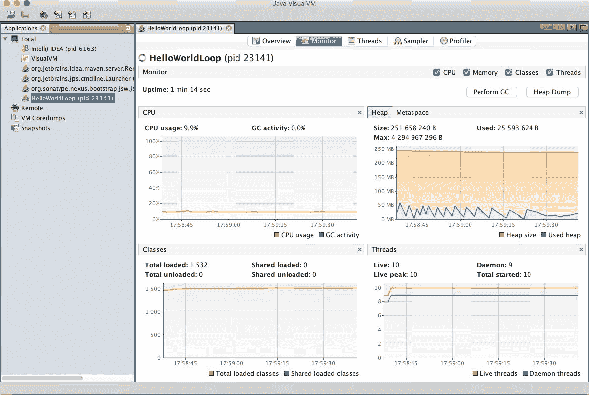

VisualVM 是一个连接到正在运行的 Java 进程的命令行图形工具，它显示了不同的性能参数。要启动 VisualVM 工具，您将发出不带任何参数的`jvisualvm`命令。很快，一个窗口就会出现，左侧有一个探索树，右侧有一个欢迎面板。左侧显示了名为“本地”的分支下所有正在运行的 Java 进程。如果您双击`HelloWorldLoop`，它将在右侧面板中打开进程的详细信息。在标题选项卡上，您可以选择概览、监控、线程、采样器和分析器。前三个选项卡是最重要的，它们可以给您一个关于 JVM 中线程数量、CPU 使用率、内存消耗等方面的良好视图。

# 使用 IDE

集成开发环境是出色的工具，通过从开发者的肩上卸下机械任务来帮助开发。它们在我们编写代码时会识别许多编程错误，帮助我们找到所需的库方法，显示库的文档，并提供额外的工具用于样式检查、调试等。

在本节中，我们将探讨一些 IDE 以及如何利用它们提供的功能。

要获取集成开发环境（IDE），您需要下载并安装它。它不包含 Java 开发工具，因为它们不是语言环境的一部分。但是，不用担心。它们可以免费下载，并且安装起来也很简单。它们可能比记事本编辑器启动起来更复杂，但即使工作几小时后，它们也会回报您投入在学习和使用它们上的时间。毕竟，没有理由说没有任何开发者会在记事本或 vi 中编码 Java。

三大顶级 IDE 是*NetBeans*、*Eclipse*和*IntelliJ*。它们都有社区版本，这意味着您不需要为它们付费。IntelliJ 还有一个可以购买的*完整*版本。社区版可以用于学习语言。如果您不喜欢 IntelliJ，您可以使用 Eclipse 或 NetBeans。这些都是免费的。我个人在大多数项目中使用 IntelliJ 社区版，本书中展示 IDE 的屏幕样本也将使用这个 IDE。但这并不意味着您必须坚持使用这个 IDE。

在开发者社区中，有一些话题可能会被激烈辩论。这些话题是关于观点的。如果它们是关于事实的，辩论很快就会结束。其中一个话题是：“哪个是最佳的 IDE？”这是一个口味问题。没有明确的答案。如果你学会了如何使用一个，你会喜欢它，并且你可能会不愿意学习另一个，除非你看到另一个更好。这就是开发者喜欢他们使用的 IDE（或者根据他们的个性，可能会讨厌），但他们通常长时间使用同一个 IDE。没有最好的 IDE。

要下载您选择的 IDE，您可以访问以下任何一个网站：

+   [NetBeans 官网](https://netbeans.org/) 用于 NetBeans

+   [Eclipse 官网](http://www.eclipse.org/) 用于 Eclipse

+   [IntelliJ 官网](https://www.jetbrains.com/idea/) 用于 IntelliJ

# NetBeans

NetBeans 由 Oracle 支持，并且持续开发。它包含组件，如 NetBeans 分析器，这些组件已成为 Oracle Java 分发的组成部分。你可能注意到，当你启动 Visual VM 并开始分析时，启动的 Java 进程名称中包含`netbeans`。

通常，NetBeans 是一个用于开发丰富客户端应用程序的框架，而 IDE 只是建立在框架之上的许多应用程序之一。它支持许多语言，而不仅仅是 Java。你可以使用 NetBeans 开发 PHP、C 或 JavaScript 代码，并且对于 Java 也有类似的服务。对于不同语言的支持，你可以下载插件或 NetBeans 的特殊版本。这些特殊版本可以从 IDE 的下载页面获得，它们只是带有一些预配置插件的基 IDE。在 C 包中，开发者在你想开发 C 时配置所需的插件；在 PHP 版本中，他们配置 PHP 插件。

# Eclipse

Eclipse 由 IBM 支持。与 NetBeans 类似，它也是一个用于丰富客户端应用程序的平台，并且它围绕*OSGi*容器架构构建，这本身就是一个可以填满像这样一本书的主题。大多数开发者使用 Eclipse，并且几乎在所有情况下，当开发者为*IBM WebSphere*应用程序服务器编写代码时，它都是首选。Eclipse 的特别版本包含 WebSphere 的开发者版本。

Eclipse 也有支持不同编程语言的插件，并且也有类似于 NetBeans 的不同变体。这些变体是包含在基本 IDE 中的预包装插件。

# IntelliJ

在上述列举的最后一个 IDE 是 IntelliJ。这个 IDE 是唯一一个不想成为框架的 IDE。IntelliJ 是一个 IDE。它也有插件，但大多数你需要下载以在 NetBeans 或 Eclipse 中使用的插件都是预先配置好的。当你想要使用一些更高级的插件时，可能需要付费，但这在你进行专业、付费工作时不应成为问题，对吧？这些事情并不那么昂贵。对于学习这本书中的主题，你将不需要任何不在社区版中的插件。正如这本书一样，我将使用 IntelliJ 开发示例，并建议你在学习过程中跟随我。

我想强调，这本书中的示例与实际使用的 IDE 无关。你可以使用 NetBeans、Eclipse，甚至 Emacs、记事本或 vi 来遵循这本书。

# IDE 服务

集成开发环境为我们提供了服务。最基本的服务是您可以用它们编辑文件，但它们还帮助构建代码、查找错误、运行代码、以开发模式部署到应用服务器、调试等等。在接下来的章节中，我们将探讨这些功能。我不会给出如何使用一个或另一个 IDE 的精确和精确的介绍。这样的书籍不是这样的教程的好媒介。

IDEs 在菜单位置、键盘快捷键上有所不同，甚至在新版本发布时可能会发生变化。最好是查看实际的 IDE 教程视频或在线帮助。另一方面，它们的特性非常相似。IntelliJ 有视频文档在[`www.jetbrains.com/idea/documentation/`](https://www.jetbrains.com/idea/documentation/)。

# IDE 屏幕结构

不同的 IDE 看起来很相似，屏幕结构大致相同。在下面的屏幕截图中，您可以看到一个 IntelliJ IDE：

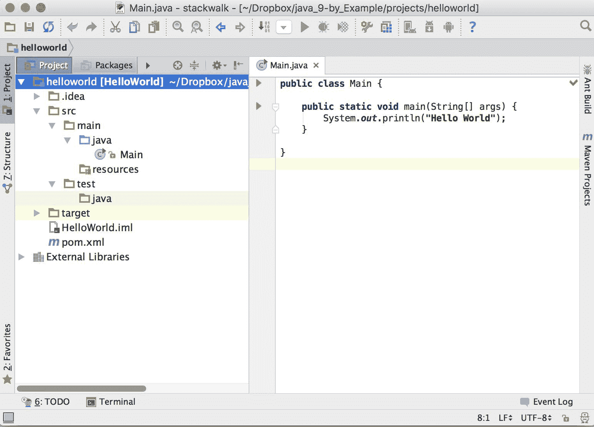

在左侧，您可以看到 Java 项目的文件结构。Java 项目通常包含不同目录中的许多文件，我们将在下一章中讨论。简单的*HelloWorld*应用程序包含一个`pom.xml`项目描述文件。这个文件是 Maven 构建工具所需的，这也是下一章的主题。现在，您只需知道它是一个描述 maven 项目结构的文件。IDE 还会跟踪一些自己的管理数据。它存储在`HelloWorld.iml`中。主程序文件存储在`src/main/java`目录中，命名为`HelloWorld.java`。

在右侧，您可以看到文件。在屏幕截图上，我们只有一个文件被打开。如果有多个文件被打开，那么会有标签页——每个文件一个标签页。现在，活动文件是`HelloWorld.java`，可以在源代码编辑器中编辑。

# 编辑文件

在编辑时，您可以输入字符或删除字符、单词和行，但这所有编辑器都能做到。IDEs 提供额外的功能。IDEs 分析源代码并格式化它，这反过来又自动缩进行。同时，在您编辑代码的背景下，它还会持续编译代码，如果存在语法错误，则用红色波浪线下划线标记。当您修复错误时，红色下划线消失。

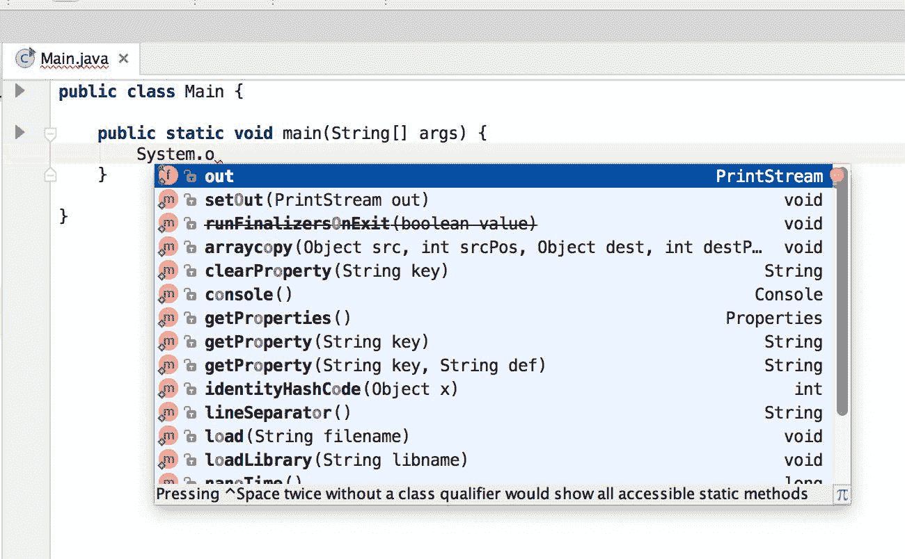

编辑器在您键入时也会自动给出后续字符的建议。您可以忽略弹出的窗口并继续键入。然而，很多时候，在键入一个字符后停下来，使用上下箭头选择需要完成的单词，然后按*Enter*键会更简单：单词将自动插入到源代码中。

在截图上，你可以看到我写了 `System.o`，编辑器立即建议我写 `out`。其他选项是类 `System` 中包含字母 `o` 的其他静态字段和方法。

IDE 编辑器不仅在你需要它为你输入时提供提示，而且在它不能代替你输入时也提供提示。在截图上，IDE 告诉你将某些表达式作为 `println()` 方法的参数，这些表达式是 `boolean`、`char`、`int` 等类型。IDE 完全不知道在那里输入什么。你必须构造这个表达式。尽管如此，它仍然可以告诉你它需要是某种类型。

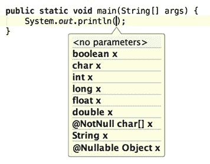

编辑器不仅知道内置类型。与 JDK 集成的编辑器会持续扫描源文件，并知道在源代码中哪些类、方法和字段在编辑位置是可用的。

当你想重命名一个方法或变量时，这种知识也会被大量使用。以前的方法是在源文件中重命名字段或方法，然后对变量的所有引用进行彻底搜索。使用 IDE，机械工作由它来完成。它知道字段或方法的全部用法，并自动将旧标识符替换为新标识符。它还识别出是否有局部变量恰好与我们要重命名的变量同名，IDE 只重命名那些真正指向我们要重命名的变量。

你通常可以做的不仅仅是重命名。程序员称之为**重构**的机械任务或多或少。这些任务由 IDE 使用一些键盘快捷键和编辑器中的上下文相关菜单来支持——鼠标右键单击并点击菜单。

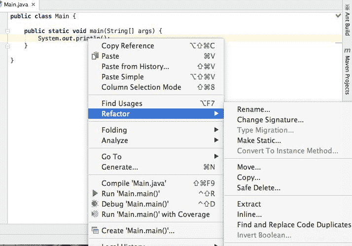

IDE 还帮助你阅读库和源代码的文档，如下面的图像所示：

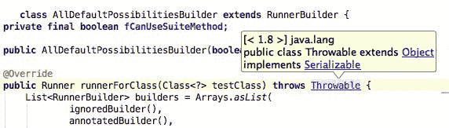

库为 `public` 方法提供 *Javadoc* 文档，你也应该为自己的方法编写 Javadoc。Javadoc 文档是从源代码中的特殊注释中提取出来的，我们将在第四章[Mastermind - 创建一个游戏]中学习如何创建这些注释。这些注释位于实际方法头部前面的注释中。由于创建编译文档是编译流程的一部分，IDE 也知道文档，并在将光标置于源文件中的方法名称、类名称或其他元素上时，将其显示为悬停框。

# 管理项目

在 IDE 窗口的左侧，你可以看到项目的目录结构。IDE 知道不同类型的文件，并以编程角度有意义的方式显示它们。例如，它不会将`Main.java`显示为文件名。相反，它显示`Main`和一个表示`Main`是一个类的图标。它也可以是一个名为`Main.java`的文件中的接口，但在那种情况下，图标将显示这是一个接口。这是通过 IDE 持续扫描和编译代码来实现的。

在我们开发 Java 代码时，文件会被组织到子目录中。这些子目录遵循代码的打包结构。在 Java 中，我们经常使用复合和长的包名，将它们显示为深层的嵌套目录结构将不容易处理。

包用于组织源文件。那些以某种方式相关的类的源文件应该放在一个包中。我们将在下一章讨论包的概念以及如何使用它们。

对于包含源文件的那些项目目录，IDE 能够显示包结构而不是嵌套目录。

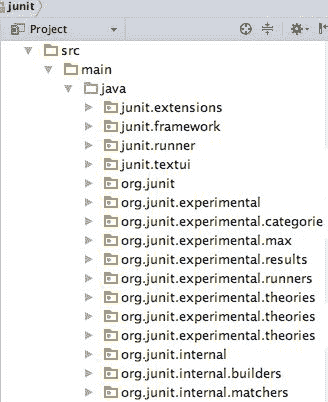

当你将一个类或接口从一个包移动到另一个包时，这和重命名或其他重构操作类似。源文件中对类或接口的所有引用都会被重命名为新的包名。如果一个文件包含一个引用该类的`import`语句，那么该语句中的类名会被修正。要移动一个类，你可以打开包并使用传统的拖放操作。

包层次结构不是 IDE 中显示的唯一层次结构。类在包中，但同时也存在一个继承层次结构。类可以实现接口并扩展其他类。Java IDE 通过显示类型层次结构来帮助我们，在这些层次结构中，你可以沿着继承关系在图形界面中导航。

IDE 还可以显示另一种层次结构，以帮助我们进行开发：方法调用层次结构。在分析代码后，IDE 可以显示显示方法之间关系的图形：哪个方法调用了哪个其他方法。有时，这个调用图在显示方法之间的依赖关系时也非常重要。

# 编译代码并运行它

IDE 通常会编译代码以进行分析，帮助我们即时发现语法错误或未定义的类和方法。这种编译通常是局部的，覆盖代码的一部分，并且由于它持续运行，源代码会发生变化，因此永远不会真正完整。要创建可部署的文件，即项目的最终交付代码，必须启动一个单独的构建过程。大多数 IDE 都有一些内置工具用于此目的，但除了最小的项目外，不建议使用这些工具。专业开发项目通常使用 Ant、Maven 或 Gradle。以下是一个 Maven 的例子。

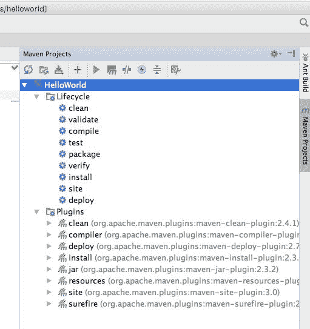

集成开发环境已准备好使用此类外部工具，并且它们可以帮助我们启动它们。这样，构建过程可以在开发机器上运行，而无需启动新的 shell 窗口。IDE 还可以从这些外部构建工具的配置文件中导入设置，以识别项目结构，源文件的位置以及编译的内容以支持在编辑时的错误检查。

构建过程通常包含对代码执行某些检查。一组 Java 源文件可能编译顺利，但代码可能仍然包含大量错误，并且可能编写得风格不佳，这将在长期内使项目变得难以维护。为了避免此类问题，我们将使用单元测试和静态代码分析工具。这些工具不能保证代码无错误，但出错的可能性要小得多。

集成开发环境（IDE）有插件可以运行静态代码分析工具以及单元测试。集成到 IDE 中具有巨大的优势。当分析工具或某些单元测试识别出任何问题时，IDE 会提供一个错误消息，该消息也像网页上的链接一样起作用。如果您点击该消息，通常为蓝色并带有下划线，就像网页上一样，编辑器会打开有问题的文件并将光标放置在问题所在的位置。

# 调试 Java

开发代码需要调试。Java 在开发过程中提供了非常好的调试代码的设施。JVM 通过 Java 平台调试架构支持调试器。这允许您以调试模式执行代码，JVM 将接受通过网络连接的外部调试工具，或者它将尝试根据命令行选项连接到调试器。JDK 包含一个客户端，即`jdb`工具，其中包含调试器；然而，与集成到 IDE 中的图形客户端相比，使用起来非常繁琐，以至于我从未听说过有人用它来实际工作。

要以调试模式启动 Java 程序，以便 JVM 可以接受调试器客户端连接到它，请执行以下命令：

```java
    -Xagentlib:jdwp=transport=dt_socket,server=y,suspend=y,address=7896

```

`Xagentlib`选项指示 Java 运行时加载`jdwp`代理。选项中跟随`-Xagentlib:jdwp=`的部分由调试器代理解释。这些选项如下：

+   `transport`：这应指定要使用哪种传输方式。它可以是共享内存（`dt_shmem`）套接字或 TCP/IP 套接字传输，但在实践中，您将始终使用后者。这在上面的`dt_socket`示例中指定。

+   `server`：这指定了调试的 JVM 是启动在服务器模式还是客户端模式。当您以服务器模式启动 JVM 时，它开始监听套接字并接受调试器连接到它。如果以客户端模式启动，则它尝试连接一个应该以服务器模式启动的调试器，监听在端口上。选项的值是`y`，表示服务器模式，或`n`，表示非服务器模式，即客户端模式。

+   `suspend`: 这也可以是 `y` 或 `n`。如果 JVM 以挂起模式启动，它将不会启动 Java 代码，直到一个调试器连接到它。如果以 `suspend=n` 启动，那么 JVM 将启动，并在达到断点时立即停止。如果你启动一个独立的 Java 应用程序，你通常会使用 `suspend=y` 来启动调试，这是默认设置。如果你想在一个应用程序服务器或 servlet 容器环境中调试应用程序，那么最好使用 `suspend=n` 启动；否则，服务器将不会启动，直到调试器连接到它。在 servlet 应用程序中，以 `suspend=y` 模式启动 Java 进程仅在你想要调试 servlet 静态初始化代码时有用，该代码在服务器启动时执行。如果没有挂起模式，你将需要非常快地连接调试器。在这种情况下，让 JVM 等待你更好。

+   `address`: 这应该指定 JVM 通信的地址。如果 JVM 以客户端模式启动，那么它将开始连接到这个地址。如果 JVM 以服务器模式运行，那么它将在该地址上接受来自调试器的连接。地址可以仅指定端口号。在这种情况下，IP 地址是本地机器的地址。

调试代理可能处理的其它选项是针对特殊情况的。对于本书涵盖的主题，前面的选项已经足够。

以下截图显示了一个典型的调试会话，我们在 IntelliJ IDE 中调试最简单的程序：

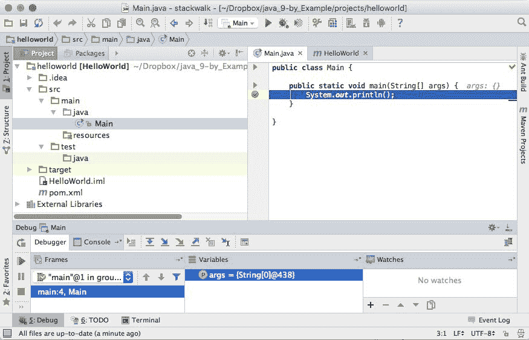

当你在调试模式下从 IDE 启动程序时，所有这些选项都会自动为你设置。你只需在编辑器中的源代码上单击即可设置断点。你可以有一个单独的表单来添加、删除和编辑断点。断点可以附加到特定的行或特定的事件，例如当抛出异常时。附加到特定行的断点也可以有条件，告诉调试器只有当条件为真时才停止代码的执行；例如，如果变量具有某些预定义的值。

# 摘要

在本章中，我们用 Java 互相认识。我们彼此之间了解不多，但我们已经熟悉了。我们已经安装了 Java 环境：Java、JDK 和集成开发环境。我们编写了一个小程序，并简要地看了看可以使用开发工具做什么。这还远未达到精通，但即使是漫长的旅程也始于第一步，有时这是最难迈出的一步。我们在 Java 之旅中做到了这一点。我们开始滚动，对于我们这些热衷的人来说，没有什么可以阻止我们一路前行。
