# 第一章：使用 JavaFX 8 入门

JavaFX 是 Java 的下一代图形用户界面（GUI）工具包。它是一个平台，可以轻松快速地构建高性能的 Java 客户端应用程序。

JavaFX 的底层引擎利用现代 GPU 通过硬件加速图形，同时提供设计良好的编程接口，从而使开发人员能够结合图形、动画和 UI 控件。

这些功能使您能够为客户提供引人入胜、复杂且完全可定制的客户端 GUI，这将让他们非常印象深刻。

虽然 Java 最初的目标是嵌入式和客户端世界，但自 2006 年以来，许多原因推动 Java 语言成为企业世界的顶级开发平台。

但最近，随着 JavaFX 平台作为标准客户端 GUI 的进入，这些最初的目标又开始重新流行起来。

尽管 JavaFX 不仅仅是一个 GUI 工具包，但它允许 Java 开发人员创建具有引人入胜的用户界面并轻松连接到后端系统的客户端应用程序。

此外，JavaFX 灵活的 FXML 支持使您能够轻松构建 MVC（模型-视图-控制器）架构模式应用，并使用 Scene Builder 工具采用所见即所得的方法。

JavaFX 的绑定功能简化了实体之间的通信，并进一步支持 MVC。除此之外，JavaFX 还提供了使用 CSS 快速、可定制的 UI 建模。

通过添加一个完整的`WebView`组件和文档模型，将其映射到 Java 代码变得容易，并为 3D 和媒体功能提供了很好的支持。

在本章中，我们将涵盖以下主题：

+   什么是 JavaFX 以及它的目标平台？

+   JavaFX 历史概览

+   JavaFX 的目标、特性以及 JavaFX 8 的新功能

+   如何安装 Java SE 8、JavaFX 8、NetBeans，并配置环境变量

+   开发一个“Hello World”JavaFX 8 应用程序，并了解 JavaFX 8 的基本应用程序架构和构建模块

# JavaFX 的目标

JavaFX 诞生的初衷是被用于许多类型的设备，如嵌入式设备、智能手机、电视、平板电脑和台式电脑。JavaFX 也遵循 Java 的“一次编写，到处运行”的范式。

JavaFX 8 完全使用 Java 语言编写，让您感到宾至如归。因此，使用 JavaFX 编写的应用程序可以部署在台式机、笔记本电脑、Web、嵌入式系统、移动设备和平板电脑上。

嵌入式系统不再得到 Oracle 的支持；它留给了像 ARM 等公司来支持。从 JavaFX 2.x 到 8.x，移动设备从未得到支持；现在的支持仅存在于 OpenJFX。社区受益于开源将 JavaFX 带入移动环境。

有关 OpenJFX 的更多信息，请访问[`wiki.openjdk.java.net/display/OpenJFX/Main`](https://wiki.openjdk.java.net/display/OpenJFX/Main)。

JavaFX 是一套图形和媒体包，使开发人员能够设计、创建、测试、调试和部署在各种平台上一致运行的丰富客户端应用程序，而无需使用许多单独的库、框架和 API 来实现相同的目标。这些单独的库包括媒体、UI 控件、`WebView`、3D 和 2D API。

因此，如果您是一名 Java 前端开发人员，一名有经验的 Java Swing、Flash/Flex、SWT 或 Web 开发人员，希望将您的客户端应用程序提升到一个新水平，并且想要为您的客户开发一个引人注目且复杂的用户界面，那么学习 JavaFX 技能是正确的选择——这本书适合您。

# 入门

本章是对 JavaFX 8 的介绍；我们已经谈到了 JavaFX 8 作为一种技术以及为什么你应该关心它。

接下来，我们将浏览其历史，探索其核心特性以及它可以使用的地方。

在开始使用本书学习 JavaFX 8 之前，我们将通过安装各种所需的软件捆绑包来准备您的开发环境，以便能够编译和运行其中的许多示例。

在本章中，您将学习如何安装所需的软件，如**Java 开发工具包 JDK**和 NetBeans **集成开发环境**（**IDE**）。

安装所需的软件后，您将首先创建一个传统的*Hello JavaFX 8*示例。一旦您对开发环境感到满意，作为我们正在正确的轨道上的最终验证，我们将浏览 Hello JavaFX 8 源代码，以了解基本的 JavaFX 8 应用程序架构。

### 注

如果您已经熟悉了 JDK 和 NetBeans IDE 的安装，您可以跳转到第二章，*JavaFX 8 基础知识和创建自定义 UI*，其中涵盖了 JavaFX 8 的基础知识以及如何创建自定义 UI 组件。

那么你还在等什么？让我们开始吧！

# JavaFX 历史

你可能认为 JavaFX 是一种相当新的技术，但实际上并不是。JavaFX 已经存在很长时间了；自 2005 年以来就一直存在。自从 Sun Microsystems 收购了*SeeBeyond*公司以来，就有了一个名为**F3**（**F**orm **F**ollows **F**unction）的图形丰富的脚本语言，由工程师 Chris Oliver 创建。

在 2007 年的 JavaOne 大会上，Sun Microsystems 正式将 JavaFX 作为语言的名称公布，而不是 F3。在 2007 年至 2010 年期间，甲骨文收购了许多大公司，如 BEA Systems、JD Edwards、Siebel Systems 等。当时我正在甲骨文工作，负责将不同的客户支持渠道整合到甲骨文支持网站*MetaLink*中。

2009 年 4 月 20 日，甲骨文公司宣布收购 Sun Microsystems，使甲骨文成为 JavaFX 的新管理者。

在 2010 年的 JavaOne 大会上，甲骨文宣布了 JavaFX 路线图，其中包括计划淘汰 JavaFX 1.3 脚本语言并为基于 Java 的 API 重新创建 JavaFX 平台。如承诺的那样，JavaFX 2.0 SDK 于 2011 年 10 月的 JavaOne 上发布。

除了发布 JavaFX 2.0 之外，Oracle 还通过宣布致力于采取措施使 JavaFX 开源，从而允许 Java 多才多艺和强大的社区帮助推动平台发展。JavaFX 开源增加了其采用率，使得错误修复的周转时间更快，并产生了新的增强功能。

在 JavaFX 2.1 和 2.2 之间，新功能的数量迅速增长。JavaFX 2.1 是 Java SDK 在 Mac OS 上的官方发布。JavaFX 2.2 是 Java SDK 在 Linux 操作系统上的官方发布。

没有 JavaFX 3.x 这样的东西，但是在 2014 年 3 月 18 日宣布的 Java SE 8 发布中，Java 开发世界发生了重大变化。Java SE 8 具有许多新的 API 和语言增强功能，包括**Lambda**、Stream API、Nashorn JavaScript 引擎和*JavaFX API*，这些都被纳入标准 JDK 捆绑包中，JavaFX 版本成为直接继承 JavaFX 2.0 的 8。

要查看 Java SE 8 中的所有新功能，请访问[`www.oracle.com/technetwork/java/javase/8-whats-new-2157071.html`](http://www.oracle.com/technetwork/java/javase/8-whats-new-2157071.html)。

## JavaFX 8 何时可用？

答案是*现在*。如前所述，Java SE 8 于 2014 年 3 月 18 日发布。对于使用 Java 构建客户端应用程序的开发人员，JavaFX 丰富的互联网应用程序框架现在支持 Java 8。

大多数 Java 企业版供应商也支持 Java 8。是否立即转移到 Java SE 8 取决于您正在处理的项目类型。

### 注

事实上，根据 Oracle JDK 支持路线图，在 2015 年 4 月之后，Oracle 将不会在其公共下载站点上发布 Java SE 7 的进一步更新。

JavaFX API 作为**Java SE Runtime Environment**（**JRE**）和 JDK 的完全集成功能可用。JDK 适用于所有主要桌面平台（*Windows*、*Mac OS X*、*Solaris*和*Linux*），因此 JavaFX 也将在所有主要桌面平台上运行。

关于 JavaFX 8，它支持以下 API：

+   3D 图形

+   富文本支持

+   打印 API。

# JavaFX 功能

根据 JavaFX 的官方文档，以下功能包括在 JavaFX 8 及以后的版本中：

+   **Java API**：JavaFX 是一个由 Java 代码编写的类和接口的 Java 库。

+   **FXML 和 Scene Builder**：这是一种基于 XML 的声明性标记语言，用于构建 JavaFX 应用程序用户界面。您可以在 FXML 中编码，也可以使用 JavaFX Scene Builder 交互式设计 GUI。Scene Builder 生成可以移植到像 NetBeans 这样的 IDE 中的 FXML 标记，您可以在其中添加业务逻辑。此外，生成的 FXML 文件可以直接在 JavaFX 应用程序中使用。

+   **WebView**：这是一个 Web 组件，使用`WebKit`，一种 HTML 渲染引擎技术，可以在 JavaFX 应用程序中嵌入网页。在`WebView`中运行的 JavaScript 可以调用 Java API，反之亦然。

+   **Swing/SWT 互操作性**：现有的 Swing 和 SWT 应用程序可以从 JavaFX 功能中受益，如丰富的图形、媒体播放和嵌入式网页内容。

+   **内置 UI 控件和 CSS**：JavaFX 提供了所有主要的 UI 控件，以及一些额外的不常见的控件，如图表、分页和手风琴，这些控件是开发完整功能的应用程序所需的。组件可以使用标准的 Web 技术（如 CSS）进行皮肤化。

+   **3D 图形功能**：包括对 3D 图形库的支持。

+   **Canvas API**：您可以使用 Canvas API 直接在 JavaFX 场景区域内绘制，它由一个图形元素（节点）组成。

+   **多点触控支持**：基于底层平台的能力支持多点触控操作。

+   **硬件加速图形管道**：JavaFX 图形基于图形渲染管道*Prism*。当与支持的图形卡或**图形处理单元**（**GPU**）一起使用时，Prism 引擎可以平滑快速地渲染 JavaFX 图形。如果系统不具备其中之一，则 Prism 将默认为软件渲染堆栈。

+   **高性能媒体引擎**：该引擎提供了一个稳定的、低延迟的基于`GStreamer`多媒体框架的媒体框架。支持 Web 多媒体内容的播放。

+   **自包含部署模型**：自包含应用程序包含所有应用程序资源和 Java 和 JavaFX 运行时的私有副本。它们被分发为本机可安装的软件包，并为该操作系统提供与本机应用程序相同的安装和启动体验。

## JavaFX 8 的新功能

以下是 Java SE 8 版本的 JavaFX 组件中新增功能和重大产品变更的简要总结：

+   新的*Modena 主题*现在是 JavaFX 应用程序的默认主题。

+   增加了对其他 HTML5 功能的支持，包括 Web Sockets、Web Workers、Web Fonts 和打印功能。

+   该 API 使您能够使用新的`SwingNode`类将**Swing**内容嵌入到 JavaFX 应用程序中，从而改进了 Swing 互操作性功能。

+   现在提供了内置的 UI 控件`DatePicker`、`Spinner`和`TableView`。

+   它通过`javafx.print`包提供了公共 JavaFX 打印 API。

+   支持高 DPI 显示。

+   CSS 可样式化类成为公共 API。

+   引入了一个计划服务类。

+   3D 图形库已经增强了几个新的 API 类。

+   在此版本中，*Camera API*类进行了重大更新。

+   现在 JavaFX 8 支持丰富的文本功能。这些包括在 UI 控件中支持泰语和印地语等双向和复杂文本脚本，以及文本节点中的多行、多样式文本。

+   对话框和辅助功能 API 得到支持。

在附录中，*成为 JavaFX 专家*，我提供了您成为 JavaFX 专家所需的所有参考资料（链接、书籍、杂志、文章、博客和工具）和真实的 JavaFX 8 生产应用程序的清单。

下图显示了使用 JavaFX 8 构建的`Ensemble8.jar`应用程序，展示了处理各种 JavaFX 8 组件、主题和概念的示例。更有趣的是，源代码可供学习和修改-请参阅最后一章以了解如何安装此应用程序。

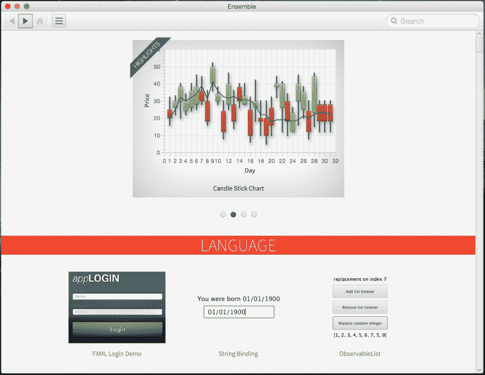

JavaFX 8 应用程序

应用程序涵盖了许多主题，特别是新的 JavaFX 8 3D API，可以在下图中的 3D 图形部分找到：

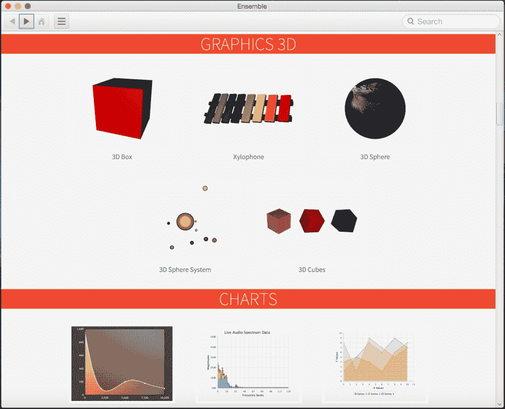

JavaFX 8 3D 应用程序

# 安装所需的软件

到目前为止，我们已经对 JavaFX 有了一个很好的介绍，我和你一样急于开始创建和启动我们的第一个`"Hello JavaFX 8"`应用程序。但是，如果没有下载和安装允许我们创建和编译本书大部分代码的正确工具，这是不可能的。

您需要下载并安装*Java 8 Java 开发工具包*（JDK）或更高版本。而不是运行时版本（JRE）。

从以下位置下载最新的 Java SE 8u45 JDK 或更高版本：

[`www.oracle.com/technetwork/java/javase/downloads/index.html`](http://www.oracle.com/technetwork/java/javase/downloads/index.html)

从以下链接下载并安装 NetBeans 8.0.2 或更高版本[`netbeans.org/downloads`](https://netbeans.org/downloads)，尽管推荐使用 NetBeans IDE **All** Bundle，*您也可以使用 Java EE 捆绑包*，如图所示：

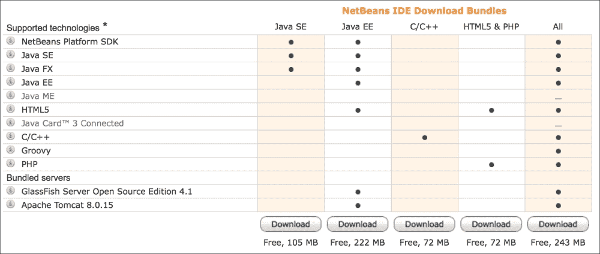

NetBeans 捆绑包下载。

目前，JavaFX 8 可以在以下操作系统上运行：

+   Windows 操作系统（XP、Vista、7、8）32 位和 64 位

+   Mac OS X（64 位）

+   Linux（32 位和 64 位），Linux ARMv6/7 VFP，HardFP ABI（32 位）

+   Solaris（32 位和 64 位）

## 安装 Java SE 8 JDK

本节概述的步骤将指导您成功下载和安装 Java SE 8。从以下位置下载 Java SE 8 JDK：

[`www.oracle.com/technetwork/java/javase/downloads/jdk8-downloads-2133151.html`](http://www.oracle.com/technetwork/java/javase/downloads/jdk8-downloads-2133151.html)

在以下步骤中，将以 Mac OS X Yosemite（10.10.3）操作系统上的 Java SE 8u45 JDK 64 位版本（写作时）为例。

其他操作系统和 JDK 版本的步骤类似。但是，如果您的环境不同，请参考以下链接获取更多详细信息：

[`docs.oracle.com/javase/8/docs/technotes/guides/install/toc.html`](http://docs.oracle.com/javase/8/docs/technotes/guides/install/toc.html)

以下是安装 Java SE 8 JDK 的步骤：

1.  通过启动图像文件`jdk-8u45-macosx-x64.dmg`来安装 Java 8 JDK。一旦启动了 JDK 8 设置图像文件，屏幕将出现如下截图。这是软件包设置文件。双击它，安装程序将启动：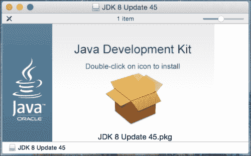

JDK 8 设置图像文件

### 提示

通常，您需要在计算机上拥有管理员权限才能安装软件。

1.  开始设置 Java 8 JDK。在安装过程开始时，将出现以下屏幕截图中的屏幕。单击**继续**按钮，然后在**安装**类型屏幕向导上，单击**安装**开始安装。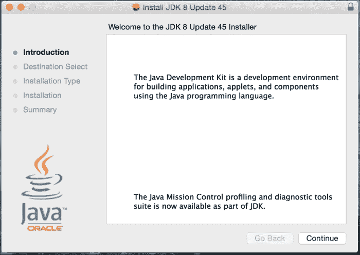

Java SE 开发工具包 8 设置

1.  一旦点击**安装**，您可能会被要求输入密码。输入密码，单击**确定**，安装将继续进行，显示一个进度条，如下图所示：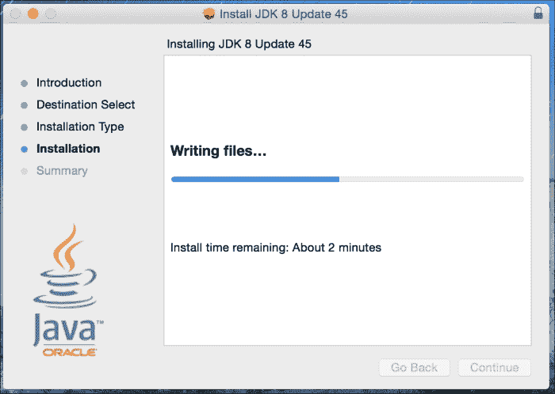

Java SE 开发工具包 8 安装进行中

1.  设置将完成 Java 8 SE 开发工具包的安装。单击**关闭**按钮退出。

### 设置环境变量

现在您需要设置一些关键的环境变量。如何设置它们以及它们应该设置的值取决于您的操作系统。需要设置的两个变量是：

+   **JAVA_HOME**：这告诉您的操作系统 Java 安装目录在哪里。

+   **PATH**：这指定了 Java 可执行目录的位置。这个环境变量让系统搜索包含可执行文件的路径或目录。Java 可执行文件位于`JAVA_HOME`主目录下的 bin 目录中。

为了使`JAVA_HOME`和`PATH`更加永久，您将希望以这样的方式将它们添加到系统中，以便在每次启动或登录时都可以使用。根据您的操作系统，您需要能够编辑环境变量名称和值。

在*Windows 环境*中，您可以使用键盘快捷键*Windows 徽标键+暂停/中断键*，然后单击**高级系统设置**以显示**系统属性**对话框。

接下来，单击**环境变量**。这是您可以添加、编辑和删除环境变量的地方。您将使用已安装的主目录作为值来添加或编辑`JAVA_HOME`环境变量。在 Windows 操作系统的环境变量对话框中显示的是这个屏幕截图：

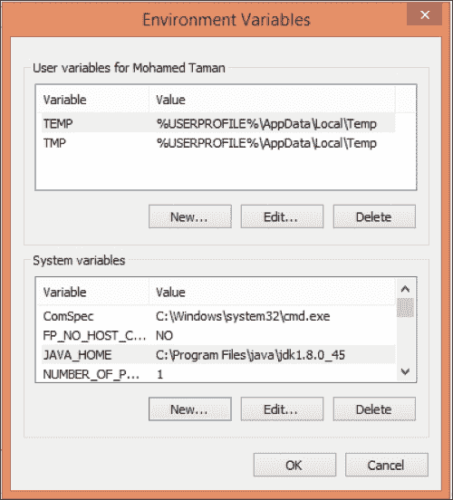

Windows 环境变量

让我们设置环境变量：

+   要为**Mac OS X**平台设置`JAVA_HOME`环境变量，您需要启动终端窗口，编辑您的主目录的`.bash_profile`文件，添加以下导出命令：

```java
export JAVA_HOME=$(/usr/libexec/java_home -v 1.8)

```

+   在使用 Bash shell 环境的**Linux**和其他**Unix**操作系统上，启动终端窗口并编辑`~/.bashrc`或`~/.profile`文件，包含导出命令：

```java
export JAVA_HOME=/usr/java/jdk1.8.0
export PATH=$PATH:$JAVA_HOME/bin

```

+   在使用`C` shell（csh）环境的 Linux 和其他 Unix 操作系统上，启动终端窗口并编辑`~/.cshrc`或`~/.login`文件，包含`setenv`命令：

```java
setenv JAVA_HOME /usr/java/jdk1.8.0_45
setenv PATH ${JAVA_HOME}/bin:${PATH}

```

设置好路径和`JAVA_HOME`环境变量后，您将希望通过启动终端窗口并从命令提示符执行以下两个命令来验证您的设置：

```java
java -version
javac –version

```

### 注意

每种情况下的输出都应该显示一个消息，指示语言和运行时的 Java SE 8 版本。

## 安装 NetBeans IDE

在开发 JavaFX 应用程序时，您将使用 NetBeans IDE（或您喜欢的任何其他 IDE）。请确保下载包含 JavaFX 的正确 NetBeans 版本。要安装 NetBeans IDE，请按照以下步骤进行：

1.  从以下位置下载 NetBeans IDE 8.0.2 或更高版本：

[`netbeans.org/downloads/index.html`](https://netbeans.org/downloads/index.html)

1.  启动`.dmg`镜像文件`netbeans-8.0.2-macosx.dmg`。镜像将被验证，打开一个包含安装程序包存档`netbeans-8.0.2.pkg`的文件夹；双击它以启动安装程序。将出现一个带有消息的对话框：*此软件包将运行一个程序来确定是否可以安装软件。*单击**继续**按钮。

1.  一旦启动了 NetBeans 安装对话框，再次点击**继续**。接下来，接受许可证并点击**继续**，然后点击**同意**。

1.  点击**安装**按钮继续。下面的屏幕截图显示了一个**Mac**安全警告提示；输入密码并点击**安装软件**。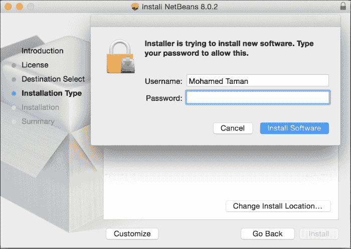

Mac 安全警告对话框

1.  NetBeans IDE 安装过程将开始。下面的屏幕截图显示了安装进度条：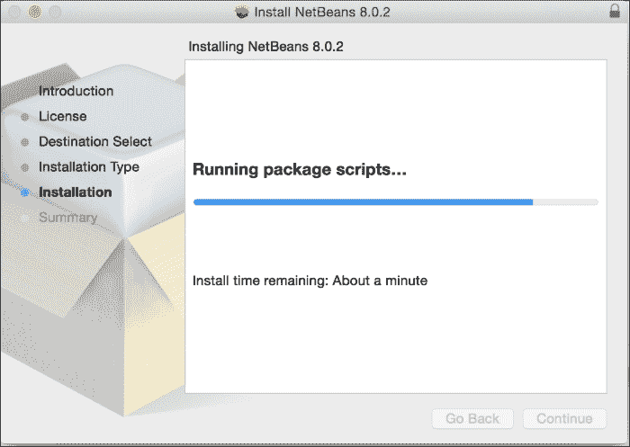

安装进度

1.  点击**关闭**按钮完成安装，如下所示：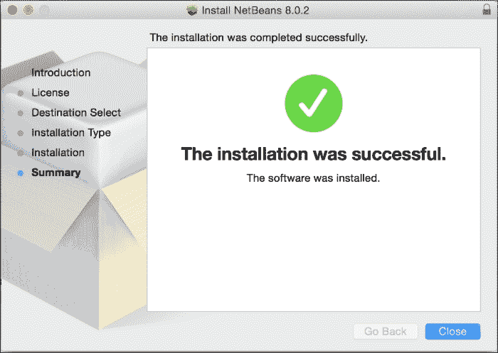

设置完成

现在，您已经准备好继续创建 JavaFX 应用程序了。

# 创建“Hello World” JavaFX 风格的应用程序

展示创建和构建 JavaFX 应用程序的最佳方式是使用`Hello World`应用程序。

在本节中，您将使用刚刚安装的 NetBeans IDE 来开发、编译和运行基于 JavaFX 的`Hello World`应用程序。

## 使用 Netbeans IDE

要快速开始创建、编码、编译和运行一个简单的 JavaFX 风格的`Hello World`应用程序，使用 NetBeans IDE，按照本节中概述的步骤进行操作：

1.  从**文件**菜单中选择**新建项目**。

1.  从**JavaFX 应用程序类别**中选择**JavaFX 应用程序**。点击**下一步**。

1.  将项目命名为`HelloJavaFX`。可选地，您可以为应用程序类定义包结构。然后点击**完成**，如下所示：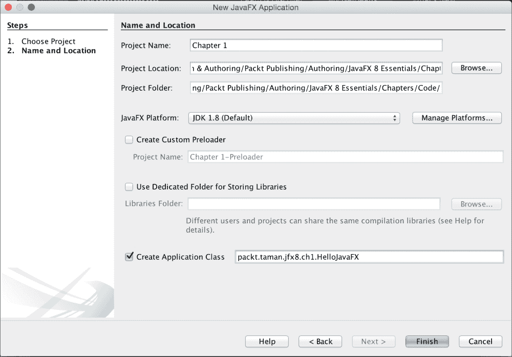

新的 JavaFX 应用程序向导

NetBeans 打开`HelloJavaFX.java`文件，并用基本的“Hello World”应用程序的代码填充它。

### 注意

您会发现，这个版本的代码与 NetBeans 实际创建的代码有些不同，您可以进行比较以找出差异，但它们具有相同的结构。我这样做是为了在单击**Say 'Hello World'**按钮时，将结果显示在`Scene`上的文本节点上，而不是控制台上。为此，还使用了`VBox`容器。

1.  右键单击项目，然后从菜单中点击**运行**，如下所示：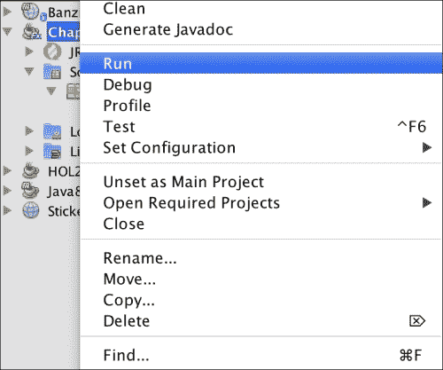

运行应用程序

1.  NetBeans 将编译和运行该应用程序。输出应该如下所示的屏幕截图：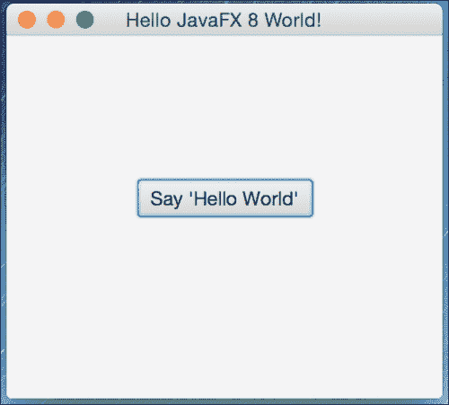

从 NetBeans IDE 启动的 JavaFX Hello World

1.  点击按钮，您应该看到以下结果：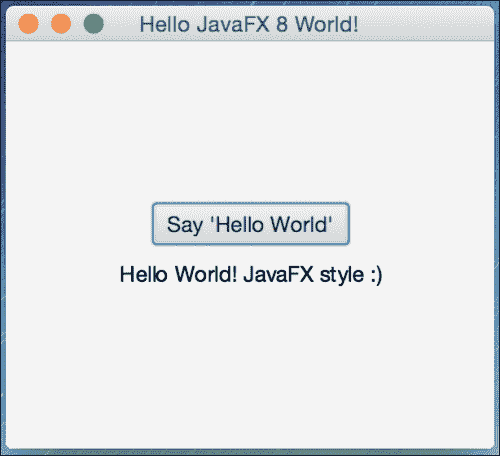

JavaFX Hello World 结果

这是基本的 Hello world 应用程序（`HelloJavaFX.java`）的修改后的代码：

```java
import javafx.application.Application;
import javafx.scene.Scene;
import javafx.scene.control.Button;
import javafx.scene.text.Text;
import javafx.stage.Stage;
import static javafx.geometry.Pos.CENTER;
import javafx.scene.layout.VBox;

/**
  * @author mohamed_taman
 */
public class HelloJavaFX extends Application {

  @Override
  public void start(Stage primaryStage) {

    Button btn = new Button();
    Text message = new Text();

    btn.setText("Say 'Hello World'");

    btn.setOnAction(event -> {
      message.setText("Hello World! JavaFX style :)");
    });

    VBox root = new VBox(10,btn,message);
    root.setAlignment(CENTER);

    Scene scene = new Scene(root, 300, 250);

    primaryStage.setTitle("Hello JavaFX 8 World!");
    primaryStage.setScene(scene);
    primaryStage.show();
  }
  public static void main(String[] args) {
    launch(args);
  }
}
```

## 工作原理

以下是关于 JavaFX 应用程序基本结构的重要信息：

+   JavaFX 应用程序的主类应该扩展`javafx.application.Application`类。`start()`方法是所有 JavaFX 应用程序的*主入口点*。

+   JavaFX 应用程序通过*舞台*和*场景*定义用户界面容器。JavaFX `Stage`类是顶级 JavaFX 容器。JavaFX `Scene`类是所有内容的容器。以下代码片段创建了一个舞台和场景，并使场景在给定的像素大小下可见 - `new Scene(root, 300, 250)`。

+   在 JavaFX 中，场景的内容表示为节点的分层场景图。在本例中，根节点是一个`VBox`布局对象，它是一个可调整大小的布局节点。这意味着根节点的大小跟踪场景的大小，并且在用户调整舞台大小时发生变化。

+   在这里，`VBox`被用作容器，以单列多行的形式垂直排列其内容节点。我们将按钮**btn**控件添加到列中的第一行，然后将文本**message**控件添加到同一列的第二行，垂直间距为 10 像素，如下面的代码片段所示：

```java
VBox root = new VBox(10,btn,message);
root.setAlignment(CENTER);
```

+   我们设置了带有文本的按钮控件，以及一个事件处理程序，当单击按钮时，将消息文本控件设置为**Hello World! JavaFX style :)**。

+   您可能会注意到在 Java 中有一种奇怪的代码语法，没有编译器错误。这是一个**Lambda**表达式，它已经添加到了 Java SE 8 中，我们将在第二章 *JavaFX 8 Essentials and Creating a custom UI*中简要讨论它。与旧的匿名内部类风格相比，现在使用 Lambda 表达式更清晰、更简洁。看一下这段代码的比较：

老派：

```java
btn.setOnAction(new EventHandler<ActionEvent>() {
  @Override
  public void handle(ActionEvent event) {
    message.setText("Hello World! JavaFX style :)");
  }
});
```

新时代：

```java
btn.setOnAction(event -> {
    message.setText("Hello World! JavaFX style :)");
});
```

+   当使用 JavaFX Packager 工具创建应用程序的**JAR**文件时，不需要`main()`方法，该工具会将 JavaFX Launcher 嵌入 JAR 文件中。

+   然而，包括`main()`方法是有用的，这样您就可以运行没有 JavaFX Launcher 创建的 JAR 文件，比如在使用 JavaFX 工具没有完全集成的 IDE 中。此外，嵌入 JavaFX 代码的**Swing**应用程序需要`main()`方法。

+   在我们的`main()`方法的入口点，我们通过简单地将命令行参数传递给`Application.launch()`方法来启动 JavaFX 应用程序。

+   在`Application.launch()`方法执行后，应用程序将进入就绪状态，框架内部将调用`start()`方法开始执行。

+   此时，程序执行发生在*JavaFX 应用程序线程*上，而不是在**主线程**上。当调用`start()`方法时，一个 JavaFX `javafx.stage.Stage`对象可供您使用和操作。

### 注意

高级主题将在接下来的章节中进行详细讨论。更重要的是，我们将在接下来的章节中深入讨论 JavaFX 应用程序线程。在最后三章中，我们将看到如何将其他线程的结果带入 JavaFX 应用程序线程，以便在场景中正确呈现它。

# 总结

到目前为止，您已经了解了 JavaFX 是什么，并见识了它的强大。您已经成功下载并安装了 Java 8 JDK 和 NetBeans IDE。在成功安装了先决条件软件之后，您通过 NetBeans IDE 创建了一个 JavaFX Hello World GUI 应用程序。在学习了如何编译和运行 JavaFX 应用程序之后，您快速浏览了源文件`HelloJavaFX.java`的代码。

接下来，在第二章 *JavaFX 8 Essentials and Creating a custom*中，您将了解 JavaFX 8 架构组件和引擎，这些组件和引擎使 JavaFX 应用程序在底层高效平稳地运行。您还将了解最常见的布局 UI 组件，并了解如何为整个应用程序或单个场景节点设置主题。

我们还将介绍 Java SE 8 最重要的特性，Lambda 表达式，以及它的工作原理。然后我们将深入了解**Scene Builder**作为一种声明式 UI 和高效工具，然后学习生成的基于 FXML 的标记文档以及如何将其导入到 NetBeans IDE 中，以继续将应用程序逻辑实现与已声明的 UI 控件关联起来。

最后，您将能够创建一个自定义的 UI 组件，该组件不与默认的 JavaFX 8 UI 控件捆绑在一起。
