# 第二章：JavaFX 8 基础知识和创建自定义 UI

了解 JavaFX 的基本知识肯定会帮助您轻松构建复杂的 UI 解决方案。

在本章中，您将简要介绍 JavaFX 8 架构，以便了解 JavaFX 架构组件和引擎如何有效地相互连接，并使其图形平滑地渲染。

您将学习如何在 JavaFX 场景上呈现图形，并为此创建一个使用场景、一些控件和样式的基本应用程序。

我们将涉及 Java SE 8 功能的基础知识（如**Lambda**和**函数接口**），以帮助提高代码的可读性、质量和生产力。

一旦我们有了第一个结构良好的 JavaFX 8 应用程序，如果您可以在不改变其功能的情况下更改应用程序的 UI，那不是很好吗？您将通过查看 JavaFX CSS 样式的基础知识来了解主题。

最后，您将了解如何使用 Scene Builder 以图形方式创建和定义 UI 屏幕，并将其保存为 JavaFX FXML 格式的文件。您还将亲身体验创建*自定义控件*。

在本章中，我们将涵盖以下主题：

+   了解 JavaFX 架构组件

+   使用 JavaFX 组件设置 UI

+   使用 Java SE 8，Lambda 表达式和其他功能

+   为不同平台定制应用程序的主题

+   使用 CSS 自定义应用程序 UI

+   使用 Scene Builder 工具以可视化方式创建 UI

+   使用 FXML 构建自定义 UI

# JavaFX 8 架构的快速回顾

为了更好地理解框架的组件和引擎如何相互交互以运行您的 JavaFX 应用程序，本节对 JavaFX 架构和生态系统进行了高层次描述。

以下图示了 JavaFX 平台的架构组件。它显示了每个组件以及它们如何相互连接。

负责运行 JavaFX 应用程序代码的引擎位于 JavaFX 公共 API 的下方。

此引擎由子组件组成。这些包括**Prism**，一个 JavaFX 高性能图形引擎；Glass 工具包，一个小巧高效的窗口系统；媒体引擎；和 Web 引擎。

### 注意

虽然这些组件没有通过公共 API 公开，但我们将对它们进行描述，以便您更好地了解是什么使 JavaFX 应用以高效的方式成功运行。

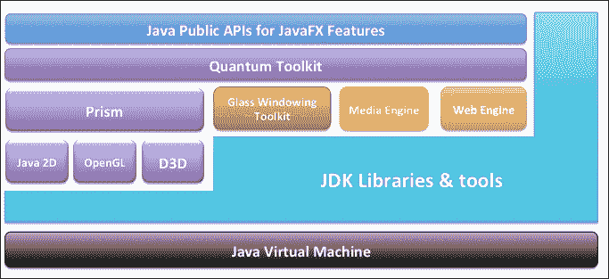

JavaFX 架构图

有关 JavaFX 架构和生态系统的更多信息，请访问[`docs.oracle.com/javase/8/javafx/get-started-tutorial/jfx-architecture.htm`](http://docs.oracle.com/javase/8/javafx/get-started-tutorial/jfx-architecture.htm)。

## 场景图

每个应用程序都有一个起始根点来构建 UI 层次结构，而 JavaFX 应用程序的起始点是*场景图*。在前面的屏幕截图中，它显示为蓝色的顶层的一部分。它是表示应用程序用户界面的所有视觉元素的根节点树。它还跟踪和处理任何用户输入，并且可以被渲染，因为它本身是一个 UI 节点。

*Node*是场景图树中的任何单个元素。每个节点默认具有这些属性 - 用于标识的 ID，用于更改其视觉属性的样式类列表，以及用于正确适应场景并放置在其父布局容器节点内的边界体积，除了场景图的根节点。

场景图树中的每个节点都有一个父节点，但可以有零个或多个子节点；但是，场景根节点没有父节点（为空）。此外，JavaFX 具有一种机制，以确保节点只能有一个父节点；它还可以具有以下内容：

+   视觉效果，如模糊和阴影

+   通过不透明度控制组件的透明度

+   CPU 加速的 2D 变换、过渡和旋转

+   3D 变换，如过渡、缩放和旋转

+   事件处理程序（如鼠标事件、键盘事件或其他输入方法，如触摸事件）

+   应用程序特定状态

下图显示了舞台、场景、UI 节点和图形树之间的关系：

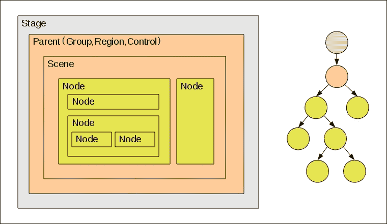

JavaFX UI 树层次关系

图形原语也是 JavaFX 场景图的一个组成部分，如线条、矩形和文本，以及图像、媒体、UI 控件和布局容器。

当涉及为客户提供复杂和丰富的 UI 时，场景图简化了这项任务。此外，您可以使用`javafx.animation` API 快速轻松地为场景图中的各种图形添加动画。

除了这些功能外，`javafx.scene` API 还允许创建和指定几种内容类型，如下所示：

+   **节点**：表示为 UI 控件、图表、组、容器、嵌入式 Web 浏览器、形状（2D 和 3D）、图像、媒体和文本的任何节点元素

+   **效果**：这些是简单的对象，当应用于 UI 节点时，会改变其在场景图节点上的外观，如模糊、阴影和颜色调整

+   **状态**：任何特定于应用程序的状态，如变换（节点的位置和方向）和视觉效果

## JavaFX 功能的 Java 公共 API

这是作为一套完整的 Java 公共 API 的瑞士军刀工具包，支持丰富的客户端应用程序开发。

这些 API 为您提供了前所未有的灵活性，通过将 Java SE 平台的最佳功能与全面的沉浸式媒体功能相结合，构建直观而全面的一站式开发环境，用于构建丰富的客户端 UI 应用程序。

这些 JavaFX 的 Java API 允许您执行以下操作：

+   利用 Java SE 的强大功能，从泛型、注解和多线程到新的 Lambda 表达式（Java SE 8 中引入）。

+   为 Web 开发人员提供了一种更简单的方式，可以从其他基于 JVM 的动态语言（如*JavaScript*）中使用 JavaFX。

+   通过集成其他系统语言（如*Groovy*）编写大型复杂的 JavaFX 应用程序。

+   将 UI 控件绑定到控制器属性，以便从模型到绑定的 UI 节点自动通知和更新。绑定包括对高性能延迟绑定、绑定表达式、绑定序列表达式和部分绑定重新评估的支持。我们将在第三章中看到这一点以及更多内容，*开发 JavaFX 桌面和 Web 应用程序*。

+   引入可观察列表和映射，允许应用程序将 UI 连接到数据模型，观察这些数据模型的变化，并相应地更新相应的 UI 控件，通过扩展 Java 集合库。

## 图形系统

JavaFX 图形系统，如前图中的紫色所示，支持在 JavaFX 场景图层上平稳运行的 2D 和 3D 场景图。作为该层下面的实现细节，它在运行在没有足够图形硬件支持硬件加速渲染的系统时，提供了渲染软件堆栈。

JavaFX 平台有两个实现图形加速管道：

+   **Prism**：这是处理所有渲染作业的引擎。它可以在硬件和软件渲染器上运行，包括 3D。JavaFX 场景的光栅化和渲染由此引擎处理。根据使用的设备，可能存在以下多个渲染路径：

+   DirectX 9 在 Windows XP 和 Vista 上，DirectX 11 在 Windows 7 上

+   OpenGL 在 Linux、Mac 和嵌入式系统上

+   当无法进行硬件加速时进行软件渲染。

+   **Quantum Toolkit**：这负责将 Prism 引擎和玻璃窗口工具包连接起来，使它们在堆栈中的 JavaFX 层中可用。这是除了管理与渲染与事件处理相关的任何线程规则。

## 玻璃窗口工具包

如上图中间部分所示，玻璃窗口工具包作为连接 JavaFX 平台与本机操作系统的平台相关层。

由于其主要责任是提供本机操作服务，例如管理定时器、窗口和表面，因此它在渲染堆栈中的位置最低。

## JavaFX 线程

通常，系统在任何给定时间运行两个或更多以下线程：

+   **JavaFX 应用程序线程**：这是 JavaFX 应用程序使用的主要线程。

+   **Prism 渲染线程**：这将渲染与事件分发器分开处理。它在准备处理下一个 N + 1 帧时渲染 N 帧。它的最大优势是能够执行并发处理，特别是在具有多个处理器的现代系统上。

+   **媒体线程**：这在后台运行，并通过 JavaFX 应用程序线程通过场景图同步最新帧。

+   **Pulse**：这使您能够以异步方式处理事件。它帮助您管理 JavaFX 场景图元素状态与 Prism 引擎场景图元素事件之间的同步。当它被触发时，场景图上元素的状态将与渲染层同步。

### 注意

任何布局节点和 CSS 也与脉冲事件相关联。

玻璃窗口工具包使用高分辨率本机定时器执行所有脉冲事件。

## 媒体和图像

JavaFX `javafx.scene.media` API 提供媒体功能。JavaFX 支持视觉和音频媒体。对于音频文件，它支持`MP3`、`AIFF`和`WAV`文件以及`FLV`视频文件。

您可以通过 JavaFX 媒体提供的三个主要独立组件访问媒体功能-`Media`对象表示媒体文件，`MediaPlayer`播放媒体文件，`MediaView`是一个将媒体显示到您的场景图中的节点。

### 注意

媒体引擎组件，如上图中橙色所示，经过精心设计，以稳定性和性能为考量，以在所有支持的平台上提供一致的行为。

## Web 组件

如上图中绿色所示，Web 引擎组件是最重要的 JavaFX UI 控件之一，它基于 WebKit 引擎构建，这是一个支持 HTML5、JavaScript、CSS、DOM 渲染和 SVG 图形的开源 Web 浏览器引擎。它通过其 API 提供 Web 查看器和完整的浏览功能。在第三章中，*开发 JavaFX 桌面和 Web 应用程序*，我们将深入研究这一点，当开发 Web 应用程序时。

它允许您在 Java 应用程序中添加和实现以下功能：

+   从本地或远程 URL 渲染任何 HTML 内容

+   提供后退和前进导航，并支持历史

+   重新加载任何更新的内容

+   对 Web 组件进行动画处理和应用 CSS 效果

+   为 HTML 内容提供丰富的编辑控件

+   可以执行 JavaScript 命令并处理 Web 控件事件

## 布局组件

在构建丰富和复杂的 UI 时，我们需要一种方式来允许在 JavaFX 应用程序中的 UI 控件内进行灵活和动态的排列。这是使用布局容器或窗格的最佳位置。

布局 API 包括以下容器类，它们自动化常见的布局 UI 模式：

+   **BorderPane**：这将其内容节点布局在顶部、底部、右侧、左侧或中心区域

+   **HBox**：这将其内容节点水平排列在一行中

+   **VBox**：这将其内容节点垂直排列在单列中

+   **StackPane**：这将其内容节点放置在面板中心的前后单一堆栈中

+   **GridPane**：这使得可以创建一个灵活的行和列网格，用于布置内容节点

+   FlowPane：这将其内容节点以水平或垂直流的方式排列，在指定的宽度（水平）或高度（垂直）边界处换行

+   **TilePane**：这将其内容节点放置在统一大小的布局单元或瓷砖中

+   **AnchorPane**：这使得可以将锚节点创建到布局的顶部、底部、左侧或中心，并且可以自由定位其子节点

### 提示

在 JavaFX 应用程序中可以嵌套不同的容器；为了实现所需的布局结构，我们将在下一步中看到这一点，当开发我们的自定义 UI 时。

## JavaFX 控件

JavaFX 控件是 UI 布局的构建块，它们位于`javafx.scene.control`包中作为一组 JavaFX API。它们是通过场景图中的节点构建的。它们可以通过 JavaFX CSS 进行主题和皮肤设置。它们可以在*不同平台*上进行移植。它们充分利用了 JavaFX 平台丰富的视觉特性。

这个图显示了目前支持的一些 UI 控件，还有更多未显示的：

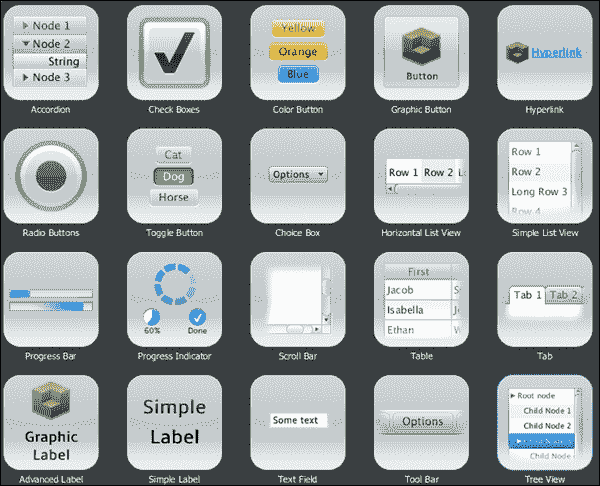

JavaFX UI 控件示例

### 注意

有关所有可用的 JavaFX UI 控件的更详细信息，请参阅[`docs.oracle.com/javase/8/javafx/user-interface-tutorial/ui_controls.htm#JFXUI336`](http://docs.oracle.com/javase/8/javafx/user-interface-tutorial/ui_controls.htm#JFXUI336)的官方教程和`javafx.scene.control`包的 API 文档。

# Java SE 8 特性

我们将深入了解 Java SE 8 的两个最重要的特性 - lambda 或 lambda 表达式和功能接口，这使得 lambda 可用于我们，以帮助编写更好、更简洁、更低样板的 JavaFX 8 代码。但是，请记住，本书不会涉及每一个 lambda 细节，因为这不是一本 Java SE 8 的书。

### 注意

要更好地了解 Java 的 lambda 路线图，请访问以下官方教程：[`docs.oracle.com/javase/tutorial/java/javaOO/lambdaexpressions.html`](http://docs.oracle.com/javase/tutorial/java/javaOO/lambdaexpressions.html)。

## Lambda 表达式

Java 语言项目**lambda**的主要目标是解决函数式编程的缺乏，并通过以类似于在 Java 中创建匿名对象而不是方法的方式轻松创建匿名（无名称）函数来提供一种轻松进行函数式编程的方法。

正如您在第一章的示例中所看到的，*开始使用 JavaFX 8*，我们讨论了在 JavaFX 按钮的按下事件上定义处理程序的常规方法，使用匿名内部类：

```java
btn.setOnAction(new EventHandler<ActionEvent>() {
   @Override
   public void handle(ActionEvent event) {
     message.setText("Hello World! JavaFX style :)");
   }
});
```

与在按钮动作中设置消息文本字段的`text`属性的单行代码相比，这段代码非常冗长。能否重写这个包含逻辑的代码块而不需要那么多样板代码？

Java SE 8 通过 Lambda 表达式解决了这个问题：

```java
btn.setOnAction(event -> {
    message.setText("Hello World! JavaFX style :)");
});
```

除了使您的代码更简洁和易于阅读外，Lambda 表达式还使您的代码执行性能更好。

### 语法

有两种编写 Lambda 表达式的方式，一般形式如下图所示：

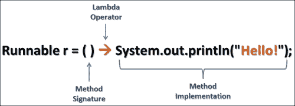

Lambda 表达式的一般形式 - 以创建新线程为例

这两种方式如下：

+   `(param1, param2, ...) -> expression;`

+   `(param1, param2, ...) -> { /* code statements */ };`

第一种形式，表达式形式，用于当我们只分配一行代码或只是一个简单表达式时。而第二种形式，块形式，是单行或多行代码的主体，带有返回语句，因此我们需要用大括号包裹它们。

以下三个语句是等价的：

+   `btn.setOnAction((ActionEvent event) -> {message.setText("Hello World!");});`

+   `btn.setOnAction( (event) -> message.setText("Hello World!"));`

+   `btn.setOnAction(event -> message.setText("Hello World!"));`

### 提示

要深入了解新的 lambda 表达式及其相关特性以及 Java SE 8 特性，我鼓励您尝试这个系列文章 - Java SE 8 新特性之旅：[`tamanmohamed.blogspot.com/2014/06/java-se-8-new-features-tour-big-change.html`](http://tamanmohamed.blogspot.com/2014/06/java-se-8-new-features-tour-big-change.html)

## 函数接口

lambda 表达式很棒，不是吗？但是您可能想知道它的确切类型，以便将其分配给变量并传递给方法。

答案在于函数接口的强大。如何？函数接口是由 Java 语言设计师/架构师巧妙地创建为闭包，使用**单一抽象方法**（**SAM**）的概念，提供了一个只有一个抽象方法的接口，并使用`@FunctionalInterface`注解。单一抽象方法模式是 Java SE 8 的 lambda 表达式的一个重要部分。

让我们通过一个示例来澄清函数接口和 lambda 表达式的概念。我创建了一个名为`Calculator.java`的函数接口，其中包含一个抽象方法`calculate()`。创建后，您可以声明并为 lambda 表达式分配变量。以下是函数接口：

```java
@FunctionalInterface
public interface Calculator {
    double calculate(double width, double height);
}
```

现在我们准备创建变量并为它们分配 lambda 表达式。以下代码创建并为我们的函数接口变量分配 lambda 表达式：

```java
Calculator area = (width, height) -> width * height; //Area = w × h
//Perimeter = 2(w+h)
Calculator perimeter = (width, height) -> 2 * (height + width);
out.println("Rectangle area: "+ area.calculate(4, 5)+" cm.");
out.println("Rectangle perimeter: "+ perimeter.calculate(4, 5)+" cm.");
```

代码的输出应该如下所示：

```java
Rectangle area: 20.0 cm.
Rectangle perimeter: 18.0 cm.
```

# 主题

与设计师和 UX/UI 专家合作时，您会听到关于为应用程序设置皮肤或更改其外观的说法。这两个术语通常可以互换使用，它们都反映了*主题*的基本概念。

主题的理念是通过改变控件的外观而不改变其基本功能来改变整个应用程序的样式。

在 JavaFX 中，您可以创建、修改或使用现有的主题来为应用程序、场景甚至只是 UI 控件设置皮肤。

## CSS

JavaFX **级联样式表**（**CSS**）可以应用于 JavaFX 场景图中的任何节点；它们是异步应用于节点的。样式也可以在运行时轻松地分配给场景，从而允许应用程序的外观动态变化。

它基于 W3C CSS 版本 2.1 规范，并且目前与版本 3 的当前工作中的一些附加功能兼容。JavaFX CSS 支持和扩展已经被设计为允许任何兼容的 CSS 解析器干净地解析 JavaFX CSS 样式表。这使得可以将 JavaFX 和其他目的（如 HTML 页面）的 CSS 样式混合到单个样式表中。

所有 JavaFX 属性名称都以`-fx-`为前缀，包括那些可能看起来与标准 HTML CSS 兼容的属性，因为一些 JavaFX 值与标准值的语义略有不同。

### 注意

有关 JavaFX CSS 的更多信息，请参阅使用 CSS 文档对 JavaFX 应用程序进行皮肤设置和[`docs.oracle.com/javase/8/javafx/api/javafx/scene/doc-files/cssref.html`](http://docs.oracle.com/javase/8/javafx/api/javafx/scene/doc-files/cssref.html)的参考指南。

### 应用 CSS 主题

这是一个自定义的简单 JavaFX CSS 规则，`ButtonStyle.css`，它将用于我们的主题过程来为按钮设置主题：

```java
/* ButtonStyle.css */
.button {
-fx-text-fill: SKYBLUE;
-fx-border-color: rgba(255, 255, 255, .80);
-fx-border-radius: 8;
-fx-padding: 6 6 6 6;
-fx-font: bold italic 20pt "Arial";
}
```

我们有两种方法可以应用 CSS 样式表来改变我们的 JavaFX 应用程序的外观和主题：

1.  使用 JavaFX 应用程序（`javafx.application.Application`）类的静态方法`setUserAgentStylesheet(String URL)`方法，可以为 JavaFX 应用程序中的所有场景和所有子节点设置样式。使用方法如下：

```java
Application.setUserAgentStylesheet(getClass().getResource("ButtonStyle.css").toExternalForm());
```

现在您可以使用 JavaFX 8 当前预装的两个样式表，Caspian 和 Modena，我们可以使用与此处相同的方法在它们之间切换：

```java
// Switch to JavaFX 2.x's CASPIAN Look and Feel.
Application.setUserAgentStylesheet(STYLESHEET_CASPIAN);

// Switch to JavaFX 8's Modena Look and Feel.
Application.setUserAgentStylesheet(STYLESHEET_MODENA);
```

### 提示

如果您通过传递空值来调用`setUserAgentStylesheet(null)`，则将加载默认的外观和感觉（在这种情况下为 Modena），而如果您使用 JavaFX 2.x Caspian，则将加载默认的外观和感觉。

1.  使用场景的`getStylesheets().add(String URL)`方法将自动为个别场景及其子节点设置样式，如下所示：

```java
Application.setUserAgentStylesheet(null); // defaults to Modena
// apply custom look and feel to the scene.
scene.getStylesheets()
.add(getClass().getResource("ButtonStyle.css")
.toExternalForm());
```

基本上，将加载默认主题（Modena），因为调用了`Application.setUserAgentStylesheet(null)`。然后通过调用`getStylesheets().add()`方法设置场景的额外样式。

首先应用样式到父级，然后应用到其子级。节点在添加到场景图后进行样式设置，无论它是否显示。

JavaFX CSS 实现应用以下优先顺序 - 用户代理样式表的样式优先级低于从代码设置的值，后者优先级低于场景或父级样式表。

内联样式具有最高优先级。来自父级实例的样式表被认为比场景样式表的样式更具体。

# Scene Builder

对于大多数复杂和复杂的 UI 需求，设计师使用工具在 WYSIWYG 界面中设计他们的 UI，而无需编写任何代码，然后将结果（`FXML`文件）加载到他们的 JavaFX 应用程序逻辑中会更容易吗？

因此，您需要 JavaFX Scene Builder；它是一个可视化布局工具，可以让您轻松地布置 UI 控件，以便您可以快速地使用效果和动画原型化您的应用程序。Scene Builder（2.0 及以上版本）是 JavaFX 8 的兼容版本。

在项目创建过程中的任何时候，您都可以预览您的工作，以检查其真实外观，然后再部署它。

它是开源的，因此与大多数 IDE 集成，但与 NetBeans IDE 更紧密。它还是一个跨平台的、独立的应用程序，可以在大多数平台上运行。

除了支持 CSS，它还允许您轻松地将自定义主题应用于您的原型。

## 下载和启动

2015 年初，Oracle 发布了 JavaFX Scene Builder 工具 2.0 版本，并宣布将不再提供 JavaFX Scene Builder 工具的构建（已编译形式）。

一家名为**Gluon**（[`gluonhq.com`](http://gluonhq.com)）的公司意识到工具可以改善或破坏编码体验。因此，他们决定开始提供基于他们将在公开可访问的存储库中维护的分支的构建。

Gluon 提供 IDE 插件，以及基于 OpenJFX 最新源代码的 JavaFX Scene Builder 工具的改进版本，还有基于社区参与和更好地支持第三方项目（如**ControlsFX** ([`www.controlsfx.org/`](http://www.controlsfx.org/))、**FXyz** ([`github.com/FXyz/FXyz`](https://github.com/FXyz/FXyz))和**DataFX** ([`www.datafx.io/`](http://www.datafx.io/))）的额外改进。

让我们从以下 URL 下载工具开始[`gluonhq.com/products/downloads/`](http://gluonhq.com/products/downloads/)。

下载版本 8.0 并安装后，启动它，Scene Builder 工具应该如下截图所示打开：

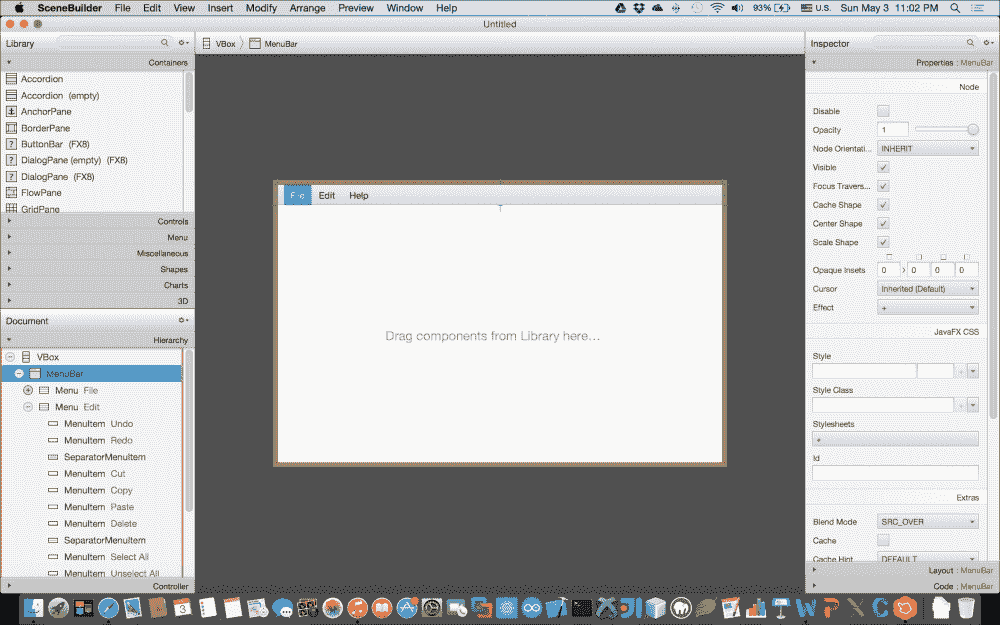

JavaFX 8 Scene Builder 工具。

## FXML

在添加组件和构建美丽的 UI 布局时，Scene Builder 在幕后自动生成一个 FXML - 基于 XML 的标记文件，以便稍后将其绑定到 Java 应用程序逻辑的 UI。

FXML 提供的主要优势之一是关注点的分离，因为它将 UI 层（*视图*）与逻辑（*控制器*）解耦；这意味着您可以随时更改 UI 而不更改底层逻辑。由于 FXML 文件未经编译，因此可以在运行时动态加载，无需任何编译。这意味着它可以帮助您进行快速原型设计。

### 将 FXML 加载到 JavaFX 应用程序中

从 Scene Builder 工具中导出结果后，很容易将 UI 设计添加到其中。这里展示了在`start()`方法中加载 FXML 文件的代码：

```java
BorderPane root = new BorderPane();
Parent content = FXMLLoader.load(getClass().getResource("filename.fxml"));
root.setCenter(content);
```

如您所见，我在`javafx.fxml.FXMLLoaderclass`上使用了`load()`静态方法，`load()`方法将加载（反序列化）由 Scene Builder 工具创建的 FXML 文件。

# 开发自定义 UI

在本章的最后部分，我们将基于 JavaFX 8 内置控件开发自定义 UI 组件。

我们将使用之前讨论过的基于 FXML 的概念来开发这个自定义 UI；其主要优势是关注点的分离，以便稍后定制组件而不改变其功能和与其绑定的任何其他逻辑。

## 登录对话框自定义 UI

我们将使用大部分之前介绍的工具和技术来开发我们的自定义 UI：登录对话框，这是每个企业应用程序中必不可少的组件。我们的 UI 组件将如下图所示：

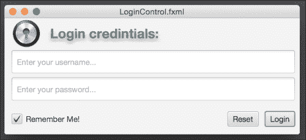

登录自定义 UI 组件

### 登录对话框自定义 UI 的结构

基于 FXML 标记的自定义组件开发中最常见的结构和阶段如下：

+   在 Scene Builder 工具中开发 UI；然后将结果导出为基于 FXML 的文件

+   从 Scene Builder 中提取控制器骨架

+   创建一个将 UI（视图）绑定到其逻辑并扩展控件或布局的控制器

+   在 Controller 构造函数中加载 FXML 文件

+   创建一个初始化方法，确保所有 FXML 控件都被成功初始化和加载

+   公开公共属性以获取和设置控件数据和需要我们实现逻辑的动作方法

+   开发一个单独的 CSS 文件

+   在您的应用程序中使用自定义组件

### 编写登录对话框自定义 UI

让我们编写和开发我们的自定义 UI，登录对话框：

1.  打开 Scene Builder 工具并创建 UI。其属性如下图所示：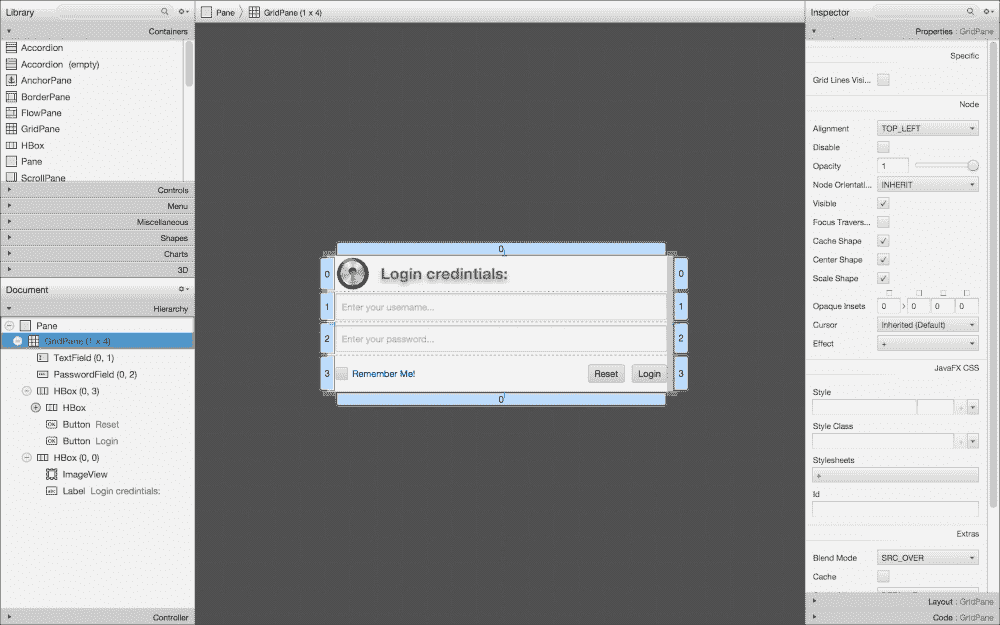

1.  登录对话框布局层次结构如下所示：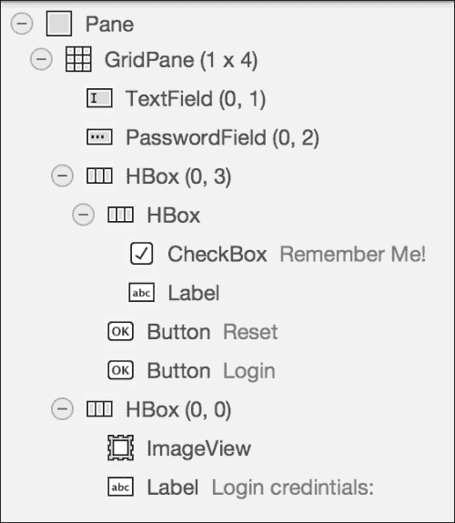

它由一个 Pane 布局作为顶部和根布局节点组成。然后，使用`GridPane(1,4)`来以一列和四行的网格布局放置控件，包括：

+   **第一**行包含`HBox`布局控件，位置为(`0,0`)，用于水平放置控件。它包括用于显示标志的`ImageView`控件和用于标题的 Label。

+   **第二**行放置了用于用户名属性的`TextField`，位置为(`0,1`)。

+   **第三**行放置了用于密码属性的`PasswordField`，位置为(`0,2`)。

+   **最后**一行，位置为(`0,3`)，有一个根布局控件`HBox`，它放置了另一个`HBox`，其中包含居中左对齐的`CheckBox`和`Label`（用于显示错误和其他消息）。然后有两个按钮控件，**重置**和**登录**，它们位于中心右侧。

+   在代码选项卡中，为对话框中的所有控件添加适当的**fx:id**名称，并为按钮和复选框事件添加`onAction`名称，如下图所示：

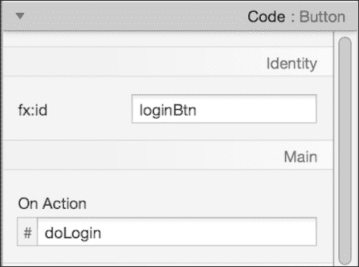

登录按钮属性

1.  从 Scene Builder 的**预览**菜单中，选择**在窗口中显示预览**。您的布局将弹出。如果一切正常，并且您对结果设计满意，从菜单栏中单击**文件**，然后单击**保存**，并输入文件名为`LoginUI.fxml`。恭喜！您已经创建了您的第一个 JavaFX UI 布局。

1.  现在我们将打开 NetBeans 来设置一个 JavaFX FXML 项目，因此启动 NetBeans，并从**文件**菜单中选择**新建项目**。

1.  在**JavaFX**类别中，选择**JavaFX FXML 应用程序**。单击**下一步**。然后将项目命名为**LoginControl**，将**FXML 名称**更改为`LoginUI`，然后单击**完成**。

### 提示

确保 JavaFX 平台是 Java SE 8。

1.  NetBeans 将创建如下的项目结构：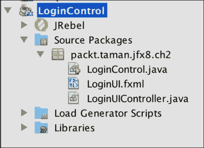

登录控制 NetBeans 项目结构。

### 注意

在运行项目之前，请确保*清理和构建*您的项目，以避免可能出现的任何问题，特别是在运行应用程序和可能在运行时加载`*.fxml`文件时可能返回`null`。

1.  转到 Scene Builder 工具，并从**视图**中选择**显示示例控制器骨架**。将打开如下截图所示的窗口，我们将复制以替换`LoginUIController.java`（这将扩展`Pane`类内容代码与 NetBeans 中复制的内容）然后修复缺少的导入。

1.  用 NetBeans 已经创建的一个替换之前生成并保存的`LoginUI.fxml`文件。

1.  右键单击`LoginController.java`文件，选择**重构**，然后选择**重命名**，将其重命名为`Main.java`。

1.  最后，在`Main.java 类`的`start(Stage stage)`方法中添加以下代码，如下所示。我们正在创建登录组件的新实例作为我们场景的根节点，并将其添加到舞台上：

```java
LoginUIController loginPane = new LoginUIController();

stage.setScene(new Scene(loginPane));
stage.setTitle("Login Dialog Control");
stage.setWidth(500);
stage.setHeight(220);
stage.show();
```

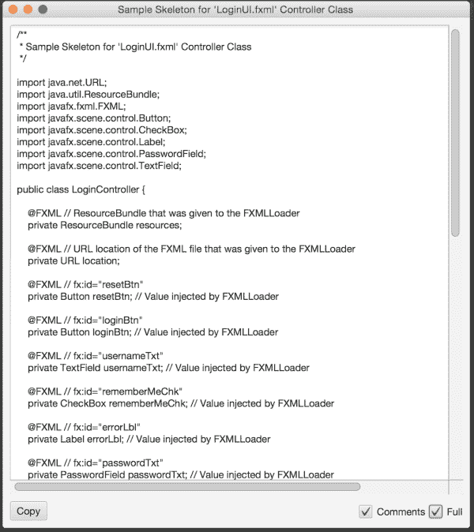

1.  在`LoginUIController.java`类中，在类名下右键单击选择**插入代码**；然后选择**构造函数**，最后在构造函数中添加以下代码：

```java
public LoginUIController() throws IOException {
  FXMLLoader fxmlLoader = new FXMLLoader(getClass().getResource("LoginUI.fxml"));
  fxmlLoader.setRoot(this);
  fxmlLoader.setController(this);
  fxmlLoader.load();
}
```

此代码加载我们的`LoginUI.fxml`文档，并将其作为 Pane 布局与其层次结构返回。然后将其绑定到当前控制器实例作为控制器和根节点。请注意，控制器扩展了 Pane 作为`LoginUI.fxml`中根元素定义。

1.  从 NetBeans 中选择**清理和构建**，然后右键单击项目选择**运行**。应该出现与之前看到的相同的屏幕。

1.  在程序运行时，输入任何凭据并单击**登录**按钮；如下截图所示，将出现红色的错误消息：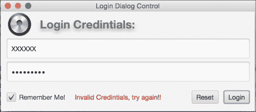

登录控制无效登录。

1.  如果输入正确的凭据（用户：*tamanm*，密码：*Tamanm*），则将显示绿色消息“*有效凭据*”，如下图所示。

1.  如果单击**重置**按钮，则所有控件都将返回默认值。

恭喜！您已成功创建并实现了一个 UI 自定义控件。

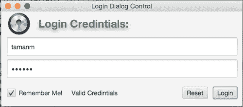

# 摘要

在本章中，我们涵盖了很多内容-简要介绍了 JavaFX 8 架构组件，这些组件作为基础层来顺利高效地运行 JavaFX 应用程序。然后我们探讨了如何在场景上呈现图形，并简要解释了最常见的布局和 UI 控件。

您已经了解了 Java SE 8 中的新功能，例如 lambda 表达式和函数接口，这些功能得到了示例的支持，展示了每个功能的强大之处。

您学会了如何使用`setUserAgentStylesheet(String URL)`和`getStylesheets().add(String URL)`方法来使用自定义 CSS 文件样式化您的应用程序。接下来，您简要了解了 Scene Builder 以及如何将 FXML 加载到场景中。最后，您学习了 JavaFX 中的自定义 UI 组件以及如何创建它们。

在下一章中，您将学习如何创建由多个场景组成的桌面应用程序，然后如何打包它。此外，我们还将学习如何与 Web 进行交互，并使用 JavaFX 8 开发 Web 应用程序。
