# 第三章。开发 JavaFX 桌面和 Web 应用程序

本章将介绍如何开发引人注目的桌面和 Web 应用程序，利用多核、硬件加速的 GPU 来提供高性能的基于 UI 的应用程序，具有惊人的外观和感觉。

由于 JavaFX 完全是用 Java 从头开始编写的，一些 Java SE 8 内置的核心库将被用于支持我们的应用程序。此外，我们将学习如何将我们的应用程序打包为一个独立的应用程序进行启动和分发。

此外，我们还将涵盖 JavaFX 8 中任何 Web 应用程序中的基本核心 Web API，如`javafx.scene.web.WebEngine`、`java.net.HttpURLConnection`和`javafx.scene.web.WebView`。

我们将讨论 JavaFX 和 HTML5 之间的关系，这很重要，因为 JavaFX 的 API 和 HTML5 的特性互补。HTML5 是一个用于创建类似于本机桌面软件特性的用户体验的丰富 Web 内容平台。

更重要的是，我们将通过开发*笔记应用程序*的桌面版本，然后在 Web 上运行。

此外，我们将涵盖部署*笔记作为 Web 应用程序*所需的所有知识和技能，包括桌面和 Web。

在本章中将学到以下技能：

+   开发和运行桌面和 Web 应用程序

+   控制应用程序 UI

+   如何打包 JavaFX 8 桌面应用程序

+   在 JavaFX 应用程序中加载 HTML5 内容

+   从 JavaFX 发送数据到 JavaScript，反之亦然

+   部署 JavaFX Web 应用程序

# 开发一个笔记应用程序

仅为一个平台构建应用程序已经不够了。桌面、Web、移动和嵌入式支持对于成功的产品都是必需的，但学习不同的环境是困难的。这就是 JavaFX 的力量发挥作用的地方，它可以编写一个可以在不同平台上运行的应用程序，只需简单的调整，我们将在本章中看到。

在这里，我们将为桌面和 Web 构建一个*笔记*应用程序。在这个项目中，我将向您展示如何使用先前安装的开发工具（参见第一章，*开始使用 JavaFX 8*）从头开始使用 JavaFX 8 SDK 和 Java 编程语言创建完整的 JavaFX 应用程序。

然后我将向您展示如何创建应用程序的两个屏幕布局并创建控制它们的 Java 类。我将创建控制不同场景之间导航、保存数据的按钮，并使用属性绑定的功能动态更新您的 UI 控件。

最终项目将看起来像以下屏幕截图：

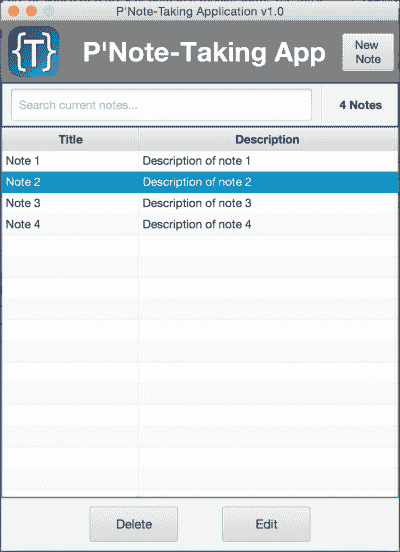

P'Note-Taking 应用程序

这张图显示了从主屏幕新建笔记按钮打开的添加和编辑屏幕，以添加新笔记或编辑列表中的一个笔记如下：


那么，您还在等什么呢？让我们开始吧！

## 构建 UI 原型

构建任何成功的应用程序的第一步（甚至是简单的应用程序）是原型化您的布局、屏幕关系、它们的状态和导航。在一张纸上草绘，然后从您的团队和经理那里获得反馈。重新修改，一旦获得批准，开始为您的客户构建一个真正的交互式原型，以便获得他们的反馈，以进行最终生产。

这就是我们现在要做的事情，我们的应用程序已经在易于使用的 UI 草图工具上布置在一张纸上，如下图所示。然后，我们将使用 Scene Builder 工具开发它作为一个完整的原型。

此外，我们将看到 NetBeans 和 Scene Builder 工具之间的互操作性。

### 注意

请注意，最好先在纸上画出布局草图，这是在与工具交互之前编辑、增强和找出最终应用程序布局的一种非常快速的方法。

现在，我们已经绘制了我们的应用程序，准备构建应用程序的真正原型。

最大限度地利用工具的最佳方法是在 NetBeans IDE 中创建应用程序骨架（*控制器类和 FXML 基本页面定义*），然后在 Scene Builder 工具中创建和开发 FXML 页面。这就是两个工具之间强大的互操作性。

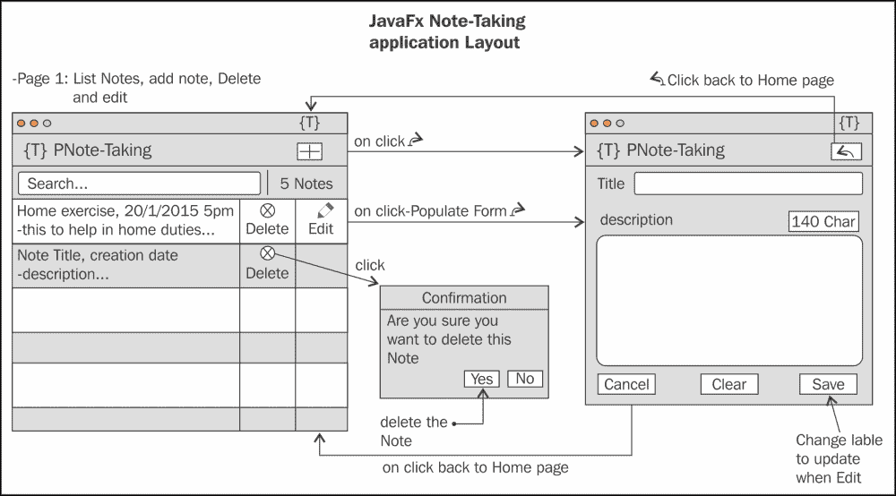

以下是开始使用 JavaFX FXML 应用程序的步骤：

1.  打开 NetBeans IDE，从主菜单中选择**文件**，然后选择**新建项目**，将打开一个**新项目**对话框。从**类别**中选择**JavaFX**，然后在**项目**下选择 JavaFX FXML 应用程序。然后，点击**下一步**按钮：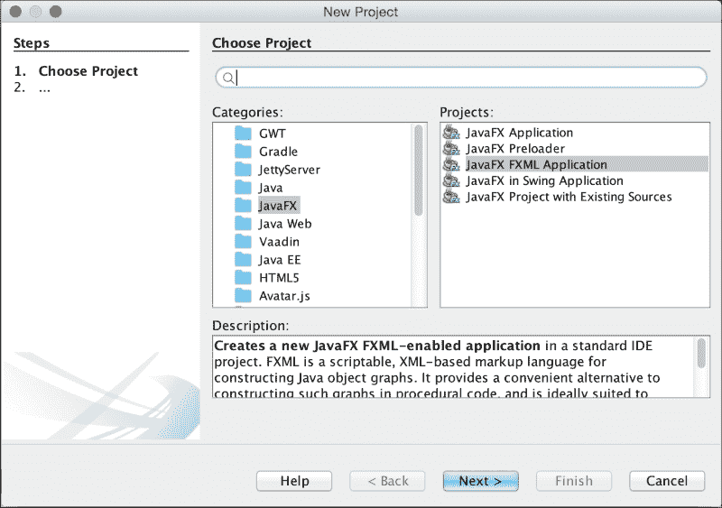

一个新的 JavaFX FXML 应用程序

1.  在**JavaFX FXML 应用程序**对话框中，添加相关信息。从**项目名称**中，添加位置和**FXML 名称**（在我的案例中为`ListNotesUI`）。在**创建应用程序类**中，我已添加`packt.taman.jfx8.ch3.NoteTakingApp`，如下图所示。点击**完成**。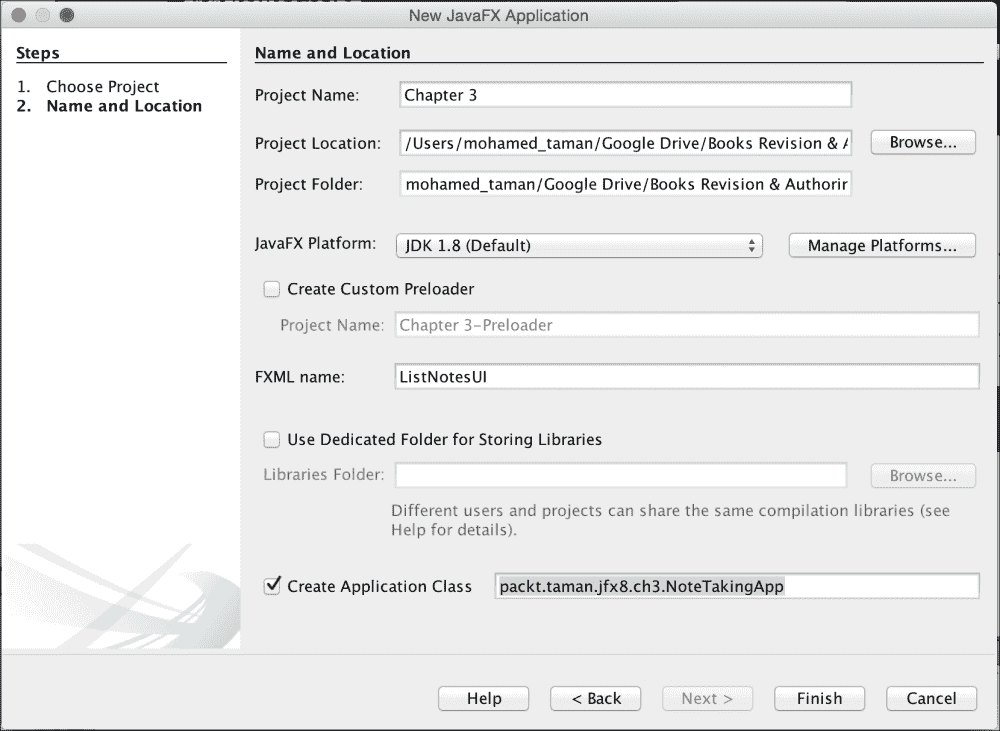

1.  现在我们有了一个带有第一个 FXML UI 文档（`ListNotesUI.fxml`）的项目，我们需要添加第二个 FXML UI 文档（`AddEditUI.fxml`）以及其控制器。

1.  要做到这一点，从文件中选择**新建文件**；然后，在**类别**列表下，选择**JavaFX**，从**文件类型**列表中选择空的 FXML，最后，点击**下一步**，如下图所示。

1.  在**新建空的 FXML 和位置**对话框中，将**FXML 名称**字段编辑为`AddEditUI`，然后点击**下一步**。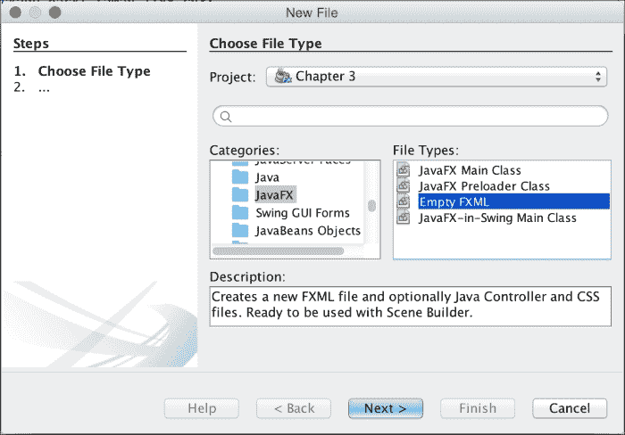

添加一个新的空的 FXML 文档

1.  在控制器类对话框中，勾选**使用 Java 控制器**复选框。确保已选择**创建新控制器**，并将**控制器名称**设置为`AddEditUIController`。然后，点击**下一步**，跳过**级联样式表**对话框，最后，点击**完成**：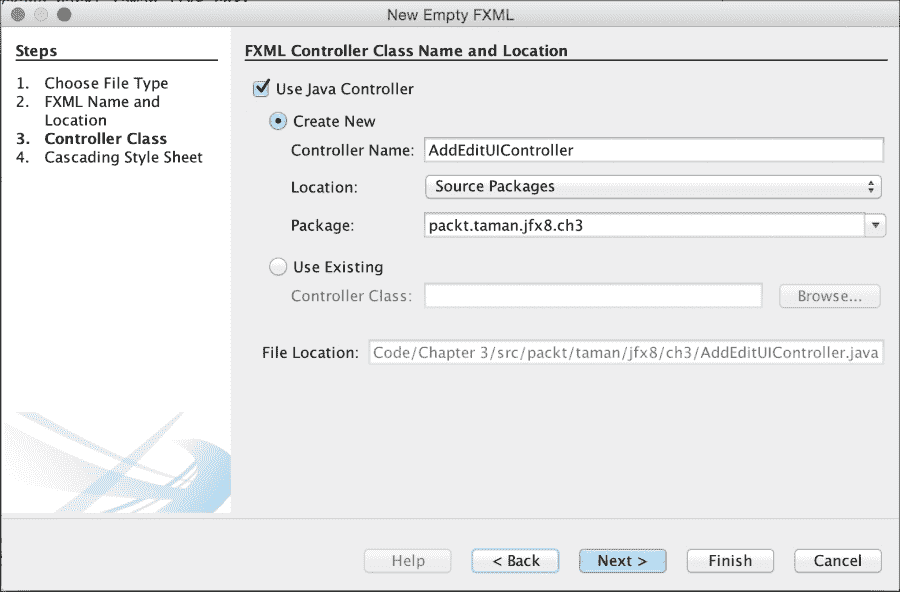

向 FXML 文档添加新控制器

当我们构建了项目结构后，就可以使用 Scene Builder 将控件添加到页面 UI 中，就像我们在纸上画的那样。这样做很容易：

1.  从 NetBeans 中，右键单击`ListNotesUI.fxml`并选择打开，或者直接双击它。**Scene Builder**将以设计模式打开您的 FXML 文档。

### 注意

注意：仅当 Scene Builder 安装在您的计算机上时才有效。

1.  根据以下截图设计页面。最重要的是，在返回 NetBeans 或关闭**Scene Builder**进行逻辑实现之前，不要忘记保存您的更改。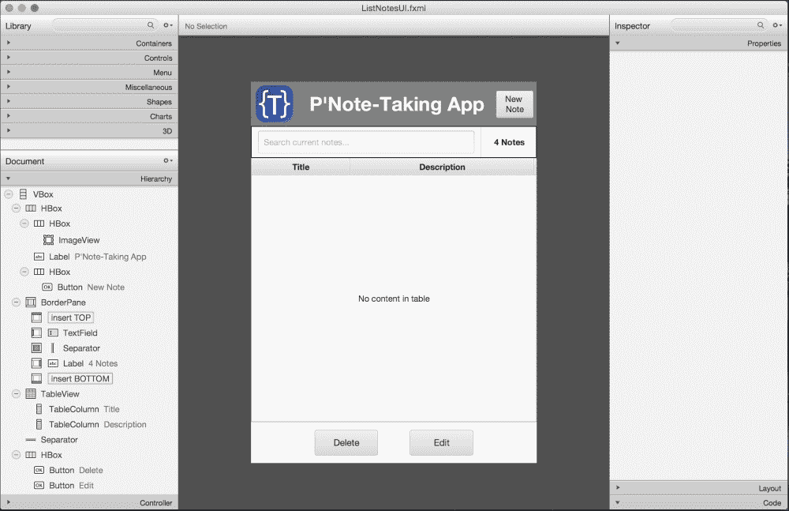

完成 ListNotesUI.fxml 文档设计

1.  对`AddEditUI.fxml`执行相同的步骤，您的设计应该最终如下所示：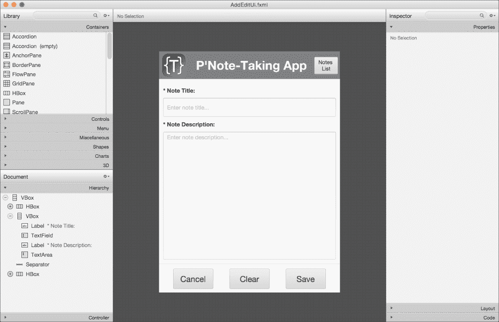

完成 AddEditUI.fxml 文档设计

您需要检查 FXML 文档，看看我们如何嵌套许多容器和 UI 控件，以实现我们之前在纸上草图中所期望的 UI，另外还要使用它们的属性来控制间距、对齐、字体和颜色。

恭喜！您已经将草图布局转换为可以呈现给团队领导和经理的项目，以获得有关颜色、主题和最终布局的反馈，而不需要逻辑。此外，一旦获得批准，您可以继续进行最终客户反馈，然后再深入业务逻辑。

## 让您的应用程序生动起来-添加交互

设计应用程序后，您需要通过使其更具交互性和响应性来使其更具生命力，以执行和响应客户提出的功能要求。

我总是首先在每个 FXML 文档控制器中添加页面导航处理程序，我已经在每个 FXML 文档控制器类中完成了这一点。

为了消除冗余并实现模块化，我在`BaseController.java`类中创建了一个基本导航方法，该方法将被系统中的所有控制器扩展。这个类将用于添加任何常见功能和共享属性。

以下方法`navigate(Event event, URL fxmlDocName)`是我们系统中所有导航中最重要的代码之一（注释说明了工作机制）：

```java
protected void navigate(Event event, URL fxmlDocName) throws IOException {
  //Loading new fxml UI document
  Parent pageParent = FXMLLoader.load(fxmlDocName);
  //Creating new scene
  Scene scene = new Scene(pageParent);
  //get current stage
  Stage appStage = (Stage)((Node) event.getSource()).getScene().getWindow();
  //Hide old stage
  appStage.hide(); // Optional
  //Set stage with new Scene
  appStage.setScene(scene);
  //Show up the stage
  appStage.show();
}
```

该方法将分别从`ListNotesUI.fxml`页面的**New Note**和编辑按钮的操作处理程序中调用`ListNotesUIController.java`，以及从`AddEditUI.fxml`页面的**List Notes**、保存和**Cancel**按钮的操作处理程序中调用`AddEditUIController.java`。

注意 FXML 文档中定义的按钮与控制器之间的关系。`@FXML`注解在这里起作用，将 FXML 属性（*使用#*）与控制器中定义的操作绑定起来：

`ListNotesUI.fxml`文件中的**New Note**按钮定义如下：

```java
<Button alignment="TOP_CENTER"
        contentDisplay="TEXT_ONLY"
        mnemonicParsing="false"
        onAction="#newNote" 
        text="New Note" 
        textAlignment="CENTER" 
        wrapText="true" 
/>
```

**New Note**操作在`ListNotesUIController.java`中定义，使用`onAction="#newNote"`绑定到前面的按钮：

```java
@FXML
 private void newNote(ActionEvent event) throws IOException {
        editNote = null;
        navigate(event, ADD.getPage());
 }
```

`AddEditUI.fxml`文件中的**Back**按钮定义如下：

```java
<Button alignment="TOP_CENTER"    
        contentDisplay="TEXT_ONLY"
        mnemonicParsing="false"
        onAction="#back" 
        text="Notes List" 
        textAlignment="CENTER"
        wrapText="true"
/>
```

**Back**操作在`AddEditUIController.java`中定义，使用`onAction="#back"`绑定到前面的按钮：

```java
@FXML
private void back(ActionEvent event) throws IOException {
        navigate(event, FXMLPage.LIST.getPage());
}
```

您可能想知道`FXMLPage.java`类做什么。它是一个枚举（有关枚举的更多信息，请访问[`docs.oracle.com/javase/tutorial/java/javaOO/enum.html`](https://docs.oracle.com/javase/tutorial/java/javaOO/enum.html)）。我已经创建了枚举来定义所有我们的 FXML 文档名称及其位置，以及与这些 FXML 文档相关的任何实用方法，以帮助简化我们系统中的编码。

### 提示

这种可维护性的概念有助于在大型系统中保持常量属性和功能在一个地方进行未来的重构，使我们能够在一个地方更改名称，而不是在整个系统中漫游以更改一个名称。

如果您检查系统控制器，您会发现处理其他按钮操作的所有逻辑 - 删除、编辑、清除和保存笔记。

### 使用属性实现应用程序更改同步

属性是 JavaFX 基于对象属性的包装对象，例如 String 或 Integer。属性允许您添加监听器代码，以在对象的包装值发生更改或被标记为无效时做出响应。此外，属性对象可以相互绑定。

绑定行为允许属性根据另一个属性的更改值更新或同步它们的值。

属性是包装对象，具有使值可读/可写或只读的能力。

简而言之，JavaFX 的属性是包装对象，保存实际值的同时提供更改支持、无效支持和绑定功能。我将在以后讨论绑定，但现在让我们来看看常用的属性类。

所有包装属性类都位于`javafx.beans.property.* package`命名空间中。以下是常用的属性类。要查看所有属性类，请参考 Javadoc 中的文档（[`docs.oracle.com/javase/8/javafx/api/index.html?javafx/beans/property.html`](https://docs.oracle.com/javase/8/javafx/api/index.html?javafx/beans/property.html)）。

+   `javafx.beans.property.SimpleBooleanProperty`

+   `javafx.beans.property.ReadOnlyBooleanWrapper`

+   `javafx.beans.property.SimpleIntegerProperty`

+   `javafx.beans.property.ReadOnlyIntegerWrapper`

+   `javafx.beans.property.SimpleDoubleProperty`

+   `javafx.beans.property.ReadOnlyDoubleWrapper`

+   `javafx.beans.property.SimpleStringProperty`

+   `javafx.beans.property.ReadOnlyStringWrapper`

具有`Simple`前缀和`Property`后缀的属性是*可读/可写属性*类，而具有`ReadOnly`前缀和`Wrapper`后缀的类是只读属性。稍后，您将看到如何使用这些常用属性创建 JavaFX bean。

让我们快进到 JavaFX 的 Properties API，看看它如何处理常见问题。您可能会注意到`TableView`控件已经添加到主页面，列出了当前加载的笔记和任何新添加的笔记。

为了正确地填充`TableView`的数据，我们应该有一个数据模型来表示笔记数据，这是我在 JavaFX 的 JavaBean 风格的 Note 类中首次使用 Properties API 的地方，它定义如下：

```java
public class Note {
    private final SimpleStringProperty title;
    private final SimpleStringProperty description;
    public Note(String title, String description) {
        this.title = new SimpleStringProperty(title);
        this.description = new SimpleStringProperty(description);
    }
    public String getTitle() {
        return title.get();
    }
    public void setTitle(String title) {
        this.title.set(title);
    }
    public String getDescription() {
        return description.get();
    }
    public void setDescription(String description) {
        this.description.set(description);
    }
}
```

为了使用应用程序数据库中已存储的数据填充`TableView`类，例如（我们这里的数据库是使用`ObservableList<Note>`来存储笔记对象的临时数据库），我们必须传递这些数据的集合。

我们需要摆脱手动更新 UI 控件（在我们的情况下是`TableView`控件）的负担，每当笔记数据集合被更新时。因此，我们需要一个解决方案来自动同步表格视图和笔记数据集合模型之间的更改，例如添加、更新或删除数据，而不需要从代码中对 UI 控件进行任何进一步的修改。只有数据模型集合被更新 - UI 应该自动同步。

这个特性已经是 JavaFX 集合的一个组成部分。我们将使用 JavaFX 的`ObservableList`类。`ObservableList`类是一个集合，能够在对象被添加、更新或移除时通知 UI 控件。

JavaFX 的`ObservableList`类通常用于列表 UI 控件，比如`ListView`和`TableView`。让我们看看我们将如何使用`ObservableList`集合类。

在`BaseController`中，我已经创建了静态数据作为`ObservableList<Note>`，以便在所有控制器之间共享，以便能够向其中添加、更新和删除笔记。同时，它初始化了一些数据，如下所示：

```java
protected static ObservableList<Note> data = FXCollections.<Note>observableArrayList(
  new Note("Note 1", "Description of note 41"),
    new Note("Note 2", "Description of note 32"),
    new Note("Note 3", "Description of note 23"),
    new Note("Note 4", "Description of note 14"));
```

在`ListNotesUIController.java`类的`initialize()`方法中，我创建了一个`javafx.collections.transformation.FilteredList`类的实例，当我们在表格内容中搜索时，它将被用作过滤类。它将`ObservableList<Note>`类型的`data`对象作为源数据传递：

```java
FilteredList<Note> filteredData = new FilteredList<>(data, n -> true);
```

`FilteredList`的第二个参数是用于过滤数据的谓词；在这里，它返回`true`，表示没有过滤，我们将在以后添加过滤谓词。

创建的`ObservableList<Note>`类型的数据列表应该传递给我们的`TableView`数据，以便表格视图监视当前数据集合的操作，比如添加、删除、编辑和过滤，就像在`ListNotesUIController.java`类的`initialize()`方法中所示的那样，但是我们传递了`filteredData`包装实例：

```java
notesListTable.setItems(filteredData);
```

最后一步是确认我们的`notesListTable`列，类型为`TableColumn`，以及要呈现和处理 Note 类的哪个属性。我们使用`setCellValueFactory()`方法来完成，如下所示：

```java
titleTc.setCellValueFactory(new PropertyValueFactory<>("title"));
descriptionTc.setCellValueFactory(new PropertyValueFactory<>("description"));
```

请注意，`title`和`description`是`Note`类的实例变量名称。

检查最终项目代码以获取完整的实现。然后，从 NetBeans 主菜单中运行应用程序，选择运行，然后点击**运行主项目**。

尝试添加一个新的笔记，观察表格视图中您新添加的笔记。尝试选择和删除笔记或更新现有的笔记。您会立即注意到变化。

通过检查应用程序代码，您会发现我们所做的一切都是操纵数据列表，所有其他的同步工作都是通过`ObservableList`类来完成的。

#### 过滤 TableView 数据列表

我们将在这里接触到两个最强大的 Java SE 8 和 JavaFX 8 功能`Predicate`和`FilteredList`。让我们阐明我们手头的问题以及我们将如何使用`stream`功能来解决它。

在我们的`ListNotesUI.fxml`页面中，您可能会注意到位于笔记表格上方的文本字段；它在这里的目的是过滤当前表格数据，以缩小结果以获取特定的笔记。此外，我们需要维护当前的列表，小心不要从中删除任何数据或为每个搜索命中查询数据库。

我们已经有了笔记数据列表，我们将使用文本字段来过滤此列表中包含此字符或字符组合的任何笔记标题或描述，如下所示：

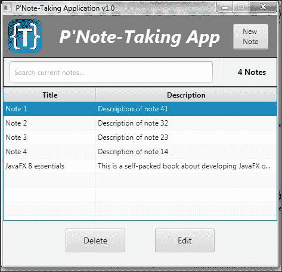

填充了数据的表格

现在，在输入`d`、`de`、`dev`或`developing`、`JavaFX`之后，表格将被过滤，如下截图所示。另外，尝试删除所有文本；您会发现数据会再次出现。接下来，我们将发现我们是如何做到的。

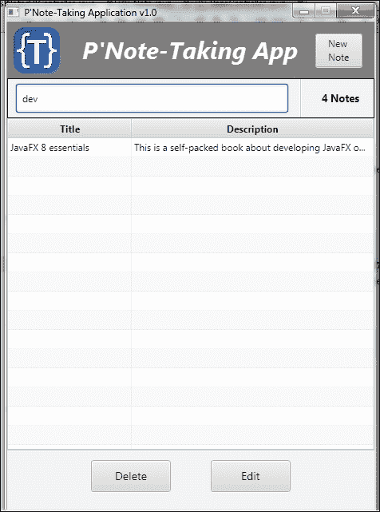

使用搜索字段中的文本过滤表格数据

以下是完成此操作的神奇代码：

```java
searchNotes.setOnKeyReleased(e ->
{
  filteredData.setPredicate(n ->
  {              
if (searchNotes.getText() == null || searchNotes.getText().isEmpty())
return true;

return n.getTitle().contains(searchNotes.getText())
|| n.getDescription().contains(searchNotes.getText());
  });
});
```

`searchNotes`是我们用来过滤笔记数据的文本字段的引用。我们已经使用`setOnKeyReleased(EventHandler<? super KeyEvent> value)`方法注册了它，一旦输入任何字符，就会获取我们的文本进行过滤。另外，请注意我们在这里使用了 Lambda 表达式，使代码更加简洁和清晰。

在动作方法的定义内部，`filteredData`是一个`FilteredList<Note>`类，我们已经传递了一个`test()`方法实现给`setPredicate(Predicate<? super E> predicate)`，只过滤与`searchNotes`文本输入匹配的笔记标题或描述。

过滤后的数据会自动更新到表格 UI 中。

有关 Predicate API 的更多信息，请访问[`docs.oracle.com/javase/8/docs/api/java/util/function/Predicate.html`](http://docs.oracle.com/javase/8/docs/api/java/util/function/Predicate.html)。

## 作为桌面应用程序的笔记

一旦您完成了应用程序，最好不要分发最终的 jar 文件，而是要求用户安装 JRE 环境以便能够运行您的应用程序，特别是如果您的目标是大众。

准备您的本机安装程序包作为`.exe`、`.msi`、`.dmg`或`.img`更加专业。

每个安装程序都会管理应用程序的要求，从所需的资产和运行时环境。这确保了您的应用程序也可以在多个平台上运行。

### 为桌面分发部署应用程序

NetBeans 的一个高级功能是通过其部署处理程序为不同的平台打包您的应用程序，它提供以下主要功能：

+   通过本机安装程序部署您的应用程序

+   管理应用程序资产，如应用程序图标、启动画面和本机安装程序图标

+   在准备最终包时，接受应用程序的最终签名证书

+   管理所需的 JavaFX 运行时版本

+   在 Windows 上使用开始菜单添加桌面快捷方式

+   处理 Java Web Start 技术的要求和自定义

让我们看看 NetBeans 部署的配置：

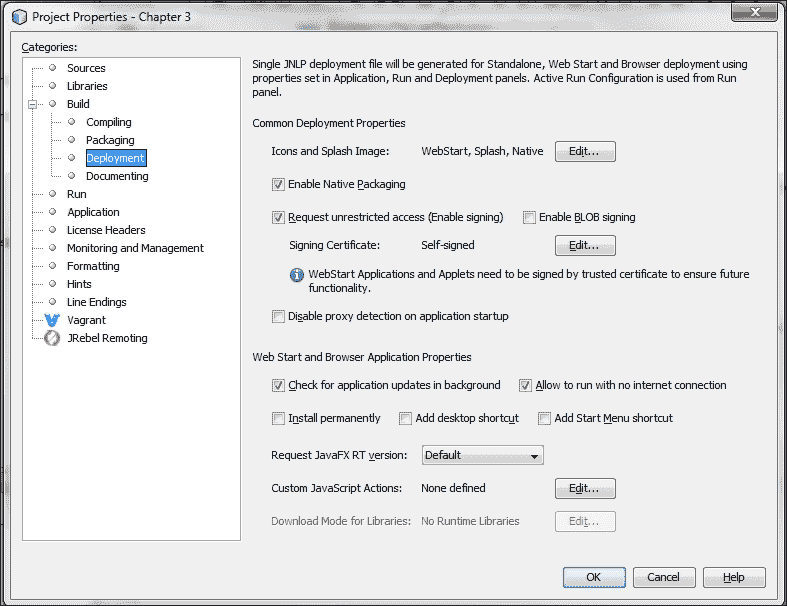

NetBeans 部署配置

要了解如何将您的应用程序打包成针对每个目标平台的本机安装程序，请访问以下网址，该网址提供了完成任务所需的所有步骤和软件：

[`netbeans.org/kb/docs/java/native_pkg.html`](https://netbeans.org/kb/docs/java/native_pkg.html)

# JavaFX 在 Web 上

在本节中，我们将学习有关 JavaFX 在 Web 上的知识，以及如何在那里部署我们的笔记应用程序。

## WebEngine

JavaFX 提供了一个能够加载 HTML5 内容的非 GUI 组件，称为**WebEngine** API (`javafx.scene.web.WebEngine`)。这个 API 基本上是`WebEngine`类的对象实例，用于加载包含 HTML5 内容的文件。HTML5 文件可以从本地文件系统、Web 服务器或 JAR 文件中加载。

使用 Web 引擎对象加载文件时，会使用后台线程加载文件内容，以免阻塞*JavaFX 应用程序线程*。

以下是两个用于加载 HTML5 内容的`WebEngine`方法：

+   load(String URL)

+   loadContent(String HTML)

## WebView

JavaFX 提供了一个 GUI `WebView` (`javafx.scene.web.WebView`)节点，可以将 HTML5 内容呈现到场景图上。`WebView`节点基本上是一个迷你浏览器，能够响应 Web 事件，并允许开发人员与 HTML5 内容进行交互。

由于加载 Web 内容和显示 Web 内容的能力之间的密切关系，`WebView`节点对象还包含一个`WebEngine`实例。

JavaFX 8 的`WebView`类实现支持以下 HTML5 功能：

+   Canvas 和 SVG

+   媒体播放

+   表单控件

+   历史维护

+   交互元素标签

+   DOM

+   Web workers

+   Web sockets

+   Web 字体

### WebView 和引擎的操作

我们将演示一个简单的示例，演示如何使用`WebView`将包含 Google 地图的 HTML5 网页文档集成到 JavaFX 中作为场景控件。然后，我们使用`WebEngine`从 JavaFX `TextField`控件中获取经度和纬度，执行一个 JavaScript 方法，将这些参数传递给地图，使地图居中显示在新传递的位置，并显示标记，如下图所示：


JavaFX 8 应用程序中的 Google 地图查看器

为了清晰起见，我将只展示和解释代码中的重要部分，这演示了前面段落中提到的概念。有关本章中的完整代码，请查看`web`包代码`GoogleMapViewerFX.java`类和`map.html`文件。

要在 JavaFX 应用程序中查看 Google 地图，我们需要首先创建一个 HTML 文件，加载并集成 Maps API，这在`map.html`文件中定义。如前面的图片所示，位置居中于埃及开罗，我的城市，这是在创建地图时传递给地图的经度和纬度值，如下面的代码片段所示：

```java
var latlng = new google.maps.LatLng(30.0594885, 31.2584644);
var Options = {
    zoom: 13,
    center: latlng,
    mapTypeId: google.maps.MapTypeId.ROADMAP
};
var map = new google.maps.Map(document.getElementById("canvas"), Options);
```

接下来，我们要注意 JavaScript `goToLocation(lng, lat)`方法；这将从 JavaFX 应用程序中使用`webEngine`实例调用，根据从 JavaFX 控件中传递的经度和纬度来定位地图。

在`GoogleMapViewerFX.java`中，我们创建了四个控件来组成我们的 UI - 两个用于经度和纬度的`TextField`类，一个更新按钮，以及一个用于查看`map.html`文档的`WebView`对象：

```java
WebView webView = new WebView();
WebEngine webEngine = webView.getEngine();
final TextField latitude = new TextField("" + 29.8770037);
final TextField longitude = new TextField("" + 31.3154412);
Button update = new Button("Update");
```

请注意，我已经创建了带有初始经度和纬度的文本控件，这与原始地图位置不同。这个位置是我的家庭位置，你可以将它改为你的位置，然后点击更新以查看新位置。

要加载`map.html`文件，我们必须将其传递给我们已经创建的`WebView`类中创建的`WebEngine`类，如前面的代码片段所示。

实现按钮的`onAction()`方法，允许 JavaFX 控件和 JavaScript 之间的集成，使用`webEngine`的`executeScript()`方法，如下面的代码所示：

```java
update.setOnAction(evt -> {
   double lat = Double.parseDouble(latitude.getText());
   double lon = Double.parseDouble(longitude.getText());

   webEngine.executeScript("" +
             "window.lat = " + lat + ";" +
             "window.lon = " + lon + ";" +
             "document.goToLocation(window.lat, window.lon);");
});
```

运行应用程序，你应该看到前面的图像定位在开罗城！点击更新，你应该到达我的家，如下图所示。

尝试获取您的位置经度和纬度；然后也回到您的家！

很强大，不是吗？很容易集成 HTML5 内容，并与已经开发的 Web 应用程序进行交互，以在现有的 JavaFX 应用程序中添加更丰富的 Web 内容。

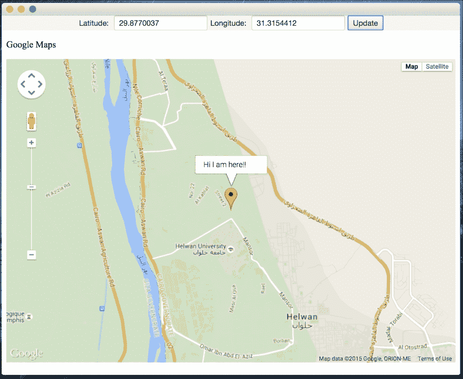

在 JavaFX 8 应用程序中更改 Google 地图位置

## 作为 Web 应用程序的笔记

一旦您的应用程序经过测试，就像我们之前讨论的那样，您可以将您的应用程序分发到多个平台和环境。我们已经在本章中使用分发的方式为桌面应用程序做了这样的操作，使用项目的`dist`文件夹下的`.jar`文件。

相同的`.jar`文件将用于 Web 部署，并且应用程序可以以多种方式部署为 Web 应用程序，我们将在接下来看到。

### 为 Web 运行应用程序

有三种方式可以在 Web 上运行您的 JavaFX 应用程序：

1.  使用**Java Web Start**下载和启动应用程序一次；然后，您可以在离线状态下从您的计算机上使用它

1.  将您的 JAR 嵌入到 HTML 文件中，以便在企业环境中运行

1.  从`WebEngine`类加载 HTML 内容，并从`WebView`类中查看它，如前所述

#### Java Web Start

Java Web Start 软件提供了通过单击启动功能齐全的应用程序的能力。用户可以下载和启动应用程序，例如完整的电子表格程序或互联网聊天客户端，而无需经过冗长的安装过程。

使用 Java Web Start，用户可以通过单击 Web 页面上的链接来启动 Java 应用程序。该链接指向一个**JNLP**（Java 网络启动协议）文件，该文件指示 Java Web Start 下载、缓存和运行应用程序。

Java Web Start 为 Java 开发人员和用户提供了许多部署优势：

+   使用 Java Web Start，您可以将单个 Java 应用程序放在 Web 服务器上，以便部署到包括 Windows、Linux 和 Solaris 在内的各种平台上。

+   它支持 Java 平台的多个同时版本。应用程序可以请求特定版本的 Java Runtime Environment（JRE）软件，而不会与其他应用程序的需求发生冲突。

+   用户可以创建一个桌面快捷方式来启动 Java Web Start 应用程序，而不需要浏览器。

+   Java Web Start 利用了 Java 平台固有的安全性。默认情况下，应用程序对本地磁盘和网络资源的访问受到限制。

+   使用 Java Web Start 启动的应用程序会在本地缓存，以提高性能。

+   对 Java Web Start 应用程序的更新在应用程序从用户的桌面独立运行时会自动下载。

Java Web Start 作为 JRE 软件的一部分安装。用户不需要单独安装 Java Web Start 或执行其他任务来使用 Java Web Start 应用程序。

有关**Java Web Start**的更多信息，请参阅以下链接：

+   Java Web Start 指南（[`docs.oracle.com/javase/8/docs/technotes/guides/javaws/developersguide/contents.html`](http://docs.oracle.com/javase/8/docs/technotes/guides/javaws/developersguide/contents.html)）

+   `javax.jnlp` API 文档（[`docs.oracle.com/javase/8/docs/jre/api/javaws/jnlp/index.html`](http://docs.oracle.com/javase/8/docs/jre/api/javaws/jnlp/index.html)）

+   Java Web Start 开发者网站（[`www.oracle.com/technetwork/java/javase/javawebstart/index.html`](http://www.oracle.com/technetwork/java/javase/javawebstart/index.html)）

### 为 Web 分发应用程序

要将您的 JavaFX 应用程序部署到 Web 上，可以使用 NetBeans 的一种非常简单的方法。

NetBeans 已经为您的 JavaFX 应用程序提供了三种部署类型 - 桌面、Java Web Start 和 Web，如下图所示：

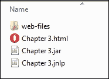

# 总结

到目前为止，我们一直在学习如何为桌面和 Web 开发 JavaFX 企业应用程序。

在本章中，我们掌握了开发任何应用程序的技能，从在纸上草绘布局开始；接下来，我们将其转化为实际的交互式、丰富多彩的 UI 原型。我们看到了如何嵌套容器和控件以实现所需的布局。一旦我们获得了最终开发的批准，我们通过使其响应客户操作并提供功能要求，使应用程序栩栩如生。

我们利用 Java SE 8 功能和 JavaFX 绑定使我们的代码更加强大、干净和简洁。最后，我们学会了如何将我们的应用程序部署到目标桌面客户端或 Web 用户，以适应不同的平台和环境。

在下一章中，我们将学习如何为基于 Android 的智能手机开发 JavaFX 应用程序。此外，我们还将学习下载和安装 Android SDK 工具以及与记录器、模拟器和其他工具进行交互的必要技能，这些工具将帮助您进行任何与 JavaFX 无关的未来移动开发。
