# 第六章：在树莓派上运行 JavaFX 应用程序

欢迎来到**物联网**（**Internet of Things**）世界。毫无疑问，你总是听到这个术语。物联网最近成为一个热门话题，也是有充分理由的。一些估计将当前连接的小型设备数量约为 90 亿台；预计到 2020 年将跃升至 240 亿台。尽管预测各不相同，但评估确实如此：就数量而言，物联网将超越以往任何计算模型。

与物联网世界密切相关的是树莓派——由树莓派基金会设计的一款信用卡大小的微型计算机，用于实验和教育。

关于树莓派，你应该知道的是它只是一台小型计算机。小功率需求，小物理尺寸，小内存，最重要的是低成本设备。关于它的一切都很小，但它仍然只是一台计算机，它使用 Linux。

Java 从诞生的第一天起就是为物联网而生的。Java 的创造是有着明确的愿景：控制电视机顶盒等小型设备。随着物联网的爆发，Java 回归到了它的根基。

你可能会认为 JavaFX，一个用于丰富客户端开发的平台，会错过物联网的盛会——但事实并非如此！根据 Oracle 技术网络上的*JavaFX 概述*页面：

> *"它旨在提供一个轻量级、硬件加速的 Java UI 平台"*

这个声明揭示了图形丰富和强大的 JavaFX 的关键：硬件加速；幸运的是，树莓派配备了强大的 GPU。

在这一章中，我们将学习关于：

+   购买、准备和配置树莓派

+   为 JavaFX 8 准备树莓派

+   远程连接到树莓派

+   在树莓派上安装和配置 Java SE 8

+   在树莓派上开发和运行 JavaFX 8 应用程序

+   使用 NetBeans 与树莓派

激动吗？需要玩得开心！好的，让我们直接开始玩我们的树莓派吧。

### 注意

自 2015 年 1 月发布 ARM 版本的 JDK 8u33 以来，Oracle 已经从 ARM 发行版中移除了 JavaFX 嵌入式。请参阅[`www.oracle.com/technetwork/java/javase/jdk-8u33-arm-relnotes-2406696.html#CACHGFJC`](http://www.oracle.com/technetwork/java/javase/jdk-8u33-arm-relnotes-2406696.html#CACHGFJC)和[`jaxenter.com/jdk-arm-without-javafx-end-javafx-embedded-114212.html`](http://jaxenter.com/jdk-arm-without-javafx-end-javafx-embedded-114212.html)。

JavaFX 嵌入式的代码已经提供给了开源项目 OpenJFX（[`wiki.openjdk.java.net/display/OpenJFX/Main`](https://wiki.openjdk.java.net/display/OpenJFX/Main)）。建议寻找 JavaFX 嵌入式替代方案的开发人员加入并为该项目做出贡献。

在这一章中，我们将学习一些克服这个问题的方法。

# 什么是树莓派？

正如我们之前提到的，树莓派是一台非常小型和低成本的计算机。事实上，它大约是信用卡大小。不要被它的大小所欺骗；正如我们所知，好东西都是包装在小盒子里的。然而，树莓派根本没有包装。

它没有外壳，其电路板和芯片完全可见，如下图所示。你可以将树莓派插入数字电视或显示器，并使用 USB 键盘和鼠标，非常容易使用。由于其小巧的尺寸，你可以轻松地将它带到任何地方。

树莓派是一台功能强大的设备，可以让各个年龄段的人探索计算，并学习如何使用 Java、JavaFX、Python 和 Scratch 等语言进行编程。此外，它可以做任何台式电脑可以做的事情——从浏览互联网和播放高清视频或游戏到处理电子表格或文字处理软件。

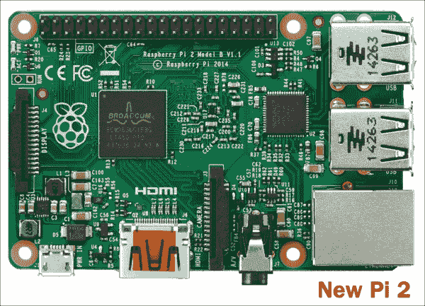

新的树莓派 2 型 B

## 你可以用它做什么？

树莓派为您提供了构建和控制设备的机会，使其按照您的意愿进行操作。例如，您可以部署自己的机器人手臂，由您编写的程序控制。您可以设计和创建自己的角色扮演游戏，或者通过编写代码制作美丽的计算机艺术或音乐。

此外，树莓派基金会的主要目标是让全世界的孩子们学会编程并了解计算机的工作原理，让学习变得有趣。

# 为什么树莓派是 JavaFX 的完美选择？

那么，树莓派为何如此适合 Java 和 JavaFX？答案可以从以下几点中找到：

+   它比规格表所显示的要快。正如所述，树莓派的默认时钟速度为 900 MHz。但是，凭借其 900 MHz 的时钟速度，可以安全地超频到 1 GHz 以及 1GB 的 RAM，这台小型计算机可以运行更大更强大的应用程序。

+   非常明智地，基金会选择了一个带有浮点支持的 CPU，通常被称为硬浮点，它比所谓的仅支持软浮点的芯片具有更高的性能。树莓派可用的操作系统利用了这种额外的功率和速度。

+   最后，树莓派具有相当强大的图形处理单元（GPU），具有快速的 3D 核心，能够以 40MBits/s 的速度使用 H.264 进行蓝光质量的播放（[`www.raspberrypi.org/help/faqs/#generalSoCUsed`](https://www.raspberrypi.org/help/faqs/#generalSoCUsed)）。

# 您应该购买哪个模块？

在撰写本文时，树莓派有五个型号：A，A+，B，B+，以及自 2015 年 2 月以来的新型号 Pi 2 B 型号。以下是 A+和 2B 型号之间的比较。

| A+型号 | 2B 型号 |
| --- | --- |
| 成本约 25 美元 | 成本约 35 美元 |
| 一个 USB 端口 | 四个 USB 端口 |
| 没有以太网 | 标准以太网连接 |
| 256MB RAM | 1GB RAM |

A+型号更便宜，但只有一个 USB 端口和没有以太网连接。这可能不是问题。如果您将一个带电源的 USB 集线器连接到 A+型号，然后使用 USB 到 WiFi 适配器，您就拥有了 B+型号的所有网络功能。两个型号之间的一个主要区别是 RAM 的数量。A+型号有 256MB 的 RAM。B+型号有 512MB 的 RAM，2B 型号有 1GB 的 RAM。这两个型号都无法升级。

所有树莓派微型计算机都配备了一个 SD 存储卡插槽，音频输出插孔，RCA 和 HDMI 的视频端口，以及一排用于通用输入和输出的引脚。还有两个用于显示和摄像头的附加连接器，但两者都需要高度专门化的硬件。鉴于价格上的小差异，通常为 10 到 25 美元，我建议首先购买 2B 型号。如果您要购买多个，比如用于教室，A+型号可能就足够了。

您可以从任何在线商店购买一个包含所有所需物品的套件，价格不会超过 100 美元，其中包括：

+   新的树莓派 2（RPi2）四核 900 MHz 1GB RAM 和 CanaKit WiFi 适配器

+   高品质的 6 英尺 HDMI 电缆，GPIO 到面包板接口板，排线，面包板，跳线，GPIO 快速参考卡和电阻颜色快速参考卡

+   8GB 三星 MicroSD 卡（树莓派基金会推荐的预装有 NOOBS 的 MicroSD 卡），高质量的树莓派 2 外壳和散热片

+   RGB LED，8 个 LED（蓝色/红色/黄色/绿色），15 个电阻，2 个按钮开关，以及初学者电子元件通用指南

+   2.5A USB 电源适配器，带 5 英尺的 micro USB 电缆，专为树莓派 2 设计（UL 认证）

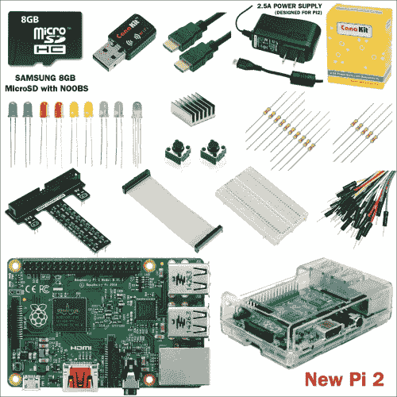

树莓派 B 型 2 的典型套件组件

## 购买树莓派

英国的树莓派基金会制造了树莓派。不幸的是，它有一段时间的缺货历史。幸运的是，您可以从几家供应商那里购买，其中一些列在[`www.raspberrypi.org/`](https://www.raspberrypi.org/)的主页上。您也可以从[`www.amazon.com`](http://www.amazon.com)购买，尽管价格会稍高一些。价格会有所不同。

最后，查看[`www.adafruit.com`](http://www.adafruit.com)。它们价格合理，还提供一些您未来项目中需要的有用配件。在这些商店中，您还可以找到包括树莓派和启动所需组件的入门套件。

## 相关网站和文档

互联网上有大量关于树莓派的信息。当您研究更高级的主题时，知道在哪里找到答案将会很有帮助。

树莓派基金会的官方网站是[`www.rasberrypi.org`](http://www.rasberrypi.org)。它列出了购买树莓派微型计算机的来源。它有各种教程和有用的论坛。

有关树莓派上运行的 Linux 版本的更多信息，请访问[`elinux.org/index.php?title=RPi_Hub&redirect=no`](http://elinux.org/index.php?title=RPi_Hub&redirect=no)。这里有关于通用和输入/输出引脚的信息；Raspbian Wheezy，专为树莓派设计的 Linux 版本；以及示例项目的信息。您还会找到有关其他嵌入式系统的信息，如**Minnow board**和**BeagleBoard**。

Neil Black 创建了一份出色的树莓派初学者指南，值得一致好评。如果在设置过程中感到困惑，请访问[`neil-black.co.uk/the-updated-raspberry-pi-beginners-guide`](http://neil-black.co.uk/the-updated-raspberry-pi-beginners-guide)。

最后，访问[`www.adafruit.com`](http://www.adafruit.com)购买树莓派以及电源适配器、电机控制板和实验套件。如果您无法在当地购买零件，这个网站是购买配件和其他组件的绝佳地方。

# 为 JavaFX 8 准备树莓派

没有操作系统，您的树莓派将无法运行，操作系统是从 SD 卡加载的。我们需要一种方法来与之交互，首先安装支持的操作系统，我们的情况下是 Raspbian Wheezy；所有 Pi 的官方支持操作系统都在链接[`www.raspberrypi.org/downloads/`](http://www.raspberrypi.org/downloads)上列出并可从中下载。

然后，我们将配置我们的 Pi 的网络设置，以便远程连接。最后，我们将检查默认安装的 Java SE 8 版本，并继续检查更新，如果操作系统没有预先打包。

如前所述，最新更新不包括 JavaFX，因此我们将找到一种方法来添加它。让我们开始准备我们的 SD 卡，安装 Raspbian Wheezy 操作系统，让树莓派运行起来。

## 创建可启动的 SD 卡

现在，我们将准备我们的 SD 卡，安装 Raspbian Wheezy 操作系统，这将允许我们与我们的树莓派进行交互。这是一个非常重要的步骤。有两种方法可以做到这一点：

### 使用 NOOBS

NOOBS 是一个简单的操作系统安装程序，其中包含 Raspbian。但是精简版不包含 Raspbian。它还提供了一系列备选操作系统，然后从互联网上下载并安装。

初学者应该从 NOOBS 方法开始，但它需要一个速度良好的互联网连接来下载首选操作系统。

如果你购买的套件配有预装的 NOOBS SD 卡，你可以跳到下一步。或者，如果你需要一个 SD 卡，你可以从 Swag 商店[`swag.raspberrypi.org/products/noobs-8gb-sd-card`](http://swag.raspberrypi.org/products/noobs-8gb-sd-card)订购，甚至自己下载并设置到你的 SD 卡上。所有步骤都在链接[`www.raspberrypi.org/help/noobs-setup/`](http://www.raspberrypi.org/help/noobs-setup/)中提供。

将 Raspbian Wheezy 操作系统烧录到你的 SD 卡：

这是我最喜欢的设置，因为我已经下载了操作系统，将直接将其烧录到我的 SD 卡上；以下是在 Mac OS X 上执行此操作的步骤（确保你有一个有效的 SD 卡，容量为 4/8/16GB，等级为 10）：

我们需要将 SD 卡格式化为 FAT32。我们可以使用 SD Formatter 4.0 轻松实现这一点，它适用于 Windows 或 Mac，可以从 SD 协会的网站[`www.sdcard.org/downloads/formatter_4/eula_mac/index.html`](https://www.sdcard.org/downloads/formatter_4/eula_mac/index.html)下载。

按照安装软件包的说明进行操作：

1.  将你的 SD 卡插入计算机或笔记本电脑的 SD 卡读卡器，并*记下*分配给它的驱动器号—例如，在我的情况下是`/disk2`。

1.  在**SDFormatter**中，选择你的 SD 卡的驱动器号，转到**格式选项**并选择**覆盖格式**，命名为`RaspWheezy`（可选），然后点击**格式化**。根据卡的大小，格式化 SD 可能需要一些时间。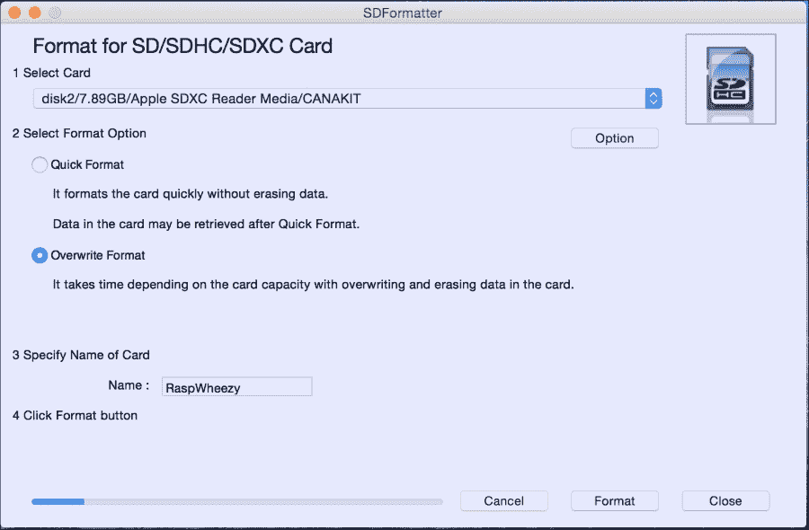

使用 SDFormatter 应用程序格式化 SD 卡

1.  格式化完成后，关闭 SDFormatter。如果你在 Mac 或 Linux 上，从终端运行以下命令行来检查磁盘号和格式类型：

```java
$ diskutil list

```

在这种情况下，SD 卡是`/dev/disk2`，格式类型为`DOS_FAT_32`，名称为`RASPWHEEZY`。在 Windows 上，打开 Windows 资源管理器并检查驱动器。

### 注意

不要搞错了，否则可能会破坏错误的`磁盘/卡/驱动器`上的所有数据。

1.  从链接[`downloads.raspberrypi.org/raspbian_latest`](http://downloads.raspberrypi.org/raspbian_latest)下载 Raspbian Wheezy 操作系统，解压缩，你应该会得到`2015-02-16-raspbian-wheezy.img`文件。

1.  在 Mac 或 Linux 的命令行上，卸载磁盘但不要弹出：

```java
$ diskutil unmountDisk /dev/disk2

```

1.  然后使用`dd`命令将镜像写入 SD 卡：

```java
$ sudo dd if=/path/to/2015-02-16-raspbian-wheezy.img of=/dev/rdisk2 bs=1m

```

输入密码后，写入过程开始，你需要等待直到再次获得提示。由于这将需要几分钟，在 Windows 上，你可以使用 Win32DiskImager（可以从[`www.raspberry-projects.com/pi/pi-operating-systems/win32diskimager`](http://www.raspberry-projects.com/pi/pi-operating-systems/win32diskimager)下载）。

1.  `dd`命令完成后，弹出卡：

```java
$ sudo diskutil eject /dev/rdisk2

```

### 注意

请注意，`dd`在没有错误或完成之前不会反馈任何信息；完成后将显示信息并重新挂载磁盘。但是，如果你希望查看进度，可以使用*Ctrl* + *T*快捷键。这会生成**SIGINFO**，你的`tty`的状态参数，并显示有关该进程的信息。

恭喜，现在将你的 SD 卡安装到树莓派上，并连接到合适的显示器上启动它。

## 配置树莓派

现在，我们需要为第一次启动设置 Pi，并配置一个静态 IP 以便从我们的笔记本电脑和远程连接到它：

1.  挂载我们之前准备好的 SD 卡。

1.  连接键盘、鼠标和显示器电缆。

1.  将 WiFi 适配器插入其中一个 USB 端口。

1.  现在，将电源线插入 Pi。

1.  你应该在屏幕上看到一些详细的输出，启动 Raspbian 操作系统。大胆前行，毫无畏惧。

1.  在第一次启动时，树莓派配置屏幕将显示，并为你提供一系列选项，你可以用它们来配置你的树莓派。基本上，你会想要设置你的时区和本地配置。查看在 CPU 和 GPU 之间的内存分配设置，或者启用 SSH。但在大部分情况下，你可以简单地忽略它们，用箭头键移动到最后一步，然后按回车键。

1.  如果在配置过程中选择了你不喜欢的东西，你可以通过在控制台中输入`sudo raspi-config`来重新启动配置。

1.  如果树莓派配置正确，你会看到一系列 Linux 启动消息滚动，然后会出现一个登录请求。默认用户登录是`pi`，密码是`raspberry`。现在，你将看到一个标准的 Linux 提示符。恭喜，你的树莓派已经启动运行。

1.  Wheezy 带有图形用户界面。只需输入`sudo startx`，你就会看到一个色彩丰富的用户界面，包括游戏、文字处理器和网页浏览器，如下面的截图所示：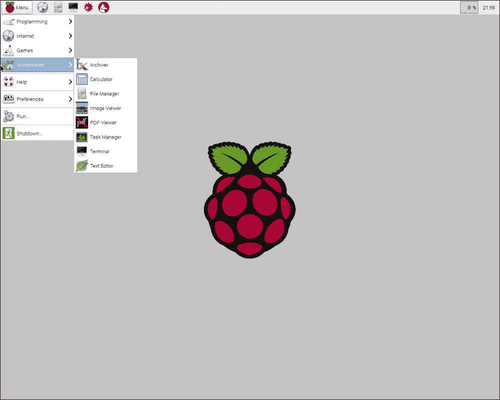

树莓派桌面

树莓派桌面是**轻量级 X11 桌面环境**（**LXDE**）。花一些时间来探索它。你会发现它非常熟悉，尽管比你的高性能台式电脑慢一些。

当你完成 LXDE 后，只需注销，你就会回到 Linux 提示符。为了保存在 SD 卡上的信息，优雅地关闭你的树莓派是很重要的。在你拔掉电源线之前，发出一个关闭命令：

```java
$ Sudo shutdown -h now.

```

这将确保在关闭所有进程之前将所有内容写入 SD 卡。现在，你可以安全地拔掉电源线，这就是树莓派的开关的全部功能。

恭喜，你已经完成了你的第一个树莓派会话。

## 远程连接到树莓派

通常，你会使用外围设备和显示器连接到你的树莓派，但这并不总是情况，因为在开发阶段或树莓派本身被用作控制家用电器的酷炫服务器时，你需要从你的计算机、浏览器甚至移动设备上控制你的树莓派。

给树莓派分配固定的网络地址并不是必需的，但强烈建议这样做。这样做意味着你总是使用相同的地址（或名称，如果你在主机文件中创建了一个条目）连接到你的树莓派，因此它会从你的开发过程中删除一个潜在的变量。

更新网络 DHCP 设备/路由器与树莓派的 IP 地址也是一个好主意，这样它就不会尝试将其分配给网络上的另一个设备。执行此操作所需的步骤将因交换机/路由器制造商而异。

我们将在树莓派上安装 VNC 服务器。**虚拟网络计算**（**VNC**）允许你通过网络控制一台计算机。它提供了一个图形用户界面，包括鼠标和键盘。在我们的情况下，它将允许我们看到和使用树莓派的 GUI，而无需连接到树莓派的物理键盘和鼠标。

目前，这是一个便利，如果你对当前的鼠标、键盘和显示器设置满意，你可以跳过这一部分。当你开始尝试需要一个或多个 USB 端口的设备时，VNC 将成为必需品。

设置 VNC 有五个步骤：

1.  连接到家庭 WiFi 互联网。

1.  在树莓派上安装 VNC。

1.  设置开机启动。

1.  设置静态 IP 地址。

1.  使用客户端连接 VNC。

远程连接到 WiFi 互联网，Raspbian Wheezy 包括一个 WiFi 配置实用程序。此外，2012 年 10 月 28 日之后发布的所有 Raspbian 都预装了此实用程序。

### 注意

设置 WiFi 要求你的路由器正在广播 SSID。确保你的路由器上设置了*广播 SSID*！这不适用于私人 SSID 设置。

现在，让我们远程连接树莓派：

1.  从 Raspbian 桌面，转到**菜单** | **首选项** | **WiFi 配置**，如下屏幕截图所示：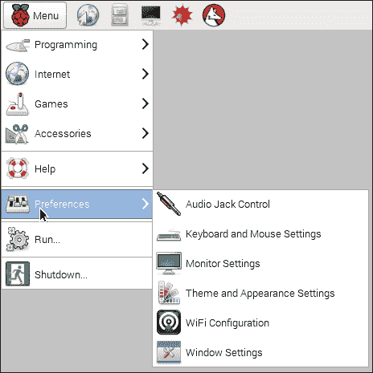

选择 WiFi 配置实用程序

1.  双击图标，您将看到以下窗口：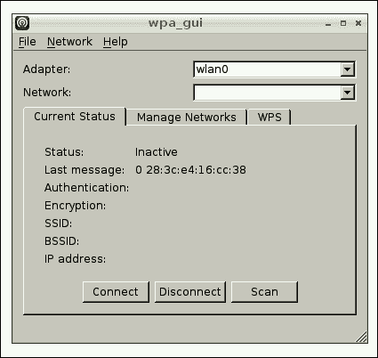

WiFi 配置实用程序 GUI

1.  单击**扫描**按钮，将打开第二个窗口。在列表中找到您的无线接入点，并双击它。这将打开另一个窗口：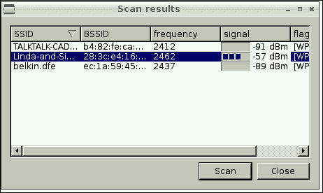

接入点列表

1.  在`PSK`字段中输入密码，然后单击**添加**。当您查看第一个窗口时，您应该看到连接已经设置好可以使用。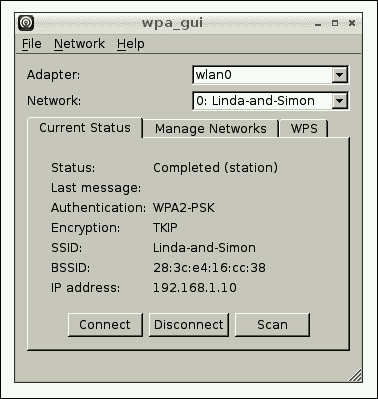

添加接入点的最终状态

您可以使用按钮连接或断开连接。您可以在前面的屏幕截图中看到树莓派的 IP 地址显示在窗口底部。

请注意，有一个手动程序可以在终端上设置 WiFi 连接。这需要编辑`config`文件并手动添加网络的 SSID 和密码。有关更多信息，请访问[`www.raspberrypi.org/documentation/configuration/wireless/wireless-cli.md`](https://www.raspberrypi.org/documentation/configuration/wireless/wireless-cli.md)。

恭喜，您的树莓派已连接到互联网。现在让我们安装 VNC 服务器。

### 在树莓派上安装 VNC

现在您已经连接到互联网，可以在树莓派上安装 VNC 服务器。如果您使用的是 Raspbian Wheezy，这很简单。在命令提示符下，输入以下命令：

```java
$ sudo apt-get install tightvncserver

```

您将收到消息：**您想继续吗？是或否？**

让我们用大写*Y*回答并休息一下。安装完成后，输入以下命令：

```java
$ vncserver

```

您将被要求创建一个密码，我使用*raspberry*。它指出密码长度超过八个字符；继续重新输入`raspberry`。接下来，您将被问到：**您想输入只读密码吗？**输入*N*表示否。

恭喜，您已在树莓派上运行 VNC。

#### 设置 VNC 在启动时启动

随着您变得更加高级，您可能并不总是需要 VNC，但让我们假设您希望每次启动树莓派时都运行 VNC：

1.  使用以下命令从 Pi **LX 终端**编辑`rc.local`文件：

```java
$ sudo nano /etc/rc.local

```

1.  滚动到底部，在`exit 0`上面添加以下行：

```java
su -c "/usr/bin/tightvncserver -geometry 1280x1024" pi

```

1.  保存文件并使用以下命令重新启动树莓派：

```java
$ sudo shutdown -r now

```

1.  现在，每次启动树莓派时，VNC 都将可用。

### 设置静态 IP 地址

通过 VNC 连接树莓派需要一个静态 IP 地址，即不会更改的 IP 地址。我将向您展示如何在接下来的几个步骤中为有线和无线网络获取静态 IP 地址：

1.  如果您在家庭网络上，您需要发现一个可用的 IP 地址。为此，转到您的树莓派，打开 Pi LX 终端，然后输入：

```java
mohamed_taman$ ifconfig –a

```

然后，输入以下命令：

```java
mohamed_taman$ netstat -nr

```

1.  收集以下信息：*当前 IP*（如果您想保留它），*子网掩码*，*网关*，*目的地*和*广播*。记下这些，您很快会需要它们！

1.  在树莓派上，通过运行以下命令备份`/etc/network/interfaces`：

```java
$ sudo cp /etc/network/interfaces /etc/network/interfaces.org

```

1.  使用以下命令修改`interfaces`文件：

```java
$ sudo nano /etc/network/interfaces

```

1.  从以下更改`interfaces`文件：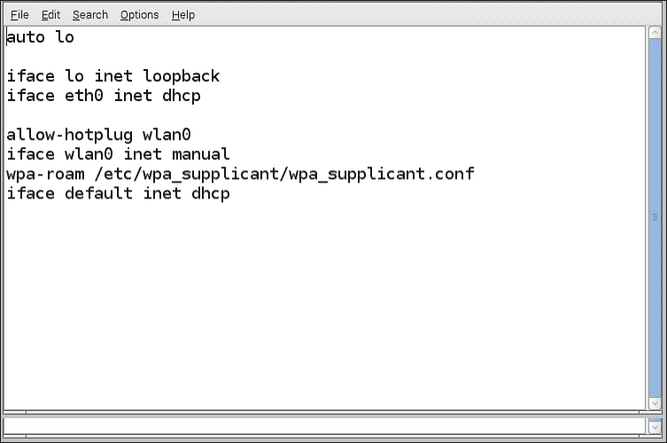

编辑前的 interfaces 文件

1.  选择适合您网络的 IP 号码；还要将`wpa-ssid`更改为您的无线网络名称，将`wpa-psk`更改为无线密码：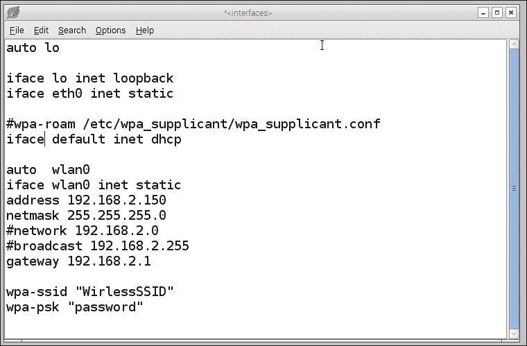

编辑后的 interfaces 文件

1.  保存文件并重新启动树莓派。这些设置适用于有线和无线连接。恭喜，您现在可以使用 VNC 客户端连接到您的树莓派。

### 树莓派的自动登录

像大多数人一样，你可能买了树莓派来为家庭或办公室构建自己的设备。接下来你应该做的是设置树莓派，连接你的外围设备，并安装或开发必要的软件。

你在项目结束时想要的是打开设备并看到你期望的所有魔术。

当 Pi 引导到登录提示并等待你输入用户名和密码时，问题就来了。所以，让我们自动化树莓派登录：

1.  从你的 Pi 上，打开一个终端并使用以下命令编辑`inittab`文件：

```java
sudo nano /etc/inittab

```

1.  通过导航到`inittab`中的以下行来禁用`getty`程序：

```java
1:2345:respawn:/sbin/getty 115200 tty1

```

1.  在该行的开头添加`#`来注释掉它，如下一行所示：

```java
#1:2345:respawn:/sbin/getty 115200 tty1

```

1.  在注释行下方添加一个登录程序到`inittab`：

```java
1:2345:respawn:/bin/login -f pi tty1 </dev/tty1 >/dev/tty1 2>&1

```

1.  这将使用`pi`用户运行登录程序，而无需任何身份验证。

1.  按*Ctrl* + *X*保存并退出，然后按*Y*保存文件，然后按*Enter*确认文件名。

重新启动 Pi，它将直接引导到 shell 提示符`pi@raspberrypi`，而不会提示你输入用户名或密码。

### 使用客户端连接 VNC

在继续之前，让我们确保一切都正常工作。为此，你需要一个 VNC 客户端。如果你使用的是带有最新版本 Mac OS X 的 Macintosh，这很简单。

转到**Finder** | **前往** | **连接到服务器**。输入`vnc://`和你给树莓派分配的 IP 地址。在我的情况下，是 192.168.2.150 后跟一个冒号和数字 5901，如下截图所示。完整的 URL 应该是**vnc://192.168.2.150:5901**。

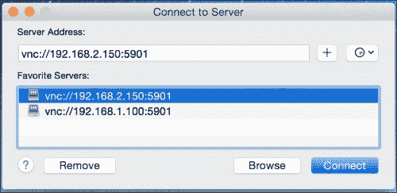

连接到 Pi VNC 服务器。

如图所示，`5901`是树莓派 VNC 服务器正在监听的端口号。点击**连接**。不用担心屏幕共享加密，再次点击**连接**。现在输入之前创建的密码（`raspberry`）。如果一切正常，你会看到一个大的树莓。恭喜！

如果你不是在 Macintosh 电脑上，你需要下载一个 VNC 客户端。你可以从[`realvnc.com/`](http://realvnc.com/)获取免费的查看器。有 Windows、iOS、Android 和 Chrome 浏览器的客户端。是的，你可以用手机控制你的树莓派。

# JavaFX 8 开发先决条件

现在，我们已经为开发设置和配置了我们的树莓派，我们需要在我们的开发机器和 Pi 上安装相同正确匹配的 JDK 8 构建版本。这对于在运行我们的 JavaFX 8 应用程序时避免库/版本问题非常重要，这就是我们接下来要做的事情。

## 在树莓派上安装 Java SE 8

在撰写本文时，Raspbian Wheezy 预装了 JDK 8。要检查，只需在 Pi 命令提示符下输入以下内容：

```java
pi@raspberrypi ~ $ java –version

```

你会看到类似于这样的东西，取决于当前安装和可访问的版本：

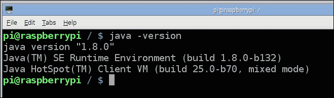

树莓派 Wheezy 上的 Java 版本

重要的是第二行：如果它不是 1.8.n，你需要安装 JDK8。

## 安装 Java SE 8

我们已经在之前安装了我们的 JDK 8，并且所有必要的步骤都在第一章的*安装 Java SE 8 JDK*部分中描述。

## 添加 JavaFX

如前所述，Oracle 已经撤销了对 JavaFX 嵌入式的支持。如果你安装了 JDK 8u45 或预装在 Raspbian Wheezy 上的版本，没有`jfxrt.jar`捆绑，所以我们需要提供它以便在我们的 Pi 上运行 JavaFX 应用程序。

一种方法是按照[`wiki.openjdk.java.net/display/OpenJFX/Cross+Building+for+ARM+Hard+Float`](https://wiki.openjdk.java.net/display/OpenJFX/Cross+Building+for+ARM+Hard+Float)上的教程，为 ARM 交叉构建 OpenJFX。这是给非常高级的开发者。

一个更简单的方法是下载一个预构建的发行版，比如托管在 JavaFXPorts 项目上的`armv6hf-sdk.zip`（[`bitbucket.org/javafxports/arm/downloads`](https://bitbucket.org/javafxports/arm/downloads)）。

一旦你下载了`armv6hf-sdk.zip`，解压它并添加这个命令行选项，将外部源附加到`classpath`上，使用扩展机制：

```java
-Djava.ext.dirs=<path to armv6hf-sdk>/rt/lib/ext

```

或者，你可以将这个 zip 文件中`rt/lib/ext`和`rt/lib/arm`的内容复制到你的 JVM 文件夹中，避免使用扩展机制。

## 为树莓派配置 NetBeans

NetBeans 8 增加了指向远程 JDK 并使用它来远程调试和执行你在本地开发机器上编写的程序的能力。它甚至可以自动无缝地部署你的应用程序。正如 José Pereda 在他的文章[`netbeans.dzone.com/articles/nb-8-raspberry-pi-end2end`](http://netbeans.dzone.com/articles/nb-8-raspberry-pi-end2end)中所记录的，你可以通过以下步骤启用这个功能。

1.  在你的机器上启动 NetBeans。

1.  从菜单栏选择**工具**，然后选择**Java 平台**。点击**添加平台**按钮。

1.  选择**远程 Java 标准版**单选按钮，然后点击**下一步**。

1.  提供以下条目（如下截图所示）：

**平台名称**：`JavaFX on Raspberry Pi JDK 8`

**主机**：输入你之前分配的树莓派的静态 IP 地址或主机名

**用户名**：`pi`

**密码**：`raspberry`

**远程 JRE 路径**：`/usr/lib/jvm/jdk-8-oracle-arm-vfp-hflt/jre`

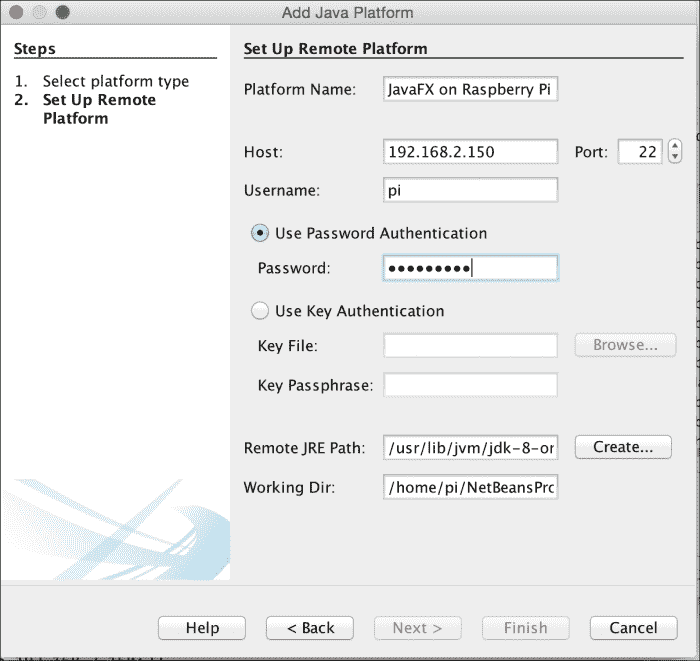

为 Pi 设置远程平台

1.  点击**完成**按钮，等待 NetBeans 建立和配置远程 JDK 连接。

1.  一旦远程 JDK 就位，点击**关闭**按钮。

现在我们已经完成了设置，你应该拥有一个开发环境，它是为开发 JavaFX 8 应用程序为树莓派提供的最好的之一。那么让我们开始吧！

# 开关应用程序

开关应用程序在其本质上非常简单，但主要分为两个要点：如何在树莓派上运行 JavaFX 8 应用程序，以及如何从树莓派的**通用输入/输出**（**GPIO**）控制外部世界。我们将使用一个名为**Pi4j**的项目来实现这个目的。

这个想法很简单；我们将创建一个 JavaFX 应用程序，它将充当一个开关控制器，用于控制连接到你的树莓派的电路上的 LED。

以下截图显示了应用程序处于开启和关闭状态：

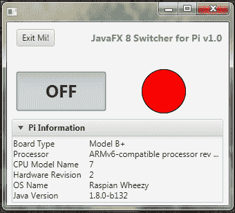

开启应用程序开关状态

为树莓派配置 NetBeans

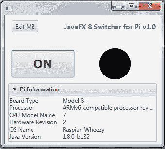

关闭应用程序开关状态

## 什么是 Pi4J 库？

Pi4j 库（[`pi4j.com`](http://pi4j.com)）是一个旨在提供本地库和 Java 之间的桥梁，以完全访问树莓派功能和控制的项目，因此你可以轻松地访问 GPIO 引脚用于你的 Java 项目。

访问[`pi4j.com/pins/model-2b-rev1.html`](http://pi4j.com/pins/model-2b-rev1.html)查看树莓派 2 型 B（J8 头）的 GPIO 引脚编号。此外，你的套件的 GPIO 适配器可能附带 GPIO 引脚头的快速参考。

对于这个例子，你将需要一些基本的电子元件，比如 LED、电阻和面包板。如果你的套件中没有包括这些，你可以从网上商店购买。

### 电路设置

现在我们需要通过在面包板上添加一个带有 220 欧姆上拉电阻的 LED 来设置我们的电路，并将阳极连接到 GPIO 引脚＃1，阴极连接到 GPIO GND 引脚，如下图所示（CanaKit 附带了一个常用电子零件的通用组装指南）：

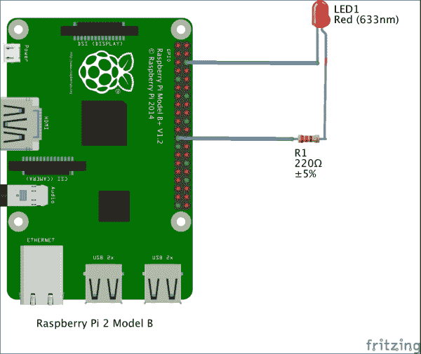

开关器应用电路设置

## 应用程序

如前所述，应用程序 UI 包含两个按钮。**退出！**负责关闭 GPIO 控制器并关闭应用程序。第二个按钮是一个切换按钮（**开**/**关**），可以作为开关使用。它有两种状态：选中时，其状态为 true，当未选中时，其状态为 false。此外，我们通过编程方式更改其标签，以指示当前受控 LED 的状态。

此外，还有一个圆形形状，模仿了物理 LED 状态。因此，当切换按钮打开时，圆圈将填充为红色。关闭时，它变成黑色，这是默认状态。

最后，在应用程序场景的底部，我们添加一个名为 Pi 信息的`TitledPane`，显示一些树莓派信息。

通过查看`SwitchUIController.java`类，您会发现在与`Pi4J`库交互之前，我们有一些非常重要的字段要声明：

```java
private GpioController gpio;
private GpioPinDigitalOutput pin;
```

第一行负责创建一个新的 GPIO 控制器实例，这是通过`initialize()`方法通过`GpioFactory`完成的，因为它包括一个`createInstance`方法来创建 GPIO 控制器：

```java
gpio = GpioFactory.getInstance();
```

### 注意

您的项目应该只实例化一个 GPIO 控制器实例，并且该实例应该在整个项目中共享。

要访问 GPIO 引脚，必须首先配置引脚。配置根据您打算如何使用它来配置引脚。配置可以自动导出引脚，设置其方向，并为基于中断的事件设置任何边缘检测：

```java
// provision gpio pin #01 as an output pin and turn on
pin = gpio.provisionDigitalOutputPin(GPIO_01);
```

这是如何配置输出引脚＃1。您的程序将只能控制那些配置为输出引脚的引脚的状态。输出引脚用于控制继电器、LED 和晶体管。

现在我们想要做的就是使用切换按钮从我们的应用程序控制 LED。这是通过注册到切换按钮的`doOnOff()`事件函数来完成的，如下面的代码所示：

```java
    @FXML
    private void doOnOff(ActionEvent event) {
        if (switchTgl.isSelected()) {
            pin.high();
            led.setFill(RED);
            switchTgl.setText("OFF");
            System.out.println("Switch is On");
        } else {
            pin.low();
            led.setFill(BLACK);
            switchTgl.setText("ON");
            System.out.println("Switch is Off");
        }
    }
```

`P14J`库提供了许多方便的方法来控制或向 GPIO 引脚写入状态。在我们的应用程序中，我们使用`pin.high()`来打开 LED，使用`pin.low()`来关闭 LED。

最后，当应用程序退出时，我们必须关闭 GPIO 控制器。Pi4J 项目提供了一个实现，可以在应用程序终止时自动将 GPIO 引脚状态设置为非活动状态。

这对于确保 GPIO 引脚状态在程序关闭时不活动或保持某些活动是有用的。我们可以简单地使用我们之前创建的 GPIO 实例的以下代码行来实现这一点：

```java
gpio.shutdown();
```

当您按下切换按钮以打开 LED 时，您会看到绿色 LED 发光。当它关闭时，您会看到 LED 变暗。

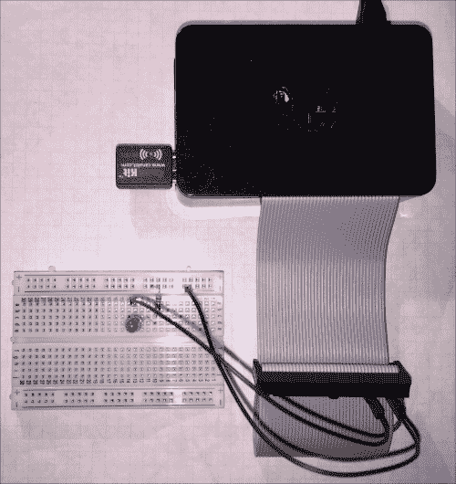

应用电路-LED 关闭

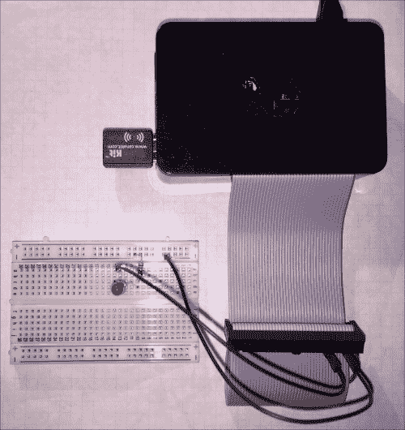

应用电路-LED 开启

接下来，让我们配置我们的项目，从 NetBeans 直接在树莓派上运行我们的 JavaFX 开关应用程序。

# 在 NetBeans 中使用 Pi

在讨论了我们的应用程序逻辑并了解了它的工作原理之后，现在是最好的部分：使用 NetBeans 构建您的应用程序并在树莓派上运行它。步骤如下：

1.  在 NetBeans 的**项目**选项卡中右键单击`Chapter6`项目，然后选择**属性**。

1.  从**项目属性**框中，从左侧的**类别**菜单中选择**运行**。您将看到一个类似于以下截图的对话框：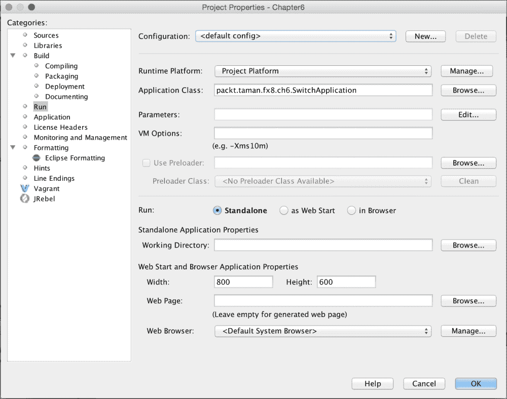

项目属性对话框和运行实例

1.  单击所选“配置”右侧的“新建”按钮。为“新配置”（`Pi Remote Config`）设置一个名称，然后单击“确定”按钮，如下面的屏幕截图所示：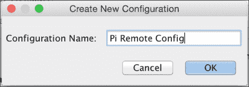

新配置

1.  现在您必须将远程 JDK 与远程配置关联起来。要这样做，单击标记为“运行平台”的组合框，并选择您之前配置的`JavaFX on Raspberry Pi JDK 8`。不要忘记在“VM 选项”中添加`jfxrt.jar`的路径：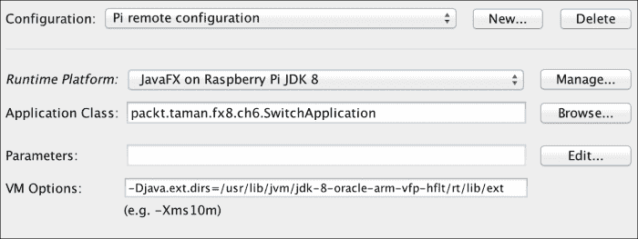

远程 Pi JDK 关联

1.  最后一步是构建并部署应用程序到树莓派。要这样做，转到“运行”菜单，选择“运行项目”，并观看 NetBeans 输出窗口/选项卡。在运行应用程序时，如果您留意 Pi 的屏幕，您将看到以下输出消息：

```java
jfx-deployment-script:
jfx-deployment:
jar:
Connecting to 192.168.2.150:22
cmd : mkdir -p '/home/pi/NetBeansProjects/Chapter6/dist'
Connecting to 192.168.2.150:22
done.
profile-rp-calibrate-passwd:
Connecting to 192.168.2.150:22
cmd : cd '/home/pi/NetBeansProjects/Chapter6';
'/usr/lib/jvm/jdk-8-oracle-arm-vfp-hflt/jre/bin/java'  -Dfile.encoding=UTF-8 -jar /home/pi/NetBeansProjects/Chapter6/dist/Chapter6.jar
```

# 摘要

在本章中，我们将信用卡大小的微型计算机（不大于一副扑克牌）转变为一个 JavaFX 开关控制器机。在此过程中，您学会了关于树莓派的知识，如何创建可引导的 SD 卡，如何将操作系统安装到其中，如何为其配置最佳性能和远程连接性，如何为其分配固定的网络（IP）地址，以及如何从开发机连接到 Pi。

我们还重新讨论了如何在树莓派和开发机上安装 JDK 8/ JavaFX 8，并学会了如何在开发机上安装和配置 NetBeans，以便它可以使用 Pi 上的 JDK 作为远程平台进行调试和执行。

在您的开发机和树莓派都准备就绪后，我们讨论了使用 JavaFX 和一些选择的工具/ API（包括 Pi4j）开发一个简单但很棒的应用程序来控制树莓派外部世界所需的原则。

最后，您学会了如何从 NetBeans 远程部署应用程序到树莓派，只需点击几下即可。

在下一章中，我们将监控一个温度传感器，从 Arduino 板上测量您的血液有多热。
