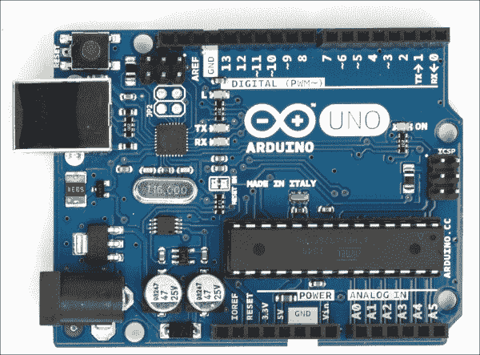
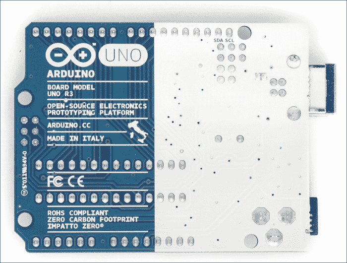
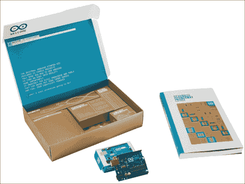
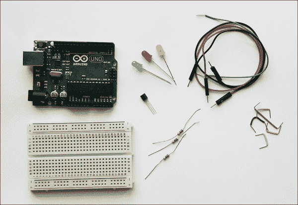
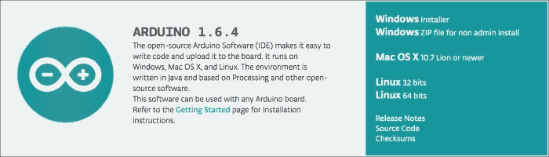
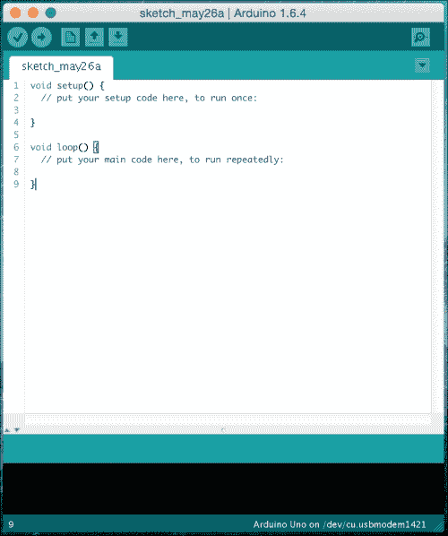
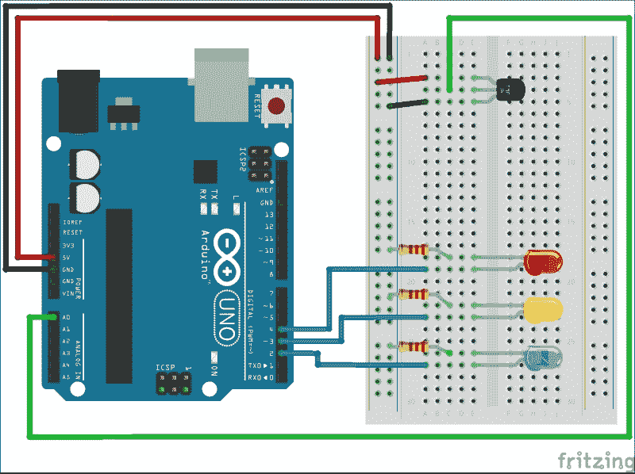
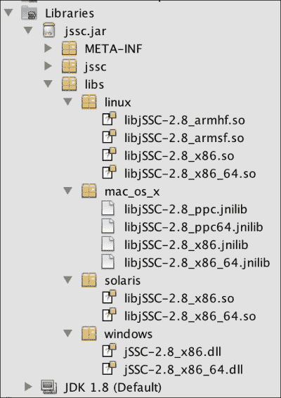
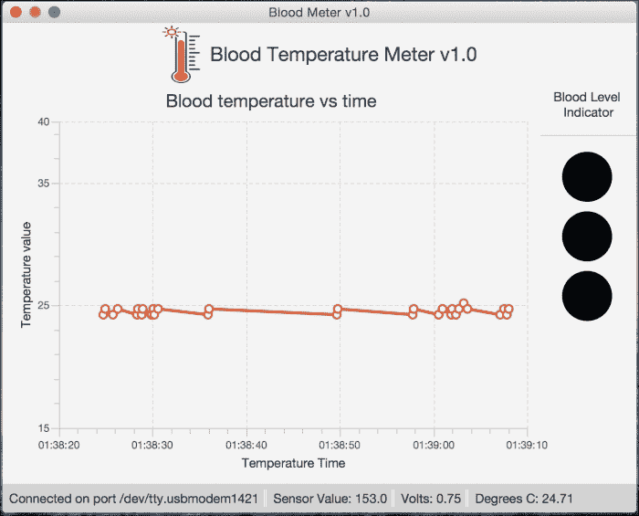
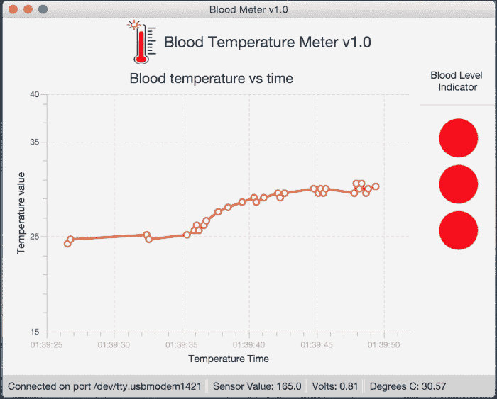

# 第七章。使用 JavaFX 监控和控制 Arduino

**Arduino**是一种基于简单可编程微控制器板的开源电子工具，可以使用免费开源 IDE 进行编程。单独或连接到计算机，它可以创建可以通过从各种开关或传感器获取输入来感知，并可以通过控制各种灯、电机和其他输出物理设备来执行的交互式设备。

作为第一批**物联网**（**IoT**）设备之一，它是在 2005 年创建的。它从物联网概念的最初阶段就存在。

Arduino 可以独立运行，也可以与计算机上运行的软件（Java、JavaFX、Python 等）进行通信，板可以手工组装或购买预装的。

事实上，Arduino 简化了与微控制器的工作过程。对于教师、学生和有兴趣的业余爱好者来说，它比其他系统更具吸引力，因为它*价格低廉*——Arduino 板的成本低于 50 美元。

简单、清晰、易于使用的编程环境；开源和可扩展的软件；以及开源和可扩展的硬件等功能，使 Arduino 支持自己动手和与他人一起动手的概念，这是制造运动的定义。

本章将向您展示如何使用 JavaFX 开发桌面应用程序以及 Arduino 板，以监视来自真实世界温度传感器的数据，并在图表上报告它，“你到底有多热血！”

在本章中，您将：

+   熟悉 Arduino 板及其组件

+   安装和准备 Arduino 软件和环境、IDE 和驱动程序

+   开发 Arduino 血糖仪草图以控制和监视电路

+   使用串行通信将 Arduino 数据读入 JavaFX 应用程序

+   使用 JavaFX 图表 API 呈现数据

# Arduino 板是什么？

Arduino Uno 是最知名的 Arduino 板，是基于 ATmega328 数据表（[`www.atmel.com/dyn/resources/prod_documents/doc8161.pdf`](http://www.atmel.com/dyn/resources/prod_documents/doc8161.pdf)）的微控制器板，这是板的大脑。它大约 3 x 2 英寸大小。它有 14 个数字输入/输出引脚，6 个模拟输入引脚和 32 千字节的闪存内存。

每个板都有一个复位按钮。此外，它包括一个 USB 端口，因此当连接到计算机时，它成为电源和通信工具。如果未连接到计算机，可以使用备用电源，例如 AC 9 至 12V DC 适配器，可以通过将 2.1 毫米中心正极插头插入板的电源插孔，或 9V 电池包连接。

带有波浪符号的六个数字引脚旁边的引脚是允许**脉宽调制**（**PWM**）的引脚，这是一种用于控制电源并在数字输入引脚上模拟模拟信号的技术。使用这些引脚的原因之一可能是控制 LED 的亮度。

Arduino Uno 的官方规格可以在[`arduino.cc`](http://arduino.cc)网站的[`arduino.cc/en/Main/ArduinoBoardUno`](http://arduino.cc/en/Main/ArduinoBoardUno)上找到。访问[`www.arduino.cc/en/Main/Products`](http://www.arduino.cc/en/Main/Products)以获取有关其他 Arduino 板的信息，例如 Mega，Due 或 Yun，以及下一个发布的 Tre 和 Zero。

以下图片显示了 Arduino Uno R3 板：



## 你可以用它做什么？

您的 Arduino 板可能很小，但不要让它的大小欺骗您。它功能强大，有很大的发展空间。它特别强大，因为它是建立在开放硬件和开放软件平台上的。我们不会花时间讨论开源；简而言之，这意味着有关硬件和软件的信息是免费提供的，易于找到。

Arduino 可以用来通过接收输入来感知环境。它也可以控制输出，如灯、电机、传感器等。

你可以使用开源的 Arduino 编程语言对板上的微控制器进行编程。

### 相关网站和文档

开源和开放硬件平台的一个很大的优势是你可以在互联网上找到信息。

寻找关于 Arduino 信息的好地方是官方页面：[`arduino.cc`](http://arduino.cc)网站的[`arduino.cc/en/Guide/HomePage`](http://arduino.cc/en/Guide/HomePage)。随着你的技能增长，你会想要研究更高级的主题，知道在哪里找到答案会很有帮助。

另一个很棒的网站是[`adafruit.com`](http://adafruit.com)。这个网站有教程、示例、有用的论坛，还有一个可以购买你需要的零件的商店。

对于孩子们来说，另一个有趣的应用是将**乐高 Mindstorm**传感器和电机与 Arduino 结合使用。我推荐网站[`wayneandlayne.com`](http://wayneandlayne.com)，因为它一直是我整合乐高和 Arduino 的灵感和起点。如果你正在寻找零件和项目，这是一个很好的网站。

## 设置你的 Arduino

如果这是你第一次接触 Arduino，我强烈建议你从套件开始，而不是组装所有的单个组件。

本章中的大部分活动都可以使用来自 arduino.cc 的 Arduino 入门套件完成，如下图所示。它包括了 Arduino Uno R3 和其他组件，可以完成大部分预先打包的项目。有关套件的完整描述，请访问[`store.arduino.cc/product/K000007`](http://store.arduino.cc/product/K000007)。



Arduino 入门套件（包括零件、板和项目书）

### 购买 Arduino

虽然 Arduino Uno 的成本约为 25 美元，但你可以购买不同的套件，包括板，从基本的 Budget Pack（50 美元）到 Arduino Starter Pack（65 美元）的[`adafruit.com`](http://adafruit.com)，或者从[`arduino.cc`](http://arduino.cc)购买 Starter Kit（90 美元）。这些套件与 Budget Pack 具有相同的组件，但它们还包括一些额外的高级调试工具。

从[`arduino.cc`](http://arduino.cc)的入门套件中获得的一个很好的优势是，它包括了一个指导书，其中包括了 15 个不同难度的项目。

如果你是亚马逊用户，通常可以在他们的网站上找到相同的套件，但价格可能会有所不同。

大多数板的核心组件位置相同。因此，更高级的板已经加长以容纳额外的组件。

以下是一些购买零件和书籍的网站：[`arduino.cc`](http://arduino.cc), [`Adafruit.com`](http://Adafruit.com), [`makershed.com`](http://makershed.com), [`sparkfun.com`](http://sparkfun.com), 和 [`Amazon.com`](http://Amazon.com)。

### 你将需要的其他组件

除了 Arduino，你还需要一台带有 Windows、Mac OS 或 Linux 的计算机，带有 USB 端口，用于将计算机连接到板上。

对于血糖仪项目，你将需要一些已经包含在 Arduino 入门套件中的零件。以下是你应该准备好的零件的简短清单。

一台带有 USB 端口的计算机，一根 USB 电缆，一个无焊面包板，柔性导线，一个 TMP36 温度传感器，三个 220 欧姆电阻，和三个 LED 灯（黄色、蓝色和红色），如下图所示：



血糖仪项目的工具和材料

### Arduino 集成开发环境

为了与 Arduino 微控制器进行交互和编程，我们需要下载并安装 Arduino 集成开发环境。

Arduino 软件包括您编写代码所需的所有组件，文本编辑器和编译器将其转换为机器语言，并将其上传到您的板并运行代码。

#### 下载 IDE

在撰写本文时，Arduino IDE 版本为 1.6.3，但您可以从链接[`www.arduino.cc/en/Main/Software`](http://www.arduino.cc/en/Main/Software)获取 Arduino 软件的最新版本。除了以下截图中显示的 Arduino 版本外，还要单击首选操作系统链接；在我的情况下，我选择了 Mac OS X。

从捐赠页面，要么捐赠，要么只需单击**JUST DOWNLOAD**链接即可开始下载 IDE；在我的情况下，我选择了`arduino-1.6.4-macosx.zip`。

下载后，解压文件并将`Arduino.app`文件复制到 Mac 上的应用程序文件夹，或者将 Arduino 可执行文件链接到您方便访问的位置。

一旦您下载了 IDE，您仍然需要解决一些硬件问题，然后才能开始编程。



下载 Arduino IDE 1.6.4

#### 安装驱动程序

首先，您需要使用 USB 电缆将 Arduino 板连接到计算机。绿色 LED 电源指示灯（标有 PWR 或 ON）应亮起。

##### Windows 设置

让我们在 Windows 中设置 Arduino：

1.  插入您的板，并等待 Windows 开始其驱动程序安装过程。

1.  单击**开始菜单**，然后打开**控制面板**。

1.  从**控制面板**，导航到**系统和安全**。接下来，单击**系统**。打开系统窗口后，选择**设备管理器**。

1.  查看**端口（COM 和 LPT）**。您应该看到一个名为`Arduino UNO（COMxx）`的开放端口。如果没有**COM 和 LPT**部分，请在**其他设备**下查找**未知设备**。

1.  右键单击**Arduino UNO（COMxx）**端口，然后选择**更新驱动程序软件**选项。

1.  接下来选择**浏览我的计算机以查找驱动程序软件**选项。

1.  最后，导航并选择名为`arduino.inf`的驱动程序文件，该文件位于 Arduino 软件下载的`Drivers`文件夹中（而不是`FTDI USB Drivers`子目录）。

1.  Windows 将完成驱动程序安装。

### 提示

如果您使用的是 Windows 8，驱动程序安装不完整，请尝试禁用驱动程序签名强制执行。

##### Mac OS X 和 Linux 设置

对于 Mac OS X 和 Linux 操作系统，不需要安装驱动程序。

对于 Mac OS X，当您连接 Arduino 板时，您应该在`/dev/tty.usbmodemXXXX 或/dev/tty.usbserialXXXX`下看到它列出。

在 Linux 上，当您连接 Arduino 板时，您应该在`/dev/ttyACMX 或/dev/ttyUSBX`下看到它列出。

#### 探索 IDE 和草图

假设您的安装成功结束，双击 Arduino 应用程序，您应该看到以下屏幕：



Arduino IDE，首次运行为空草图

现在，您需要做两件重要的事情，以便正确连接和上传草图到 Arduino 板。首先，通过导航到**工具** | **板**来选择您的板。然后，通过转到**工具** | **串行端口**来选择 Arduino 板的串行端口。

最后的验证步骤是运行 Arduino 的`Hello world`，您可以通过在**文件** | **示例** | **1.Basics** | **Blink**中打开 LED 闪烁示例草图来实现。

现在，只需在环境中单击**上传**按钮。如果上传成功，状态栏中将出现消息**上传完成**。

等待几秒钟，您将看到板上的**RX**和**TX** LED 闪烁。

如果您遇到任何问题，请查看[`arduino.cc/en/Guide/Troubleshooting`](http://arduino.cc/en/Guide/Troubleshooting)上的故障排除建议。

恭喜，您的 Arduino 已经启动运行！

## 血糖仪项目

在这个项目中，我们将使用温度传感器来测量你的皮肤温度，然后根据温度来开启（或关闭）LED 灯。

首先，我们将调整我们的板子，并准备好使用*其他你需要的组件*部分中描述的组件进行项目。然后，我们将编写草图来读取传感器数据，并根据你的皮肤温度的数据，来开启和关闭 LED 灯。

最后，我们将用温度传感器数据来供给我们的 JavaFX 应用，并使用图表 API 显示结果，以指示你的皮肤温度水平。

### 调整电路

现在，我们将调整我们的血糖仪电路，如下图所示。首先，通过连接跳线线将 Arduino UNO 和面包板连接起来。我已经将 TMP36 温度传感器连接到了面包板上，所以传感器的圆形部分远离 Arduino。引脚的顺序非常重要！请注意，我们已经将左边的引脚连接到电源，右边的引脚接地，中间输出电压的引脚连接到板子上的模拟引脚 A0。如下图所示：



血糖仪示例的电路布局

最后，我已经连接了三个 LED 灯和电阻，并将它们连接到数字 PMW~引脚排的 Arduino 引脚 4、~3 和 2。

像往常一样，我已经将面包板的+行连接到电源（5V），-行连接到地（GND）。

### 注意

记得在设置组件时保持板子未插电。

#### 草图

在我们调整了电路并配置了一切之后，我们需要对微控制器进行编程。这就是草图将发挥作用的地方：

```java
/*
  Chapter 7 example
  Project  - Blood-Meter

  This sketch is written to accompany Project in the
  JavaFX 8 essentials book

  Parts required:
  1 TMP36 temperature sensor
  3 red LEDs
  3 220 ohm resistors

  Created 5 April 2015
  by Mohamed Mahmoud Taman
  */

// named constant for the pin the sensor is connected to
const int sensorPin = A0;
// Room temperature in Celsius
const float baselineTemp = 25.0;

void setup() {
  // open a serial connection to display values
  Serial.begin(9600);
  // set the LED pins as outputs
  // the for() loop saves some extra coding
  for (int pinNumber = 2; pinNumber < 5; pinNumber++) {
    pinMode(pinNumber, OUTPUT);
    digitalWrite(pinNumber, LOW);
  }
}

void loop() {
  // read the value on AnalogIn pin 0
  // and store it in a variable
  int sensorVal = analogRead(sensorPin);

  // send the 10-bit sensor value out the serial port
  Serial.print("Sensor Value: ");
  Serial.print(sensorVal);

  // convert the ADC reading to voltage
  float voltage = (sensorVal / 1024.0) * 5.0;

  // Send the voltage level out the Serial port
  Serial.print(", Volts: ");
  Serial.print(voltage);

  // convert the voltage to temperature in degrees C
  // the sensor changes 10 mV per degree
  // the datasheet says there's a 500 mV offset
  // ((voltage - 500mV) times 100)
  Serial.print(", degrees C: ");
  float temperature = (voltage - .5) * 100;
  Serial.println(temperature);

  // if the current temperature is lower than the baseline
  // turn off all LEDs
  if (temperature < baselineTemp) {
    digitalWrite(2, LOW);
    digitalWrite(3, LOW);
    digitalWrite(4, LOW);
  } // if the temperature rises 2-4 degrees, turn an LED on
  else if (temperature >= baselineTemp + 2 && temperature < baselineTemp + 4) {
    digitalWrite(2, HIGH);
    digitalWrite(3, LOW);
    digitalWrite(4, LOW);
  } // if the temperature rises 4-6 degrees, turn a second LED on
  else if (temperature >= baselineTemp + 4 && temperature < baselineTemp + 6) {
    digitalWrite(2, HIGH);
    digitalWrite(3, HIGH);
    digitalWrite(4, LOW);
  } // if the temperature rises more than 6 degrees, turn all LEDs on
  else if (temperature >= baselineTemp + 6) {
    digitalWrite(2, HIGH);
    digitalWrite(3, HIGH);
    digitalWrite(4, HIGH);
  }
  delay(100);
}
```

#### 工作原理

如果你阅读每行的注释，你会理解代码。不深入细节，以下是草图的主要要点。

每个 Arduino 草图都有两个主要的方法：`setup()`和`loop()`。第一个方法用于初始化引脚为输入或输出，打开串行端口，设置它们的速度等。第二个方法在微控制器内部重复执行任务。

一开始，我们有一对有用的常量：一个引用模拟输入，另一个保存基准温度。对于每*2 度*高于这个基准温度，一个 LED 将打开。

在`setup()`方法中，我们将串行端口初始化为每秒 9,600 位的速度，并使用`for`循环将一些引脚设置为方向（输出引脚）并关闭它们。

在`loop()`方法中，我们开始读取温度传感器的电压数值，范围在 0 到 1,023 之间，然后使用`Serial.print()`将传感器数值发送到串行端口，以便任何连接的设备（例如我们的计算机）可以读取。这些模拟读数可以测量房间的温度或者如果你触摸传感器的话，也可以测量你的皮肤温度。

我们需要使用以下方程将模拟传感器读数转换为电压值：

```java
voltage = (sensorVal / 1024.0) * 5.0
```

从数据表中，我们使用传感器规格将电压转换为温度的方程：

```java
temperature = (voltage - .5) * 100
```

根据实际温度，你可以设置一个`if else`语句来点亮 LED 灯。使用基准温度作为起点，每增加 2 度温度，你将打开一个 LED 灯。

当你在温度刻度上移动时，你会寻找一系列数值。

**模拟到数字转换器**（**ADC**）读取速度非常快（以微秒为单位），建议在`loop()`函数的末尾设置 1 毫秒的延迟。但考虑到这将被发送到串行端口，最终设置了 100 毫秒的延迟。

#### 测试、验证并将草图上传到 Arduino

将代码上传到 Arduino 后，点击串行监视器图标，如下图所示：


Arduino IDE 工具栏图标

您应该看到一系列数值以如下格式输出：

```java
Sensor Value: 158, Volts: 0.77, degrees C: 27.15
```

现在尝试在传感器插入面包板时用手指触摸传感器周围，看看串行监视器中的数值会发生什么变化。

在传感器放在空气中时记下温度。关闭串行监视器并将 `baselineTemp` 常量更改为您之前观察到的值。再次上传代码并尝试再次握住传感器；随着温度的升高，您应该看到 LED 逐个打开。

恭喜，热门！

### 从串行端口读取数据

在 Java 中没有标准的方法来读取串行端口，因为这是一个硬件特定的任务，违反了 Java 的多平台概念。因此，我们需要一个第三方库来完成这项任务，并且它应该是用 Java 编写的，以便与我们的应用程序集成。

Arduino IDE 使用了第一个串行通信库，称为 **RXTX**。最初来自 Trent Jarvi，并在 LGPL v2.1+ Linking Over Controlled Interface 许可下分发，直到 1.5.5 beta 版本与板通信。然而，它非常慢，现在已经不推荐使用。

新的 **Java Simple Serial Connector** (**jSSC**) 库由 Alexey Sokolov 开发，根据 GNU Lesser GPL 许可。自 1.5.6 beta 版本以来，Arduino IDE 使用新库进行板通信，因为它比之前的版本更快。

该库的另一个重要优势是，它作为单个 `jssc.jar` 文件进行分发，其中包括所有平台的本地接口，以减少每个平台和操作系统的本地安装的痛苦。它会在运行时将它们添加到 `classpath` 中，如下截图所示：



jSSC 2.8.0 本地库

您可以从[`github.com/scream3r/java-simple-serial-connector/releases`](https://github.com/scream3r/java-simple-serial-connector/releases)下载最新版本。在撰写本文时，jSSC 版本为 2.8.0。

### JavaFX 血糖监测应用程序

我们将设计一个 JavaFX 8 应用程序，该应用程序从温度传感器中获取读数，并在折线图中显示数值。我们还将展示模拟板 LED 的一组形状的变化。为了清晰起见，我们将使用两个类，一个用于串行读数，另一个用于 JavaFX UI 和主应用程序 `BloodMeterFX` 文件，包括图表 API。

我们将使用一个包含从串行端口读取的最后一行的 StringProperty 来绑定这些类（Serial 和 BloodMeterFX）。通过在 JavaFX 线程中监听此属性的更改，我们将知道何时有新的读数要添加到图表中。

完整的项目代码可以从 *Packt Publishing* 网站下载。

#### Java 中的串行通信

让我们首先解释 `Serial.java` 类。这个类的代码大部分来自 *JavaFX 8 Introduction By Example, Apress*，但核心读取函数有所改变，如下面的代码片段所示：

您应该将 `jSSC.jar` 文件包含到您的类路径中，可以通过将其添加到 Linux 或 Windows 的 `<JAVA_HOME>/jre/lib/ext`（或 Mac 上的 `/Library/Java/Extensions`）中，或者更好地将其添加到您的项目库中，如前面的截图所示，如果您打算分发您的应用程序。

为了能够读取串口，我们需要导入以下 jSSC 类：

```java
import jssc.SerialPort;
import static jssc.SerialPort.*;
import jssc.SerialPortException;
import jssc.SerialPortList;
```

为了动态读取端口，如果您不知道通过这个类的构造函数设置的确切端口名称，我们有一组端口名称可帮助您选择 Arduino 板可以连接到的适当端口。

```java
private static final List<String> USUAL_PORTS = Arrays.asList(
  "/dev/tty.usbmodem", "/dev/tty.usbserial", //Mac OS X
  "/dev/usbdev", "/dev/ttyUSB", "/dev/ttyACM", "/dev/serial", //Linux
  "COM3", "COM4", "COM5", "COM6" //Windows
);

private final String ardPort;

public Serial() {
      ardPort = "";
}

public Serial(String port) {
      ardPort = port;
}
```

`connect()`方法会查找一个有效的串行端口，如果没有连接到 Arduino 板，则会设置一个。如果找到了有效的串行端口，就会打开它并添加一个监听器。这个监听器负责每次从 Arduino 输出返回一行时获取输入读数。`stringProperty`会被设置为这一行。我们使用`StringBuilder`来存储字符，并在找到`'\r\n'`时提取行内容。我们在这里使用了 lambda 表达式提供的集合批量操作，以便简单地查找端口列表并根据操作系统返回有效的端口。

通过`set()`方法将找到的每一行设置为`line`变量，以便通过注册的 change 监听器事件对`line`变量进行必要的更改，这通过`getLine()`方法暴露出来。代码如下：

```java
public boolean connect() {
  out.println("Serial port is openning now...");
  Arrays.asList(SerialPortList.getPortNames()).stream()
  .filter(name -> ((!ardPort.isEmpty() && name.equals(ardPort))|| (ardPort.isEmpty() && USUAL_PORTS.stream()
  .anyMatch(p -> name.startsWith(p)))))
  .findFirst()
  .ifPresent(name -> {
  try {
    serPort = new SerialPort(name);
      out.println("Connecting to " + serPort.getPortName());
      if (serPort.openPort()) {
        serPort.setParams(BAUDRATE_9600,
        DATABITS_8,
        STOPBITS_1,
        PARITY_NONE);
        serPort.setEventsMask(MASK_RXCHAR);
        serPort.addEventListener(event -> {
         if (event.isRXCHAR()) {
           try {
             sb.append(serPort.readString(event.getEventValue()));
             String ch = sb.toString();
             if (ch.endsWith("\r\n")) {
               line.set(ch.substring(0, ch.indexOf("\r\n")));
               sb = new StringBuilder();
             }
           } catch (SerialPortException e) {
             out.println("SerialEvent error:" + e.toString());
           }
         }
       });
     }
  } catch (SerialPortException ex) {
    out.println("ERROR: Port '" + name + "': " + ex.toString());
  }});
  return serPort != null;
}
```

最后，`disconnect()`方法负责从端口中移除监听器并关闭端口连接，以释放应用程序使用的资源。代码如下：

```java
public void disconnect() {
  if (serPort != null) {
    try {
      serPort.removeEventListener();
      if (serPort.isOpened()) {
        serPort.closePort();
      }
      } catch (SerialPortException ex) {
      out.println("ERROR closing port exception: " + ex.toString());
    }
    out.println("Disconnecting: comm port closed.");
  }
}
```

#### 应用程序逻辑和图表 API

我们应用程序的主要组件是`LineChart<Number, Number>`图表类 API，它将用于在 Y 轴上绘制您的血温水平，而在 X 轴上绘制时间。

自 JavaFX 2 以来，具有两个轴（如线条、条形和区域图表）的图表已经可用，并且它们是`Node`类的类型，这使得将它们添加到`Scene`中像其他节点一样变得容易。

在我们的应用程序中，我们将添加以下`createBloodChart()`方法，它负责创建和准备图表，并将其返回以添加到主应用程序场景中。

在应用程序的开始，我们有实例变量：一个`Serial`对象来处理 Arduino 的连接和读数；`listener`用于注册到`Serial`线对象；`BooleanProperty`用于跟踪连接状态；以及三个浮点属性，分别用于跟踪所有传感器数据的实际值、电压转换，最后是将电压转换为摄氏度温度。代码如下：

```java
private final Serial serial = new Serial();
private ChangeListener<String> listener;
private final BooleanProperty connection = new SimpleBooleanProperty(false);
private final FloatProperty bloodTemp = new SimpleFloatProperty(0);
private final FloatProperty volts = new SimpleFloatProperty(0);
private final FloatProperty sensorVal = new SimpleFloatProperty(0);
```

我们将添加`LineChart`来绘制温度传感器的温度水平，其中有一个`Series`，它接受一对数字来绘制在每个轴上；这些是`NumberAxis`实例。`XYChart.Data`被添加到系列数据中，作为每个点的*X*和*Y*值对来绘制读数。

每当`Series`的大小大于 40 个点时，为了内存效率，将删除前面的值。代码如下：

```java
private LineChart<Number, Number> createBloodChart() {
  final NumberAxis xAxis = new NumberAxis();
  xAxis.setLabel("Temperature Time");
  xAxis.setAutoRanging(true);
  xAxis.setForceZeroInRange(false);
  xAxis.setTickLabelFormatter(new StringConverter<Number>() {
    @Override
    public String toString(Number t) {
      return new SimpleDateFormat("HH:mm:ss").format(new Date(t.longValue()));
    }
    @Override
    public Number fromString(String string) {
      throw new UnsupportedOperationException("Not supported yet.");
    }
  });
  final NumberAxis yAxis = new NumberAxis("Temperature value", baselineTemp - 10, 40.0, 10);
  final LineChart<Number, Number> bc = new LineChart<>(xAxis, yAxis);
  bc.setTitle("Blood temperature vs time");
  bc.setLegendVisible(false);

  Series series = new Series();
  series.getData().add(new Data(currentTimeMillis(), baselineTemp));
  bc.getData().add(series);

  listener = (ov, t, t1) -> {
    runLater(() -> {
      String[] values = t1.split(",");
      if (values.length == 3) {
        sensorVal.set(parseFloat(values[0].split(":")[1].trim()));
        volts.set(parseFloat(values[1].split(":")[1].trim()));
        bloodTemp.set(parseFloat(values[2].split(":")[1].trim()));
        series.getData().add(new Data(currentTimeMillis(),
        bloodTemp.getValue()));

        if (series.getData().size() > 40) {
          series.getData().remove(0);
        }
      }

    });
  };
  serial.getLine().addListener(listener);

  return bc;
}
```

这里最有趣的部分是使用 lambda 表达式创建的 change 监听器`listener = (ov, t, t1) -> {}`，它将被注册到我们之前描述的`Serial`类`line`对象上。通过这样做，我们能够在检测到 Arduino 的任何输入时改变图表数据。

为此，我们将*X*坐标值设置为添加读数的毫秒时间（在图表上，它将被格式化为*HH:MM:SS*），*Y*坐标值是 Arduino 报告的温度级别的浮点测量值在字符串`t1`中。

### 注意

`Platform.runLater()`的主要用途是将填充系列数据的任务放在 JavaFX 线程中，但它也为`Scene`图形提供了所需的时间来渲染图表，如果值添加得太快，则会跳过值。

我添加了四个`Circle`类型的形状，它们将用于根据温度水平模拟电路 LED 的开和关，一旦通过 change 监听器对`FloatProperty` `bloodTemp`进行了任何更改。代码如下：

```java
Circle IndicatorLevel1 = new Circle(26.0, Color.BLACK);
bloodTemp.addListener((ol, ov, nv) -> {
  tempLbl.setText("Degrees C: ".concat(nv.toString()));

  // if the current temperature is lower than the baseline turn off all LEDs
  if (nv.floatValue() < baselineTemp +2) {
    IndictorLevel1.setFill(Paint.valueOf("Black"));
    IndictorLevel2.setFill(Paint.valueOf("Black"));
    IndictorLevel3.setFill(Paint.valueOf("Black"));
  } // if the temperature rises 1-3 degrees, turn an LED on
  else if (nv.floatValue() >= baselineTemp + 1 && nv.floatValue()< baselineTemp + 3) {
      IndictorLevel1.setFill(Paint.valueOf("RED"));
      IndictorLevel2.setFill(Paint.valueOf("Black"));
      IndictorLevel3.setFill(Paint.valueOf("Black"));
    } // if the temperature rises 3-5 degrees, turn a second LED on
    else if (nv.floatValue() >= baselineTemp + 4 && nv.floatValue() < baselineTemp + 6) {
      IndictorLevel1.setFill(Paint.valueOf("RED"));
      IndictorLevel2.setFill(Paint.valueOf("RED"));
      IndictorLevel3.setFill(Paint.valueOf("Black"));
    }//if the temperature rises more than 6 degrees, turn all LEDs on
    else if (nv.floatValue() >= baselineTemp + 6 {
    IndictorLevel1.setFill(Paint.valueOf("RED"));
    IndictorLevel2.setFill(Paint.valueOf("RED"));
    IndictorLevel3.setFill(Paint.valueOf("RED"));
  }
});
```

最后，主 UI 是由`loadMainUI()`方法创建的，它负责创建整个 UI 并将所有必需的变量绑定到 UI 控件，以便动态地与来自 Arduino 输入的事件交互。

一旦场景根（`BorderPane`）对象通过`loadMainUI()`准备和设置好，我们就创建场景并将其添加到舞台中，以便运行我们的应用程序如下：

```java
Scene scene = new Scene(loadMainUI(), 660, 510);
stage.setTitle("Blood Meter v1.0");
stage.setScene(scene);
stage.show();
//Connect to Arduino port and start listening
connectArduino();
```

最后，从`Application`类继承的重写的`stop()`方法将通过关闭`Serial`端口连接和从线对象中移除`listener`来处理任何资源释放。代码如下：

```java
@Override
public void stop() {
  System.out.println("Serial port is closing now...");
  serial.getLine().removeListener(listener);
  if (connection.get()) {
  serial.disconnect();
  connection.set(false);
}}
```

#### 运行应用程序

当一切就绪时——具有早期描述的类和添加到其中的`jSSC.jar`库的 JavaFX 项目——编译并运行您的应用程序，同时您的 Arduino 板连接到您的笔记本电脑/PC。如果一切正常，您将看到以下截图，显示了图表上的温度值与时间值，这将基于您的室温。

恭喜，您现在正在监视 Arduino 输入，并且可以通过`jSSC.jar`库与 Arduino 进行交互控制。



初始血液计应用读数，温度为 24.71 度

尝试用手指拿住传感器并监视图表上的读数。在我的情况下，它达到了 30.57 度。还要注意工具栏上的指示器水平和板上的 LED。您应该看到类似于以下截图：



血液计应用读数，温度为 30.57 度

# 总结

在本章中，您了解了通过结合 Arduino 和 JavaFX 可以实现什么。您首先学习了关于 Arduino 的知识，它的不同板，主要规格，购买地点和组件。然后，我们讨论了更多项目灵感的网站。

接下来，您学会了如何下载和设置 Arduino IDE 与 Arduino 通信。在了解了如何在 IDE 中加载示例之后，您有机会尝试自己动手，通过使用 Arduino Uno 和温度传感器构建一个简单的电路来创建一个草图，并在 IDE 串行监视器中读取温度水平。

然后，您学会了如何使用 Java Simple Serial Connector 库从计算机读取串行端口数据。

您学会了如何使用 JavaFX Line Chart API 来监视和显示 Arduino 读数。然后，您看到了一个示例，其中使用 Arduino 板从串行端口绘制了一个 JavaFX 图表，使用温度传感器来测量血液温度水平。

在下一章中，您将学习如何通过手势控制您的 JavaFX 应用程序与计算机进行无触控交互，而无需任何输入设备，如键盘、鼠标，甚至触控设备。
