# 第八章。使用 JavaFX 进行交互式 Leap Motion 应用程序

现在我们来到了本书最激动人心的部分，我们将通过身体语言转化为命令来控制周围的物体和计算机，进入新的无触摸时代的计算机人交互。

每天我们都注意到输入界面的崛起，它们不再以鼠标为中心，而更倾向于无触摸输入。*手势*是人类如今可以自然地与机器交流的一种方式。

几十年来，动作控制一直在我们对未来的设想中占据着坚定的位置。我们看到了流行媒体中的超级英雄、疯狂科学家和太空牛仔只需挥动手就能控制数字体验。

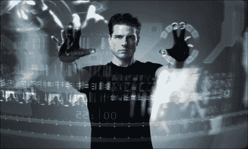

汤姆·克鲁斯通过手势进行计算

我们被这些强大、自然和直观的交互所吸引——想象一下如果我们能在自己的指尖上拥有这种力量会是什么样子。例如，*《星际迷航》的全息甲板*和*《未来报告》中的预犯预测计算机*。你还记得汤姆·克鲁斯在后者中是如何通过透明显示屏上的手势进行计算的吗？所有这些都散发着一种力量和掌控感，同时又具有矛盾的简单、轻松、直观和人性化的感觉。简单地说，这些体验都是神奇的。

市场上有几种设备实际上允许我们仅使用身体的一些部分与计算机进行交互：许多**Xbox**游戏，微软游戏机，使用**Kinect**控制器来识别用户的身体动作。肌电臂带可以检测你肌肉的运动并将其转化为手势，以便你可以与计算机交互。Leap Motion 控制器可以识别用户的手和手指，并将动作和手势转化为计算机上的操作。

在本章中，您将学习使用**Leap Motion**设备进行手势识别，这是一种令人敬畏的设备，可以以无触摸的方式开发增强的 JavaFX 应用程序。

以下是本章将讨论的一些主题：

+   介绍 Leap 控制器，它的工作原理以及如何获取

+   获取和安装 SDK，配置其驱动程序，并验证其是否正常工作

+   基于 Leap 的应用程序构建基础知识

+   开发令人惊叹的无触摸 JavaFX 应用程序

# Leap Motion 控制器

这是一个非常小的设备，高度为 13 毫米，宽度为 30 毫米，深度为 76 毫米，重量为 45 克（*最终尺寸：0.5 英寸 x 1.2 英寸 x 3 英寸*）。只需将 Leap Motion 软件运行在您的计算机上，将控制器插入 Mac 或 PC 上的 USB 接口，您就可以开始使用了（无需外部电源）。

它可以捕捉你手和手指的个别动作，几乎实时（200-300 fps），并将手势转化为计算机上运行的应用程序的不同操作。这款 79.99 美元的设备于 2013 年推出，称为 Leap Motion 控制器。

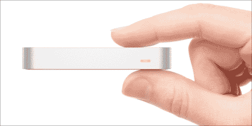

Leap Motion 与人手的大小比较

从开发者的角度来看，这个设备允许设计应用程序，可以通过用户的*手*和*手指*的手势和动作来控制，就像*未来报告*中一样！

它能感知你自然的手部动作，并让你以全新的方式使用计算机——指向、挥动、伸手、抓取或拿起东西并移动。你可以做一些你从未梦想过的事情。

检查一下你的手；一只手有 29 根骨头，29 个关节，123 条韧带，48 条神经和 30 条动脉。这是复杂而复杂的。控制器已经非常接近完全弄清楚这一切。

实际上，当你考虑它时，Leap Motion 的魔力在于软件，但公司也在努力开发硬件来提供他们的技术。自 2011 年开始开发以来，它已经有了很大的进步，如下图所示：

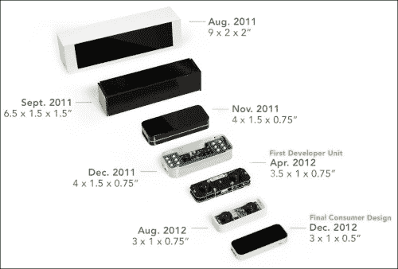

Leap Motion 控制器的演变

## 它是如何工作的

Leap Motion 的技术依赖于特殊的接收器硬件和定制软件，可以跟踪到 1/100 毫米的运动，没有可见的延迟时间。Leap Motion 控制器具有*150 度*的视野，并以 290fps 跟踪单独的手部和所有 10 个手指。

该设备的主要硬件由三个红外 LED 和两个单色红外（IR）摄像头组成。LED 产生红外光的 3D 点阵，摄像头以近乎 290fps 的速度扫描反射数据。在 50 厘米半径内的所有内容都将被扫描和处理，分辨率为 0.01 毫米。设备的主要组件如下图所示：

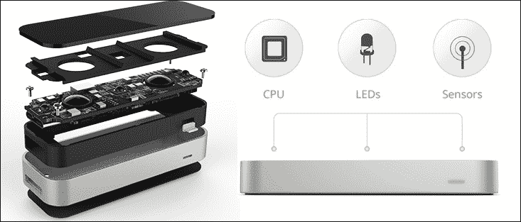

Leap Motion 控制器硬件层和内部组件

这是计算机交互的未来，Leap Motion 的非常快速和准确的自然用户界面以非常精确的方式将所有运动数据发送到计算机。数据将通过 Leap Motion 专有软件检测算法在主机计算机上进行分析，并且任何启用 Leap 的应用程序都可以直接进行接口连接，而无需使用任何其他物理输入设备。

### 坐标系统

在应用程序中使用 Leap Motion 控制器时，将从控制器接收的坐标值映射到适当的 JavaFX 坐标系统是一项基本任务。

从前面的讨论中，您可以观察到该设备可以在超宽的 150 度视野和深度的 z 轴内检测手部、手指和反射工具。这意味着您可以像在现实世界中一样在 3D 中移动您的手。

设备坐标系统使用右手笛卡尔坐标系，原点位于设备中心。如下图所示：

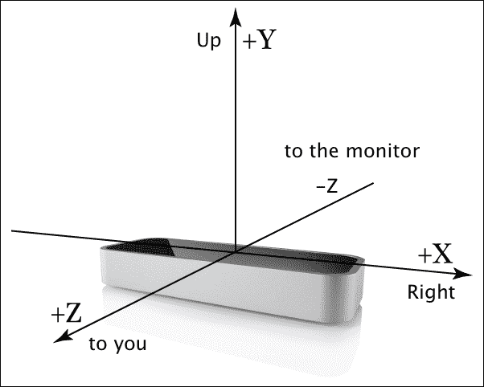

以设备为中心的坐标系统

每次设备扫描和分析您的手部运动数据时，都会生成一个包含所有已处理和跟踪数据的列表的 Frame 对象（手部、手指和工具），包括在帧中找到的一组运动手势（*滑动、点击或圈*）。

正如您可能已经注意到的，y 轴的正方向与大多数计算机图形系统（包括 JavaFX）中的向下方向相反。

然而，数据是指设备位置而不是屏幕，这与我们习惯于鼠标和触摸事件的方式发生了根本性的变化。

幸运的是，API 提供了几种有用的方法，可以随时找到我们的手和手指指向的位置。

## 获取设备

由于我们受到了这项令人惊叹的技术的启发，我们需要参与并开始使用该设备开发一些东西。因此，我们首先需要获得一个。

该设备可以从亚马逊、百思买等许多供应商处购买。但是，您也可以从 Leap Motion 商店([`store-world.leapmotion.com`](http://store-world.leapmotion.com))购买。

我在 2014 年底购买了我的设备，现在可能可以在一些商店找到特别折扣。

### 包内容

当您购买 Leap Motion 套装时，至少应包含以下图像中显示的物品：

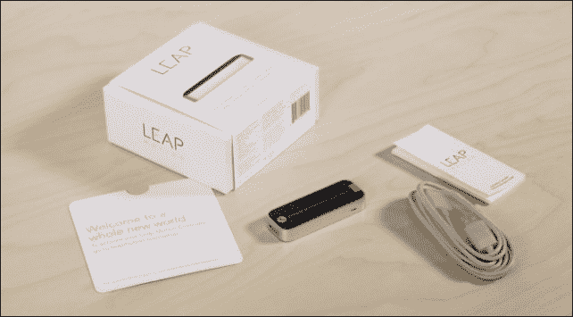

Leap Motion 包内容

在撰写本文时，该套装包括：

+   Leap Motion 控制器

+   两根定制长度的 USB 2.0 电缆

+   欢迎卡

+   重要信息指南

## 使用 Leap SDK 入门

现在我们已经有了硬件，我们需要安装软件并开始开发。这是一项非常简单的任务；只需将鼠标指向您喜欢的浏览器的地址栏，输入 URL [`developer.leapmotion.com/downloads`](https://developer.leapmotion.com/downloads)，然后点击*Enter*键。

在撰写本文时，最新版本是 SDK 2.2.6.29154。单击您的操作系统图标以开始下载支持的版本。或者，只需单击带有标签**Download SDK 2.2.6.29154 for OSX**（适用于 Mac OS X）的绿色按钮。这将检测您的 PC /笔记本电脑操作系统，并允许您下载适合您操作系统的 SDK。

### 安装控制器驱动程序和软件

安装过程和准备好与设备交互需要一些简单的步骤。下载`zip`内容后，提取它，安装软件安装程序，一切都应该就位：

1.  下载，提取并运行软件安装程序。

1.  安装后，连接您的 Leap Motion 控制器并打开可视化器，如下面的屏幕截图所示：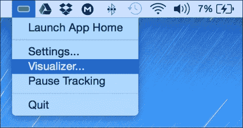

运行可视化器

1.  SDK 包括`LeapJava.jar`库和一堆用于控制器集成的本机库。在您的系统上集成`LeapJava.jar`的一种简单方法是将 JAR 添加到 Linux 或 Windows 的`<JAVA_HOME>/jre/lib/ext`（或 Mac 上的`/Library/Java/Extensions`）。

1.  将本机库（Windows 的`LeapJava.dll`，`Leap.dll`和`Leapd.dll`；Mac 的`libLeapJava.dylib`和`libLeap.dylib`；Linux 的`libLeapJava.so`和`libLeap.so`）复制到`<JAVA_HOME>/jre/bin`文件夹中。

1.  或者，您可以将 JAR 作为依赖项添加到每个项目中，并将本机库作为 VM 参数`-Djava.library.path=<native library path>`加载。

### 注意

SDK 还包括许多基于支持语言的示例，包括`HelloWorld.java`示例，这是一个非常好的起点，可以帮助您了解如何将控制器与 Java 应用程序集成。

#### 验证是否有效

如果一切正常，一个小的 Leap Motion 图标应该出现在任务栏通知区域（Windows）或菜单栏（Mac）上，并且应该是绿色的，就像前面的屏幕截图所示。设备上的 LED 指示灯应该亮起绿色，并且*面向您以正确定位设备*。

如果您能够与可视化器交互并看到手指和手的可视化，就像下面的屏幕截图所示，那么现在是开始开发的时候了。

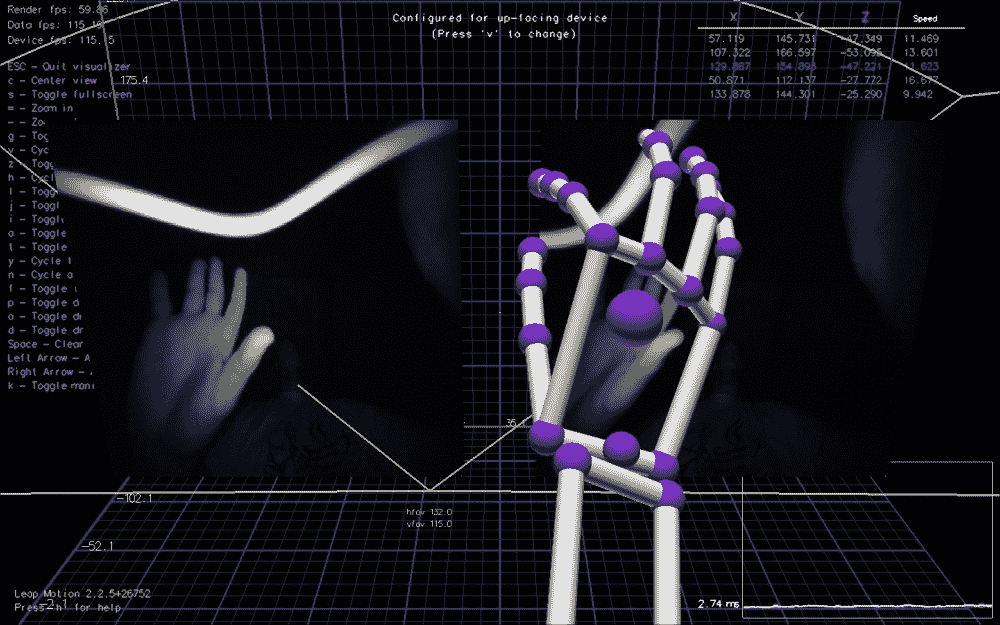

Leap Motion 诊断可视化器应用程序

## 支持的语言

在深入研究我们的应用程序之前，我想简单提一下，Leap Motion SDK 支持许多语言，包括 Java 和其他语言，如 JavaScript 用于 Web，C＃，C ++，Python，Unity，Objective-C 和虚幻游戏引擎。

# Leap JavaFX 应用程序

像您一样，我迫不及待地想要开始开发过程，现在您将学习如何与连接到 Leap motion 设备的 JavaFX 8 基于 3D 的应用程序进行无触摸交互。

鉴于本书迄今为止尚未涵盖 3D API，这是一个很好的机会，简要描述 3D API 并将 Leap Motion v2 骨骼建模（3D 手）与一些 3D 交互带入我们的 JavaFX 应用程序。

Leap Motion API v2.0 引入了一个新的骨骼跟踪模型，提供有关手和手指的额外信息，预测不清晰可见的手指和手的位置，并改进整体跟踪数据。有关 API 的更多信息，请访问[`developer.leapmotion.com/documentation/java/devguide/Intro_Skeleton_API.html?proglang=java`](https://developer.leapmotion.com/documentation/java/devguide/Intro_Skeleton_API.html?proglang=java)。

我们将展示如何将 Leap Motion v2 的新骨骼模型轻松集成到 JavaFX 3D 场景中。我们将使用 JavaFX 提供的预定义 3D 形状 API，快速创建 3D 对象。这些形状包括盒子、圆柱体和球体，我们将在我们的应用程序中使用它们。

## 一览 JavaFX 3D API

3D 意味着*三维*或者拥有*宽度*、*高度*和*深度*（或*长度*）的东西。我们的物理环境是三维的，我们每天都在三维空间中移动。

JavaFX 3D 图形库包括 Shape3D API，JavaFX 中有两种类型的 3D 形状：

+   **预定义的形状**：这些形状是提供的，以便让你更快地创建 3D 对象。这些形状包括盒子、圆柱体和球体。

+   **用户定义的形状**：JavaFX Mesh 类层次结构包含`TriangleMesh`子类。三角网格是 3D 布局中最常见的网格类型。

在我们的应用程序中，我们将使用预定义的形状。有关 JavaFX 3D API 和示例的更多信息，请访问[`docs.oracle.com/javase/8/javafx/graphics-tutorial/javafx-3d-graphics.htm`](http://docs.oracle.com/javase/8/javafx/graphics-tutorial/javafx-3d-graphics.htm)。

## 更多学习资源

在 SDK 中捆绑的`HelloWorld.java`示例是一个丰富的资源，它将帮助你在 Leap Motion 控制器和普通 Java 应用程序之间的开发和集成过程中。

另一个讨论与 Java 集成的资源是 Leap Motion 文档中的*Getting Started with Java Development*部分，网址为[`developer.leapmotion.com/documentation/java/devguide/Leap_Guides.html`](https://developer.leapmotion.com/documentation/java/devguide/Leap_Guides.html)。

## 基本应用程序结构

在查看了`HelloWorld.java`示例和文档示例之后，你会注意到以下几点：

+   我们需要一个`Controller`对象，允许 Leap 设备和应用程序之间的连接。

+   我们需要一个`Listener`子类来处理来自控制器的事件。

+   手势跟踪在`onConnect()`方法中启用。

+   这个类中的主要方法是`onFrame()`，这是一个`callback`方法，当一个新的带有运动跟踪数据的`Frame`对象可用时被调用。这个对象包含手、手指或工具的列表，以及它们的位置、方向和运动速度的几个向量。

+   如果启用了手势，我们还将得到一个基于最后几帧分析的手势列表。此外，你将知道手势的状态，无论它是刚开始、正在进行中还是已经结束。

### JavaFX 8 3D 应用程序

我们将讨论的应用程序是一个复杂的 JavaFX 8 3D 应用程序，它将帮助你了解基于 Leap 的应用程序开发结构，与设备交互以识别*手部位置*，并与*手势*交互以在 3D 环境中建模我们的手。

你可以在后面的示例部分找到更多资源，包括开发基于 Leap 的 JavaFX 应用程序的更高级概念。

在这个应用程序中，我们将检测骨骼、手臂和关节（位置和方向），以圆柱体和球体的形式在我们的 JavaFX 应用程序`SubScene`中建模我们的手。然后，我们将检测它们的位置，以在 Leap Motion 设备上建模我们真实的手部运动。

我们还将添加原始的`image`，这样你就可以在应用程序的背景中看到模型和你的真实手。

该应用程序由三个类组成：

+   `LeapListener.java`：这个类是监听器，它与 Leap Motion 控制器线程交互，将所有分析的数据（手臂、骨骼、手指和关节）传输到 JavaFX 应用程序中。

+   `LeapJavaFX.java`：这个类是一个 JavaFX 应用程序线程，它将与`LeapListener.java`交互，以便在每一帧中创建 3D 形状，而不需要跟踪以前的形状。由于 Observable JavaFX bean 属性的强大功能，它允许从 Leap 线程传输的数据被渲染到 JavaFX 线程中。

+   `Pair.java`：这是一个小的便利类，用于存储每个关节中链接的两根骨头。

所以，让我们开始看看我们如何做到这一点。

### 提示

您必须通过在“跃动”控制面板中勾选“**允许图像**”选项并确保在“**跟踪**”选项卡下禁用“**鲁棒模式**”选项来启用 Leap Motion 控制面板上的图像。

### 工作原理

首先，我们将解释我们的应用程序的主要桥梁，即 Leap 事件监听器`LeapListener.java`。

开发 JavaFX 应用程序时的主要问题是如何将 JavaFX 线程与其他非 JavaFX 线程混合，而在我们的情况下是 Leap Motion 事件`Listener`子类，它以非常高的速率处理事件。

为了将这些事件传递到 JavaFX 线程，我们将在`LeapListener.java`类中使用`BooleanProperty`对象。由于我们只会监听`doneList`对象的更改，因此我们不需要列表也是可观察的，因为它们将在任何更改时触发事件（添加一个骨骼）。

因此它们是普通列表，我们只使用一个布尔可观察属性，在创建每个 Leap`Frame`对象中的所有列表后将其设置为 true：

```java
private final BooleanProperty doneList= new
SimpleBooleanProperty(false);
private final List<Bone> bones=new ArrayList<>();
private final List<Arm> arms=new ArrayList<>();
private final List<Pair> joints=new ArrayList<>();
private final List<WritableImage> raw =new ArrayList<>();
```

要获取原始图像，我们必须在`onInit()`中设置此策略，并且出于隐私原因，用户还必须在 Leap Motion 控制面板中启用该功能，以便任何应用程序都可以获取原始摄像头图像。

```java
@Override
public void onInit(Controller controller){
 controller.setPolicy(Controller.PolicyFlag.POLICY_IMAGES);
}
```

（*如您所知，如果要处理手势，这是您启用此功能的地方，因此也许您可以将它们保持注释状态。*）

让我们继续创建 Frame 方法：

```java
@Override
public void onFrame(Controller controller) {
  Frame frame = controller.frame();
  doneList.set(false);
  doneList.set(!bones.isEmpty() || !arms.isEmpty());
}
public BooleanProperty doneListProperty() {
  return doneList;
}
```

对于每一帧，重置`doneList`，处理数据，最后如果我们有骨骼或手臂，则将其设置为`true`（如果没有手放在 Leap 上，帧仍在处理中）。将属性公开以便在 JavaFX 应用程序中进行监听。

现在处理帧对象数据。首先是图像（这可以在最后完成）。在每一帧上清除列表，然后检索图像（从左右摄像头）。如果您想了解其工作原理，Leap 文档非常有帮助。访问[`developer.leapmotion.com/documentation/java/devguide/Leap_Images.html`](https://developer.leapmotion.com/documentation/java/devguide/Leap_Images.html)。

实际上，这段代码是第一个示例的一部分，添加了`PixelWriter`以生成 JavaFX 图像。由于 Leap 提供了明亮的像素，我对它们进行了否定处理*(1- (r|g|b))*以获得负图像，在手部更加清晰可见。此外，我将图像从左到右翻转，如下所示：

```java
(newPixels[i*width+(width-j-1)]).raw.clear();
ImageList images = frame.images();
for(Image image : images){
  int width = (int)image.width();
  int height = (int)image.height();
  int[] newPixels = new int[width * height];
  WritablePixelFormat<IntBuffer> pixelFormat = PixelFormat.getIntArgbPreInstance();
  WritableImage wi=new WritableImage(width, height);
  PixelWriter pw = wi.getPixelWriter();
  //Get byte array containing the image data from Image object
  byte[] imageData = image.data();

  //Copy image data into display object
  for(int i = 0; i < height; i++){
  for(int j = 0; j < width; j++){
    //convert to unsigned and shift into place
    int r = (imageData[i*width+j] & 0xFF) << 16;
    int g = (imageData[i*width+j] & 0xFF) << 8;
    int b = imageData[i*width+j] & 0xFF;
    // reverse image
    newPixels[i*width+(width-j-1)] = 1- (r | g | b);
  }
  }
  pw.setPixels(0, 0, width, height, pixelFormat, newPixels, 0,width);
  raw.add(wi);
}
```

然后清除骨骼、手臂和关节列表，如下所示的代码：

```java
bones.clear();
arms.clear();
joints.clear();
if (!frame.hands().isEmpty()) {
Screen screen = controller.locatedScreens().get(0);
if (screen != null && screen.isValid()){
```

获取骨骼列表；对于找到的每个手指，迭代该手指的骨骼类型（最多 5 个），以避免戒指和中指的掌骨。代码如下：

```java
for(Finger finger : frame.fingers()){
  if(finger.isValid()){
  for(Bone.Type b : Bone.Type.values()) {
    if((!finger.type().equals(Finger.Type.TYPE_RING) &&!finger.type().equals(Finger.Type.TYPE_MIDDLE)) ||!b.equals(Bone.Type.TYPE_METACARPAL)){
          bones.add(finger.bone(b));
      }
    }
  }
}
```

现在我们将遍历手列表以获取每只手臂，并将其添加到手臂列表中，如下所示：

```java
for(Hand h: frame.hands()){
  if(h.isValid()){
  // arm
  arms.add(h.arm());
```

现在获取手指关节。详细解释如何获取每个关节有点复杂。基本上，我找到每只手的手指，识别除拇指以外的其他四只手指。代码如下：

```java
FingerList fingers = h.fingers();
Finger index=null, middle=null, ring=null, pinky=null;
for(Finger f: fingers){
  if(f.isFinger() && f.isValid()){
    switch(f.type()){
    case TYPE_INDEX: index=f; break;
    case TYPE_MIDDLE: middle=f; break;
    case TYPE_RING: ring=f; break;
    case TYPE_PINKY: pinky=f; break;
    }
  }
}
```

一旦我识别出手指，我就定义了它们之间的每对关节（前三个关节）和手腕的关节（最后一个）。代码如下：

```java
// joints
if(index!=null && middle!=null){
  Pair p=new Pair(index.bone(Bone.Type.TYPE_METACARPAL).nextJoint(),middle.bone(Bone.Type.TYPE_METACARPAL).nextJoint());
  joints.add(p);
  }
  if(middle!=null && ring!=null){
    Pair p=new Pair(middle.bone(Bone.Type.TYPE_METACARPAL).nextJoint(),
    ring.bone(Bone.Type.TYPE_METACARPAL).nextJoint());
    joints.add(p);
  }
  if(ring!=null && pinky!=null){
    Pair p=new Pair(ring.bone(Bone.Type.TYPE_METACARPAL).nextJoint(),
    pinky.bone(Bone.Type.TYPE_METACARPAL).nextJoint());
    joints.add(p);
  }
  if(index!=null && pinky!=null){
    Pair p=new Pair(index.bone(Bone.Type.TYPE_METACARPAL).prevJoint(),pinky.bone(Bone.Type.TYPE_METACARPAL).prevJoint());
    joints.add(p);
  }
```

最后，上述代码返回骨骼集合的新副本，以避免在迭代此列表时出现并发异常。请注意，Leap 的帧速率非常高。在一台性能强大的计算机上，它几乎是 5-10 毫秒。代码如下：

```java
public List<Bone> getBones(){
 return bones.stream().collect(Collectors.toList());
}
```

这比 JavaFX 脉冲更快（60 fps，或大约 16 毫秒），因此在渲染骨骼时可以更改列表。通过这种*clone*方法，我们避免了任何并发问题。

LeapJavaFX 应用程序的 Listener 方法如下：

```java
Override
  public void start(Stage primaryStage) {
    listener = new LeapListener();
    controller = new Controller();
    controller.addListener(listener);
```

初始化 Leap 监听器类和控制器，然后添加监听器：

```java
final PerspectiveCamera camera = new PerspectiveCamera();
camera.setFieldOfView(60);
camera.getTransforms().addAll(new Translate(-320,-480,-100));
final PointLight pointLight = new PointLight(Color.ANTIQUEWHITE);
pointLight.setTranslateZ(-500);
root.getChildren().addAll(pointLight);
```

为 3D`subScene`创建一个透视摄像机，将其平移到屏幕中间底部，并对用户进行翻译。还要添加一些点光源。代码如下：

```java
rawView=new ImageView();
rawView.setScaleY(2);
```

为 Leap 图像创建一个`ImageView`，尺寸为 640 x 240，鲁棒模式关闭（在 Leap 控制面板中取消选中该选项），因此我们在 Y 轴上进行缩放以获得更清晰的图像。代码如下：

```java
Group root3D=new Group();
root3D.getChildren().addAll(camera, root);
SubScene subScene = new SubScene(root3D, 640, 480, true,
SceneAntialiasing.BALANCED);
subScene.setCamera(camera);
StackPane pane=new StackPane(rawView,subScene);
Scene scene = new Scene(pane, 640, 480);
```

创建一个带有相机的组，并将光源作为`subScene`的根。请注意，启用了深度缓冲和抗锯齿以获得更好的渲染效果。相机也添加到了`subScene`。

主根将是一个`StackPane`：背面是`ImageView`，前面是透明的`SubScene`。代码如下：

```java
final PhongMaterial materialFinger = new PhongMaterial(Color.BURLYWOOD);
final PhongMaterial materialArm = new PhongMaterial(Color.CORNSILK);
```

为手指和手臂设置材料，使用漫射颜色：

```java
listener.doneListProperty().addListener((ov,b,b1)->{
  if(b1){
    ...
  }
});
```

我们监听`doneList`的变化。每当它为`true`（每帧之后！），我们处理 3D 手部渲染：

```java
List<Bone> bones=listener.getBones();
List<Arm> arms=listener.getArms();
List<Pair> joints=listener.getJoints();
List<WritableImage> images=listener.getRawImages();
```

首先，获取骨骼、手臂和关节集合的最新副本。然后，如果在 JavaFX 线程中有有效图像，我们将图像设置在`ImageView`上，并删除除光源之外的所有根节点（因此我们重新创建手部骨骼）：

```java
Platform.runLater(()->{
    if(images.size()>0){
    // left camera
    rawView.setImage(images.get(0));
  }
  if(root.getChildren().size()>1){
    // clean old bones
    root.getChildren().remove(1,root.getChildren().size()-1);
}
```

骨骼 迭代列表并将骨骼添加到场景中。如果集合发生变化，我们在其副本上进行迭代时不会出现并发异常。

```java
bones.stream().filter(bone -> bone.isValid() && bone.length()>0).forEach(bone -> {
```

现在我们为每根骨骼创建一个圆柱体。这涉及一些计算。如果你想深入了解，可以将每根骨骼视为一个带有位置和方向的向量。创建一个垂直圆柱体，其半径为骨骼宽度的一半，高度与长度相同。然后，分配材料。代码如下：

```java
final Vector p=bone.center();
// create bone as a vertical cylinder and locate it at its center position
Cylinder c=new Cylinder(bone.width()/2,bone.length());
c.setMaterial(materialFinger);
```

然后，我们用真实骨骼方向与垂直方向进行叉乘；这给出了旋转的垂直向量。（符号是由于坐标系的变化）。`ang`对象是这两个向量之间的角度。可以应用一个转换，将其旋转到`ang`围绕给定向量的中心。代码如下：

```java
// translate and rotate the cylinder towards its direction
final Vector v=bone.direction();
Vector cross = (new Vector(v.getX(),-v.getY(), v.getZ())).cross(new Vector(0,-1,0));
double ang=(new Vector(v.getX(),-v.getY(),-v.getZ())).angleTo(new Vector(0,-1,0));
c.getTransforms().addAll(new Translate(p.getX(),-p.getY(),-p.getZ()),new Rotate(-Math.toDegrees(ang), 0, 0, 0, new Point3D(cross.getX(),-cross.getY(),cross.getZ())));
  // add bone to scene
root.getChildren().add(c);
```

现在在每根骨骼的开头和结尾都有球体：

```java
// add sphere at the end of the bone
Sphere s=new Sphere(bone.width()/2f);
s.setMaterial(materialFinger);
s.getTransforms().addAll(new Translate(p.getX(),-p.getY()+bone.length()/2d,-p.getZ()),new Rotate(-Math.toDegrees(ang), 0, -bone.length()/2d, 0, new Point3D(cross.getX(),-cross.getY(),cross.getZ())));
  // add sphere to scene
  root.getChildren().add(s);
  // add sphere at the beginning of the bone
  Sphere s2=new Sphere(bone.width()/2f);
  s2.setMaterial(materialFinger);
  s2.getTransforms().addAll(new Translate(p.getX(),-p.getY()-bone.length()/2d,-p.getZ()),new Rotate(Math.toDegrees(ang), 0, bone.length()/2d, 0, new Point3D(cross.getX(),-cross.getY(),cross.getZ())));
  // add sphere to scene
  root.getChildren().add(s2);
});
```

现在对于关节；我们再次使用圆柱体。连接的两个元素之间的距离给出长度，我们获取位置和方向来生成和转换圆柱体。代码如下：

```java
joints.stream().forEach(joint->{
  double length=joint.getV0().distanceTo(joint.getV1());
  Cylinder c=new Cylinder(bones.get(0).width()/3,length);
  c.setMaterial(materialArm);
  final Vector p=joint.getCenter();
  final Vector v=joint.getDirection();
  Vector cross = (new Vector(v.getX(),-v.getY(), v.getZ())).cross(new Vector(0,-1,0));
  double ang = (new Vector(v.getX(),-v.getY(),-v.getZ())).angleTo(new Vector(0,-1,0));
  c.getTransforms().addAll(new Translate(p.getX(),-p.getY(),-p.getZ()), new Rotate(-Math.toDegrees(ang), 0, 0, 0, new Point3D(cross.getX(),-cross.getY(),cross.getZ())));
  // add joint to scene
  root.getChildren().add(c);
});
```

最后，我们从肘部到手腕的距离中获取长度。所有这些都在 API 中：[`developer.leapmotion.com/documentation/java/api/Leap.Arm.html`](https://developer.leapmotion.com/documentation/java/api/Leap.Arm.html)。代码如下：

```java
arms.stream().
filter(arm->arm.isValid()).
forEach(arm->{
  final Vector p=arm.center();
  // create arm as a cylinder and locate it at its center position
  Cylinder c=new Cylinder(arm.width()/2,arm.elbowPosition().
  minus(arm.wristPosition()).magnitude());
  c.setMaterial(materialArm);
  // rotate the cylinder towards its direction
  final Vector v=arm.direction();
  Vector cross = (new Vector(v.getX(),-v.getY(),-v.getZ())).cross(new Vector(0,-1,0));
  double ang=(new Vector(v.getX(),-v.getY(),-v.getZ())).
  angleTo(new Vector(0,-1,0));
  c.getTransforms().addAll(new Translate(p.getX(),-p.getY(),-p.getZ()),new Rotate(- Math.toDegrees(ang), 0, 0, 0, new Point3D(cross.getX(),- cross.getY(),cross.getZ())));
  // add arm to scene
  root.getChildren().add(c);
});
```

### 运行应用程序

恭喜！现在连接您的 Leap 控制器（leap 图标应该是绿色的）并运行您的应用程序。如果一切正常，您应该最初看到一个空的应用程序场景，如下截图所示：

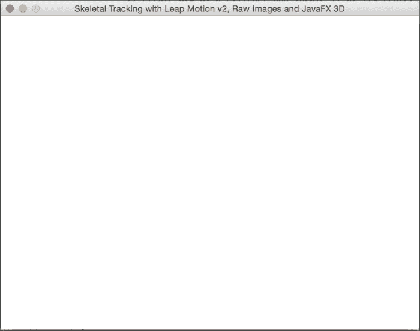

Leap JavaFX 应用程序的初始运行

移动并挥动你的手，你的手的骨骼建模应该出现在你真实的手背景中，响应你的真实动作如下所示：

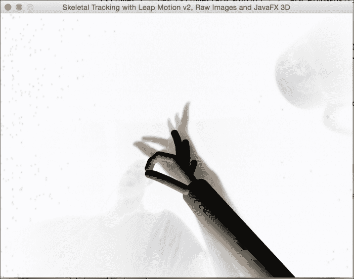

Leap JavaFX 应用程序与 Leap 控制器的交互

尝试不同的手臂或手部模式和位置；您应该在 JavaFX 应用程序场景中看到这一复制，如下截图所示：

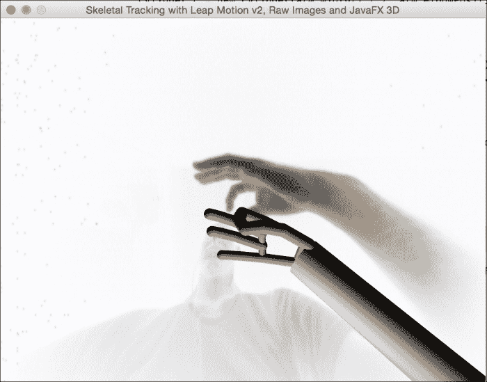

Leap JavaFX 应用程序与 Leap 控制器的交互，具有不同的手部模式

# 更多示例

有关使用 JavaFX 与 Leap Motion 设备的更多示例，请参考在线资源，如[`www.parleys.com/share.html#play/525467d6e4b0a43ac12124ad`](http://www.parleys.com/share.html#play/525467d6e4b0a43ac12124ad)或[`jperedadnr.blogspot.com.es/2013/06/leap-motion-controller-and-javafx-new.html`](http://jperedadnr.blogspot.com.es/2013/06/leap-motion-controller-and-javafx-new.html)。有关与其他编程语言的交互，请访问[`developer.leapmotion.com/gallery`](https://developer.leapmotion.com/gallery)。

# 总结

在本章中，你了解了令人印象深刻的 Leap Motion 设备，以及使用它来增强 JavaFX 应用程序所产生的非常好的组合效果。

你开始学习关于设备及其工作原理。接下来，我们讨论了它的 Java SDK，并探讨了一个简单的应用程序，在这个应用程序中，你学会了如何在一个线程中监听和处理 Leap 设备的数据，同时在 JavaFX 线程中触发事件来处理场景图中的数据。

在下一章中，我将提供给真正的 JavaFX 专家们使用的高级工具和资源。
