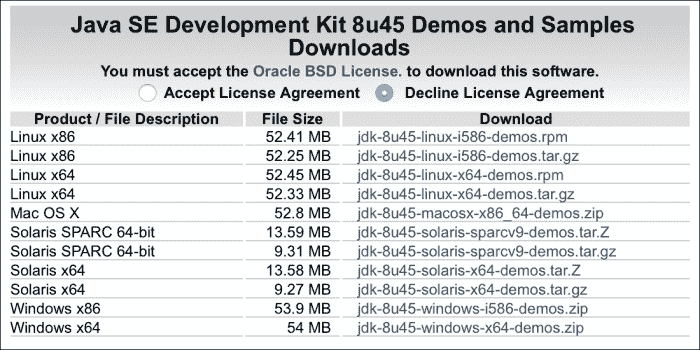
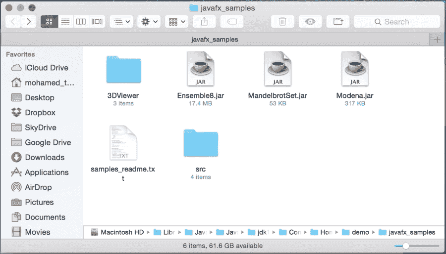
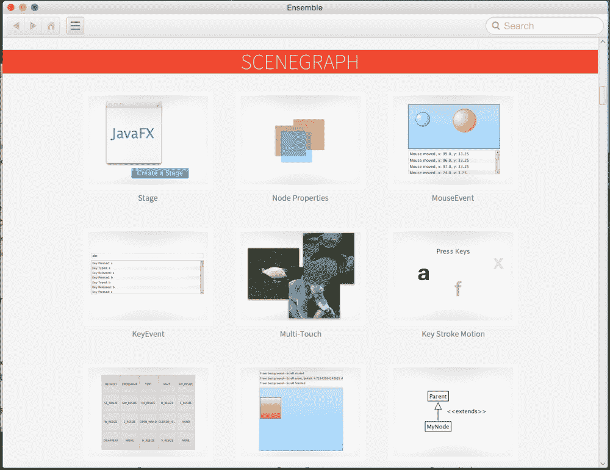
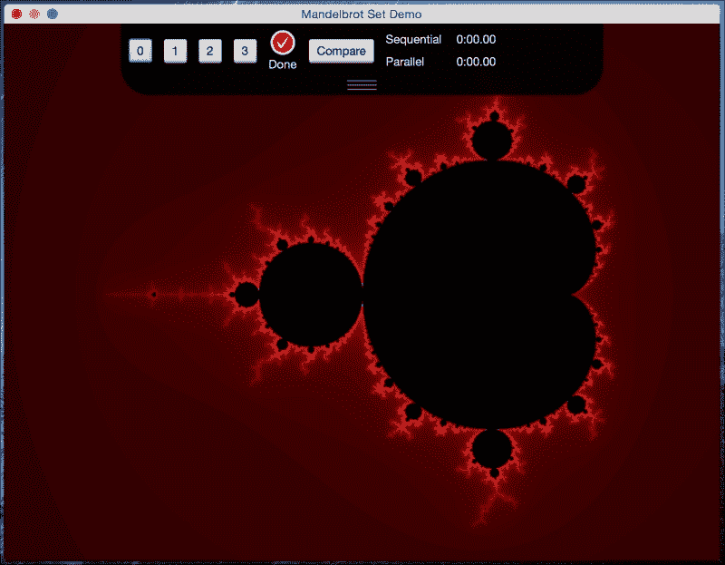
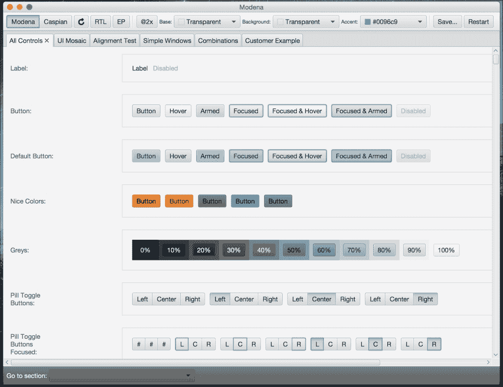
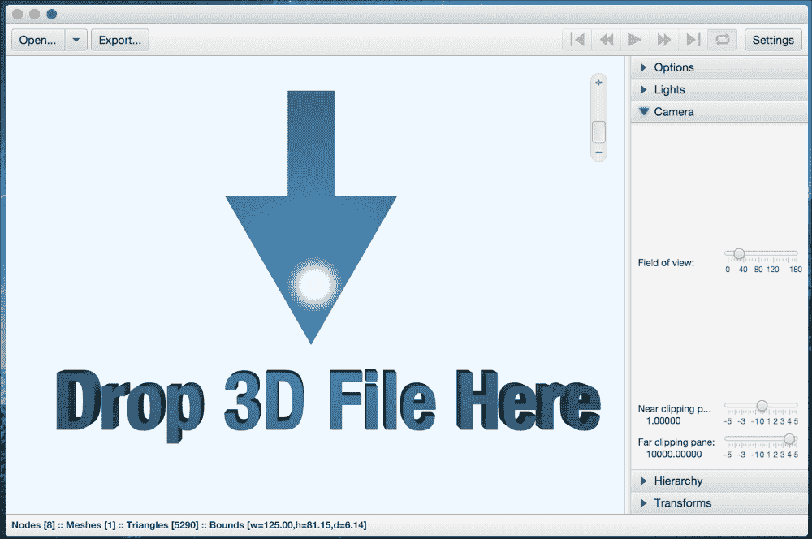

# 附录 A. 成为 JavaFX 大师

您的 JavaFX 8 之旅会在这里停止吗？绝对不会！JavaFX 是一个非常庞大的主题，它每天都在增长，从 Oracle 的核心发布到新功能、功能和稳定性，再到许多社区个人和公司创建的第三方库，以填补您可能遇到的任何缺失，或者围绕它发明新的缺失。

当然，通过这本书，我无法涵盖所有 JavaFX 8 主题。相反，我试图挖掘许多 JavaFX 领域的表面，并打开主题关键，以便使您的冒险更加轻松，通过找到自己的方式，并了解如何自己做。

然而，我们还讨论了许多其他工具和技术，通过开发传统的 Web 和桌面应用程序，然后转向更先进和市场需求的领域，即移动开发。

我们通过学习**物联网**来探索未来，这是信息技术的下一个时代，我们涵盖了更多有趣的主题。我们在电影中多次看到了运动，并且想象过，通过开发基于令人惊叹的 Leap Motion v2 设备的增强型无触摸 JavaFX 8，我们实现了我们的梦想。

还有更多内容可以成为 JavaFX 专题，并获得其他经验，这些内容我们在本书中没有讨论。

*那么，我们接下来该去哪里？*

现在，既然您已经有了许多运行中的 JavaFX 8 应用程序，并且对它在许多平台和硬件上的工作原理有了了解，剩下的就取决于您和您的创造力了。

加入 Facebook、Twitter 社区，并关注技术专家的博客，JavaFX 博客网址为[`blogs.oracle.com/javafx/`](http://blogs.oracle.com/javafx/)，并在[`fxexperience.com/`](http://fxexperience.com/)找到新闻、演示和见解。最重要的是，进行实验。

在本章结束时，一定要查看许多在今天的生产中使用 JavaFX 的*框架*、*库*和*项目*。

# 资源和参考资料

在这一部分，您将找到许多有用的链接和参考资料，将帮助您进一步了解所有 JavaFX 主题。

## 官方文档

+   **JavaFX 文档**：这是一个很好的资源，指向所有 JavaFX 资源、新闻、经验、视频、书籍、API 文档、技术文章和教程：

[`www.oracle.com/technetwork/java/javase/documentation/javafx-docs-2159875.html`](http://www.oracle.com/technetwork/java/javase/documentation/javafx-docs-2159875.html)

+   **Java 平台，标准版（Java SE）8**：这些是*客户端技术*，包含许多涵盖所有 JavaFX 主题的示例：[`docs.oracle.com/javase/8/javase-clienttechnologies.htm`](http://docs.oracle.com/javase/8/javase-clienttechnologies.htm)

## JavaFX 示例

学习 JavaFX 8 的最佳资源之一是 Java 开发工具包 8 的示例和演示，其中包括一个 JavaFX 演示文件夹，其中包含许多精彩和先进的应用程序，涵盖了所有 JavaFX 主题，并附有源代码，您可以自己进行实验。

您可以通过访问以下链接[`www.oracle.com/technetwork/java/javase/downloads/jdk8-downloads-2133151.html`](http://www.oracle.com/technetwork/java/javase/downloads/jdk8-downloads-2133151.html)下载示例，然后转到**Java SE Development Kit 8u45 Demos and Samples Downloads**表，选中**接受许可协议**单选按钮，然后单击与您的操作系统相关的 zip 文件链接，如下图所示：



下载 JDK 和 JavaFX 8 演示和示例

`samples` zip 文件包含预构建的示例，您可以运行，以及每个示例的 NetBeans 项目文件。

解压缩 zip 文件会产生以下目录结构：

```java
--src  (*Contains a NetBeans project for each sample*)
 --<Sample1>
  --nbproject
  --src
  --build.xml
  --manifest.mf
  --<Sample2>
  <sample1>.jar(*Runs the sample as a standalone application*)
<sample2>.jar

```



JavaFX 示例文件夹内容

任何`sample.jar`都可以作为独立应用程序运行；双击 JAR 文件，我们有四个应用程序：

1.  `Ensemble8.jar`：演示各种 JavaFX 功能的示例应用程序库，包括动画，图表和控件。对于每个示例，您可以在所有平台上执行以下操作：

+   查看并与运行中的示例进行交互

+   阅读其描述。

您只能在桌面平台上为每个示例执行以下操作：

+   复制其源代码

+   对于几个示例，您可以调整示例组件的属性

+   如果您连接到互联网，还可以跟随链接到相关的 API 文档*Ensemble8 也可以在 JavaFX 上运行 ARM（意味着在 Raspberry Pi 上运行）*。



Ensemble8 应用程序正在运行

1.  `MandelbrotSet.jar`：演示使用 Java Parallel API 进行并行执行的优势的示例应用程序。

该应用程序使用 Mandelbrot 集算法渲染图像，并提供直观的输入参数范围内的导航。

更多信息可在`MandelbrotSet`文件夹内的`index.html`文件中找到。



MandelbrotSet 应用程序正在运行

1.  `Modena.jar`：演示使用`Modena`主题的 UI 组件外观和感觉的示例应用程序。它为您提供了对比`Modena`和`Caspian`主题以及探索这些主题的各个方面的选项。

Modena 应用程序正在运行

1.  `3DViewer.jar`：3DViewer 是一个示例应用程序，允许用户使用鼠标或触摸板导航和检查 3D 场景。3DViewer 具有**OBJ**和 Maya 文件中一些功能的导入器。

还提供了导入 Maya 文件动画的功能。（请注意，在 Maya 文件的情况下，保存为 Maya 文件时应删除所有对象的构造历史。）3DViewer 还具有将场景内容导出为 Java 或`FXML`文件的功能。



3DViewer 应用程序正在运行

为了自己玩代码并尝试任何更改，恭喜，您有机会通过在**NetBeans**中运行所有先前提到的应用程序来做到这一点：

1.  在 NetBeans IDE 中，单击工具栏中的**打开项目**，或单击**文件**菜单，然后选择**打开项目**。

1.  导航到解压缩示例的位置，并在`src`目录中，选择一个项目，然后单击**打开**。

1.  要在 NetBeans IDE 中运行应用程序，请在**项目**窗格中，右键单击项目，然后选择**运行**。

## Java SE 8

作为提醒，JavaFX 8 内置于 Java 8 SDK 中。这意味着您只需要下载 Java 8 SDK。可以从以下位置下载 Java 8 软件开发工具包和相关信息：

+   Oracle 技术网络上的 Java 8：

[`oracle.com/java8`](http://oracle.com/java8)

+   Java 开发工具包：

[`www.oracle.com/technetwork/java/javase/downloads/index.html`](http://www.oracle.com/technetwork/java/javase/downloads/index.html)

+   Java 8 中有什么新功能？让我们来看看 Java 8 的新功能：

[`www.oracle.com/technetwork/java/javase/8-whats-new-2157071.html`](http://www.oracle.com/technetwork/java/javase/8-whats-new-2157071.html)

+   Java SE 8 新功能巡回演示：

[`tamanmohamed.blogspot.com/2014/06/java-se-8-new-features-tour-big-change.html`](http://tamanmohamed.blogspot.com/2014/06/java-se-8-new-features-tour-big-change.html)

### Java SE 8 API 文档和教程

Java 8 文档和指南位于以下链接：

+   Java SE 8 Javadoc API 文档：

[`docs.oracle.com/javase/8`](http://docs.oracle.com/javase/8)

+   JavaFX 8 Javadoc API 文档：

[`docs.oracle.com/javase/8/javafx/api`](http://docs.oracle.com/javase/8/javafx/api)

+   Java SE 8 概述文档：

[`docs.oracle.com/javase/8/docs/index.html`](http://docs.oracle.com/javase/8/docs/index.html)

+   Java SE 8 教程：

[`docs.oracle.com/javase/tutorial/tutorialLearningPaths.html`](http://docs.oracle.com/javase/tutorial/tutorialLearningPaths.html)

### 项目 Lambda

核心 Java SE 8 添加的语言特性是 Lambda 表达式和流 API。以下参考资料是围绕项目 Lambda 的路线图、博客和视频：

+   Lambda 的现状，Brian Goetz（Oracle）：

[`cr.openjdk.java.net/~briangoetz/lambda/lambda-state-final.html`](http://cr.openjdk.java.net/~briangoetz/lambda/lambda-state-final.html)

+   Java 8 揭秘：Lambda、默认方法和批量数据操作，Anton Arhipov：

[`zeroturnaround.com/rebellabs/java-8-revealed-lambdas-defaultmethods-and-bulk-data-operations`](http://zeroturnaround.com/rebellabs/java-8-revealed-lambdas-defaultmethods-and-bulk-data-operations)

+   Java 8 中 Lambda 表达式和流的 10 个示例，Javin Paul：

[`javarevisited.blogspot.com/2014/02/10-example-of-lambdaexpressions-in-java8.html`](http://javarevisited.blogspot.com/2014/02/10-example-of-lambdaexpressions-in-java8.html)

+   Java SE 8：Lambda 快速入门，Oracle：

[`www.oracle.com/webfolder/technetwork/tutorials/obe/java/Lambda-QuickStart/index.html`](http://www.oracle.com/webfolder/technetwork/tutorials/obe/java/Lambda-QuickStart/index.html)

+   Java 8：闭包，Lambda 表达式解密，Frank Hinkel：

[`frankhinkel.blogspot.com/2012/11/java-8-closures-lambdaexpressions.html`](http://frankhinkel.blogspot.com/2012/11/java-8-closures-lambdaexpressions.html)

### Nashorn

Java SE 8 包括一个名为**Nashorn**的新脚本引擎，这是 Java 运行时的一个新的、改进的 JavaScript 引擎。该引擎使开发人员能够使用 JavaScript 语言来编写应用程序。

以下链接和参考资料是描述 Nashorn 的文章和博客：

+   Oracle 的 Nashorn：JVM 的下一代 JavaScript 引擎，Julien Ponge:

[`www.oraclejavamagazine-digital.com/javamagazine_twitter/20140102/?pg=60#pg60`](http://www.oraclejavamagazine-digital.com/javamagazine_twitter/20140102/?pg=60#pg60)

+   Open JDK 的 Nashorn 网站：

[`wiki.openjdk.java.net/display/Nashorn/Main`](https://wiki.openjdk.java.net/display/Nashorn/Main)

+   Nashorn 博客：

[`blogs.oracle.com/Nashorn`](https://blogs.oracle.com/Nashorn)

## JavaFX 属性和绑定

在 JavaFX 中，属性和绑定在同步 JavaFX 节点之间的值时至关重要。

以下是关于只读属性、监听器和 JavaFX Bean 角色的重要资源：

+   在 JavaFX 中创建只读属性，Michael Heinrichs：

[`blog.netopyr.com/2012/02/02/creating-read-only-properties-injavafx`](http://blog.netopyr.com/2012/02/02/creating-read-only-properties-injavafx)

+   未知的 JavaBean，Richard Bair：

[`weblogs.java.net/blog/rbair/archive/2006/05/the_unknown_jav.html`](https://weblogs.java.net/blog/rbair/archive/2006/05/the_unknown_jav.html)

+   使用 JavaFX 属性和绑定，Scott Hommel：

[`docs.oracle.com/javafx/2/binding/jfxpub-binding.htm`](http://docs.oracle.com/javafx/2/binding/jfxpub-binding.htm)

+   Pro JavaFX 8, (Chapter 4, *Properties and Bindings*), Johan Vos, James Weaver, Weiqi Gao, Stephen Chin, and Dean Iverson, (Apress, 2014):

[`www.apress.com/9781430265740`](http://www.apress.com/9781430265740)

+   Open Dolphin：一个 JavaFX MVC 框架（由 Canoo Engineering 的 Dierk Koenig 创建）：

[`open-dolphin.org/dolphin_website/Home.html`](http://open-dolphin.org/dolphin_website/Home.html)

+   基于约定优于配置和依赖注入的 JavaFX MVP 框架（由 Adam Bien 创建）：

[`afterburner.adam-bien.com`](http://afterburner.adam-bien.com)

## JavaFX 社区

所以你想参与 JavaFX 社区？请查看以下链接：

+   Java.net JavaFX 社区网站：

[`www.java.net/community/javafx`](https://www.java.net/community/javafx)

+   FXExperience：JavaFX 新闻、演示和见解（@fxexperience）：

[`fxexperience.com`](http://fxexperience.com)

+   Nighthacking（@_nighthacking）：由 Stephen Chin 主持。环游世界，了解有关 Java、JavaFX 和物联网的一切。令人惊叹的现场讲话。

[`nighthacking.com`](http://nighthacking.com)

+   Oracle 的 JavaFX 社区门户网站，提供真实世界的用例、社区支持、第三方工具和 Open JFX：

[`www.oracle.com/technetwork/java/javase/community/index.html`](http://www.oracle.com/technetwork/java/javase/community/index.html)

+   JFXtras：JavaFX 自定义控件社区：

[`jfxtras.org`](http://jfxtras.org)

+   ControlsFX：另一个由 Oracle 的 Jonathan Giles 发起的自定义控件社区：

[`fxexperience.com/controlsfx`](http://fxexperience.com/controlsfx)

+   硅谷 JavaFX 用户组：

[`www.meetup.com/svjugfx`](http://www.meetup.com/svjugfx)

+   硅谷 JavaFX 用户组直播：

[`www.ustream.tv/channel/silicon-valley-javafx-user-group`](http://www.ustream.tv/channel/silicon-valley-javafx-user-group)

+   Oracle 关于 JavaFX 的论坛：

[`community.oracle.com/community/developer/english/java/javafx/javafx_2.0_and_later`](https://community.oracle.com/community/developer/english/java/javafx/javafx_2.0_and_later)

## Java SE / JavaFX 图书和杂志

以下链接是与新的 Java SE 8 和 JavaFX 8 平台相关的较新的书名：

+   一本了不起的书，《JavaFX 8：通过示例介绍，第二版》，Carl Dea，Mark Heckler，Gerrit Grunwald，José Pereda 和 Sean M. Phillips（Apress，2014 年。ISBN：978-1-4302-6460-6）

[`www.apress.com/9781430264606`](http://www.apress.com/9781430264606)

+   Pro JavaFX 8，Johan Vos，James Weaver，Weiqi Gao，Stephen Chin 和 Dean Iverson（Apress，2014 年。ISBN：978-1-4302-6574-0）

[`www.apress.com/9781430265740`](http://www.apress.com/9781430265740)

+   Java 8 Recipes，Josh Juneau（Apress，2014 年。ISBN：978-1-4302-6827-7）

[`www.apress.com/9781430268277`](http://www.apress.com/9781430268277)

+   JavaFX Rich Client Programming on the NetBeans Platform，Paul Anderson 和 Gail Anderson（Addison-Wesley Professional，2014 年。ISBN：978-0321927712）：

[`blogs.oracle.com/geertjan/entry/new_book_javafx_rich_client`](https://blogs.oracle.com/geertjan/entry/new_book_javafx_rich_client)

[`www.amazon.com/JavaFX-Client-Programming-NetBeans-Platform/dp/0321927710`](http://www.amazon.com/JavaFX-Client-Programming-NetBeans-Platform/dp/0321927710)

+   《掌握 JavaFX 8 控件》，Hendrik Ebbers（Oracle Press，2014 年。ISBN：9780071833776）：

[`mhprofessional.com/product.php?isbn=0071833773`](http://mhprofessional.com/product.php?isbn=0071833773)

[`www.guigarage.com/javafx-book`](http://www.guigarage.com/javafx-book)

+   JavaFX 快速入门指南，J.F. DiMarzio（Oracle Press，2014 年。ISBN：978-0071808965）：

[`www.mhprofessional.com/product.php?isbn=0071808965`](http://www.mhprofessional.com/product.php?isbn=0071808965)

+   Java SE 8 for the Really Impatient，Cay S. Horstmann（Addison-Wesley，2014 年。ISBN 978-0321927767）

[`www.addison-wesley.de/9780321927767.html`](http://www.addison-wesley.de/9780321927767.html)

+   《掌握 Lambda》，Maurice Naftalin（Oracle Press，2014 年。ISBN：007-1829628）：

[`www.mhprofessional.com/product.php?isbn=0071829628`](http://www.mhprofessional.com/product.php?isbn=0071829628)

+   来自 Oracle 的 Java 杂志：

[`www.oracle.com/technetwork/java/javamagazine/index.html`](http://www.oracle.com/technetwork/java/javamagazine/index.html)

> *感谢您的时间，希望您和我写作时一样喜欢阅读这本书。谢谢。*
