# 第五章：使用 mod_cluster 进行负载均衡

在本章中，我们将探讨另一种负载均衡解决方案。它被称为**mod_cluster**([`www.jboss.org/mod_cluster`](http://www.jboss.org/mod_cluster))。

与 JK 相比，mod_cluster 在设计上更强大和复杂。然而，设计中的额外复杂性并不意味着它更难使用；mod_cluster 被设计成可扩展的，并且可以动态地找到工作节点，从而形成一个集群。

这种灵活性通常会给新手带来困惑，并给他们留下 mod_cluster 难以使用的印象。因此，为了欣赏 mod_cluster 的强大功能和使用的简便性，我们首先必须了解其设计。

# mod_cluster 的设计

从上一章，我们知道 JK 使用 TCP 端口通过 AJP13 协议与 JBoss EAP6 服务器通信。与 JK 相比，mod_cluster 使用以下三个通道来执行其功能：

+   **连接器通道**支持负载均衡器代理用户请求到工作节点的多种协议。这部分几乎等同于 JK。这里的区别在于，除了 AJP13 协议外，mod_cluster 还支持 HTTP/HTTPS 协议。

+   **广告通道**用于发现工作节点。该通道使用 IP 多播来传输 UDP 数据报。负载均衡器将在多播组中广播自己，而工作节点将通过订阅此组自动找到它。

+   **管理通道**用于在负载均衡器和工作节点之间传输状态和管理消息。管理通道使用的协议是 HTTP/1.1 协议的扩展。该协议的名称是**MCMP**。

与 JK 相比，mod_cluster 可以收集工作节点的许多运行时因素来判断其“繁忙程度”，并计算出一个表示每个工作节点“繁忙程度”的数字。这个数字被称为**负载因子**，而因素被称为**度量指标**。

### 小贴士

mod_cluster 为我们提供了多个度量指标来使用，例如`SystemMemoryUsageLoadMetric`和`AverageSystemLoadMetric`。完整的度量指标列表可以在此处找到：[`docs.jboss.org/mod_cluster/1.2.0/html/java.load.html`](http://docs.jboss.org/mod_cluster/1.2.0/html/java.load.html)。

mod_cluster 的部署分为两部分：第一部分是负载均衡器，另一部分是工作节点。在我们的场景中，负载均衡器是**httpd**，mod_cluster 为其提供了一个原生组件。在工作节点端，我们使用 JBoss EAP6，mod_cluster 为其提供了一个子系统。总的来说，让我们概述其结构：

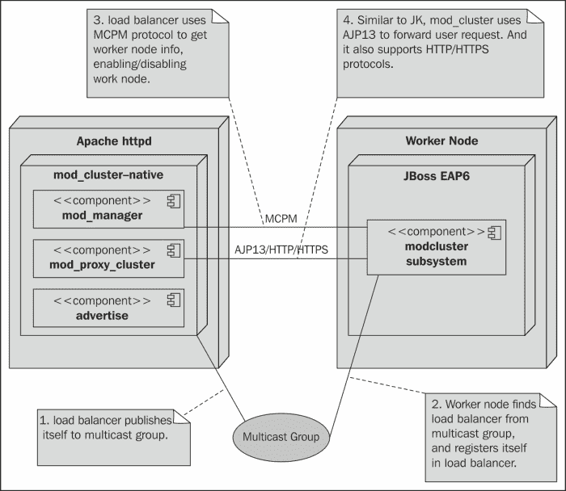

根据前面的图示，mod_cluster 分为两部分：负载均衡器端和工作节点端。此外，它还具有以下三个通道，形成了其功能：

+   **advertise**通道允许负载均衡器进行自我宣传，并且工作节点可以在运行时动态加入或退出集群。

+   使用**mod_manager**通道，负载均衡器可以从工作节点获取负载因子信息。在此通道中，使用 MCPM 协议，负载因子以及工作节点的其余信息以固定时间间隔发送。

+   **mod_proxy_cluster**通道将从后面将用户请求转发到工作节点。它支持类似于 JK 的 AJP13 协议，并且额外支持 HTTP/HTTPS。

在对 mod_cluster 的设计概述之后，我们将在下一节学习如何安装 mod_cluster。

# 安装 mod_cluster

在本节中，我们将学习如何从源代码编译 mod_cluster 并将其安装在我们的负载均衡器机器上。我用来安装 mod_cluster 和 httpd 的机器被称为*lb*，与上一章中使用的机器相同。

在上一章中，我们学习了如何编译和安装 httpd，并且在我们的 httpd 安装中放置了许多与 JK 相关的配置。为了使本章的说明更清晰，让我们将上一章的以下 httpd 安装存档：

```java
$ mv httpd httpd-for-jk

```

我们将在下一章中使用它，所以请妥善备份。我们的下一步是重复上一章中进行的 httpd 编译和安装过程。实际上，我们只需要在 httpd 源目录中重新运行`make install`，因为我们已经正确配置和编译了它，通过运行此命令我们将获得一个新的 httpd 安装。现在让我们继续 mod_cluster 的安装。

## 下载 mod_cluster

现在我们需要下载 mod_cluster。mod_cluster 的源代码托管在 GitHub 上。本书中将使用 1.2.6.Final 版本：[`github.com/modcluster/mod_cluster/archive/1.2.6.Final.zip`](https://github.com/modcluster/mod_cluster/archive/1.2.6.Final.zip)。

下载它并解压 zip 文件，您将得到源目录`mod_cluster-1.2.6.Final`。以下是其内容：

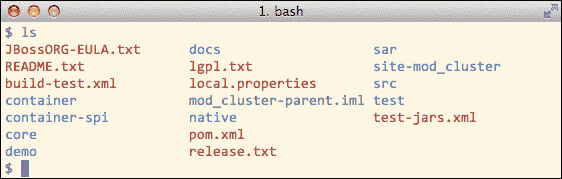

在源目录中，我们可以看到 mod_cluster 包含几个组件，但我们只需要关注`native`目录中的组件。其他 Java 模块是为工作节点准备的。由于 EAP6 已经内置了 mod_cluster 子系统，我们不需要编译它们。现在让我们看看`native`目录：

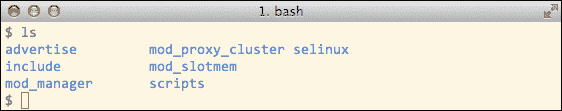

您可能已经通过组件的名称猜到了它们的一些用途；我们仍然要逐个检查它们：

| advertise | 支持自动发现工作节点的广告模块 |
| --- | --- |
| mod_proxy_cluster | 支持 AJP/HTTP/HTTPS 代理请求的代理模块。 |
| mod_manager | 控制工作节点并从工作节点获取负载因子的 mod_cluster 管理模块。 |
| mod_slotmem | mod_cluster 内部使用的共享内存模块。 |
| selinux | SELinux 策略文件。本书不会涉及这个主题。 |
| include | 公共头文件。 |
| scripts | 一些我们不会使用的安装脚本。 |

我们已经理解了这些组件的含义，现在是时候构建它们了。

## 编译和安装 mod_cluster

我们需要构建的模块是 advertise、mod_proxy_cluster、mod_manager 和 mod_slotmem。你构建哪个模块都无关紧要；让我们从`advertise`开始。我们需要在以下目录中找到一个名为`buildconf`的脚本：

```java
mod_cluster-1.2.6.Final/native/advertise$ ls buildconf
buildconf

```

现在让我们运行这个脚本：

```java
$ ./buildconf

```

它将创建一个名为`configure`的脚本。然后我们需要使用以下命令运行此脚本：

```java
$ ./configure  --with-apxs=/packt/httpd/bin/apxs

```

我们使用了`--with-apxs`选项来告诉 mod_cluster httpd 的位置。配置过程完成后，请运行`make`命令，我们将得到以下名为`mod_advertise.so`的共享库：

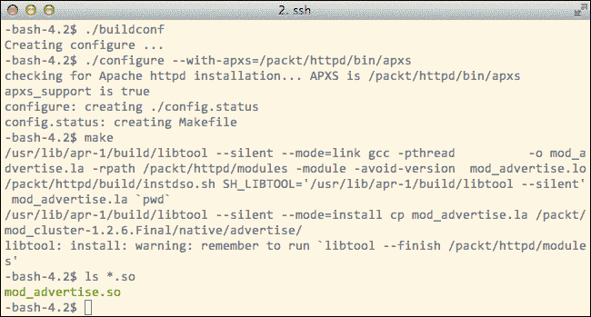

在前面的库构建完成后，让我们将其移动到 httpd 的`modules`文件夹：

```java
$ mv mod_advertise.so /packt/httpd/modules/

```

这就是我们编译和安装`advertise`需要做的所有事情。转到其他三个模块的目录，并使用相同的程序逐个构建它们。我们将得到`mod_proxy_cluster.so`、`mod_manager.so`和`mod_slotmem.so`。请将它们全部移动到 httpd 的`modules`目录。

这些是我们需要安装的所有 mod_cluster 组件。在下一节中，我们将配置 httpd 以使用这些模块。

# 配置 mod_cluster

在 httpd 中安装必要的 mod_cluster 组件后，我们将在本节中正确配置它们。

## 配置 httpd.conf

在我们开始配置 mod_cluster 之前，我们需要在`httpd.conf`中做一些准备工作。首先要做的是将`Listen`指令从`Listen 80`更改为以下内容：

```java
Listen 10.0.1.33:80
Listen 10.0.1.33:6666
Listen 172.16.123.1:80

```

如我们所知，*lb*有两个 IP 地址：一个是公开地址 172.16.123.1，另一个是 10.0.1.33，这是负载均衡器用于与两个 EAP6 服务器通信的内部 IP 地址。现在让我们了解配置的目的：

+   `10.0.1.33:80`将用于 mod_cluster 管理控制台。我们不希望这个管理控制台公开访问，所以我们只将其绑定到本地 IP 地址。

+   `10.0.1.33:6666`将由 mod_manager 用于与 EAP6 服务器通信，封装在 MCPM 协议中的消息将通过此通道传输。

+   `172.16.123.1:80`是服务用户请求的公开地址。如果你没有单独的公开 IP 地址，你可以直接使用你的本地 IP 地址来服务所有请求。

在配置了监听地址后，下一步是配置`LogLevel`。我们需要将日志级别更改为`debug`；以下是如何进行配置的：

```java
LogLevel debug

```

我们需要稍后查看调试日志输出。我们现在将转到 `ServerName` 部分，并添加我们的负载均衡器的主机名。我们使用 `lb` 作为主机名，所以配置如下：

```java
ServerName lb

```

并且请记住将此服务器名绑定到 `/etc/hosts` 中的公共 IP 地址。接下来，我们需要在 `httpd.conf` 的底部添加一个 `Include` 指令：

```java
Include conf.d/*.conf

```

这就是在 `httpd.conf` 中我们需要做的所有事情。在下一节中，我们将在 `conf.d` 目录中为 mod_cluster 创建一个单独的配置文件。

## 配置 mod_cluster

现在，让我们在 httpd 中创建一个名为 `conf.d` 的目录：

```java
/packt/httpd$ mkdir conf.d

```

然后，我们需要在同一个目录下创建一个名为 `mod-cluster.conf` 的文件：

```java
/packt/httpd/conf.d$ touch mod-cluster.conf

```

由于 `httpd.conf` 中的 `Include conf.d/*.conf` 指令，创建的配置文件将在 httpd 启动时被加载。

现在，让我们将内容添加到这个文件中。首先，我们需要加载以下 mod_cluster 模块：

```java
LoadModule slotmem_module modules/mod_slotmem.so
LoadModule manager_module modules/mod_manager.so
LoadModule proxy_cluster_module modules/mod_proxy_cluster.so
LoadModule advertise_module modules/mod_advertise.so

```

注意到 mod_cluster 依赖于 `httpd.conf` 中已经配置的一些模块：

```java
LoadModule proxy_module modules/mod_proxy.so
LoadModule proxy_ajp_module modules/mod_proxy_ajp.so
LoadModule proxy_http_module modules/mod_proxy_http.so
LoadModule ssl_module modules/mod_ssl.so

```

### 注意

前面的模块已经在 `httpd.conf` 中被加载。请注意，由于与 mod_cluster 冲突，httpd 中的 `proxy-balancer` 模块已被禁用。

现在我们需要定义两个虚拟主机：一个用于网页管理控制台，另一个用于管理模块发送/接收 MCPM 消息。让我们逐个来看。以下是第一个的配置：

```java
<VirtualHost 10.0.1.32:80>
 <Directory />
 Order deny,allow
 Deny from all
 Allow from 10.0.1
 </Directory>
 <Location /mc>
 SetHandler mod_cluster-manager
 Order deny,allow
 Deny from all
 Allow from 10.0.1
 </Location>
</VirtualHost>

```

在之前的虚拟主机定义中，我们已经定义了一个名为 `/mc` 的位置，并将其绑定到 `mod_cluster-manager`。这个处理器将为我们提供一个基于网页的管理控制台，我们将在后面的章节中使用。现在让我们检查第二个虚拟主机定义：

```java
<VirtualHost 10.0.1.32:6666>
 <Directory />
 Order deny,allow
 Deny from all
 Allow from 10.0.1
 </Directory>
 ServerAdvertise on http://10.0.1.32:6666
 EnableMCPMReceive
</VirtualHost>

```

在前面的设置中，有两个重要的指令。一个是 `ServerAdvertise` 指令。在此指令中设置的地址将由 mod_cluster 在多播组中广播。例如，我们的设置如下：

```java
ServerAdvertise on http://10.0.1.32:6666

```

因此，mod_cluster 将通过说类似这样的话来在多播组中广播：“我的 MCPM 管理通道位于 http://10.0.1.32:6666，来加入我吧！”订阅了多播组的 worker 节点将接收到这个信息，然后可以加入集群。

请注意，我们不需要配置广告的组播地址。这是因为广告的默认地址是 224.0.1.105:23364，这与 EAP6 的默认设置相匹配。我们将在下一节中看到这一点。如果您想更改此设置，您可以使用 `AdvertiseGroup` 指令，将其放置在 `ServerAdvertise` 指令下：

```java
AdvertiseGroup <some_other_multicast_addr:some_other_port>

```

### 小贴士

您可以随时查看 mod_cluster 的在线文档，了解这些详细配置：([`docs.jboss.org/mod_cluster/1.2.0/html/native.config.html`](http://docs.jboss.org/mod_cluster/1.2.0/html/native.config.html))。

现在让我们看看下面的指令：

```java
EnableMCPMReceive

```

使用前面的指令，虚拟主机 10.0.1.32:6666 被用作管理通道，MCPM 被用作此通道的通信协议。这就是我们在 `mod-cluster.conf` 中需要做的所有事情。

### 配置 EAP6

到目前为止，我们还没有查看 EAP6 中的 `modcluster` 子系统配置。由于 EAP6 域模式提供的默认配置已经很好用，我们不需要做任何更改。但让我们看一下配置。

从 `domain.xml` 中的配置，我们可以看到 `modcluster` 子系统的以下默认设置：

```java
<subsystem >
    <mod-cluster-config advertise-socket="modcluster" connector="ajp">
        <dynamic-load-provider>
            <load-metric type="busyness"/>
        </dynamic-load-provider>
    </mod-cluster-config>
</subsystem>
```

我们可以看到，`modcluster` 子系统通过 `advertising-socket` 指令绑定到名为 `modcluster` 的广告套接字。然后我们看到，`modcluster` 子系统默认使用 `busyness` 指标。这是一个从工作线程判断服务器“忙碌程度”的指标。现在让我们看看 `modcluster` 套接字绑定的设置：

```java
<socket-binding-group name="full-ha-sockets" default-interface="public">
  <socket-binding name="modcluster" port="0" multicast-address="224.0.1.105" multicast-port="23364"/>
</socket-binding-group>
```

从前面的配置中，我们可以看到 `224.0.1.1.105:23364` 是广告的默认多播组地址。这与 httpd 端的设置相匹配。

这些设置是 EAP6 中的 `modcluster` 子系统的设置。因为我们已经从两端了解了 mod_cluster 的设置，所以在下一节中，我们将测试集群。

# 测试集群

在本节中，我们将测试我们的集群，因此我们需要启动我们的负载均衡器和 EAP6 服务器。在我们开始在 `lb` 上启动 httpd 之前，我们需要启动两个 EAP6 服务器。在两个 EAP6 服务器启动后，再启动 httpd。在以下章节中，我们将检查启动 httpd 的过程。

## 启动 httpd

现在我们需要启动 httpd 服务器。如果一切顺利，httpd 中的 mod_cluster 将开始在一个多播组中广播自己，两个 EAP6 服务器中的 `modcluster` 子系统将通过在广播通道中获取其地址来找到 httpd。我们将在以下章节中调查这个过程；让我们首先启动 httpd。在 `lb` 上启动 httpd 的命令如下：

```java
/packt/httpd/bin$ sudo ./httpd -f /packt/httpd/conf/httpd.conf -k start

```

在 httpd 启动后，mod_cluster 将向多播组 224.0.1.105:23364 广播自己，两个 EAP6 服务器上的 `modcluster` 子系统将从该组中获取管理通道的地址，即 10.0.1.32:6666。然后负载均衡器和两个 EAP6 工作节点将通过使用 MCPM 协议在管理通道中进行通信来形成一个集群。这个过程在以下图中展示：

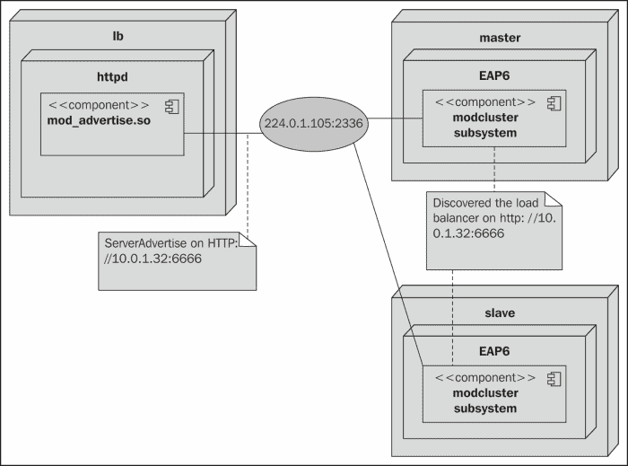

为了理解这些步骤，我们需要分析通过网络发送的数据包。

## 协议分析

我们可以使用 Wireshark 捕获来自一个工作节点的一个 IP 数据包。在我的例子中，我将在 `master` 上运行 Wireshark。我们可以验证这台机器上负载均衡器发送的广告消息。

### 小贴士

也有一个小型的 Java 程序，允许我们加入多播组并接收 httpd 广告。请参阅此程序[`github.com/mod_cluster/mod_cluster/blob/master/test/java/Advertize.java`](https://github.com/mod_cluster/mod_cluster/blob/master/test/java/Advertize.java)。

### 广告通道

我已经在`master`上启动了 Wireshark 来捕获 IP 数据包。我将它设置为捕获 224.0.1.105:23364 上的所有数据包，以下是我的发现：

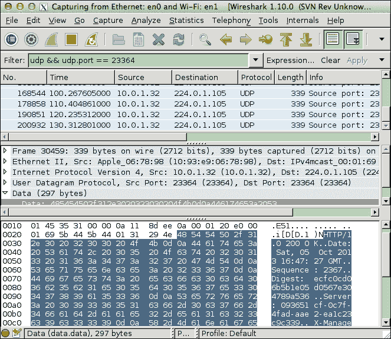

从前面的截图可以看出，`master`定期接收广告消息。从**时间**列中，我们可以看到广告消息以 10 秒的间隔发送。

### 小贴士

您可以通过将`AdvertiseFrequency`指令放入`conf.d/mod-cluster.conf`来更改此设置。

我们可以看到广告信息是以 HTTP 格式。以下是该消息的详细信息：

```java
HTTP/1.0 200 OK
Date: Sat, 05 Oct 2013 16:50:49 GMT
Sequence: 2387
Server: 093651cf-0c7f-4fad-aae2-ea1c23c9c339
X-Manager-Address: 10.0.1.32:6666
X-Manager-Url: /093651cf-0c7f-4fad-aae2-ea1c23c9c339
X-Manager-Protocol: http
X-Manager-Host: cute

```

如前述代码所示，广告信息将负载均衡器信息放置在 HTTP 头部中。在这些头部中，我们应该注意`X-Manager-Address`的值。它告诉工作节点在哪里找到负载均衡器。其他头部为工作节点提供额外的信息；这些信息描述了负载均衡器。

### 管理通道

在工作节点得知负载均衡器的管理地址后，它将与负载均衡器通信并在其上注册自己。要查看此过程，我们需要查看 httpd 日志。由于我们在`httpd.conf`中设置了`LogLevel`为`debug`，我们可以获取许多有用的详细信息。mod_cluster 在调试级别输出了很多有用的日志信息，因此我们可以检查`logs/error_log`以清楚地查看序列。以下是日志：

```java
[Sat Oct 05 18:09:15 2013] [debug] mod_manager.c(1910): manager_trans INFO (/)
[Sat Oct 05 18:09:15 2013] [debug] mod_manager.c(2618): manager_handler INFO (/) processing: ""
[Sat Oct 05 18:09:15 2013] [debug] mod_manager.c(2667): manager_handler INFO  OK

```

`INFO`是我们迄今为止看到的第一个 MCMP 命令。这是工作节点用来请求更多负载均衡器详细信息的命令。由于 mod_cluster 动态形成集群，它事先不知道集群的详细信息。负载均衡器和工作节点只在多播通道中相互发现，因此工作节点需要更多关于负载均衡器的详细信息。这就是为什么工作节点会向负载均衡器发送`INFO`请求，负载均衡器会以`INFO-RSP`响应。

现在，让我们看看下一步：

```java
[Sat Oct 05 18:09:15 2013] [debug] mod_manager.c(1910): manager_trans CONFIG (/)
[Sat Oct 05 18:09:15 2013] [debug] mod_manager.c(2618): manager_handler CONFIG (/) processing: "JVMRoute=14a0af8b-59dd-33f9-8233-1f2584fefa67&Host=10.0.1.19&Maxattempts=1&Port=8259&StickySessionForce=No&Type=ajp&ping=10"
[Sat Oct 05 18:09:15 2013] [debug] mod_manager.c(2667): manager_handler CONFIG  OK

```

工作节点获取到负载均衡器的详细信息后，会向负载均衡器发送一个`CONFIG`消息，告知负载均衡器之前的工作节点详细信息。`JVMRoute`是工作节点的名称；这是由 EAP6 中的 mod_cluster 子系统自动生成的。现在我们知道服务器`14a0af8b-59dd-33f9-8233-1f2584fefa67`对应于服务器`10.0.1.19`，这是我们从属的 EAP6 服务器。

让我们检查下一步：

```java
[Sat Oct 05 18:09:15 2013] [debug] mod_manager.c(1910): manager_trans ENABLE-APP (/)
[Sat Oct 05 18:09:15 2013] [debug] mod_manager.c(2618): manager_handler ENABLE-APP (/) processing: "JVMRoute=14a0af8b-59dd-33f9-8233-1f2584fefa67&Alias=default-host%2Clocalhost%2Cexample.com&Context=%2Fcluster-demo1"
[Sat Oct 05 18:09:15 2013] [debug] mod_manager.c(2667): manager_handler ENABLE-APP  OK

```

工作节点向负载均衡器发送`ENABLE-APP`。这是工作节点用来请求负载均衡器将对应于上下文和`Alias`值的请求路由到由`JVMRoute`定义的节点。此外，我们看到已启用的应用程序是`cluster-demo1`。因此，如果我们通过路由`/cluster-demo1`访问负载均衡器 URL，请求将被转发到 EAP6 服务器。现在让我们看看下一步：

```java
[Sat Oct 05 18:09:15 2013] [debug] mod_manager.c(1910): manager_trans STATUS (/)
[Sat Oct 05 18:09:15 2013] [debug] mod_manager.c(2618): manager_handler STATUS (/) processing: "JVMRoute=14a0af8b-59dd-33f9-8233-1f2584fefa67&Load=100"
[Sat Oct 05 18:09:15 2013] [debug] mod_manager.c(1625): Processing STATUS

```

工作节点发送包含其当前负载因子的`STATUS`消息。从前一个日志的第二行，我们可以看到从属 EAP6 服务器的负载因子为`100`（因子数字越小，服务器越忙）。此消息定期发送，负载因子刷新以反映工作节点的实时状态。因此，负载均衡器可以知道哪个服务器更忙，并将此请求发送到负载较轻的工作节点。

通过前面的过程，工作节点和负载均衡器已经收集了足够的信息，并建立了通信。然后，`mod_proxy_cluster.so`集群将开始执行实际的代理工作。在下一节中，我们将检查这部分。

## 连接器通道分析

在前一节中，我们看到了负载均衡器如何自我宣传，以及工作节点如何发现它并将自己注册到集群中。现在让我们继续检查`error_log`，看看发生了什么：

```java
[Sat Oct 05 18:09:15 2013] [debug] mod_proxy_cluster.c(655): add_balancer_node: Create balancer balancer://mycluster
[Sat Oct 05 18:09:15 2013] [debug] mod_proxy_cluster.c(426): Created: worker for ajp://10.0.1.19:8259
[Sat Oct 05 18:09:15 2013] [debug] proxy_util.c(2018): proxy: ajp: has acquired connection for (10.0.1.19)
[Sat Oct 05 18:09:15 2013] [debug] proxy_util.c(2074): proxy: connecting ajp://10.0.1.19:8259/ to 10.0.1.19:8259
[Sat Oct 05 18:09:15 2013] [debug] proxy_util.c(2200): proxy: connected / to 10.0.1.19:8259

```

根据前面的日志，mod_cluster 已与`ajp://10.0.1.19:8259`建立连接。这是从属主机上 EAP6 服务器的 AJP 连接器。我们可以看到，mod_cluster 已为我们集群设置了一个名称，即`mycluster`。我们可以从管理控制台检查此集群的状态。让我们通过其 URL `http://10.0.1.32/mc` 访问管理控制台。

这在下面的屏幕截图中有显示：

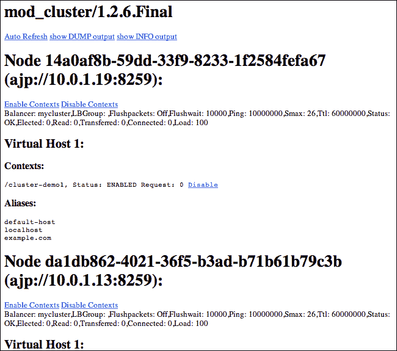

从前面的屏幕截图，我们可以看到两个 EAP6 服务器形成一个集群，它们都属于`mycluster`。如果您想更改均衡器名称，您可以使用`mod-cluster.conf`中的`ManagerBalancerName`指令，如下所示：

```java
<VirtualHost 10.0.1.32:6666>
  ...
  ServerAdvertise on http://10.0.1.32:6666
  EnableMCPMReceive
  ManagerBalancerName packtlb
</VirtualHost>
```

根据前面的配置，均衡器名称设置为`packtlb`。现在，如果我们保存更改并重新启动 httpd，我们可以看到均衡器名称相应地更改：

```java
Node 14a0af8b-59dd-33f9-8233-1f2584fefa67 (ajp://10.0.1.19:8259):
Balancer: packtlb, ...

Node da1db862-4021-36f5-b3ad-b71b61b79c3b (ajp://10.0.1.13:8259):
Balancer: packtlb, ...

```

当同时运行多个负载均衡器时，这很有用。通过均衡器名称，我们可以轻松地看到哪个工作节点属于哪个负载均衡器。

现在，让我们回到调试日志；这是我们最后需要查看的部分：

```java
[Sat Oct 05 18:09:15 2013] [debug] mod_proxy_cluster.c(1366): proxy_cluster_try_pingpong: connected to backend
[Sat Oct 05 18:09:15 2013] [debug] mod_proxy_cluster.c(1089): ajp_cping_cpong: Done
[Sat Oct 05 18:09:15 2013] [debug] proxy_util.c(2036): proxy: ajp: has released connection for (10.0.1.19)
[Sat Oct 05 18:09:15 2013] [debug] mod_manager.c(2667): manager_handler STATUS  OK

```

在 AJP 通道建立后，来自 httpd 侧的 mod_cluster 将定期发送`ajp_cping_cpong`消息到 EAP6 工作节点，以检查节点是否仍然存活。

由于我们已经完成了协议分析，在下一节中，我们将访问集群以查看其是否正常工作。

## 访问集群

我们可以通过其 URL 访问负载均衡器：`http://lb/cluster-demo1/index.jsp`。

通过检查两个 EAP6 服务器的输出，我们可以看到请求被分配到`master`：

```java
[Server:master-server] 02:34:49,395 INFO  [stdout] (ajp-/10.0.1.13:8259-4) Hello! The time is now Mon Oct 07 02:34:49 CST 2013

```

现在我们检查 mod_cluster 管理控制台，我们可以看到主服务器已被选举一次：

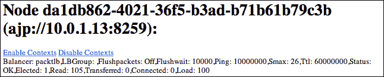

如前一张截图所示，主服务器的**选举**次数变为**1**。

### 故障转移

现在让我们通过按*Ctrl* + *C*键来终止主服务器：

```java
02:41:36,977 INFO  [org.jboss.as.process] (Shutdown thread) JBAS012015: All processes finished; exiting

```

从从服务器，我们可以看到它开始抛出以下异常，因为它无法连接到主服务器：

```java
[Host Controller] 02:41:47,971 DEBUG [org.jboss.as.host.controller] (domain-connection-threads - 8) failed to reconnect to the remote host-controller: java.net.ConnectException: JBAS012144: Could not connect to remote://10.0.1.13:9999\. The connection timed out

```

这是预期的，因为我们已经终止了主服务器。但它仍然可以作为服务器运行。现在让我们再次访问负载均衡器；我们可以看到以下请求被分配到从服务器：

```java
[Server:slave-server] 02:44:45,285 INFO  [stdout] (ajp-/10.0.1.19:8259-2) Hello! The time is now Mon Oct 07 02:44:45 CST 2013

```

现在让我们访问 mod_cluster 管理控制台，我们可以看到主服务器已被自动移除。此外，从服务器的**选举**次数变为**1**：

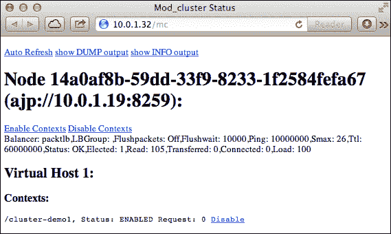

现在让我们在主服务器上重启 EAP6 服务器，它将重新加入集群。从 httpd 调试日志输出中，我们可以确认如下：

```java
[Mon Oct 07 04:01:31 2013] [debug] proxy_util.c(2200): proxy: connected / to 10.0.1.13:8259

```

从从服务器输出中，我们可以看到它也恢复了与域控制器的连接：

```java
[Host Controller] 04:01:05,379 INFO  [org.jboss.as.host.controller] (domain-connection-threads - 1) JBAS010916: Reconnected to master

```

### 压力测试

现在让我们尝试使用 Apache HTTP 服务器基准测试工具（称为**ab**）来对我们的集群进行负载测试。以下是命令：

```java
$ ab -c 15 -n 1500 http://lb/cluster-demo1/index.jsp

```

我们使用了`15`个线程向我们的集群发送`1500`次请求。以下是结果：

```java
Benchmarking cute (be patient)
Completed 150 requests
...
Finished 1500 requests

```

您可以看到 ab 在 mod_cluster 上创建了一些负载。以下是测试期间两个工作节点状态的详细信息：

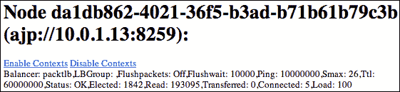

上一张截图显示了主服务器状态，下一张截图显示了从服务器状态：

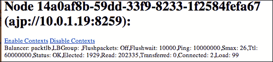

我们可以看到两个工作节点都被选举了（选举次数超过 1,500 次，因为我已经多次运行了前面的测试）。我们还可以看到从服务器的**负载**因子变为**99**。这意味着从服务器比主服务器更忙，因此负载均衡器将在稍后分配更多请求到主服务器。

# 摘要

在本章中，我们探讨了 mod_cluster 的设计及其用法。本章只是对 mod_cluster 的入门介绍。如果您想查看更高级的用法，请参阅其不断改进的在线文档：[`docs.jboss.org/mod_cluster/1.2.0/html_single/`](http://docs.jboss.org/mod_cluster/1.2.0/html_single/)。

如果您对使用 mod_cluster 有任何疑问，您可以在 JBoss 论坛上提问：[`community.jboss.org/en/mod_cluster/content`](https://community.jboss.org/en/mod_cluster/content)。

在下一章中，我们将看到如何在集群环境中应用**安全套接字层**（**SSL**）。
