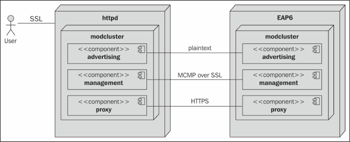
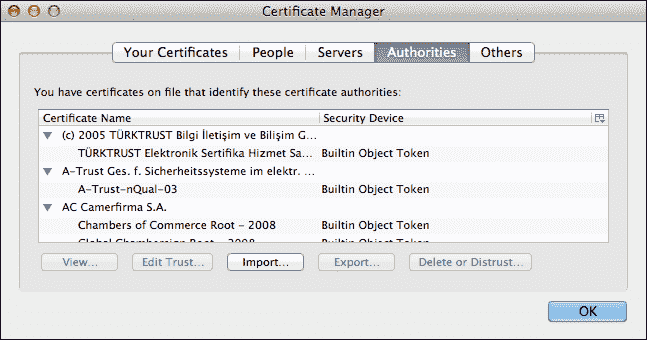
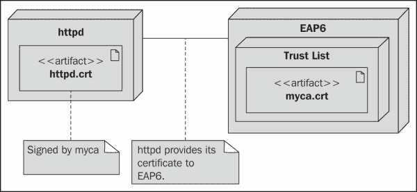
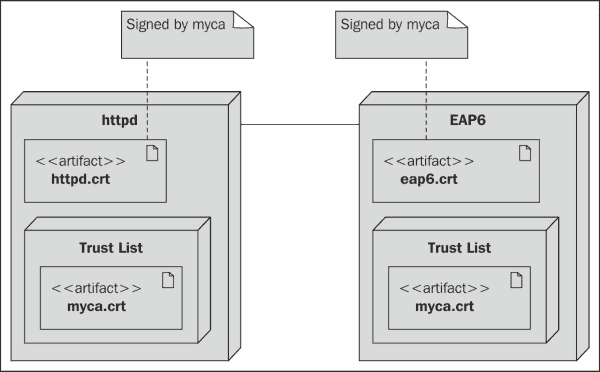
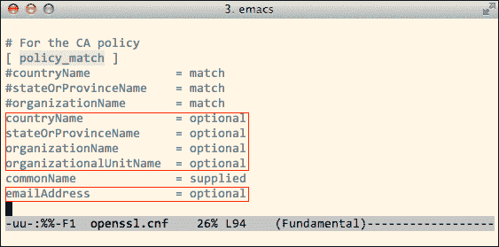
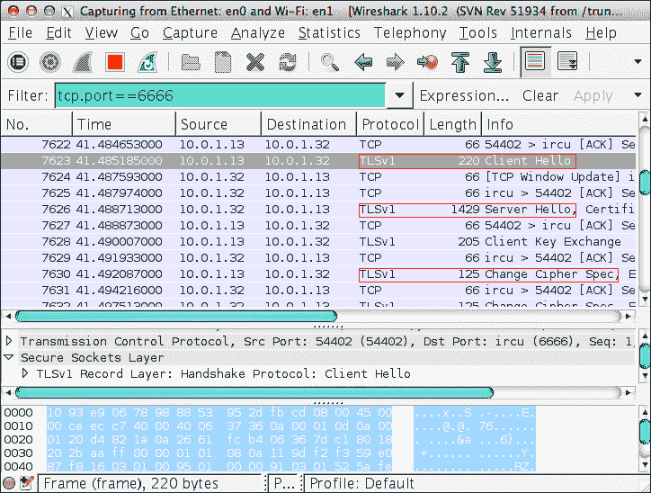
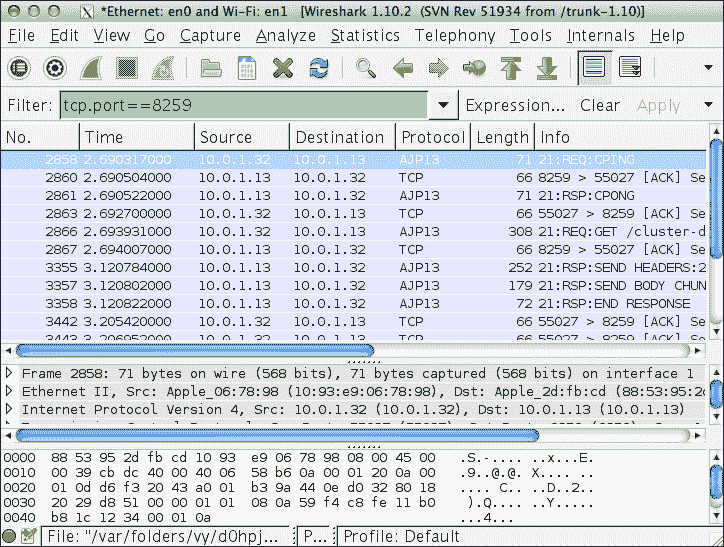
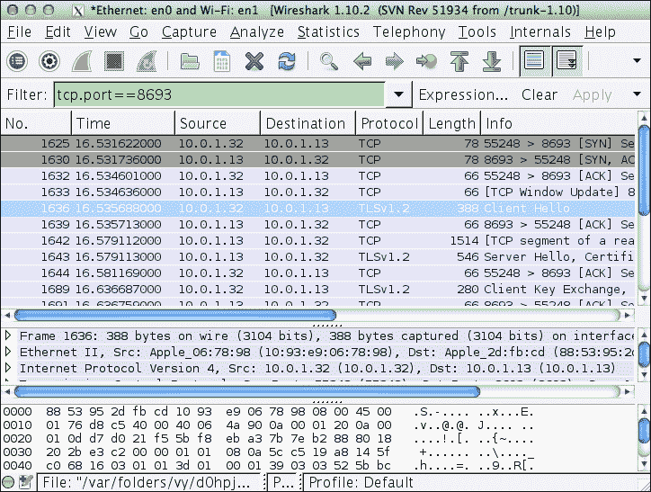

# 第七章. 使用 SSL 配置 mod_cluster

在上一章中，我们学习了如何使用 SSL 与 JK（mod_jk）一起使用。在本章中，我们将首先检查 mod_cluster 的设计，并讨论如何与 SSL 一起使用。然后我们将学习如何配置 httpd 和 EAP6 服务器，以便它们可以使用 SSL。

首先，让我们检查 mod_cluster 的设计。

# mod_cluster 的设计

正如我们在上一章中看到的，JK 在负载均衡器和工作节点之间使用 AJP13 协议。与 JK 相比，mod_cluster 允许我们确保其通信通道的安全性。

在设计中，mod_cluster 使用三个通道进行通信：广告通道、管理通道和代理通道。mod_cluster 允许我们在管理通道和代理通道中确保通信的安全性。

下面的部署图：



如前图所示，SSL 通信可以在以下三个地方启用：

+   用户与 httpd 之间的通信

+   httpd 和 EAP6 之间的 mod_cluster 管理通道通信

+   httpd 和 EAP6 之间的 mod_cluster 代理通道通信

在上一章中，我们学习了如何使用 SSL 在用户和 httpd 之间启用通信。我们需要生成一个自签名证书，并在 httpd 中配置 mod_ssl 以使用该证书。以下是我们上一章使用的配置：

```java
SSLEngine on
SSLCertificateFile /packt/httpd/certs/lb.crt
SSLCertificateKeyFile /packt/httpd/certs/lb.key

```

前面的配置实际上是针对 mod_ssl 的；因此，当我们从 JK 切换到 mod_cluster 的负载均衡器组件时，它保持不变。

### 注意

请检查本章代码中的`mod-cluster-ssl.conf`文件。

除了 httpd 对纯 mod_ssl 的支持以启用用户和 httpd 之间的 SSL 通信外，mod_cluster 还提供了额外的功能，以确保 httpd 和 EAP6 服务器之间数据传输的安全性。在接下来的章节中，我们将探讨如何为提到的其他两个地方启用安全通信。首先，我们将学习如何在 mod_cluster 管理通道中启用 SSL。

# 启用 mod_cluster 管理通道的 SSL

在本节中，我们将学习如何保护 MCMP 通道。这意味着 MCMP 消息将通过 SSL 传输。

### 小贴士

在 mod_cluster 文档中，我们称该协议为 MCMP，代表**Mod-Cluster Management Protocol**。

在设计中，mod_cluster 使用 SSL 双向认证来保护 MCMP 通道。这意味着我们必须为服务器创建证书。EAP6 需要信任 httpd 提供的证书；同时，httpd 必须信任来自 EAP6 服务器的证书。因此，我们需要两个证书而不是一个。

## SSL 双向认证简介

在上一章中，我们为 httpd 创建了一个自签名证书，以启用与用户的 HTTPS 通信。当用户使用网络浏览器访问我们的网站时，httpd 将向网络浏览器提供其证书。如果用户选择信任该证书，网络浏览器将与我们的服务器建立安全连接。这被称为单向认证。这意味着用户将验证网站的标识，但网站不会验证用户的身份。

由于我们的证书是自签名的，网络浏览器将弹出警告，告知用户它无法验证此证书的身份，用户需要决定是否信任它。但如果我们的证书由权威机构签发，网络浏览器将信任我们的证书而不会弹出任何警告信息。这是因为每个网络浏览器都包含一个默认的权威机构列表。这些权威机构签发的证书将被默认信任。

例如，我可以在我的 Firefox 浏览器中看到以下默认 CA 列表：



Firefox 只会信任这些权威机构签发的证书。JDK 也包含这样一个列表，通常是`$JAVA_HOME/jre/lib/security/cacerts`文件。

现在，让我们来谈谈加密 httpd 和 EAP6 之间的通信。首先，我们将了解单向认证。这种情况在下面的图中展示：


由于 EAP6 运行在 JVM 中，它信任一组默认的 CA。我们的自签名证书显然不是由这些机构签发的；因此，默认情况下，EAP6 不会信任它。

为了解决这个问题，我们可以自己创建一个权威机构，并使用这个权威机构来签发证书。然后，我们可以将这个权威机构放置在 EAP6 中，以覆盖默认的信任列表，这样 EAP6 就会信任它所签发的证书。这种情况在下面的图中展示：



使用之前的方法，我们可以从 httpd 到 EAP6 建立单向认证。如果我们想建立双向 SSL 认证，我们需要为 EAP6 额外创建一个证书，并用 myca 签发它。然后，我们需要配置 httpd 将 myca 放入其信任列表，以便它信任 EAP6 的证书。下面的图展示了这种情况：



从这个图中我们可以看到，**httpd**将向**EAP6**展示其证书，**EAP6**也将向**httpd**展示其证书。只有在他们的证书由 myca 签发，并且 myca 在他们的信任列表中时，他们才会相互信任。mod_cluster 强制执行这种双向 SSL 认证。在接下来的章节中，我们将学习如何正确配置 httpd 和 EAP6。

## 配置 SSL 双向认证

由于我们已经学习了 SSL 互信认证的概念，现在让我们配置我们的环境以启用它。我们需要创建以下三个证书：

+   一个作为权威机构的自签名证书。让我们称它为 `myca.crt`。

+   为 httpd 创建一个由 myca 签署的证书。让我们称它为 `httpd.crt`。

+   为 EAP6 创建一个由 myca 签署的证书。让我们称它为 `eap6.crt`。

让我们逐个创建它们。

### 创建 CA 证书

首先，我们将创建一个 CA 证书。术语 **CA** 代表 **证书授权机构**；它实际上是一个自签名证书，将用于签署其他证书。如果一个应用程序将其 CA 放入其信任列表中，由它签署的证书将被信任。

我们将创建一个名为 `myca` 的自签名证书，并将其用作我们的 CA。在我们创建它之前，请准备一个名为 `certs` 的目录，并将其放置在适当的位置。由于我们将创建三个证书及其密钥文件，最好将它们放在一起。对我来说，我会将其放在 `/packt/certs`。

请使用以下命令创建一个自签名证书及其密钥文件：

```java
$ opensslreq -new -newkeyrsa -days 365 -x509 -subj "/C=CN/ST=Beijing/L=Beijing/O=Personal/CN=myca" -keyoutmyca.key -out myca.crt
Generating a 2048 bit RSA private key
..++++++
........................++++++
writing new private key to 'myca.key'
Enter PEM pass phrase: packt000
Verifying - Enter PEM pass phrase: packt000
-----

```

使用前面的命令，我已经生成了一对密钥及其自签名证书，该证书的 `CN` 是 `myca`。我们可以通过以下方式检查证书内容来查看这一点：

```java
$ keytool -printcert -file myca.crt | head -n 2
Owner: CN=myca, O=Personal, L=Beijing, ST=Beijing, C=CN
Issuer: CN=myca, O=Personal, L=Beijing, ST=Beijing, C=CN

```

如我们所见，`Owner` 和 `Issuer` 是相同的。现在，让我们为 httpd 创建一个证书，并用 myca 签署它。

### 为 httpd 创建证书

由于我们现在有了 myca 权威机构，让我们为 httpd 创建一个证书，然后用 myca 签署它。我们首先需要使用以下命令为 httpd 创建一个密钥对：

```java
$ openssl genrsa -des3 -out httpd.key 1024
Generating RSA private key, 1024 bit long modulus
.........++++++
..........................................................++++++
e is 65537 (0x10001)
Enter pass phrase for httpd.key: packt000
Verifying - Enter pass phrase for httpd.key: packt000

```

如前所述命令所示，密钥文件名为 `httpd.key`。接下来，我们将创建与密钥对相关的证书；以下命令执行此操作：

```java
$ openssl req -new -key httpd.key -out httpd.csr -subj "/C=CN/ST=Beijing/L=Beijing/O=Personal/CN=httpd"
Enter pass phrase for httpd.key: packt000

```

请注意，我们证书的 `CN` 值是 `httpd`。运行前面的命令后，我们得到等待签署的 `http.csr` 文件。现在，我们需要使用 OpenSSL 提供的工具使用 myca 签署此证书，但在那之前，我们需要正确设置 OpenSSL。

### 设置 OpenSSL

OpenSSL 有自己的证书签名工作流程。请运行以下命令以设置 OpenSSL 的工作环境：

```java
$ mkdir -p demoCA/newcerts
$ touch ./demoCA/index.txt
$ touch ./demoCA/serial
$ echo "01" > ./demoCA/serial

```

我们签署的证书将被放置在 `newcerts` 目录中，并命名为 `01.pem`。请确保您已从包含 myca 和 httpd 证书的 `certs` 目录运行了前面的命令。

下一步是放宽 OpenSSL 的签名策略。首先，我们需要定位 OpenSSL 使用的配置文件。请运行以下命令：

```java
$ openssl ca
Using configuration from /etc/pki/tls/openssl.cnf
…

```

我们可以从之前的命令中看到 OpenSSL 使用的配置文件的位置。让我们打开 `openssl.cnf` 并找到 `policy_match` 部分。除了 `commonName` 之外，我们需要将此部分的所有项更改为 `optional`。以下截图列出了详细信息：



此外，我们还需要更改 OpenSSL 默认使用的目录来签署证书；以下是操作步骤：

```java
#dir = /etc/pki/CA
dir = demoCA

```

### 注意

我们更改 OpenSSL 默认设置只是为了测试目的。实际上，这将降低证书的安全性。

我们在生产环境中签署证书时应该始终使用默认位置，并仔细管理它们的权限。

此外，真正的 CA 机构通常会要求你提供包含它所需有效信息的证书。例如，可能的要求是，你的证书的 CN 必须匹配你的 DNS 主机名，而你所在国家的名称必须匹配你的主机位置。

### 签署 httpd.csr 文件

由于我们已经正确设置了 OpenSSL，我们现在可以开始签署我们的 httpd 证书。请确保您位于`certs`目录中，并且它包含一个包含必要文件内容的`demoCA`目录。请运行以下命令来签署 httpd 证书：

```java
$ openssl ca -in httpd.csr -keyfile myca.key -cert myca.crt
Using configuration from /etc/pki/tls/openssl.cnf
Enter pass phrase for myca.key: packt000
Check that the request matches the signature
Signature ok
Certificate Details:
...
Sign the certificate? [y/n]:y
1 out of 1 certificate requests certified, commit? [y/n] y
Write out database with 1 new entries
...
Data Base Updated

```

现在，我们已经签署了`httpd.csr`；这个已签名的证书位于`demoCA/newcerts`中，名称为`01.pem`。让我们检查此证书的内容：

```java
$ cat demoCA/newcerts/01.pem
Certificate:
Issuer: C=CN, ST=Beijing, L=Beijing, O=Personal, CN=myca
Subject: CN=httpd, C=CN, ST=Beijing, O=Personal

```

我们可以看到`Subject`值为`httpd`，`Issuer`值为`myca`。因此，我们使用了我们自己的 CA 来签署我们的证书。让我们将此证书复制到`certs`目录，并将其重命名为`httpd.crt`：

```java
$ cpdemoCA/newcerts/01.pem httpd.crt

```

关于 httpd 证书的内容就到这里。现在，我们来处理 EAP6 服务器，为它创建一个证书，并且使用 myca 进行签名。

### 为 EAP6 创建证书

EAP6 服务器中的过程有所不同；首先，我们需要使用`keytool`命令创建一个带有自签名证书的密钥库。然后，我们将从密钥库中导出证书，并使用 myca 进行签名。之后，我们将`myca.crt`导入密钥库，作为信任权威。因此，所有由 myca 签名的证书都将被 JVM 信任和接受。之后，我们将已签名的 EAP6 证书重新导入密钥库。

首先，让我们创建一个密钥库。密钥库文件`eap6.ks`将包含默认密钥对和一个与密钥对相关的自签名证书。以下是创建密钥库的命令：

```java
$ keytool -genkey -keystoreeap6.ks -storepass packt000 -keypass packt000 -keyalg RSA -validity 365 -alias eap6cert -dname "cn=eap6,o=Personal,c=CN,ST=Beijing,L=Beijing"

```

从前面的命令中，我们可以看到密钥库的名称为`eap6.ks`，证书的别名为`eap6cert`。证书的`cn`字段值为`eap6`，并且该证书默认为自签名。我们可以使用`keytool`命令来检查这一点：

```java
$ keytool -list -v -keystore eap6.ks -storepass packt000 -alias eap6cert
Alias name: eap6cert
...
Owner: CN=eap6, O=Personal, C=CN, ST=Beijing, L=Beijing
Issuer: CN=eap6, O=Personal, C=CN, ST=Beijing, L=Beijing
...

```

现在，让我们使用以下命令导出用于签名的`eap6cert`：

```java
$ keytool -certreq -keyalg RSA -alias eap6cert -file eap6cert.csr -keystoreeap6.ks -storepass packt000

```

使用前面的命令，我们得到了 **证书签名请求**（**CSR**）文件，`eap6cert.csr`。我们需要用 myca 签署此证书。过程与签署 `httpd.csr` 文件时完全相同。我们需要将 `eap6cert.csr` 放入 `certs` 目录，并且需要重新使用为签署 httpd 证书而创建的 `demoCA` 目录。请注意，我们不需要在 `./demoCA/serial` 中重置序列号，也不要从 `newcerts` 目录中删除 httpd 证书 `01.pem`。OpenSSL 将自动增加序列号，签署的 EAP6 证书将被命名为 `02.pem`。以下代码片段表示签署过程：

```java
$ opensslca -in eap6cert.csr -keyfilemyca.key -cert myca.crt
Using configuration from /etc/pki/tls/openssl.cnf
Enter pass phrase for myca.key: packt000
Check that the request matches the signature
Signature ok
Certificate Details:
...
Sign the certificate? [y/n]:y
1 out of 1 certificate requests certified, commit? [y/n]y
Write out database with 1 new entries
Certificate:
...
Data Base Updated

```

通过这个过程，EAP6 证书被签署并存储在 `demoCA/serial/02.pem` 中。现在，让我们将 `02.pem` 复制到 `eap6raw.crt`：

```java
$ cp demoCA/newcerts/02.pem eap6raw.crt

```

我们可以按照以下方式检查此证书的内容：

```java
Issuer: C=CN, ST=Beijing, L=Beijing, O=Personal, CN=myca
Subject: CN=eap6, C=CN, ST=Beijing, O=Personal

```

从 `Issuer` 和 `Subject` 字段，我们可以看到证书已被签署。此外，我们可以在文件底部看到编码的证书数据。让我们使用以下命令从 `eap6raw.crt` 中提取编码的证书文本：

```java
$ grep -A 50 "BEGIN CERTIFICATE" eap6raw.crt
-----BEGIN CERTIFICATE-----
MIIChTCCAe6gAwIBAgIBAjANBgkqhk...
...
bzCk0wKoQRWOZ5lCXUfN9OEOnVbYcBXTAQ==
-----END CERTIFICATE-----:

```

Java 安全库只能读取之前编码格式的证书，并且不允许证书文件中有任何额外的文本。因此，我们需要使用以下命令将编码的证书数据提取到另一个文件中：

```java
$ grep -A 50 "BEGIN CERTIFICATE" eap6raw.crt >eap6cert.crt

```

使用前面的命令，我们已经将编码的证书数据提取到 `eap6cert.crt`；只有在那时，`keytool` 命令才能正确读取它。以下是要使用的命令：

```java
$ keytool -printcert -file eap6cert.crt  | head -n 2
Owner: O=Personal, ST=Beijing, C=CN, CN=eap6
Issuer: CN=myca, O=Personal, L=Beijing, ST=Beijing, C=CN

```

现在，我们需要将此已签署的证书重新导入到我们的 keystore 中；`keytool` 命令将帮助我们使用此已签署的证书更新 keystore 中的自签名证书。在这样做之前，我们需要将 myca 导入到 keystore 中。由于我们的 EAP6 证书是由 myca 签署的，并且我们的 keystore 当前不包含 myca，它将拒绝任何由它签署的证书。以下命令将 myca 导入到 keystore：

```java
$ keytool -import -v -trustcacerts -alias myca -file myca.crt -keystoreeap6.ks -storepass packt000
...
Trust this certificate? [no]:  yes
Certificate was added to keystore
[Storing eap6.ks]

```

请注意前面命令中的 `-trustcacerts` 选项。我们使用此选项将 `myca` 标记为受信任的签名机构。现在我们可以导入 `eap6cert.crt` 文件，使其被 keystore 接受；我们使用以下命令来完成此操作：

```java
$ keytool -import -v -alias eap6cert -file eap6cert.crt -keystoreeap6.ks -storepass packt000
Certificate reply was installed in keystore
[Storing EAP6.ks]

```

让我们看看 keystore 中的证书：

```java
$ keytool -list -keystore eap6.ks -storepass packt000
Keystore type: JKS
Keystore provider: SUN

Your keystore contains 2 entries

eap6cert, Dec 2, 2013, PrivateKeyEntry,
Certificate fingerprint (MD5): …
myca, Dec 2, 2013, trustedCertEntry,
Certificate fingerprint (MD5): …

```

从前面的命令输出中，我们可以看到 keystore 中有两个条目。这两个条目有不同的类型：`eap6cert` 是 `PrivateKeyEntry`，这意味着它是一张可以用于身份验证的证书，而 `myca` 是 `trustedCertEntry`，这意味着它是一个权威机构，并且它签署的所有其他证书都将被信任。

我们已经正确地准备好了所有证书。接下来，我们将配置 httpd 和 EAP6，以便我们可以正确地使用这些证书。

### 注意

请检查本章提供的代码。在 `certs` 目录中，你可以看到我们在此部分生成的所有示例证书。

## 配置 httpd

为了在管理通道中启用安全通信，我们需要向与周围`<VirtualHost>`相关的虚拟主机添加几个 SSL 指令，如下面的配置所示：

```java
<VirtualHost 10.0.1.32:6666>
SSLEngine on
SSLCertificateFile /packt/httpd/certs/httpd.crt
SSLCertificateKeyFile /packt/httpd/certs/httpd.key
SSLCertificateChainFile /packt/httpd/certs/myca.crt
<Directory />
    Order deny,allow
      Deny from all
      Allow from 10.0.1
</Directory>
ServerAdvertise on https://10.0.1.32:6666
EnableMCPMReceive
ManagerBalancerNamepacktlb
</VirtualHost>
```

`httpd.crt`文件由 httpd 用于标识自身，并将发送到 EAP6 进行认证。`myca.crt`文件将用于认证 EAP6 发送给 httpd 的证书。正如我们所知，EAP6 的证书由`myca`签名；因此，httpd 将信任它。

这就是我们为 httpd 配置需要做的所有事情。

### 注意

请检查本章代码中的`mod-cluster-ssl-mcmp.conf`配置。

现在，让我们配置 EAP6 部分。

## 配置 EAP6

在 EAP6 中，我们需要将我们的证书和 truststore 放置在`domain.xml`的`mod_cluster`子系统的配置文件中。以下是其内容：

```java
<subsystem >
  <mod-cluster-config ...>
        ...
<ssl key-alias="eap6cert" password="packt000" certificate-key-file="/packt/certs/eap6.ks" ca-certificate-file="/packt/certs/eap6.ks"/>
  </mod-cluster-config>
</subsystem>
```

由于服务器证书`eap6cert`和 CA 证书`myca`都在密钥库`eap6.ks`中，我们将分别使用它们作为`certificate-key-file`和`ca-certificate-file`。EAP6 将向 httpd 展示`eap6cert`证书，并且由于它由 myca 签名，httpd 将信任它。

### 注意

请检查本章代码中的`domain-ssl-mcmp.xml`文件。

最后，我们还有一个非常重要的步骤：我们需要在主服务器和从服务器上复制`eap6.ks`密钥库，并将其放置在`/packt/certs/eap6.ks`的位置，就像我们在前面的代码片段中所做的那样。由于所有工作节点都使用来自`domain.xml`的配置，所有 EAP6 服务器都需要这个密钥库文件。

最后，所有配置都已完成。现在让我们测试集群。

## 测试配置

为了测试我们的配置，让我们启动 httpd 和两个 EAP6 服务器。然后我们可以使用`cURL`访问我们的集群：

```java
$ curl–k https://172.16.123.1/cluster-demo1/index.jsp
<html>
  <body>
    <h2>Hello World!</h2>

    Hello! The time is now Mon Oct 14 01:52:56 CST 2013
  </body>
</html>
```

上述代码片段显示负载均衡器正在工作。如果我们使用 Wireshark 监控管理通道，我们可以看到 SSL 协议正在运行：



这验证了管理通道的安全性。如果我们检查代理通道中的数据传输，我们可以看到它仍在使用明文 AJP13 协议：



在以下部分，我们将看到如何启用代理通道中的 SSL。

# 在代理通道中启用 SSL

在本节中，我们将配置 mod_cluster 以使用 HTTPS 而不是 AJP13 作为代理通道。

由于我们在前面的章节中已经准备好了必要的证书，因此为代理通道启用 HTTPS 不会是一项困难的任务。首先，让我们检查 httpd 服务器中的配置。我们需要向虚拟主机添加一个`SSLProxyEngine On`配置以启用公共访问：

```java
<VirtualHost 172.16.123.1:443>
  ...
SSLProxyEngine On
  ...
</VirtualHost>
```

如我们从前面的配置中可以看到，它告诉 httpd 我们需要为代理通道使用 SSL 连接，这就是我们需要配置 httpd 的所有内容。

### 注意

样本配置文件是`mod-cluster-ssl-full.conf`。

现在我们需要配置 EAP6 服务器。在 `domain.xml` 中，我们需要将 mod_cluster 连接器从 `ajp` 更改为 `https`，如下代码片段所示：

```java
<subsystem >
<!--<mod-cluster-config advertise-socket="mod_cluster" connector="ajp">-->
<mod-cluster-config advertise-socket="mod_cluster" advertise="true" sticky-session="true" sticky-session-remove="false" sticky-session-force="false" connector="https">
...
</mod-cluster-config>
</subsystem>
```

然后，我们需要关闭 `ajp` 连接器，并添加 `https` 连接器，如下所示：

```java
<!--<connector name="ajp" protocol="AJP/1.3" scheme="http" socket-binding="ajp" enabled="true"/>-->
<connector name="https" protocol="HTTP/1.1" scheme="https" socket-binding="https" secure="true">
<ssl name="https" key-alias="eap6cert" 
    password="packt000" 
    certificate-key-file="/packt/certs/eap6.ks" 
    protocol="TLS"
verify-client="false" 
    certificate-file="/packt/certs/eap6.ks" 
ca-certificate-file="/packt/certs/eap6.ks"/>
</connector>
```

由于我们正在强制执行 SSL 连接，我们需要关闭 `ajp` 连接器以防止其他人使用这个明文通信端口。

### 注意

样本配置文件是 `domain-ssl-full.xml`。

在重启 EAP6 服务器后，我们可以看到代理通道开始使用 HTTPS 进行通信。Wireshark 分析的截图如下：



# 摘要

在本章中，我们学习了使用 mod_cluster 与 SSL 的不同方法。我们通常只需要为公共访问加密传输层，并在 httpd 和 EAP6 之间使用明文通信，因为我们通过将工作节点放置在本地网络中来保护它们。请选择一个合适的解决方案以满足您的需求。在下一章中，我们将学习如何开发和部署分布式项目到集群中。
