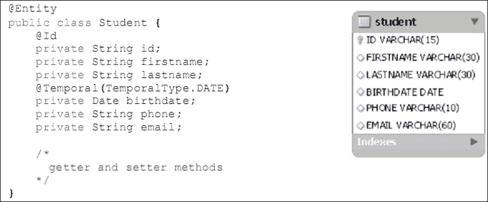

# 第四章 Java 持久化 API

本章讨论了与数据源通信的 API 的改进。尽管 Java 是面向对象的，但它被设计成可以以对象的形式处理关系模型中的数据，这可能会引起严重问题，因为这两个概念在理论上并不兼容。除了向您介绍对象关系映射的世界之外，本章还将向您展示如何透明地以事务方式操作（创建、删除、搜索或编辑）关系模型的数据。本章涵盖的主题包括：

+   Java 持久化 API 2.1

+   Java 事务 API 1.2

# Java 持久化 API 2.1

Java 持久化 API 2.1 规范是在**JSR-338**下开发的。本节仅为您概述 API 的改进。完整的文档规范（更多信息）可以从[`jcp.org/aboutJava/communityprocess/final/jsr338/index.html`](http://jcp.org/aboutJava/communityprocess/final/jsr338/index.html)下载。

## JPA（Java 持久化 API）

**JPA**（**Java 持久化 API**）是一个旨在定义 ORM（**对象关系映射**）标准特性的 Java 规范。然而，JPA 不是一个产品，而是一组需要实现接口。最著名的实现如下：**Hibernate**、**Toplink**、**OpenJPA**和**EclipseLink**，这是参考实现。

简而言之，我们可以这样说，ORM（对象关系映射）是一个用于在对象模型和关系数据库之间建立对应关系的 API。它使您能够像处理对象一样处理数据库中的数据，而不必过多地担心物理模式。

## JPA 实践

JPA 基于实体概念，以便实现对象关系映射。实体是一个简单的 Java 类（如**POJO**），带有`@Entity`注解（或 XML 等效），其名称默认与数据库中具有相同名称的表相关联。除了`@Entity`注解之外，实体类还必须至少有一个与`@Id`注解（或 XML 等效）指定的主键等效属性。对于实体的其他属性，提供者将它们中的每一个关联到表中具有相同名称的列，如下面的截图所示：



指示将关联到一组实体的数据库的参数必须在应用程序的`persistence.xml`文件中的持久化单元中定义。

以下代码是 Java SE 应用程序持久化单元的示例：

```java
<?xml version="1.0" encoding="UTF-8"?>
<persistence version="2.1" 

  xsi:schemaLocation="http://xmlns.jcp.org/xml/ns/persistence 
  http://xmlns.jcp.org/xml/ns/persistence/persistence_2_1.xsd">
  <persistence-unit name="chapter04PU"transaction-type="RESOURCE_LOCAL">
    <provider>org.eclipse.persistence.jpa.PersistenceProvider</provider>
    <class>com.packt.ch04.entities.Student</class>
    <properties>
      <property name="javax.persistence.jdbc.url"value="jdbc:derby://localhost:1527/ONLINEREGISTRATION"/>
      <property name="javax.persistence.jdbc.password"value="userapp"/>
      <property name="javax.persistence.jdbc.driver"value="org.apache.derby.jdbc.ClientDriver"/>
      <property name="javax.persistence.jdbc.user"value="userapp"/>
    </properties>
  </persistence-unit>
</persistence>
```

关于实体的操作，JPA 通过`EntityManager`接口提供了一套创建、读取、更新和删除数据的方法（见下表）。

下表展示了操作实体的一些方法：

| 方法 | 描述 |
| --- | --- |
| `void persist(Object o)` | 这用于保存作为参数传递的实体。 |
| `T merge(T t)` | 这允许您将作为参数传递的实体与持久化上下文合并。它返回要合并的实体的管理版本。 |
| `void remove(Object o)` | 这允许您在数据库中删除作为参数传递的实体。 |
| `T find(Class<T> type, Object o)` | 这允许您使用其标识符搜索实体。 |
| `void detach(Object o)` | 这允许您将实体从持久化上下文中分离出来，以便更改不会被保存 |

以下代码演示了如何在 Java SE 应用程序中使用 JPA 进行保存、读取、更新和删除数据：

```java
public static void main( String[] args ) {
  EntityManagerFactory emf =Persistence.createEntityManagerFactory("chapter04PU");
  EntityManager em = emf.createEntityManager();
  //create entity manager

  Student student = createStudent();

  em.getTransaction().begin();//begin transaction
  em.persist(student);//save the student
  em.getTransaction().commit(); // commit transaction
  Student std = em.find(Student.class, student.getId());
  //find student

  System.out.println("ID : "+std.getId()+",last name : "+std.getLastname());       
  em.getTransaction().begin();//begin transaction
  std.setLastname("NGANBEL");//Update student's last name
  em.getTransaction().commit(); // commit transaction

  std = em.find(Student.class, student.getId());//find student
  System.out.println("ID : "+std.getId()+",last name : "+std.getLastname()); 

  em.getTransaction().begin();//begin transaction
  em.remove(std);//remove student
  em.getTransaction().commit(); // commit transaction
}
```

## JPA 2.1 的最新改进在行动中

自从它的上一个版本（JPA 2.0）以来，JPA 规范已经进行了许多增强。最重要的增强是在以下功能中：持久化上下文同步、实体、**JPQL**、**Criteria API**和**数据定义语言**（**DDL**）生成。

### 持久化上下文同步

在 JPA 2.1 之前，容器管理的持久化上下文会自动加入当前事务，并且对持久化上下文所做的任何更新都会传播到底层资源管理器。根据新的规范，现在可以有一个不会自动注册到任何 JTA 事务中的持久化上下文。这可以通过简单地创建一个同步类型为`SynchronizationType.UNSYNCHRONIZED`的容器管理实体管理器来实现，如下面的代码所示。

创建和注册`SynchronizationType.UNSYNCHRONIZED`持久化上下文：

```java
@Stateless
@LocalBean
public class MySessionBean {

  /* Creation of an entity manager for 
   * unsynchronized persistence context
  */
  @PersistenceContext(synchronization = SynchronizationType.UNSYNCHRONIZED)
  EntityManager em;

  public void useUnsynchronizedEntityManager(){
      //enlisting of an unsynchronized persistence context
      em.joinTransaction();
      //...
  }
}
```

在前面的代码中，您会注意到我们调用了`EntityManager.joinTransaction()`方法；这是有道理的，因为只有在调用`EntityManager.joinTransaction()`方法之后，类型为`SynchronizationType.UNSYNCHRONIZED`的持久化上下文才会被注册到 JTA 事务中，并且在提交或回滚之后，`SynchronizationType.UNSYNCHRONIZED`持久化上下文将与它注册的事务解除关联。您需要再次调用`EntityManager.joinTransaction()`方法来注册解除关联的持久化上下文。

### 实体

实体监听器是一个简单的 Java 类（不是一个实体），它允许您定义可以用于一个或多个实体生命周期事件的回调方法。JPA 2.1 规范向这些类添加了对**CDI 注入**的支持以及定义`@PostConstruct`和`@PreDestroy`生命周期回调方法的能力。这些方法分别在依赖注入之后和实体监听器销毁之前被调用。以下代码展示了一个具有后构造和预销毁方法的实体监听器，其中包含**EJB 注入**。之后是展示如何将实体监听器关联到实体的代码。

```java
public class LogEntityListener {
  @EJB
  BeanLoggerLocal beanLogger;

  @PrePersist
  public void prePersistCallback(Object entity){
    beanLogger.logInformation(entity);
  }

  @PostConstruct
  public void init(){
    System.out.println("Dependency injected inLogEntityListener");
  }

  @PreDestroy
  public void destroy(){
    System.out.println("LogEntityListener will be destroy");
  }
}

@Entity
@EntityListeners(LogEntityListener.class)
public class Student implements Serializable {
  //
}
```

### 新的注解

JPA 2.1 增加了一个注解（`@Index`），用于在从实体生成模式时在表上创建索引，以及一个注解（`@ForeignKey`）用于指定表的键。

`@Index`注解有一个强制参数（`columnList`），用于列出构成索引的列以及不同的排序顺序。它还有两个可选参数：`name`参数，允许你更改索引的默认名称，以及`unique`参数，用于设置索引是否为唯一。同时，`@Index`注解被添加为`Table`、`SecondaryTable`、`CollectionTable`、`JoinTable`和`TableGenerator`注解的一部分。

`@ForeignKey`可以用作`JoinColumn`、`JoinColumns`、`MapKeyJoinColumn`、`MapKeyJoinColumns`、`PrimaryKeyJoinColumn`、`PrimaryKeyJoinColumns`、`CollectionTable`、`JoinTable`、`SecondaryTable`和`AssociationOverride`注解的元素，用于定义或修改表上的外键约束。它接受三个参数：名称、约束的值和外键的定义。这三个参数都是可选的。

以下代码展示了具有外键和索引列的实体示例：

```java
@Entity
@Table(indexes = @Index(columnList = "name ASC, id DESC"))
public class MyEntity implements Serializable {
  @Id
  private Long id;    
  private String name;
  @JoinColumn(foreignKey = @ForeignKey(name = "FK"))
  private Student student;

  //...    
}
```

### 实体图

当我们谈论实体图时，必须牢记涉及多个相关实体的数据结构。在 JPA 的早期版本中，实体数据的有效加载主要通过获取设置来管理。结果是，在编译应用程序（或在 XML 配置的情况下部署之前）之前，必须设置某些注解的获取属性，以请求实体属性被**预先加载**（当加载实体时）或**延迟加载**（当需要数据时）。通过实体图，你现在可以在运行时覆盖或更改获取设置。

实体图可以通过使用大量的`NamedEntityGraph`、`NamedEntityGraphs`、`NamedSubgraph`和`NamedAttributeNode`注解静态定义，或者通过`EntityGraph`、`subgraph`和`AttributeNode`接口动态定义。

#### 静态或命名实体图

`@NamedEntityGraph`注解用于定义一个实体图，该图可以在执行查询或使用`find()`方法时在运行时使用。以下代码显示了定义具有一个字段`students`的命名实体图的示例。

```java
@Entity
@NamedEntityGraph(name="includeThis",attributeNodes={@NamedAttributeNode("students")})
public class Department implements Serializable {
  private static final long serialVersionUID = 1L;
  @Id
  @Basic(optional = false)
  private String id;
  private String name;
  private Integer nbrlevel;
  private String phone;    
  @OneToMany(mappedBy = "depart",fetch = FetchType.LAZY)
  private List<Student> students;

  /*getter and setter*/
}
```

一旦定义，我们需要使用`EntityManager`的`getEntityGraph()`方法检索我们的命名实体图，以便在执行查找方法或查询时将其用作属性，或者作为查询的**提示**。执行以下代码后，你将注意到在第一次搜索中，`students`属性不会被加载，而在第二次搜索中它会被加载。

以下代码是使用命名实体图的示例：

```java
EntityManager em = emf.createEntityManager();
//create entity manager
PersistenceUnitUtil pUtil = emf.getPersistenceUnitUtil();

Department depart = (Department) em.createQuery("Select e from Department e")
.getResultList().get(0);
System.out.println("students Was loaded ? "+pUtil.isLoaded(depart, "students"));

EntityGraph includeThis = em.getEntityGraph("includeThis");
depart = (Department) em.createQuery("Select e from Department e")
.setHint("javax.persistence.fetchgraph", includeThis)
.getResultList().get(0);
System.out.println("students Was loaded ? "+pUtil.isLoaded(depart,"students"));
```

#### 动态实体图

实体图也可以在运行时定义。为此，我们必须使用实体管理器的`createEntityGraph()`方法，而不是像命名实体图那样使用`getEntityGraph()`。一旦定义，**动态实体图**就像命名实体图一样与`find()`方法或查询相关联，如下面的代码所示。

以下代码是使用动态实体图的示例：

```java
EntityManager em = emf.createEntityManager();
//create entity manager
PersistenceUnitUtil pUtil = emf.getPersistenceUnitUtil();

Department depart = (Department) em.createQuery("Select e from Department e")
.getResultList().get(0);
System.out.println("students Was loaded ? " + pUtil.isLoaded(depart, "students"));

EntityGraph includeThis = em.createEntityGraph(Department.class);
includeThis.addAttributeNodes("students");

depart = (Department) em.createQuery("Select e from Department e")
.setHint("javax.persistence.fetchgraph", includeThis)
.getResultList().get(0);
System.out.println("students Was loaded ? " +pUtil.isLoaded(depart, "students"));
```

### JPQL

**JPQL**（**Java Persistence Query Language**）是一种面向对象的类似 SQL 的查询语言。它是平台无关的，允许你通过实体而不是操作数据库的物理结构来访问你的数据。以下代码演示了如何查询所有 ID 大于 123 的已注册学生。

以下代码是 JPQL 查询的示例：

```java
String queryString = "SELECT a FROM Student a WHERE a.id > 123";
Query query = em.createQuery(queryString);
System.out.println("result : "+query.getResultList());
```

尽管 JPQL 功能强大且内容丰富，但它仍在持续获得重大改进。在 JPA 2.1 中，它除了其他增强之外，还集成了对存储过程的支持，增加了新的保留标识符，并支持在运行时创建命名查询。

#### 存储过程支持

JPA 2.1 现在允许你执行存储过程。通过它提供的各种 API，你可以定义和执行命名存储过程或动态存储过程。

以下是一个在 MySQL 中创建存储过程的脚本示例：

```java
DELIMITER $$
CREATE
  PROCEDURE `ONLINEREGISTRATION`.`getStudentsName`()    
  BEGIN
    SELECT ID,LASTNAME FROM STUDENT ORDER BY LASTNAME ASC;
  END$$
DELIMITER ;
```

以下代码演示了如何执行我们刚刚创建的`getStudentsName`存储过程：

```java
EntityManagerFactory emf = Persistence.createEntityManagerFactory("chapter04PUM");
EntityManager em = emf.createEntityManager();
//create entity manager
StoredProcedureQuery spQuery = em.createStoredProcedureQuery("getStudentsName",Student.class);
List<Student> results = spQuery.getResultList();
for(Student std : results)
  System.out.println(std.getLastname());
```

#### 新的保留标识符

JQPL 引入了以下新关键字：

+   `ON`: 此关键字允许我们使用`ON`条件进行显式连接，就像 SQL 中的连接一样。在此之前，连接是通过两个实体之间的联系属性来完成的，这需要最少的配置。以下代码演示了`ON`的使用：

    ```java
    String queryString = "SELECT a FROM Student a "+" JOIN Department b ON a.departId = b.id";
    Query query = em.createQuery(queryString);
    System.out.println("result : "+query.getResultList());
    ```

+   `FUNCTION`: 此关键字允许你在查询中调用除 JPQL（如`SUBSTRING`、`LENGTH`、`ABS`、`TRIM`等）原本意图之外的功能。使用此关键字，你可以使用数据库函数或你自己定义的函数。以下查询通过使用**derby 数据库**的`month()`方法来提取出生日期的月份，从而得到 7 月出生的学生名单：

    ```java
    String queryString= "SELECT a FROM Student a "+" WHERE FUNCTION('MONTH',a.birthdate) = 7 ";      
    Query query = em.createQuery(queryString);
    System.out.println("result : "+query.getResultList());
    ```

+   `TREAT`: 此关键字允许你对实体进行**向下转型**以获得子类状态。它在`FROM`和`WHERE`子句中使用。在以下代码中，实体`Appuser`继承自实体`Person`；使用`TREAT`关键字，我们可以对基实体（`Person`）中不包含的属性设置条件。

    ```java
    //Entity downcasting
    String queryString = "SELECT  a FROM Person a "+" WHERE TYPE(a) = Appuser AND "+" TREAT(a AS Appuser).userLogin = 'adwiner'";
    Query query = em.createQuery(queryString);
    System.out.println("result : "+query.getResultList());
    ```

#### 支持在运行时创建命名查询

在 JPA 2.1 之前，命名查询是在编译程序之前作为元数据静态定义的。通过添加到`EntityManagerFactory`接口的`addNamedQuery`方法，你现在可以在运行时创建命名查询，如下面的代码所示：

```java
EntityManagerFactory emf =Persistence.createEntityManagerFactory("chapter04PU");        
EntityManager em = emf.createEntityManager();

Query query = em.createQuery("SELECT a FROM Student a");
emf.addNamedQuery("runtimeNamedQuery", query);

System.out.println("result :"+em.createNamedQuery("runtimeNamedQuery").getResultList());
```

### 评估 API

自从 JPA 2.0 版本以来，JPA 提供了两种定义实体查询的选项。第一种选项是 JPQL，它是一种基于 SQL 的查询语言。第二种选项是 Criteria API，其中查询主要是用 Java 对象构建的，如下面的代码所示：

```java
EntityManagerFactory emf =Persistence.createEntityManagerFactory("chapter04PU");
EntityManager em = emf.createEntityManager();
//create entity manager
//criteria builder declaration
CriteriaBuilder cb = em.getCriteriaBuilder();
//declaration of the object that will be returned by the query
CriteriaQuery<Student> cq = cb.createQuery(Student.class);
//Declaration of the entity to which the request is made
Root<Student> student = cq.from(Student.class);
//Query construction
cq.select(student).where(cb.greaterThan(student.<String>get("id"), "123"));
TypedQuery<Student> tq = em.createQuery(cq);
//execution of the query
System.out.println("result : "+tq.getResultList());

//JPQL equivalent query
SELECT a FROM Student a WHERE a.id > 123
```

由于这两个解决方案的发展速度不同，Criteria API 的主要变化是支持批量更新/删除和新保留标识符。

#### 批量更新/删除的支持

在 Criteria API 中，批量更新和删除分别使用`javax.persistence.criteria.CriteriaUpdate`和`javax.persistence.criteria.CriteriaDelete`接口构建。以下代码演示了如何仅通过一个 Criteria API 请求来更新大量信息：

```java
//bulk update
CriteriaUpdate cUpdate = cb.createCriteriaUpdate(Student.class);
Root root = cUpdate.from(Student.class);
cUpdate.set(root.get("departId"), "GT").where(cb.equal(root.get("departId"), "GI"));          
Query q = em.createQuery(cUpdate);

em.getTransaction().begin();//begin transaction
int num = q.executeUpdate();
em.getTransaction().commit();//commit transaction
System.out.println("number of update : "+num);
//JPQL equivalent query
UPDATE Student a SET a.departId = 'GT' WHERE a.departId = 'GI'
```

#### 新保留标识符的支持

就像 JPQL 一样，Criteria API 包含了进行向下转型的可能性，并使用`ON`条件定义连接。为此，在`javax.persistence.criteria.CriteriaBuilder`接口中添加了重载的`treat()`方法以实现向下转型，同时向`javax.persistence.criteria`包的一些接口（如`Join`、`ListJoin`、`SetJoin`、`MapJoin`、`CollectionJoin`和`Fetch`）添加了`on()`和`getOn()`方法以实现带有`ON`条件的连接。以下查询与前面代码中显示的 JPQL 向下转型等效：

```java
//Downcasting
CriteriaQuery<Person> cqp = cb.createQuery(Person.class);
Root<Person> person = cqp.from(Person.class);
cqp.select(person).where(cb.equal(person.type(),Appuser.class),cb.equal(cb.treat(person, Appuser.class).get("userLogin"),"adwiner"));
TypedQuery<Person> tqp = em.createQuery(cqp);
System.out.println("result : " + tqp.getResultList());
```

### DDL 生成

自从 JPA 规范的前一个版本以来，可以创建或删除并创建表。然而，这个功能的支持并非必需，规范文档让我们明白使用这个功能可能会降低应用程序的可移植性。好吧，随着 JPA 2.1 的推出，**DDL**（**数据定义语言**）生成不仅被标准化，而且还得到了扩展，现在成为必需。

在这种情况下，已添加了新的属性。例如，你有以下属性：

+   `javax.persistence.schema-generation.database.action`: 这定义了提供者应采取的操作（无、创建、删除并创建或删除）。

+   `javax.persistence.schema-generation.create-source`: 这定义了在 DDL 生成的情况下，提供者将使用的源（实体、特定脚本或两者兼具）。

+   `javax.persistence.schema-generation.drop-source`: 这定义了在删除表的情况下，提供者将使用的源（实体、特定脚本或两者兼具）。

+   `javax.persistence.schema-generation.connection`: 这定义了用于 DDL 模式生成的**JDBC**连接参数，以便考虑某些数据库（如 Oracle）中权限的管理。这个参数是为 Java EE 环境考虑的。

以下持久化单元提供了一个在创建 `EntityManagerFactory` 时生成表的配置示例。此生成将基于实体信息（元数据）进行，并且只有在要创建的表不存在时才会发生，因为我们为提供者的操作定义了创建而不是先删除再创建。

```java
<persistence-unit name="chapter04PUM" transaction-type="RESOURCE_LOCAL">
  <provider>org.eclipse.persistence.jpa.PersistenceProvider</provider>
  <class>com.packt.ch04.entities.Department</class>
  <class>com.packt.ch04.entities.Person</class>
  <class>com.packt.ch04.entities.Student</class>
  <properties>
    <property name="javax.persistence.jdbc.url"value="jdbc:mysql://localhost:3306/onlineregistration"/>
    <property name="javax.persistence.jdbc.password"value="onlineapp"/>
    <property name="javax.persistence.jdbc.driver"value="com.mysql.jdbc.Driver"/>
    <property name="javax.persistence.jdbc.user" value="root"/>
    <property name="javax.persistence.schema-generation.database.action" value="create"/>
    <property name="javax.persistence.schema-generation.create-source" value="metadata"/>      
  </properties>
</persistence-unit>
```

标准化的另一个方面是添加了一个新方法（`Persistence.generateSchema()`），这提供了更多的生成机会。在此之前（在 JPA 2.0 中），DDL 生成是在实体管理器创建时进行的。从现在起，您可以在创建 `EntityManagerFactory` 之前、期间或之后生成您的表。

以下代码演示了如何在不考虑 `EntityManagerFactory` 创建的情况下生成表：

```java
Map props = new HashMap();
props.put("javax.persistence.schema-generation.database.action", "create");
props.put("javax.persistence.schema-generation.create-source", "metadata");
Persistence.generateSchema("chapter04PUM", props);
```

以下代码演示了在创建 `EntityManagerFactory` 时生成表的另一种方法：

```java
Map props = new HashMap();
props.put("javax.persistence.schema-generation.database.action", "create");
props.put("javax.persistence.schema-generation.create-source", "metadata");
EntityManagerFactory emf = Persistence.createEntityManagerFactory("chapter04PUM", props);
```

# Java 事务 API 1.2

Java 事务 API 1.2 规范是在 JSR 907 下开发的。本节仅为您概述了 API 的改进。完整的文档规范（更多信息）可以从 [`jcp.org/aboutJava/communityprocess/mrel/jsr907/index2.html`](http://jcp.org/aboutJava/communityprocess/mrel/jsr907/index2.html) 下载。

## Java 事务 API

**Java 事务 API**（**JTA**）是用于在服务器环境中管理一个或多个资源（分布式事务）的标准 Java API。它包括三个主要 API：`javax.transaction.UserTransaction` 接口，由应用程序用于显式事务界定；`javax.transaction.TransactionManager` 接口，由应用程序服务器代表应用程序隐式界定事务；以及 `javax.transaction.xa.XAResource`，它是用于分布式事务处理的标准化 XA 接口的 Java 映射。

## JTA 实战

正如我们所说，JTA 事务在 Java EE 环境中使用。为了启用此事务类型，持久化单元的 `transaction-type` 属性应设置为 `JTA` 而不是 `RESOURCE_LOCAL`，并且数据源（如果有），应在 `<jta-datasource>` 元素内定义。以下代码给出了一个使用 JTA 管理事务的持久化单元示例：

```java
<?xml version="1.0" encoding="UTF-8"?>
<persistence version="2.1" 

  xsi:schemaLocation="http://xmlns.jcp.org/xml/ns/persistence 
  http://xmlns.jcp.org/xml/ns/persistence/persistence_2_1.xsd">

  <persistence-unit name="chapter04PU" transaction-type="JTA">
    <provider>org.eclipse.persistence.jpa.PersistenceProvider</provider>
    <jta-data-source>onlineRegDataSource</jta-data-source>
  </persistence-unit>

</persistence>
```

在声明了 `JTA` 事务类型持久化单元之后，开发者可以选择将事务管理留给服务器（默认情况下，容器将方法视为事务）或者接管控制并程序化定义事务边界。

以下代码是一个容器管理事务的示例：

```java
@Stateless
public class StudentServiceCMT {

  @PersistenceContext
  EntityManager em;  

  public void createStudent(){
    Student student = new Student();
    student.setBirthdate(new Date());
    student.setDepartid("GI");
    student.setId(""+ new Date().getTime());
    student.setFirstname("CMT - FIRST NAME");
    student.setLastname("CMT - Last name");

    em.persist(student);
  }
}
```

以下代码是一个 Bean 管理事务的示例：

```java
@Stateless
@TransactionManagement(TransactionManagementType.BEAN)
public class StudentServiceBMT {

  @PersistenceContext
  EntityManager em;

  @Resource
  UserTransaction userTx;

  public void createStudent() throws Exception {
    try {
      userTx.begin();//begin transaction

      Student student = new Student();
      student.setBirthdate(new Date());
      student.setDepartid("GI");
      student.setId(""+ new Date().getTime());
      student.setFirstname("BMT - FIRST NAME");
      student.setLastname("BMT - Last name");

      em.persist(student);

      userTx.commit(); // commit transaction
      } catch (Exception ex) {
      userTx.rollback();//rollback transaction
      throw ex;
    } 
  }
}
```

## JTA 1.2 引入的创新

与 JPA 规范不同，JTA 只有少数改进，以下是一些总结。首先，我们增加了两个新的注解。第一个是`javax.transaction.Transactional`，它提供了在 CDI 管理的 bean 或由 Java EE 规范定义为管理 bean 的类上声明性标记事务的可能性。第二个增加的注解是`javax.transaction.TransactionScoped`，它提供了定义与当前事务生命周期相同的 bean 的可能性。JTA API 还增加了一个异常类`javax.transaction.TransactionalException`。

# 摘要

在本章中，我们通过示例介绍了两个 API 提供的改进，这两个 API 的主要目标是简化与数据库的交互。第一个介绍的是 JPA API，它通过使用 Java 对象，使您能够创建、读取、更新和删除数据库中的数据。第二个是 JTA API，这是一个为在一个或多个数据源中透明管理事务而设计的 API。

在下一章中，我们将讨论**EJB**，并且会制作一个小示例，这个示例将包括将我们所学的大多数 API 组合在一起。
