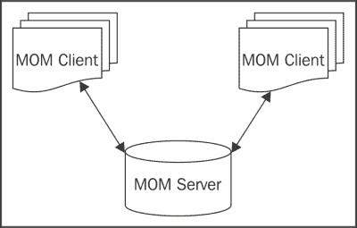

# 第六章. 与外部系统通信

在本章中，我们将添加在应用程序中与不同系统通信的可能性。从技术上讲，我们将解决系统集成问题。系统集成问题包括几种情况：两个同步或异步交换数据的程序，一个访问由另一个程序提供的信息的应用程序，一个执行在另一个程序中实现的过程的应用程序，等等。鉴于今天存在的解决方案数量，了解根据问题选择哪种解决方案是必要的，因此本章的重要性。在本章结束时，你将能够选择一个集成解决方案，并对以下 API 所做的更改有一个概述：

+   JavaMail

+   Java EE 连接器架构

+   Java 消息服务

+   JAX-RS：Java API for RESTful Web Services

# JavaMail

JavaMail 1.5 规范是在 JSR 919 下开发的。本节仅为您概述 API 的改进。完整的文档规范（更多信息）可以从[`jcp.org/aboutJava/communityprocess/mrel/jsr919/index2.html`](http://jcp.org/aboutJava/communityprocess/mrel/jsr919/index2.html)下载。

## 在 Java 中发送电子邮件

互联网的扩展极大地促进了通过电子邮件（电子邮件）在全球范围内的通信。今天，地球上两端的人们可以在非常短的时间内交换信息。为了实现这一点，必须有用于存储交换数据的邮件服务器和客户端（例如，Outlook）用于发送和检索数据。这些元素之间的通信需要不同类型的协议，例如，**SMTP**（**简单邮件传输协议**）用于发送邮件，**POP** **3**（**邮局协议**）用于接收邮件，**IMAP**（**互联网消息访问协议**）用于接收电子邮件。这种协议的多样性可能会给开发者带来问题。

由于协议众多和底层编程的困难，Java 语言提供了**JavaMail** API，以便简化发送和检索电子邮件，无论底层协议如何。但 JavaMail API 并不足够；因为它被设计来处理消息的传输方面（连接参数、源、目标、主题等），消息体由**JavaBeans Activation Framework**（**JAF 框架**）管理。这就是为什么，除了`mail.jar`库之外，你还需要导入`activation.jar`库。

### 通过 SMTP 协议发送电子邮件

使用 JavaMail 发送电子邮件的方法如下：

1.  获取`session`对象。此对象封装了各种信息，例如邮件服务器的地址。以下代码展示了如何获取类型为`Session`的对象：

    ```java
    Properties prop = System.getProperties();
    //serveurAddress is the host of you mail server
    prop.put("mail.smtp.host", serveurAddress);
    Session session = Session.getDefaultInstance(prop,null);
    ```

1.  构建消息。要发送电子邮件，必须定义一些参数，例如电子邮件的内容、发件人和目的地。除了这些设置外，您可能还需要指定电子邮件的主题和其标题。所有这些都可以通过提供构建给定会话消息的几个方法的`MimeMessage`类来实现。以下代码展示了如何获取`MimeMessage`类型的对象并构建要发送的邮件：

    ```java
    Message msg = new MimeMessage(session);
    msg.setFrom(new InternetAddress("xxx-university@yahoo.fr"));
    InternetAddress[] internetAddresses = new InternetAddress[1];
    internetAddresses[0] = new InternetAddress("malindaped@yahoo.fr");
    msg.setRecipients(Message.RecipientType.TO,internetAddresses);
    msg.setSubject("Pre-inscription results");
    msg.setText("Dear Malinda, we inform you that …");
    ```

1.  发送消息。我们使用`Transport`类在一行中发送消息。以下代码展示了如何发送消息：

    ```java
    Transport.send(msg);
    ```

以下代码展示了如何从 Gmail 账户发送个别候选人的预注册结果。如您所见，Gmail 发件人账户及其密码作为参数传递给`send`方法。这使得应用程序在发送消息时可以通过服务器进行认证。要测试与本章相关的发送代码，您需要有一个 Gmail 账户，并将`username`替换为您的账户用户名，将`user_password`替换为该账户的密码。

以下代码是使用 JavaMail API 通过 Gmail SMTP 服务器发送电子邮件的示例：

```java
public class MailSender {

  private final String userName = "username@gmail.com";
  private final String userPassword = "user_password";    
  private Session session;

  public MailSender() {
    Properties props = new Properties();
    props.put("mail.smtp.auth", "true");
    props.put("mail.smtp.starttls.enable", "true");
    props.put("mail.smtp.host", "smtp.gmail.com");
    props.put("mail.smtp.port", "587");

    session = Session.getInstance(props, null);
  }

  public void sendMesage(String message, String toAddress) {
    try {

      Message msg = new MimeMessage(session);
      InternetAddress[] internetAddresses =new InternetAddress[1];
      internetAddresses[0] = new InternetAddress(toAddress);
      msg.setRecipients(Message.RecipientType.TO, internetAddresses);
      msg.setSubject("Pre-inscription results");
      msg.setText(message);

      Transport.send(msg, userName, userPassword);
    } catch (Exception ex) {
      ex.printStackTrace();
    }

  }
}
```

当然，JavaMail API 提供了检索消息、将文档附加到您的消息、以 HTML 格式编写消息以及执行许多其他操作的能力。

## 最新改进在行动中

尽管受到维护版本的影响，JavaMail 1.5 规范已经经历了许多变化。其中最重要的可以分为三类，即：添加注解、添加方法和更改某些访问修饰符。

### 添加的注解

总的来说，JavaMail 1.5 引入了两个新的注解（`@MailSessionDefinition`和`@MailSessionDefinitions`），用于在 Java EE 7 应用程序服务器中配置 JavaMail 会话资源。

`@MailSessionDefinition`注解包含几个参数（见以下代码中的`Java`类），目的是提供定义一个将被注册在任何有效的 Java EE 命名空间中并通过**JNDI**被其他组件访问的邮件会话的可能性。

以下代码突出了`@MailSessionDefinition`注解的属性：

```java
public @interface MailSessionDefinition {

  String description() default "";

  String name();

  String storeProtocol() default "";

  String transportProtocol() default "";

  String host() default "";
  String user() default "";

  String password() default "";

  String from() default "";

  String[] properties() default {};
}
```

通过这个注解，我们现在可以定义和使用`Session`类型的对象，就像以下代码示例所展示的那样，它展示了如何使用`@MailSessionDefinition`：

```java
@MailSessionDefinition(
  name = "java:app/env/MyMailSession",
  transportProtocol = "SMTP",
  user = "username@gmail.com",
  password = "user_password"        
  //...
)
@WebServlet(name = "MailSenderServlet")
public class MailSenderServlet extends HttpServlet {

  @Resource(lookup="java:app/env/MyMailSession")
  Session session;

  public void doPost(HttpServletRequest request, HttpServletResponse response)
  throws IOException, ServletException {

    //...
  }
}
```

虽然`@MailSessionDefinition`注解允许我们定义`MailSession`，但`@MailSessionDefinitions`注解允许我们配置多个`MailSession`实例。以下代码展示了如何一次使用`@MailSessionDefinitions`实例定义两个`MailSession`：

```java
@MailSessionDefinitions(
        { @MailSessionDefinition(name = "java:/en/..."),
        @MailSessionDefinition(name = "java:/en/...") }
)
```

### 添加的方法

为了减轻开发者的工作负担，JavaMail 1.5 添加了提供真正有趣快捷方式的新方法。例如，`Transport.send(msg, username, password)` 方法的添加，在发送消息时避免了为认证参数创建额外的对象。在此之前，认证参数是在 `session` 对象中定义的，如下面的代码所示：

```java
Session session = Session.getInstance(props,new javax.mail.Authenticator() {
  protected PasswordAuthentication getPasswordAuthentication() {
    return new PasswordAuthentication(username, password);
    }
});
```

作为添加方法的一个另一个例子，您有 `Message.getSession()` 方法，它允许您访问用于创建消息的 `session` 类型的对象。这可能会防止您在处理过程中拖动会话。我们将讨论的最后一个添加的方法是 `MimeMessage.reply(replyToAll, setAnswered)` 方法，由于第二个参数，当您响应，例如，一条消息时，它允许您自动将 `Re` 前缀添加到主题行。

### 一些访问修饰符的变化

关于访问修饰符，JavaMail 1.5 规范在一些类中强调了良好的实践，并促进了其他类的扩展。

您将看到，例如，`javax.mail.search` 包中最终类的保护字段的访问修饰符已更改为私有。实际上，最终类包含具有公共 `getter`/`setter` 方法的保护字段并不重要。因此，最好将它们设为私有，并让 `getter`/`setter` 保持为公共，这样我们就可以从外部访问/编辑它们的值。

尽管如此，在访问修饰符的变化中，JavaMail 1.5 已经将 `cachedContent` 字段（属于 `MimeBodyPart` 和 `MimeMessage` 类）以及 `MimeMultipart` 类的字段从私有改为保护，以便于扩展相关类。

# Java EE 连接器架构 (JCA)

Java EE 连接器架构 1.7 规范是在 JSR 322 下开发的。本节仅为您概述了 API 的改进。完整的文档规范（更多信息）可以从 [`jcp.org/aboutJava/communityprocess/final/jsr322/index.html`](http://jcp.org/aboutJava/communityprocess/final/jsr322/index.html) 下载。

## 什么是 JCA？

通常，大型公司的**企业信息系统**（**EIS**s）由一系列工具组成，例如**企业资源计划**应用（**ERP**，即 **SAP**）、**客户关系管理**应用（**CRM**，即 [salesforce.com](http://salesforce.com)）、主机事务处理应用、遗留应用和数据库系统（如 Oracle）。在这样的环境中，开发新的解决方案可能需要访问这些工具之一或多个以检索信息或执行处理：我们这时所说的就是**企业应用集成**（**EAI**）。在没有标准解决方案的情况下，这种集成对供应商和开发者来说都将非常昂贵。供应商将开发 API 来管理不同类型服务器之间的通信，开发者将针对 EISs 逐个处理，并实现应用程序所需的技术特性（连接轮询、事务安全机制等）。因此，JCA 的需求就产生了。

Java EE 连接器架构（JCA）是一个旨在从 Java EE 平台标准化访问异构现有企业信息系统（EISs）的规范。为此，它定义了一系列合约，使开发者能够通过一个称为**通用客户端接口**（**CCI**）的通用接口无缝访问不同的 EISs。对于那些已经使用过 **JDBC** 的人来说，理解 JCA 的功能要容易一些。JCA 连接器由两个主要元素组成：

+   **通用客户端接口**（**CCI**）：这个 API 对于 EISs 来说就像 JDBC 对于数据库一样。换句话说，CCI 定义了一个标准的客户端 API，允许组件访问 EISs 并执行处理。

+   **资源适配器**：这是针对特定 EIS 的 CCI 的特定实现。它由供应商提供，并保证通过 JCA 执行其 EIS 的功能。资源适配器被打包在一个名为 `Resource Adapter Module` 的 `.rar` 归档中，并且它必须遵守一些合约（系统级合约），以便集成到 Java EE 平台并利用连接、事务和安全管理等服务。

话虽如此，当您想访问提供资源适配器的 EIS 时，可以考虑使用 JCA。

## JCA 应用实例

由于未能提供一个具体的示例来展示如何使用连接器访问由 SAP 管理的员工列表（这将非常长），以便您理解其基本功能），以下代码仅展示了 JCA API 的概述。这包括连接的一般原则、数据操作的可能性和断开连接。

对于希望进一步学习的人来说，GlassFish 提供了一个完整的示例，演示了如何实现一个连接器以访问邮件服务器，并且可在[`www.ibm.com/developerworks/java/tutorials/j-jca/index.html`](http://www.ibm.com/developerworks/java/tutorials/j-jca/index.html)找到的教程提供了额外的信息。

以下代码是资源适配器交互的概述：

```java
try {
  javax.naming.Context ic = new InitialContext();
  javax.resource.cci.ConnectionFactory cf =
  (ConnectionFactory)
  ic.lookup("java:comp/env/eis/ConnectionFactory");
  //Connection
  javax.resource.cci.Connection ctx = cf.getConnection();

  System.out.println("Information about the result set functionality " + "supported by the connected EIS : " +ctx.getResultSetInfo());

  System.out.println("Metadata about the connection : " + ctx.getMetaData());

  //Get object for accessing EIS functions
  javax.resource.cci.Interaction interaction =ctx.createInteraction();

  //Get record factory
  javax.resource.cci.RecordFactory rfact = cf.getRecordFactory();

  javax.resource.cci.IndexedRecord input =rfact.createIndexedRecord("<recordName>");
  javax.resource.cci.IndexedRecord output =rfact.createIndexedRecord("<recordName>");
  //Look up a preconfigured InteractionSpec
  javax.resource.cci.InteractionSpec interSp = ... ;
  interaction.execute(interSp, input, output);
  int index_of_element = ...;//index of element to return
  System.out.println("The result : "+output.get(index_of_element));
  //close
  interaction.close();
  ctx.close();
} catch (Exception ex) {
  ex.printStackTrace();
}
```

## 最新改进

说到新特性，Java EE 连接器架构 1.7 略有改进。实际上，在这个规范中，更多的是澄清和要求声明。话虽如此，JCA 1.7 引入了以下更改：

+   当调用`endpointActivation`和`endpointDeactivation`方法时，它强调端点组件环境命名空间对资源适配器的可用性

+   它添加了`ConnectionFactoryDefinition`和`AdministeredObjectDefinition`注解，用于定义和配置资源适配器的资源

+   它阐明了当使用 CDI（上下文与依赖注入）管理的 JavaBean 时，依赖注入的行为

# Java 消息服务（JMS）

Java 消息服务 2.0 规范是在 JSR 343 下开发的。本节仅提供 API 改进的概述。完整的文档规范（更多信息）可以从[`jcp.org/aboutJava/communityprocess/final/jsr343/index.html`](http://jcp.org/aboutJava/communityprocess/final/jsr343/index.html)下载。

## 何时使用 JMS

JMS 是用于与**消息导向中间件**（**MOM**）交互的 Java API。这种中间件源于解决观察到的同步连接限制的需求。这是因为同步连接容易受到网络故障的影响，并且要求连接的系统同时可用。因此，MOMs 提供了一个基于消息交换的集成系统，这些消息可以根据集成系统的可用性同步或异步处理。

以下图像展示了一种通过 MOM（消息导向中间件）进行系统通信的架构：



基于上述内容，我们得出结论，JMS 可以在以下情况下使用：

+   通过不稳定网络处理大量事务数据（例如，数据库同步）

+   通信系统之间不是总是同时可用的

+   向多个系统发送数据

+   异步处理

以此点结束，你应该注意到，基于 JMS（Java 消息服务）的集成系统的建立要求所有需要集成的组件都在你的控制之下。因此，JMS 更适合用于公司内部解决方案的集成。

## 最新改进的实际应用

2002 年 3 月发布的 JMS 1.1 规范与其他经过平台演变而简化的 Java EE 平台 API 相比，显得有些过时和笨重。基于这一观察，你会理解为什么 JMS 2.0 API 的一个主要目标就是更新 API，使其尽可能简单，并能轻松与其他平台 API 集成。为此，审查了几个领域；这些包括减少**样板**代码、移除冗余项、添加新功能和集成 Java 语言的新特性。

### 新特性

在 JMS 2.0 规范中，强调了三个新特性：异步发送消息、投递延迟和修改 `JMSXDeliveryCount` 消息属性。

#### 异步发送消息

在同步处理中，如果方法 A 调用方法 B，方法 A 将保持阻塞状态，直到方法 B 完成。这可能导致时间的浪费。为了克服这个问题，JMS 2.0 提供了一套方法，可以在不失去操作进度的情况下异步发送消息。以下代码演示了如何异步发送消息。`setAsync()` 方法接受一个监听器作为参数，允许你在过程结束时或当抛出异常时得到通知。如果监听器不为空，消息将异步发送（过程将由与调用者线程不同的另一个线程执行）。否则，消息将同步发送。

```java
public void sendMessageAsynchronously(ConnectionFactory cfactory,Queue destination){
  try(JMSContext context = cfactory.createContext();){
    context.createProducer().setAsync(new Completion()).send(destination, "Hello world");
  }
}

class Completion implements CompletionListener{

  public void onCompletion(Message message) {     
    System.out.println("message sent successfully");
  }

  public void onException(Message message, Exception ex) {   
    System.out.println(ex.getMessage());
  }
}
```

#### 投递延迟

除了可以异步发送消息之外，JMS 现在还允许我们延迟已发送到**代理**（即 MOM 服务器）的消息的投递时间。发送后，消息将被存储在代理上，但直到发送者设定的时间，它对接收者来说是未知的。以下代码中的消息将在发送后至少一小时后发送给接收者。

```java
public void sendMessageWithDelay(ConnectionFactory cfactory,Queue destination){
  try(JMSContext context = cfactory.createContext();){
    context.createProducer().setDeliveryDelay(1000*60*60).send(destination, "Hello world");
  }
}
```

#### 处理 JMSXDeliveryCount 消息属性

自 1.1 版本以来，JMS 规范定义了一个可选的 `JMSXDeliveryCount` 消息属性，可用于确定被投递多次的消息，并在投递次数超过最大值时执行操作。但是，由于对这个属性的管理是可选的，所有提供者都没有义务增加它，这导致使用它的应用程序不可移植。JMS 2.0 规范将此作为标准引入，以便我们可以以可移植的方式自定义**毒消息**的管理。毒消息是指一个 JMS 消息，它已经超过了给定接收者的最大投递次数。以下代码展示了如何检索 `JMSXDeliveryCount` 消息属性并指定当一条消息被投递超过五次时采取的操作：

```java
public class JmsMessageListener implements MessageListener {

  @Override
  public void onMessage(Message message) {
    try {
      int jmsxDeliveryCount =message.getIntProperty("JMSXDeliveryCount");
      //...
      if(jmsxDeliveryCount > 5){
        // do something
      }
    } catch (JMSException ex) {
      ex.printStackTrace();
    }
  }
}
```

#### API 简化

JMS 2.0 规范引入了三个新的接口（`JMSContext`、`JMSProducer`和`JMSConsumer`），这些接口有助于消除样板代码并简化 API。重要的是要注意，这些接口（构成了简化 API）与旧接口共存，以提供替代方案。因此，`JMSContext`取代了`Connection`和`Session`对象，`JMSProducer`取代了`MessageProducer`对象，`JMSConsumer`取代了旧版本中的`MessageConsumer`对象。正如您在以下代码中所见，两种方法之间的差异非常明显。在基于 JMS API 1.1 的发送方法（`sendMessageJMSWithOldAPI`）中，我们注意到：过多的对象创建、强制抛出异常以及需要显式关闭连接。

相反，在基于 JMS API 2.0 的发送方法（`sendMessageJMSWithNewdAPI`）中，我们有：try-with-resources 语句，它使开发者免于显式关闭连接，以及将发送代码简化到仅包含一个`JMSContext`对象的基本要素。

```java
//Sending message with JMS 1.1
public void sendMessageJMSWithOldAPI(ConnectionFactory connectionFactory, Queue destination) throws JMSException {
 Connection connection = connectionFactory.createConnection();
 try {
     Session session = connection.createSession(false, Session.AUTO_ACKNOWLEDGE);
     MessageProducer messageProducer = session.createProducer(destination);
     TextMessage textMessage = session.createTextMessage("Message send with the old API");
     messageProducer.send(textMessage);
  } finally {
    connection.close();
  }
}

//Sending message with JMS 2.0
public void sendMessageJMSWithNewdAPI(ConnectionFactory connectionFactory, Queue destination) {
     try (JMSContext context = connectionFactory.createContext();) {
        context.createProducer().send(destination, "Message send with the new API");
   }
}
```

# Java API for RESTful Web Services

Java API for RESTful Web Services 2.0 规范是在 JSR 339 下开发的。本节仅为您概述 API 的改进。完整的文档规范（更多信息）可以从[`jcp.org/aboutJava/communityprocess/final/jsr339/index.html`](http://jcp.org/aboutJava/communityprocess/final/jsr339/index.html)下载。

## 何时使用 Web 服务

Web 服务是一种基于开放标准（如 HTTP、XML 和 URI）的软件系统，旨在允许网络中应用程序之间的交换。通过使用这些开放标准，它具备了成为集成异构系统最合适解决方案所需的一切。然而，正如我们在讨论 JMS 时所看到的，选择集成解决方案应在一系列问题之后进行：网络连接是否良好？进程是否是事务性的？要处理的数据量是否巨大？处理必须是同步的吗？等等。

如果经过调查，您的选择是 Web 服务，那么您现在必须选择要实现的 Web 服务类型：基于 SOAP（**简单对象访问协议**）和 XML 的**SOAP** Web 服务，或者专注于资源共享并因此其功能基于 Web 的 RESTful Web 服务。在这本书中，我们只讨论 RESTful Web 服务。

## JAX-RS 实践

RESTful Web 服务是 Web 服务的一种变体，其中任何可以寻址的概念（功能或数据）都被视为资源，因此可以通过**统一资源标识符**（**URI**s）访问。一旦定位到资源，其表示或状态将以 XML 或 JSON 文档的形式传输。在我们的在线预注册应用程序中，资源可能是选定的学生列表，表示将以 JSON 文档的形式出现。

JAX-RS 是实现 RESTful Web 服务的 Java API。以下代码演示了如何编写一个返回所有被选学生列表的 REST 服务：

```java
@Path("students")
@Stateless
@Produces({MediaType.APPLICATION_JSON})
public class StudentInformation {

  @PersistenceContext(unitName = "integrationPU")
  private EntityManager em;

  @GET
  @Path("getListOfStudents")
  public List<Student> getListOfStudents(){
    TypedQuery<Student> query = em.createQuery("SELECT s FROM Student s", Student.class);
    return query.getResultList();
  }
} }
```

## 最新改进措施

JAX-RS 2.0 不仅简化了 RESTful Web 服务的实现，还在 API 中引入了新功能，其中包括客户端 API、异步处理、过滤器以及拦截器。

### 客户端 API

自从 1.0 版本以来，JAX-RS 规范没有定义客户端 API 来与 RESTful 服务交互。因此，每个实现都提供了一个专有的 API，这限制了应用程序的可移植性。JAX-RS 2.0 通过提供一个标准的客户端 API 来填补这一空白。

以下代码演示了客户端的实现，该客户端将通过前面代码中公开的 REST 服务访问选定的学生列表：

```java
String baseURI ="http://localhost:8080/chapter06EISintegration-web";
Client client = ClientBuilder.newClient();
WebTarget target = client.target(baseURI+"/rs-resources/students/getListOfStudents");      
GenericType<List<Student>> list = new GenericType<List<Student>>() {};
List<Student> students =target.request(MediaType.APPLICATION_JSON).get(list);
```

### 异步处理

除了客户端 API 的标准化外，JAX-RS 2.0 还集成了 Java EE 平台许多 API 中已经存在的功能，即异步处理。现在，JAX-RS 客户端可以异步发送请求或处理响应。

以下代码演示了 JAX-RS 客户端如何异步执行 GET 请求并被动等待响应。如代码所示，JAX-RS 请求的异步执行需要调用`async()`方法。此方法返回一个类型为`AsyncInvoker`的对象，其 get、post、delete 和 put 方法允许我们获得用于进一步处理响应的对象类型`Future`。

以下代码是 JAX-RS 客户端中异步过程执行的一个示例：

```java
public class AppAsynchronousRestfulClient {

  public static void main(String[] args) {    
  String baseURI ="http://localhost:8080/chapter06EISintegration-web";
  String location = "/rs-resources";
  String method = "/students/getListOfAllStudentsAs";
  Client client = ClientBuilder.newClient();
  WebTarget target =
    (WebTarget) client.target(baseURI+location+method);
  System.out.println("Before response : "+new Date());
  Future<String> response = target.request(MediaType.APPLICATION_JSON).async().get(String.class);            

  new PassiveWaiting(response).start();   

  System.out.println("After PassiveWaiting : "+new Date());
  }

  static class PassiveWaiting extends Thread {
    Future<String> response;

    public PassiveWaiting(Future<String> response){
      this.response = response;
    }

    public void run(){
      try{
        System.out.println("response :"+response.get()+", time : "+new Date());
      }catch(Exception ex){
        ex.printStackTrace();
      }
    }
  }
}
```

为了确保处理是异步执行的，我们在`getListOfAllStudentsAs`方法中定义了一个 20 秒的暂停，在执行 JPQL 查询之前。以下代码，这是一个慢速处理的模拟，显示了客户端执行的方法的内容：

```java
@GET
@Path("getListOfAllStudentsAs")
public List<Student> getListOfAllStudentsAs() {
  try{
    Thread.sleep(20*1000);//20 seconds
  }catch(Exception ex){}
  TypedQuery<Student> query = em.createQuery("SELECT s FROM Student s", Student.class);
  return query.getResultList();
}
```

类似地，JAX-RS 服务器能够异步运行进程。包含执行异步任务指令的方法必须将带有 `@Suspended` 注解的 `AsyncResponse` 对象作为方法参数注入。然而，你应该知道服务器异步模式与客户端异步模式不同；前者在处理请求期间挂起发送请求的客户端连接，稍后通过 `AsyncResponse` 对象的 `resume()` 方法恢复连接。该方法本身不会异步运行。要使其异步，你必须将进程委托给一个线程（这就是我们在以下示例的 `getListOfAllStudentsAs2` 方法中所做的），或者用 `@Asynchronous` 注解装饰它。以下代码演示了如何在服务器端执行异步处理。

以下代码是 JAX-RS 服务器中异步执行过程的示例：

```java
@Path("students")
@Stateless
@Produces({MediaType.APPLICATION_JSON, MediaType.APPLICATION_XML})
public class StudentInformation {

  @PersistenceContext(unitName = "integrationPU")
  private EntityManager em;

  @Resource(lookup ="java:comp/DefaultManagedScheduledExecutorService")
  ManagedExecutorService taskExecutor;

  @GET
  @Path("getListOfAllStudentsAs2")
  public void getListOfAllStudentsAs2(final @Suspended AsyncResponse response) {
      System.out.println("before time : "+new Date());
      taskExecutor.submit(
      new Runnable() {
        public void run() {
          String queryString = "SELECT s FROM Student sWHERE 1 = 1";
          TypedQuery<Student> query = em.createQuery(queryString, Student.class);

          List<Student> studentList = query.getResultList();
          try {
            Thread.sleep(10 * 1000);//1 second
          } catch (Exception ex) {
          }
          response.resume(studentList);
        }
      });
    System.out.println("After time : "+new Date());
  }
}
```

### 过滤器和实体拦截器

JAX-RS 2.0 规范的另一个重要内容是引入了两种拦截机制：过滤器和拦截器。这些新特性为规范带来了一种标准化的拦截处理方式，以便无缝管理 JAX-RS 服务器与将访问服务器资源的不同客户端之间的安全、压缩、编码、日志记录、编辑和审计交换。

尽管这两个概念非常相似（因为它们都与拦截有关），但我们必须说过滤器通常用于处理请求或响应的头部。而拦截器通常被设置来操作消息的内容。

#### 过滤器

JAX-RS 2.0 规范定义了四种类型的过滤器：每一边（客户端和服务器）各有两种类型的过滤器。在客户端，一个必须在发送 HTTP 请求之前运行的过滤器实现了 `ClientRequestFilter` 接口，另一个必须在收到来自服务器的响应后立即运行（但在将控制权渲染到应用程序之前），实现了 `ClientResponseFilter` 接口。在服务器端，将在访问 JAX-RS 资源之前执行的过滤器实现了 `ContainerRequestFilter` 接口，而将在向客户端发送响应之前运行的过滤器实现了 `ContainerResponseFilter` 接口。以下代码展示了 `ContainerRequestFilter` 实现的示例，该实现验证了确保外部用户能够安全访问我们在线预注册应用程序中可用资源的详细信息。以下代码中 `MyJaxRsRequestFilter` 类顶部的 `@Provider` 注解允许过滤器被容器自动发现并应用于服务器上的所有资源。如果不使用此注解，你必须手动注册过滤器。

以下代码是`ContainerRequestFilter`实现的示例：

```java
@Provider
public class MyJaxRsRequestFilter implements ContainerRequestFilter {

  @Override
  public void filter(ContainerRequestContext crq) {
    //        If the user has not been authenticated
    if(crq.getSecurityContext().getUserPrincipal() == null)
      throw new WebApplicationException(Status.UNAUTHORIZED);

      List<MediaType> supportedMedia =crq.getAcceptableMediaTypes();
    if("GET".equals(crq.getMethod()) &&!supportedMedia.contains(MediaType.APPLICATION_JSON_TYPE))
      throw new WebApplicationException(Status.UNSUPPORTED_MEDIA_TYPE);

      //      external users must only access student methods
      String path = crq.getUriInfo().getPath();
    if(!path.startsWith("/students"))
      throw new WebApplicationException(Status.FORBIDDEN);

      List<String> encoding = crq.getHeaders().get("accept-encoding");  
      //   If the client does not support the gzip compression
    if(!encoding.toString().contains("gzip"))
      throw new WebApplicationException(Status.EXPECTATION_FAILED);            
  }
}
```

#### 实体拦截器

除了在过滤器与实体拦截器之间的差异之外，JAX-RS 提供了两种类型的实体拦截器而不是四种。有一个读取拦截器，它实现了`ReaderInterceptor`接口，还有一个写入拦截器，它实现了`WriterInterceptor`接口。由于它们需要处理的元素（消息体），拦截器可以用来压缩大量内容以优化网络利用率；它们也可以用于一些处理，例如生成和验证数字签名。

考虑到我们的在线预注册应用程序的数据库将包含数千名学生，以下代码演示了我们可以如何利用拦截器在数据交换中与教育部进行通信，以避免在传输学生信息时网络过载。

以下代码展示了服务器端`WriterInterceptor`的实现，该实现将压缩数据发送到 JAX-RS 客户端。`@ZipResult`注解允许我们将拦截器仅绑定到一些 JAX-RS 资源。如果我们移除此注解，我们应用程序的所有 JAX-RS 资源将自动被压缩。

以下代码是`WriterInterceptor`实现的示例：

```java
@ZipResult
@Provider
public class MyGzipWriterJaxRsInterceptor implements WriterInterceptor{  

    @Override
    public void aroundWriteTo(WriterInterceptorContext wic) throws IOException {        
        try (GZIPOutputStream gzipStream = new GZIPOutputStream(wic.getOutputStream());) {
            wic.setOutputStream(gzipStream);   
            wic.proceed();
        }        
    }
}
```

要将`MyGzipWriterJaxRsInterceptor`拦截器绑定到资源，我们只需用`@ZipResult`注解装饰给定的资源。以下代码演示了如何将`MyGzipWriterJaxRsInterceptor`拦截器绑定到资源，以便其表示在发送到客户端之前始终被压缩。

以下代码是拦截器绑定的示例：

```java
@GET
@ZipResult
@Path("getListOfAllStudentsGzip")
public List<Student> getListOfAllStudentsGzip() {        
  TypedQuery<Student> query = em.createQuery("SELECT s FROM Student s", Student.class);       
  return query.getResultList();
}
```

以下代码是`@ZipResult`注解声明的示例：

```java
@NameBinding
@Target({ ElementType.TYPE, ElementType.METHOD })
@Retention(value = RetentionPolicy.RUNTIME)
public @interface ZipResult {}
```

以下代码展示了客户端上`ReaderInterceptor`接口的实现，该实现将使用`MyGzipWriterJaxRsInterceptor`类解压缩服务器压缩的数据：

```java
public class MyGzipReaderJaxRsInterceptor implements ReaderInterceptor {
    @Override
    public Object aroundReadFrom(ReaderInterceptorContext context) throws IOException {           
        try (InputStream inputStream = context.getInputStream();) {
            context.setInputStream(new GZIPInputStream(inputStream));
            return context.proceed();            
        }       
    }    
}
```

要将拦截器绑定到特定的客户端，我们将使用`Client`对象的`register`方法。以下代码演示了如何将拦截器或过滤器关联到 JAX-RS 客户端：

```java
public static void main(String[] args) throws IOException {
  String baseURI = "http://localhost:8080/chapter06EISintegration-web";
  String location = "/rs-resources";
  String method = "/students/getListOfAllStudentsGzip";
  //client creation and registration of the interceptor/filter
  Client client = ClientBuilder.newClient().register(MyGzipReaderJaxRsInterceptor.class);
  WebTarget target = (WebTarget)client.target(baseURI + location + method);
  System.out.println("response : " + target.request(MediaType.APPLICATION_JSON).get(String.class));        
}
```

# 概述

在分析上一章中展示的在线预注册应用程序的过程中，我们意识到我们的系统应该与其他系统进行通信。本章为我们提供了识别和实现与不同类型的异构系统交换数据最佳方式的知识。在下一章中，我们将回顾一些我们自然使用过的概念，以便您能更好地理解它们。
