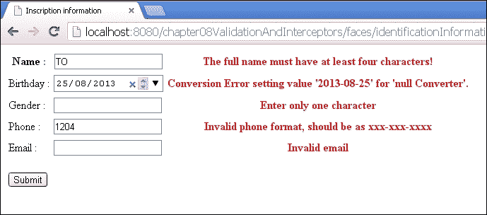
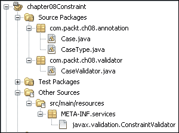
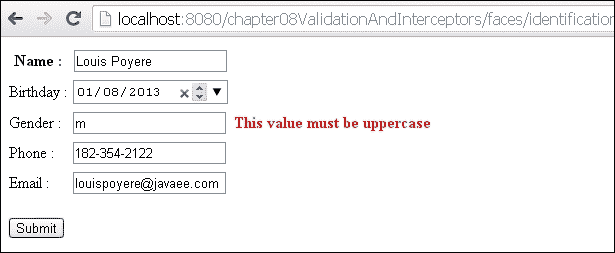

# 第八章. 验证器和拦截器

在本章中，我们将看到使用约束进行数据验证。这将给我们机会将一小部分**AOP**（**面向方面编程**）付诸实践，并发现验证和拦截 API 中的新特性。相关的规范包括：

+   Bean Validation 1.1

+   Interceptors 1.2

# Bean Validation

Bean Validation 1.1 规范是在 JSR 349 下开发的。本节仅为您概述 API 的改进。完整的规范文档（更多信息）可以从[`jcp.org/aboutJava/communityprocess/final/jsr349/index.html`](http://jcp.org/aboutJava/communityprocess/final/jsr349/index.html)下载。

我们几乎完成了我们的在线预注册应用程序的实现。在前几章中，我们开发了应用程序的不同层，现在我们需要验证将由该应用程序处理的数据。

## 验证您的数据

Java 语言为 Java SE 和 Java EE 开发者提供了 Bean Validation 规范，该规范允许我们表达对对象的约束。默认情况下，它提供了一小部分约束（与您可能的需求相比），称为内置约束（见下表）。但是，它为您提供了将这些约束组合起来的机会，以创建更复杂的约束（自定义约束），以满足您的需求。这正是其强大的原因。该规范可以与许多其他规范（如 CDI、JSF、JPA 和 JAX-RS）一起使用。

以下表格显示了 Bean Validation 1.1 中的内置约束列表：

| 约束 | 支持的类型 | 描述 |
| --- | --- | --- |
| `@Null` | `Object` | 这确保了对象值为 null |
| `@NotNull` | `Object` | 这确保了对象值不为 null |
| `@AssertTrue` | `boolean`, Boolean | 这确保了对象值为 true |
| `@AssertFalse` | `boolean`, Boolean | 这确保了对象值为 false |
| `@Min` | `BigDecimal`, `BigInteger` `byte`, `short`, `int`, `long`以及相应的包装器（如`Byte`和`Short`） | 这确保了对象值大于或等于注解中指定的值 |
| `@Max` | `BigDecimal`, `BigInteger` `byte`, `short`, `int`, `long`以及相应的包装器（如`Byte`和`Short`） | 这确保了对象值小于或等于注解中指定的值 |
| `@DecimalMin` | `BigDecimal`, `BigInteger`, `CharSequence` `byte`, `short`, `int`, `long`以及相应的包装器（如`Byte`和`Short`） | 这确保了对象值大于或等于注解中指定的值 |
| `@DecimalMax` | `BigDecimal`, `BigInteger`, `CharSequence`, `byte`, `short`, `int`, `long` 以及相应的包装器（如 `Byte` 和 `Short`） | 这确保了对象的值小于或等于注解中指定的值 |
| `@Size` | `CharSequence`, `Collection`, `Array`, 和 `Map` | 这确保了对象的尺寸在定义的范围内 |
| `@Digits` | `BigDecimal`, `BigInteger`, `CharSequence`, `byte`, `short`, `int`, `long` 以及相应的包装器（如 `asByte` 和 `Short`） | 这确保了对象的值在定义的范围内 |
| `@Past` | `java.util.Date` 和 `java.util.Calendar` | 这确保了对象中包含的日期早于处理日期 |
| `@Future` | `java.util.Date` 和 `java.util.Calendar` | 这确保了对象中包含的日期晚于处理日期 |
| `@Pattern` | `CharSequence` | 这确保了项目的值符合注解中定义的正则表达式 |

此规范的一个优点是能够通过注解定义它提供的不同约束，这有助于其使用。根据注解的特性（在第七章中详细解释，*注解和 CDI*），你可以为类、字段或属性表达约束。以下示例显示了一个带有内置约束的 `Student` 实体。你可以在以下代码中看到约束以避免空值或定义属性的尺寸和格式：

```java
@Entity
public class Student implements Serializable {
  @Id
  @NotNull
  @Size(min = 1, max = 15)
  private String id;
  @Size(max = 30)
  private String firstname;
  @Pattern(regexp="^\\(?(\\d{3})\\)?[- ]?(\\d{3})[- ]?(\\d{4})$", message="Invalid phone/fax format,should be as xxx-xxx-xxxx")
  //if the field contains phone or fax number consider using this//annotation to enforce field validation
  @Size(max = 10)
  private String phone;
  @Pattern(regexp="[a-z0-9!#$%&'*+/=?^_`{|}~-]+(?:\\.[a-z0-9!#$%&'*+/=?^_`{|}~-]+)*@(?:a-z0-9?\\.)+a-z0-9?",message="Invalid email")
  //if the field contains email address consider using this//annotation to enforce field validation
  @Size(max = 60)
  @Email
  private String email;

  //...
}
```

一旦定义了约束，Bean Validation 规范允许你通过其他规范手动或自动地验证受约束的数据。我们首先介绍手动验证。以下示例演示了如何手动验证类的约束。我们必须说，`Validator` API 还提供了方法来验证单个属性或特定值，如下面的代码所示：

```java
public static void main(String[] args) {
  Student student = new Student();
  student.setEmail("qsdfqsdfqsdfsqdfqsdfqsdf");
  student.setPhone("dfqsdfqsdfqsdfqsdfqsdfqsd");

  ValidatorFactory factory =Validation.buildDefaultValidatorFactory();
  Validator validator = factory.getValidator();

  Set<ConstraintViolation<Student>> violations =validator.validate(student);
  System.out.println("Number of violations : "+violations.size());
  for(ConstraintViolation<Student> cons : violations){
    System.out.println("Calss :"+cons.getRootBeanClass()+",Instance : "+cons.getLeafBean()+", "
     + " attribute : "+cons.getPropertyPath()+",message :"+cons.getMessage());
  }
}    
```

正如我们提到的，Bean Validation 规范可以与其他规范结合使用。在下面的示例中，我们展示了 Bean Validation 与 JSF 之间的耦合。我们借此机会强调自动验证。下面的示例演示了如何在我们的在线预注册网站上验证学生的输入：

```java
@ManagedBean
public class InscriptionBean {
  @Size(min=4, message="The full name must have "+ " at least four characters!")
  private String name;
  @Past
  private Date birthday;
  @NotNull
  @Size(min=1, max=1,message="Enter only one character")
  private String gender;
  @Pattern(regexp="^\\(?(\\d{3})\\)?[- ]?(\\d{3})[- ]?(\\d{4})$", 
  message="Invalid phone format, should be as xxx-xxx-xxxx")
  @Size(max = 10)
  private String phone;
  @Pattern(regexp="[a-z0-9!#$%&'*+/=?^_`{|}~-]+(?:\\.[a-z0-9!#$%&'*+/=?^_`{|}~-]+)"
  + "*@(?:a-z0-9?\\.)+a-z0-9?", 
  message="Invalid email")
  private String email;

  //...getter and setter
}
```

以下代码显示了一个网页内容的示例，允许候选人输入他们的个人身份信息。正如你所见，我们使用了在第三章中解释的通过属性，*表示层*，来使用 HTML5 的日历，并将 `<h:message/>` 标签放在具有相关字段 ID 的每个字段旁边，以便在违反约束的情况下显示错误信息。这使我们能够拥有以下截图所示的屏幕截图。

以下代码是`identificationInformationPage.xml` JSF 页面的内容示例：

```java
<html 

  >
  <h:head>
    <title>Inscription information</title>
  </h:head>
  <h:body>
    <f:view>
      <h:form>
        <table border="0">                    
          <tbody>
            <tr>
              <th>Name :</th>
              <th><h:inputText value="#{inscriptionBean.name}"id="name"/></th>
              <th><h:message for="name" style="color:red"/></th>
            </tr>
            <tr>
              <td>Birthday :</td>
              <td><h:inputText pta:type="date"value="#{inscriptionBean.birthday}"  id="birth">
              <f:convertDateTime pattern="yyyy-MM-dd" />
              </h:inputText></td>
              <th><h:message for="birth" style="color:red"/></th>
            </tr>
            <tr>
              <td>Gender :</td>
              <td><h:inputText value="#{inscriptionBean.gender}"id="gender"/></td>
              <th><h:message for="gender" style="color:red"/></th>
            </tr>
            <tr>
              <td>Phone :</td>
              <td><h:inputText value="#{inscriptionBean.phone}"id="phone"/></td>
              <th><h:message for="phone" style="color:red"/></th>
            </tr>
            <tr>
              <td>Email :</td>
              <td><h:inputText value="#{inscriptionBean.email}"id="email"/></td>
              <th><h:message for="email" style="color:red"/></th>
            </tr>                        
          </tbody>
        </table>
        <p>
          <h:commandButton value="Submit" />
        </p>
      </h:form>
    </f:view>
  </h:body>
</html>
```

如以下截图所示，在提交条目时，表单的内容将自动进行验证，并将错误信息返回到表单中。因此，这种关联（JSF 和 Bean 验证）允许您在单个 bean 上定义约束，并用于多个表单。

验证的结果如下截图所示：



## 构建自定义约束

在前面的例子中，我们想要有一个约束，可以确保`Gender`字段的值是大写的，但这个约束并不存在。为此，我们必须对正则表达式有一些了解，并使用`@Pattern`注解。这需要一些背景知识。幸运的是，我们有创建自定义约束的能力。我们将设置一个约束，允许我们执行这项任务。

创建新约束的过程基本上遵循创建简单注解的相同规则（如第七章 Annotations and CDI 中所述）。基本区别在于，在约束的情况下，我们不会实现处理器，而是实现验证器。也就是说，创建自定义约束包括以下步骤：创建约束注解和实现验证器。

## 创建约束注解

虽然目标是创建一个确保字符串字符首字母大写的约束，但我们将创建一个通用注解。这个注解将接受预期大小写的类型作为参数。因此，它可能在未来允许我们测试字符是大写还是小写。

我们将创建枚举`CaseType`，它包含不同的大小写类型，如下面的代码所示：

```java
public enum CaseType {
    NONE,
    UPPER,
    LOWER
}
```

一旦我们定义了可能的大小写类型，我们将创建我们的注解并直接定义其特征。应该注意的是，除了我们在创建注解时看到的基线功能外，您还需要添加定义此约束验证器的`@Constraint`注解。对于其他功能，请参阅第七章 Annotations and CDI。以下是我们注解的代码：

```java
@Target({ElementType.FIELD, ElementType.METHOD,ElementType.PARAMETER,ElementType.LOCAL_VARIABLE})
@Retention(RetentionPolicy.RUNTIME)
@Constraint(validatedBy = CaseValidator.class)
public @interface Case {
  String message() default "This value must be uppercase";    
  CaseType type() default CaseType.UPPER;
  Class<? extends Payload>[] payload() default {};
  Class<?>[] groups() default {}; 
}
```

## 实现验证器

与需要用于简单注释的处理器不同，约束需要实现`javax.validation.ConstraintValidator <A extends Annotation, T extends Object>`接口，该接口提供了以下两个方法：

+   `void initialize(A constraintAnnotation)`: 这个方法总是在处理约束之前被调用。它允许您初始化在`isValid()`方法执行期间将有用的参数。

+   `boolean isValid(T value, ConstraintValidatorContext context)`: 此方法包含验证逻辑。

以下代码显示了我们的约束验证器：

```java
public class CaseValidator implements ConstraintValidator<Case, String>{
  private CaseType type;

  public void initialize(Case annotation) {
    type = annotation.type();
  }

  public boolean isValid(String value,ConstraintValidatorContext context) {
  if(value == null)
    return true;        

    if (type == CaseType.UPPER) {
      return value.equals(value.toUpperCase());
    } else {
      return value.equals(value.toLowerCase());
    }
  }    
}
```

在创建您的验证器之后，您必须注册该服务（参见第七章，*注解和 CDI*）。然后，导入包含您的注解的包。以下截图显示了我们在其中定义注解的项目结构：



现在，我们只需要在`String`类型的属性上添加`@Case (type = CaseType.UPPER)`，以确保值始终为大写字母。以下代码显示了之前展示的`InscriptionBean` Bean 代码中的更改：

```java
@Case(type= CaseType.UPPER, message="This value must be uppercase")
private String gender;
```

结果简单而美丽，如下截图所示：



## 最新改进的实际应用

*Bean* *Validation 1.1 规范文档*的第二章介绍了本版本的重大变更。这些变更包括：开放性、支持依赖注入、更好地与 CDI 集成、支持方法和构造函数验证、支持分组转换，以及最终支持使用表达式语言进行消息插值。

### 开放性

Bean Validation 1.1 规范的实现被管理为一个开源项目。因此，API 的源代码、参考实现和测试兼容性套件对社区是可访问的。更多信息，请访问网站 [`beanvalidation.org`](http://beanvalidation.org)。

### 支持依赖注入和 CDI 集成

Bean Validation 1.1 规范已经标准化了在容器内部实现验证器所使用的对象的管理，并审查了提供给这些对象的所有服务。这有助于支持 Bean Validation 组件中的依赖注入并改善与 CDI 的集成。从现在起，我们可以使用`@Resource`和`@Inject`注解注入`ValidatorFactory`和`Validator`类型的对象。以下示例演示了如何使用`@Inject`注解通过 Bean Validation 组件验证一个对象：

```java
@Singleton
@Startup
public class InjectValidators {    
  private Logger logger =Logger.getLogger(InjectValidators.class.getName());

  @Inject
  private Validator validator;

  @PostConstruct
  public void init() {
    Student student = new Student();
    Set<ConstraintViolation<Student>> violations =validator.validate(student);
    logger.info("InjectValidators-Number of violations : " +violations.size());        
  }
}
```

### 支持方法和构造函数验证

Bean Validation 1.1 规范增加了在方法或构造函数的参数上定义约束的能力。它还允许定义方法返回值的约束。以下代码演示了如何声明和验证方法参数及其返回值的约束：

```java
@Singleton
@Startup
public class ParameterConstraints {
  private Logger logger =Logger.getLogger(InjectValidators.class.getName());
  @Inject
  ExecutableValidator validator;

  @PostConstruct
  public void init() {                
    try {
      ParameterConstraints pc = new ParameterConstraints();
      Method method = ParameterConstraints.class.getMethod("createStudent", Student.class);
      Object[] params = {null};
      Set<ConstraintViolation<ParameterConstraints>>violations = validator.validateParameters(pc, method, params);

      logger.info("ParameterConstraints-Number of violations : " + violations.size());
    } catch (Exception ex) {
      Logger.getLogger(ParameterConstraints.class.getName()).log(Level.SEVERE, null, ex);
    } 
  }

  @Size(max = 2)
  public String createStudent(@NotNull Student std) {
    return "123456";
  }
}
```

### 支持分组转换

在级联数据验证时，可能会出现要验证的数据属于与请求组不同的组的情况。具体示例，考虑以下两个类`Student`和`Address`：

```java
public class Student {
  @NotNull
  @Size(min = 1, max = 15)
  private String id;
  @Size(max = 30)
  private String firstname;
  @Size(max = 30)
  private String lastname;

  @Valid//To propagate the validation of a student object
  private Address address;

  //getter and setter
}

public class Address {
  @NotNull(groups=AddressCheck.class)    
  @Size(max = 10,groups=AddressCheck.class)
  private String phone;

  @NotNull(groups=AddressCheck.class)   
  @Email(groups=AddressCheck.class)
  private String email;    
  //getter and setter
}
public interface AddressCheck { }
```

为了逐步验证对象，Bean Validation 规范提出了组的概念。这让你能够定义一个可以单独验证的约束子集。默认情况下，验证约束属于 `Default` 组。如果在验证数据时没有指定验证组，则只检查 `Default` 组的约束。这解释了为什么 `testDefaultGroup()` 方法的代码将完全无误地运行。尽管 `Address` 类的电话和电子邮件属性不符合约束，但它们将不会被验证，仅仅是因为装饰它们的约束不是 `Default` 组的一部分。这可以从以下代码中看出：

```java
public  void testDefaultGroup(){
  ValidatorFactory factory =Validation.buildDefaultValidatorFactory();
  Validator validator = factory.getValidator();

  Student student = new Student(); 
  student.setId("ST23576");
  student.setFirstname("Stelba");
  student.setLastname("estelle");
  student.setAddress(new Address());

  //Only the default group will be test. 
  Set<ConstraintViolation<Student>> constraintViolations =validator.validate(student);       
  assertEquals(0, constraintViolations.size());                
} 
```

因此，为了在验证 `Student` 对象的同时验证 `Address` 对象的属性，你有两种选择。第一种是将所有组在 `validate()` 方法中列出，如下代码所示：

```java
Student student = new Student(); 
student.setId("ST23576");
student.setFirstname("Stelba");
student.setLastname("estelle");
student.setAddress(new Address());

Set<ConstraintViolation<Student>> constraintViolations =validator.validate(student, Default.class, AddressCheck.class); 
assertEquals(2, constraintViolations.size());  
```

第二种方法是使用 `@ConvertGroup` 或 `@ConvertGroup.List` 的组转换概念进行多个转换。正如其名所示，这个特性让你能够从一个组转换到另一个组以验证约束属于不同于请求组的属性。以下代码展示了为了利用组转换功能，需要在 `Student` 类的 `Address` 属性上添加的更改：

```java
@Valid//To propagate the validation of a student object
@ConvertGroup(from=Default.class, to=AddressCheck.class)
private Address address;
```

以下代码展示了使用 `@ConvertGroup` 注解后 `Student` 对象的联合验证属性和 `Address` 对象的属性。正如以下代码所示，我们不必列出所有约束组。

```java
Student student = new Student(); 
student.setId("ST23576");
student.setFirstname("Stelba");
student.setLastname("estelle");
student.setAddress(new Address());
Set<ConstraintViolation<Student>> constraintViolations =validator.validate(student);       
assertEquals(2, constraintViolations.size());
```

以下代码展示了如何使用 `@ConvertGroup.List` 注解：

```java
//annotation
@ConvertGroup.List({
  @ConvertGroup(from = Default.class, to = Citizen.class),
  @ConvertGroup(from = Salaried.class, to = Foreign.class)
})
List<Student> studentList;
```

### 支持使用表达式语言进行消息插值

在这个规范版本中，当定义错误消息时可以使用表达式语言。这有助于更好地格式化消息并在消息描述中使用条件。以下代码展示了在定义错误消息时可能使用表达式语言的示例：

```java
public class Department implements Serializable {

  @Size(max = 30, message="A department must have at most {max}level${max > 1 ? 's' : ''}")
  private Integer nbrlevel;

  //...
}
```

# 拦截器

Interceptors 1.2 规范是在 JSR 318 下开发的。本节仅为您概述了 API 的改进。完整的文档规范（更多信息）可以从 [`jcp.org/aboutJava/communityprocess/final/jsr318/index.html`](http://jcp.org/aboutJava/communityprocess/final/jsr318/index.html) 下载。

## 拦截某些进程

拦截器是 Java 机制，允许我们实现一些 AOP 的概念，从某种意义上说，它让我们能够将代码与诸如日志记录、审计和安全等横切关注点分离。因此，由于这个规范，我们可以拦截方法调用、生命周期回调事件和超时事件。

拦截器允许你拦截方法调用以及某些事件的爆发。在拦截过程中，你可以访问方法名、方法参数以及大量其他信息。也就是说，拦截器可以用来管理横切关注点，如日志记录、审计、安全（确保用户有执行方法的权限）以及修改方法参数。你可以在专用类或目标类中直接定义它们。

拦截器的签名如下：`Object <method_name>(InvocationContext ctx) throws Exception { ... }` 和 `void <method_name>(InvocationContext ctx) { ... }`。它可以抛出`Exception`类型的异常，并且应该用定义它必须拦截的元素类型的注解来装饰。例如，使用`@AroundInvoke`来拦截方法，使用`@AroundTimeout`来拦截服务的定时器。如果没有使用这些注解，你总是可以利用 XML 配置。

### 在目标类中定义拦截器

以下代码展示了一个包含方法和定时服务拦截器的会话 bean。服务定时拦截器（`targetClassTimerInterceptor`）只进行日志记录，而方法拦截器（`targetClassMethodInterceptor`），除了进行一些日志记录外，还演示了如何访问和修改被拦截方法的参数。在这种情况下，我们检查候选人的名字是否以`Sir`开头，如果不是，则添加。

以下代码是一个包含拦截器的会话 bean 的示例：

```java
@Stateless
public class StudentSessionBean {    

  private Logger logger = Logger.getLogger(
    "studentSessionBean.targetClassInterceptor");

  public Student createEntity(Student std){
    logger.info("createEntity-Name of the student :"+std.getFirstname());        
    return std;
  }

  @AroundInvoke
  public Object targetClassMethodInterceptor(InvocationContext ctx) throws Exception{
    logger.info("targetClassMethodInterceptor - method :"+ctx.getMethod().getName()+", "
    + "parameters : "+Arrays.toString(ctx.getParameters())+", date: "+new Date());
    if(ctx.getMethod().getName().equals("createEntity")){
      Student std = (Student) ctx.getParameters()[0];
      logger.info("targetClassMethodInterceptor -Name of student before : "+std.getFirstname());
      if(!std.getFirstname().startsWith("Sir")){
        std.setFirstname("Sir "+std.getFirstname());
      }
    }  
    return  ctx.proceed();
  }

  @Schedule(minute="*/2", hour="*")
  public void executeEvery2Second(){
    logger.info("executeEvery2Second - executeEvery5Second - date: "+new Date());
  }

  @AroundTimeout
  public Object targetClassTimerInterceptor(InvocationContext ctx) throws Exception{
    logger.info("targetClassTimerInterceptor - method :"+ctx.getMethod().getName()+", timer : "+ctx.getTimer());
    return  ctx.proceed();
  }
}
```

### 在拦截器类中定义拦截器

以下代码展示了一个可以作为拦截器使用的类。为了完成这个类，我们从`StudentSessionBean`类中提取了拦截器方法。正如你所见，这个类没有特殊的注解。但为了明确起见，你可以用`javax.interceptor.Interceptor`注解来装饰它（在我们的例子中，我们没有这样做，以展示这是可选的）。

```java
public class MyInterceptor {
  private Logger logger = Logger.getLogger(
    "studentSessionBean.targetClassInterceptor");

  @AroundInvoke
  public Object targetClassMethodInterceptor(InvocationContext ctx) throws Exception{
    logger.info("targetClassMethodInterceptor - method :"+ctx.getMethod().getName()+", "
    + "parameters : "+Arrays.toString(ctx.getParameters())+", date:     "+new Date());
    if(ctx.getMethod().getName().equals("createEntity")){
      Student std = (Student) ctx.getParameters()[0];
      logger.info("targetClassMethodInterceptor - Name of studentbefore : "+std.getFirstname());
      if(!std.getFirstname().startsWith("Sir")){
        std.setFirstname("Sir "+std.getFirstname());
      }
    }  
    return ctx.proceed();
  }

  @AroundTimeout
  public Object targetClassTimerInterceptor(InvocationContext ctx)throws Exception{
    logger.info("targetClassTimerInterceptor - method :+ctx.getMethod().getName()+", timer : "+ctx.getTimer());
    return  ctx.proceed();
  }
}
```

以下代码展示了如何声明一个拦截器类以拦截给定类的某些过程。结果与前面代码中展示的`StudentSessionBean`类的情况相同。

```java
@Interceptors(MyInterceptor.class)
@Stateless
public class StudentSessionBeanWithoutInterceptor {
    private Logger logger = Logger.getLogger(
            "studentSessionBean.targetClassInterceptor");

     @Schedule(minute="*/2", hour="*")
    public void executeEvery2Second(){
        logger.info("executeEvery2Second - executeEvery5Second - date : "+new Date());
    }

     public Student createEntity(Student std){
        logger.info("createEntity-Name of the student : "+std.getFirstname());        
        return std;
    } 
}
```

## 最新改进在行动中

对于添加到拦截器 1.2 规范的所有新功能，最重要的是：为构造函数添加生命周期回调拦截器、添加用于管理拦截器执行顺序的标准注解，以及最后，将拦截器绑定从 CDI 规范转移到拦截器规范 1.2。

### 拦截构造函数调用

由于`@AroundConstruct`注解，你可以定义一个在目标实例创建之前运行的拦截器，以拦截目标实例构造函数的执行。带有此注解的拦截器方法不应定义在目标类中。

以下代码演示了如何使用`@AroundConstruct`。示例是记录不同方法被调用的时刻，以确保`@AroundConstruct`方法确实在构造函数之前运行。它还展示了如何访问构造函数的名称及其参数。

```java
public class AroundConstructInterceptor {
  private Logger logger = Logger.getLogger("AroundConstructInterceptor.interceptorClass");    

  @AroundConstruct
  public Object initialize(InvocationContext ctx) throws Exception{
    logger.info("initialize - constructor :"+ctx.getConstructor()+", "
    + "parameters : "+Arrays.toString(ctx.getParameters())+","
    + " execution time : "+new Date());
    return ctx.proceed();
  }    
}

@Stateless
@Interceptors(AroundConstructInterceptor.class)
public class AroundConstructBean  {

  private Logger logger = Logger.getLogger("AroundConstructManagedBean.interceptorClass");

  public AroundConstructBean(){     
    logger.info("AroundConstructManagedBean - Execution time :"+new Date());
  }    
}
```

### 使用拦截器绑定将拦截器与类关联

*使用拦截器绑定关联拦截器*，来自*拦截器 1.2 规范文档*的第三章，是从*CDI 规范文档*的第九章中提取出来的。它讨论了使用注解将拦截器与另一个非拦截器的组件关联的可能性。为了实现这一点，你必须：创建拦截器绑定类型，声明拦截器绑定，并将此拦截器绑定到所需的组件上。

#### 创建拦截器绑定类型

拦截器绑定类型的创建方式与简单的注解完全相同，只是在定义拦截器绑定特性的注解中添加了至少一个`@InterceptorBinding`。以下代码展示了如何声明一个用于记录一些信息的拦截器绑定类型：

```java
@InterceptorBinding
@Target({ElementType.TYPE, ElementType.METHOD})
@Retention(RetentionPolicy.RUNTIME)
public @interface Log {    
}
```

#### 声明拦截器绑定

我们可以通过使用拦截器绑定类型和`@javax.interceptor.Interceptor`注解来声明拦截器绑定。以下代码演示了如何声明拦截器绑定：

```java
@Log
@Interceptor
public class LoggerInterceptor {
  // Interceptors methods
}
```

#### 使用拦截器绑定类型绑定拦截器

经过所有这些操作后，你需要使用拦截器绑定类型来装饰一个非拦截器组件，以便将拦截器绑定到组件上。以下代码演示了如何将`LoggerInterceptor`拦截器绑定到我们的 EJB 上：

```java
@Stateless
@Log
public class StudentSessionBeanWithoutInterceptor {
    //Method to intercept
}
```

默认情况下，拦截器是禁用的。为了做到这一点，你必须像以下这样在`bean.xml`文件中声明拦截器：

```java
<interceptors>
    <class>com.packt.ch08.bean.LoggerInterceptor</class>
</interceptors>
```

### 定义拦截器的执行顺序

当我们在第七章中讨论 CDI 规范时，*注解和 CDI*，我们讨论了添加`@Priority`注解。这个注解被拦截器 1.2 规范所采用，并允许我们为使用拦截器绑定声明的拦截器定义执行顺序。当使用这个注解时，具有最小优先级的拦截器首先被调用。以下代码演示了如何使用这个注解。在我们的例子中，`LoggerInterceptor`拦截器将在`LoggerInterceptor1`拦截器之前被调用。

```java
@Log
@Interceptor
@Priority(2000)
public class LoggerInterceptor {
    // interceptor method
}

@Log1
@Interceptor
@Priority(2050)
public class LoggerInterceptor1 {
  //Interceptor method
}

@Stateless
@Log1
@Log
public class StudentSessionBeanWithoutInterceptor {
    //Methods to intercept
}
```

与此同时，该注解允许我们启用拦截器。换句话说，它让你免于在`bean.xml`文件中使用`<interceptors>`元素，就像我们在前面的例子中所做的那样。

# 概述

在本章结束时，我们现在能够通过 Bean Validation 规范验证 JSF 表单的输入以及应用程序将要操作的数据。我们还学习了如何拦截不同类型的流程，例如对象的创建、方法的调用或服务定时器的执行，以便审计或修改方法的参数。在下一章中，我们将通过解决我们在线预注册应用程序的安全方面，结束我们对 Java EE 7 世界的探索之旅。
