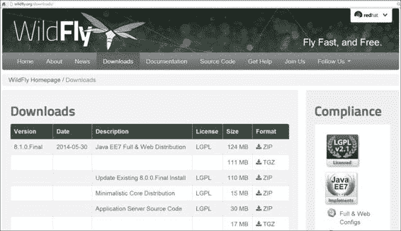
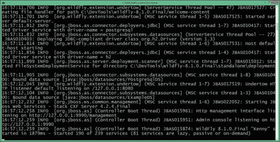
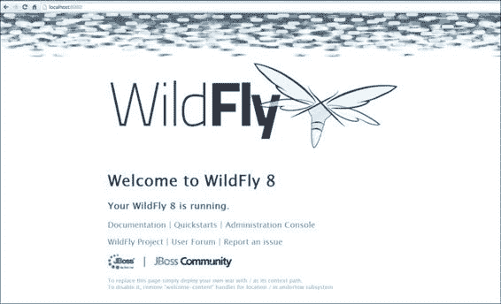
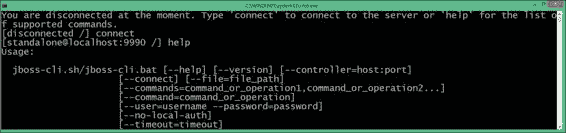
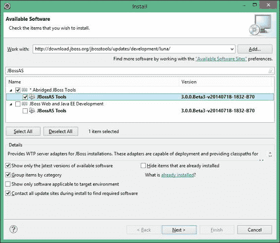
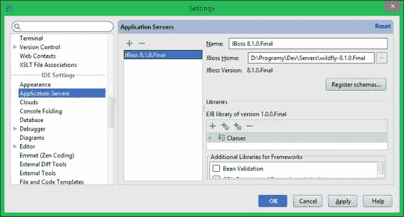

# 第一章. 开始使用 WildFly

Java 企业版提供了一种开发企业软件的标准，但允许开发者选择其特定的实现。对于 Java EE（企业版）规范中包含的每一项技术，都有一个参考实现；一个满足所有要求的开源库或组件。公司和组织可以创建自己版本的组件，这意味着没有所有人都使用的中央 Java EE 平台。取而代之的是，我们得到了多种实现规范的方法，针对特定情况进行了改进和优化。在撰写本文时，大约有 20 个 Java EE 6 的认证（完整）实现和三个 Java EE 7 的实现。

应用服务器是一个提供所有 Java EE 组件的运行时环境。Glassfish 是由 Oracle 赞助的参考实现，但从版本 4（为 Java EE 7 创建）开始，它不再提供商业支持。在这本书中，你将学习如何在 WildFly 应用服务器上开发应用程序，之前被称为 JBoss 应用服务器。

JBoss 是红帽公司的一个部门，旨在为企业管理开发提供开发者友好的开源生态系统。目前，该公司支持多个项目（大约 100 个），其中一些是 Java EE 规范的实现。企业元素被整合到 JBoss 自己的应用服务器 WildFly 中。

值得注意的是，从 JBoss AS 更名为 WildFly 是为了将应用服务器与公司和其他子项目区分开来。这个名字是通过公开投票选出的（更多信息可在[`jbossas.jboss.org/rename/vote`](http://jbossas.jboss.org/rename/vote)找到）。

新版本推出了一个可扩展且性能高的 Web 服务器 Undertow，它支持 HTTP 升级机制和 WebSocket 协议。更重要的是，新版本的容器甚至比 JBoss 应用服务器 7 更快，并提供了一个统一的配置机制。然而，最新版本的核心是 Java EE 7 兼容性，这允许开发者使用 Java EE 规范最新版本的技术。

这本书的重点是应用开发；因此，我们首先需要收集所有交付应用程序所需的资源。在本章中，我们将详细介绍以下主题：

+   Java EE 和 WildFly 概述

+   准备您的环境以安装软件

+   下载和安装 WildFly

+   验证 WildFly 的安装

+   安装开发所需的其他资源

# Java EE 和 WildFly 概述

Java EE（以前称为 J2EE）是一个包含用于服务器端 Java 开发的标准技术集合的规范。Java EE 技术包括 Java Servlet、**JavaServer Pages**（**JSPs**）、**JavaServer Faces**（**JSFs**）、**企业 JavaBeans**（**EJB**）、**上下文和依赖注入**（**CDI**）、**Java 消息服务**（**JMS**）、**Java 持久化 API**（**JPA**）、**Java API for XML Web Services**（**JAX-WS**）和 **Java API for RESTful Web Services**（**JAX-RS**）等。Java EE 的最新版本通过提供对批处理应用程序、并发实用工具、**JSON 处理**（**JSON-P**）和 WebSocket 的支持，进一步扩展了可用技术的范围。存在多个商业和开源应用服务器，允许开发者运行符合 Java EE 的应用程序；WildFly（以前称为 JBoss AS）是开发者采用的主要开源解决方案，尽管很难用精确的术语来衡量，但它可能是市场上使用最广泛的应用服务器。

与所有符合 Java EE 的应用服务器一样，WildFly 随带所有必需的库，使我们能够开发并部署基于 Java EE 平台构建的 Java 应用程序。

## WildFly 和企业应用平台

WildFly 和之前的 JBoss 应用服务器以可下载的二进制包（针对主要版本）或可构建的源代码（针对错误修复版本）的形式免费提供给社区。这些版本被称为社区发布版，可用于开发和生产。

JBoss 还发布了社区构建软件的更稳定和加固版本，这些版本被称为 **企业应用平台**（**EAP**），这是一个由 Red Hat 提供支持服务的商业产品。Red Hat 将项目之间的这种关系称为上游/下游。社区构建是下游变化和创新的来源，代码是下游。商业版本编号与社区版本不同，但它是社区发布的扩展变体（例如，EAP 6.1.0 是基于 JBoss 7.2.0 构建的，仅以可构建源代码的形式在 GitHub 上提供；EAP 6.2.0 和 JBoss 7.3.0 也是如此）。EAP 构建具有更复杂的许可系统；使用条款取决于构建的成熟度，如下所示：

+   **EAP 预览版**对开发者和生产使用都是免费的，因为它们相当于包含可选修复的标准社区版本。相应的社区二进制文件可能不可下载，因为它们将与 EAP 预览版类似。

+   **EAP 测试版**对开发者免费提供（在注册订阅计划后），但不能用于生产。

+   **EAP Final** 也对开发者免费提供，但除此之外，只有付费订阅中才有新的安全补丁。

JBoss 提出的分发模型允许开发者免费使用与生产环境中相同的版本。这是一个巨大的好处，特别是由于来自 Oracle 的竞争解决方案（Glassfish：Java EE 服务器参考实现）不再有带商业支持的版本。

## 欢迎使用 Java EE 7

Java EE 7 包含了对现有版本的几个改进和新增功能。新版本专注于三个主题：开发者生产力、HTML5 和提供企业应用程序所需的新功能。以下章节列出了对企业应用程序开发者感兴趣的主要规范改进。

如果您刚开始 Java EE 的冒险之旅，请随意跳过本节。以下章节将更详细地介绍后续章节中描述的技术。

### JavaServer Faces 2.2 – JSR 344

Java EE 7 包含了 JSF 规范的新版本，它不像 2.0 那样革命性，但仍然为开发者提供了一些吸引人的新增功能。JSF 2.2 提供的关键特性如下：

+   现在通过使用透传元素和属性支持 HTML5 标记。以前，每个组件都需要一个扩展渲染器来支持自定义属性。

+   通过 `@FlowScoped` 引入了流程作用域，这使得创建向导（具有多个步骤的对话框）变得更加容易。

+   基于 Ajax 的文件上传现在已直接支持。

+   此外，还提出了无状态视图作为提高性能的方法。

### 企业 JavaBeans 3.2 – JSR 345

与 EJB 3.1 相比，3.2 版本是对现有版本的微小更新。它主要集中于标记一些较旧的功能为过时（它们现在是可选的，这意味着并非每个 Java EE 7 兼容的应用服务器都将支持它们）。这些可选功能与基于 EJB 2.1 和 JAX-RPC 的 Web 服务持久性相关。新规范提供的主要增强如下：

+   有状态会话 Bean 的生命周期方法现在可以是事务性的。

+   定时器服务 API 现在允许您访问当前 EJB 模块中的所有活动定时器。

+   已引入了一个新的容器提供角色（`**`），它可以用来表示任何经过身份验证的用户（不考虑其实际角色）。

+   现在可以禁用有状态会话 Bean 的钝化。

EJB 规范的事务部分已被提取并用于 Java EE 平台的其他部分（事务支持已放置在 JTA 1.2 规范中）。例如，由于引入了 `@Transactional` 注解，现在可以在 CDI Bean 中使用事务行为。

### Java 持久性 API 2.1 – JSR 338

JPA 被引入为 Java EE 规范第 5 版的标准部分。JPA 的目的是作为 Java EE 的默认对象关系映射框架来取代实体 Bean。JPA 采纳了来自第三方对象关系框架（如 Hibernate 和 JDO）的想法，并将它们作为标准版本的一部分。

JPA 2.1 相比 JPA 2.0 是一个改进，因为它为开发者提供了以下几项便利：

+   它提供了一个标准化的模式生成机制，这得益于扩展的注解集和 `persistence.xml` 属性。

+   通过引入 `@Converter` 注解添加了对类型转换的支持。

+   实体管理器 API 现在支持存储过程，因此不再需要使用 SQL 查询机制

+   通过批更新和删除扩展了 Criteria API

+   可以将注入到实体监听器类中，同时使用生命周期回调方法。

+   现在可以在运行时创建命名查询。

+   **JPA 查询语言**（**JPQL**）已扩展了新的数据库函数

此外，Java EE 7 兼容的容器现在必须支持预配置的数据源（以及其他资源），这些资源可以由 JPA 实体即时使用。

WildFly 使用 Hibernate 作为其 JPA 提供程序，并附带一个可立即使用的 H2 内存数据库。默认数据源指向应用程序服务器内部托管的一个 H2 实例。

### Java EE 1.1 的上下文和依赖注入 – JSR 346

**上下文和依赖注入**（**CDI**）的 1.1 版本提供了对 Java EE 6 中引入 CDI 后识别出的问题的改进。简化编程模型的过程从 1.0 版本开始，现在正在继续。更新涵盖的领域如下：

+   CDI 默认启用（无需将 `bean.xml` 文件添加到部署中），并且可以指定所需的组件扫描模式。

+   开发者现在可以通过使用 `@Vetoed` 注解和 `beans.xml` 中的类或包过滤器来获得对 Bean 发现机制的更细粒度控制。现在可以使用 `@Priority` 注解全局启用整个应用程序的拦截器、装饰器和替代方案，而不是为每个模块启用。

+   当处理 CDI 事件时，现在可以检查事件元数据。

+   拦截器已增强，可以围绕构造函数调用执行。

+   最后，新版本包含了对可移植扩展开发的大量增强。

Weld 是 WildFly 内部使用的 CDI 实现。

### Java Servlet API 3.1 – JSR 340

新版本的 Java Servlet API 明确关注新特性。其中最重要的是 HTTP 升级机制，它允许客户端和服务器在 HTTP 1.1 中开始对话，并协商后续请求的另一个协议。该特性被用于在 Java EE 7 中实现 WebSocket 机制。规范新版本的其他特性如下：

+   为 Servlets 提供了非阻塞 I/O API，以改善 Web 应用程序的可伸缩性

+   引入了多项安全改进；其中最值得注意的是可以为所有 HTTP 方法设置默认的安全语义

### JAX-RS，Java API for RESTful Web Services 2.0 – JSR 339

在 Java EE 7 中，JAX-RS 规范增加了一些长期期待的功能。由于新规范带来的改进具有重大影响，版本已从 1.1 更改为 2.0。以下是最重要的特性列表：

+   客户端 API 现在是规范的一部分，因此不再需要第三方库。规范的实施必须提供一个符合通用 API 的 REST 客户端。

+   现在支持异步请求，这样客户端就不必被动等待任务的完成。

+   引入了过滤器和处理程序作为为开发者提供扩展点的通用机制。它们可用于跨切面关注点，如审计和安全。

+   Bean Validation 已集成到 JAX-RS 中，使得约束注解可用于请求参数。

WildFly 随带 RESTEasy，这是 JAX-RS 2.0 的一个实现。

### Java 消息服务 2.0 – JSR 343

JSR 343 是十多年来 JMS 规范的第一个更新。更新再次以简化 API 为主题。新的 API 大大减少了程序员必须编写的样板代码量，同时仍然保持向后兼容。其他新特性如下：

+   现在支持异步消息发送，因此应用程序不必在收到服务器的确认之前被阻塞

+   现在可以设置延迟交付的消息

HornetQ 是由 JBoss 使用和开发的 JMS 提供商。它可以在 WildFly 之外作为独立的消息代理使用。

### Bean Validation 1.1 – JSR 349

更新 Java EE 7 中的 Bean Validation 的过程集中在两个主要特性上：

+   方法验证，允许开发者验证参数和返回值

+   更紧密的 CDI 集成，这改变了验证框架元素的生命周期，允许开发者在其自己的 `ConstraintValidator` 实现中使用依赖注入

### Java EE 1.0 的并发实用工具 – JSR 236

并发实用工具是一个新的功能包，用于在 Java EE 应用组件中使用多线程。新的规范提供了`ManagedExecutorService`（Java SE 中已知的`ExecutorService`的容器感知版本），可以用来将任务的执行委托给一个单独的线程。这些管理任务可以使用大多数适用于应用组件的功能（例如 EJB 或 Servlet）。还可以使用新的`ManagedScheduledExecutorService`来安排周期性或延迟的任务。这些平台的新增功能填补了 Java EE 的功能空白，这在早期架构中是非常难以克服的。

### Java 平台 1.0 的批处理应用程序 – JSR 352

批处理作业是另一个企业级应用开发领域，在 Java EE 的早期版本中没有涉及。新的批处理框架被用来提供一个通用的解决方案来运行无需用户交互的任务。Java EE 为开发者提供了以下选项：

+   批处理作业执行运行时

+   基于 XML 的作业描述语言

+   批处理任务业务逻辑实现的 Java API

+   jBeret，这是 WildFly 中使用的批处理框架

### JSON 处理的 Java API 1.0 – JSR 353

Java EE 7 现在自带了开箱即用的 JSON 处理功能，因此开发者不再被迫使用外部库来完成这项任务。新的 API 允许 JSON 处理使用两种方法：对象模型（基于 DOM）和流式处理（基于事件）。

### WebSocket 1.0 的 Java API – JSR 356

为了完全支持基于 HTML5 的应用程序的开发，Java EE 7 需要一种标准化的技术来实现服务器与用户浏览器之间的双向通信。WebSocket API 允许开发者定义服务器端端点，这些端点将为每个连接到它们的客户端维护一个 TCP 连接（例如，使用 JavaScript API）。在新规范之前，开发者必须使用供应商特定的库和非便携式解决方案来实现相同的目标。

# WildFly 的新特性

WildFly 的第八次发布基于在之前版本 JBoss AS 7 中引入的模块化架构。它在多个关键点进行了改进，包括性能和管理领域。对于开发者来说，最重要的变化是这次发布完全实现了 Java EE 7 标准。其中一些最显著的改进包括以下内容：

+   WildFly 8 实现了 Java EE 7 规范中提出的所有标准，这些标准也在本章中进行了描述。

+   网络服务器模块在名称为 Undertow 的情况下被完全重写。它支持阻塞和非阻塞操作。早期的性能测试（例如，[`www.techempower.com/benchmarks/#section=data-r6&hw=i7&test=plaintext`](http://www.techempower.com/benchmarks/#section=data-r6&hw=i7&test=plaintext)）显示了 HTTP 请求处理方面的重大性能提升。Undertow 也可以作为一个独立的项目使用，并且可以在不使用 WildFly 的情况下使用。

+   最终的 WildFly 版本减少了使用的端口号数量。现在，它只使用两个端口，一个（`9990`）用于管理、JMX 和网络管理，另一个（`8080`）用于标准服务，包括 HTTP、WebSockets、远程 JNDI 和 EJB 调用。

+   现在，可以使用管理**基于角色的访问控制**（**RBAC**）来限制用户的管理权限。所有配置更改都可以通过审计日志进行跟踪。

+   对于之前的版本，任何升级操作都需要完全新的服务器安装。WildFly 带来了打补丁的功能，允许使用管理协议安装和回滚模块。

在下一节中，我们将描述安装并启动一个新的应用程序服务器所需的所有步骤。

# 安装服务器和客户端组件

了解应用程序服务器的第一步是在您的机器上安装所有必要的组件以运行它。应用程序服务器本身只需要安装 JDK 环境。

就硬件要求而言，您应该知道，在撰写本文时，服务器发行版需要大约 130 MB 的硬盘空间，并为独立服务器分配了最小 64 MB 和最大 512 MB。

为了开始，我们需要检查以下清单：

+   在 WildFly 将运行的地方安装 JDK

+   安装 WildFly

+   安装 Eclipse 开发环境

+   安装 Maven 构建管理工具

在本章结束时，您将拥有启动应用程序服务器所需的所有工具。

## 安装 Java SE

第一项强制性要求是安装 JDK 8 环境。Java SE 下载网站可在 [`www.oracle.com/technetwork/java/javase/downloads/index.html`](http://www.oracle.com/technetwork/java/javase/downloads/index.html) 找到。

选择 Java SE 8 的最新版本并安装它。如果您不知道如何安装，请参阅[`docs.oracle.com/javase/8/docs/technotes/guides/install/install_overview.html`](http://docs.oracle.com/javase/8/docs/technotes/guides/install/install_overview.html)。

### 测试安装

完成安装后，从命令提示符运行 `java -version` 命令以验证其是否正确安装。以下是来自 Windows 机器的预期输出：

```java
C:\>java –version
java version "1.8.0_11"
Java(TM) SE Runtime Environment (build 1.8.0_11-b12)
Java HotSpot(TM) 64-Bit Server VM (build 25.11-b03, mixed mode)
```

### 安装 WildFly

JBoss WildFly 应用程序服务器可以从 [`wildfly.org/downloads/`](http://wildfly.org/downloads/) 免费下载。

如以下截图所示，在撰写本书时，WildFly 的最新稳定版本为 8.1.0.Final，它具有经过认证的 Java EE 7 全功能配置：



一旦您选择了适当的服务器发行版，您将被告知此下载是社区发布的一部分，因此不受支持。

### 注意

如果您需要为您的应用程序提供企业级支持，可以选择 Red Hat Enterprise Application Platform。

与社区版本相比，EAP 经过了不同的质量测试，可能在功能/打包方面有所不同。有关 EAP 和社区版本之间差异的更多信息，请参阅本章开头。然而，在撰写本书时，EAP 还不支持 Java EE 7，且没有公开的路线图。

安装 WildFly 简单易行；除了解压缩 `wildfly-8.1.0.Final.zip` 归档之外，不需要其他任何东西。

Windows 用户可以使用任何解压缩工具，例如内置的压缩文件夹（在新版 Windows 中），WinZip，WinRAR 或 7-Zip，注意选择不包含空格和空白的文件夹名称。Unix/Linux 应使用 `$ unzip wildfly-8.1.0.Final.zip` 解压缩 shell 命令来展开归档。

### 注意

**安全警告**

Unix/Linux 用户应知道 WildFly 不需要 root 权限，因为 WildFly 使用的默认端口都不低于 `1024` 的特权端口范围。为了降低用户通过 WildFly 获得 root 权限的风险，请以非 root 用户安装并运行 WildFly。

### 启动 WildFly

安装 WildFly 后，进行简单的启动测试以验证您的 Java VM /操作系统组合没有出现重大问题是明智的。要测试您的安装，请转到您的 `JBOSS_HOME` 目录的 `bin` 目录（您已解压缩应用程序服务器的路径）并执行以下命令：

```java
standalone.bat    # Windows users
$ ./standalone.sh   # Linux/Unix users

```

以下是一个示例 WildFly 启动控制台的截图：



上述命令启动了一个 WildFly 独立实例，这与使用早期 JBoss AS 版本中使用的 `run.bat/run.sh` 脚本启动应用程序服务器等效。您将注意到新版本的应用程序服务器启动速度之快令人惊讶；这归功于 JBoss AS 7 版本中引入的模块化架构，该架构只启动加载应用程序所需的应用程序服务器容器中的必要部分。

如果您需要自定义应用程序服务器的启动属性，请打开 `standalone.conf` 文件（或 Windows 用户的 `standalone.conf.bat`），其中已声明 Wildfly 的内存需求。以下是该文件的 Linux 核心部分：

```java
if [ "x$JAVA_OPTS" = "x" ]; then
    JAVA_OPTS="-Xms64m -Xmx512m -XX:MaxPermSize=256m
       -Djava.net.preferIPv4Stack=true"
    JAVA_OPTS="$JAVA_OPTS
        -Djboss.modules.system.pkgs=$JBOSS_MODULES_SYSTEM_PKGS
        -Djava.awt.headless=true"
else
    echo "JAVA_OPTS already set in environment; overriding default settings with values: $JAVA_OPTS"
```

因此，默认情况下，应用服务器以至少 64 MB 的堆空间和最多 512 MB 的最大堆空间启动。这足以开始；然而，如果你需要在上面运行更健壮的 Java EE 应用程序，你可能至少需要 1 GB 的堆空间，或者根据应用程序类型，可能需要 2 GB 或更多。一般来说，32 位机器无法执行超过 2 GB 空间的过程；然而，在 64 位机器上，实际上没有进程大小的限制。

你可以通过将浏览器指向应用服务器的欢迎页面来验证服务器是否可以从网络访问，该页面可以通过众所周知的地址`http://localhost:8080`访问。WildFly 的欢迎页面如下所示：



### 使用命令行界面连接到服务器

如果你之前使用过应用服务器的早期版本，你可能听说过 twiddle 命令行实用程序，该实用程序查询应用服务器上安装的 MBeans。这个实用程序已被一个更复杂的界面所取代，称为命令行界面(**CLI**)；它可以在`JBOSS_HOME/bin`中找到。

只需启动`jboss-cli.bat`脚本（或 Linux 用户的`jboss-cli.sh`），你就可以通过 shell 界面管理应用服务器。这将在以下截图展示：



我们启动了一个交互式 shell 会话，也可以使用命令行补全（通过按*Tab*键）来匹配部分输入的命令名称。不再需要搜索以找到命令的确切语法！

### 注意

在上一张截图，我们使用`connect`命令连接到服务器；它默认使用回环服务器地址，并连接到端口`9990`。

命令行界面在第九章中进行了深入讨论，*管理应用服务器*，这是关于服务器管理界面的全部内容；然而，我们将在下一节中初步了解其基本功能，以便让你熟悉这个强大的工具。

### 停止 WildFly

停止 WildFly 最简单的方法是通过发送中断信号*Ctrl* + *C*。

然而，如果你的 WildFly 进程是在后台启动的，或者更确切地说，是在另一台机器上运行，你可以使用 CLI 界面发出立即关闭命令：

```java
[disconnected /] connect
Connected to localhost:9990
[standalone@localhost:9990 /] :shutdown

```

#### 定位关闭脚本

实际上还有一个选项可以关闭应用服务器，这在需要从脚本中关闭服务器时非常有用。此选项包括将`--`连接选项传递给管理 shell，从而关闭交互模式，如下所示命令行：

```java
jboss-cli.bat --connect command=:shutdown      # Windows
./jboss-cli.sh --connect command=:shutdown       # Unix / Linux

```

#### 在远程机器上停止 WildFly

关闭在远程机器上运行的 应用服务器只需将服务器的远程地址提供给 CLI，出于安全原因，还需要用户名和密码，以下代码片段显示了这一点（参见下一章了解有关用户创建的更多信息）：

```java
[disconnected /] connect 192.168.1.10
Authenticating against security realm: ManagementRealm
Username: admin1234
Password:
Connected to 192.168.1.10:9990
[standalone@192.168.1.10:9990 / ] :shutdown
```

然而，你必须记住你需要访问一个特定的端口，因为通常，它可能会被防火墙阻止。

### 重启 WildFly

命令行界面包含许多有用的命令。其中最有趣的一个选项是使用 `reload` 命令重新加载 AS 配置或其部分。

当在 AS 服务器根节点路径上执行时，`reload` 命令可以重新加载服务的配置：

```java
[disconnected /] connect
Connected to localhost:9990
[standalone@localhost:9990 /] :reload
```

## 安装 Eclipse 环境

本书所使用的开发环境是 Eclipse，这是全球 Java 开发者所熟知的，它包含了一整套插件来扩展其功能。除此之外，Eclipse 是第一个兼容新应用服务器的 IDE。

那么，让我们转到 Eclipse 的下载页面，它位于 [`www.eclipse.org`](http://www.eclipse.org)。

从这里下载最新的企业版（在撰写本书时，版本为 4.4，也称为 Luna）。压缩包中包含了已经安装的所有 Java EE 插件。以下截图显示了这一过程：


一旦解压之前下载的文件，你将看到一个名为 `eclipse` 的文件夹。在这个文件夹中，你可以找到 Eclipse 应用程序（一个大的蓝色圆点）。建议你在桌面上创建一个快捷方式以简化 Eclipse 的启动。请注意，与 WildFly 一样，Eclipse 没有安装过程。一旦解压文件，你就完成了！

### 安装 JBoss Tools

下一步将是安装 JBoss AS 插件，它是名为 JBoss Tools 的插件套件的一部分。在 Eclipse 中安装新插件非常简单；只需按照以下步骤操作：

1.  从菜单中，导航到 **帮助** | **安装新软件**。

1.  然后，点击 **添加** 按钮，在这里你将输入 JBoss Tools 的下载 URL（以及描述），[`download.jboss.org/jbosstools/updates/development/luna/`](http://download.jboss.org/jbosstools/updates/development/luna/)。以下截图显示了这一过程：

1.  如前一个截图所示，你需要检查 **JBossAS Tools** 插件，然后继续到下一个选项以完成安装过程。

    ### 注意

    在过滤器字段中输入 `JBossAS` 以快速在大量的 JBoss Tools 中找到 JBoss AS 工具插件。

1.  完成后，根据提示重新启动进程。

    ### 注意

    你还可以将 JBoss Tools 作为单独的 zip 文件下载以进行离线安装。请参阅 [`tools.jboss.org/downloads/`](http://tools.jboss.org/downloads/) 上的 JBoss Tools 下载。

1.  现在，您应该能够通过从菜单中选择**新建** | **服务器**并展开**JBoss Community**选项来在**新服务器**中看到 WildFly，如图所示：

在 Eclipse 中完成服务器安装相当简单，只需指向您的服务器发行版所在的文件夹即可；因此，我们将把这个留给你作为实践练习来实现。

## 替代开发环境

由于这本书全部关于开发，我们也应该考虑一些可能更适合您的编程风格或公司标准的其他替代方案。因此，另一个有效的替代方案是 IntelliJ IDEA，可在[`www.jetbrains.com/idea/index.html`](http://www.jetbrains.com/idea/index.html)找到。

IntelliJ IDEA 是一个以代码为中心的 IDE，专注于提高开发者的生产力。编辑器能够很好地理解您的代码，并在您需要时提供出色的建议，并且始终准备帮助您塑造代码。

该产品有两种版本——社区版和终极版，需要许可证。为了使用 Java EE 和 WildFly 插件，您需要从[`www.jetbrains.com/idea/download/index.html`](http://www.jetbrains.com/idea/download/index.html)下载终极版，然后使用安装向导简单地安装它。

一旦安装了终极版，您可以通过转到**文件** | **设置**并选择**IDE 设置**选项来开始使用 WildFly 开发应用程序。在这里，您可以选择添加新的应用程序服务器环境。这在上面的屏幕截图中显示：



另一个在开发者中相当受欢迎的开发选项是 NetBeans ([`netbeans.org`](http://netbeans.org))，它在 7.4 和 8.0 版本中支持 WildFly，但需要在 NetBeans 插件注册表中安装额外的插件。

## 安装 Maven

除了图形工具之外，强烈建议您学习 Maven，这是一个流行的构建和发布管理工具。通过使用 Maven，您将享受到以下好处：

+   所有项目的标准结构

+   依赖项的集中和自动管理

Maven 以几种格式分发，为了您的方便，可以从[`maven.apache.org/download.html`](http://maven.apache.org/download.html)下载。

下载完成后，将发行版存档（例如，Windows 上的 `apache-maven-3.1.1-bin.zip`）解压缩到您希望安装 Maven 3.1.0（或最新可用版本）的目录中，例如，`C:\\Programs\apache-maven-3.1.1`。一些操作系统（如 Linux 或 OS X）在其应用程序仓库中提供 Maven 软件包。

完成后，将 `M2_HOME` 环境变量添加到您的系统中，使其指向 Maven 解包的文件夹。

接下来，通过将 Maven 二进制文件添加到系统路径中来更新 `PATH` 环境变量。例如，在 Windows 平台上，你应该包含 `%M2_HOME%/bin` 以便在命令行上使用 Maven。

一些额外的 Maven 学习材料以免费书籍的形式可在 Sonatype 网站上找到；请参阅 [`www.sonatype.com/resources/books`](http://www.sonatype.com/resources/books)。

### 测试安装

一旦您完成安装，运行 `mvn` 版本来验证 Maven 是否已正确安装。请参考以下代码片段以验证正确的安装：

```java
> mvn –version
Apache Maven 3.1.1 (0728685237757ffbf44136acec0402957f723d9a; 2013-09-17 17:22:22+0200)
Maven home: C:\Programs\Dev\apache-maven-3.1.1
Java version: 1.8.0_11, vendor: Oracle Corporation
Java home: C:\Programs\Java\jdk1.8.0\jre
Default locale: en_US, platform encoding: Cp1250
OS name: "windows 8.1", version: "6.3", arch: "amd64", family: "dos"
```

### 注意

**下载示例代码**

您可以从您在 [`www.packtpub.com`](http://www.packtpub.com) 的账户中下载您购买的所有 Packt 书籍的示例代码文件。如果您在其他地方购买了这本书，您可以访问 [`www.packtpub.com/support`](http://www.packtpub.com/support) 并注册，以便将文件直接通过电子邮件发送给您。

# 摘要

在本章中，我们在应用服务器开发的道路上迈出了第一步。我们介绍了应用服务器的最新功能，并对 Java 平台企业版（版本 7）进行了概述，也称为 Java EE 7。

接下来，我们讨论了 WildFly AS 的安装以及所有核心组件的安装，包括 JDK 和一系列开发工具，如 Eclipse 和 Maven，这些工具将是您在这段旅程中的伴侣。

在下一章中，我们将总结所有应用服务器的功能，特别关注交付应用程序所需的组件和命令，这是本书的主要目标。
