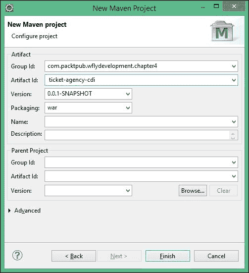
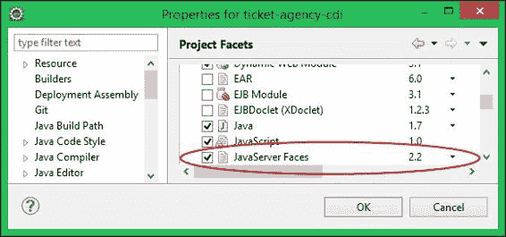
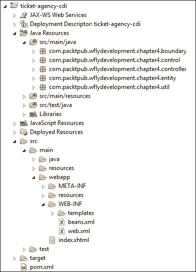
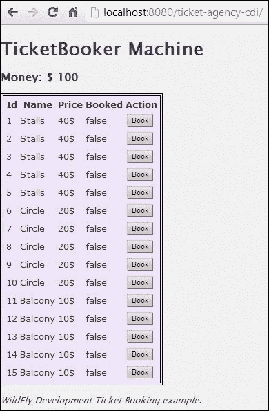
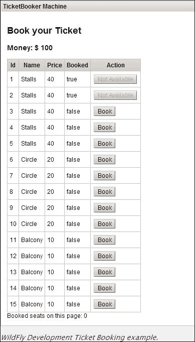

# 第四章。学习上下文和依赖注入

我们看到，第三章，“介绍 Java EE 7 – EJBs”，由于我们必须涵盖大量的内容，包括 Java 企业增强和 Maven 特定的配置，因此具有挑战性。在本章中，我们将讨论**上下文和依赖注入**（**CDI**），它在 Java EE 6（从 JSR 299 开始）中添加到 Java EE 规范中。它为 Java EE 开发者提供了许多缺失的好处，例如允许任何 JavaBean 作为 JSF 管理 Bean 使用，包括无状态和有状态会话 Bean。你可以在[`www.cdi-spec.org/`](http://www.cdi-spec.org/)上找到有关 CDI 和规范最新版本（JSR 346）的更多信息。

本章将涵盖的一些主题如下：

+   上下文和依赖注入是什么以及它与 EJB 的关系

+   如何重写我们的票务预订示例以使用 CDI 和 JavaServer Faces 技术

+   如何使用 Maven 运行项目

本章假设读者熟悉**JavaServer Faces**（**JSF**），它将被用来为我们提供图形界面。如果你正在寻找 JSF 的入门指南，网上有多个优秀的资源，包括官方 Java EE 7 教程中的相关部分[`docs.oracle.com/javaee/7/tutorial/doc/jsf-develop.htm#BNATX`](http://docs.oracle.com/javaee/7/tutorial/doc/jsf-develop.htm#BNATX)。

# 介绍上下文和依赖注入

CDI（上下文和依赖注入）对于 Java EE 平台引入了一套标准的组件管理服务。作为 Java EE 7 的一个组成部分，CDI 在许多方面是对 Spring 中长时间酝酿的概念的标准化，例如依赖注入和拦截器。实际上，CDI 和 Spring 3 共享许多相似的功能。对于开发者来说，也有其他更轻量级且在 Java SE 环境中更容易使用的依赖注入框架。**Google Guice** ([`github.com/google/guice`](https://github.com/google/guice)) 是一个显著的例子。为独立的 Java SE 应用程序提供对 CDI 容器的全面支持，并从应用服务器中分离出来，是即将到来的 CDI 2.0 规范的目标之一。这将允许开发者在使用客户端和服务器两端的通用编程模型。

CDI 通过所谓的松耦合和强类型来解耦关注点。这样做，它几乎提供了一种从日常 Java 编程的平凡中解放出来的感觉，允许注入其对象并控制它们的生命周期。

### 小贴士

**为什么 CDI 对 Java EE 是必需的？**

如果你使用 Java EE 5 进行编程，你可能会争辩说它已经具有资源注入的功能。然而，这种注入只能用于容器已知的资源（例如，`@EJB`、`@PersistenceContext`、`@PersistenceUnit`和`@Resource`）。另一方面，CDI 提供了一种通用的依赖注入方案，它可以用于任何组件。

CDI 的基本单元仍然是 Bean。与 EJB 相比，CDI 具有不同、更灵活的 Bean 类型，这通常是放置业务逻辑的好地方。这两种方法之间最重要的区别之一是 CDI Bean 是**上下文相关的**；也就是说，它们存在于一个定义良好的作用域中。

考虑以下代码片段：

```java
public class HelloServlet extends HttpServlet {

    @EJB
    private EJBSample ejb;

    public void doGet (HttpServletRequestreq,
                       HttpServletResponse res)
                throws ServletException, IOException {
        try(PrintWriter out = res.getWriter()) {
            out.println(ejb.greet());
        }
    }
}
```

在这里，注入的 EJB 代理（让我们假设它是一个带有`@Stateless`注解的 POJO 类）仅指向一个无状态实例池（或对于有状态的 Bean，是一个单个 Bean 实例）。HTTP 请求或 HTTP 会话与给定的 EJB 实例之间没有自动关联。

对于 CDI Bean 来说，情况正好相反，它们存在于定义良好的作用域中。例如，以下 CDI Bean 存在于`RequestScoped`中；也就是说，它将在请求结束时被销毁：

```java
@RequestScoped
public class Customer {

    private String name;
    private String surname;

    public String getName(){
        return name;
    }

    public String getSurname(){
        return surname;
    }
}
```

前面的 CDI Bean 可以安全地注入到我们之前的 servlet 中；在 HTTP 会话或 HTTP 请求结束时，所有与这个作用域相关的实例都会自动销毁，从而进行垃圾回收：

```java
public class HelloServlet extends HttpServlet {

    @Inject
    private Customer customer;

    public void doGet (HttpServletRequest req,
                       HttpServletResponse res)
                throws ServletException, IOException {
        // some code
    }
}
```

## 命名 Bean

在前面的章节中，我们遇到了`@Named`注解。命名 Bean 允许我们轻松地将我们的 Bean 注入到依赖它们的其他类中，并通过**统一表达式语言**（**UEL**）从 JSF 页面中引用它们。回想一下前面的例子：

```java
@RequestScoped
@Named 
public class Customer {

    private String name;
    private String surname;

    public String getName(){
        return name;
    }

    public String getSurname(){
        return surname;
    }
}
```

这个类，被`@Named`注解装饰，然后可以从 JSF 页面中引用：

```java
<?xml version="1.0" encoding="UTF-8"?>
<!DOCTYPE html PUBLIC "-//W3C//DTD XHTML 1.0 Transitional//EN"
        "http://www.w3.org/TR/xhtml1/DTD/xhtml1-transitional.dtd">
<html  
      >
   <h:body>
      <h:form>
         <h:panelGrid columns="2">
            <h:outputLabel for="name" value="Name" />
            <h:inputText id="name" value="#{customer.name}" />
            <h:outputLabel for="lastName" value="Surname" />
            <h:inputText id="surname" value="#{customer.surname}" />
            <h:panelGroup />
         </h:panelGrid>
      </h:form>
   </h:body>
</html>
```

### 注意

默认情况下，Bean 的名称将是类名，其首字母转换为小写；因此，`Customer` Bean 可以被称为`customer`。

如果你想为你的 Bean 使用不同的命名策略，你可以像下面这样使用`@Named`注解：

```java
@Named(value="customNamed")
```

这样，我们将能够使用指定的`customNamed`值来引用我们的 CDI Bean。

我们可以不用两个`@RequestScoped`和`@Named`注解，而只需使用聚合它们的`@Model`注解。

## CDI 作用域

CDI Bean 附带一组预定义的作用域和注解，每个 CDI Bean 都有由其所属的作用域确定的独特生命周期。以下表格描述了内置的 CDI 作用域和设置这些作用域所需的注解：

| 作用域 | 描述 |
| --- | --- |
| `@RequestScoped` | `@RequestScoped` Bean 在单个请求的长度内共享。这可能是一个 HTTP 请求、远程 EJB 调用、Web 服务调用，或者发送到消息驱动 Bean（MDB）的消息。这些 Bean 在请求结束时被销毁。 |
| `@ConversationScoped` | `@ConversationScoped`作用域的 Bean 在同一个 HTTP 会话中的多个请求间共享，但仅当存在一个活跃的会话时。通过`javax.enterprise.context.Conversation` Bean 支持 JSF 请求的会话。 |
| `@SessionScoped` | `@SessionScoped`作用域的 Bean 在同一个 HTTP 会话中的所有请求间共享，并在会话销毁时被销毁。 |
| `@ApplicationScoped` | `@ApplicationScoped`作用域的 Bean 将在应用程序运行期间存在，并在应用程序关闭时被销毁。 |
| `@Dependent` | `@Dependent`作用域的 Bean 永远不会在注入点之间共享。任何对依赖 Bean 的注入都是一个新实例，其生命周期绑定到被注入的对象的生命周期。 |

其他 Java EE 部分可以扩展可用作用域的列表。在 Java EE 7（Java 事务 API 规范）中，引入了一个新的作用域：`@TransactionScoped`。它将 Bean 的生命周期与当前事务绑定。当然，也可以引入自己的自定义作用域。

在本章的示例中，我们将使用`RequestScoped`和`SessionScoped` Bean 来驱动我们的简单票务预订系统。在下一章中，我们将使用`ConversationScoped` Bean 进一步增强我们的示例，这些 Bean 是 CDI Bean 的一个特殊作用域。对所有命名 Bean 作用域的详细解释超出了本书的范围。然而，您可以通过查看 CDI 参考实现（JBoss Weld）文档来满足您对知识的渴望，文档地址为[`docs.jboss.org/weld/reference/latest/en-US/html/scopescontexts.html`](http://docs.jboss.org/weld/reference/latest/en-US/html/scopescontexts.html)。

## WildFly CDI 实现

Weld 是 CDI 参考实现，最初作为 Seam 3 项目的一部分([`www.seamframework.org/`](http://www.seamframework.org/))。Weld 提供了一个完整的 CDI 实现，它可以成为 Java EE 7 容器（如 WildFly）的一部分。

因此，为了在 WildFly 上运行基于 CDI 的应用程序，您不需要下载任何额外的库，因为 Weld 是服务器模块的一部分，并且如以下扩展所述，它包含在所有服务器配置中。

```java
<extension module="org.jboss.as.weld"/>
```

然而，安装了您的模块并不意味着您可以在应用程序中盲目使用它。一般规则是，在 WildFly 上，每个应用程序模块都是与其他模块隔离的；这意味着默认情况下，它对 AS 模块没有可见性，AS 模块对应用程序也没有可见性。

为了准确起见，我们可以将所有 WildFly 模块分为以下三个类别：

+   **隐式添加到您的应用程序中的模块**：此类别包括最常用的 API，如`javax.activation`、`javax.annotation`、`javax.security`、`javax.transaction`、`javax.jms`和`javax.xml`。使用这些模块不需要额外的工作，因为如果您的应用程序中引用了它们，WildFly 会自动为您添加它们。

+   **根据条件添加的模块**：此类别包括`javax.ejb`、`org.jboss.resteasy`、`org.hibernate`、`org.jboss.as.web`以及最后的`org.jboss.as.weld`。所有这些模块将在您提供其核心注解（例如 EJB 的`@Stateless`）或其核心配置文件（例如 Web 应用程序的`web.xml`）的条件下添加。

+   **需要由应用程序部署者显式启用的模块**：这包括所有其他模块，例如您的自定义模块，您可以将其添加到应用程序服务器中。允许您查看这些模块的最简单方法是向您的`META-INF/MANIFEST.MF`文件添加一个显式依赖项。例如，如果您想触发**log4j**依赖项，您必须按照以下方式编写您的清单文件：

    ```java
    Dependencies: org.apache.log4j
    ```

此外，还有一个自定义描述符文件可用，WildFly 使用该文件来解析依赖关系——`jboss-deployment-structure.xml`。它允许开发者以细粒度的方式配置所需的依赖项。该文件位于顶级部署文件中的`META-INF`目录（或 Web 存档的`WEB-INF`目录）。XML 文件的示例内容（以及 XSD 模式）可在[`docs.jboss.org/author/display/WFLY8/Class+Loading+in+WildFly`](https://docs.jboss.org/author/display/WFLY8/Class+Loading+in+WildFly)找到。

因此，如果您仔细遵循了我们的清单，您将知道为了让 Weld 库启动并自动发现您的 CDI Bean，您应该添加其核心配置文件，即`beans.xml`。此文件可以放置在您的应用程序中的以下位置：

+   如果您正在开发 Web 应用程序，请将其放置在`WEB-INF`文件夹中

+   如果您正在部署 JAR 存档，请将其放置在`META-INF`文件夹中

`beans.xml`文件基于以下模式引用：

```java
 <beans 

       xsi:schemaLocation="http://xmlns.jcp.org/xml/ns/javaee 
       http://xmlns.jcp.org/xml/ns/javaee/beans_1_1.xsd"
       version="1.1" bean-discovery-mode="all">
 </beans>
```

然而，在正确的位置放置一个空的`beans.xml`文件是完全合法的；如果您这样做，CDI 将在您的应用程序中启用。如果您没有放置`beans.xml`文件，那么只有被标注为 Bean 的类子集将被考虑。在这种情况下，容器只为带有 CDI 相关注解的类创建 Bean，并忽略其他类。大多数情况下，这不是我们期望的行为，并且与 Java EE 6 的默认模式（当时需要`beans.xml`文件）不同。

您可能已经注意到，在 `beans.xml` 文件中，`bean-discovery-mode` 属性被设置为 `all`。这允许我们配置上一段中讨论的 CDI 发现模式。它表示我们存档中的每个可读类都将被视为一个托管 Bean。您可以在一个类上放置一个 `@Vetoed` 注解来将其从 Bean 发现过程中过滤掉。也可以将发现模式设置为 `annotated`，这样您就可以为每个您希望用作 Bean 的类放置一个作用域注解。这是最新 CDI 版本的默认值（在没有 `beans.xml` 的情况下也是如此），所以请确保在我们的所有示例中都将其设置为开启。

## 重新思考您的票务系统

一旦您学会了 CDI 的基础知识，我们将开始使用 CDI Bean 重新设计票务预订系统。我们将通过删除一些不需要的项，如远程接口或异步方法，将其转变为一个更精简的应用程序。通过这样做，您将能够专注于 Web 应用程序中实际使用的组件。

让我们创建一个新的 Maven 项目，就像我们在上一章所做的那样：

1.  从 **文件** 菜单，转到 **新建** | **Maven 项目**；按照我们之前的方式遵循向导（记得勾选 **创建一个简单项目** 选项）。

1.  在下一屏中，输入 `com.packtpub.wflydevelopment.chapter4` 作为 **Group Id**，`ticket-agency-cdi` 作为 **Artifact Id**，并将打包设置为 **war**：

1.  点击 **完成**。Eclipse 的 Maven 插件将为您生成一个您在上一章中熟悉的项目结构。

1.  唯一的不同之处在于，除了标准的 `java`（用于 Java 类）和 `resources`（用于配置文件）文件夹外，还有一个名为 `webapp` 的新目录，它将托管 Web 应用程序的视图。

### 添加所需的依赖项

为了编译和运行项目，我们的 Maven 的 `pom.xml` 文件将需要上一章中已知的一组依赖项：

```java
    <dependencies>
        <dependency>
            <groupId>javax</groupId>
            <artifactId>javaee-api</artifactId>
            <version>7.0</version>
            <scope>provided</scope>
        </dependency>
        <dependency>
            <groupId>org.jboss.logging</groupId>
            <artifactId>jboss-logging</artifactId>
            <version>3.1.4.GA</version>
            <scope>provided</scope> 
        </dependency>
     </dependencies>
```

我们还将需要上一章中的两个插件（注意我们将文件扩展名从 `jar` 改为了 `war`）：

```java
    <build>
        <finalName>${project.artifactId}</finalName>
        <plugins>
            <!-- WildFly plugin to deploy the application -->
            <plugin>
                <groupId>org.wildfly.plugins</groupId>
                <artifactId>wildfly-maven-plugin</artifactId>
                <version>1.0.2.Final</version>
                <configuration>
 <filename>${project.build.finalName}.war</filename>
                </configuration>
            </plugin>
            <plugin>
                <groupId>org.apache.maven.plugins</groupId>
                <artifactId>maven-compiler-plugin</artifactId>
                <version>3.1</version>
                <configuration>
                    <!-- enforce Java 8 -->
                    <source>1.8</source>
                    <target>1.8</target>
                </configuration>
            </plugin>
        </plugins>
    </build>
```

如果您在 `POM` 配置文件中遇到任何问题，请确保您检查这本书附带的源代码以及上一章的材料。

## 创建 Bean

一旦您的项目配置正确，我们就可以开始建模我们的 Bean。我们将首先升级的 Bean 是 `TheatreBooker`，它将驱动用户会话，从我们的 `TheatreBox` Bean 访问票务列表：

```java
package com.packtpub.wflydevelopment.chapter4.controller;

import com.packtpub.wflydevelopment.chapter4.boundary.TheatreBox;
import org.jboss.logging.Logger;

import javax.annotation.PostConstruct;
import javax.enterprise.context.SessionScoped;
import javax.faces.application.FacesMessage;
import javax.faces.context.FacesContext;
import javax.inject.Inject;
import javax.inject.Named;
import java.io.Serializable;

@Named [1]
@SessionScoped [2]
public class TheatreBooker implements Serializable {

    @Inject
 private Logger logger; [3]

    @Inject
 private TheatreBox theatreBox; [4]

    @Inject
 private FacesContext facesContext; [5]

    private int money;

    @PostConstruct
    public void createCustomer() {
        this.money = 100;
    }

    public void bookSeat(int seatId) {
        logger.info("Booking seat " + seatId);
        int seatPrice = theatreBox.getSeatPrice(seatId);

        if (seatPrice > money) {
 FacesMessage m = new FacesMessage(FacesMessage.SEVERITY_ERROR, "Not enough Money!", "Registration unsuccessful"); [6]
            facesContext.addMessage(null, m);
            return;
        }

        theatreBox.buyTicket(seatId);

        FacesMessage m = new FacesMessage(FacesMessage.SEVERITY_INFO, "Booked!", "Booking successful");
        facesContext.addMessage(null, m);
        logger.info("Seat booked.");

        money = money - seatPrice;
    }

    public int getMoney() {
        return money;
    }
}
```

如您所见，该 Bean 已被标记为 `Named [1]`，这意味着它可以直接在我们的 JSF 页面中引用。该 Bean 是 `SessionScoped [2]`，因为它在其会话期间存储客户可用的金额。

我们还希望注入`logger [3]`和`FacesContextFacexContexts [5]`，而不是手动定义它们。为此，我们需要注册一个生成日志记录器的 Bean，这些日志记录器以类的名称作为参数。我们将在稍后介绍生成 Bean 的过程。

最后，请注意，我们可以安全地使用`Inject [4]`注解将 EJB 注入我们的 CDI Bean 中。同样，反向注入也是完全合法的，即，将 CDI Bean 注入 EJB 中。

与我们早期的项目相比，当客户无法负担票价时，我们这里不会抛出 Java 异常。由于应用程序是基于 Web 的，我们只需使用`JSF Faces Messages [6]`向客户端显示警告消息。

我们在应用程序中仍然使用的另一个 Bean 是`TheatreInfo`，它已被移动到`controller`包中，因为它实际上会为应用程序提供可用座位的列表：

```java
package com.packtpub.wflydevelopment.chapter4.controller;

import com.google.common.collect.Lists;
import com.packtpub.wflydevelopment.chapter4.boundary.TheatreBox;
import com.packtpub.wflydevelopment.chapter4.entity.Seat;

import javax.annotation.PostConstruct;
import javax.enterprise.event.Observes;
import javax.enterprise.event.Reception;
import javax.enterprise.inject.Model;
import javax.enterprise.inject.Produces;
import javax.inject.Inject;
import javax.inject.Named;
import java.util.Collection;

@Model [1]
public class TheatreInfo {

    @Inject
    private TheatreBox box;

    private Collection<Seat> seats;

    @PostConstruct
    public void retrieveAllSeatsOrderedByName() {
        seats = box.getSeats();
    }

 @Produces [2]
    @Named
    public Collection<Seat> getSeats() {
        return Lists.newArrayList(seats);
    }
    public void onMemberListChanged(@Observes(notifyObserver = Reception.IF_EXISTS) final Seat member) {
        retrieveAllSeatsOrderedByName(); [3]
    }
}
```

首先，看看`@Model`注解[1]，它是对两个常用注解`@Named`和`@RequestScoped`的别名（我们称这种注解为**类型化注解**）。因此，此 Bean 将被命名为我们的 JSF 页面，并将携带请求作用域。

接下来，注意`getSeats`方法。此方法返回一个座位列表，将其作为`producer`方法[2]公开。

### 注意

`producer`方法允许您控制依赖对象的生成。作为一个 Java 工厂模式，它们可以用作对象源，其实现在运行时可能不同，或者如果对象需要一些不在构造函数中执行的定制初始化。

它可以用来提供任何类型的具体类实现；然而，它特别适用于将 Java EE 资源注入您的应用程序。

使用`@Producer`注解为`getSeats`方法的一个优点是，其对象可以直接通过 JSF 的**表达式语言**（**EL**）公开，正如我们稍后将看到的。

最后，CDI 在此示例中释放的另一个特性是**观察者**。正如其名所示，观察者可以用来观察事件。每当创建、删除或更新对象时，观察者方法都会被通知。在我们的示例中，它允许在需要时刷新座位列表。

### 注意

严格来说，在我们的示例中，我们使用了一个条件观察者，表示为表达式`notifyObserver = Reception.IF_EXISTS`。这意味着在实践中，只有当组件的实例已经存在时，才会调用`observer`方法。如果没有指定，默认选项（`ALWAYS`）将是观察者方法始终被调用。（如果不存在实例，它将被创建。）

在最新的 CDI 版本中，通过向观察者的方法添加`EventMetadata`参数，可以在观察者中获取有关已触发事件的额外信息。

每当我们的座位列表发生变化时，我们将使用`javax.enterprise.event.Event`对象来通知观察者关于这些变化。这将在我们的单例 Bean 中完成，该 Bean 注入了座位的`[1]`事件，并在座位预订时通过触发事件来通知观察者`[2]`：

```java
package com.packtpub.wflydevelopment.chapter4.boundary;
import javax.enterprise.event.Event;

@Singleton
@Startup
@AccessTimeout(value = 5, unit = TimeUnit.MINUTES)
public class TheatreBox {

 @Inject [1]
 private Event<Seat> seatEvent;

    @Lock(WRITE)
    public void buyTicket(int seatId) {
        final Seat seat = getSeat(seatId);
        final Seat bookedSeat = seat.getBookedSeat();
        addSeat(bookedSeat);

 seatEvent.fire(bookedSeat); [2]
    }  
    // Rest of the code stays the same, as in the previous chapter
}
```

之前我们提到，如果 Bean 请求，应该向其注入一个预配置的记录器。我们将创建一个简单的记录器生产者，它将使用注入点（请求记录器的 Bean）的信息来配置一个实例：

```java
package com.packtpub.wflydevelopment.chapter4.util;

import javax.enterprise.inject.Produces;
import javax.enterprise.inject.spi.InjectionPoint;
import org.jboss.logging.Logger;

public class LoggerProducer {

    @Produces
    public Logger produceLogger(InjectionPoint injectionPoint) {
        return Logger.getLogger(injectionPoint.getMember().getDeclaringClass().getName());
    }
}
```

我们还允许注入`FacesContext`而不是使用标准的`FacesContext.getCurrentInstance()`静态方法。此上下文用于，例如，显示指定的错误消息：

```java
package com.packtpub.wflydevelopment.chapter4.util;

import javax.enterprise.context.RequestScoped;
import javax.enterprise.inject.Produces;
import javax.faces.context.FacesContext;

public class FacesContextProducer {

    @Produces
    @RequestScoped
    public FacesContext produceFacesContext() {
        return FacesContext.getCurrentInstance();
    }
}
```

我们将在项目中包含的最后一个类是`Seat`实体，正如前一章所提到的，它将作为我们的模型使用，无需任何修改（请记住，使用适当的包将其包含在你的项目中）。

### 构建视图

一旦我们编码了示例的服务器端，创建前端将相当容易，因为我们已经通过 CDI Beans 提供了所有资源。

与本书的一些早期版本相比，一个显著的不同之处在于**Facelets**现在是 JSF 的首选视图技术。JSF 的早期版本使用**JavaServer Pages**（**JSP**）作为它们的默认视图技术。由于 JSP 技术在 JSF 之前，使用 JSP 与 JSF 有时感觉不自然或造成问题。例如，JSP 的生命周期与 JSF 的生命周期不同。

### 注意

与 JSP 生命周期所基于的更简单的请求-响应范式相比，JSF 生命周期要复杂得多，因为 JSF 的核心是 MVC 模式，这有几个含义。在 JSF 生成的视图中，用户操作发生在没有与服务器建立永久连接的客户端。用户操作或页面事件的传递将延迟，直到建立新的连接。JSF 生命周期必须处理事件和事件处理之间的延迟。此外，JSF 生命周期必须确保在渲染之前视图是正确的，并且 JSF 系统包括一个阶段来验证输入，并在所有输入通过验证后更新模型。

大多数时候，Facelets 用于使用 HTML 风格的模板和组件树构建 JavaServer Faces 视图。模板是 Facelets 提供的一个有用功能，允许你创建一个将作为应用程序中其他页面模板的页面（类似于 Struts Tiles）。想法是获取可重用代码的部分，而无需在不同的页面上重复相同的代码。

因此，这里的主要应用程序结构包含一个名为 `default.xhtml` 的模板页面，该页面通过页面组成元素的模板属性被视图引用。模板包含两个主要的 HTML `div` 元素，将用于包含主要应用程序面板（`content`）和一个页脚 `div`（`footer`），它几乎只输出应用程序标题。

为了首先添加模板，将一个新的 JSF 页面添加到您的应用程序的 `WEB-INF/templates` 文件夹中，并将其命名为 `default.xhtml`：

```java
<?xml version='1.0' encoding='UTF-8' ?>
<!DOCTYPE html PUBLIC "-//W3C//DTD XHTML 1.0 Transitional//EN"
        "http://www.w3.org/TR/xhtml1/DTD/xhtml1-transitional.dtd">
<html 

      >
<h:head>
    <meta http-equiv="Content-Type" content="text/html; charset=utf-8"/>
    <h:outputStylesheet name="style.css"/>
</h:head>
<h:body>
    <div id="container">
        <div id="content">
 <ui:insert name="content">
 [Template content will be inserted here]
 </ui:insert>
        </div>
        <div id="footer">
            <p>
                <em>WildFly Development Ticket Booking example.</em><br/>
            </p>
        </div>
    </div>
</h:body>
</html>
```

接下来，我们将添加主页面视图，它将被嵌入到您的模板中。为此，将一个名为 `index.xhtml` 的 JSF 页面添加到您的 Maven 项目的 `webapp` 文件夹中：

```java
<?xml version="1.0" encoding="UTF-8"?>
<ui:composition 

                template="/WEB-INF/templates/default.xhtml"> [1]
    <ui:define name="content">
        <h1>TicketBooker Machine</h1>
        <h:form id="reg">
 <h3>Money: $ #{theatreBooker.money}</h3> [2]
            <h:messages errorClass="error" infoClass="info"
                        globalOnly="true"/>
            <h:panelGrid columns="1" border="1" styleClass="smoke">
 <h:dataTable var="_seat" value="#{seats}" [3]
 rendered="#{not empty seats}" styleClass="simpletablestyle">

                    <h:column>
                        <f:facet name="header">Id</f:facet>
                        #{_seat.id}
                    </h:column>

                    <h:column>
                        <f:facet name="header">Name</f:facet>
                        #{_seat.name}
                    </h:column>
                    <h:column>
                        <f:facet name="header">Price</f:facet>
                        #{_seat.price}$
                    </h:column>
                    <h:column>
                       <f:facet name="header">Booked</f:facet>
                       #{_seat.booked}
                    </h:column>
                    <h:column>
                       <f:facet name="header">Action</f:facet>
                       <h:commandButton id="book"
 action="#{theatreBooker.bookSeat(_seat.id)}" [4]
                       disabled="#{_seat.booked}"
                       value="#{_seat.booked ? 'Reserved' : 'Book'}" />
                    </h:column>

                </h:dataTable>
            </h:panelGrid>
        </h:form>
    </ui:define>
</ui:composition>
```

`ui:composition` 元素是一个模板标签，它将内容包装以包含在另一个 Facelet 中。具体来说，它将被包含在 `default.xhtml[1]` 模板中。

视图的创建分为三个步骤。首先，我们将显示客户的金钱 `[2]`，它绑定到名为 `money` 的会话变量。

### 注意

注意我们如何直接从 JSF 表达式中引用 CDI Bean（例如，`TheatreBooker`），就像我们过去使用 JSF 管理 Bean 一样。

清单上的下一件事是打印所有由应用程序通过 `messages` 元素产生的 JSF 消息 `[3]`。

这个视图的主要任务是生成所有票务的视图，并允许用户购买它们。这是通过一个 `dataTable` 对象 `[3]` 实现的，它可以用来生成对象的表格列表，这些对象通常存储在您的 beans 中的 `java.util.List`。

注意 `dataTable` 对象的值属性：

```java
<h:dataTable var="_seat" value="#{seats}" 
rendered="#{not empty seats}" styleClass="simpletablestyle">
```

在这种情况下，我们不是直接引用 CDI Bean，而是引用一个由 CDI Bean 生成的对象。更准确地说，它是由 `TheatreInfo` 生成的，正如我们所看到的，它在我们座位列表上有 `@Produces` 和 `@Named` 注解：

```java
private List<Seat> seats;

@Produces
@Named
public List<Seat>getSeats() {
   return seats;
}
```

只有当 `dataTable` 对象中包含一些数据时（如 `not empty seats` EL 表达式所规定的），它才会显示。在 `dataTable` 的一个列中，我们添加了一个 `commandButton [4]`，它将用于预订显示在该行上的座位。注意这里的一个 JSF 2 精美之处，因为我们通过传递一个参数（即 `seatId` 字段）调用 `TheatreBooker` 的 `bookSeat` 方法。

#### JSF 2 面板建议

通过在您的项目配置中启用 JSF 2 面板，您可以在设计视图时享受一些额外的优势。

启用 JSF 2 项目面板需要半分钟。右键单击您的项目，导航到 **属性** | **项目面板**。然后，选择 **JSF 2.2 项目面板** 复选框，并单击 **确定** 按钮：



### 注意

一旦启用 JSF 面板，Eclipse 将通知您缺少 JSF 库配置；只需禁用 Maven 负责的 JSF 库配置即可。

一旦配置了 JSF 2 角色组件，如果您在引用字段或方法之前按下 *Ctrl* + 空格键，一个建议弹出窗口将允许您选择您想要引用的 Bean 的方法或属性。

### 准备运行应用程序

好的，现在您的应用程序几乎准备好了。我们只需要在 `web.xml` 文件中配置一个 JSF 映射，如下所示：

```java
<web-app 

         xsi:schemaLocation="http://xmlns.jcp.org/xml/ns/javaee http://xmlns.jcp.org/xml/ns/javaee/web-app_3_1.xsd"
         version="3.1">

    <servlet>
        <servlet-name>Faces Servlet</servlet-name>
        <servlet-class>javax.faces.webapp.FacesServlet</servlet-class>
        <load-on-startup>1</load-on-startup>
    </servlet>
    <servlet-mapping>
        <servlet-name>Faces Servlet</servlet-name>
        <url-pattern>/faces/*</url-pattern>
    </servlet-mapping>
    <welcome-file-list>
        <welcome-file>faces/index.xhtml</welcome-file>
    </welcome-file-list>
</web-app>
```

这将随后运行 `/faces/*` URL 上所有页面的 `FacesServlet` Servlet。

最后，正如之前所述，为了激活我们的 `war` 文件作为显式的 Bean 存档，我们需要在应用程序的 `WEB-INF` 文件夹中添加一个空的 `beans.xml` 文件。

因此，如果您遵循本章中使用的相同命名约定，您将得到以下项目结构：



到目前为止，您应该已经熟悉了使用 Eclipse 或 shell 构建和部署您的 Maven 应用程序。假设您正在使用 shell 管理您的应用程序，请先使用以下命令构建项目：

```java
mvn package

```

然后，使用我们在上一章中使用的 WildFly Maven 插件发布它。

如果 WildFly 服务器已启动，您可以执行以下命令：

```java
mvn wildfly:deploy

```

如果 WildFly 服务器没有启动，您可以执行以下命令，然后 WildFly Maven 插件将自动启动一个实例：

```java
mvn wildfly:run

```

应用程序将在 `http://localhost:8080/ticket-agency-cdi` 上可用。

然后，为了执行一个独特的命令，您可以执行以下操作：

```java
mvn clean package wildfly:deploy

```

经过这么多工作，您将很高兴看到您的应用程序在浏览器上运行：



现在，您将能够预订预算（$ 100）内定义在您的 `SessionScoped` 实例中的票务。所以，享受 JSF 和 CDI 的第一次尝试吧。

当然，在本章中，我们只是对 JSF 特性进行了初步探讨。JSF 2.2 中还引入了一种新的高级方法，可用于基于流程的场景，例如购物车。这个新特性被称为 **FacesFlow**，并附带一个 `@FlowScoped` 注解。然而，我们现在将专注于向我们的当前应用程序添加一些其他功能。

### 将调度器集成到我们的应用程序中

到目前为止，我们还没有将负责模拟其他客户请求票务的调度器包含到我们的应用程序中。这并不是疏忽；实际上，在 Web 应用程序中引入外部系统会带来一些挑战。例如，如果调度器更新了应用程序使用的一些数据，用户将如何得知？

有几种策略可以解决这个需求；然而，它们都归结为在您的客户端应用程序中使用一些智能。例如，如果您熟悉网络脚本语言，您可以使用流行的 jQuery API 轮询服务器以获取一些更新。JSF 2.2 的最新版本对 HTML5 和 JavaScript 框架提供了很好的支持，这要归功于自定义数据属性和透传元素。这些是简单的机制，允许 JSF 的渲染套件渲染页面的一部分而无需任何进一步更改，以便自定义标签可以被浏览器（或 JavaScript 框架）解释。

由于并非所有 Java EE 开发者都擅长 JavaScript，我们更愿意展示一种简单而有效的方法来使用**RichFaces**库（[`www.jboss.org/richfaces`](http://www.jboss.org/richfaces)）来满足我们的需求，这些库提供了高级 Ajax 支持以及一系列现成的组件。

#### 安装 RichFaces

安装 RichFaces 需要一组核心库，这些库通常可在 RichFaces 下载页面上找到。

此外，您还需要提供一组由 RichFaces API 使用的第三方依赖项。没关系，这正是 Maven 的作用！首先，在上面的依赖管理部分添加`RichFaces` API 的最新**物料清单**（**BOM**）：

```java
<dependencyManagement>
  ...
    <dependency>
        <groupId>org.richfaces</groupId>
        <artifactId>richfaces-bom</artifactId>
        <version>4.3.5.Final</version>
        <scope>import</scope>
        <type>pom</type>
    </dependencies>
</dependencyManagement>
```

然后，只需添加丰富的 UI 库和核心 API：

```java
<dependency>
    <groupId>org.richfaces.ui</groupId>
    <artifactId>richfaces-components-ui</artifactId>
</dependency>
<dependency>
    <groupId>org.richfaces.core</groupId>
    <artifactId>richfaces-core-impl</artifactId>
</dependency>
```

#### 使您的应用程序丰富

一旦我们安装了 RichFaces 库，我们只需在项目中的每个 XHTML 页面上引用它们。以下是使用 RichFaces 命名空间的新的`index.xhtml`页面：

```java
<ui:composition 

                template="/WEB-INF/templates/default.xhtml">
    <ui:define name="content">
        <f:view>

            <h:form>
                <a4j:poll id="poll" interval="2000"
                 enabled="#{pollerBean.pollingActive}"
                 render="poll,grid,bookedCounter"/>
                <rich:panel header="TicketBooker Machine" 
                            style="width:350px">

                    <h2>Book your Ticket</h2>

                    <h3>Money: $ #{theatreBooker.money}</h3>
                    <h:messages errorClass="error" infoClass="info" globalOnly="true"/>

 <rich:dataTable id="grid" var="_seat" 
 value="#{seats}" 
 rendered="#{not empty seats}" 
 styleClass="simpletablestyle">

                        <h:column>
                            <f:facet name="header">Id</f:facet>
                            #{_seat.id}
                        </h:column>

                        <h:column>
                            <f:facet name="header">Name</f:facet>
                            #{_seat.name}
                        </h:column>
                        <h:column>
                            <f:facet name="header">Price</f:facet>
                            #{_seat.price}
                        </h:column>
                        <h:column>
                            <f:facet name="header">Booked</f:facet>
                            #{_seat.booked}
                        </h:column>
                        <h:column>
                            <f:facet name="header">Action</f:facet>
                            <h:commandButton id="book"
                        action="#{theatreBooker.bookSeat(_seat.id)}"
                        disabled="#{_seat.booked}"
                        value="#{_seat.booked ? 'Not Available' : 'Book'}"/>
                        </h:column>
                    </rich:dataTable>
 <h:outputText value="Booked seats on this page: #{bookingRecord.bookedCount}"  id="bookedCounter" />
                </rich:panel>
            </h:form>
        </f:view>
    </ui:define>
</ui:composition>
```

我们已经突出显示了添加到本页的核心增强功能。起初，正如我们所说的，我们需要在 XHTML 页面的顶部引用 RichFaces 库。

接下来，我们添加了一个丰富的 Ajax 组件，**a4j:poll**，它通过简单地轮询服务器以获取更新，允许重新渲染我们的组件——`grid`（包含主数据表），`poller`（检查是否应该继续运行），以及`bookedCounter`。

此外，此组件引用了一个名为`Poller`的 CDI Bean，它充当我们的轮询器的开/关标志。我们预计在所有座位售罄后关闭轮询：

```java
package com.packtpub.wflydevelopment.chapter4.controller;

import java.util.Optional;

import javax.enterprise.inject.Model;
import javax.inject.Inject;

import com.packtpub.wflydevelopment.chapter4.boundary.TheatreBox;
import com.packtpub.wflydevelopment.chapter4.entity.Seat;

@Model
public class Poller {

    @Inject
    private TheatreBox theatreBox;

    public boolean isPollingActive() {
        return areFreeSeatsAvailable();
    }

    private boolean areFreeSeatsAvailable() {
        final Optional<Seat> firstSeat = theatreBox.getSeats().stream().filter(seat -> !seat.isBooked()).findFirst();
        return firstSeat.isPresent();
    }
}
```

我们的销售服务与上一章几乎相同（唯一的区别是`logger`注入）：

```java
package com.packtpub.wflydevelopment.chapter4.control;

import com.packtpub.wflydevelopment.chapter4.boundary.TheatreBox;
import com.packtpub.wflydevelopment.chapter4.entity.Seat;
import org.jboss.logging.Logger;

import javax.annotation.Resource;
import javax.ejb.EJB;
import javax.ejb.Schedule;
import javax.ejb.Stateless;
import javax.ejb.Timer;
import javax.ejb.TimerService;
import javax.inject.Inject;
import java.util.Collection;
import java.util.Optional;

@Stateless
public class AutomaticSellerService {

    @Inject
    private Logger logger;

    @Inject
    private TheatreBox theatreBox;

    @Resource
    private TimerService timerService;

    @Schedule(hour = "*", minute = "*", second = "*/30", persistent = false)
    public void automaticCustomer() {
        final Optional<Seat> seatOptional = findFreeSeat();

        if (!seatOptional.isPresent()) {
            cancelTimers();
            logger.info("Scheduler gone!");
            return; // No more seats
        }

        final Seat seat = seatOptional.get();

        theatreBox.buyTicket(seat.getId());

        logger.info("Somebody just booked seat number " + seat.getId());
    }

    private Optional<Seat> findFreeSeat() {
        final Collection<Seat> list = theatreBox.getSeats();
        return list.stream().filter(seat -> !seat.isBooked()).findFirst();
    }

    private void cancelTimers() {
        for (Timer timer : timerService.getTimers()) {
            timer.cancel();
        }
    }
}
```

最后，我们将添加一个预订记录，它将使用视图作用域与当前视图绑定。它的作用是计算用户在当前视图中完成的预订数量（单个浏览器标签页被视为单个视图）：

```java
package com.packtpub.wflydevelopment.chapter4.controller;

import com.packtpub.wflydevelopment.chapter4.entity.Seat;

import java.io.Serializable;

import javax.enterprise.event.Observes;
import javax.faces.view.ViewScoped;
import javax.inject.Named;

@Named
@ViewScoped
public class BookingRecord implements Serializable {

    private int bookedCount = 0;

    public int getBookedCount() {
        return bookedCount;
    }

    public void bookEvent(@Observes Seat bookedSeat) {
        bookedCount++;
    }
}
```

您可以通过在浏览器中的两个单独标签页尝试预订票务来实验预订计数器。

你可能已经注意到我们在豆子上放置了两个注解：`@Named` 和 `@ViewScoped`。如果你想要定义多个带有特定 CDI 注解的 bean，创建一个包含所需注解的自定义注解是个好主意。这种结构被称为模式。可以包含以下元素：

+   默认作用域

+   可选，拦截器绑定

+   可选，一个 `@Named` 注解

+   可选，一个 `@Alternative` 注解

要创建一个模式，你需要添加所需的注解以及 `@Stereotype` 注解：

```java
@ViewScoped
@Named
@Stereotype
@Target(ElementType.TYPE)
@Retention(RetentionPolicy.RUNTIME)
public @interface NamedView {

}
```

现在，你可以按照以下方式定义 `BookinRecord` bean：

```java
@NamedView
public class BookingRecord implements Serializable {
    //Some code here
}
```

`@Model` 模式注解在 CDI 中默认可用。它定义了一个请求作用域的命名 bean，你可以直接在你的 bean 上使用它。

#### 运行应用程序

在所有库就绪后，你现在可以测试运行你的新丰富应用程序。正如你所见，每 30 秒就有一张票售罄，按钮实时变为**不可用**：



#### 创建拦截器

这里还有一个值得提到的 CDI 特性，即拦截器。有时，应用程序包含逻辑并跨越多个层；最简单的例子是日志记录。在 Java EE 平台上，可以使用拦截器来实现。首先，我们需要创建一个新的注解：

```java
@Inherited
@InterceptorBinding [1]
@Retention(RetentionPolicy.RUNTIME)
@Target({ ElementType.METHOD, ElementType.TYPE })
public @interface Logged {
    // empty
}
```

这个注解定义了一个拦截器绑定。它可以用来指定你想要拦截的方法。绑定也可以用于类型；在这种情况下，对该类型的每个方法调用都会被拦截。这个定义最重要的部分是 `@InterceptorBinding [1]` 注解。务必添加它！

然后，我们必须创建拦截器定义本身：

```java
@Interceptor
@Logged [1]
public class LoggingInterceptor implements Serializable {

 @AroundInvoke [2]
    public Object log(InvocationContext context) throws Exception {
        final Logger logger = Logger.getLogger(context.getTarget().getClass());
        logger.infov("Executing method {0}", context.getMethod().toString());
        return context.proceed() [3];
    }
}
```

我们首先声明我们的类是 `@Interceptor`，它将使用我们之前定义的拦截器绑定（`@Logged [1]`）。接下来，我们创建一个名为 log 的方法，它将在注解类上的每个方法执行（`@AroundInvoke [2]`）周围执行。在其中，我们将调用 `context.proceed()` 方法，它基本上会将调用转发到原始接收者。请注意，拦截器可以基于某些安全逻辑（例如）决定是否应该丢弃调用。它甚至可以分析或更改返回值。

最后，我们必须在 `beans.xml` 文件中启用它，通过添加以下代码：

```java
<interceptors>
  <class>com.packtpub.wflydevelopment.chapter4.util.LoggingInterceptor</class>
</interceptors>
```

现在，让我们转到仅使用 `@Logged` 注解来记录的注解类或方法。例如，参考以下内容：

```java
@Named
@SessionScoped
@Logged
public class TheatreBooker implements Serializable {
    // Some code
}
```

现在，所有对 `TheatreBooker` 公共方法的调用都将记录到控制台：

```java
21:02:11 INFO  [com.packtpub.wflydevelopment.chapter4 .controller.TheatreBooker$Proxy$_$$_WeldSubclass] (default task-8) Executing method public int com.packtpub.wflydevelopment.chapter4.controller. TheatreBooker.getMoney()

```

在多个拦截器的情况下，它们的执行顺序由`@Interceptor.Priority`注解确定。优先级最低的拦截器将被首先调用。请确保检查`Priority`注解中定义的常量。您自己的拦截器的优先级应该在`APPLICATION`和`LIBRARY_AFTER`作用域之间。

此外，还有一些有趣的 CDI 机制，我们在这本书中不会涉及，但绝对值得探索：装饰器和替代方案。装饰器基本上是强类型拦截器，专注于您应用程序的业务逻辑。替代方案可以用来为特定 Bean 提供替代实现。

## EJBs 和 JSF 管理 Bean 已经过时了吗？

在本章结束时，我们希望就开发者提出的一个常见问题给出我们诚实的意见，即 EJB、JSF 管理 Bean 和 CDI 如何交互以及它们之间的边界在哪里。它们之间有冗余吗？由于现在 Java EE 中提供了多个组件模型，这确实有点令人困惑。

JSF 管理 Bean 长期以来一直是应用程序视图和业务方法之间的实际粘合剂。自从 JSF 2.0 版本发布以来，您可以通过注解声明 JSF 管理 Bean，并且作用域通过**视图作用域**和创建自定义作用域的能力得到了扩展。然而，对于 JSF 管理 Bean 来说，仍然很少有活动。它的大多数功能都可以由 CDI Bean 替代，CDI Bean 更加灵活，并允许您更好地与其他 Java EE 组件集成。即使在 JSF 最新版本中，视图作用域也被实现为一个 CDI 自定义作用域（`javax.faces.view.ViewScoped`），这取代了旧的`javax.faces.bean.ViewScoped`（注意包名；这是一个常见的错误，混淆了它们）。

另一方面，尽管 EJBs 使用的是不太灵活的注入机制，但它们仍然保持了一些独特的功能，如可调度定时器、异步操作和池化，这对于节流和确保应用程序提供良好的服务质量至关重要。从 Java EE 7 开始，EJBs 不再是唯一具有事务性的组件。新的`@Transactional`注解允许您通过简单地将它放在选定的方法上，在 CDI Bean 中使用声明式事务。

尽管如此，EJBs 可能不会从我们的代码中消失，而是很可能（并且也是所希望的）它们将继续被用于一些独特的功能。然而，对于剩余的部分，其功能将通过 CDI 而不是 EJBs 自己的注解（如`@Stateless`和`@EJB`）来公开。

# 摘要

在本章中，我们介绍了 CDI。我们涵盖了 JSF 页面如何访问 CDI 命名的 bean，就像它们是 JSF 管理 bean 一样。我们还介绍了 CDI 如何通过`@Inject`注解使将依赖项注入我们的代码变得简单。此外，我们还解释了如何添加 JBoss 生态系统中的另一个库（RichFaces），仅揭露了其潜在性的一方面。

到目前为止，我们一直在处理内存中的数据，因此现在是时候介绍用于我们的 CDI 应用程序的存储，即使用 Java 持久化 API，这是下一章的主题。
