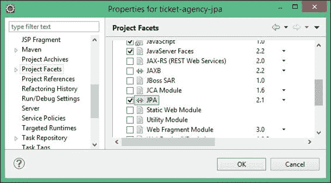
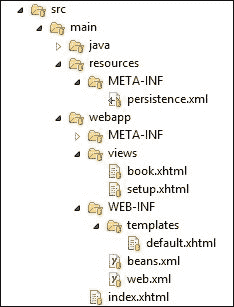

# 第五章：将持久性与 CDI 结合

在前面的章节中，我们讨论了 Java EE，结合了 CDI 等几种技术。然而，到目前为止的示例都是基于一个错误的假设，即所有信息都可以存储在内存中。在本章中，我们将展示如何以标准的关系数据库的形式为我们的应用程序使用持久性数据存储。

**Enterprise JavaBeans**（**EJB**）3.2 规范包含对持久性规范**Java Persistence API**（**JPA**）的引用。它是一个用于创建、删除和查询称为**实体**的 Java 对象的 API，这些实体可以在符合 EJB 3.x 容器的标准和 Java SE 环境中使用。在 Java EE 7 中，它已更新到 2.1 版本。您可以在 JSR 338（[`jcp.org/en/jsr/detail?id=338`](https://jcp.org/en/jsr/detail?id=338)）中查看当前版本的规范。

我们需要提醒您，在本章中，您有很多东西要学习，因此概念将从各个方向向您袭来。然而，在结束时，您将能够确切地欣赏如何创建和部署一个完整的 Java EE 7 应用程序。

具体来说，我们将涵盖以下主题：

+   JPA 的关键特性

+   如何创建实体和数据库模式

+   如何使用 CDI Beans 和 EJBs 操作实体

+   使用 JSF 和 Facelets 技术为我们应用程序提供前端层

# 数据持久性符合标准

基于简单 Java 对象（**POJO**）开发模型的 Enterprise Java Persistence 标准的到来，在 Java EE 平台中填补了一个重要的空白。之前的尝试（EJB 2.x 规范）偏离了目标，并创造了一个不便于开发且对许多应用程序来说过于沉重的 EJB 实体 bean 的刻板印象。因此，它从未在许多行业的许多领域得到广泛采用或普遍认可。

软件开发者知道他们想要什么，但很多人在现有的标准中找不到，所以他们决定另寻他处。他们找到的是轻量级持久性框架，包括商业和开源领域。

与 EJB 2.x 实体 bean 相比，EJB 3.0 的**Java Persistence API**（**JPA**）是一种元数据驱动的 POJO 技术，也就是说，为了将存储在 Java 对象中的数据保存到数据库中，我们的对象不需要实现接口、扩展类或符合框架模式。

JPA 的另一个关键特性是称为**Java Persistence Query Language**（**JPQL**）的查询语言，它提供了一种以可移植的方式定义查询的方法，独立于在企业环境中使用的特定数据库。JPA 查询在语法上类似于 SQL 查询，但操作的是实体对象而不是直接与数据库表交互。

## 使用 JPA 进行操作

受 ORM 框架如 Hibernate 的启发，JPA 使用注解将对象映射到关系数据库。JPA 实体是 POJO，不扩展任何类也不实现任何接口。您甚至不需要映射的 XML 描述符。实际上，JPA API 由注解和一些类和接口组成。例如，我们将 `Company` 类标记为 `@Entity`，如下所示：

```java
import javax.persistence.Entity;
import javax.persistence.Id;

@Entity
public class Company {

    // Some code

    @Id
    private String companyName;

    public Company () {  }

    // Some code

}
```

上一段代码显示了使一个类持久化的最小要求，如下所示：

+   它必须使用 `@javax.persistence.Entity` 注解标识为实体

+   它必须使用 `@javax.persistence.Id` 注解的标识属性

+   它必须在至少受保护的范围内有一个无参数的构造函数

由于通过示例学习效果更好，我们将在下一节中展示如何在 WildFly 中创建和部署一个示例 JPA 应用程序。

# 将持久化添加到我们的应用程序中

为了持久化数据，JPA 需要一个关系数据库；我们将使用在开发者中相当流行的 PostgreSQL 数据库，可以从 [`www.postgresql.org/download/`](http://www.postgresql.org/download/) 免费下载。建议下载 PostgreSQL 9.x 的最新稳定版本，并使用简单的安装向导进行安装。如果您不需要完整的数据库，请记住，稍后我们还将向您展示如何使用 WildFly 提供的内存数据库，这在开发期间可能是一个非常有用的替代方案。

## 设置数据库

我们将创建一个名为 `ticketsystem` 的数据库；然后我们将添加一个名为 `jboss` 的用户，并授予他在模式上的所有权限。

在您的 PostgreSQL 安装目录下的 `bin` 文件夹中打开一个 shell 并运行可执行文件 `psql –U postgres`。一旦使用安装密码登录，执行以下命令：

```java
CREATE DATABASE ticketsystem;
CREATE USER jboss WITH PASSWORD 'jboss';
GRANT ALL PRIVILEGES ON DATABASE ticketsystem TO jboss;

```

我们简单的模式将由两个表组成：包含剧院中所有可用座位列表的 `SEAT` 表，以及用于对座位类型进行分类的 `SEAT_TYPE` 表。这两个表之间是 *1-n* 的关系，`SEAT` 表包含一个外键，与 `SEAT_TYPE` 表的 ID 相关联。然而，我们将让 JPA 根据我们的类层次结构为我们生成模式，我们将在稍后建模。

## 在 WildFly 中安装 JDBC 驱动程序

数据库连接是通过 JDBC 驱动程序在 Java 中实现的，这些驱动程序可以直接在您的应用程序中使用，或者在 JPA 的幕后使用。可以从 [`jdbc.postgresql.org/download.html`](http://jdbc.postgresql.org/download.html) 免费下载 PostgreSQL JDBC 驱动程序。

下载完成后，将 `postgresql-9.X-X.jdbc41.jar` 文件放置在文件系统中的一个方便位置。现在我们将看到如何在 WildFly 中安装 JDBC 驱动程序。

在 JBoss AS 5 和 6 中，您通常在服务器分发的 `common/lib` 文件夹中安装 JDBC 驱动程序。在新的模块化服务器架构（在 JBoss AS 7 中引入）中，您有多个选项来安装您的 JDBC 驱动程序。推荐的方法是将驱动程序作为模块安装。

安装新模块的流程需要在 `JBOSS_HOME/modules` 下创建一个模块路径，并将 `.jar` 库和 `module.xml` 文件（声明模块名称及其依赖项）放置在那里。

在我们的示例中，我们将向我们的文件系统添加以下单元：

+   `JBOSS_HOME/modules/org/postgresql/main/postgresql-9.3-1101.jdbc41.jar`

+   `JBOSS_HOME/modules/org/postgresql/main/module.xml`

首先在您的 WildFly 安装中（`JBOSS_HOME` 变量指向的位置）创建所需的目录，并将下载的 JAR 文件复制到其中。

现在，在主文件夹中添加一个名为 `module.xml` 的文件。此文件包含实际的模块定义；其中最有趣的部分是模块名称（`org.postgresql`），它与数据源中定义的模块属性相对应。

接下来，您需要声明 JDBC 驱动程序资源路径和模块依赖项，如下所示：

```java
<module  name="org.postgresql"> 
  <resources>
    <resource-root path="postgresql-9.3-1101.jdbc41.jar"/>
  </resources>
  <dependencies>
    <module name="javax.api"/>
    <module name="javax.transaction.api"/>
  </dependencies>
</module>
```

我们已经完成了模块的安装。现在我们需要在我们的配置中定义一个数据源，该数据源将使用此模块并在我们的 PostgreSQL 数据库中维护一个连接池。为了做到这一点，您可以编辑 `standalone.xml/domain.xml`，向数据源的子系统添加一个驱动元素（确保将此配置与您配置中现有的任何数据源合并）：

```java
<subsystem >
 <datasources>
  <datasource jta="false" 
      jndi-name="java:jboss/datasources/wflydevelopment" 
      pool-name="wflydevelopment" enabled="true">
          <connection-url>
           jdbc:postgresql://localhost:5432/ticketsystem
          </connection-url>
          <driver-class>org.postgresql.Driver</driver-class>
          <driver>postgresql</driver>
          <security>
               <user-name>jboss</user-name>
               <password>jboss</password>
          </security>
  </datasource>
  <drivers>
         <driver name="postgresql" module="org.postgresql"/>
  </drivers>
 </datasources>
</subsystem>
```

如您所见，新的配置文件从早期的 JBoss AS 配置中借用了相同的 XML 架构定义，因此迁移到新架构应该不会很困难。基本上，您将使用 `connection-url` 字符串和 `driver` 部分的 JDBC 驱动程序类来定义数据库的连接路径。

### 注意

自从 JBoss AS 7.1.0 以来，数据源绑定到 `java:/` 或 `java:jboss/` JNDI 命名空间是强制性的。这将标准化开发人员之间的资源定义，避免奇特的 JNDI 绑定。

### 使用命令行界面创建新的数据源

应用程序服务器提供了多种方法来将数据源添加到您的配置中。我们只提及命令行界面方法，这可能会非常有用，尤其是如果您计划使用脚本文件修改您的配置。

启动 `jboss-cli.sh` 脚本（或 `jboss-cli.bat`）并连接到应用程序服务器，如下所示：

```java
[disconnected /] connect
[standalone@localhost:9990 /]
```

现在，执行以下命令，该命令实际上创建了一个新的数据源，实现了我们通过编辑配置文件所获得的目标：

```java
/subsystem=datasources/data-source=wflydevelopment:add(jndi-name=java:jboss/datasources/wflydevelopment, driver-name=postgresql, connection-url= jdbc:postgresql://localhost:5432/ticketsystem,user-name="jboss",password="jboss")

```

如果一切顺利，CLI 应该会响应一个 `success` 消息。

# 创建 Maven 项目

本章我们将要创建的应用程序只需要我们使用标准的 Java EE 7 API。有了前面章节的知识，你应该能够自己设置本章的项目！只需使用你喜欢的 IDE，创建一个`war`类型的 Maven 项目。记得包括 Java SE 8 的配置，以及`beans.xml`和`faces-config.xml`文件。如果你遇到任何问题，请记住，本书中提供的代码示例包含一个基于此示例的完整项目。

## 添加 Maven 配置

现在你已经设置了 Maven 骨架，我们将包括所需的依赖项，以便 Eclipse 能够在你编码时编译你的类。你将需要的唯一依赖项是`javaee-api`：

```java
    <dependency>
        <groupId>javax</groupId>
        <artifactId>javaee-api</artifactId>
        <version>7.0</version>
        <scope>provided</scope>
    </dependency>
```

## 烹饪实体

现在我们已经完成了配置部分，我们将把我们的实体添加到项目中。有一些很有价值的选项可以自动生成我们的实体，从数据库模式开始。例如，Eclipse 的**文件**菜单包括一个选项**从表生成 JPA 实体**，一旦在数据库中设置了连接，它允许你将你的 DB 模式（或其一部分）反向生成到 Java 实体。

如果你愿意尝试这个选项，请记住，你需要在你的项目中激活**Eclipse JPA**特性，从**项目属性**中，如图所示：



在附录中提到了另一个选项，即*使用 JBoss Forge 进行快速开发*，该附录讨论了 JBoss Forge，这是一个强大的、针对 Java EE 的快速应用程序开发（旨在 Java EE）和项目理解工具。

在本章中，我们将专注于从 Java 类生成 SQL 脚本。无论你的策略是什么，预期的结果都需要符合以下实体。以下是第一个实体，`SeatType`，它映射到`SEAT_TYPE`表：

```java
@Entity [1]
@Table(name="seat_type") [2]
public class SeatType implements Serializable {

    @Id  [3]
    @GeneratedValue(strategy=GenerationType.IDENTITY)
    private Long id;

    private String description;

    private int price;

    private int quantity;

    //bi-directional many-to-one association to Seat
 @OneToMany(mappedBy="seatType", fetch=FetchType.EAGER) [4]
 private List<Seat> seats;

    // Getters and Setters omitted for brevity
}
```

第一个有意义的注解是`@Entity [1]`，它声明了`Entity`类。`@Table [2]`注解用于将 bean 类映射到数据库表。

`@Id`注解，`[3]`，是必须的；它描述了表的主键。与`@Id`一起，还有`@GeneratedValue`注解。这个注解用于声明数据库负责生成值。你可以查看这个类的 Javadoc 来探索其他值生成策略。

继续前进，`@OneToMany`注解`[4]`定义了一个一对一的关联。实际上，`SeatType`类有许多座位。相应的`Seat`引用包含在一个列表集合中。我们定义`mappedBy`属性来设置拥有关系的多边字段。

`fetch`属性定义了每当从数据库加载`seat`类型时，JPA 应该检索座位列表。对于关系的延迟配置会导致在第一次调用该字段时检索列表。

最后，请注意，为了简洁起见，我们没有在此处包含生成的字段获取器和设置器。

让我们来看看`Seat`实体：

```java
@Entity
public class Seat implements Serializable {

    private static final long serialVersionUID = 89897231L;

    @Id
    @GeneratedValue(strategy=GenerationType.IDENTITY)
    private Long id;

    private boolean booked;

    //bi-directional many-to-one association to SeatType
 @ManyToOne [1]
 @JoinColumn(name="seat_id") [2]
    private SeatType seatType;

    // Getters and Setters omitted for brevity

}
```

如您所见，`Seat`实体具有相应的`@ManyToOne [1]`注解，这自然补充了`@OneToMany`关系。`@JoinColumn [2]`通知 JPA 引擎`seatType`字段是通过数据库座位 ID 的外键进行映射的。

## 添加 Bean Validation

**Bean Validation (JSR-303)**是 Java EE 6 平台的一部分提供的验证模型。新的 1.1 版本（**JSR-349**）是 Java EE 7 的一部分。Bean Validation 模型通过在 JavaBeans 组件的字段、方法或类上放置的注解形式的约束得到支持，例如管理 Bean。

在我们的示例中，`SeatType`实体将通过输入表单创建；因此，我们需要验证用户输入的数据。

在我们的示例中，我们将在`SeatType`表单的每个字段上放置`@javax.validation.constraints.NotNull`约束，并在`description`字段上放置一个更复杂的约束，这将设置座位描述的最大长度为`25`（`@javax.validation.constraints.Size`约束）并允许其中仅包含字母和空格（`@javax.validation.constraints.Pattern`约束）：

```java
@Entity
@Table(name="seat_type)
public class SeatType implements Serializable {

    private static final long serialVersionUID = 3643635L;

    @Id
    @GeneratedValue(strategy=GenerationType.IDENTITY)
    private Long id;

 @NotNull
 @Size(min = 1, max = 25, message = "You need to enter a Seat Description (max 25 char)")
 @Pattern(regexp = "[A-Za-z ]*", message = "Description must contain only letters and spaces")
    private String description;

 @NotNull
    private Integer price;

 @NotNull
    private Integer quantity;

 private SeatPosition position;

    // Getters/Setters here
}
```

如您所见，我们还可以在约束条件上放置描述，这可以用于在数据未能通过约束条件时向 JSF 层提供自定义的错误消息。您可以通过 Oracle 文档查看可用的完整约束列表，网址为[`docs.oracle.com/javaee/7/tutorial/doc/bean-validation001.htm#GIRCZ`](http://docs.oracle.com/javaee/7/tutorial/doc/bean-validation001.htm#GIRCZ)。

我们还为我们座位类型添加了座位位置信息。它是一个简单的枚举：

```java
public enum SeatPosition {
    ORCHESTRA("Orchestra", "orchestra"), BOX("Box", "box"), BALCONY("Balcony", "balcony");

    private final String label;
    private final String dbRepresentation;

    private SeatPosition(String label, String dbRepresentation) {
        this.label = label;
        this.dbRepresentation = dbRepresentation;

    }

    public String getDatabaseRepresentation() {
        return dbRepresentation;
    }

    public String getLabel() {
        return label;
    }
}
```

当我们在数据库中保存`SeatType`实体时，我们还将存储与之相关的枚举值。JPA 的早期版本提供了两种自动处理它的选项（除了手动管理它们的状态），`@Enumerated(EnumType.STRING)`和`@Enumerated(EnumType.ORDINAL)`；两者都有其缺陷。第一个对枚举重命名敏感；数据库中的实体将存储枚举的全名（这有时也是存储空间的浪费）。第二个在枚举值的顺序改变时可能会出现问题（因为它存储了枚举值的索引）。从 JPA 2.1 开始，我们可以创建一个转换器，它将自动将我们的枚举属性转换为数据库中的特定条目。我们只需要创建一个实现了`AttributeConverter`接口的注解类：

```java
import javax.persistence.AttributeConverter;
import javax.persistence.Converter;

@Converter(autoApply = true)
public class SeatPositionConverter implements AttributeConverter<SeatPosition, String> {

    @Override
    public String convertToDatabaseColumn(SeatPosition attribute) {
        return attribute.getDatabaseRepresentation();
    }

    @Override
    public SeatPosition convertToEntityAttribute(String dbData) {
        for (SeatPosition seatPosition : SeatPosition.values()) {
            if (dbData.equals(seatPosition.getDatabaseRepresentation())) {
                return seatPosition;
            }
        }
        throw new IllegalArgumentException("Unknown attribute value " + dbData);
    }
}
```

就这些，不需要额外的配置。将`autoApply`属性设置为`true`表示 JPA 将负责处理实体中的所有`SeatPosition`枚举。

# 配置持久化

实体 API 看起来很棒，并且非常直观，但服务器如何知道应该存储/查询实体对象的是哪个数据库？位于您项目`src/main/resources/META-INF`下的`persistence.xml`文件是标准的 JPA 配置文件。通过配置此文件，您可以轻松地从一种持久化提供者切换到另一种，从而也可以从一种应用程序服务器切换到另一种（信不信由你，这向应用程序服务器兼容性迈出了巨大的一步）。

在`persistence.xml`文件中，我们基本上需要指定持久化提供者和底层的数据源。只需在`src/main/resources/persistence.xml`下创建以下文件：

```java
<?xml version="1.0" encoding="UTF-8"?>
<persistence 

             xsi:schemaLocation="http://xmlns.jcp.org/xml/ns/persistence http://xmlns.jcp.org/xml/ns/persistence/persistence_2_1.xsd"
             version="2.1">
 <persistence-unit name="primary">
 <jta-data-source>java:jboss/datasources/ExampleDS</jta-data-source>
        <class>com.packtpub.wflydevelopment.chapter5.entity.Seat</class>
        <class>com.packtpub.wflydevelopment.chapter5.entity.SeatType</class>
        <properties>
 <property name="javax.persistence.schema-generation.database.action" value="drop-and-create"/>
        </properties>
    </persistence-unit>
</persistence>
```

我们在`persistence.xml`中突出了最重要的属性。`name`属性是一个必需的元素，它将被用来从我们的企业 JavaBeans 中引用持久化单元。

在示例代码中，我们使用 WildFly 内置的内存 H2 数据库（[`www.h2database.com/`](http://www.h2database.com/）），默认情况下在`java:jboss/datasources/ExampleDS`处可用（这样就可以在不进行任何设置的情况下运行示例）。然而，您也可以在这里使用配置好的 PostgreSQL 连接，即`java:jboss/datasources/wflydevelopment`，这是我们之前创建的。在 Java EE 7 中，甚至可以省略整个`jta-data-source`标签。现在每个容器都必须为应用程序提供默认数据源。对于 WildFly 来说，将是上述的 H2 数据库。

我们还定义了应被视为实体的类。这是一个可选步骤；如果实体与`persistence.xml`文件在同一存档中，它们将被自动发现。

在之前的 JPA 版本中，几乎每个配置都需要一些提供者特定的属性。在 JPA 2.1 中，添加了一些标准属性，例如展示的`javax.persistence.schema-generation.database.action`。可以使用`drop-and-create`值在每次部署应用程序时创建和删除您的数据库表。如果您希望每次部署应用程序时都从一个干净的数据存储开始，这可能是一个优点。

然而，也可以指示 JPA 为您生成 SQL 脚本，这样您可以手动将它们应用到数据库中。只需将以下条目添加到您的`persistence-unit`标签中：

```java
<property name="javax.persistence.schema-generation-target" value="scripts"/>
<property name="javax.persistence.ddl-create-script-target" value="createSeats.sql"/>
<property name="javax.persistence.ddl-drop-script-target" value="dropSeats.sql"/>
```

如果您不通过指定一个额外的属性来指定位置，那么生成的脚本将被放置在`JBOSS_HOME/bin`目录中，名称与配置中提供的名称相同。名称可以是绝对路径，这样您可以将脚本放置在文件系统的任何位置（当然，如果 WildFly 被允许写入那里的话）。

## 添加生产者类

生产类在早期章节中被引入，作为通过 CDI 为我们应用程序提供一些资源的一种方式。在这个例子中，我们将使用它来生成许多资源，例如 JPA 实体管理器和传递给 JSF 视图的对象列表。因此，我们提供了包含一些通用资源以及`SeatProducer`和`SeatTypeProducer`类的单例的`LoggerProducer`、`FacesContextProducer`和`EntityManagerProducer`类，这些类将用于生成实体集合。

下面是三个基本生产类的内容：

```java
public class LoggerProducer {

    @Produces
    public Logger produceLoger(InjectionPoint injectionPoint) {
        return Logger.getLogger(injectionPoint.getMember().getDeclaringClass().getName());
    }
} 

public class FacesContextProducer {

    @Produces
    @RequestScoped
    public FacesContext produceFacesContext() {
        return FacesContext.getCurrentInstance();
    }
} 

public class EntityManagerProducer {

    @Produces
    @PersistenceContext
    private EntityManager em;
}
```

如您所见，这些类将是以下三种资源的工厂：

+   `EntityManager`：这将解析主持久化单元，因为只定义了一个持久化单元

+   `java.util.Logger`：这将记录服务器控制台上的某些信息

+   `FacesContext`：这将用于在屏幕上输出一些 JSF 消息

### 提示

**生产者与 Java EE 5 @Resource 注入的比较**

如果你之前从未使用过依赖注入框架，你可能会想知道添加一个额外的层来生成一些容器资源有什么好处。一旦你需要更改一些配置元素，例如持久化单元，原因就会变得明显。使用较旧的 Java EE 5 方法，你将被迫在所有使用的地方更改`@Resource`注入的细节；然而，使用生产方法将使资源创建集中化，使更改变得简单。

接下来，我们将添加一些实体生产者；让我们添加`SeatTypeProducer`和`SeatProducer`类：

```java
@javax.enterprise.context.RequestScoped
public class SeatTypeProducer {

    @Inject
    private SeatTypeDao seatTypeDao;

    private List<SeatType> seatTypes;

    @PostConstruct
    public void retrieveAllSeatTypes() {
        seatTypes = seatTypeDao.findAll();
    }

    @Produces
    @Named
    public List<SeatType> getSeatTypes() {
        return seatTypes;
    }

    public void onListChanged(@Observes(notifyObserver = Reception.IF_EXISTS) final SeatType member) {
        retrieveAllSeatTypes();
    }
}
```

如果您已经通过了我们第四章的例子第四章，您在这里将找不到任何新内容；如您所见，该类仅生成一个标记为`@Named`的`seatTypes`集合，以便可以从 JSF EL 中访问。此外，该类包含一个`observer`处理方法（`onListChanged`），当集合中的数据发生变化时，该方法将被触发。

集合数据是通过`SeatTypeDao` CDI Bean 的`retrieveAllSeatTypes`方法（在类构造时首次和唯一加载）填充的。我们将在稍后定义这个 bean；现在，我们将添加这个例子中使用的最后一个生产类，即`SeatProducer` bean：

```java
@javax.enterprise.context.RequestScoped
public class SeatProducer implements Serializable {

    @Inject
    private SeatDao seatDao;

    private List<Seat> seats;

    @PostConstruct
    public void retrieveAllSeats() {
        seats = seatDao.findAllSeats();
    }

    @Produces
    @Named
    public List<Seat> getSeats() {
      return seats;
    }

    public void onMemberListChanged(@Observes(notifyObserver = Reception.IF_EXISTS) final Seat member) {
      retrieveAllSeats();
    }
}
```

前面的 bean 将被用来生成实际可用于预订的`Seat`对象列表。

## 为您的应用程序编写查询代码

如您从前面的代码中看到的，生产类使用了名为`SeatDao`和`SeatTypeDao`的 bean 来填充它们的数据集合。这些 bean 对`Seat`和`SeatType`对象执行一些简单的查找，如下面的代码所示：

```java
@Stateless
public class SeatDao extends AbstractDao<Seat> {

    public SeatDao() {
        super(Seat.class);
    }
}

@Stateless
public class SeatTypeDao extends AbstractDao<SeatType> {

    public SeatTypeDao() {
        super(SeatType.class);
    }
}

@TransactionAttribute(TransactionAttributeType.REQUIRED)
public abstract class AbstractDao<T extends Serializable> implements Serializable {

    private final Class<T> clazz;

    @Inject
    private EntityManager em;

    public AbstractDao(Class<T> clazz) {
        this.clazz = clazz;
    }

    public T find(Object id) {
        return em.find(clazz, id);
    }

    public void persist(final T entity) {
        em.persist(entity);
    }

    public List<T> findAll() {
        final CriteriaQuery<T> criteriaQuery = em.getCriteriaBuilder().createQuery(clazz);
        criteriaQuery.select(criteriaQuery.from(clazz));
        return em.createQuery(criteriaQuery).getResultList();
    }

    public void deleteAll() {
        final CriteriaDelete<T> criteriaDelete = em.getCriteriaBuilder().createCriteriaDelete(clazz);
        criteriaDelete.from(clazz);
        em.createQuery(criteriaDelete).executeUpdate();
    }
}
```

如您所见，`SeatDao`和`SeatTypeDao`这两个 bean 都扩展了通用的`AbstractDao`类。它封装了`EntityManager`，并使用 JPA Criteria API 提供了基本的类型安全 CRUD 操作，例如`findAll`、`persist`等。JPA 允许执行以下三种类型的查询：

+   **原生 SQL**：这些查询使用标准 SQL 语言。在使用此类查询时，你必须记住查询在迁移到不同数据库时可能会不兼容。

+   **Java 持久化查询语言**（**JPQL**）：这些查询可以使用类似于 SQL 的特殊语言形成。在实践中，如果没有良好的 IDE 支持，这种方法通常很难维护，尤其是在重构期间。这些查询也可以在启动时编译，这意味着它们不会被多次解析。最后，它们可以通过缓存机制用于频繁调用的查询，以避免不必要的数据库操作。你可以在`@NamedQuery(name="…", query="…")`注解中定义查询及其名称。

+   **Criteria API**：这些查询可以通过简单地执行 Java 方法和使用适当的对象来形成。自 JPA 2.1 以来，可以通过此 API 执行批量更新和删除。

让我们用一个例子简单比较这三种方法。我们只想获取给定类型的所有对象。使用原生 SQL，这个查询看起来是这样的：

```java
entityManager.createNativeQuery("SELECT * from seat_type").getResultList()
```

如您所见，它使用字符串形式的标准 SQL。现在让我们看看 JPQL：

```java
entityManager.createQuery("select seatType from SeatType seatType").getResultList(); 
```

很容易注意到它与 SQL 的相似性，但略有不同。例如，它使用类名而不是表名。然而，再次强调，它是一个字符串形式的查询。最后一个例子是 Criteria API：

```java
final CriteriaQuery<SeatType> criteriaQuery = 
                em.getCriteriaBuilder().createQuery(SeatType.class);
criteriaQuery.select(criteriaQuery.from(SeatType.class));
em.createQuery(criteriaQuery).getResultList(); 
```

初看起来，它似乎是最复杂的，但它有一些优势，即它不使用任何字符串（通常是易出错的且难以重构）。JPQL 和 Criteria API 在最新版本的 JPA 中都有许多改进，包括使用`on`条件进行连接操作、数据库函数支持和算术子查询。

你可能会问自己，“我应该使用哪一个？”这是一个难题，因为它们都有其优缺点，所以这取决于具体的情况。基本上，Criteria 查询和命名查询通常是安全的赌注。原生 SQL 应该有很好的理由，因为它通常在不同供应商之间不可移植，并且在执行之前不能由 JPA 验证。

## 将服务添加到您的应用程序中

到目前为止，我们通过应用程序屏幕可见的所有信息都是我们编写的。显然，这里缺少的是所有最终转化为插入数据或更新现有数据的业务逻辑。因此，我们现在将添加两个类；第一个位于 `com.packtpub.wflydevelopment.chapter5.control` 包下，第二个位于 `com.packtpub.wflydevelopment.chapter5.controller` 包下。第一个是 `TicketService`，这是一个无状态的 EJB，将被用来执行此应用程序的核心业务逻辑，第二个是我们的 `stateful` EJB 对应的 `BookerService` 类。让我们从无状态的 EJB 开始：

```java
@Stateless
public class TicketService {

    @Inject
    private Logger log;

    @Inject
    private Event<SeatType> seatTypeEventSrc;

    @Inject
    private Event<Seat> seatEventSrc;

    @Inject
    private SeatDao seatDao;

    @Inject
    private SeatTypeDao seatTypeDao;

    public void createSeatType(SeatType seatType) throws Exception {
        log.info("Registering " + seatType.getDescription());
        seatTypeDao.persist(seatType);
        seatTypeEventSrc.fire(seatType);
    }

    public void createTheatre(List<SeatType> seatTypes) {
        for (SeatType type : seatTypes) {
            for (int ii = 0; ii < type.getQuantity(); ii++) {
                final Seat seat = new Seat();
                seat.setBooked(false);
                seat.setSeatType(type);
                seatDao.persist(seat);
            }
        }
    }

    public void bookSeat(long seatId) {
        final Seat seat = seatDao.find(seatId);
        seat.setBooked(true);
        seatDao.persist(seat);
        seatEventSrc.fire(seat);
    }

    public void doCleanUp() {
        seatDao.deleteAll();
        seatTypeDao.deleteAll();
    }
}
```

### 小贴士

**为什么这个组件被编码为 EJB 而不是 CDI Bean？**

使用 EJB 的一大主要优势是它们本质上是事务性组件。然而，在 Java EE 7 中，我们可以使用带有额外 `@Transactional` 注解的 CDI Beans。现在的选择取决于开发者，但 EJB 在某些情况下仍然可能很有用，即使是对于本地调用；例如，我们可以轻松地为它们划分安全权限（我们将在未来的章节中这样做）。

此服务由四个方法组成。第一个是 `createSeatType` 方法，它将在第一个应用程序屏幕中用来向我们的剧院添加一个新的 `SeatType` 对象。下一个方法 `createTheatre` 将在我们完成剧院设置后调用；因此，我们在下一个屏幕中创建可供预订的座位列表。

接下来是列表中的 `bookSeat` 方法，正如你可能猜到的，它将被用来预订座位。最后，`doCleanUp` 方法实际上用于执行清理操作，如果你想要重新启动应用程序的话。

我们拼图中的最后一部分是 `BookerService` 类，它为您的应用程序添加了一个微小的会话层：

```java
@Named
@javax.faces.view.ViewScoped
public class BookerService implements Serializable {

    private static final long serialVersionUID = -4121692677L;

    @Inject
    private Logger logger;

    @Inject
    private TicketService ticketService;

    @Inject
    private FacesContext facesContext;

    private int money;

    @PostConstruct
    public void createCustomer() {
        this.money = 100;
    }

    public void bookSeat(long seatId, int price) {
        logger.info("Booking seat " + seatId);

        if (price > money) {
            final FacesMessage m = new FacesMessage(FacesMessage.SEVERITY_ERROR, "Not enough Money!",
                    "Registration successful");
            facesContext.addMessage(null, m);
            return;
        }

        ticketService.bookSeat(seatId);

        final FacesMessage m = new FacesMessage(FacesMessage.SEVERITY_INFO, "Registered!", "Registration successful");
        facesContext.addMessage(null, m);
        logger.info("Seat booked.");

        money = money - price;
    }

    public int getMoney() {
        return money;
    }
}
```

前面的类使用了视图作用域，我们已经在之前的章节中描述过。

## 添加控制器来驱动用户请求

持久化层和用户视图之间的链接落在 `TheatreSetupService` 实例上，它将驱动对应用程序暴露的实际服务的请求。由于此实例将被绑定到 `RequestScope`，并且我们需要将其暴露给我们的视图（使用 `@Named`），我们可以使用方便的 `@Model` 注解，它是以下两个属性的组合：

```java
@Model
public class TheatreSetupService {

    @Inject
    private FacesContext facesContext;

    @Inject
    private TicketService ticketService;

    @Inject
    private List<SeatType> seatTypes;

 @Produces [1]
 @Named
 private SeatType newSeatType;

    @PostConstruct
    public void initNewSeatType() {
        newSeatType = new SeatType();
    }

    public String createTheatre() {
        ticketService.createTheatre(seatTypes);
        return "book";
    }

    public String restart() {
        ticketService.doCleanUp();
        return "/index";  [4]
    }

    public void addNewSeats() throws Exception {
        try {
            ticketService.createSeatType(newSeatType);

            final FacesMessage m = new FacesMessage(FacesMessage.SEVERITY_INFO, "Done!", "Seats Added");
            facesContext.addMessage(null, m);
            initNewSeatType();
        } catch (Exception e) {
            final String errorMessage = getRootErrorMessage(e);
            FacesMessage m = new FacesMessage(FacesMessage.SEVERITY_ERROR, errorMessage, "Error while saving data");
            facesContext.addMessage(null, m);
        }
    }

    private String getRootErrorMessage(Exception e) {
        // Default to general error message that registration failed.
        String errorMessage = "Registration failed. See server log for more information";
        if (e == null) {
            // This shouldn't happen, but return the default messages
            return errorMessage;
        }

        // Start with the exception and recurse to find the root cause
        Throwable t = e;
        while (t != null) {
            // Get the message from the Throwable class instance
            errorMessage = t.getLocalizedMessage();
            t = t.getCause();
        }
        // This is the root cause message
        return errorMessage;
    }

    public List<SeatPosition> getPositions() {
        return Arrays.asList(SeatPosition.values());
    }

}
```

`TheatreSetupService` 类预计要完成以下任务：

1.  最初，`TheatreSetupService` 类生成一个 `SeatType` 对象 `[1]` 并使用 `@Named` 注解将其暴露给 JSF 视图层。

    ### 小贴士

    这种技术是 CDI 提供的伟大补充，因为它消除了创建一个样板对象 `SeatType` 来从视图传输信息到服务的需要。`SeatType` 对象由控制器生成，将由 JSF 视图填充并由 `TheatreSetupService` 类持久化。

1.  它通过返回主页 `[4]` 来驱动用户在应用程序屏幕之间的导航。

1.  我们已经完成了 Java 类。你现在应该检查确保你的项目结构与以下截图匹配：

## 编写 JSF 视图

现在我们已经完成了中间层，我们只需要在我们的 Web 应用的`views`文件夹中添加几个 JSF 视图。第一个视图，命名为`setup.xhtml`，将设置我们的剧院，第二个视图，命名为`book.xhtml`，将用于预订票务，其中一些代码借鉴了前面的章节。

然而，这次我们希望使我们的应用程序更具图形吸引力。为了保持简单，我们将使用**Bootstrap**，一个非常流行的前端框架，它将很好地与我们的 JSF 视图集成。它严重依赖于 JavaScript 和 CSS，但我们在应用程序中只需要使用基本的 HTML 就能让它启动并运行。将严格的前端框架纳入我们的应用程序将是一个展示如何使用 Java EE 7 与最新 Web 技术的机会。

你可以从[`getbootstrap.com/`](http://getbootstrap.com/)获取 Bootstrap 的最新版本，并将所有文件放置在资源目录中；然而，我们在这里不会这样做。我们将使用 WebJars，它们只是打包客户端 Web 库的 JAR 文件。你可以在[`www.webjars.org/`](http://www.webjars.org/)找到依赖项，添加到你的`pom.xml`文件后，它们将像手动添加静态文件到项目中一样工作。然而，多亏了 WebJars，我们可以让 Maven 控制我们的版本，并且不需要担心外部代码污染我们的代码库。

现在，我们需要 Bootstrap 和 jQuery，所以我们将添加以下依赖项：

```java
<dependency>
    <groupId>org.webjars</groupId>
    <artifactId>bootstrap</artifactId>
    <version>3.2.0</version>
</dependency>
<dependency>
    <groupId>org.webjars</groupId>
    <artifactId>jquery</artifactId>
    <version>1.11.0</version>
</dependency>
```

现在，当我们已经将 Bootstrap 的库放置到位后，我们必须将它们链接到我们的代码中。我们将它们添加到我们的`WEB-INF/templates/default.xhtml`文件中，以及一个简单的导航栏：

```java
<!DOCTYPE html PUBLIC "-//W3C//DTD XHTML 1.0 Strict//EN"
"http://www.w3.org/TR/xhtml1/DTD/xhtml1-strict.dtd">
<html 

      >
<h:head>
    <meta http-equiv="Content-Type" content="text/html; charset=utf-8" />
    <title>#{app.applicationName}</title>
    <meta name="viewport" content="width=device-width, initial-scale=1.0" />
    <meta name="description" content="" />
    <meta name="author" content="" />

    <h:outputStylesheet name="/webjars/bootstrap/3.2.0/css/bootstrap.css " />
    <h:outputStylesheet name="/webjars/bootstrap/3.2.0/css/bootstrap-theme.css " />

    <!-- Le HTML5 shim, for IE6-8 support of HTML5 elements -->
    <!--[if lt IE 9]>
      <script src="img/html5.js"></script>
    <![endif]-->

<style>
    body {
        padding-top: 60px;
    }
    </style>
</h:head>
<h:body>
    <div class="navbar navbar-inverse navbar-fixed-top" role="navigation">
    <div class="container">
    <div class="navbar-header">
        <h:link outcome="/index" class="navbar-brand" value="Ticket Agency" />
    </div>
    <div class="collapse navbar-collapse">
        <ul class="nav navbar-nav">
        <li class="#{view.viewId =='/views/setup.xhtml' ? 'active':''}">
<h:link outcome="/views/setup" value="Theatre setup" /></li>
        <li class="#{view.viewId =='/views/book.xhtml' ? 'active':''}">
<h:link  outcome="/views/book" value="Book tickets" /></li>
        </ul>
    </div>
    </div>
    </div>

    <div class="container">
        <ui:insert name="content">
            [Template content will be inserted here]
        </ui:insert>
        <hr />
        <footer>
        <p class="text-muted">&copy; Company 2014</p>
        </footer>
    </div>
    <h:outputScript name="/webjars/jquery/1.11.0/jquery.js" />
    <h:outputScript name="/webjars/bootstrap/3.2.0/js/bootstrap.js " />
</h:body>
</html>
```

接下来，我们将转向`setup.xhtml`中的内容：

```java
<ui:composition 

                template="/WEB-INF/templates/default.xhtml"
                >
<div class="jumbotron">
    <h1>Theatre Setup</h1>
    <p>Enter the information about Seats</p>
</div>

<div class="row">
<div class="col-md-6">
    <div class="panel panel-default">
        <div class="panel-heading">
            <h3 class="panel-title">Add seats</h3>
        </div>
        <div class="panel-body">
            <h:form id="reg" role="form">
        <div class="form-group has-feedback #{!desc.valid? 'has-error' : ''}">
            <h:outputLabel for="desc" value="Description"
                        styleClass="control-label" />
            <h:inputText id="desc" value="#{newSeatType.description}"
            p:placeholder="Enter a description here" class="form-control"
                        binding="#{desc}" />
            <span class="#{!desc.valid ? 'glyphicon glyphicon-remove form-control-feedback' : ''}" />
            <h:message for="desc" errorClass="control-label has-error" />
        </div>
        <div class="form-group  #{!price.valid and facesContext.validationFailed? 'has-error' : ''}">
<h:outputLabel for="price" value="Price:"
                        styleClass="control-label" />
            <div class="input-group  has-feedback">
            <span class="input-group-addon">$</span>
            <h:inputText id="price" value="#{newSeatType.price}"
            class="form-control" p:placeholder="Enter a price"
                            binding="#{price}" />
            <span class="#{!price.valid ? 'glyphicon glyphicon-remove input-group-feedback input-group-addon' : ''}" />
            </div>
            <h:message for="price" errorClass="control-label has-error" />
        </div>
        <div class="form-group has-feedback #{!quantity.valid and facesContext.validationFailed? 'has-error' : ''}">
            <h:outputLabel for="quantity" value="Number of Seats:"
                    styleClass="control-label" />
            <h:inputText id="quantity" value="#{newSeatType.quantity}"
                class="form-control" p:placeholder="Enter quantity"
                        binding="#{quantity}" />
            <span class="#{!quantity.valid ? 'glyphicon glyphicon-remove form-control-feedback' : ''}" />
            <h:message for="quantity" errorClass="control-label has-error" />
        </div>
        <div class="form-group">
            <h:outputLabel for="position" value="Position:"
                styleClass="control-label" />
            <h:selectOneMenu value="#{newSeatType.position}" id="position"
                class="form-control">
            <f:selectItems value="#{theatreSetupService.positions}"
                var="pos" itemValue="#{pos}" itemLabel="#{pos.label}" />
            </h:selectOneMenu>
        </div>

            <div class="form-group">
<h:commandButton id="Add" action = "#{theatreSetupService. addNewSeats}" value="Add styleClass="btn btn-primary" />
            </div>
            <h:messages styleClass="messages" style="list-style: none; padding:0; margin:0;" errorClass="alert alert-error" infoClass="alert alert-success"
            warnClass="alert alert-warning" globalOnly="true" />
            </h:form>
        </div>
    </div> 
</div>
// some code
</div>
</ui:define>
</ui:composition>
```

如你所见，前面的视图在顶部部分包含一个表单，用于输入新的座位类型。高亮显示的输入文本实际上会将数据传递给`SeatType`对象，该对象将被传输到`TheatreSetupService` CDI Bean，并在用户点击**添加**按钮时最终持久化。

你可能也会注意到标签上有很多`class`属性。这些属性指的是 Bootstrap 定义的 CSS 类；我们使用它们来可视化我们的验证。如果用户在表单输入中放置了一些无效数据，就会给它分配一个合适的 CSS 类（在我们的例子中是 Bootstrap 的`has-error`方法）。然而，这只是一个严格的前端相关添加。JSF 验证消息将随着`h:messages`标签和在本章前面部分定义的 Bean Validation 约束一起显示或隐藏。

一个有趣的补充是，我们使用了 JSF 2.2 的一个特性，它简化了与 HTML5 前端框架的集成，即`pass-through`属性。通过在`p:placeholder`中使用`xmlns:p=http://xmlns.jcp.org/jsf/passthrough`命名空间，我们指示 JSF 忽略一个未知属性并将其直接传递给渲染器。然后，Bootstrap 的内部机制可以解释该属性，并为我们的输入控件提供占位符文本，该文本在控件获得焦点后消失。

`setup.xhtml`文件的下一部分在以下代码中可用：

```java
<div class="col-md-6">
    <div class="panel panel-default">
        <div class="panel-heading">
            <h2 class="panel-title">Seats List</h2>
        </div>
        <div class="panel-body">
            <h:form id="reg2">
                <h:commandButton id="Finish"
                    action="#{theatreSetupService.createTheatre}"
                    value="Finalize the theatre setup"
                    styleClass="btn btn-default  btn-block" />
            </h:form>
        </div>
        <h:panelGroup rendered="#{empty seatTypes}">
            <em>No Seats Added.</em>
        </h:panelGroup>
        <h:dataTable var="seatType" value="#{seatTypes}"
            rendered="#{not empty seatTypes}"
            styleClass="table table-hover table-striped ">
            <h:column>
                <f:facet name="header">Id</f:facet>
                 #{seatType.id}
             </h:column>
            <h:column>
                <f:facet name="header">Name</f:facet>
                 #{seatType.description}
             </h:column>
            <h:column>
                <f:facet name="header">Position</f:facet>
                 #{seatType.position.label}
             </h:column>
            <h:column>
                <f:facet name="header">Price</f:facet>
                 $ #{seatType.price}
             </h:column>
            <h:column>
                <f:facet name="header">Quantity</f:facet>
                 #{seatType.quantity}
             </h:column>
        </h:dataTable>

    </div>
</div>
</div>
</ui:define>
```

每次你为你的剧院添加一个新的座位块时，屏幕下方的`dataTable`方法将被更新。当你完成设置后，点击**完成**按钮，这将调用`TheatreSetupService` CDI Bean 的`finish`方法，创建座位列表。

此操作还将你重定向到下一个视图，名为`book.xhtml`，用于预订座位：

```java
    <ui:define name="content">
    <div class="page-header">
        <h2>TicketBooker Machine</h2>
    </div>

    <h3>Money: $ #{bookerService.money}</h3>

    <h:form id="reg">
        <h:messages styleClass="messages"
            style="list-style: none; padding:0; margin:0;"
            errorClass="alert alert-error" infoClass="alert alert-success"
            warnClass="alert alert-warning" globalOnly="true" />

        <h:commandButton id="restart" action="#{theatreSetupService.restart}"
            value="Restart Application" class="btn btn-default" />

        <h:dataTable var="seat" value="#{seats}"
            rendered="#{not empty seats}"
            styleClass="table table-hover table-striped ">

            <h:column>
                <f:facet name="header">Id</f:facet>
                    #{seat.id}
            </h:column>

            <h:column>
                <f:facet name="header">Description</f:facet>
                    #{seat.seatType.description}
            </h:column>
            <h:column>
                <f:facet name="header">Price</f:facet>
                    #{seat.seatType.price}$
            </h:column>
            <h:column>
                <f:facet name="header">Position</f:facet>
                    #{seat.seatType.position.label}
            </h:column>
            <h:column>
                <f:facet name="header">Booked</f:facet>
                <span class="glyphicon glyphicon-#{seat.booked ? 'ok' :'remove'}"></span>
            </h:column>
            <h:column>
                <f:facet name="header">Action</f:facet>
                <h:commandButton id="book" 
                    action="#{bookerService.bookSeat(seat.id, seat.seatType.price)}" 
                    disabled="#{seat.booked}" class="btn btn-primary"   
                    value="#{seat.booked ? 'Reserved' : 'Book'}" />
            </h:column>
        </h:dataTable>
    </h:form>
</ui:define>
```

这是项目的快照，展开到**webapp**级别（正如你所见，我们还包括了一个基本的`index.html`屏幕和一个`index.xhtml`屏幕，用于将用户重定向到初始屏幕`setup.xhtml`）：



## 运行示例

部署应用程序通常需要使用以下 Maven 目标进行打包：

```java
mvn package
[INFO] Scanning for projects...
[INFO]
[INFO] ---------------------------------------------------------------
[INFO] Building ticket-agency-jpa 1.0 
[INFO] ---------------------------------------------------------------
[INFO] Building war: C:\chapter5\ticket-agency-jpa\target\ticket-agency-jpa.war
. . . . 
[INFO] ---------------------------------------------------------------
[INFO] BUILD SUCCESS
[INFO] ---------------------------------------------------------------
[INFO] Total time: 1.799s
```

最后，假设你已经安装了 WildFly Maven 插件，你可以使用以下命令部署你的应用程序：

```java
mvn wildfly:deploy

```

一旦部署成功完成，请访问`http://localhost:8080/ticket-agency-jpa/`以查看应用程序的欢迎页面，如下面的截图所示：


恭喜！你已经完成了。点击**设置剧院**链接，你可以在`setup.xhtml`页面开始创建地点。请随意尝试输入一些字母到价格框或数字到描述中，如下面的截图所示：


一旦你点击了**完成剧院设置**按钮，你将被重定向到最后一个屏幕，在该屏幕上在`book.xhtml`进行座位预订：


# 摘要

新的 Java 持久化 API 的目标是简化持久化实体的开发。它通过一个简单的基于 POJO 的持久化模型来实现这一目标，该模型减少了所需的类和接口的数量。

在本章中，我们从使用 Eclipse 的 JBoss 工具插件逆向工程数据库模式开始，覆盖了大量的内容。接下来，我们编写了应用程序的一部分层（生产者、服务和控制器），以及 JSF Facelets。

在下一章中，我们将通过介绍使用新简化的 Java EE 7 API 的消息驱动 Bean 的示例来讨论使用**JBoss 消息提供程序**（**HornetQ**）开发应用程序。
