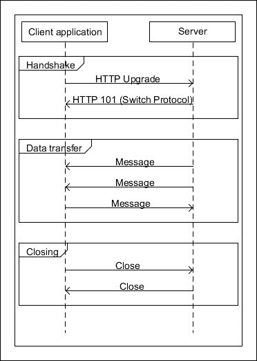
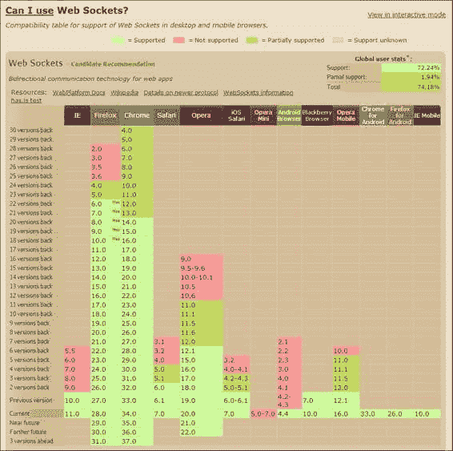
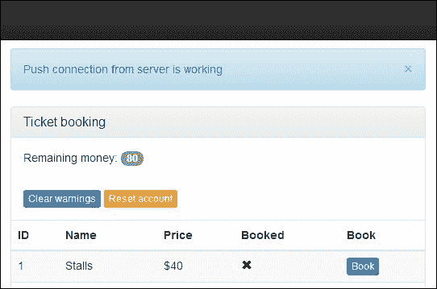
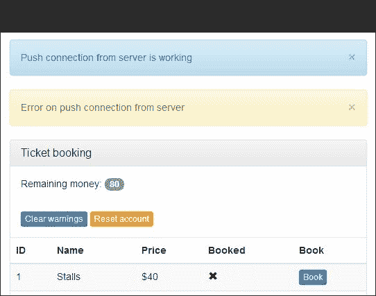
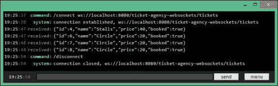

# 第八章。添加 WebSocket

**WebSocket**是 Java EE 7 中最大的新增功能之一。在本章中，我们将探讨它们为开发者提供的新可能性。在我们的票务预订应用程序中，我们已经使用了多种方法来通知客户端服务器端发生的事件。以下是一些方法：

+   JSF 轮询

+   Java 消息服务（JMS）消息

+   REST 请求

+   远程 EJB 请求

除了 JMS 之外，所有这些方法都基于客户端将负责询问服务器应用程序状态的假设。在某些情况下，例如在我们与应用程序交互时检查是否有人预订了票，这是一种浪费的策略；服务器在需要时可以通知客户端。更重要的是，感觉开发者必须修改 HTTP 协议才能从服务器获取通知发送到客户端。这是一个大多数 Web 应用程序都必须实现的要求，因此，值得有一个标准化的解决方案，开发者可以在多个项目中轻松应用，而无需付出太多努力。

WebSockets 正在改变开发者的游戏规则。它们取代了客户端始终通过双向消息系统发起通信的请求-响应范式。在初始连接之后，只要会话保持活跃，双方就可以相互发送独立的消息。这意味着我们可以轻松创建那些会自动使用来自服务器的最新数据刷新其状态的 Web 应用程序。你可能已经在 Google Docs 或新闻网站的现场直播中见过这种行为。现在，我们可以以比 Java 企业版早期版本更简单、更高效的方式实现相同的效果。在本章中，我们将尝试利用 Java EE 7 中随着 WebSocket 带来的这些新、令人兴奋的功能，这得益于 JSR 356 ([`jcp.org/en/jsr/detail?id=356`](https://jcp.org/en/jsr/detail?id=356)) 和 HTML5。

在本章中，你将学习以下主题：

+   WebSocket 是如何工作的

+   如何在 Java EE 7 中创建 WebSocket 端点

+   如何创建一个 HTML5/AngularJS 客户端，该客户端将接受部署在 WildFly 上的应用程序的推送通知

# WebSocket 概述

客户端和服务器之间的 WebSocket 会话建立在标准的 TCP 连接之上。尽管 WebSocket 协议有自己的控制帧（主要用于创建和维持连接），这些控制帧由互联网工程任务组在 RFC 6455 中编码（[`tools.ietf.org/html/rfc6455`](http://tools.ietf.org/html/rfc6455)），但对等方并不强制使用任何特定的格式来交换应用数据。你可以使用纯文本、XML、JSON 或其他任何东西来传输你的数据。你可能还记得，这与基于 SOAP 的 WebServices 大不相同，后者有膨胀的交换协议规范。同样，这也适用于 RESTful 架构；我们不再有 HTTP 预定义的动词方法（GET、PUT、POST 和 DELETE）、状态码以及整个 HTTP 请求的语义。

这种自由意味着与到目前为止我们所使用的相比，WebSocket 相当低级，但正因为如此，通信开销最小。该协议比 SOAP 或 RESTful HTTP 更简洁，这使我们能够实现更高的性能。然而，这也有代价。我们通常喜欢使用高级协议的功能（如水平扩展和丰富的 URL 语义），而使用 WebSocket，我们需要手动编写它们。对于标准的 CRUD-like 操作，使用 REST 端点比从头开始创建一切要容易得多。

与标准 HTTP 通信相比，我们从 WebSocket 获得了什么？首先，两个对等体之间的直接连接。通常，当你连接到 Web 服务器（例如，可以处理 REST 端点）时，每次后续调用都是一个新的 TCP 连接，你的机器每次请求时都被视为一个不同的机器。当然，你可以使用 cookie 模拟有状态的行为（这样服务器将在不同的请求之间识别你的机器），并通过在短时间内为特定客户端重用相同的连接来提高性能，但这基本上是一个解决 HTTP 协议限制的权宜之计。

一旦在服务器和客户端之间建立 WebSocket 连接，你可以在整个通信过程中使用相同的会话（以及底层的 TCP 连接）。双方都清楚这一点，并且可以以全双工方式独立发送数据（双方可以同时发送和接收数据）。使用纯 HTTP，服务器在没有来自其侧的任何请求的情况下，无法自发地向客户端发送数据。更重要的是，服务器知道所有连接的 WebSocket 客户端，甚至可以在它们之间发送数据！

当前解决方案包括尝试使用 HTTP 协议模拟实时数据传输，这会给 Web 服务器带来很大压力。轮询（询问服务器更新）、长轮询（延迟请求完成直到更新准备好）和流（基于 Comet 的解决方案，具有始终打开的 HTTP 响应）都是通过黑客协议来实现它未设计的功能，并且各自都有局限性。由于消除了不必要的检查，WebSocket 可以大幅减少 Web 服务器需要处理的 HTTP 请求数量。由于我们只需要通过网络进行一次往返即可获取所需信息（由服务器立即推送），因此更新以更小的延迟传递给用户。

所有这些特性使 WebSocket 成为 Java EE 平台的一个很好的补充，它填补了完成特定任务所需的空白，例如发送更新、通知和编排多个客户端交互。尽管有这些优势，WebSocket 并不打算取代 REST 或 SOAP Web 服务。它们在水平扩展方面表现不佳（由于它们的状态性，难以分发），并且缺乏大多数在 Web 应用程序中使用的功能。URL 语义、复杂的安全、压缩以及许多其他功能仍然最好使用其他技术来实现。

# WebSockets 是如何工作的

要启动 WebSocket 会话，客户端必须发送一个带有`Upgrade: websocket`头字段的 HTTP 请求。这通知服务器对等客户端已请求服务器切换到 WebSocket 协议。

### 注意

你可能会注意到，在 WildFly 的远程 EJB 中也会发生同样的事情；初始连接是通过 HTTP 请求建立的，后来通过`Upgrade`机制切换到远程协议。标准的`Upgrade`头字段可以用来处理任何协议，除了 HTTP，这是客户端和服务器双方都接受的。在 WildFly 中，这允许你重用 HTTP 端口（`80`/`8080`）用于其他协议，从而最小化需要配置的端口号数量。

如果服务器能够“理解”WebSocket 协议，客户端和服务器随后将进入握手阶段。它们协商协议版本，交换安全密钥，如果一切顺利，对等方可以进入数据传输阶段。从现在开始，通信仅使用 WebSocket 协议进行。使用当前连接无法交换任何 HTTP 帧。整个连接的生命周期可以总结如下图所示：



一个 JavaScript 应用程序向 WildFly 服务器发送的示例 HTTP 请求看起来可能如下所示：

```java
GET /ticket-agency-websockets/tickets HTTP/1.1
Upgrade: websocket
Connection: Upgrade
Host: localhost:8080
Origin: http://localhost:8080Pragma: no-cache
Cache-Control: no-cache
Sec-WebSocket-Key: TrjgyVjzLK4Lt5s8GzlFhA==
Sec-WebSocket-Version: 13
Sec-WebSocket-Extensions: permessage-deflate; client_max_window_bits, x-webkit-deflate-frame
User-Agent: Mozilla/5.0 (Windows NT 6.3; WOW64) AppleWebKit/537.36 (KHTML, like Gecko) Chrome/34.0.1847.116 Safari/537.36
Cookie: [45 bytes were stripped]

```

我们可以看到，客户端在`/ticket-agency-websockets/tickets` URL 上请求一个升级连接，目标协议为 WebSocket。它还传递了请求的版本和密钥信息。

如果服务器支持请求协议并且客户端传递了所有必要的数据，那么它将响应以下帧：

```java
HTTP/1.1 101 Switching Protocols
X-Powered-By: Undertow 1
Server: Wildfly 8
Origin: http://localhost:8080
Upgrade: WebSocket
Sec-WebSocket-Accept: ZEAab1TcSQCmv8RsLHg4RL/TpHw=
Date: Sun, 13 Apr 2014 17:04:00 GMT
Connection: Upgrade
Sec-WebSocket-Location: ws://localhost:8080/ticket-agency-websockets/tickets
Content-Length: 0

```

响应的状态码是`101`（切换协议），我们可以看到服务器现在将开始使用 WebSocket 协议。最初用于 HTTP 请求的 TCP 连接现在是 WebSocket 会话的基础，并可用于传输。如果客户端尝试访问仅由另一个协议处理的 URL，则服务器可以要求客户端进行升级请求。在这种情况下，服务器使用`426`（需要升级）状态码。

### 注意

初始连接创建有一些开销（因为对等体之间交换的 HTTP 帧），但完成后，新消息只有 2 个字节的额外头部。这意味着当我们有大量的小消息时，WebSocket 将比 REST 协议快一个数量级，仅仅是因为传输的数据更少！

如果你在想浏览器的 WebSocket 支持情况，你可以在[`caniuse.com/websockets`](http://caniuse.com/websockets)上查找。目前所有主流浏览器的所有新版本都支持 WebSocket；据估算（在撰写本文时），总覆盖率为 74%。你可以在以下屏幕截图中看到这一点：



在这个理论介绍之后，我们准备好采取行动。我们现在可以创建我们的第一个 WebSocket 端点！

# 创建我们的第一个端点

让我们从简单的例子开始：

```java
package com.packtpub.wflydevelopment.chapter8.boundary;

import javax.websocket.EndpointConfig;
import javax.websocket.OnOpen;
import javax.websocket.Session;
import javax.websocket.server.ServerEndpoint;
import java.io.IOException;

@ServerEndpoint("/hello")
public class HelloEndpoint {

    @OnOpen
    public void open(Session session, EndpointConfig conf) throws IOException {
        session.getBasicRemote().sendText("Hi!");
    }
}
```

Java EE 7 规范考虑了开发者的友好性，这在给定的示例中可以清楚地看到。为了定义你的 WebSocket 端点，你只需要在**普通 Java 对象**（**POJO**）上添加几个注解。第一个注解`@ServerEndpoint("/hello")`定义了端点的路径。现在是讨论端点完整地址的好时机。我们将这个示例放在名为`ticket-agency-websockets`的应用程序中。在部署应用程序时，你可以在 WildFly 日志中找到有关端点创建的信息，如下所示：

```java
02:21:35,182 INFO  [io.undertow.websockets.jsr] (MSC service thread 1-7) UT026003: Adding annotated server endpoint class com.packtpub.wflydevelopment.chapter8.boundary.FirstEndpoint for path /hello
02:21:35,401 INFO  [org.jboss.resteasy.spi.ResteasyDeployment] (MSC service thread 1-7) Deploying javax.ws.rs.core.Application: class com.packtpub.wflydevelopment.chapter8.webservice.JaxRsActivator$Proxy$_$$_WeldClientProxy
02:21:35,437 INFO  [org.wildfly.extension.undertow] (MSC service thread 1-7) JBAS017534: Registered web context: /ticket-agency-websockets

```

端点的完整 URL 是`ws://localhost:8080/ticket-agency-websockets/hello`，这仅仅是服务器和应用程序地址与适当协议上的端点路径的连接。

第二个使用的注解`@OnOpen`定义了客户端连接打开时端点的行为。这不是 WebSocket 端点唯一的行为相关注解。让我们看看以下表格：

| 标注 | 描述 |
| --- | --- |
| `@OnOpen` | 连接已打开。使用这个注解，我们可以使用 `Session` 和 `EndpointConfig` 参数。第一个参数代表与用户的连接，允许进一步的通信。第二个参数提供一些与客户端相关的信息。 |
| `@OnMessage` | 当客户端的消息被接收时，这个注解会被执行。在这样的方法中，你只需要有 `Session` 和例如 `String` 参数，其中 `String` 参数代表接收到的消息。 |
| `@OnError` | 当发生错误时，会有一些不好的时候。使用这个注解，你可以除了标准的 `Session` 之外检索一个 `Throwable` 对象。 |
| `@OnClose` | 当连接关闭时，可以以 `CloseReason` 类型对象的形式获取一些关于此事件的数据。 |

在我们的 `HelloEndpoint` 中还有一条有趣的线。使用 `Session` 对象，我们可以与客户端进行通信。这清楚地表明，在 WebSocket 中，双向通信是很容易实现的。在这个例子中，我们决定通过只发送一条文本消息 *Hi!* (`sendText (String)`) 来同步响应已连接的用户 (`getBasicRemote()`)。当然，也可以异步通信，例如，使用你自己的二进制带宽节省协议发送二进制消息。我们将在下一个示例中展示一些这些过程。

# 扩展我们的客户端应用程序

是时候展示你如何在现实生活中利用 WebSocket 的特性了。在前一章中，第七章，*将 Web 服务添加到您的应用程序中*，我们基于 REST API 和 AngularJS 框架创建了票务预订应用程序。显然，它缺少一个重要的功能：应用程序没有显示有关其他用户票务购买的信息。这是一个完美的 WebSocket 应用场景！

由于我们只是在添加之前应用程序的一个功能，所以我们只描述我们将要引入到其中的更改。

在这个例子中，我们希望能够通知所有当前用户关于其他购买的信息。这意味着我们必须存储有关活动会话的信息。让我们从注册类型对象开始，它将为此目的服务。我们可以使用一个 `Singleton` 会话豆来完成这个任务，如下面的代码所示：

```java
@Singleton
public class SessionRegistry {

    private final Set<Session> sessions = new HashSet<>();

    @Lock(LockType.READ)
    public Set<Session> getAll() {
        return Collections.unmodifiableSet(sessions);
    }

    @Lock(LockType.WRITE)
    public void add(Session session) {
        sessions.add(session);
    }

    @Lock(LockType.WRITE)
    public void remove(Session session) {
        sessions.remove(session);
    }
}
```

我们可以使用标准 Java 库中的 `Collections.synchronizedSet`，但这是一个很好的机会来回忆我们在 第三章 中描述的内容，*介绍 Java EE 7 – EJBs*，关于基于容器的并发。在 `SessionRegistry` 中，我们定义了一些基本方法来添加、获取和删除会话。为了在检索期间保证集合的线程安全，我们返回一个不可修改的视图。

我们定义了注册，现在我们可以转向端点定义。我们需要一个 POJO，它将使用我们新定义的注册，如下所示：

```java
@ServerEndpoint("/tickets")
public class TicketEndpoint {

 @Inject
 private SessionRegistry sessionRegistry;

 @OnOpen
    public void open(Session session, EndpointConfig conf) {
        sessionRegistry.add(session);
    }

 @OnClose
    public void close(Session session, CloseReason reason) {
        sessionRegistry.remove(session);
    }

    public void send(@Observes Seat seat) {
 sessionRegistry.getAll().forEach(session -> session.getAsyncRemote().sendText(toJson(seat)));
    }

    private String toJson(Seat seat) {
 final JsonObject jsonObject = Json.createObjectBuilder()
 .add("id", seat.getId())
 .add("booked", seat.isBooked())
 .build();
        return jsonObject.toString();
    }
}
```

我们的定义端点在`/tickets`地址。我们向端点注入了`SessionRepository`。在`@OnOpen`期间，我们将`Sessions`添加到注册表中，在`@OnClose`期间，我们只需移除它们。消息发送是在 CDI 事件（`@Observers`注解）上执行的，该事件已经在我们的代码中通过`TheatreBox.buyTicket(int)`触发。在我们的`send`方法中，我们从`SessionRepository`检索所有会话，并对每个会话异步发送关于已预订座位的消息。我们并不真的需要所有`Seat`字段的信息来实现这个功能。这就是为什么我们在这里没有使用从上一章了解到的自动 JSON 序列化的原因。相反，我们决定使用一个简约的`JSON`对象，它只提供所需的数据。为此，我们使用了新的 Java API for JSON Processing (JSR-353)。使用类似流畅的 API，我们能够创建一个`JSON`对象并向其中添加两个字段。然后，我们只需将 JSON 转换为字符串，通过文本消息发送。

因为在我们的例子中，我们是在响应 CDI 事件时发送消息，所以在事件处理器中，我们没有对任何会话的现成引用。我们必须使用我们的`sessionRegistry`对象来访问活动会话。然而，如果我们想在例如`@OnMessage`方法中做同样的事情，那么只需执行`session.getOpenSessions()`方法就可以获取所有活动会话。

这些都是在后端执行所需的所有更改。现在，我们必须修改我们的 AngularJS 前端以利用新增的功能。好消息是 JavaScript 已经包含了可以用来执行 WebSocket 通信的类！我们只需要在`seat.js`文件中定义的模块内添加几行代码，如下所示：

```java
var ws = new WebSocket("ws://localhost:8080/ticket-agency-websockets/tickets");
ws.onmessage = function (message) {
    var receivedData = message.data;
    var bookedSeat = JSON.parse(receivedData);

    $scope.$apply(function () {
        for (var i = 0; i < $scope.seats.length; i++) {
            if ($scope.seats[i].id === bookedSeat.id) {
                $scope.seats[i].booked = bookedSeat.booked;
                break;
            }
        }
    });
};
```

代码非常简单。我们只需使用端点的 URL 创建`WebSocket`对象，然后在该对象中定义`onmessage`函数。在函数执行期间，接收到的消息会自动从 JSON 解析为 JavaScript 对象。然后，在`$scope.$apply`中，我们只需遍历我们的座位，如果 ID 匹配，我们更新预订状态。我们必须使用`$scope.$apply`，因为我们正在从 Angular 世界之外（`onmessage`函数）触摸 Angular 对象。对`$scope.seats`进行的修改会自动在网站上可见。有了这个，我们只需在两个浏览器会话中打开我们的票务预订网站，就可以看到当一个用户购买票时，第二个用户几乎立即看到座位状态已更改为*已预订*。

我们可以稍微增强我们的应用程序，以便在 WebSocket 连接真正工作的情况下通知用户。让我们只为这个目的定义`onopen`和`onclose`函数：

```java
ws.onopen = function (event) {
    $scope.$apply(function () {
        $scope.alerts.push({
            type: 'info',
            msg: 'Push connection from server is working'
        });
    });
};
ws.onclose = function (event) {
    $scope.$apply(function () {
        $scope.alerts.push({
            type: 'warning',
            msg: 'Error on push connection from server '
        });
    });
};
```

为了通知用户连接的状态，我们推送不同类型的警报。当然，我们再次从外部触及 Angular 世界，因此我们必须在 `$scope.$apply` 函数上执行所有操作。

运行所描述的代码会导致通知，这在下面的屏幕截图中可见：



然而，如果在打开网站后服务器失败，你可能会得到以下屏幕截图所示的错误：



## 将 POJO 转换为 JSON

在我们当前的示例中，我们手动将 `Seat` 对象转换为 JSON。通常，我们不希望这样做；有许多库会为我们完成转换。其中之一是来自 Google 的 GSON。此外，我们还可以为 WebSocket 端点注册一个 `encoder/decoder` 类，该类将自动执行转换。让我们看看我们如何重构当前的解决方案以使用编码器。

首先，我们必须将 `GSON` 添加到我们的类路径中。所需的 Maven 依赖项如下：

```java
<dependency>
    <groupId>com.google.code.gson</groupId>
    <artifactId>gson</artifactId>
    <version>2.3</version>
</dependency>
```

接下来，我们需要提供一个 `javax.websocket.Encoder.Text` 接口的实现。也有 `javax.websocket.Encoder.Text` 接口的二进制和流式数据版本（对于二进制和文本格式）。对于解码器（`javax.websocket.Decoder`）也有相应的接口层次结构。我们的实现相当简单。如下代码片段所示：

```java
public class JSONEncoder implements Encoder.Text<Object> {

    private Gson gson;

    @Override
    public void init(EndpointConfig config) {
 gson = new Gson(); [1]
    }

    @Override
    public void destroy() {
        // do nothing
    }

    @Override
    public String encode(Object object) throws EncodeException {
 return gson.toJson(object); [2]
    }
}
```

首先，我们在 `init` 方法中创建 GSON 的实例；这个动作将在端点创建时执行。接下来，在每次调用的 `encode` 方法中，我们通过端点发送一个对象。我们使用 JSON 命令从对象创建 JSON。当我们想到这个小程序的可重用性时，这相当简洁。如果你想在 JSON 生成过程中有更多控制，你可以在创建之前使用 `GsonBuilder` 类来配置 `Gson` 对象。我们已经有了编码器。现在，是时候修改我们的端点了：

```java
@ServerEndpoint(value = "/tickets", encoders={JSONEncoder.class})[1]
public class TicketEndpoint {

    @Inject
    private SessionRegistry sessionRegistry;

    @OnOpen
    public void open(Session session, EndpointConfig conf) {
        sessionRegistry.add(session);
    }

    @OnClose
    public void close(Session session, CloseReason reason) {
        sessionRegistry.remove(session);
    }

    public void send(@Observes Seat seat) {
        sessionRegistry.getAll().forEach(session -> session.getAsyncRemote().sendObject(seat)); [2]
    }
}
```

第一个更改是在 `@ServerEndpoint` 注解上进行的。我们必须定义一个支持编码器的列表；我们只需将我们的 `JSONEncoder.class` 包裹在数组中传递。此外，我们必须使用 `value` 属性传递端点名称。

之前，我们使用 `sendText` 方法传递一个包含手动创建的 JSON 的字符串。现在，我们想要发送一个对象，并让编码器处理 JSON 生成；因此，我们将使用 `getAsyncRemote().sendObject()` 方法。就这样。我们的端点已经准备好使用。它将像早期版本一样工作，但现在我们的对象将被完全序列化为 JSON，因此它们将包含每个字段，而不仅仅是 `id` 和 `booked`。

在部署服务器后，你可以使用 Chrome 扩展程序之一连接到 WebSocket 端点，例如，Chrome 商店中的`Dark WebSocket`终端（使用`ws://localhost:8080/ticket-agency-websockets/tickets`地址）。当你使用 Web 应用程序预订票务时，WebSocket 终端应该显示类似于以下截图所示的内容：



当然，除了 JSON 之外，还可以使用其他格式。如果你想获得更好的性能（尤其是在序列化时间和负载大小方面），你可能想尝试二进制序列化器，例如**Kryo** ([`github.com/EsotericSoftware/kryo`](https://github.com/EsotericSoftware/kryo))。它们可能不被 JavaScript 支持，但如果你也想为其他客户端使用 WebSocket，它们可能很有用。**Tyrus** ([`tyrus.java.net/`](https://tyrus.java.net/))是 Java 的 WebSocket 标准的参考实现；你可以在你的独立桌面应用程序中使用它。在这种情况下，除了用于发送消息的编码器之外，你还需要创建一个解码器，它可以自动转换传入的消息。

# WebSocket 的替代方案

本章中我们提供的示例可以使用一个较老、不太知名的技术来实现，该技术名为**服务器发送事件**（**SSE**）。SSE 允许通过 HTTP 从服务器到客户端进行单向通信。它比 WebSocket 简单得多，但内置了对自动重连和事件标识符等事物的支持。WebSocket 确实更强大，但并非传递事件的唯一方式，所以当你需要从服务器端实现一些通知时，记得 SSE。

另一个选择是探索围绕 Comet 技术的机制。有多种实现方式，其中大多数使用不同的传输方法来实现目标。一个全面的比较可以在[`cometdaily.com/maturity.html`](http://cometdaily.com/maturity.html)找到。

# 摘要

在本章中，我们成功介绍了新的低级别通信类型。我们介绍了它是如何工作的，以及与上一章中介绍的 SOAP 和 REST 相比。我们还讨论了新的方法如何改变 Web 应用程序的开发。

我们的票务预订应用程序得到了进一步增强，使用类似推送的通知向用户显示座位的变化状态。当我们考虑到我们能够用它们实现多少时，新的添加在现有项目中只需要很少的代码更改。Java EE 7 中 WebSocket 的流畅集成与 AngularJS 应用程序是 Java EE 平台新版本带来的灵活性的另一个绝佳展示。

在下一章中，你将学习更多关于 WildFly 管理和配置的知识，以便我们可以在接下来的章节中探索 Java EE 7 的更多系统级特性。
