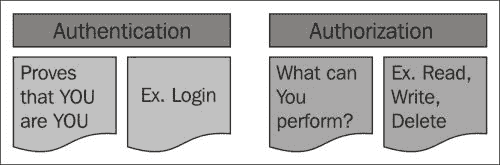
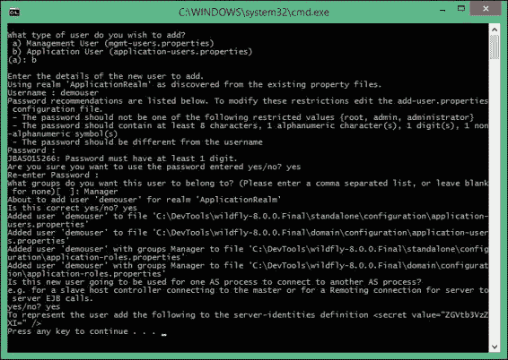
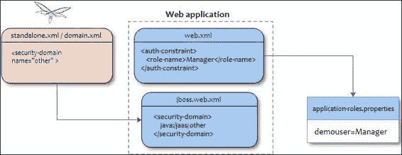
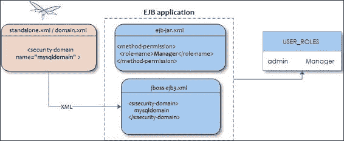
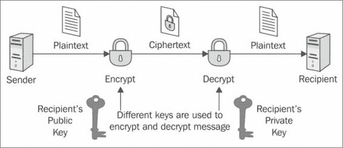
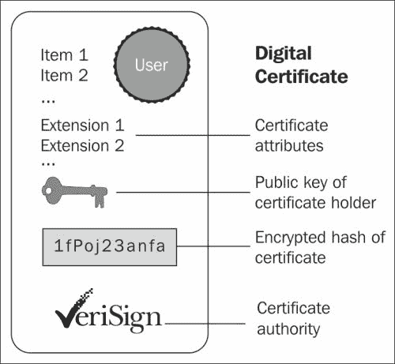
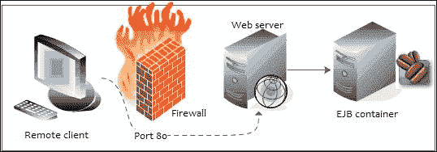
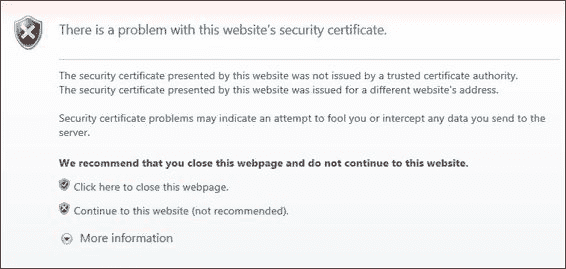

# 第十章。保护 WildFly 应用程序

在上一章中，我们描述了如何管理您的应用服务器。我们旅程的下一个目的地将是学习安全，这是任何企业应用程序的关键元素。您必须能够控制并限制谁被允许访问您的应用程序以及用户可以执行的操作。

Java 企业版规范为 Enterprise JavaBeans 和 Web 组件定义了一个简单的基于角色的安全模型。WildFly 安全的实现由**Picketbox**框架（以前称为 JBoss Security）提供，它是应用服务器的一部分，并为 Java 应用程序提供认证、授权、审计和映射功能。

在本章中，我们将涵盖以下主题列表：

+   Java 安全 API 简介

+   WildFly 安全子系统的基石

+   定义并应用登录模块以保护 Java EE 应用程序

+   使用**安全套接字层**（**SSL**）协议加密流量

# 接近 Java 安全 API

Java EE 安全服务提供了一种强大且易于配置的安全机制，用于认证用户并授权访问应用程序功能和相关数据。为了更好地理解与安全相关的主题，我们首先应该列出一些基本定义：

+   **认证**：这是验证当前执行应用程序的用户身份的过程，无论它是 EJB 还是 servlet（等等）。认证通常通过包含在 Web/独立应用程序中的`Login`模块来完成。Java EE 规范仅提供了所有兼容容器必须满足的一般要求。这意味着每个应用服务器都提供自己的认证机制，这在应用程序的可移植性和配置方面会带来问题。

+   **授权**：这是验证用户是否有权（权限）访问系统资源或调用某些操作的过程。因此，授权假设认证已经发生；如果你不知道用户是谁，就无法授予任何访问控制。Java EE 规范提供了授权用户操作的手段。授权声明通常在不同应用服务器之间是可移植的。认证和授权之间的区别在以下图中展示：

在 Java EE 中，容器负责提供应用程序安全。容器基本上提供两种类型的安全：声明性和程序性。让我们来看看这两种类型：

+   **声明式安全**：通过部署描述符表达应用程序组件的安全需求。因为部署描述符信息包含在外部文件中，所以可以在不修改源代码的情况下进行更改。

    例如，企业 JavaBeans 组件使用 EJB 部署描述符，其名称必须是 `ejb-jar.xml`，并放置在 EJB JAR 文件的 `META-INF` 文件夹中。

    Web 组件使用名为 `web.xml` 的 Web 应用程序部署描述符，位于 `WEB-INF` 目录中。

    ### 小贴士

    自 Java EE 5 发布以来，你可以通过注解的方式应用声明式安全，就像我们对其他关键 API（EJB、Web 服务等）所做的那样。注解在类文件中指定，当应用程序部署时，应用程序服务器会内部转换这些信息。

+   **程序性安全**：嵌入在应用程序中，用于做出安全决策。当仅使用声明式安全不足以表达应用程序的安全模型时，可以使用它。Java EE 安全 API 允许开发者使用以下调用测试当前用户是否有权访问特定角色：

    +   `isUserInRole()` 用于 servlets 和 JSPs（在 `javax.servlet.http.HttpServletRequest` 中采用）

    +   `isCallerInRole()` 用于 EJBs（在 `javax.ejb.SessionContext` 中采用）

    此外，还有其他 API 调用可以提供对用户身份的访问，如下所示：

    +   `getUserPrincipal()` 用于 servlets 和 JSPs（在 `javax.servlet.http.HttpServletRequest` 中采用）

    +   `getCallerPrincipal()` 用于 EJBs（在 `javax.ejb.SessionContext` 中采用）

    使用这些 API，你可以开发任意复杂的授权模型。

## WildFly 安全子系统

WildFly 安全性作为应用程序服务器的扩展，默认情况下包含在独立服务器和域服务器中，以下代码所示：

```java
<extension module="org.jboss.as.security"/>
```

WildFly 使用两个术语定义安全策略：安全领域和安全域。安全领域是映射到外部连接器的配置集（例如，EJB 远程和管理接口）。它们允许每种连接类型都有其适当的身份验证和授权属性定义。例如，管理和应用程序领域定义了两个单独的文件，存储允许的用户名。此外，应用程序领域包含一个指向定义用户角色的文件的引用。

然后将安全域中定义的配置传递给已部署应用程序请求的安全域。安全域定义了一组负责检查用户凭据并创建代表客户端的安全主体（以及请求者的角色集）的登录模块。

以下是从服务器配置文件中提取的默认安全子系统，其中包含将在下一节中用于保护 Ticket 示例应用程序的`RealmDirect`登录：

```java
<subsystem >
    <security-domains>
        <security-domain name="other" cache-type="default">
            <authentication>
                <login-module code="Remoting" flag="optional">
                    <module-option name="password-stacking" value="useFirstPass"/>
                </login-module>
 <login-module code="RealmDirect" flag="required">
 <module-option name="password-stacking" value="useFirstPass"/>
 </login-module>
            </authentication>
        </security-domain>
        <security-domain name="jboss-web-policy" cache-type="default">
            <authorization>
                <policy-module code="Delegating" flag="required"/>
            </authorization>
        </security-domain>
        <security-domain name="jboss-ejb-policy" cache-type="default">
            <authorization>
                <policy-module code="Delegating" flag="required"/>
            </authorization>
        </security-domain>
    </security-domains>
</subsystem>
```

使用以下代码在安全域中定义配置文件：

```java
<security-realm name="ApplicationRealm">
    <authentication>
        <local default-user="$local" allowed-users="*"/>
            <properties path="application-users.properties" relative-to="jboss.server.config.dir"/>
     </authentication>
    <authorization>
        <properties path="application-roles.properties" relative-to="jboss.server.config.dir"/>
   </authorization>
</security-realm>
```

如您所见，配置相当简短，因为它在很大程度上依赖于默认值，特别是对于像安全管理区域这样的高级结构。通过定义自己的安全管理选项，例如，您可以覆盖默认的认证/授权管理器，使用您的实现。由于您可能不需要覆盖这些接口，我们将更关注`security-domain`元素，这是 WildFly 安全的核心方面。

安全域可以被视为外国人的海关办公室。在请求越过 WildFly 边界之前，安全域会执行所有必要的身份验证和授权检查，并最终通知他/她是否可以继续。

安全域通常在服务器启动时配置，并随后绑定到`java:/jaas/`键下的 JNDI 树中。在安全域内，您可以配置登录认证模块，以便您可以简单地通过更改其`login-module`元素来轻松更改您的认证提供者。

默认情况下，提供了几个登录模块的实现；显然，这里没有足够的空间来详细描述每个模块的功能，尽管我们将提供一些流行选项的全面描述，例如：

+   `RealmDirect`登录模块，可用于基于基本文件的身份验证

+   `Database`登录模块，该模块将用户凭据与关系数据库进行核对

### 注意

如果您需要有关登录模块的更多信息，请查看 WildFly 文档：

+   [`docs.jboss.org/author/display/WFLY8/Security+subsystem+configuration`](https://docs.jboss.org/author/display/WFLY8/Security+subsystem+configuration)

+   [`docs.jboss.org/author/display/WFLY8/Security+Realms`](https://docs.jboss.org/author/display/WFLY8/Security+Realms)

## 设置您的第一个登录模块

在以下部分，我们将演示如何使用之前介绍的`RealmDirect`安全域来保护应用程序。`RealmDirect`登录模块基于以下两个文件：

+   `application-users.properties`：此文件包含用户名和密码列表

+   `application-roles.properties`：此文件包含用户与其角色之间的映射

这些文件位于应用程序服务器配置文件夹中，每次您通过`add-user.sh/add-user.cmd`脚本添加新用户时，它们都会被更新。为了我们的目的，我们将创建一个名为`demouser`的新应用程序用户，该用户属于`Manager`角色，如下面的截图所示：



用户添加后，`application-users.properties` 文件将包含用户名和密码的 MD5 编码，如下所示：

```java
demouser=9e21f32c593ef5248e7d6b2aab28717b
```

相反，`application-roles.properties` 文件将包含登录后授予 `demouser` 用户名的角色：

```java
demouser=Manager
```

## 在 Ticket 网络应用程序中使用登录模块

我们现在可以在 第四章 中描述的 Ticket 网络应用程序中应用 `RoleDirect` 登录模块，*学习上下文和依赖注入*（如果你喜欢，也可以从其他章节选择版本）。我们首先将展示如何提供基本的 Web 身份验证，然后我们将展示一个使用基于表单的身份验证的稍微复杂一些的例子。

### 注意

BASIC 访问身份验证是在通过浏览器进行请求时提供用户名和密码的最简单方式。

它通过发送包含用户凭据的编码字符串来工作。这个 Base64 编码的字符串被传输并解码，结果是冒号分隔的用户名和密码字符串。当涉及到安全性时，基本身份验证通常不是最佳解决方案。密码可能在传输过程中被盗，因此 SSL 是必须的，以保护它。

启用 Web 身份验证需要在 Web 应用程序配置文件（`web.xml`）中定义 `security-constraints` 元素，如下面的代码片段所示：

```java
<web-app 

         xsi:schemaLocation="http://xmlns.jcp.org/xml/ns/javaee http://xmlns.jcp.org/xml/ns/javaee/web-app_3_1.xsd"
         version="3.1">
. . . . . .

    <security-constraint>
        <web-resource-collection>
            <web-resource-name>HtmlAuth</web-resource-name>
            <description>application security constraints
            </description>
            <url-pattern>/*</url-pattern>
            <http-method>GET</http-method>
            <http-method>POST</http-method>
        </web-resource-collection>
        <auth-constraint>
            <role-name>Manager</role-name>
        </auth-constraint>
    </security-constraint>
    <login-config>
        <auth-method>BASIC</auth-method>
    </login-config>

    <security-role>
        <role-name>Manager</role-name>
    </security-role>
</web-app>
```

此配置将在 Web 应用程序中的任何 JSP/servlet 上添加一个安全约束，将限制对具有 `Manager` 角色的已验证用户的访问。前面部分中显示的所有登录模块都定义了此角色，因此你可以使用最适合你需求的登录模块。

从 Java EE 7 开始，有另外两种方法来表示你的安全约束。首先，你可以使用一个新的容器提供的角色：`**`。这表示你正在引用任何已认证的用户，不考虑其角色。

第二个是 `deny-http-uncovered-methods` 标签，可以在 `web.xml` 文件中使用，以禁止访问未由单独安全约束覆盖的任何 HTTP 方法。

下一个配置调整需要在 JBoss 网络部署的描述符 `WEB-INF/jboss-web.xml` 上执行。你需要在这里声明安全域，它将被用来验证用户。由于我们使用的是 `RealmDirect`，它是其他内置登录模块的一部分，因此我们需要包含 `java:/jaas/other` 上下文信息：

```java
<jboss-web> 
 <security-domain>java:/jaas/other</security-domain>
</jboss-web>
```

下面的图示说明了应用于 `Database` 登录模块的整个配置序列：



一旦部署了你的应用程序，结果应该是一个阻塞的弹出窗口，要求用户进行身份验证。在不同的浏览器上，窗口的外观可能会有所不同，其外观无法更改。

使用 `demouser` 用户名和有效的密码登录将授予 `Manager` 角色的应用程序访问权限。

## 切换到基于 FORM 的安全

基于 FORM 的身份验证允许开发者自定义身份验证用户界面，例如，适应贵公司的标准。在您的应用程序中配置它需要您基本上只修改 `web.xml` 文件安全部分的 `login-config` 段。在其中，我们将定义一个登录着陆页（`login.xhtml`）和一个错误页（`error.xhtml`），以防登录失败。相应的代码片段如下：

```java
<login-config>
    <auth-method>FORM</auth-method>
    <form-login-config>
      <form-login-page>/faces/login.xhtml</form-login-page>
      <form-error-page>/faces/error.xhtml</form-error-page>
    </form-login-config>
</login-config>
```

登录表单必须包含用于输入用户名和密码的字段。这些字段分别命名为 `j_username` 和 `j_password`。认证表单应将这些值提交到 `j_security_check` 逻辑名称。所有以 `j_` 开头的名称都由 Java Servlet 规范标准化——我们只需遵循约定，以便让自动机制工作。以下是一个简单的 `login.xhtml` 页面，可以用来将所需值传递给安全系统：

```java
<?xml version='1.0' encoding='UTF-8' ?>
<!DOCTYPE html PUBLIC "-//W3C//DTD XHTML 1.0 Transitional//EN"
        "http://www.w3.org/TR/xhtml1/DTD/xhtml1-transitional.dtd">
<html 
      >
<head>
    <title>FORM based Login</title>
</head>
<body>
<form method="post" action="j_security_check" name="loginForm">
    <h:panelGrid columns="2">
        <h:outputLabel id="userNameLabel" for="j_username" value="Username:"/>
        <h:inputText id="j_username" autocomplete="off"/>
        <h:outputLabel id="passwordLabel" for="j_password" value="Password:"/>
        <h:inputSecret id="j_password" autocomplete="off"/>

        <div/>
        <h:panelGroup>
            <h:commandButton type="submit" value="Login"/>
            <h:commandButton type="reset" value="Clear"/>
        </h:panelGroup>
    </h:panelGrid>
</form>
</body>
</html>
```

为了简洁起见，我们不会包括错误页，它将简单地提醒用户输入了错误的用户名和密码组合。预期的结果是以下登录屏幕，它将拦截所有用户对您的应用程序的访问，如果 `username` 和 `password` 凭据正确，则授予对默认主页的访问权限。

## 创建数据库登录模块

`UserRoles` 登录模块是学习如何组合所有用于保护 Web 应用程序所需的组件的好起点。在实际情况下，有更好的替代方案来保护您的应用程序，例如 `Database` 登录模块。数据库安全域遵循之前示例中公开的逻辑；它只是在数据库中存储凭据。为了运行此示例，我们将参考在 第五章 中定义的数据源，*将持久性与 CDI 结合*（绑定在 JNDI 名称 `java:jboss/datasources/wflydevelopment`），需要在应用程序服务器上部署： 

```java
<security-domain name="dbdomain" cache-type="default">
    <authentication>
        <login-module code="Database" flag="required">
            <module-option name="dsJndiName" value=" java:jboss/datasources/wflydevelopment"/>
            <module-option name="principalsQuery" value="select passwd from USERS where login=?"/>
            <module-option name="rolesQuery" value="select role 'Roles' from USER_ROLES where login=?"/>
        </login-module>
    </authentication>
</security-domain>
```

为了使此配置生效，您必须首先创建所需的表，并使用以下查询在表中插入一些示例数据：

```java
CREATE TABLE USERS(login VARCHAR(64) PRIMARY KEY, passwd VACHAR(64));
CREATE TABLE USER_ROLES(login VARCHAR(64), role VARCHAR(32));
INSERT into USERS values('admin', 'admin');
INSERT into USER_ROLES values('admin', 'Manager');
```

如您所见，`admin` 用户将再次映射到 `Manager` 角色。此配置的一个注意事项是它使用数据库中的明文密码；因此，在将此模块投入生产之前，您应该考虑在登录模块中添加额外的安全性。让我们在下一节中看看如何做。

### 加密密码

将密码以明文字符串的形式存储在数据库中不被认为是良好的做法；事实上，数据库甚至比常规文件系统有更多的潜在安全漏洞。例如，想象一下，如果数据库管理员为某些表添加了一个公共同义词，忘记了其中一张表包含了敏感信息，如应用程序密码，如下面的截图所示！您随后需要确保没有任何潜在的攻击者能够执行以下查询。


幸运的是，保护应用程序密码相对简单；您可以在登录模块中添加一些额外的选项，指定存储的密码使用消息摘要算法进行加密。例如，在`Database`登录模块中，您应该在底部添加以下突出显示的选项：

```java
<login-module code="Database" flag="required">
     <module-option name="dsJndiName" value="java:jboss/datasources/wflydevelopment"/>
     <module-option name="principalsQuery" value="select passwd from USERS where login=?"/>
     <module-option name="rolesQuery" value="select role, 'Roles' from USER_ROLES where login=?"/>
 <module-option name="hashAlgorithm" value="SHA-256"/>
 <module-option name="hashEncoding" value="BASE64"/>
</login-module>
```

在这里，我们指定密码将与 SHA 哈希算法进行散列；或者，您可以使用 JCA 提供程序允许的任何其他算法。

### 注意

对于对哈希算法的优秀介绍，请参阅[`www.unixwiz.net/techtips/iguide-crypto-hashes.html`](http://www.unixwiz.net/techtips/iguide-crypto-hashes.html)。

为了完整性，我们包括以下小应用程序，它生成要插入到`Database`中的 Base64 散列密码：

```java
public class Hash {

    public static void main(String[] args) throws Exception{
       String password = args[0];
       MessageDigest md = MessageDigest.getInstance("SHA-256");
       byte[] passwordBytes = password.getBytes();
       byte[] hash = md.digest(passwordBytes);
 String passwordHash = 
            Base64.getEncoder().encodeToString(hash);

       System.out.println("password hash: "+passwordHash);
}
```

使用`admin`作为参数运行主程序将生成哈希`jGl25bVBBBW96Qi9Te4V37Fnqchz/Eu4qB9vKrRIqRg=`。这个哈希将是您的更新后的密码，您需要将其更新到您的数据库中，如下面的截图所示。使用以下代码更新密码：

```java
UPDATE USERS SET PASSWD =  'jGl25bVBBBW96Qi9Te4V37Fnqchz/Eu4qB9vKrRIqRg=' WHERE LOGIN = 'admin';
```

您可以使用您选择的任何 SQL 客户端来更新它。


### 在您的应用程序中使用 Database 登录模块

完成登录模块配置后，不要忘记通过 JBoss web 部署的描述符`WEB-INF/jboss-web.xml`引用它：

```java
<jboss-web> 
 <security-domain>java:/jaas/dbdomain</security-domain>
</jboss-web>
```

## 保护 EJBs

```java
TheatreBooker SFSB, which we discussed in Chapter 4, *Learning Context and Dependency Injection*:
```

```java
@RolesAllowed("Manager")
@SecurityDomain("dbdomain")
@Stateful
@Remote(TheatreBooker.class) 
public class TheatreBooker implements TheatreBooker {

}
```

### 注意

请注意！有多个`SecurityDomain` API 可用。您必须包含`org.jboss.ejb3.annotation.SecurityDomain`。另一方面，`@RolesAllowed`注解需要导入`javax.annotation.security.RolesAllowed`。

JBoss 特定的注解可以在以下 maven 依赖项中找到：

```java
<groupId>org.jboss.ejb3</groupId>
<artifactId>jboss-ejb3-ext-api</artifactId>
<version>2.0.0</version>
<scope>provided</scope>
```

注解也可以应用于方法级别；例如，如果我们只想保护`TheatreBookerBean`类的`bookSeat`对象，我们将如下标记`bookSeat`方法：

```java
@RolesAllowed("Manager")
@SecurityDomain("dbdomain")
public String bookSeat(int seatId) throws SeatBookedException {

}
```

如果您不想使用注解来建立安全角色怎么办？例如，如果您有一个被所有 EJB 应用程序跨域使用的安全角色，可能使用普通的旧 XML 配置而不是给所有 EJB 添加注解会更简单。在这种情况下，您必须在通用的`META-INF/ejb-jar.xml`文件中首先声明安全约束，如下所示：

```java
<ejb-jar  
  version="3.2"
  xsi:schemaLocation="http://java.sun.com/xml/ns/javaee http://java.sun.com/xml/ns/javaee/ejb-jar_3_2.xsd">
  <assembly-descriptor>
    <method-permission>
      <role-name>Manager</role-name>
      <method>
        <ejb-name>*</ejb-name>
        <method-name>*</method-name>
      </method>
    </method-permission>
  </assembly-descriptor>
</ejb-jar>
```

然后，在`META-INF/jboss-ejb3.xml`配置文件中，只需添加对您的安全域的引用：

```java
<?xml version="1.0" encoding="UTF-8"?>
<jboss:ejb-jar 

   version="3.1" impl-version="2.0">
  <assembly-descriptor>
    <s:security>
      <ejb-name>*</ejb-name>
      <s:security-domain>dbdomain</s:security-domain>
    </s:security>
  </assembly-descriptor>
</jboss:ejb-jar>
```

下面是一个展示 EJB 文件角色配置的快照：



### 注意

如果您想通过 EJB 远程使用登录模块，您必须使用以下代码中的 JAAS 条目相应地配置您的安全领域：

```java
<security-realm name="ApplicationRealm">
  <authentication>
   <jaas name="dbdomain"/>
  </authentication>
</security-realm>
```

此外，您应该在 `jbossyourjboss-ejb-client-properties` 中放置以下条目：

```java
remote.connection.default.username=admin
remote.connection.default.password=admin
remote.connectionprovider.create.options.org.xnio.Options.SSL_ENABLED=false
remote.connection.default.connect.options.org.xnio.Options.SASL_POLICY_NOPLAINTEXT=false
remote.connection.default.connect.options.org.xnio.Options.SASL_POLICY_NOANONYMOUS=true
```

这些条目将确保（除了传递凭证之外），传输的密码不会被远程机制额外散列。

### 保护网络服务

根据我们是否处理基于 POJO 的网络服务或基于 EJB 的网络服务，基本可以通过两种方式执行 Web 服务授权。安全更改与我们对 servlets/JSP 介绍的安全更改相同，一致地定义 `web.xml` 中的 `security-constraints` 元素和 `jboss-web.xml` 中的登录模块。

如果您使用 Web 客户端来访问您的网络服务，这将是您需要的一切以进行认证。如果您使用的是独立客户端，您需要在 JAX-WS 工厂中指定凭证。以下是如何访问在 第七章 中描述的受保护 `CalculatePowerService` 实例的示例，该实例在 *将 Web 服务添加到您的应用程序* 中进行了描述：

```java
JaxWsProxyFactoryBean factory = new JaxWsProxyFactoryBean();

factory.getInInterceptors().add(new LoggingInInterceptor());
factory.getOutInterceptors().add(new LoggingOutInterceptor());

factory.setServiceClass(CalculatePowerWebService.class);
factory.setAddress("http://localhost:8080/pojoService");
factory.setUsername("admin");
factory.setPassword("admin");
CalculatePowerWebService client = (CalculatePowerWebService) factory.create();
```

那么基于 EJB 的网络服务呢？配置略有不同；由于在 Web 描述符中没有指定安全域，我们必须通过注解来提供它：

```java
@Stateless
@WebService(targetNamespace = "http://www.packtpub.com/", serviceName = "TicketWebService") 
@WebContext(authMethod = "BASIC",
 secureWSDLAccess = false)
@SecurityDomain(value = "dbdomain")
@RolesAllowed("Manager")
public class TicketSOAPService implements TicketSOAPServiceItf, Serializable {

   . . . . 
}
```

正如你所见，`@org.jboss.ws.api.annotation.Webcontext` 注解基本上反映了与基于 POJO 的网络服务相同的配置选项，包括基本身份验证和无限制的 WSDL 访问。

### 注意

`@WebContext` 注解可以在以下依赖项中找到：

```java
    <dependency>
      <groupId>org.jboss.ws</groupId>
      <artifactId>jbossws-api</artifactId>
      <version>1.0.2.Final</version>
      <scope>provided</scope>
    </dependency>
```

`@org.jboss.ejb3.annotation.SecurityDomain` 注解应该对你来说很熟悉，因为我们曾用它来演示如何保护 EJB。正如你所见，它是 `jboss-web.xml` 文件中包含信息的替代品，除了安全域是直接通过 `dbdomain`（而不是 `java:/jaas/dbdomain`）引用的。

### 注意

如果您更喜欢使用标准配置文件，之前的网络安全配置也可以通过 `META-INF/ejb-jar.xml` 和 `META-INF/jboss-ejb3.xml` 文件来指定。

要将您的登录凭证传递给网络服务，您可以使用 `RequestContext` 对象：

```java
final TicketWebService infoService = service.getPort(TicketWebService.class);
Map<String, Object> requestContext = ((BindingProvider) infoService).getRequestContext();
requestContext.put(BindingProvider.USERNAME_PROPERTY, "admin");
requestContext.put(BindingProvider.PASSWORD_PROPERTY, "admin");
```

用户名和密码值将被传递到安全域中定义的登录模块，就像在其他任何认证方法中一样。

# 保护传输层

如果你仅凭至今所学的基础概念来创建一个关键任务应用，你将面临各种安全威胁。例如，如果你需要设计一个支付网关，其中信用卡信息通过 EJB 或 servlet 传输，仅使用授权和认证栈是远远不够的，因为敏感信息仍然通过网络传输，可能被黑客泄露。

为了防止关键信息被未经授权的个人或系统泄露，你必须使用一种提供信息加密的协议。加密是将数据转换成未经授权的人无法理解的形式的过程。相反，解密是将加密数据转换回原始形式以便理解的过程。

用于保护通信的协议是 SSL 和 TLS，后者被认为是较老 SSL 的替代品。

### 提示

这两种协议之间的差异很小，且非常技术性。简而言之，TLS 使用更强的加密算法，并且能够在不同的端口上工作。在本章的其余部分，我们将对这两种协议都使用 SSL。有关更多信息，请查看维基百科：[`en.wikipedia.org/wiki/Transport_Layer_Security`](http://en.wikipedia.org/wiki/Transport_Layer_Security)。

加密信息有两种基本技术：对称加密（也称为密钥加密）和非对称加密（也称为公钥加密）。

对称加密是最古老且最广为人知的技巧。它基于一个密钥，该密钥应用于消息文本以改变内容。只要发送者和接收者都知道这个密钥，他们就可以加密和解密使用此密钥的所有消息。这些加密算法通常运行速度快，非常适合一次性加密大量消息。

对称算法的一个显著问题是需要安全的行政组织来向用户分发密钥。这通常会导致行政方面的开销增加，同时密钥仍然容易受到未经授权的泄露和潜在滥用的威胁。

因此，关键任务的企业系统通常依赖于非对称加密算法，这些算法通常更容易部署、管理和使用，最终也更加安全。

非对称密码学，也称为**公钥密码学**，基于这样一个概念：用于加密的密钥与用于解密消息的密钥不同。在实践中，每个用户都持有几对密钥：分发给其他方的公钥和作为秘密保留的私钥。每条消息都使用接收者的公钥进行加密，并且只能用接收者的私钥（如以下图所示）进行解密：



使用非对称加密，你可以确信你的消息不会被泄露给第三方。然而，仍然存在一个漏洞。

假设你想与一个商业伙伴交换一些有价值的信息，为此你通过电话或电子邮件请求他的公钥。一个欺诈用户拦截了你的电子邮件或简单地监听你的对话，并迅速发送给你一封带有他公钥的伪造邮件。现在，即使你的数据传输是加密的，它也会被错误地发送给错误的人！

为了解决这个问题，我们需要一份文件来验证公钥属于特定的个人。这份文件被称为**数字证书**或公钥证书。数字证书由一个格式化的数据块组成，其中包含证书持有者的名称（可能是用户名或系统名）和持有者的公钥，以及**认证机构**（**CA**）的数字签名以进行认证。CA 证实发送者的名称与文件中公钥关联。



公钥证书通常用于确保与网站的交互安全。默认情况下，网络浏览器附带一组预定义的 CA；它们用于验证当你输入一个安全网站时，提供给浏览器的公钥证书确实是由网站所有者签发的。简而言之，如果你将浏览器连接到`https://www.abc.com`，并且你的浏览器没有给出任何证书警告，你可以安全地与负责该网站的实体进行交互，除非该网站或你的浏览器已被黑客攻击。然而，这又是另一个故事。

### 注意

**简单认证和客户端认证**

在前面的例子中，我们描述了一个简单的认证（也称为服务器认证）。在这个场景中，唯一需要证明其身份的方是服务器。

然而，SSL 能够执行相互认证（也称为客户端或双向认证）；在这里，服务器在网络 SSL 握手期间也会请求客户端证书。

客户端认证需要从 CA 获取的 x.509 格式的客户端证书。x.509 格式是 SSL 证书的行业标准格式。在下一节中，我们将探讨哪些工具可用于生成数字证书，以及如何让你的证书由 CA 签名。

## 在 WildFly 上启用安全套接字层

WildFly 使用**Java 安全套接字扩展**（**JSSE**），它是 Java SE 的一部分，用于利用 SSL/TLS 通信。

企业应用程序可以在两个不同的位置进行安全设置：Web 应用的 HTTP 级别，以及使用 EJB 的应用程序的 RMI 级别。HTTP 通信由`standalone.xml`/`domain.xml`文件中的 Web 子系统处理。另一方面，保护 RMI 传输并不是您应用程序的强制要求。实际上，在大多数生产环境中，WildFly 都放置在防火墙后面。

如您从以下图中可以看出，这意味着您的 EJBs 不是直接暴露在不信任的网络中，这些网络通常通过放置在非军事区的 Web 服务器连接：



为了开始使用 WildFly 和 SSL，我们需要一个工具来生成用于 SSL 服务器套接字的公钥/私钥对，形式为 x.509 证书。这将在下一节中介绍。

### 证书管理工具

可以用来设置数字证书的一个工具是**keytool**，这是一个 Java SE 附带的关键和证书管理实用程序。它使用户能够管理自己的公钥/私钥对及其相关证书，用于自我认证（用户向其他用户或服务进行身份验证）或数据完整性和认证服务，使用数字签名。它还允许用户缓存其通信对等方的公钥（以证书的形式）。

keytool 将密钥和证书存储在称为密钥库的文件中，这是一个用于识别客户端或服务器的证书存储库。通常，密钥库包含客户端或服务器的身份，由密码保护。让我们看看密钥库生成的示例：

```java
keytool -genkey -keystore wildfly.keystore -storepass mypassword -keypass mypassword -keyalg RSA -validity 180  -alias wflyalias   -dname "cn=John Smith,o=PackPub,c=GB"

```

此命令在当前工作目录中创建名为`wildfly.keystore`的密钥库，并为其分配密码`mypassword`。它为具有通用名`John Smith`、组织`PacktPub`和两位字母国家代码`GB`的唯一名称的实体生成公钥/私钥对。

此操作的输出将是一个自签名证书（使用 RSA 签名算法），它包括公钥和唯一名称。此证书将有效期为 180 天，并与密钥库条目中引用的别名`wflyalias`关联的私钥相关联。

### 小贴士

自签名证书是一个未经 CA 验证的证书，因此，您容易受到经典的中间人攻击。自签名证书仅适用于内部使用或测试，直到您真正的证书到达。

### 使用自签名证书保护 HTTP 通信

现在让我们看看如何使用此密钥库文件来保护您的 WildFly Web 通道。打开您的服务器配置文件，定位 Web 子系统。

在 Web 子系统中，您必须首先更改默认的 `http-listener` 和 `socket-binding` 为 `https-listener` 和 `"https"`，并将 `security-realm` 元素添加到其中。接下来，您必须在其中插入一个 `ssl` 子句，其中包含您的 `keystore` 对象的详细信息（在我们的示例中，我们将文件 `jboss.keystore` 放入服务器配置目录中）：

```java
<subsystem >
            <buffer-caches>
                <buffer-cache name="default" buffer-size="1024" buffers-per-region="1024" max-regions="10"/>
            </buffer-caches>
            <server name="default-server">
 <https-listener name="default" socket-binding="https" security-realm="EJBRealm"/>
                <host name="default-host" alias="localhost">
                    <location name="/" handler="welcome-content"/>
                    <filter-ref name="server-header"/>
                    <filter-ref name="x-powered-by-header"/>
                </host>
            </server>
            <servlet-container name="default" default-buffer-cache="default" stack-trace-on-error="local-only">
                <jsp-config/>
            </servlet-container>
            // some more code
        </subsystem>
```

如您所见，我们在配置中引用了 `EJBRealm`，但我们仍然需要定义它。我们将在下一节中这样做。

### 生成服务器和客户端证书

首先，为具有通用名 `John Smith`、组织 `PacktPub` 和两字母国家代码 `GB` 的实体的公私钥对进行生成。

```java
keytool -genkey -v -alias wflyAlias -keyalg RSA -keysize 1024 -keystore wfly.keystore -validity 180 -keypass mypassword -storepass mypassword -dname "cn=John Smith,o=PacktPub,c=GB"

```

接下来，将服务器的公钥导出到一个名为 `sslPublicKey.cer` 的证书中，该证书使用密码 `mypassword`。

```java
keytool -export -keystore jboss.keystore -alias wflyAlias -file sslPublicKey.cer -keypass mypassword -storepass mypassword

```

现在我们已经完成了服务器的配置，我们也将为客户端生成一个密钥对。我们将通过使用别名 `ejbclientalias` 和与服务器 `keystore` 对象相同的属性来完成此操作：

```java
keytool -genkey -v -alias ejbclientalias -keyalg RSA -keysize 1024 -keystore jbossClient.keystore -validity 180 -keypass clientPassword -storepass clientPassword -dname "cn=John Smith,o=PacktPub,c=GB"

```

客户端公钥也将导出到一个名为 `clientPublicKey.cer` 的证书中。

```java
keytool -export -keystore jbossClient.keystore -alias ejbclientalias -file clientPublicKey.cer -keypass clientPassword -storepass clientPassword

```

现在，为了成功完成 SSL 握手，我们首先需要将客户端的公钥导入服务器的 `truststore` 对象中：

```java
keytool -import -v -trustcacerts -alias ejbclientalias -file clientPublicKey.cer -keystore jboss.keystore -keypass mypassword -storepass mypassword

```

服务器证书也需要被客户端信任。您有两个可用的选项来解决此问题，如下所示：

+   将服务器证书导入客户端的 JDK 证书包中

+   创建一个客户端信任的证书新存储库（`truststore`）

将服务器证书导入客户端 JDK 意味着执行一个证书导入到客户端的认证机构中。

```java
keytool -import -v -trustcacerts -alias wflyAlias -file sslPublicKey.cer -keystore C:\Java\jdk1.8.0_20\jre\lib\security\cacerts 

```

我们只需将我们使用的路径替换为实际的 JDK 路径，并使用客户端存储库的密码（默认值为 `changeit`）来完成此操作。

否则，如果您想将证书导入到一个新创建的 `truststore` 对象中，只需将 `cacerts` 目标替换为您的客户端 `truststore` 对象。

```java
keytool -import -v -trustcacerts -alias wflyAlias -file sslPublicKey.cer -keystore jbossClient.keystore -keypass clientPassword -storepass  clientPassword

```

### 注意

如果您选择后者，您需要将以下属性添加到您的客户端 JDK 参数中，这将覆盖默认 JDK 的 `truststore` 对象：

```java
java -Djavax.net.ssl.trustStore=<truststorefile>
-Djavax.net.ssl.trustStorePassword=<password>

```

### 创建一个支持 SSL 的安全域

在 WildFly 中，安全域用于保护对管理接口、HTTP 接口和远程 JNDI 及 EJB 访问的访问。在安全域内，还可以为服务器定义一个身份；此身份可以用于服务器的外部连接和服务器正在建立的内部连接。

因此，为了启用我们的 EJB 通信和 HTTP 的 SSL 通信，我们将定义一个名为 `EJBRealm` 的安全域，该域绑定到一个服务器身份，该身份引用服务器的 `keystore` 对象，如下所示：

```java
<security-realm name="EJBRealm">
<server-identities>
      <ssl>
 <keystore path="jboss.keystore" relative-to="jboss.server.config.dir" keystore-password="mypassword"/>
      </ssl>
   </server-identities>
   <authentication>
 <jaas name="ejb-security-domain"/>
   </authentication>
</security-realm>
```

除了包含存储 SSL 证书的位置外，这个安全域还包含你的 EJB 使用的身份验证策略，该策略由名为`ejb-security-domain`的 JAAS 安全域定义。

以下是一个安全域定义，它是一个简单的基于文件的包含用户凭据和角色的安全域，分别在`ejb-users.properties`和`ejb-roles.properties`文件中：

```java
<security-domain name="ejb-security-domain" cache-type="default">
<authentication>
  <login-module code="Remoting" flag="optional">
    <module-option name="password-stacking" value="useFirstPass"/>
  </login-module>
  <login-module code="org.jboss.security.auth.spi.UsersRolesLoginModule" flag="required">
    <module-option name="defaultUsersProperties" value="${jboss.server.config.dir}/ejb-users.properties"/>
    <module-option name="defaultRolesProperties" value="${jboss.server.config.dir}/ejb-roles.properties"/>
    <module-option name="usersProperties" value="${jboss.server.config.dir}/ejb-users.properties"/>
    <module-option name="rolesProperties" value="${jboss.server.config.dir}/ejb-roles.properties"/>
    <module-option name="password-stacking" value="useFirstPass"/>
  </login-module>
</authentication>
</security-domain>
```

正如你所想象的那样，你需要创建两个属性文件，每个文件中都有一些值。例如，以下是将放置在服务器配置文件夹中的`ejb-user.properties`文件：

```java
adminUser=admin123
```

以下是对应的`ejb-roles.properties`文件，它将`ejbRole`角色授予`adminUser`角色：

```java
adminUser=ejbRole
```

最后的配置工作是在你的`remoting`连接器的`security-realm`属性中指定它：

```java
<subsystem >
    <endpoint worker="default"/>
    <http-connector name="http-remoting-connector" 
    connector-ref="default" 
 security-realm="EJBRealm"/>
</subsystem>
```

让我们检查我们的工作成果。首先，我们将尝试 HTTPS 连接。

你必须重新启动 WildFly 以激活更改。你应该在你的控制台底部看到以下日志，它通知你新的 HTTPS 通道正在端口 8443 上运行：

```java
[org.wildfly.extension.undertow] (MSC service thread 1-9) JBAS017519: Undertow HTTP listener default listening on /127.0.0.1:8443
```

如果你尝试使用安全通道（例如，`https://localhost:8443/ticket-agency-cdi`）访问 Ticket 示例，以下屏幕将是 Internet Explorer（不要在家尝试）浏览器将显示的内容（其他浏览器如 Firefox 和 Google Chrome 将以不同格式显示相同类型的错误消息）：



发生了什么？一旦你与 Web 服务器建立了安全连接，服务器证书将被发送到浏览器。由于证书没有被任何已识别的 CA 签发，浏览器安全沙盒会警告用户潜在的威胁。

这是一个内部测试，因此我们可以通过选择**继续访问此网站**来安全地进行。这就是你为了使用自签名证书激活安全套接字层所需做的全部事情。

### 使用由 CA 签名的证书保护 HTTP 通信

让你的证书被签发需要向 CA 发出一个**证书签名请求**（**CSR**），CA 将返回一个已签名的证书以安装到你的服务器上。这表明你的组织将产生一定的成本，这取决于你请求的证书数量、加密强度和其他因素。

首先，使用新创建的`keystore`和密钥条目生成 CSR：

```java
keytool -certreq -keystore jboss.keystore -alias wflyalias -storepass mypassword -keypass mypassword  -keyalg RSA  -file certreq.csr

```

这将创建一个名为`certreq.csr`的新证书请求，具有以下格式：

```java
-----BEGIN NEW CERTIFICATE REQUEST-----
. . . . . .
-----END NEW CERTIFICATE REQUEST-----
```

需要将之前的证书传输给 CA。在注册阶段结束时，CA 将返回一个已签名的证书，需要将其导入到你的密钥链中。以下代码假设你将 CA 证书保存在名为`signed_ca.txt`的文件中：

```java
keytool -import -keystore jboss.keystore -alias testkey1 -storepass mypassword -keypass mypassword -file signed_ca.txt

```

现在，你的网络浏览器将识别你的新证书是由 CA 签发的，因此它不会因为无法验证证书而抱怨。

### 保护 EJB 通信

EJB 客户端使用 RMI-IIOP 协议与企业 EJB 层交互。RMI-IIOP 协议是由 Sun 开发的，旨在将 RMI 编程模型与 IIOP 基础传输相结合。

对于具有严格安全策略的应用程序，需要保护 EJB 传输，这些策略不能使用明文传输执行。为了做到这一点，我们需要确保完成以下步骤：

1.  首先，生成 SSL 证书，然后将客户端的公钥存储在服务器的 `keystore` 对象中，并将服务器的公钥存储在客户端的 `truststore` 中；我们已经为此准备了 HTTPS 连接器。

1.  接下来，我们需要创建一个支持 SSL 的安全域，该域将被 `remoting` 传输使用。我们可以使用为 HTTPS 通信创建的那个。

1.  最后，我们需要对我们的 EJB 应用程序进行一些更改，以便它实际上使用 SSL 安全通道。我们将在下一小节中介绍这一点。

### 连接到支持 SSL 的安全域

正如你在第三章中看到的，*介绍 Java EE 7 – EJBs*，RMI-IIOP 连接属性在 `jboss-ejb-client.properties` 文件中指定，需要稍作调整以启用 SSL 连接：

```java
remote.connections=node1 
remote.connection.node1.host=localhost
remote.connection.node1.port = 4447
remote.connection.node1.username=adminUser
remote.connection.node1.password=admin123
remote.connectionprovider.create.options.org.xnio.Options.SSL_ENABLED=true
remote.connection.node1.connect.options.org.xnio.Options.SSL_STARTTLS=true
remote.connection.node1.connect.options.org.xnio.Options.SASL_POLICY_NOANONYMOUS=true

```

当 `SSL_ENABLED` 选项设置为 `true` 时，启用 `remoting` 连接器的 SSL 通信。

`STARTTLS` 选项指定在启动时或需要时是否使用 **Tunneled Transport Layer Security**（**TTLS**）模式。

`SASL_POLICY_NOANONYMOUS` 选项指定是否允许 **Simple Authentication and Security Layer**（**SASL**）机制，这些机制接受匿名登录。

最后，由于我们的安全域还包括一个身份验证安全域，我们可以选择通过指定一个 `@RolesAllowed` 注解来限制对某些方法的访问，该注解需要 `ejbRole` 角色：

```java
@RolesAllowed("ejbRole")
public String bookSeat(int seatId)  throws SeatBookedException {
 . . . .
}
```

为了在您的 EJB 上激活安全域，我们需要在 `jboss-ejb3.xml` 文件的组装描述符中提及它：

```java
<jboss:ejb-jar>
  <assembly-descriptor>
    <s:security>
      <ejb-name>*</ejb-name>
 <s:security-domain>ejb-security-domain</s:security-domain>
    </s:security>
  </assembly-descriptor>
</jboss:ejb-jar>
```

现在，按照 第三章中包含的说明重新部署 Ticket EJB 示例应用程序，并执行客户端。

如果连接成功，那么你已经配置了一个完全工作且安全的远程连接。

# 摘要

我们在本章开始时讨论了安全的基本概念以及身份验证和授权之间的区别。

WildFly 使用位于 **Java Authentication and Authorization Service**（**JAAS**）之上的 PicketBox 框架，该框架保护应用程序中运行的所有 Java EE 技术。安全子系统的核心部分包含在执行所有必需的 **授权** 和 **身份验证**检查的 security-domain 元素中。

然后，我们更仔细地研究了登录模块，这些模块用于存储用户凭据及其相关角色。特别是，你学习了如何应用基于文件的`UserRoles`登录模块和`Database`登录模块。每个登录模块都可以由企业应用程序以编程方式或声明方式使用。虽然编程安全可以提供细粒度的安全模型，但你应考虑使用声明式安全，这允许业务层和安全策略之间有一个清晰的分离。

最后，在本章的最后部分，我们介绍了如何使用安全套接字层和由`keytool` Java 实用程序生成的证书来加密通信通道。

在下一章中，我们将讨论集群，这是关键应用程序部署的环境。
