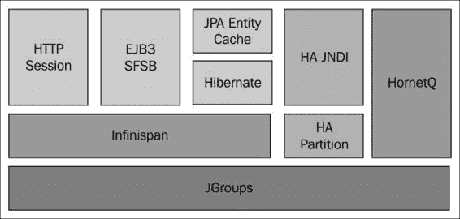
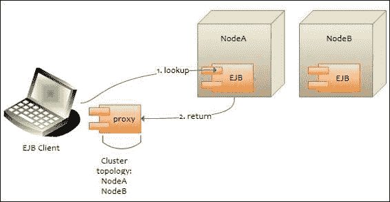
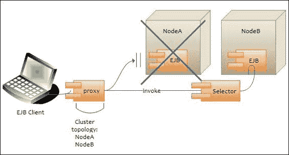
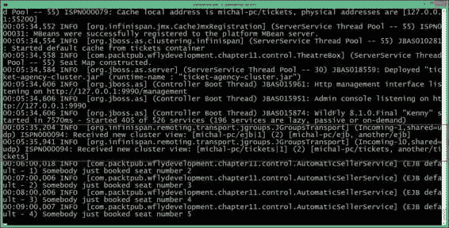
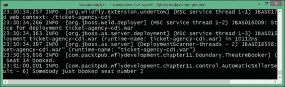
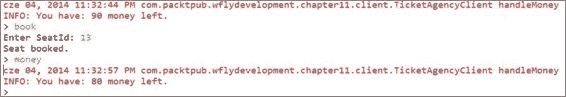
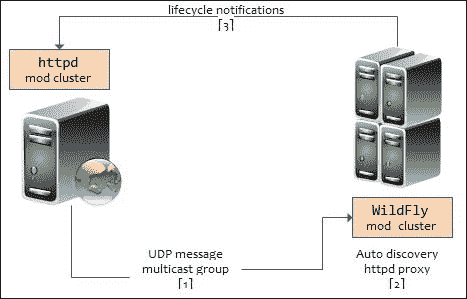
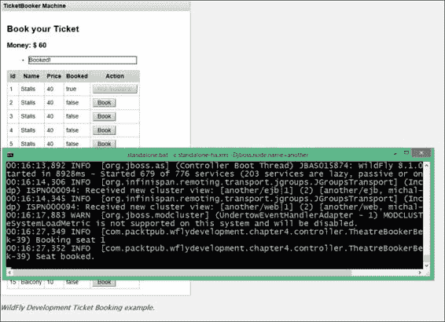
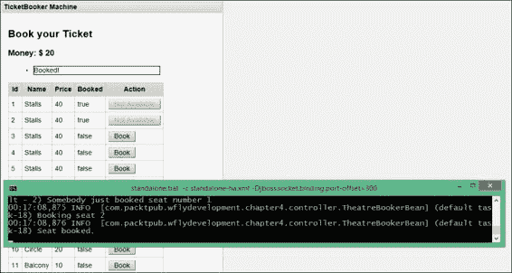

# 第十一章。WildFly 应用程序集群

在前面的章节中，我们探讨了开发 Java 企业应用程序最有趣的方面。一旦您准备好推出您的应用程序，确保您的客户获得响应迅速且容错的环境是非常重要的。这一需求可以通过应用服务器集群来实现。

WildFly 集群不是单一库或规范的产物，而是一系列技术的融合。在本章中，我们将首先介绍一些集群编程的基本知识。然后，我们将快速进入集群配置及其设置，这是部署一些集群应用程序所必需的。

以下列表是本章将要涵盖的主题预览：

+   集群是什么以及 WildFly 如何实现它

+   在独立和域模式下设置集群

+   开发集群 Java EE 7 应用以实现负载均衡和高可用性

# 集群基础知识

应用服务器集群由多个同时运行并协同工作以提供增强的可扩展性和可靠性的服务器实例（集群节点）组成。构成集群的节点可以位于同一台机器或不同的机器上。从客户端的角度来看，这并不重要，因为集群看起来就像一个单独的服务器实例。

在您的应用程序中引入集群将产生以下好处：

+   **水平扩展（向外扩展）**：向集群中添加一个新节点应该允许整个系统服务比简单基本配置提供的更高的客户端负载。理想情况下，只需通过添加适当数量的服务器或机器就可以服务任何给定的负载。

+   **负载均衡**：在集群环境中，构成集群的各个节点应该各自处理整体客户端负载的公平份额。这可以通过在多个服务器之间分配客户端请求来实现，这也被称为负载均衡。

+   **高可用性**：当服务器实例失败时，运行在集群中的应用程序可以继续运行。这是通过将应用程序部署在集群的多个节点上实现的，因此如果服务器实例失败，另一个部署了该组件的服务器实例可以继续进行应用程序处理。

# WildFly 集群

WildFly 中自带集群功能。没有处理集群的单一库，而是一组覆盖不同方面的库。

以下图显示了 WildFly 采纳的基本集群架构：



JBoss 集群的骨干是 **JGroups** 库，它通过多播传输在集群成员之间提供通信。

### 注意

**多播**是一种协议，数据同时传输到已加入适当多播组的多个主机。你可以将多播想象成一种广播或电视流，只有调谐到特定频率的接收者才能接收到流。

下一个构建块是**Infinispan**，它通过一个复制和事务性的 JSR-107 兼容缓存来处理应用程序在集群中的一致性。

### 注意

**JSR-107**指定了 Java 对象临时内存缓存的 API 和语义，包括对象创建、共享访问、排队、失效和跨 JVM 的一致性。

在深入探讨一些集群示例之前，我们首先需要描述如何使用两个可用的节点设置一个 WildFly 节点的集群：**独立集群**和**域集群**。如果你不记得**独立**和**域**模式之间的区别，或者核心**域**元素是什么，你可以复习第二章的内容，*在 WildFly 上创建你的第一个 Java EE 应用程序*。

## 启动独立节点集群

独立服务器以单个 JVM 进程启动；因此，我们需要使用`standalone.bat/standalone.sh`命令启动每个服务器，传递所有必需的参数。在以下示例中，我们正在启动两个不同机器上的两个服务器节点集群，分别绑定到 IP 地址`192.168.1.10`和`192.168.1.11`：

```java
./standalone.sh -c standalone-ha.xml -b 192.168.1.10
./standalone.sh -c standalone-ha.xml -b 192.168.1.11

```

`-c`参数指定要使用的服务器配置；默认情况下，应用程序服务器包括两个独立的集群配置：`standalone-ha.xml`和`standalone-full-ha.xml`。后者还包括 Java EE 完整配置的消息子系统和其他元素；因此，它被称为**完整**配置。

另一个参数（`-b`）应该对老版本的 JBoss 用户来说很熟悉，因为它仍然用于指定服务器绑定地址，该地址需要是唯一的，以避免端口冲突。

在这个其他示例中，我们正在同一台机器上启动另一个由两个节点组成的集群，使用一些额外的参数以避免端口冲突：

```java
./standalone.sh -c standalone-ha.xml -Djboss.node.name=node1 
./standalone.sh -c standalone-ha.xml -Djboss.node.name=node2 -Djboss.socket.binding.port-offset=200

```

如你所见，我们不得不指定两个额外的参数：`jboss.node.name`，以便为每个节点分配一个唯一的服务器名称，以及一个套接字绑定端口，它使用`200`的偏移量。例如，第二个节点将响应 HTTP 通道上的端口`8280`而不是端口`8080`。

### 注意

如果你在服务器控制台上没有看到任何关于集群的消息，请不要感到惊讶。集群模块是按需激活的，所以首先你需要部署一个集群感知的应用程序。在几分钟内，我们将向你展示如何做。

## 启动域节点集群

为了配置在服务器节点域上运行的集群，您需要配置域控制器的`domain.xml`主文件。然后，对于集群中的每个 WildFly 主机，您需要提供一个`host.xml`配置文件，该文件描述了单个服务器分布的配置。

### 域控制器配置

`domain.xml`文件位于`JBOSS_HOME/domain/configuration/`。它包括主域配置，该配置由所有服务器实例共享。在`domain.xml`文件中，我们将定义服务器组配置，指定一个与集群兼容的配置文件。默认情况下，WildFly 域附带四个不同的配置文件：

+   `default`：此配置文件支持 Java EE Web Profile 和一些扩展，例如 RESTful Web 服务，或支持**企业 JavaBeans**（**EJB**）3 远程调用

+   `full`：此配置文件支持默认配置文件中包含的所有默认子系统以及消息子系统

+   `ha`：此配置文件对应于扩展了集群功能的`default`配置文件

+   `full-ha`：这是具有集群功能的`full`配置文件

因此，首先在您的`domain.xml`文件中为您的服务器组指定一个集群感知配置文件。在我们的示例中，我们为服务器组采用了`full-ha`配置文件，这样您就可以在所有域服务器上运行完整的 Java EE 堆栈：

```java
<server-groups>
 <server-group name="main-server-group" profile="full-ha">
<jvm name="default">
<heap size="64m" max-size="512m"/>
</jvm>
<socket-binding-group ref="full-ha-sockets"/>
</server-group>
<server-group name="other-server-group" profile="full-ha">
<jvm name="default">
<heap size="64m" max-size="512m"/>
</jvm>
<socket-binding-group ref="full-sockets"/>
</server-group>
</server-groups>
```

当使用`full-ha`配置文件时，您需要配置 HornetQ 集群安全性。您可以简单地禁用它，或者您还需要为 JMS 集群设置一个完全随机的用户凭据。在`domain.xml`中找到配置设置，并将以下代码添加到消息子系统：

```java
<subsystem >
    <hornetq-server>
 <cluster-user>randomUser</cluster-user>
 <cluster-password>randomPassword</cluster-password>
           . . . 
    </hornetq-server>
</subsystem>
```

除了`domain.xml`文件外，您还需要检查您的域控制器的`host.xml`文件是否包含对本地主机的引用，如下面的代码片段所示：

```java
<host name="master" >
    ...
    <domain-controller>
 <local/>
    </domain-controller>
    ...
</host>
```

`local`部分表示该主机控制器将扮演域控制器的角色。对于所有其他主机控制器，您必须指定远程域控制器的主机和端口（在本例中，我们添加了一些变量作为占位符）。我们将在下一节中介绍它们。

最后，您需要创建一个管理用户，该用户将用于在从节点和域控制器之间建立连接。为此，启动位于您分发`JBOSS_HOME/bin`目录中的`add-user.sh/add-user.cmd`脚本：

```java
What type of user do you wish to add?
 a) Management User (mgmt-users.properties)
 b) Application User (application-users.properties)
(a): a

Enter the details of the new user to add.
Using realm 'ManagementRealm' as discovered from the existing property files.
Username : admin1234
Password recommendations are listed below. To modify these restrictions edit the add-user.properties configuration file.
 - The password should not be one of the following restricted values {root, admin, administrator}
 - The password should contain at least 8 characters, 1 alphabetic character(s), 1 digit(s), 1 non-alphanumeric symbol(s)
 - The password should be different from the username
Password :
Re-enter Password :
What groups do you want this user to belong to? (Please enter a comma separated list, or leave blank for none)[  ]:
About to add user 'admin1234' for realm 'ManagementRealm'
Is this correct yes/no? yes
Added user 'admin1234' to file 'D:\Dev\Servers\wildfly-8.1.0.Final\standalone\configuration\mgmt-users.properties'
Added user 'admin1234' to file 'D:\Dev\Servers\wildfly-8.1.0.Final\domain\configuration\mgmt-users.properties'
Added user 'admin1234' with groups  to file 'D:\Dev\Servers\wildfly-8.1.0.Final\standalone\configuration\mgmt-groups.properties'
Added user 'admin1234' with groups  to file 'D:\Dev\Servers\wildfly-8.1.0.Final\domain\configuration\mgmt-groups.properties'
Is this new user going to be used for one AS process to connect to another AS process?
e.g. for a slave host controller connecting to the master or for a Remoting connection for server to server EJB calls.
yes/no? yes
To represent the user add the following to the server-identities definition <secret value="c2xvZHppYWsxMjM0" />
Press any key to continue . . .

```

如前所述，您必须通过指定用户名和密码来创建一个管理用户。您应该用`yes`或`y`回答前面的问题，以表示该用户将用于从主机控制器连接到域控制器。生成的密钥值是新创建用户的 Base64 编码密码。

现在，我们可以通过指定用于公共和管理接口的地址（在我们的示例中为`192.168.1.10`）来启动域控制器，以下命令：

```java
domain.sh –host-config=host-master.xml -b 192.168.1.10 -Djboss.bind.address.management=192.168.1.10

```

我们已将物理网络的绑定地址设置为具有`jboss.bind.address.management`属性的宿主配置。管理接口必须对所有域中的主机可访问，以便与域控制器建立连接。

### 主机配置

在配置并启动域控制器之后，下一步是设置将连接到域控制器的其他主机。在每个主机上，我们还需要安装 WildFly，我们将配置`host.xml`文件。（作为替代，您可以根据需要命名主机文件，并通过`-host-config`参数启动域，例如，`./domain.sh -host-config=host-slave.xml`。）

首先是为我们域中的每个主机选择一个唯一名称，以避免名称冲突。否则，默认为服务器的主机名。

```java
<host name="server1" >
    ...
</host>
```

此外，您还必须为另一个主机选择一个唯一名称：

```java
<host name="server2" >
    ...
</host>
```

接下来，我们需要指定主机控制器将连接到远程域控制器。我们不会指定域控制器的实际 IP 地址，而是将其留为名为`jboss.domain.master.address`的属性。

此外，我们还需要指定用于连接域控制器的用户名。因此，让我们添加在域控制器机器上创建的用户`admin1234`：

```java
<domain-controller>
       <remote host="${jboss.domain.master.address}"      port="${jboss.domain.master.port:9999}"
 username="admin1234" 
       security-realm="ManagementRealm"/>
</domain-controller>
```

最后，我们需要指定包含在`remote`元素中的服务器身份的 Base64 密码：

```java
<management>
   <security-realms>
      <security-realm name="ManagementRealm">
         <server-identities>
            <secret value="QWxlc3NhbmRybzIh" />
         </server-identities>
         <authentication>
            <properties path="mgmt-users.properties" relative-to="jboss.domain.config.dir" />
         </authentication>
      </security-realm>
      <security-realm name="ApplicationRealm">
         <authentication>
            <properties path="application-users.properties" relative-to="jboss.domain.config.dir" />
         </authentication>
      </security-realm>
   </security-realms>
   <management-interfaces>
      <native-interface security-realm="ManagementRealm">
         <socket interface="management" port="${jboss.management.native.port:9999}" />
      </native-interface>
   </management-interfaces>
</management>
```

最后一步是在两个主机上的`host.xml`文件中配置服务器节点。因此，在第一个主机上，我们将配置`server-one`和`server-two`以将它们添加到`main-server-group`：

```java
<servers>
        <server name="server-one" group="main-server-group"/>
        <server name="server-two" group="main-server-group" auto-start="false"> 
            <socket-bindings port-offset="150"/>
        </server>
</servers>
```

在第二个主机上，我们将配置`server-three`和`server-four`以将它们添加到`other-server-group`：

```java
<servers>
     <server name="server-three" group="other-server-group"/>
     <server name="server-four" group="other-server-group"> auto-start="false">
            <socket-bindings port-offset="150"/>
     </server>
</servers>
```

请注意，`auto-start`标志的值表示如果主机控制器启动，服务器实例将不会自动启动。

对于`server-two`和`server-four`，已配置`port-offset`值为`150`以避免端口冲突。好吧，现在我们已经完成了我们的配置。假设第一个主机的 IP 地址为`192.168.1.10`，我们可以使用以下代码片段启动第一个主机：

```java
domain.sh \
-host-conifg=host.xml
-b 192.168.1.10  \
-Djboss.domain.master.address=192.168.1.1 \
-Djboss.bind.address.management=192.168.1.10
```

第二个主机（`192.168.1.11`）可以使用以下代码片段启动：

```java
domain.sh \
-host-conifg=host.xml
-b 192.168.1.11 \
-Djboss.domain.master.address=192.168.1.1 \
-Djboss.bind.address.management=192.168.1.11 
```

# 部署集群应用程序

如果您尝试启动您的独立或域集的集群节点，您可能会惊讶地发现您的服务器日志中完全没有关于集群的信息。相信我，这不是一个错误，而是一个特性！WildFly 的一个关键特性是只启动最小的一组服务；因此，为了看到集群的实时演示，您需要部署一个集群感知的应用程序。为了在您的应用程序中触发集群库，您可以遵循两种方法：

+   如果您的应用程序使用企业 JavaBeans，您不需要做任何事情。这个区域带来了 WildFly 的一些重要变化。现在，默认情况下，所有状态会话 Bean 的数据都在 HA 配置文件中进行复制，所有无状态 Bean 都是集群化的。如果您的应用程序部署在以`standalone-ha.xml`配置启动的容器上，所有远程**无状态会话 Bean**（**SLSB**）默认支持故障转移功能。

+   如果您的应用程序包含一个 Web 应用程序存档，您可以在`web.xml`文件中使用可移植的`<distributable />`元素。

让我们来看看两种方法，从集群 EJB 开始。

## 创建高可用性（HA）状态会话 Bean

集群**状态会话 Bean**（**SFSB**）具有内置的故障转移能力。这意味着`@Stateful` EJB 的状态在集群节点之间进行复制，以便如果集群中的某个节点发生故障，其他节点将能够接管指向它的调用。可以通过使用`@Stateful(passivationCapable=false)`注解来为特定 Bean 禁用此功能。

以下图展示了 EJB 客户端应用程序和远程 EJB 组件之间典型的信息交换：



如您所见，通过**Java 命名和目录接口**（**JNDI**）成功查找 SFSB 后，会返回一个代理给客户端用于后续的方法调用。

### 注意

由于 EJB 是集群化的，它将返回一个会话 ID，以及与它一起的会话的*亲和力*，即状态会话 Bean 在服务器端所属的集群名称。这种亲和力将有助于 EJB 客户端将代理上的调用适当地路由到集群中的特定节点。

在此会话创建请求进行的同时，**NodeA**也会发送一个包含集群拓扑结构的异步消息。JBoss **EJB 客户端**实现将注意这个拓扑信息，并在以后使用它来创建与集群内节点的连接，并在必要时将调用路由到这些节点。

现在让我们假设**NodeA**发生故障，客户端应用程序随后在代理上调用。在这个阶段，**JBoss EJB 客户端**实现将了解集群拓扑；因此，它知道集群有两个节点：**NodeA**和**NodeB**。现在当调用到达时，它检测到**NodeA**已关闭，因此它使用选择器从集群节点中获取一个合适的节点。此交换在以下图中显示：



如果找到合适的节点，**JBoss EJB 客户端**实现将创建到该节点的连接（在我们的案例中是**NodeB**），并从中创建一个 EJB 接收器。在此过程结束时，调用现在已被有效地故障转移到集群内的另一个节点。

### 集群票务示例

在第三章，*介绍 Java EE 7 – EJBs*中，我们讨论了我们的票务系统示例，该示例围绕以下内容构建：

+   用于存储会话数据的具有状态的 EJB

+   用于存储数据缓存的单例 EJB

+   用于执行一些业务方法的无状态 EJB

让我们看看如何应用必要的更改以在集群上下文中启动我们的应用程序。

无状态和有状态的 Bean 已准备好进行集群化——不需要额外的代码；然而，存在一个陷阱。实际上，用于存储座位缓存的单例 EJB 将在集群中的每个 JVM 中实例化一次。这意味着如果服务器发生故障，缓存中的数据将会丢失，并且将使用新的数据（不一致的数据）。

在集群环境中设置缓存有几种替代方案：

+   使用 JBoss 专有解决方案，该解决方案部署了`SingletonService`的集群版本，该版本公开了`org.jboss.msc.service.Service`的 HA 单例（此方法的示例包含在 WildFly 快速入门演示中，[`github.com/wildfly/quickstart/tree/master/cluster-ha-singleton`](https://github.com/wildfly/quickstart/tree/master/cluster-ha-singleton)）

+   将您的缓存移动到持久存储，这意味着使用 JPA 从缓存中存储和读取数据（参见第五章
public class TheatreBox {

    private static final Logger logger =
            Logger.getLogger(TheatreBox.class);
private Map<Integer, Seat> seats;

 @Resource(lookup = "java:jboss/infinispan/tickets")
 private EmbeddedCacheManager container;

    @PostConstruct
    public void setupTheatre() {
        try {
            this.cache = container.getCache();
            logger.info("Got Infinispan cache");

            int id = 0;
            for (int i = 0; i < 5; i++) {
                addSeat(new Seat(++id, "Stalls", 40));
                addSeat(new Seat(++id, "Circle", 20));
                addSeat(new Seat(++id, "Balcony", 10));
            }
            logger.info("Seat Map constructed.");
        } catch (Exception e) {
            logger.info("Error! " + e.getMessage());
        }
    }

    private void addSeat(Seat seat) {
        seats.put(seat.getId(), seat);
    }

    @Lock(READ)
    public Collection<Seat> getSeats() {
        return Collections.unmodifiableCollection(seats.values());
    }

    @Lock(READ)
    public int getSeatPrice(int seatId) throws NoSuchSeatException {
        return getSeat(seatId).getPrice();
    }

    @Lock(WRITE)
    public void buyTicket(int seatId) throws SeatBookedException, NoSuchSeatException {
        final Seat seat = getSeat(seatId);
        if (seat.isBooked()) {
            throw new SeatBookedException("Seat " + seatId + " already booked!");
        }
        addSeat(seat.getBookedSeat());
    }

    @Lock(READ)
    private Seat getSeat(int seatId) throws NoSuchSeatException {
        final Seat seat = cache.get(seatId);
        if (seat == null) {
            throw new NoSuchSeatException("Seat " + seatId + " does not exist!");
        }
        return seat;
    }
}
```

我们首先想强调的是`@Resource`注解，它注入一个`EmbeddedCacheManager`实例。当 WildFly 部署器遇到这个注解时，您的应用程序将包含对请求的缓存容器的依赖。因此，缓存容器将在部署期间自动启动，并在您的应用程序卸载期间停止（包括所有缓存）。

随后，当 EJB 被实例化时（请参阅标记为`@PostConstruct`的`start`方法），使用`EmbeddedCacheManager`作为工厂创建`org.infinispan.Cache`。这个缓存将用于存储我们高度可用的数据集。

对分布式缓存执行的操作相当直观：`put`方法用于将`Seat`对象的实例存储在缓存中，相应的`get`方法用于从中检索元素，这正是您使用普通 hashmap 所做的事情。唯一的区别是，在我们的集群缓存中，每个条目都必须是可序列化的。请确保将`Seat`标记为`Serializable`并为它创建一个默认构造函数。

在应用部署方面，您需要明确声明对 Infinispan API 的依赖，因为在 WildFly 的类加载策略中，它并未作为隐式依赖项包含。这可以通过将以下行添加到您的应用程序的`META-INF/MANIFEST.MF`文件中来实现：

```java
Dependencies: org.infinispan export 
```

我们还需要将新的缓存容器添加到我们的`domain.xml`文件中适当的配置文件（在 Infinispan 子系统内）：

```java
<cache-container name="tickets" default-cache="default" jndi-name="java:jboss/infinispan/tickets" module="deployment.ticket-agency-cluster.jar">
<transport lock-timeout="60000"/>
<replicated-cache name="default" batching="true" mode="SYNC">
<locking isolation="REPEATABLE_READ"/>
</replicated-cache>
</cache-container>
```

### 注意

在我们的示例中，我们使用`seats.values()`调用从我们的分布式映射（实际上是`org.infinispan.Cache`的一个实例）中获取所有元素。这种操作在分布式缓存（非复制）中通常是不推荐的，并且有其自身的限制。有关此方法的更多信息，请查看[`docs.jboss.org/infinispan/6.0/apidocs/org/infinispan/Cache.html#values()`](https://docs.jboss.org/infinispan/6.0/apidocs/org/infinispan/Cache.html#values())的 Javadoc。然而，对于 Infinispan 的最新版本来说，情况已经不再是这样了：[`infinispan.org/infinispan-7.0/`](http://infinispan.org/infinispan-7.0/)。

### 编写集群感知的远程客户端

远程 EJB 客户端不需要进行任何特定的更改，以便能够实现高可用性。

我们只需要准备一个`jboss-ejb-client.properties`文件，该文件将包含我们的客户端应用程序最初将通过远程通信联系到的服务器列表：

```java
remote.connectionprovider.create.options.org.xnio.Options.SSL_ENABLED=false
remote.connections=node1,node2
remote.connection.node1.host=localhost
remote.connection.node1.port = 8080
remote.connection.node1.connect.options.org.xnio.Options.SASL_POLICY_NOANONYMOUS=false
remote.connection.node2.host=localhost
remote.connection.node2.port = 8280
remote.connection.node2.connect.options.org.xnio.Options.SASL_POLICY_NOANONYMOUS=false
```

如您从本文件中可以看到，我们假设您正在使用`localhost`地址运行一个双节点集群：第一个节点使用默认端口设置，第二个节点使用偏移量`200`（正如在“启动独立节点集群”部分的第二段中所示）。

如果您的服务器节点和客户端在不同的机器上运行，请将`remote.connection.nodeX.host`变量的值替换为实际的 IP 或主机。

### 部署和测试高可用性

将应用程序部署到集群可以通过几种方式实现；如果您更喜欢自动化而不是手动将每个存档复制到 `deployments` 文件夹，您可以重用前一章中包含的 CLI 部署脚本。

或者，如果您正在使用 WildFly Maven 插件进行部署，您可以参数化其配置，包括主机名和端口号作为变量，这些变量将被传递到命令行：

```java
<plugin>
      <groupId>org.wildfly.plugins</groupId>
      <artifactId>wildfly-maven-plugin</artifactId>
      <version>1.0.2.Final</version>
      <configuration>
          <filename>${project.build.finalName}.jar</filename>
 <hostname>${hostname}</hostname>
 <port>${port}</port> 
      </configuration>
</plugin>
```

因此，您将使用以下 shell 编译包并在第一个节点上部署应用程序：

```java
mvn install wildfly:deploy –Dhostname=localhost –Dport=9999

```

对于第二个节点，您将使用以下内容：

```java
mvn install wildfly:deploy –Dhostname=localhost –Dport=10194

```

### 注意

在域节点上部署应用程序与前面示例中提到的相同，除了您需要将 `domain` 标签添加到您的配置中，并且需要指定至少一个服务器组。有关更多信息，请访问 [`docs.jboss.org/wildfly/plugins/maven/latest/examples/deployment-example.html`](https://docs.jboss.org/wildfly/plugins/maven/latest/examples/deployment-example.html)。

一旦您在服务器节点上部署了这两个应用程序，您应该能够在服务器控制台日志中看到集群视图，并且可以看到 Infinispan 缓存已启动并已发现集群中的其他节点。您应该在其中一个节点上看到以下类似内容：



在您启动应用程序之前，更新 Maven 的 `exec` 插件信息，现在它应该引用以下代码片段中突出显示部分所示我们的远程 EJB 客户端应用程序。

```java
<plugin>
   <groupId>org.codehaus.mojo</groupId>
   <artifactId>exec-maven-plugin</artifactId>
   <version>${version.exec.plugin}</version>
   <executions>
     <execution>
         <goals>
            <goal>exec</goal>
         </goals>
     </execution>
   </executions>
   <configuration>
     <executable>java</executable>
     <workingDirectory>${project.build.directory}/exec-working-directory</workingDirectory>
     <arguments>
       <argument>-classpath</argument>
       <classpath>
       </classpath>
 <argument>com.packtpub.wflydevelopment.chapter11.client.TicketAgencyClient</argument>
     </arguments>
   </configuration>
</plugin>
```

您可以使用以下命令运行它：

```java
mvn exec:exec

```

客户端的第一部分将显示我们已经成功完成第一笔交易的证据。在客户端控制台，您将看到预订交易的返回值和 `Seat` 列表，如下面的屏幕截图所示：


以下屏幕截图显示了我们的 EJB 客户端到达的服务器节点：



现在关闭前面的服务器节点（如果您以前台进程启动，则按 *Ctrl* + *C* 即可）并在客户端应用程序上按 *Enter*（或在 Mac 上按 *Return*）。

如您从以下屏幕截图中所见，您应该看到会话在幸存节点上继续运行并正确显示会话值（剩余金额）。您的客户端窗口也应显示更新的缓存信息。



# Web 应用程序集群

Web 应用集群涉及两个方面：设置 HTTP 负载均衡器和告诉 WildFly 使应用程序的用户会话具有高可用性。如何做前者取决于你选择的负载均衡器（我们建议选择`mod_cluster`——它是预配置的，并且与 WildFly 无缝集成）；后者非常简单——只需将`<distributable/>`标签添加到你的应用程序的`web.xml`文件中。每当一个节点失败时，用户的 HTTP 会话将由另一个节点处理。如果一切顺利，最终用户将不知道发生了故障——所有的事情都会在幕后处理。

让我们具体看看如何执行这两个步骤。

## 负载均衡您的 Web 应用

你有几种选择可以实现 HTTP 请求的负载均衡。你可以选择一个硬件负载均衡器，它位于你的服务器集群之前，或者你可以从许多可用的 WildFly 软件解决方案中选择，包括以下内容：

+   使用 Apache Tomcat 的`mod_jk`模块将你的请求路由到你的节点

+   使用 Apache `mod_proxy`配置 Apache 作为代理服务器并将请求转发到 WildFly 节点

+   使用 WildFly 的内置解决方案`mod_cluster`来实现请求的动态负载均衡

在这里，我们将说明如何开始使用`mod_cluster`——Apache HTTP 服务器的模块。使用`mod_cluster`相对于其他选项的优势可以总结如下要点：

+   动态集群配置

+   服务器端可插拔负载度量

+   应用程序状态的生命周期通知

实际上，当使用标准负载均衡器如`mod_jk`时，你必须提供一个静态节点列表，该列表用于分配负载。这是一个非常限制性的因素，特别是如果你需要通过添加或删除节点来升级你的配置；或者，你可能只需要升级单个节点使用的软件。除此之外，使用平面集群配置可能会很繁琐，并且容易出错，尤其是当集群节点数量很多时。

当使用`mod_cluster`时，你可以动态地向你的集群中添加或删除节点，因为集群节点是通过广告机制发现的。

实际上，HTTP 侧的`mod_cluster`库在多播组上发送 UDP 消息，该组由 WildFly 节点订阅。这允许当发送应用程序生命周期通知时，WildFly 节点自动发现 HTTP 代理。

下一个图表更好地说明了这个概念：



### 安装 mod_cluster

`mod_cluster`模块作为 WildFly 的核心模块实现，它是分发的一部分。在 HTTP 方面，它作为一组安装在 Apache Web 服务器上的库提供。

在 WildFly 方面，您可以在集群配置文件中找到已捆绑的`mod_cluster`模块的子系统。您可以在`standalone-ha.xml`文件或`standalone-full-ha.xml`（当然在`domain.xml`文件）配置文件中找到它：

```java
<subsystem >
  <mod-cluster-config advertise-socket="modcluster" connector="ajp">
   <dynamic-load-provider>
       <load-metric type="cpu"/>
   </dynamic-load-provider>
  </mod-cluster-config>
</subsystem>
```

子系统仅包含一个裸骨配置，通过`advertise-socket`元素引用其套接字绑定：

```java
<socket-binding name="modcluster" port="0" multicast-address="224.0.1.105" multicast-port="23364"/>
```

在 Apache 网络服务器方面，我们必须安装用于与`mod_cluster`交互的核心库。这是一个非常简单的步骤；只需将浏览器指向最新的`mod_cluster`发布版，在[`www.jboss.org/mod_cluster/downloads`](http://www.jboss.org/mod_cluster/downloads)。请确保选择适合您的操作系统和架构（x86 或 x64）的版本。

一旦下载了二进制文件，将存档提取到一个文件夹中；然后，导航到提取的文件夹。`mod_cluster`的二进制文件基本上是一个捆绑了所有必需库的 Apache 网络服务器。为了预配置您的安装，请确保运行`\httpd-2.2\bin\installconf.bat`文件。

### 注意

您可以使用自己的 Apache web 服务器 2.2 安装；只需从`mod_cluster`捆绑中提取模块并将它们复制到您的 Apache 网络服务器的`modules`文件夹中。

如果您选择使用自己的 Apache 网络服务器而不是捆绑的版本，您必须将以下库加载到您的`httpd.conf`文件中（与捆绑的 Apache HTTP 使用相同的集合）：

```java
LoadModule proxy_module modules/mod_proxy.so
LoadModule proxy_ajp_module modules/mod_proxy_ajp.so
LoadModule proxy_http_module modules/mod_proxy_http.so
LoadModule proxy_cluster_module modules/mod_proxy_cluster.so
LoadModule manager_module modules/mod_manager.so
LoadModule slotmem_module modules/mod_slotmem.so
LoadModule advertise_module modules/mod_advertise.so
```

这些模块中的每一个都涵盖了负载均衡的重要方面，如下所示：

+   `mod_proxy`、`mod_proxy_http`和`mod_proxy_ajp`：这些是核心模块，它们使用 HTTP/HTTPS 或 AJP 协议将请求转发到集群节点

+   `mod_manager`：此模块从 AS 7 读取信息，并与`mod_slotmem`一起更新共享内存信息

+   `mod_proxy_cluster`：此模块包含`mod_proxy`的均衡器

+   `mod_advertise`：这是一个附加模块，允许 HTTP 通过多播数据包（IP 和端口）进行广告，其中`mod_cluster`模块正在监听

我们需要添加的配置的下一部分是核心负载均衡配置：

```java
Listen 192.168.10.1:8888

<VirtualHost 192.168.10.1:8888>
<Location />
    Order deny,allow
    Deny from all
    Allow from 192.168.10.
</Location>
  KeepAliveTimeout 60
  MaxKeepAliveRequests 0
  ManagerBalancerName mycluster
  ServerAdvertise On
</VirtualHost>
```

基本上，您必须将`192.168.10.1` IP 地址替换为您 Apache 网络服务器监听请求的地址，将`8888`端口号替换为您想要与 WildFly 通信的端口号。

就目前而言，Apache 虚拟主机允许您从子网络`192.168.10`接收传入请求。

`KeepAliveTimeout`指令允许您在 60 秒内重用相同的连接。由于我们将`MaxKeepAliveRequests`设置为`0`，因此每个连接的请求数量是无限制的。`ManagerBalancerName`指令提供了您集群的均衡器名称（默认为`mycluster`）。

对我们来说最重要的是设置为 `On` 的 `ServerAdvertise` 指令，它使用广告机制来告诉 WildFly 它应该将集群信息发送给谁。

默认情况下，此选项在捆绑的服务器中已禁用。请确保在 `httpd.conf` 文件中取消注释 `ServerAdvertise` 指令。

现在，重新启动 Apache Web 服务器和单个应用程序服务器节点。如果您已正确配置 HTTP 侧的模式集群，您将看到每个 WildFly 节点将开始从 `mod_cluster` 接收 UDP 多播消息。

### 注意

如果您正在 Windows 机器上运行，请确保以管理员身份运行您的 Web 服务器。

如果一切顺利，您可以通过访问 `http://127.0.0.1:6666/mod_cluster_manager` 来查看您的负载均衡器和互联节点的情况。请确保不要使用 Google Chrome，因为它将 `6666` 端口视为不安全（默认情况下，它是一个 IRC 端口）。您应该在简单的网页上看到以下信息：

```java
mod_cluster/1.2.6.Final
Auto Refresh show DUMP output show INFO output 
Node michal-pc (ajp://localhost:8009): 
Enable Contexts Disable ContextsBalancer: mycluster,LBGroup: ,Flushpackets: Off,Flushwait: 10000,Ping: 10000000,Smax: 65,Ttl: 60000000,Status: OK,Elected: 0,Read: 0,Transferred: 0,Connected: 0,Load: 100

```

**如果您现在没有运行的 WildFly 实例**，请确保使用其中一个全高可用性配置文件启动它。在服务器启动后，刷新 Apache 的配置网页。

### 集群化您的 Web 应用程序

集群化 Web 应用程序需要开发者投入最少的努力。正如我们刚才讨论的，要在 Web 应用程序中启用集群，您只需将以下指令添加到 `web.xml` 描述符中：

```java
<web-app>
 <distributable/>
</web-app>
```

一旦您的应用程序包含可分发的配置段落，集群将启动，并且只要您正确设计了会话层，它也将是负载均衡和容错的。

您可以通过将浏览器指向您的 HTTP 代理来检查它。对于默认设置，它将是 `http://localhost:6666/your_web_application/`。

#### 实现高可用性的编程注意事项

为了支持 HTTP 会话状态的内存复制，所有 servlet 和 JSP 会话数据都必须是可序列化的。

### 注意

**序列化**是将对象转换为一系列字节的过程，以便对象可以轻松地保存到持久存储或通过通信链路传输。然后，该字节流可以被反序列化，将流转换为原始对象的副本。

此外，在实现 `javax.servlet.http.HttpSession` 的 HTTP servlet 中，您需要使用 `setAttribute` 方法来更改会话对象中的属性。如果您使用 `setAttribute` 在会话对象中设置属性，则默认情况下，对象及其属性将使用 Infinispan API 进行复制。每次对会话中的对象进行更改时，都应该调用 `setAttribute` 来更新集群中的该对象。

同样，您需要使用 `removeAttribute` 来从会话对象中删除属性。

#### 在 JSF 应用程序中实现高可用性（HA）

在本书包含的应用程序中，我们使用了 JSF 和 CDI API 来管理 Web 会话。在这种情况下，我们透明地将其他服务器节点复制到标记为`@SessionScoped`的 Bean。

### 注意

如果您正在处理由 SFSB 创建的 HTTP 和 EJB 会话，则对基于 JSF 的应用程序进行集群需要特别注意。在早期的以 servlet 为中心的框架中，通常的方法是将状态会话 Bean 的引用存储在`javax.servlet.http.HttpSession`中。当处理高级 JSF 和 CDI Bean 时，向您的应用程序提供一个`@SessionScoped`控制器至关重要，该控制器被注入到 SFSB 引用中；否则，您将在每次请求时创建一个新的状态会话 Bean。

以下是如何将您的 Ticket CDI 应用程序（在第四章中描述，*学习上下文和依赖注入*）适配到集群环境的一个示例。起初，正如我们所说的，我们需要在您的`web.xml`文件中包含可分发段以触发集群模块：

```java
<web-app>
    <distributable/>
</web-app>
```

接下来，将我们在*将您的缓存转换为分布式缓存*部分中描述的相同更改应用到`TheatreBox`单例：

```java
@Singleton
@Startup
public class TheatreBox {

 @Resource(lookup="java:jboss/infinispan/container/cluster")
 private CacheContainer container;

    // Apply the same changes described in
    // "Turning your Cache into a distributed cache section
}
```

由于我们的控制器组件绑定到`@SessionScoped`状态，您不需要进行任何更改即可在服务器节点之间传播您的会话：

```java
@Named
@SessionScoped
public class TheatreBooker implements Serializable {
}
```

最后，请记住在您的`META-INF/MANIFEST.MF`中包含 Infinispan 依赖项：

```java
Dependencies: org.infinispan export
```

一旦您的应用程序部署在集群的节点上，您可以通过访问 Apache web 服务器（在我们的示例中为`http://localhost:6666/ticket-agency-cluster`）来测试它并开始预订票务：



由于`mod_cluster`子系统默认配置为使用**粘性 Web 会话**，因此来自同一客户端的所有后续请求都将被重定向到同一服务器节点。因此，通过关闭粘性服务器节点，你可以获得已创建新的集群视图的证据，并且可以在其他服务器节点上继续购物。



# 摘要

本章全部关于集群应用程序的世界。在这里，我们向您介绍了 WildFly 的强大集群功能，并将其应用于本书中讨论的一些示例。

与集群相关的主题数量可能需要扩展以涵盖一本完整的书籍；然而，我们决定只强调一些功能。特别是，我们学习了如何集群 EJB 并实现服务器拓扑变化时的容错。

接下来，我们讨论了集群 Web 应用程序以及与负载均衡解决方案（如 Apache web 服务器和`mod_cluster`）的集成。

在下一章中，我们将关注 Java EE 7 中添加的一些与长期任务执行相关的新主题：批处理和并发实用工具的使用。
